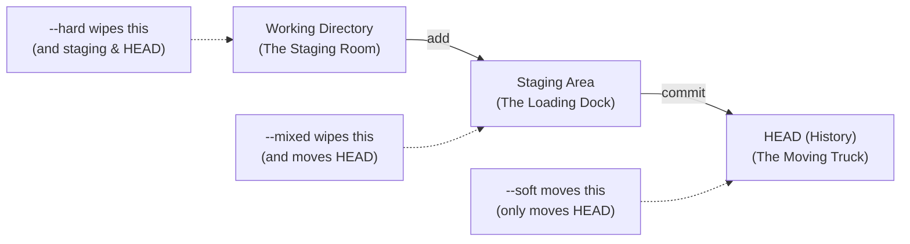
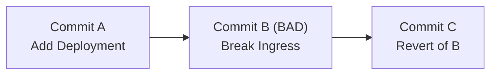
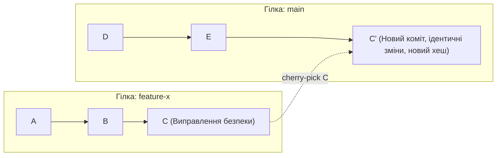

> **Складність**: [СЕРЕДНЯ]
>
> **Час на проходження**: 60 хвилин
>
> **Попередні вимоги**: Модуль 3 курсу Git Deep Dive

---

## Що ви зможете зробити

- **Застосувати** команду `git reset` з прапорцями `--soft`, `--mixed` та `--hard` для цілеспрямованого маніпулювання робочою директорією, зоною підготовки (staging area) та історією комітів з метою виправлення архітектурних помилок.
- **Діагностувати** та **відновити** репозиторій після катастрофічних помилок у Git, включно з невдалим rebase та випадковими жорсткими скиданнями, використовуючи `git reflog` для відстеження та відновлення загублених комітів.
- **Оцінити**, коли доцільно використовувати `git revert`, а коли `git reset`, з огляду на правила захисту гілок, вимоги щодо спільної роботи та необхідність збереження незмінного журналу аудиту.
- **Виконати** ювелірні операції відновлення на рівні файлів за допомогою `git restore` та `git checkout`, щоб повернути конкретний стан файлів із попередніх комітів, не порушуючи при цьому загальну історію гілки.
- **Перенести** окремі коміти між гілками за допомогою `git cherry-pick`, щоб вирішити проблеми розбіжностей у функціональних гілках та зробити бекпорт критичних виправлень безпеки.


## Чому це важливо

5 квітня 2022 року, починаючи з 7:38 за UTC, скрипт обслуговування Atlassian запустив алгоритм "delete site" для 775 клієнтських сайтів, які мали б залишитися недоторканими. Резервні копії були. Відновлення все одно зайняло до 14 днів для сайтів, що постраждали найбільше. Розрив між тим, що можна відновити, і тим, що було відновлено, був оплачений людино-годинами, втраченою довірою та операційним відставанням — резервна копія не є тим самим, що й відновлений сервіс. Версія цього розриву в персональному масштабі криється в терміналі кожного інженера: точне розуміння того, які команди Git скасовують помилку, які переміщують вказівник, який можна повернути назад, а які непомітно знищують роботу, якої ще ніколи не бачив жоден віддалений сервер. Модель відновлення Git — це те, що закриває цей розрив на власному ноутбуці інженера.

Цей модуль перетворює скасування в Git із забобонів на інженерний розрахунок. Ви дізнаєтеся, чому `reset`, `restore`, `revert`, `reflog` та `cherry-pick` не є взаємозамінними синонімами для "повернутися назад". Кожна команда редагує іншу частину моделі стану Git, і кожна має свій контракт щодо співпраці. Наприкінці ви зможете подивитися на зламану гілку, вирішити, чи потрібно перемістити вказівник, створити зворотний коміт, відновити один файл чи скопіювати патч між історіями, а потім пояснити це рішення колезі під тиском інциденту.

Перед тим, як перейти до команд, зафіксуємо операційний контекст. Приклади Kubernetes у цьому модулі орієнтовані на Kubernetes 1.35 або новішої версії, і кожен виконуваний приклад оболонки використовує повне ім'я команди `kubectl`, щоб скопійовані команди поводилися однаково в скриптах і терміналах. Сам робочий процес відновлення в Git працює без кластера, але платформені інженери зазвичай відновлюють код, який згодом стане станом кластера, тому цей урок зберігає зв'язок механіки репозиторію з ризиком розгортання.

```bash
kubectl version --client
```

## 1. Три дерева Git та `git reset`

`git reset` лякає, коли до нього ставляться як до єдиної небезпечної команди, але він стає передбачуваним, коли ви бачите три частини стану репозиторію, яких він може торкнутися. Git зберігає ваші поточні файли в робочому каталозі, запропонований наступний знімок у зоні підготовки, а верхівку поточної гілки — в `HEAD`. Ці три області часто називають трьома деревами Git, хоча робочий каталог — це звичайні файли на диску, а зона підготовки — це індекс Git. Команда reset спочатку переміщує `HEAD`, а потім опціонально перезаписує індекс та робочий каталог, щоб вони відповідали цій новій точці в історії.

Уявіть робочий каталог як кімнату, де розкидані деталі, зону підготовки як вантажну платформу, де готові коробки маркуються для відправлення, а `HEAD` — як вантажівку, що вже везе останню прийняту партію. Коли ви виконуєте `git add`, ви не зберігаєте роботу назавжди; ви обираєте, які поточні знімки файлів мають потрапити на вантажну платформу. Коли ви виконуєте `git commit`, Git фіксує підготовлений знімок як довговічний коміт і переміщує вказівник гілки на цей новий об'єкт. Команда reset переміщує ярлик вантажівки назад або вбік, а потім вирішує, чи залишити вантажну платформу і кімнату в спокої, розпакувати їх, чи перезаписати.

1. **Робочий каталог**: Це файлова система, яку ви бачите та редагуєте у своїй IDE або терміналі. Це ваша чернетка. Він відображає поточний стан файлів на вашому диску.
2. **Зона підготовки (Індекс)**: Це вантажна платформа. Ви вибірково переміщуєте сюди файли за допомогою `git add`, щоб підготувати їх до наступного коміту. Це точний знімок того, як виглядатиме наступний коміт.
3. **HEAD (Історія комітів)**: Це постійний запис. Це вказівник на останній коміт у вашій поточній гілці. Він відображає стан вашого репозиторію під час останнього виконання `git commit`.

Важливий урок полягає в тому, що за замовчуванням reset не означає "видалити мою роботу". Це означає "перемістити посилання поточної гілки на інший коміт, а потім узгодити частину локального стану з цією ціллю". Якщо ви знаєте, які шари перезаписуються, ви можете використовувати reset для зміни локальної історії без втрати корисних правок. Якщо ви дієте навмання, та сама команда може стерти незакомічений переписаний маніфест, який Git ще не мав можливості захистити.



`git reset --soft` лише переміщує верхівку гілки. Індекс та робочий каталог залишаються точно такими ж, як і до команди, а це означає, що зміни з комітів, від яких ви відмовилися, все ще знаходяться в зоні підготовки і готові до повторного коміту. Це корисно, коли межа коміту була неправильною, але підготовлений вміст був здебільшого правильним. Ви могли закомітити Deployment і Service разом, а потім зрозуміти, що одна змінна середовища належить до тієї ж логічної зміни, оскільки рецензентам потрібно перевірити розгортання застосунку як єдине ціле.

М'яке скидання — це інструмент редагування історії, а не інструмент редагування файлів. Це аналог у Git фрази: "Я хочу, щоб повідомлення останнього коміту та хеш об'єкта перестали існувати в цій локальній гілці, але я все ще хочу бачити точний запропонований знімок на вантажній платформі". Оскільки індекс залишається заповненим, негайне виконання `git commit` після м'якого скидання відтворює коміт із таким самим станом файлів. Хеш буде відрізнятися через зміну метаданих коміту, але знімок вмісту може бути ідентичним.

```bash
# View current log to see the commit we want to undo
git log --oneline
# 3a2b1c4 (HEAD -> main) Deploy backend services and DB
# 9f8e7d2 Base project setup

# Oops, forgot the DB_PASSWORD env var. 
# Undo the commit, but keep changes in the staging area.
git reset --soft HEAD~1

# Check status. The changes from 3a2b1c4 are sitting in the staging area, exactly as they were.
git status
# On branch main
# Changes to be committed:
#   (use "git restore --staged <file>..." to unstage)
#   new file:   deployment.yaml
#   new file:   service.yaml
```

Зупиніться та подумайте: як ви вважаєте, що станеться, якщо виконати `git commit -m "Same thing"` відразу після `git reset --soft HEAD~1`? Ви відтворите той самий знімок файлів, який щойно вилучили з верхівки гілки, оскільки `--soft` залишає зону підготовки недоторканою. Новий коміт може мати інший хеш, мітку часу автора або повідомлення, але дерево, зафіксоване комітом, буде збігатися, якщо ви не відредагуєте або не підготуєте щось інше заново. Ось чому `--soft` чудово підходить для виправлення повідомлень комітів, додавання одного пропущеного файлу або об'єднання останнього локального коміту з суміжною зміною перед публікацією.

`git reset --mixed` є режимом скидання за замовчуванням, тому `git reset HEAD~1` поводиться як `git reset --mixed HEAD~1`. Він переміщує `HEAD` і перезаписує зону підготовки так, щоб вона відповідала цільовому коміту, але не чіпає файли в робочому каталозі. На практиці вміст із видалених комітів стає непідготовленими локальними змінами. Ви не втратили YAML, скрипти чи документацію; ви лише розпакували їх з індексу, щоб розсортувати їх у кращі коміти.

Змішане скидання — це найбезпечніша щоденна команда для переформатування локальних комітів, оскільки вона дає вам ще один шанс вибрати межі. Припустімо, перевірка вказує на те, що один коміт змінив Deployment, ConfigMap, Ingress та Secret одночасно. Такий коміт важко перевіряти, оскільки кожен файл несе різний операційний ризик. Змішане скидання дозволяє повернути об'єднаний патч назад у робочий каталог, а потім підготувати кожну мету по черзі, щоб рецензенти могли перевірити план розгортання, поверхню конфігурації, правила маршрутизації та обробку секретів окремо.

```bash
# We have a monolithic commit we want to break apart into smaller pieces
git reset HEAD~1

# The files are now modified in your working directory, but they are no longer staged.
git status
# Changes not staged for commit:
#   (use "git add <file>..." to update what will be committed)
#   (use "git restore <file>..." to discard changes in working directory)
#   modified:   deployment.yaml
#   modified:   configmap.yaml
#   modified:   ingress.yaml
#   modified:   secret.yaml

# Now you can add them individually and create clean, atomic commits
git add deployment.yaml
git commit -m "Configure backend deployment"
git add configmap.yaml
git commit -m "Add backend environment configuration"
```

`git reset --hard` переміщує `HEAD`, скидає індекс і перезаписує файли, що відстежуються, в робочому каталозі, щоб вони відповідали цільовому коміту. Він не є злом, але він абсолютний щодо стану файлів, які відстежуються. Якщо єдині зміни, які вас хвилюють, уже десь закомічені, жорстке скидання може стати швидким способом повернутися до відомого чистого стану. Якщо ваша цінна робота не закомічена, жорстке скидання може знищити її, оскільки Git не має об'єкта коміту, який фіксує вміст цих файлів.

Слово "відстежувані" тут має значення. Жорстке скидання перезаписує файли, що відстежуються, про які знає Git, але воно само по собі не видаляє файли, що не відстежуються. Ця відмінність іноді вводить новачків в оману, змушуючи думати, що команда безпечніша, ніж є насправді, оскільки щойно створений невідстежуваний файл може вціліти, тоді як сильно відредагований відстежуваний маніфест буде повністю стертий. Для репозиторію платформи це може означати, що чорнова замітка вціліє, тоді як важливий патч Deployment зникне. Перед використанням `--hard` виконайте `git status --short` і вирішіть, чи кожна відстежувана зміна дійсно не потрібна.

```bash
# WARNING: This will destroy all uncommitted changes in tracked files
git reset --hard HEAD

# Or, discard the last commit AND all working directory changes simultaneously
git reset --hard HEAD~1
```

Гіпотетичний сценарій: молодшого платформеного інженера просять оновити запити на ресурси CPU та пам'яті в десятках маніфестів Kubernetes. Він пише скрипт оболонки, бачить величезний `git status`, стає непевним щодо однієї підстановки і виконує `git reset --hard`, бо думає, що це просто прибере файли з індексу. Команда стирає всі відстежувані редагування файлів, і оскільки ці редагування ніколи не були закомічені, найкращими варіантами відновлення, що залишилися, є локальна історія IDE та буфер термінала. Git може відновити вказівник гілки, який він записав, але не може відродити вміст, який ніколи не зберігав.

Використовуйте reset як свідому операцію зі станом. Запитайте, яке дерево містить роботу, яку ви хочете зберегти, а потім виберіть режим скидання, який залишить це дерево недоторканим. Якщо цінний стан уже закомічено, `--hard` може бути прийнятним. Якщо він підготовлений, `--soft` збереже його. Якщо він знаходиться в робочому каталозі, `--mixed` зазвичай зберігає його доступним для реорганізації. Цей процес ухвалення рішення повільніший за м'язову пам'ять, але він набагато швидший, ніж пояснення команді, чому виправлення для продакшену зникло.


## 2. `git reflog`: Страхувальна сітка під страхувальною сіткою

Коли коміт зникає з `git log`, зазвичай він зникає з видимого шляху гілки, а не з бази даних об'єктів Git. Git зберігає коміти як об'єкти та використовує посилання, такі як назви гілок та теги, щоб вирішувати, до яких об'єктів легко дістатися. Зроблений reset, що здається деструктивним, часто просто відводить посилання від коміту. Коміт стає ізольованим від звичайної історії, але об'єкт залишається присутнім, доки правила Git щодо закінчення терміну дії та збирання сміття з часом не видалять недосяжні дані.

Reflog, скорочення від reference log (журнал посилань), — це локальний щоденник, який записує, куди вказували посилання з плином часу. Кожен commit, checkout, merge, rebase та reset, який оновлює `HEAD`, може залишити запис у reflog. Цей щоденник є локальним для одного клону репозиторію; він не надсилається до GitHub, GitLab або на машину колеги по команді. Ця локальність є як його силою, так і його обмеженням. Він може врятувати вас від вашої власної помилки на вашому ноутбуці, але він не є заміною для надсилання (push) важливої роботи чи ведення резервних копій.

```text
HEAD@{0}: reset: moving to HEAD~2                           
HEAD@{1}: commit: Add horizontal pod autoscaler             
HEAD@{2}: commit: Update readiness probes                   
HEAD@{3}: checkout: moving from feature-auth to main        
HEAD@{4}: pull origin main: Fast-forward                    
```

Сприймайте вивід reflog як часову шкалу, де `HEAD@{0}` — це останній записаний рух, а більші числа йдуть у минуле. Хеш коміту зліва — це місце, де `HEAD` опинився після цього руху. Якщо ви зробили reset, відійшовши від корисних комітів, запис безпосередньо перед reset часто вказує на останній справний стан гілки. Відновлення зазвичай означає вибір цього хешу або селектора reflog і переміщення посилання гілки назад до нього. Навичка полягає не в заучуванні `HEAD@{1}`; навичка полягає в читанні повідомлень та підтвердженні цілі перед тим, як будь-що переміщувати.

Давайте зімітуємо катастрофу із закоміченим файлом. Слово "закомічений" відіграє тут ключову роль, оскільки закомічений вміст має хеш об'єкта, який reflog може допомогти вам знайти. У реальному інфраструктурному репозиторії цей файл може бути шаблоном для Secret, HorizontalPodAutoscaler або скриптом міграції, який потребує ретельної перевірки перед розгортанням. Точний вміст менш важливий, ніж той факт, що Git записав його до reset.

```bash
# Create and commit the critical file
echo "apiVersion: v1" > secret-config.yaml
git add secret-config.yaml
git commit -m "Add critical database credentials template"
# Output: [main 7a8b9c0] Add critical database credentials template

# DISASTER STRIKES: You meant to reset a different branch, but you were on main
git reset --hard HEAD~1
# Output: HEAD is now at 1d2e3f4 Previous stable state

# The commit is completely gone from the standard history
git log --oneline
# 1d2e3f4 (HEAD -> main) Previous stable state
```

На цьому етапі новачки часто припускають, що коміт зник, оскільки `git log` його не бачить. Це розумне тлумачення, якщо ви вважаєте, що `git log` показує все, що знає Git, але насправді він показує коміти, доступні з поточної відправної точки. Reflog дає вам іншу відправну точку. Він повідомляє вам, де раніше був `HEAD`, щоб ви могли оглянути або відновити коміти, які більше недосяжні з поточної вершини гілки.

```bash
git reflog
# 1d2e3f4 (HEAD -> main) HEAD@{0}: reset: moving to HEAD~1
# 7a8b9c0 HEAD@{1}: commit: Add critical database credentials template
# 1d2e3f4 HEAD@{2}: commit: Previous stable state
```

Хеш втраченого коміту видно як `7a8b9c0`. Ви можете відновити його, перемістивши поточну гілку назад до цього хешу за допомогою hard reset, оскільки в цьому сценарії ви хочете, щоб гілка, індекс і робочий каталог точно відповідали відновленому коміту. Ви також могли б спочатку створити гілку на втраченому хеші, якщо хочете мати безпечніший крок для перевірки. Під час роботи з інцидентами така тимчасова гілка часто є спокійнішим вибором, оскільки вона дозволяє вам дослідити відновлений стан перед зміною гілки, на якій ви перебуваєте.

```bash
# Rescue the orphaned commit
git reset --hard 7a8b9c0
# Output: HEAD is now at 7a8b9c0 Add critical database credentials template
```

Зупиніться та подумайте: перед тим як виконувати іншу команду, якого виводу ви очікуєте, якщо запустите `git reflog` відразу після відновлення? Reflog матиме новий запис угорі, який фіксує дію відновлення, зазвичай щось на кшталт `reset: moving to 7a8b9c0`. Старіші записи перемістяться на одну позицію вниз. Reflog додає переміщення, замість того щоб вдавати, ніби помилки ніколи не було, і саме тому він може функціонувати як аудиторський слід для локального ремонту.

Під час відновлення за допомогою reflog потрібно прийняти одне тонке рішення: зробити reset поточної гілки, створити гілку від втраченого коміту чи виконати cherry-pick втраченого коміту в поточну гілку. Reset є доречним, коли сам вказівник гілки потрапив не туди, і ви хочете повернути його на місце. Створення гілки доречне, коли ви не впевнені, що містить відновлений коміт, або вам потрібно зберегти поточний стан гілки для порівняння. Cherry-pick підходить, коли поточна гілка цілком законно просунулася вперед, але один втрачений набір змін слід застосувати повторно як новий коміт.

Відновлення за допомогою reflog має вікно закінчення терміну дії. Стандартна конфігурація Git зберігає записи reflog для досяжних комітів довше, ніж для недосяжних, і збирання сміття зрештою видаляє недосяжні об'єкти після пільгових періодів. Точний час можна налаштувати, тому вам не слід покладатися на туманну обіцянку, що reflog може зберігати будь-що вічно. Операційна звичка проста: коли ви усвідомлюєте, що відбулася деструктивна команда, припиніть робити непотрібні рухи, запустіть `git reflog`, створіть страхувальну гілку на багатообіцяючому хеші, і лише тоді виконуйте більш інвазивний ремонт.

## 3. `git revert`: Безпечне скасування для спільної історії

`git reset` змінює те, куди вказує гілка. Це потужний інструмент на приватній гілці та небезпечний на спільній, оскільки інші люди могли вже заснувати свою роботу на комітах, які ви хочете видалити. Якщо ви переписуєте опубліковану гілку, колеги по команді можуть опинитися з історіями, які більше не збігаються з віддаленим репозиторієм. Їхній наступний pull може вимагати заплутаного узгодження, а їхній наступний push може бути відхилений або, що ще гірше, може повторно запровадити коміти, які, як ви думали, ви видалили.

`git revert` вирішує іншу проблему. Замість того щоб стирати коміт з історії, він створює новий коміт, патч якого є оберненим до цільового коміту. Старий коміт залишається видимим, новий коміт фіксує відкат, а співавтори можуть нормально виконати fast-forward. Це робить revert правильною командою для production гілок, захищених гілок, release гілок і будь-якої історії, яка була стягнута іншими людьми чи автоматизацією. Revert не змушує оригінальну помилку зникнути; він робить виправлення явним.



Аудиторський слід має значення для роботи з платформою. Якщо поганий маршрут Ingress надсилає production трафік до staging бекенду, ви не хочете приховувати помилку, переписуючи `main`. Ви хочете, щоб часова шкала інциденту показувала погану зміну, відкат і подальшу виправлену реалізацію. Цей запис допомагає під час розгляду інцидентів, перевірки відповідності та майбутнього налагодження. Він також захищає кожного розробника та завдання розгортання, які вже бачили оригінальний коміт, оскільки їхні історії залишаються сумісними з віддаленою гілкою.

```bash
# Identify the bad commit hash causing the outage
git log --oneline
# 5f6g7h8 (HEAD -> main) Merge pull request #102
# 9a8b7c6 Update ingress routing rules (THE BAD COMMIT)
# 1d2e3f4 Add new payment gateway service
```

Зупиніться та подумайте: якщо ви запустите `git revert 9a8b7c6` на `main`, що покаже `git log --oneline` відразу після цього? Вам слід очікувати новий коміт на вершині з повідомленням на кшталт `Revert "Update ingress routing rules"`, тоді як оригінальний поганий коміт залишається під ним. Гілка рухається вперед, а не назад. Ця відмінність і є всім контрактом про співпрацю: кожен може стягнути новий коміт відкату, і нікого не проситимуть вдавати, ніби старого коміту ніколи не існувало.

```bash
# Revert the specific bad commit to restore service
git revert 9a8b7c6
```

Revert — це не магія; він обчислює обернений патч, використовуючи поточний контекст файлу. Якщо пізніші коміти змінили ті самі рядки, Git може зупинитися через конфлікти, так само як він зробив би це під час merge або cherry-pick. Цей конфлікт не є причиною перемикатися на reset на спільній гілці. Це сигнал про те, що відкат потребує людського судження, оскільки погана зміна та пізніші зміни переплутані. Вирішіть конфлікт, проіндексуйте виправлені файли та продовжуйте revert, щоб публічна історія залишалася чесною.

Коміти злиття вимагають особливої обережності, оскільки merge має більше одного батька. Щоб виконати revert для merge, Git повинен знати, який батько є основною лінією, яку слід зберегти. Загальноприйнята команда — `git revert -m 1 <merge-commit>`, але ви не повинні вводити її наосліп. Перший батько — це зазвичай гілка, в яку ви робили злиття, проте робочі процеси відрізняються, і неправильна основна лінія може скасувати неправильну сторону злиття. Огляньте коміт злиття за допомогою `git show --summary <hash>`, перш ніж приймати рішення.

Гіпотетичний сценарій: команда зливає велику фічу в `main`, виявляє проблеми з блокуванням бази даних і скасовує злиття за допомогою `git revert -m 1`. Production стабілізується, але через два тижні Git повідомляє "Already up to date", коли команда намагається знову злити виправлену гілку фічі. Git технічно правий: оригінальні коміти фічі вже є в історії `main`, навіть якщо їхні наслідки були нейтралізовані комітом відкату. Команда повинна або скасувати скасування, а потім застосувати нові виправлення зверху, або перебудувати виправлену фічу як нові коміти.

Ця історія не означає, що revert злиття — це погано. Вона означає, що стратегія відкату повинна включати план повторного впровадження. Якщо ви скасовуєте злиття фічі, запишіть, чи буде майбутнє виправлення скасовувати скасування, чи перебудує фічу на новій гілці з новими комітами, чи виконає cherry-pick меншого виправленого патчу. Без цього плану екстрений відкат може перетворитися на заплутаний історичний вузол ще довго після того, як інцидент буде вичерпано.


## 4. Відновлення на рівні файлів: `git restore` та `git checkout`

Багато завдань із відновлення є меншими за коміт. Ви могли зіпсувати один файл, залишивши п'ять інших у робочому стані, або вам може знадобитися стара версія JSON-файлу дашборду без скасування коміту, який також змінив непов'язаний код програми. Відновлення на рівні файлів існує саме для цього. Воно дозволяє скопіювати стан файлу з `HEAD`, з іншого коміту або з індексу без переміщення вказівника гілки чи перезапису непов'язаних файлів.

Історично Git привчав розробників використовувати `git checkout` як для перемикання гілок, так і для відновлення файлів. Таке перевантаження створювало багато випадкової плутанини, особливо щодо роздільника `--`. Сучасний Git надає `git restore` для відновлення файлів та `git switch` для перемикання гілок, що робить команди легшими для читання під час стресових робіт із відновлення. Ви все ще можете розуміти застарілі приклади, які використовують checkout, але для щоденного відновлення файлів віддавайте перевагу `restore`, коли це доречно.

Ви цілу годину працювали над складним файлом `statefulset.yaml` для Kubernetes, додаючи шаблони volume claim та правила affinity. Тепер цей підхід видається хибним, оскільки storage class відрізняється в різних середовищах, а ваші правила anti-affinity заблокують Pod-и під час обслуговування вузла. Ви не хочете переписувати історію гілки і не хочете чіпати непов'язані файли. Ви лише хочете, щоб цей один відстежуваний файл відповідав останньому коміту.

```bash
git checkout -- statefulset.yaml
```

Форма з checkout працює, оскільки `--` повідомляє Git, що `statefulset.yaml` — це шлях, а не назва гілки. Без цього роздільника старі звички у використанні команд можуть стати неоднозначними, коли гілка та файл мають схожі назви. Команда `git restore statefulset.yaml` виражає той самий намір більш прямо: відновити цей файл у робочому каталозі з джерела за замовчуванням, яким є `HEAD`. Для новачка назва команди краще відповідає операції, ніж checkout.

```bash
# Discard all changes in the working directory for a specific file
git restore statefulset.yaml
```

Зупиніться та подумайте: якщо `statefulset.yaml` наразі змінено та додано до індексу (staged), що покаже `git status` відразу після виконання команди `git restore --staged statefulset.yaml`? Файл переміститься з розділу "Changes to be committed" до неіндексованого (unstaged) розділу, тоді як фактичний вміст файлу у вашому робочому каталозі залишиться зміненим. Ця команда змінює індекс, а не робочий файл. Якщо ви також хочете відкинути зміни в робочому каталозі, вам потрібна окрема команда restore без `--staged`.

```bash
# What if you already added the file to the staging area?
# You can unstage the file (similar to what reset --mixed does to the whole repo)
git restore --staged statefulset.yaml
```

Відновлення на рівні файлів також працює в іншому напрямку: отримати стару версію файлу та перенести її в поточну гілку. Уявіть, що хтось видалив JSON-файл дашборду Grafana під час очищення каталогу, і вам потрібно повернути цей файл без скасування всього коміту очищення. Скасування (reverting) всього коміту може відновити непов'язані файли або скасувати корисне очищення. Витягування лише файлу дашборду з останнього робочого коміту є точнішим рішенням.

```bash
# First, find the commit where the file still existed and was working
git log --oneline -- dashboard.json
# Output:
# a1b2c3d Update dashboard layout
# 8f7e6d5 Initial dashboard creation

# Retrieve the file from that specific commit hash
git checkout a1b2c3d -- dashboard.json
```

Після цієї команди `dashboard.json` з'являється в робочому каталозі та додається до індексу для коміту. Така поведінка індексування дивує деяких людей, але вона корисна, оскільки Git скопіював конкретний історичний знімок у запропонований наступний коміт. Перегляньте його перед комітом, особливо якщо файл містить URL-адреси, специфічні для середовища, назви джерел даних дашборду або пороги сповіщень. Відновлений файл може бути синтаксично правильним, але при цьому операційно застарілим.

Для маніфестів Kubernetes поєднуйте відновлення файлів із валідацією. Якщо відновлений об'єкт буде застосовано до кластера, запустіть звичний шлях валідації репозиторію перед відкриттям pull request. Як мінімум, платформний інженер повинен вільно перевіряти синтаксис на стороні клієнта за допомогою поточного набору команд Kubernetes. Використовуючи повну назву команди, проста команда локальної валідації може виглядати так, коли доступні реальний контекст кластера та маніфест.

```bash
kubectl apply --dry-run=client -f deployment.yaml
```

Команди на рівні файлів є найбезпечнішими, коли ви подумки називаєте як джерело, так і ціль. "Відновити `statefulset.yaml` з `HEAD` у мій робочий каталог" — це чітка операція. "Зробити checkout чогось" — це розмито. Під час відновлення нечіткі команди провокують помилки, оскільки Git має кілька місць, звідки він може читати, і кілька місць, куди він може писати. Якщо ви не можете вимовити джерело та призначення вголос, проведіть перевірку за допомогою `git status`, `git diff` та `git diff --staged` перед тим, як змінювати стан.


## 5. `git cherry-pick`: Хірургічна точність

`git cherry-pick` копіює зміни, внесені існуючим комітом, і застосовує їх як новий коміт у поточній гілці. Він не переміщує вихідну гілку і не зливає (merge) кожен коміт з цієї гілки. Це робить його цінним, коли один набір змін (changeset) готовий, а гілка, в якій він міститься, — ні. У роботі з платформою це часто трапляється, коли виправлення безпеки, коригування лімітів ресурсів або виправлення безпеки розгортання міститься всередині ширшої feature-гілки, яка все ще містить незавершені експерименти.

Ключовий компроміс полягає в тому, що cherry-pick дублює патч, а не ідентичність коміту. Новий коміт зазвичай має інший хеш, оскільки він має іншого батька та, можливо, інші метадані. Це нормально, коли вашою метою є перенесення виправлення між гілками релізів, але це може ускладнити подальші злиття, якщо команди використовують cherry-pick недбало, не відстежуючи, що саме було перенесено. Використовуйте його усвідомлено, пишіть чіткі повідомлення комітів і віддавайте перевагу звичайному злиттю (merge), коли ви дійсно хочете зберегти взаємозв'язок усієї гілки.



Розглянемо feature-гілку вашого колеги, яка містить десять комітів. Один коміт оновлює тег образу на виправлений базовий образ і коригує resource requests для Deployment, щоб уникнути тротлінгу. Решта гілки змінює інтерфейс контролера і не готова до продакшену. Злиття принесло б занадто багато ризиків. Revert вимагав би, щоб помилкова зміна вже була в цільовій гілці. Reset переписав би локальну історію. Cherry-pick — це команда, яка відповідає цій проблемі: скопіювати сюди цей єдиний патч.

```bash
# Ensure you are on the target branch
git branch
# * main
#   feature-x

# You need the security patch, which is commit C (hash 8f9g0h1) from feature-x
git cherry-pick 8f9g0h1
```

Якщо навколишній контекст файлу досить схожий, Git створює новий коміт автоматично. Якщо в цільовій гілці змінилися ті самі рядки, Git зупиняється через конфлікт і просить вас узгодити патч вручну. Ця пауза є корисною, а не дратівливою. Вона означає, що Git не може безпечно зробити висновок, чи зміна з вихідної гілки все ще має сенс у поточній архітектурі цільової гілки. Вирішіть конфлікт, запустіть відповідні тести або валідацію маніфестів, додайте файли до індексу та продовжіть за допомогою команди `git cherry-pick --continue`.

```bash
# After resolving conflicts in your editor
git status
git add deployment.yaml
git cherry-pick --continue
```

Перед тим як запустити це, який вивід ви очікуєте від `git log --oneline -3` після чистого cherry-pick? Ви маєте очікувати, що верхівкою поточної гілки буде новий коміт із повідомленням з cherry-pick, за яким ідуть попередні коміти з цільової гілки. Ви не повинні очікувати появи більш ранніх комітів із вихідної гілки. Їхня відсутність і є суттю операції, і саме тому cherry-pick стека залежних комітів має виконуватися в порядку їхньої залежності.

Коли потрібно кілька комітів, застосовуйте найстаріший необхідний коміт першим. Пізніші коміти можуть залежати від файлів, функцій або маніфестів, запроваджених попередніми комітами. Виконання cherry-pick починаючи з найновіших може створити конфлікти, яких можна було б уникнути, або навіть створити збірку, яка виглядає успішною, але не має необхідних передумов. Якщо вам потрібні три коміти з безладної гілки, визначте їхні хеші за допомогою `git log --oneline --reverse feature-x`, а потім застосуйте вибрані коміти в тому порядку, в якому вони спочатку будувалися один на одному.

Зупиніться та подумайте: який підхід ви б обрали, якби мали десять безладних експериментальних комітів у feature-гілці, але лише три з них мали б стати чистим pull request у `main`? Перейдіть на `main` або нову гілку від `main`, а потім виконайте cherry-pick трьох потрібних хешів комітів у хронологічному порядку. Цей підхід зазвичай легше перевіряти, ніж спроби виконати складний інтерактивний rebase, який відкидає сім комітів з оригінальної гілки, особливо коли оригінальна гілка все ще використовується для поточних експериментів.

Cherry-pick також є поширеним інструментом для обслуговування релізів. Виправлення може потрапити в `main`, а потім виникне потреба перенести його (backport) у підтримувану гілку релізу, не переносячи при цьому функціонал наступної версії. У такому випадку тести цільової гілки мають більше значення, ніж тести вихідної гілки. Патч, який був правильним у `main`, може бути неповним у старішому релізі, оскільки API, структура маніфестів або версії залежностей відрізняються. Ставтеся до кожного cherry-pick як до нової події інтеграції, а не як до безкоштовного копіювання.


## Патерни та антипатерни

Досвідчені команди формують звички відновлення, які зменшують як втрату даних, так і плутанину в колективі. Перший патерн — класифікувати масштаб перед вибором команди. Локальні, неопубліковані помилки є кандидатами на reset, restore та rebase, оскільки ніхто інший ще не базував на них свою роботу. Опубліковані помилки є кандидатами на revert, оскільки команді потрібна публічна історія, що рухається вперед. Патчі між гілками є кандидатами на cherry-pick, коли цільова гілка має отримати лише вибрані коміти. Ця класифікація займає лічені секунди і запобігає більшості небезпечних зловживань.

Другий патерн полягає у створенні тимчасової безпечної гілки перед інвазивним відновленням. Якщо reflog показує багатообіцяючий втрачений хеш, `git branch rescue/<коротка-назва> <хеш>` надає цьому об'єкту стійке посилання, поки ви його вивчаєте. Ви можете видалити рятувальну гілку пізніше, але під час відновлення це запобігає тому, щоб друга помилка ускладнила діагностику першої. Цей патерн добре масштабується під час реагування на інциденти, оскільки один інженер може зберегти стан, тоді як інший перевіряє diff та тестує відновлені файли.

Третій патерн — проводити перевірку до та після кожної операції, що змінює стан. `git status --short`, `git log --oneline --decorate -n 8`, `git diff` та `git diff --staged` — це не ритуал, а інструменти. Перед reset вони показують вам, де знаходиться цінна робота. Після revert або cherry-pick вони підтверджують, чи Git зупинився через конфлікти, чи створив очікуваний коміт. Команди, які роблять цю перевірку нормою, мають менше загадкових виправлень, оскільки кожна команда супроводжується доказами.

| Патерн або антипатерн | Коли з'являється | Краща операційна звичка |
| :--- | :--- | :--- |
| Патерн: soft reset для зміни локальних намірів | Останній локальний коміт майже правильний, але не вистачає одного файлу або повідомлення. | Поверніть `HEAD` назад за допомогою `git reset --soft`, налаштуйте індексований знімок (staged snapshot), а потім зробіть новий коміт перед пушем (push). |
| Патерн: рятувальна гілка з reflog | Reset, rebase або видалення гілки сховали корисну зафіксовану роботу. | Створіть `rescue/<ім'я>` на хеші з reflog перед подальшим відновленням. |
| Патерн: revert для спільних збоїв | Помилковий коміт потрапив у `main`, гілку релізу або захищену гілку. | Використовуйте `git revert`, щоб співавтори отримали нормальний коміт, що рухає історію вперед. |
| Антипатерн: hard reset як очищення | Робоче дерево виглядає неохайно, і інженер хоче швидко почати з чистого аркуша. | Спочатку перевірте відстежувані та невідстежувані зміни; виконайте stash, commit, restore вибраних файлів або reset лише тоді, коли підтверджено, що робота не потрібна. |
| Антипатерн: cherry-pick без порядку залежностей | Команда бере пізніший коміт без попереднього коміту, який, як передбачається, існує. | Перегляньте граф вихідної гілки та застосуйте потрібні коміти, починаючи з найстаріших. |
| Антипатерн: ставлення до reflog як до служби резервного копіювання | Робота залишається локальною днями, оскільки інженер припускає, що Git завжди може її відновити. | Пуште (push) важливі гілки, створюйте коміти, які можна перевірити, і пам'ятайте, що reflog є локальним і з часом очищується. |

Один антипатерн заслуговує на особливу увагу: використання reset для приховування помилок після того, як гілка стала спільною. Спокуса зрозуміла, оскільки очищена історія виглядає простішою, але це спрощення є локальним і оманливим. У всіх інших тепер інша версія історії, і команда витрачає енергію на узгодження стану Git замість того, щоб виправляти фактичний дефект. Якщо гілка перетнула межу співпраці, віддайте перевагу видимому коміту виправлення та поясніть його у pull request або нотатках до інциденту.

Інший антипатерн — це зловживання cherry-pick як заміною невеликих, цілісних гілок. Якщо кожен реліз вимагає кількох вручну відібраних комітів з розрослої feature-гілки, вихідний робочий процес несе в собі занадто багато змішаних намірів. Команда cherry-pick може врятувати вас від розбіжностей у графіку, але вона не повинна ставати звичайним способом збирання релізу. Кращий довгостроковий патерн — зберігати виправлення, рефакторинг та нові функції в окремих гілках, щоб звичайні злиття несли в собі зрозумілі одиниці змін.


## Структура прийняття рішень

Рішення щодо відновлення починається з двох запитань: чи був створений commit для роботи, і чи була поширена історія? Якщо для роботи ніколи не створювався commit, команди відновлення Git мають обмежені можливості, оскільки об'єкта для відновлення може не існувати. Якщо роботу було зафіксовано в commit локально, `reflog` та `reset` зазвичай можуть її знайти. Якщо роботу було передано через `push` або отримано через `pull` іншими учасниками, соціальний контракт змінюється, і збереження спільної історії стає важливішим за наведення ладу у графі.

Використовуйте `restore`, коли гілка правильна, але один файл або стан в області staging є неправильним. Використовуйте `reset --soft`, коли межі останнього локального commit є неправильними, а збережений в області staging знімок (snapshot) має залишитися готовим. Використовуйте `reset --mixed`, коли локальні коміти потрібно розпакувати для повторного додавання до staging. Використовуйте `reset --hard` лише тоді, коли зафіксований стан деінде є джерелом істини, а відстежувані робочі зміни підтверджено як такі, що можна відкинути. Використовуйте `revert`, коли помилкова зміна є публічною. Використовуйте `cherry-pick`, коли певний commit має належати іншій гілці без решти історії його джерела.

```text
Need to undo or recover?
|
+-- Is the problem one file or staging state?
|   +-- Yes: use git restore or checkout with an explicit path
|
+-- Is the bad change already shared?
|   +-- Yes: use git revert, including -m for merge commits when needed
|
+-- Did committed work disappear locally?
|   +-- Yes: inspect git reflog, then branch, reset, or cherry-pick the lost hash
|
+-- Is the last local commit shaped wrong?
|   +-- Keep staged snapshot: git reset --soft
|   +-- Keep working files only: git reset --mixed
|   +-- Discard tracked file changes too: git reset --hard after inspection
|
+-- Need one commit from another branch?
    +-- Use git cherry-pick on the target branch, oldest dependency first
```

Структура прийняття рішень корисна лише тоді, коли вона враховує ціну помилки. Ціна занадто вузького використання `restore` є низькою; ви можете перевірити результат і повторити дію з іншим файлом. Ціна занадто широкого використання `reset --hard` може бути високою, якщо цінна відстежувана робота не була зафіксована у коміті. Ціна використання `reset` у спільній історії є соціальною та операційною, оскільки колеги та автоматизація повинні узгоджувати розбіжні графи. Ціною використання `revert` локально зазвичай є захаращення історії, а не катастрофа. Якщо ви не впевнені, обирайте команду, яка зберігає більше доказів та створює менше несподіванок для інших людей.

Під час роботи з інцидентами записуйте обрану команду перед її виконанням. Коротка нотатка, така як "публічна `main`, revert поганого commit для ingress, не використовувати reset", змушує команду узгодити межі співпраці. В одиночному навчальному репозиторії це може здатися зайвим, але тиск у production змінює поведінку. Озвучення наміру перетворює відновлення з рефлексу на дію, яку можна проаналізувати. Це також дає людині за клавіатурою дозвіл зупинитися, коли запропонована команда не відповідає написаному плану.


## Чи знали ви?

1. **Записи Reflog зникають автоматично**: `git reflog` є мережею безпеки, але вона не вічна. За замовчуванням недосяжні записи reflog зникають швидше, ніж досяжні, а збирання сміття (garbage collection) згодом видаляє недосяжні об'єкти після пільгового періоду. Ви не в безпеці назавжди.
2. **Гілки — це крихітні посилання**: У Git гілка — це посилання, яке вказує на хеш commit. Видалення гілки видаляє посилання, але не обов'язково самі коміти, саме тому відновлення за допомогою reflog може відтворити гілку після випадкового видалення.
3. **Cherry-Pick копіює патч, а не хеш**: Commit, доданий через cherry-pick, зазвичай отримує новий хеш, оскільки його батьківська історія відрізняється у цільовій гілці. Зміни можуть бути ідентичними, тоді як ідентичність commit буде різною.
4. **Revert може застосовуватися до злиття (merge)**: `git revert` може скасувати merge коміти, але ви повинні вказати батьківську основну лінію (mainline parent) за допомогою `-m`. Цей прапорець повідомляє Git, яку сторону злиття слід розглядати як історію для збереження.


## Типові помилки

| Помилка | Чому це трапляється | Як це виправити |
| :--- | :--- | :--- |
| Виконання `git reset --hard` для роботи, яка не була зафіксована у коміті | Нерозуміння того, що `--hard` стирає відстежувані зміни в робочому каталозі, а не лише область staging. | Зупиніться та перевірте `git status --short`; якщо reset уже відбувся, перевірте локальну історію IDE або резервні копії, оскільки Git міг не зберегти зміни, що не були додані до staging (unstaged). |
| Використання revert для commit замість локального reset | Ставлення до кожного скасування як до публічного відкочування, навіть якщо гілка ніколи не покидала ваш ноутбук. | Використовуйте `git reset --soft` або `git reset --mixed` для локальної зміни форми коміту, а `git revert` використовуйте після публікації. |
| Втрата гілки після випадкового видалення | Видалення незлитої гілки за допомогою `git branch -D` та припущення, що коміти зникли разом з назвою. | Запустіть `git reflog`, знайдіть останній корисний хеш та відтворіть гілку за допомогою `git branch <name> <hash>`. |
| Застосування cherry-pick до коміту кілька разів | Застосування патча, який вже був злитий або раніше портований у стару версію (backported), що створює порожні cherry-pick або незрозумілі конфлікти. | Перевірте цільову історію за допомогою `git log --cherry-mark` або порівняйте посилання у pull request перед повторним застосуванням патча. |
| Думка, що reflog — це віддалена резервна копія | Припущення, що GitHub, GitLab або клон колеги показуватиме ваші локальні записи reflog. | Пам'ятайте, що reflog є локальним для одного каталогу `.git`; використовуйте push для важливих гілок та створюйте надійні посилання для цінної роботи. |
| Використання `git checkout` для файлів без роздільника | Забування `--` і випадкове прохання до Git перемкнути гілки або інтерпретувати неоднозначне ім'я. | Віддавайте перевагу `git restore` для відновлення файлів, або використовуйте `git checkout <commit> -- <path>` під час читання старішої документації. |
| Використання revert для merge без перевірки батьківських комітів | Копіювання `git revert -m 1` по пам'яті без підтвердження того, який батьківський commit є основною лінією (mainline). | Дослідіть merge за допомогою `git show --summary <hash>` та оберіть батьківський commit, який представляє історію, яку ви маєте намір зберегти. |


## Контрольні запитання

<details>
<summary>Запитання 1: Ви щойно зафіксували три маніфести YAML у commit, але зрозуміли, що забули включити важливий ConfigMap у той самий commit. Ви хочете скасувати commit, залишити всі попередньо зафіксовані зміни в області staging, додати ConfigMap і знову зафіксувати commit. Який прапорець reset слід використати і чому?</summary>

Використовуйте `git reset --soft HEAD~1`. Soft reset переміщує `HEAD` назад, але залишає область staging точно такою, якою її підготував видалений commit, тому Deployment, Service та інші зміни маніфестів усе ще готові для наступного commit. Після додавання відсутнього ConfigMap наступний commit фіксує виправлений логічний знімок (snapshot). Mixed reset також зберіг би вміст файлів, але він би прибрав усе з області staging і створив би непотрібну роботу з повторного додавання до staging під час швидкого виправлення.

</details>

<details>
<summary>Запитання 2: Ви працюєте над величезним файлом `deployment.yaml`. Через годину ви розумієте, що підхід був хибним, і хочете, щоб лише цей файл повернувся до точного стану вашого останнього commit, не чіпаючи інші файли. Яку команду слід використати?</summary>

Використовуйте `git restore deployment.yaml`. Ця команда відновлює копію вказаного файлу в робочому каталозі з `HEAD`, не переміщуючи вказівник гілки і не торкаючись непов'язаних файлів. Старіша форма `git checkout -- deployment.yaml` також працює, але `restore` є більш зрозумілою, оскільки вона призначена для зміни стану на рівні файлів. Уникайте `git reset --hard` у цьому сценарії, оскільки вона б відкинула відстежувані зміни у всьому репозиторії, а не лише в одному помилковому файлі.

</details>

<details>
<summary>Запитання 3: Ваша команда розгорнула реліз зі спільної гілки, і сповіщення показують, що merge commit впровадив неробочу міграцію бази даних. Інші команди вже стягнули (pulled) цю гілку. Що вам слід зробити спочатку і чому?</summary>

Використовуйте `git revert -m 1 <merge-commit-hash>` після підтвердження батьківських комітів злиття (merge parents). Оскільки гілка є спільною, reset переписав би публічну історію та змусив би колег узгоджувати розбіжні графи під час інциденту. Revert створює новий commit, який нейтралізує погане злиття, зберігаючи при цьому аудиторський слід і дозволяючи нормальні pull. Прапорець `-m` необхідний для merge commit, оскільки Git має знати, який батьківський commit представляє основну лінію історії, що має бути збережена.

</details>

<details>
<summary>Запитання 4: Ви хотіли очистити область staging за допомогою mixed reset, але випадково набрали `git reset --hard HEAD~2`. В `git log` бракує двох важливих комітів. Як їх відновити?</summary>

Запустіть `git reflog` і знайдіть запис безпосередньо перед тим, як hard reset перемістив `HEAD`. Втрачені коміти, ймовірно, все ще присутні як об'єкти, оскільки Git не видаляє їх негайно, коли посилання на гілку переміщується. Коли ви знайдете останній правильний хеш, або створіть рятувальну гілку на цьому хеші, або скиньте поточну гілку назад до нього за допомогою `git reset --hard <hash>`. Створення рятувальної гілки спочатку є безпечнішим, якщо ви хочете перевірити відновлений стан перед тим, як знову переміщувати поточну гілку.

</details>

<details>
<summary>Запитання 5: Довготривала feature-гілка має п'ять комітів, і третій commit містить критичне виправлення витоку пам'яті, яке має негайно потрапити до `main`. Решта гілки незавершена. Як ізолювати та перенести виправлення?</summary>

Перейдіть до `main` (checkout) або створіть нову гілку від `main`, а потім виконайте `git cherry-pick <hash-of-the-fix>`. Cherry-pick копіює патч із цього єдиного коміту та створює новий commit у цільовій гілці без злиття незавершеної feature-гілки. Після cherry-pick запустіть тести цільової гілки, оскільки виправлення тепер інтегровано з іншою батьківською історією. Якщо commit залежить від попередніх комітів, застосуйте cherry-pick до цих залежностей спочатку, у хронологічному порядку.

</details>

<details>
<summary>Запитання 6: Ви видалили `feature-ingress` за допомогою `git branch -D`, а потім згадали, що вона містила три дні незлитих маніфестів Kubernetes. Чи може reflog врятувати вас, і якому саме варіанту відновлення слід віддати перевагу?</summary>

Так, reflog зазвичай може врятувати зафіксовану в комітах роботу гілки, оскільки видалення гілки видаляє посилання, а не базові об'єкти комітів. Запустіть `git reflog` і шукайте останній checkout або запис commit, який вказує на стару верхівку гілки. Віддайте перевагу `git branch feature-ingress <hash>`, щоб відтворити гілку на цьому коміті, оскільки це відновлює мітку, не зачіпаючи вашу поточну гілку. Після її відтворення перевірте лог та маніфести, перш ніж продовжувати розробку або відкривати pull request.

</details>

<details>
<summary>Запитання 7: Колега пропонує використати `git reset --hard` у `main`, щоб видалити поганий commit для ingress, тому що "історія виглядатиме чистішою". Commit вже був відправлений (pushed) та переглянутий. Як ви відповісте?</summary>

Відхиліть reset і натомість використайте `git revert <bad-hash>`. Історія, що виглядає чистою, не варта того, щоб зламати кожен клон, завдання розгортання та pull request, які вже знають про відправлений commit. Revert фіксує відкочування як новий commit і залишає гілку придатною для fast-forward для всіх інших. Якщо згодом команда знову впровадить цю зміну, вона зможе зробити це свідомо за допомогою наступного commit або скасувавши revert, коли виправлення буде готове.

</details>


## Практична вправа

У цій вправі ви зімітуєте катастрофічну помилку робочого процесу та відновите проєкт, використовуючи ту саму систему ухвалення рішень, яку б застосовували під час реального інциденту на платформі. Репозиторій локальний, тому ви можете відпрацьовувати деструктивні команди без ризику для спільної історії. Мета — не запам’ятати ідеальний шлях, а спостерігати, як змінюється стан Git, вивчати докази та обирати команду для виправлення, яка відповідає цьому стану.

### Крок 1: Налаштування сценарію

Створіть новий репозиторій, додайте стабільний маніфест у стилі Kubernetes і створіть гілку фічі з трьома комітами. Ця фіча навмисно поєднує одну сумнівну зміну Deployment із двома корисними змінами автомасштабування, щоб ви могли попрактикуватися у відновленні гілки, а потім у перенесенні лише затверджених комітів.

```bash
# 1. Create a fresh repository
mkdir k8s-disaster-recovery
cd k8s-disaster-recovery
git init -b main

# 2. Create the initial stable state
echo "apiVersion: apps/v1" > deployment.yaml
git add deployment.yaml
git commit -m "Init: Base deployment manifest"

# 3. Create a feature branch and do some good work
git checkout -b feature-scaling
echo "replicas: 3" >> deployment.yaml
git commit -am "Feature: Increase replicas to 3"
echo "apiVersion: autoscaling/v2" > hpa.yaml
echo "kind: HorizontalPodAutoscaler" >> hpa.yaml
git add hpa.yaml
git commit -m "Feature: Add HPA manifest"

# 4. Create one more crucial commit
echo "cpu: 80%" >> hpa.yaml
git commit -am "Feature: Set HPA CPU threshold"

# Look at your beautiful, linear history
git log --oneline
```

### Крок 2: Катастрофа

Ви збиралися перемкнутися назад на `main`, але відволіклися і виконали жорстке скидання (hard reset) у гілці фічі. Це важлива відмінність від ситуації, коли помилка стосується лише проіндексованих (staged) файлів: корисна робота вже була закомічена, тому в reflog є що шукати. Після скидання перевірте лог та директорію, щоб побачити те, чого більше не показує звичайна історія.

```bash
# THE MISTAKE: You thought you were resetting a single file, but you nuked the branch history
git reset --hard HEAD~3

# Verify the absolute destruction. The feature commits are gone, hpa.yaml is missing from the directory.
git log --oneline
ls -la
```

### Крок 3: Рятувальна місія

Ваше завдання — знайти втрачені коміти та відновити гілку до правильного, повнофункціонального стану. Не вгадуйте хеш. Прочитайте повідомлення reflog, визначте коміт, який репрезентує останній правильний стан, а потім свідомо оберіть ціль для скидання.

- [ ] Виконайте команду, яка показує прихований щоденник переміщень HEAD.
- [ ] Визначте точний хеш коміту, пов'язаний із повідомленням "Feature: Set HPA CPU threshold".
- [ ] Використайте команду reset, щоб примусово повернути вказівник гілки на цей втрачений хеш коміту.

<details>
<summary>Рішення для Кроку 3</summary>

```bash
# View the reflog to find the lost history
git reflog

# You should see output similar to this:
# 1a2b3c4 (HEAD -> feature-scaling) HEAD@{0}: reset: moving to HEAD~3
# 9d8e7f6 HEAD@{1}: commit: Feature: Set HPA CPU threshold
# 5c4b3a2 HEAD@{2}: commit: Feature: Add HPA manifest
# ...

# Reset hard to the state right before the disastrous reset (which is at HEAD@{1})
# Alternatively, you could substitute the actual hash from your reflog output.
git reset --hard HEAD@{1}

# Verify the files are back in your working directory
ls -la
cat hpa.yaml
```

</details>

### Крок 4: Хірургічна пересадка

Тепер, коли ви відновили гілку, вам пише техлід. Маніфести HPA потрібно негайно перенести в `main`, щоб впоратися з очікуваним сплеском трафіку, але зміна кількості реплік містить баги і ще не затверджена. Це типове завдання для cherry-pick, оскільки вам потрібні лише обрані коміти з гілки фічі, а не вся її історія.

- [ ] Перейдіть (checkout) на гілку `main`.
- [ ] Перегляньте лог гілки `feature-scaling`, щоб отримати хеші двох конкретних комітів HPA.
- [ ] Використайте спеціальну команду, щоб застосувати *лише* ці два коміти до гілки `main`, переконавшись, що ви застосовуєте найстаріший із них першим.
- [ ] Переконайтеся, що файл `hpa.yaml` існує в `main`, але файл `deployment.yaml` не містить рядка `replicas: 3`.

<details>
<summary>Рішення для Кроку 4</summary>

```bash
# Switch to the target branch
git checkout main

# View the feature branch history to grab the required hashes
git log --oneline feature-scaling
# In a real scenario, you would substitute the actual hashes you see in your log.
# Here, we can deterministically use relative references based on their position:
# feature-scaling~1 = Feature: Add HPA manifest
# feature-scaling   = Feature: Set HPA CPU threshold

# Cherry-pick the two specific commits (oldest first to prevent structural conflicts!)
git cherry-pick feature-scaling~1
git cherry-pick feature-scaling

# Verify the precise state of the repository
git log --oneline
ls -la
cat hpa.yaml
cat deployment.yaml # Should NOT contain the "replicas: 3" line
```

</details>

Критерії успіху:

- [ ] Гілка `feature-scaling` знову містить відновлені коміти HPA.
- [ ] Гілка `main` містить два коміти HPA після cherry-pick.
- [ ] Файл `deployment.yaml` у `main` не містить незатвердженого рядка `replicas: 3`.
- [ ] Ви можете пояснити, чому reflog був доречним для відновлення, а cherry-pick — для перенесення затверджених змін.


## Джерела

- [Документація Git: git-reset](https://git-scm.com/docs/git-reset)
- [Документація Git: git-reflog](https://git-scm.com/docs/git-reflog)
- [Документація Git: git-revert](https://git-scm.com/docs/git-revert)
- [Документація Git: git-restore](https://git-scm.com/docs/git-restore)
- [Документація Git: git-checkout](https://git-scm.com/docs/git-checkout)
- [Документація Git: git-cherry-pick](https://git-scm.com/docs/git-cherry-pick)
- [Документація Git: git-gc](https://git-scm.com/docs/git-gc)
- [Документація Git: git-fsck](https://git-scm.com/docs/git-fsck)
- [Книга Pro Git: Демістифікація reset](https://git-scm.com/book/en/v2/Git-Tools-Reset-Demystified)
- [Книга Pro Git: Вибір ревізії](https://git-scm.com/book/en/v2/Git-Tools-Revision-Selection)
- [Книга Pro Git: Посилання в Git](https://git-scm.com/book/en/v2/Git-Internals-Git-References)
- [Документація Kubernetes: kubectl apply](https://kubernetes.io/docs/reference/kubectl/generated/kubectl_apply/)


## Наступний модуль

Тепер, коли ви знаєте, як надійно відновлюватися після катастроф і маніпулювати історією з хірургічною точністю, настав час навчитися працювати над кількома фічами одночасно, не втрачаючи здорового глузду, у [Модулі 5: Майстерність багатозадачності](../module-5-worktrees-stashing/).
