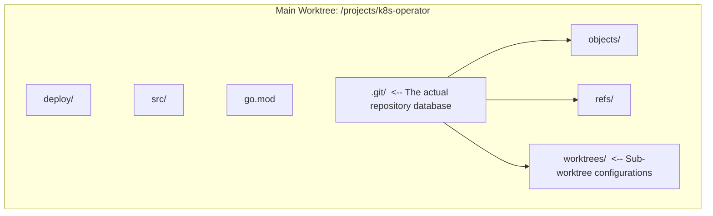
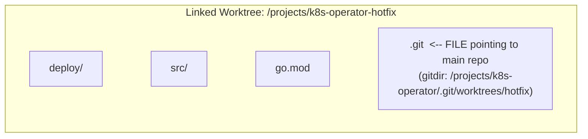

> **Складність**: [СЕРЕДНЯ]
>
> **Час на проходження**: 60 хвилин
>
> **Передумови**: Модуль 4 із Git Deep Dive

---

## Що ви зможете зробити

Наприкінці цього модуля ви зможете:

- **Впровадити** `git worktree` для управління паралельними процесами розробки в кількох гілках без порушення роботи основної робочої директорії.
- **Діагностувати** та **вирішувати** проблеми із залишеними (orphaned) або від'єднаними (disconnected) worktrees за допомогою команд життєвого циклу, таких як `prune` та `remove`.
- **Оцінювати** точні технічні компроміси між `git stash`, `git worktree` та створенням кількох клонів репозиторію для вибору оптимальної стратегії перемикання контексту в заданому сценарії.
- **Виконувати** розширені операції зі stash, включаючи ізоляцію невідстежуваних файлів, застосування конкретних stash зі стеку та відновлення збережених змін в ізольовані гілки.
- **Створити** стійкий робочий процес локальної розробки, який запобігає втраті незакоміченого стану під час критичних і термінових переривань у production.


## Чому це важливо

Гіпотетичний сценарій: друга половина дня в регіональній платіжній компанії під час запланованого оновлення платформи Kubernetes. Senior-інженер на півдорозі до рефакторингу Deployment для ingress-контролера під Kubernetes 1.35, зі зміненими YAML-файлами, наполовину написаними Go-тестами для кастомного admission webhook та локальним кластером, налаштованим на відтворення крайового випадку маршрутизації. Раптом команда безпеки надсилає сповіщення: вразливий production-образ потрібно негайно замінити, перш ніж відкриється наступне вікно розрахунків із мерчантами. Сама зміна крихітна, але операційний ризик зовсім не малий, оскільки зламаний хотфікс може заблокувати авторизацію платежів і поставити під загрозу доходи протягом вузького production-вікна.

У цій гіпотетичній ситуації інженер використовує `git stash`, перемикається на production-гілку, оновлює образ і пушить хотфікс. Перша частина виглядає успішною, але шлях назад виявляється болісним. Stash не містить новоствореного маніфесту, оскільки файл досі є невідстежуваним, а `git stash pop` конфліктує з тим самим блоком Deployment, який змінив екстрений патч. Виправлення запобігає негативним наслідкам для клієнтів, проте команда розплачується за поспішне перемикання контексту годинами вирішення конфліктів, неодноразовими скиданнями локального кластера та затримкою рев'ю початкового рефакторингу ingress.

Цей модуль присвячений запобіганню такій категорії уникненних збоїв. Гілки в Git дешеві, але звичайне клонування дає вам лише одну робочу директорію, а реальна інженерна робота рідко надходить по одному завданню за раз. Ви дізнаєтеся, коли stash є правильним короткостроковим чернетковим простором, коли пов'язаний worktree є безпечнішою архітектурою, і коли друге клонування все ще виправдане. До кінця модуля ви зможете залишати незавершену роботу саме там, де вона є, обробляти переривання в чистій директорії та повертатися без покладання на пам'ять чи удачу.

## Проблема перемикання контексту

Стандартний клон Git має дві частини, які мають значення під час щоденної розробки: базу даних репозиторію та робоче дерево. База даних репозиторію зберігає об'єкти, refs, імена гілок, стан відстеження віддалених гілок та конфігурацію. Робоче дерево — це видима директорія, де ваш редактор, тести, лінтери та локальні інструменти взаємодіють із файлами. У найпростішому налаштуванні ці дві частини здаються нероздільними, оскільки директорія `.git` лежить поруч із файлами, які ви редагуєте, але Git розглядає їх як окремі шари.

Коли ви запускаєте `git switch` або `git checkout`, Git перезаписує робоче дерево, щоб воно відповідало цільовому коміту. Таке перезаписування є безпечним лише тоді, коли вашу поточну директорію можна перемістити на нову гілку без перезапису незакоміченої роботи. Якщо ви змінили відстежувані файли, додали зміни до індексу або маєте невідстежувані файли, які перетинаються зі шляхами на цільовій гілці, Git може відмовити в перемиканні. Якщо шляхи не перетинаються, Git може дозволити перемикання та перенести ваш "брудний" стан вперед, що часто буває гіршим, оскільки незавершена робота над фічею може випадково потрапити у гілку хотфіксу.

Практичний урок полягає в тому, що гілка — це не те саме, що робочий простір. Гілка називає лінію історії; робочий простір — це директорія, індекс, стан редактора, артефакти тестів, змінні середовища та ваш власний ментальний контекст. Багато ранніх користувачів Git спочатку вивчали гілки і припускали, що ті самі по собі вирішують проблему перемикання контексту. Гілки вирішують проблему історії, але вони не дають вам двох незалежних робочих директорій, якщо тільки ви не створите другий клон або пов'язаний worktree.

Традиційно команди використовували два обхідні шляхи. Перший — це стратегія множинних клонів: клонувати репозиторій знову щоразу, коли з'являється нове завдання, перевірка релізу або термінове рев'ю. Другий — це стратегія "сховай і молися": змести незакомічену роботу в стек stash, перемкнути гілки, виконати задачу, що вас перервала, перемкнутися назад і сподіватися, що збережений патч все ще застосується чисто. Обидва підходи можуть працювати у вузьких випадках, але обидва стають дорогими, коли вони є типовою реакцією на кожне переривання.

Множинні клони забезпечують сильну ізоляцію, оскільки кожен клон має власну базу даних об'єктів, refs, конфігурацію, робоче дерево та індекс. Це може бути корисним, коли вам дійсно потрібні окремі облікові дані, окремі хуки або герметичне тестове середовище. Ціна — дублювання та розбіжності. Великі репозиторії можуть споживати кілька гігабайтів на один клон, кожен клон потребує власних fetch, а гілка, яка існує локально в одному клоні, не з'являється автоматично локально в іншому. Ця стратегія вирішує проблему ізоляції робочого простору, вдаючи, що кожне завдання — це окремий всесвіт.

Існує також вартість координації, яка не відображається у використанні диска. У робочому процесі з кількома клонами кожна директорія може непомітно розростися власними локальними гілками, віддаленими репозиторіями, ігнорованими файлами, станом хуків та незапушеними комітами. Коли колега запитує, в якій директорії міститься виправлення, відповідь може залежати від пам'яті, а не від стану репозиторію. Worktrees зменшують цю неоднозначність, оскільки пов'язані директорії залишаються прикріпленими до однієї бази даних репозиторію, а `git worktree list` дає вам єдиний перелік локальних робочих просторів, які існують на даний момент.

Stash має протилежну форму. Він легкий і локальний, але зберігає знімок, подібний до патчу, контекст якого легко забути. Запис stash фіксує стан відстежуваних модифікацій і з правильними прапорцями може включати невідстежувані або ігноровані файли, але він не зберігає ваші відкриті термінали, стан локальної бази даних, запущений кластер або точний ментальний стек. Це тимчасова полиця, а не паралельний робочий стіл. Чим довше stash лежить, поки гілка під ним змінюється, тим більша ймовірність того, що шлях назад перетвориться на відновлення після конфліктів.

Ця різниця пояснює, чому правильне питання полягає не в тому: "Чи stash — це погано?", а в тому: "Який саме стан я зберігаю?". Якщо цей стан — це дворядкове очищення форматування перед виконанням pull, stash доречний. Якщо стан включає половину фічі, тест, що падає, запущений кластер і гілку, роботу над якою можуть перервати на день, stash ховає занадто багато контексту за одним записом у стеку. Зрілий робочий процес робить цю різницю очевидною ще до того, як почнеться переривання.

> **Зупиніться та подумайте:** як ви думаєте, що станеться, якщо ви запустите `git stash`, коли у вашій директорії існує новий файл, але він ніколи не був доданий за допомогою `git add`?

За замовчуванням `git stash` зберігає відстежувані модифікації та проіндексовані зміни, але залишає невідстежувані файли недоторканими. Така поведінка дивує інженерів, оскільки "брудний" `git status` може містити як відстежуваний, так і невідстежуваний стан, тоді як проста команда stash захоплює лише частину з нього. Якщо невідстежуваний файл не перетинається з гілкою, на яку ви перемикаєтесь, він залишається видимим у новій гілці. Якщо ж він перетинається, Git може заблокувати перемикання гілки або змусити вас вирішувати, що робити, в найгірший можливий момент.

## Опанування Git Stash для мікропереривань

Stash все ще варто опанувати, тому що не кожне переривання заслуговує на нову директорію. Якщо ви збираєтеся завантажити зміни з upstream, запустити форматер або швидко оглянути іншу гілку, іменований stash може бути швидшим, ніж створення worktree. Головне — ставитися до stash як до точного інструменту для мікропереривань, а не як до сховища загального призначення для незавершених проєктів. Хороше використання stash починається з контексту, включає правильні файли та відновлюється за допомогою зворотної команди.

Ніколи не запускайте "голий" `git stash`, коли робота має значення. Типове повідомлення зазвичай каже щось на кшталт `WIP on branch-name`, чого достатньо на наступні тридцять секунд і що стає майже марним після обіду. Використовуйте `git stash push -m`, щоб ви в майбутньому могли пов'язати цей запис із реальним завданням, файлом чи експериментом. Повідомлення — це дешева страховка, оскільки стек stash індексується за позицією, і ці позиції зміщуються, коли додаються або видаляються нові записи.

```bash
# Bad practice
git stash

# Good practice
git stash push -m "Mid-refactor of deployment.yaml resource limits"
```

Коли ваша робота включає нові файли, додайте прапорець `-u` або `--include-untracked`. Це звичайна практика в інфраструктурних репозиторіях, оскільки фіча може впровадити новий маніфест Kubernetes, файл values, міграцію або тестовий фікстур до того, як вона буде готова до індексації. Використання `-u` вказує Git зберігати у stash відстежувані модифікації та невідстежувані файли разом, що робить збережений стан повнішим. Це не включає ігноровані файли, такі як результати збірки, якщо ви не використовуєте сильніший прапорець `-a`.

```bash
# Stashes tracked modifications AND untracked new files
git stash push -u -m "Added new redis-deployment.yaml and modified configmap"
```

Прапорець `-a` або `--all` є більш агресивним, оскільки він включає також ігноровані файли. Це може бути корисним, коли вам потрібно повністю очистити директорію перед відтворенням проблеми збірки, але це також може змести великі згенеровані артефакти до stash і зробити операцію повільною. У більшості професійних робочих процесів явне вказування `-u` є кращим варіантом за замовчуванням, оскільки воно захоплює вихідні файли, які Git ще не відстежує, залишаючи кеші та директорії збірки поза stash.

Кожен запис stash потрапляє у стек, де найновіший запис міститься за адресою `stash@{0}`. Ви можете перевірити стек перед застосуванням будь-чого, і вам слід робити це щоразу, коли існує більше ніж один запис. Наведена нижче команда — це не просто зручність; це захист від застосування неправильного патчу до неправильної гілки. Повідомлення stash, яке виглядало очевидним вчора, може виявитися неоднозначним після двох дзвінків щодо інцидентів та ротації рев'ю.

```bash
git stash list
```

Вивід виглядатиме приблизно так:

```text
stash@{0}: On feature-auth: Added new redis-deployment.yaml and modified configmap
stash@{1}: On main: Mid-refactor of deployment.yaml resource limits
```

Перш ніж застосувати stash, перегляньте його як патч. Підкоманда `show -p` дозволяє вам переглянути точні файли та фрагменти, не змінюючи вашу робочу директорію. Це особливо важливо, коли stash містить конфігурацію, міграції бази даних або маніфести Kubernetes, оскільки ці файли часто мають назви, що повторюються в різних середовищах. Вам потрібно знати, чи збережений патч зачіпає ресурси production, маніфести лише для тестів чи локальний скаффолдинг, перш ніж він змінить ваше поточне дерево.

```bash
git stash show -p stash@{1}
```

> **Зупиніться та подумайте: перш ніж запускати це, який вивід ви очікуєте, якщо застосуєте `stash@{1}` замість того, щоб виконати pop?** Подумайте, чи має змінитися сам стек stash, а потім перевірте своє передбачення за допомогою `git stash list`.

Використовуйте `git stash apply` як безпечну команду відновлення. `apply` бере зміни з вибраного stash і намагається помістити їх у поточне робоче дерево, але залишає запис stash у стеку. Якщо патч застосовується чисто, ви можете протестувати результат перед видаленням збереженого стану. Якщо виникає конфлікт патчу, у вас все ще залишається початковий запис stash, що дає вам простір для того, щоб перервати процес, скинути зміни, створити гілку для відновлення або спробувати знову в чистішому місці.

```bash
# Applies the most recent stash
git stash apply

# Applies a specific stash from the stack
git stash apply stash@{1}
```

`git stash pop` — це зручно, але зручність — це не те саме, що безпека. Pop застосовує stash і, коли застосування проходить успішно, викидає запис зі стеку. Така поведінка підходить для тривіальних правок, але стає ризикованою, коли ви втомлені, перебуваєте на неправильній гілці або маєте справу з конфігураційними файлами, конфлікти в яких є неочевидними. Для критичної інфраструктурної роботи спочатку застосовуйте, перевіряйте та тестуйте результат, і лише потім свідомо видаляйте stash.

```bash
# Drop a specific stash
git stash drop stash@{1}

# Clear the entire stash stack (use with extreme caution)
git stash clear
```

Найкраща команда відновлення для старого або схильного до конфліктів stash — це `git stash branch`. Ця команда створює нову гілку на тому коміті, де спочатку було створено stash, застосовує stash туди і видаляє stash, якщо застосування проходить успішно. Ця відправна точка має значення, оскільки вона реконструює контекст, якого очікував патч, замість того, щоб силоміць накладати патч безпосередньо на гілку, яка могла змінюватися цілими днями. Потім ви можете закомітити відновлену роботу та змерджити або заребейзити її, використовуючи звичайні методи Git.

```bash
git stash branch recovered-auth-work stash@{0}
```

Ось невеликий тренувальний робочий процес, який зосереджується на пастці з невідстежуваними файлами. Він використовує тимчасовий репозиторій, оскільки практика зі stash ніколи не повинна вимагати ризику реальною роботою. Зверніть увагу, що в прикладі зберігається файл із назвою `.env`, але в ньому використовується нешкідливий вміст-заповнювач замість реальних облікових даних. Мета полягає в тому, щоб побачити, як Git обробляє відстежуваний і невідстежуваний стан, а не змоделювати управління секретами.

```bash
mkdir stash-practice && cd stash-practice
git init -b main
```

Створіть початковий коміт, щоб репозиторій мав чисту базу. Git stash залежить від репозиторію з комітами, оскільки йому потрібен коміт `HEAD` як точка відліку для збережених змін. У абсолютно новому репозиторії без комітів багато звичайних операцій з історією ще не мають стабільного якоря.

```bash
echo "v1" > config.txt
git add config.txt
git commit -m "Initial commit"
```

Тепер створіть одну відстежувану модифікацію та один невідстежуваний файл. Це дасть вам реалістичний "брудний" стан: частина роботи видима як модифікація відстежуваного файлу, а частина — лише як новий шлях. Саме з такого змішаного стану починається багато помилок зі stash, оскільки швидкий погляд на `git status` може не конвертуватися у правильні прапорці stash.

```bash
echo "v2" > config.txt
echo "example-local-value" > .env
```

Збережіть обидві частини разом за допомогою `-u`. Після цієї команди робоче дерево має повернутися до чистого стану, а невідстежуваний файл має зникнути з директорії, оскільки його було збережено всередині запису stash. Це саме та поведінка, яка вам потрібна перед перемиканням для рев'ю або швидкого огляду гілки.

```bash
git stash push -u -m "WIP on new config and local env"
```

Перевірте стек stash та патч перед відновленням. Це закріплює звичку ставитися до записів stash як до іменованих записів, які заслуговують на рев'ю, а не як до невидимої магії. Вивід патчу покаже зміну відстежуваного файлу; Git може підсумовувати невідстежуваний вміст по-різному залежно від версії, але файл має бути частиною запису.

```bash
git stash list
git stash show -p stash@{0}
```

Нарешті, відновіть за допомогою `apply` замість `pop`. Робоче дерево отримує зміни назад, тоді як стек stash все ще містить збережений запис. Це дозволяє вам запустити `git status`, підтвердити, що `config.txt` та `.env` повернулися як очікувалося, а потім вибрати, чи видалити stash, чи зберегти його, доки ви не закомітите роботу.

```bash
git stash apply stash@{0}
```

Коли ви закінчите експериментувати, видаліть тимчасову директорію:

```bash
cd ../.. && rm -r stash-practice
```


## Потужність Git Worktrees

Якщо stash — це тимчасова полиця, то worktree — це окремий робочий стіл, підключений до тієї ж картотеки. Git запровадив пов'язані робочі дерева (linked worktrees), щоб одна база даних репозиторію могла підтримувати кілька робочих каталогів, кожен із власною витягнутою (checked-out) гілкою та індексом. Головна перевага полягає в тому, що вам не потрібно очищати, ховати в stash або фіксувати (commit) незавершену роботу перед відкриттям чистого каталогу для іншого завдання. Ваша гілка нової функції (feature branch) може залишатися "брудною" в одному терміналі, тоді як гілка термінового виправлення (hotfix branch) буде чистою в іншому.

Ця архітектура є ефективною, оскільки пов'язані робочі дерева спільно використовують одну базу даних об'єктів та посилання (references). Другий клон копіює базу даних репозиторію, але пов'язаний worktree зберігає лише витягнуті файли плюс невеликі метадані, які вказують на головний репозиторій. Якщо ви виконуєте fetch в одному worktree, оновлені посилання для відстеження віддалених репозиторіїв (remote-tracking refs) стають доступними для інших, оскільки ці посилання зберігаються у спільному репозиторії. Це забезпечує більшу частину тієї ізоляції, якої розробники очікували від створення кількох клонів, але без дублювання історії та створення локального дрейфу розсинхронізації.

Ізоляція не є абсолютною, і ця відмінність має значення. Кожен worktree має власний робочий каталог та індекс, тому проіндексовані (staged) зміни та незафіксовані редагування файлів не "перетікають" між ними. Проте глобальні сервіси, такі як єдина локальна база даних, фіксовані порти, спільні мережі Docker або загальні налаштування редактора, все одно можуть конфліктувати. Команда, що запускає два тестові середовища Kubernetes із двох worktrees, повинна все одно вибрати окремі простори імен (namespaces), порти або кластери. Worktrees вирішують проблему конкуренції за робочий простір Git; вони не ізолюють автоматично кожен інструмент поза межами Git.

Ізоляція індексу є однією з найбільш недооцінених переваг. Індексування (staging) є локальним для worktree, тому ви можете мати ретельно проіндексований патч у каталозі з новою функцією, тоді як каталог для hotfix матиме зовсім інший проіндексований патч. Це важливо для якості перевірки коду, оскільки `git diff --cached` залишається сфокусованим на завданні, що міститься перед вами. У разі переривання роботи за допомогою stash, проіндексовані та непроіндексовані наміри можуть бути злиті в один збережений запис, і для відновлення цього наміру згодом знадобиться додаткова увага.

Worktrees також заохочують використання менших, іменованих гілок для тимчасових завдань. Замість того, щоб залишати hotfix як незафіксовану зміну у вашому основному клоні, ви створюєте `hotfix/image-patch`, фіксуєте виправлення та відправляєте його (push) із пов'язаного каталогу. Назва цієї гілки стає частиною аудиторського сліду. Навіть якщо тимчасовий каталог буде видалено після злиття pull request, гілка та історія комітів все одно пояснюватимуть, що відбулося під час переривання.

Коли ви виконуєте `git clone`, ви створюєте головний worktree. Всередині цього каталогу папка `.git` зберігає об'єкти, посилання, конфігурацію та метадані для пов'язаних worktrees. Ця діаграма показує звичайну структуру до додавання будь-якого пов'язаного worktree.



Коли ви додаєте пов'язаний worktree, Git створює новий каталог зі звичайними файлами проєкту, але запис `.git` всередині цього каталогу є файлом, а не повним каталогом репозиторію. Цей файл вказує на метадані, розташовані у головному репозиторії в каталозі `.git/worktrees/`. Пов'язаний worktree отримує власний `HEAD`, власний індекс та власний адміністративний стан, тоді як фактична база даних об'єктів залишається спільною.



Стандартна команда для створення — `git worktree add`. Ви вказуєте шлях для нового каталогу та гілку або коміт, які ви хочете туди витягнути (check out). У багатьох робочих процесах із перериваннями ви також одночасно створюєте нову гілку за допомогою `-b`. Це дозволяє вам залишити недоторканою "брудну" гілку з новою функцією, створити чисту гілку hotfix від `main` та почати роботу в сусідньому каталозі.

```bash
# Usage: git worktree add <path> <branch>

# Create a new directory alongside your current one,
# create a new branch called 'hotfix-cve',
# and check it out starting from 'main'
git worktree add -b hotfix-cve ../k8s-operator-hotfix main
```

Git виведе:

```text
Preparing worktree (new branch 'hotfix-cve')
HEAD is now at 8f3a9b2 Update ingress documentation
```

На цьому етапі ви маєте два окремі каталоги, підключені до однієї бази даних репозиторію. Ваш початковий каталог може містити незафіксовану роботу над новою функцією, тоді як `../k8s-operator-hotfix` починається чисто з гілки hotfix. Ви можете відкрити новий термінал, запустити тести, зробити коміт і відправити (push) зміни з worktree, призначеного для hotfix. Коли надзвичайна ситуація завершується, ви видаляєте тимчасовий worktree і повертаєтеся до початкового термінала без необхідності відновлювати stash або реконструювати хід своїх думок.

Git дотримується одного важливого правила: гілка може бути витягнута лише в одному worktree одночасно. Це правило запобігає незалежному оновленню одного й того самого вказівника гілки з двох каталогів, що могло б стати причиною плутанини. Якщо вам потрібен інший каталог для тієї ж початкової точки, створіть нове ім'я гілки або навмисно витягніть коміт у стані detached HEAD. Більшість команд повинна віддавати перевагу назві гілки, оскільки це визначає чітке місце для роботи в історії.

> **Зупиніться та подумайте:** перш ніж виконати це, який вивід ви очікуєте побачити, якщо спробуєте створити worktree для гілки, яка вже витягнута в іншому worktree?

Команда завершиться помилкою з поясненням, що гілка вже витягнута. Ця помилка є захисною, а не дратівливою. Уявіть собі два термінали, які обидва претендують на володіння гілкою `feature/auth-refresh`, кожен з різним індексом та різними незафіксованими файлами. Git уникає такого стану "розщеплення мозку" для гілок, змушуючи кожне ім'я витягнутої гілки мати лише один активний worktree. Якщо ви бачите цю помилку, перегляньте список ваших worktrees, перш ніж застосовувати примусові дії.

```bash
git worktree list
```

Вивід надає вам шлях, коміт і гілку для кожного прикріпленого worktree. Ставтеся до цього списку як до вашої локальної інформаційної панелі операцій. Перш ніж видаляти гілку, виконувати rebase для спільної роботи або очищати старі каталоги, перевіряйте цей список, щоб знати, які шляхи все ще мають значення. Набагато швидше прочитати цей стан, ніж заново виявляти його через помилки команд checkout.

```text
/projects/k8s-operator         8f3a9b2 [feature-auth]
/projects/k8s-operator-hotfix  2c9b4e1 [hotfix-cve]
```

Коли ви закінчуєте роботу з worktree, видаліть його за допомогою Git. Команда видаляє каталог та очищає відповідні метадані в головному репозиторії. Git відмовиться видаляти worktree, який містить незафіксовані зміни, якщо ви не зробите це примусово, що є ще одним корисним запобіжником. Якщо worktree містить коміти, які не були відправлені або злиті, зупиніться і вирішіть, чи потрібно зберегти гілку перед видаленням каталогу.

```bash
# This deletes the directory and cleans up the references in the main .git folder
git worktree remove ../k8s-operator-hotfix
```

Типова помилка полягає у видаленні каталогу засобами операційної системи, наприклад за допомогою `rm -rf`, замість використання `git worktree remove`. Файли зникають, але головний репозиторій усе ще містить метадані, які вказують на те, що гілка витягнута в цьому відсутньому місці. Пізніше, коли ви спробуєте використати цю гілку деінде, Git відмовить, оскільки він довіряє своїм метаданим доти, доки ви не накажете йому перевірити файлову систему.

```bash
git worktree prune
```

`git worktree prune` просить Git перевірити зареєстровані шляхи worktree та відкинути метадані для розташувань, які більше не існують. Використовуйте її як команду відновлення для покинутих записів worktree, а не як звичайну звичку для очищення. Звичайне очищення має здійснюватися через `git worktree remove`, оскільки це дає Git можливість захистити незафіксовану роботу та зберегти метадані узгодженими від самого початку.

## Робочий процес із перериваннями у Kubernetes

Worktrees стають особливо цінними у репозиторіях Kubernetes, оскільки вихідні файли є лише частиною локального стану. Зміна у Deployment може бути прив'язана до запущеного кластера KinD, переспрямування портів (port-forward), згенерованих маніфестів та інтеграційного тесту, що завершується помилкою. Збереження вихідних файлів у stash не скидає ці зовнішні системи, а перенесення "брудного" YAML у гілку production hotfix може призвести до хибних результатів тестування. Окремий worktree надає для hotfix чистий вигляд файлів, дозволяючи вам при цьому окремо вирішувати, як ізолювати кластер.

Припустімо, ви розробляєте оновлення надійності для Deployment, орієнтованого на Kubernetes 1.35. Сам по собі Git не вимагає інструментів Kubernetes, але репозиторії платформ часто поєднують операції Git із перевіркою маніфестів, тому приклади команд мають бути явними, а не залежати від конфігурації інтерактивної оболонки.

Для локального тесту незавершена функція може включати probes, запити ресурсів та зміни образів. Це саме ті поля, яких також може торкнутися екстрений hotfix. Якщо ви сховаєте (stash) нову функцію, перемкнетеся на `main`, оновите образ, а потім повернетеся, ви робитимете ставку на те, що ці ж області маніфесту не змістилися несумісним чином. Якщо ви створите worktree від `main`, то hotfix почнеться з файлу production, тоді як файл нової функції залишиться фізично відкритим у початковому каталозі. Такий фізичний поділ є корисним, коли у вашому редакторі відкрито кілька вкладок, історія термінала заповнена специфічними для функції командами, а ваші локальні нотатки посилаються на шляхи у початковому каталозі.

Worktree не дає вам автоматично другий кластер Kubernetes, тому проєктуйте цю частину виважено. Для однорядкового hotfix образу ви можете перевірити маніфест за допомогою клієнтського прогону (dry run) у каталозі hotfix і запустити лише модульні тести. Для глибшої зміни контролера ви можете створити окремий кластер KinD або окремий простір імен, щоб перевірка hotfix не ділила ресурси з гілкою нової функції. Рішення щодо Git і рішення щодо середовища виконання пов'язані між собою, але це не одне й те саме рішення.

Найсильніші команди фіксують цей поділ у своїх інструкціях (runbooks). Інструкція для інцидентів може містити таке: "Створіть worktree від `main`, створіть або виберіть чистий простір імен, перевірте лише diff для hotfix та видаліть worktree після злиття виправлення". Ця процедура зменшує ймовірність того, що інженер імпровізуватиме під тиском. Вона також робить процес перевірки коду спокійнішим, оскільки pull request можна оцінювати як ізольовану зміну для production, а не як суміш термінових редагувань та непов'язаних залишків нової функції.

Сценарій вправи: реальна команда операторів може використовувати цей поділ під час реагування на інциденти. Аліса створює підтримку автоматичного резервного копіювання для оператора бази даних, маючи багато змінених файлів Go, нових маніфестів CustomResourceDefinition та локальний кластер, налаштований для тестування планування резервного копіювання. Згодом із production надходить повідомлення про збій у виборі лідера (leader-election). Підхід зі stash вимагає від Аліси упакувати складну функцію як патч, змінити контекст гілки, провести інше розслідування в тому ж каталозі, а пізніше повторно застосувати патч до гілки, яка могла зміститися. Підхід із worktree вимагає від Аліси відкрити чистий сусідній каталог від `main`, виправити код вибору лідера там і залишити роботу над резервним копіюванням недоторканою.

Різниця полягає не лише у комфорті. Під час інциденту зменшення випадкового зв'язування є операційним контролем. Чистий worktree для hotfix полегшує перегляд того, які файли були змінені, спрощує виконання сфокусованих тестів і створення коміту, зручного для перевірки. Початковий каталог із новою функцією залишається "брудним", але ця "брудність" є ізольованою. Коли інцидент завершується, Алісі не потрібно пам'ятати, чи належав локальний маніфест до нової функції, чи до hotfix; межа каталогу зберігає цю відповідь.


## Патерни та антипатерни

Перший надійний патерн — це worktree у сусідньому каталозі. Тримайте основний клон у стабільному місці та створюйте тимчасові worktrees поруч із ним із назвами, які пояснюють їхнє призначення, наприклад `../operator-hotfix-leader-election` або `../site-review-pr-812`. Назва шляху стає операційною документацією, коли `git worktree list` виводиться під час напруженого дня. Цей патерн добре масштабується, оскільки кожен worktree використовує спільні отримані refs, тоді як назва каталогу повідомляє, чому він існує.

Ця дисципліна найменування здається незначною, доки команда не матиме кілька відкритих тимчасових каталогів під час тижня релізу. Каталог з назвою `../tmp2` нічого не говорить вам про те, чи можна його видалити, тоді як `../operator-hotfix-leader-election` повідомляє про призначення гілки ще до того, як ви запустите Git. Коли назва, гілка, pull request та тестовий простір імен збігаються, очищення стає простим кроком перевірки замість археологічного проєкту.

Другий патерн — apply-before-drop для відновлення зі stash. Використовуйте `git stash apply`, запустіть `git status`, перевірте diff та виконайте невелику перевірку (validation) перед виконанням drop для stash. Ця додаткова хвилина захищає вас від видалення єдиної копії патчу, який був застосований не в тому місці. Це також створює природну контрольну точку: коли відновлена робота зафіксована через commit або свідомо відкинута, stash можна впевнено видалити.

Третій патерн — branch-from-stash для старої роботи. Якщо stash старіший за коротке переривання, вважайте, що його оригінальний контекст має значення. `git stash branch` реконструює цей контекст краще, ніж прямий apply до гілки, яка еволюціонувала. Цей патерн перетворює ризиковане повторне застосування патчу на звичайну проблему інтеграції гілки, яку легше піддати review та легше скасувати (undo).

Четвертий патерн — найменування середовища, що відповідає worktree. Якщо існує worktree для `hotfix/image-patch`, дайте його локальному простору імен, базі даних або кластеру відповідну назву, коли це практично. Точна команда залежить від інструменту, але принцип стабільний: ізоляція каталогів повинна поєднуватися з ізоляцією під час виконання (runtime isolation), коли тести змінюють зовнішній стан. Інакше два worktrees все одно можуть конкурувати за прив'язки портів, тестові бази даних або ресурси Kubernetes.

Найпоширеніший антипатерн — ставитися до stash як до картотеки. Стопка неназваних записів WIP — це не беклог; це відкладена плутанина. Команди потрапляють у цю пастку, тому що stash працює швидко і тому що Git дозволяє легко тимчасово приховати безлад. Краща альтернатива — зробити WIP commit у гілці, коли робота має сенс, або створити worktree, коли інше завдання потребує чистого каталогу.

Інший антипатерн — примусове видалення worktrees як регулярне очищення. `git worktree remove -f` існує для виняткових випадків, але регулярне використання привчає вас ігнорувати попередження Git про наявність незафіксованих змін. Якщо тимчасовий worktree має цінні правки, виконайте для них commit, відправте у stash з повідомленням або свідомо відкиньте їх після перевірки. Найбезпечніший шлях очищення нудний: list, status, remove.

Більш тонкий антипатерн — припускати, що worktrees замінюють гілки. Це не так. Worktree — це каталог, прикріплений до гілки, від'єднаного (detached) commit або нової гілки. Гілка все ще несе в собі історію, ідентичність для review та поведінку push. Якщо ви використовуєте від'єднані worktrees недбало, ви можете створити commits, які легко втратити, оскільки жодна назва гілки не вказує на них. Для нормальної командної роботи створіть іменовану гілку за допомогою `-b` і робіть push, як для будь-якої іншої гілки.

Останній антипатерн — використання worktrees для уникнення створення commits занадто довго. Worktrees дозволяють тримати завдання окремо, але вони не усувають потребу в невеликих commits та історії, яку можна перевірити. Якщо три worktrees містять по кілька днів незафіксованої роботи кожен, ви обміняли один переповнений каталог на три приховані купи ризиків. Робіть commit значущих контрольних точок (checkpoints), виконуйте push гілок, які потребують резервного копіювання або review, та видаляйте тимчасові каталоги, коли їхнє призначення закінчується.


## Фреймворк для прийняття рішень

Обирайте інструмент, запитуючи себе, який тип ізоляції вам потрібен і як довго триватиме переривання. Якщо переривання вимірюється хвилинами, а ваш "брудний" стан (dirty state) є простим, stash може бути доречним. Якщо переривання вимагає чистого каталогу, окремої гілки, тестів або роботи з review, використовуйте worktree. Якщо завдання потребує повністю незалежної конфігурації репозиторію, облікових даних (credentials), хуків або об'єктної бази даних, використовуйте другий клон і свідомо прийміть ці витрати.

> **Який підхід ви б обрали тут і чому?** Ваш колега просить вас зробити review для pull request, який змінює два файли, у вас немає незафіксованої роботи, і ви очікуєте, що review займе десять хвилин.

Якщо ваше робоче дерево (working tree) чисте, а review невелике, перемикання гілок у поточному каталозі є розумним. Worktree все ще є хорошим варіантом, коли ви хочете зберегти контекст редактора, залишити вашу поточну гілку видимою або запустити тести, не зачіпаючи локальні артефакти. Важливий момент полягає в тому, що worktrees не є обов'язковими для кожного перемикання гілки; вони є цінними, коли вартість змішування контекстів перевищує вартість створення ще одного каталогу.

| Сценарій | Рекомендована стратегія | Технічне обґрунтування |
| :--- | :--- | :--- |
| **Отримання останніх змін (pull)** перед виконанням push ваших локальних commits. | `git stash` | Переривання вимірюється секундами. Контекст залишається ясним, ризик серйозних конфліктів низький, а stash є найшвидшою локальною операцією. |
| **Екстрений production hotfix** під час роботи над фічею (feature). | `git worktree` | Hotfix вимагає чистого стану і може зайняти години. Вам потрібна надійна гарантія, що код фічі не просочиться в hotfix. |
| **Review масивного pull request колеги** під час роботи над власним кодом. | `git worktree` | Reviews часто вимагають запуску коду, редагування конфігурації та виконання тестів. Окремий каталог тримає експерименти review подалі від роботи над фічею. |
| **Тестування абсолютно іншої версії Kubernetes** локально на кодовій базі. | `git clone` іноді | Worktree ізолює файли, але повний клон може бути виправданим, коли облікові дані, хуки або конфігурація середовища повинні бути повністю незалежними. |
| **Спроба спекулятивного рефакторингу, який ви можете відкинути.** | `git branch` у поточному дереві | Якщо ваше дерево чисте, звичайної гілки та WIP commit може бути достатньо. Stash не потрібен, коли ви можете зберегти експеримент в історії. |

Один із способів впровадження цього фреймворку — встановлення командних конвенцій. Для реагування на інциденти (incident response) за замовчуванням створюйте worktree. Для однохвилинних переривань pull-before-push використовуйте іменований stash. Для відтворення проблем зовнішніх клієнтів, які вимагають інших облікових даних або хуків, використовуйте свіжий клон. Конвенції зменшують втому від прийняття рішень під час стресових моментів і роблять локальні каталоги легшими для інтерпретації колегами по команді, коли вони працюють у парі (pair), займаються налагодженням (debug) або роблять review разом.

Фреймворк також повинен враховувати вартість повернення (cost of return). Інструмент перемикання контексту є успішним лише тоді, коли повернення до початкового завдання є нудним (рутинним). Stash має низьку початкову вартість (start cost), але може мати високу вартість повернення, коли патчі конфліктують або повідомлення є нечіткими. Worktree має трохи вищу початкову вартість, оскільки він створює каталог і часто гілку, але його вартість повернення зазвичай полягає лише у зміні терміналів. Клон має найвищу вартість створення та підтримки, тому зарезервуйте його для випадків, коли спільний стан репозиторію сам по собі був би проблемою.


## Чи знали ви?

1. Git worktrees були введені в Git 2.5 у 2015 році, після багатьох років використання командами допоміжних скриптів, таких як `git-new-workdir`, для імітації такого ж workflow.
2. Запис stash створюється з внутрішніх commits, які фіксують робоче дерево (working tree) і, за потреби, індекс (index); це не просто вільний файл diff, схований на диску.
3. Git запобігає виконанню checkout для гілки у двох worktrees одночасно, що захищає вказівник гілки від конкурентних оновлень з різних каталогів.
4. Команда `git worktree prune` виправляє застарілі метадані (stale metadata), коли пов'язаний каталог worktree був видалений поза межами Git, але вона не є заміною звичайного очищення за допомогою `git worktree remove`.


## Типові помилки

| Помилка | Чому це трапляється | Як це виправити |
| :--- | :--- | :--- |
| **Втрата нових файлів у stash** | Запуск `git stash` без `-u` залишає новостворені невідстежувані файли (untracked files) у робочому каталозі, тому вони переходять з вами в наступну гілку. | Використовуйте `git stash push -u -m "clear context"`, коли "брудний" стан (dirty state) містить нові вихідні файли. |
| **Амнезія стека stash** | Звичайний `git stash` створює типові повідомлення, які не пояснюють, чому існує запис, коли виконано більше роботи. | Завжди використовуйте `git stash push -m "specific task and file context"` та перевіряйте через `git stash list`. |
| **Осиротілі каталоги worktree** | Видалення папки worktree за допомогою `rm -rf` видаляє файли, але залишає метадані Git, які все ще блокують гілку. | Віддавайте перевагу `git worktree remove <path>`; використовуйте `git worktree prune` лише для відновлення застарілих метаданих. |
| **Застосування (popping) у неправильну гілку** | `git stash pop` застосовує, а потім видаляє запис після чистого застосування, залишаючи мало місця для перегляду рішення. | За замовчуванням використовуйте `git stash apply`, перевіряйте результат, а потім свідомо запускайте `git stash drop`. |
| **Спроба зробити checkout заблокованої гілки** | Гілка, на яку вже зроблено checkout в іншому worktree, не може бути відкрита знову під тією ж назвою. | Запустіть `git worktree list`, перемкніться на інший worktree або видаліть його, або створіть нову гілку для другого каталогу. |
| **Ігнорування витоку середовища (environment bleed)** | Worktrees ізолюють файли Git та індекси, але спільні порти, бази даних, кластери та облікові дані все ще можуть конфліктувати. | Поєднуйте ізоляцію worktree з окремими просторами імен, портами, кластерами або локальною конфігурацією, коли тести змінюють зовнішній стан. |
| **Недбале використання від'єднаних (detached) worktrees** | Виконання checkout для коміту без гілки може ускладнити пошук та виконання push нових commits. | Використовуйте `git worktree add -b <branch> <path> <start-point>` для нормальної командної роботи. |


## Контрольні запитання

<details>
<summary>Запитання 1: Ви глибоко занурились у модифікацію Helm-чарту для оновлення надійності, коли у `main` необхідно зробити терміновий production image patch. Ваш поточний каталог містить незафіксований YAML та згенеровані тестові фікстури. Який workflow ви повинні обрати і чому?</summary>

Використовуйте `git worktree add -b hotfix/image-patch ../project-hotfix main` та зробіть production patch у цьому новому каталозі. Hotfix потребує чистого робочого дерева (working tree), а ваша фіча має достатньо незафіксованого стану, щоб stash став ризикованим повторним застосуванням патчу. Worktree зберігає commit для hotfix придатним для review, оскільки там видимі лише файли hotfix. Він також дозволяє вам повернутися до початкового каталогу без повторного застосування будь-чого.
</details>

<details>
<summary>Запитання 2: Ви відправили роботу у stash перед тим, як допомогти колезі, а потім повернулися через два дні, коли цільова гілка сильно змінилася. Пряме застосування (direct apply) викликає болісні конфлікти. Що ви повинні спробувати далі, і яку проблему це вирішує?</summary>

Спробуйте `git stash branch recovered-work stash@{0}` або конкретний індекс stash, який ви перевірили. Це створює нову гілку на commit, де спочатку було створено stash, тому збережений патч застосовується в очікуваному ним контексті. Це дозволяє уникнути примусового накладання старого патчу безпосередньо на змінену гілку. Після відновлення ви можете виконати commit роботи та інтегрувати її за допомогою звичайних інструментів merge або rebase.
</details>

<details>
<summary>Запитання 3: Колега видалив `../testing-env` за допомогою файлового менеджера. Тепер Git відмовляється робити checkout на `test-deployment`, оскільки каже, що на цю гілку вже зроблено checkout. Як ви діагностуєте та відновлюєте стан?</summary>

Спочатку запустіть `git worktree list`, щоб побачити застарілий шлях, який Git все ще пам'ятає, потім запустіть `git worktree prune` з репозиторію. Каталогу немає, але метадані під основним репозиторієм все ще записують цей пов'язаний worktree. Prune вказує Git перевірити зареєстровані шляхи та видалити записи для відсутніх каталогів. У майбутньому для очищення слід використовувати `git worktree remove`, щоб Git міг захистити незафіксовані зміни та видалити метадані за одну операцію.
</details>

<details>
<summary>Запитання 4: Ви створили новий Python скрипт, але не запустили `git add`. Після `git stash` та перемикання гілки скрипт усе ще присутній у новій гілці. Чому це сталося, і як цього уникнути?</summary>

Звичайний `git stash` не включає невідстежувані файли (untracked files). Новий скрипт не мав запису в індексі, тому Git залишив його в робочому каталозі під час операції stash. Якщо цільова гілка не мала відстежуваного файлу за тим самим шляхом, файл залишився видимим після перемикання. Використовуйте `git stash push -u -m "message"`, коли нові вихідні файли є частиною тимчасового стану.
</details>

<details>
<summary>Запитання 5: Вам потрібно порівняти поведінку з іншою версією Kubernetes, а також використати інші облікові дані та хуки. Товариш по команді пропонує worktree, оскільки це економить дисковий простір. Яке занепокоєння ви повинні висловити?</summary>

Worktree ізолює робочий каталог та індекс, але він усе ще використовує спільну базу даних репозиторію та може використовувати спільну глобальну конфігурацію Git, стратегію хуків, облікові дані, налаштування редактора та локальні сервіси. Якщо тест справді вимагає незалежних облікових даних або конфігурації на рівні репозиторію, окремий клон може бути більш доречним, незважаючи на витрати місця на диску. Правильне рішення залежить від того, що саме має бути ізольовано. Worktrees чудово підходять для ізоляції файлів та гілок, але вони не є повноцінною пісочницею (sandbox) для кожного інструмента навколо репозиторію.
</details>

<details>
<summary>Запитання 6: У вас є три stashes, і ви підозрюєте, що `stash@{1}` містить роботу з міграції бази даних. Ваша поточна гілка чиста, але застосування неправильного stash змарнувало б час. Що ви повинні зробити перед його відновленням?</summary>

Запустіть `git stash list`, щоб підтвердити стек, і `git stash show -p stash@{1}`, щоб перевірити патч. Це нічого не змінює в робочому каталозі, тому це безпечно, навіть якщо ви не впевнені. Перегляд патчу показує, які файли та частини (hunks) зберігаються в цьому записі. Після того, як ви підтвердите, що це правильна робота, використовуйте `git stash apply stash@{1}` і перевірте перед видаленням (drop) stash.
</details>

<details>
<summary>Запитання 7: Ваша команда використовує worktrees для кожного інциденту, але два worktrees для інцидентів постійно не проходять тести, тому що обидва намагаються прив'язати той самий локальний порт і використовують той самий простір імен у спільному кластері. Чи підвели тут Git worktrees?</summary>

Ні. Git worktrees вирішили проблему ізоляції вихідного каталогу та індексу, але вони не ізолювали зовнішні ресурси виконання (runtime). Спільні порти, спільні бази даних, спільні кластери та спільні простори імен усе ще можуть конфліктувати між каталогами. Рішення полягає в тому, щоб поєднати кожен worktree з ізоляцією середовища, такою як окремі простори імен, динамічні порти або окремі кластери KinD. Ставтеся до створення worktree як до однієї з частин робочого простору інциденту (incident workspace), а не як до всього робочого простору.
</details>


## Практична вправа: Термінове виправлення під час роботи

У цій вправі ви зімітуєте реальне переривання робочого процесу за допомогою маніфестів Kubernetes. Ви розпочнете оновлення для підвищення надійності, залишите його незакоміченим, створите чисте робоче дерево (worktree) для термінового виправлення на основі `main`, закомітите там патч для production-образу, а потім повернетесь до початкового каталогу. Ця вправа навмисно невелика, але цей робочий процес є таким самим, як і той, що ви використовували б для зміни контролера, перегляду chart-а або екстреного виправлення конфігурації.

Розпочніть роботу в тимчасовому каталозі, щоб після завершення можна було видалити тренувальний репозиторій. Перший репозиторій представляє ваш звичайний робочий простір для розробки. Він починається зі стабільного production Deployment, щоб у вас була чиста гілка `main`, на яку можна застосувати патч під час переривання роботи.

```bash
mkdir k8s-fleet-manager && cd k8s-fleet-manager
git init -b main
```

Створіть стабільний базовий стан. Цей маніфест навмисно є мінімальним, щоб різницю між production-версією та незавершеною роботою над новою функцією було легко помітити. Зробіть коміт перед створенням гілки для нової функції, оскільки робоче дерево для термінового виправлення потребує реального коміту в `main` як початкової точки.

```bash
cat << 'EOF' > deployment.yaml
apiVersion: apps/v1
kind: Deployment
metadata:
  name: fleet-api
spec:
  replicas: 2
  selector:
    matchLabels:
      app: fleet-api
  template:
    metadata:
      labels:
        app: fleet-api
    spec:
      containers:
      - name: api
        image: fleet-api:v1.0.0
EOF
git add deployment.yaml
git commit -m "Initial production release v1.0.0"
```

Створіть та перейдіть у нову гілку для функції (feature branch). Ця гілка представляє звичайну зміну середнього розміру, а не екстрену ситуацію. Ви навмисно залишите її брудною (dirty), щоб переконатися, що worktrees не вимагають чистого початкового каталогу.

```bash
git checkout -b feature/reliability-upgrade
```

Розпочніть незавершену роботу над надійністю, замінивши Deployment на складнішу версію. Не робіть коміт цих змін. Брудне робоче дерево (working tree) — це головна мета вправи, оскільки воно моделює момент, коли переривання відбувається під час ваших роздумів.

```bash
cat << 'EOF' > deployment.yaml
apiVersion: apps/v1
kind: Deployment
metadata:
  name: fleet-api
spec:
  replicas: 2
  selector:
    matchLabels:
      app: fleet-api
  template:
    metadata:
      labels:
        app: fleet-api
    spec:
      containers:
      - name: api
        image: fleet-api:v1.1.0-rc1
        resources:
          requests:
            memory: "64Mi"
            cpu: "250m"
          limits:
            memory: "128Mi"
            cpu: "500m"
        livenessProbe:
          httpGet:
            path: /healthz
            port: 8080
          initialDelaySeconds: 3
          periodSeconds: 3
EOF
```

Ваше переривання — це production-баг у `fleet-api:v1.0.0`. Вам потрібно пропатчити версію образу до `v1.0.1` у гілці `main`, але ви не можете втратити оновлення надійності і не хочете пізніше застосовувати stash. Використовуйте наведений нижче контрольний список як шлях до успіху.

- [ ] Створіть нове worktree з назвою `fleet-manager-hotfix` у батьківському каталозі, створивши нову гілку `hotfix/image-patch` на основі `main`.
- [ ] Перейдіть до нового каталогу worktree.
- [ ] Переконайтеся, що `deployment.yaml` у цьому новому каталозі є чистою оригінальною production-версією з `fleet-api:v1.0.0`.
- [ ] Оновіть тег образу в каталозі hotfix на `fleet-api:v1.0.1`.
- [ ] Закомітьте hotfix у робочому дереві hotfix.
- [ ] Безпечно видаліть worktree для hotfix за допомогою команд Git, а не видаляючи каталог напряму.
- [ ] Поверніться до свого початкового каталогу та переконайтеся, що ваші оновлення надійності залишилися точно такими, якими ви їх залишили.

<details>
<summary>Рішення</summary>

Створіть worktree, залишивши ваш брудний каталог з новою функцією точно таким, яким він є. Ця команда створює сусідній каталог, створює нову гілку і починає цю гілку з `main`.

```bash
git worktree add -b hotfix/image-patch ../fleet-manager-hotfix main
```

Перейдіть у новий каталог і перевірте маніфест. Він повинен показувати початковий образ `v1.0.0` і жодних змін ресурсів або проб з гілки нової функції.

```bash
cd ../fleet-manager-hotfix
cat deployment.yaml
```

Застосуйте та закомітьте hotfix. Приклади `sed` для macOS та Linux відрізняються, тому використовуйте той, що відповідає вашому середовищу. Якщо вам зручніше, відредагуйте файл вручну, а потім продовжте з тими самими командами Git.

```bash
# macOS
sed -i '' 's/v1.0.0/v1.0.1/g' deployment.yaml

# Linux
# sed -i 's/v1.0.0/v1.0.1/g' deployment.yaml

git add deployment.yaml
git commit -m "Hotfix: update API image to v1.0.1"
```

Очистіть усе за допомогою Git. Спочатку вийдіть з каталогу hotfix, а потім видаліть пов'язане worktree, щоб Git видалив як каталог, так і його метадані.

```bash
cd ../k8s-fleet-manager
git worktree remove ../fleet-manager-hotfix
```

Переконайтеся, що оригінальна робота над новою функцією все ще присутня і не закомічена. Ви повинні побачити resource requests, limits, liveness probe та образ release-candidate саме там, де ви їх залишили.

```bash
cat deployment.yaml
git status
```
</details>

Критерії успіху:

- [ ] Коміт для hotfix існує у гілці `hotfix/image-patch`.
- [ ] Робоче дерево для hotfix було видалено за допомогою `git worktree remove`.
- [ ] `git worktree list` більше не показує `fleet-manager-hotfix`.
- [ ] Оригінальний каталог `feature/reliability-upgrade` все ще має незакомічені зміни надійності.
- [ ] Для збереження змін під час переривання не знадобилося жодного запису stash.

## Джерела

- [Документація Git: git-worktree](https://git-scm.com/docs/git-worktree)
- [Документація Git: git-stash](https://git-scm.com/docs/git-stash)
- [Документація Git: git-switch](https://git-scm.com/docs/git-switch)
- [Документація Git: git-checkout](https://git-scm.com/docs/git-checkout)
- [Документація Git: git-branch](https://git-scm.com/docs/git-branch)
- [Документація Git: git-prune](https://git-scm.com/docs/git-prune)
- [Документація Git: git-clean](https://git-scm.com/docs/git-clean)
- [Документація Git: gitrepository-layout](https://git-scm.com/docs/gitrepository-layout)
- [Книга Pro Git: Stashing and Cleaning](https://git-scm.com/book/en/v2/Git-Tools-Stashing-and-Cleaning)
- [Книга Pro Git: Advanced Merging](https://git-scm.com/book/en/v2/Git-Tools-Advanced-Merging)
- [Книга Pro Git: Branches in a Nutshell](https://git-scm.com/book/en/v2/Git-Branching-Branches-in-a-Nutshell)
- [Документація Kubernetes: Deployments](https://kubernetes.io/docs/concepts/workloads/controllers/deployment/)
- [Документація Kubernetes: Liveness, readiness, and startup probes](https://kubernetes.io/docs/tasks/configure-pod-container/configure-liveness-readiness-startup-probes/)

## Наступний модуль

Перейдіть до [Модуля 6: Цифровий детектив](../module-6-troubleshooting/), щоб дізнатися, як діагностувати зламану історію, невдалі злиття (merges) та стани репозиторію, які не відповідають вашим очікуванням.
