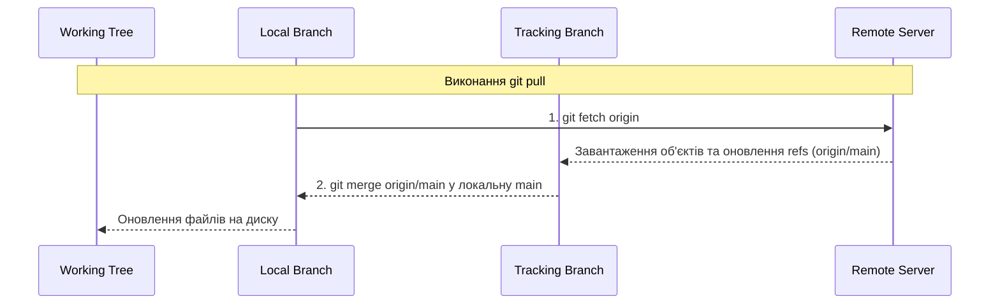

# Модуль 7: Професійна співпраця — Remotes та PR

**Складність**: [СЕРЕДНЯ]  
**Час на виконання**: 75 хвилин  
**Попередні вимоги**: Модуль 6 курсу Git Deep Dive  

## Що ви зможете зробити

Після завершення цього модуля ви зможете:
1. **Діагностувати** розбіжності між local, remote-tracking та remote branches для вирішення проблем синхронізації без втрати даних.
2. **Впровадити** суворий робочий процес fork-and-pull, використовуючи кілька remotes (`origin` та `upstream`) для безпечної корпоративної співпраці.
3. **Оцінити** безпеку оновлення гілок, обираючи між `--force` та `--force-with-lease` на основі стану спільних гілок.
4. **Спроектувати** атомарні коміти (atomic commits), які ізолюють зміни інфраструктури (наприклад, відокремлення оновлень Kubernetes ConfigMap від масштабування Deployment) для спрощення перегляду Pull Request.
5. **Впровадити** специфікації conventional commits та підписання через SSH/GPG для створення автоматизованих, верифікованих журналів змін (changelogs) проєкту.

## Чому це важливо

Молодший platform engineer у логістичній компанії середнього розміру змерджив pull request, що містив неправильно налаштований маніфест Kubernetes Ingress. Оскільки коміти були заплутаними, масивними та не мали чітких описів, старший рев'юер побіжно переглянув диф (diff) на 2500 рядків, пропустив критичне правило маршрутизації хостів і схвалив мердж. Результатом став збій основного API доставки на дві години, що коштувало компанії сотень тисяч доларів втраченого обсягу транзакцій. Аналіз причин (post-mortem) виявив, що інженер об'єднав кілька непов'язаних змін конфігурації — міграції баз даних, service meshes та правила ingress — в один монолітний коміт із розпливчастим повідомленням "update k8s manifests".

Коли інфраструктура визначена як код (IaC), контроль версій є останньою сіткою безпеки перед продакшном. Професійна співпраця в Git — це не просто заучування команд для переміщення коду з ноутбука на сервер; це про передачу наміру, мінімізацію радіусу ураження та забезпечення того, щоб кожна запропонована зміна була незалежно верифікованою. Якщо ви не можете логічно структурувати свої коміти та впевнено навігувати по remote branches, ви вносите системний ризик у конвеєр розгортання вашої команди.

У цьому модулі ви перейдете від використання Git як особистої кнопки "зберегти" до володіння ним як інструментом спільної інженерії. Ви опануєте механіку remote tracking, нюанси стратегій push та дисципліну, необхідну для створення pull requests, які ваші колеги справді зможуть ефективно перевірити.

## 1. Анатомія Remote та Tracking Branches

Багато інженерів помилково вважають, що коли вони посилаються на `origin/main`, вони роблять запит до remote-сервера в режимі реального часу через мережу. Це небезпечна помилка. Git фундаментально децентралізований. Гілка `origin/main` повністю локальна на вашій машині; це кешована закладка того, як виглядала remote-гілка під час останнього зв'язку вашого локального репозиторію із сервером.

Щоб зрозуміти співпрацю, ви повинні візуалізувати три окремі рівні стану репозиторію:

```text
+-----------------------------------------------------------------------+
|                         Git Branch Architecture                       |
+-----------------------------------+-----------------------------------+
|           Local Machine           |           Remote Server           |
|                                   |                                   |
|  +-----------------------------+  |   +-----------------------------+ |
|  |       Local Branches        |  |   |      Remote Repository      | |
|  |       (refs/heads/)         |  |   |          (origin)           | |
|  |                             |  |   |                             | |
|  |  * main                     |  |   |  * main                     | |
|  |  * feature/add-redis        |  |   |  * feature/add-redis        | |
|  +--------------+--------------+  |   +---------------+-------------+ |
|                 |                 |                   |               |
|            git merge              |                   |               |
|                 |                 |                   |               |
|  +--------------v--------------+  |                   |               |
|  |   Remote Tracking Branches  |  |                   |               |
|  |      (refs/remotes/)        | <----- git fetch ----+               |
|  |                             |  |                                   |
|  |  * origin/main              |  |                                   |
|  |  * origin/feature/add-redis |  |                                   |
|  +-----------------------------+  |                                   |
+-----------------------------------+-----------------------------------+
```

Коли ви працюєте офлайн, ви можете зробити checkout `main` і порівняти її з `origin/main`, тому що `origin/main` — це просто файл на вашому жорсткому диску (розташований у `.git/refs/remotes/origin/main`). Він діє як проксі.

### Магія Refspec

Як Git насправді знає, що означає `origin`? Конфігурація зберігається у звичайному тексті у вашому файлі `.git/config`. Якщо ви виконаєте `cat .git/config`, ви побачите щось на зразок цього:

```ini
[remote "origin"]
    url = git@github.com:kubedojo/core-platform.git
    fetch = +refs/heads/*:refs/remotes/origin/*
```

Рядок `fetch` називається **Refspec**. Він явно вказує Git, як зіставляти гілки на сервері з гілками на вашій локальній машині. 
- `refs/heads/*` — це джерело (гілки на сервері).
- `refs/remotes/origin/*` — це місце призначення (ваші локальні tracking branches).
- Знак `+` вказує Git примусово оновлювати ці tracking branches, навіть якщо це призведе до оновлення не за типом fast-forward, гарантуючи, що ваш локальний кеш є точним дзеркалом сервера.

### Перевірка ваших Remotes

Щоб переглянути remotes, налаштовані для вашого локального репозиторію, не відкриваючи файл конфігурації, скористайтеся прапорцем verbose:

```bash
git remote -v
```

Вивід:
```text
origin  git@github.com:kubedojo/core-platform.git (fetch)
origin  git@github.com:kubedojo/core-platform.git (push)
```

> **Зупиніться та подумайте**: Що, на вашу думку, станеться, якщо ви виконаєте `git commit`, перебуваючи на локальній гілці `main`? Чи переміститься `origin/main`?

*Результат передбачення:* Тільки ваш локальний покажчик гілки `main` переміститься вперед. `origin/main` залишиться саме там, де він був, представляючи останній відомий стан сервера. Тепер вони розходяться (diverged).

## 2. Fetch vs Pull: Прихована небезпека

Оскільки `origin/main` є лише локальним кешем, він застаріває в той момент, коли колега пушить (push) новий код на remote-сервер. Щоб оновити кеш, ви повинні виконати синхронізацію.

Саме тут різниця між `git fetch` та `git pull` стає критичною.

### `git fetch`: Безпечна розвідка
Виконання `git fetch origin` просто підключається до remote, завантажує будь-які нові коміти та оновлює ваші Remote Tracking Branches (`origin/*`). Це **не** зачіпає ваші локальні гілки або робочу директорію. Це абсолютно безпечно. Ви можете робити fetch десяток разів на день, не впливаючи на свою поточну роботу.

### `git pull`: Агресивне оновлення
Виконання `git pull` — це складна операція. "Під капотом" вона виконує:
1. `git fetch origin`
2. `git merge origin/main` (припускаючи, що ви перебуваєте на гілці `main`)



### Загроза Merge Commit
Якщо ви зробили локальні коміти в `main`, і remote `main` також отримав нові коміти, `git pull` автоматично створить "Merge commit", щоб узгодити дві розбіжні історії.

```text
Fast-Forward Merge (Чисто — коли у вас немає локальних комітів):
A --- B --- C (origin/main)
             \
              C' (main, після pull)

3-Way Merge (Брудно — коли історії розійшлися):
A --- B --- C (origin/main)
       \      \
        D ---- M (main, після pull)
        ^
    Ваш локальний коміт
```

Це засмічує історію проєкту непотрібними "алмазами" гілок (branch diamonds). Для підтримки чистої лінійної історії сучасні інженерні команди віддають перевагу rebase замість merge при отриманні оновлень.

```bash
# Fetch та rebase ваших локальних комітів поверх remote-оновлень
git pull --rebase origin main
```

Ви можете зробити це поведінкою за замовчуванням для своєї машини:
```bash
git config --global pull.rebase true
```

## 3. Модель Fork and Pull (Upstream vs Origin)

У корпоративних середовищах та проєктах з відкритим вихідним кодом ви рідко маєте прямий доступ на запис до центрального репозиторію. Замість цього використовується модель "Fork and Pull", яку часто називають **Triangle Workflow** (трикутний робочий процес).

1. **Upstream**: Центральний, авторитетний репозиторій (наприклад, `kubedojo/core-platform`).
2. **Origin**: Ваша особиста копія репозиторію у вашому власному акаунті (наприклад, `yourname/core-platform`).
3. **Local**: Ваш ноутбук.

Ви клонуєте свій fork на свій ноутбук, тобто `origin` вказує на вашу особисту копію. Щоб залишатися синхронізованим з рештою команди, ви повинні вручну додати центральний репозиторій як другий remote під назвою `upstream`.

```bash
# Додайте центральний репозиторій як remote
git remote add upstream git@github.com:kubedojo/core-platform.git

# Перевірте конфігурацію
git remote -v
```

Очікуваний вивід:
```text
origin    git@github.com:yourname/core-platform.git (fetch)
origin    git@github.com:yourname/core-platform.git (push)
upstream  git@github.com:kubedojo/core-platform.git (fetch)
upstream  git@github.com:kubedojo/core-platform.git (push)
```

### Синхронізація Fork (Triangle Workflow)
Щоб оновити свою локальну гілку `main` відповідно до центрального репозиторію команди, ви робите pull з однієї точки трикутника і push в іншу.

```bash
# 1. Отримайте всі оновлення з центрального репозиторію
git fetch upstream

# 2. Переконайтеся, що ви на локальній гілці main
git checkout main

# 3. Оновіть локальну гілку main, щоб вона точно відповідала upstream
git rebase upstream/main

# 4. Пушніть синхронізований стан у свій особистий fork
git push origin main
```

> **Зупиніться та подумайте**: Якщо ви випадково виконаєте `git push upstream main`, який результат ви очікуєте?

*Результат передбачення:* Сервер відхилить push з помилкою HTTP 403 Forbidden, оскільки ви не маєте прав прямого запису в репозиторій upstream. Це саме та межа безпеки, для забезпечення якої розроблена модель fork.

## 4. Безпечний Force Push: Механізм Lease

Коли ви робите rebase гілки або amend коміту, ви переписуєте історію Git. Фактично ви створюєте абсолютно нові коміти, які просто мають той самий вміст файлів. Якщо ви вже запушили стару версію цієї гілки на remote, ваша локальна історія та історія на remote тепер конфліктують. Стандартний `git push` буде відхилено.

Ви повинні змусити remote прийняти вашу переписану історію.

### Небезпека `--force`
Виконання `git push --force` говорить remote-серверу: "Перепиши все, що в тебе є, моїм локальним станом, без зайвих питань".

**Реальна історія:** Platform engineer на ім'я Алекс працював над спільною гілкою фічі (`feature/helm-migration`). Алекс зробив локальний rebase гілки, щоб підправити повідомлення комітів, а потім ввів `git push --force`. Тим часом колега, Сара, за годину до цього запушила три нові коміти саме в цю remote-гілку. Force-push Алекса повністю стер коміти Сари з remote-сервера. Git зробив саме те, що йому наказали: він перезаписав історію сервера локальною історією Алекса.

### Рішення: `--force-with-lease`
Замість безумовного знищення використовуйте "оренду" (lease).

```bash
git push --force-with-lease origin feature/helm-migration
```

Коли ви використовуєте `--force-with-lease`, Git виконує перевірку безпеки. Він порівнює вашу локальну tracking branch (`origin/feature/helm-migration`) із фактичною гілкою на remote-сервері. 
- Якщо вони збігаються, це означає, що ніхто інший не пушив нові коміти з моменту вашого останнього fetch. Force-push проходить успішно.
- Якщо вони не збігаються, це означає, що хтось (наприклад, Сара) запушив нову роботу. Push миттєво відхиляється, зберігаючи дані вашого колеги.

**Що робити, якщо вашу "оренду" (lease) відхилено?**
Якщо `--force-with-lease` відхилено, не панікуйте і не повертайтеся до `--force`.
1. Виконайте `git fetch origin`, щоб оновити свої tracking branches.
2. Виконайте `git log origin/feature-branch`, щоб побачити, що запушив ваш колега.
3. Додайте їхні зміни у свою роботу (зазвичай через `git rebase origin/feature-branch`).
4. Спробуйте виконати push `--force-with-lease` знову.

Завжди використовуйте `--force-with-lease`. Ніколи не використовуйте `--force`.

## 5. Життєвий цикл Pull Request та Atomic Commits

Pull Request (PR) — це запит на мердж вашої гілки в основну гілку (main) upstream. Якість PR повністю визначається комітами, які він містить.

**Атомарний коміт (Atomic Commit)** — це коміт, який робить рівно одну логічну річ і залишає репозиторій у повністю робочому стані. Він повинен компілюватися, тести повинні проходити, а інфраструктура повинна успішно розгортатися на кожному окремому коміті в історії.

Уявіть, що вам потрібно оновити Deployment у Kubernetes для використання нового ConfigMap.

**Погана практика (монолітний коміт):**
Ви змінюєте `deployment.yaml`, `configmap.yaml`, `service.yaml` та оновлюєте скрипт Python, а потім комітите їх усі разом із повідомленням: `fix: update environment setup`.

Якщо розгортання не вдасться, команді доведеться скасувати (revert) весь коміт, видаливши правильний скрипт Python та зміни Service разом із несправним ConfigMap.

**Хороша практика (атомарні коміти):**
Ви логічно розділяєте зміни, використовуючи інструмент інтерактивного додавання Git: `git add -p`.

```bash
git add -p deployment.yaml
```

Git покаже вам фрагменти (hunks) коду і запитає, що ви хочете зробити:
```text
diff --git a/deployment.yaml b/deployment.yaml
@@ -14,6 +14,9 @@
     spec:
       containers:
       - name: api
+        envFrom:
+        - configMapRef:
+            name: app-config
         image: internal.registry.com/finance/payment:v1.2.4

Stage this hunk [y,n,q,a,d,s,e,?]? 
```

Ви можете натиснути `y`, щоб додати його, `n`, щоб пропустити, або `s`, щоб розділити на менші частини. Це дозволяє створювати точні, логічні коміти з безладної робочої директорії.

Коміт 1: Додавання нових змінних ConfigMap.
```yaml
# configmap.yaml
apiVersion: v1
kind: ConfigMap
metadata:
  name: app-config
data:
  ENABLE_NEW_FEATURE: "true"
  CACHE_TIMEOUT_SECONDS: "300"
```

Коміт 2: Монтування ConfigMap у Deployment.
```yaml
# deployment.yaml
apiVersion: apps/v1
kind: Deployment
metadata:
  name: backend-api
spec:
  template:
    spec:
      containers:
      - name: api
        envFrom:
        - configMapRef:
            name: app-config
```

Коміт 3: Оновлення логіки скрипта Python.

*Примітка: Приклади маніфестів у цьому модулі передбачають сумісність із Kubernetes 1.35+, що гарантує використання останніх стабільних версій API.*

Коли ви відкриваєте PR, що містить ці три атомарні коміти, рев'юер може проходити по логіці послідовно. Якщо конфігурація Deployment неправильна, вони можуть попросити внести зміни саме в Коміт 2.

## 6. Conventional Commits та Signed Commits

Для подальшої професіоналізації співпраці команди використовують **Conventional Commits** для стандартизації повідомлень комітів, що дозволяє автоматизованим інструментам створювати журнали змін (changelogs) та автоматично визначати підвищення семантичної версії.

### Формат Conventional Commit

```text
<type>[optional scope]: <description>

[optional body]

[optional footer(s)]
```

Поширені типи та їхній вплив на семантичне версіонування:
- `fix:` Виправлення помилки. (Викликає PATCH реліз, наприклад, `v1.0.1`)
- `feat:` Нова фіча або можливість. (Викликає MINOR реліз, наприклад, `v1.1.0`)
- `docs:` Зміни лише в документації. (Без релізу)
- `chore:` Завдання з обслуговування, оновлення залежностей. (Без релізу)
- `refactor:` Зміни коду, які не виправляють помилку і не додають фічу. (Без релізу)
- `BREAKING CHANGE:` будь-де у футері або `!` після типу. (Викликає MAJOR реліз, наприклад, `v2.0.0`)

Приклад:
```text
feat(ingress): add TLS termination for backend services

Configured the cert-manager annotations on the primary ingress route
to automate Let's Encrypt certificate provisioning.

Resolves: #812
```

### Підписання комітів
Щоб підтвердити, що коміт справді надійшов від вас (а не від зловмисника, що підробив вашу електронну адресу), ви повинні криптографічно підписувати свої коміти.

Раніше це вимагало складного керування ключами GPG. Починаючи з Git 2.34, ви можете використовувати для цього стандартні ключі SSH.

```bash
# Налаштуйте Git на використання SSH для підпису
git config --global gpg.format ssh

# Вкажіть Git свій публічний ключ SSH
git config --global user.signingkey ~/.ssh/id_ed25519.pub

# Накажіть Git підписувати всі коміти автоматично
git config --global commit.gpgsign true
```

Тепер кожного разу, коли ви робите коміт, Git використовуватиме ваш SSH-ключ для підпису об'єктів, а такі платформи, як GitHub/GitLab, відображатимуть довірений значок "Verified" поруч із вашою роботою.

## 7. Рев’ю коду: Людський фактор

Подання Pull Request — це лише половина справи; перевірка коду ваших колег — інша. Ефективне рев'ю коду — це навичка високого рівня, яка відрізняє молодших інженерів від старших.

**Що ігнорувати:**
- Форматування, пробіли та стиль. (Цим повинні займатися автоматичні лінтери та форматери, такі як `Prettier` або `gofmt`).
- Відсутні крапки з комою або тривіальні синтаксичні проблеми.

**На чому зосередитися:**
- **Архітектура**: Чи вписується ця зміна в загальний дизайн системи?
- **Безпека**: Чи захардкоджені облікові дані? Чи не є контексти безпеки Kubernetes занадто дозволяючими (наприклад, `runAsRoot: true`)?
- **Стійкість**: Чи є обмеження ресурсів (resource limits) на контейнерах? Що станеться, якщо залежний сервіс буде недоступний?
- **Спостережуваність (Observability)**: Чи додав розробник необхідне логування або метрики для нової фічі?

Під час рев'ю будьте доброзичливими, але суворими. Замість того, щоб сказати: "Це неправильно, використовуй Secret замість ConfigMap", скажіть: "Оскільки це містить API-ключ, нам варто розглянути можливість перенесення цього в Kubernetes Secret, щоб запобігти його розкриттю у відкритому тексті в логах. Що ви думаєте?"

### Антипатерни рев’ю коду

| Антипатерн | Опис | Як це виправити |
|--------------|-------------|---------------|
| **Гумовий штамп** | Схвалення PR суто на основі довіри або тому, що "це просто зміна конфігурації". | Насправді зробіть pull гілки локально і протестуйте її. Прочитайте кожен рядок. |
| **Синтаксичний снайпер** | Зосередження виключно на табах проти пробілів, іменах змінних або інших помилках лінтингу. | Налаштуйте автоматизований CI-конвеєр з лінтером, щоб людям не доводилося перевіряти синтаксис. |
| **Рев'юер-привид** | Залишення коментарів у PR, але ніколи не повернення для схвалення після того, як автор вніс запрошені зміни. | Встановіть чіткі SLA для повторної перевірки коду (наприклад, протягом 24 годин після оновлення). |
| **Схвалювач монолітів** | Перегляд PR на 3000 рядків і здача на півдорозі, просто схвалення, щоб прибрати його з черги. | Відхиліть PR і попросіть автора розділити його на кілька менших атомарних PR. |

## Чи знали ви?

1. Список розсилки ядра Linux все ще значною мірою покладається на `git format-patch` та гілки електронної пошти для рев'ю коду, повністю уникаючи сучасних веб-інтерфейсів Pull Request.
2. Git не відстежує директорії, лише файли. Директорія існує у внутрішній базі даних об'єктів Git лише в тому випадку, якщо вона містить хоча б один відстежуваний файл.
3. Специфікація conventional commit була значною мірою натхненна правилами комітів проєкту Angular, які були формалізовані у 2014 році для керування їхніми величезними журналами змін.
4. Ключі SSH можна використовувати для підпису комітів Git нативно, починаючи з версії Git 2.34, що усуває складну вимогу керування ключами GPG для розробників, які вже використовують SSH для автентифікації.

## Типові помилки

| Помилка | Чому це трапляється | Як це виправити |
|---------|----------------|---------------|
| Виконання `git pull` на розбіжній гілці | Git за замовчуванням мерджить remote tracking branch у локальну гілку, створюючи непотрібний merge commit. | Налаштуйте Git на rebase при pull за замовчуванням: `git config --global pull.rebase true`. |
| Пуш через `git push --force` | Ви зробили rebase локально, і remote відхилив стандартний push, тому ви форснули його наосліп. | Завжди використовуйте `git push --force-with-lease`, щоб захистити коміти, запушені колегами. |
| Коміт секретів у гілку | Забули додати файли `.env` або облікові дані в `.gitignore` перед виконанням `git add .`. | Негайно скористайтеся `git rm --cached <file>` і розгляньте можливість використання таких інструментів, як `git-filter-repo`, якщо це вже було запушено. |
| Розпливчасті повідомлення комітів | Поводження з повідомленням коміту як з формальністю, а не як з інструментом комунікації (наприклад, "updates"). | Прийміть специфікацію Conventional Commits і опишіть, *чому* було зроблено зміну, а не лише *що* змінилося. |
| Пуш безпосередньо в `main` upstream | Наявність прав на запис у центральний репозиторій та обхід процесу рев'ю PR. | Захистіть гілку `main` у налаштуваннях репозиторію, щоб вона суворо вимагала верифікованих Pull Requests для внесення змін. |
| Сквош (squash) непов'язаних змін | Лінь; бажання згрупувати результати роботи за весь день в одну точку збереження. | Використовуйте `git add -p` для інтерактивного додавання специфічних частин файлів у окремі атомарні коміти. |
| Паніка при відхиленні lease | Ви використали `--force-with-lease`, і він не вдався, тому ви переходите на `--force`. | Зупиніться. Зробіть fetch з remote, перевірте нові коміти, змерджіть або перебазуйте їх у свою роботу і спробуйте lease знову. |

## Контрольні запитання

<details>
<summary>Запитання 1: Ви готові почати роботу над новою фічею. Ви знаєте, що гілка `main` в upstream отримала оновлення з учорашнього дня. Яка послідовність команд гарантує, що ваша локальна гілка `main` ідеально синхронізована перед тим, як ви створите нову гілку?</summary>
Відповідь: Спочатку `git fetch upstream`, щоб оновити ваші tracking branches. Потім `git checkout main`, щоб переконатися, що ви перебуваєте на правильній локальній гілці. Нарешті, `git rebase upstream/main`, щоб перемістити вашу локальну гілку вперед до відповідності стану remote. (Використання `git pull --rebase upstream main` робить те саме за один крок). Цей багатоетапний процес є вирішальним, оскільки він чисто оновлює ваш локальний стан без створення непотрібних merge-комітів, гарантуючи, що ваша нова гілка фічі починається з чистої лінійної історії.
</details>

<details>
<summary>Запитання 2: Ви щойно витратили годину на rebase локальної гілки фічі, щоб об'єднати (squash) деякі безладні коміти. Ви запускаєте `git push origin my-feature`, і його відхилено. Чому це сталося, і який найбезпечніший спосіб діяти далі?</summary>
Відповідь: Push було відхилено, оскільки rebase переписує хеші комітів, спричиняючи розбіжність вашої локальної історії з історією на remote. Сервер бачить це як конфлікт. Найбезпечніший спосіб діяти — `git push --force-with-lease origin my-feature`. Це важливо, тому що це примушує оновити дані, але містить перевірку безпеки, яка скасовує операцію, якщо за цей час колега запушив нові коміти на remote, запобігаючи випадковому перезапису їхньої роботи.
</details>

<details>
<summary>Запитання 3: Ваша команда вимагає атомарних комітів. Ви додали новий маніфест Deployment для Redis, оновили маніфест Service бекенду, щоб відкрити новий порт, і виправили друкарську помилку в README. Як ви повинні закомітити це?</summary>
Відповідь: Ви повинні створити три окремі коміти, використовуючи `git add -p` або вказавши файли окремо: один коміт для розгортання Redis (`feat(cache): add redis deployment`), один для оновлення порту Service (`feat(api): expose backend port 8080`) і один для виправлення в README (`docs: fix typo in setup instructions`). Цей поділ необхідний, оскільки він ізолює зміни за їхньою логічною метою, дозволяючи рев'юерам перевіряти їх незалежно. Крім того, атомарні коміти дозволяють безпечно і точно робити відкати (rollbacks), якщо один конкретний компонент вийде з ладу, не зачіпаючи непов'язані зміни.
</details>

<details>
<summary>Запитання 4: У вас є незакомічені зміни в робочій директорії, і ваш колега щойно запушив зміну, що порушує сумісність (breaking change), в `origin/main`. Ви виконуєте `git fetch origin`. Яким буде стан вашої робочої директорії та локальної гілки `main` після цього?</summary>
Відповідь: Ваша робоча директорія та локальна гілка `main` залишаться абсолютно без змін. `git fetch` — це безпечна операція, яка лише завантажує нові об'єкти з remote-сервера та оновлює ваші приховані Remote Tracking Branches (наприклад, `origin/main`). Ви повинні явно зробити merge або rebase, щоб інтегрувати ці зміни у ваші локальні файли. Така поведінка гарантує, що ваша незакомічена робота залишається в безпеці від несподіваного перезапису під час рутинної синхронізації.
</details>

<details>
<summary>Запитання 5: Ви вносите вклад у контролер Kubernetes з відкритим кодом, використовуючи модель Fork and Pull. Ви клонуєте свій особистий fork на свій ноутбук. Мейнтейнер мерджить велику фічу в центральний репозиторій. З якого remote ви повинні зробити fetch, щоб отримати ці зміни, і чому такий поділ remotes необхідний?</summary>
Відповідь: Ви повинні зробити fetch з remote `upstream`, який вказує на центральний авторитетний репозиторій. Цей поділ необхідний для безпеки та контролю доступу, оскільки ви не маєте прав прямого запису на сервер `upstream`. Підтримуючи як `origin` (ваш fork з доступом на запис), так і `upstream` (центральний репозиторій тільки для читання), ви можете безпечно отримувати останні зміни спільноти. Цей робочий процес дозволяє вам пушити власні пропозиції у свій fork, не ризикуючи цілісністю історії основного проєкту.
</details>

<details>
<summary>Запитання 6: Колега перевіряє ваш Pull Request і просить змінити мітку (label) у маніфесті Kubernetes Deployment. Ви вносите зміну локально. Як оновити PR, не додаючи безладний коміт "fix label" в історію?</summary>
Відповідь: Ви додаєте зміну в index через `git add deployment.yaml`, потім запускаєте `git commit --amend --no-edit`, щоб об'єднати зміну з попереднім комітом. Нарешті, ви запускаєте `git push --force-with-lease origin branch-name`, щоб оновити Pull Request на сервері. Цей робочий процес важливий, оскільки він підтримує чисту атомарну історію комітів, яка відображає фінальний запланований стан фічі. Використовуючи amend замість додавання нових комітів, ви уникаєте засмічення журналу проєкту ітераційними виправленнями помилок.
</details>

<details>
<summary>Запитання 7: Ваш CI-конвеєр використовує префікси комітів для прийняття рішення про запуск розгортання. Колега пушить коміт із повідомленням `chore(deps): bump helm to 3.15`. Чи повинен конвеєр запустити розгортання на продакшн? Чому так чи ні?</summary>
Відповідь: Конвеєр не повинен запускати розгортання на продакшн. Згідно зі специфікацією Conventional Commits, тип `chore` вказує на рутинне обслуговування, яке не змінює логіку програми та не додає фіч. Зокрема, `chore(deps)` означає, що було оновлено залежність. Запуск розгортання для нефункціональних змін або змін, які не стосуються користувача, вносить непотрібний ризик, тому CI-конвеєри зазвичай ігнорують такі коміти.
</details>

<details>
<summary>Запитання 8: Зловмисник отримує доступ до внутрішньої мережі вашої організації та намагається пушнути бекдор у скрипт розгортання, налаштувавши свій клієнт Git на використання вашого імені та електронної пошти. Як криптографічний підпис комітів запобігає довірі до цього коду?</summary>
Відповідь: Хоча будь-хто може налаштувати локальні `user.name` та `user.email`, щоб видати себе за іншого розробника, вони не можуть підробити криптографічний підпис, не володіючи вашим приватним ключем SSH або GPG. Коли коміти підписані, CI-конвеєри та платформи перевірки коду верифікують підпис за допомогою вашого публічного ключа. Коміт зловмисника не пройде перевірку і не матиме значка "Verified". Відсутність цього значка негайно сигналізує рев'юерам про спробу підробки та запобігає злиттю несанкціонованого бекдора.
</details>

<details>
<summary>Запитання 9: Ви перевіряєте Pull Request, який впроваджує новий мікросервіс. PR містить один коміт із дифом на 2500 рядків, що одночасно змінює Kubernetes Deployment, Service, ConfigMap, Ingress та вихідний код програми. Чому ви повинні відхилити цей PR і що наказати автору зробити?</summary>
Відповідь: Ви повинні відхилити PR, оскільки коміт є монолітним, що унеможливлює його ефективну перевірку або безпечний відкат, якщо окремий компонент вийде з ладу. Радіус ураження занадто великий для одного схвалення. Ви повинні наказати автору використати `git add -p`, щоб розбити зміни на менші атомарні коміти. Такий підхід дозволяє ізолювати оновлення ConfigMap, зміни коду програми та маршрутизацію Ingress у незалежні, логічно розділені коміти, які можна ретельно перевірити.
</details>

<details>
<summary>Запитання 10: Під час реагування на інцидент вам потрібно скасувати недавнє оновлення Kubernetes ConfigMap, яке зламало продакшн. Історія комітів показує, що зміна ConfigMap була об'єднана в один коміт із критичним патчем безпеки для образу програми. Яким є наслідок цього неатомарного коміту і як це ускладнює відкат?</summary>
Відповідь: Оскільки зміни були об'єднані неатомарно, ви не можете використати простий `git revert`, щоб скасувати оновлення ConfigMap, не видаливши при цьому критичний патч безпеки. Це змушує команду вручну витягувати зміну ConfigMap, створювати новий коміт для її виправлення і пушити його вперед, поки система перебуває в деградованому стані. Якби коміт був атомарним (один коміт для ConfigMap, один для патча безпеки), ви могли б миттєво скасувати лише помилку конфігурації. Цей сценарій демонструє, чому атомарні коміти є фундаментальною вимогою для надійного реагування на інциденти.
</details>

## Практична вправа

У цій вправі ви змоделюєте професійний робочий процес fork-and-pull, створюючи атомарні коміти та проходячи цикл рев'ю PR. 

**Інструкції з налаштування:**
1. Створіть нову порожню директорію на своїй машині під назвою `k8s-pr-lab` та ініціалізуйте git-репозиторій.
2. Ми змоделюємо remotes `upstream` та `origin`, використовуючи локальні папки замість GitHub, щоб вправа була самодостатньою.

### Завдання 1: Налаштування симульованих Remotes
Виконайте наступні команди, щоб створити "серверні" репозиторії.

```bash
# Створіть центральний репозиторій upstream
mkdir upstream.git
cd upstream.git
git init --bare
cd ..

# Створіть свій особистий репозиторій fork (origin)
mkdir origin.git
cd origin.git
git init --bare
cd ..
```

Тепер підключіть свій робочий репозиторій до цих remotes.

```bash
cd k8s-pr-lab
git remote add origin ../origin.git
git remote add upstream ../upstream.git

# Створіть початковий коміт, щоб гілки існували
echo "# Core Platform" > README.md
git add README.md
git commit -m "chore: initial project setup"
git push origin main
git push upstream main
```

### Завдання 2: Створення гілки фічі
Як фахівець з Kubernetes, ви повинні налаштувати стандартний аліас для kubectl, якщо ви ще цього не зробили: `alias k=kubectl`. Ми визначаємо інфраструктуру, тому створіть нову гілку фічі для додавання розгортання NGINX.

```bash
git checkout -b feat/nginx-deployment
```

### Завдання 3: Створення атомарних комітів
Створіть маніфести Kubernetes, використовуючи два окремі атомарні коміти з повідомленнями у форматі conventional commit.

Спочатку створіть маніфест namespace:
```yaml
# namespace.yaml
apiVersion: v1
kind: Namespace
metadata:
  name: web-tier
```
Закомітьте цей файл окремо:
```bash
git add namespace.yaml
git commit -m "feat(k8s): add web-tier namespace"
```

Далі створіть маніфест deployment:
```yaml
# deployment.yaml
apiVersion: apps/v1
kind: Deployment
metadata:
  name: nginx
  namespace: web-tier
spec:
  replicas: 2
  selector:
    matchLabels:
      app: nginx
  template:
    metadata:
      labels:
        app: nginx
    spec:
      containers:
      - name: nginx
        image: nginx:1.24-alpine
```
Закомітьте цей файл окремо:
```bash
git add deployment.yaml
git commit -m "feat(k8s): add nginx deployment"
```

### Завдання 4: Пуш у ваш Fork
Пушніть гілку фічі у свій особистий репозиторій `origin`.
```bash
git push origin feat/nginx-deployment
```

### Завдання 5: Реагування на фідбек рев'ю
Уявіть, що рев'юер попросив вас збільшити кількість `replicas` до `3`. Замість того, щоб створювати новий коміт "fix replicas", ви зробите amend своєї попередньої роботи, щоб зберегти історію чистою.

Змініть `deployment.yaml`, виправивши `replicas: 2` на `replicas: 3`.

```bash
# Додайте зміну в index
git add deployment.yaml

# Об'єднайте її з попереднім комітом
git commit --amend --no-edit

# Безпечно форсніть переписаний коміт у свій fork
git push --force-with-lease origin feat/nginx-deployment
```

### Завдання 6: Рев'ю та мердж через Squash
У реальному світі ви б відкрили PR на GitHub. Тут ми змоделюємо, як мейнтейнер репозиторію перевіряє та мерджить ваш код, використовуючи squash merge. Squash merge бере всі коміти з вашої гілки фічі, об'єднує (squashes) їх в один новий коміт і розміщує його в гілці `main`. Це зберігає історію гілки `main` бездоганною.

Перейдіть на гілку `main` і змерджіть гілку фічі, використовуючи прапорець squash:
```bash
git checkout main
git merge --squash feat/nginx-deployment
```

На цьому етапі Git підготував мердж, але *не* створив коміт. Перевірте свій статус:
```bash
git status
```

Закомітьте об'єднані зміни з новим повідомленням conventional commit, яке підсумовує весь PR:
```bash
git commit -m "feat(web): introduce nginx deployment and namespace

This adds the core web-tier namespace and the nginx deployment 
configured for 3 replicas based on review feedback.

Resolves PR #1"
```

### Завдання 7: Очищення
Пушніть новостворений коміт в upstream (імітуючи натискання кнопки "Merge PR" мейнтейнером).
```bash
git push upstream main
```

Тепер видаліть локальну гілку фічі, щоб підтримувати чистоту робочого простору:
```bash
git branch -d feat/nginx-deployment
```

І наостанок, зробіть fetch з upstream і синхронізуйте свій origin, щоб завершити "трикутник":
```bash
git fetch upstream
git rebase upstream/main
git push origin main
```

### Критерії успіху
- [ ] У вас налаштовано два remote-репозиторії (`origin` та `upstream`).
- [ ] Ваша гілка фічі містить рівно два нові коміти (один для namespace, один для deployment).
- [ ] Повідомлення коміту deployment суворо відповідає формату conventional commit.
- [ ] Ви успішно використали `--force-with-lease` для оновлення remote-гілки після операції amend.
- [ ] Ви успішно зробили squash гілки фічі в гілку `main`, що призвело до одного чистого коміту.

### Рішення
<details>
<summary>Переглянути команди для перевірки стану репозиторію</summary>

Запустіть `git remote -v`, щоб перевірити remotes:
```text
origin    ../origin.git (fetch)
origin    ../origin.git (push)
upstream  ../upstream.git (fetch)
upstream  ../upstream.git (push)
```

Запустіть `git log --oneline`, щоб перевірити атомарні коміти перед squash:
```text
a1b2c3d (HEAD -> feat/nginx-deployment, origin/feat/nginx-deployment) feat(k8s): add nginx deployment
e4f5g6h feat(k8s): add web-tier namespace
i7j8k9l (upstream/main, origin/main, main) chore: initial project setup
```

Запустіть `git log --oneline main`, щоб перевірити стан після squash:
```text
m0n1o2p (HEAD -> main, upstream/main, origin/main) feat(web): introduce nginx deployment and namespace
i7j8k9l chore: initial project setup
```
*(Ваші хеші комітів будуть відрізнятися)*
</details>

## Наступний модуль

Готові застосувати ці концепції у величезних середовищах монорепозиторіїв? Переходьте до [Модуля 8: Ефективність у масштабі](../module-8-scale/).