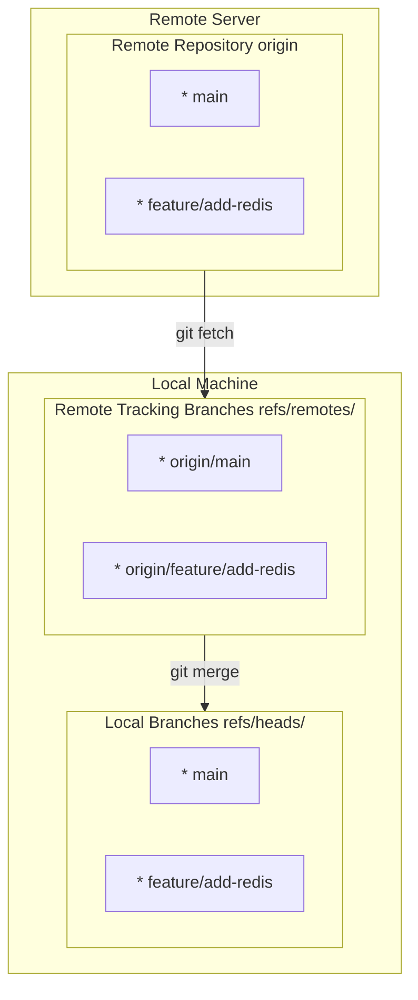
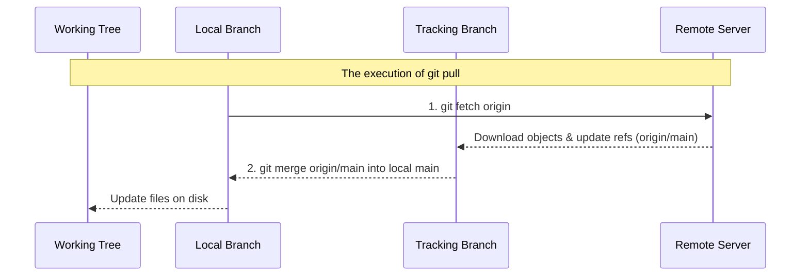
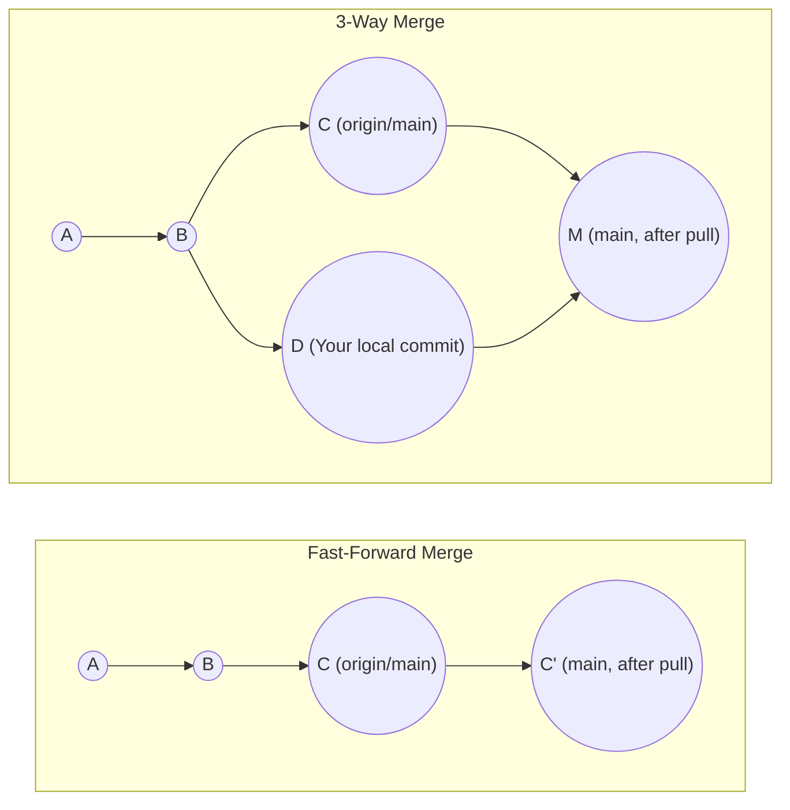
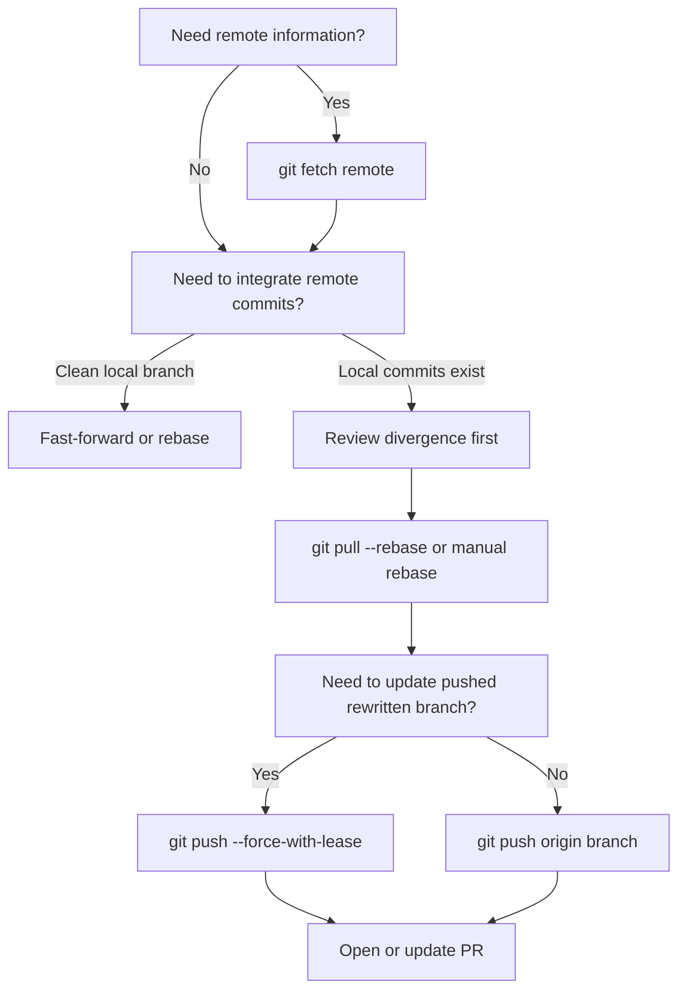

> **Складність**: [СЕРЕДНЯ]
>
> **Час на проходження**: 90 хвилин
>
> **Передумови**: Модуль 6 Поглибленого курсу з Git, впевнена робота з гілками та базове редагування маніфестів Kubernetes. У цьому модулі використовуються приклади для Kubernetes 1.35+ та команди для копіювання і вставки, які містять повне ім'я бінарного файлу `kubectl`, коли демонструється валідація Kubernetes.

---


## Що ви зможете зробити

До кінця цього модуля ви зможете виконувати наступні завдання зі співпраці в реалістичних інженерних робочих процесах:

1. **Діагностувати** розбіжності між локальними гілками, віддаленими гілками відстеження та віддаленими гілками перед інтеграцією або перезаписом спільної роботи.
2. **Реалізувати** робочий процес fork-and-pull, використовуючи окремі віддалені репозиторії `origin` та `upstream`, не плутаючи стан особистого форка з авторитетним станом проєкту.
3. **Оцінити**, коли доцільно використовувати `--force-with-lease` після виконання rebase або amend, та обрати шлях відновлення, якщо lease відхиляє ваш push.
4. **Спроєктувати** атомарні коміти та pull request-и, які ізолюють зміни маніфестів Kubernetes, докази для рецензування та межі відкоту.
5. **Впровадити** практики конвенційних та підписаних комітів, які роблять історію рецензування корисною для людей, засобів автоматизації релізів та політик аудиту.


## Чому це важливо

Гіпотетичний сценарій: команда платформи готує рутинну зміну конфігурації Kubernetes 1.35+ для бекенд-сервісу. Один інженер оновлює ConfigMap, інший коригує Deployment, а третій відкриває pull request після виконання rebase для застарілої гілки. Фінальний diff не має очевидних помилок, проте гілка містить непов'язані зміни в маніфестах, туманне повідомлення коміту та переписану віддалену гілку (remote branch), яку ніхто не завантажував (fetch) від початку рев'ю. Жодна з цих подій не вимагає екзотичних збоїв Git; звичайних скорочень шляхів під час співпраці достатньо, щоб змусити рев'ювера вгадувати, де закінчується задум і починається випадкове відхилення (accidental drift).

Продуктові репозиторії (Production repositories) залежать від Git як від чогось більшого, ніж просто механізм передачі файлів. Хороша гілка фіксує, хто запропонував зміну, який remote надав базу, як автор відреагував на рев'ю, і чи можна зрозуміти фінальну історію в умовах браку часу. Коли репозиторій зберігає інфраструктуру як код (infrastructure as code), ця історія стає частиною операційної площини управління. Рев'юверу, який вирішує, чи є безпечною зміна Deployment, потрібна гілка, що відокремлює ресурси-передумови від поведінки робочого навантаження (workload behavior), а не купа редагувань, які просто проходять перевірку синтаксису.

Цей модуль навчає професійної співпраці як набору звичок управління станом. Ви перевірятимете remote-tracking гілки як локальний кеш, вибиратимете між fetch і pull на основі ризиків, триматимете remote форків окремо, переписуватимете гілки рев'ю за допомогою lease-блокувань, формуватимете атомарні pull requests і використовуватимете конвенції комітів, які підтримують автоматизацію. Команди прості, але розсудливість має значення: кожен крок синхронізації або захищає увагу рев'ювера, або витрачає її.

## 1. Віддалений стан — це локальний кеш, а не вікно реального часу

Багато інженерів спочатку вивчають Git на одній машині, тому імена remote відчуваються як вікна до сервера. Ця ментальна модель небезпечна, оскільки `origin/main` — це не живий запит до GitHub, GitLab або будь-якої іншої платформи хостингу. Це локальне посилання, яке зберігається у вашій директорії `.git` і оновлюється лише тоді, коли ваш репозиторій взаємодіє з remote. Якщо ви порівнюєте свою гілку із застарілим `origin/main`, Git відповідатиме чесно, використовуючи застарілі дані, і помилка полягає у припущенні, а не в команді.

Уявіть remote-tracking гілку як роздрукований розклад поїздів на вашому столі. Розклад був корисним у момент друку, і він усе ще може бути точним, але він не доводить, що поїзд не змінив платформу з того часу, як ви перевіряли востаннє. Команда `git fetch` друкує свіжий розклад, завантажуючи об'єкти та оновлюючи remote-tracking посилання. Поки ви не виконаєте fetch, рішення щодо rebase, видалення або force-push базуються на вашому останньому відомому погляді на сервер, а не на поточній верхівці (tip) гілки сервера.


```mermaid
flowchart TD
    subgraph LocalMachine [Local Machine]
        direction TB
        subgraph LocalBranches [Local Branches refs/heads/]
            L_main["* main"]
            L_feat["* feature/add-redis"]
        end
        subgraph TrackingBranches [Remote Tracking Branches refs/remotes/]
            T_main["* origin/main"]
            T_feat["* origin/feature/add-redis"]
        end
        TrackingBranches -- "git merge" --> LocalBranches
    end
    
    subgraph RemoteServer [Remote Server]
        direction TB
        subgraph RemoteRepo [Remote Repository origin]
            R_main["* main"]
            R_feat["* feature/add-redis"]
        end
    end
    
    RemoteRepo -- "git fetch" --> TrackingBranches
```

Діаграма розділяє трьох власників. Локальні гілки рухаються, коли ви виконуєте commit, merge, rebase, reset або checkout нової позиції. Remote-tracking гілки рухаються, коли ви виконуєте fetch, pull або push таким чином, що оновлює ваші локальні знання про remote. Віддалені гілки (remote branches) рухаються, коли хтось успішно виконує push на сервер. Професійна робота в Git починається з визначення того, про який рівень іде мова, оскільки "мій `main` випереджає `origin/main`" — це інший діагноз, ніж "сервер випереджає мою локальну гілку".

Відображення між віддаленим сервером і вашим простором імен remote-tracking налаштовується у `.git/config`. Читання цієї конфігурації знімає частину таємничості з Git, оскільки воно показує, що `origin` — це іменована кінцева точка плюс правило для копіювання позицій гілок у ваш локальний репозиторій. Знак плюс на початку у fetch refspec означає віддзеркалення remote-tracking посилання; він не надає дозволу на перезапис роботи вашої локальної гілки.

```ini
[remote "origin"]
    url = git@github.com:kubedojo/core-platform.git
    fetch = +refs/heads/*:refs/remotes/origin/*
```

Джерело, `refs/heads/*`, означає "всі верхівки гілок на віддаленому сервері". Місце призначення, `refs/remotes/origin/*`, означає "зберігати ці позиції віддалених гілок у моєму локальному просторі імен remote-tracking". Саме тому одна машина може показувати `origin/main` на одному коміті, тоді як інша показує його на новішому коміті. Вони не мають розбіжностей щодо істини Git; вони просто виконували fetch у різний час.

Ви можете перевірити конфігурацію remote без відкриття файлу конфігурації, і це варто робити щоразу, коли репозиторій має більше одного шляху співпраці. Дивовижна кількість помилок під час рев'ю починається з того, що інженер припускає, ніби `origin` вказує на центральний репозиторій, тоді як насправді він вказує на особистий форк, застаріле дзеркало або тимчасовий remote для міграції. Ця команда безпечна і надає вам карту до того, як ви почнете змінювати стан.

```bash
git remote -v
```

Здоровий вивід для єдиного remote показує збіг URL-адрес для fetch та push. Якщо URL-адреси для fetch і push навмисно відрізняються, команди повинні документувати цю конвенцію, оскільки вона змінює уявлення людей про те, де з'являтимуться гілки після виконання push. У звичайному репозиторії вивід виглядає так:

```text
origin  git@github.com:kubedojo/core-platform.git (fetch)
origin  git@github.com:kubedojo/core-platform.git (push)
```

Зупиніться та подумайте: якщо ви виконаєте `git commit` перебуваючи на локальній гілці `main`, яке посилання на гілку переміститься, а яке залишиться на місці? Ваш локальний `main` переміститься на новий коміт, тоді як `origin/main` залишиться незмінним, поки fetch, pull або push не оновить ваші локальні знання. Саме тому `git status` може повідомляти, що ваша гілка випереджає її upstream, не доводячи при цьому, що на сервері сталося щось нове з моменту вашого останнього fetch.

Ця відмінність є фундаментом для безпечної діагностики. Перш ніж виконувати rebase для гілки фічі (feature branch), видаляти віддалену гілку або вирішувати, що колега по команді не запушив свою роботу, виконайте `git fetch --all --prune`, а потім перевірте оновлені посилання. Fetch не вливає (merge) нові коміти у ваше робоче дерево (working tree); він оновлює докази. Ставтеся до цього кроку як до розвідки — так само, як ви б перевірили поточний контекст кластера перед застосуванням маніфесту Kubernetes.

## 2. Fetch, Pull і форма історії

Синхронізація має два окремі завдання: оновлення ваших знань про remote та інтеграція цієї інформації у вашу поточну роботу. `git fetch` обробляє перше завдання і зупиняється. Він завантажує відсутні об'єкти та оновлює імена, такі як `origin/main`, але він не переписує ваше робоче дерево, не додає файли в stage і не переміщує вашу поточну локальну гілку. Це робить fetch найбезпечнішою першою командою, коли ви не впевнені, чи змінився remote.

`git pull` обробляє обидва завдання однією командою. Спочатку виконується fetch, а потім завантажена remote-tracking гілка інтегрується у вашу поточну гілку за допомогою merge або rebase, залежно від конфігурації та прапорців. Команда не є поганою; ризик полягає в тому, що вона приховує два рішення в одному слові. Під час рутинної роботи таке скорочення може бути нормальним, але під час відновлення гілки, реагування на інциденти або очищення перед рев'ю ви зазвичай хочете виконати перевірку перед інтеграцією.


```mermaid
sequenceDiagram
    participant Working Tree
    participant Local Branch
    participant Tracking Branch
    participant Remote Server
    
    Note over Working Tree, Remote Server: The execution of git pull
    Local Branch->>Remote Server: 1. git fetch origin
    Remote Server-->>Tracking Branch: Download objects & update refs (origin/main)
    Tracking Branch-->>Local Branch: 2. git merge origin/main into local main
    Local Branch-->>Working Tree: Update files on disk
```

Саме у прихованому кроці інтеграції команди випадково створюють зашумлені merge-коміти. Якщо ваша локальна гілка має коміти, яких немає у віддаленій гілці, а віддалена гілка має коміти, яких немає у вашій локальній гілці, pull на основі merge повинен з'єднати історії новим merge-комітом. Цей merge-коміт може бути технічно дійсним, але не додавати жодної корисної інформації про дизайн до гілки рев'ю. Рев'юверам тоді доводиться відокремлювати реальні рішення щодо фічі від шуму синхронізації.


```mermaid
flowchart LR
    subgraph Fast-Forward Merge
        direction LR
        A1((A)) --> B1((B)) --> C1(("C (origin/main)"))
        C1 --> C2(("C' (main, after pull)"))
    end
    
    subgraph 3-Way Merge
        direction LR
        A2((A)) --> B2((B)) --> C3(("C (origin/main)"))
        B2 --> D1(("D (Your local commit)"))
        C3 --> M1(("M (main, after pull)"))
        D1 --> M1
    end
```

Сучасні команди, орієнтовані на рев'ю, часто віддають перевагу лінійній історії фічі, оскільки це дозволяє рев'юверам читати гілку як послідовність рішень. Виконання rebase локальних комітів поверх найновішого віддаленого стану зберігає цю форму шляхом відтворення вашої роботи після комітів, які вже існують в upstream. Компроміс полягає в тому, що rebase змінює хеші комітів, тому він підходить для вашої власної неопублікованої роботи або гілки рев'ю, але до нього слід ставитися обережно на гілках, куди інші люди можуть робити push.

```bash
# Fetch and rebase your local commits on top of the remote updates
git pull --rebase origin main
```

Ви можете налаштувати таку поведінку за замовчуванням, що зменшить кількість випадкових merge-комітів під час виконання pull оновлень у локальні гілки фіч. Це особиста або командна перевага, а не універсальне правило, тому в посібнику з контрибуції до репозиторію має бути зазначено, чого очікують рев'ювери. Головне — це послідовність: історію гілки, яка дотримується однієї чіткої політики, легше перевіряти, ніж гілку, що чергує бульбашки злиття (merge bubbles) та перебазовані (rebased) коміти без пояснень.

```bash
git config --global pull.rebase true
```

Перед виконанням pull під час реальної роботи поставте собі більш чітке запитання: "Я хочу лише актуальну інформацію чи я хочу змінити свою поточну гілку зараз?". Якщо вам потрібна лише інформація — використовуйте fetch. Якщо ви готові до інтеграції та знаєте очікувану форму історії — використовуйте pull із відповідним режимом інтеграції. Ця пауза запобігає поширеній паніці, коли інженер думає, що Git знищив роботу, хоча насправді він виконав запитану інтеграцію, а інженер не зрозумів, що гілки розійшлися.

Розглянемо приклад з Kubernetes. Припустимо, ви редагуєте `deployment.yaml` для розгортання бекенду, а ваш колега щойно змінив `configmap.yaml` в `origin/main`. Виконання `git fetch origin` дозволяє вам перевірити коміт колеги ще до того, як ваші локальні файли будуть змінені. Ви можете порівняти верхівки гілок, прочитати diff і вирішити, чи робити rebase зараз, чи спочатку завершити свій локальний коміт. Після того, як історія була свідомо оновлена, перевірте маніфест за допомогою dry run на стороні сервера, наприклад `kubectl apply --dry-run=server -f deployment.yaml`, замість того, щоб вважати охайну історію доказом того, що кластер прийме цей об'єкт.

Перш ніж виконати це, який вивід ви очікуєте від `git status` після fetch, коли у вашому робочому дереві є незакомічені зміни? Файли повинні залишитися точно такими, якими вони були, тоді як порівняння з upstream може змінитися, оскільки remote-tracking посилання перемістилося. Якщо ви очікували, що файли зміняться, ви думали про pull, merge, checkout або rebase, а не про fetch. Ця різниця і є причиною, чому fetch — це найбезпечніша перша команда в умовах невизначеного стану співпраці.


## 3. Робочі процеси Fork-and-Pull створюють свідому межу безпеки

У корпоративних середовищах та open-source проєктах контриб’ютори часто не повинні мати прямого доступу на запис до центрального репозиторію, навіть якщо їм довіряють. Модель fork-and-pull створює свідомий буфер між особистою роботою та авторитетною історією. Ваш форк — це місце, куди ви можете вільно пушити гілки для рев'ю, експериментувати з rebase та оновлювати pull requests. Апстрім-репозиторій (upstream) — це контрольована точка інтеграції, де захист гілок, обов'язкові рев'ю, підписані коміти та перевірки CI вирішують, що стає офіційним.

Цю модель часто називають трикутним робочим процесом, оскільки ваш локальний репозиторій взаємодіє з двома серверними репозиторіями. `origin` зазвичай вказує на ваш форк, доступний для запису, тоді як `upstream` вказує на канонічний проєкт. Таке іменування є скоріше угодою, аніж правилом, але воно настільки поширене, що його дотримання зменшує когнітивне навантаження для кожного рев'юера та колеги, які допомагають вам налагодити проблему з remote. Зрозумілі назви роблять стан видимим ще до того, як хтось відкриє інтерфейс хостингу.

```bash
# Add the central repository as a remote
git remote add upstream git@github.com:kubedojo/core-platform.git

# Verify the configuration
git remote -v
```

Очікуваний вивід робить межу форку видимою, показуючи ваш доступний для запису `origin` окремо від авторитетного проєкту `upstream`. У реальних робочих процесах URL-адреса для push до upstream може бути недоступною для контриб'юторів, оскільки правила доступу або захист гілок блокують прямий запис. У цьому й полягає суть. Назва remote все одно надає вам шлях для fetch авторитетної історії, тоді як форк залишається вашою безпечною ціллю для запису.

```text
origin    git@github.com:yourname/core-platform.git (fetch)
origin    git@github.com:yourname/core-platform.git (push)
upstream  git@github.com:kubedojo/core-platform.git (fetch)
upstream  git@github.com:kubedojo/core-platform.git (push)
```

Операційний цикл простий: виконайте fetch з авторитетного джерела, створіть локальну гілку, запуште вашу пропозицію у свій форк, а потім відкрийте pull request до upstream. Це не бюрократія заради бюрократії. Це гарантує, що той самий шлях рев'ю застосовується до працівників, підрядників та зовнішніх мейнтейнерів, і запобігає ситуації, коли один помилковий push обходить засоби контролю, які захищають продакшн-репозиторії.

```bash
# 1. Fetch all updates from the central repository
git fetch upstream

# 2. Ensure you are on your local main branch
git checkout main

# 3. Update your local main to match upstream exactly
git rebase upstream/main

# 4. Push the synchronized state to your personal fork
git push origin main
```

Зупиніться та подумайте: якщо ви випадково виконаєте `git push upstream main` з репозиторію, де у вас немає прав на прямий запис, який вивід ви очікуєте побачити і чому? Очікуваний результат — це відмова в доступі від платформи хостингу, часто у вигляді помилки доступу HTTP або збою авторизації SSH. Ця відмова — не прикрість. Це межа безпеки, яка виконує свою роботу, змушуючи вносити зміни через pull requests замість прямої мутації.

Робочий процес із форками також надає вам чистішу термінологію для діагностики. Якщо у вашій гілці відсутня змерджена робота колеги, запитайте, чи виконали ви fetch з `upstream`, а не чи «GitHub відстає». Якщо ваш pull request не оновлюється після push, запитайте, чи запушили ви в `origin` і чи вказує вихідна гілка PR на цей форк. Якщо локальна гілка `main` відрізняється і від `origin/main`, і від `upstream/main`, запитайте, яка з них є вашим особистим дзеркалом, а яка — авторитетним джерелом проєкту.

Тут є один неочевидний компроміс: два remote створюють два види відставання. Ваш локальний репозиторій може відстати від upstream, а ваш форк може відстати як від upstream, так і від вашої локальної роботи. Цикл синхронізації усуває цей розрив, оновлюючи локальну `main` з upstream, а потім пушачи синхронізовану `main` назад в origin. У професійних процесах рев'ю цей додатковий push є корисним, оскільки майбутні feature-гілки та веб-порівняння починатимуться з чистого стану форку.

Команди, які пропускають синхронізацію форку, часто стикаються з наслідками пізніше, коли контриб'ютор відкриває pull request, базове порівняння якого включає місяці непов'язаної історії upstream. Код може бути правильним, але рев'ю стає захаращеним, оскільки платформа хостингу порівнює зі старою гілкою форку. Підтримка `origin/main` відповідно до `upstream/main` береже увагу рев'юера, залишає вирішення конфліктів за автором і дозволяє кінцевому pull request показувати лише ту дельту гілки, яка і передбачалася.

## 4. Безпечне переписування історії залежить від механізму Lease

Rebase, squash та amend є звичними складовими підготовки чистого pull request. Вони не є чимось нечесним, коли використовуються у гілці для рев'ю; вони просто редагують запропоновану історію до того, як вона стане історією проєкту. Небезпека виникає тоді, коли переписана гілка вже була запушена, оскільки старі хеші комітів усе ще існують на remote, тоді як ваша локальна гілка тепер містить коміти, що їх замінили. Звичайний push буде відхилено, оскільки remote не може виконати fast-forward зі старої історії на вашу переписану історію.

Грубим інструментом є `--force`, який вказує remote прийняти вашу позицію локальної гілки незалежно від того, що наразі існує на сервері. Реальна небезпека полягає у втраті даних для співавторів. Якщо інший інженер або процес автоматизації запушив коміти в ту саму гілку після вашого останнього fetch, безумовний force push може видалити їхні коміти з верхівки гілки, навіть якщо ви їх ніколи не бачили локально. Git зробить рівно те, що вимагала команда.

Гіпотетичний сценарій: двоє інженерів виправляють спільну гілку з назвою `feature/helm-migration`. Один інженер робить локальний rebase, щоб очистити історію рев'ю, і одразу виконує звичайний force push. Інший інженер запушив виправлення тесту в ту саму віддалену гілку раніше вранці. Сервер приймає примусове оновлення, виправлення тесту зникає з верхівки гілки, і тепер команді доводиться відновлювати роботу з reflog або локальних клонів замість того, щоб продовжувати рев'ю.

Більш безпечним інструментом є `--force-with-lease`, який перетворює push на умовне оновлення. По суті, lease (оренда) каже: «перепиши віддалену гілку лише в тому випадку, якщо вона все ще вказує на той коміт, на який, згідно з моєю локальною remote-tracking гілкою, вона повинна вказувати». Якщо сервер просунувся вперед після вашого останнього fetch, механізм lease зазнає невдачі, і push відхиляється. Така відмова є корисною фічею, оскільки вона каже вам, що ваша ментальна модель застаріла ще до того, як ви перезапишете чиюсь роботу.

```bash
git push --force-with-lease origin feature/helm-migration
```

Зупиніться та подумайте: чому перевірка lease використовує вашу remote-tracking гілку замість того, щоб покладатися на вашу пам'ять про стан гілки? Git може точно порівнювати ідентифікатори об'єктів, тоді як людська пам'ять зводить стан гілки до фраз на кшталт «я нещодавно робив fetch». Lease перетворює «нещодавно» на конкретний очікуваний коміт. Якщо сервер не відповідає цьому очікуваному коміту, Git відмовляється продовжувати роботу, доки ви не виконаєте fetch і не перевірите новий стан.

Коли lease відхилено, правильною реакцією буде не повертатися до використання `--force`. Виконайте fetch із remote, перевірте нові коміти та вирішіть, як їх інтегрувати. Типовий цикл виправлення — це `git fetch origin`, `git log origin/feature/helm-migration`, а потім свідомий rebase або merge, який включатиме роботу колеги. Тільки після того, як ваша локальна гілка базуватиметься на оновленому віддаленому стані, вам слід спробувати `--force-with-lease` знову.

Механізм lease також є соціальним сигналом. Якщо гілка відхиляє ваш push, Git каже вам, що ваше припущення про одноосібне володіння нею більше не гарантоване. Це не завжди означає, що колега навмисно працював над вашою гілкою; її могла оновити автоматизація, мейнтейнер міг запушити виправлення, або інша машина, якою ви користуєтеся, могла змінити цю ж гілку. У будь-якому випадку, розслідування обійдеться дешевше, ніж відновлення втраченої роботи для рев'ю.

Ця звичка має значення під час рев'ю pull request, оскільки гілки для рев'ю часто переписуються у відповідь на фідбек. Ви можете зробити amend коміту з Kubernetes Deployment після того, як рев'юер попросить додати ліміт ресурсів, зробити squash незначного виправлення помилки в початкову зміну документації, або зробити rebase поверх щойно змердженого патчу безпеки. Це обґрунтовані операції, коли гілка належить вам. Вони стають ризикованими лише тоді, коли гілка є спільною, а команда push ігнорує те, чи змінився сервер під час вашого редагування.

## 5. Pull Requests — це історії для рев'ю, а не звалище файлів

Pull request — це структурований аргумент. Він каже: «Ось проблема, ось найменша узгоджена зміна, яка її вирішує, ось як я її протестував, і ось докази, необхідні рев'юерам, щоб довіряти їй». Якість цього аргументу значною мірою визначається комітами, які він містить. Якщо кожен коміт виконує одну логічну дію і залишає репозиторій у робочому стані, рев'юери можуть оцінювати архітектурні рішення, а не розплутувати те, чим автор займався цілий день.

Атомарний коміт виконує рівно одну логічну дію і підтримує працездатність репозиторію. В інфраструктурному коді це часто означає відокремлення зміни даних ConfigMap від зміни налаштувань Deployment, або відокремлення зміни порту Service від зміни коду застосунку. Суть полягає в операційній зворотності, а не в естетичній чистоті. Під час інциденту `git revert` є хірургічно точним лише тоді, коли оригінальний коміт був хірургічно точним.

Розглянемо зміну, яка оновлює Kubernetes Deployment для використання нового ConfigMap. Монолітний підхід змінює `deployment.yaml`, `configmap.yaml`, `service.yaml` та допоміжний скрипт, а потім комітить усе разом із повідомленням `fix: update environment setup`. Якщо розгортання завершується невдачею через те, що ConfigMap містить недійсний ключ, команді доведеться або скасувати непов'язану правильну роботу, або вручну створювати forward fix, поки продакшн працює з перебоями. Цей коміт зробив рішення про відкат складнішим за саму проблему конфігурації.

Кращий підхід — стейджити роботу відповідно до намірів. Використовуйте `git add -p`, коли один файл містить кілька непов'язаних фрагментів коду (hunks), і використовуйте явні шляхи до файлів, коли файли природно відповідають окремим логічним змінам. Це така сама навичка рев'ю, як і навичка роботи з Git. Ви формуєте докази так, щоб рев'юери могли перевіряти по одному твердженню за раз.

```bash
git add -p deployment.yaml
```

Git покаже фрагменти коду і запитає, що саме ви хочете додати у stage. Ця взаємодія перетворює одне безладне редагування файлу на набір свідомих рішень для рев'ю. Спочатку це може здаватися повільним, але це швидше, ніж просити кількох рев'юерів за допомогою зворотного інжинірингу розбиратися, які рядки належать один одному. Це також дозволяє вам побудувати гілку, де кожен коміт можна незалежно чекаутити (check out), тестувати та скасовувати.

```text
diff --git a/deployment.yaml b/deployment.yaml
@@ -14,6 +14,9 @@
     spec:
       containers:
       - name: api
+        envFrom:
+        - configMapRef:
+            name: app-config
         image: internal.registry.com/finance/payment:v1.2.4

Stage this hunk [y,n,q,a,d,s,e,?]? 
```

Перший коміт додає лише нові змінні ConfigMap, щоб рев'юери могли оцінити конфігураційні дані, не обмірковуючи при цьому налаштування зв'язків у Deployment. У прикладі використовуються звичайні дані ConfigMap, а не облікові дані; значення, які поводяться як секрети, належать до Kubernetes Secrets або до зовнішнього менеджера секретів. Збереження цієї різниці видимою під час рев'ю допомагає отримати фідбек щодо безпеки ще до розгортання.

```yaml
# configmap.yaml
apiVersion: v1
kind: ConfigMap
metadata:
  name: app-config
data:
  ENABLE_NEW_FEATURE: "true"
  CACHE_TIMEOUT_SECONDS: "300"
```

Другий коміт монтує ConfigMap у Deployment, що є окремим рішенням щодо інтеграції під час виконання з іншим профілем відкату. Рев'юер тепер може запитати, чи має робоче навантаження допускати відсутність ConfigMap, чи правильний простір імен і чи потребує розгортання додаткової валідації, не домішуючи ці питання до рев'ю зміни даних. Показані версії API є стабільними для кластерів Kubernetes 1.35+.

```yaml
# deployment.yaml
apiVersion: apps/v1
kind: Deployment
metadata:
  name: backend-api
spec:
  selector:
    matchLabels:
      app: backend-api
  template:
    metadata:
      labels:
        app: backend-api
    spec:
      containers:
      - name: api
        envFrom:
        - configMapRef:
            name: app-config
        image: internal.registry.com/finance/payment:v1.2.4
```

Третій коміт може оновити логіку застосунку або тести, відділяючи поведінку від змін у визначеннях ресурсів Kubernetes в історії рев'ю. Після того, як гілка міститиме всі заплановані коміти, перевірте структуру маніфесту за допомогою `kubectl apply --dry-run=server -f deployment.yaml` у відповідному контексті кластера. Валідація не замінює рев'ю, але вона надає рев'юерам вагоміший доказ того, що запропонована історія є не просто охайною; вона ще й придатна для розгортання.

Перш ніж відкривати pull request, перегляньте свою гілку з думкою про рев'юера. Чи створює перший коміт передумову (prerequisite)? Чи використовує її другий коміт? Чи оновлює фінальний коміт тести, документацію або автоматизацію таким чином, що це логічно випливає з попередніх змін? Якщо гілка читається як послідовність чітких інженерних рішень, рев'юери можуть зосередитися на архітектурі, безпеці, стійкості та спостережуваності (observability), замість того, щоб просити автора розділити роботу постфактум.

Саме тут атомарні коміти стають інструментом менторства, а не особистою перевагою. Рев'юер може залишити цілеспрямований коментар до коміту з Deployment, схвалити коміт із ConfigMap і попросити скоригувати тест у коміті зі скриптом, не змішуючи різні сфери відповідальності (concerns). Автор отримує чіткіший фідбек, а команда формує спільний словник щодо розміру змін. З часом ці звички зменшують затримку рев'ю, оскільки невеликі коміти з чіткими повідомленнями полегшують розрізнення реального ризику від звичайних деталей реалізації.


## 6. Загальноприйняті та підписані коміти перетворюють історію на докази для автоматизації

Повідомлення комітів є частиною інтерфейсу продукту для майбутніх мейнтейнерів. Розмите повідомлення на кшталт `updates` змушує кожного наступного читача відкривати diff та робити висновки про наміри. Загальноприйняте повідомлення дає автоматизації та людям стислий підсумок типу зміни, якої вона стосується, області, на яку вона впливає, та чи повинна зміна вплинути на примітки до випуску або номери версій. Це особливо цінно в репозиторіях платформи, де інфраструктура, код застосунку, політики та документація часто існують разом.

Conventional Commits надають легковагову граматику. Тип повідомляє про намір, необов'язкова область видимості вказує на змінену підсистему, опис називає зміну поведінки, а тіло або нижній колонтитул пояснюють контекст, який не поміщається в один рядок. Цей формат достатньо простий, щоб писати його вручну, але достатньо структурований для генераторів списків змін і конвеєрів випусків.

```text
<type>[optional scope]: <description>

[optional body]

[optional footer(s)]
```

Типові типи та їхні наслідки для семантичного версіонування дають як людям, так і автоматизації спільний словник для визначення впливу на випуск. `fix:` вказує на виправлення помилки та часто зіставляється з випуском виправлення. `feat:` вказує на нову можливість та часто зіставляється з мінорним випуском. `docs:`, `chore:` та `refactor:` зазвичай не ініціюють випуски продукту самі по собі. Нижній колонтитул `BREAKING CHANGE:` або `!` після типу повідомляє про значну зміну сумісності.

Цей приклад показує, як стисла тема, пояснювальне тіло та посилання на issue поєднуються в повідомлення коміту, що підтримує перевірку та подальший аудит. Тема повідомляє рецензенту, яка підсистема змінилася. Тіло пояснює операційний намір. Нижній колонтитул пов'язує коміт із відстежуваним робочим елементом, що допомагає майбутнім читачам переходити від історії до контексту без здогадок.

```text
feat(ingress): add TLS termination for backend services

Configured the cert-manager annotations on the primary ingress route
to automate Let's Encrypt certificate provisioning.

Resolves: #812
```

Підписані коміти відповідають на інше запитання: не "що це за зміна?", а "чи можемо ми перевірити, хто створив цей коміт?". Метадані коміту Git містять ім'я та адресу електронної пошти, але ці значення легко налаштувати локально, і вони не є доказом особи. Криптографічний підпис прив'язує коміт до закритого ключа, дозволяючи хостинг-платформам та політикам CI виявляти підроблене авторство або непідписані зміни в захищених гілках.

Історично склалося так, що багато команд уникали підписування, оскільки керування ключами GPG здавалося обтяжливим. Починаючи з Git 2.34, для підписування комітів можна використовувати стандартні ключі SSH, що підходить до автентифікаційних матеріалів, які вже підтримують багато інженерів. Налаштування досі чутливе до безпеки, але це більше не екзотичний робочий процес, зарезервований для менеджерів релізів. Команди повинні документувати, де реєструються відкриті ключі та чого вимагають правила захисту гілок, оскільки значок підтвердження корисний лише тоді, коли всі знають, яку політику він представляє.

```bash
# Configure Git to use SSH for signing
git config --global gpg.format ssh

# Point Git to your public SSH key
git config --global user.signingkey ~/.ssh/id_ed25519.pub

# Tell Git to sign all commits automatically
git config --global commit.gpgsign true
```

Тепер кожен коміт може мати перевірене авторство, а платформи на кшталт GitHub і GitLab можуть відображати довірений значок перевірки, коли підпис збігається із зареєстрованим відкритим ключем. Цей значок не замінює перевірку коду, тести чи моделювання загроз. Він усуває один клас підміни особи з моделі загроз рецензента та дає політикам захисту гілок сигнал ідентичності, який вони можуть узгоджено застосовувати.


## 7. Перевірка Pull Requests як контроль production

Створення pull request — це лише половина циклу співпраці; перевірка чужої роботи — це інша половина. Ефективна перевірка виявляє невідповідності в дизайні, неясні шляхи відкату, відсутність операційних доказів та випадкове розширення області видимості ще до того, як вони потраплять у production. Найкращі рецензенти не намагаються довести, що вони розумні. Вони намагаються вирішити, чи є зміна зрозумілою, безпечною, спостережуваною та придатною для супроводу.

Малоцінні коментарі під час перевірки зазвичай належать автоматизації. Форматування, відступи, згенеровані файли, сортування імпортів, пропущені крапки з комою та проста узгодженість стилю мають оброблятися лінтерами, форматерами та перевірками CI. Увага людини коштує дорого, тому використовуйте її для архітектури, безпеки, стійкості, спостережуваності, безпеки міграції та для того, щоб переконатися, чи розповідає pull request зв'язну історію. Якщо Kubernetes Deployment отримує новий контейнер без обмежень ресурсів, якщо значення, схоже на Secret, з'являється у ConfigMap, або якщо відкат видалить непов'язану роботу, — це знахідки для перевірки людиною.

Тон має значення, оскільки перевірка — це технічний контроль, який виконують люди, що повинні продовжувати працювати разом. Замість того, щоб казати: "Це неправильно, використовуй Secret замість ConfigMap", скажіть: "Оскільки це значення поводиться як обліковий запис, нам слід перемістити його до Kubernetes Secret, щоб воно не розкривалося через читання ConfigMap або журнали у відкритому тексті. Чи можеш ти виділити це в окремий коміт?". Друга версія все ще сувора, але вона пояснює ризик і дає автору конкретний шлях для виправлення.

| Антипатерн | Опис | Як це виправити |
|--------------|-------------|---------------|
| **Гумова печатка** | Затвердження PR суто на основі довіри або тому, що "це просто зміна конфігурації". | Завантажте гілку локально, коли ризик цього вимагає, прочитайте diff і перевірте відповідні докази. |
| **Синтаксичний снайпер** | Зосередження виключно на табуляції чи пробілах, іменах змінних або інших помилках лінтування. | Налаштуйте автоматичне лінтування, щоб люди могли зосередитися на дизайні, ризику та придатності для супроводу. |
| **Рецензент-привид** | Залишення коментарів до PR, але неповернення після того, як автор вносить запитані зміни. | Встановіть очікування щодо повторної перевірки, наприклад, наступного робочого дня після оновлення. |
| **Монолітний затверджувач** | Перевірка PR на 3000 рядків і відмова на півдорозі, а потім його затвердження, щоб очистити чергу. | Попросіть автора розділити роботу на менші, атомарні PR із чіткими межами відкату. |

Рецензенти також повинні знати, коли тестувати локально. Зміну лише в документації може бути безпечно прочитати у веб-diff, але оновлення маніфесту Kubernetes заслуговує на перевірку схеми та часто на пробний запуск у відповідному контексті кластера. Мета полягає не в тому, щоб створювати церемонію навколо кожного pull request. Мета полягає в тому, щоб узгодити зусилля з перевірки з радіусом ураження і переконатися, що структура гілки дає рецензентам достатньо доказів для ефективного виконання цієї роботи.

Який підхід ви б обрали тут і чому: рецензент просить виправити мітку в одному рядку в останньому коміті вашого PR, тоді як інший колега по команді каже, що тестує вашу гілку локально? Якщо колега по команді лише читає, а ви володієте гілкою, змініть її та надішліть із lease. Якщо колега по команді може надіслати зміни до тієї самої гілки, спочатку узгодьте дії або попросіть його створити окрему гілку, оскільки Git не може зробити висновок про наміри команди з імені гілки.


## Патерни та антипатерни

Професійна співпраця в Git стає повторюваною, коли команди стандартизують патерни щодо володіння гілками, синхронізації, розміру перевірки та переписування історії. Ці патерни не є жорстким законом; це параметри за замовчуванням, які зменшують неоднозначність під тиском. Коли команда навмисно відхиляється від них, це відхилення має бути задокументоване в pull request або посібнику для контриб'юторів репозиторію, щоб наступний інженер зрозумів, яке правило застосовується.

| Патерн | Коли його використовувати | Чому це працює | Міркування щодо масштабування |
|---------|----------------|--------------|-----------------------|
| Fetch-before-decide | Перед rebase, примусовим надсиланням, видаленням гілок або діагностикою розбіжностей. | Він оновлює гілки віддаленого відстеження, щоб рішення використовували поточний стан сервера. | Зробіть це частиною інструкцій щодо відновлення гілок перевірки та контрольних списків для інцидентів. |
| Трикутник Fork-and-pull | Коли контриб'ютори не повинні безпосередньо надсилати до авторитетного репозиторію. | Він відокремлює особистий доступ на запис від захищеної історії інтеграції. | Зберігайте імена `origin` і `upstream` узгодженими в усіх документах для адаптації. |
| Атомарні коміти PR | Коли зміна стосується кількох маніфестів, сервісів, скриптів або документів. | Це дозволяє рецензентам перевіряти та скасовувати одне логічне рішення за раз. | Заохочуйте менші PR соціально, перш ніж додавати суворі політики. |
| Переписування на основі lease | Під час зміни, об'єднання або rebase гілки, яку було надіслано. | Це запобігає перезаписуванню новіших віддалених комітів застарілим локальним станом. | Навчайте `--force-with-lease` як стандарту для надсилання переписаних даних, а не як розширеної опції. |

Антипатерни зазвичай з'являються, коли швидкість сприймається як простота. Монолітний pull request може здаватися швидким для автора, оскільки він відкладає організацію, але він переносить складність на рецензентів та осіб, які реагують на інциденти. Пряме надсилання до захищеної історії може здаватися ефективним, доки не оминає шлях доказів, який пояснює, чому зміну було прийнято. Просте примусове надсилання може здаватися найшвидшим шляхом після відхилення, але воно позбавляє Git шансу попередити вас про те, що сервер змінився.

| Антипатерн | Що йде не так | Краща альтернатива |
|--------------|-----------------|--------------------|
| Розгляд `origin/main` як живої істини | Ви робите rebase або порівнюєте із застарілими даними відстеження. | Запустіть `git fetch` перед прийняттям рішень щодо синхронізації та перевірте оновлені посилання. |
| Використання `git pull` як рефлексу | Ви виконуєте злиття або rebase, не розуміючи вхідних змін. | Спочатку виконайте fetch, коли ризик високий, потім свідомо виберіть злиття або rebase. |
| Широке спільне використання однієї змінної гілки функцій | Кілька людей переписують або надсилають до тієї самої гілки та створюють плутанину з правами власності. | Використовуйте окремі гілки контриб'юторів або чітко погоджуйте, коли потрібна спільна гілка. |
| Об'єднання непов'язаної роботи до перевірки | Рецензенти не можуть ізолювати ризик, і відкат стає неточним. | Використовуйте `git add -p` і явні шляхи для створення атомарних комітів перед відкриттям PR. |

Патерн, який має найбільше значення, — це явне право власності. Якщо гілка належить вам, ви можете змінювати та робити rebase під час перевірки, за умови, що ви надсилаєте її з lease. Якщо гілка є спільною, її переписування вимагає узгодження, оскільки lease захищають ідентифікатори об'єктів, а не угоди команди. Якщо гілка представляє захищену історію проєкту, не переписуйте її недбало; використовуйте pull requests, докази перевірки та захист гілок, щоб усі могли відтворити, чому було прийнято кінцевий стан.


## Фреймворк для прийняття рішень

Найкорисніше рішення в Git часто полягає не в тому, "яка команда може це зробити?", а "який стан я захищаю?". Якщо ви захищаєте незакомічені зміни робочого дерева, уникайте команд, які змінюють файли, доки ви їх не закомітите, не сховаєте або не перевірите. Якщо ви захищаєте коміти колег, уникайте безумовних примусових надсилань. Якщо ви захищаєте історію production, уникайте прямих надсилань і вимагайте перевірку, підписи та CI.


```mermaid
flowchart TD
    A["Need remote information?"] -->|Yes| B["git fetch remote"]
    A -->|No| C["Need to integrate remote commits?"]
    B --> C
    C -->|Clean local branch| D["Fast-forward or rebase"]
    C -->|Local commits exist| E["Review divergence first"]
    E --> F["git pull --rebase or manual rebase"]
    F --> G["Need to update pushed rewritten branch?"]
    G -->|Yes| H["git push --force-with-lease"]
    G -->|No| I["git push origin branch"]
    H --> J["Open or update PR"]
    I --> J
```

| Ситуація | Надавайте перевагу | Уникайте | Причина |
|-----------|--------|-------|--------|
| Ви хочете побачити, чи надіслали колеги по команді нову роботу | `git fetch origin` | `git pull` як рефлексу | Fetch оновлює знання, не торкаючись вашої гілки або робочого дерева. |
| Ваша гілка функцій має локальні коміти, а upstream перемістився | `git pull --rebase` або явного `git rebase upstream/main` | Комітів злиття, які не додають сенсу дизайну | Лінійну гілку перевірки легше читати та виконувати bisect. |
| Ви змінили надісланий коміт перевірки | `git push --force-with-lease origin branch` | `git push --force` | Lease захищає коміти колег, які з'явилися після вашого останнього fetch. |
| Вам потрібно, щоб рецензент зрозумів ризик маніфесту Kubernetes | Атомарним комітам плюс приміткам щодо валідації | Одному величезному коміту з непов'язаними YAML і кодом | Рецензенти можуть тестувати та скасовувати одне операційне рішення за раз. |
| Ви робите внесок через fork | Надсилання до `origin`, відкриття PR до `upstream` | Прямого надсилання до main в upstream | Межа fork зберігає захищену історію інтеграції. |

Використовуйте цей фреймворк зліва направо. Спочатку виріште, чи потрібна вам інформація, інтеграція, публікація або перевірка. Потім виберіть команду, яка змінює лише той рівень, який ви маєте намір змінити. Це та сама операційна дисципліна, яку ви використовуєте в Kubernetes: перевірте поточний стан, сплануйте найменшу безпечну зміну, застосуйте її через очікуваний шлях контролю та залиште достатньо доказів, щоб наступний інженер зрозумів, що сталося.


## Чи знали ви?

1. Проєкт ядра Linux все ще значною мірою покладається на робочі процеси обміну патчами електронною поштою, побудовані навколо інструментарію Git, тому такі команди, як `git format-patch`, залишаються важливими поза системами pull request на основі вебтехнологій.
2. Git не відстежує порожні каталоги як об'єкти першого класу; каталог з'являється у checkout лише тоді, коли всередині нього є принаймні один відстежуваний файл.
3. На специфікацію Conventional Commits вплинули вказівки щодо комітів проєкту Angular, які були формалізовані у 2014 році для підтримки зрозумілих списків змін та автоматизованого обґрунтування випусків.
4. Ключі SSH можна використовувати для підписування комітів Git нативно, починаючи з Git 2.34, що усуває потребу в окремих ключах GPG у командах, які вже стандартизовані на автентифікації SSH.


## Типові помилки

| Помилка | Чому це стається | Як це виправити |
|---------|----------------|---------------|
| Виконання `git pull` на гілці, що розійшлася (diverged) | Git може зробити merge `remote-tracking` гілки з локальною гілкою, створюючи непотрібний merge commit в історії рев'ю. | Налаштуйте очікуваний режим pull, спочатку виконуйте fetch, коли стан має значення, і робіть rebase лише тоді, коли гілку безпечно переписувати. |
| Відправлення змін за допомогою `git push --force` | Локальна гілка після rebase відхиляє звичайний push, тому автор обходить попередження, не перевіряючи, чи змінився стан на сервері. | Використовуйте `git push --force-with-lease`, і сприймайте відхилення lease як підказку виконати fetch та перевірити стан. |
| Додавання секретів у коміт гілки | Облікові дані або файли середовища були додані до індексу (staged) до того, як їх перехопив `.gitignore` або сканер секретів. | Видаліть файл з індексу, змініть (rotate) скомпрометовані облікові дані та дотримуйтесь узгодженого плану відновлення з переписуванням історії. |
| Нечіткі повідомлення комітів | Автор ставиться до повідомлень комітів як до рутини, а не як до довговічного засобу комунікації для рев'юерів та автоматизації. | Використовуйте Conventional Commits і пояснюйте, чому існує ця зміна, коли самої лише теми недостатньо. |
| Push безпосередньо в `upstream/main` | Є доступ на запис, тому контриб'ютор обходить той самий шлях через PR, який використовують усі інші. | Захистіть гілку за замовчуванням (default branch) і вимагайте pull requests, перевірки та рев'ю перед інтеграцією. |
| Об'єднання (squash) непов'язаних змін перед рев'ю | Автор групує роботу за півдня в одну точку збереження, що приховує межі для відкоту (rollback). | Використовуйте явне додавання до індексу або `git add -p`, щоб створювати коміти, кожен з яких має одну операційну мету. |
| Паніка при відхиленні lease | Безпечна команда блокує переписування застарілого стану, і автор сприймає відхилення як перешкоду. | Зупиніться, виконайте fetch, перевірте нові віддалені коміти, свідомо інтегруйте їх і повторіть спробу lease лише тоді, коли стан стане зрозумілим. |
| Рев'ю лише веб-diff'у для маніфестів з високим ризиком | Браузерні diff-и дозволяють легко пробігтися очима по YAML без перевірки прийняття API або припущень щодо розгортання (rollout). | Зробіть pull гілки, коли ризик цього вимагає, запустіть відповідні тести та перевірте маніфести Kubernetes за допомогою `kubectl apply --dry-run=server` там, де це доречно. |

## Контрольні запитання

<details>
<summary>Запитання 1: Ви починаєте роботу над новою функцією і знаєте, що `upstream/main` змінився за ніч. Яка послідовність дасть вам чисту початкову точку, і що ви діагностуєте перед створенням своєї гілки?</summary>

Відповідь: Спочатку виконайте fetch з `upstream`, щоб ваша `remote-tracking` гілка відображала поточний авторитетний репозиторій. Потім зробіть checkout на локальну `main` і виконайте rebase на `upstream/main`, або скористайтеся схваленим командою скороченням pull-rebase, якщо в гілці немає несподіваної локальної роботи. Ви діагностуєте, чи була локальна `main` застарілою, чи випереджала, чи відхилилася до початку роботи над функцією. Початок роботи з актуальної бази `upstream` зосереджує pull request на ваших змінах, а не на вчорашньому дрейфі синхронізації.
</details>

<details>
<summary>Запитання 2: Ви виконали rebase вашої гілки для рев'ю, щоб очистити коміти, але `git push origin my-feature` відхиляється. Як оцінити, чи безпечно використовувати `--force-with-lease`, і що робити, якщо lease завершується невдачею?</summary>

Відповідь: Звичайний push відхиляється після rebase, оскільки переписані коміти більше не можуть бути застосовані до віддаленої гілки методом fast-forward. Використання `--force-with-lease` є доречним, коли ви є власником гілки, і ваше локальне `remote-tracking` посилання все ще збігається з поточним станом (tip) на сервері. Якщо lease завершується невдачею, не використовуйте звичайний force; виконайте fetch з віддаленого репозиторію, перевірте нові коміти та свідомо інтегруйте їх. Невдача lease є доказом того, що хтось або щось змінило гілку після вашого останнього відомого стану.
</details>

<details>
<summary>Запитання 3: Ваше робоче дерево містить новий Deployment для Redis, зміну порту Service та виправлення друкарської помилки в README. Як слід спланувати коміти, щоб pull request залишався зручним для рев'ю?</summary>

Відповідь: Створіть окремі коміти для кожної логічної мети: один для Redis Deployment, один для зміни порту Service і один для помилки в README. Використовуйте явне додавання файлів до індексу (staging) або `git add -p`, якщо непов'язані зміни змішані в одному файлі. Такий підхід дозволяє рев'юерам незалежно оцінювати операційний ризик, а фахівцям з реагування на інциденти — відкотити лише той компонент, що дає збій, якщо це необхідно. Один спільний коміт приховав би непов'язані ризики за одним рішенням про схвалення.
</details>

<details>
<summary>Запитання 4: У вас є незакомічені локальні зміни, а ваш колега щойно відправив (push) breaking change у `origin/main`. Ви виконуєте `git fetch origin`. Що змінюється локально, і чому це правильний перший крок для діагностики?</summary>

Відповідь: Ваш робочий каталог і локальна гілка не змінюються; Git завантажує об'єкти та оновлює `remote-tracking` посилання, такі як `origin/main`. Fetch є правильним першим кроком, оскільки він замінює застарілі дані поточним станом віддаленого репозиторію, не торкаючись ваших незакомічених файлів. Ви можете перевірити вхідний diff, закомітити або сховати (stash) власні зміни, а потім свідомо обрати merge або rebase. Це зберігає вашу локальну роботу, водночас запобігаючи рішенням на основі старих віддалених даних.
</details>

<details>
<summary>Запитання 5: Ви клонували свій особистий форк open-source контролера Kubernetes, і мейнтейнер злив (merge) велику функцію в центральний репозиторій. З якого remote ви виконуєте fetch, у який remote робите push, і чому цей поділ має значення?</summary>

Відповідь: Виконуйте fetch з `upstream`, оскільки він представляє центральний авторитетний репозиторій, і робіть push вашої гілки або синхронізованого стану форка в `origin`, оскільки це ваш форк з правом запису. Цей поділ зберігає межу безпеки, яка не дозволяє контриб'юторам напряму змінювати захищену історію. Це також спрощує пошук несправностей: відсутність роботи мейнтейнера означає, що вам потрібна синхронізація з `upstream`, тоді як pull request, що не оновлюється, зазвичай означає, що ви зробили push не в той форк або гілку. Модель fork-and-pull перетворює контроль доступу на видимий робочий процес.
</details>

<details>
<summary>Запитання 6: Рев'юер просить вас змінити мітку (label) у маніфесті Kubernetes Deployment, який належить до вашого попереднього коміту. Як оновити pull request без створення зайвого коміту "fix label", і яка безпечна команда захищає співавторів?</summary>

Відповідь: Додайте зміну мітки до індексу (stage), змініть попередній коміт за допомогою `git commit --amend --no-edit` і оновіть віддалену гілку для рев'ю за допомогою `git push --force-with-lease origin branch-name`. Використання amend підтримує історію комітів узгодженою з остаточною запланованою зміною, замість того щоб зберігати кожну ітерацію рев'ю як шум. Умова lease має значення, оскільки гілка вже була відправлена і могла змінитися на сервері. Якщо інший контриб'ютор зробив push у ту саму гілку, lease завершиться невдачею до того, як їхня робота буде перезаписана.
</details>

<details>
<summary>Запитання 7: Ваш CI pipeline використовує префікси комітів для визначення поведінки релізу, і колега робить push `chore(deps): bump helm to 3.16`. Чи повинен цей коміт ініціювати реліз функції у продакшені, і що б змінило цю відповідь?</summary>

Відповідь: Він не повинен самостійно ініціювати реліз функції, оскільки `chore` вказує на обслуговування, а не на видиму для користувача функцію чи виправлення помилки. Conventional Commits дозволяють автоматизації відрізняти рутинну роботу з залежностями від змін поведінки, вартих релізу. Відповідь змінилася б, якби коміт використовував `feat`, `fix` або явний маркер breaking-change, оскільки ці типи повідомляють про інші наслідки для релізу. Pipeline повинен слідувати структурованому наміру, тоді як рев'юери все одно перевіряють, чи є обраний тип чесним.
</details>

<details>
<summary>Запитання 8: Підозрілий коміт з вашим ім'ям та електронною поштою з'являється у скрипті розгортання, але платформа хостингу не позначає його як перевірений (verified). Як підписані коміти допомагають рев'юерам оцінити ризик?</summary>

Відповідь: Імена та адреси електронної пошти у Git є локальними значеннями конфігурації і можуть бути підроблені, але дійсна криптографічна сигнатура вимагає доступу до приватного ключа, пов'язаного з вашим зареєстрованим публічним ключем. Якщо коміт не підписаний або підписаний ненадійним ключем, рев'юери не повинні сприймати метадані автора як доказ особи. Підписані коміти додають сигнал підтвердження особи до процесу рев'ю. Вони не доводять, що код правильний, але допомагають виявити видавання себе за іншу особу та підтримують суворіші політики захисту гілок.
</details>


## Практична вправа

У цій вправі ви зімітуєте професійний робочий процес fork-and-pull, створюючи атомарні коміти та проходячи цикл перевірки pull request. У лабораторній роботі використовуються локальні bare-репозиторії замість GitHub, щоб ви могли попрактикуватися з механікою remote без доступу до мережі, налаштування дозволів чи ризику очищення. Сприймайте `upstream.git` як захищений центральний проєкт, `origin.git` — як ваш особистий fork, а `k8s-pr-lab` — як робочий репозиторій на вашому ноутбуці.

Інструкції з налаштування: виконуйте команди з тимчасового каталогу, а не з наявного робочого репозиторію. Мета полягає в тому, щоб чітко бачити рух гілок, тому уникайте додавання зайвих файлів, окрім маніфестів, які вимагаються в завданнях. Bare-репозиторії поводяться як віддалені сервери, оскільки вони містять дані об'єктів Git і посилання, але не мають доступного для редагування робочого дерева.

### Завдання 1: Налаштування зімітованих віддалених репозиторіїв

Виконайте такі команди, щоб створити робочий простір, серверні репозиторії та ваш локальний репозиторій. Це дасть вам дві віддалені кінцеві точки без залежності від дозволів хостингу або доступу до мережі. Ви все одно будете використовувати ті самі команди Git, які робочий процес fork використовує на реальній платформі.

```bash
# Create a workspace directory
mkdir git-collab-workspace
cd git-collab-workspace

# Create the upstream central repository
mkdir upstream.git
cd upstream.git
git init --bare
cd ..

# Create your personal fork repository
mkdir origin.git
cd origin.git
git init --bare
cd ..
```

Тепер створіть і зв'яжіть свій робочий репозиторій із цими віддаленими репозиторіями. Зверніть увагу, що у лабораторній роботі ваш локальний репозиторій може виконувати push в обидва remotes, хоча справжній репозиторій upstream зазвичай був би захищений дозволами та правилами гілок. Важливим уроком є структура робочого процесу, а не конкретна платформа хостингу.

```bash
# Initialize working repository
mkdir k8s-pr-lab
cd k8s-pr-lab
git init -b main
git remote add origin ../origin.git
git remote add upstream ../upstream.git

# Verify remotes as a checkpoint
git remote -v

# Create an initial commit so branches exist
echo "# Core Platform" > README.md
git add README.md
git commit -m "chore: initial project setup"
git push origin main
git push upstream main
```

### Завдання 2: Створення feature-гілки

Ви визначаєте інфраструктуру, тому створіть нову feature-гілку для додавання Deployment NGINX замість того, щоб комітити безпосередньо в `main`. Ця межа гілки є локальною версією майбутнього pull request. Якщо ви зазвичай використовуєте скорочення командного рядка інтерактивно, не додавайте їх до скопійованих команд лабораторної роботи, щоб скрипти та транскрипти залишалися придатними для виконання всіма.

```bash
git checkout -b feat/nginx-deployment
```

### Завдання 3: Створення атомарних комітів

Створіть маніфести Kubernetes, використовуючи два окремі, атомарні коміти з повідомленнями у форматі conventional commit. Простір імен встановлює місце призначення для майбутніх ресурсів, а Deployment використовує цей простір імен в окремому коміті. Розділення цих змін дозволяє рецензенту перевірити порядок залежностей і скасувати один рівень без перезапису іншого.

Спочатку створіть маніфест простору імен. Зберігання простору імен в окремому файлі дозволяє рецензентам перевірити цільову область видимості перед тим, як перевіряти налаштування робочого навантаження, що від неї залежать:

```bash
cat <<'EOF' > namespace.yaml
apiVersion: v1
kind: Namespace
metadata:
  name: web-tier
EOF
```

Закомітьте лише передумову простору імен. Це робить перший коміт невеликою, зворотною зміною з однією чіткою метою:

```bash
git add namespace.yaml
git commit -m "feat(k8s): add web-tier namespace"
```

Створіть маніфест Deployment як окрему одиницю для перевірки. Його diff має відображати робоче навантаження, кількість реплік, мітки та образ без змішування з налаштуванням простору імен:

```bash
cat <<'EOF' > deployment.yaml
apiVersion: apps/v1
kind: Deployment
metadata:
  name: nginx
  namespace: web-tier
spec:
  replicas: 2
  selector:
    matchLabels:
      app: nginx
  template:
    metadata:
      labels:
        app: nginx
    spec:
      containers:
      - name: nginx
        image: nginx:1.27-alpine
EOF
```

Закомітьте лише робоче навантаження. Другий коміт тепер точно повідомляє рецензентам, коли конфігурація середовища виконання програми потрапила до гілки:

```bash
git add deployment.yaml
git commit -m "feat(k8s): add nginx deployment"
```

### Завдання 4: Push у ваш Fork

Виконайте push вашої feature-гілки до вашого особистого репозиторію `origin`. У робочому процесі з хостингом ця гілка стала б вихідною гілкою для pull request у проєкт upstream. Назва гілки та повідомлення комітів мають робити наміри щодо перевірки очевидними ще до того, як хтось відкриє diff.

```bash
git push origin feat/nginx-deployment
```

### Завдання 5: Відповідь на зауваження рецензентів

Уявіть, що рецензент попросив вас збільшити значення `replicas` до `3`. Замість того, щоб робити новий коміт "fix replicas", ви зміните свою попередню роботу, щоб зберегти історію чистою. Це доцільно, оскільки гілка все ще перебуває на стадії перевірки, і ця зміна стосується наявного коміту Deployment, а не є новим архітектурним рішенням.

Змініть `deployment.yaml` та замініть `replicas: 2` на `replicas: 3`, розглядаючи це редагування як доопрацювання коміту Deployment, а не як нову функцію.

```bash
sed -i.bak 's/replicas: 2/replicas: 3/' deployment.yaml
rm deployment.yaml.bak

# Stage the change
git add deployment.yaml

# Fold it into the previous commit
git commit --amend --no-edit

# Safely force push the rewritten commit to your fork
git push --force-with-lease origin feat/nginx-deployment
```

### Завдання 6: Перевірка та злиття через Squash

У реальному світі ви б відкрили PR на GitHub. Тут ви зімітуєте дії супровідника репозиторію, який перевіряє та об'єднує ваш код за допомогою squash-злиття. Squash merge бере всі коміти з вашої feature-гілки, стискає їх в один новий коміт і розміщує його в гілці `main`, що дозволяє зберегти історію основної гілки лаконічною, водночас зберігаючи обговорення перевірки у записах pull request.

Перейдіть у `main` та підготуйте squash-злиття. Індекс міститиме об'єднаний результат гілки, але Git ще не створить остаточний коміт інтеграції:

```bash
git checkout main
git merge --squash feat/nginx-deployment
```

Перевірте підготовлений стиснутий результат перед тим, як комітити. Це останній локальний шанс супровідника підтвердити, що до індексу додано лише перевірені файли простору імен та Deployment:

```bash
git status
```

Закомітьте стиснуті зміни з новим повідомленням conventional commit, яке підсумовує весь PR, а не повторює коміти нижнього рівня з гілки:

```bash
git commit -m "feat(web): introduce nginx deployment and namespace

This adds the core web-tier namespace and the nginx deployment 
configured for 3 replicas based on review feedback.

Resolves PR #1"
```

### Завдання 7: Очищення

Виконайте push щойно стиснутого коміту в upstream, імітуючи супровідника, який натискає "Merge PR". Потім видаліть свою локальну feature-гілку, щоб зберегти робочий простір чистим і завершити трикутний цикл синхронізації, щоб `main` вашого форку знову слідував за центральним проєктом.

```bash
git push upstream main
```

Тепер видаліть вашу локальну feature-гілку, щоб зберегти ваш робочий простір чистим після того, як гілка інтеграції міститиме прийняту зміну. Squash-злиття не записує предка злиття, тому Git все ще вважає `feat/nginx-deployment` незлитою; використовуйте примусове видалення (`-D`) після того, як squash-коміт опиниться у `main`:

```bash
git branch -D feat/nginx-deployment
```

Отримайте дані з upstream та синхронізуйте `main` вашого форку. Фінальний rebase робить так, що ваш форк відображає прийняту історію upstream замість того, щоб залишати застарілий локальний стан інтеграції:

```bash
git fetch upstream
git rebase upstream/main
git push origin main
```

### Критерії успішного виконання

- [ ] У вас налаштовано два віддалених репозиторії (`origin` та `upstream`).
- [ ] Ваша feature-гілка містить рівно два нові коміти: один для простору імен, а інший для Deployment.
- [ ] Повідомлення коміту для Deployment строго відповідає формату conventional commit.
- [ ] Ви успішно використали `--force-with-lease` для оновлення віддаленої гілки після операції amend.
- [ ] Ви успішно стиснули (squashed) feature-гілку в гілку `main`, у результаті чого отримали єдиний чистий коміт.

### Рішення

<details>
<summary>Переглянути команди для перевірки стану вашого репозиторію</summary>

Виконайте `git remote -v`, щоб перевірити віддалені репозиторії:

```text
origin    ../origin.git (fetch)
origin    ../origin.git (push)
upstream  ../upstream.git (fetch)
upstream  ../upstream.git (push)
```

Виконайте `git log --oneline`, щоб перевірити атомарні коміти перед стисненням:

```text
a1b2c3d (HEAD -> feat/nginx-deployment, origin/feat/nginx-deployment) feat(k8s): add nginx deployment
e4f5g6h feat(k8s): add web-tier namespace
i7j8k9l (upstream/main, origin/main, main) chore: initial project setup
```

Виконайте `git log --oneline main`, щоб перевірити стиснутий стан:

```text
m0n1o2p (HEAD -> main, upstream/main, origin/main) feat(web): introduce nginx deployment and namespace
i7j8k9l chore: initial project setup
```

Ваші хеші комітів відрізнятимуться, але взаємозв'язки гілок і призначення комітів мають збігатися з наведеним вище виводом.
</details>

## Джерела

- [Документація Git: git-fetch](https://git-scm.com/docs/git-fetch)
- [Документація Git: git-pull](https://git-scm.com/docs/git-pull)
- [Документація Git: git-push](https://git-scm.com/docs/git-push)
- [Документація Git: git-config](https://git-scm.com/docs/git-config)
- [Документація Git: git-add](https://git-scm.com/docs/git-add)
- [Документація Git: git-commit](https://git-scm.com/docs/git-commit)
- [Pro Git: Віддалені гілки](https://git-scm.com/book/en/v2/Git-Branching-Remote-Branches)
- [Документація GitHub: Співпраця за допомогою pull request-ів](https://docs.github.com/en/pull-requests/collaborating-with-pull-requests)
- [Документація GitHub: Повідомлення Git про ваш ключ підпису](https://docs.github.com/en/authentication/managing-commit-signature-verification/telling-git-about-your-signing-key)
- [Специфікація Conventional Commits](https://www.conventionalcommits.org/en/v1.0.0/)
- [Документація GitHub: Про pull request-и](https://docs.github.com/en/pull-requests/collaborating-with-pull-requests/about-pull-requests)
- [Документація GitHub: Керування гілками у вашому репозиторії](https://docs.github.com/en/repositories/configuring-branches-and-merges-in-your-repository/managing-branches-in-your-repository)

## Наступний модуль

Готові застосувати ці навички співпраці до великих репозиторіїв з об'ємними наборами тестів і багатьма рухомими частинами? Переходьте до [Модуля 8: Ефективність при масштабуванні](../module-8-scale/) і дізнайтеся, як зробити роботу з Git швидкою, а код зручним для перевірки, коли сам репозиторій стає викликом.
