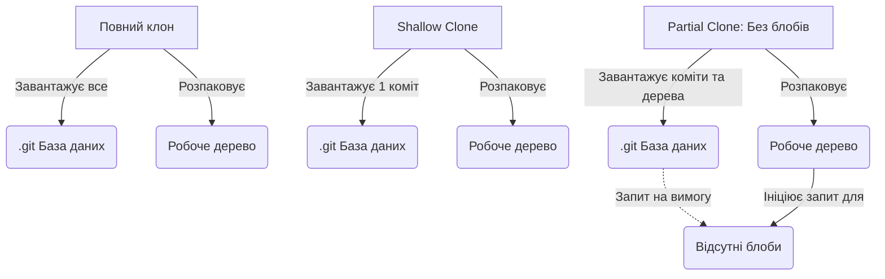

# Модуль 8: Ефективність у масштабі — Sparse Checkout та LFS

**Складність**: [СЕРЕДНЯ]  
**Час на виконання**: 90 хвилин  
**Попередні вимоги**: Попередній модуль курсу Git Deep Dive (Модуль 7)  

## Що ви зможете зробити

До кінця цього модуля ви зможете:

*   **Впровадити** механізм sparse checkout, використовуючи режим cone mode, щоб ізолювати директорії конкретних сервісів у масивному Kubernetes monorepo, суттєво зменшуючи використання дискового простору.
*   **Порівняти** та **проаналізувати** відмінності між shallow clones та partial clones для оптимізації часу отримання коду в CI/CD конвеєрах та економії мережевого трафіку.
*   **Налаштувати** Git Large File Storage (LFS) для керування великими бінарними файлами, такими як архівовані Helm chart tarballs, не роздуваючи історію основного репозиторію.
*   **Оцінити** експлуатаційні компроміси між Git Submodules та Git Subtrees при проектуванні спільних репозиторіїв конфігурацій.
*   **Діагностувати** погіршення продуктивності локального репозиторію та **виконати** стратегії обслуговування Git, включаючи збирання сміття (garbage collection) та оптимізацію графа комітів (commit graph), для відновлення швидкості роботи.

## Чому це важливо

Відділ платформеної інженерії у великого e-commerce провайдера, що стрімко зростає, вирішив консолідувати всю конфігурацію інфраструктури в одному репозиторії. Спочатку цей monorepo був мрією експлуатації: двадцять мікросервісів, усі Kubernetes маніфести в одному місці та атомарні коміти, які могли синхронно впроваджувати зміни конфігурації між сервісами. Усі хвалили прозорість та простоту рішення.

Минуло два роки. Компанія поглинула трьох конкурентів. Тепер репозиторій містить конфігурації для понад 1500 окремих мікросервісів, 50 000 сирих Kubernetes маніфестів та гігабайти пакетних пропрієтарних Helm chart tarballs, які команда безпеки вимагає зберігати разом із кодом розгортання. Проста операція `git clone` тепер займає дванадцять хвилин на гігабітному каналі. Раннери CI/CD виходять за ліміти часу вже на етапі початкового отримання коду, ще до того, як розпочнеться хоча б один тест чи крок розгортання. Розробники скаржаться, що вентилятори їхніх ноутбуків розганяються до максимуму просто під час виконання `git status`, а їхні IDE зависають, намагаючись проіндексувати величезне дерево директорій.

Швидкість розробки впала до нуля. Код не був зламаний, розгортання не провалювалися через поганий YAML, але система контролю версій задихалася від самого обсягу даних. Інструмент, покликаний прискорити співпрацю, став основною перешкодою.

Цей модуль навчить вас, як врятувати команду саме в такому сценарії. Ви дізнаєтеся, як приборкати масивні репозиторії, оптимізувати операції клонування для CI конвеєрів, керувати великими бінарними активами без постійного роздування історії Git та підтримувати високу продуктивність локальної розробки. Ви перейдете від сприйняття Git як простого трекера файлів до роботи з ним як із високопродуктивною базою даних, оптимізованою для масштабів.

## Основний зміст: Проблема Monorepo та Sparse Checkout

Коли ви виконуєте стандартний `git clone`, Git виконує дві окремі ресурсомісткі операції. По-перше, він завантажує всю стиснуту історію кожного файлу, який коли-небудь існував у репозиторії, у директорію `.git`. По-друге, він розпаковує останній коміт у ваше робоче дерево (working tree) — реальні файли, які ви бачите та редагуєте на диску.

У великому monorepo обидві ці операції стають проблематичними, але робоче дерево часто є найбільш критичною точкою болю для розробників. Якщо в репозиторії 1500 сервісів, розробнику, який працює над сервісом `payment-gateway`, не потрібні файли інших 1499 сервісів, що захаращують його IDE, уповільнюють пошук і споживають дисковий простір.

Ось де з'являється **Sparse Checkout**. Sparse checkout дозволяє наказати Git наповнювати лише конкретні директорії у вашому робочому дереві, залишаючи решту репозиторію прихованою.

### Режим Cone Mode проти Non-Cone Mode

Історично sparse checkout використовував складні регулярні вирази для визначення того, які файли включати. Цей "non-cone" режим був надзвичайно гнучким, але обчислювально дорогим. Виконання `git status` вимагало від Git перевірки цих регулярних виразів для кожного файлу в репозиторії, що могло займати секунди у великій кодовій базі.

Сучасний Git представив **Cone Mode**. Режим Cone mode обмежує логіку відповідності точними шляхами до директорій (формуючи "конус" включення). Це експоненціально швидше, оскільки Git може використовувати пошук по хешу замість зіставлення з патернами.

Давайте візуалізуємо різницю у стандартному репозиторії платформи Kubernetes:

```text
+-----------------------------------------------------+
|         Дерево директорій монорепозиторію           |
+-----------------------------------------------------+
|                                                     |
|  platform-repo/                                     |
|  ├── .git/                     (Повна історія)      |
|  ├── cluster-addons/           (Приховано)          |
|  │   ├── calico/                                    |
|  │   └── cert-manager/                              |
|  ├── namespaces/               (Приховано)          |
|  │   ├── default/                                   |
|  │   └── kube-system/                               |
|  └── services/                 (Sparse Checkout)    |
|      ├── payment-gateway/      (Видимо в дереві)    |
|      │   ├── deployment.yaml                        |
|      │   └── service.yaml                           |
|      ├── inventory-api/        (Приховано)          |
|      └── user-auth/            (Приховано)          |
|                                                     |
+-----------------------------------------------------+
```

У режимі cone mode, якщо ви вкажете `services/payment-gateway`, Git автоматично включить файли безпосередньо в `platform-repo/` (наприклад, `README.md` або `.gitignore`), файли безпосередньо в `platform-repo/services/` та все рекурсивно всередині `platform-repo/services/payment-gateway/`.

### Впровадження Cone Mode

Щоб налаштувати sparse checkout для існуючого репозиторію, ви використовуєте команду `sparse-checkout`.

```bash
# Спочатку увімкніть sparse checkout у режимі cone mode
git sparse-checkout init --cone

# Зверніть увагу, що ваша робоча директорія тепер майже порожня!
# Вона містить лише файли в кореневій директорії.

# Тепер вкажіть директорію, над якою хочете працювати
git sparse-checkout set services/payment-gateway

# Ваша робоча директорія тепер містить кореневі файли та файли payment-gateway.
```

Якщо вам потрібно тимчасово співпрацювати з іншою командою, ви можете додати їхній сервіс до вашого конуса:

```bash
git sparse-checkout add services/user-auth
```

Щоб повернутися до звичайного, повного робочого дерева:

```bash
git sparse-checkout disable
```

> **Зупиніться та подумайте**: Якщо у вас налаштовано sparse checkout так, щоб показувати лише `services/payment-gateway`, і ви виконуєте `git commit -a -m "update"`, чи зафіксує Git випадково зміни, які хтось інший зробив у `services/inventory-api`, і які ви нещодавно отримали?

**Історія з фронту: Пастка регулярних виразів**
Команда платформи намагалася оптимізувати свій робочий процес, написавши правило sparse checkout для включення "будь-якого файлу з назвою `deployment.yaml` у будь-якому місці репозиторію". Вони використовували застарілий режим non-cone з патерном `**/deployment.yaml`. Оскільки репозиторій розрісся до 30 000 файлів, кожного разу, коли розробник вводив `git status`, Git доводилося виконувати рекурсивне зіставлення з патерном по всьому віртуальному дереву. Виконання `git status` почало займати 8 секунд. Перехід на cone mode та явне перерахування необхідних сервісних директорій скоротило час виконання до 40 мілісекунд.

## Основний зміст: Виснаження CI/CD конвеєра: Shallow та Partial Clones

Хоча sparse checkout вирішує проблему робочого дерева для розробників, він не вирішує проблему мережі та диска для конвеєрів безперервної інтеграції (CI). Sparse checkout все одно завантажує всю історію `.git`; він просто приховує файли в кінцевому результаті.

Конвеєрам CI зазвичай не потрібна історія. Коли конвеєр запускається для застосування маніфестів Kubernetes через `kubectl apply` (або використовуючи аліас `k apply`, який ми будемо використовувати надалі), йому потрібен лише точний стан файлів у конкретному коміті, який ініціював завдання.

### Shallow Clones

**Shallow Clone** (неглибокий клон) обрізає історію репозиторію. Ви вказуєте Git завантажувати лише останні *N* комітів.

```bash
# Клонувати лише останній коміт гілки за замовчуванням
git clone --depth 1 https://git.example.com/platform-repo.git
```

Це кардинально зменшує обсяг даних, що передаються мережею. Репозиторій розміром 5 ГБ може перетворитися на завантаження 20 МБ.

Однак shallow clones мають серйозні обмеження:
1. Зазвичай ви не можете робити push із shallow clone.
2. Інструменти, що покладаються на історію (наприклад, SonarQube для метрик на основі `git blame` або генератори списку змін), не спрацюють.
3. Отримання оновлень у shallow clone іноді може бути обчислювально важчим на стороні сервера, ніж звичайне отримання, оскільки сервер повинен розрахувати, чого саме не вистачає у вашій обрізаній історії.

### Partial Clones

**Partial Clones** (часткові клони) — це сучасна та краща альтернатива shallow clones. Замість того, щоб обрізати час (історію), часткові клони фільтрують типи даних. Найпоширеніші фільтри пропускають вміст великих файлів (blobs) або цілі дерева директорій, доки вони не знадобляться явно.



**Blob-less** клон завантажує всі коміти та всі структури директорій (trees), але пропускає фактичний вміст файлів (blobs) для історичних комітів. Він завантажує лише ті блоби, які потрібні для наповнення вашого поточного робочого дерева.

```bash
# Клонувати репозиторій, але пропустити вміст усіх історичних файлів
git clone --filter=blob:none https://git.example.com/platform-repo.git
```

Якщо ви коли-небудь запустите команду, якій потрібен старий файл (наприклад, `git log -p`, щоб побачити дифи, або `git checkout`, щоб перейти на стару гілку), Git автоматично та прозоро зв'яжеться із сервером і завантажить лише ті конкретні блоби, які йому потрібні в режимі реального часу.

> **Зупиніться та подумайте**: Ви виконали `git clone --filter=blob:none`. Тепер ви запускаєте `git diff HEAD~5`. Яку мережеву активність ви очікуєте і чому?

Для конвеєрів CI, яким потрібен лише останній коміт, **tree-less** клон працює ще швидше:

```bash
# Пропустити вміст усіх історичних файлів ТА історичні структури директорій
git clone --filter=tree:0 https://git.example.com/platform-repo.git
```

> **Зупиніться та подумайте**: Який підхід ви б обрали для CI конвеєра, що запускає сканер безпеки для аналізу еволюції RBAC дозволів за останні шість місяців, і чому?

## Основний зміст: Важковаговики: Git LFS для бінарних файлів

Git винятково добре справляється з версіонуванням простих текстових файлів, таких як маніфести YAML, вихідний код Go або документація Markdown. Він використовує дельта-стиснення, зберігаючи лише конкретні рядки, які змінилися між комітами.

Git винятково погано справляється з версіонуванням скомпільованих бінарних файлів, дампів баз даних або стиснутих архівів. Якщо ви зміните один байт у файлі Helm chart `.tgz` розміром 100 МБ і зробите коміт, Git не зможе стиснути різницю. Він збереже абсолютно новий об'єкт розміром 100 МБ. Зробіть це десять разів, і розмір вашого репозиторію збільшиться на 1 ГБ. Кожен розробник, який клонує репозиторій, повинен буде завантажити цей гігабайт повністю, навіть якщо йому потрібна лише остання версія.

**Git Large File Storage (LFS)** вирішує цю проблему, замінюючи великі файли у вашому репозиторії крихітними текстовими покажчиками (pointers). Самі великі файли зберігаються на окремому LFS сервері.

### Анатомія LFS

Коли ви фіксуєте файл, що відстежується LFS, фактичні бінарні дані перехоплюються та завантажуються на LFS сервер через HTTP API. Git записує лише файл-покажчик в історію комітів.

```text
+----------------------------------------------------------+
|                  Як працює Git LFS                       |
+----------------------------------------------------------+
|                                                          |
|  Ваше робоче дерево                                      |
|  ├── deployment.yaml (1KB)                               |
|  └── monitoring-chart-v2.tgz (50MB)                      |
|                                                          |
|       |                                                  |
|       |  git add & git commit                            |
|       v                                                  |
|                                                          |
|  Локальна база даних .git                                |
|  ├── Blob: вміст deployment.yaml                        |
|  └── Blob: Файл-покажчик (130 байтів)                    |
|      |                                                   |
|      |  version https://git-lfs.github.com/spec/v1       |
|      |  oid sha256:4d7a214614ab2...                      |
|      |  size 52428800                                    |
|                                                          |
|       |                                                  |
|       |  git push                                        |
|       v                                                  |
|                                                          |
|  Віддалений Git сервер       Віддалений LFS сервер       |
|  [Зберігає 130б покажчик]    [Зберігає 50МБ бінарник]     |
|                                                          |
+----------------------------------------------------------+
```

> **Зупиніться та подумайте**: Якщо ви запустите `git log -p` для файлу, що відстежується LFS, що ви побачите в дифі — бінарний вміст чи вміст файлу-покажчика? Що, якщо у вас встановлено розширення LFS, і якщо ні?

Коли інший розробник клонує репозиторій, Git завантажує крихітні файли-покажчики. Потім розширення LFS зчитує ці покажчики та автоматично завантажує правильний бінарний файл розміром 50 МБ з LFS сервера, щоб наповнити робоче дерево. Вони завантажують бінарні файли лише для того конкретного коміту, який вони отримали, а не всю історію.

### Налаштування LFS

Спочатку ви повинні встановити розширення LFS та ініціалізувати його для вашого облікового запису користувача:

```bash
git lfs install
```

Далі ви вказуєте LFS, які файли відстежувати у вашому репозиторії. Це створить або оновить файл `.gitattributes`.

```bash
# Відстежувати всі tarball файли
git lfs track "*.tgz"

# Відстежувати конкретний великий дамп бази даних для локальних тестів
git lfs track "tests/data/seed-db.sql"
```

Ви повинні зафіксувати файл `.gitattributes`, щоб кожен, хто клонує репозиторій, знав, які файли мають оброблятися через LFS.

```bash
git add .gitattributes
git commit -m "chore: configure LFS tracking for tarballs and test DBs"
```

Тепер, коли ви додаєте tarball, він автоматично обробляється LFS:

```bash
cp ~/Downloads/monitoring-chart-v2.tgz charts/
git add charts/monitoring-chart-v2.tgz
git commit -m "feat: add monitoring helm chart"
git push origin main
```

**Історія з фронту: Випадковий дамп**
Молодший інженер локально згенерував дамп бази даних PostgreSQL розміром 2 ГБ для тестування скрипта міграції даних. Він випадково запустив `git commit -a -m "WIP"` і зробив push у віддалений репозиторій. Усвідомивши помилку, він негайно виконав `git rm the-dump.sql`, зафіксував видалення і знову зробив push. Файл зник із робочого дерева, але об'єкт розміром 2 ГБ назавжди залишився в історії Git. Кожен наступний `git clone` кожним конвеєром і розробником займав на двадцять хвилин більше. Команді довелося координувати дуже болючий перепис історії за допомогою `git filter-repo`, щоб вичистити бінарний файл із постійного запису, що змусило кожного видалити свої локальні клони та почати заново. Якби LFS було налаштовано для `*.sql` файлів заздалегідь, цієї катастрофи можна було б уникнути.

## Основний зміст: Пекло залежностей: Submodules проти Subtrees

У великих платформах часто виникає потреба спільно використовувати код між репозиторіями. Наприклад, у вас може бути окремий репозиторій для стандартних Kubernetes Custom Resource Definitions (CRDs), який потрібно включити в кілька різних репозиторіїв сервісів.

Git надає два вбудовані способи вкладення репозиторіїв в інші репозиторії: Submodules та Subtrees.

### Git Submodules

Submodule (підмодуль) — це, по суті, покажчик на конкретний коміт в іншому репозиторії.

Коли ви додаєте підмодуль:

```bash
git submodule add https://git.example.com/shared-crds.git manifests/crds
```

Git не копіює файли з `shared-crds` у базу даних вашого репозиторію. Замість цього він створює спеціальний файл з назвою `.gitmodules` і записує точний хеш коміту репозиторію `shared-crds`.

**Біль підмодулів:**
Коли хтось інший клонує ваш репозиторій, директорія `manifests/crds` буде абсолютно порожньою. Вони повинні явно виконати:

```bash
git submodule update --init --recursive
```

Крім того, якщо ви ввійдете в директорію `manifests/crds`, ви опинитеся в стані "detached HEAD". Якщо ви внесете там зміни, зафіксуєте їх і зробите push основного репозиторію, не зробивши спочатку push репозиторію підмодуля, ви зламаєте збірку для всіх інших (ваш основний репозиторій посилається на коміт у підмодулі, якого не існує на віддаленому сервері).

### Git Subtrees

Subtree (піддерево) використовує інший підхід. Воно фізично копіює файли та історію із зовнішнього репозиторію безпосередньо у ваш репозиторій.

```bash
# Додати remote для спільного репозиторію
git remote add shared-crds https://git.example.com/shared-crds.git

# Отримати спільний репозиторій у конкретну директорію за допомогою стратегії subtree
git subtree add --prefix=manifests/crds shared-crds main --squash
```

Прапор `--squash` об'єднує всю історію зовнішнього репозиторію в один коміт у вашому репозиторії, підтримуючи чистоту вашої історії.

**Переваги піддерев:**
Коли інший розробник клонує ваш репозиторій, він одразу отримує директорію `manifests/crds`. Ніяких додаткових команд не потрібно. Конвеєр CI не потребує спеціального налаштування для отримання підмодулів. Все працює так само, як і зі звичайними файлами.

| Особливість | Submodules | Subtrees |
| :--- | :--- | :--- |
| **Механізм зберігання** | Покажчик на зовнішній коміт | Файли фактично злиті в основний репозиторій |
| **Клонування** | Потребує додатковий прапор `--recurse-submodules` | Працює одразу зі стандартним клонуванням |
| **Інтеграція історії** | Окремі історії | Спільна історія (може бути стиснута) |
| **Внесення змін upstream** | Важко (detached HEAD, порядок push) | Складно, але можливо (`git subtree push`) |
| **Найкраще для** | Великих зовнішніх проектів, які ви рідко редагуєте | Невеликих спільних бібліотек, які ви час від часу оновлюєте |

> **Зупиніться та подумайте**: Ваша команда підтримує спільний репозиторій Terraform модулів (200 файлів, оновлюється щотижня) та масивний репозиторій CRD від вендора (5000 файлів, оновлюється раз на квартал). Яку стратегію включення ви б використали для кожного і чому?

## Основний зміст: Під капотом: Обслуговування та продуктивність

Коли ви працюєте з Git, додаючи, змінюючи та видаляючи файли, локальна база даних `.git` накопичує "вільні об'єкти" (loose objects). Крім того, внутрішній індекс того, як коміти пов'язані між собою, може стати фрагментованим. З часом такі операції, як `git status` або `git log`, помітно сповільняться.

Git містить внутрішні інструменти для оптимізації власної бази даних.

### Garbage Collection та Repacking

Команда `git gc` (garbage collection — збирання сміття) очищує непотрібні файли та оптимізує локальний репозиторій.

```bash
# Запустити стандартне збирання сміття
git gc

# Запустити агресивне збирання сміття (займає більше часу, краще оптимізує)
git gc --aggressive
```

Коли ви запускаєте `gc`, Git виконує `repack`. Він бере тисячі окремих файлів вільних об'єктів і стискає їх в один "packfile". Pack-файли використовують дельта-стиснення для неймовірно ефективного зберігання об'єктів. Це зменшує кількість дескрипторів файлів, які операційна система повинна відкривати, і заощаджує дисковий простір.

### Commit Graphs

У репозиторії з сотнями тисяч комітів команди, що проходять по історії (наприклад, з'ясування того, чи гілка випередила іншу, чи відстала, або створення лога), повинні зчитувати та аналізувати тисячі окремих об'єктів комітів.

Git може згенерувати файл **commit graph**, який є високоефективним бінарним кешем структури історії комітів.

```bash
# Згенерувати commit graph
git commit-graph write --reachable
```

Створення commit graph може змусити такі команди, як `git log --graph`, виконуватися значно швидше.

> **Зупиніться та подумайте**: Репозиторій має 500 000 вільних об'єктів і не має commit graph. Оцініть відносне прискорення виконання `git gc` окремо проти `git gc` + `commit-graph write` для команди `git log --graph`.

### Автоматизоване обслуговування

Замість того, щоб пам'ятати про запуск цих команд вручну, сучасний Git дозволяє зареєструвати репозиторій для автоматичного фонового обслуговування.

```bash
git maintenance start
```

Це налаштовує фонові завдання cron (або таймери systemd, залежно від вашої ОС), які будуть періодично виконувати операції pre-fetch, видалення вільних об'єктів та оновлення commit graph, поки ви активно не використовуєте репозиторій.

## Чи знали ви?

*   **Репозиторій ядра Linux:** Репозиторій ядра Linux містить понад 1,2 мільйона комітів та 80 000 файлів, проте правильно оптимізований локальний клон може виконати `git status` менш ніж за 50 мілісекунд.
*   **Витоки Git LFS:** Git LFS був спочатку створений GitHub у 2015 році як розширення з відкритим вихідним кодом, саме тому, що розробники ігор та команди машинного навчання відмовлялися від Git через його нездатність обробляти великі текстури, моделі та набори даних.
*   **Ліміт у 2 ГБ:** Через архітектурні рішення щодо того, як Git відображає пам'ять та обробляє файли на 32-бітних системах (які зберігаються в деяких застарілих базових бібліотеках), Git може катастрофічно вийти з ладу або вичерпати пам'ять, якщо ви спробуєте відстежувати один файл розміром понад 2 Гігабайти без LFS.
*   **Порожні коміти:** Ви можете створити коміт, який взагалі не містить змін у робочому дереві, за допомогою `git commit --allow-empty`. Платформені інженери часто використовують це для запуску CI/CD конвеєрів без необхідності вносити фейкові зміни в README.

## Типові помилки

| Помилка | Чому це трапляється | Як це виправити |
| :--- | :--- | :--- |
| **Відстеження вже зафіксованих бінарників через LFS** | Розробник запускає `git lfs track "*.tgz"` *після* того, як `.tgz` вже було завантажено в історію репозиторію. | Використовуйте `git lfs migrate import --include="*.tgz"`, щоб переписати локальну історію та перетворити існуючі об'єкти на покажчики LFS, а потім зробіть force push. |
| **Забування зробити push підмодулів** | Розробник оновлює підмодуль, фіксує зміну покажчика в основному репозиторії та робить push основного репозиторію, але забуває зробити push змін із самої директорії підмодуля. | Налаштуйте Git для автоматичного push підмодулів: `git config push.recurseSubmodules check` або `on-demand`. |
| **Використання shallow clones для аналізу SonarQube** | Конвеєр CI оптимізовано за допомогою `--depth 1`, але інструменту статичного аналізу потрібна історія Git, щоб призначити відповідальних (blame) та відстежувати нові чи старі недоліки коду. | Перемкніть конвеєр CI з shallow clone на partial clone: `git clone --filter=blob:none`. |
| **Змішування cone та non-cone sparse checkouts** | Ручне редагування файлу `.git/info/sparse-checkout` за допомогою складних регулярних виразів, коли режим cone увімкнено. | Дотримуйтеся суворо команди `git sparse-checkout set`; уникайте ручного редагування внутрішніх конфігураційних файлів. |
| **Вичерпання дискового простору під час `git gc`** | Repacking вимагає створення нового pack-файлу перед видаленням старих, що тимчасово подвоює необхідне місце для зберігання. | Переконайтеся, що у вас є принаймні стільки ж вільного дискового простору, скільки займає ваша директорія `.git/objects`, перед запуском агресивного GC. |
| **Пізнє фіксування файлу `.gitattributes`** | Налаштування правил відстеження LFS, але забування зафіксувати `.gitattributes`, через що клони інших розробників сприймають бінарні файли як звичайні об'єкти Git. | Завжди фіксуйте файл `.gitattributes` у тому ж самому коміті (або раніше), що й перший великий бінарний файл, який ви додаєте. |

## Контрольні запитання

<details>
<summary>Запитання 1: Ваш CI конвеєр запускає bash-скрипт, який перевіряє (lint) всі YAML файли Kubernetes у директорії `manifests/`. Йому не потрібно аналізувати історію, і йому не потрібно збирати бінарні файли. Монорепозиторій займає 10 ГБ. Яка найбільш ефективна стратегія клонування для конфігурації CI?</summary>
Вам слід використовувати treeless partial clone, виконавши `git clone --filter=tree:0 <url>`. Оскільки CI конвеєру потрібно лише прочитати файли поточного коміту для перевірки, йому не потрібні історичні вмісти файлів (blobs) або історичні структури директорій (trees). Цей підхід кардинально зменшує обсяг даних, що передаються мережею, порівняно з повним клонуванням, прискорюючи виконання конвеєра. Крім того, це зазвичай надійніше та менш обчислювально затратно для Git сервера, ніж традиційний shallow clone (`--depth 1`), який вимагає від сервера розрахунку того, що саме слід пропустити.
</details>

<details>
<summary>Запитання 2: Ви приєдналися до нової команди та клонували їхній репозиторій мікросервісу. Коли ви намагаєтеся запустити `k apply -f vendor/shared-crds/base.yaml`, kubectl повідомляє, що файл не існує. Ви дивитеся в директорію `vendor/shared-crds`, і вона абсолютно порожня. Що сталося і як це виправити?</summary>
Команда використовує Git Submodules для включення спільних CRD, а стандартний `git clone` не завантажує вміст підмодулів автоматично. Вам потрібно ініціалізувати та оновити підмодулі, запустивши `git submodule update --init --recursive` у корені репозиторію. Крім того, ви могли б клонувати репозиторій спочатку за допомогою `git clone --recurse-submodules`. Це стається тому, що Git записує лише покажчик на коміт підмодуля в батьківському репозиторії, залишаючи фактичне отримання даних вкладеного репозиторію як явний, вторинний крок для розробника.
</details>

<details>
<summary>Запитання 3: Тімлід просить вас налаштувати sparse checkout так, щоб ви завантажували лише директорію `services/billing`. Ви запускаєте `git sparse-checkout init --cone`, а потім `git sparse-checkout set services/billing`. Пізніше ви запускаєте `git merge main`, щоб отримати останні оновлення. Чи опрацює цей процес злиття оновлення в директорії `services/auth`, навіть якщо ви її не бачите?</summary>
Так, операція злиття (merge) успішно опрацює та зафіксує оновлення в директорії `services/auth`. Sparse checkout — це суто оптимізація робочого дерева; він лише приховує файли з вашого локального диска для економії місця та часу індексації. Базова база даних `.git` все одно завантажує та відстежує повну історію та стан всього репозиторію під час операцій fetch та merge. Таким чином, ваш локальний репозиторій залишається повністю синхронізованим із віддаленим, і ви не зможете випадково відкотити або проігнорувати зміни, зроблені іншими командами в директоріях поза вашим конусом sparse checkout.
</details>

<details>
<summary>Запитання 4: Вам потрібно включити репозиторій Helm чартів з відкритим вихідним кодом у ваш внутрішній репозиторій платформи. Ви хочете, щоб інші інженери отримували файли автоматично під час клонування, без необхідності запускати будь-які додаткові команди. Який інструмент слід використовувати, Submodules чи Subtrees, і чому?</summary>
У цьому сценарії вам слід використовувати Git Subtrees, оскільки вони фізично зливають зовнішні файли в дерево та історію вашого репозиторію. Коли інші інженери виконають стандартний `git clone`, вони негайно отримають усі файли Helm чартів разом із вашим внутрішнім кодом. Якби ви замість цього обрали Submodules, вони б отримали порожню директорію і були б змушені запускати команду `git submodule update`, щоб фактично отримати дані чартів. Subtrees забезпечують набагато плавніший досвід для розробників, коли метою є безперешкодне використання спільних залежностей "з коробки".
</details>

<details>
<summary>Запитання 5: Розробник скаржиться, що його локальний репозиторій працює надзвичайно повільно. `git status` займає кілька секунд, а IDE зависає. Він ніколи не налаштовував жодних просунутих функцій Git. Які дві команди ви повинні наказати йому запустити, щоб оптимізувати його локальну базу даних?</summary>
Ви повинні наказати йому запустити `git gc` та `git commit-graph write --reachable`. Команда `git gc` збере вільні об'єкти та ефективно стисне їх у pack-файли, що зменшить кількість дескрипторів файлів, які ОС повинна відкривати, і заощадить дисковий простір. Команда `git commit-graph write --reachable` згенерує оптимізований бінарний кеш структури історії комітів, що кардинально прискорить команди проходження по історії. Крім того, він міг би ввімкнути фонову оптимізацію, запустивши `git maintenance start`, що планує ці критичні завдання обслуговування для автоматичного запуску без ручного втручання.
</details>

<details>
<summary>Запитання 6: Ви правильно налаштували Git LFS для відстеження `*.iso` файлів, зафіксували файл `.gitattributes` і зафіксували образ Ubuntu розміром 5 ГБ. Коли ви робите push на корпоративний Git сервер, він відхиляє запит із помилкою HTTP 413 "Payload Too Large". Яка найбільш імовірна архітектурна причина цієї помилки?</summary>
Найбільш імовірною причиною є те, що зворотний проксі (reverse proxy) або балансувальник навантаження (наприклад, Nginx або HAProxy), що стоїть перед Git LFS сервером, обмежує максимальний розмір тіла клієнтського запиту. Навіть якщо Git LFS спеціально розроблений для обробки масивних бінарних об'єктів, фактична передача даних все одно відбувається через стандартні виклики HTTP API. Ці API запити повинні проходити через корпоративну мережеву інфраструктуру, яка часто має налаштовані за замовчуванням ліміти на завантаження для стандартного веб-трафіку. Вам потрібно буде звернутися до команди інфраструктури, щоб збільшити `client_max_body_size` або аналогічний параметр на проксі, що обслуговує маршрут LFS.
</details>

## Практична вправа

У цій вправі ви зсимулюєте роботу у величезному монорепозиторії Kubernetes. Ви ініціалізуєте локальний репозиторій із симульованою структурою з 20 сервісів, налаштуєте sparse checkout для ізоляції лише доменів вашої команди та налаштуєте Git LFS для відстеження скомпільованих Helm чартів.

### Підготовка середовища

Спочатку давайте згенеруємо симульовану структуру монорепозиторію. Виконайте цей скрипт у терміналі, щоб створити середовище:

```bash
mkdir k8s-monorepo-sim
cd k8s-monorepo-sim
git init

# Генеруємо 20 симульованих сервісів із фейковими маніфестами
mkdir -p services
for i in {1..20}; do
  mkdir -p "services/service-$i"
  echo -e "apiVersion: apps/v1\nkind: Deployment\nmetadata:\n  name: service-$i" > "services/service-$i/deployment.yaml"
  echo -e "apiVersion: v1\nkind: Service\nmetadata:\n  name: service-$i" > "services/service-$i/service.yaml"
done

# Генеруємо деякі папки рівня платформи
mkdir -p cluster-addons/ingress namespaces/core
touch cluster-addons/ingress/nginx.yaml namespaces/core/ns.yaml

git add .
git commit -m "Initial massive monorepo commit"
```

### Завдання

1.  **Проаналізуйте початковий стан:** Перевірте, скільки директорій зараз видно в папці `services/`.
2.  **Зупиніться та подумайте:** Ви збираєтеся ініціалізувати sparse checkout. Передбачте, що станеться з директорією `services`, коли ви запустите `git sparse-checkout init --cone`. Запустіть команду та подивіться на вашу робочу директорію. Поясніть, чому файли зникли.
3.  **Визначте область роботи:** Ваша команда відповідає лише за `service-4` та `service-12`. Налаштуйте sparse checkout так, щоб включити ці конкретні директорії.
4.  **Зупиніться та подумайте:** Перед запуском `ls services/` передбачте, що саме буде виведено. Запустіть команду, щоб перевірити своє передбачення та підтвердити ізоляцію.
5.  **Налаштуйте відстеження LFS:** Вашій команді потрібно зберігати пакетні Helm чарти (`*.tgz` файли) у директорії `services/service-4/charts/`. Налаштуйте Git LFS для відстеження всіх `.tgz` файлів у будь-якому місці репозиторію.
6.  **Зафіксуйте конфігурацію:** Переконайтеся, що конфігурація відстеження LFS назавжди записана в репозиторії.

### Рішення та критерії успіху

<details>
<summary>Завдання 1: Проаналізуйте початковий стан</summary>

```bash
ls services/
```
Ви повинні побачити від `service-1` до `service-20`.
</details>

<details>
<summary>Завдання 2: Передбачте та спостерігайте</summary>

```bash
git sparse-checkout init --cone
```
Одразу після запуску цієї команди, якщо ви введете `ls`, ви, ймовірно, побачите лише файли в корені репозиторію. Директорія `services` зникне з вашого робочого дерева. Це стається тому, що ініціалізація sparse checkout у режимі cone mode за замовчуванням включає лише файли кореневої директорії, приховуючи все інше, доки воно не буде явно запрошено.
</details>

<details>
<summary>Завдання 3: Визначте область роботи</summary>

```bash
git sparse-checkout set services/service-4 services/service-12
```
Це наказує Git побудувати конус, який явно включає ці дві директорії, сигналізуючи про те, що ви хочете бачити їх у своєму робочому дереві.
</details>

<details>
<summary>Завдання 4: Передбачте та перевірте</summary>

```bash
ls services/
```
Тепер ви повинні бачити ТІЛЬКИ `service-4` та `service-12`. Інші 18 директорій сервісів залишаються прихованими з вашого локального диска, що підтверджує передбачення про те, що sparse checkout ізолює ваш вигляд рівно до тих конусів, які ви визначили, заощаджуючи місце та час індексації.
</details>

<details>
<summary>Завдання 5: Налаштуйте відстеження LFS</summary>

```bash
# Переконайтеся, що LFS встановлено для вашого користувача
git lfs install

# Відстежувати tarballs
git lfs track "*.tgz"
```
Ця команда створює або оновлює файл `.gitattributes` у корені вашого репозиторію з визначенням відстеження LFS.
</details>

<details>
<summary>Завдання 6: Зафіксуйте конфігурацію</summary>

```bash
# Ви повинні зафіксувати файл .gitattributes, щоб інші отримали правила LFS
git add .gitattributes
git commit -m "build: configure LFS tracking for helm chart tarballs"
```
</details>

**Критерії успіху:**
- [ ] Виконання `ls services/` показує рівно дві директорії: `service-4` та `service-12`.
- [ ] Файл `.gitattributes` існує в корені репозиторію і містить рядок `*.tgz filter=lfs diff=lfs merge=lfs -text`.
- [ ] `git status` повідомляє про чисте робоче дерево.

## Наступний модуль

Готові припинити робити все вручну? Дізнайтеся, як змусити дотримуватися правил і автоматизувати вирішення конфліктів у [Модулі 9: Автоматизація та кастомізація](../module-9-hooks-rerere/).