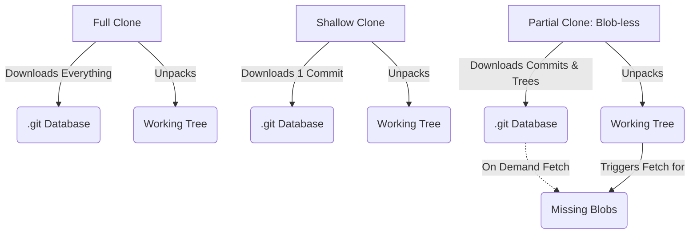
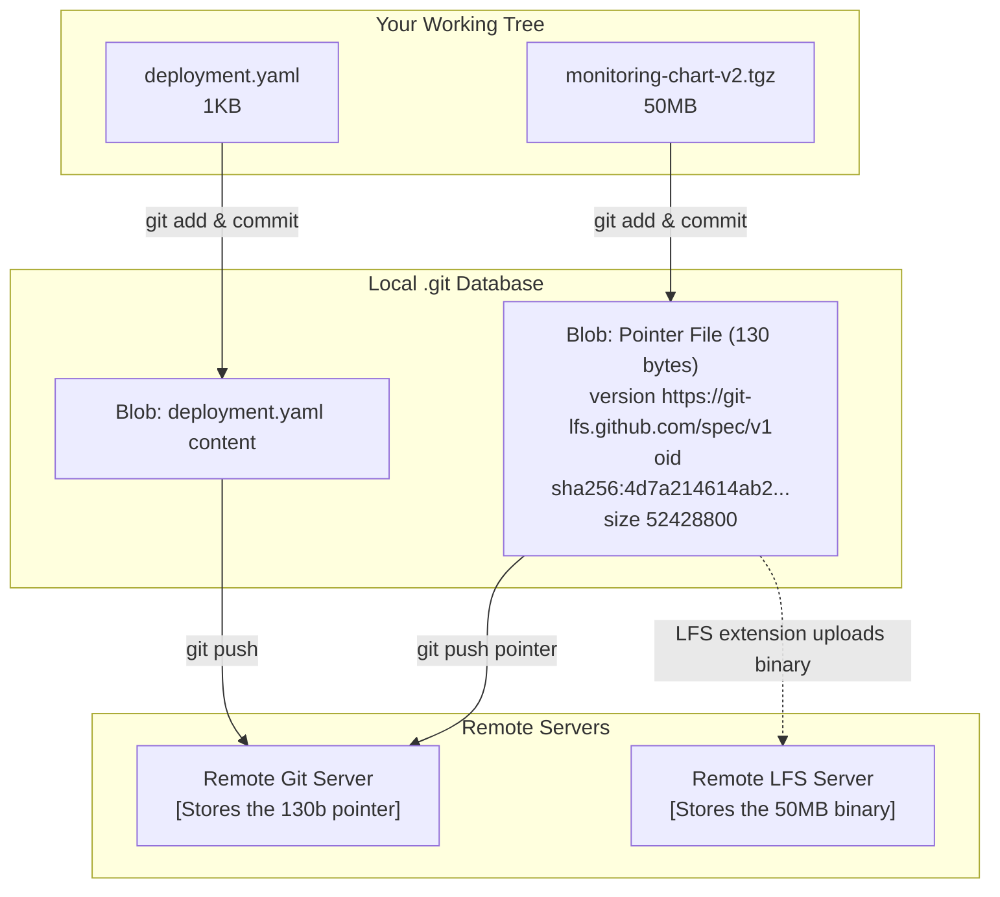

> **Складність**: [СЕРЕДНЯ]
>
> **Час виконання**: 90 хвилин
>
> **Передумови**: Попередній модуль у Git Deep Dive (Модуль 7)

---


## Що ви зможете зробити

До кінця цього модуля ви зможете:

* **Реалізувати** sparse checkouts у режимі cone для ізоляції каталогів конкретних сервісів у масивному Kubernetes-монорепозиторії із збереженням коректної історії репозиторію.
* **Порівняти** shallow clones та partial clones для CI/CD конвеєрів, обираючи стратегію, що відповідає вартості мережевого трафіку, потребам історії та навантаженню сервера.
* **Налаштувати** Git Large File Storage для великих бінарних активів, як-от tar-архіви Helm chart, не роздуваючи основної бази об'єктів Git.
* **Оцінити** експлуатаційні компроміси між Git Submodules та Git Subtrees при проектуванні спільних репозиторіїв конфігурацій.
* **Діагностувати** зниження продуктивності локального репозиторію та застосовувати стратегії обслуговування Git, такі як garbage collection, repacking, commit graphs та заплановане обслуговування.


## Чому це важливо

Гіпотетичний сценарій: підрозділ платформової інженерії (platform engineering) у провайдера електронної комерції, що стрімко зростає, вирішує консолідувати конфігурацію інфраструктури в єдиний репозиторій. Спочатку це рішення здається елегантним: маніфести сервісів живуть поруч зі спільними політиками, доповнення кластера (cluster add-ons) видимі кожній команді, а один pull request може разом оновити Deployment, його NetworkPolicy та відповідне правило observability. Два роки потому той самий репозиторій містить понад 1500 сервісів, десятки тисяч маніфестів Kubernetes і кілька гігабайтів пропрієтарних тарболів (tarballs) Helm chart, які відділ безпеки вимагає версіонувати разом із кодом розгортання. Звичайний clone займає понад десять хвилин на потужному офісному інтернет-з'єднанні, CI runners марнують платні хвилини ще до запуску першого тесту, а розробники починають уникати рутинних rebases, оскільки через `git status` їхні ноутбуки шумлять як build machines.

Ніщо в цій історії не є багом Git. Git розроблявся як content-addressed database (база даних з адресацією за вмістом), і великий репозиторій вимагає від цієї бази даних переміщувати кілька різних типів ваги: commit history (історію комітів), структуру каталогів, file content (вміст файлів), записи working tree та бінарні об'єкти, які можуть погано стискатися. Коли команди розмито кажуть, що репозиторій «надто великий», вони часто змішують ці витрати та хапаються за неправильне рішення. Sparse checkout зменшує обсяг working tree, shallow clones зменшують глибину історії, partial clones відкладають завантаження об'єктів, Git LFS виносить бінарні payloads за межі звичайної історії Git, а команди maintenance перебудовують локальну базу даних, щоб загальні операції залишалися швидкими. Кожен інструмент вирішує свою окрему больову точку (pressure point).

Цей модуль навчить вас аналізувати ці проблемні точки замість того, щоб копіювати прапорці оптимізації в кожну команду clone. Ви пропрацюєте sparse checkout для розробників-людей, clone filters для CI, LFS для великих артефактів, submodules та subtrees для спільних залежностей, а також локальний maintenance для репозиторіїв, які накопичили роки розрізнених об'єктів (loose objects). Приклади для Kubernetes орієнтуються на поведінку версії 1.35+, і будь-яка виконувана команда Kubernetes повинна використовувати повне ім'я бінарного файлу `kubectl`, щоб скопійовані блоки shell поводилися однаково у скриптах та кроках CI. Мета не в тому, щоб зробити кожен репозиторій крихітним; мета полягає в тому, щоб зробити великі репозиторії передбачуваними, зрозумілими та достатньо швидкими, щоб Git перестав бути вузьким місцем (bottleneck) на шляху доставки.

## Основний матеріал: Проблема монорепозиторію та Sparse Checkout

Коли ви виконуєте стандартний `git clone`, Git виконує дві ресурсомісткі операції, які легко сплутати. Спочатку він завантажує об'єкти репозиторію в каталог `.git`, включаючи commits, trees, tags та blobs, які представляють вміст файлів. По-друге, він виконує checkout одного коміту у ваше working tree — звичайний каталог, повний файлів, які перевіряють ваш редактор, оболонка (shell), інструменти пошуку та language servers. У монорепозиторії (monorepo) working tree — це часто той біль, який людина відчуває насамперед, оскільки розробник, що вносить зміни у `services/payment-gateway`, все ще мусить чекати, поки редактор індексує `services/inventory-api`, `services/user-auth` та сотні непов'язаних каталогів.

Sparse checkout вирішує проблему з боку working tree. Він наказує Git зберігати базу даних репозиторію недоторканою, матеріалізуючи на диску лише вибрані шляхи, щоб користувач бачив менше дерево без створення відгалуженої (forked) або неповної історії. Ця відмінність має важливе операційне значення. Якщо інша команда оновлює прихований Service, а ви виконуєте fetch або merge гілки `main`, Git все одно обробляє цю зміну всередині бази даних репозиторію; файл просто не з'являється у вашому робочому каталозі (working directory), якщо він не входить до вашого sparse definition. Таким чином, sparse checkout — це інструмент видимості та продуктивності, а не межа дозволів (permission boundary) і не спосіб уникнути інтеграції решти репозиторію.

Історично sparse checkout підтримував гнучке pattern matching (зіставлення за шаблоном). Ви могли писати правила, схожі на шаблони `.gitignore`, та включати окремі імена файлів будь-де у репозиторії. Ця гнучкість мала приховану ціну: таким командам, як `git status`, доводилося оцінювати правила шаблонів для всього відстежуваного дерева, і ці перевірки ставали відчутними в міру того, як репозиторії росли. Сучасний Git рішуче віддає перевагу cone mode (режиму конуса), який обмежує правила sparse конусами каталогів (directory cones) і дозволяє Git використовувати швидше path matching. Цей компроміс є свідомим. Ви відмовляєтесь від довільного вибору за символами підстановки (wildcards), щоб найпоширеніший сценарій — "я працюю в цих каталогах сервісів" — залишався швидким.

```mermaid
graph TD
    PR["platform-repo/"]
    GIT[".git/ <br> Full History"]
    CA["cluster-addons/ <br> Hidden"]
    CAL["calico/"]
    CERT["cert-manager/"]
    NS["namespaces/ <br> Hidden"]
    DEF["default/"]
    KS["kube-system/"]
    SVC["services/ <br> Sparse Checkout"]
    PG["payment-gateway/ <br> Visible in tree"]
    DEP["deployment.yaml"]
    SER["service.yaml"]
    INV["inventory-api/ <br> Hidden"]
    UA["user-auth/ <br> Hidden"]

    PR --> GIT
    PR --> CA
    CA --> CAL
    CA --> CERT
    PR --> NS
    NS --> DEF
    NS --> KS
    PR --> SVC
    SVC --> PG
    PG --> DEP
    PG --> SER
    SVC --> INV
    SVC --> UA

    classDef hidden stroke-dasharray: 5 5, color: #999, fill: #f9f9f9, stroke: #ccc;
    class CA,CAL,CERT,NS,DEF,KS,INV,UA hidden;
```

У cone mode, якщо ви вказуєте `services/payment-gateway`, Git автоматично включає файли кореневого рівня, такі як `README.md` та `.gitignore`, безпосередні батьківські каталоги, необхідні для досягнення конуса, і все рекурсивно всередині `services/payment-gateway`. Така поведінка зберігає репозиторій придатним для використання, оскільки метадані в корені та батьківські каталоги продовжують існувати, тоді як непов'язані дерева сервісів залишаються відсутніми на диску. Уявіть це як отримання карти, на якій виділені лише потрібні вам дороги, при цьому навігаційна система все ще знає про існування решти міста.

```bash
# First, enable sparse checkout in cone mode
git sparse-checkout init --cone

# Notice that your working directory is now nearly empty!
# It only contains files in the root directory.

# Now, specify the directory you want to work on
git sparse-checkout set services/payment-gateway

# Your working directory now contains the root files and the payment-gateway files.
```

Наведена вище послідовність подана навмисно. Ініціалізація sparse checkout у cone mode зазвичай залишає вам лише кореневі файли, що дивує людей першого разу, оскільки зовні здоровий репозиторій раптом виглядає порожнім. Наступна команда визначає конус, який слід заповнити. Якщо ваша команда по черзі чергує (rotates on-call) між двома сервісами, ви можете розширити конус без перезапуску клонування, що набагато дешевше, ніж підтримувати окремі локальні копії монорепозиторію.

```bash
git sparse-checkout add services/user-auth
```

Sparse checkout також має легко скасовуватись. Якщо ви збираєтеся виконати рефакторинг в масштабах усього репозиторію, мігрувати всі маніфести на новий формат полів Kubernetes 1.35+ або запустити форматер для кожного сервісу, тимчасове відключення sparse checkout є значно зрозумілішим, ніж спроби згадати, які саме шляхи приховані. Після глобальної операції ви можете знову увімкнути сфокусований конус і повернутися до свого нормального робочого набору (working set).

```bash
git sparse-checkout disable
```

Зупиніться та подумайте: якщо у вас налаштовано sparse checkout для відображення лише `services/payment-gateway`, і ви запускаєте `git commit -a -m "update"`, чи Git випадково зафіксує зміни, які хтось інший вніс до `services/inventory-api` після вашого pull? Відповідь — ні для звичайних стягнутих (pulled) змін, оскільки `git commit -a` фіксує ваші проіндексовані (staged) або модифіковані зміни у working tree, а не кожен прихований шлях, який змінився в upstream. Набагато серйозніший ризик полягає у зворотному: ви можете забути, що міжсервісна зміна вимагає шляхів за межами вашого конуса, тому вам слід розширити конус перед внесенням змін, які зачіпають весь репозиторій.

Сценарій вправи: платформова команда намагається оптимізувати щоденну роботу, створюючи правило sparse checkout, яке включає будь-який файл з ім'ям `deployment.yaml` у будь-якому місці репозиторію. Правило здається дотепним, оскільки сервіси Kubernetes зазвичай мають таку назву файлу, але воно змушує застосовувати застаріле non-cone matching (зіставлення без конусів) по всьому дереву, що стрімко розростається. На момент, коли репозиторій долає позначку у 30 000 відстежуваних файлів, `git status` займає кілька секунд, оскільки кожен шлях потрібно перевіряти на відповідність шаблону. Перехід на cone mode і явне перерахування каталогів сервісів скорочує затримку перевірки статусу до інтерактивної швидкості, оскільки Git може аналізувати префікси каталогів, а не довільні wildcard matches (збіги за символами підстановки).

Sparse checkout — це також соціальний контракт. Якщо кожна команда винаходить приватні правила шляхів, технічна підтримка ускладнюється, оскільки помилки збірки (build failures) можуть відтворюватися лише у тієї людини, чиє working tree має іншу форму. Сильні платформові команди публікують загальні конуси, такі як "розробник сервісу", "супроводжувач доповнень кластера" та "інженер релізів", і вони документують, які завдання вимагають розширення дерева. Така документація запобігає тому, щоб sparse checkout став невидимим локальним станом, який розуміє лише оригінальний автор.


## Основний матеріал: Оптимізація CI-конвеєра: Shallow та Partial Clones

Sparse checkout допомагає людям, зменшуючи робоче дерево, але він не зменшує автоматично базу даних об'єктів. CI-раннер, який використовує sparse checkout, все одно може завантажити більшу частину історії репозиторію, перш ніж приховає невикористані файли. Це означає, що раннер витрачає ресурси мережі та сховища ще до того, як отримає бодай якусь користь. Оптимізація CI починається з іншого запитання: які історичні дані насправді потрібні цьому завданню? Робота з лінтером, який перевіряє поточний YAML, має інші потреби порівняно з генератором приміток до випуску (release notes), і обидва вони відрізняються від сканера безпеки, який порівнює зміни RBAC за кілька місяців історії.

Shallow clone усікає історію, запитуючи в Git лише найновіші коміти. Це простий підхід, який має широку підтримку та часто є ефективним для завдань, яким потрібні лише файли checkout на певній ревізії. Плата за це полягає в тому, що багато інструментів, які залежать від історії, перестають працювати або видають оманливі результати, оскільки раннер більше не має достатньої історії походження, щоб відповісти на питання про blame, бази злиття (merge bases), теги або попередні версії. Shallow clone — це часовий фільтр, а часові фільтри ризиковані, коли завдання непомітно залежить від контексту, старшого за вибрану глибину.

```bash
# Clone only the very latest commit of the default branch
git clone --depth 1 https://git.example.com/platform-repo.git
```

Привабливість `--depth 1` очевидна: багатогігабайтний репозиторій може перетворитися на значно менше завантаження для простого завдання, яке потребує лише поточного стану. Операційний недолік менш очевидний, поки якийсь інструмент не дасть збій у production CI. Сканеру якості коду може знадобитися інформація blame, щоб відрізнити нові знахідки від старих, скрипт розгортання може обчислювати базу злиття (merge base) відносно `main`, а процес випуску може шукати теги для визначення версії. У таких випадках checkout здається успішним, але логіка роботи завдання базується на свідомо неповній історії.

Partial clone розв'язує іншу проблему, фільтруючи типи об'єктів замість того, щоб усікати час. Blobless clone завантажує коміти та об'єкти дерева, водночас відкладаючи блоби вмісту файлів до моменту, коли вони знадобляться. Це означає, що Git усе ще може відповідати на багато запитань щодо історії та походження без негайного завантаження кожної історичної версії кожного файлу. Коли команда пізніше запитує старий diff, Git виконує on-demand завантаження відсутніх блобів. Часто це стає кращим варіантом за замовчуванням для великих монорепозиторіїв, оскільки зберігає форму історії, уникаючи завантаження старого вмісту файлів, доки робочий процес не підтвердить їхню необхідність.


```mermaid
graph TD
    A[Full Clone] -->|Downloads Everything| B(.git Database)
    A -->|Unpacks| C(Working Tree)
    
    D[Shallow Clone] -->|Downloads 1 Commit| E(.git Database)
    D -->|Unpacks| F(Working Tree)
    
    G[Partial Clone: Blob-less] -->|Downloads Commits & Trees| H(.git Database)
    H -.->|On Demand Fetch| I(Missing Blobs)
    G -->|Unpacks| J(Working Tree)
    J -->|Triggers Fetch for| I
```

```bash
# Clone the repository, but omit all historical file contents
git clone --filter=blob:none https://git.example.com/platform-repo.git
```

Зупиніться та подумайте: ви виконуєте `git clone --filter=blob:none`, а потім запускаєте `git diff HEAD~5` для шляху, який змінився кілька комітів тому. Локальний репозиторій має граф комітів та інформацію про дерево, необхідні для пошуку старого шляху, але він може не мати старого вмісту блобу, потрібного для відображення патчу. Git звернеться до віддаленого сервера, завантажить відсутні блоби для цього diff, а потім продовжить роботу так, ніби дані завжди були локальними. Зазвичай це добре для інтерактивної роботи, але може здивувати проєктувальників CI, які очікували, що завдання буде повністю працювати в автономному режимі (offline) після clone.

Treeless partial clones йдуть ще далі, виключаючи також історичні об'єкти дерева. Вони корисні для дуже ефемерних CI-завдань, яким потрібен лише поточний checkout і майже нічого більше, оскільки раннер уникає завантаження старих структур каталогів, які він ніколи не буде обходити. Компроміс полягає в тому, що дослідження історії стає більш залежним від on-demand мережевих завантажень. Якщо ваше CI-завдання виконується в ізольованій мережі після етапу checkout, або якщо воно здійснює багато історичних порівнянь, treeless clones можуть перемістити витрати ресурсів з початку завдання на його середину, де збої викликають більше розчарування.

```bash
# Omit all historical file contents AND historical directory structures
git clone --filter=tree:0 https://git.example.com/platform-repo.git
```

Перш ніж застосовувати маніфести Kubernetes у CI, зберігайте командний рядок явним (explicit), щоб логи та скопійовані кроки оболонки були відтворюваними. Ця звичка не є оптимізацією Git, але вона має значення в модулях, які поєднують дизайн репозиторію з операціями Kubernetes, оскільки учні можуть вставляти команди в неінтерактивні скрипти. Така команда, як `kubectl apply -f services/payment-gateway/manifests/`, довша за звичні інтерактивні скорочення, проте вона чітко показує, що використовується стандартний Kubernetes CLI, а не локальна обгортка (wrapper) або специфічний для оболонки псевдонім (alias).

Поєднання partial clone та sparse checkout часто є виграшною стратегією для завдань розгортання поточного стану, але порядок все одно має значення. Фільтр clone вирішує, які дані об'єктів доступні локально, тоді як sparse checkout визначає, які шляхи з'являться в робочому дереві. Якщо завдання виконує blobless clone, а потім робить sparse checkout лише одного сервісу, раннер уникає старих вмістів файлів і не матеріалізує каталоги непов'язаних сервісів. Якщо ж завдання використовує sparse checkout лише після full clone, воно все ще може завантажити ту саму історію, якої намагалося уникнути. Ось чому оптимізація checkout належить до дизайну CI, а не до пізнього кроку оболонки, скопійованого з ноутбука розробника.

Зупиніться та подумайте: який підхід ви б обрали для CI-конвеєра, що запускає сканер безпеки, який аналізує еволюцію дозволів RBAC за останні шість місяців, і чому? Shallow clone з глибиною один (depth-one) не підходить, оскільки сканеру потрібна змістовна історія. Blobless partial clone зазвичай є кращою відправною точкою, оскільки він зберігає зв'язки комітів і дерев, відкладаючи завантаження вмісту файлів. Однак, варто перевірити, чи сканер багаторазово не запитує старі блоби і тому потребує глибшого або повного (full) checkout для стабільної роботи.

Стратегія clone повинна мати свого власника (owner), як і будь-яке інше архітектурне рішення збірки. Записуйте обґрунтування в коментарях до конфігурації CI, вимірюйте час checkout окремо від часу тестування та переглядайте свій вибір, коли завдання змінюються. Конвеєр, який спочатку виконував лінтинг поточного YAML, пізніше може обрости генерацією приміток до випуску (release notes), перевірками походження (provenance checks) або аналізом зміщення політик (policy drift analysis). Якщо режим clone залишається незмінним, команда може годинами шукати помилки в дивній поведінці інструменту, перш ніж помітить, що раннер ніколи не мав історії, на яку очікував інструмент.

## Основний матеріал: Важковаговики: Git LFS для бінарних файлів

Git зберігає вміст файлів у вигляді блобів і може надзвичайно добре стискати текстову історію, оскільки рядково-орієнтовані зміни часто мають спільну структуру. Kubernetes YAML, Markdown, вихідний код Go та скрипти оболонки зазвичай створюють ефективні дельти (deltas). Стиснені архіви, образи віртуальних машин, дампи баз даних, медіафайли та запаковані тарболи Helm chart поводяться інакше. Зміна одного байта всередині стисненого файлу може зробити весь стиснений результат абсолютно несхожим на попередню версію, тому Git зберігає ще один великий блоб. Після кількох оновлень кожен clone тягне через мережу роки застарілих бінарних даних, навіть якщо більшості розробників потрібен лише найновіший файл.

Git Large File Storage змінює те, що записує Git. Замість того, щоб комітити великі бінарні дані безпосередньо у звичайну базу даних об'єктів, LFS зберігає невеликий файл-вказівник у Git, а справжній вміст завантажує на сервер LFS. Вказівник містить версію специфікації LFS, хеш вмісту та розмір об'єкта. З погляду Git, історія містить крихітні текстові файли. З погляду розробника, розширення LFS замінює ці вказівники на справжні файли в робочому дереві під час заповнення відповідного checkout.


```mermaid
flowchart TD
    subgraph WT [Your Working Tree]
        A1["deployment.yaml <br> 1KB"]
        A2["monitoring-chart-v2.tgz <br> 50MB"]
    end

    subgraph DB [Local .git Database]
        B1["Blob: deployment.yaml content"]
        B2["Blob: Pointer File (130 bytes)<br>version https://git-lfs.github.com/spec/v1<br>oid sha256:4d7a214614ab2...<br>size 52428800"]
    end

    subgraph RS [Remote Servers]
        C1["Remote Git Server<br>[Stores the 130b pointer]"]
        C2["Remote LFS Server<br>[Stores the 50MB binary]"]
    end

    A1 -->|git add & commit| B1
    A2 -->|git add & commit| B2

    B1 -->|git push| C1
    B2 -->|git push pointer| C1
    B2 -.->|LFS extension uploads binary| C2
```

Модель вказівників має два наслідки, які інженери платформи повинні чітко пояснити. По-перше, LFS не змушує великі файли зникнути; він переміщує їхнє сховище та шлях передачі до сервісу, призначеного для великих обсягів даних. По-друге, кожен, кому потрібні справжні бінарні файли, повинен мати встановлений LFS і пройти автентифікацію на кінцевій точці LFS. Clone без підтримки LFS може залишити текст вказівника там, де мав би бути Helm chart або набір даних, а CI-раннер із дозволами Git, але без доступу до LFS, може завершитися помилкою після успішного виконання Git fetch.

```bash
git lfs install
```

Встановлення розширення готує Git-клієнт користувача до застосування фільтрів LFS, але воно не вирішує, які шляхи репозиторію належать до LFS. Правила відстеження живуть у файлі `.gitattributes`, і цей файл є частиною контракту репозиторію. Зробіть його коміт перед або разом із першим відповідним бінарним файлом, щоб кожен контриб'ютор і раннер застосовував ті самі фільтри. Якщо ви додасте правило відстеження після того, як бінарні файли вже потрапили у звичайну історію Git, майбутні коміти зможуть використовувати LFS, але старі великі об'єкти залишаться в історії, доки ви не виконаєте цілеспрямовану міграцію.

```bash
# Track all tarball files
git lfs track "*.tgz"

# Track a specific large database dump used for local testing
git lfs track "tests/data/seed-db.sql"
```

```bash
git add .gitattributes
git commit -m "chore: configure LFS tracking for tarballs and test DBs"
```

Щойно правило зафіксовано в коміті, додавання відповідного тарболу має зберегти вказівник у Git і завантажити справжній об'єкт через LFS під час push. Зауважте, що з погляду користувача послідовність команд — це звичайний Git. У цьому полягає сила LFS: він зберігає звичні щоденні робочі процеси, водночас змінюючи шлях до сховища за лаштунками. Команді все ще потрібні моніторинг квот, політика зберігання та тестування відновлення, оскільки великі об'єкти тепер залежать від справності другого сервісу.

```bash
cp ~/Downloads/monitoring-chart-v2.tgz charts/
git add charts/monitoring-chart-v2.tgz
git commit -m "feat: add monitoring helm chart"
git push origin main
```

Зупиніться та подумайте: якщо ви виконаєте `git log -p` для файлу, що відстежується за допомогою LFS, що ви побачите в diff? Історія Git містить зміни у файлі-вказівнику, тому текстовий патч описує метадані вказівника, а не самі бінарні дані. Розширення LFS робить ваше робоче дерево зручним, але воно не перетворює історію Git на засіб перегляду бінарних diff. Для робочих процесів рецензування це означає, що команди часто поєднують LFS із перевірками контрольних сум (checksum), метаданими походження або правилами промоції артефактів, щоб рецензенти знали, чому змінився великий бінарний файл.

Сценарій вправи: молодший інженер створює 2-гігабайтний дамп бази даних PostgreSQL для тестування міграції і випадково робить його push у незавершеному (work-in-progress) коміті. Видалення файлу в наступному коміті прибирає його з поточного дерева, але великий об'єкт залишається доступним в історії, і кожен новий clone платить за це своїми ресурсами. Кінцеве виправлення вимагає скоординованого переписування історії, тимчасового заморожування, виконання force push та інструкцій для кожного розробника щодо заміни локальних клонів або обережного виправлення їхніх віддалених репозиторіїв. Якби репозиторій відстежував шаблони дампів через LFS до цієї помилки, дані пройшли б через шлях великих об'єктів замість того, щоб назавжди роздути звичайну історію Git.

LFS — це не привід зберігати кожен артефакт у Git. Якщо збірка може відтворити chart з вихідного коду, реєстр артефактів (artifact registry) може бути кращою системою обліку (system of record), тоді як Git зберігатиме лише вихідний код і метадані версії. LFS найпотужніший тоді, коли бінарний файл є обґрунтованою частиною стану репозиторію, що підлягає рецензуванню, має витягуватися разом із кодом і не може бути легко перезібраний споживачем. Ця межа зберігає корисність Git як інструменту для спільної роботи, не перетворюючи його на універсальне сховище для всього підряд.

LFS також має вимір культури рецензування. Pull request, який змінює файл-вказівник, може виглядати крихітним, але реальні дані можуть бути великими, непрозорими та операційно важливими. Команди, які правильно використовують LFS, додають до рецензії згенеровані контрольні суми, примітки про походження, посилання на релізи або результати автоматизованої валідації, щоб людина могла вирішити, чи належить цей бінарний файл до стану репозиторію. Без цієї звички LFS може випадково зробити великі зміни менш помітними, оскільки diff стає меншим. Метою є менша історія Git, а не слабше рецензування.


## Основний зміст: Пекло залежностей: Submodules проти Subtrees

Великі платформні репозиторії рідко існують ізольовано. Репозиторію сервісу можуть знадобитися спільні Custom Resource Definitions, загальні Terraform-модулі, згенеровані набори політик або upstream-чарт Helm. Git пропонує дві нативні моделі включення коду: submodules та subtrees, і правильний вибір залежить не стільки від елегантності, скільки від операційних труднощів. Запитайте, хто оновлює залежність, як часто CI має її завантажувати, чи потрібна вона споживачам після звичайного клонування, і наскільки болісно буде, якщо вказівник залежності посилатиметься на коміт, який ніхто інший не зможе завантажити.

Submodule — це вказівник з одного Git-репозиторію на конкретний коміт в іншому репозиторії. Батьківський репозиторій записує метадані в `.gitmodules` і зберігає спеціальний запис для вкладеного шляху, але він не копіює вміст файлів вкладеного репозиторію до своєї бази даних об'єктів. Це чисто і зручно, коли залежність велика, версіонується незалежно і рідко редагується батьківською командою. Цю функцію також легко використати неправильно, оскільки звичайне клонування може залишити каталог субмодуля порожнім, поки користувач не виконає додатковий крок ініціалізації.

```bash
git submodule add https://git.example.com/shared-crds.git manifests/crds
```

Коли хтось інший клонує репозиторій, який використовує submodules, він має або клонувати з увімкненою рекурсією субмодулів, або ініціалізувати їх після цього. CI-системи потребують такого ж підходу, інакше завдання може завершитися помилкою через відсутність файлів CRD, навіть якщо чекаут батьківського репозиторію був успішним. Поведінка detached-head всередині субмодуля є ще одним джерелом помилок: якщо розробник робить коміт всередині субмодуля, але пушить лише оновлення вказівника в батьківському репозиторії, то останній може посилатися на об'єкт, який не існує у віддаленому репозиторії субмодуля, видимому для всіх інших.

```bash
git submodule update --init --recursive
```

Subtree робить протилежний компроміс. Він переносить зовнішні файли до каталогу батьківського репозиторію, опціонально склеюючи (squashing) імпортовану історію в єдиний коміт, щоб історія батьківського репозиторію залишалася читабельною. Звичайне клонування отримує файли негайно, оскільки вони є звичайними файлами у батьківському дереві. Ціна полягає в тому, що синхронізація з upstream-репозиторієм є більш ручною, і батьківський репозиторій тепер несе ці файли безпосередньо, що може бути небажаним для дуже великих залежностей або тих, що швидко змінюються.

```bash
# Add a remote for the shared repo
git remote add shared-crds https://git.example.com/shared-crds.git

# Pull the shared repo into a specific directory using the subtree strategy
# (`git subtree` is a contrib script shipped with Git; `man git-subtree` may be absent on minimal installs)
git subtree add --prefix=manifests/crds shared-crds main --squash
```

Таблиця порівняння навмисно прямолінійна, оскільки більшість дебатів між submodule та subtree насправді стосуються досвіду розробників. Submodules зберігають відокремленість, але вимагають додаткової дисципліни під час клонування та пушів. Subtrees спрощують споживання, але збільшують розмір батьківського репозиторію та покладають більше відповідальності на його мейнтейнерів щодо свідомого затягування (pull) upstream-змін. Жоден інструмент не замінює реєстр пакетів, репозиторій чартів або реєстр артефактів, коли вони є більш чистою абстракцією.

| Функція | Submodules | Subtrees |
| :--- | :--- | :--- |
| **Механізм зберігання** | Вказівник на зовнішній коміт | Файли фактично злиті з хост-репозиторієм |
| **Клонування** | Вимагає додаткового прапорця `--recurse-submodules` | Працює одразу зі стандартним клоном |
| **Інтеграція історії** | Окремі історії | Спільна історія (може бути склеєна) |
| **Внесення змін до upstream** | Складно (detached HEAD, порядок пушів) | Комплексно, але керовано (`git subtree push`) |
| **Найкраще підходить для** | Великих зовнішніх проєктів, які ви рідко редагуєте | Невеликих спільних бібліотек, які ви періодично оновлюєте |

Зупиніться та подумайте: ваша команда підтримує спільний репозиторій Terraform-модулів з 200 файлами, що оновлюються щотижня, і величезний репозиторій вендорських CRD з 5000 файлами, що оновлюються щокварталу. Terraform-модулі можуть підійти для subtree, якщо ви хочете звичайного клонування і періодичних редагувань на стороні батьківського репозиторію, за умови, що він може толерувати наявність цих файлів. Вендорські CRD можуть підійти для submodule, якщо ви рідко їх змінюєте і хочете уникнути імпортування тисяч файлів, але лише якщо ваш CI та документація для онбордингу роблять рекурсивний чекаут обов'язковим. Рішення полягає не в тому, яка функція новіша; воно в тому, яким сценарієм збою ваша команда може надійно управляти.

Найсильніші команди також визначають відповідальність навколо механізмів включення. Якщо використовується subtree, хтось повинен відповідати за upstream-пули та вирішення конфліктів. Якщо використовується submodule, хтось має відповідати за оновлення вказівників, доступність remote-серверів та конфігурацію клонування в CI. Відсутність відповідальності — це причина, чому стратегії використання спільних залежностей стають болісними: команда спрацьовує один раз, а потім репозиторій тихо накопичує застарілі вказівники або скопійований код, за підтримку якого ніхто не відчуває відповідальності.

Submodules та subtrees також по-різному взаємодіють з реагуванням на інциденти. Під час збою порожній каталог субмодуля може забрати дорогоцінний час, оскільки респонденти повинні згадати про крок рекурсивного оновлення, перш ніж вони зможуть переглянути відсутні маніфести. Застарілий subtree створює інший сценарій збою: файли присутні, тому команда, що працює з інцидентом, може не усвідомлювати, що дивиться на стару копію спільного набору політик. Хороші ранбуки безпосередньо описують ці механізми. Вони вказують, як оновити залежність, як перевірити точну upstream-ревізію, і кому дозволено переміщувати вказівник або імпорт subtree під час активного інциденту.


## Основний зміст: Під капотом: Обслуговування та продуктивність

Git-репозиторії старіють. Кожна операція коміту, ребейзу, фетчу, злиття, видалення та розгалуження змінює форму локальної бази даних об'єктів. Деякі об'єкти зберігаються як розрізнені (loose) файли до їх пакування, деякі pack-файли стають неоптимальними з надходженням нової історії, а обхід історії може багаторазово аналізувати зв'язки комітів, які можна було б закешувати. Коли розробник каже, що репозиторій працює повільно, правильна відповідь не завжди: "Склонуй його знову". Свіжий клон ховає симптом, але команди обслуговування (maintenance commands) вчать вас, що було не так, і допомагають всій команді задокументувати відтворюване виправлення.

Збирання сміття (garbage collection) є звичною точкою входу. `git gc` видаляє недосяжні об'єкти, коли це безпечно, пакує розрізнені об'єкти та оптимізує зберігання так, щоб операційна система відкривала менше файлів під час звичайних операцій. Агресивне збирання сміття може витрачати більше процесорного часу на пошук кращих дельт, що може зменшити використання диска, але займе набагато більше часу. Цей компроміс має значення на ноутбуках та спільних CI-раннерах: звичайного збирання сміття часто достатньо для рутинного очищення, тоді як агресивне перепакування краще залишити для запланованих вікон обслуговування або локальних клонів із серйозним роздуттям.

```bash
# Run a standard garbage collection
git gc

# Run an aggressive garbage collection (takes longer, optimizes better)
git gc --aggressive
```

Графи комітів націлені на інше вузьке місце. Багатьом Git-командам потрібно проходити по предках комітів, відповідати на питання досяжності, визначати, чи випереджає гілка, чи відстає, або відображати граф. У репозиторії з сотнями тисяч комітів багаторазовий парсинг окремих об'єктів комітів додає затримку. Файл commit-graph — це компактне, оптимізоване подання зв'язків між комітами, і його створення може зробити операції з інтенсивною історією набагато швидшими без зміни вмісту репозиторію.

```bash
# Generate the commit graph
git commit-graph write --reachable
```

Зупиніться та подумайте: репозиторій має 500 000 розрізнених об'єктів і не має commit graph. Запуск лише `git gc` повинен покращити операції, які страждають від накладних витрат на розрізнені об'єкти, тоді як додавання `git commit-graph write --reachable` має особливо допомогти командам, які здійснюють обхід історії, таким як `git log --graph` або перевірки випередження/відставання гілок (ahead-behind checks). Точне прискорення залежить від диска, файлової системи, форми репозиторію та міксу команд, тому професійний крок — виміряти до і після, а не обіцяти універсальний відсоток.

Сучасний Git також підтримує обслуговування за розкладом, щоб користувачам не доводилося пам'ятати про команди періодичного очищення. `git maintenance start` реєструє фонові завдання, відповідні операційній системі, такі як попереднє завантаження (prefetching), очищення розрізнених об'єктів, інкрементне перепакування та оновлення commit graph. Це корисно для довгоживучих локальних клонів великих репозиторіїв, оскільки обслуговування виконується тоді, коли розробник активно не чекає на Git. Це менш корисно для короткоживучих CI-робочих просторів, де стратегія клонування та дизайн кешу зазвичай домінують.

```bash
git maintenance start
```

Обслуговування повинно супроводжуватися діагностикою. Перевірте, чи є повільні операції скануванням робочого дерева, обходом історії, мережевими фетчами або завантаженнями LFS. Повільний `git status` у величезному дереві може вказувати на sparse checkout або моніторинг файлової системи; повільний `git log --graph` може вказувати на обслуговування commit graph; повільний CI-чекаут може вказувати на фільтри клонування; повільний перший білд після чекауту може вказувати на розмір корисного навантаження LFS. Ставтеся до продуктивності Git як до будь-якої іншої проблеми з продуктивністю в продакшені: визначте ресурс під тиском, виберіть інструмент, розроблений для цього ресурсу, і запишіть результат, щоб команда не перевідкривала виправлення наступного кварталу.

Для локальної діагностики попросіть розробника описати повільну команду, а не туманне відчуття, що "Git працює повільно". `git status`, `git fetch`, `git checkout`, `git log` та перша збірка після чекауту навантажують різні частини системи. Шлях від симптому до виправлення набагато коротший, коли команда називає команду, розмір репозиторію, недавню історію, sparse конфігурацію, статус LFS та те, чи ввімкнено фонове обслуговування. Ця інформація також допомагає відрізнити проблему з репозиторієм від інструменту захисту кінцевих точок, мережевого проксі або розширення редактора, яке сканує ті самі файли, що й Git намагається оновити.


## Патерни та антипатерни

Найкращим патерном для великих репозиторіїв є чекаут, орієнтований на область дії (scope-first checkout). Розробники-люди повинні матеріалізувати каталоги, які вони активно редагують, зберігаючи при цьому достатньо кореневих метаданих та спільної конфігурації для виконання локальних перевірок. Цей патерн працює, оскільки він зменшує індексування редактором, шум пошуку в оболонці та сканування робочого дерева без створення окремого репозиторію або приховування історії від Git. Це масштабується, коли власники платформи публікують рекомендовані sparse cones і вчать людей, коли їх розширювати для крос-сервісних змін.

Іншим сильним патерном є CI-чекаут з урахуванням історії. Замість застосування `--depth 1` всюди, класифікуйте завдання за їхніми потребами в історії. Лінтери поточного стану та валідатори маніфестів можуть використовувати агресивні фільтри, тоді як сканери, генератори release-notes та інструменти перевірки походження (provenance tools) потребують достатньо історії для коректного аналізу. Цей патерн працює, оскільки він розглядає чекаут як частину контракту завдання, а не як загальну прелюдію, що копіюється між воркфлоу. Це масштабується, коли CI-логи повідомляють режим чекауту та таймінги як окремі метрики.

Для великих бінарних файлів стійким патерном є політика перед корисним навантаженням (policy before payload). Налаштуйте правила LFS, закомітьте `.gitattributes`, перевірте аутентифікацію раннера та задокументуйте очікування щодо розміру до того, як перший великий чарт, образ або дамп потрапить до репозиторію. Політика також повинна визначати, коли LFS не підходить і замість нього слід використовувати реєстр артефактів. Цей патерн працює, оскільки очищення старих великих об'єктів з історії Git є руйнівним процесом, тоді як запобігання їх потраплянню у звичайну історію є рутиною.

Поширеним антипатерном є оптимізація за фольклором. Хтось пам'ятає, що неглибокі клони (shallow clones) були швидкими в одному проєкті, і застосовує їх до кожного завдання, включно з інструментами, які потребують історії `blame`. Хтось інший чує, що submodules — це "чисто", і додає один без навчання CI їх рекурсувати. Третій інженер вмикає LFS після того, як бінарна шкода вже є в історії, і очікує, що старі клони зменшаться. Ці помилки трапляються тому, що функції Git розглядаються як магічні прапорці замість вибору дизайну бази даних із явними компромісами.


## Структура прийняття рішень

Почніть із проблеми, яку можна виміряти. Якщо розробники бачать забагато файлів, а локальні команди виконуються повільно, тоді як операції з історією є прийнятними, оберіть sparse checkout у режимі cone. Якщо CI витрачає більшу частину часу на завантаження історії для завдань, які лише перевіряють поточне дерево, розгляньте фільтри partial clone та, можливо, shallow depth. Якщо репозиторій зростає через те, що великі бінарні артефакти з часом змінюються, запровадьте LFS або перемістіть артефакти до реєстру (registry). Якщо спільні файли мають з'являтися всередині іншого репозиторію, обирайте між submodules та subtrees на основі тертя під час використання, відповідальності за оновлення та розміру репозиторію.

Використовуйте цю матрицю рішень як практичний посібник, а потім перевірте вибір за допомогою невеликого експерименту, перш ніж розгортати його для кожної команди. Стратегія клонування, яка економить одну хвилину в завданні лінтингу, може зламати завдання релізу, тоді як правило LFS, що допомагає розробникам, може вимагати додаткових облікових даних для CI. Мета цієї системи — не замінити судження, а змусити ставити правильні запитання до того, як певний прапорець (flag) стане інституційною звичкою.

Якщо проблемою є робоче дерево, почніть зі sparse checkout, оскільки він зменшує кількість видимих файлів, зберігаючи при цьому повну модель репозиторію. Якщо проблема полягає в передачі даних по мережі в CI для завдання поточного стану, почніть з фільтрів partial clone та перевірте, чи не запускає це завдання завантаження за запитом (on-demand fetches). Якщо проблема виникає в CI, який враховує історію, уникайте рішень лише на основі глибини (depth-only), доки не доведете, що інструмент може працювати з усіченою історією (truncated ancestry). Якщо проблема в зростанні бінарних файлів, обирайте між LFS та реєстром артефактів залежно від того, чи потрібно перевіряти (review) та завантажувати бінарний файл разом із вихідним кодом. Якщо проблемою є включення спільних залежностей, використовуйте submodules, коли розділення важливіше за зручність клонування, і subtrees, коли звичайні клони важливіші за збереження невеликого розміру батьківського репозиторію. Якщо проблема полягає в повільному "довгоживучому" локальному клоні, запустіть обслуговування (maintenance), перш ніж просити всіх клонувати репозиторій наново.

Ця система стає кориснішою, коли команди записують негативні рішення. «Ми не використовуємо shallow clone для релізів, оскільки для нотаток до релізу потрібні merge bases» — це фраза, яка запобігає тому, щоб майбутня оптимізація з добрими намірами зламала продакшен. «Ми не зберігаємо перебудовані чарти в LFS, оскільки реєстр є джерелом істини» — запобігає перетворенню сховища репозиторію на випадковий архів артефактів. Ці нотатки не повинні бути довгими, але вони мають зберігатися поруч із робочим процесом CI або в посібнику з адаптації (onboarding) до репозиторію, де наступна людина шукатиме їх під час очищення для підвищення продуктивності.

Для платформенного репозиторію Kubernetes реалістичний дизайн часто поєднує кілька інструментів. Розробники використовують sparse checkout для своїх service cones, CI використовує blobless або treeless partial clone залежно від потреб завдання в історії, упаковані Helm чарти переміщуються до LFS лише тоді, коли їх потрібно переглядати разом із кодом, а спільні CRD використовують або subtrees, або submodules залежно від власності. Важлива звичка — пояснювати кожен рівень окремо. Коли станеться наступний збій, команда зможе визначити, що саме є обмеженням: робоче дерево, передача об'єктів, сховище бінарних файлів, включення залежностей чи локальна база даних.

Хороший план розгортання починається з одного репозиторію та одного робочого процесу, а не з глобального "дня прапорця" (flag day) для всього сайту. Виберіть найпроблемніший каталог сервісу, опублікуйте команди для sparse checkout, виміряйте час виконання локального статусу до і після, а потім повторіть це для одного завдання CI, потреби в історії якого є зрозумілими. Лише після того, як ці успіхи стануть стабільними, команда повинна переносити політику щодо бінарних файлів або патерни включення залежностей. Такий поетапний підхід створює доказову базу, дає розробникам час на адаптацію своєї ментальної моделі та дозволяє уникнути змішування непов'язаних змін в один складний відкат (rollback).

## Чи знали ви?

* **Репозиторій ядра Linux:** Репозиторій ядра Linux містить понад 1,2 мільйона комітів і близько 90 000 файлів, що відстежуються, однак належним чином оптимізований локальний клон усе ще дозволяє виконувати звичайні перевірки статусу майже миттєво на сучасному обладнанні.
* **Походження Git LFS:** Git LFS був анонсований GitHub у 2015 році, оскільки команди, які працювали над іграми, медіа та наборами даних для машинного навчання, потребували робочих процесів Git без зберігання кожної великої бінарної ревізії у звичайній базі даних об'єктів.
* **Обмеження у 2 ГБ:** Дуже великі поодинокі файли історично виявляли обмеження пам'яті та інструментарію в клієнтах Git та супутніх бібліотеках. Це одна з причин, чому великі payloads слід переносити до LFS або системи артефактів ще до того, як вони стануть рутиною.
* **Коміти нульового розміру:** `git commit --allow-empty` створює коміт без змін у робочому дереві, і платформенні інженери часто використовують його для запуску процесів CI/CD, не вигадуючи безглуздих редагувань файлів.

## Типові помилки

| Типова помилка | Чому це стається | Як це виправити |
| :--- | :--- | :--- |
| **Відстеження вже закомічених бінарних файлів за допомогою LFS** | Розробник виконує `git lfs track "*.tgz"` *після* того, як файл `.tgz` вже був відправлений (pushed) в історію репозиторію. | Використайте `git lfs migrate import --include="*.tgz"`, щоб переписати локальну історію та перемістити наявні об'єкти у вказівники LFS, а потім виконайте force push лише за узгодженим планом міграції. |
| **Забування про push для submodules** | Розробник оновлює submodule, робить коміт зміни вказівника в головному репозиторії та пушить головний репозиторій, але забуває запушити зміни зсередини каталогу submodule. | Налаштуйте Git на автоматичний push submodules за допомогою `git config push.recurseSubmodules check` або `on-demand` та задокументуйте порядок push для батьківського репозиторію разом із submodule. |
| **Використання shallow clones для аналізу SonarQube** | Конвеєр CI оптимізовано за допомогою `--depth 1`, але інструменту статичного аналізу потрібна історія Git для визначення авторства (blame) та відстеження нових і старих "запахів коду" (code smells). | Переключіть конвеєр CI з shallow clone на partial clone, наприклад `git clone --filter=blob:none`, а потім переконайтеся, що сканер має доступ до потрібної йому історії. |
| **Змішування cone та non-cone sparse checkouts** | Хтось вручну редагує `.git/info/sparse-checkout` зі складними шаблонами, тоді як режим cone увімкнено, створюючи правила, які Git не може ефективно оптимізувати. | Дотримуйтесь `git sparse-checkout set` та `git sparse-checkout add` для каталогів у режимі cone, а режим non-cone залиште для рідкісних випадків із вимірюваним обґрунтуванням. |
| **Нестача дискового простору під час `git gc`** | Перепакування створює нові packfiles перед тим, як видалити старі, тому очищення може тимчасово потребувати значно більше вільного місця, ніж очікувалося. | Перевірте розмір `.git/objects` перед агресивним обслуговуванням і запускайте очищення на машині з достатнім запасом тимчасового дискового простору. |
| **Запізнілий коміт файлу `.gitattributes`** | Правила відстеження LFS налаштовані локально, але не закомічені перед першим великим бінарним файлом, тому інші клони обробляють цей файл як звичайний blob у Git. | Робіть коміт `.gitattributes` у тій самій зміні, що й налаштування політики, і додайте пункт до контрольного списку перевірки (review) для нових шаблонів бінарних файлів. |
| **Припущення, що sparse checkout — це контроль доступу** | Приховані каталоги здаються відсутніми, тому команди помилково розглядають правила sparse як межу безпеки або механізм забезпечення прав власності. | Використовуйте дозволи репозиторію, `CODEOWNERS` та правила перевірки для доступу й управління; використовуйте sparse checkout лише для обмеження локального робочого дерева. |

## Контрольні запитання

<details><summary>Запитання 1: Ваш CI pipeline перевіряє (lints) усі файли Kubernetes YAML у `manifests/`. Він не аналізує історію, не визначає версії з тегів (tags) і не збирає бінарні файли. Монорепозиторій займає кілька гігабайт. Яку стратегію клонування ви протестували б першою і за яким ризиком спостерігали б?</summary>

Я б протестував treeless partial clone, наприклад `git clone --filter=tree:0 <url>`, оскільки завданню більше потрібне поточне робоче дерево (checkout), ніж історичні дерева чи blob-об'єкти. Це може зменшити передачу даних по мережі та час запуску, зберігаючи модель checkout сумісною зі звичайними командами Git. Ризик полягає в тому, що майбутня версія завдання може додати інструмент, який враховує історію, і спровокувати завантаження за запитом (on-demand fetches) або хибні припущення. Я б зафіксував режим клонування в конфігурації CI та вимірював час завантаження коду окремо, щоб цей компроміс залишався видимим.
</details>

<details><summary>Запитання 2: Ви приєдналися до команди та склонували її репозиторій мікросервісу. Коли ви виконуєте `kubectl apply -f vendor/shared-crds/base.yaml`, Kubernetes повідомляє, що файл не існує, а каталог порожній. Що сталося та як вирішити цю негайну проблему?</summary>

Репозиторій, імовірно, використовує Git submodule для `vendor/shared-crds`, а стандартне клонування не завантажило вміст вкладеного репозиторію. Негайним рішенням є виконання `git submodule update --init --recursive` із кореня батьківського репозиторію або повторне клонування з увімкненою рекурсією для submodules. Глибший урок полягає в тому, що submodules вимагають явного налаштування клонування та CI, оскільки батьківський репозиторій зберігає вказівник, а не самі файли залежностей. Якщо команда хоче, щоб звичайні клони містили ці файли, їй слід розглянути використання subtree або іншого механізму розповсюдження.
</details>

<details><summary>Запитання 3: Ваш sparse checkout містить лише `services/billing`. Після завантаження (fetching) `main` ви робите злиття (merge) зміни, яка оновила `services/auth`, що міститься поза вашим конусом (cone). Чи проігнорує Git цей прихований сервіс, і що слід перевірити перед тим, як зробити коміт власної роботи?</summary>

Git не ігноруватиме прихований сервіс під час операцій із репозиторієм; sparse checkout контролює те, що з'являється у вашому робочому дереві, а не те, що існує в базі даних об'єктів або є результатом злиття. Злиття може фіксувати оновлення поза вашим конусом, навіть якщо ці файли залишаються прихованими локально. Перш ніж робити коміт власної роботи, перевірте, чи зміна, яку ви вносите, дійсно обмежується лише `services/billing`, чи вона має включати спільні маніфести, політики або каталоги інших сервісів. Якщо робота є наскрізною, розширте конус або тимчасово вимкніть sparse checkout.
</details>

<details><summary>Запитання 4: Упакований Helm чарт був нормально закомічений півроку тому й кілька разів оновлювався. Сьогодні ваша команда додає `git lfs track "*.tgz"`. Чому репозиторій залишається великим і яке виправлення потрібне?</summary>

Нове правило відстеження LFS впливає на майбутні додавання та зміни, але воно не переписує наявну історію Git, де tar-архіви були збережені як звичайні blob-об'єкти. Ці старі об'єкти залишаються досяжними з попередніх комітів, тому свіжі клони все ще завантажують їх. Виправлення старої історії вимагає свідомої міграції, наприклад `git lfs migrate import --include="*.tgz"`, після чого потрібен скоординований force push і план відновлення клонів. Оскільки це руйнівний процес, команди повинні визначати політику LFS до того, як великі бінарні файли потраплять у репозиторій.
</details>

<details><summary>Запитання 5: Завдання релізу обчислює нотатки з тегів і merge bases, а потім пакує поточні маніфести. Колега пропонує `--depth 1`, оскільки checkout працює повільно. Як би ви відповіли?</summary>

Я б відхилив `--depth 1` як перше рішення, оскільки завдання релізу явно залежить від історії, тегів і походження (ancestry). Checkout глибиною в один коміт може зробити клонування швидшим, але водночас зробить обчислення версій неправильним або нестабільним. Я б протестував blobless partial clone, оскільки воно зберігає зв'язки між комітами та деревами, відкладаючи завантаження старого вмісту файлів до моменту, коли він знадобиться. Якщо інструменти релізу все ще завантажують багато старих blob-об'єктів, команді слід виміряти цю поведінку й обрати глибше або повне завантаження (fetch) для цього конкретного завдання.
</details>

<details><summary>Запитання 6: Розробники повідомляють, що `git log --graph` і перевірки випередження-відставання (ahead-behind) гілок працюють повільно в "довгоживучому" локальному клоні, але розмір поточного робочого дерева є нормальним. Які дії з обслуговування відповідають цим симптомам?</summary>

Симптоми більше вказують на обхід історії та стан локальної бази даних, ніж на розмір робочого дерева, тому я б почав із `git gc` та `git commit-graph write --reachable`. Збір сміття (garbage collection) пакує розрізнені об'єкти та покращує доступ до них, тоді як commit graph надає Git оптимізований кеш для запитів щодо походження. Якщо репозиторій є "довгоживучим" щоденним робочим простором, `git maintenance start` може підтримувати ці оптимізації свіжими у фоновому режимі. Я б усе одно виміряв показники до і після, оскільки продуктивність файлової системи та структура репозиторію можуть змінити те, яка команда допоможе найбільше.
</details>

<details><summary>Запитання 7: Ваша платформна команда підтримує невеликий спільний пакет політик, який використовується кожним репозиторієм сервісу. Розробники скаржаться щоразу, коли інструкції з клонування вимагають додаткових кроків. Ви б схилилися до submodules чи subtrees, і яке правило щодо відповідальності ви б додали?</summary>

Я б схилився до subtree, якщо пакет є достатньо малим, щоб батьківські репозиторії могли його вмістити, і пріоритетом є те, щоб звичайні клони працювали відразу. Subtrees роблять файли залежностей звичайним вмістом батьківського дерева, що усуває неприємні сюрпризи з порожніми каталогами, які створюють submodules. Правило щодо відповідальності (ownership rule) полягає в тому, що одна команда повинна відповідати за синхронізацію з upstream, вирішення конфліктів і регулярність (cadence) підтягування оновлень політик у кожен батьківський репозиторій. Без цієї відповідальності копії subtree застаріють (stale), а зручність перетвориться на приховане розходження (hidden drift).
</details>


## Практична вправа

У цій вправі ви симулюватимете роботу у великому монорепозиторії Kubernetes. Ви ініціалізуєте локальний репозиторій із 20 сервісами, налаштуєте sparse checkout для ізоляції доменів вашої команди та налаштуєте Git LFS для відстеження запакованих Helm charts. Вправа навмисно виконується локально, щоб ви могли проінспектувати кожен файл і згодом скасувати зміни в каталозі без потреби у віддаленому Git-сервері чи кластері Kubernetes.

### Підготовка середовища

Спершу згенеруйте структуру симульованого монорепозиторію. Запустіть цей скрипт у тимчасовому каталозі та переконайтеся, що ваші ім'я користувача та електронна адреса для Git налаштовані перед першим комітом. Маніфести навмисно невеликі, оскільки урок присвячений архітектурі Git, а не глибині Kubernetes API, але вони достатньо впізнавані для робочого процесу платформи, націленого на кластери Kubernetes 1.35+.

```bash
mkdir k8s-monorepo-sim
cd k8s-monorepo-sim
git init

# Generate 20 simulated services with fake manifests
mkdir -p services
for i in {1..20}; do
  mkdir -p "services/service-$i"
  printf "apiVersion: apps/v1\nkind: Deployment\nmetadata:\n  name: service-$i\n" > "services/service-$i/deployment.yaml"
  printf "apiVersion: v1\nkind: Service\nmetadata:\n  name: service-$i\n" > "services/service-$i/service.yaml"
done

# Generate some platform-level folders
mkdir -p cluster-addons/ingress namespaces/core
touch cluster-addons/ingress/nginx.yaml namespaces/core/ns.yaml

git add .
git commit -m "Initial massive monorepo commit"
```

### Завдання

1. **Проаналізувати початковий стан:** Перевірте, скільки каталогів видно в папці `services/`, і поясніть, чому розробник, закріплений за двома сервісами, не хотів би бачити їх усі у своєму редакторі.
2. **Спрогнозувати та поспостерігати:** Перед ініціалізацією sparse checkout спрогнозуйте, що станеться з каталогом `services`, коли cone mode (режим конуса) запуститься лише з вибраними кореневими файлами. Виконайте команду та порівняйте результат зі своїм прогнозом.
3. **Обмежити робочу область:** Налаштуйте sparse checkout так, щоб ваше робоче дерево включало лише `service-4` та `service-12`, а потім поясніть, чому Git досі може зливати зміни для сервісів, які ви не бачите.
4. **Спрогнозувати та перевірити:** Перед виконанням `ls services/` спрогнозуйте, які саме імена буде повернуто. Виконайте команду, а потім зафіксуйте, чи підтверджує її результат ізольованість конуса.
5. **Налаштувати відстеження LFS:** Вашій команді потрібно зберігати запаковані Helm charts (файли `*.tgz`) у `services/service-4/charts/`. Налаштуйте Git LFS для відстеження tar-архівів у будь-якому місці репозиторію.
6. **Закомітити конфігурацію:** Зробіть коміт політики відстеження LFS і поясніть, чому `.gitattributes` слід переглядати як вихідний код, а не ставитися до нього як до приватного локального налаштування.

### Рішення та критерії успіху

<details><summary>Завдання 1: Проаналізувати початковий стан</summary>

```bash
ls services/
```

Ви маєте побачити каталоги від `service-1` до `service-20`. Суть не в тому, що 20 каталогами важко керувати; справа в тому, що такий самий патерн стає ресурсомістким, коли реальний репозиторій платформи розростається до сотень або тисяч сервісів. Розробник, закріплений за двома сервісами, отримує перевагу, коли пошук, індексування в редакторі та випадкова навігація файлами зосереджені на шляхах, які він дійсно підтримує.
</details>

<details><summary>Завдання 2: Спрогнозувати та поспостерігати</summary>

```bash
git sparse-checkout init --cone
```

Одразу після виконання цієї команди `ls`, імовірно, покаже лише файли в корені репозиторію. Каталог `services` зникає з вашого робочого дерева, оскільки cone mode запускається з вибраним коренем, а жоден конус сервісу ще не запитано. Історія репозиторію залишається на місці; Git просто змінив те, які з відстежуваних шляхів матеріалізуються на диску.
</details>

<details><summary>Завдання 3: Обмежити робочу область</summary>

```bash
git sparse-checkout set services/service-4 services/service-12
```

Ця команда наказує Git заповнити саме ці конуси сервісів разом із батьківськими каталогами, необхідними для доступу до них. Git досі може зливати зміни поза цими конусами, оскільки sparse checkout не видаляє історію чи дані віддаленого відстеження. Він лише обмежує вигляд вашого робочого дерева.
</details>

<details><summary>Завдання 4: Спрогнозувати та перевірити</summary>

```bash
ls services/
```

Тепер ви маєте бачити лише `service-4` та `service-12`. Інші каталоги сервісів залишаються прихованими на вашому локальному диску, що підтверджує корисну роботу вашого визначення sparse. Якщо з'являються додаткові сервіси, перевірте свій список sparse checkout, перш ніж припускати, що Git проігнорував команду.
</details>

<details><summary>Завдання 5: Налаштувати відстеження LFS</summary>

```bash
# Ensure LFS is installed for your user
git lfs install

# Track tarballs
git lfs track "*.tgz"
```

Ця команда створює або оновлює `.gitattributes` у корені репозиторію. Правило вказує, що відповідні tar-архіви мають проходити через фільтр LFS, а не ставати звичайними об'єктами (blobs) Git. Якщо `git lfs` не встановлено, встановіть його за допомогою менеджера пакетів вашої операційної системи та запустіть команду знову.
</details>

<details><summary>Завдання 6: Закомітити конфігурацію</summary>

```bash
# You must commit the .gitattributes file so others get the LFS rules
git add .gitattributes
git commit -m "build: configure LFS tracking for helm chart tarballs"
```

Коміт `.gitattributes` робить політику LFS частиною контракту репозиторію. Іншим розробникам і системам CI потрібне це правило, перш ніж вони додаватимуть або змінюватимуть відповідні tar-архіви. Ставтеся до цього коміту як до зміни політики, оскільки він впливає на зберігання, автентифікацію та майбутні роботи з міграції.
</details>

**Критерії успіху:**

- [ ] Виконання команди `ls services/` показує рівно два каталоги: `service-4` та `service-12`.
- [ ] У корені репозиторію існує файл `.gitattributes`, що містить рядок `*.tgz filter=lfs diff=lfs merge=lfs -text`.
- [ ] Після останнього коміту `git status` повідомляє про чисте робоче дерево.
- [ ] Ви можете пояснити, чому sparse checkout зменшує обсяг робочого дерева, але не видаляє приховані сервіси з історії репозиторію.
- [ ] Ви можете пояснити, чому LFS необхідно налаштувати перед тим, як великі tar-архіви будуть закомічені звичайним чином.

## Джерела

- [Документація Git sparse-checkout](https://git-scm.com/docs/git-sparse-checkout)
- [Нотатки щодо дизайну Git partial clone](https://git-scm.com/docs/partial-clone)
- [Документація Git clone](https://git-scm.com/docs/git-clone)
- [Документація Git LFS](https://git-lfs.com/)
- [Специфікація Git LFS](https://github.com/git-lfs/git-lfs/blob/main/docs/spec.md)
- [Документація Git submodule](https://git-scm.com/docs/git-submodule)
- [Документація розширення Git subtree](https://github.com/git/git/blob/master/contrib/subtree/git-subtree.txt)
- [Документація збирання сміття Git](https://git-scm.com/docs/git-gc)
- [Документація Git commit-graph](https://git-scm.com/docs/git-commit-graph)
- [Документація Git maintenance](https://git-scm.com/docs/git-maintenance)

## Наступний модуль

Готові припинити робити все вручну? Дізнайтеся, як забезпечити дотримання правил і автоматизувати вирішення конфліктів у [Модулі 9: Автоматизація та кастомізація](../module-9-hooks-rerere/).
