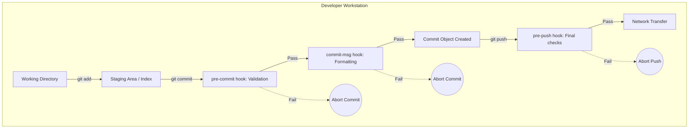

> **Складність**: [СЕРЕДНЯ]
>
> **Час на проходження**: 75 хвилин
>
> **Передумови**: Попередній модуль з Глибокого занурення в Git
>
> **Наступний модуль**: [Модуль 10: Міст до GitOps](../module-10-gitops-bridge/)

---

## Що ви зможете зробити

До кінця цього модуля ви зможете:

1. **Спроектувати** клієнтські Git hooks, які автоматично перевіряють якість коду та запобігають витоку конфіденційних даних до завершення коміту.
2. **Впровадити** стратегію забезпечення conventional commit за допомогою hook `commit-msg` для стандартизації історії репозиторію.
3. **Оцінити**, коли і як використовувати Git Rerere, або Reuse Recorded Resolution, для автоматизації вирішення повторюваних конфліктів злиття.
4. **Порівняти** методи стандартизації конфігурацій Git у команді, включно з глобальними конфігураціями, фреймворками-обгортками та каталогами шаблонів Git.
5. **Діагностувати** Git hooks, що завершуються помилкою, шляхом налагодження імен файлів, дозволів, кодів виходу, доданого в індекс вмісту та контексту середовища виконання.


## Чому це важливо

Гіпотетичний сценарій: команда платформи підтримує маніфести Kubernetes 1.35 у Git-репозиторії, за яким спостерігає GitOps-контролер. Розробник має намір внести невелику зміну в Deployment, додає YAML-файл до індексу та робить коміт, тоді як інший буфер редактора все ще містить помилкову зміну відступів і значення конфігурації, схоже на облікові дані. Віддалена система CI зрештою відхилить цю проблему, але локальна робоча станція — єдине місце, де автор все ще має повний контекст редагування, рішення щодо додавання в індекс і наміру, що стоїть за зміною.

Урок полягає не в тому, що GitOps є необачним або що CI непотрібна. Урок полягає в тому, що дефекти слід перехоплювати в найдешевшій та найнадійнішій точці, і іноді ця точка знаходиться ще до того, як буде створено об'єкт коміту. Неправильно сформований маніфест, випадковий секрет або некорисне повідомлення коміту найлегше виправити, поки розробник все ще перебуває в локальному циклі редагування. Щойно зміна стає спільною історією, та сама помилка може вимагати часу віддаленого конвеєра, уваги рецензента, помилок захисту гілок, ротації облікових даних або шумної автоматизації розгортання.

Git-хуки існують тому, що найдешевший дефект — це той, який ніколи не залишає робочу станцію розробника. Вони дозволяють репозиторію переривати локальні операції, такі як commit і push, запускати валідацію саме в той момент, коли розробник має контекст, і відхиляти зміни до того, як вони стануть спільною історією. Хуки не є заміною CI, захисту гілок або серверних політик, але вони роблять ідеальний сценарій безпечнішим і швидшим для інженерів, які намагаються зробити все правильно в умовах дедлайну.

Rerere вирішує іншу, але пов’язану проблему: повторювані зусилля людини. Коли довгоживуча гілка стикається з головною гілкою (main), що швидко оновлюється, той самий конфлікт злиття може повертатися під час ребейзів, чері-піків і повторних спроб інтеграції. Git може запам’ятати конфлікт, який ви колись вирішили, пізніше розпізнати ту саму геометрію конфлікту та повторно застосувати попереднє рішення, щоб ви витрачали увагу на нові архітектурні рішення, а не знову розв'язували ту саму головоломку.

Цей модуль розглядає Git як поверхню для автоматизації, а не як пасивний інструмент зберігання. Ви **створите** локальні хуки, які валідують проіндексований вміст, примусово вимагають корисних повідомлень комітів і блокують ризиковані пуші; потім ви **оціните**, як rerere, аліаси, глобальна конфігурація та каталоги шаблонів змінюють щоденну ергономіку робочого процесу інженера платформи. Мета полягає не в тому, щоб створити хитромудрі shell-скрипти заради них самих, а в тому, щоб спроєктувати невеликі запобіжники, які роблять правильну поведінку найпростішою.


## Частина 1: Шар перехоплення: розкриваємо таємниці Git-хуків

Git-хуки — це виконувані програми, які Git запускає у визначених точках життєвого циклу. Хук може запускатися перед створенням коміту, після створення коміту, перед тим, як push передає об'єкти, після завершення злиття або коли віддалений репозиторій отримує оновлення. Git не хвилює, чи написаний хук на Bash, Python, Ruby, Node.js або скомпільованій мові; йому важливо лише те, щоб файл мав точне ім'я хука, знаходився у правильному каталозі хуків, міг виконуватися в операційній системі та повертав код виходу, який вказує Git, чи продовжувати.

Найважливіша ментальна модель полягає в тому, що хук не є фоновою службою. Це синхронна контрольна точка всередині команди Git. Коли ви запускаєте `git commit`, Git готує знімок індексу, шукає хук з назвою `pre-commit`, запускає його, якщо він присутній і є виконуваним, і чекає завершення процесу. Нульовий код виходу означає, що хук схвалює операцію, тоді як ненульовий код виходу означає, що хук відхилив операцію, і Git повинен зупинитися.

Клієнтські хуки запускаються на робочій станції розробника, тому вони чудово підходять для швидкого зворотного зв'язку і слабкі як жорсткі межі безпеки. Розробник може видалити їх, забути встановити або обійти багато з них за допомогою `--no-verify`. Серверні хуки та елементи керування хостингової платформи працюють там, куди спільний репозиторій отримує пуші, тому вони краще підходять для безапеляційних політик. Хороша інженерна програма використовує і те, й інше: локальні хуки зменшують кількість випадкових помилок, а централізовані елементи керування забезпечують дотримання правил, які ніколи не повинні залежати від індивідуального ноутбука.



Діаграма показує, чому розміщення хука має значення. Хук `pre-commit` може перевірити проіндексований знімок до того, як буде створено будь-який новий об'єкт коміту, тому це правильне місце для форматування, лінтингу та швидких перевірок секретів. Хук `commit-msg` отримує запропоноване повідомлення коміту після того, як розробник його написав, тому це правильне місце для Conventional Commits або посилань на тікети. Хук `pre-push` бачить посилання (refs), які пушаться, тому він краще підходить для нагадувань про захист гілок, наборів локальних тестів і перевірок, які занадто важкі, щоб запускати їх для кожного коміту.

Хук `pre-commit` повинен бути швидким, оскільки він запускається під час моменту найбільшого опору у циклі редагування. Якщо хук виконується кілька хвилин, розробники навчаться обходити його, що перетворить шлюз контролю якості на джерело обурення. Залиште `pre-commit` для детермінованих перевірок, які швидко завершуються, і перемістіть повільніші перевірки до `pre-push` або CI. У репозиторії маніфестів Kubernetes розумний локальний хук перевіряє синтаксис YAML, запобігає появі очевидних рядків з обліковими даними та, можливо, запускає перевірку схеми на змінених файлах, замість того, щоб перебудовувати всю платформу.

Хук `commit-msg` стосується менше коректності коду і більше якості історії. Префікси Conventional Commits, повідомлення з областю видимості та посилання на тікети полегшують використання `git log`, генерацію релізів і розслідування інцидентів через місяці після початкової зміни. Під час регресії на продакшені чітке повідомлення коміту може скоротити пошук за допомогою `git bisect`, оскільки оператор може відрізнити нешкідливе оновлення документації від зміни в admission policy, шаблонах Deployment або логіці початкового завантаження кластера.

Хук `pre-push` — це остання локальна контрольна точка перед мережевою передачею. Він може запобігти випадковим прямим пушам у `main`, запустити сфокусований набір тестів або перевірити, що назва гілки відповідає угоді трекера завдань. Оскільки push відбувається рідше, ніж commit, цей хук може дозволити собі бути важчим, ніж `pre-commit`, але він все одно не повинен замінювати CI. Ставтеся до нього як до корисного локального попереднього перегляду віддалених очікувань, а не як до єдиного місця, де доводиться коректність.

Зупиніться та подумайте: як ви вважаєте, що станеться, якщо розробник використає `git commit --no-verify` для репозиторію, який покладається лише на клієнтські хуки? Git пропускає виконання локального хука, який цей прапорець дозволяє обійти, що означає, що локальна система безпеки зникає для цієї операції. Ось чому локальні хуки повинні виражати корисні перевірки робочого процесу розробника, тоді як обов'язкові засоби контролю, такі як захищені гілки, обов'язкові перевірки коду та серверна валідація, повинні існувати за межами особистої конфігурації розробника.

З цієї відмінності випливає одне практичне правило проєктування: пишіть повідомлення локальних хуків як наставництво, а не як покарання. Невдалий хук повинен назвати файл, пояснити порушене правило та запропонувати наступну команду або спосіб виправлення. Інженер вже перебуває в потоці створення коміту або пушу, тому розпливчасте повідомлення на кшталт "failed" марнує момент, коли він найбільше готовий виправити проблему.

Ще одне правило проєктування — зберігати видимість власності на хук. Якщо репозиторій залежить від локального хука, команда повинна знати, хто його підтримує, де знаходиться канонічна версія та як контриб'ютор може оновити своє локальне встановлення. Хуки часто починаються як корисний скрипт одного інженера і повільно стають обов'язковою інфраструктурою робочого процесу. Як тільки це відбувається, незадокументований хук може створювати навантаження на підтримку щоразу, коли замінюється ноутбук, змінюється оболонка або переміщується залежність.


## Частина 2: Створення хука `pre-commit` для валідації YAML та сканування секретів

Уявіть інфраструктурний репозиторій із сотнями маніфестів Kubernetes, файлами значень Helm та оверлеями середовищ. Один неправильно відформатований файл YAML може зламати автоматизацію, а єдині зафіксовані облікові дані можуть спровокувати екстрену ротацію. Мета локального хука `pre-commit` у цьому репозиторії — не довести, що вся система працює; вона полягає в тому, щоб відхиляти очевидні дефекти, поки автор ще пам’ятає, що він змінив, і до того, як ці дефекти потраплять у спільну історію.

Критична деталь реалізації полягає в тому, що коміт зберігає staging area, а не обов’язково ті файли, які наразі відображаються в робочій директорії. Розробники часто додають до staging area коректний файл, продовжують редагувати його і випадково залишають неіндексовані зміни поза комітом. Правильний хук перевіряє саме ті індексовані blob-об'єкти, які Git збирається зафіксувати. Недосконалий хук, який проводить лінтинг звичайних шляхів до файлів, може відхилити валідний індексований коміт через непов'язані неіндексовані редагування або, що ще гірше, пропустити проіндексований дефект, оскільки робоче дерево вже було виправлено, але не додано до індексу.

Почніть із перевірки локальної директорії хуків. Git створює зразки файлів хуків у `.git/hooks`, але їхній суфікс `.sample` означає, що Git їх не запускатиме. Активний хук повинен мати точну назву фази хука без розширення, а файл має бути виконуваним відповідно до операційної системи.

```bash
# Inspect the default sample hooks Git ships (inactive until copied to exact names)
ls -l .git/hooks
```

Перш ніж запускати це, зупиніться та подумайте: що ви очікуєте побачити в новому репозиторії. Ви маєте побачити файли-зразки, такі як `pre-commit.sample`, `commit-msg.sample` та `pre-push.sample`, але Git ігнорує їх, доки ви не створите файли з точними активними іменами. Це правило іменування має значення, оскільки хук із назвою `pre-commit.py` може бути повністю виконуваним і все одно ніколи не запуститься.

```bash
# Create the file and grant it execute permissions
touch .git/hooks/pre-commit
chmod +x .git/hooks/pre-commit
```

Наведений нижче хук реалізує дві фази. Спочатку він ідентифікує індексовані файли, які були додані, скопійовані або змінені, а потім перевіряє індексований вміст YAML, передаючи версію з індексу через `git show ":$FILE"`. По-друге, він сканує індексовані blob-об'єкти на наявність простих маркерів, схожих на облікові дані. Паттерн облікових даних навмисно зроблений базовим для навчання; production-команди повинні використовувати такі сканери, що підтримуються, як Gitleaks, TruffleHog, або сервіс сканування секретів у хмарі на додаток до будь-якого локального хука.

```bash
#!/bin/bash
# .git/hooks/pre-commit

# Redirect all output to standard error to ensure it's visible in all Git GUIs
exec 1>&2

echo "Running KubeDojo pre-commit validation suite..."

# Initialize a global error tracking flag
ERROR_FOUND=0

# ---------------------------------------------------------
# Phase 1: Strict YAML Linting
# ---------------------------------------------------------
echo "--> Initiating YAML syntax verification..."
while IFS= read -r -d '' FILE; do
    if [[ "$FILE" == *.yaml ]] || [[ "$FILE" == *.yml ]]; then
        # Verify that the yamllint binary is accessible in the environment's PATH
        if command -v yamllint &> /dev/null; then
            # DANGER ZONE AVOIDED: We use 'git show :$FILE' to extract and lint the
            # exact STAGED version of the file, completely ignoring the working directory.
            git show ":$FILE" | yamllint -d "{extends: relaxed, rules: {line-length: disable}}" -
            
            # $? captures the exit code of the previous command (yamllint)
            if [ $? -ne 0 ]; then
                echo "CRITICAL: YAML validation failed for manifest -> $FILE"
                ERROR_FOUND=1
            fi
        else
            echo "WARNING: 'yamllint' binary not detected, skipping validation for $FILE"
        fi
    fi
done < <(git diff --cached --name-only --diff-filter=ACM -z)

# ---------------------------------------------------------
# Phase 2: Aggressive Secrets Scanning
# ---------------------------------------------------------
echo "--> Scanning staged blobs for hardcoded credentials..."
while IFS= read -r -d '' FILE; do
    # Search the staged blob content for a regex of forbidden, high-risk keywords.
    # Note: This is a simplistic regex for educational illustration. Real-world
    # production setups should utilize dedicated engines like TruffleHog or Gitleaks.
    if git show ":$FILE" | grep -qiE 'password\s*[:=]|secret\s*[:=]|api_key|aws_access_key_id'; then
        echo "blocked: potential secret in $FILE"
        ERROR_FOUND=1
    fi
done < <(git diff --cached --name-only --diff-filter=ACM -z)

# ---------------------------------------------------------
# Phase 3: Final Execution Evaluation
# ---------------------------------------------------------
if [ $ERROR_FOUND -ne 0 ]; then
    echo ""
    echo "COMMIT ABORTED: Security or syntax violations detected."
    echo "Please remediate the errors highlighted above, stage your fixes, and try again."
    # Exiting with a non-zero status explicitly instructs Git to terminate the commit process
    exit 1
fi

echo "All pre-commit quality gates passed successfully."
exit 0
```

Зверніть увагу, що скрипт починається з перенаправлення стандартного виводу в стандартний потік помилок (stderr). Багато Git-клієнтів і термінальних робочих процесів надійніше відображають помилки хуків, коли хук пише у stderr, особливо коли сама команда Git перехоплює stdout. Скрипт також використовує `--diff-filter=ACM`, щоб ігнорувати видалені файли; спроба перевірити файл, якого більше не існує, додає шуму і може призвести до збою хука з хибної причини.

Вираз `git show ":$FILE"` є серцем цього хука. Префікс двокрапки вказує Git прочитати файл з індексу, який є індексованим знімком (staged snapshot). Якщо розробник має неіндексовані зміни в робочому дереві, ці зміни є невидимими для цього етапу перевірки. Така поведінка — саме те, що вам потрібно, оскільки хук повинен схвалити або відхилити коміт, який Git збирається створити, а не буфер редактора, який розробник ще не додав до індексу.

Подібний хук також потребує чіткої політики щодо залежностей. Якщо `yamllint` відсутній, цей навчальний скрипт видає попередження і продовжує роботу, щоб новий учень усе ще міг завершити вправу. У production-репозиторії можуть зробити протилежний вибір і зупинитися з помилкою (fail closed), але тоді команда повинна забезпечити надійний шлях встановлення. Інакше хук перетворюється на прихований податок на онбординг, і нові контриб'ютори витрачають свою першу годину на налагодження локального інструментарію, а не на вивчення кодової бази.

Тепер створіть навмисно помилковий маніфест. Перший дефект — неправильний відступ у YAML, а другий — очевидно небезпечне значення, схоже на облікові дані. У реальних репозиторіях віддавайте перевагу Kubernetes Secrets, які отримуються через зовнішнє управління секретами, Sealed Secrets або хмарні примітиви ідентифікації; цей приклад навмисно невеликий, щоб поведінку хука було легко побачити.

```text
# broken-deploy.yaml
apiVersion: apps/v1
kind: Deployment
metadata:
  name: test-app
spec:
  replicas: 3
    selector: # FATAL ERROR: Invalid YAML indentation
      matchLabels:
        app: test
  template:
    metadata:
      labels:
        app: test
    spec:
      containers:
      - name: app
        image: nginx:1.26
        env:
        - name: DATABASE_PASSWORD
          value: "password=super_secret_production_123!" # FATAL ERROR: Hardcoded secret exposed
```

```bash
git add broken-deploy.yaml
git commit -m "feat: introduce new production deployment manifest"
```

```text
Running KubeDojo pre-commit validation suite...
--> Initiating YAML syntax verification...
stdin
  7:5       error    wrong indentation: expected 2 but found 4  (indentation)

CRITICAL: YAML validation failed for manifest -> broken-deploy.yaml
--> Scanning staged blobs for hardcoded credentials...
blocked: potential secret in broken-deploy.yaml

COMMIT ABORTED: Security or syntax violations detected.
Please remediate the errors highlighted above, stage your fixes, and try again.
```

Ця помилка є успіхом, оскільки репозиторій відхилив поганий знімок до того, як він став історією. Хуку не знадобився віддалений репозиторій, черга CI або рецензент, щоб помітити очевидну проблему. Він також надав автору конкретне ім'я файлу та конкретний шлях для виправлення: виправте YAML, видаліть небезпечне значення, додайте виправлений файл до індексу та запустіть коміт знову.

Є один компроміс, про який варто сказати прямо. Локальний сканер, який використовує прості регулярні вирази, буде видавати як хибнопозитивні, так і хибнонегативні результати. Це не робить його марним; це означає, що хук є дешевим раннім фільтром, а не кінцевою інстанцією. Більш надійна архітектура є багаторівневою: локальні перевірки для швидкості, перевірки в CI для узгодженості, хмарне сканування секретів для виявлення по всьому репозиторію та процедури ротації облікових даних для тих випадків, які все ж таки прослизають.

Ця звичка працювати з індексованим вмістом також допомагає з частковими комітами. Досвідчені розробники часто використовують `git add -p`, щоб індексувати одну логічну зміну, залишаючи непов'язані редагування в тому ж файлі на потім. Хук, який читає робоче дерево, руйнує цей робочий процес, оскільки він оцінює весь файл на диску. Хук, який читає індекс, поважає наміри розробника та перевіряє лише той патч, який стає історією, що робить автоматизацію точною, а не нав'язливою.


## Частина 3: Забезпечення стандартів за допомогою хуків `commit-msg`

Історія репозиторію — це операційний інтерфейс. Люди читають її під час збоїв, реліз-менеджери аналізують її для створення списків змін (changelogs), а системи автоматизації використовують її, щоб вирішити, чи є зміна новою функцією, виправленням, рефакторингом або оновленням збірки. Неохайний журнал, повний «wip», «fix» і «stuff», змушує майбутніх операторів відкривати кожен diff, коли вони намагаються відповісти на просте запитання в умовах браку часу.

Conventional Commits створюють невелику граматику для повідомлень комітів. Повідомлення починається з типу, такого як `feat`, `fix` або `docs`, необов'язково включає область застосування (scope) у дужках, а потім надає стислий опис. Цей формат достатньо простий для запам'ятовування людьми та достатньо структурований для парсингу інструментами. Хук `commit-msg` є правильною точкою примусового застосування правил, оскільки Git передає запропонований файл повідомлення хуку до того, як буде створено об'єкт коміту.

Наступний хук зчитує повідомлення коміту зі шляху до файлу, який надається як перший аргумент. Потім він перевіряє, чи відповідає повідомлення очікуваному типу, необов'язковій області застосування, необов'язковому маркеру критичної зміни, двокрапці, пробілу та опису. Якщо повідомлення не проходить перевірку, хук пояснює прийнятний формат і завершує роботу зі статусом `1`.

```bash
#!/bin/bash
# .git/hooks/commit-msg

# The first argument ($1) passed to this specific script by Git is the name/path of the
# commit message file Git passes for this hook invocation.
MESSAGE_FILE=$1
MESSAGE=$(cat "$MESSAGE_FILE")

# Define our strictly allowed semantic types
TYPES="build|chore|ci|docs|feat|fix|perf|refactor|revert|style|test"

# Define the uncompromising regular expression for conventional commits
# ^($TYPES)          : Must explicitly start with one of the allowed types
# (\([a-z0-9\-]+\))? : May contain an optional scope wrapped in parentheses
# !?                 : May contain an optional breaking change exclamation mark
# : \s+              : Must contain a colon followed by at least one space
# .*                 : Must contain a descriptive payload
REGEX="^($TYPES)(\([a-z0-9\-]+\))?!?: .+"

# Check if the user's message matches our rigorous regex
if ! echo "$MESSAGE" | grep -qE "$REGEX"; then
    echo "COMMIT REJECTED: Invalid commit message format."
    echo "Your submitted message was: '$MESSAGE'"
    echo ""
    echo "This repository strictly enforces the Conventional Commits specification."
    echo "Please reformat your message to match the following template:"
    echo "  <type>[optional scope]: <description>"
    echo ""
    echo "Allowed types include: $TYPES"
    echo "Valid Example: feat(auth): implement OIDC provider integration"
    exit 1
fi

exit 0
```

Зупиніться та подумайте: який вивід ви очікуєте побачити, якщо розробник запустить `git commit -m "WIP: fixing stuff"`, коли встановлено цей хук? Хук зчитує тимчасовий файл повідомлення, порівнює рядок із регулярним виразом, відхиляє тип `WIP` у верхньому регістрі, оскільки його немає в списку дозволених, і виводить шаблон для виправлення. Важливий навчальний момент полягає в тому, що хук перевіряє історію репозиторію як дані, а не просто чіпляється до розробників щодо стилю.

Регулярні вирази тут корисні, але вони також стають ризиком для зручності підтримки, коли намагаються закодувати кожну можливу політику. Якщо ваша організація вимагає ідентифікаторів тікетів, трейлерів критичних змін, рядків signed-off-by або правил для повідомлень на основі гілок, подумайте, чи не буде невеликий скрипт з іменованими перевірками зрозумілішим, ніж єдиний складний вираз. Хуки — це production-код у мініатюрі; вони заслуговують на читабельність, тести та повідомлення про помилки, які зможе зрозуміти втомлений інженер.

Фаза `commit-msg` також може нормалізувати поведінку в різних інструментах. Деякі розробники роблять коміти з термінала, інші — з IDE, а треті — через графічний Git-клієнт. Доки клієнт викликає Git звичайним чином, хук бачить той самий файл повідомлення і застосовує те саме правило. Саме завдяки такій узгодженості валідація повідомлень належить до життєвого циклу Git, а не до сторінки у вікі, яку люди повинні пам'ятати.


## Частина 4: Захист віддаленого репозиторію за допомогою хука `pre-push`

Хук `pre-push` виконується після того, як Git визначив, які refs він збирається оновити, але до передачі об'єктів. Такий час виконання робить його корисним для зупинки помилок, які очевидні за цільовим ref або занадто дорогі для виявлення після відхилення віддаленим сервером. Випадковий push безпосередньо у `main` є класичним прикладом: захист гілки на стороні сервера може відхилити push, але локальний хук може миттєво перехопити намір і пояснити очікуваний робочий процес із гілками функцій (feature-branch).

На відміну від `pre-commit`, хук `pre-push` отримує дані через стандартний ввід. Кожен рядок описує одне оновлення ref із вказівкою локального ref, локального SHA, віддаленого ref та віддаленого SHA. Хук може прочитати ці рядки і вирішити, чи є push прийнятним. У наведеній нижче простій політиці будь-яка спроба оновити `refs/heads/main` відхиляється з повідомленням, яке каже розробнику зробити push в ізольовану гілку та відкрити pull request.

```bash
#!/bin/bash
# .git/hooks/pre-push

PROTECTED_BRANCH="main"

# The pre-push hook receives specific ref data on standard input in the format:
# <local ref> <local sha1> <remote ref> <remote sha1>
while read LOCAL_REF LOCAL_SHA REMOTE_REF REMOTE_SHA
do
    # Check if the remote reference being targeted is our protected branch
    if [[ "$REMOTE_REF" == *"refs/heads/$PROTECTED_BRANCH" ]]; then
        echo "FATAL PUSH REJECTED: Direct, unmediated pushes to '$PROTECTED_BRANCH' are forbidden."
        echo "Please push your changes to an isolated feature branch and open a formal Pull Request."
        exit 1
    fi
done

exit 0
```

Цей хук покращує досвід розробника, але він все одно не замінює захист віддаленої гілки. Розробник може обійти багато клієнтських хуків, зробити push з іншої машини, використати інший клієнт Git або неправильно налаштувати своє середовище. Віддалений репозиторій все одно повинен вимагати рев'ю, перевірки статусу та дозволи для захищених гілок. Локальний хук є цінним, оскільки він перетворює передбачувану помилку на миттєвий локальний зворотний зв'язок замість повільнішого відхилення віддаленим сервером.

На цьому ж етапі хука можна запускати "важчі" перевірки, оскільки push відбувається рідше, ніж commit. Наприклад, репозиторій може запускати цільовий набір юніт-тестів перед дозволом на push, або ж перевіряти, чи є актуальними згенеровані маніфести. Питання проєктування полягає в тому, чи є перевірка достатньо швидкою, щоб розробники її толерували, і достатньо конкретною, щоб невдачі відчувалися як такі, що можна виправити. Якщо відповідь ні, перенесіть перевірку до CI і зосередьте локальний хук на підказках щодо політик та швидкій валідації.


## Частина 5: Rerere: Повторне використання збереженого вирішення конфліктів (Reuse Recorded Resolution)

Конфлікти під час merge є нормальним явищем в активних репозиторіях, але повторювані конфлікти злиття — це марнування часу. Біль з'являється тоді, коли гілка з новою функцією живе днями, поки `main` постійно змінюється. Ви вирішуєте конфлікт під час rebase, продовжуєте, а потім стикаєтеся з тим самим текстовим конфліктом пізніше, коли Git застосовує інший commit. Людський мозок уже вирішив цю проблему, проте Git знову вимагає тієї самої роботи, оскільки rerere зазвичай вимкнено за замовчуванням.

Rerere розшифровується як Reuse Recorded Resolution (Повторне використання збереженого вирішення). Коли його ввімкнено, Git зберігає preimage (початковий стан) конфлікту та postimage (кінцевий стан) вашого вирішення. Preimage — це форма конфлікту, яку побачив Git, включаючи конкуруючі версії. Postimage — це чистий файл, який ви додали в stage після вирішення конфлікту. Коли Git пізніше бачить таку саму форму конфлікту, він може повторно застосувати збережений postimage і повідомити вам, що він використав попереднє вирішення.

```bash
git config --global rerere.enabled true
```

Rerere особливо корисний для довготривалих rebase, наборів патчів (patch stacks), релізних гілок та багаторазових merge між інтеграційними гілками. Він менш корисний, коли конфлікти рідкісні або коли навколишній код змінюється настільки, що текстово схожий конфлікт потребує іншого семантичного рішення. Цей інструмент — помічник для пам'яті, а не авторитет у прийнятті рішень. Вам усе одно потрібно перевірити результат перед продовженням, особливо у файлах, де синтаксис може бути правильним, а поведінка — хибною.

```mermaid
flowchart TD
    subgraph Step 1: The Initial Conflict
        direction TB
        C1["Conflict (Main vs Feature)\n\n<<<<<<< HEAD\nspec.replicas: 3\n=======\nspec.replicas: 5\n>>>>>>> feature"]
        R1["You manually resolve this to:\n\nspec.replicas: 5"]
        C1 --> R1
    end
    
    subgraph Step 2: Rerere Records State
        Mem["Git memorizes the state:\n\n1. Preimage (The conflict signature)\n2. Postimage (Your final resolved state)"]
    end
    
    subgraph Step 3: The Future Rebase Conflict
        direction TB
        C2["Rebasing Feature onto Main\n\n<<<<<<< HEAD\nspec.replicas: 3\n=======\nspec.replicas: 5\n>>>>>>> feature"]
        R2["Git recognizes the signature!\nSilently auto-resolves to:\n\nspec.replicas: 5"]
        C2 --> R2
    end
    
    Step 1 --> Step 2 --> Step 3
```

Діаграма використовує кількість реплік Kubernetes, оскільки її легко візуалізувати, але той самий механізм застосовується до коду додатку, документації, конфігурації та згенерованих файлів. Git не розуміє бізнес-наміру; він зіставляє геометрію конфлікту. Якщо така сама форма конфлікту з'являється знову, rerere може застосувати те саме текстове вирішення. Це потужно під час повторюваних rebase і небезпечно, якщо ви припините переглядати кінцевий diff.

Наступна вправа симулює конфлікт у крихітному репозиторії. У реальній команді конфлікт може стосуватися стратегії розгортання, політики допуску (admission policy), робочого процесу CI або спільної бібліотечної функції. Урок той самий: увімкніть rerere перед конфліктом, вирішіть його один раз, і дозвольте Git зберегти достатньо інформації, щоб заощадити зусилля в майбутньому.

```bash
# On the main branch
echo 'version: "1.0"' > app-config.yaml
git add app-config.yaml && git commit -m "chore: add initial config"

# Switch to a new feature branch
git checkout -b feature
echo 'version: "2.0-beta"' > app-config.yaml
git commit -am "feat: update config to beta release"

# Back on main, someone makes a conflicting change
git checkout main
echo 'version: "1.1"' > app-config.yaml
git commit -am "chore: bump version to 1.1"

# Trigger a catastrophic conflict
git merge feature
```

```text
Auto-merging app-config.yaml
CONFLICT (content): Merge conflict in app-config.yaml
Recorded preimage for 'app-config.yaml'
Automatic merge failed; fix conflicts and then commit the result.
```

Фраза `Recorded preimage` означає, що rerere зафіксував сторону конфлікту під час мапінгу. Він ще не вивчив відповідь. Ви навчаєте його відповіді, редагуючи файл до правильного вирішеного стану, додаючи цей результат до stage та завершуючи крок merge або rebase. Лише тоді Git може записати postimage і повторно використати це вирішення пізніше.

```bash
printf 'version: "2.0-beta"\n' > app-config.yaml
git diff app-config.yaml   # confirm no <<<<<<< conflict markers remain
git add app-config.yaml
git commit -m "Merge feature branch"
```

```text
Recorded resolution for 'app-config.yaml'.
[main 7f3a8b2] Merge feature branch
```

Тепер уявіть, що merge не був тим робочим процесом, якого ви хотіли. Можливо, команда віддає перевагу лінійній історії, тому ви скидаєте (reset) merge і замість цього робите rebase гілки з функцією. Наведена нижче команда reset є навмисно деструктивною в одноразовому навчальному репозиторії; не запускайте її в реальному репозиторії, якщо ви не впевнені, який commit ви відкидаєте.

```bash
# Undo the merge operation in the throwaway exercise repository
git reset --hard HEAD~1
```

Зупиніться та подумайте: якби ви зараз виконали `git rerere forget app-config.yaml`, що б сталося під час наступного rebase? Git відкинув би збережений мапінг для цього шляху, тому наступний ідентичний конфлікт зупинився б для ручного вирішення, ніби rerere його ніколи не бачив. Ця команда є екстреним виходом, коли Git запам'ятав погану відповідь або коли навколишній контекст файлу змінився настільки, що старій відповіді більше не можна довіряти.

```bash
# Switch back to the feature branch and initiate a rebase onto main
git checkout feature
git rebase main
```

```text
Auto-merging app-config.yaml
CONFLICT (content): Merge conflict in app-config.yaml
Resolved 'app-config.yaml' using previous resolution.
```

Навіть після того, як rerere застосує попереднє вирішення, вам слід перевірити результат. Виконайте `git diff`, підтвердіть, що файл усе ще виражає очікувану поведінку, додайте файл до stage за потреби та продовжуйте rebase. Ця звичка має значення, оскільки текст може збігатися, тоді як сенс змінюється. Маніфест розгортання, який був правильно вирішений минулого тижня, може потребувати іншого тегу образу, змінної середовища або стратегії rollout після того, як були внесені зміни поруч.

Rerere має необов'язкове налаштування `rerere.autoupdate`, яке автоматично додає до stage повторно використане вирішення. Це налаштування є зручним для досвідчених мейнтейнерів, які працюють у стабільних чергах патчів, але воно прибирає корисну паузу. У більшості навчальних та командних сценаріїв залишайте autoupdate вимкненим, щоб розробник мав свідомо перевіряти та додавати файл до stage. Швидкість корисна лише тоді, коли вона не стирає момент перевірки, який виявляє семантичні помилки.

Rerere також змінює те, як ви думаєте про переривання (aborting) і повторні спроби інтеграційної роботи. Без rerere перезапуск складного rebase може здаватися занадто витратним, оскільки кожне вирішення конфлікту, можливо, доведеться повторювати. З увімкненим rerere переривання незрозумілої спроби та перезапуск із чіткішим планом стає менш дорогим. Це може покращити якість рішень, оскільки у вас менше спокуси продовжувати продавлювати rebase лише для того, щоб уникнути повторної ручної роботи з конфліктами.


## Частина 6: Аліаси Git та глобальна конфігурація для складних робочих процесів

Хуки та rerere автоматизують моменти прийняття рішень, тоді як аліаси та глобальна конфігурація зменшують повторюваний набір тексту. Зі зростанням репозиторіїв команди, які ви виконуєте найчастіше, стають настільки довгими, що невеликі шорткати змінюють поведінку. Хороший аліас — це не просто скорочення; він фіксує робочий процес, який ви хочете постійно повторювати, наприклад, перегляд читабельного графа, скасування останнього commit без втрати змін у stage або публікацію поточної гілки з відстеженням upstream.

```bash
git config --global --edit
```

Наведені нижче аліаси є навмисно практичними для роботи DevOps та SRE. Аліас log перетворює історію на граф, який робить видимими розгалуження та merge. Аліас undo видаляє останній commit, зберігаючи його зміни у stage, що корисно, коли повідомлення commit було неправильним або один файл був забутий. Аліаси contains та pub швидко відповідають на типові питання координації.

```ini
[alias]
    # The ultimate log graph. Renders branches, tags, and commit hashes beautifully in the terminal.
    lg = log --color --graph --pretty=format:'%Cred%h%Creset -%C(yellow)%d%Creset %s %Cgreen(%cr) %C(bold blue)<%an>%Creset' --abbrev-commit
    
    # Soft "Undo" of the last commit, dropping the commit but keeping changes staged.
    # Perfect for when you forgot to add a critical file or made a typo in the message.
    undo = reset --soft HEAD~1
    
    # Rapidly check which branches currently contain a specific commit hash
    contains = branch --contains
    
    # Push the current branch and automatically set the upstream tracking branch on the remote
    pub = push -u origin HEAD
```

**Антипатерн — не додавайте аліас `nuke` до dotfiles початківців.** Поширеним деструктивним шорткатом є `nuke = !git clean -fd && git reset --hard && git checkout .`, який незворотно видаляє невідстежувані файли та відкидає локальні зміни. Якщо вам потрібно перевірити, що буде видалено, спочатку виконайте `git clean -nd` (dry-run), перевірте перелічені шляхи і лише після цього вирішуйте, чи виправдане деструктивне скидання (reset).

Зміни глобальної конфігурації також можуть змінити поведінку Git за замовчуванням. Встановлення `pull.rebase` на `true` змушує `git pull` виконувати fetch та rebase замість fetch та merge, що допомагає командам, які віддають перевагу лінійній локальній історії. Встановлення `push.default` на `current` дозволяє `git push` публікувати поточну гілку у віддалену гілку з тією ж назвою. Ці налаштування за замовчуванням заощаджують час, але вони також кодують вибір робочого процесу, тому документуйте їх під час онбордингу команди.

Тут є корисна аналогія з короткими shell-аліасами для частих команд Kubernetes. Аліас сам по собі не робить Kubernetes безпечнішим; він знижує тертя для команд, які ви виконуєте часто. Аліаси Git поводяться так само. Вони повинні скорочувати добре зрозумілі операції, а не приховувати операції, які учень ще не зрозумів. Якщо шорткат заважає вам пояснити, що робить базова команда, зарано покладатися на цей шорткат.

Коли ви переглядаєте dotfiles іншого інженера, звертайте увагу на те, чи є аліаси прозорими чи несподіваними. Нешкідливий аліас, такий як `git lg`, робить вивід легшим для читання, тоді як деструктивний аліас може видалити роботу через одну помилку. Командна документація повинна рекомендувати аліаси, які покращують спільний словниковий запас та уникають необхідності персональних шорткатів для основних робочих процесів. Інструкції до репозиторію повинні залишатися працездатними для того, хто використовує звичайний Git без приватної кастомізації shell.


## Частина 7: Каталоги шаблонів та стандартизація команди

Найбільшою несподіванкою для багатьох інженерів є те, що `.git/hooks` не версіонується. Хук, розміщений там, належить одному локальному клону. Коли колега клонує репозиторій, він отримує новий каталог `.git`, заповнений Git, а не копію вашого локального каталогу з хуками. Такий дизайн захищає портативність репозиторію, але це означає, що команді потрібна чітка стратегія розповсюдження для хуків та конфігурації Git.

Існують два поширені підходи. Фреймворки-обгортки, такі як `pre-commit` або Husky, зберігають конфігурацію хуків у відстежуваних файлах репозиторію та надають крок встановлення, який зв'язує локальний каталог хуків із фреймворком. Каталоги шаблонів Git є нативними для Git і копіюють файли в нові репозиторії під час `git init` або `git clone`. Підхід із фреймворком зазвичай краще підходить для перевірок, специфічних для проєкту, тоді як шаблони корисні для налаштувань за замовчуванням на рівні всієї машини, які інженер хоче бачити в кожному репозиторії.

Механізм каталогу шаблонів є простим. Ви створюєте каталог із такою самою структурою, як і файли, які ви хочете скопіювати в `.git`, розміщуєте хуки в його підкаталозі `hooks` і налаштовуєте `init.templatedir` так, щоб він вказував туди. Майбутні репозиторії, ініціалізовані або склоновані цією інсталяцією Git, отримують ці файли під час створення. Існуючі репозиторії не оновлюються автоматично, що є важливим експлуатаційним обмеженням.

```bash
# Create a centralized location safely within your home directory
mkdir -p ~/.git-templates/hooks
```

Скопіюйте скрипти `pre-commit` та `commit-msg`, про які йшлося раніше, до `~/.git-templates/hooks/`, а потім переконайтеся, що кожен файл є виконуваним. Якщо біт виконання відсутній, Git проігнорує хук, і характер збою може виглядати так, ніби хука ніколи не існувало. Це одна з причин привабливості фреймворків-обгорток: вони часто обробляють встановлення, дозволи та середовища інструментів більш узгоджено, ніж ситуативні ручні налаштування.

```bash
git config --global init.templatedir '~/.git-templates'
```

Каталоги шаблонів не є повноцінною системою управління командою. Вони залежать від глобальної конфігурації Git кожної людини та впливають на нові репозиторії, а не ретроактивно виправляють старі. Вони чудово підходять для особистих налаштувань за замовчуванням, навчальних середовищ та організацій, які централізовано керують робочими станціями розробників. Для більшості репозиторіїв застосунків поєднуйте конфігурацію фреймворку, що відстежується, із примусовим виконанням у CI, щоб репозиторій декларував власні очікування.

Який підхід ви б обрали для платформної команди, яка володіє десятками додатків Kubernetes у багатьох репозиторіях, і чому? Розумною відповіддю є використання конфігурації фреймворку, що відстежується, для валідації, специфічної для репозиторію, захисту віддалених гілок для обов'язкових політик, а також додаткових каталогів шаблонів для особистої зручності. Такий багаторівневий дизайн зберігає репозиторій самоописовим, водночас дозволяючи окремим інженерам переносити корисні налаштування за замовчуванням між непов'язаними проєктами.

Вибір способу розповсюдження повинен відповідати радіусу ураження правила. Особисті вподобання, такі як аліас для логів, належать до глобальної конфігурації або шаблону. Правило репозиторію, таке як "усі маніфести повинні проходити цю перевірку схеми", належить до відстежуваної конфігурації проєкту та CI. Правило масштабу всієї компанії, таке як "жодних прямих пушів у захищені гілки", належить до платформи хостингу. Змішування цих рівнів створює плутанину, оскільки контриб'ютори не можуть зрозуміти, чи сталася помилка через їхню машину, репозиторій чи організацію.

## Патерни та антипатерни

Хороша автоматизація Git є невеликою, спостережуваною та багаторівневою. Хук повинен відповідати на одне запитання робочого процесу у відповідній точці життєвого циклу, повертати значущий код виходу та пояснювати збої в термінах, які автор може виправити. Rerere має зменшувати повторювану роботу з конфліктами, не усуваючи перевірку людиною. Глобальна конфігурація повинна кодувати свідомі налаштування за замовчуванням, а не приховувати несподівану поведінку.

| Патерн | Коли використовувати | Чому це працює |
|---------|----------------|--------------|
| Валідація індексованого контенту в `pre-commit` | Використовуйте це для швидкої перевірки синтаксису, форматування та очевидних перевірок секретів у файлах, які готуються до коміту. | Хук оцінює той самий знімок, який запише Git, тому неіндексовані зміни не спотворюють результат. |
| Примусове дотримання граматики історії в `commit-msg` | Використовуйте це, коли інструменти релізу, аудити або реагування на інциденти залежать від читабельних повідомлень комітів. | Хук отримує запропоноване повідомлення ще до того, як коміт існує, що робить відхилення чистим і локальним. |
| Зберігайте важкі перевірки в `pre-push` або CI | Використовуйте це, коли перевірка є цінною, але занадто повільною для кожного коміту. | Розробники все одно отримують ранній зворотний зв'язок, тоді як цикл комітів залишається достатньо швидким, щоб зберегти стан потоку. |
| Увімкнення rerere з ручною перевіркою | Використовуйте це для довгоживучих гілок, повторюваних ребейзів та черг патчів. | Git повторно використовує записані вирішення конфліктів, тоді як автор все ще перевіряє фінальний diff перед продовженням. |

Антипатерни зазвичай з'являються, коли команди очікують, що локальна автоматизація візьме на себе більше відповідальності, ніж вона може підтримати. Клієнтський хук не може бути вашою єдиною політикою безпеки, сканер регулярних виразів не може бути вашим єдиним захистом від секретів, а каталог шаблонів не може бути вашим єдиним механізмом онбордингу. Ці інструменти є найефективнішими, коли кожен рівень має вузьку задачу, і збій на одному рівні перехоплюється іншим.

| Антипатерн | Чому команди потрапляють у цю пастку | Краща альтернатива |
|--------------|------------------------|--------------------|
| Сприйняття локальних хуків як обов'язкової безпеки | Хуки здаються суворими, оскільки вони блокують локальні команди, тому команди переоцінюють їхню силу примусу. | Використовуйте локальні хуки для зворотного зв'язку та забезпечуйте виконання правил, що не підлягають обговоренню, за допомогою CI, захищених гілок та серверних елементів управління. |
| Лінтинг файлів робочого дерева в `pre-commit` | Читати шляхи до файлів простіше, ніж читати блоби індексу, особливо в перших чернетках скриптів хуків. | Використовуйте `git diff --cached` та `git show ":$FILE"`, щоб валідація відповідала індексованому знімку. |
| Встановлення хуків лише в `.git/hooks` | Хук працює на машині автора, створюючи ілюзію, що він належить до репозиторію. | Відстежуйте конфігурацію хуків у репозиторії через фреймворк або документуйте налаштування шаблонів для особистих налаштувань за замовчуванням. |
| Сліпе автоматичне індексування вирішень rerere | Повторювані конфлікти виснажують, тому видалення кожного ручного кроку виглядає привабливим. | Дозвольте rerere застосувати текст, потім перевірте `git diff` та свідомо проіндексуйте перед продовженням. |

Урок масштабування полягає в тому, що хуки стають спільною інфраструктурою, щойно команда починає від них залежати. Ставтеся до них з такою ж увагою, як до скриптів у каталозі `scripts/` або робочих процесів CI в `.github/`. Тримайте їх читабельними, перевіряйте зміни до них, тестуйте їхні шляхи збоїв та документуйте підтримуваний метод встановлення. Заплутаний хук може змарнувати стільки ж часу, скільки й дефект, якому він мав запобігти.

## Структура прийняття рішень

Вибір місця для розміщення правила автоматизації Git починається з наслідків збою. Якщо пропущена перевірка може розкрити облікові дані, зламати розгортання в продакшені або порушити комплаєнс, правило має застосовуватися централізовано, навіть якщо воно також попередньо перевіряється локально. Якщо пропущена перевірка просто викликає потребу в очищенні стилю, локальних хуків і зворотного зв'язку від CI може бути достатньо. Розміщуйте найсуворіший примус там, де його найважче обійти, і надавайте найшвидші підказки там, де розробник може негайно виправити проблему.

| Питання для прийняття рішення | Віддайте перевагу цьому підходу | Компроміс |
|-------------------|----------------------|----------|
| Чи потрібно правилу перевіряти лише індексовані файли до створення коміту? | Використовуйте `pre-commit`. | Тримайте його швидким, оскільки він виконується під час циклу редагування. |
| Чи перевіряє правило саме повідомлення коміту? | Використовуйте `commit-msg`. | Будьте обережні з merge-комітами, revert-комітами та згенерованими повідомленнями. |
| Чи залежить правило від цільової гілки або місця призначення пушу? | Використовуйте `pre-push` як локальне нагадування, а захист віддалених гілок — як примусове виконання. | Локальні перевірки підвищують швидкість, але сервер залишається авторитетом. |
| Чи повторюється правило в кожному репозиторії на одній робочій станції? | Використовуйте каталог шаблонів Git або глобальну конфігурацію. | Це допомагає одній машині, але не декларує політику проєкту. |
| Чи вимагає правило узгодженого встановлення для кожного контриб'ютора? | Використовуйте відстежуваний фреймворк для хуків плюс CI. | Є крок онбордингу, але очікування живуть разом з репозиторієм. |
| Чи витрачають повторювані конфлікти час на ребейз? | Увімкніть rerere та перевіряйте повторно використані вирішення. | Це заощаджує повторювану роботу, але не може оцінити семантичну правильність. |

Використовуйте таку послідовність під час розробки нового правила: визначте дефект, вирішіть, чи є воно рекомендаційним, чи обов'язковим, оберіть найбільш ранню точку життєвого циклу, що містить необхідну інформацію, і напишіть повідомлення про помилку до того, як писати саму перевірку. Цей останній крок змушує до ясності. Якщо ви не можете пояснити збій в одному абзаці, що містить план дій, політика може бути занадто широкою для локального хука.

Такий самий підхід застосовується до репозиторіїв Kubernetes. Перевірки синтаксису YAML та простий лінтинг маніфестів належать до `pre-commit`, валідація схеми може належати до `pre-push` або CI, а політика допуску до кластера — до кластера або пайплайну розгортання. Локальний хук Git може виявити очевидну помилку, але лише централізовані засоби контролю можуть довести, що прийнятий маніфест є безпечним для спільного середовища.

## Чи знали ви?

1. **Клієнтські хуки можна обійти**: `git commit --no-verify` та `git push --no-verify` можуть пропустити багато локальних хуків, саме тому локальні хуки найкраще розглядати як швидкий зворотний зв'язок, а не як остаточне примусове забезпечення безпеки.
2. **Rerere має власні налаштування зберігання**: Git може видаляти записані вирішення через збирання сміття, а налаштування `gc.rerereresolved` та `gc.rerereunresolved` контролюють, як довго зберігаються вирішені та невирішені записи.
3. **Каталоги шаблонів копіюються, а не лінкуються**: Файли з `init.templatedir` копіюються в каталог `.git` нового репозиторію під час ініціалізації, тому пізніші зміни в шаблоні не оновлюють автоматично існуючі репозиторії.
4. **Мова хука визначається операційною системою**: Файл хука може бути Bash, Python, Node.js, Ruby або скомпільованим виконуваним файлом, за умови, що ім'я файлу точне, дозволи допускають виконання, а shebang або бінарний формат є валідним.

## Типові помилки

| Помилка | Чому це трапляється | Як це виправити |
|---------|----------------|---------------|
| **Хуки мовчки не виконуються** | Файл хука не має дозволів на виконання, або він має розширення, наприклад `.py`, яке Git не розпізнає як активне ім'я хука. | Назвіть файл точно відповідно до фази хука, наприклад `.git/hooks/pre-commit`, і виконайте `chmod +x .git/hooks/<ім'я-хука>`. |
| **Лінтинг робочого дерева замість індексу** | Перша чернетка хука читає шляхи до файлів напряму, тому неіндексовані зміни в редакторі впливають на коміт, який їх не включатиме. | Побудуйте список файлів за допомогою `git diff --cached --name-only --diff-filter=ACM` та перевірте індексовані блоби за допомогою `git show ":$FILE"`. |
| **Припущення, що хуки синхронізуються через `git pull`** | Каталог `.git` — це метадані локального репозиторію, тому хуки, встановлені там, невидимі для інших клонів. | Зберігайте конфігурацію хуків у налаштуваннях фреймворку, що відстежується, або використовуйте задокументовані каталоги шаблонів Git для налаштувань за замовчуванням у масштабах всієї машини. |
| **Довіра до rerere без перевірки diff-ів** | Повторюваний текстовий конфлікт здається вирішеним, тому розробники продовжують ребейз, не перевіряючи, чи стара відповідь усе ще має сенс. | Тримайте `rerere.autoupdate` вимкненим спочатку, запустіть `git diff` і проіндексуйте повторно використане вирішення лише після підтвердження семантичної правильності. |
| **Запуск повільних наборів тестів у `pre-commit`** | Команди намагаються змістити всі перевірки якості вліво і випадково роблять кожен коміт дорогим. | Зберігайте перевірки `pre-commit` сфокусованими та швидкими; перенесіть повільніші тести в `pre-push`, CI або в команду валідації, що викликається вручну. |
| **Повернення неправильного коду виходу** | Скрипт виводить помилку, але завершується успішно, тому Git продовжує роботу попри виявлений збій. | Відстежуйте збої явно і викликайте `exit 1` щоразу, коли хук має відхилити операцію. |
| **Забування про те, що середовище хука є мінімальним** | Хуки запускаються з Git з іншим поточним каталогом, PATH або поведінкою оболонки, ніж в інтерактивній сесії термінала. | Виводьте діагностичний контекст під час налагодження, використовуйте абсолютні шляхи до інструментів за потреби та документуйте необхідні залежності. |


## Контрольні запитання

<details>
<summary><strong>Запитання 1:</strong> Ваша команда розробляє клієнтський Git hook для перевірки Kubernetes YAML, але розробник індексує валідний файл, продовжує редагування, вносить неіндексовану синтаксичну помилку, а потім бачить, що коміт завершується невдало. Що не так із цим hook, і як він має перевіряти якість коду замість цього?</summary>

Цей hook читає шлях до файлу в working-tree замість індексованого знімка (staged snapshot). Коміт фіксує index, тому неіндексовані редагування не повинні вирішувати, чи є індексований вміст прийнятним. Цей hook повинен виводити список індексованих файлів за допомогою `git diff --cached --name-only --diff-filter=ACM` та передавати кожен індексований blob за допомогою `git show ":$FILE"` у валідатор. Такий дизайн перевіряє якість коду саме для того вмісту, який Git збирається зберегти, і запобігає розбіжності між перевірками конфіденційних даних та вмістом коміту.

</details>

<details>
<summary><strong>Запитання 2:</strong> Репозиторію потрібно, щоб кожне повідомлення коміту відповідало специфікації Conventional Commits, аби інструменти релізу могли класифікувати зміни. Де команда має реалізувати примусове застосування Conventional Commits, і чому ця фаза hook є правильною?</summary>

Це правило належить до `commit-msg` hook, оскільки ця фаза отримує запропонований файл повідомлення коміту до того, як буде створено об'єкт коміту. `pre-commit` hook не має остаточного повідомлення, а `pre-push` hook виявить проблему пізніше, коли погана локальна історія вже існуватиме. `commit-msg` hook може негайно відхилити неправильно сформовані повідомлення та вивести корисний шаблон. CI все ще може перевіряти цю політику централізовано, але локальне примусове виконання скорочує цикл зворотного зв'язку автора.

</details>

<details>
<summary><strong>Запитання 3:</strong> Під час тривалого rebase ви тричі окремо вирішуєте той самий конфлікт у `deployment.yaml`. Яку функцію Git вам слід розглянути, і яка звичка перевірки повинна залишитися навіть після того, як ця функція допоможе?</summary>

Вам слід розглянути Git rerere, який записує preimage конфлікту та вирішений postimage, щоб Git міг повторно використати записане рішення, коли повертається така сама геометрія конфлікту. Це цінно для повторюваних конфліктів злиття (merge conflicts) у довготривалих гілках та чергах патчів. Навіть коли rerere повідомляє, що він повторно використав попереднє рішення, вам слід перевірити `git diff` перед індексуванням або продовженням. Повторно використаний текст може бути механічно правильним, але все одно потребувати іншого семантичного рішення в новому контексті.

</details>

<details>
<summary><strong>Запитання 4:</strong> Команда платформи хоче, щоб кожен інженер автоматично отримував однакові hooks після клонування репозиторію. Хтось пропонує комітити файли безпосередньо у `.git/hooks`. Порівняйте цей метод із фреймворками відстежуваних hooks та каталогами шаблонів Git.</summary>

Збереження файлів у `.git/hooks` через коміти не спрацює, оскільки `.git` є локальними метаданими і не передається як вміст репозиторію. Фреймворк відстежуваних hooks зберігає конфігурацію у звичайних файлах із контролем версій і надає кожному контриб'ютору шлях для встановлення, що зазвичай є найкращим варіантом для специфічної політики проєкту. Каталоги шаблонів Git копіюють hooks у щойно ініціалізовані репозиторії на одній машині, що корисно для особистих налаштувань за замовчуванням або для керованих робочих станцій. Найсильніший командний дизайн поєднує відстежувану конфігурацію з примусовим виконанням у CI, щоб репозиторій декларував свої очікування.

</details>

<details>
<summary><strong>Запитання 5:</strong> Певний hook виводить "FATAL", коли знаходить рядок, схожий на облікові дані, але Git все одно створює коміт. Яку діагностику ви повинні виконати в першу чергу, і яке виправлення зробить цей hook авторитетним?</summary>

Перш за все, перевірте поведінку hook при завершенні роботи. Виведення повідомлення про помилку не відхиляє операцію Git, якщо hook не завершується з ненульовим статусом. Багато Bash-скриптів випадково успадковують статус останньої успішної команди, особливо після циклу. Відстежуйте змінну помилки, коли будь-яка перевірка завершується невдачею, і викликайте `exit 1` в кінці, якщо ця змінна встановлена. Це робить рішення hook явним і дає Git сигнал, необхідний для переривання коміту.

</details>

<details>
<summary><strong>Запитання 6:</strong> Ваш `pre-push` hook блокує прямі pushes у `main`, але колега по команді стверджує, що захист віддаленої гілки вже існує. Як вам слід оцінити, чи залишається цей локальний hook корисним?</summary>

Локальний hook все ще залишається корисним, якщо він надає швидший та зрозуміліший зворотний зв'язок, ніж очікування відхилення push віддаленим сервером. Він може запобігти передачі по мережі, пояснити робочий процес команди та підштовхнути розробника до виконання push у feature-гілку. Однак його не слід розглядати як засіб примусу, оскільки його можна обійти або він може бути відсутнім. Захист віддаленої гілки залишається обов'язковим контролем, тоді як локальний hook покращує досвід розробника навколо цього контролю.

</details>

<details>
<summary><strong>Запитання 7:</strong> Новий співробітник каже, що його hook працює в терміналі, але завершується помилкою "command not found" для `yamllint` в IDE. Як діагностувати контекст виконання hook, не послаблюючи перевірку?</summary>

Hooks можуть виконуватися з іншим `PATH` або оточенням оболонки, ніж інтерактивний термінал, особливо з графічних клієнтів Git. Додайте тимчасову діагностику, яка виводить `pwd`, `PATH`, аргументи hook та результат виконання `command -v yamllint`, щоб ви могли побачити, що насправді надає Git. Потім виправте встановлення або викличте задокументований шлях до інструменту замість того, щоб мовчки пропускати перевірку. Мета полягає в тому, щоб зробити залежності надійними, а не приховати проблему з оточенням, дозволяючи невалідні коміти.

</details>


## Практична вправа

У цій вправі ви налаштуєте локальний каталог шаблонів Git, створите багаторазовий хук `pre-commit`, протестуєте його на проіндексованому вмісті та розширите робочий процес за допомогою хука `commit-msg`. Використовуйте одноразовий робочий простір, щоб кожен раз безпечно експериментувати з командами. Ця вправа навмисно змінює глобальну конфігурацію Git, тому спочатку збережіть попереднє значення за допомогою `OLD_TEMPLATEDIR=$(git config --global --get init.templatedir || true)`, а по завершенні відновіть його: виконайте `git config --global init.templatedir "$OLD_TEMPLATEDIR"`, якщо `OLD_TEMPLATEDIR` не є порожнім, або `git config --global --unset init.templatedir`, якщо воно не було встановлене.

```bash
mkdir -p ~/git-hooks-lab
cd ~/git-hooks-lab
```

### Операційні завдання

#### Завдання 1: **Налаштувати** глобальний каталог шаблонів

Створіть каталог шаблонів у `~/.git-templates/hooks`, налаштуйте Git використовувати його для нових репозиторіїв, а потім ініціалізуйте новий репозиторій, щоб ви могли спостерігати за поведінкою копіювання. Це завдання допоможе вам порівняти стандартизацію конфігурацій Git через нативні шаблони з фреймворками, які відстежуються в репозиторії. Пам'ятайте, що шаблон впливає на створення майбутніх репозиторіїв; він не застосовується заднім числом до існуючих клонів.

<details>
<summary><strong>Рішення: Завдання 1</strong></summary>

```bash
OLD_TEMPLATEDIR=$(git config --global --get init.templatedir || true)
mkdir -p ~/.git-templates/hooks
git config --global init.templatedir '~/.git-templates'
```

</details>

#### Завдання 2: **Створити** глобальний контролер `pre-commit`

Створіть виконуваний Bash-скрипт всередині каталогу шаблонів, який блокує файли розміром понад один мегабайт і відхиляє проіндексований вміст, що містить рядок `AWS_SECRET_ACCESS_KEY`. Мета полягає в тому, щоб розробити клієнтський хук Git, який валідує проіндексований вміст, а не робоче дерево. Зробіть скрипт навмисно невеликим, щоб ви могли діагностувати коди виходу та поведінку середовища під час збою тесту.

<details>
<summary><strong>Рішення: Завдання 2</strong></summary>

Створіть файл та встановіть права на виконання:

```bash
touch ~/.git-templates/hooks/pre-commit
chmod +x ~/.git-templates/hooks/pre-commit
```

Додайте наступну надійну логіку до `~/.git-templates/hooks/pre-commit`:

```bash
#!/bin/bash

ERROR=0

while IFS= read -r -d '' FILE; do
    # 1. Check strict file size limitations. Using wc -c to count raw bytes of the STAGED blob.
    SIZE=$(git show ":$FILE" | wc -c)
    if [ "$SIZE" -gt 1048576 ]; then
        echo "FATAL: File $FILE violates size constraints. It is larger than 1MB ($SIZE bytes)."
        ERROR=1
    fi

    # 2. Check for exposed secrets
    if git show ":$FILE" | grep -q "AWS_SECRET_ACCESS_KEY"; then
        echo "FATAL: Hardcoded AWS secret string identified in $FILE"
        ERROR=1
    fi
done < <(git diff --cached --name-only --diff-filter=ACM -z)

if [ $ERROR -ne 0 ]; then
    echo "COMMIT ABORTED: Quality gates failed."
    exit 1
fi

echo "Pre-commit validation passed."
exit 0
```

</details>

#### Завдання 3: **Ініціалізувати**, запустити та протестувати шлюз якості

Створіть повністю новий репозиторій, щоб Git скопіював шаблонний хук у `.git/hooks`. Потім протестуйте три випадки: рядок, схожий на облікові дані, який повинен завершитися збоєм, великий файл, подібний до бінарного, який повинен завершитися збоєм, і чистий YAML-файл, який повинен бути зафіксований. Це завдання перевіряє як механізм розповсюдження шаблонів, так і поведінку хука щодо валідації проіндексованого вмісту.

<details>
<summary><strong>Рішення: Завдання 3</strong></summary>

**Крок 1 і 2: Ініціалізувати та перевірити впровадження**

```bash
cd ~/git-hooks-lab
git init -b main k8s-manifests-repo
cd k8s-manifests-repo
cat .git/hooks/pre-commit # You should clearly see your injected script logic!
```

**Крок 3: Протестувати агресивне сканування секретів**

```bash
echo 'export AWS_SECRET_ACCESS_KEY="xyz123"' > aws-credentials.sh
git add aws-credentials.sh
git commit -m "chore: add local aws credentials script"
# Expected Output: FATAL: Hardcoded AWS secret string identified...
# Followed by: COMMIT ABORTED: Quality gates failed.
git rm --cached -f aws-credentials.sh
rm -f aws-credentials.sh
```

**Крок 4: Протестувати суворе обмеження розміру файлу**

```bash
dd if=/dev/urandom of=massive_binary.bin bs=1M count=2
git add massive_binary.bin
git commit -m "chore: add massive database dump binary"
# Expected Output: FATAL: File massive_binary.bin violates size constraints...
git rm --cached -f massive_binary.bin
rm -f massive_binary.bin
```

**Крок 5: Протестувати чисте, дійсне виконання коміту**

```bash
echo "apiVersion: v1" > clean-deployment.yaml
git add clean-deployment.yaml
git commit -m "feat: add initial clean deployment manifest"
# Expected Output: Pre-commit validation passed.
```

</details>

#### Завдання 4: Додаткове завдання - **Впровадити** відстеження тікетів через `commit-msg`

Додайте хук `commit-msg` до каталогу шаблонів, який відхиляє повідомлення комітів без префікса тікета в стилі Jira. Це завдання узгоджується з метою впровадження конвенційних комітів (Conventional Commits), оскільки та сама фаза хука та механіка файлу повідомлення застосовуються навіть тоді, коли ваша організація вибирає формат тікетів замість чистих Conventional Commits. Протестуйте як відхилене повідомлення, так і прийняте повідомлення.

<details>
<summary><strong>Рішення: Завдання 4</strong></summary>

Створіть файл та встановіть права на виконання:

```bash
touch ~/.git-templates/hooks/commit-msg
chmod +x ~/.git-templates/hooks/commit-msg
```

Додайте наступну логіку до `~/.git-templates/hooks/commit-msg`:

```bash
#!/bin/bash
MESSAGE_FILE=$1
MESSAGE=$(cat "$MESSAGE_FILE")

# Check if the message starts with an uppercase project code and number
if ! echo "$MESSAGE" | grep -qE "^\[?[A-Z]+-[0-9]+\]?:? "; then
    echo "COMMIT REJECTED: Missing Jira Ticket ID."
    echo "Your message must start with a ticket ID (e.g., 'PROJ-123: Your message')."
    exit 1
fi
exit 0
```

Встановіть хук у репозиторій, який ви вже створили (зміни шаблонів не застосовуються до існуючих репозиторіїв):

```bash
cp ~/.git-templates/hooks/commit-msg .git/hooks/commit-msg
chmod +x .git/hooks/commit-msg
```

Протестуйте реалізацію:

```bash
git commit -m "update readme" --allow-empty
# Expected Output: COMMIT REJECTED: Missing Jira Ticket ID.

git commit -m "KUBE-42: update readme" --allow-empty
# Commit succeeds.
```

</details>

#### Завдання 5: **Дослідити** поведінку Rerere в одноразовому конфлікті

Увімкніть rerere глобально, відтворіть конфлікт у `app-config.yaml` з уроку, вирішіть його один раз, скасуйте одноразове злиття та знову спровокуйте конфлікт за допомогою rebase. Це завдання вимагає від вас оцінити Git rerere як інструмент автоматизації, а не приймати його як магію. Умовою успіху є не лише те, що Git повторно використовує вирішення, але й те, що ви перевіряєте повторно використаний diff перед продовженням.

<details>
<summary><strong>Рішення: Завдання 5</strong></summary>

Створіть ізольований одноразовий репозиторій, щоб глобальний шаблон `commit-msg` із Завдання 4 не відхиляв коміти під час ознайомлення з rerere:

```bash
cd ~/git-hooks-lab
git init -b main rerere-lab
cd rerere-lab
rm -f .git/hooks/commit-msg   # isolate from Jira ticket enforcement installed in Task 4

git config rerere.enabled true

# On the main branch
echo 'version: "1.0"' > app-config.yaml
git add app-config.yaml && git commit -m "chore: add initial config"

git checkout -b feature
echo 'version: "2.0-beta"' > app-config.yaml
git commit -am "feat: update config to beta release"

git checkout main
echo 'version: "1.1"' > app-config.yaml
git commit -am "chore: bump version to 1.1"

git merge feature
# Expect: CONFLICT in app-config.yaml and "Recorded preimage for 'app-config.yaml'"

printf 'version: "2.0-beta"\n' > app-config.yaml
git diff app-config.yaml   # confirm no <<<<<<< conflict markers remain
git add app-config.yaml
git commit -m "Merge feature branch"
# Expect: "Recorded resolution for 'app-config.yaml'."

git reset --hard HEAD~1

git checkout feature
git rebase main
# Expect: "Resolved 'app-config.yaml' using previous resolution."

git diff   # confirm version: "2.0-beta" without conflict markers
git add app-config.yaml
git rebase --continue
```

Після того, як Git повідомить `Resolved 'app-config.yaml' using previous resolution.`, виконайте `git diff` і переконайтеся, що файл містить `version: "2.0-beta"` без маркерів конфлікту. Потім, за потреби, проіндексуйте файл і продовжуйте операцію. Якщо ви хочете довести, що пам'ять може бути очищена, виконайте `git rerere forget app-config.yaml` і повторіть конфлікт.

</details>

#### Завдання 6: **Діагностувати** навмисно зламаний хук

Зламайте хук одним контрольованим способом, наприклад, видаліть права на виконання або перейменуйте його на `pre-commit.sh`, потім виконайте коміт і зверніть увагу, що хук більше не захищає репозиторій. Після цього відновіть правильну назву та права доступу. Це завдання закріплює процес діагностики несправних хуків Git: перевірте ім'я файлу, перевірте права доступу, перевірте коди виходу та перевірте середовище, у якому Git виконує скрипт.

<details>
<summary><strong>Рішення: Завдання 6</strong></summary>

Виконайте `mv .git/hooks/pre-commit .git/hooks/pre-commit.sh` і спробуйте зробити коміт, який повинен завершитися збоєм. Git проігнорує перейменований файл, оскільки він не збігається з назвою фази хука. Поверніть його назад за допомогою `mv .git/hooks/pre-commit.sh .git/hooks/pre-commit`, потім виконайте `chmod +x .git/hooks/pre-commit`. Якщо хук все ще поводиться непередбачувано, тимчасово додайте діагностичні команди `pwd`, `echo "$PATH"` та `command -v yamllint` біля початку файлу.

Відновіть попереднє налаштування каталогу шаблонів:

```bash
if [ -n "$OLD_TEMPLATEDIR" ]; then
  git config --global init.templatedir "$OLD_TEMPLATEDIR"
else
  git config --global --unset init.templatedir
fi
```

</details>

### Контрольний список критеріїв успіху

- [ ] Ви успішно налаштували глобальне відображення `init.templatedir` у вашому `.gitconfig`.
- [ ] Нові репозиторії автоматично успадковують функціональний виконуваний скрипт `pre-commit` під час ініціалізації.
- [ ] Хук `pre-commit` успішно відхиляє коміти, що явно містять рядок `AWS_SECRET_ACCESS_KEY`.
- [ ] Хук `pre-commit` успішно відхиляє файли, розмір яких перевищує 1 МБ.
- [ ] Дійсні файли належного розміру без відкритих секретів успішно фіксуються в історії.
- [ ] Хук `commit-msg` успішно відхиляє коміти, в яких відсутній дійсний ідентифікатор тікета в стилі Jira.
- [ ] Ви можете оцінити rerere, відтворивши конфлікт, повторно використавши записане вирішення та перевіривши фінальний diff.
- [ ] Ви можете діагностувати несправні хуки Git шляхом перевірки імен, прав доступу, кодів виходу, проіндексованого вмісту та контексту виконання.


## Джерела

- [Git documentation: githooks](https://git-scm.com/docs/githooks)
- [Git documentation: git-commit](https://git-scm.com/docs/git-commit)
- [Git documentation: git-diff](https://git-scm.com/docs/git-diff)
- [Git documentation: git-show](https://git-scm.com/docs/git-show)
- [Git documentation: git-config](https://git-scm.com/docs/git-config)
- [Git documentation: git-rerere](https://git-scm.com/docs/git-rerere)
- [Git documentation: git-init](https://git-scm.com/docs/git-init)
- [Pro Git book: Customizing Git - Git Hooks](https://git-scm.com/book/en/v2/Customizing-Git-Git-Hooks)
- [pre-commit framework documentation](https://pre-commit.com/)
- [Conventional Commits specification](https://www.conventionalcommits.org/en/v1.0.0/)
- [Kubernetes documentation: ConfigMaps](https://kubernetes.io/docs/concepts/configuration/configmap/)


## Наступний модуль

[Модуль 10: Міст до GitOps](../module-10-gitops-bridge/) - Перехід від ручних операцій Git до автоматизованого, повністю декларативного управління станом кластера Kubernetes за допомогою Argo CD та Flux.
