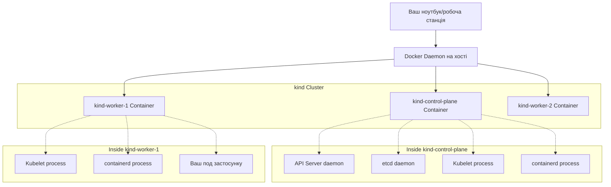

# Модуль 1.1: Ваш перший кластер

**Складність:** [СЕРЕДНЯ]
**Час на проходження:** 45-60 хвилин
**Пререквізити:** Встановлений Docker, пройдено Cloud Native 101

## Що ви зможете зробити
- **Створити** локальний Kubernetes кластер за допомогою `kind` для забезпечення ізольованого середовища для експериментів з навантаженням.
- **Порівняти** інструменти для створення локальних Kubernetes кластерів (kind, minikube, k3d, Docker Desktop), щоб обрати відповідне рішення для конкретних сценаріїв розробки.
- **Діагностувати** типові помилки ініціалізації кластера шляхом інтерпретації системних логів та станів контейнерів.
- **Спроектувати** конфігурацію локального кластера з декількома вузлами (multi-node) для симуляції реалістичних топологій продакшну.
- **Оцінити** вплив збоїв компонентів Control Plane на загальний стан кластера.
- **Аналізувати та маніпулювати** файлом `kubeconfig` для безперешкодної автентифікації та перемикання контекстів між декількома окремими кластерами.
- **Сформулювати** сувору стратегію локальної розробки, яка мінімізує фінансові та операційні ризики, пов'язані з хмарними керованими середовищами Kubernetes.
- **Деконструювати** монолітну архітектуру кластера на окремі компоненти Control Plane та Data Plane.

## Чому це важливо

У серпні 2012 року компанія Knight Capital Group розгорнула оновлення програмного забезпечення на своїх торгових серверах. У них не було належного стейджинг-середовища, яке б точно відображало продакшн, і не було локальних «пісочниць», де розробники могли б безпечно протестувати взаємодію нового коду зі застарілими системами маршрутизації. Коли помилкове оновлення було запущено, воно «оживило» сплячу підпрограму тестування, яка почала купувати дорого і продавати дешево у приголомшливих обсягах. Всього за 45 хвилин Knight Capital втратила 460 мільйонів доларів. Невдовзі після цього компанія збанкрутувала.

Хоча ви, можливо, не розгортаєте сьогодні ПЗ для високочастотної алгоритмічної торгівлі, фундаментальний інженерний принцип залишається незмінним: тестування безпосередньо в продакшні або в спільних стейджинг-середовищах, де кілька команд постійно змінюють стан — це рецепт непередбачуваного та катастрофічного збою. Вам потрібна безпечна, ефемерна та точна копія вашої виробничої системи оркестрації, де ви зможете експериментувати, ламати речі та відновлювати їх за лічені секунди без фінансових чи операційних ризиків. Покладатися виключно на хмарні керовані кластери для початкового навчання та тестування призводить до зайвого тертя, високих витрат і небезпечного радіусу ураження.

Розглянемо реальність витрат на хмарні обчислення. Кластер Amazon EKS стягує погодинну плату за Control Plane просто за його існування. Окрім цього базового податку, ви платите за вузли EC2, томи Elastic Block Store (EBS), Elastic Load Balancers (ELB) та передачу даних між зонами доступності (Availability Zones). Залишений на довгі вихідні простий кластер для навчання може легко обернутися сюрпризом у вигляді рахунку на 150 доларів. У команді з 10 розробників, якщо кожен запустить власну хмарну пісочницю, щомісячні витрати зростуть невиправдано.

Крім того, хмарне налаштування за своєю суттю повільне. Створення керованого кластера через Terraform або хмарну консоль часто займає від 15 до 25 хвилин, поки виділяються віртуальні машини, налаштовуються мережі та провайдер запускає ПЗ для Control Plane. Якщо ви припуститеся фундаментальної помилки в конфігурації — наприклад, застосуєте глобально обмежувальну мережеву політику, яка заблокує вам доступ — і вам доведеться видалити кластер, щоб створити його заново, цей цикл зворотного зв'язку буде болісно довгим. Локальні кластери, навпаки, можна створити з нуля та видалити за лічені секунди. Чим швидше ви зазнаєте невдачі, тим швидше ви навчитеся.

Цей модуль пропонує саме таке рішення проблеми. Ви навчитеся створювати та керувати локальним кластером Kubernetes повністю на вашій робочій станції. Це абсолютна базова навичка для всього, що чекає на вас у подорожі з Kubernetes. Запускаючи кластер локально, ви ізолюєте своє навчальне середовище, повністю виключаєте хмарні витрати та отримуєте свободу навмисно руйнувати та відновлювати свою інфраструктуру, щоб глибоко зрозуміти, як вона поводиться під тиском. Ви перейдете від теоретичних знань до практичного контролю над розподіленою системою.

> **Активне навчання:** Згадайте випадок, коли ви або ваш колега випадково зламали спільне середовище стейджингу. Скільки часу було згаяно на координацію з іншими розробниками, які були заблоковані вашою помилкою? Як би ізольована локальна репліка середовища змінила результат?

## Розділ 1: Анатомія Kubernetes кластера

Перш ніж створювати кластер, ви повинні мати чітке розуміння того, що саме ви будуєте. Kubernetes кластер — це не одна монолітна програма; це складна розподілена система, що складається з кількох спеціалізованих незалежних компонентів, які працюють узгоджено через декларативні API. На найвищому архітектурному рівні кластер суворо розділений на дві логічні площини: Control Plane та Data Plane (яку зазвичай називають Worker Nodes).

Розглянемо як аналогію симфонічний оркестр. Оркестр складається з десятків висококваліфікованих музикантів (Worker Nodes), які тримають інструменти та створюють звук (виконують навантаження програми). Однак без диригента (Control Plane), який інтерпретує партитуру (бажаний стан), тримає темп і вказує, коли саме мають грати певні секції, результатом був би незлагоджений шум. Диригент не грає на інструменті, так само як Control Plane не виконує вашу бізнес-логіку. Він лише керує станом, підтримує гармонію та координує воркерів на основі центрального плану.

Або уявіть величезний морський порт. Контейнеровози та портові вантажники, які фізично переміщують вантажі, — це Worker Nodes. Але адміністрація порту — центральний офіс, який приймає рішення про те, який корабель пришвартується до якого причалу, веде облік усіх маніфестів і стежить за погодою — це Control Plane.

Ось статична архітектурна схема компонентів стандартного Kubernetes кластера:

```text
+-------------------------------------------------------------------+
|                        KUBERNETES CLUSTER                         |
|                                                                   |
|   +-----------------------------------------------------------+   |
|   |                       CONTROL PLANE                       |   |
|   |                                                           |   |
|   |  +-------------+  +-------------+  +-------------------+  |   |
|   |  | API Server  |  |  Scheduler  |  | Controller Manager|  |   |
|   |  +------+------+  +------+------+  +---------+---------+  |   |
|   |         |                |                   |            |   |
|   |         +----------------+-------------------+            |   |
|   |                          |                                |   |
|   |                   +------+------+                         |   |
|   |                   |    etcd     |                         |   |
|   |                   +-------------+                         |   |
|   +--------------------------+--------------------------------+   |
|                              |                                    |
|                              | (Network / gRPC API Calls)         |
|                              |                                    |
|   +--------------------------+--------------------------------+   |
|   |                        WORKER NODES                       |   |
|   |                                                           |   |
|   |  +--------------------+         +--------------------+    |   |
|   |  |       NODE 1       |         |       NODE 2       |    |   |
|   |  | +-------+ +------+ |         | +-------+ +------+ |    |   |
|   |  | |Kubelet| |Proxy | |         | |Kubelet| |Proxy | |    |   |
|   |  | +---+---+ +---+--+ |         | +---+---+ +---+--+ |    |   |
|   |  |     |         |    |         |     |         |    |    |   |
|   |  | +---+---------+--+ |         | +---+---------+--+ |    |   |
|   |  | |Container Engine| |         | |Container Engine| |    |   |
|   |  | +-------+--------+ |         | +-------+--------+ |    |   |
|   |  |         |          |         |         |          |    |   |
|   |  |  [POD] [POD]       |         |  [POD] [POD]       |    |   |
|   |  +--------------------+         +--------------------+    |   |
|   +-----------------------------------------------------------+   |
+-------------------------------------------------------------------+
```

### Компоненти Control Plane

Control Plane складається з чотирьох критично важливих окремих демонів. Розуміння їхніх обов'язків є ключем до опанування Kubernetes.

#### 1. `kube-apiserver`
Це «вхідні двері» кластера. Він надає REST API, з яким взаємодіють усі інші компоненти та зовнішні користувачі (як ви). Важливо, що це *єдиний* компонент, якому дозволено спілкуватися з бекенд-сховищем даних (`etcd`).
Коли ви виконуєте команду, API Server виконує три послідовні кроки, перш ніж щось зробити:
- **Автентифікація:** криптографічне підтвердження того, хто ви є.
- **Авторизація:** підтвердження того, що ви маєте права Role-Based Access Control (RBAC) на виконання дії.
- **Admission Control:** виконання плагінів, які можуть змінити ваш запит або відхилити його на основі складних організаційних політик.
Якщо API Server не працює, весь кластер стає «замороженою» системою тільки для читання, де неможливо змінити жодну конфігурацію.

#### 2. `etcd`
Пам'ять кластера. Це високонадійне, суворо узгоджене сховище «ключ-значення», що використовує алгоритм консенсусу Raft. Воно зберігає весь стан кластера — кожну конфігурацію, кожен секрет, кожне визначення поду, кожен простір імен. Якщо кворум `etcd` втрачено, у вашого кластера настає повна амнезія. Воно віддає перевагу узгодженості (consistency) над доступністю (availability); у разі поділу мережі воно зупинить операції запису, аніж ризикне розбіжністю стану (split-brain).

#### 3. `kube-scheduler`
«Сваха». Він постійно стежить за API Server на предмет нових створених робочих навантажень (Pods), яким не призначено вузол. Він виконує складний двоетапний алгоритм:
- **Фільтрація:** які вузли мають необхідне обладнання (CPU/Memory) та відповідають суворим обмеженням (node selectors) для запуску цього поду? Якщо на вузлі закінчилася пам'ять, він негайно відфільтровується.
- **Оцінювання (Scoring):** серед придатних вузлів, який є абсолютно оптимальним вибором на основі поточного використання та правил афінності (affinity)?
Після прийняття рішення планувальник просто записує назву обраного вузла назад в об'єкт Pod API в etcd. Він сам не запускає Pod.

#### 4. `kube-controller-manager`
Термостат. Він запускає численні незалежні процеси контролерів у безперервних фонових циклах. Ці контролери фанатично порівнюють поточний спостережуваний стан кластера з вашим бажаним станом (збереженим в etcd), вживаючи негайних заходів для усунення будь-яких відхилень. Якщо вузол виходить з ладу, Node Controller помічає це і дає команду ReplicaSet Controller запустити замісні поди в іншому місці.

### Компоненти Worker Node

Worker Nodes — це «робочі конячки», де безпосередньо відбувається виконання обчислень:

#### 1. `kubelet`
Капітан корабля. На кожному вузлі процес kubelet працює безпосередньо в операційній системі. Він отримує специфікації подів від API Server і гарантує, що описані контейнери дійсно запущені та здорові на цьому конкретному вузлі. Він виступає мостом між Kubernetes та середовищем виконання контейнерів через Container Runtime Interface (CRI). Він постійно повідомляє про стан здоров'я вузла в API Server. Якщо kubelet вмирає, вузол отримує статус «NotReady».

#### 2. `kube-proxy`
Мережевий диспетчер. Він підтримує складні правила маршрутизації мережі (часто маніпулюючи Linux `iptables` або `IPVS`) безпосередньо в операційній системі хоста. Коли запит потрапляє на Service IP (віртуальний IP, якого насправді не існує на жодній мережевій карті), правила `kube-proxy` відповідають за прозору трансляцію цього віртуального IP в реальну, маршрутизовану IP-адресу контейнера бекенд-поду.

#### 3. Container Engine
Низькорівневе ПЗ (наприклад, `containerd` або `CRI-O`), відповідальне за розпакування образів OCI (Open Container Initiative) з реєстру та взаємодію з ядром Linux (використовуючи cgroups та namespaces) для створення ізольованих процесів. Воно виконує буквальні команди запуску/зупинки контейнерів.

#### 4. Container Runtime Interface (CRI)
Хоча це не окремий демон, CRI є критично важливою архітектурною межею. Спочатку Kubernetes був жорстко запрограмований на роботу саме з Docker. У міру розвитку екосистеми розробники зрозуміли, що їм потрібно підтримувати інші середовища виконання. Вони вилучили жорстко закодовану логіку Docker і замінили її на CRI — стандартизований інтерфейс gRPC. Будь-яке ПЗ, що реалізує CRI, тепер може виступати як рушій контейнерів для Kubernetes.

#### 5. Container Network Interface (CNI)
Подібно до CRI, CNI — це стандартизований інтерфейс, але спеціально для мережевих плагінів. Сам Kubernetes не знає, як призначати IP-адреси подам або маршрутизувати трафік між різними фізичними вузлами. Він повністю делегує це CNI-плагіну (такому як Calico, Flannel або Cilium). Коли Pod запускається, kubelet викликає CNI-плагін для налаштування віртуальних мережевих інтерфейсів та призначення IP.

> **Зупиніться та подумайте:** Як ви гадаєте, що станеться, якщо процес `kube-scheduler` вийде з ладу, але всі інші компоненти залишаться здоровими? Якщо ви спробуєте розгорнути нову програму, поки планувальник не працює, у якому саме стані застрягне ця програма?
> <details>
> <summary>Показати відповідь</summary>
> API Server прийме запит на створення поду, але він залишиться у стані `Pending` на невизначений термін, оскільки жоден процес не призначить йому вузол.
> </details>

## Розділ 2: Арена локального Kubernetes — обираємо зброю

Екосистема визнає критичну потребу в локальній розробці та надає кілька виняткових, зрілих інструментів для запуску локальних Kubernetes кластерів. Кожен інструмент робить власні архітектурні компроміси для досягнення своїх цілей. Вибір правильного інструменту вимагає розуміння того, як вони створюють ілюзію розподіленої системи на одній фізичній машині.

| Інструмент | Базова архітектура | Основний сценарій використання | Переваги | Недоліки |
|---|---|---|---|---|
| **minikube** | Віртуальні машини (історично) або контейнери | Традиційна локальна розробка | Величезний набір функцій, зріла екосистема, велика бібліотека аддонів. Чудово підходить для початківців. | Може бути дуже ресурсомістким. Повільний запуск. Емулює кластер, а не запускає чистий upstream. |
| **kind** (Kubernetes IN Docker) | Docker-контейнери, що виступають як вузли | CI/CD пайплайни, автоматизоване тестування, ретельна локальна розробка | Надзвичайно швидкий, ідентичний до чистого upstream Kubernetes, висока гнучкість налаштування топологій з кількома вузлами. | Потребує Docker демон. Складні нюанси мережі при прокиданні сервісів на хост. |
| **k3d** | Docker-контейнери, що запускають k3s | Симуляція Edge-обчислень, IoT | Мінімальне споживання пам'яті, надзвичайно швидкий запуск. | Використовує k3s (спрощений, модифікований дистрибутив Kubernetes), якому може бракувати 100% паритету з хмарними провайдерами. |
| **Docker Desktop / Colima** | Інтегрований гіпервізор / легка ВМ | Швидка валідація для користувачів Mac/Windows | Нульова конфігурація, інтеграція з GUI, легке монтування томів. | Негнучкий, обмежений лише одним монолітним вузлом, тісно пов'язаний з рушієм віртуалізації. |

Для цієї навчальної програми ми суворо вимагаємо використання `kind`.

### Магія Docker-in-Docker (DinD)

Назва `kind` розшифровується як Kubernetes IN Docker. Він був створений самими розробниками open-source проекту Kubernetes. Їм потрібен був спосіб автоматичного тестування кодової бази Kubernetes у GitHub Pull Requests, не чекаючи 30 хвилин на виділення хмарних ресурсів. Їм було потрібне щось швидке, дешеве та повністю ефемерне.

`kind` створює вузли Kubernetes, запускаючи стандартні Docker-контейнери, але ці контейнери мають спеціальні привілеї для запуску `systemd` (системи ініціалізації Linux), середовищ виконання контейнерів (наприклад, `containerd`) та всіх нативних компонентів Kubernetes *всередині* себе. Ця вкладена архітектура відома як «Docker-in-Docker».

Коли ви просите `kind` створити кластер із 3 вузлів, він просто дає вашому хостовому Docker демону команду запустити 3 великі Docker-контейнери. Всередині кожного з цих контейнерів завантажується повноцінне середовище Linux, запускається `kubelet` і починають працювати поди Kubernetes (які самі є контейнерами, вкладеними у зовнішній контейнер-вузол). Це забезпечує ту саму поверхню API та розподілену природу реального кластера, зберігаючи витрати ресурсів значно нижчими, ніж при завантаженні трьох окремих віртуальних машин у VirtualBox.



> **Активне навчання:** Якщо воркер-вузол `kind` — це фактично просто Docker-контейнер, що працює на вашій хост-машині, що станеться, якщо ви перезавантажите Docker демон на хості? Чи виживе кластер Kubernetes?
> <details>
> <summary>Показати відповідь</summary>
> Ні. Коли Docker демон перезавантажується, він зупиняє всі запущені контейнери, фактично знищуючи активний стан ваших вузлів `kind`.
> </details>

## Розділ 3: Демістифікація Kubeconfig — паспорт вашого кластера

Перш ніж ми створимо кластер, ми повинні чітко зрозуміти, як ми будемо з ним спілкуватися. Kubernetes захищений за замовчуванням. Ви не можете просто надсилати неавтентифіковані HTTP-запити до API Server. Вам потрібні криптографічні облікові дані.

Ось тут на сцену виходить файл `kubeconfig`. За замовчуванням інструмент командного рядка `kubectl` шукає файл за шляхом `~/.kube/config`. Цей файл є абсолютним джерелом істини для вашої ідентифікації та інформації про маршрутизацію. Він повідомляє `kubectl`, *де* знаходиться кластер і *хто* ви є.

Уявіть файл `kubeconfig` як фізичний **Паспорт**.

1.  **Clusters (Країна):** Запис кластера у файлі визначає місце призначення. Він містить URL-адресу API Server (наприклад, `https://127.0.0.1:54321`) та дані Центру сертифікації (CA), необхідні для криптографічної перевірки того, що сервер є легітимним, а не зловмисником типу man-in-the-middle. Це як знати географічне розташування країни та довіряти її уряду.
2.  **Users (Віза / Особа):** Запис користувача визначає *вас*. Він може містити клієнтський сертифікат та приватний ключ, токен доступу або інструкції для виконання зовнішнього плагіна автентифікації (наприклад, AWS IAM або Google Cloud Identity). Це ваші біометричні дані та візові документи, що підтверджують, хто ви є.
3.  **Contexts (Штамп у паспорті):** Контекст — це ключова сполучна ланка. Контекст явно пов'язує одного конкретного Користувача з одним конкретним Кластером і опціонально визначає простір імен за замовчуванням. Коли ви «перемикаєте контекст», ви кажете `kubectl`: «Для моїх наступних команд використовуй облікові дані користувача 'admin' для зв'язку з кластером 'production-eu'».

Коли ви створюєте кластер за допомогою `kind` або будь-якого іншого інструменту, останнім кроком процесу налаштування є автоматичний запис нового кластера, користувача та контексту у ваш файл `~/.kube/config`, а також встановлення цього нового контексту як поточного активного.

### Анатомія YAML

Ось спрощений приклад того, як насправді виглядає цей файл. Зверніть увагу на те, як контекст поєднує користувача та кластер:

```yaml
apiVersion: v1
kind: Config
preferences: {}
current-context: kind-dojo-basics

clusters:
- cluster:
    certificate-authority-data: LS0tLS1CR...
    server: https://127.0.0.1:6443
  name: kind-dojo-basics

users:
- name: kind-dojo-basics
  user:
    client-certificate-data: LS0tLS1CR...
    client-key-data: LS0tLS1CR...

contexts:
- context:
    cluster: kind-dojo-basics
    user: kind-dojo-basics
  name: kind-dojo-basics
```

Ви можете перевірити та змінити свій паспорт у будь-який час за допомогою підкоманди `config`:

```bash
# Переглянути «сирий» YAML вашої конфігурації (з прихованими секретами)
kubectl config view

# Переглянути всі контексти-«штампи» у вашому паспорті
kubectl config get-contexts

# Явно змінити ваш активний контекст
kubectl config use-context <context-name>
```

### Змінна оточення KUBECONFIG

Іноді ви не хочете змінювати свій файл за замовчуванням `~/.kube/config`. Якщо колега надсилає вам файл конфігурації для тимчасового стейджинг-кластера, об'єднувати його вручну — марудна справа, де легко помилитися. Kubernetes елегантно вирішує це за допомогою змінної оточення `KUBECONFIG`.

Якщо ви встановите цю змінну, `kubectl` повністю проігнорує файл за замовчуванням і читатиме дані виключно за вказаним вами шляхом:

```bash
export KUBECONFIG=/path/to/my/temporary/config.yaml
kubectl get nodes # Працює з тимчасовим кластером
```

Ви навіть можете наказати `kubectl` об'єднати кілька файлів у пам'яті одночасно, розділивши шляхи двокрапкою. Це надзвичайно корисно для CI/CD пайплайнів:

```bash
export KUBECONFIG=~/.kube/config:/path/to/another/config.yaml
```

> **Активне навчання:** Якщо у вас є файл `kubeconfig`, що містить адміністративні облікові дані для продакшн-кластера, якими будуть наслідки для безпеки, якщо ви випадково закоммітите цей файл у публічний репозиторій GitHub?
> <details>
> <summary>Показати відповідь</summary>
> Повна компрометація кластера. Зловмисники постійно сканують публічні репозиторії на наявність kubeconfig-файлів і можуть миттєво захопити ваш API Server, розгорнути майнери криптовалют або вкрасти секрети.
> </details>

> **Спробуйте зараз:** Запустіть `kubectl config get-contexts` у вашому терміналі. Перегляньте вивід та знайдіть контекст із зірочкою `*` поруч із ним — вона вказує на ваше поточне активне з'єднання з кластером.

## Розділ 4: Створення вашого першого кластера за допомогою kind

Для початку роботи у вашій системі має бути запущений Docker, оскільки `kind` використовує Docker API для створення контейнерів-вузлів. Сам `kind` розповсюджується як єдиний статично скомпільований бінарний файл на Go, який ви завантажуєте та розміщуєте в системному шляху виконання.

```bash
# Приклад завантаження для архітектури Linux AMD64
curl -Lo ./kind https://kind.sigs.k8s.io/dl/latest/kind-linux-amd64
# Надати права на виконання завантаженому файлу
chmod +x ./kind
# Перемістити бінарний файл у директорію, що входить до системного PATH
sudo mv ./kind /usr/local/bin/kind
```

Створення стандартного кластера виконується однією декларативною командою. За замовчуванням `kind` створює архітектуру кластера з одним вузлом. У такій конфігурації компоненти Control Plane та Worker компоненти (де працюють ваші програми) розміщуються на одному і тому ж вузлі (контейнері).

```bash
kind create cluster --name dojo-basics
```

Коли ви виконуєте цю, здавалося б, просту команду, `kind` за лаштунками виконує складну послідовність дій:
1.  **Image Pull:** завантажує масивний Docker-образ (`kindest/node`), у який заздалегідь упаковані бінарні файли Kubernetes, systemd та containerd.
2.  **Node Provisioning:** запускає привілейований Docker-контейнер, відображаючи випадкові порти хоста на внутрішній порт контейнера 6443.
3.  **Cert Generation:** генерує криптографічні сертифікати для безпечного внутрішнього зв'язку.
4.  **Bootstrapping:** виконує `kubeadm init` всередині контейнера для запуску API Server, etcd, планивальника та контролер-менеджера.
5.  **Kubeconfig Injection:** автоматично витягує згенеровані облікові дані адміністратора та об'єднує їх з вашим файлом `~/.kube/config`.

Для взаємодії з кластером ви будете використовувати `kubectl` — офіційний інтерфейс командного рядка Kubernetes. Оскільки робота з Kubernetes вимагає постійного введення цієї команди протягом дня, загальноприйнятим стандартом в індустрії є створення аліасу (псевдоніма) до однієї літери: `k`. Вам варто негайно додати це до вашого профілю `~/.bashrc` або `~/.zshrc`:

```bash
alias k=kubectl
```

Давайте емпірично перевіримо, що ваш кластер повністю працездатний. Спершу перевірте метадані кінцевої точки (endpoint) кластера:

```bash
k cluster-info
```

Ви маєте побачити вивід, який вказує, що Kubernetes Control Plane працює за локальною loopback-адресою (наприклад, `https://127.0.0.1:42315`), а сервіс CoreDNS функціонує. Це доводить, що ваш локальний бінарний файл `kubectl` може успішно автентифікуватися та встановити безпечне з'єднання з API Server.

Далі перевірте стан логічних вузлів:

```bash
k get nodes
```

Ви побачите один вузол з назвою `dojo-basics-control-plane` зі статусом `Ready`. Зверніть увагу, що його призначена роль — `control-plane`. У налаштуванні з одним вузлом `kind` автоматично видаляє стандартний тейнт (taint) "NoSchedule" з цього вузла, дозволяючи вашим звичайним робочим навантаженням запускатися поруч із критично важливими демонами Control Plane.

Нарешті, ретельно перевірте системні поди. Kubernetes нативно запускає власні компоненти керування як стандартні поди в ізольованому захищеному просторі імен під назвою `kube-system`.

```bash
k get pods --namespace kube-system
```

Ви побачите поди для `etcd`, `kube-apiserver`, `kube-controller-manager` та `kube-scheduler`. Якщо ці поди мають статус `Running`, ваш кластер математично здоровий і готовий приймати кастомні навантаження.

> **Активне навчання:** Перш ніж запускати `docker ps` на своїй хост-машині, який саме вивід ви очікуєте побачити на основі обговореної архітектури? Про скільки працюючих контейнерів повідомить Docker демон для підтримки цього однонодового кластера?

> **Спробуйте зараз:** Запустіть `docker ps` на хост-машині. Порахуйте кількість контейнерів, що працюють для вашого кластера `dojo-basics`. Ви маєте побачити рівно один контейнер з образом `kindest/node`, який виступає як ваш цілий однонодовий кластер.

## Розділ 5: Розуміння мережі kind

Перш ніж ми почнемо будувати складні топології, нам потрібно зрозуміти, як трафік потрапляє до нашого ізольованого кластера `kind`. Це те місце, де багато інженерів припускаються помилок.

Оскільки кластер працює всередині мережевого мосту (Docker network bridge), він не ділить IP-простір з вашою хост-машиною. Ваш ноутбук не може нативно пінгувати IP-адресу поду (наприклад, `10.244.0.5`), оскільки таблиця маршрутизації вашого ноутбука поняття не має, де знаходиться ця підмережа.

Коли ви створюєте кластер, `kind` за замовчуванням відкриває лише один порт: порт API Server. Він прокидається з випадкового порту localhost (наприклад, `127.0.0.1:42315`) на внутрішній порт контейнера `6443`. Саме тому `kubectl` працює.

Якщо ви розгорнете веб-застосунок і захочете переглянути його в браузері, ви не зможете просто використати Kubernetes сервіс типу `LoadBalancer`, оскільки ваш ноутбук — це не AWS. Він не може виділити фізичний балансувальник навантаження. У вас є три основні рішення:

1. **Port Forwarding:** Використовуйте `kubectl port-forward svc/my-web-app 8080:80`. Це створює безпечний тимчасовий тунель з порту 8080 вашого ноутбука безпосередньо на порт 80 поду через з'єднання з API Server. Це чудово підходить для швидкого налагодження.
2. **NodePorts з конфігурацією kind:** Ви можете заздалегідь налаштувати `kind` на відображення конкретних портів хоста безпосередньо на NodePorts під час створення кластера.
3. **Ingress Controllers:** Ви можете розгорнути Ingress-контролер NGINX і налаштувати `kind` так, щоб він відображав порти хоста 80 та 443 на поди Ingress-контролера.

> **Активне навчання:** Якщо ви запустите `kubectl port-forward`, а потім закриєте вікно термінала, що станеться з мережевим тунелем?
> <details>
> <summary>Показати відповідь</summary>
> Процес тунелювання буде негайно завершено, і доступ до поду буде припинено.
> </details>

## Розділ 6: Проектування топологій з декількома вузлами

Хоча однонодовий кластер цілком достатній для базового тестування API та валідації простих маніфестів подів, він абсолютно не здатний відтворити складну розподілену природу реальних виробничих систем. У будь-якому продакшн-середовищі у вас буде кілька окремих воркер-вузлів, і ваші поди будуть плануватися динамічно між ними залежно від доступності ресурсів та обмежень.

Щоб ефективно практикувати складні концепції, такі як node affinity (примусовий запуск поду на конкретному вузлі), pod anti-affinity (гарантія того, що дві репліки ніколи не працюватимуть на одному фізичному обладнанні), тейнти, толерейшени (tolerations) та розподілена маршрутизація мережі, вам обов'язково потрібен кластер із декількома вузлами.

Перевага `kind` полягає в тому, що він дозволяє декларативно визначити фізичну архітектуру вашого локального кластера за допомогою простого файлу конфігурації YAML, подібно до того, як ви розгортаєте програми. Давайте спроектуємо архітектуру кластера, що містить один виділений вузол Control Plane та два виділені воркер-вузли.

Створіть файл з назвою `multi-node-config.yaml` у вашій файловій системі:

```yaml
# multi-node-config.yaml
kind: Cluster
apiVersion: kind.x-k8s.io/v1alpha4
nodes:
  # Вузол Control Plane (API server, etcd тощо)
  - role: control-plane
  # Перший воркер-вузол (робочі навантаження застосунків)
  - role: worker
  # Другий воркер-вузол (робочі навантаження застосунків)
  - role: worker
```

Перш ніж застосувати цей новий бажаний стан, ви повинні рішуче видалити наявний кластер, щоб звільнити локальні ресурси CPU та пам'яті:

```bash
kind delete cluster --name dojo-basics
```

Тепер створіть нову розподілену топологію, передавши декларативний файл конфігурації безпосередньо команді створення:

```bash
kind create cluster --name dojo-multi --config multi-node-config.yaml
```

Цей процес створення займе трохи більше часу. `kind` зараз явно запускає три окремі Docker-контейнери на вашому хост-демоні. Він налаштовує перший контейнер як майстер Control Plane, генерує безпечні токени приєднання та дає чітку команду іншим двом контейнеризованим вузлам виконати `kubeadm join` для безпечного підключення до кластера як стандартних воркерів через віртуальну мережу Docker bridge.

Перевірте, що нова архітектура повністю реалізована:

```bash
k get nodes
```

Вивід вашого термінала тепер має точно відображати розподілену топологію:

```text
NAME                        STATUS   ROLES           AGE     VERSION
dojo-multi-control-plane    Ready    control-plane   2m14s   v1.35.0
dojo-multi-worker           Ready    <none>          1m58s   v1.35.0
dojo-multi-worker2          Ready    <none>          1m58s   v1.35.0
```

Зверніть увагу, що воркер-вузли не мають визначеної ролі в колонці виводу; це стандартна очікувана поведінка Kubernetes. Відсутність ролі вказує на те, що це стандартні вузли, повністю доступні для загального планування навантажень. Тепер ви володієте повнофункціональною розподіленою системою оркестрації, що працює повністю в пам'яті вашої локальної робочої станції.

> **Активне навчання:** Який підхід до вузлів ви б обрали для тестування конфігурації DaemonSet (навантаження, яке має запускати рівно одну репліку на кожному вузлі) і чому? Однонодовий кластер чи кластер із декількома вузлами?

> **Спробуйте зараз:** Запустіть `kubectl get nodes -o wide` у вашому новоствореному кластері `dojo-multi`. Зверніть увагу на колонку `INTERNAL-IP`. Побачте, як кожному вузлу (який насправді є Docker-контейнером) було призначено окрему IP-адресу у віртуальній мережі bridge.

## Розділ 7: Кращі практики локальної розробки

Щоб ваша локальна розробка імітувала реальність, не перевантажуючи ноутбук, дотримуйтеся цих основних принципів:

1. **Resource Limits:** Завжди налаштовуйте ліміти ресурсів (CPU/Memory) для ваших подів під час локального тестування. Якщо цього не зробити, витік пам'яті в поді споживе всю пам'ять всередині контейнера `kind`, що, своєю чергою, споживе всю пам'ять Docker, призвівши до зупинки всієї вашої робочої станції.
2. **Namespace Isolation:** Не розгортайте все у просторі імен `default`. Практикуйте створення просторів імен для різних компонентів (наприклад, `monitoring`, `database`, `frontend`). Ця звичка є критично важливою для готовності до продакшну.
3. **Automate Bootstrap:** Напишіть простий `Makefile` або bash-скрипт для створення вашого кластера `kind` та встановлення основних залежностей (таких як Ingress-контролер, Metrics Server або локальний реєстр). Це гарантує, що ви зможете видалити та відновити свій кластер у точно такому ж стані менш ніж за дві хвилини.

## Розділ 8: Коли щось іде не так — Діагностика

Інфраструктура рано чи пізно дає збої. При роботі з локальним кластером збої відрізняються від хмарних; зазвичай вони виникають через обмеження ресурсів на рівні хоста, конфлікти мережі або неправильно налаштовані демони контейнерів. Навчання систематичній діагностиці цих локальних збоїв формує ту саму аналітичну «м'язову пам'ять», яка необхідна для налагодження катастрофічних збоїв у продакшні.

Нижче наведено п'ять конкретних поширених сценаріїв збоїв, з якими ви зрештою зіткнетеся, та способи їх наукової діагностики.

### Сценарій 1: Тиша OOMKilled (вичерпання пам'яті)
**Симптом:** Ви виконуєте `kind create cluster`. Вивід у терміналі зависає на невизначений термін на етапі "Starting control-plane...". Зрештою час очікування вичерпується, і процес завершується з неінформативною загальною помилкою.
**Діагностика:** `kind` повністю покладається на стабільність Docker. Якщо Docker відчуває брак апаратних ресурсів, важкі компоненти Kubernetes всередині контейнера-вузла не зможуть запуститися. `kind` суворо вимагає щонайменше 4 ГБ оперативної пам'яті (бажано 8 ГБ для декількох вузлів), виділеної саме для рушія Docker.
**Дія:** Перевірте логи контейнера-вузла безпосередньо, минаючи `kubectl`:

```bash
docker logs <container-id>
```

Ви, швидше за все, виявите подію `OOMKilled` (Out Of Memory), ініційовану ядром Linux. Якщо ви використовуєте Docker Desktop, відкрийте налаштування та збільште ліміт виділення пам'яті. У Linux переконайтеся, що ваш хост не використовує агресивно своп (swap), перевіривши це через `free -h`.

### Сценарій 2: Конфлікт порту 6443
**Симптом:** `kind` одразу видає помилку під час ініціалізації Control Plane, скаржачись на те, що «порт уже використовується» (port already in use) або «адресу вже зайнято» (bind address).
**Діагностика:** API Server Kubernetes за замовчуванням слухає порт 6443. `kind` намагається відобразити порт хоста на внутрішній порт контейнера 6443. Якщо ви запускаєте кілька інструментів локальної розробки, Ingress-контролер на хості або якщо старий кластер `kind`, що аварійно завершив роботу, залишив відкритим «процес-зомбі», новий кластер не зможе зайняти цей порт.
**Дія:** Скористайтеся командою `lsof -i :6443` або `netstat -tulpn | grep 6443` (у macOS або Linux), щоб точно визначити ідентифікатор конфліктного процесу (PID). Завершіть його (`kill -9 <PID>`) перед повторною спробою. Як варіант, ви можете використати файл конфігурації `kind`, щоб явно вказати інший порт хоста (наприклад, 8443).

### Сценарій 3: Помилка узгодження API (Version Skew)
**Симптом:** Кластер створюється ідеально. Однак, коли ви вводите `kubectl get pods`, ви отримуєте дивні помилки на кшталт `the server could not find the requested resource` або просто мовчазні помилки форматування.
**Діагностика:** У вас серйозна розбіжність версій (version skew) між клієнтським бінарним файлом `kubectl` та версією API Server кластера. Kubernetes офіційно підтримує розбіжність версій рівно +/- 1 мінорна версія (наприклад, клієнт v1.30 може спілкуватися з сервером v1.29, v1.30 або v1.31). Якщо ваш локальний клієнт має версію v1.25, а `kind` щойно запустив кластер v1.32, схеми API будуть фундаментально несумісними.
**Дія:** Перевірте розбіжність версій, запустивши `kubectl version`. Використовуйте суворий менеджер версій, такий як `asdf`, `mise` або `brew`, щоб оновити локальний бінарний файл `kubectl` відповідно до версії вашого кластера.

### Сценарій 4: Відключення демона
**Симптом:** Ви виконуєте `kind create cluster`, але команда миттєво завершується з помилкою:

```text
failed to create cluster: failed to get docker info: Cannot connect to the Docker daemon at unix:///var/run/docker.sock.
```

**Діагностика:** `kind` принципово не здатний працювати без запущеного середовища виконання контейнерів. Або сервіс Docker аварійно завершив роботу, або він не був запущений, або вашому поточному обліковому запису бракує необхідних прав доступу для читання та запису в сокет unix Docker.
**Дія:** Перевірте, чи працює Docker (`systemctl status docker` у Linux або перевірте інтерфейс Docker Desktop). Якщо він працює, перевірте, чи входить ваш користувач до групи `docker` (`sudo usermod -aG docker $USER`), вийдіть із системи та увійдіть знову, щоб застосувати зміни прав доступу.

### Сценарій 5: Мовчазне вичерпання дискового простору
**Симптом:** Створення кластера пройшло успішно, але коли ви намагаєтеся розгорнути простий под NGINX, він застряє у стані `Pending` або `ImagePullBackOff`. Ви помічаєте швидке погіршення продуктивності системи.
**Діагностика:** Docker-образи, що використовуються для вузлів `kind` (`kindest/node`), надзвичайно великі, часто перевищуючи 1.5 ГБ кожен. Під час тестування різних версій Kubernetes ці образи накопичуються непомітно. Крім того, будь-які файли, що записуються вашими подами, фактично записуються у файлову систему контейнера Docker, споживаючи фізичний дисковий простір вашого хоста. У вас закінчилося місце на диску.
**Дія:** Періодично виконуйте наступну команду, щоб агресивно очищати невикористовувані образи, «підвішені» (dangling) томи та зупинені контейнери, забезпечуючи наявність щонайменше 20 ГБ вільного місця для локальної розробки:

```bash
docker system prune -a --volumes
```

**Порада професіонала:** Якщо кластер вийшов з ладу і вам потрібні детальні дані для аналізу, `kind` надає потужну команду для вилучення всіх логів внутрішніх компонентів Kubernetes (kubelet, containerd, API server, etcd) з несправних контейнерів-вузлів у вашу локальну файлову систему для глибокої перевірки:

```bash
kind export logs ./kind-troubleshooting-logs --name dojo-multi
```

## Типові помилки

Розуміння того, як розробники зазвичай неправильно налаштовують або неправильно розуміють свої локальні кластери, має вирішальне значення для уникнення цих пасток. Локальний кластер може бути величезною підмогою, але якщо його не розуміти, він може викликати глибоке розчарування.

### Помилка 1: Вичерпання дискового простору хоста
**Симптом:** Ваш комп'ютер працює надзвичайно повільно. `kind` раптово перестає завантажувати нові образи вузлів. Термінал видає попередження "No space left on device."
**Першопричина:** Образи вузлів Docker величезні. Один образ `kindest/node:v1.30.0` може важити понад 1.5 ГБ. З часом, коли ви тестуєте різні версії Kubernetes для відтворення багів, ці масивні образи непомітно заповнюють ваш жорсткий диск, що призводить до повної відсутності вільного місця.
**Вирішення:** Періодично запускайте `docker system prune -a --volumes`. Це очистить невикористовувані образи, занедбані томи та зупинені контейнери. Завжди підтримуйте щонайменше 20 ГБ вільного місця для локальної розробки хмарних рішень.

### Помилка 2: Забування про видалення неактивних кластерів
**Симптом:** Вентилятор вашої робочої станції постійно шумить, а заряд батареї швидко падає, навіть коли ви не займаєтеся активною розробкою. Ваша IDE починає гальмувати.
**Першопричина:** Розробники часто створюють кластери для швидкого тестування і просто залишають їх працювати у фоновому режимі. Компоненти `kubelet` та `API server` постійно виконують опитування та узгодження, споживаючи величезну кількість оперативної пам'яті та циклів процесора без потреби. Control Plane Kubernetes ніколи не буває по-справжньому «бездіяльним».
**Вирішення:** Завжди виконуйте `kind get clusters` для аудиту системи та рішуче запускайте `kind delete cluster --name <name>`, коли завершуєте сеанс локальної розробки. Ставтеся до кластерів як до абсолютно одноразових сутностей. Не прив'язуйтеся до них.

### Помилка 3: Пряма зміна контейнера вузла
**Симптом:** Ви вручну заходите через SSH/exec у вузол, щоб підправити файл конфігурації. Сьогодні це працює ідеально. Але наступного разу, коли ви перестворюєте кластер для повторного тестування, налаштування зникає, і ваша програма ламається загадковим чином.
**Першопричина:** Спроба виконати `docker exec -it <node-container> bash` у вузол і змінити системні конфігурації вручну призводить до неконтрольованого дрейфу стану (state drift). Це явно порушує основну концепцію відтворюваних середовищ. Якщо це не зафіксовано в коді — цього не було.
**Вирішення:** Ставтеся до вузлів kind суворо як до незмінної інфраструктури (immutable infrastructure). Вносьте будь-які необхідні архітектурні зміни через декларативні конфігураційні файли YAML (наприклад, використовуючи `kubeadmConfigPatches` у `kind`) і повністю перестворюйте кластер з нуля, щоб переконатися, що конфігурація дійсно зберігається.

### Помилка 4: Очікування, що LoadBalancers працюватимуть нативно
**Симптом:** Ви відкриваєте доступ до деплойменту (deployment), використовуючи сервіс типу `LoadBalancer`. Коли ви запускаєте `kubectl get svc`, колонка EXTERNAL-IP назавжди застрягає у стані `<pending>`. Ви чекаєте 20 хвилин, і нічого не змінюється.
**Першопричина:** Локальним кластерам повністю бракує контролера хмарного провайдера (такого як AWS ELB, Azure LB або Google Cloud Load Balancer) для динамічного створення зовнішніх апаратних балансувальників навантаження. Поза вашим ноутбуком немає фізичної інфраструктури, яка б виконала запит на маршрутизацію трафіку.
**Вирішення:** Встановіть локальну реалізацію балансувальника навантаження, таку як MetalLB, у ваш кластер `kind`, або просто використовуйте `kubectl port-forward` для прямого тимчасового тестування локальної мережі без використання реальної IP-адреси.

### Помилка 5: Конфлікти прив'язки портів
**Симптом:** Ви намагаєтеся запустити два кластери `kind` одночасно, обидва з яких потребують Ingress-контролера, і другий не запускається через помилку мережі.
**Першопричина:** Ви намагаєтеся запустити кілька незалежних кластерів kind, які намагаються прив'язатися до однакових портів хоста (наприклад, порт 80 для HTTP і порт 443 для HTTPS). Операційна система хоста може прив'язати порт лише до одного процесу одночасно. Перший кластер забрав порт 80, другий «впав», намагаючись його вкрасти.
**Вирішення:** Вказуйте чіткі, унікальні відображення портів хоста у файлі конфігурації YAML для кожного окремого екземпляра кластера (наприклад, відображення кластера А на 8080, а кластера Б — на 8081).

### Помилка 6: Забування завантажити локальні Docker-образи
**Симптом:** Ви збираєте образ локально (`docker build -t my-app:v1 .`), а потім застосовуєте маніфест Deployment. Под застряє у стані `ImagePullBackOff`.
**Першопричина:** Кластер `kind` працює *всередині* Docker. Він має власне ізольоване середовище виконання `containerd` всередині цього контейнера. Він не бачить образів, які ви щойно зібрали в Docker-демоні вашої хост-машини. Він намагається завантажити їх із Docker Hub, зазнає невдачі та аварійно завершує роботу.
**Вирішення:** Ви повинні явно завантажити локальні образи у внутрішнє середовище виконання кластера за допомогою команди `kind load docker-image my-app:v1 --name <cluster-name>`.

## Чи знали ви?

1. Назва "Kubernetes" походить безпосередньо з давньогрецької мови і означає «керманич», «пілот» або «губернатор». Саме тому іконічний логотип проекту — це штурвал корабля з рівно вісьмома шпицями.
2. Початковою, надсекретною внутрішньою назвою проекту Kubernetes у Google була "Project Seven", що було свідомим відсиланням до персонажа «Зоряного шляху» — Борг на ім'я Сьома з Дев'яти. Саме тому шпиць на логотипі-штурвалі рівно вісім: це був тонкий натяк на назву проекту плюс один.
3. Проект `kind` ніколи спочатку не призначався для кінцевих користувачів або розробників. Він був створений суворо як внутрішній механізм безперервної інтеграції (CI) для самого проекту Kubernetes, що дозволяло мейнтейнерам запускати глибокі тести на відповідність у GitHub pull requests, не чекаючи годинами на виділення хмарних ресурсів. Але виявилося, що він неймовірно корисний і для звичайних розробників.
4. Вузол сховища даних `etcd` за замовчуванням суворо обмежений 8 ГБ пам'яті. Хоча це звучить неймовірно мало для сучасної бази даних, оскільки вона зберігає лише конфігурацію стану кластера (у вигляді стиснутого тексту YAML/JSON), база даних об'ємом 8 ГБ може легко підтримувати масивні корпоративні кластери з десятками тисяч одночасних подів.
5. Абревіатура `k8s` — це нумеронім. Вона просто бере слово Kubernetes, залишає першу літеру (k), останню літеру (s) і замінює 8 літер між ними (`ubernete`) цифрою 8. Це стандартна техніка лінгвістичного стиснення, подібна до `i18n` для інтернаціоналізації (internationalization).
6. Оригінальні творці Kubernetes (Джо Беда, Брендан Бернс і Крейг Маклакі) спочатку презентували ідею керівникам Google саме як спосіб перетворити хмарний рівень на «товар широкого вжитку» (commoditize), запобігаючи встановленню повної монополії Amazon AWS через пропрієтарні API.
7. `kubectl` — це, по суті, просто дуже просунута обгортка над `curl`. Кожна команда, яку ви виконуєте за допомогою `kubectl`, перетворюється на стандартний HTTP REST API виклик (GET, POST, PUT, PATCH, DELETE) до `kube-apiserver`. Ви навіть можете використовувати звичайний `curl` з відповідними сертифікатами для керування кластером.

## Контрольні запитання

<details>
<summary><strong>[Перевірка LO8: Деконструювати монолітну архітектуру]</strong> Ви успішно розгорнули критично важливу програму у вашому локальному кластері `kind`. Ви хочете переконатися, що API Server успішно зберіг декларативний бажаний стан вашої програми для забезпечення відмовостійкості. Який конкретний компонент-демон Control Plane має бути повністю працездатним, щоб це збереження стану відбулося?</summary>
Демон сховища даних `etcd` має бути повністю працездатним і мати кворум. Сам API Server є повністю безстатевим (stateless); він виступає виключно як REST-інтерфейс та рушій валідації. Коли ви надсилаєте запит на розгортання, API Server перевіряє схему, перевіряє авторизацію, а потім записує цю конфігурацію бажаного стану безпосередньо у сховище «ключ-значення» `etcd`. Якщо `etcd` недоступний, «впав» або заблокований у режимі «тільки для читання», жоден новий стан не може бути збережений, і кластер математично не здатний приймати нові навантаження.
</details>

<details>
<summary><strong>[Перевірка LO2: Порівняти локальні інструменти Kubernetes]</strong> Ваша команда створює новий мікросервіс логування, який має інтенсивно писати на локальний диск вузла, на якому він виконується. Під час локального тестування розробник скаржиться, що коли він тестує з `kind`, весь жорсткий диск його ноутбука заповнюється і система «падає», але при використанні `minikube` (з VirtualBox) цього не відбувається. Яка фундаментальна архітектурна різниця спричиняє таку поведінку?</summary>
Оскільки `kind` використовує Docker-контейнери для симуляції цілих фізичних вузлів, будь-які «сирі» дані, що записуються подом на локальний диск «вузла», насправді записуються безпосередньо в записуваний шар (writable layer) відповідного Docker-контейнера у вашій хостовій файловій системі. Якщо контейнер нескінченно росте, він споживає фізичний дисковий простір хоста. `minikube` традиційно використовує апаратну віртуальну машину, яка має заздалегідь виділений віртуальний диск фіксованого розміру. ВМ фізично не може спожити більше місця на вашому хості, ніж розмір її виділеного блоку.
</details>

<details>
<summary><strong>[Перевірка LO1: Створити локальний Kubernetes кластер]</strong> Вам суворо необхідно протестувати сторонній кастомний оператор, який явно вимагає Kubernetes версії 1.30. Ваш поточний локальний кластер `kind` працює на версії 1.34. Який найбезпечніший, найбільш детермінований і найшвидший спосіб отримати локальне середовище версії 1.30?</summary>
Ви повинні повністю проігнорувати процес оновлення та створити абсолютно новий паралельний кластер, явно вказавши версію образу вузла під час команди створення. Ви виконуєте `kind create cluster --name test-130 --image kindest/node:v1.30.0`. На відміну від спроб оновити або понизити версію складного продакшн-кластера на місці (що за своєю суттю є ризикованим та схильним до помилок), локальні кластери є суворо ефемерними. Фундаментально безпечніше та значно швидше створити свіжий кластер із точно необхідною версією, виконати тести, а потім видалити цей кластер.
</details>

<details>
<summary><strong>[Перевірка LO4: Спроектувати конфігурацію локального кластера з декількома вузлами]</strong> Вам доручено відтворити складний баг із продакшну, який проявляється лише тоді, коли мережева затримка між подом веб-фронтенду та подом бази даних бекенду стабільно перевищує 50 мс. Яку архітектуру локального кластера ви б спроектували для перевірки цієї гіпотези і чому?</summary>
Ви повинні спроектувати та створити конфігурацію з декількома вузлами, використовуючи `kind`. Вам знадобиться мінімум два воркер-вузли. Явно запланувавши веб-застосунок на воркер-вузол 1, а базу даних — на воркер-вузол 2 за допомогою node selectors, ви змусите мережевий трафік проходити через віртуалізований мережевий міст між окремими вузлами. Потім ви зможете скористатися стандартними утилітами керування трафіком Linux (`tc`), виконуючи їх всередині одного з контейнерів воркер-вузлів, щоб штучно додати рівно 50 мс затримки на його віртуальному мережевому інтерфейсі, точно та детерміновано симулюючи поділ мережі в продакшні.
</details>

<details>
<summary><strong>[Перевірка LO7: Сформулювати сувору стратегію локальної розробки]</strong> Ви успішно створили локальний кластер `kind`. Потім ви запускаєте `kubectl port-forward svc/my-web-app 8080:80`, щоб отримати доступ до поду веб-сервера. Ви відкриваєте браузер, і сайт завантажується ідеально. Потім ви натискаєте `Ctrl+C` у терміналі, щоб зупинити команду, і оновлюєте сторінку в браузері. Що станеться і чому?</summary>
Браузер поверне помилку "Connection Refused" або "Сайт недоступний". `kubectl port-forward` створює активний проксі-тунель на передньому плані (foreground) між вашою локальною робочою станцією та API Server, який потім тунелює трафік до конкретного поду. Коли ви завершуєте процес (`Ctrl+C`), тунель негайно руйнується, розриваючи мережевий шлях. Це не постійна конфігурація; це ефемерна утиліта для налагодження.
</details>

<details>
<summary><strong>[Перевірка LO3: Діагностувати збої кластера]</strong> Молодший інженер виконує `kind create cluster`, але команда миттєво завершується з помилкою "failed to pull image". Інженер перевіряє, що його інтернет-з'єднання працює ідеально. Яка найбільш імовірна першопричина і як її точно діагностувати?</summary>
Найбільш імовірна першопричина полягає в тому, що базовий Docker-демон або не запущений, або «впав», або у користувача, який виконує команду, бракує прав доступу до сокета для зв'язку з ним. `kind` повністю покладається на локальний сокет Docker для передачі інструкції з завантаження образів вузлів. Ви діагностуєте це, запустивши просту команду демона, наприклад `docker ps`. Якщо ця команда зависає або повертає явну помилку "cannot connect to the Docker daemon", проблема локалізована в налаштуваннях середовища виконання контейнерів хоста, а не в зовнішній мережі чи бінарному файлі Kubernetes.
</details>

<details>
<summary><strong>[Перевірка LO3: Діагностувати збої кластера]</strong> Ви запускаєте `kubectl get pods` і отримуєте помилку: `the server could not find the requested resource`. Ви перевіряєте `docker ps` і бачите, що контейнер Control Plane працює ідеально. Яка невідповідність тут, швидше за все, виникла?</summary>
Це класичний симптом серйозної розбіжності версій (Version Skew). Бінарний файл `kubectl`, який ви використовуєте на хост-машині, занадто застарілий (або занадто новий) порівняно з версією Kubernetes, що працює всередині API Server кластера `kind`. Кінцеві точки API змінилися, і клієнт більше не знає, як правильно розпарсити відповідь. Вам потрібно оновити (або понизити) версію бінарного файлу `kubectl`, щоб вона була в межах +/- 1 мінорної версії від версії кластера.
</details>

## Практична вправа

У цій комплексній вправі ви синтезуєте все, чого навчилися. Ви створите кілька ізольованих середовищ Kubernetes, будете маніпулювати топологіями кластерів за допомогою декларативної конфігурації, зануритесь у файл `kubeconfig`, щоб витягти секретні сертифікати, та детерміновано діагностуєте навмисно зламаний стан.

**Вимоги до налаштування:**
Переконайтеся, що Docker-демон встановлений та активно працює на вашій хост-машині. Переконайтеся, що у вас завантажені утиліти `kind` CLI та `kubectl`, вони мають права на виконання та доступні в системному PATH. Зробіть собі кави, бо ми занурюємося глибоко.

**Завдання:**

1. **Базова ініціалізація кластера:** Створіть стандартний однонодовий кластер з назвою `primary-dojo`. Переконайтеся, що кластер повністю запущений, і скористайтеся інструментами командного рядка, щоб визначити точну IP-адресу та порт, до яких прив'язаний API Server Control Plane на мережевому інтерфейсі вашої хост-машини.
2. **Глибоке занурення в Kubeconfig:** Не використовуючи команду `kubectl config view`, безпосередньо відкрийте файл `~/.kube/config`, скориставшись термінальним текстовим редактором (наприклад, `cat`, `less` або `vim`). Знайдіть точні блоки Cluster, User та Context, які `kind` щойно вставив для вашого кластера `primary-dojo`.
3. **Суворе закріплення версії:** Створіть другий, паралельний кластер з назвою `legacy-dojo`. Цей кластер має суворо використовувати стару версію Kubernetes, а саме v1.30.0 (використовуючи специфічний тег образу `kindest/node:v1.30.0`).
4. **Майстерність перемикання контекстів:** Використовуйте `kubectl` для плавного перемикання контексту автентифікації між `primary-dojo` та `legacy-dojo`. Виконайте команду перевірки версії для кожного з них, щоб математично довести, що ви спілкуєтеся з двома різними версіями API Server.
5. **Проектування та декларація топології:** Створіть декларативний файл конфігурації YAML для розгортання третього кластера з назвою `ha-dojo`. Цей кластер має штучно симулювати архітектуру Control Plane високої доступності (High Availability), створивши рівно три вузли Control Plane та нуль воркер-вузлів.
6. **Симуляція катастрофічного збою:** Видаліть усі запущені кластери, щоб звільнити ресурси. Створіть новий кластер з назвою `broken-dojo`. Знайдіть базовий Docker-контейнер, у якому працює демон Control Plane. Використовуйте «сиру» команду Docker, щоб примусово завершити (kill) роботу контейнера без граціозної зупинки. Негайно поспостерігайте та задокументуйте, як поводиться `kubectl`, коли Control Plane раптово знищено.

**Розв'язання:**

<details>
<summary>Розв'язання завдання 1: Базова ініціалізація кластера</summary>

Спершу виконуємо стандартну команду створення. Ми вказуємо кастомну назву, щоб перевизначити назву за замовчуванням "kind".

```bash
# Створення кластера
kind create cluster --name primary-dojo
```

Після того, як кластер повідомить про успішний запуск, нам потрібно з'ясувати, де саме він очікує з'єднань. `kind` відображає випадковий високий порт на localhost вашого хоста на порт 6443 всередині контейнера.

```bash
# Перевірка метаданих з'єднання з кластером
kubectl cluster-info

# Або знайдіть відображення порту безпосередньо з Docker
docker port primary-dojo-control-plane
```
</details>

<details>
<summary>Розв'язання завдання 2: Глибоке занурення в Kubeconfig</summary>

Файл конфігурації — це звичайний текстовий файл YAML. Ми можемо вивести його вміст на екран.

```bash
# Вивести «сирий» вміст файлу
cat ~/.kube/config
```

Ви побачите велику структуру YAML. Прокрутіть її та знайдіть три окремі секції, які пов'язують ваш доступ:
1. `clusters:` -> шукайте `name: kind-primary-dojo`
2. `users:` -> шукайте `name: kind-primary-dojo`
3. `contexts:` -> шукайте `name: kind-primary-dojo`
4. Зверніть увагу, що `current-context:` встановлено в `kind-primary-dojo`.
</details>

<details>
<summary>Розв'язання завдання 3: Суворе закріплення версії</summary>

Ми можемо запускати кілька кластерів `kind` одночасно на одній машині, якщо у комп'ютера достатньо оперативної пам'яті. Використовуючи прапорець `--image`, ми перевизначаємо версію за замовчуванням і завантажуємо старіший образ.

```bash
# Створення кластера з фіксованою версією паралельно
kind create cluster --name legacy-dojo --image kindest/node:v1.30.0
```
Ця команда займе певний час, оскільки потрібно завантажити Docker-образ версії 1.30.0 об'ємом понад 1.5 ГБ.
</details>

<details>
<summary>Розв'язання завдання 4: Майстерність перемикання контекстів</summary>

Тепер, коли у нас працюють два кластери, нам потрібно вказати `kubectl`, з яким саме спілкуватися. Ми робимо це, змінюючи активний контекст у нашому файлі `kubeconfig`.

```bash
# Переглянути всі доступні контексти у файлі конфігурації.
# Активний буде позначений зірочкою '*'.
kubectl config get-contexts

# Явно змінити активний контекст на основний кластер
kubectl config use-context kind-primary-dojo

# Перевірити, що версія сервера відповідає останній за замовчуванням
kubectl version --short

# Явно змінити активний контекст на старий кластер
kubectl config use-context kind-legacy-dojo

# Перевірити, що версія сервера точно v1.30.0
kubectl version --short
```
</details>

<details>
<summary>Розв'язання завдання 5: Проектування та декларація топології</summary>

Для побудови складних архітектур ми використовуємо файл конфігурації замість прапорців командного рядка. Створіть файл `ha-config.yaml`:

```yaml
kind: Cluster
apiVersion: kind.x-k8s.io/v1alpha4
nodes:
  - role: control-plane
  - role: control-plane
  - role: control-plane
```

Тепер вкажіть `kind` прочитати цей файл під час створення кластера:

```bash
# Створення кластера за допомогою файлу конфігурації
kind create cluster --name ha-dojo --config ha-config.yaml

# Валідація топології
kubectl get nodes
```
Ви маєте чітко побачити рівно три вузли у списку, всі вони явно позначені роллю control-plane. Зверніть увагу, що до назв додано суфікси `-1`, `-2` тощо.
</details>

<details>
<summary>Розв'язання завдання 6: Симуляція катастрофічного збою</summary>

Нарешті, ми практикуємо очищення середовища та спостерігаємо «чистий» збій.

```bash
# Агресивне очищення середовища
kind delete cluster --all

# Створення цільового кластера
kind create cluster --name broken-dojo

# Визначення точного ідентифікатора контейнера для Control Plane
docker ps | grep broken-dojo-control-plane

# Примусове завершення процесу контейнера (замініть <container-id> на реальний ID)
docker kill <container-id>

# Спроба взаємодії зі зламаним станом кластера
kubectl get nodes
```
З'єднання або зависне до закінчення часу очікування, або миттєво завершиться з помилкою `TCP connection refused`. Це емпірично доводить, що без працюючого контейнера API Server весь інтерфейс кластера мертвий. Ви не можете ані зчитати стан, ані змінити його.
</details>

**Критерії успіху:**
- [ ] Ви успішно створили та запустили кілька окремих ізольованих Kubernetes кластерів на своїй хост-машині одночасно.
- [ ] Ви ідентифікували та пояснили структурні компоненти файлу `kubeconfig`.
- [ ] Ви плавно та надійно перемикали контексти автентифікації між різними кластерами за допомогою `kubectl`.
- [ ] Ви успішно спроектували та створили дуже нестандартну топологію кластера, використовуючи декларативний файл конфігурації YAML.
- [ ] Ви емпірично спостерігали та задокументували точний режим збою `kubectl`, коли Control Plane стає катастрофічно недоступним.
- [ ] Ви продемонстрували відмінну гігієну інфраструктури, успішно видаливши всі ефемерні кластери, створені під час цієї вправи.

## Наступний модуль
[Модуль 1.2: Основи kubectl](/uk/prerequisites/kubernetes-basics/module-1.2-kubectl-basics/) — навчіться вільно спілкуватися зі своїм кластером, навігувати його ресурсами та підпорядковувати його своїй волі.

## Розділ 9: Чек-лист налаштування розробника

Перш ніж завершити цей модуль, переконайтеся, що ви встановили ці локальні інструменти для вашої подальшої подорожі:
1. **Docker Desktop / Colima:** рушій, на якому працюють ваші кластери. Переконайтеся, що ліміт пам'яті становить щонайменше 8 ГБ.
2. **kind:** інструмент керування життєвим циклом кластера.
3. **kubectl:** універсальний клієнт для кластера.
4. **k9s (опціонально, але рекомендовано):** потужний термінальний інтерфейс (TUI), який обгортає `kubectl`, значно прискорюючи навігацію та налагодження. Він візуалізує все, що відбувається у вашому кластері, в режимі реального часу.
5. **Helm (знадобиться згодом):** менеджер пакетів Kubernetes, який знадобиться вам у наступних модулях.
6. **Надійний термінальний мультиплексор:** такі інструменти, як `tmux`, `zellij` або `iTerm2`, є неоціненними, коли вам потрібно стежити за логами в одній панелі, виконуючи команди в іншій.
7. **Lens (альтернатива):** графічна IDE для Kubernetes. Поки `k9s` тримає вас ближче до термінала, Lens забезпечує повноцінний десктопний досвід керування кластером.

> **Активне навчання:** Встановіть `k9s` сьогодні та запустіть його для вашого кластера `dojo-multi`. Як досвід навігації подами порівнюється з введенням «сирих» команд `kubectl get pods`?