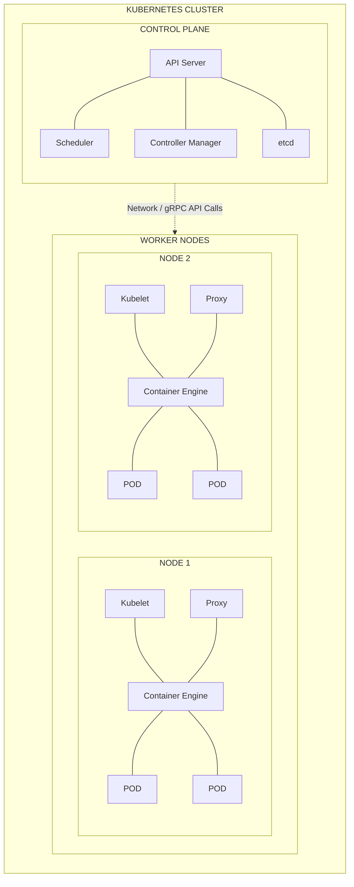
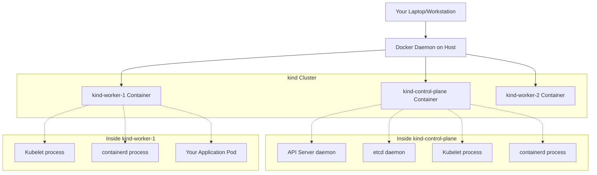

> **Складність**: [СЕРЕДНЯ]
>
> **Час на виконання**: 45-60 хвилин
>
> **Передумови**: Встановлений Docker, пройдено Cloud Native 101

---

Упродовж цього модуля `kubectl` є офіційним клієнтом командного рядка Kubernetes, і кожна команда, яку можна запустити, використовує повне ім'я бінарного файлу. Багато інженерів налаштовують короткий інтерактивний псевдонім (alias) на власних машинах, але псевдоніми є зручністю локальної оболонки, і вони не розгортаються надійно в скриптах, скопійованих блоках команд або неінтерактивній автоматизації. Використання `kubectl` усюди залишає приклади зрозумілими, портативними та безпечними для копіювання в термінал або лабораторний зошит без прихованих налаштувань.

```bash
kubectl version --client
```

## Що ви зможете зробити

- **Створити** та перевірити локальний кластер Kubernetes версії 1.35+ за допомогою `kind`, Docker та робочого процесу командного рядка `kubectl`.
- **Порівняти** інструменти для локальних кластерів та спроєктувати топологію, яка відповідає вашій задачі розробки або тестування.
- **Діагностувати** збої під час запуску локального кластера, мережі, kubeconfig та control plane, читаючи конкретні сигнали від Docker і Kubernetes.
- **Оцінити**, як взаємодіють компоненти control plane та worker-вузлів, а потім передбачити, як збої впливають на планування (scheduling) та доступ.
- **Впровадити** повторюваний процес локальної розробки, який дозволяє легко знищувати кластери (disposable), фіксувати їхні версії та ізолювати від ризику витрат на хмарні ресурси.


## Чому це важливо

Кластер Kubernetes — це розподілена система управління, а не інструмент командного рядка, який встановлюють і забувають. У ньому працюють автентифікований API, планувальник, що розміщує робочі навантаження, контролери, які постійно узгоджують бажаний стан із реальністю, середовище виконання контейнерів на кожному вузлі, трансляція мережі між Pod, а також сховище ключ-значення, що зберігає істину, яку захищає сервер API. Більшість інженерів вперше стикаються з цим механізмом у спільному середовищі — командному кластері для розробки, проміжному проєкті GKE, а іноді й у самому production. Це неправильне місце для навчання. Помилки у спільному кластері поширюються назовні: один поганий маніфест блокує інших інженерів, споживає дефіцитні хмарні ресурси або тихо ховає баг за чужим активним робочим навантаженням. Радіус ураження від помилки під час навчання має обмежуватися ноутбуком, на якому цю помилку зроблено.

Кластер — це не просто ще один інструмент командного рядка, який ви встановлюєте і забуваєте. Це розподілена система управління з автентифікацією, бажаним станом, планувальниками, фоновими контролерами, мережевою трансляцією, середовищами виконання контейнерів та постійним станом. Коли команда експериментує безпосередньо у спільному середовищі, один помилковий маніфест може заблокувати інших інженерів, спожити дефіцитні хмарні ресурси або сховати баг за чужими активними змінами. Локальний кластер дає вам протилежну операційну модель: приватну арену, де збої коштують дешево, відновлення відбувається швидко, а радіус ураження залишається на вашому ноутбуці.

Керований хмарний Kubernetes є правильним рішенням для багатьох production-навантажень, проте це погана перша пісочниця для навчання. Розгортання керованої площини управління (control plane) може займати багато хвилин, вимагає плати просто за існування і часто приносить додаткові витрати на вузли, диски, балансувальники навантаження та міжзоновий трафік. Забутий навчальний кластер може створити реальний рахунок, тоді як локальний кластер `kind` можна видалити, не залишаючи за собою хмарної інфраструктури. Цей модуль навчить вас будувати цю локальну арену, інспектувати її рухомі частини та вирішувати, коли достатньо кластера з одним вузлом, а коли топологія з кількома вузлами варта додаткових ресурсів.

Мета полягає не в тому, щоб запам'ятати команду створення кластера. Мета полягає в тому, щоб розробити операційну модель: ви повинні знати, що будує `kind`, куди `kubectl` надсилає запити, чому kubeconfig контролює вашу ідентичність, який компонент планує Pod, чому локальний LoadBalancer залишається у стані pending та як відновити роботу, коли виходять з ладу Docker, дисковий простір, зсув версій (version skew) або площина управління. Щойно ви зможете усвідомлено створювати, ламати, інспектувати та видаляти свій перший кластер, наступні модулі про робочі навантаження, Service, сховища, безпеку та автоматизацію стануть набагато менш абстрактними.

У цьому першому модулі також є культурний урок. Команди, які впевнено працюють з одноразовими локальними кластерами, як правило, пишуть менші експерименти, відтворюють баги з меншою кількістю зустрічей і описують збої з кращими доказами. Команди, які не мають такої практики, часто розглядають кожну проблему кластера як спільну надзвичайну ситуацію, оскільки ніхто не може швидко відтворити умови самостійно. Працюючи над модулем, постійно запитуйте себе, які факти ви можете довести локально, перш ніж залучати спільну платформу. Ця звичка економить час, гроші та авторитет, коли той самий діагностичний патерн згодом з'являється у реальному середовищі.

## Розділ 1: Анатомія кластера Kubernetes

Перш ніж будувати кластер, потрібно знати, що саме збирається. Kubernetes — це не єдиний процес, який «запускає контейнери»; це набір взаємодіючих сервісів, які підтримують бажаний стан через API. Корисним першим поділом є площина управління (control plane) та площина даних (data plane). Площина управління зберігає рішення та координує роботу, тоді як площина даних запускає фактичні контейнери застосунків на вузлах. Цей поділ є причиною того, чому кластер може підтримувати роботу наявних Pod навіть тоді, коли деякі компоненти управління тимчасово несправні, але це також є причиною того, чому нові зміни можуть зависати, коли API або планувальник недоступні.

Подумайте про оркестр, де музиканти — це робочі вузли (worker nodes), а диригент — це площина управління. Музиканти створюють звук, але диригент визначає темп, координацію та інтерпретацію партитури. У Kubernetes ваші YAML-маніфести є партитурою: вони описують те, що має існувати, а не кожен механічний крок, необхідний для його створення. Площина управління приймає цей бажаний стан, зберігає його і постійно спрямовує робочі вузли до нього. Якщо ви пам'ятатимете цю модель, багато заплутаних варіантів поведінки стануть передбачуваними, а не загадковими.

Ще одна корисна аналогія — це морський порт. Крани та портові робітники переміщують контейнери, але адміністрація порту призначає причали, відстежує маніфести, перевіряє повноваження та координує загальний потік. Робочий вузол схожий на механізми, які фізично переміщують вантаж, тоді як площина управління — це адміністрація, яка вирішує, що і куди має переміщатися. Якщо адміністрація тимчасово недоступна, вантаж, який уже лежить у доці, не зникає, але нові інструкції не можуть бути прийняті чисто. Ось чому здоровий кластер — це більше, ніж просто «контейнери все ще працюють»; це безперервна співпраця сховища стану, доступу до API, планування та виконання на вузлах.


```mermaid
flowchart TD
    subgraph KUBERNETES_CLUSTER [KUBERNETES CLUSTER]
        direction TB
        
        subgraph CONTROL_PLANE [CONTROL PLANE]
            direction TB
            API[API Server]
            SCHED[Scheduler]
            CM[Controller Manager]
            ETCD[etcd]
            
            API --- SCHED
            API --- CM
            API --- ETCD
        end
        
        subgraph WORKER_NODES [WORKER NODES]
            direction LR
            
            subgraph NODE_1 [NODE 1]
                direction TB
                K1[Kubelet]
                P1[Proxy]
                CE1[Container Engine]
                POD1A[POD]
                POD1B[POD]
                
                K1 --- CE1
                P1 --- CE1
                CE1 --- POD1A
                CE1 --- POD1B
            end

            subgraph NODE_2 [NODE 2]
                direction TB

                K2[Kubelet]
                P2[Proxy]
                CE2[Container Engine]
                POD2A[POD]
                POD2B[POD]
                
                K2 --- CE2
                P2 --- CE2
                CE2 --- POD2A
                CE2 --- POD2B
            end
        end
        
        CONTROL_PLANE -. "Network / gRPC API Calls" .-> WORKER_NODES
    end
```

Сервер API — це парадні двері кластера. Кожна зовнішня команда, запит контролера та внутрішнє оновлення статусу проходять через нього, і це єдиний компонент, який спілкується безпосередньо з бекенд-сховищем даних. Коли ви запускаєте команду за допомогою `kubectl`, сервер API автентифікує вас, авторизує дію через RBAC, застосовує політики допуску (admission policies), валідує об'єкт, а потім зберігає прийнятий стан. Якщо сервер API недоступний, у вас все ще можуть працювати контейнери на робочих вузлах, але ви не зможете надійно зчитувати або змінювати стан кластера через Kubernetes API.

`etcd` — це пам'ять кластера. Це сховище ключ-значення зі строгою узгодженістю, яке зберігає такі об'єкти, як простори імен, Deployment, Secret, Service та записи про Pod. Планувальник не має незалежної приватної бази даних, як і controller manager; вони спостерігають за сервером API і записують свої рішення назад у збережений стан. Такий дизайн робить Kubernetes придатним до аудиту і декларативним, але він також означає, що здоров'я `etcd` не є чимось необов'язковим. Якщо сховище даних не може приймати записи, кластер не може безпечно приймати новий бажаний стан.

Планувальник — це сват. Він слідкує за Pod, які існують в API, але ще не мають призначеного вузла, відфільтровує вузли, що не можуть їх запустити, оцінює решту вузлів і записує вибране ім'я вузла назад в об'єкт Pod. Сам по собі він не запускає контейнери. Kubelet на обраному вузлі згодом помічає призначення і працює з середовищем виконання контейнерів, щоб зробити Pod реальним. Ця відмінність важлива під час зневадження: Pod у стані pending — це часто проблема планування, тоді як Pod, призначений на вузол, але такий, що не може запуститися — це зазвичай проблема вузла, образу, середовища виконання або конфігурації.

Controller manager — це набір циклів узгодження кластера. Контролер багаторазово порівнює спостережуваний стан із бажаним станом і вживає невеликих коригувальних дій. Якщо Deployment каже, що має існувати три репліки, і один Pod зникає, відповідний контролер створює ще один об'єкт Pod. Якщо вузол перестає звітувати, контролер вузлів (node controller) фіксує цей стан. Kubernetes здається автоматичним, тому що багато контролерів постійно спостерігають і підштовхують стан до тих декларацій, які ви зробили. Це не магія; це програми, які постійно запитують: «Що змінилося, і що має відбутися далі?»

Робочі вузли запускають kubelet, kube-proxy та середовище виконання контейнерів, таке як `containerd`. Kubelet отримує специфікації Pod, призначених його вузлу, і гарантує, що необхідні контейнери працюють і звітують про свій стан. Kube-proxy керує правилами мережі, щоб Service могли направляти трафік на змінні IP-адреси Pod. Середовище виконання контейнерів завантажує образи та просить ядро операційної системи створити ізольовані процеси за допомогою cgroups і просторів імен. Kubernetes також делегує мережу плагінам CNI, а інтеграцію із середовищем виконання — CRI, саме тому кластери можуть використовувати різні реалізації мережі та середовища виконання, зберігаючи єдиний Kubernetes API.

Цей розподіл компонентів також пояснює, чому зневадження Kubernetes зазвичай є процесом звуження відповідальності. Якщо сервер API відхиляє маніфест, ви перевіряєте схему, автентифікацію, авторизацію або допуск. Якщо Pod залишається у стані pending, ви перевіряєте обмеження планування та ємність вузла. Якщо Pod призначено, але він не працює, ви перевіряєте події kubelet, завантаження образів, помилки середовища виконання, проби (probes) і томи. Якщо трафік досягає Service, але не досягає бекенда, ви перевіряєте селектори, ендпоінти, поведінку kube-proxy та мережеві політики. Локальний кластер дає вам місце для практики цього звуження без очікування виробничого інциденту, який би навчив цього під тиском.

Зупиніться та подумайте: якщо процес `kube-scheduler` зазнає збою, але сервер API і `etcd` залишаються здоровими, що станеться, коли ви створите новий Deployment? Запит все ще може бути прийнятий і збережений, але нові Pod залишатимуться у стані pending, оскільки ніщо не призначає їх на вузли. Існуючі працюючі Pod зазвичай продовжують роботу, оскільки kubelet вже знає про них. Таке передбачення є операційною звичкою, яку ви формуєте: відокремлюйте «API прийняв мій бажаний стан» від «робітник насправді може його виконати».


## Розділ 2: Вибір локального інструменту Kubernetes

Локальні інструменти Kubernetes вирішують одну й ту саму високорівневу потребу, але вони не створюють однакового середовища. Деякі інструменти створюють віртуальні машини, деякі запускають кластери всередині контейнерів, а деякі інтегруються з рівнем десктопної віртуалізації. Правильний вибір залежить від того, що для вас найважливіше: швидкість запуску, точність відтворення дистрибутиву, обмеження ресурсів, багатовузлова поведінка чи зручність. Для цього навчального курсу ми використовуємо `kind`, оскільки він швидкий, піддається скриптуванню, орієнтований на upstream та чудово підходить для одноразових кластерів, що використовуються в тестах і вправах.

| Інструмент | Базова архітектура | Основне застосування | Переваги | Недоліки |
|---|---|---|---|---|
| **minikube** | Віртуальні машини (історично) або Контейнери | Традиційна локальна розробка | Величезний набір функцій, зріла екосистема. Режим віртуальної машини використовує віртуальні диски фіксованого розміру, захищаючи дисковий простір хоста. | Може бути дуже вимогливим до ресурсів. Повільніший запуск. Вибір драйверів і середовищ виконання, доповнення та типові налаштування для локальної розробки відрізняються від чистого upstream кластера, хоча minikube і запускає справжній Kubernetes локально. |
| **kind** (Kubernetes IN Docker) | Docker-контейнери, що діють як вузли | CI/CD конвеєри, автоматизоване тестування, ретельна локальна розробка | Надзвичайно швидкий, ідентичний до чистого upstream Kubernetes, багатовузлові топології, що легко налаштовуються. | Вимагає Docker-демона. Складні крайові випадки в мережі при наданні доступу до сервісів із хоста. |
| **k3d** | Docker-контейнери, що запускають k3s | Симуляція граничних обчислень, IoT | Мінімальне споживання пам'яті, надзвичайно швидкий запуск. | Використовує k3s (спрощений, модифікований дистрибутив Kubernetes), якому може бракувати 100% паритету з хмарними провайдерами. |
| **Docker Desktop / Colima** | Інтегрований гіпервізор / Легковагова віртуальна машина | Швидка перевірка для користувачів Mac/Windows | Нульова конфігурація, інтеграція з графічним інтерфейсом, просте монтування томів. | Негнучкі у порівнянні з інструментами, що підтримують скрипти; Kubernetes у Docker Desktop історично був одновузоловим, хоча новіші версії можуть розгортати багатовузлові кластери через kind provisioner. Жорстко прив'язані до рушія віртуалізації. |

Назва `kind` означає Kubernetes IN Docker, і ця назва буквальна. Вузол `kind` — це Docker-контейнер, який має достатньо привілеїв для запуску процесів вузла Kubernetes всередині нього. Коли ви створюєте тривузловий кластер `kind`, Docker запускає три контейнери-вузли, і кожен такий контейнер запускає власні kubelet та `containerd`. Для самого Kubernetes кластер виглядає розподіленим, оскільки кожен вузол має окрему ідентичність та мережеву адресу, хоча всі ці вузли зрештою є лише контейнерами на вашій робочій станції. Це не те саме, що апаратне забезпечення у production, але цього цілком достатньо для вивчення планування, kubeconfig, поведінки контролерів та багатьох мережевих патернів.


```mermaid
flowchart TD
    Host[Your Laptop/Workstation]
    DockerDaemon[Docker Daemon on Host]

    Host --> DockerDaemon

    subgraph kind Cluster
        Node1[kind-control-plane Container]
        Node2[kind-worker-1 Container]
        Node3[kind-worker-2 Container]
    end

    DockerDaemon --> Node1
    DockerDaemon --> Node2
    DockerDaemon --> Node3

    subgraph Inside kind-control-plane
        API[API Server daemon]
        ETCD[etcd daemon]
        KubeletCP[Kubelet process]
        ContainerdCP[containerd process]
    end

    Node1 -.-> API
    Node1 -.-> ETCD
    Node1 -.-> KubeletCP
    Node1 -.-> ContainerdCP

    subgraph Inside kind-worker-1
        KubeletW1[Kubelet process]
        ContainerdW1[containerd process]
        PodA[Your Application Pod]
    end

    Node2 -.-> KubeletW1
    Node2 -.-> ContainerdW1
    Node2 -.-> PodA
```

Прихований компроміс полягає в тому, що кластер `kind` залежить від хостового Docker-демона. Якщо Docker зупиняється, контейнери-вузли також зупиняються, і ваш кластер зникає разом із ними. Це робить `kind` поганим середовищем для довговічного стану, але потужним інструментом для навчання, інтеграційного тестування та швидкого відтворення. До локального кластера слід ставитися як до маркерної дошки, а не як до архіву записів. Створіть його, перевірте гіпотезу, експортуйте логи, якщо вам потрібні докази, і видаліть його, коли вправа завершиться.

Цей компроміс — саме та причина, чому `kind` ідеально підходить для початкового етапу вивчення Kubernetes. Ви не намагаєтеся зберегти дані клієнтів, пережити відмову зони доступності або довести життєздатність керованої хмарної інтеграції. Ви намагаєтеся вивчити форму API, спостерігати за контролерами, порівняти топологію вузлів і навчитися не боятися збоїв. Чим дешевше відтворити середовище, тим охочіше ви будете перевіряти небезпечні питання: що буде, якщо планувальник зникне, що, якщо образ відсутній, що, якщо активний контекст неправильний, або що, якщо зупиниться хостовий Docker-демон. Ці експерименти цінні саме тому, що очищення відбувається швидко.

Перш ніж запускати команди, оберіть найменшу топологію, яка здатна довести поведінку, що вас цікавить. Одновузлового кластера достатньо для базової взаємодії з API, простих маніфестів та більшості ранніх тестів робочих навантажень. Багатовузловий кластер набуває цінності, коли вам потрібне розподілене планування, селектори вузлів, taints, tolerations, DaemonSets або реалістичні мережеві маршрути між вузлами. Який підхід ви б обрали тут і чому: тестування базового монтування ConfigMap, чи тестування того, чи потраплять дві репліки на різні вузли? Перше не вимагає складної топології; друге потребує кластера, який здатен продемонструвати розміщення.

## Розділ 3: Kubeconfig — це ваш паспорт

Kubernetes є безпечним за замовчуванням, тому `kubectl` не може просто надсилати анонімні HTTP-запити до кластера і сподіватися на краще. Йому потрібна адреса API-сервера, довірений центр сертифікації та облікові дані, які вас ідентифікують. Ця інформація зберігається у kubeconfig, зазвичай за шляхом `~/.kube/config`. Файл kubeconfig — це не просто зручний файл; це паспорт, який вказує вашому клієнту, куди подорожувати, яку ідентичність пред'являти та яка пара кластер/користувач є активною в даний момент.

Структура складається з трьох основних частин. Запис кластера визначає цільовий API-сервер і дані центру сертифікації, що використовуються для перевірки цього сервера — подібно до того, як ви знаєте, в яку країну в'їжджаєте, і довіряєте її паспортному контролю. Запис користувача визначає ідентифікаційні матеріали, такі як сертифікати, токени або зовнішній плагін для входу. Контекст прив'язує одного користувача до одного кластера, опціонально з типовим простором імен. Перемикання контексту змінює те, куди будуть спрямовані майбутні команди та які облікові дані вони використовуватимуть, і саме тому помилки з контекстом можуть бути небезпечними.

Kubeconfig стає особливо важливим, коли у вас з'являється більше одного кластера. Один файл може містити локальний контекст `kind`, контекст staging і контекст production — і всі вони доступні для одного й того ж інструменту командного рядка. Така зручність є потужною, але вона означає, що активний контекст є частиною моделі безпеки. Перш ніж застосовувати будь-що, що створює, видаляє або змінює робочі навантаження, візьміть за звичку запитувати себе: "Який кластер отримає цей запит, яким користувачем я буду та який простір імен буде передбачено?" Початківці часто розглядають kubeconfig як "трубопровід"; оператори ставляться до нього як до панелі керування.

Ось спрощений kubeconfig. Поля сертифікатів скорочені, оскільки реальні файли містять довгі значення у форматі base64, і ці значення є конфіденційними, коли вони надають доступ до кластера. Зверніть увагу, що контекст не містить URL-адресу сервера чи самого закритого ключа; він посилається на іменований кластер і користувача. Саме така непряма адресація дозволяє одному файлу kubeconfig зберігати безліч кластерів та безліч ідентичностей без дублювання кожного поля.

```yaml
apiVersion: v1
kind: Config
preferences: {}
current-context: kind-dojo-basics

clusters:
- cluster:
    certificate-authority-data: LS0tLS1CR...
    server: https://127.0.0.1:6443
  name: kind-dojo-basics

users:
- name: kind-dojo-basics
  user:
    client-certificate-data: LS0tLS1CR...
    client-key-data: LS0tLS1CR...

contexts:
- context:
    cluster: kind-dojo-basics
    user: kind-dojo-basics
  name: kind-dojo-basics
```

Ви можете переглядати та редагувати свій паспорт у будь-який час. У production вам слід уникати випадкового виведення секретів у спільні термінали, на відеозаписи або в логи, але на приватній навчальній робочій станції ці команди корисні для того, щоб побачити, як працює вибір контексту. Активний контекст — це той, що позначений зірочкою у виводі `get-contexts`, і його зміна змінює типовий пункт призначення для майбутніх команд у цій оболонці.

```bash
# View the raw YAML of your configuration (redacting actual secrets)
kubectl config view

# See all the context "stamps" in your passport
kubectl config get-contexts

# Explicitly switch your active context
kubectl config use-context <context-name>
```

Іноді ви не хочете змінювати свій типовий kubeconfig. Колега може надіслати тимчасовий staging-конфіг, або CI-завдання може згенерувати короткоживучий файл для одного розгортання. Змінна середовища `KUBECONFIG` дозволяє вказати клієнту на конкретний файл для поточного середовища процесу. Це корисно, оскільки робить доступ явним, тимчасовим та оборотним, замість того, щоб вливати невідомі облікові дані у вашу повсякденну конфігурацію.

```bash
export KUBECONFIG=/path/to/my/temporary/config.yaml
kubectl get nodes # Operates against the temporary cluster
```

Ви також можете об'єднати декілька файлів kubeconfig, розділивши шляхи двокрапкою в Unix-подібних системах. Kubernetes читає їх як об'єднане представлення, що дуже зручно, коли ваші особисті кластери, staging-кластери та згенеровані CI облікові дані зберігаються в окремих файлах. Така поведінка об'єднання є потужною, але це також означає, що імена мають значення. Два контексти з однаковими іменами можуть створити заплутані колізії, тому використовуйте зрозумілі імена кластерів при створенні локальних середовищ.

```bash
export KUBECONFIG=~/.kube/config:/path/to/another/config.yaml
```

Зупиніться та подумайте: якщо kubeconfig, що містить облікові дані адміністратора для production-кластера, буде зафіксований у публічний репозиторій, що станеться далі? Практична відповідь — негайне реагування на інцидент. Автоматизовані сканери шукають розкриті облікові дані, і зловмисник із дійсними обліковими даними кластера може читати об'єкти Secret, створювати робочі навантаження або використовувати обчислювальні ресурси за ваш рахунок. Ставтеся до файлів kubeconfig як до ключів, а не як до нотаток, і тренуйтеся з локальними кластерами, щоб ваша м'язова пам'ять стала обережною ще до того, як ставки стануть високими.


## Розділ 4: Розгортання та перевірка першого кластера

Щоб створити свій перший кластер, Docker має бути встановлений та запущений, оскільки `kind` викликає API Docker для створення контейнерів вузлів. Сам бінарний файл `kind` є єдиним виконуваним файлом. Точна команда встановлення залежить від операційної системи та менеджера пакетів, але приклад для Linux AMD64 демонструє основний підхід: завантажити бінарний файл, зробити його виконуваним та розмістити десь у вашому `PATH`. Менеджери пакетів, такі як Homebrew, можуть виконати ту саму роботу на macOS або Linux.

```bash
# Example download for Linux AMD64 architecture
curl -Lo ./kind https://kind.sigs.k8s.io/dl/latest/kind-linux-amd64
# Grant execute permissions to the downloaded binary
chmod +x ./kind
# Move the binary to a directory included in your system PATH
sudo mv ./kind /usr/local/bin/kind
```

Типовий кластер `kind` створюється однією командою. У цій типовій топології один контейнер виконує роль як control plane, так і робочого вузла. Це прийнятно для першого знайомства, оскільки надає вам API-сервер, `etcd`, scheduler, controller manager, kubelet, kube-proxy, CoreDNS та середовище виконання в одному компактному оточенні. Для детермінованих вправ зафіксуйте образ вузла на тезі Kubernetes 1.35+, щоб усі бачили однакову поведінку API, а не те, що випадково виявиться найновішим у день запуску команди.

```bash
kind create cluster --name dojo-basics
```

Коли ця команда виконується, `kind` завантажує образ `kindest/node`, запускає привілейований контейнер вузла, генерує сертифікати, виконує `kubeadm init`, запускає компоненти control plane, налаштовує мережу та записує деталі доступу до kubeconfig. Саме завдяки цьому останньому кроку з kubeconfig ваша наступна команда `kubectl` знає, де знаходиться новий API-сервер. Кластер є локальним, але він не є фейковим: ви спілкуєтеся зі справжнім API-сервером Kubernetes, чий loopback-порт перенаправлено з вашого хоста в контейнер вузла.

На цій послідовності варто зупинитися детальніше, оскільки кожен крок залишає різний діагностичний слід. Помилка завантаження образу вказує на проблеми з доступом до реєстру або вільним місцем на диску. Помилка контейнера вузла вказує на стан Docker, права доступу або виділення ресурсів. Помилка `kubeadm init` вказує на журнали розгортання Kubernetes всередині вузла. Помилка kubeconfig вказує на доступ клієнта, а не на проблеми зі створенням кластера. Коли ви бачите помилку `kind`, не зводьте всі ці етапи до "кластер не працює". Визначте, який саме етап завершився невдало, а потім виберіть інструмент, який дозволяє перевірити цей рівень.

Щоб явно зафіксувати версію Kubernetes, додайте прапорець `--image`, наприклад: `kind create cluster --name dojo-basics --image kindest/node:v1.35.0`. Фіксація версії має значення, коли ви навчаєтесь за письмовими матеріалами, оскільки Kubernetes постійно розвивається. Команда, типове значення API або попередження можуть змінюватися від релізу до релізу, а ви хочете, щоб розбіжності були навмисними, а не випадковими. У реальних командах фіксація версії також робить звіти про помилки відтворюваними, оскільки кожен може створити локальний кластер однакової конфігурації перед обговоренням проблеми.

```bash
kubectl cluster-info
```

Вивід `cluster-info` має показувати, що control plane Kubernetes працює на loopback-адресі, такій як `https://127.0.0.1:42315`, плюс системні служби, такі як CoreDNS. Це підтверджує одразу три речі: kubeconfig вказує на новий кластер, ваші облікові дані успішно пройшли автентифікацію, а API-сервер може відповідати на запити. Якщо ця команда завершується невдало, не переходьте одразу до налагодження робочих навантажень. Спочатку переконайтеся, чи може клієнт дістатися до control plane.

```bash
kubectl get nodes
```

Ви повинні побачити один вузол із назвою `dojo-basics-control-plane` у стані Ready. У багатьох продуктивних кластерах вузли control plane мають тейнти (tainted), тому звичайні робочі навантаження не можуть там запускатися. У типовому одновузловому кластері `kind` цей інструмент робить вузол доступним для планування (schedulable), щоб ви могли запускати Pod-и додатків без потреби в окремих робочих вузлах (workers). Це зручно, але це також нагадування про те, що локальні кластери навмисно жертвують певною продуктивною ізоляцією заради швидкості та простоти.

```bash
kubectl get pods --namespace kube-system
```

Системні Pod-и у просторі імен `kube-system` показують, що кластер підтримує власну роботу у вигляді керованих Kubernetes навантажень. Ви повинні побачити такі компоненти, як `etcd`, `kube-apiserver`, `kube-controller-manager` та `kube-scheduler`. Це корисна зміна мислення: Kubernetes не приховує від вас кожен внутрішній процес. Багато основних компонентів видимі як Pod-и, що означає, що ви можете перевіряти їхній статус, журнали та перезапуски, використовуючи ті самі звички, які згодом застосовуватимете для власних робочих навантажень.

Не ігноруйте перевірку лише тому, що команда створення успішно завершилася. Команда може повернути управління після розгортання, тоді як деякі фонові компоненти все ще стабілізуються, завантаження образів завершується, або CoreDNS перезапускається. Список вузлів, список системних Pod-ів і вивід `cluster-info` разом дають вам швидкий зріз працездатності з трьох ракурсів: готовність вузлів, доступність control plane та стан доповнень. У професійних робочих процесах ці перевірки стають передумовами для запуску тестів. Ви хочете, щоб помилки вказували на об'єкт тестування, а не на напівстворений кластер, який так і не був готовий.

Перш ніж запускати це, який вивід ви очікуєте від `docker ps` на вашому хості після створення типового кластера `dojo-basics`? Ви маєте очікувати один зовнішній контейнер Docker для єдиного вузла `kind`, а не окремий контейнер Docker для кожного Pod-а Kubernetes, видимого всередині кластера. Pod-и працюють через `containerd` всередині контейнера вузла, тому Docker на хості бачить абстракцію вузла, тоді як Kubernetes бачить внутрішню абстракцію кластера. Цей багаторівневий погляд пояснює багато ранніх несподіванок, коли учні порівнюють команди Docker та Kubernetes.

## Розділ 5: Локальна мережа та багатовузловий дизайн

Мережа — це те місце, де локальні кластери часто перестають здаватися інтуїтивно зрозумілими. Ваші Pod-и отримують IP-адреси з мережі кластера, але ваш ноутбук не виконує автоматичну маршрутизацію до цієї мережі Pod-ів. У кластері `kind` вузли знаходяться у bridge-мережі Docker, а API-сервер — це єдиний порт, перенаправлений за замовчуванням, щоб `kubectl` міг комунікувати. Якщо ви розгортаєте вебзастосунок, IP-адреса Pod-а, наприклад `10.244.0.5`, має сенс всередині кластера, але ваш браузер не має нативного маршруту до цієї адреси з хоста.

Найшвидший патерн доступу — це port forwarding. Команда на кшталт `kubectl port-forward svc/my-web-app 8080:80` відкриває локальний тунель на стороні клієнта через API-сервер до Service або Pod. Це чудово підходить для налагодження, оскільки не вимагає постійного налаштування мережі кластера, але цей тунель завершується, коли завершується процес на передньому плані. Для більш реалістичного локального ingress ви можете налаштувати перенаправлення портів `kind` до створення кластера та запустити ingress-контролер. Для локальної поведінки LoadBalancer вам знадобиться така реалізація, як MetalLB, оскільки ваш ноутбук не має хмарного контролера балансувальника навантаження.

Зупиніться та подумайте: якщо ви запустите port-forward, завантажите застосунок у своєму браузері, а потім закриєте вікно термінала, що станеться зі з'єднанням у браузері? Тунель миттєво зникає, оскільки шлях перенаправлення підтримується локальним процесом. Kubernetes не створював постійної точки доступу до Service на вашому хості; він просто передавав трафік через активне з'єднання для налагодження. Це розмежування вбереже вас від помилкового сприйняття успішного port-forward як продуктивного мережевого дизайну.

Одновузлового кластера достатньо для багатьох початкових вправ, але він не може відображати обмеження розміщення. Якщо кожен процес control plane та кожне робоче навантаження ділять один вузол, ви не можете перевірити, чи розподіляються репліки між вузлами, чи запускається DaemonSet один раз на кожному вузлі, і чи потрапляє робоче навантаження з node selector лише туди, куди було заплановано. Багатовузлові кластери `kind` вирішують цю проблему шляхом оголошення кількох контейнерів вузлів у конфігураційному файлі. Ви все ще працюєте локально, але тепер Kubernetes має змістовний набір вузлів для вибору.

Перехід до багатовузлової конфігурації також готує вас до ключової продуктивної реальності: розміщення в Kubernetes — це рішення API, а не побажання. Ви можете запитувати репліки, встановлювати правила affinity, додавати tolerations, маркувати вузли та обмежувати ресурси, але scheduler усе одно оцінює поточний набір вузлів перед прив'язкою кожного Pod-а. В одновузловому кластері багато помилок розміщення непомітні, тому що більше нікуди йти. У багатовузловому кластері ці помилки проявляються як Pod-и у стані Pending, неочікуваний розподіл або робочі навантаження, які потрапляють на непередбачені вузли. Цей зворотний зв'язок — це саме те, що має виявляти локальна навчальна топологія.

Створіть файл з назвою `multi-node-config.yaml` у вашій файловій системі:

```yaml
# multi-node-config.yaml
kind: Cluster
apiVersion: kind.x-k8s.io/v1alpha4
nodes:
  # The control plane node (API server, etc.)
  - role: control-plane
  # The first worker node (Application workloads)
  - role: worker
  # The second worker node (Application workloads)
  - role: worker
```

Видаліть перший кластер перед створенням наступного, якщо ви навмисно не бажаєте запускати кілька кластерів одночасно. Локальні кластери споживають CPU, пам'ять, дисковий простір та порти, і найшвидший спосіб отримати заплутані результати тестів — забути, який контекст є активним. Ставтеся до циклу видалення та повторного створення як до нормального явища, а не руйнівного. Ваш локальний кластер має бути простіше замінити, ніж ремонтувати.

```bash
kind delete cluster --name dojo-basics
```

Тепер створіть багатовузлову топологію. `kind` запускає три контейнери Docker, ініціалізує перший як control plane, генерує дані для підключення і змушує два інші приєднатися як workers через bridge-мережу Docker. Виконання команди триватиме трохи довше, ніж для одновузлового кластера, але вона дасть вам топологію, яка може навчити рішенням планування, а не просто надсиланню запитів до API.

```bash
kind create cluster --name dojo-multi --config multi-node-config.yaml
```

Перевіряйте архітектуру через Kubernetes, а не лише через Docker. Список вузлів Kubernetes — це те, що scheduler використовує під час вибору розміщення, тому саме цей вигляд має значення для подальшої поведінки робочих навантажень. Робочі вузли зазвичай показують `<none>` у стовпці roles, доки ви не призначите їм мітки, що є очікуваним і не є помилкою.

```bash
kubectl get nodes
```

Тепер вивід вашого термінала має точно відображати розподілену топологію:

```text
NAME                        STATUS   ROLES           AGE     VERSION
dojo-multi-control-plane    Ready    control-plane   2m14s   v1.35.0
dojo-multi-worker           Ready    <none>          1m58s   v1.35.0
dojo-multi-worker2          Ready    <none>          1m58s   v1.35.0
```

Запустіть `kubectl get nodes -o wide` та вивчіть внутрішні IP-адреси. Кожен вузол насправді є контейнером Docker, проте Kubernetes бачить окремі адреси вузлів і може здійснювати планування між ними. Це робить цю топологію цінною для практики роботи з мітками вузлів, taints, tolerations, affinity, anti-affinity та DaemonSets. Якщо пізніше ви тестуватимете робоче навантаження, яке має запускатися по одній копії на кожен вузол, багатовузловий кластер стане першою топологією в цьому модулі, яка зможе довести таку поведінку, а не просто прийняти маніфест.

Багатовузлові локальні кластери все ще є наближеннями, тому використовуйте їх чесно. Вони не відтворюють окремі фізичні машини, незалежні домени живлення, реальну хмарну маршрутизацію або відмову апаратного забезпечення зберігання даних. Проте вони відтворюють достатню частину циклу керування Kubernetes, щоб навчити плануванню, ідентифікації вузлів, розміщенню Pod-ів і багатьом мережевим патернам. Ця межа має значення під час звітування про результати. Ви можете сказати: "Цей маніфест коректно розподіляється між трьома вузлами `kind`", але не варто стверджувати, що це доводить продуктивну доступність. Якісне локальне тестування спочатку відповідає на запитання щодо Kubernetes, а питання, специфічні для хмари, залишає для середовищ, які насправді містять таку хмарну поведінку.


## Розділ 6: Усунення несправностей та дисципліна локальної розробки

Локальні збої кластера зазвичай виникають через хост-середовище. Docker може бути зупинений, Docker може не мати достатньо пам'яті, диск може бути заповнений, ваш клієнт може мати версію, яка не підтримується Kubernetes, або порт уже може використовуватися іншим процесом. Це не відволікає від вивчення Kubernetes; це перший рівень діагностики. Налагодження в production також починається з розділення сигналів клієнта, control plane, вузла, мережі та сховища. Локальні кластери просто роблять ці рівні видимими та дешевими для відтворення.

Найшвидший цикл усунення несправностей починається з визначення межі помилки. Якщо `kind` не може створити контейнер вузла, Kubernetes ще не готовий до перевірки. Якщо вузол існує, але API недоступний, перевірте логи control plane та kubeconfig. Якщо API доступний, але робоче навантаження знаходиться у стані Pending, перевірте події та обмеження планування. Якщо робоче навантаження працює у стані Running, але недоступне, перевірте Services, endpoints, port-forwarding та відображення ingress. Записування цих гілок може здатися механічним, але це запобігає типовій помилці початківців: запуску випадкових команд, поки одна з них не здасться доречною.

Якщо `kind create cluster` зависає під час запуску control-plane, спершу перевірте Docker. Control plane Kubernetes потребує пам'яті, а образ вузла не є малим. Користувачі Docker Desktop повинні виділити достатньо пам'яті для рушія, особливо для багатовузлових кластерів, тоді як користувачі Linux повинні перевірити навантаження на хост та використання swap. Коли API ще недоступний, `kubectl` не зможе вам допомогти, тому ви оминаєте Kubernetes і читаєте логи контейнера вузла безпосередньо через Docker.

```bash
docker logs <container-id>
```

Конфлікти портів створюють інший тип помилок. Сервер API слухає порт 6443 всередині контейнера вузла, і `kind` відображає порт хоста для доступу до нього. Якщо ви явно налаштовуєте порти хоста для ingress або повторно використовуєте порт, який уже зайнятий іншим локальним процесом, новий кластер не зможе його прив'язати. На macOS або Linux такі команди, як `lsof -i :6443` або `netstat -tulpn | grep 6443`, допомагають визначити власника. Краще вибрати інший налаштований порт, ніж вбивати невідомі процеси, якщо ви не впевнені, кому належить сокет.

Розбіжність версій виглядає більш дивно, оскільки кластер може бути здоровим, але ваш клієнт поводиться неправильно. Kubernetes підтримує обмежену розбіжність мінорних версій між `kubectl` та сервером API. Якщо ваш локальний клієнт занадто старий для кластера Kubernetes 1.35, ви можете побачити помилки, такі як відсутні ресурси, неправильний формат виводу або непідтримувана поведінка API, навіть якщо Docker показує, що контейнер control plane працює. Перевірте версії клієнта та сервера, а потім оновіть клієнт так, щоб він потрапляв у підтримуване вікно розбіжності.

Найбазовішою помилкою є відсутність середовища виконання контейнерів. `kind` не може створити вузли, якщо Docker недоступний, і помилка часто говорить саме про це:

```text
failed to create cluster: failed to get docker info: Cannot connect to the Docker daemon at unix:///var/run/docker.sock.
```

На Linux перевірте службу та дозволи. На десктопних платформах перед повторною спробою переконайтеся, що рушій віртуалізації працює. Якщо вашому користувачу не дозволено доступ до сокета Docker, додавання користувача до групи docker вимагає нового сеансу входу, перш ніж зміни дозволів набудуть чинності. Не намагайтеся діагностувати планування Kubernetes, коли сама фабрика вузлів недоступна.

```bash
systemctl status docker
sudo usermod -aG docker $USER
```

Брак місця на диску — це ще один поширений локальний збій, оскільки образи вузлів, образи застосунків, доступні для запису шари контейнерів та томи непомітно накопичуються. Pod, що застряг у стані `ImagePullBackOff` після локальної збірки, може бути помилкою завантаження образу, але збій завантаження образів вузлів може бути звичайним вичерпанням пам'яті на диску. Підтримуйте вільне місце та свідомо очищайте його, коли старі тестові образи більше не потрібні. Наведена нижче команда є навмисно агресивною, тому читайте її вивід і уникайте її використання, коли вам ще потрібні зупинені контейнери, томи або кешовані образи.

```bash
docker system prune -a --volumes
```

Коли кластер падає так, що це варто вивчити, експортуйте логи перед його видаленням. `kind` може збирати логи kubelet, container runtime, сервера API та інших компонентів із контейнерів вузлів у локальну директорію. Це локальна версія збереження доказів під час інциденту. Вона дозволяє вам провести перевірку після того, як кластер зникне, і надає товаришам по команді конкретні дані замість туманного звіту про те, що "kind зламався".

```bash
kind export logs ./kind-troubleshooting-logs --name dojo-multi
```

Сильна дисципліна локальної розробки тримає ці проблеми в рамках. Фіксуйте версії Kubernetes, чітко називайте кластери, перевіряйте активний контекст перед застосуванням маніфестів, за потреби завантажуйте локальні образи в кластер та видаляйте неактивні кластери після завершення тесту. Уникайте ручного редагування файлів всередині контейнерів вузлів, оскільки це створює невидимий зсув стану; переносьте зміни на рівні вузлів у конфігурацію `kind` і перестворюйте кластер. Сенс локального Kubernetes полягає не в тому, щоб зберегти одну ідеальну сніжинку. Сенс у тому, щоб зробити реалістичні середовища одноразовими.

Корисна рутина — починати кожен сеанс із названого кластера, чіткої версії та однієї записаної гіпотези. Наприклад: "Я тестую, чи планується цей Deployment на worker-вузлах із міткою `workload=frontend` у Kubernetes 1.35". Після тесту зафіксуйте команди, події та кінцеве спостереження, а потім видаліть кластер. Ця рутина дає вам відтворювані докази замість напівзабутого термінального сеансу. Вона також робить подальшу автоматизацію очевидною: щойно ручна послідовність стане зрозумілою, скрипт або Makefile зможе стабільно відтворювати її для товаришів по команді та CI.


## Патерни та антипатерни

Надійна локальна робота з Kubernetes залежить не так від однієї розумної команди, як від повторюваних звичок. Наведені нижче патерни — це звички, які варто виробити на ранньому етапі, оскільки вони масштабуються на командні робочі процеси. Антипатерни здаються привабливими, тому що в моменті вони видаються швидшими, але вони створюють саме той прихований стан, витрати та невизначеність, які локальні кластери повинні усунути.

| Патерн | Коли його використовувати | Чому це працює |
|---|---|---|
| Одноразові іменовані кластери | Будь-яка навчальна лабораторія, випадок для відтворення або інтеграційний тест | Імена роблять контексти kubeconfig очевидними, тоді як видалення тримає під контролем використання ресурсів і зсув стану. |
| Образи вузлів із зафіксованою версією | Навчальна програма, CI, тестування операторів та відтворення багів | Фіксування поведінки Kubernetes 1.35+ робить результати тестів детермінованими та запобігає випадковому зсуву релізів. |
| Декларативні файли топології | Багатовузлові тести, відображення портів ingress або патчі kubeadm | Конфігурацію в репозиторії можна перевірити, відтворити та поділитися нею замість відновлення з пам'яті. |
| Діагностика з боку хоста | Збої створення кластера, помилки Docker, брак місця на диску та конфлікти портів | Локальні кластери залежать від середовища виконання хоста, тому сигнали Docker та ОС часто пояснюють збої ще до існування Kubernetes. |

| Антипатерн | Що йде не так | Краща альтернатива |
|---|---|---|
| Ставлення до локального кластера як до довговічної інфраструктури | Ручні зміни зникають або стають неможливими для відтворення після видалення | Зберігайте маніфести та конфігурації `kind`, потім перестворіть кластер, щоб довести повторюваність. |
| Застосування маніфестів без перевірки контексту | Робочі навантаження потрапляють у неправильний кластер, іноді у дороге спільне середовище | Виконайте `kubectl config current-context` або перевірте контексти перед ризикованими діями. |
| Очікування, що Services типу LoadBalancer працюватимуть як у хмарних провайдерів | `EXTERNAL-IP` залишається у стані pending, оскільки жоден хмарний контролер не виділяє обладнання | Використовуйте port-forwarding, відображений ingress або локальну реалізацію балансувальника навантаження. |
| Залишення багатьох кластерів у простої | ЦП, пам'ять, порти та диск споживаються середовищами, які ніхто не використовує | Проводьте аудит за допомогою `kind get clusters` та видаляйте кластери наприкінці кожного сеансу. |


## Схема прийняття рішень

Використовуйте локальний кластер, коли питання для вивчення або тестування стосується поведінки API Kubernetes, планування, маніфестів, контролерів, Services або базової мережі. Використовуйте керований хмарний кластер, коли питання залежить від хмарних інтеграцій, таких як керовані балансувальники навантаження, ідентифікація IAM, постійні диски, групи автоматичного масштабування або домени збоїв рівня production. Використовуйте одновузловий локальний кластер, коли топологія не має значення. Використовуйте багатовузловий локальний кластер, коли розміщення, специфічна для вузла поведінка, DaemonSets або міжвузлова мережа є частиною гіпотези.

```text
Почніть із запитання, на яке вам потрібно відповісти
|
+-- Чи стосується запитання керованих хмарних інтеграцій?
|   +-- Так: використовуйте справжній хмарний кластер із суворим контролем витрат.
|   +-- Ні: продовжуйте локально.
|
+-- Чи залежить поведінка від кількох вузлів?
|   +-- Так: створіть багатовузловий кластер kind з YAML.
|   +-- Ні: створіть одновузловий кластер kind.
|
+-- Чи потрібна вам детермінована поведінка версії?
|   +-- Так: зафіксуйте kindest/node:v1.35.0 або необхідну тестову версію.
|   +-- Ні: все одно зафіксуйте версію, щоб результати можна було пояснити.
```

Практичне рішення зазвичай стосується швидкості та точності зворотного зв'язку. Локальні кластери дають швидкий зворотний зв'язок і низький ризик, але вони не можуть довести будь-яку хмарну поведінку. Хмарні кластери забезпечують високу точність для інтеграцій з провайдером, але вони коштують грошей і вимагають більше часу на перебудову. Хороші інженери не вибирають щось одне назавжди; вони обирають найдешевше середовище, яке може чесно відповісти на запитання. Для цього модуля чесним запитанням є те, як поводиться сам Kubernetes, тому локальний кластер `kind` є правильним вибором за замовчуванням.


## Чи знали ви?

1. Kubernetes 1.35 — це цільова версія для цієї навчальної програми, тому фіксація образів локальних вузлів запобігає зсуву прикладів у міру виходу нових upstream-релізів.
2. Назва "Kubernetes" походить від грецького слова, що означає стернового або пілота, що відповідає логотипу проєкту у вигляді штурвала.
3. `kind` починався як інфраструктура для тестування самого Kubernetes, що пояснює, чому він швидкий, одноразовий і зручний для автоматизації.
4. Абревіатура `k8s` — це нумеронім: вона зберігає першу та останню літери слова Kubernetes і замінює вісім літер між ними цифрою `8`.


## Типові помилки

| Помилка | Чому це трапляється | Як це виправити |
|---|---|---|
| Створення образу на хості та очікування, що Pod у `kind` знайде його | Контейнер вузла має власний внутрішній `containerd`, окремий від списку образів Docker хоста. | Виконайте `kind load docker-image my-app:v1 --name <cluster-name>` або надішліть образ до реєстру, доступного для кластера. |
| Забування, який контекст kubeconfig є активним | `kind` оновлює kubeconfig автоматично, і кілька кластерів можуть співіснувати в одному файлі. | Перевіряйте контексти перед застосуванням змін і використовуйте зрозумілі імена кластерів, такі як `kind-dojo-basics`. |
| Припущення, що локальний Service типу LoadBalancer виділяє зовнішню IP-адресу | На вашому ноутбуці немає контролера хмарного провайдера для створення інфраструктури зовнішнього балансувальника навантаження. | Використовуйте `kubectl port-forward`, налаштовані відображення портів ingress або локальну реалізацію, таку як MetalLB. |
| Залишення неактивних кластерів запущеними протягом днів | Цикли control plane, контейнери вузлів, образи та томи споживають ресурси хоста, навіть коли ви не проводите тестування. | Проводьте аудит за допомогою `kind get clusters` та негайно видаляйте кластери після завершення лабораторної роботи або відтворення. |
| Редагування контейнера вузла вручну | Ручні зміни через `docker exec` невидимі для вашої конфігурації кластера і зникають під час його перестворення. | Кодуйте поведінку вузла у конфігурації `kind`, маніфестах або автоматизації, потім перестворіть кластер, щоб довести її збереження. |
| Ігнорування обмежень пам'яті та диска Docker | `kind` покладається на Docker, тому брак ресурсів хоста заважає запуску компонентів Kubernetes та образів. | Виділіть достатньо пам'яті для Docker, підтримуйте вільне місце на диску та перевіряйте логи Docker у разі збою створення кластера. |
| Використання старого клієнта з новішим сервером API | Kubernetes підтримує лише обмежену розбіжність мінорних версій клієнта та сервера. | Оновіть клієнт або створіть версію кластера, яка підпадає під підтримувану політику розбіжності. |


## Контрольні запитання

<details><summary><strong>[Перевіряє LO4]</strong> Ви створюєте Deployment, коли API server та `etcd` працюють справно, але Pod планувальника (scheduler) було видалено. У який стан перейдуть нові Pods і чому?</summary>
Pods будуть прийняті в API та залишаться у стані Pending. API server може перевірити та зберегти бажаний стан, оскільки `etcd` доступний, але планувальник є тим компонентом, який призначає незаплановані Pods на вузли. Без цього призначення жоден kubelet не отримує відповідальності за запуск контейнерів. Ось чому стан Pending для Pod часто є свідченням проблеми з плануванням, а не помилки завантаження образу або збою застосунку.
</details>

<details><summary><strong>[Перевіряє LO2]</strong> Вашій команді потрібно протестувати DaemonSet, який має запускати один Pod на кожному вузлі. Чи варто використовувати одновузловий або багатовузловий кластер `kind`, і що саме одновузловий тест не зможе довести?</summary>
Використовуйте багатовузловий кластер `kind`, оскільки поведінка залежить від кількості та розміщення вузлів. Одновузловий кластер може довести, що об'єкт DaemonSet приймається і що один Pod може бути запущений, але він не може довести планування на рівні кожного вузла серед кількох робочих вузлів. Багатовузлова топологія дозволяє вам перевірити, що кожен вузол отримує рівно один Pod, і що умови рівня вузла або мітки впливають на результат так, як очікується.
</details>

<details><summary><strong>[Перевіряє LO3]</strong> Розробник збирає `my-app:v1` за допомогою Docker, застосовує Deployment і отримує помилку `ImagePullBackOff` у `kind`. Назва образу правильна. Що слід перевірити та зробити?</summary>
Їм слід перевірити, чи був образ завантажений у внутрішнє середовище виконання кластера `kind`. Хостовий Docker може знати про образ, тоді як `containerd` вузлового контейнера не може його бачити, тому Kubernetes намагається завантажити образ із реєстру і зазнає невдачі. Локальне рішення полягає в тому, щоб виконати команду `kind load docker-image my-app:v1 --name <cluster-name>` перед створенням або перезапуском Pod. У командних робочих процесах надсилання до реєстру може бути більш відтворюваним.
</details>

<details><summary><strong>[Перевіряє LO1]</strong> Вам потрібно відтворити помилку на Kubernetes v1.35.0, але ваша інсталяція `kind` за замовчуванням створює іншу версію. Який найбезпечніший локальний робочий процес?</summary>
Створіть новий кластер із явно вказаним тегом образу вузла замість того, щоб мутувати наявний кластер на місці. Така команда, як `kind create cluster --name repro-135 --image kindest/node:v1.35.0`, дає вам детерміновану версію API server та вузла для тестування. Локальні кластери є одноразовими, тому їх перестворення зазвичай є безпечнішим і швидшим, ніж ставлення до них як до довготривалої інфраструктури. Запишіть версію у своїх нотатках, щоб інші інженери могли відтворити те саме середовище.
</details>

<details><summary><strong>[Перевіряє LO5]</strong> Ви отримуєте тимчасовий kubeconfig для staging-кластера, але ви не хочете, щоб він об'єднувався з вашим стандартним `~/.kube/config`. Як вам слід його використовувати?</summary>
Встановіть змінну середовища `KUBECONFIG` для сеансу оболонки або команди, якій потрібен доступ. Це змусить клієнта прочитати наданий файл замість того, щоб непомітно змінювати або залежати від вашої конфігурації за замовчуванням. Після завершення сеансу або скасування змінної ваші звичайні контексти повертаються. Це зменшує ймовірність випадкового застосування маніфестів до неправильного кластера в майбутньому.
</details>

<details><summary><strong>[Перевіряє LO3]</strong> Команда `kind create cluster` завершується з помилкою до того, як стають доступними будь-які об'єкти Kubernetes, і помилка вказує на те, що неможливо підключитися до демона Docker. Чому `kubectl get pods` є неправильною наступною діагностичною командою?</summary>
Команда `kubectl get pods` залежить від доступного API server Kubernetes, а API server ще не існує, якщо `kind` не може створити контейнери вузлів. Збій стався нижче рівня Kubernetes, на рівні хостового середовища виконання. Правильними наступними перевірками є статус служби Docker, стан Docker Desktop, дозволи сокета та те, чи може поточний користувач виконувати команди Docker. Щойно Docker стане доступним, `kind` зможе створити вузловий контейнер, у якому розміщено control plane.
</details>

<details><summary><strong>[Перевіряє LO3]</strong> Локальний Service типу `LoadBalancer` довгий час залишається у стані `<pending>`. Pods працюють справно. Чого не вистачає в локальному кластері?</summary>
У кластері відсутня реалізація балансувальника навантаження, яка може задовольнити запит Service. У хмарних кластерах контролер провайдера створює зовнішню інфраструктуру та оновлює статус Service адресою. Звичайний локальний кластер `kind` не має такого контролера або зовнішнього обладнання, тому запит залишається в стані очікування. Для локального доступу використовуйте переспрямування портів, налаштовані зіставлення ingress, або встановіть локальну реалізацію балансувальника навантаження, відповідну для лабораторної роботи.
</details>


## Практична вправа

У цій вправі вам потрібно **створити** кілька локальних кластерів, **дослідити** kubeconfig, **зафіксувати** версії Kubernetes, **перемкнути** контексти, **оголосити** топологію та **спостерігати**, що відбувається, коли зникає control plane. Робота є навмисно прогресивною: спочатку ви доводите базове створення, потім ви доводите ідентичність та контроль версій, і лише потім ви симулюєте збій. Робіть нотатки про те, що доводить кожна команда, оскільки діагностична звичка є ціннішою за конкретні назви кластерів.

**Вимоги до налаштування:**
Переконайтеся, що демон Docker встановлено та він активно працює на вашій хостовій машині. Переконайтеся, що ви завантажили CLI-утиліту `kind` та `kubectl`, позначили їх як виконувані та додали до системного шляху. Використовуйте повну команду `kubectl` у виконуваних прикладах і видаляйте лабораторні кластери після завершення, щоб ваша робоча станція повернулася до чистого стану.

### Завдання

1. **Ініціалізація базового кластера:** **Створити** стандартний одновузловий кластер із назвою `primary-dojo`. Переконайтеся, що кластер повністю працює, і скористайтеся інструментами командного рядка, щоб визначити точну IP-адресу та порт мережевого інтерфейсу вашої хостової машини, до яких прив’язаний API server рівня control plane.
2. **Глибоке занурення в Kubeconfig:** Не використовуючи команду `kubectl config view`, безпосередньо **відкрити** файл `~/.kube/config` за допомогою термінального текстового редактора, такого як `cat`, `less` або `vim`. **Знайти** точні блоки Cluster, User та Context, які `kind` щойно додав для вашого кластера `primary-dojo`.
3. **Строга фіксація версії:** **Створити** другий, повністю одночасний кластер із назвою `legacy-dojo`. Цей кластер має жорстко забезпечувати роботу старішої версії Kubernetes, а саме v1.34.0, використовуючи конкретний тег образу `kindest/node:v1.34.0`.
4. **Майстерність перемикання контексту:** **Використати** `kubectl`, щоб плавно перемикати ваш контекст автентифікації туди й назад між `primary-dojo` та `legacy-dojo`. **Виконати** команду перевірки версії для кожного з них, щоб математично довести, що ви спілкуєтеся з двома абсолютно різними версіями API Server.
5. **Інженерія та оголошення топології:** **Створити** декларативний файл конфігурації YAML, призначений для розгортання третього кластера з назвою `ha-dojo`. Цей кластер повинен штучно симулювати високодоступну архітектуру control plane, розгорнувши рівно три вузли control-plane і жодного робочого вузла.
6. **Симуляція катастрофічного збою:** **Видалити** всі поточні запущені кластери, щоб звільнити ресурси. **Створити** новий кластер із назвою `broken-dojo`. **Знайти** базовий контейнер Docker, у якому працює демон control plane. **Використати** безпосередню команду Docker для примусового завершення роботи контейнера без поступового вимкнення. Негайно **спостерігати** та **задокументувати**, як поводиться `kubectl`, коли control plane раптово стає недосяжним.

### Рішення

<details>
<summary>Рішення для Завдання 1: Ініціалізація базового кластера</summary>

Спочатку виконайте стандартну команду створення. Власна назва робить згенерований контейнер вузла та контекст kubeconfig простішими для ідентифікації в майбутньому.

```bash
# Provision the cluster
kind create cluster --name primary-dojo
```

Щойно кластер повідомить, що він успішно запустився, дізнайтеся, де саме він приймає з'єднання. `kind` зіставляє випадковий порт із великим номером на localhost-адресі вашого хоста з портом 6443 всередині контейнера.

```bash
# Investigate the cluster connection metadata
kubectl cluster-info

# Alternatively, find the port mapping directly from Docker
docker port primary-dojo-control-plane
```
</details>

<details>
<summary>Рішення для Завдання 2: Глибоке занурення в Kubeconfig</summary>

Файл конфігурації є звичайним текстовим YAML, тому ви можете вивести його на екран безпосередньо в приватному терміналі.

```bash
# Print the raw contents of the file
cat ~/.kube/config
```

Знайдіть три окремі розділи, які пов'язують ваш доступ: `clusters:` містить `name: kind-primary-dojo`, `users:` містить `name: kind-primary-dojo`, а `contexts:` містить `name: kind-primary-dojo`. Зверніть увагу, що `current-context:` також встановлюється на `kind-primary-dojo` після створення.
</details>

<details>
<summary>Рішення для Завдання 3: Строга фіксація версії</summary>

Запускайте кілька кластерів `kind` одночасно, лише якщо на вашому комп’ютері достатньо пам'яті. Прапорець `--image` замінює стандартний образ вузла та завантажує запитану версію Kubernetes.

```bash
# Provision the version-pinned cluster in parallel
kind create cluster --name legacy-dojo --image kindest/node:v1.34.0
```

Виконання цієї команди може зайняти деякий час, якщо Docker має завантажити образ вузла для версії 1.34.0.
</details>

<details>
<summary>Рішення для Завдання 4: Майстерність перемикання контексту</summary>

Тепер, коли працюють два кластери, вкажіть клієнту, до якого з них звертатися, змінивши активний контекст у kubeconfig.

```bash
# List all available contexts in your configuration file. 
# The active one will have a '*' next to it.
kubectl config get-contexts

# Explicitly switch the active context to the primary cluster
kubectl config use-context kind-primary-dojo

# Verify the server version matches the latest default
kubectl version

# Explicitly switch the active context to the legacy cluster
kubectl config use-context kind-legacy-dojo

# Verify the server version matches exactly v1.34.0
kubectl version
```
</details>

<details>
<summary>Рішення для Завдання 5: Інженерія та оголошення топології</summary>

Для побудови складних архітектур використовуйте файл конфігурації замість довгого набору прапорців командного рядка. Створіть файл із назвою `ha-config.yaml`:

```yaml
kind: Cluster
apiVersion: kind.x-k8s.io/v1alpha4
nodes:
  - role: control-plane
  - role: control-plane
  - role: control-plane
```

Тепер дайте команду `kind` прочитати цей файл під час створення кластера.

```bash
# Provision the cluster using the configuration file
kind create cluster --name ha-dojo --config ha-config.yaml

# Validate the topology
kubectl get nodes 
```

Ви повинні побачити рівно три вузли в списку, кожен із яких явно позначений роллю control-plane. Зверніть увагу, як до згенерованих імен додаються суфікси, щоб кожен вузол залишався унікальним.
</details>

<details>
<summary>Рішення для Завдання 6: Симуляція катастрофічного збою</summary>

Нарешті, попрактикуйтеся в очищенні середовища та спостереженні за безпосереднім збоєм control plane.

```bash
# Delete only the lab clusters created earlier in this exercise
kind delete cluster --name primary-dojo
kind delete cluster --name legacy-dojo
kind delete cluster --name ha-dojo

# Create the target cluster
kind create cluster --name broken-dojo

# Locate the precise container ID for the control plane
docker ps | grep broken-dojo-control-plane

# Forcibly terminate the container process (replace <container-id> with the actual ID discovered)
docker kill <container-id>

# Attempt to interact with the broken cluster state
kubectl get nodes
```

З'єднання або зависне до тайм-ауту, або негайно завершиться помилкою TCP connection refused. Це демонструє, що без працюючого контейнера API server інтерфейс кластера є недоступним. Ви не можете зчитувати стан через Kubernetes, так само як і не можете його змінювати, навіть якщо деякі попередні процеси робочих навантажень могли існувати до зникнення control plane.

```bash
# Remove the failure-lab cluster when you are done observing
kind delete cluster --name broken-dojo
```
</details>

### Критерії успіху

- [ ] Ви успішно розгорнули та запустили кілька окремих, ізольованих кластерів Kubernetes на вашій хостовій машині одночасно.
- [ ] Ви ідентифікували та пояснили структурні компоненти файлу `kubeconfig`.
- [ ] Ви легко та надійно перемикали контексти автентифікації між різними кластерами за допомогою `kubectl`.
- [ ] Ви успішно спроєктували та розгорнули дуже нестандартну топологію кластера, використовуючи декларативний файл конфігурації YAML.
- [ ] Ви емпірично спостерігали та задокументували точний режим відмови `kubectl`, коли control plane стає катастрофічно недосяжним.
- [ ] Ви продемонстрували відмінну гігієну інфраструктури, успішно видаливши всі ефемерні кластери, створені під час цієї вправи.


## Джерела

- [Компоненти Kubernetes](https://kubernetes.io/docs/concepts/overview/components/)
- [Вузли Kubernetes](https://kubernetes.io/docs/concepts/architecture/nodes/)
- [Організація доступу до кластера за допомогою файлів kubeconfig](https://kubernetes.io/docs/concepts/configuration/organize-cluster-access-kubeconfig/)
- [Довідник kubectl](https://kubernetes.io/docs/reference/kubectl/)
- [Політика розбіжностей версій Kubernetes](https://kubernetes.io/releases/version-skew-policy/)
- [Сервіси Kubernetes](https://kubernetes.io/docs/concepts/services-networking/service/)
- [Використання переспрямування портів для доступу до застосунків у кластері](https://kubernetes.io/docs/tasks/access-application-cluster/port-forward-access-application-cluster/)
- [Проєкт kind](https://kind.sigs.k8s.io/)
- [Швидкий старт kind](https://kind.sigs.k8s.io/docs/user/quick-start/)
- [Конфігурація kind](https://kind.sigs.k8s.io/docs/user/configuration/)
- [Відомі проблеми kind](https://kind.sigs.k8s.io/docs/user/known-issues/)
- [Навчальна документація etcd](https://etcd.io/docs/)


## Наступний модуль

[Модуль 1.2: Основи kubectl](/prerequisites/kubernetes-basics/module-1.2-kubectl-basics/) — **Навчитися** орієнтуватися в ресурсах кластера, досліджувати об'єкти та перетворювати доступ до API на практичне операційне управління.
