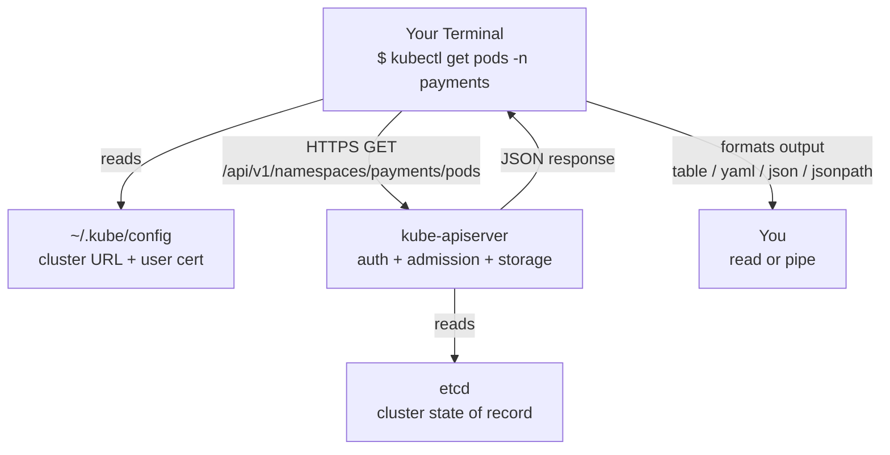
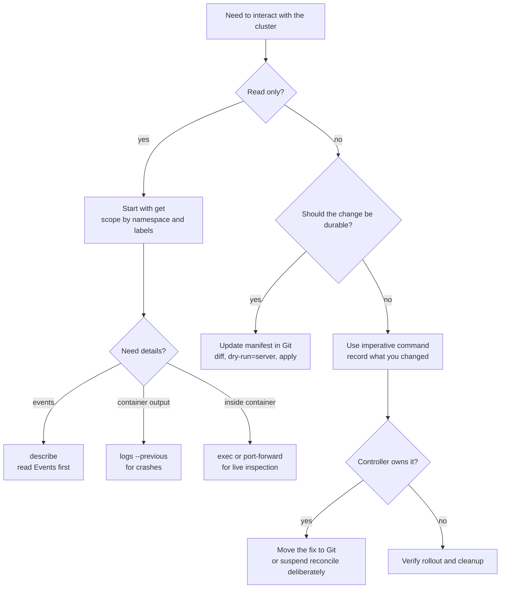

> **Складність**: `[MEDIUM]` - Основні команди для опанування.
>
> **Час на проходження**: 60-75 хвилин.
>
> **Передумови**: Модуль 1.1 (робочий кластер kind або minikube), базове знайомство з оболонкою Linux та бінарний файл `kubectl` у вашому `$PATH`, [який відповідає вашому кластеру Kubernetes 1.35+ з точністю до однієї мінорної версії](https://kubernetes.io/releases/version-skew-policy/).

---

## Що ви зможете зробити

Після завершення цього модуля ви зможете діагностувати, порівнювати, проектувати, оцінювати та впроваджувати практичні робочі процеси `kubectl` для кластера Kubernetes 1.35+:

- **Діагностувати** Pod, що не працює, від початку до кінця, поєднуючи команди `kubectl get`, `kubectl describe`, `kubectl logs --previous` та rollout, щоб визначити, чи пов'язаний збій із плануванням, завантаженням образу, готовністю або поведінкою під час виконання.
- **Порівняти** імперативні команди, декларативні маніфести та Server-Side Apply, а потім обґрунтувати, який робочий процес найкраще підходить для локального експерименту, спільних змін у середовищі staging або виробничого середовища GitOps.
- **Спроектувати** безпечний робочий процес для простору імен та контексту, який запобігає змінам у неправильному кластері завдяки використанню явних просторів імен, перевірці поточного контексту, серверному dry-run та відтворюваному очищенню.
- **Оцінити** формати виведення `kubectl get`, такі як `wide`, `yaml`, `json`, `jsonpath` та `custom-columns`, щоб скрипти могли отримувати стабільні поля замість використання grep на таблицях, призначених для людей.
- **Впровадити** повний початковий операційний цикл: створити простір імен, розгорнути робочі навантаження, перевірити належність ресурсів, зламати та відновити rollout образу, налаштувати тунель для трафіку за допомогою `port-forward` та повністю видалити лабораторне середовище.


## Чому це важливо

Гіпотетичний сценарій: початок інциденту, власник сервісу повідомляє, що API оформлення замовлення (checkout API) у середовищі staging не відповідає, і єдиний спільний факт у чаті — "схоже, Kubernetes зламався". У вас є термінал, kubeconfig та кілька можливих рівнів збою між вашим ноутбуком і застосунком: API-сервер може бути недоступним, простір імен може бути неправильним, Deployment міг не створити жодного pods, pods могли не призначитися на вузол (unscheduled), образ може не завантажитися, або застосунок може аварійно завершувати роботу (crash) після запуску. Досвідчений користувач `kubectl` не вгадує. Він перетворює кластер на джерело доказів, виконуючи команди лише для читання (read-only) одну за одною, доки збій не отримає ім'я.

Ця дисципліна важлива, оскільки `kubectl` — це щоденний інтерфейс керування для Kubernetes. Дашборди, GitOps-контролери, Helm, Kustomize та платформні портали мають значення, але людина-оператор усе одно звертається до `kubectl`, коли потрібно перевірити, що саме зберігає API-сервер і що контролери з цим роблять. Те саме сімейство команд може виконувати безпечне зчитування ресурсів (inventory), запускати переспрямування портів (port-forward), оновлювати образ або видаляти простір імен. Така потужність корисна лише в поєднанні зі звичками, які роблять кластер, простір імен, дієслово та формат виводу явними.

Цей модуль навчає командному інтерфейсу як робочому процесу, а не як списку для заучування. Ви почнете з ментальної моделі `kubectl` як типізованого HTTPS-клієнта, а потім попрактикуєте дієслова лише для читання, які відокремлюють загальний огляд ресурсів від детальної діагностики. Далі ви порівняєте імперативні та декларативні зміни, дізнаєтеся, як пробні запуски (dry-runs) та Server-Side Apply знижують ризик, і завершите практичною лабораторною роботою. У ній навмисно ламається розгортання (rollout), щоб ви могли полагодити його, використовуючи ту саму послідовність "спершу докази", яку ви застосовували б під час реальної роботи з підтримки.

## Ментальна модель: kubectl — це типізований клієнт API

Найкорисніше речення в цьому модулі є простим: [кожна команда `kubectl` перетворюється на запит до API-сервера Kubernetes](https://v1-35.docs.kubernetes.io/docs/concepts/overview/kubectl/). Бінарний файл на вашому ноутбуці читає kubeconfig, вибирає контекст, завантажує облікові дані, формує REST-запит, надсилає його через TLS і форматує відповідь. Він не призначає pods на вузли, не завантажує образи, не створює контейнери й не редагує etcd напряму. [Ці завдання належать API-серверу, контролерам, планувальнику (scheduler), kubelet і рівню зберігання](https://v1-35.docs.kubernetes.io/docs/concepts/overview/components/), саме тому команда, що завершилася з помилкою, часто вказує вам на один із цих компонентів, а не на сам CLI.

Потік даних нижче варто вивчити, оскільки він пояснює багато несподіванок для початківців. Якщо `kubectl get pods` каже, що сервер недоступний, ви спершу підозрюєте проблеми зі з'єднанням або kubeconfig, а не pods. Якщо `kubectl apply` відхиляється, хоча YAML виглядає правильно, причиною може бути контролер допуску (admission controller) або правило схеми на API-сервері. Якщо `kubectl logs` нічого не повертає для контейнера, який постійно перезапускається, поточний екземпляр контейнера може бути не тим, який аварійно завершив роботу. Вивід команди — це докази з розподіленої системи, а не просто текст у терміналі.



Дієслова регулярно зіставляються з поведінкою API. `kubectl get` — це запит на читання, `kubectl create` надсилає новий об'єкт, `kubectl apply` застосовує виправлення (patches) для бажаного стану, а `kubectl delete` просить API-сервер видалити об'єкт відповідно до правил видалення Kubernetes. Точна кінцева точка (endpoint) залежить від типу ресурсу та простору імен, але принцип залишається стабільним. Щойно ви починаєте розглядати CLI як клієнт API, різниця між перевіркою лише для читання та постійною зміною в кластері стає набагато зрозумілішою.

Ця ж модель також пояснює, чому вивід `kubectl` іноді відстає від вашого наміру. Коли ви створюєте Deployment, API-сервер швидко зберігає об'єкт Deployment, але це не означає, що pods уже запущені. Контролер Deployment має помітити новий об'єкт, створити ReplicaSet, контролер ReplicaSet має створити Pods, планувальник має призначити ці Pods на вузли, а kubelets повинні завантажити образи й запустити контейнери. Успішне виконання `kubectl apply` підтверджує, що бажаний стан було прийнято, а не те, що кожен наступний (downstream) контролер завершив свою роботу.

Цей поділ є однією з причин, чому команди Kubernetes часто йдуть парами: одна команда змінює бажаний стан, а інша — перевіряє стан, що спостерігається. `kubectl set image` може негайно оновити Deployment, але `kubectl rollout status` повідомляє вам, чи вдалося контролеру замінити старі pods на готові нові. `kubectl delete namespace` може негайно позначити простір імен для видалення, але `kubectl get namespace` пізніше покаже, чи завершилися виконання фіналізаторів (finalizers) та очищення. Ставтеся до успішного виконання команди як до початку перевірки, а не як до кінця оперативного мислення.

Тут є також практичний урок з безпеки. Оскільки `kubectl` спілкується з API-сервером використовуючи вашу ідентичність, [кожна команда підлягає автентифікації, авторизації та допуску (admission)](https://v1-35.docs.kubernetes.io/docs/concepts/security/controlling-access/). Кластер може дозволити вам зчитувати pods, блокуючи при цьому видалення, або дозволити створювати ConfigMaps, відхиляючи привілейовані pods за допомогою політики. Коли команду відхилено, не намагайтеся рефлекторно обійти це за допомогою потужніших облікових даних. Спершу визначте, чи не захищає політика кластер саме від тієї зміни, яку ви намагаєтеся зробити.

> **Зупиніться та подумайте:** якщо `kubectl` — це лише клієнт API, що відбувається, коли ваш kubeconfig вказує на здоровий кластер, але термін дії ваших облікових даних закінчився?
> **Відповідь:** кластер може продовжувати узгодження (reconciling), а pods можуть далі працювати, але ваша команда завершується з помилкою до зчитування об'єктів, оскільки в авторизації відмовлено.

Ця відмінність є операційно важливою, оскільки вона запобігає тому, щоб ви сприймали кожну помилку `kubectl` як простой (outage) застосунку.

## Анатомія команди та перевірка лише для читання

Більшість команд `kubectl` мають однакову форму: бінарний файл, дієслово, тип ресурсу, необов'язкове ім'я ресурсу та прапорці (flags). Дієслово вказує Kubernetes, яку саме дію API ви хочете виконати, тип вибирає колекцію ресурсів, ім'я звужує ціль до одного об'єкта, а прапорці уточнюють простір імен, вивід, фільтрацію, сортування або безпечну поведінку. Початківці часто сприймають поверхню команд як суцільну стіну особливих випадків, але структура достатньо стабільна, щоб ви могли інтуїтивно зрозуміти (infer) багато команд ще до того, як запам'ятаєте їх.

```text
kubectl    get        pods       nginx          -n web -o yaml
   |        |          |           |               |
 binary    verb       type        name          flags
 (HTTP    (HTTP      (REST     (resource    (namespace,
  client)  method:   path       identifier)   output, etc.)
            GET)     segment)
```

Дієслова лише для читання мають стати вашою точкою входу за замовчуванням, оскільки вони зменшують невизначеність без внесення змін до кластера. `kubectl get` відповідає на запитання "що існує та який його основний стан?", тоді як [`kubectl describe` відповідає на запитання "що повідомляє один об'єкт про свій статус, умови, власників і нещодавні події?"](https://v1-35.docs.kubernetes.io/docs/reference/kubectl/generated/kubectl_describe/). `kubectl explain` відповідає на інше запитання: "які поля підтримує цей тип ресурсу на цьому кластері?". Ви будете використовувати всі три команди в лабораторній роботі, і їхній порядок має значення, адже загальний огляд ресурсів не дасть вам змарнувати час на хибний об'єкт.

```bash
# What exists in this namespace?
# Show all pods in the current namespace.
kubectl get pods
# Show pods in all namespaces.
kubectl get pods -A
# Focus on a specific namespace.
kubectl get pods -n kube-system
# Add networking and node metadata.
kubectl get pods -o wide
# Inspect one full object as YAML.
kubectl get pod nginx -o yaml

# What's the state of this specific thing?
# Inspect pod status, owners, conditions, and Events.
kubectl describe pod nginx
# Inspect node-level status from the API object.
kubectl describe node kind-control-plane

# What fields does this resource even have?
# See the fields available on Pod containers.
kubectl explain pod.spec.containers
# Expand nested resource definitions recursively.
kubectl explain pod.spec.containers.resources --recursive
```

Розділ Events у нижній частині `kubectl describe` — це одна з найцінніших поверхонь для налагодження в Kubernetes. Pod у стані `Pending` може не мати можливості бути призначеним (unschedulable) через селектори вузлів, нестачу ресурсів, taints (обмеження) або проблеми з томами, і саме в списку Events планувальник і kubelet повідомляють про ці факти. Pod у стані `ImagePullBackOff` зазвичай має проблему з реєстром, обліковими даними або тегом, і список Events часто містить точне посилання на образ та клас помилки. Читання Events перед будь-яким перезапуском — це те, що відрізняє діагностику від сліпого натискання кнопок.

Звичка рухатися від загального до конкретного (broad-to-narrow) також захищає вас від згенерованих імен. Deployments створюють ReplicaSets, ReplicaSets створюють Pods, і ці дочірні об'єкти отримують імена з хешами та суфіксами, які немає сенсу запам'ятовувати. Селектор міток, як-от `-l app=web`, дозволяє вам перевірити пов'язані об'єкти без передчасного копіювання згенерованого імені pod з однієї команди в іншу. Як тільки проблемний об'єкт стає очевидним, тоді ви можете впевнено виконати describe або logs для цього конкретного pod.

Короткі імена ресурсів корисні, але вони не замінюють розуміння видів (kinds) ресурсів. [`kubectl api-resources` показує повний вид, назву в множині, короткі імена, групу API, охоплення простору імен (namespaced scope) та підтримувані дієслова](https://v1-35.docs.kubernetes.io/docs/reference/kubectl/generated/kubectl_api-resources/) для кожного ресурсу, який надає кластер. Її запуск на кластері зі встановленими контролерами може виявити визначення користувацьких ресурсів (Custom Resource Definitions) для сертифікатів, розгортань, резервних копій, політик або хмарних ресурсів. Цей крок виявлення має значення, оскільки `kubectl get pods` повідомляє лише про основні робочі навантаження, тоді як реальна платформа може формуватися багатьма користувацькими контролерами.

Простір імен за замовчуванням — це ще одна причина, чому команди читання можуть вводити в оману початківців. `kubectl get pods` без `-n` зчитує лише той простір імен, який налаштовано в поточному контексті, або `default`, якщо не налаштовано жодного. У локальній лабораторії це може бути нормально, але в спільному кластері здоровий застосунок може виглядати як зниклий. Коли запитання звучить "що працює будь-де?", починайте з `-A`; коли запитання "що не так у цьому просторі команди?", явно вказуйте простір імен.

Команду `kubectl explain` легко ігнорувати, доки вона вам не знадобиться, але потім вона стає постійною звичкою. [Вона зчитує інформацію про схему з API-сервера](https://v1-35.docs.kubernetes.io/docs/reference/kubectl/generated/kubectl_explain/), тому відповідь збігається з версією Kubernetes та Custom Resource Definitions, встановленими на кластері перед вами. Це означає, що ви можете запитати `kubectl explain deployment.spec.strategy --recursive` під час створення маніфесту й отримати карту полів, не залишаючи терміналу. Цей інструмент не є посібником, але він є точним словником для об'єктної моделі, яку ви редагуєте.

> **Зупиніться та подумайте:** перш ніж запустити `kubectl get all -n kube-system`, які об'єкти ви очікуєте побачити?
> **Відповідь:** `all` повертає відібраний набір загальних ресурсів робочого навантаження, а не всі Secret, ConfigMap, Role, ServiceAccount або CRD.

Він не включає кожен Secret, ConfigMap, Role, ServiceAccount, екземпляр CRD або об'єкт політики, тому це не команда для аудиту. Коли має значення повнота, запитуйте конкретні типи ресурсів, які вам потрібні, або використовуйте `kubectl api-resources`, щоб дізнатися, що підтримує кластер.


## Формати виводу, фільтрація та автоматизація

Стандартний вивід `kubectl get` створений для читання людиною в терміналі. Це робить його чудовим для швидкого ознайомлення і крихким для автоматизації. Скрипт, який передає стандартну таблицю в `grep`, залежить від розташування колонок, заголовків, інтервалів та випадкового тексту — усе це набагато менш стабільне, ніж базовий JSON-об'єкт. Kubernetes зберігає ресурси як типізовані об'єкти, і [`kubectl` може рендерити ці об'єкти у форматах YAML, JSON, проєкціях JSONPath або кастомних таблицях](https://v1-35.docs.kubernetes.io/docs/reference/kubectl/jsonpath/), коли вам потрібна точність.

```bash
# The five formats you will actually use.
# Human-scanned table.
kubectl get pods
# Extra context for quick triage.
kubectl get pods -o wide
# Full object for inspection.
kubectl get pod nginx -o yaml
# Exact JSON for script pipelines.
kubectl get pod nginx -o json | jq '.status.podIP'

# JSONPath: extract a single field
kubectl get pod nginx -o jsonpath='{.status.podIP}'

# JSONPath: extract a list
kubectl get pods -o jsonpath='{.items[*].metadata.name}'

# JSONPath: per-line output for shell loops
kubectl get pods -o jsonpath='{range .items[*]}{.metadata.name}{"\n"}{end}'

# Custom columns: tabular, scriptable, and readable
kubectl get pods -o custom-columns=NAME:.metadata.name,STATUS:.status.phase,NODE:.spec.nodeName
```

Використовуйте `-o wide`, коли вам потрібно трохи більше контексту без втрати читабельності, наприклад, IP-адреси Pod та імена вузлів. Використовуйте YAML, коли людині потрібно перевірити повний ресурс, і JSON, коли інструмент на кшталт `jq` буде його трансформувати. Використовуйте JSONPath, коли вам потрібні одне або два поля безпосередньо з об'єкта, особливо в сертифікаційних завданнях та циклах shell. Використовуйте custom-columns, коли ви хочете отримати стабільну таблицю, колонки якої вибрали ви, замість стандартного вигляду, який може приховувати важливе для вас поле.

Фільтрація заслуговує на таку саму увагу, як і форматування, оскільки місце, де відбувається фільтрація, змінює як коректність, так і продуктивність. [`--field-selector=status.phase=Pending` просить API-сервер повернути лише ті об'єкти, що збігаються з умовою](https://v1-35.docs.kubernetes.io/docs/concepts/overview/working-with-objects/field-selectors/), що є ефективним і дозволяє уникнути завантаження даних, які ви потім відкинете. Проєкція JSONPath відбувається на боці клієнта після того, як об'єкти отримані, що підходить для невеликих списків, але не замінює серверні селектори на великих кластерах. Label selectors (селектори міток) перебувають посередині: це серверні фільтри на основі метаданих, які команди навмисно проєктують для операційної роботи.

Сортування — ще одна недооцінена форма вилучення сигналу. `--sort-by=.metadata.creationTimestamp` допомагає вам знайти найстаріший завислий Pod, тоді як сортування за статусом або полем spec може зробити захаращений простір імен читабельним під час розслідування інциденту. Сортування все ще відбувається після того, як API-сервер повертає об'єкти, тому воно не замінює селектори, але перетворює довгий невідсортований список на історію. На практиці хороша команда часто поєднує всі три ідеї: вибрати правильні об'єкти, відсортувати список у зручному порядку та спроєктувати лише ті поля, які потрібні наступній людині або скрипту.

Будьте обережні з виводом, який здається стабільним лише тому, що ваш поточний кластер невеликий. Стандартна таблиця Pod може здаватися легкою для парсингу, коли є три Pod, короткі імена і жодних рестартів, але та сама команда стає крихкою, коли імена переносяться на нові рядки, статуси містять довгі причини або задіяно кілька просторів імен. Машинно-читаний вивід — це не надмірне ускладнення для shell-скрипта; це різниця між запитом до API про конкретне поле та сподіванням, що макет вашого термінала поведе себе правильно. Чим важливіша автоматизація, тим менше вона має залежати від того, як людська таблиця виглядає саме сьогодні.

Діалект JSONPath у `kubectl` є корисним, але це не повноцінна мова обробки даних. Для простих проєкцій, таких як імена, IP-адреси, образи та призначення на вузли, він є швидким та портативним. Для групування, об'єднань (joins), арифметики або складних фільтрів передавайте JSON у `jq` і робіть трансформацію явною. Основне правило легко запам'ятати: селектори зменшують набір об'єктів, JSONPath витягує поля, а `jq` виконує багатші перетворення, коли shell-однорядковику потрібно більше логіки.

Вибір виводу також впливає на те, наскільки добре колеги зможуть перевірити вашу роботу. Коментар у тікеті на кшталт "Pod'и зламалися" є слабким доказом, тоді як команда плюс точний вивід кажуть наступному інженеру, що саме ви побачили. Наприклад, `kubectl get pods -n staging -l app=web -o custom-columns=NAME:.metadata.name,STATUS:.status.phase,NODE:.spec.nodeName` є водночас читабельним і відтворюваним. Це дає достатньо контексту для рев'ю, не вивалюючи повний об'єкт YAML, наповнений непов'язаними полями.

## Імперативний, декларативний та Server-Side Apply

[Ви можете створювати об'єкти Kubernetes імперативно або декларативно](https://v1-35.docs.kubernetes.io/docs/tasks/manage-kubernetes-objects/), і різниця між ними більша, ніж просто синтаксис. Імперативні команди наказують кластеру виконати одну дію прямо зараз: запустити цей Pod, створити цей Deployment, відкрити (expose) цей Service, відмасштабувати це навантаження. Декларативні робочі процеси описують бажаний кінцевий стан у маніфесті та дозволяють API-серверу й контролерам узгоджувати систему до цього стану. Обидва стилі є правомірними, але вони належать до різних експлуатаційних ситуацій.

```bash
# Imperative: fast, ephemeral, and useful for practice or one-off debugging
kubectl run nginx --image=nginx:1.27.0
kubectl create deployment web --image=httpd:2.4 --replicas=3
kubectl expose deployment web --port=80 --target-port=80
kubectl scale deployment web --replicas=5

# Declarative: slower to write, but reviewable and repeatable
kubectl apply -f deployment.yaml
kubectl apply -f .
kubectl apply -f https://example.com/app.yaml
kubectl apply -f deployment.yaml --server-side

# The bridge: generate YAML imperatively, then commit it
kubectl create deployment web --image=httpd:2.4 --replicas=3 \
  --dry-run=client -o yaml > deployment.yaml
```

Команда-місток в останньому рядку — це практична відповідь на поширений страх новачків: ніхто не очікує, що ви будете писати кожен маніфест Deployment по пам'яті. [`--dry-run=client -o yaml` просить клієнт побудувати об'єкт, який він би відправив, вивести його як YAML і зупинитися перед зверненням до API-сервера](https://v1-35.docs.kubernetes.io/docs/reference/kubectl/generated/kubectl_create/kubectl_create_deployment/). Ви отримуєте правильну структуру, відступи, версію API та обов'язкові поля, а потім редагуєте результат і ставитеся до файлу як до вихідного матеріалу. Цей робочий процес є швидшим і безпечнішим, ніж копіювання застарілого маніфесту з випадкового результату пошуку.

Імперативні команди все ще мають своє законне місце. Під час іспиту, одноразової лабораторної роботи або швидкої діагностичної сесії `kubectl run` і `kubectl create deployment` допомагають вам швидко створити відомий об'єкт, а потім дослідити, як Kubernetes його представляє. Небезпека починається тоді, коли тимчасова команда стає незадокументованим станом продакшену. Якщо інший інженер не може знайти бажаний стан у Git, він не може провести його рев'ю, відтворити в іншому середовищі або зрозуміти, чому живий кластер відрізняється від задекларованої системи.

Декларативні маніфести мають власні сценарії відмов, тому урок полягає не в тому, що YAML автоматично є безпечним. Маніфест усе ще може бути неправильним, занадто широким, скопійованим зі старої версії API або застосованим до неправильного контексту. Що дають вам декларативні робочі процеси, так це стабільний артефакт, який можна переглянути, протестувати, порівняти (diff) та застосувати повторно. Саме завдяки цій поверхні для перевірок у продакшені Kubernetes робота з маніфестами зазвичай розглядається як робота з кодом, а не як залишки роботи в терміналі.

```yaml
apiVersion: apps/v1
kind: Deployment
metadata:
  name: web
spec:
  replicas: 3
  selector:
    matchLabels:
      app: web
  template:
    metadata:
      labels:
        app: web
    spec:
      containers:
        - name: web
          image: httpd:2.4
```

Декларативні робочі процеси також уможливлюють рев'ю та відкати (rollback). Маніфест у Git можна обговорити в pull request, порівняти з живим станом за допомогою `kubectl diff`, застосовувати багаторазово без зміни цільового результату, а також відновити після випадкового ручного редагування. Імперативна команда може бути доречною під час лабораторної або надзвичайної ситуації, але якщо зміна має пережити вашу сесію в терміналі, вона повинна стати зміною маніфесту. Кластер не повинен залежати від того, що хтось пам'ятає, що він вводив минулої середи.

Слово «ідемпотентний» тут є корисним, оскільки воно описує властивість, яку ви хочете бачити в операційній роботі. Якщо повторне застосування одного й того ж маніфесту має такий самий очікуваний результат, як і одноразове, тоді повторні спроби (retries) менш страшні, а автоматизація стає простішою. Імперативні команди можуть бути безпечними, коли вони доступні лише для читання (read-only) або є тимчасовими, але довговічна інфраструктура виграє від дій, які можна передбачувано повторювати. Це одна з причин, чому системи GitOps будуються навколо задекларованого бажаного стану, а не навколо логів людських команд.

Server-Side Apply — це сучасна форма цієї ідеї для спільних ресурсів. Традиційний клієнтський apply покладається на локальне порівняння (diffing) та анотацію, яка відстежує останню застосовану конфігурацію, що може стати незручним, коли контролери, admission webhooks та люди модифікують різні поля. [Server-Side Apply переносить злиття (merge) та відстеження володіння полями на API-сервер, де конфлікти можуть бути виявлені явно](https://v1-35.docs.kubernetes.io/docs/reference/using-api/server-side-apply/). Коли декілька акторів керують одним об'єктом, явний конфлікт краще за непомітне перезаписування.

Володіння полями (field ownership) може звучати абстрактно, поки ви не уявите двох акторів, які редагують один і той самий Deployment. Людина може володіти тегом образу, rollout controller може володіти полями стратегії, autoscaler може впливати на репліки, а admission webhook може додавати мітки або значення за замовчуванням. Server-Side Apply дозволяє API-серверу запам'ятовувати, який менеджер полів останнім заявив про право власності на поле, тому про конфліктну зміну можна повідомити замість того, щоб тихо замінювати чийсь намір. Для новачка практичний висновок простий: віддавайте перевагу серверним прев'ю і будьте обережні, коли кілька інструментів керують одним об'єктом.

Зупиніться та подумайте: ви використовуєте `kubectl scale deployment web --replicas=5` під час сплеску навантаження, але ваш GitOps-контролер усе ще має `replicas: 3` у Git. Що станеться під час наступного узгодження (reconciliation)? [Контролер повертає живий об'єкт назад до задекларованого значення, оскільки Git є його джерелом істини](https://raw.githubusercontent.com/open-gitops/documents/main/PRINCIPLES.md). Правильним рішенням буде оновити маніфест, використати autoscaler або навмисно призупинити узгодження із задокументованим планом, а не продовжувати повторювати ручну команду масштабування.


## Безпечні зміни, видалення та керування контекстом

Зміна активного об'єкта в Kubernetes — це не одна операція, а набір варіантів із різними профілями ризику. `kubectl apply` оновлює об'єкт із файлу, `kubectl edit` відкриває активний об'єкт у вашому редакторі, `kubectl patch` надсилає цільовий патч, а `kubectl set image` змінює типове поле, не змушуючи вас писати JSON власноруч. Безпечний вибір залежить від того, чи є зміна довготривалою, перевіреною, автоматизованою, чи це тимчасове втручання під час діагностики.

```bash
# The four ways to change a live resource
kubectl apply -f updated-deployment.yaml
kubectl edit deployment web
kubectl patch deployment web -p '{"spec":{"replicas":3}}'
kubectl set image deployment/web web=nginx:1.27.0

# Scaling
kubectl scale deployment web --replicas=5
kubectl scale deployment web --replicas=5 --current-replicas=3

# Annotation and label tweaks
kubectl label pod nginx env=prod
kubectl annotate pod nginx owner=team-payments
```

Видалення заслуговує на особливу увагу, оскільки [видалення в Kubernetes — це скоординований процес, а не просто вилучення з бази даних](https://v1-35.docs.kubernetes.io/docs/reference/kubectl/generated/kubectl_delete/). Звичайне видалення Pod встановлює мітку часу видалення, дозволяє kubelet надіслати `SIGTERM`, чекає на пільговий період (grace period), а потім завершує вилучення, коли очищення виконано. Примусове видалення (force deletion) пропускає важливі частини цієї координації з погляду API-сервера. Якщо вузол дійсно зник, примусове видалення може бути необхідним; якщо вузол справний, а фіналізатор (finalizer) завис, примусове видалення може приховати об'єкт, залишивши базову проблему неочищеною.

```bash
# Graceful deletion is the default
kubectl delete pod nginx
kubectl delete -f deployment.yaml

# Bulk deletion within a namespace
kubectl delete pods --all -n test
kubectl delete pods -l app=stale-experiment

# The high-risk escape hatch, only after diagnosis
kubectl delete pod nginx --grace-period=0 --force

# The safer node-level workflow before planned maintenance
kubectl drain kind-worker --ignore-daemonsets --delete-emptydir-data
```

Зміни не в тій цілі — це помилка новачків, якої досі бояться досвідчені інженери. [Контекст об'єднує кластер, користувача та типовий простір імен](https://v1-35.docs.kubernetes.io/docs/concepts/configuration/organize-cluster-access-kubeconfig/); ваш активний контекст визначає, куди піде наступна команда. Простір імен звужує роботу в межах одного кластера, але він не захищає вас від використання неправильного кластера. Для будь-якої деструктивної або довготривалої зміни зробіть ціль видимою перед виконанням команди та вказуйте простори імен явно, доки не переконаєтеся, що оболонка налаштована правильно.

Існує два поширені стилі для безпеки контексту. Деякі інженери використовують один об'єднаний kubeconfig з багатьма контекстами та покладаються на візуальні підказки, явний параметр `--context` та обережне перемикання. Інші зберігають окремі файли kubeconfig для кожного середовища і встановлюють `KUBECONFIG` для кожного сеансу термінала, щоб робоча (production) оболонка та локальна оболонка не мали спільного змінного стану контексту. Обидва варіанти є робочими, але другий стиль зменшує кількість випадкових перемикань, оскільки зміна кластера стає свідомою дією з відкриття або налаштування оболонки, а не просто завченою командою.

Типові простори імен корисні для сфокусованої роботи, але вони не повинні приховувати ціль від вас. Встановлення типового простору імен для практичних занять економить час на друкування та робить приклади чистішими, тоді як використання явних прапорців `-n` у ранбуках (runbooks) та скриптах робить ціль очевидною для тих, хто перевіряє код. Хорошим компромісом є встановлення простору імен під час інтерактивної лабораторної роботи та збереження явних просторів імен у всьому, що копіюється в документацію, автоматизацію або нотатки про інциденти. Таким чином зручність залишається локальною, а довготривалий запис залишається чітким.

```bash
# Namespace operations
kubectl get namespaces
kubectl create namespace payments-staging
kubectl get pods -n payments-staging
kubectl get pods --all-namespaces
kubectl config set-context --current --namespace=payments-staging

# Context operations: clusters, users, and default namespace
kubectl config get-contexts
kubectl config current-context
kubectl config use-context kind-kind
```

[Файл kubeconfig — це документ `Config`, який пов'язує іменовані кластери, іменованих користувачів, іменовані контексти та один `current-context`](https://v1-35.docs.kubernetes.io/docs/concepts/configuration/organize-cluster-access-kubeconfig/). Контекст є точкою ухвалення рішення, оскільки він обирає як кластер, так і облікові дані, а також може містити типовий простір імен. Це означає, що перемикання простору імен — це не просто косметичний стан у вашій оболонці; воно змінює ціль для кожної наступної команди, яка пропускає `-n`. [`kubectl config` — це сімейство команд для читання та оновлення цього локального стану націлювання](https://v1-35.docs.kubernetes.io/docs/reference/kubectl/generated/kubectl_config/), тому ставтеся до нього як до частини робочого процесу безпеки, а не як до налаштування, яке ви робите один раз і забуваєте.

```yaml
apiVersion: v1
kind: Config
clusters:
  - name: kind-kind
    cluster:
      server: https://127.0.0.1:6443
      certificate-authority-data: REDACTED
users:
  - name: kind-kind
    user:
      client-certificate-data: REDACTED
      client-key-data: REDACTED
contexts:
  - name: kind-kind
    context:
      cluster: kind-kind
      user: kind-kind
      namespace: kubectl-practice
current-context: kind-kind
```

Читайте цю структуру знизу вгору, коли збираєтеся щось змінити. `current-context` вказує на назву контексту, контекст вказує на один кластер і одного користувача, а необов'язковий простір імен визначає типову область дії. Якщо контекст вказує на правильний локальний кластер, але простір імен вказує на вчорашній практичний простір імен, команда може завершитися невдало без жодної шкоди. Якщо контекст вказує на неправильний кластер з дійсними обліковими даними для робочого середовища, API-сервер може прийняти деструктивну команду. Саме тому обережний оператор перевіряє контекст перед зміною і все одно явно пише `-n` у командах, які будуть скопійовані в ранбук.

Холості запуски (dry-runs) і порівняння (diffs) дають вам безпечніші способи запитати «що станеться?», перш ніж ви зміните спільний стан. Клієнтський dry-run перевіряє, що локальний клієнт може побудувати без звернення до API-сервера. [Серверний dry-run надсилає запит через автентифікацію, авторизацію, перевірку схеми, встановлення типових значень (defaulting) і допуск (admission), а потім скасовує запис](https://v1-35.docs.kubernetes.io/docs/reference/kubectl/generated/kubectl_apply/). [`kubectl diff` ґрунтується на цьому серверному шляху, щоб показати уніфіковану різницю (unified diff) між активним станом і маніфестом, який ви плануєте застосувати](https://v1-35.docs.kubernetes.io/docs/reference/kubectl/generated/kubectl_diff/).

Результат dry-run все одно може бути неправильно зрозумілий, якщо ви забудете, який рівень виконав перевірку. Клієнтський dry-run чудово підходить для швидкої генерації початкового YAML або виявлення очевидних локальних проблем конструювання, але він не може знати про квоти, політики перевірки, вебхуки допуску (admission webhooks) або ресурси, які вже існують у кластері. Серверний dry-run повільніший, оскільки він взаємодіє з API-сервером, проте він дає більш точну відповідь для спільних середовищ. Обирайте попередній перегляд, який відповідає ризику зміни.

Видалення має схоже запитання: «який рівень цим володіє?». Якщо Pod має посилання на власника (owner reference), що вказує на ReplicaSet, видалення Pod не змінює бажаної кількості реплік Deployment, тому з'являється заміна. Якщо простір імен містить ресурси з фіналізаторами, [видалення простору імен запускає очищення, але не завершується, доки ці фіналізатори не закінчать роботу](https://v1-35.docs.kubernetes.io/docs/concepts/overview/working-with-objects/finalizers/). В обох випадках несподівана поведінка стає передбачуваною, щойно ви запитаєте, який контролер досі узгоджує бажаний стан.

```bash
# The two safety previews to learn early
kubectl apply -f deployment.yaml --dry-run=client
kubectl apply -f deployment.yaml --dry-run=server

# A high-signal production preview
kubectl diff -f deployment.yaml

# The debugging escape hatch for seeing client-server traffic
kubectl get pods --v=8 2>&1 | grep -E 'curl|http'
```

Який підхід ви б обрали тут і чому: редагування робочого Deployment наживо за допомогою `kubectl edit`, чи зміну маніфесту, виконання `kubectl diff` і застосування після перевірки? Живе редагування може здаватися швидшим, але воно створює незадокументоване відхилення (drift), яке контролер GitOps може скасувати. Робочий процес із маніфестом вимагає більше формальностей, оскільки він зберігає рішення там, де команда може його переглянути та повторити.

Найбезпечніші оператори — це не ті, хто ніколи не вводить деструктивних команд. Це ті, хто робить деструктивні команди нудними, перевіряючи контекст, звужуючи область дії, роблячи попередній перегляд, коли це можливо, і перевіряючи результати згодом. Таке мислення масштабується, тому що кожна наступна тема Kubernetes, від Service до RBAC і сховищ (storage), все одно проходить через ті самі ворота API-сервера. Якщо ви виробите звичку тут, майбутні модулі здаватимуться новими типами ресурсів, накладеними на знайомий робочий цикл, а не абсолютно новими способами роботи.


## Робочий процес налагодження та практичний приклад

Повсякденне налагодження Kubernetes зазвичай спирається на невеликий набір команд, а не на енциклопедичне вивчення CLI. `kubectl logs` дає відповідь на те, що контейнер вивів у stdout та stderr. [`kubectl exec` дозволяє виконати команду всередині контейнера](https://v1-35.docs.kubernetes.io/docs/reference/kubectl/generated/kubectl_exec/), коли образ містить потрібні вам інструменти. [`kubectl port-forward` створює тимчасовий локальний тунель через сервер API](https://v1-35.docs.kubernetes.io/docs/reference/kubectl/generated/kubectl_port-forward/), щоб ви могли підключитися до внутрішнього об'єкта Pod або Service без відкриття публічного доступу до нього.

```bash
# Logs: the first thing to check when an app misbehaves.
kubectl logs nginx # current container output
kubectl logs nginx -f # follow output while behavior evolves
kubectl logs nginx --tail=200 # inspect recent history
kubectl logs nginx --since=10m # focus on the last 10 minutes
kubectl logs nginx -c sidecar # inspect sidecar container logs
kubectl logs nginx --previous # inspect terminated instance logs
kubectl logs -l app=web --tail=50 # combine pod selector with latest logs

# Exec: run a command inside the container.
kubectl exec nginx -- ls /etc/nginx
# Open an interactive shell when available.
kubectl exec -it nginx -- sh
# Run shell against a specific container.
kubectl exec -it nginx -c sidecar -- sh

# Debug: add a purpose-built troubleshooting container
kubectl debug -it pod/nginx --image=busybox:1.36 --target=nginx -- sh
kubectl debug node/kind-worker -it --image=busybox:1.36

# Copy: move a known file in or out when the image supports tar
kubectl cp nginx:/etc/nginx/nginx.conf ./nginx.conf
kubectl cp ./index.html nginx:/usr/share/nginx/html/index.html

# Port-forward: tunnel a local port to a pod, service, or deployment
# Validate pod-level reachability.
kubectl port-forward pod/nginx 8080:80
# Validate service-level reachability.
kubectl port-forward svc/api 9090:80
# Validate deployment-level reachability.
kubectl port-forward deploy/web 8080:80

# Proxy: open a local authenticated path to the Kubernetes API
kubectl proxy --port=8001
curl -s http://127.0.0.1:8001/api/v1/namespaces/kubectl-practice/pods
```

Прапорець `--previous` є важливою деталлю під час розслідування `CrashLoopBackOff`. Коли контейнер аварійно завершує роботу, kubelet запускає новий екземпляр контейнера, якщо це дозволяє політика перезапуску. Звичайна команда `kubectl logs` зчитує поточний екземпляр, який може містити лише стартовий банер, оскільки він ще не дійшов до рядка з помилкою. [`kubectl logs --previous` зчитує завершений екземпляр](https://v1-35.docs.kubernetes.io/docs/reference/kubectl/generated/kubectl_logs/), де найчастіше і з'являється трасування стека (stack trace), паніка, відсутня змінна середовища або фатальна помилка конфігурації.

Журнали — це лише один із сигналів, і відсутність журналів не означає відсутність збою. Контейнер може вийти з ладу ще до того, як застосунок ініціалізує журналювання, його може примусово завершити ядро через брак пам'яті (memory pressure), він може не пройти перевірку життєздатності (liveness probe) або взагалі не запуститися через те, що образ неможливо завантажити. Саме тому надійна послідовність виглядає так: `get` для статусу, `describe` для подій та останнього стану, а потім `logs --previous`, коли історія об'єкта вказує на те, що контейнер дійсно був запущений і завершив роботу. Кожен крок відповідає на інше запитання, тому пропуск хоча б одного з них може призвести до хибного висновку.

Журнали на основі міток (labels) є корисними, коли Deployment має кілька реплік. Команда `kubectl logs -l app=web --tail=50` може показати нещодавній вивід з усіх відповідних об'єктів Pod, що зручно, коли запит, який викликав помилку, міг потрапити на будь-яку з реплік. Для глибшого аналізу журналів команди, що працюють із робочими середовищами (production), зазвичай покладаються на централізоване журналювання, але пряма команда `kubectl` все ще залишається цінною під час локальних лабораторних робіт, у нових кластерах і у випадках, коли сам конвеєр журналювання є частиною проблеми. Використовуйте її як інструмент швидкого реагування, а не як заміну для надійної системи спостережуваності (observability).

Команда `kubectl exec` є потужною, але не гарантує результату. Багато робочих образів є навмисно мінімалістичними, і [образ типу distroless може не містити `sh`, `bash`, `curl`, `ps` або менеджерів пакетів](https://github.com/GoogleContainerTools/distroless). Коли це трапляється, збій виконання команди не є доказом того, що Pod зламаний; це лише означає, що в образі немає оболонки (shell) для запуску. Подальші модулі з налагодження Kubernetes розглядають ефемерні контейнери для налагодження, але для цього базового модуля урок простіший: використовуйте `exec`, коли інструмент наявний, і не плутайте відсутню оболонку зі збоєм самого застосунку.

[`kubectl debug` є кращим рішенням, коли цільовий контейнер не містить потрібних вам інструментів, оскільки ця команда запускає процес налагодження замість того, щоб припускати, що образ застосунку також є набором інструментів](https://v1-35.docs.kubernetes.io/docs/reference/kubectl/generated/kubectl_debug/). У локальному середовищі виконати `exec` у nginx за допомогою `sh` цілком нормально, адже мета полягає в тому, щоб перевірити процес зсередини відомого образу. Під час діагностики в робочому середовищі (production) віддавайте перевагу контейнеру для налагодження або скопійованому об'єкту Pod, коли вам потрібні мережеві інструменти, утиліти для роботи з процесами або оболонка, яку навмисно виключено з образу застосунку. Рішення оператора зводиться до якості доказів: обирайте найменш інвазивну команду, яка може дати відповідь на запитання без перезапису робочого навантаження, яке ви досліджуєте.

[`kubectl cp` копіює файли між вашою машиною та контейнером, а в офіційній документації міститься чітке попередження про те, що образ контейнера повинен містити `tar`](https://v1-35.docs.kubernetes.io/docs/reference/kubectl/generated/kubectl_cp/). Копіювання відомого файлу конфігурації з лабораторного об'єкта Pod може бути корисним, але копіювання нових інструментів у підозрілий контейнер у робочому середовищі змінює поверхню доказів і може створити хибне враження, що образ був розроблений для інтерактивного відновлення. Якщо завдання полягає у збереженні фактів, зробіть знімок (snapshot) об'єктів Kubernetes, журналів та томів (volumes) перед тим, як змінювати файли. Якщо ж це контрольоване лабораторне перенесення даних, переконайтеся, що цільовий образ підтримує потрібний інструмент архівування, і обмежуйте шлях копіювання.

Переадресація портів (port-forwarding) є не менш корисною, оскільки вона створює тимчасову доступність без зміни публічної поверхні кластера. Трафік проходить через ваше автентифіковане підключення до сервера API, а це означає, що тунель зникає, щойно завершується виконання вашої команди. Це робить її ідеальним варіантом для перевірки внутрішньої панелі адміністратора через локальний браузер, тестування об'єкта Service перед додаванням Ingress або для підключення локального клієнта до бази даних під час короткого дослідження. Це не є шаблоном доступу для робочих середовищ (production), оскільки такий підхід залежить від сеансу термінала користувача та ігнорує стандартну архітектуру відкриття доступу до сервісів (service exposure).

[`kubectl proxy` розв'язує іншу проблему, порівняно з `port-forward`: ця команда запускає локальний проксі до сервера API Kubernetes, а не до об'єкта Service вашого застосунку](https://v1-35.docs.kubernetes.io/docs/reference/kubectl/generated/kubectl_proxy/). Використовуйте її, коли вам потрібно дослідити шляхи API, протестувати запит до API з локального інструмента або зрозуміти, що клієнт (наприклад, панель керування) запитує в сервера API. Не використовуйте її як швидкий спосіб доступу до застосунку, оскільки вона відкриває поверхню API через ваш локальний автентифікований сеанс і може зробити небезпечну URL-адресу схожою на звичайну кінцеву точку локального вебсервера. Коли стоїть запитання "чи може мій застосунок приймати HTTP-трафік?", обирайте `port-forward`; коли ж запитання звучить як "що повертає API Kubernetes для цього шляху до ресурсу?", обирайте `proxy`.

Сценарій вправи: колега повідомляє, що `web-frontend` у просторі імен `staging` не відповідає після розгортання. Ви ніколи раніше не бачили це робоче навантаження (workload), тому починаєте з перевірки цільового кластера перед тим, як переглядати ресурси. Це не є марною тратою часу; це запобіжний захід від застосування правильної команди в неправильному місці. Це також фіксує перший факт у вашому розслідуванні: з якого кластера отримано ваші докази.

```bash
$ kubectl config current-context
kind-staging
```

Тепер скористайтеся широким запитом на читання, щоб перевірити пов'язані об'єкти Pod, Deployment та Service разом. Селектор міток є важливим, оскільки він звужує область пошуку, не вимагаючи від вас заздалегідь знати згенеровані імена ReplicaSet або Pod. Починати з `describe` для випадкового імені об'єкта Pod було б повільніше і частіше призводило б до помилок, оскільки це передбачає, що ви вже знаєте, де саме сталася несправність.

```bash
$ kubectl get pods,deploy,svc -n staging -l app=web-frontend
NAME                                READY   STATUS              RESTARTS   AGE
pod/web-frontend-6c5f9b7d8-2xqpk    0/1     ImagePullBackOff    0          11m
pod/web-frontend-6c5f9b7d8-9xsvm    0/1     ImagePullBackOff    0          11m
pod/web-frontend-6c5f9b7d8-fpvtd    0/1     ImagePullBackOff    0          11m

NAME                            READY   UP-TO-DATE   AVAILABLE   AGE
deployment.apps/web-frontend    0/3     3            0           11m

NAME                    TYPE        CLUSTER-IP      EXTERNAL-IP   PORT(S)
service/web-frontend    ClusterIP   10.96.142.18    <none>        80/TCP
```

Ця таблиця вже розкриває корисну інформацію. Об'єкт Deployment існує і створив три об'єкти Pod, отже контролер активний. Об'єкт Service також існує, але він не може обслуговувати трафік, оскільки жоден Pod не готовий. Кожен Pod перебуває у стані `ImagePullBackOff`, що вказує не на код застосунку, а на ім'я образу, тег, облікові дані, доступ до реєстру або на поведінку вузла під час завантаження образу. Тепер однієї команди `describe` для одного проблемного об'єкта Pod має бути достатньо, щоб підтвердити точну причину.

```bash
$ kubectl describe pod web-frontend-6c5f9b7d8-2xqpk -n staging
[... lots of output above ...]
Events:
  Type     Reason     Age                From     Message
  ----     ------     ----               ----     -------
  Normal   Scheduled  11m                default  Successfully assigned staging/...
  Normal   Pulling    9m (x4 over 11m)   kubelet  Pulling image "myregistry.local/web-frontend:v2.1.0"
  Warning  Failed     9m (x4 over 11m)   kubelet  Failed to pull image: rpc error: code = NotFound
                                                   desc = manifest for myregistry.local/web-frontend:v2.1.0 not found
  Warning  Failed     9m (x4 over 11m)   kubelet  Error: ErrImagePull
  Normal   BackOff    1m (x12 over 11m)  kubelet  Back-off pulling image
```

Події роблять причину збою конкретною: запитаного тегу образу не існує. Це означає, що Pod було заплановано, kubelet спробував завантажити образ, а реєстр повернув відповідь "не знайдено" (not-found). Ви можете підтвердити запитаний образ об'єкта Deployment за допомогою JSONPath — це точне вилучення поля замість ручного перегляду довгого YAML-об'єкта. Це також той тип команди, який ви можете вставити в тікет (ticket), оскільки вона показує, що саме Kubernetes намагається запустити.

```bash
$ kubectl get deployment web-frontend -n staging -o jsonpath='{.spec.template.spec.containers[*].image}'
myregistry.local/web-frontend:v2.1.0
```

Для швидкого виправлення можна використати `kubectl set image`, якщо ви працюєте в лабораторному (lab) або підготовчому (staging) середовищі і вам потрібно оперативно перевірити діагноз. Однак надійне виправлення має обов'язково бути зміною маніфесту в Git, інакше наступна декларативна синхронізація (reconcile) може відновити неправильний тег образу. Зверніть увагу, як послідовність команд перевіряє завершення розгортання (rollout), а не просто припускає, що застосунок працює коректно лише тому, що API прийняв команду.

```bash
$ kubectl set image deployment/web-frontend -n staging web-frontend=myregistry.local/web-frontend:v2.0.9
deployment.apps/web-frontend image updated

$ kubectl rollout status deployment/web-frontend -n staging
Waiting for deployment "web-frontend" rollout to finish: 1 of 3 updated replicas are available...
deployment "web-frontend" successfully rolled out

$ kubectl get pods -n staging -l app=web-frontend
NAME                              READY   STATUS    RESTARTS   AGE
web-frontend-7d4c8f6b9-abc12      1/1     Running   0          45s
web-frontend-7d4c8f6b9-def34      1/1     Running   0          40s
web-frontend-7d4c8f6b9-ghi56      1/1     Running   0          35s
```

Ланцюжок міркувань — це найцінніший актив, який варто винести з цього практичного прикладу. Ви перевірили контекст, звузили область пошуку за простором імен та міткою, зчитали загальний стан, оглянули події, вилучили точне поле, змінили одну деталь і перевірили розгортання. Ця послідовність може повторюватися для помилок образів, збоїв перевірок готовності (readiness probes), циклічних перезапусків (crash loops) і багатьох проблем із маршрутизацією сервісів. Команди можуть дещо відрізнятися, але звичка переходити від безпечного збору доказів до точкових змін — це навичка, яку можна застосувати в будь-якій ситуації.

Якби в тому ж прикладі об'єкти Pod мали статус `Running`, але не було жодного готового endpoint'а, наступний крок був би іншим. Ви б досліджували перевірки готовності (readiness probes), селектори об'єкта Service та зрізи кінцевих точок (endpoint slices), а не теги образів. Якби об'єкти Pod перебували у стані `Pending`, ви б аналізували події планування (scheduling events) та ресурси вузлів. Якби об'єкти Pod були готові, але користувачі все одно бачили помилки, ви могли б налаштувати переадресацію портів (port-forward) до об'єкта Service і порівняти поведінку всередині кластера із зовнішньою маршрутизацією. Робочий процес `kubectl` не зводить кожен інцидент до однієї відповіді; він дає вам дисциплінований спосіб вибрати наступне правильне запитання.


## Патерни та антипатерни

Вільне володіння `kubectl` — це не стільки запам'ятовування кожної підкоманди, скільки вибір стабільних патернів роботи в умовах стресу. Хороший патерн звужує невизначеність без збільшення ризику: підтвердити ціль, зчитати загальний стан, заглибитися в одного підозрюваного, попередньо переглянути зміни, а потім перевірити результат. У тестовому кластері ці дії можуть здаватися повільними, але вони стають швидшими за вгадування, щойно простір імен починає містити багато контролерів, згенерованих імен та часткових збоїв.

Наведені нижче патерни свідомо поєднують технічні команди з людським робочим процесом. Перевірка контексту — це не просто трюк CLI; це спосіб зробити радіус ураження видимим ще до початку дій. Згенеровані маніфести — це не просто швидший спосіб написання YAML; це спосіб перейти від приватної термінальної сесії до артефакту, який можна відрецензувати. Валідація на боці сервера — це не просто прапорець; це спосіб попросити той самий API-сервер, який впроваджуватиме реальні зміни, спершу оцінити ваш план.

| Патерн | Коли використовувати | Чому це працює | Міркування щодо масштабування |
|---|---|---|---|
| Перевірка безпеки контексту насамперед | Будь-яка команда може видалити, перезаписати або відкрити доступ до ресурсу. | Це виявляє застарілий стан kubeconfig до того, як API-сервер виконає хибний запит. | Додайте поточний контекст та простір імен до підказки командного рядка для кожного виробничого термінала. |
| Загальне читання, точкове налагодження | Робоче навантаження несправне, але точний рівень невідомий. | `get` показує загальну картину, тоді як `describe` та `logs --previous` розкривають одного підозрюваного. | Додавайте селектори міток заздалегідь, щоб великі простори імен залишалися зручними для читання, а виклики API — дешевими. |
| Генерація, а потім коміт маніфестів | Вам потрібен новий Deployment, Service, Job або ConfigMap. | `--dry-run=client -o yaml` створює валідну структуру, після чого Git стає джерелом істини, доступним для перегляду. | Поєднуйте згенеровані маніфести з `kubectl diff` або `--dry-run=server` перед тим, як застосовувати їх до спільних кластерів. |
| Валідація на боці сервера перед застосуванням | Admission-вебхуки, квоти або керовані поля можуть змінити об'єкт. | API-сервер оцінює той самий шлях, яким би пішло реальне застосування, а потім відхиляє запис. | Використовуйте Server-Side Apply для спільних ресурсів, щоб конфлікти власності на поля були видимими, а не випадковими. |

Антипатерни зазвичай економлять натискання клавіш ціною безпеки. Фільтрація таблиць, призначених для читання людиною, здається зручною, доки скрипт не збіжиться не з тим полем. Видалення Pod'а, яким керує Deployment, здається рішучим кроком, доки ReplicaSet не створить його заново. Редагування живого об'єкта здається швидким, доки GitOps не скасує ці зміни під час узгодження. Кращі альтернативи — це не бюрократичні ритуали; це способи підтримувати узгодженість між джерелом істини кластера та ментальною моделлю вашої команди.

Ви все одно зустрічатимете ці антипатерни в реальних середовищах, оскільки вони часто спрацьовують під час демонстрацій. Маленький простір імен робить фільтрацію таблиць надійною на вигляд, локальний кластер робить примусове видалення нешкідливим, а команда без GitOps може не одразу покарати за редагування наживо. Ризик з'являється тоді, коли в гру вступають масштаб, автоматизація або спільне володіння. Мета полягає в тому, щоб практикувати безпечнішу альтернативу до того, як короткий шлях перетвориться на м'язову пам'ять.

| Антипатерн | Що йде не так | Краща альтернатива |
|---|---|---|
| Сприйняття `default` як усього кластера | Робочі навантаження зникають з поля зору, оскільки вони існують в іншому просторі імен. | Використовуйте `-A` для інвентаризації та `kubectl config set-context --current --namespace=...` для сфокусованої роботи. |
| Фільтрація таблиць для людей у скриптах | Зміни колонок, заголовків або випадковий збіг тексту призводять до хибних результатів. | Використовуйте `--field-selector`, `-o jsonpath`, `-o custom-columns` або `jq` для JSON. |
| Виправлення ресурсів GitOps лише наживо | Контролер повертає стан до того, що в Git, і інцидент повторюється. | Оновіть маніфест у Git або свідомо призупиніть узгодження із написаним планом відкату. |
| Використання `--force --grace-period=0` як швидкого способу очищення | API-об'єкт може зникнути, тоді як реальний процес або зовнішній ресурс залишиться. | Спершу перевірте фіналізатори та стан вузла, а потім застосовуйте примусове видалення лише тоді, коли ризик відомий і задокументований. |

## Фреймворк для прийняття рішень

Обираючи команду `kubectl`, почніть із двох запитань: я зчитую стан чи змінюю його, і чи повинна ця зміна "пережити" поточну термінальну сесію? Робота лише для читання починається широко з команди `get` і звужується до `describe`, `logs`, `exec` або `port-forward` залежно від того, чого вимагають зібрані дані. Тимчасова зміна може використовувати імперативні команди, коли ризик низький, а спосіб очищення зрозумілий. Довговічні зміни мають належати до маніфестів, перевірених змін, попередніх переглядів на боці сервера та повторюваних робочих процесів застосування.



Дерево рішень за своєю суттю є консервативним, оскільки Kubernetes приймає багато команд, які є синтаксично правильними, але операційно безглуздими. Локальний простір імен для практики, спільне середовище стейджингу та виробничий кластер можуть прийняти однакові команди `delete` або `apply`, але вони не заслуговують на однаковий рівень довіри. Коли ви втомилися, використовуйте наведену нижче матрицю, щоб уповільнити прийняття рішення рівно настільки, аби вибрати правильну сім'ю команд.

Інший спосіб використання цього фреймворку — назвати джерело істини перед вибором команди. Якщо джерелом істини є "живий кластер для п'ятихвилинної лабораторної роботи", то імперативна команда з подальшим очищенням цілком підійде. Якщо джерелом істини є "Git плюс контролер", зміна наживо — це лише тимчасовий діагностичний крок, якщо після нього немає зміни в Git. Якщо джерелом істини є "зовнішній контролер володіє цим полем", вашим завданням може бути зміна вхідних даних цього контролера, а не пряме виправлення дочірнього об'єкта.

| Ситуація | Бажана сім'я команд | Чому | Чого уникати |
|---|---|---|---|
| Вам потрібна інвентаризація в просторі імен. | `get` з простором імен, мітками, `-o wide` або `-A`. | Це дія лише для читання, яка дає загальну картину перед детальною роботою. | Починати з `describe` для вгаданого імені ресурсу. |
| Вам потрібно діагностувати невдалий процес розгортання. | `get`, `describe`, `rollout status` та `logs --previous`. | Ці команди відокремлюють збої планування, образу, готовності та виконання. | Перезапускати або видаляти Pod'и до того, як ви прочитаєте Events. |
| Вам потрібен новий ресурс, який можна відтворити. | `create ... --dry-run=client -o yaml`, потім `apply`. | Маніфест стає придатним для рецензування та перенесення. | Писати YAML по пам'яті вручну або копіювати застарілі приклади. |
| Вам потрібен попередній перегляд змін для виробничого середовища. | `kubectl diff` та `--dry-run=server`. | API-сервер застосовує валідацію та допуск без збереження змін. | Довіряти валідації лише на боці клієнта, коли залучені вебхуки. |
| Вам потрібен аварійний доступ для налагодження. | `exec` або `port-forward` із вузькоспрямованою ціллю. | Доступ припиняється, коли команда зупиняється, і Service не відкривається публічно. | Створювати тимчасові LoadBalancer'и для розслідувань, які проводить одна людина. |

## Розширення kubectl за допомогою плагінів

Поверхня команд `kubectl` не обмежується вбудованими дієсловами. [Kubernetes підтримує плагіни шляхом виявлення виконуваних файлів із префіксом `kubectl-` у вашому `PATH`](https://v1-35.docs.kubernetes.io/docs/tasks/extend-kubectl/kubectl-plugins/). Цей механізм корисний, коли команді потрібне повторюване локальне відображення або робочий процес, але він також створює рішення для оператора: плагін має полегшувати повторення безпечного робочого процесу, а не ховати ризиковану зміну за дружньою підкомандою. Якщо ранбук покладається на плагін, він повинен містити назву плагіна, джерело для його встановлення та очікувану поведінку, а не припускати, що кожна оболонка має встановлене таке ж саме розширення.

```bash
# Discover plugins available in this shell
kubectl plugin list

# Krew is itself a kubectl plugin manager
kubectl krew search ctx
kubectl krew install ctx ns

# Common context and namespace helpers once installed
kubectl ctx
kubectl ns kubectl-practice
```

[Krew — це спільнотний менеджер плагінів для `kubectl`, і його посібник зі встановлення документує, як він встановлює плагін `krew`, щоб подальші команди виконувалися через `kubectl krew`](https://krew.sigs.k8s.io/docs/user-guide/setup/install/). Такі інструменти, як `ctx` та `ns`, є популярними, оскільки вони зменшують обсяг набору тексту під час інтерактивної роботи, але вони не повинні замінювати явні прапорці `--context` та `-n` у скриптах або нотатках про інциденти. Причина полягає в можливості перевірки: читач може провести аудит `kubectl get pods -n payments --context kind-staging`, не знаючи попереднього стану оболонки, тоді як `kubectl ns payments` покладається на попередню локальну зміну. Плагіни найкраще використовувати для прискорення усвідомлених робочих процесів, а не для того, щоб зробити ціль невидимою.

## Чи знали ви?

1. **CLI Kubernetes з'явився ще до виходу стабільного релізу 1.0.** [Рання розробка Kubernetes включала інструмент командного рядка під назвою `kubecfg`](https://github.com/kubernetes/kubernetes/tree/v0.10.0/cmd/kubecfg), а [сучасна назва `kubectl` з'явилася під час еволюції до версії 1.0](https://github.com/kubernetes/kubernetes/blob/v0.10.0/docs/kubectl.md) в напрямку ресурсно-орієнтованого API, який використовується сьогодні. Ця історія пояснює, чому багато старих публікацій у блогах і прикладів відрізняються від сучасної практики використання Kubernetes: API та інструментарій до нього швидко змінювалися до того, як проєкт стабілізувався.

2. **`kubectl explain` враховує версії, оскільки читає схему з API-сервера.** Коли ви запитуєте інформацію про поля у `pod.spec.containers`, відповідь ґрунтується на схемі OpenAPI, яку надає кластер. Цей самий механізм може описувати встановлені Custom Resource Definitions, якщо їхні автори надають описи схем, що робить `explain` корисним і за межами вбудованих типів ресурсів.

3. **`kubectl diff` використовує "холостий запуск" на боці сервера для попереднього перегляду змін.** Ця команда не просто порівнює ваш локальний файл із кешованою копією; вона просить API-сервер оцінити, як би виглядав об'єкт після допуску та застосування значень за замовчуванням, а потім відображає різницю з поточним станом. Це робить її особливо цінною в кластерах із мутуючими вебхуками або поведінкою встановлення значень за замовчуванням.

4. **Бінарний файл `kubectl` побудований на тих самих клієнтських бібліотеках, які використовують контролери.** CLI загортає поведінку клієнта Kubernetes API у зручні для термінала команди, але базова модель не є чимось особливим. Контролери, оператори та кастомні інструменти можуть спостерігати за ресурсами, виправляти поля та виконувати операції `apply` через ті самі концепції API, які `kubectl` надає в інтерактивному режимі.

## Типові помилки

| Помилка | Чому це стається | Як це виправити |
|---|---|---|
| Виконання деструктивних команд у неправильному контексті. | Застарілий `current-context` після попередньої роботи; немає візуального індикатора в підказці оболонки. | Запускайте `kubectl config current-context` перед деструктивними операціями та тримайте контекст видимим у підказці вашої оболонки. |
| Забування `--namespace` та припущення, що кластер порожній. | За замовчуванням `kubectl get pods` використовує простір імен `default`, який часто не є місцем, де містяться робочі навантаження. | Використовуйте `-n <namespace>` явно, використовуйте `-A` для інвентаризації або встановіть тимчасовий простір імен для поточного контексту. |
| Читання звичайних `kubectl logs` для Pod'а зі статусом CrashLoopBackOff і відсутність корисної інформації. | Поточний екземпляр контейнера міг щойно перезапуститися і ще не дійшов до рядка, який викликає збій. | Використовуйте `kubectl logs <pod> --previous`, а потім читайте Events за допомогою `kubectl describe pod <pod>`, якщо попередні логи порожні. |
| Редагування Deployment'ів наживо та забування оновити Git. | Зміна працює тимчасово, але довговічне джерело істини все ще містить старе значення. | Оновіть маніфест, запустіть `kubectl diff` і виконайте `apply` через той самий робочий процес, який ваша команда використовує для довговічних змін. |
| Змішування ручного `kubectl scale` із Deployment'ом, керованим через GitOps. | Контролер узгоджує об'єкт назад до кількості реплік, що зберігається в Git. | Змініть Git, впровадьте HPA або свідомо призупиніть узгодження із задокументованим планом відкату. |
| Видалення Pod'а, яким володіє Deployment, та здивування, що він повертається. | Контролер ReplicaSet бачить, що бажана кількість реплік не відповідає дійсності, і створює заміну. | Видаліть або змініть ресурс найвищого рівня, яким ви володієте, і перевіряйте `ownerReferences`, якщо приналежність незрозуміла. |
| Використання `--force --grace-period=0` як рутинного очищення. | Це здається швидким, але може обійти нормальне завершення роботи та очищення, кероване фіналізаторами. | Спершу діагностуйте фіналізатори та стан вузла, а потім застосовуйте примусове видалення лише тоді, коли залишковий ризик є зрозумілим. |
| Написання маніфестів YAML вручну по пам'яті. | Початківці припускають, що досвідчені інженери пам'ятають кожне обов'язкове поле та деталі відступів. | Згенеруйте скелет за допомогою `--dry-run=client -o yaml`, потім відредагуйте, перевірте, виконайте `diff` та застосуйте маніфест. |


## Контрольні запитання

1. **Ваша команда повідомляє, що `checkout-api` у просторі імен `payments` перебуває у стані `CrashLoopBackOff`. Звичайна команда `kubectl logs checkout-api -n payments` показує лише стартовий банер. Що ви запустите далі і чому?**
   <details>
   <summary>Відповідь</summary>

   Запустіть `kubectl logs checkout-api -n payments --previous`, оскільки поточний екземпляр контейнера може бути не тим, який завершився помилкою. `CrashLoopBackOff` означає, що kubelet вже запустив принаймні один контейнер на заміну, тому звичайні журнали часто показують лише новий екземпляр. У попередніх журналах зазвичай з'являється трасування стека, фатальна помилка конфігурації або паніка. Якщо попередні журнали також порожні, використайте `kubectl describe pod checkout-api -n payments` і прочитайте `Events` на наявність збоїв проб (probe failures), завершень через нестачу пам'яті (OOM kills), проблем з образом або повідомлень планувальника.
   </details>

2. **Колега масштабував `deployment/web` до десяти реплік за допомогою `kubectl scale`, але через годину їх знову три. Робоче навантаження керується контролером GitOps. Що сталося і яке правильне довготривале рішення?**
   <details>
   <summary>Відповідь</summary>

   Контролер GitOps узгодив поточний стан із маніфестом, що зберігається в Git, де значення `replicas` все ще дорівнює трьом. Ручна команда масштабування змінила поточний об'єкт, але не змінила задеклароване єдине джерело істини (source of truth). Довготривале рішення полягає в тому, щоб оновити маніфест, злити (merge) перевірені зміни або впровадити автоскалер (autoscaler), якщо кількість реплік має змінюватися. Повторення ручної команди масштабування лише створить конфлікт із контролером.
   </details>

3. **Вам потрібен скрипт, щоб вивести по одному імені Pod'а на рядок для всіх Pod'ів, які наразі перебувають у стані `Pending` у всіх просторах імен. Яка форма команди є безпечнішою, ніж використання `grep` для стандартної таблиці, і чому?**
   <details>
   <summary>Відповідь</summary>

   Використайте селектор полів на стороні сервера з машиночитаним форматом виводу: `kubectl get pods -A --field-selector=status.phase=Pending -o jsonpath='{range .items[*]}{.metadata.name}{"\n"}{end}'`. Селектор полів просить API-сервер повернути лише ті Pod'и, що відповідають критерію, а JSONPath витягує стабільне поле метаданих. Використання `grep` для зручної для людини таблиці залежить від форматування і може знайти збіги в непов'язаному тексті. Якщо вам також потрібні простори імен, додайте `{.metadata.namespace}{"/"}{.metadata.name}` всередині циклу `range`.
   </details>

4. **Ви збираєтеся застосувати робочий (production) маніфест у кластері з admission webhooks, які додають значення за замовчуванням і іноді відхиляють об'єкти. Який попередній перегляд слід запустити, і що він виявляє такого, чого не може виявити `dry-run` на стороні клієнта?**
   <details>
   <summary>Відповідь</summary>

   Запустіть `kubectl diff -f manifest.yaml` або `kubectl apply -f manifest.yaml --dry-run=server` перед реальним застосуванням. Пробний запуск на стороні сервера (`server dry-run`) надсилає запит через шлях API-сервера, включаючи валідацію, встановлення значень за замовчуванням та admission-контроль, а потім скасовує запис. Пробний запуск на стороні клієнта (`client dry-run`) може створити об'єкт локально, але він не бачить мутацій webhook'ів, поведінки квот або серверної валідації, яка залежить від стану кластера. Команда `diff` часто є найкращим попереднім переглядом для людини, оскільки вона точно показує, що зміниться.
   </details>

5. **Pod залишається у стані `Terminating`, хоча його Deployment вже видалено. Вузол справний, а kubelet відповідає. Що слід перевірити перед використанням примусового видалення і чому?**
   <details>
   <summary>Відповідь</summary>

   Перевірте фіналізатори (finalizers) за допомогою команди, наприклад `kubectl get pod <name> -o yaml`, і знайдіть поле `metadata.finalizers`. Фіналізатор означає, що якийсь контролер зареєстрував роботу з очищення, яка має закінчитися до завершення видалення. Примусове видалення (force deletion) може видалити об'єкт API, не дозволивши виконати це очищення, що може залишити зовнішні ресурси або стан на рівні вузла. Коли ви дізнаєтесь, який фіналізатор застряг, дослідіть відповідний контролер, перш ніж вирішувати, чи є примусове видалення прийнятним.
   </details>

6. **Новий інженер копіює застарілий YAML для Deployment зі старих результатів пошуку і стикається з помилками валідації. Якого робочого процесу ви навчите його для створення маніфесту, і чому він кращий?**
   <details>
   <summary>Відповідь</summary>

   Навчіть його генерувати каркас за допомогою команди `kubectl create deployment myapp --image=nginx:1.27.0 --replicas=3 --dry-run=client -o yaml > deployment.yaml`. Вона створює коректний початковий об'єкт із поточними версіями API та правильними відступами, що дозволяє інженеру редагувати потрібні поля замість того, щоб вигадувати всю структуру. Поєднуйте це з `kubectl explain`, щоб дізнатися про додаткові поля. Результат легше перевірити, повторити та застосувати, ніж скопійований фрагмент невідомого віку.
   </details>

7. **Вам потрібно реалізувати повний цикл операцій для початківців у безпечному тренувальному просторі імен: створити простір імен, розгорнути робочі навантаження, зламати та полагодити розгортання образу, ненадовго прокинути трафік і виконати очищення. Якого порядку слід дотримуватися, і чому цей порядок знижує ризики?**
   <details>
   <summary>Відповідь</summary>

   Почніть з перевірки `kubectl config current-context`, потім створіть і виберіть тренувальний простір імен, розгорніть імперативні та декларативні робочі навантаження, перевірте їх за допомогою `get`, зламайте образ, діагностуйте за допомогою `Events` у `describe`, полагодьте за допомогою `set image`, перевірте розгортання (rollout), використайте `port-forward` лише після того, як Pod'и стануть справними, і нарешті видаліть простір імен. Такий порядок знижує ризики, оскільки перевірка цілі відбувається перед змінами, загальна перевірка передує детальній діагностиці, а очищення відбувається після того, як ви переконалися в досягненні навчальної мети. Це також відображає реальну експлуатаційну роботу: спочатку визначте масштаб, змініть локально, доведіть результат, а потім видаліть тимчасові ресурси. Пропуск початкових кроків з контекстом або простором імен призводить до того, що нешкідлива лабораторна команда перетворюється на зміну в неправильному кластері.
   </details>

8. **Ви виконали деструктивну команду і лише після цього подумали, чи ваш контекст усе ще був налаштований на production. Якою має бути ваша негайна послідовність перевірок, і яка звичка запобігла б цій невизначеності?**
   <details>
   <summary>Відповідь</summary>

   Спочатку виконайте `kubectl config current-context`, щоб визначити кластер, на який зараз націлена ваша оболонка, а потім явно надішліть запит до порушеного ресурсу з прапорцем `--context` як для цільового, так і для "небажаного" кластерів, якщо існують обидва контексти. Це покаже вам, де ресурс зараз існує або більше не існує. Превентивна звичка полягає в тому, щоб запускати `kubectl config current-context` перед деструктивними командами та тримати контекст і простір імен видимими в запрошенні вашої оболонки. Kubernetes не має загальної кнопки скасування (undo), тому перевірка цілі має бути до внесення змін, а не після.
   </details>


## Практична вправа

Сценарій вправи: ви створите простір імен, розгорнете два невеликих робочих навантаження, навмисно зламаєте одне розгортання образу, діагностуєте збій, відновите його, попрактикуєтеся у витяганні структурованого виводу, відкриєте тимчасовий `port-forward` та виконаєте очищення. Використовуйте локальний кластер kind або minikube, а не спільне середовище. Мета не в тому, щоб запам'ятати кожен прапорець; вона полягає в тому, щоб відрепетирувати повний цикл операцій з явними перевірками цілі, безпечним оглядом, точними змінами, верифікацією та очищенням.

Перш ніж почати, переконайтеся, що ваш `kubeconfig` вказує на неробочий (non-production) кластер. Якщо наступна команда повертає щось інше, крім локального тренувального кластера, зупиніться і змініть контексти, перш ніж продовжити. Кожен наступний крок створює або видаляє ресурси, тому ця передпольотна перевірка є частиною вправи, а не необов'язковою формальністю.

Тримайте короткі нотатки біля терміналу, поки працюєте над лабораторною. Для кожного кроку запишіть питання, на яке відповіла команда, а не просто чи була вона успішною. Наприклад, крок із простором імен відповідає на питання "куди за замовчуванням потраплять мої об'єкти?", тоді як крок із помилковим образом відповідає на питання "чи можу я відрізнити збій реєстру чи тегу від аварійного завершення роботи застосунку?". Ця звичка перетворює послідовність команд на посібник із усунення несправностей, який ви зможете використовувати повторно.

```bash
# Pre-flight check: build this habit before destructive work
kubectl config current-context
# Expected: something like "kind-kind" or "minikube"
```

### Крок 1: Налаштуйте робочий простір імен і зробіть його типовим для цієї оболонки

```bash
kubectl create namespace kubectl-practice
kubectl config set-context --current --namespace=kubectl-practice
kubectl config view --minify | grep namespace:
# Expected: namespace: kubectl-practice
```

<details>
<summary>Примітки до рішення</summary>

Простір імен має з'явитися у виводі `kubectl get namespaces`, а мінімізований вигляд конфігурації має показати `namespace: kubectl-practice`. Якщо рядок із простором імен відсутній, повторіть команду `set-context --current --namespace=kubectl-practice` і переконайтеся, що ви не змінили контексти в іншому терміналі.
</details>

### Крок 2: Розгорніть два робочих навантаження, одне імперативно, а інше декларативно

```bash
# Imperative
kubectl create deployment imperative-web --image=nginx:1.27.0 --replicas=2

# Generate a manifest declaratively, then apply it
kubectl create deployment declarative-web --image=httpd:2.4 --replicas=2 \
  --dry-run=client -o yaml > declarative-web.yaml
kubectl apply -f declarative-web.yaml

# Inspect both
kubectl get deploy,rs,pod -o wide
```

<details>
<summary>Примітки до рішення</summary>

Ви маєте побачити два Deployment'и, два ReplicaSet'и та чотири Pod'и після завершення обох розгортань. Важливе порівняння полягає не в тому, що обидва робочих навантаження запущені, а в тому, що `declarative-web.yaml` дає вам файл, який можна переглянути, відредагувати, зафіксувати у системі контролю версій (commit) і застосувати знову.
</details>

### Крок 3: Навмисно щось зламайте, а потім налагодьте

```bash
# Push a bad image tag. This should fail.
kubectl set image deployment/imperative-web nginx=nginx:does-not-exist
kubectl rollout status deployment/imperative-web --timeout=30s
# Expected: timeout, deployment stuck

# Diagnose
kubectl get pods -l app=imperative-web
# Look for ImagePullBackOff
kubectl describe pod -l app=imperative-web | tail -30
# Read the Events at the bottom

# Fix it
kubectl set image deployment/imperative-web nginx=nginx:1.27.0
kubectl rollout status deployment/imperative-web
```

<details>
<summary>Примітки до рішення</summary>

Збій розгортання має спричинити подію `ImagePullBackOff` або `ErrImagePull`, у якій вказано відсутній тег образу. Виправлення вважається завершеним лише після того, як `kubectl rollout status` повідомить про успіх, а `kubectl get pods -l app=imperative-web` покаже готові Pod'и.
</details>

### Крок 4: Попрактикуйтеся у витяганні інформації

```bash
# Get just pod names, one per line
kubectl get pods -o jsonpath='{range .items[*]}{.metadata.name}{"\n"}{end}'

# Custom columns view
kubectl get pods -o custom-columns=NAME:.metadata.name,STATUS:.status.phase,NODE:.spec.nodeName,IP:.status.podIP

# Sort by age
kubectl get pods --sort-by=.metadata.creationTimestamp
```

<details>
<summary>Примітки до рішення</summary>

Команда з `jsonpath` має вивести лише імена Pod'ів, по одному на рядок, тоді як команда з `custom-columns` має надрукувати компактну таблицю з вибраними вами полями. Це звичка, яку слід використовувати в автоматизації замість фільтрації за допомогою `grep` стандартної таблиці, призначеної для читання людиною.
</details>

### Крок 5: Зайдіть у Pod за допомогою exec та перевірте внутрішній стан

```bash
POD=$(kubectl get pod -l app=imperative-web -o jsonpath='{.items[0].metadata.name}')
kubectl exec -it "$POD" -- sh -c 'nginx -v && hostname && cat /etc/hostname'
```

<details>
<summary>Примітки до рішення</summary>

Команда має вивести версію nginx та ім'я хоста, яке відповідає внутрішньому імені хоста Pod'а. Якщо вона завершується помилкою через те, що Pod не готовий, спочатку перевірте статус Pod'а; якщо помилка виникає через відсутність оболонки (shell), образ є занадто мінімальним для цього конкретного прикладу з `exec`.
</details>

### Крок 6: Налаштуйте port-forward та перевірте підключення з вашого ноутбука

```bash
kubectl port-forward deployment/imperative-web 8080:80 &
sleep 2
curl -s http://localhost:8080 | head -5
# You should see HTML from nginx
kill %1
```

<details>
<summary>Примітки до рішення</summary>

Вивід `curl` має починатися з HTML від nginx, що доводить здатність вашого ноутбука дістатися до Pod'а через тунель, підтримуваний API-сервером. Завершення фонового завдання закриває тунель, тому після цього не залишається жодного Service, Ingress, правила брандмауера чи хмарного ресурсу.
</details>

### Крок 7: Виконайте очищення

```bash
kubectl config set-context --current --namespace=default
kubectl delete namespace kubectl-practice
# Wait for it to fully terminate before moving on
kubectl get namespace kubectl-practice 2>&1 | grep NotFound
```

<details>
<summary>Примітки до рішення</summary>

Видалення простору імен може зайняти деякий час, оскільки Kubernetes спочатку видаляє ресурси всередині нього, перш ніж видалити сам об'єкт простору імен. Очищення завершено, коли остання команда повідомляє про `NotFound`, а ваш поточний контекст знову вказує на простір імен `default`.
</details>

### Критерії успіху

- [ ] Ви виконали `kubectl config current-context` перед будь-якими деструктивними діями і підтвердили, що перебуваєте в локальному кластері.
- [ ] Ви створили простір імен `kubectl-practice` і встановили його як типовий для вашої оболонки.
- [ ] Ви використовували перевірку лише для читання (`kubectl get`, `kubectl describe`, `kubectl logs --previous`) перед кроком відновлення в лабораторній роботі.
- [ ] Ви розгорнули `imperative-web` за допомогою імперативної команди `kubectl create deployment`, а `declarative-web` — зі згенерованого YAML-маніфесту.
- [ ] Ви зламали `imperative-web`, вказавши тег образу, якого не існує, спостерігали відповідний `ImagePullBackOff` та використали події у `kubectl describe`, щоб підтвердити причину.
- [ ] Ви полагодили зламаний Deployment, наново встановивши правильний образ, і підтвердили через `kubectl rollout status`, що розгортання було успішним.
- [ ] Ви витягнули імена Pod'ів за допомогою `-o jsonpath` із блоком `range`, отримавши по одному імені на рядок.
- [ ] Ви використали `kubectl exec -it` для запуску багатокомандного фрагмента оболонки всередині Pod'а.
- [ ] Ви використали `kubectl port-forward` для доступу до робочого навантаження з вашого ноутбука на порту `localhost:8080` і побачили справжню HTTP-відповідь.
- [ ] Ви виконали очищення, видаливши простір імен, і підтвердили, що він більше не існує.


## Джерела

- Довідник команд Kubernetes kubectl: https://v1-35.docs.kubernetes.io/docs/reference/kubectl/
- Короткий довідник Kubernetes kubectl: https://v1-35.docs.kubernetes.io/docs/reference/kubectl/quick-reference/
- Огляд інструмента командного рядка Kubernetes: https://v1-35.docs.kubernetes.io/docs/reference/kubectl/kubectl/
- Концепції API Kubernetes: https://v1-35.docs.kubernetes.io/docs/reference/using-api/api-concepts/
- Довідник сервісу OpenAPI Kubernetes: https://v1-35.docs.kubernetes.io/docs/concepts/overview/kubernetes-api/
- Керування ресурсами Kubernetes за допомогою kubectl: https://v1-35.docs.kubernetes.io/docs/tasks/manage-kubernetes-objects/
- Імперативне керування об'єктами Kubernetes: https://v1-35.docs.kubernetes.io/docs/tasks/manage-kubernetes-objects/imperative-command/
- Декларативне керування об'єктами Kubernetes: https://v1-35.docs.kubernetes.io/docs/tasks/manage-kubernetes-objects/declarative-config/
- Server-Side Apply у Kubernetes: https://v1-35.docs.kubernetes.io/docs/reference/using-api/server-side-apply/
- Підтримка JSONPath у Kubernetes: https://v1-35.docs.kubernetes.io/docs/reference/kubectl/jsonpath/
- Налагодження запущених Pod-ів Kubernetes: https://v1-35.docs.kubernetes.io/docs/tasks/debug/debug-application/debug-running-pod/
- Налагодження Service-ів Kubernetes: https://v1-35.docs.kubernetes.io/docs/tasks/debug/debug-application/debug-service/
- Довідник Kubernetes kubectl debug: https://v1-35.docs.kubernetes.io/docs/reference/kubectl/generated/kubectl_debug/
- Довідник Kubernetes kubectl cp: https://v1-35.docs.kubernetes.io/docs/reference/kubectl/generated/kubectl_cp/
- Довідник Kubernetes kubectl proxy: https://v1-35.docs.kubernetes.io/docs/reference/kubectl/generated/kubectl_proxy/
- Довідник Kubernetes kubectl config: https://v1-35.docs.kubernetes.io/docs/reference/kubectl/generated/kubectl_config/
- Завдання плагінів Kubernetes kubectl: https://v1-35.docs.kubernetes.io/docs/tasks/extend-kubectl/kubectl-plugins/
- Посібник зі встановлення Krew: https://krew.sigs.k8s.io/docs/user-guide/setup/install/
- [kubernetes.io: version skew policy](https://kubernetes.io/releases/version-skew-policy/) — Політика розбіжностей версій Kubernetes (version skew policy) прямо вказує підтримувану розбіжність мінорних версій між kubectl та kube-apiserver.
- [kubernetes.io: kubectl](https://v1-35.docs.kubernetes.io/docs/concepts/overview/kubectl/) — Огляд kubectl пояснює, що kubectl використовує kubeconfig, автентифікується на сервері API і транслює команди у запити до API Kubernetes.
- [kubernetes.io: components](https://v1-35.docs.kubernetes.io/docs/concepts/overview/components/) — Сторінка компонентів Kubernetes безпосередньо визначає зони відповідальності kube-apiserver, etcd, kube-scheduler, controller-manager та kubelet.
- [kubernetes.io: controlling access](https://v1-35.docs.kubernetes.io/docs/concepts/security/controlling-access/) — Документація з контролю доступу до API описує етапи, які проходить запит, включно з автентифікацією, авторизацією та admission control (контролем допуску).
- [kubernetes.io: kubectl describe](https://v1-35.docs.kubernetes.io/docs/reference/kubectl/generated/kubectl_describe/) — Згенерований довідник kubectl describe зазначає, що команда виводить деталі, включаючи пов'язані ресурси, такі як події (events).
- [kubernetes.io: kubectl api-resources](https://v1-35.docs.kubernetes.io/docs/reference/kubectl/generated/kubectl_api-resources/) — Згенерований довідник kubectl api-resources описує виведення підтримуваних ресурсів та фільтрацію або виведення інформації про групу API, простір імен (namespace) та дієслово (verb).
- [kubernetes.io: kubectl explain](https://v1-35.docs.kubernetes.io/docs/reference/kubectl/generated/kubectl_explain/) — Згенерований довідник kubectl explain каже, що інформація про поля отримується із сервера у форматі OpenAPI.
- [kubernetes.io: organize cluster access kubeconfig](https://v1-35.docs.kubernetes.io/docs/concepts/configuration/organize-cluster-access-kubeconfig/) — Документація kubeconfig безпосередньо визначає поля context та поведінку current-context за замовчуванням.
- [kubernetes.io: jsonpath](https://v1-35.docs.kubernetes.io/docs/reference/kubectl/jsonpath/) — Сторінка JSONPath Kubernetes документує шаблони JSONPath для kubectl та приклади для вилучення полів.
- [kubernetes.io: field selectors](https://v1-35.docs.kubernetes.io/docs/concepts/overview/working-with-objects/field-selectors/) — Документація з field selectors (селекторів полів) безпосередньо охоплює фільтрацію на стороні сервера за полями ресурсу, включаючи приклади status.phase для Pod-ів.
- [kubernetes.io: manage kubernetes objects](https://v1-35.docs.kubernetes.io/docs/tasks/manage-kubernetes-objects/) — Сторінка завдань із керування об'єктами Kubernetes чітко розрізняє імперативні команди, імперативну конфігурацію об'єктів та декларативну конфігурацію об'єктів.
- [kubernetes.io: kubectl create deployment](https://v1-35.docs.kubernetes.io/docs/reference/kubectl/generated/kubectl_create/kubectl_create_deployment/) — Згенерований довідник kubectl create deployment документує створення Deployment, режими dry-run та формати виводу, включаючи YAML.
- [kubernetes.io: server side apply](https://v1-35.docs.kubernetes.io/docs/reference/using-api/server-side-apply/) — Документація Server-Side Apply прямо пояснює керовані поля (managed fields), менеджерів полів (field managers), володіння (ownership) та виявлення конфліктів.
- [kubernetes.io: kubectl apply](https://v1-35.docs.kubernetes.io/docs/reference/kubectl/generated/kubectl_apply/) — Згенерований довідник kubectl apply безпосередньо визначає поведінку dry-run на стороні клієнта та сервера.
- [kubernetes.io: kubectl diff](https://v1-35.docs.kubernetes.io/docs/reference/kubectl/generated/kubectl_diff/) — Згенерований довідник kubectl diff визначає команду як таку, що порівнює поточну (live) версію з версією, яку планують застосувати (would-be applied).
- [kubernetes.io: kubectl delete](https://v1-35.docs.kubernetes.io/docs/reference/kubectl/generated/kubectl_delete/) — Згенерований довідник kubectl delete описує плавне видалення (graceful deletion), --force, періоди плавного завершення (grace periods) та ризики обходу graceful deletion.
- [kubernetes.io: finalizers](https://v1-35.docs.kubernetes.io/docs/concepts/overview/working-with-objects/finalizers/) — Документація про finalizers (фіналізатори) прямо пояснює deletionTimestamp, стан terminating, очищення та видалення фіналізатора.
- [kubernetes.io: kubectl logs](https://v1-35.docs.kubernetes.io/docs/reference/kubectl/generated/kubectl_logs/) — Згенерований довідник kubectl logs точно документує прапорець --previous.
- [kubernetes.io: kubectl exec](https://v1-35.docs.kubernetes.io/docs/reference/kubectl/generated/kubectl_exec/) — Згенерований довідник kubectl exec визначає команду як таку, що виконує команду в контейнері.
- [kubernetes.io: kubectl port forward](https://v1-35.docs.kubernetes.io/docs/reference/kubectl/generated/kubectl_port-forward/) — Згенерований довідник kubectl port-forward документує переспрямування локальних портів та життєвий цикл сеансу переспрямування.
- [github.com: distroless](https://github.com/GoogleContainerTools/distroless) — Файл README проєкту Distroless пояснює, що ці образи містять лише застосунок і залежності середовища виконання (runtime), і не містять пакетних менеджерів, оболонок або інших стандартних програм.
- [raw.githubusercontent.com: PRINCIPLES.md](https://raw.githubusercontent.com/open-gitops/documents/main/PRINCIPLES.md) — Документ із принципами OpenGitOps безпосередньо визначає версіонований незмінний бажаний стан (versioned immutable desired state), агенти на основі pull-моделі та безперервне узгодження (continuous reconciliation).
- [github.com: kubecfg](https://github.com/kubernetes/kubernetes/tree/v0.10.0/cmd/kubecfg) — Дерево вихідного коду Kubernetes v0.10.0 передує v1.0 і містить команду cmd/kubecfg.
- [github.com: kubectl.md](https://github.com/kubernetes/kubernetes/blob/v0.10.0/docs/kubectl.md) — Документація kubectl для Kubernetes v0.10.0 демонструє, що назва kubectl існувала ще до стабільного релізу v1.0.
- [kubectl Quick Reference](https://v1-35.docs.kubernetes.io/docs/reference/kubectl/quick-reference/) — Надає короткий довідник команд для початкових робочих процесів, які практикуються в лабораторії.
- [Debug Running Pods](https://v1-35.docs.kubernetes.io/docs/tasks/debug/debug-application/debug-running-pod/) — Надає upstream-приклади для get, describe, logs, exec та усунення несправностей на рівні Pod-а.

## Наступний модуль

[Module 1.3: Pods](../module-1.3-pods/) — атомарна одиниця планування Kubernetes, найменший об'єкт, який ви можете створити, і наступна концепція, яку вам потрібно засвоїти, перш ніж Deployment, Service та все інше набудуть сенсу.
