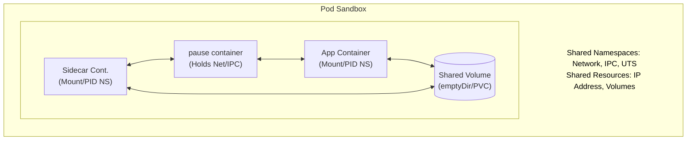
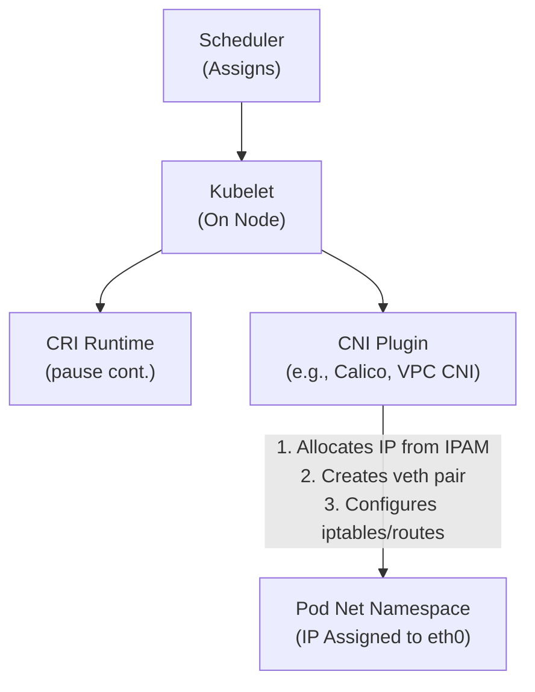
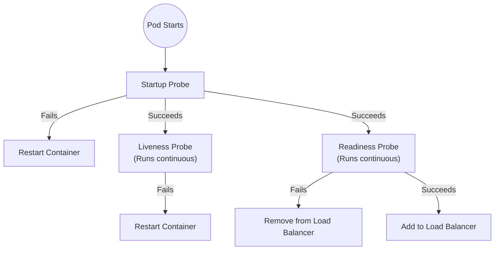
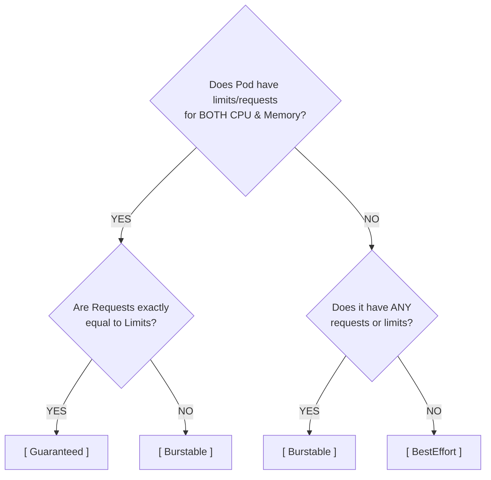

> **Складність**: [СЕРЕДНЯ]
>
> **Час на проходження**: 60-75 хвилин
>
> **Передумови**: Модуль 1.2 (Основи kubectl)

---


## Що ви зможете зробити
- **Діагностувати** збої життєвого циклу Pod, включаючи `Pending`, `ImagePullBackOff`, `CreateContainerConfigError`, `CrashLoopBackOff` та `OOMKilled`, поєднуючи події, журнали, коди завершення та нативні команди `kubectl` для перевірки.
- **Спроєктувати** багатоконтейнерні Pods, які використовують патерни sidecar, ambassador, adapter, init container, ephemeral container, спільний `emptyDir` та комунікацію через `localhost`, не перетворюючи Pod на маленьку віртуальну машину.
- **Оцінювати** запити (requests), ліміти (limits), класи якості обслуговування (Quality of Service), тротлінг CFS, поведінку OOM killer, taints, tolerations, affinity та anti-affinity під час прогнозування того, як Pods плануються та витримують нестачу ресурсів.
- **Реалізувати** декларативні маніфести Pod з мітками (labels), анотаціями (annotations), томами (volumes), пробами (probes), `securityContext`, сервісними акаунтами та полями, сумісними з Kubernetes 1.35, які роблять поведінку під час виконання явною та придатною для перевірки.
- **Порівнювати** некеровані Pods (naked Pods) та імперативні команди з керованими контролерами, заснованими на Git декларативними робочими процесами, і **обґрунтовувати**, коли корисний тимчасовий Pod, а коли потрібні Deployment або Job.


## Чому це важливо

Найпоширеніша помилка нових команд у Kubernetes полягає в тому, що вони переносять ментальну модель віртуальної машини на планувальник, розроблений навколо Pods. Інстинкт зрозумілий: історично сервер був одиницею обчислювальної потужності, ізоляції та власності. Тому, коли з'являється перший маніфест Pod команди, виникає спокуса заповнити його так само — вебфронтенд, процес API, локальний кеш, воркер, форвардер логів, експортер метрик та cron-подібний job, усе упаковано в одну специфікацію, оскільки раніше ці процеси жили разом на одному сервері. Кластер прийме цей маніфест. Проблеми починаються при масштабуванні. Horizontal Pod Autoscaler не може розмножити лише API; він дублює весь Pod, що одночасно розмножує кожен допоміжний процес. Планувальник, який має на меті розподілити навантаження, натомість концентрує його. Збій, який мав би вбити один контейнер, вбиває всю групу.

Pod — це не мініатюрний сервер і не зручна папка для всього, що підтримує застосунок. Це найменша одиниця планування та життєвого циклу в Kubernetes: control plane розміщує весь Pod на одному вузлі, kubelet запускає та відстежує контейнери разом, а контролери вищого рівня замінюють Pod, замість того щоб ремонтувати його на місці. Це важливо, оскільки кожен архітектурний вибір випливає з цієї межі. Якщо два процеси повинні спільно використовувати локальний файл і loopback-мережу, вони, ймовірно, належать один одному; якщо ж вони масштабуються, дають збої, оновлюються або зберігають дані незалежно, розміщення їх в одному Pod створює приховану залежність, яку виробничий трафік зрештою виявить.

Цей модуль перетворює Pod зі словникового терміна на операційну модель. Ви побачите, чому Kubernetes загортає контейнери у спільну пісочницю (sandbox), як pause container закріплює мережу, чому `Pending` відрізняється від `CrashLoopBackOff`, як probes змінюють маршрутизацію трафіку та як налаштування ресурсів впливають на планування й витіснення (eviction). Приклади, які можна запустити, використовують повну команду `kubectl`, тому вони працюють при копіюванні в скрипти, термінали та лабораторні нотатки без специфічних налаштувань оболонки. Приклади орієнтовані на Kubernetes 1.35 або новішу версію та зосереджені на рішеннях, які ви будете приймати постійно: коли використовувати один контейнер, коли додавати sidecar, як написати маніфест, що пройде рев'ю, та як налагодити Pod без вгадування.

## Від контейнерів до Pods: Межа пісочниці

Контейнеризація побудована з примітивів Linux, а не з магії. Простори імен вирішують, що процес може бачити, а control groups — що він може споживати. Мережевий простір імен надає процесу власні інтерфейси, таблицю маршрутизації та простір портів; простір імен монтування дає йому бачення файлової системи; простір імен PID забезпечує йому дерево процесів; а cgroups обліковують використання процесора, пам'яті та інших ресурсів. Docker зробив ці складові доступними для розробників, але Kubernetes потребував абстракції вищого рівня, оскільки виробничі програми часто вимагають, щоб крихітна група тісно пов'язаних процесів розділяла спільне розміщення, IP-адресу та тимчасове сховище (scratch storage).

Pod — це і є ця абстракція. Коли планувальник прив'язує Pod до вузла, kubelet просить середовище виконання контейнерів (container runtime) створити Pod sandbox, перш ніж запустити ваші контейнери застосунків. Sandbox володіє спільними просторами імен мережі, IPC та UTS, тоді як кожен контейнер застосунку зберігає власний образ і простір імен монтування. Таке компонування дозволяє двом контейнерам спілкуватися через `localhost` і ділити том `emptyDir`, не змушуючи їх спільно використовувати кожен бінарний файл, бібліотеку чи шлях файлової системи. Це та сама причина, чому двоє сусідів по кімнаті можуть мати спільну кухню та вхідні двері, зберігаючи окремі спальні; спільний простір корисний лише тоді, коли він дійсно потрібен мешканцям.



Pause container — це тихий якір, який робить цю модель стабільною. Він запускається першим, забирає спільні простори імен Pod'а, а потім засинає, викликаючи невеликий процес, який по суті нічого не робить. Ваші контейнери застосунків приєднуються до цих просторів імен після створення пісочниці. Якщо застосунок падає десять разів, IP-адреса Pod'а не повинна зникати десять разів, тому що pause container все ще тримає мережевий простір імен відкритим. Саме ця стабільність є причиною того, що Services можуть продовжувати маршрутизацію до Pod'а під час перезапуску окремого контейнера, і чому перезапуск контейнера — це не те саме, що заміна Pod'а.

Зупиніться та подумайте: якщо один контейнер у Pod зв'язує порт 8080, а другий контейнер у тому ж Pod намагається зв'язати порт 8080, чого слід очікувати? Другий процес завершиться помилкою address-in-use, оскільки обидва контейнери ділять однаковий мережевий простір імен і таблицю портів. Контейнери мають різні файлові системи, але ядро бачить лише один loopback-інтерфейс для цього Pod'а. Це часта помилка новачків, коли команди додають експортер метрик, debug proxy або адмін-ендпоінт і забувають, що порти мають бути унікальними в межах всього Pod'а, а не лише всередині кожного блоку контейнера.

Модель Pod також пояснює, чому Kubernetes не масштабує контейнери незалежно всередині одного Pod'а. ReplicaSet, Deployment, Job або StatefulSet створює та замінює цілі Pods. Якщо вашому контейнеру API потрібно десять реплік, а його допоміжному кешу — одна, ці процеси не повинні перебувати в одному Pod'і. Багатоконтейнерні Pods призначені для розміщених поруч помічників, які поділяють долю головного процесу: лог-тейлер (log tailer), що читає локальний файл, проксі, що шифрує локальний трафік, адаптер, що нормалізує метрики, або init container, що готує файли перед запуском програми. Спільна доля — це особливість і ціна.

Це правило спільної долі також пояснює, чому проєктування Pod'а є частиною початкових обговорень архітектури, а не завершенням робіт із розгортання. Команда може сказати, що генератор звітів та API "належать одне одному", тому що вони випускаються з одного репозиторію, але спільне походження релізу — це не те саме, що зв'язок під час виконання (runtime coupling). Якщо генератор звітів раз на годину спричиняє сплески навантаження на CPU, тоді як API потребує стабільної низької затримки, спільний Pod змушує планувальник, probes і ліміти ресурсів ставитися до дуже різних типів поведінки як до одного цілого. Їх розділення дозволяє API масштабуватися відповідно до трафіку, а воркеру звітів — відповідно до пакетного навантаження (batch load), навіть якщо їхній вихідний код міститься поруч.



Мережа додає ще один рівень до цієї ідеї. Kubernetes визначає контракт Container Network Interface, але встановлений CNI plugin виконує роботу на рівні вузла: виділяє IP-адресу, створює віртуальну пару ethernet, поміщає один кінець у простір імен Pod'а та програмує маршрути, правила iptables або мапи eBPF, щоб інші Pods могли дістатися до цієї адреси. Якщо CNI plugin відсутній або зламаний на вузлі, kubelet не може завершити пісочницю, тому контейнери застосунків не можуть безпечно запуститися. Симптом часто виглядає як `ContainerCreating`, `NetworkPluginNotReady` або потік подій налаштування мережі, а не збій застосунку.

Перш ніж запускати маніфест, запитайте себе, які межі насправді потрібні процесу. Якщо йому потрібен окремий цикл релізу, незалежне масштабування, незалежна обробка збоїв або інший профіль безпеки, зробіть його окремим Pod'ом за Service. Якщо йому потрібен спільний доступ до локального диска, спілкування через loopback, суворий порядок запуску або усунення несправностей на рівні простору імен поруч із головним процесом, багатоконтейнерний Pod може бути виправданим. Це рішення є архітектурним, а не декоративним, і воно має бути видимим на code review ще до того, як планувальник побачить YAML.

## Життєвий цикл, умови та сигнали здоров'я

Pod має життєвий цикл, але високорівнева фаза — це лише перша підказка. `Pending` означає, що API-сервер прийняв об'єкт, але принаймні один контейнер не було створено; причиною може бути незадоволене планування, проблеми із завантаженням образу, відсутність мережі або затримка налаштування контейнера. `Running` означає, що Pod прив'язаний до вузла і принаймні один контейнер працює або запускається, але це не гарантує, що застосунок готовий до трафіку. `Succeeded` і `Failed` описують термінальні Pods, зазвичай пакетні або одноразові завдання, а `Unknown` означає, що control plane не може надійно отримати сигнал від kubelet.

Умови (conditions) надають деталі, які фази опускають. `PodScheduled` повідомляє, чи знайшов планувальник вузол. `Initialized` повідомляє, чи успішно завершили роботу всі init containers. `ContainersReady` повідомляє, чи готові звичайні контейнери. `Ready` повідомляє Services та балансувальникам навантаження, чи має цей Pod отримувати запити користувачів. Pod може перебувати в стані `Running`, поки `Ready` залишається false, оскільки процес існує, але програма не прогріла кеші, не відкрила пули баз даних або не пройшла свій readiness endpoint. Ця різниця є одним із найважливіших операційних уроків у Kubernetes.



Probes перетворюють туманні очікування щодо здоров'я на рішення kubelet. Startup probe захищає повільні застосунки, надаючи їм окреме вікно завантаження до початку роботи інших probes. Liveness probe запитує, чи зламаний процес настільки, що його слід перезапустити, наприклад, сервер у стані взаємного блокування (deadlock), який все ще має PID, але більше не обробляє запити. Readiness probe запитує, чи повинен Pod приймати трафік прямо зараз, і в разі невдачі видаляє Pod з endpoint'ів Service без перезапуску контейнера. Змішування цих значень є частою причиною штучно створених збоїв (self-inflicted outages), особливо коли команди використовують агресивний liveness probe для ендпоінта, який насправді описує готовність залежностей.

Таймінг probes — це проста арифметика з реальними наслідками. `initialDelaySeconds` контролює, коли починається перевірка, `periodSeconds` контролює, як часто kubelet робить перевірки, `failureThreshold` контролює, скільки невдач запускають дію, а `successThreshold` контролює, скільки успішних перевірок readiness потрібно після збою. Якщо Java-сервіс зазвичай завантажується 70 секунд, але liveness probe починається на 20-й секунді і завершується невдало після трьох швидких перевірок, Kubernetes вб'є програму до того, як вона матиме чесний шанс на запуск. Виправлення полягає не у видаленні перевірок здоров'я; виправлення полягає у моделюванні startup, liveness і readiness як різних запитань.

Kubelet забезпечує цей життєвий цикл через цикл синхронізації (sync loop). Він стежить за об'єктами Pod, призначеними вузлу, запитує середовище виконання контейнерів про фактичні контейнери та узгоджує різницю. Внутрішньо, Pod Lifecycle Event Generator (PLEG) допомагає kubelet реагувати на зміни контейнерів, не покладаючись на дороге постійне опитування (polling). Якщо runtime повідомляє, що контейнер завершив роботу, kubelet записує стан, оцінює політику перезапуску Pod'а та запускає наступну спробу, коли це доречно. Коли вузол реєструє, що PLEG нездоровий, вузол може припинити точне звітування про стан контейнерів, тому Pods можуть виглядати застарілими, навіть якщо сама control plane досі жива.

Зупиніться та подумайте: веб-Pod перебуває в стані `Running`, його liveness probe успішний, а readiness probe дає збій протягом двох хвилин під час міграції бази даних. Чи повинен kubelet перезапустити контейнер? Він не повинен перезапускати контейнер лише тому, що readiness не пройшов перевірку. Натомість, Pod має бути видалений з endpoint'ів Service, доки readiness probe знову не стане успішним. Це дозволяє поступовим оновленням (rolling updates) та перебоям із залежностями відводити трафік (drain traffic), не перетворюючи тимчасову проблему із залежностями на шторм перезапусків.

Життєвий цикл також прояснює, чому голі (naked) Pods крихкі. Коли вузол вмирає, об'єкт Pod може деякий час залишатися видимим, але процесів на цьому вузлі вже немає. Deployment, StatefulSet, DaemonSet або Job є тим контролером, який створює нові Pods на заміну; сам Pod не переміщується на новий вузол, як жива віртуальна машина. Для тимчасових експериментів голий Pod є корисним, тому що його легко інспектувати. Для застосунку, який має відновлюватися, відсутність контролера є дефектом проєктування.


## Написання декларативних маніфестів Pod
Декларативні маніфести — це операційний контракт між вашою командою та кластером. Імперативна команда каже: "зроби це зараз", що чудово підходить для навчання, зондування або створення чернетки. Маніфест YAML каже: "ось бажаний стан", який можна переглядати, версіонувати, відкочувати, проводити аудит та застосовувати повторно. У production різниця має значення, оскільки кластер буде перестворювати Pod після збоїв, і він може перестворити лише те, що описує ваше джерело істини. Якщо ручна команда змінила запущений Pod, але Git ніколи не змінювався, наступна заміна повернеться до старої поведінки.

Основна структура Pod має чотири частини верхнього рівня: `apiVersion`, `kind`, `metadata` та `spec`. Метадані задають ім'я та мітки об'єкта, щоб контролери, Services, системи метрик та люди могли його вибирати. Специфікація (`spec`) описує контейнери, томи, рівень безпеки, обмеження ресурсів, розміщення на вузлах, Service Account, проби та поведінку при перезапуску. Ставтеся до специфікації як до документа для перевірки, а не просто як до шматка YAML. Рецензент повинен мати можливість відповісти, де може запускатися Pod, яку ідентичність він використовує, як він доводить свою готовність, скільки пам'яті може спожити та що станеться у разі його збою.

```yaml
apiVersion: v1
kind: Pod
metadata:
  name: financial-processor-pod
  namespace: payments-prod
  labels:
    app: payment-gateway
    environment: production
    tier: backend
    security-zone: pci-dss
  annotations:
    prometheus.io/scrape: "true"
    prometheus.io/port: "8443"
spec:
  restartPolicy: Always
  serviceAccountName: processor-vault-accessor
  priorityClassName: mission-critical-high
  nodeSelector:
    disk-type: nvme-ssd
    compliance: pci-dss-certified
  tolerations:
    - key: "dedicated"
      operator: "Equal"
      value: "payments"
      effect: "NoSchedule"
  affinity:
    podAntiAffinity:
      requiredDuringSchedulingIgnoredDuringExecution:
      - labelSelector:
          matchExpressions:
          - key: app
            operator: In
            values:
            - payment-gateway
        topologyKey: "kubernetes.io/hostname"
  volumes:
    - name: tmp-scratch-data
      emptyDir:
        sizeLimit: 1Gi
  initContainers:
    - name: vault-bootstrap
      image: hashicorp/vault-agent:1.16
      command: ["/app/fetch-secrets.sh"]
      volumeMounts:
        - name: tmp-scratch-data
          mountPath: /shared
  containers:
    - name: main-processor
      image: registry.example.com/payment-processor:v2.4.1
      imagePullPolicy: IfNotPresent
      command: ["/app/start-processor.sh"]
      ports:
        - containerPort: 8443
          name: https-metrics
          protocol: TCP
      securityContext:
        runAsUser: 1000
        runAsGroup: 3000
        runAsNonRoot: true
        readOnlyRootFilesystem: true
        allowPrivilegeEscalation: false
        capabilities:
          drop:
            - ALL
      volumeMounts:
        - name: tmp-scratch-data
          mountPath: /var/scratch
      livenessProbe:
        httpGet:
          path: /health/live
          port: 8443
        initialDelaySeconds: 30
        periodSeconds: 15
        failureThreshold: 3
      readinessProbe:
        httpGet:
          path: /health/ready
          port: 8443
        initialDelaySeconds: 15
        periodSeconds: 10
        successThreshold: 2
      resources:
        requests:
          cpu: "500m"
          memory: "256Mi"
        limits:
          cpu: "1000m"
          memory: "512Mi"
```

Цей приклад навмисно насичений, оскільки production Pods зазвичай кодують більше, ніж просто ім'я образу. Мітки, такі як `app`, `tier` та `security-zone`, надають Services, NetworkPolicies, метрикам і рушіям політик стабільний спосіб вибору Pod. Анотації забезпечують неідентифікаційні підказки для інструментів, таких як скрейпер Prometheus. Service Account надає Pod ідентичність, що набагато безпечніше, ніж вшивати статичні хмарні облікові дані в образ. `securityContext` примусово встановлює найменші привілеї, а проби відділяють готовність до завантаження, працездатність та готовність приймати трафік від того, чи існує взагалі процес Linux.

Томи також виражають намір під час виконання. `emptyDir` створюється, коли Pod потрапляє на вузол, і зникає, коли Pod залишає цей вузол, тому він корисний для тимчасового робочого простору та передачі даних між контейнерами. `hostPath` монтує шлях вузла в Pod, і до нього слід ставитися як до привілейованого доступу, оскільки він прив'язує Pod до внутрішніх ресурсів вузла. PersistentVolumeClaim є звичайним шляхом для довговічних даних, оскільки об'єкт сховища живе довше, ніж Pod, і може бути перепідключений відповідно до правил класу сховища. Маніфест повинен робити цей вибір щодо довговічності очевидним, а не ховати його всередині коду застосунку.

Перш ніж запускати це, який результат ви очікуєте від попереднього огляду маніфесту? Планувальник розглядатиме лише ті вузли, що відповідають `nodeSelector`, дозволені `toleration` та сумісні з правилом `anti-affinity`. init-контейнер повинен завершитися до запуску основного контейнера, а основний контейнер відмовиться працювати від імені root. Коли процес запуститься, готовність контролюватиме трафік, а життєздатність — перезапуски. Якщо ви не можете описати ці наслідки з YAML, маніфест ще недостатньо готовий для перевірки перед виведенням у production.

Імперативні команди все ще мають своє місце при обдуманому використанні. Для швидкої перевірки зв'язності `kubectl run` може створити одноразовий Pod, а `--dry-run=client -o yaml` може допомогти вам скласти чернетку маніфесту. Небезпека виникає тоді, коли термінова зміна вручну стає єдиним джерелом істини. Гіпотетичний сценарій: команда виправляє образ кешу під час інциденту за допомогою прямої команди і відновлює роботу сервісу, але зміна ніколи не потрапляє до Git. Коли пізніше стається збій вузла, Pod-замінник походить зі старого маніфесту і знову повертає баг. Правило є жорстким, тому що інциденти є жорсткими: якщо бажаний стан не міститься у системі контролю версій, кластеру не можна довірити його збереження.


## Планування, ресурси та Quality of Service
Планування — це задача задоволення обмежень. Планувальник не розміщує Pod на вузлі через те, що образ виглядає малим, або тому, що кластер десь загалом має вільну ємність. Він оцінює запитані ресурси Pod, правила розміщення, taints, tolerations, affinity, anti-affinity та поточний розподіл на вузлах. Pod, що запитує більше пам'яті, ніж може надати будь-який окремий вузол, залишатиметься в стані `Pending`, навіть якщо кластер має достатньо пам'яті в сукупності. Ось чому запити — це не документація; вони є частиною рівняння планування.

Запити — це гарантії, які використовуються для розміщення, тоді як ліміти — це межі примусового виконання, що застосовуються ядром. Запит на CPU резервує ємність для планування та впливає на справедливий розподіл під час конкуренції за ресурси. Ліміт CPU може викликати тротлінг через Completely Fair Scheduler, коли контейнер намагається використати більше своєї квоти; процес уповільнюється, але зазвичай не гине. Ліміт пам'яті є більш суворим. Коли процес перевищує стелю пам'яті cgroup, OOM-кілер Linux може завершити його, і Kubernetes фіксує знайому причину `OOMKilled` із кодом виходу 137. Проблеми із затримкою часто виникають через тротлінг CPU, тоді як раптові перезапуски без логів застосунку часто вказують на нестачу пам'яті.



Класи Quality of Service узагальнюють, наскільки повно вказані ресурси. `Guaranteed` Pod встановлює запити на CPU та пам'ять рівними лімітам для кожного контейнера, що робить його останнім класом, який Kubernetes вважатиме за потрібне витіснити (evict) під час нестачі ресурсів на вузлі. `Burstable` Pod має певні запити або його запити нижчі за ліміти, тому він може використовувати вільну ємність, але може бути витіснений раніше за навантаження Guaranteed, якщо він перевищить свій запит. `BestEffort` Pod не має жодних запитів чи лімітів, і його найлегше витіснити, коли вузол потребує захисту. Клас не замінює правильне визначення розмірів, але допомагає передбачити виживання під час нестачі ресурсів.

Правила розміщення визначають, де планувальник може розв'язати проблему ресурсів. Taint відштовхує звичайні Pod від вузла, а toleration дозволяє вибраним Pod приймати цей taint, що корисно для виділеного обладнання або ізольованих зон. Node affinity притягує Pod до вузлів з такими мітками, як тип сховища, регіон або межа відповідності вимогам. Pod anti-affinity розподіляє репліки подалі одна від одної, щоб відмова одного вузла не призвела до втрати кожної копії сервісу. Pod affinity розміщує пов'язані Pod разом, коли локальність має значення, хоча сумісне розміщення незалежних сервісів може створити ризик спільної відмови у разі зловживання.

| Властивість | Ціль | Дія | Сценарій використання |
|---|---|---|---|
| Taints та Tolerations | Вузли (Taint), Pods (Tolerate) | Відштовхує Pod від вузлів | Виділення вузлів для конкретних навантажень (наприклад, GPU) |
| Node Affinity | Pods | Притягує Pod до певних вузлів | Забезпечення запуску Pod у певних зонах або на певному обладнанні |
| Pod Affinity | Pods | Притягує Pod до інших Pod | Сумісне розміщення тісно пов'язаних сервісів для зменшення затримки |
| Pod Anti-Affinity | Pods | Відштовхує Pod від інших Pod | Розподіл реплік між хостами/зонами для високої доступності |

Практичний робочий процес полягає в тому, щоб почати із запитів на ресурси, які відповідають спостережуваному базовому використанню, а потім встановити ліміти пам'яті достатньо обережно, щоб захистити вузол, не створюючи передбачуваних OOM kill. Ліміти CPU потребують особливої обережності у сервісах, чутливих до затримок, оскільки тротлінг може виглядати як випадкове уповільнення, навіть якщо Pod ніколи не перезапускається. Для розміщення віддавайте перевагу простим міткам і anti-affinity для доступності, а потім додавайте taints або жорстке node affinity лише тоді, коли у вас є чітка вимога щодо ізоляції або обладнання. Суворі обмеження покращують контроль, але зменшують гнучкість планування, тому кожне жорстке правило повинно мати причину, яку рецензент може захистити.

Рішення щодо ресурсів також впливають на сусідів, з якими ваша команда може ніколи не зустрітися. У спільному кластері завищений запит може заблокувати ємність, резервуючи простір, який процес використовує рідко, тоді як відсутність запиту може змусити планувальник перевантажити вузол і згодом спровокувати тиск витіснення. Ліміти мають власні режими відмови: занадто низький ліміт створює передбачувані перезапуски, але відсутність ліміту дозволяє неконтрольованому процесу загрожувати непов'язаним навантаженням на тому самому вузлі. Мета полягає не в тому, щоб знайти ідеальні числа в перший же день. Мета полягає в тому, щоб почати з чесних оцінок, спостерігати за реальним використанням і ставитися до змін ресурсів як до частини налаштування застосунку, а не як до одноразової рутинної задачі платформи.

Який підхід ви б обрали тут і чому: платіжний API з трьома репліками повинен пережити збій вузла, тоді як модель оцінки шахрайства потребує вузлів з GPU і має одну репліку під час тестування? Платіжний API повинен використовувати anti-affinity або topology spread через контролер, щоб репліки не накопичувалися на одному хості. Модель повинна мати toleration до GPU taint та запитувати відповідні ресурси прискорювача, погоджуючись з тим, що планування може бути повільнішим через дефіцит відповідних вузлів. Обидва є Pods, але намір планування відрізняється, і маніфест має робити цю різницю очевидною.


## Багатоконтейнерні патерни, сховища та безпека

Більшість Pod містять один контейнер застосунку, і це нормальна практика. Pod з одним контейнером легко масштабувати, легко аналізувати, а контролерам легко його замінювати. Багатоконтейнерні Pod стають цінними лише тоді, коли два процеси потребують спільної долі та локальної взаємодії на вузлі. Патерн sidecar доповнює застосунок без його зміни, наприклад, відстежуючи старий файл журналу зі спільного `emptyDir` і записуючи його в stdout. Патерн ambassador проксіює локальний трафік, часто для додавання TLS, пулу з'єднань або політик. Патерн adapter перетворює специфічний вивід застосунку у стандартний формат, який платформа вже розуміє.

Ініціалізаційні контейнери (init containers) вирішують іншу проблему: скінченне налаштування, яке має завершитися до запуску застосунку. Вони виконуються послідовно, і кожен має успішно завершитися перед початком роботи наступного ініціалізаційного або головного контейнера. Це підходить для підготовки схеми, завантаження файлу моделі, очікування на контракт залежностей або рендерингу конфігурації у спільний том. Це не підходить для безперервного опитування, фонової синхронізації або пересилання журналів, оскільки ініціалізаційний контейнер, який ніколи не завершується, назавжди блокує головний застосунок. Kubernetes 1.35 також підтримує нативну sidecar-поведінку через семантику ініціалізаційних контейнерів, але залишається архітектурне питання: чи повинен помічник працювати до, поруч чи поза межами головного застосунку.

Ефемерні контейнери (ephemeral containers) призначені для "живого" налагодження, а не для постійної архітектури. Вони дозволяють оператору приєднати тимчасовий образ для діагностики до наявного Pod, що особливо корисно, коли робочий образ є distroless і навмисно не має оболонки (shell). Оскільки діагностичний контейнер може приєднуватися до просторів імен (namespaces) Pod, він може перевіряти мережеву поведінку поруч із застосунком без необхідності перезбирання образу застосунку. Ці можливості слід контролювати за допомогою RBAC та журналів аудиту, оскільки здатність підключати інструменти для налагодження до робочих Pod може розкрити конфіденційну інформацію середовища виконання, якщо надавати її необережно.

Налаштування контексту безпеки (security context) перетворюють принцип найменших привілеїв на політику середовища виконання. `runAsNonRoot` блокує образи, які намагаються запуститися під UID 0, `allowPrivilegeEscalation: false` запобігає отриманню дочірніми процесами більших привілеїв, ніж у їхнього батьківського процесу, `readOnlyRootFilesystem` робить шар образу незмінним під час виконання, а скидання можливостей Linux (Linux capabilities) видаляє привілеї ядра, які більшості вебзастосунків ніколи не знадобляться. Ці налаштування можуть зламати погано підготовлені образи, що є перевагою під час перевірки, а не проблемою під час інциденту. Якщо застосунку потрібен тимчасовий простір (scratch space) із файловою системою, доступною лише для читання (`readOnlyRootFilesystem`), змонтуйте `emptyDir` у `/tmp` або в інший явно вказаний шлях замість того, щоб залишати весь образ доступним для запису.

Вибір сховища повинен відповідати значенню даних. Файли, записані безпосередньо у файлову систему контейнера, є тимчасовими, оскільки перезапущений контейнер отримує новий шар для запису. `emptyDir` зберігає дані протягом усього часу існування Pod на вузлі, тому він чудово підходить для спільних журналів, згенерованого статичного контенту, тимчасового завантаження моделей або передачі даних між ініціалізаційним і головним контейнерами. `hostPath` отримує доступ до вузла і має бути обмежений привілейованими інфраструктурними агентами з чітким обґрунтуванням. PersistentVolumeClaims призначені для даних, які мають "пережити" заміну Pod, наприклад, файлів баз даних, але робочі навантаження зі збереженням стану (stateful workloads) також потребують контролерів вищого рівня та планів розгортання з урахуванням сховища.

Корисна розумова перевірка — запитати себе: чи повинне видалення Pod призвести до видалення даних, чи лише зупинити процес? Якщо видалення Pod має видаляти дані, використання `emptyDir` може бути правильним рішенням. Якщо видалення Pod не повинно видаляти дані, використовуйте постійний том (persistent volume) і свідомо проєктуйте механізм відновлення. Якщо Pod потребує доступу до внутрішніх ресурсів вузла, зупиніться та подумайте: ви створюєте агента вузла, виняток із правил безпеки чи випадкове підвищення привілеїв? Секція storage — це не просто технічна обв'язка; це декларація довговічності та довіри.

## Діагностика збоїв Pod без вгадування

Налагодження Pod стає простішим, коли ви слідуєте за їхнім життєвим циклом замість того, щоб одразу переходити до журналів. Якщо Pod перебуває у стані `Pending`, застосунок міг так і не запуститися, тому журнали часто не мають значення. Почніть із `kubectl describe pod <pod-name>` та прочитайте розділ Events (події) знизу вгору. Події на кшталт insufficient CPU, untolerated taints, node affinity mismatch або volume attach failure вказують на проблеми з плануванням та налаштуванням. Події, такі як `ErrImagePull` або `ImagePullBackOff`, свідчать про проблеми з доступом до реєстру, неправильні імена образів, відсутні теги або проблеми з автентифікацією у приватному реєстрі. Kubelet повідомляє вам, на якому кроці стався збій; ваше завдання — подивитися на крок, який фактично виконувався.

Помилка `CreateContainerConfigError` зазвичай означає, що kubelet не може зібрати конфігурацію контейнера зі специфікації Pod. Відсутній ключ ConfigMap, відсутній Secret, неправильне посилання на змінну середовища або неможливі налаштування безпеки можуть заблокувати запуск навіть після успішного завантаження образу. `CreateContainerError` означає, що середовище виконання (runtime) зіткнулося з проблемою створення нижчого рівня, наприклад, з хибною командою, відсутнім виконуваним файлом, помилкою монтування або проблемою з дозволами. В обох випадках контейнер міг не згенерувати журналів застосунку, оскільки процес не дійшов до стадії нормального виконання. Події та блоки стану є набагато кориснішими, ніж споглядання порожнього потоку журналів.

`CrashLoopBackOff` означає, що контейнер запустився, а потім неодноразово завершував роботу. Kubernetes перезапускає його відповідно до політики, але робить паузи, щоб уникнути спалювання ресурсів CPU вузла на процес, який одразу падає. Тут журнали зазвичай є основним сигналом, і прапорець `--previous` має велике значення, оскільки поточний екземпляр контейнера може бути новим та порожнім. Використовуйте `kubectl logs <pod-name> --previous`, коли останній аварійний екземпляр перед самим завершенням вивів корисне трасування стека, помилку підключення до бази даних, синтаксичну помилку або повідомлення про відсутній файл. Якщо контейнерів кілька, додайте `-c <container-name>`, щоб читати журнали потрібного процесу.

`OOMKilled` — це інша ситуація, оскільки застосунок може не встигнути нічого вивести. Ядро завершує процес після того, як він перевищує свій ліміт пам'яті cgroup, і Kubernetes записує `Reason: OOMKilled` з кодом виходу 137 в останньому стані контейнера. Короткостроковим рішенням може бути збільшення ліміту пам'яті (memory limit), але довготривале рішення полягає у порівнянні фактичного зростання пам'яті, розміру request, розміру limit та поведінки застосунку. Витік пам'яті, прихований за неодноразовими перезапусками, може виглядати як нестабільний кластер, доки ви не пов'яжете кількість перезапусків, останній стан і метрики.

Інтерактивні інструменти корисні після того, як ви знаєте, який рівень ви досліджуєте. `kubectl exec -it <pod-name> -- /bin/sh` переносить вас у контейнер, що працює, якщо образ містить оболонку (shell), що дозволяє інспектувати змонтовані файли, змінні середовища, DNS та поведінку локальної мережі. `kubectl port-forward pod/<pod-name> 8080:80` тунелює трафік через API-сервер до Pod, що є корисним до того, як ви створите Service або Ingress. Ефемерні контейнери допомагають, коли в образі відсутня оболонка, але вони повинні сприяти діагностиці, а не ставати замінником виправлення маніфесту чи образу.

Порядок налагодження досить простий, щоб його запам'ятати. По-перше, визначте фазу та умови за допомогою `kubectl get pod` та `kubectl describe`. По-друге, прочитайте Events щодо збоїв планування, образів, мережі, томів та конфігурації. По-третє, прочитайте журнали, використовуючи `--previous` для повторюваних збоїв та `-c` для багатоконтейнерних Pod. По-четверте, перевірте стан ресурсів на предмет OOM kill та тротлінгу. По-п'яте, використовуйте exec, port-forward або ефемерні контейнери, щоб перевірити, що бачить процес ізсередини простору імен. Пропуск перших двох кроків — це те, через що команди марнують годину на налагодження коду застосунку, який навіть не запустився.

Хороший запис про інцидент фіксує таку саму послідовність, оскільки він відокремлює докази від здогадок. Замість того, щоб писати "Kubernetes вбив застосунок", зафіксуйте, що Pod був запланований на конкретний вузол, контейнер раніше завершився з кодом виходу 137, використання пам'яті піднялося вище налаштованого ліміту, і kubelet перезапустив контейнер відповідно до політики. Замість того, щоб писати "мережа зламана", запишіть, що Pod залишався у стані `ContainerCreating`, потік подій (Events) показав помилку налаштування CNI, і жоден контейнер застосунку не запустився. Ці деталі мають значення під час аналізу, оскільки вони вказують на різних відповідальних власників, різні виправлення та різні профілактичні роботи.

Така сама дисципліна допомагає, коли одночасно з'являється кілька симптомів. Pod може мати попередження про витягування образу зі старішої спроби, помилку readiness probe з поточного екземпляра та лічильник перезапусків із попереднього збою. Події хронологічні, стан контейнера стосується конкретного контейнера, а журнали — конкретного екземпляра контейнера. Читання їх як одного суцільного повідомлення про помилку призводить до хибних висновків. Під час збою вкажіть контейнер, спробу, мітку часу та етап життєвого циклу, перш ніж пропонувати виправлення. Ця звичка робить вашу діагностику повільнішою на першій хвилині та набагато швидшою на наступні тридцять.

## Патерни та антипатерни

Використовуйте один контейнер застосунку на Pod, коли процес може масштабуватися, зазнавати збоїв і розгортатися незалежно. Це патерн за замовчуванням, оскільки він зберігає поведінку контролера зрозумілою і дозволяє Service спрямовувати трафік до однієї межі застосунку. Використовуйте sidecar, коли помічнику потрібно ділити локальний том або інтерфейс loopback із головним процесом, і він має замінюватися щоразу, коли замінюється головний Pod. Використовуйте ініціалізаційний контейнер (init container), коли налаштування має завершитися до запуску застосунку, та тримайте образ init окремо, якщо йому потрібні інструменти, які ви не хочете бачити в робочому образі середовища виконання.

Використовуйте декларативні маніфести для всього, що має бути повторюваним. Маніфест, перевірений у Git, фіксує мітки (labels), проби (probes), ресурси, контекст безпеки (security context), томи та правила розміщення в одному місці. Використовуйте "голі" імперативні Pod для тимчасових експериментів, тестів підключення або швидкого відтворення проблем, а потім видаляйте їх. Використовуйте контролери для довготривалих робочих навантажень, оскільки контролери створюють нові Pod на заміну, коли вузли виходять з ладу, розгортають нові версії та підтримують задану кількість реплік. Pod — це об'єкт керування; зазвичай він не є керуючим.

Найгіршим антипатерном є дизайн "сервер у Pod", коли команди розміщують непов'язані процеси разом лише тому, що вони колись ділили спільний хост. Це здається звичним, але знищує незалежне масштабування та ізоляцію збоїв. Ще одним антипатерном є підхід "проба як молоток", коли кожен endpoint перевірки працездатності стає liveness probe, а тимчасові збої залежностей провокують перезапуски. Третій антипатерн — "оптимізм щодо ресурсів", коли команди опускають requests та limits, доки спільний вузол не стане нестабільним. Ці помилки мають спільну причину: ставлення до специфікації Pod як до другорядної речі після розгортання, а не як до робочого контракту.

Коли багатоконтейнерний Pod є виправданим, тримайте їхні взаємозв'язки вузькими та задокументованими. Помічник повинен мати чітку причину ділити "пісочницю" Pod, а його режим збою має мати сенс поруч із головним контейнером. Падіння лог-sidecar може означати збій обсервабіліті, навіть якщо застосунок продовжує обслуговувати трафік; падіння проксі-sidecar може зробити застосунок фактично недоступним; збій адаптера може порушити збір метрик, але не вплинути на користувацький трафік. Pod може виражати ці відмінності, лише якщо проби, ресурси та обов'язки контейнерів налаштовані усвідомлено.

## Фреймворк для прийняття рішень

Почніть із запитання: "Що є найменшою одиницею, яка повинна плануватися та замінюватися як єдине ціле?" Якщо відповідь — один процес, використовуйте один контейнер в одному Pod, а реплікацію, розгортання та відновлення покладіть на контролер. Якщо помічник повинен ділити `localhost` або `emptyDir` із головним процесом, розгляньте можливість використання sidecar або адаптера. Якщо завдання має завершитися до запуску головного процесу, використовуйте ініціалізаційний контейнер. Якщо робота є скінченним пакетним завданням, використовуйте Job, а не довготривалий Pod. Якщо робочому навантаженню потрібні стабільна ідентичність і постійне сховище попри заміни, вивчіть StatefulSets після того, як розберетеся з базовими контролерами.

Далі запитайте: "Що має бути істинним, перш ніж цей Pod почне отримувати трафік?" Покладіть припущення щодо запуску в startup probes, припущення щодо обслуговування — в readiness probes, а відновлення після взаємних блокувань — у liveness probes. Потім запитайте: "Що цей Pod може споживати, не завдаючи шкоди вузлу?" Внесіть базові потреби у requests, а жорсткі межі безпеки — у limits, пам'ятаючи, що ліміти CPU викликають тротлінг, а ліміти пам'яті можуть призвести до вбивства процесу. Нарешті, запитайте: "Де дозволено запускатися цьому Pod?" Спершу використовуйте мітки та м'які переваги, а потім жорсткі правила affinity, taints та tolerations, коли цього вимагає апаратне забезпечення, відповідність стандартам або ізоляція.

Рішення рідко стосується лише одного поля. Безпечний платіжний Pod може потребувати сервісного акаунта, користувача, відмінного від root, файлової системи лише для читання, ліміту пам'яті, readiness probe, anti-affinity та контролера над ним. Для одноразового Pod перевірки мережі може знадобитися лише образ, команда та швидкий шлях для видалення. Обидва варіанти є коректними, коли їхні маніфести відповідають їхній меті. Небезпека полягає у використанні одноразової моделі для робочого сервісу або у використанні робочої моделі як карго-культ шаблону без розуміння компромісів.

Коли ви не впевнені, опишіть історію відновлення одним абзацом, перш ніж вибирати об'єкт. Якщо вузол зникає, хто створює Pod на заміну і який стан має переміститися разом із ним? Якщо розгортання зазнає невдачі, який сигнал зупиняє трафік і який сигнал ініціює відкат? Якщо процес спричиняє витік пам'яті, чи виживе вузол і чи залишаться докази видимими достатньо довго для налагодження? Ці запитання часто виявляють, чи бракує вам контролера, проби, межі ресурсів або довговічного сховища. Правильна специфікація Pod — це та, поведінку під час збою якої ви можете пояснити до того, як цей збій станеться.

## Чи знали ви?

1. Kubernetes впровадив Pod у 2014 році як свідому абстракцію над окремими контейнерами, спираючись на уроки попередніх великомасштабних систем оркестрації контейнерів Google.
2. Контейнер `pause` є крихітним, оскільки його завдання полягає лише в тому, щоб утримувати спільні простори імен відкритими, що робить мережу Pod стабільною, поки звичайні контейнери перезапускаються.
3. Нативна поведінка sidecar-контейнерів досягла стабільного статусу в останніх випусках Kubernetes, включно з епохою Kubernetes 1.35, на яку орієнтована ця навчальна програма, після багатьох років моделювання довготривалих помічників командами за допомогою звичайних контейнерів.
4. Код виходу 137 умовно складається зі 128 плюс сигнал 9, саме тому він чітко вказує на подію SIGKILL, таку як завершення контейнера системним механізмом OOM killer.


## Типові помилки

| Помилка | Чому це трапляється | Як це виправити |
| :--- | :--- | :--- |
| **Сприйняття Pods так само, як і фізичних віртуальних машин** | Нерозуміння спільного життєвого циклу. Розміщення вебінтерфейсу, бекенд API та бази даних всередині одного єдиного Pod. | Розділіть різні застосунки, що масштабуються незалежно, на окремі Pods з одним контейнером, якщо тільки вони не пов'язані фізично та не використовують спільний локальний дисковий простір. |
| **Розгортання "голих", некерованих Pods у продакшені** | Помилкова віра в те, що Pods за своєю природою є стійкими до збоїв. Вони є ефемерними і не будуть відновлені, якщо фізичний вузол вийде з ладу. | Завжди обгортайте Pods контролерами вищого рівня для забезпечення стійкості, такими як Deployments, DaemonSets або StatefulSets, щоб гарантувати високу доступність. |
| **Повне ігнорування Resource Requests та Limits** | Лінощі, поспішне впровадження нових фіч у продакшен або повна відсутність профілювання продуктивності застосунку. | Завжди суворо визначайте ліміти пам'яті та процесора. Без лімітів один серйозний витік пам'яті в одному несправному Pod може призвести до збою всього багатоклієнтського робочого вузла. |
| **Неправильне розуміння `localhost` у багатоконтейнерних Pods** | Забування про те, що всі контейнери всередині Pod суворо ділять один і той самий мережевий простір імен, таблицю маршрутизації та IP-адресу. | Використовуйте окремі, різні порти для кожного окремого контейнера всередині Pod, щоб повністю уникнути помилок прив'язки на рівні ОС `Address already in use`. |
| **Використання тегів `latest` для образів Docker** | Зручність для розробників під час локальної розробки, що небезпечно просочується в маніфести для продакшену. | Завжди жорстко фіксуйте образи за певними SHA або незмінними тегами версій (наприклад, `v2.1.4`), щоб запобігти непередбачуваним розгортанням і катастрофам типу `ImagePullBackOff`. |
| **Використання `exec` для ручного виправлення проблем у живому продакшені** | Ставлення до ефемерних контейнерів як до змінних серверів Linux. Ручні зміни втрачаються миттєво в той самий момент, коли Pod перезапускається. | Pods є суворо незмінними. Виправляйте конфігурацію централізовано в Git або Dockerfile, створюйте абсолютно новий образ і розгортайте його декларативно через ваш CI/CD. |
| **Зловживання Init Containers для завдань безперервного опитування** | Нерозуміння того, що Init Containers повинні повністю завершити роботу (з кодом 0) до того, як основний застосунок зможе почати завантаження. | Використовуйте фонові контейнери sidecar для завдань безперервного опитування; суворо резервуйте Init Containers лише для скінченних скриптів налаштування під час завантаження. |
| **Повне ігнорування Liveness та Readiness Probes** | Припущення, що базовий фреймворк оброблятиме стан працездатності природним чином, або ж просто звичайний недогляд. | Pods без належного моніторингу отримуватимуть живий трафік ще до завершення завантаження, що спричинить масові помилки 502 і втрату критично важливих запитів у продакшені. |

## Контрольні запитання

<details>
<summary>1. Сценарій: Ваша команда розгортає Pod, який залишається у стані `Pending` протягом 20 хвилин. `kubectl describe pod api` показує недостатньо CPU та невідповідність node affinity. На якому рівні стався збій, і що слід змінити в першу чергу?</summary>

**Відповідь:** Збій стався під час планування, а не всередині контейнера застосунку. Планувальник не може знайти вузол, який задовольняє як запитаний CPU, так і правило розміщення, тому логи не допоможуть, оскільки контейнер міг ніколи й не запускатися. Спершу перевірте, чи відображає запит на CPU виміряну потребу і чи дійсно потрібна жорстка прив'язка (hard affinity). Якщо обидва налаштування правильні, додайте відповідні потужності вузлів або змініть мітки вузлів, щоб планувальник мав дійсну ціль.
</details>

<details>
<summary>2. Сценарій: Застарілий застосунок записує логи аудиту лише у `/var/log/app.log`, але платформа збирає stdout. Як слід спроєктувати Pod, не змінюючи код застосунку?</summary>

**Відповідь:** Використовуйте патерн sidecar зі спільним томом `emptyDir`. Застарілий контейнер записує файл у спільне монтування, тоді як sidecar безперервно читає цей файл (tails) і виводить кожен рядок у власний stdout. Такий дизайн є доречним, оскільки допоміжний контейнер потребує локального доступу до файлу і повинен замінюватися разом із основним застосунком. Створення окремого Service для процесу, єдиним завданням якого є локальна трансляція логів, було б надмірним.
</details>

<details>
<summary>3. Сценарій: Pod має стан `Running`, але користувачі все одно отримують помилки під час розгортання, оскільки застосунку потрібен час для створення кешів і відкриття пулів з'єднань з базою даних. Яка проба повинна керувати трафіком і чому?</summary>

**Відповідь:** Readiness probe повинна контролювати, чи отримує Pod трафік. Процес може бути живим, але ще не здатним коректно обслуговувати запити, і збій readiness видаляє Pod з кінцевих точок Service без його перезапуску. Liveness probe була б занадто агресивною для цієї залежності і могла б спричинити цикли перезапусків під час нормального прогріву. Якщо саме завантаження є повільним, поєднайте readiness із startup probe, щоб перевірки liveness не починалися занадто рано.
</details>

<details>
<summary>4. Сценарій: Контейнер постійно перезапускається без жодних корисних логів застосунку. Останній стан показує `Reason: OOMKilled` та `Exit Code: 137`. Що сталося, і як requests та limits впливають на виправлення?</summary>

**Відповідь:** Процес перевищив свій ліміт пам'яті cgroup, і ядро зупинило його сигналом SIGKILL, що Kubernetes зафіксував як код завершення 137. Підвищення ліміту пам'яті може зупинити негайні перезапуски, але воно має базуватися на спостережуваній поведінці пам'яті, а не на здогадках. Запит на пам'ять впливає на пропускну здатність планування, тоді як ліміт пам'яті визначає жорстку верхню межу. Правильне виправлення передбачає перевірку патерну споживання пам'яті застосунком, коригування значень request та limit, а також перевірку на наявність витоку пам'яті.
</details>

<details>
<summary>5. Сценарій: Перевірка безпеки відхиляє Pod, оскільки образ запускається від імені root і має файлову систему, доступну для запису. Які поля маніфесту зменшують ризик, і який побічний ефект слід планувати?</summary>

**Відповідь:** Додайте `securityContext`, який встановлює `runAsNonRoot: true`, вимикає підвищення привілеїв, скидає непотрібні можливості (capabilities) та робить кореневу файлову систему доступною лише для читання. Ці налаштування зменшують радіус ураження у разі компрометації застосунку, оскільки процес має менше привілеїв ядра і не може вільно записувати в шар образу. Побічним ефектом є те, що застосункам, яким потрібен тимчасовий простір, необхідно надати явний том з можливістю запису, наприклад, `emptyDir`, змонтований у `/tmp` або інший відомий шлях. Для образу також може знадобитися налаштувати користувача не-root перед тим, як Pod зможе запуститися.
</details>

<details>
<summary>6. Сценарій: Двоє контейнерів в одному Pod повинні спілкуватися між собою. Один обслуговує HTTP на порту 80, а інший скрейпить його кожні кілька секунд. Яку адресу має використовувати скрейпер, і якої помилки він повинен уникати?</summary>

**Відповідь:** Скрейпер може використовувати `http://localhost:80`, оскільки контейнери в тому самому Pod спільно використовують мережевий простір імен. Цей спільний простір імен забезпечується "пісочницею" Pod, тому трафік loopback залишається всередині Pod і не потребує Service. Помилка, якої слід уникати, полягає в прив'язці самого скрейпера до того ж самого порту, оскільки номери портів є унікальними для всього Pod. Якщо обом контейнерам потрібні слухачі, призначте їм різні порти.
</details>

<details>
<summary>7. Сценарій: Інженер робить хотфікс "голого" Pod імперативною командою під час інциденту, але зміна так і не потрапляє до Git. Пізніше стається збій вузла. Чого слід очікувати, і який робочий процес цьому запобігає?</summary>

**Відповідь:** Початковий "голий" Pod не буде створений заново сам по собі після втрати вузла, а будь-яка заміна, створена зі старих маніфестів, втратить ручне виправлення. Імперативний стан є тимчасовим, якщо він не зафіксований у декларативному джерелі істини. Правильний робочий процес полягає в тому, щоб оновити маніфест, перевірити його, застосувати через звичайний шлях доставки і дозволити контролеру керувати Pods на заміну. Тимчасові імперативні команди прийнятні для діагностики, але вони не повинні ставати конфігурацією для продакшену.
</details>


## Практична вправа: Найголовніший виклик із діагностики багатоконтейнерних Pod

У цій практичній вправі ви створите багатоконтейнерний Pod, дослідите поведінку його спільного простору імен (namespace), спровокуєте навмисний збій пам'яті та відпрацюєте послідовність діагностики, що використовується під час справжніх інцидентів. Працюйте в тимчасовому просторі імен або локальному навчальному кластері та використовуйте повну команду `kubectl`, щоб кожен приклад можна було скопіювати та виконати.

<details>
<summary>Завдання 1: Декларативне створення кількох контейнерів</summary>

Напишіть декларативний YAML-маніфест із назвою `multi-pod.yaml`, який створює один Pod, що містить два контейнери, які взаємодіють між собою. Назва Pod має бути `web-logger`. Перший контейнер повинен мати назву `nginx-server`, використовувати публічний образ `nginx:1.27-alpine` та монтувати спільний том (volume) із назвою `html-dir` у шлях `/usr/share/nginx/html`. Другий контейнер повинен мати назву `content-writer`, використовувати публічний образ `busybox:1.36.1`, монтувати той самий том у `/data` та безперервно записувати поточну дату у файл `/data/index.html` кожні 5 секунд. Спільний том має бути типу `emptyDir`.

<details>
<summary>Підказка щодо концепції</summary>

Обом контейнерам потрібен однаковий том `emptyDir`, оголошений один раз у `spec.volumes`, який потім монтується за різними шляхами, щоб `content-writer` міг оновлювати файл, який роздаватиме вебсервер.
</details>

<details>
<summary>Підказка щодо команди</summary>

Визначте `spec.volumes` з `emptyDir: {}`, а потім додайте кожному контейнеру запис `volumeMounts`, що вказує на назву цього тому зі шляхами з опису завдання.
</details>

<details>
<summary>Повне рішення</summary>

```yaml
apiVersion: v1
kind: Pod
metadata:
  name: web-logger
spec:
  volumes:
    - name: html-dir
      emptyDir: {}
  containers:
    - name: nginx-server
      image: nginx:1.27-alpine
      volumeMounts:
        - name: html-dir
          mountPath: /usr/share/nginx/html
    - name: content-writer
      image: busybox:1.36.1
      command: ["/bin/sh", "-c", "while true; do date > /data/index.html; sleep 5; done"]
      volumeMounts:
        - name: html-dir
          mountPath: /data
```
</details>
</details>

<details>
<summary>Завдання 2: Застосування та перевірка архітектури</summary>

Застосуйте декларативний маніфест до вашого локального кластера. Переконайтеся, що Pod переходить зі стану `Pending` у стан `Running`, підтвердьте, що обидва контейнери стали готові, а потім скористайтеся перенаправленням портів (port-forwarding), щоб переглянути згенеровану сторінку через тунель API-сервера.

<details>
<summary>Підказка щодо концепції</summary>

Використайте `kubectl apply` для подання маніфесту, зачекайте, поки Pod не повідомить про стан Ready, а потім прокиньте тунель від порту 80 Pod до локального порту та виконайте запит `curl` зі своєї робочої станції.
</details>

<details>
<summary>Підказка щодо команди</summary>

Виконайте `kubectl apply -f multi-pod.yaml`, потім `kubectl wait --for=condition=Ready pod/web-logger --timeout=60s`, після чого запустіть у фоновому режимі `kubectl port-forward pod/web-logger 8080:80` і виконайте `curl http://localhost:8080`.
</details>

<details>
<summary>Повне рішення</summary>

```bash
# Застосування декларативного маніфесту до API-сервера
kubectl apply -f multi-pod.yaml

# Очікування повної готовності Pod
kubectl wait --for=condition=Ready pod/web-logger --timeout=60s
```

Відкрийте нове вікно термінала або переведіть процес перенаправлення портів у фоновий режим для перевірки:

```bash
# Встановлення захищеного тунелю перенаправлення портів до Pod у фоновому режимі
kubectl port-forward pod/web-logger 8080:80 &

# Очікування на встановлення тунелю
sleep 2

# Виконання запиту curl до локального порту для перевірки
curl http://localhost:8080
# Ви маєте побачити поточну дату та час, що оновлюються кожні 5 секунд.

# Завершення фонового процесу перенаправлення портів
kill %1
```
</details>
</details>

<details>
<summary>Завдання 3: Інтерактивне дослідження простору імен</summary>

Контейнер `content-writer` безперервно перезаписує фізичний файл на спільному томі. Використайте `kubectl exec`, щоб відкрити інтерактивну оболонку всередині контейнера `nginx-server`. Опинившись всередині, встановіть `curl` і зробіть локальний HTTP-запит до `localhost:80`. Поясніть, чому це працює крізь межі контейнерів.

<details>
<summary>Підказка щодо концепції</summary>

Контейнери в одному Pod мають спільний мережевий простір імен, тому `localhost` всередині одного контейнера досягає слухачів в іншому. Спільний том — це те, що дозволяє одному контейнеру записувати файл, який інший віддає.
</details>

<details>
<summary>Підказка щодо команди</summary>

Використайте `kubectl exec -it web-logger -c nginx-server -- /bin/sh`, встановіть curl за допомогою `apk add --no-cache curl`, а потім виконайте `curl http://localhost:80`.
</details>

<details>
<summary>Повне рішення</summary>

```bash
# Запуск інтерактивної оболонки всередині певного контейнера
kubectl exec -it web-logger -c nginx-server -- /bin/sh
```

Опинившись всередині інтерактивної оболонки контейнера, виконайте наступне:

```bash
# Встановлення curl усередині ізольованого простору імен монтування контейнера
apk add --no-cache curl

# Виконання запиту curl до локального мережевого інтерфейсу, спільного для Pod
curl http://localhost:80

# Коректний вихід із контейнера
exit
```
Незважаючи на те, що ви увійшли у простір імен файлової системи контейнера `nginx-server`, Nginx слухає порт 80 спільного мережевого простору імен Pod. Інтерфейс зворотного зв'язку (loopback) є спільним для всіх контейнерів у Pod, тоді як змонтований том дозволяє одному контейнеру записувати файл, який віддає інший контейнер.
</details>
</details>

<details>
<summary>Завдання 4: Навмисне ініціювання події OOMKilled</summary>

Створіть новий файл із назвою `oom-pod.yaml`. Визначте Pod, який запускає образ `polinux/stress`, встановіть для нього жорсткий ліміт пам'яті у `50Mi` і налаштуйте команду так, щоб вона виділяла більше пам'яті, ніж дозволяє cgroup. Застосуйте файл і спостерігайте за статусом його життєвого циклу.

<details>
<summary>Підказка щодо концепції</summary>

Встановіть низьке значення `resources.limits.memory`, а потім запустіть команду стрес-тестування, яка потребує значно більше пам'яті, ніж дозволяє ліміт. Зачекайте завершення роботи контейнера перед перевіркою статусу.
</details>

<details>
<summary>Підказка щодо команди</summary>

Використайте образ `polinux/stress` із параметром `--vm-bytes`, що перевищує ліміт, застосуйте маніфест, а потім зачекайте на стан `OOMKilled` за допомогою команди `kubectl wait --for=jsonpath='{.status.containerStatuses[0].state.terminated.reason}'=OOMKilled pod/memory-hog --timeout=60s` або спостерігайте за ним за допомогою `kubectl get pod memory-hog --watch`.
</details>

<details>
<summary>Повне рішення</summary>

```yaml
# oom-pod.yaml
apiVersion: v1
kind: Pod
metadata:
  name: memory-hog
spec:
  containers:
    - name: stress-test
      image: polinux/stress:1.0.4
      command: ["stress", "--vm", "1", "--vm-bytes", "150M", "--vm-hang", "1"]
      resources:
        limits:
          memory: "50Mi"
```
```bash
# Застосування приреченого Pod до кластера
kubectl apply -f oom-pod.yaml

# Очікування, поки ядро завершить процес, що перевищив ліміт
kubectl wait --for=jsonpath='{.status.containerStatuses[0].state.terminated.reason}'=OOMKilled pod/memory-hog --timeout=60s
kubectl get pod memory-hog
```
Ви маєте ненадовго побачити, що Pod працює, а потім спостерігати цикл перезапусків. Процес просить у ядра значно більше пам'яті, ніж дозволяє налаштована контрольна група (cgroup), тому ядро завершує його, щоб захистити вузол.
</details>
</details>

<details>
<summary>Завдання 5: Детальне розслідування причини зупинки</summary>

Використайте `kubectl describe`, щоб довести, чому Pod `memory-hog` зупинився. Знайдіть точну причину та код виходу в останньому стані контейнера й пов'яжіть цей результат із лімітом пам'яті в маніфесті.

<details>
<summary>Підказка щодо концепції</summary>

Команда `kubectl describe pod` показує історію станів контейнера. Шукайте блок `Last State` із причиною `OOMKilled` і кодом виходу `137`.
</details>

<details>
<summary>Підказка щодо команди</summary>

Виконайте `kubectl describe pod memory-hog` і прокрутіть до розділу `Containers:` для контейнера `stress-test`.
</details>

<details>
<summary>Повне рішення</summary>

```bash
# Отримання детального журналу зупиненого Pod
kubectl describe pod memory-hog
```
Прокрутіть до розділу `Containers:`, знайдіть контейнер `stress-test` і вивчіть блок `Last State:`. Важливим доказом є `Reason: OOMKilled` разом з `Exit Code: 137`, що свідчить про те, що ядро зупинило процес після того, як він перевищив налаштований ліміт пам'яті.
</details>
</details>

<details>
<summary>Завдання 6: Систематичне очищення</summary>

Коректно видаліть обидва Pod, створені під час цієї вправи, щоб звільнити ресурси кластера та залишити навчальне середовище готовим до наступного модуля.

<details>
<summary>Підказка щодо концепції</summary>

Видаліть створені об'єкти Pod; тут підходить коректне видалення (graceful deletion), яке використовується за замовчуванням.
</details>

<details>
<summary>Підказка щодо команди</summary>

Виконайте `kubectl delete pod web-logger memory-hog`.
</details>

<details>
<summary>Повне рішення</summary>

```bash
# Видалення Pod для повернення кластера до чистого стану
kubectl delete pod web-logger memory-hog
```
</details>
</details>

Критерії успіху:
- [ ] Ви створили декларативний багатоконтейнерний Pod, який використовує спільний том `emptyDir`.
- [ ] Ви переконалися, що обидва контейнери стали готові та роздавали змінний вміст через `localhost` і перенаправлення портів.
- [ ] Ви пояснили, чому контейнери в Pod можуть мати спільну мережу зворотного зв'язку, зберігаючи при цьому окремі файлові системи.
- [ ] Ви спровокували та діагностували перезапуск через `OOMKilled`, використовуючи `kubectl describe` та код виходу 137.
- [ ] Ви видалили обидва тимчасові Pod, не залишаючи використаних навчальних ресурсів.


## Джерела
- [Pod у Kubernetes](https://kubernetes.io/docs/concepts/workloads/pods/)
- [Життєвий цикл Pod](https://kubernetes.io/docs/concepts/workloads/pods/pod-lifecycle/)
- [Init-контейнери](https://kubernetes.io/docs/concepts/workloads/pods/init-containers/)
- [Sidecar-контейнери](https://kubernetes.io/docs/concepts/workloads/pods/sidecar-containers/)
- [Ефемерні контейнери](https://kubernetes.io/docs/concepts/workloads/pods/ephemeral-containers/)
- [Керування ресурсами для Pod та контейнерів](https://kubernetes.io/docs/concepts/configuration/manage-resources-containers/)
- [Класи якості обслуговування (QoS) Pod](https://kubernetes.io/docs/concepts/workloads/pods/pod-qos/)
- [Контекст безпеки](https://kubernetes.io/docs/tasks/configure-pod-container/security-context/)
- [Налаштування проб Liveness, Readiness та Startup](https://kubernetes.io/docs/tasks/configure-pod-container/configure-liveness-readiness-startup-probes/)
- [Томи (Volumes)](https://kubernetes.io/docs/concepts/storage/volumes/)
- [Taints та Tolerations](https://kubernetes.io/docs/concepts/scheduling-eviction/taint-and-toleration/)
- [Призначення Pod на вузли](https://kubernetes.io/docs/concepts/scheduling-eviction/assign-pod-node/)


## Наступний модуль
Тепер, коли ви можете аналізувати Pod як атомарну одиницю, постає наступне запитання: як виробничі системи підтримують достатню кількість активних Pod під час збоїв, оновлень та змін масштабу. У **[Модулі 1.4: Deployments](/prerequisites/kubernetes-basics/module-1.4-deployments/)** ви дізнаєтесь, як контролери Deployment створюють, замінюють і розгортають Pod, не ставлячись до окремих Pod як до постійних улюбленців (pets).
