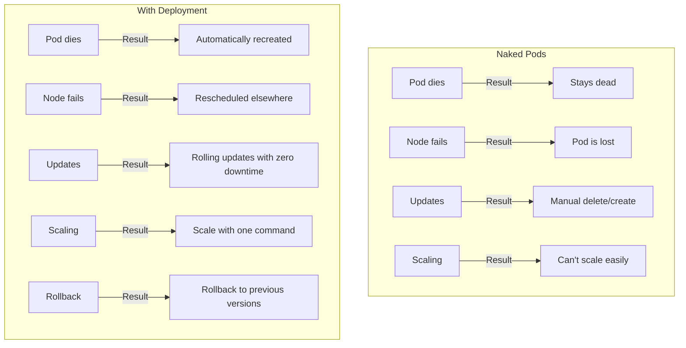
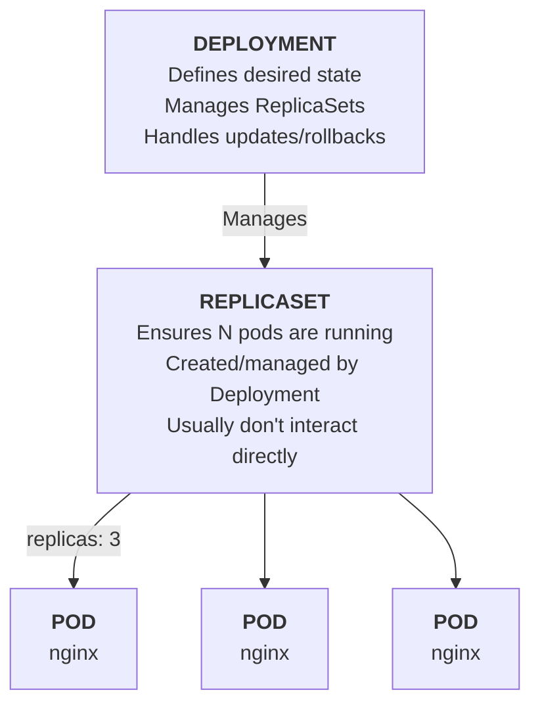
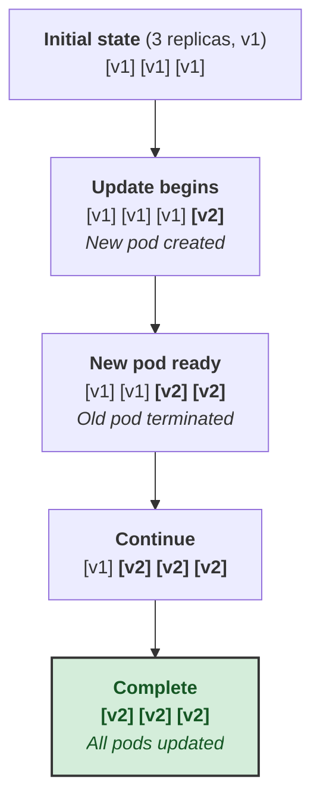

> **Складність**: `[MEDIUM]` - Базове управління робочими навантаженнями.
>
> **Час на проходження**: 40-45 хвилин.
>
> **Попередні вимоги**: Модуль 1.3: Pods. Цей модуль передбачає наявність кластера Kubernetes 1.35 або новішої версії та робочої оболонки (shell). Усі приклади, які можна запустити, використовують повну команду `kubectl`, тому їх можна копіювати як у скрипти, так і в інтерактивні термінали.

---

## Що ви зможете зробити

Після завершення цього модуля ви зможете:

- **Реалізувати** Deployments імперативно та декларативно, зберігаючи узгодженість селекторів та шаблонів.
- **Масштабувати** Deployment і діагностувати, як ReplicaSets створюють, замінюють та балансують Pods під ним.
- **Оцінювати** налаштування поступового оновлення (rolling update), поведінку відкату (rollback) та прогрес розгортання (rollout), коли реліз стає непрацездатним.
- **Діагностувати** збої Deployment, спричинені невідповідністю міток (labels), помилками образів, нестачею ресурсів та прямим редагуванням керованих ReplicaSets.


## Чому це важливо

Гіпотетичний сценарій: платіжний стартап запускає свій обробник платежів як єдиний голий Pod, тому що команда хоче мати якомога менший маніфест під час підготовки до запуску продукту. О другій годині дня в п'ятницю витік пам'яті вбиває цей Pod під час партнерської промоакції, і ніщо в кластері його не відтворює, оскільки жоден контролер не володіє цим робочим навантаженням. Протягом 23 хвилин кожен платіжний запит завершується помилкою, поки черговий інженер вручну не застосує заміну, а потім ще 15 хвилин втрачаються, коли для заміни використовується неправильний тег образу, і потрібне друге екстрене виправлення.

У цьому сценарії безпосередні невдалі платіжні транзакції, безумовно, мають значення, але довгострокова шкода є глибоко операційною та культурною. Інженери перестають довіряти власним розгортанням, служба підтримки витрачає години на спілкування з розлюченими продавцями, а наступний запланований реліз відкладається на невизначений термін, оскільки команда не має надійного, повторюваного способу безпечної заміни екземплярів застосунків, що дають збій. Контролер Deployment не змусить витік пам'яті базового застосунку магічним чином зникнути. Однак він би автоматично, без втручання людини, відтворив Pod, що дав збій, уперто підтримував би бажану кількість реплік протягом усього часу аварії і забезпечив би жорстко контрольований шлях поступового оновлення для остаточного виправлення, повністю уникнувши ручної перебудови пізно ввечері в п'ятницю під сильним тиском.

Ця операційна стійкість — саме та причина, чому Deployment є першим контролером робочих навантажень Kubernetes, до якого варто ставитися як до чогось набагато більшого, ніж просто синтаксис YAML. У той час як Pod суворо описує одну запущену ефемерну копію контейнеризованого процесу, Deployment описує довгостроковий стратегічний намір: скільки ідентичних копій має існувати, як саме вони повинні оновлюватися при зміні шаблону, і як саме control plane Kubernetes має рішуче відновлювати роботу, коли фізична реальність відхиляється від бажаного декларативного стану. Основна практична навичка тут — це абсолютно не запам'ятовування прапорців `kubectl create deployment`. Справжня інженерна навичка — навчитися динамічно читати Deployment, проміжні ReplicaSet та базові рівні Pod як одну цілісну, безперервну систему управління, яка агресивно захищає доступність для користувачів, водночас безпечно дозволяючи вам ітерувати та змінювати своє програмне забезпечення.

Уявіть Deployment як менеджера ресторану, а не як окремого офіціанта. Ви кажете: "Мені потрібно три навчених офіціанти в залі, які працюють за поточним меню", і менеджер займається наймом, заміною того, хто взяв лікарняний, і переведенням персоналу на оновлене меню, не спорожняючи обідній зал. Kubernetes використовує точнішу мову, але форма та сама: ви декларуєте бажаний план укомплектування персоналом, і контролер продовжує узгоджувати ситуацію в залі, поки спостережуваний стан не збігатиметься з цим планом.


## Чому існують Deployment

Pod корисні для навчання, оскільки вони представляють найменшу одиницю планування в Kubernetes, але вони є неправильною абстракцією для довготривалих застосунків. Pod не має пам'яті про те, скільки його аналогів має існувати, не має стратегії оновлення і не має власника, який міг би його перебудувати після видалення. Якщо вузол зникає, планувальник може розмістити нові Pod лише тоді, коли цього попросить контролер вищого рівня, що означає, що голий Pod ближче до процесу, запущеного вручну, ніж до керованого сервісу.

Deployment вирішують цю проблему шляхом додавання стійкого наміру поверх окремих Pod. Контролер Deployment зберігає бажану кількість реплік, шаблон Pod, селектор, який ідентифікує керовані Pod, і стратегію зміни цього шаблону з часом. Коли кластер відрізняється від цього наміру, Kubernetes створює, видаляє або масштабує ReplicaSet, а ті ReplicaSet створюють, видаляють або замінюють Pod, поки живе робоче навантаження не збіжиться із запитаною формою. Це безперервне зусилля забезпечується циклом узгодження (reconciliation loop) Kubernetes — ключовим патерном теорії управління. Замість виконання імперативних команд "запустити Pod", контролер Deployment спостерігає за спільним кешем інформера, який транслює зміни стану в реальному часі з API-сервера. Коли він помічає відхилення між бажаним станом (ваш YAML) і спостережуваним станом (фактичною реальністю кластера), він ставить операцію синхронізації в чергу завдань (workqueue). Цей механізм спрацьовує за рівнем (level-triggered), а не за фронтом (edge-triggered): якщо синхронізація завершується невдачею або контролер аварійно зупиняється, наступний цикл читає абсолютний поточний стан, а не покладається на пропущену історичну подію. Черга завдань використовує обмеження швидкості, щоб запобігти перевантаженню API-сервера через Pod, що постійно перезапускається (flapping Pod), гарантуючи, що застосунок, який безперервно дає збій, експоненціально сповільнює спроби повторного виконання контролером, а не споживає всі ресурси control plane.



Важлива відмінність на діаграмі полягає не в тому, що Deployment складніші; вона полягає в тому, що вони зберігають намір після першого успішного запуску. Голий Pod може ідеально працювати опівдні і все одно залишити вас беззахисними о пів на першу, тому що немає контролера, зобов'язаного помітити збій. Deployment постійно запитує, чи існує очікувана кількість готових Pod, тому одноразовий запуск перетворюється на постійний контракт між вашим маніфестом і кластером.

Цей контракт є особливо цінним, тому що збій рідко трапляється в одній чіткій категорії. Вузол може бути спорожнений (drain) під час несподіваного технічного обслуговування обладнання, образ може не завантажитися в одному конкретному географічному регіоні, погано налаштований запит ресурсів може зробити нові Pod неможливими для планування, або проба готовності може виявити, що нова версія запускається без помилок, але взагалі не здатна обслуговувати трафік застосунку. Deployment надають вам єдину уніфіковану control plane для спостереження за всіма цими різними ситуаціями. Що вкрай важливо, вони роблять типову операційну реакцію глибоко консервативною: контролер буде вперто підтримувати доступність достатньої кількості старих Pod для обслуговування користувачів, водночас неодноразово намагаючись перевести кластер на нову запитану версію.

Зупиніться та подумайте: якщо ви вручну видалите два Pod з Deployment, що має п'ять реплік, який саме об'єкт помітить це першим, і який об'єкт створить заміни? Відповідь має велике значення, оскільки оператори часто кажуть "Deployment відтворив мої Pod", але правда є більш нюансованою: Deployment делегує цю негайну, швидку математику реплік безпосередньо активному ReplicaSet. Жорсткий цикл інформера ReplicaSet помічає, що кількість запущених Pod, які відповідають його селектору, стала меншою за бажану кількість, і негайно штампує заміни. Ця архітектурна відмінність стає неймовірно корисною, коли ви під тиском вивчаєте розгортання, що застрягло; вам потрібно швидко дізнатися, який саме рівень генерує фактичний симптом вузького місця — Deployment, новий ReplicaSet чи Pod, що дають збій.

Таким чином, Deployment є водночас і механізмом безпеки, і картою для налагодження. Коли застосунок здоровий, ви здебільшого взаємодієте з Deployment, оскільки він є джерелом істини. Коли він нездоровий, ви спускаєтеся вниз по ієрархії: умови (conditions) Deployment пояснюють прогрес розгортання, кількість ReplicaSet пояснює баланс між старим і новим, а статус Pod пояснює планування, образ, готовність або поведінку при збоях.


## Створення Deployment

Існують два звичайні способи створення Deployment, і вони служать різним цілям. Імперативні команди швидкі, коли ви досліджуєте кластер, тестуєте невеликий образ або генеруєте початковий маніфест. Декларативний YAML — це виробнича звичка, оскільки його можна переглянути, версіонувати, повторити та порівняти з живим кластером, не покладаючись на того, хто випадково ввів оригінальну команду.

Перший блок команд зберігає швидкий робочий процес тестування з оригінального модуля, використовуючи повну назву бінарного файлу `kubectl`. Ця невелика багатослівність є навмисною, оскільки ту саму команду можна вставити в оболонку, лабораторну нотатку або скрипт, не покладаючись на інтерактивне розгортання псевдонімів. Команда холостого запуску (dry-run) є особливо корисною, оскільки вона дозволяє перетворити правильний однорядковий експеримент у YAML, не вдаючи, що написані вручну маніфести завжди є найшвидшим першим кроком.

```bash
# Create deployment
kubectl create deployment nginx --image=nginx

# With replicas
kubectl create deployment nginx --image=nginx --replicas=3

# Dry run to see YAML
kubectl create deployment nginx --image=nginx --dry-run=client -o yaml
```

Імперативне створення є свідомо вузьким і жорстко регламентованим (heavily opinionated): воно дозволяє швидко встановити ім'я, цільовий образ і базову кількість реплік, але воно фундаментально не спонукає вас міркувати про складні селектори, специфічні стратегії оновлення, критичні запити ресурсів або користувацькі мітки поза межами мінімальних значень за замовчуванням, які генерує для вас CLI. Ця простота є цілком прийнятною для дослідження навчального кластера, але вона є небезпечно ризикованою для спільного виробничого середовища, де передбачуваність є обов'язковою. Ви повинні розглядати імперативну команду виключно як швидкий інструмент для створення каркаса. Після того, як базова структура згенерована за допомогою dry-run, ви повинні негайно перемістити отриманий маніфест до системи контролю версій, перш ніж інші інженери або автоматизовані конвеєри CI/CD почнуть наосліп покладатися на його незадокументоване існування.

Декларативне створення починається з повного бажаного стану. Селектор вказує, якими Pod володіє Deployment, шаблон вказує, як повинні виглядати майбутні Pod, а кількість реплік вказує, скільки відповідних Pod потрібно підтримувати. Селектор і мітки шаблону повинні збігатися, оскільки контролер, який не може розпізнати власні Pod, або не керуватиме нічим, або випадково конкуруватиме з іншим контролером.

```bash
cat << 'EOF' > deployment.yaml
apiVersion: apps/v1
kind: Deployment
metadata:
  name: nginx
  labels:
    app: nginx
spec:
  replicas: 3                    # Number of pod copies
  selector:                      # How to find pods to manage
    matchLabels:
      app: nginx
  template:                      # Pod template
    metadata:
      labels:
        app: nginx               # Must match selector
    spec:
      containers:
      - name: nginx
        image: nginx:1.26
        ports:
        - containerPort: 80
EOF

kubectl apply -f deployment.yaml
```

Перш ніж запустити це, який вивід ви очікуєте від `kubectl get deploy,rs,pods` після завершення `apply`? Здоровий результат повинен показати один Deployment, один активний ReplicaSet і три Pod з іменами, похідними від імені ReplicaSet. Якщо ви бачите менше Pod, ніж запитувалося, втримайтеся від бажання застосувати маніфест знову; виконайте describe для Deployment і огляньте Pod, оскільки контролер вже намагається вирішити проблему, і йому потрібно, щоб ви прочитали, що його блокує.

Найбезпечніша ментальна модель полягає в тому, що `kubectl apply` змінює намір, а не безпосередньо запускає контейнери. Якщо ви відредагуєте `replicas: 3` на `replicas: 5` і застосуєте файл знову, Kubernetes порівняє новий бажаний стан з поточним станом кластера, а потім попросить активний ReplicaSet створити два додаткових Pod. Існуючі здорові Pod залишаються недоторканими, оскільки шаблон Pod не змінився, ось чому масштабування Deployment має бути менш руйнівним (disruptive), ніж видалення та повторне створення.

Практична звичка команди — тримати невелику нотатку з командами поруч із маніфестом під час ранньої розробки: імперативну команду, яка згенерувала перший проект, декларативний файл, який став джерелом істини, і команди перевірки, які використовувалися після кожної зміни. Ця звичка допомагає початківцям пов'язати швидкі експерименти з інфраструктурою, яку можна перевіряти. Вона також запобігає поширеній ситуації "розщеплення свідомості" (split-brain), коли один інженер змінює YAML, а інший намагається виправити той самий Deployment за допомогою ситуативних (ad hoc) команд.


## Архітектура Deployment

Архітектура Deployment має три видимі рівні, і кожен рівень відповідає за різний тип рішень у суворому ланцюжку власності. Deployment володіє наміром розгортання та історією, делегуючи повноваження ReplicaSet, який володіє кількістю ідентичних Pods з однієї конкретної ревізії шаблону, тоді як кожен Pod володіє фактичним станом контейнера для одного запущеного екземпляра. Ця ієрархія пов'язана через `ownerReferences` — зворотні вказівники UID — у метаданих дочірніх об'єктів. Коли Deployment створює ReplicaSet, він впроваджує свій UID в `ownerReferences` ReplicaSet. ReplicaSet робить те саме для Pods, які він створює. Цей суворий ланцюжок власності гарантує, що збір сміття відбувається каскадно й чисто: видалення Deployment автоматично запускає видалення його ReplicaSets, які в свою чергу видаляють свої Pods. Зазвичай ви змінюєте лише Deployment, оскільки прямі редагування дочірніх об'єктів або перезаписуються під час наступного циклу узгодження, керованого рівнем, або повністю обходять історію, необхідну для відкату.



Рівень ReplicaSet існує, оскільки для історії розгортання потрібні стабільні знімки. Коли ви оновлюєте шаблон Pod у Deployment, Kubernetes створює новий ReplicaSet для нового шаблону, зберігаючи старі ReplicaSets із нульовою або меншою кількістю реплік. Відкат потім може знову масштабувати старий ReplicaSet, оскільки його шаблон усе ще описує попередню версію. Без цього проміжного рівня Kubernetes довелося б реконструювати старі шаблони Pod з менш надійної історії.

Ви можете спостерігати ієрархію, не вивчаючи жодного прихованого API. Список ресурсів `deploy,rs,pods` є однією з найкорисніших команд для початківців, оскільки він показує батьківський об'єкт, ревізію шаблону та живі екземпляри в одному поданні. Імена навмисно пов'язані: Deployment з іменем `nginx` створює ReplicaSets зі згенерованими суфіксами, а Pods успадковують ще один суфікс, щоб ви могли візуально відстежити власність перед використанням міток або посилань на власників.

```bash
# List deployments
kubectl get deployments
kubectl get deploy              # Short form

# Detailed info
kubectl describe deployment nginx

# See related resources
kubectl get deploy,rs,pods
```

Корисний патерн налагодження — почати широко і спускатися лише тоді, коли ширший рівень вказує вам униз. `kubectl describe deployment nginx` показує такі умови, як прогрес і доступність, останні події, інформацію про селектори, а також бажану кількість порівняно з доступною. Якщо ці кількості не збігаються, `kubectl get rs` показує, чи має старий або новий ReplicaSet репліки, а `kubectl get pods` показує конкретну причину, чому певний екземпляр очікує, падає або не готовий.

Прямі редагування ReplicaSet є спокусливими, оскільки об'єкт видимий і має поле реплік, але це поле не є джерелом істини, коли ним володіє Deployment. Наступний цикл узгодження налаштує ReplicaSet відповідно до бажаного стану Deployment, або наступне оновлення Deployment створить абсолютно інший ReplicaSet. У робочому середовищі це є перевагою: оператори можуть довіряти тому, що керовані дочірні об'єкти повертаються до батьківської специфікації, а не накопичують приховане ручне відхилення.

Зупиніться та подумайте: якщо ви редагуєте ReplicaSet безпосередньо за допомогою `kubectl edit rs <name>` і змінюєте його кількість реплік, що має зробити Deployment? Він повинен помітити, що стан дочірнього об'єкта більше не відповідає наміру Deployment, і виправити відхилення. Суть навчання полягає не в тому, щоб "ніколи не перевіряти ReplicaSets"; вона полягає в тому, щоб "перевіряти їх вільно, але вносити довговічні зміни на рівні Deployment".


## Масштабування, самовідновлення та операції другого дня

Масштабування — це найпростіша операція, яка доводить модель контролера. Ви не запускаєте окремі Pods; ви змінюєте бажану кількість реплік, а система контролера вирішує, як досягти цієї кількості. Ця різниця має значення під час інцидентів, оскільки видалення поганого Pod, вивільнення вузла або масштабування робочого навантаження стають варіаціями однієї і тієї ж історії узгодження, а не окремими операційними трюками.

```bash
# Scale up/down
kubectl scale deployment nginx --replicas=5

# Or patch the deployment to scale
kubectl patch deployment nginx -p '{"spec": {"replicas": 5}}'

# Watch pods scale
kubectl get pods -w
```

Коли ви масштабуєте з трьох реплік до п'яти, контролер Deployment оновлює свій власний намір, який каскадно передається активному ReplicaSet. Потім ReplicaSet спостерігає відхилення між 3 Pods, які він бачить, і 5 бажаними, і створює два нові Pods з абсолютно того самого шаблону. Саме тут проявляють себе спільний кеш інформатора та робоча черга, керована рівнем: якщо мережеве розділення тимчасово приховує вузол, контролер може подумати, що Pod відсутній, і створити заміну. Коли розділення зникає, контролер раптом спостерігає 6 Pods і спокійно масштабується назад до 5. Коли ви масштабуєтесь назад, Kubernetes вибирає Pods для завершення відповідно до специфічної логіки контролера та підказок планування — він, як правило, віддає перевагу видаленню не готових Pods або Pods, розміщених на тому самому вузлі, щоб підтримувати топологічний баланс. Оскільки ви не можете ідеально передбачити, який Pod буде завершено, вам слід повністю уникати зберігання унікального локального стану в будь-якому окремому Pod. Deployment структурно припускає, що репліки є ідентичними та взаємозамінними, що ідеально підходить для веб-сервісів без стану, які горизонтально масштабуються, але неймовірно небезпечно для баз даних з одним записом, які потребують сильніших гарантій ідентичності та впорядкованих послідовностей запуску.

Самовідновлення використовує ту саму логіку підрахунку. Якщо один Pod зникає, ReplicaSet спостерігає менше живих Pods, ніж бажано, і створює заміну. Якщо вузол виходить з ладу, Pods на цьому вузлі зникають зі здорового набору, і замінні Pods можуть бути заплановані в іншому місці, якщо кластер має ємність і шаблон Pod може бути запланований. Deployment не обіцяє магічної ємності; він обіцяє безперервні зусилля для досягнення оголошеного стану.

```bash
# Create deployment
kubectl create deployment nginx --image=nginx --replicas=3

# See pods
kubectl get pods

# Delete a pod (using label selector to target the first one)
kubectl delete pod $(kubectl get pods -l app=nginx -o jsonpath='{.items[0].metadata.name}')

# Immediately check again
kubectl get pods
# A new pod is already being created!

# The deployment maintains desired state
kubectl get deployment nginx
# READY shows 3/3
```

Зупиніться та подумайте: якщо ви видалите базовий ReplicaSet замість лише одного Pod, що зробить Deployment і чому робоче навантаження може ненадовго виглядати більш порушеним? Deployment володіє ReplicaSet, тому він перестворює відповідний ReplicaSet, який потім перестворює Pods. Перебій може бути більшим, ніж видалення одного Pod, оскільки ви видалили всього менеджера кількості відразу, але батьківський контролер все ще має достатньо інформації для відновлення запланованих дочірніх об'єктів.

Операційний компроміс полягає в тому, що самовідновлення може приховати повторювані збої, якщо ви дивитеся лише на кінцевий підрахунок READY. Pod, який падає кожні кілька хвилин, може замінюватися достатньо швидко, щоб поверхневі перевірки виглядали добре, тоді як журнали та кількість перезапусків розповідають іншу історію. Тому хороші операції з Deployment поєднують перевірки кількості з перевірками подій, перевірками розгортання та метриками на рівні застосунку, щоб узгодження не стало маскою для зламаного релізу.

Ще однією проблемою другого дня є автоматичне масштабування. Якщо HorizontalPodAutoscaler керує кількістю реплік, ваш маніфест Deployment і ваш автоскейлер можуть конфліктувати, якщо обидва продовжуватимуть стверджувати різну кількість. Багато команд опускають `.spec.replicas` з маніфесту Deployment, щойно HPA стає авторитетним, або вони керують змінами реплік через конфігурацію автоскейлера, а не через повторні застосування Deployment. Принцип такий самий, як і з ReplicaSets: вирішіть, який об'єкт володіє наміром, а потім уникайте конкуруючих записувачів.


## Поетапні оновлення та відкати

Поетапні оновлення — це те, де Deployments стають механізмом релізів, а не просто механізмом перезапуску. Зміна шаблону, як-от новий образ контейнера, змушує Deployment створювати новий ReplicaSet і поступово переміщувати репліки зі старого ReplicaSet до нового. Стратегія за замовчуванням намагається зберегти доступність, дозволяючи обмежену кількість додаткових Pods і обмежену кількість недоступних Pods під час переходу.

```bash
# Update image
kubectl set image deployment/nginx nginx=nginx:1.27

# Watch rollout
kubectl rollout status deployment nginx

# View rollout history
kubectl rollout history deployment nginx
```

Важлива поведінка полягає в тому, що розгортання очікує, поки нові Pods стануть готовими, перш ніж видалить занадто багато старої ємності. Якщо новий образ успішно завантажується та проходить перевірку готовності, Deployment продовжує переносити ємність трафіку на новий ReplicaSet, доки старий не досягне нуля. Якщо образ зламаний, нові Pods можуть залишатися в стані `ImagePullBackOff`, тоді як старі Pods продовжують обслуговування, що дає вам час на відкат, не викликаючи повного простою.

```bash
# Undo last change
kubectl rollout undo deployment nginx

# Rollback to specific revision
kubectl rollout history deployment nginx
kubectl rollout undo deployment nginx --to-revision=2
```

Відкати працюють механічно, оскільки старі ReplicaSets зберігають попередні шаблони Pod неактивними в кластері. Коли ви ініціюєте оновлення, контролер Deployment не видаляє старий ReplicaSet; натомість він зменшує кількість його реплік до нуля, водночас збільшуючи масштаб нового ReplicaSet. Оскільки старий об'єкт ReplicaSet виживає, його вбудований шаблон Pod зберігається точно таким, яким він був. Коли ви запускаєте `kubectl rollout undo`, контролер Deployment ефективно міняє місцями цільові кількості реплік: він зменшує масштаб зламаного нового ReplicaSet до нуля та знову збільшує масштаб неактивного старого ReplicaSet до бажаної кількості. Історія ревізій (`kubectl rollout history`) реконструюється динамічно шляхом читання анотацій `deployment.kubernetes.io/revision`, проставлених на цих збережених ReplicaSets. Ліміт історії ревізій (`.spec.revisionHistoryLimit`) за замовчуванням дорівнює десяти, чого достатньо для багатьох лабораторій для початківців, але все одно це має бути явним операційним вибором у реальних системах. Дуже низький ліміт історії рятує від захаращення об'єктами базу даних etcd, але зменшує варіанти відновлення, тоді як дуже високий ліміт зберігає більше шаблонів без заміни належних записів релізів, спостережливості чи походження артефактів.

Спробуйте запустити `kubectl set image deployment/nginx nginx=nginx:broken` на одноразовому лабораторному Deployment, а потім порівняйте `kubectl get pods`, `kubectl describe deployment nginx` та `kubectl rollout status deployment nginx`. Ви повинні побачити, як Kubernetes захищає старі здорові Pods, повідомляючи при цьому, що нова ревізія не просувається. Це той момент, коли Deployment відчувається менше як обгортка команди, а більше як запобіжник релізу.

Статус розгортання повинен бути частиною кожного застосування, керованого людиною або CI. `kubectl apply -f deployment.yaml` повідомляє вам, що API прийняв бажаний стан, але він не доводить, що робоче навантаження стало здоровим. `kubectl rollout status deployment nginx` очікує на прогрес Deployment, і його збій є сигналом для перевірки подій, причин стану Pod і доступності образу, перш ніж повідомляти користувачам, що реліз завершено.


## Стратегія Rolling Update

Стратегія rolling update (поступового оновлення) керується параметрами `maxSurge` та `maxUnavailable`. `maxSurge` визначає, скільки додаткових Pods може створити Kubernetes понад бажану кількість реплік під час оновлення, тоді як `maxUnavailable` вказує, скільки бажаних Pods можуть бути недоступними під час цього переходу. За замовчуванням Kubernetes встановлює обидва значення на рівні двадцяти п'яти відсотків, але правильне налаштування залежить від місткості, часу запуску та того, який рівень недоступності може витримати застосунок.

```yaml
spec:
  strategy:
    type: RollingUpdate
    rollingUpdate:
      maxSurge: 25%        # Max extra pods during update
      maxUnavailable: 25%  # Max pods that can be unavailable
```

Ці два значення формують контракт місткості, який чітко регулює поведінку пропорційного масштабування під час переходу. Коли Deployment перебуває посеред процесу rolling update, ви можете мати як старий ReplicaSet, що зменшується, так і новий ReplicaSet, що збільшується. Якщо автоскейлер або оператор-людина змінює загальну кількість реплік Deployment у цей час, контролер виконує пропорційне масштабування: він розподіляє нову загальну бажану кількість реплік між існуючими ReplicaSets на основі їхнього поточного розміру. 

Щоб пояснити це на конкретному прикладі, розглянемо Deployment з 10 репліками, `maxSurge: 3` та `maxUnavailable: 2`. Коли починається оновлення, Deployment може негайно створити до 3 додаткових Pods у новому ReplicaSet (досягаючи 13 Pods загалом у кластері) і може одночасно завершити до 2 Pods у старому ReplicaSet (знижуючи стару потужність обслуговування до 8). Якщо новим Pods потрібен час, щоб стати готовими, математика визначає нижню межу: кластер підтримуватиме щонайменше 8 доступних Pods протягом усієї операції, тимчасово споживаючи ресурси для максимум 13. Якщо ви раптово масштабуєте весь Deployment з 10 до 20 під час rollout, контролер розподіляє нову бажану кількість 20 між існуючими старим і новим ReplicaSets пропорційно їхнім поточним розмірам, тому rollout продовжує просуватися до нової базової лінії. Зверніть увагу на те, як поводяться самі обмеження: `maxSurge` та `maxUnavailable`, виражені у відсотках, перераховуються відносно нової бажаної кількості, тоді як абсолютні цілі значення, як-от `3` та `2` у цьому прикладі, залишаються незмінними. Високий surge з нульовою кількістю недоступних Pods сприяє доступності та швидкості, але вимагає вільних процесорних потужностей (CPU), пам'яті, IP-адрес і простору для планування тимчасових додаткових Pods. Низький surge з певною недоступністю є кращим для обмежених кластерів, але це може знизити поточну здатність обслуговування під час rollout. Встановити обидва параметри в нуль неможливо, оскільки тоді Kubernetes не мав би дозволу ні створити новий Pod, ні видалити старий.



Діаграма показує сприятливий випадок, коли нові Pods швидко стають готовими. Реальні розгортання є складнішими, оскільки readiness probes, повільне завантаження образів, брак ресурсів і розміщення на вузлах можуть розтягнути кожен крок. Якщо нові Pods не можуть стати готовими до закінчення терміну виконання, Deployment повідомляє про помилку `ProgressDeadlineExceeded`; він не скасовує реліз автоматично за вас, тому ваш операційний процес має вирішити: зробити відкат, виправити образ чи змінити місткість.

Який підхід ви б обрали в такій ситуації і чому: `maxSurge: 1, maxUnavailable: 0` для вебзастосунку, орієнтованого на клієнтів, чи `maxSurge: 0, maxUnavailable: 1` для невеликого внутрішнього воркера? Вебзастосунок часто заслуговує на додаткову тимчасову місткість, щоб уникнути втрати запитів, тоді як воркер може змиритися з повільнішою заміною, якщо в кластері мало вільного місця. Правильна відповідь залежить від обіцянки доступності робочого навантаження, а не від універсального налаштування.

Деякі застосунки не можуть безпечно запускати стару і нову версії одночасно. Застарілий процес із єдиним записувачем, який виконує односторонню міграцію бази даних, може потребувати стратегії `Recreate`, яка зупиняє старі Pods перед запуском нових. Ця стратегія створює простій за задумом, але це може бути правильним вибором, коли одночасні версії можуть пошкодити спільний стан. Kubernetes дає вам інструмент; ваше завдання — узгодити його з логікою застосунку.


## Пояснення Deployment YAML

Виробничий маніфест Deployment — це більше, ніж просто ім'я та образ. Він фіксує мітки для виявлення, селектори для визначення належності, поведінку rollout для релізів та налаштування ресурсів, які дозволяють планувальнику приймати реалістичні рішення щодо розміщення. Початківці часто зосереджуються на блоці `containers`, оскільки він виглядає як сам застосунок, але навколишні поля вирішують, чи зможе Kubernetes безпечно керувати цим застосунком.

```yaml
apiVersion: apps/v1
kind: Deployment
metadata:
  name: nginx
  labels:
    app: nginx
spec:
  replicas: 3                    # Desired pod count
  selector:
    matchLabels:
      app: nginx                 # Must match template labels
  strategy:
    type: RollingUpdate
    rollingUpdate:
      maxSurge: 1                # Defaults to 25% if not specified
      maxUnavailable: 0          # Defaults to 25% if not specified
  template:                      # Pod template (same as Pod spec)
    metadata:
      labels:
        app: nginx               # Labels for service discovery
    spec:
      containers:
      - name: nginx
        image: nginx:1.26
        ports:
        - containerPort: 80
        resources:
          requests:
            memory: "64Mi"
            cpu: "100m"
          limits:
            memory: "128Mi"
            cpu: "200m"
```

Селектор заслуговує на особливу увагу, оскільки він є незмінним в `apps/v1`. Після створення Deployment ви не можете просто змінити мітки, які визначають належність, оскільки це може призвести до появи осиротілих Pods або змусити контролер удочерити неправильні Pods. Якщо вам потрібен інший селектор, безпечним шляхом зазвичай є створення нового Deployment з правильним селектором, міграція трафіку через Service або шар маршрутизації, а потім видалення старого Deployment.

Ресурсні запити та ліміти не є специфічними для Deployment, але rollouts роблять їхню відсутність більш болючою. Під час оновлення Kubernetes може тимчасово запускати додаткові Pods, і планувальнику потрібні запити (requests), щоб знати, чи є в кластері вільне місце. Без запитів кластер може розмістити Pods занадто щільно; без лімітів зламана версія може споживати пам'ять або CPU так, що зашкодить сусіднім робочим навантаженням. Deployment може скоординувати заміну, але він не може зробити шаблон, який неможливо запланувати, таким, що планується.

Теги образів — це ще одне приховане джерело проблем із відкатами. Тег `latest` виглядає зручним, але він не ідентифікує стабільний артефакт, і різні вузли можуть мати різні закешовані образи. Використовуйте незмінні теги версій, релізні теги, прив'язані до збірки, або дайджести, якщо ваше середовище їх підтримує. Відкат має означати "повернення до відомого шаблону", а не "запитати кожен вузол, що він сьогодні вважає цим плаваючим тегом".

Анотації причини змін можуть допомогти людям читати історію rollout, але вони не замінюють нотатки до випуску (release notes) або історію Git. Deployment з радістю покаже номери ревізій, проте самі лише номери ревізій рідко пояснюють черговому інженеру, чому відбулася зміна. Коли команди пов'язують зміни в маніфестах, теги образів та спостереження за rollout, історія Deployment стає експлуатаційною підказкою, а не просто списком загадкових чисел.


## Патерни та Антипатерни

Хороше використання Deployment здебільшого полягає у виборі чіткого власника для ваших намірів і наданні можливості контролеру виконувати свою роботу. Використовуйте Deployment, коли репліки є взаємозамінними, застосунок може витримати заміну, і вам потрібна історія rollout. Використовуйте StatefulSet або інший тип робочого навантаження, коли ідентичність, стабільний порядок зберігання даних або семантика покрокового виконання є ключовими для коректної роботи. Помилка полягає не у виборі простішого об'єкта; помилка полягає у його виборі без узгодження з поведінкою робочого навантаження.

| Патерн | Коли використовувати | Чому це працює | Міркування щодо масштабування |
|---|---|---|---|
| Декларативні маніфести Deployment | Спільні середовища, CI та все, що перевіряється командою | Маніфест фіксує селектор, шаблон, ресурси та стратегію rollout в одному джерелі істини | Поєднуйте це з `kubectl rollout status`, щоб успішне застосування не було помилково прийняте за справність застосунку |
| Невеликий surge з нульовою кількістю недоступних Pods | Сервіси, орієнтовані на користувача, з достатньою кількістю вільного місця в кластері | Нові Pods підтверджують готовність до того, як буде видалена стара місткість | Місткість має покривати принаймні бажану кількість реплік плюс дозволений surge |
| Незмінні теги образів | Будь-яке середовище, де відкат має бути передбачуваним | Кожна ревізія вказує на відомий артефакт, а не на плаваючий тег | Назви тегів повинні чітко пов'язуватися з метаданими збірки, релізу або коміту |
| Інспектуйте нащадків, редагуйте батьків | Налагодження Deployments, ReplicaSets та Pods під час інцидентів | Статус нащадка дає симптоми, тоді як Deployment залишається довговічним наміром | Прямі зміни нащадків можуть бути перезаписані, тому переносьте надійні виправлення до Deployment |

Антипатерни зазвичай з'являються тоді, коли команда ставиться до об'єктів Kubernetes як до незалежних файлів, а не як до ієрархії. Редагування ReplicaSet для виправлення Deployment схоже на зміну роздрукованої копії розкладу, тоді як менеджер продовжує друкувати справжній з іншої системи. Зміна може виглядати видимою на мить, але це не те місце, де живе довговічне рішення, тому узгодження зрештою зітре її.

| Антипатерн | Що йде не так | Краща альтернатива |
|---|---|---|
| Запуск "голих" Pods для сервісів | Збої, втрата вузла та оновлення вимагають ручного втручання | Використовуйте Deployments для застосунків без стану, що реплікуються |
| Використання `latest` для релізних образів | Відкат та аудит стають неоднозначними, оскільки тег може змінюватися | Використовуйте незмінні теги або дайджести, прив'язані до збірки |
| Ігнорування прогресу rollout | API приймає поганий маніфест, тоді як користувачі залишаються на старій або зламаній версії | Захищайте релізи за допомогою `kubectl rollout status` та інспектуйте події у разі невдачі |
| Зміна селекторів після запуску | Селектор є незмінним, і неправильна належність може створити осиротілі робочі навантаження | Проектуйте мітки до створення або мігруйте за допомогою нового Deployment |


## Структура прийняття рішень

Обирайте Deployment, коли репліки застосунку є взаємозамінними, шаблон Pod може з часом замінюватися, а бажана операційна поведінка полягає в тому, щоб «підтримувати N здорових копій під час випуску нових версій». Обирайте «голий» Pod лише для коротких навчальних експериментів, де ви цілеспрямовано вивчаєте поведінку Pod. Обирайте StatefulSet, коли кожній репліці потрібна стабільна ідентичність, впорядковане розгортання або семантика постійного сховища, яких Deployment свідомо уникає.

| Ситуація | Надавайте перевагу | Причина |
|---|---|---|
| Веб-API без стану (stateless) із трьома або більше репліками | Deployment з RollingUpdate | Репліки є взаємозамінними та можуть замінюватися поступово |
| Одноразовий контейнер для усунення несправностей | Pod або Job | Контролер для тривалого підтримання бажаного стану не потрібен |
| Пакетне завдання, яке має завершитися один раз | Job | Успіх — це завершення, а не безперервна доступність |
| База даних зі стабільною ідентичністю та сховищем | StatefulSet | Імена Pod, сховище та порядок розгортання мають значення |
| Застарілий застосунок (legacy), який не може запускати дві версії одночасно | Deployment з Recreate, або перепроєктування перед масштабуванням | Доступністю жертвують заради коректності під час заміни |

Рішення щодо стратегії розгортання (rollout) — це окремий рівень від вибору типу робочого навантаження. Після того, як ви вирішите, що Deployment є доречним, визначте, чи може застосунок запускати стару та нову версії пліч-о-пліч, скільки вільної ємності має кластер і скільки часу потрібно новому Pod для переходу в стан готовності. Ці відповіді визначатимуть значення `maxSurge`, `maxUnavailable`, проби готовності (readiness probes) і те, чи має випуск бути автоматичним, чи потребуватиме контрольної точки за участю людини.

Під час інцидентів використовуйте цю саму структуру у зворотному напрямку. Якщо користувачі повідомляють про помилки після релізу, перевірте, чи просувається Deployment, чи має новий ReplicaSet готові репліки, і чи не виходять Pod з ладу через планування, образ, готовність або збої. Якщо старий ReplicaSet все ще обслуговує достатньо ємності, відкат (rollback) часто є першим кроком із найнижчим ризиком; якщо ж і стара, і нова версії не є здоровими, зосередьтеся на спільних залежностях, ємності або конфігурації, а не лише на механізмі розгортання.

### Практичний приклад: Аналіз завислого розгортання

Уявіть, що команда випускає новий образ фронтенду на початку тихого вікна обслуговування. Команда apply виконується успішно, але на панелі інструментів релізу нова версія так і не з'являється, а `kubectl rollout status` згодом повідомляє, що Deployment перевищив крайній термін просування. Це момент, коли новачки часто повторюють ту саму команду apply, видаляють випадкові Pod або масштабують Deployment вниз і знову вгору. Такі дії створюють лише більше метушні, не відповідаючи на головне запитання: який рівень не зміг перейти від бажаного стану до здорового спостережуваного стану?

Почніть із Deployment, оскільки він фіксує історію розгортання. Бажана кількість реплік повідомляє, яку ємність намагається підтримувати контролер, тоді як доступна та оновлена кількість вказують на те, чи створив новий шаблон достатньо готових Pod. Умови (Conditions) додають поля часу та причини, тому збій просування — це не просто «команда завершилася з помилкою»; це Kubernetes каже, що новий ReplicaSet не просунувся в очікуваний проміжок часу. Це звужує поле пошуку до того, як ви почнете перевіряти окремі Pod.

Далі, прочитайте ReplicaSet як знімки ревізій. Один ReplicaSet представляє старий шаблон, а інший — новий шаблон, і кількість їхніх реплік показує, наскільки далеко зайшло розгортання до того, як зупинитися. Якщо старий ReplicaSet все ще має більшість доступних реплік, Deployment захистив ємність обслуговування, поки нова версія зазнала невдачі. Якщо обидва ReplicaSet мають мало або взагалі не мають готових реплік, проблема може бути ширшою за поганий образ, і вам слід перевірити планування, спільну конфігурацію або ємність кластера, перш ніж припускати, що відкат повністю відновить роботу сервісу.

Потім огляньте Pod, які належать новому ReplicaSet. Статус Pod вказує на конкретні причини, які батьківські об'єкти навмисно узагальнюють. `ImagePullBackOff` вказує на проблему з тегом, реєстром або обліковими даними. `Pending` вказує на обмеження планування, нестачу ресурсів, taints (обмеження), affinity (прив'язки) або недоступні вузли. `CrashLoopBackOff` вказує на контейнер, який запускається та завершує роботу, тому логи та конфігурація застосунку стають кориснішими за поля Deployment. `Running` без стану готовності вказує на проби, час запуску, залежності або перевірки працездатності застосунку.

Дисципліна полягає в тому, щоб уникати змішування симптомів із різних рівнів. Умова Deployment може сказати вам, що розгортання не просувається, але вона не може сказати, чи не вистачає в контейнері змінної середовища. Подія Pod може повідомити, що завантаження образу не вдалося, але вона не може сказати, чи існує історія відкатів. Кількість ReplicaSet може показати, яка частина кожної ревізії є активною, але не може сказати, чи користувачі все ще досягають достатньої кількості здорових кінцевих точок. Кожен рівень відповідає на інше запитання, і надійні оператори ставлять ці запитання по порядку.

Таке багаторівне читання також допомагає вирішити, чи потрібно робити відкат. Якщо нові Pod виходять з ладу через помилку в тегу образу, а старий ReplicaSet все ще обслуговує трафік, відкат зазвичай є швидким і має низький ризик. Якщо нові Pod перебувають у стані очікування (pending), оскільки кластер не має вільної ємності, відкат може зменшити навантаження шляхом видалення surge Pod (додаткових Pod, створених під час розгортання), але глибшим виправленням є планування ємності або встановлення менших значень surge. Якщо нові Pod запускаються, але так і не стають готовими через зміну низхідної залежності (downstream dependency), відкат може спрацювати лише в тому випадку, якщо стара версія все ще розуміє цю залежність.

Корисна інструкція з релізів (runbook) описує ці рішення простою мовою. «Якщо статус розгортання повідомляє про помилку, виконайте describe для Deployment, порівняйте старий і новий ReplicaSet, огляньте події нових Pod і робіть відкат лише після того, як визначите, чи стара ревізія все ще є здоровою». Це речення є ціннішим за сторінку розрізнених команд, оскільки воно навчає послідовності та меті. Команди легко знайти; найскладніше під час інциденту — знати, яке спостереження має змінити вашу наступну дію.

Для лабораторних робіт початкового рівня ви можете попрактикувати це, не ламаючи реальний сервіс, використавши вигаданий тег образу. Deployment прийме оновлення шаблону, оскільки API-сервер не може довести, що кожне завантаження з реєстру образів буде успішним із кожного вузла. Новий ReplicaSet створить Pod, ці Pod повідомлять про помилки завантаження, а розгортання припинить просування, тоді як старі Pod залишатимуться. Цей режим відмови є чудовою практикою, оскільки він помітний, зворотний і близький до помилок, які трапляються в реальних конвеєрах постачання (delivery pipelines).

Будьте обережні, щоб не переоцінити цю щасливу історію безпеки. RollingUpdate захищає ємність лише в межах налаштованих вами лімітів та сигналів готовності, які надає ваш застосунок. Якщо ваша проба готовності повертає успіх до того, як процес насправді зможе обслуговувати корисні запити, Kubernetes розглядатиме погані Pod як доступні та може завершити старі Pod занадто рано. Якщо ваш застосунок не має проби готовності, кластер може вважати контейнери готовими ще до того, як застосунок прогріє кеші, відкриє підключення до бази даних або завантажить конфігурацію.

Ось чому проєктування Deployment і проєктування перевірок працездатності застосунку тісно пов'язані. Deployment може координувати заміну, але йому потрібна точна інформація про готовність, щоб знати, коли заміна є безпечною. Запити на ресурси (resource requests) допомагають планувальнику вирішити, де можуть працювати змінні Pod, але вони повинні відображати фактичне навантаження під час запуску та в сталому стані. Історія відкатів допомагає вам повернутися до попереднього шаблону, але вона працює найкраще, коли теги образів і посилання на конфігурацію ідентифікують відомі артефакти, а не цілі, що постійно змінюються.

Ті самі міркування стосуються масштабування під час інциденту. Масштабування вгору (scaling up) Deployment зі зламаним новим шаблоном може створити більше зламаних Pod, якщо активне розгортання вказує на погану ревізію. Масштабування вгору здорової старої ревізії може бути саме тим, що вам потрібно, якщо проблема полягає в тиску трафіку, але пропорційне масштабування під час розгортання може розподілити репліки між старим і новим ReplicaSet. Перш ніж змінювати кількість реплік, перевірте, який ReplicaSet є активним, який є здоровим і чи потраплять додаткові Pod на ту версію, яку ви насправді хочете.

Зріла команда перетворює ці спостереження на політику розгортання. Вони можуть вимагати незмінних тегів образів, запитів на ресурси, проб готовності та перевірок статусу розгортання, перш ніж зміна буде вважатися завершеною. Вони можуть встановлювати консервативні значення surge для кластерів з обмеженою вільною ємністю та більш агресивні значення для клієнтських сервісів із доведеним запасом. Вони також можуть зарезервувати стратегію `Recreate` для застосунків, коректність яких залежить від того, щоб ніколи не запускати дві версії одночасно, водночас розглядаючи час простою (downtime) як задокументований компроміс, а не як несподіванку.

Найважливіша звичка — описати збій мовою контролера, перш ніж пропонувати виправлення. «Новий ReplicaSet має нуль готових Pod, оскільки кожен Pod перебуває у стані ImagePullBackOff» веде до іншої реакції, ніж «Deployment зламано». «Deployment доступний, але не повністю оновлений» викликає іншу реакцію, ніж «сервіс не працює». Точна мова зменшує кількість здогадок, і Kubernetes надає вам достатньо структурованого статусу, щоб бути точним, якщо ви читаєте від батьківського об'єкта до дочірнього.

Під час виконання лабораторної роботи озвучуйте кожну команду в такий спосіб. Створення Deployment встановлює бажаний стан. Масштабування змінює кількість реплік в активному намірі. Видалення Pod перевіряє узгодження (reconciliation) ReplicaSet. Оновлення образу створює нову ревізію шаблону та ReplicaSet. Відкат відновлює попередній шаблон. Очищення видаляє батьківський об'єкт, що також видаляє керовані дочірні об'єкти. Таке озвучування — це різниця між простим виконанням рецепта та вивченням операційної моделі.

Одна остання операційна деталь: Deployment чудово підходять для застосунків без стану (stateless), але вони не замінюють дисципліну релізів. Вони не будуть валідувати бізнес-логіку, безпечно мігрувати бази даних, обирати хороші теги образів або писати для вас осмислені проби готовності. Те, що вони забезпечують, — це надійний цикл контролера для підтримання та заміни взаємозамінних реплік. Як тільки ви зрозумієте цю межу, ви зможете впевнено використовувати Deployment, не очікуючи, що вони розв'яжуть проблеми, які належать до дизайну застосунку, тестування або політики платформи.

Ця межа також є причиною того, чому Deployment має бути частиною ширшої дискусії щодо постачання (delivery). Чистий маніфест, надійна збірка образу, проба готовності, Service та вентиль розгортання (rollout gate) — кожен відповідає на окреме запитання про готовність до продакшену. Deployment запитує, чи стають доступними запитані репліки запитаного шаблону; він не знає, чи правильна бізнес-функція, чи була міграція бази даних зворотною, і чи задовольняє нова версія робочий процес клієнта. Ставтеся до його сигналу як до необхідного, але не достатнього.

Коли ви перевіряєте зміну Deployment, зроблену іншим інженером, шукайте намір перед синтаксисом. Запитайте, чи селектор і мітки шаблону все ще збігаються, чи образ ідентифікує конкретний артефакт, чи запити на ресурси відповідають стратегії розгортання, і чи стратегія відповідає толерантності застосунку до версій, що перекриваються. Такий стиль перевірки виявляє приховані ризики для продакшену, які може пропустити YAML-лінтер, оскільки маніфест може бути валідним, тоді як операційна поведінка все ще залишатиметься хибною для цього робочого навантаження.

Із часом ці перевірки стають рутинними. Ви побачите ім'я Deployment і відразу запитаєте, який ReplicaSet є активним, які Pod готові, що змінилося в шаблоні та що означатиме відкат. Ця вільність володіння (fluency) і є метою цього модуля. Kubernetes дає вам компактний об'єкт API, але навичка полягає в тому, щоб навчитися читати його як живу угоду між дизайном застосунку, ємністю кластера, стратегією релізів та реагуванням на інциденти.

## Чи знали ви?

- **Deployment не керують безпосередньо Pod.** Вони керують ReplicaSet, які зі свого боку керують Pod, а згенерована мітка `pod-template-hash` — це те, що дозволяє Kubernetes відрізняти одну ревізію шаблону від іншої під час розгортань і відкатів.
- **Кожне оновлення шаблону створює новий ReplicaSet.** Старі ReplicaSet зберігаються для історії відкатів відповідно до параметра `.spec.revisionHistoryLimit`, який за замовчуванням дорівнює десяти, а встановлення цього ліміту в нуль видаляє нормальну історію відкатів.
- **`maxSurge: 0` та `maxUnavailable: 0` не можуть працювати разом.** Для розгортання потрібен дозвіл або на створення нового Pod перед видаленням старого, або на видалення старого Pod перед створенням заміни.
- **Значення `progressDeadlineSeconds` за замовчуванням становить 600 секунд.** Якщо розгортання не просувається до закінчення цього крайнього терміну, умова Deployment змінюється на `Progressing=False` із причиною `ProgressDeadlineExceeded`, і перевірка статусу розгортання завершується невдачею.

## Типові помилки

| Помилка | Чому це трапляється | Як це виправити |
|---|---|---|
| Селектор не збігається з мітками шаблону | Автор змінює мітки в одному блоці та забуває, що селектор має ідентифікувати Pod, створені шаблоном. | Зробіть так, щоб `spec.selector.matchLabels` збігався зі `spec.template.metadata.labels` перед створенням, а потім перевірте це за допомогою `kubectl get deploy -o yaml`. |
| Спроба оновити селектор пізніше | Команди виявляють проблему з іменами після запуску, але `apps/v1` вважає селектор незмінним. | Створіть замінний Deployment із правильним селектором та цілеспрямовано мігруйте трафік. |
| Використання плаваючого тегу образу `latest` | Цей тег є зручним під час демонстрацій, але він робить відкати та поведінку кешу вузлів непередбачуваними. | Використовуйте незмінні теги або дайджести, які вказують на один відомий артефакт образу. |
| Безпосереднє редагування ReplicaSet | Дочірній об'єкт є видимим під час налагодження, тому оператори помилково сприймають його за надійне джерело істини. | Вільно досліджуйте ReplicaSet, але натомість змінюйте шаблон Deployment або кількість реплік. |
| Вибір Recreate для високодоступних застосунків | Ця стратегія виглядає простішою, але вона зупиняє старі Pod до того, як нові Pod почнуть обслувувати запити. | Використовуйте RollingUpdate, якщо одночасне виконання версій не є небезпечним для коректності застосунку. |
| Пропуск запитів і лімітів на ресурси | Ранні маніфести зосереджуються на образі та забувають, що для розгортань тимчасово може знадобитися додаткова ємність. | Додайте реалістичні запити та ліміти, щоб планувальник та автоскейлер кластера могли приймати правильні рішення. |
| Ігнорування статусу та історії розгортання | Успішне застосування (apply) помилково приймається за успішний реліз, а номери ревізій залишаються без контексту. | Виконуйте `kubectl rollout status` після змін та анотуйте або документуйте причину кожного значущого розгортання. |
| Сліпе масштабування під час активного розгортання | Тиск трафіку та тиск релізу відбуваються одночасно, і оператори забувають, що і старий, і новий ReplicaSet можуть отримувати репліки. | Оглядайте обидва ReplicaSet, розумійте пропорційне масштабування та свідомо завершуйте або призупиняйте розгортання. |


## Контрольні запитання
## Контрольні запитання

<details><summary>Сценарій: Вашій команді потрібно реалізувати Deployment nginx з однорядкового експерименту, а потім зробити його доступним для перевірки перед запуском у production. Яку послідовність ви оберете?</summary>

Почніть з `kubectl create deployment nginx --image=nginx --dry-run=client -o yaml`, якщо вам потрібен швидкий шаблон, потім відредагуйте згенерований маніфест у декларативний Deployment із чіткими мітками, селектором, кількістю реплік, тегом образу та ресурсами. Застосуйте маніфест за допомогою `kubectl apply -f deployment.yaml`, потім перевірте результат за допомогою `kubectl get deploy,rs,pods` та `kubectl rollout status deployment nginx`. Ця послідовність зберігає швидкість імперативного дослідження, водночас переносячи довготривалий намір у файл, який команда може перевірити та повторити.

</details>

<details><summary>Сценарій: Ви видаляєте два Pod з Deployment на п'ять реплік, і заміни з'являються майже миттєво. Який рівень спричинив таку поведінку, і як ви будете її діагностувати?</summary>

Активний ReplicaSet виявив, що кількість відповідних живих Pod була нижчою за бажану, і створив заміни з поточного шаблону Deployment. Deployment володіє ReplicaSet і бажаною історією розгортання, але ReplicaSet виконує безпосередню роботу "підтримувати таку кількість ідентичних Pod". Діагностуйте поведінку, виконавши `kubectl get deploy,rs,pods`, щоб побачити бажану кількість на кожному рівні та підтвердити, що заміни належать до очікуваного ReplicaSet.

</details>

<details><summary>Сценарій: Розгортання до `nginx:broken` зупиняється, нові Pod перебувають у стані `ImagePullBackOff`, тоді як старі Pod залишаються Running. Який висновок ви повинні зробити перед тим, як діяти?</summary>

Deployment захищає доступність, відмовляючись видалити забагато старих потужностей до того, як новий ReplicaSet створить готові Pod. Ймовірно, посилання на образ або доступ до реєстру вказані неправильно, тому повторне застосування того ж маніфесту не допоможе. Перегляньте події Pod, підтвердьте тег образу, а потім або виправте шаблон на валідний образ, або виконайте `kubectl rollout undo deployment nginx`, якщо найбезпечнішим кроком є повернення до попередньої ревізії.

</details>

<details><summary>Сценарій: Розробник редагує ReplicaSet, щоб збільшити ліміти пам'яті, оскільки Pod знищуються. Чому це не є довготривалим виправленням?</summary>

ReplicaSet, яким володіє Deployment, є керованим дочірнім об'єктом, а не джерелом істини для майбутніх Pod. Шаблон Deployment продовжуватиме визначати бажану специфікацію Pod, і нове розгортання може замінити або перезаписати безпосередньо відредагований ReplicaSet. Довготривалим виправленням є оновлення ресурсів шаблону Pod у Deployment, застосування маніфесту та спостереження за розгортанням, щоб виправлений шаблон створив новий ReplicaSet.

</details>

<details><summary>Сценарій: Ваш кластер має обмежені ресурси, а веб-Deployment на десять реплік використовує `maxSurge: 100%` з `maxUnavailable: 0`. Який ризик ви повинні оцінити?</summary>

Ця стратегія може спробувати запустити повну тимчасову копію робочого навантаження, зберігаючи всі старі Pod доступними. Доступність є високою, якщо кластер має достатньо резервних ресурсів, але розгортання може зупинитися з Pod у стані Pending, якщо процесора, пам'яті, IP-адрес або потужностей вузла недостатньо. Оцініть події планувальника та ресурси перед використанням агресивних значень surge і розгляньте менший surge, якщо кластер не може витримати тимчасове навантаження.

</details>

<details><summary>Сценарій: Застарілий застосунок пошкоджує спільний стан, якщо дві версії працюють разом. Яку стратегію Deployment ви оберете, і на який компроміс ви йдете?</summary>

Використовуйте стратегію `Recreate` або переробіть застосунок перед спробою паралельних поступових оновлень. Recreate зупиняє старі Pod перед запуском нових, що запобігає перекриттю версій, але створює час простою. Рішення є компромісом на користь коректності: прийняти заплановане переривання сервісу краще, ніж зберегти доступність ціною пошкодження спільних даних.

</details>

<details><summary>Сценарій: Маніфест Deployment має `app: web-frontend` у селекторі та `app: web-backend` у мітках шаблону Pod. Чому це блокує реліз?</summary>

Deployment повинен мати здатність ідентифікувати Pod, створені з його власного шаблону, і невідповідність міток порушує ці відносини власності. В `apps/v1` Kubernetes перевіряє селектор щодо міток шаблону і запобігає небезпечним патернам володіння. Виправте мітки перед створенням; після того, як Deployment існує, зміни селектора вимагають заміни та контрольованої міграції.

</details>


## Практична вправа

Ця лабораторна робота створює Deployment, масштабує його, виконує розгортання, переглядає історію та відкочується до попереднього образу. Використовуйте тимчасовий простір імен або лабораторний кластер і зберігайте імена об'єктів точно так, як написано, щоб команди перевірки збігалися з очікуваним виводом. Мета полягає не лише в тому, щоб команди виконалися успішно; вона полягає у тому, щоб пов'язати кожну команду з рівнем Deployment, ReplicaSet та Pod, який змінюється після неї.

```bash
# 1. Create deployment
kubectl create deployment web --image=nginx:1.26

# 2. Scale to 3 replicas
kubectl scale deployment web --replicas=3

# 3. Verify
kubectl get deploy,rs,pods

# 4. Update image
kubectl set image deployment/web nginx=nginx:1.27

# 5. Watch rollout
kubectl rollout status deployment web

# 6. Check history
kubectl rollout history deployment web

# 7. Simulate problem - rollback
kubectl rollout undo deployment web

# 8. Verify rollback
kubectl get deployment web -o jsonpath='{.spec.template.spec.containers[0].image}'
# Should show nginx:1.26

# 9. Cleanup
kubectl delete deployment web
```

### Завдання

1. **Створити** Deployment `web` з `nginx:1.26`, потім переглянути Deployment, ReplicaSet та Pod однією командою, щоб ви могли відстежити приналежність.

<details><summary>Рішення</summary>

Виконайте першу команду створення, потім виконайте `kubectl get deploy,rs,pods`. Ви повинні побачити один Deployment з назвою `web`, один активний ReplicaSet, яким він володіє, та один Pod перед масштабуванням. Якщо Pod не запущений, виконайте describe для нього та прочитайте події перед продовженням.

</details>

2. **Масштабувати** Deployment до трьох реплік, видалити один згенерований Pod і пояснити, який контролер відновлює відсутній екземпляр.

<details><summary>Рішення</summary>

Виконайте команду масштабування, зачекайте, доки три Pod будуть готові, потім видаліть один Pod за іменем або за допомогою селектора міток. ReplicaSet відновлює відсутній Pod, оскільки його бажана кількість залишається три, тоді як Deployment залишається батьківським об'єктом, який визначає активний шаблон та історію розгортання.

</details>

3. **Оновити** образ до `nginx:1.27`, спостерігати за розгортанням та визначити новий ReplicaSet, створений внаслідок зміни шаблону.

<details><summary>Рішення</summary>

Виконайте команду set image, а потім `kubectl rollout status deployment web`. Після її завершення `kubectl get rs` має показати новіший ReplicaSet з активними репліками та старіший ReplicaSet, збережений для історії з нульовою кількістю реплік. Точні згенеровані імена різняться, оскільки Kubernetes включає хеші в назви.

</details>

4. **Відкотити** Deployment та перевірити, що шаблон Pod знову посилається на `nginx:1.26`.

<details><summary>Рішення</summary>

Виконайте `kubectl rollout undo deployment web`, зачекайте на завершення статусу розгортання, а потім прочитайте образ за допомогою команди jsonpath з лабораторної роботи. Вивід має бути `nginx:1.26`, що доводить, що Deployment відновив попередню ревізію шаблону, а не просто видалив поточні Pod.

</details>

5. **Очистити** Deployment та підтвердити, що керований ReplicaSet і Pod зникають разом із ним.

<details><summary>Рішення</summary>

Виконайте `kubectl delete deployment web`, потім скористайтеся `kubectl get deploy,rs,pods`, щоб підтвердити, що ресурси лабораторної роботи зникли. Видалення батьківського Deployment видаляє керовані ReplicaSet і Pod, що є ще одним нагадуванням про те, що володіння йде від Deployment вниз по ієрархії.

</details>

**Критерії успіху**:

- [ ] **Створити** deployment з назвою `web` з образом `nginx:1.26`.
- [ ] **Масштабувати** deployment до 3 реплік.
- [ ] **Перевірити**, що 3 pod запущені за допомогою `kubectl get pods`.
- [ ] **Видалити** один Pod і спостерігати за заміною.
- [ ] **Оновити** образ до `nginx:1.27`.
- [ ] **Спостерігати** за завершенням розгортання за допомогою `kubectl rollout status`.
- [ ] **Відкотити** deployment до попередньої версії.
- [ ] **Перевірити**, що активні pod використовують `nginx:1.26`.
- [ ] **Очистити**, видаливши deployment.


## Джерела

- [Kubernetes Deployments](https://kubernetes.io/docs/concepts/workloads/controllers/deployment/)
- [Kubernetes ReplicaSet](https://kubernetes.io/docs/concepts/workloads/controllers/replicaset/)
- [Kubernetes Pods](https://kubernetes.io/docs/concepts/workloads/pods/)
- [Kubernetes Workload Management](https://kubernetes.io/docs/concepts/workloads/)
- [kubectl create deployment](https://kubernetes.io/docs/reference/kubectl/generated/kubectl_create/kubectl_create_deployment/)
- [kubectl scale](https://kubernetes.io/docs/reference/kubectl/generated/kubectl_scale/)
- [kubectl rollout](https://kubernetes.io/docs/reference/kubectl/generated/kubectl_rollout/)
- [kubectl set image](https://kubernetes.io/docs/reference/kubectl/generated/kubectl_set/kubectl_set_image/)
- [Kubernetes Labels and Selectors](https://kubernetes.io/docs/concepts/overview/working-with-objects/labels/)
- [Kubernetes Resource Management for Pods and Containers](https://kubernetes.io/docs/concepts/configuration/manage-resources-containers/)


## Наступний модуль

[Module 1.5: Services](../module-1.5-services/) - Стабільна мережа для ваших Pod.
