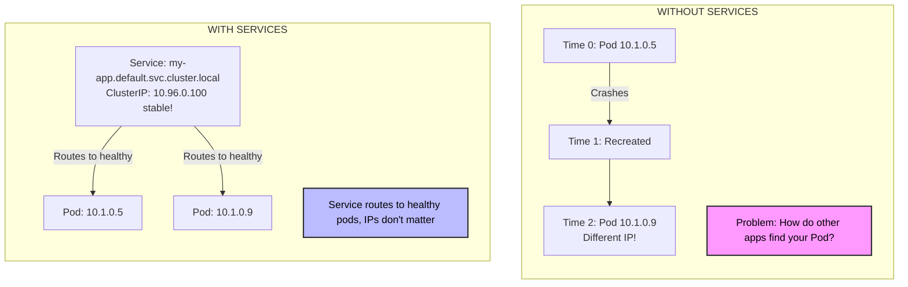
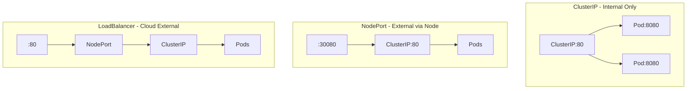
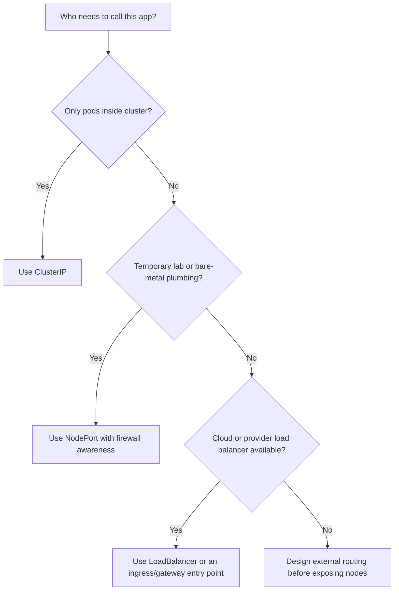

> **Складність**: `[MEDIUM]` - Важлива мережева концепція для кожної програми, що працює за контролером
>
> **Час на проходження**: 35-40 хвилин на читання та лабораторну роботу, з додатковим часом на практику, якщо ви навмисно зламаєте селектори
>
> **Попередні вимоги**: Модуль 4 (Deployments), особливо мітки (labels), репліки, поведінка розгортання та розуміння того, чому Pod'и можна замінювати

---

Цей модуль наводить повну команду `kubectl` у кожному прикладі, який можна запустити, щоб кожен блок можна було скопіювати у звичайну оболонку або лабораторний скрипт, не покладаючись на інтерактивні псевдоніми. Приклади орієнтовані на Kubernetes 1.35 і зосереджені на вбудованому API Service, а не на системах маршрутизації вищого рівня, таких як Ingress або Gateway API.

## Що ви зможете зробити

Після цього модуля ви зможете виконувати наведену нижче роботу в реальному кластері, а не лише знати термінологію. Кожен результат відображається також у розділі про діагностику, сценаріях контрольних запитань та перевірках у лабораторних роботах, оскільки Services найкраще вивчати, відстежуючи трафік від стабільного імені до вибраних Pod'ів за ним.

- **Спроєктувати** Services, які приховують зміну IP-адрес Pod'ів за стабільними DNS-іменами кластера та віртуальними IP-адресами.
- **Порівняти** Services типу ClusterIP, NodePort та LoadBalancer за областю доступу, рівнем безпеки, вартістю та експлуатаційною відповідністю.
- **Впровадити** маніфести Service із селекторами, `port`, `targetPort`, протоколами та іменованими бекендами, які відповідають реальним міткам Pod'ів.
- **Діагностувати** збої Service, перевіряючи мітки, селектори, Endpoints, EndpointSlices, DNS-імена та відображення портів між Service і Pod.


## Чому це важливо

Гіпотетичний сценарій: під час вихідних з піковими розпродажами онлайн-ритейлер спостерігає, як рівень успішних платежів падає, хоча Kubernetes продовжує перестворювати Pods для обробки платежів саме так, як і було задумано. Фронтенд було налаштовано на індивідуальні IP-адреси Pods, оскільки це здавалося простішим під час поспішної міграції, і кожен перезапуск непомітно робить недійсною частину таблиці маршрутизації, яку застосунок вважає правильною. Інженери бачать справні нові Pods, але клієнти бачать невдалі спроби оплати, покинуті кошики та графік доходу, що падає, поки команда шукає симптоми на неправильному рівні.

Ця історія болюча, оскільки не зламалося нічого екзотичного. Kubernetes ставився до Pods як до замінних одиниць, у чому й полягає весь сенс контролерів, таких як Deployments, але застосунок сприймав ці Pods як довговічні мережеві пункти призначення. IP-адреса Pod ближча до номера в готелі, ніж до домашньої адреси: вона корисна, поки гість там, але ви не повинні друкувати її в контрактах або вшивати в конфігурацію іншого сервісу. Services існують для того, щоб дати застосункам стабільне ім'я та адресу, поки Kubernetes продовжує замінювати, масштабувати та переміщувати Pods під ними.

Урок цього модуля полягає в тому, що стабільна мережа — це не просто зручна функція. Це межа, яка дозволяє коду застосунку залежати від наміру, наприклад, "спілкуватися з payment API", замість того, щоб залежати від випадковості, наприклад, "спілкуватися з тим Pod, якому зараз належить 10.1.0.5". Ви зможете **спроєктувати** цю межу, **обрати** правильний тип Service, **перевірити** виявлення DNS та **діагностувати** типові випадки, коли Service існує, але все одно спрямовує трафік у нікуди.


## Проблема, яку вирішують Services

Kubernetes навмисно робить Pods замінними. Deployment може замінювати Pods під час розгортання, планувальник може розміщувати нові Pods на різних вузлах, а збій вузла може змусити контролери створювати заміни зі свіжими IP-адресами. Така поведінка є гарною для стійкості, але вона руйнує ментальну модель, яку багато людей приносять із собою від віртуальних машин, де адреса сервера могла залишатися стабільною місяцями. Якщо один застосунок зберігає IP-адресу іншого Pod напряму, він робить ставку проти control plane.



Service — це невеликий об'єкт API з великими наслідками: він створює стабільний віртуальний пункт призначення і спрямовує його на мінливий набір Pods. Клієнти використовують ім'я Service або IP-адресу Service, тоді як Kubernetes підтримує актуальність членства бекенду за допомогою селекторів міток та об'єктів endpoint. Це означає, що клієнту не потрібно знати, чи існує два Pods, десять Pods, чи щойно перестворений Pod, який з'явився мить тому.

Зупиніться та подумайте: якщо Deployment масштабується з трьох Pods до десяти, скільки IP-адрес Service повинні запам'ятати клієнти? Відповідь — як і раніше, одну, тому що Service є контрактом, а Pods є деталлю реалізації. Коли ви ловите себе на бажанні опублікувати список IP-адрес Pods для іншого застосунку, сприймайте це як недолік проєктування (design smell) і натомість запитайте, яке стабільне ім'я Service має представляти цю групу.

Стабільна адреса не є фізичним мережевим інтерфейсом, що міститься на вузлі. У більшості кластерів `kube-proxy` відстежує Services та зміни endpoint, а потім програмує правила обробки пакетів таким чином, щоб трафік для віртуальної IP-адреси Service досягав однієї з вибраних IP-адрес Pod. Конкретним data plane може бути iptables, IPVS або реалізація, надана мережевим стеком кластера, але обіцянка для розробників залишається незмінною: використовуйте Service, а не IP-адресу Pod.

Цей рівень непрямої взаємодії — це також те, з чого починається розподіл навантаження. Service може розподіляти з'єднання між кількома готовими Pods, які відповідають його селектору, що дає простому Deployment стабільні вхідні двері всередині кластера. Це не повноцінний балансувальник навантаження застосунків із правилами шляхів, політикою TLS, повторними спробами або маршрутизацією на основі запитів, але це той примітив, який робить можливими ці системи вищого рівня.

Готовність (readiness) є тихим партнером у цьому дизайні. Pod може існувати, мати мітки і все ще не бути готовим приймати трафік, оскільки застосунок запускається, прогріває кеш або не проходить перевірку readiness probe. Kubernetes використовує інформацію про готовність під час формування набору бекендів для звичайних Services, що запобігає багатьом проблемам розгортання, коли Pod технічно працює, але ще не здатний обслуговувати запити. Саме через таку поведінку Service — це більше, ніж статичний список відповідних міток.

Це також пояснює, чому Services належать до тієї ж ментальної категорії, що й Deployments, а не до тієї ж категорії, що й правила брандмауера. Deployment стверджує, як Kubernetes повинен підтримувати присутність Pods, а Service стверджує, як інші робочі навантаження повинні знаходити готові Pods, які задовольняють контракт міток. Жоден з цих об'єктів не є цікавим сам по собі під час інциденту; важливо те, чи контролер, мітки, готовність, дані endpoint та обробка пакетів — усі вони узгоджуються щодо застосунку, який ви мали намір відкрити.

Уявіть Service як вивіску над касою, а Pods — як окремих касирів. Клієнтам не потрібно знати, який касир працює прямо зараз, а менеджер магазину може додавати, звільняти або проводити ротацію персоналу, не змінюючи вивіску. Якщо вивіска вказує на порожню касу, клієнти все одно знають, куди йти, але жодна транзакція не завершується. У цьому й полягає різниця між Service, який успішно розпізнається DNS (resolves), і Service, який має придатні для використання endpoints.


## Створення Services

Перш ніж створювати Service, створіть щось, що варто відкрити світові. Deployment дає Kubernetes контролер, який володіє управлінням репліками, послідовно призначає мітки для Pods і замінює репліки, що вийшли з ладу, без необхідності перестворювати Service. Це важливо, оскільки селектор Service не вказує на об'єкт Deployment безпосередньо; він вказує на мітки на Pods, а Deployment зазвичай є тим, що підтримує ці мітки узгодженими між старими та новими репліками.

```bash
# Create a deployment first
kubectl create deployment nginx --image=nginx

# Expose the deployment (defaults to ClusterIP)
kubectl expose deployment nginx --port=80

# Expose with specific type (using a different name to avoid conflict)
kubectl expose deployment nginx --port=80 --type=NodePort --name=nginx-np

# Check the service
kubectl get services
kubectl get svc              # Short form
```

Імперативна команда `kubectl expose deployment` корисна під час навчання або коли вам потрібен швидкий Service для діагностики проблеми. Вона зчитує мітки Deployment, створює селектор і записує об'єкт Service замість вас. Компроміс полягає в тому, що команда приховує контракт, доки ви не перевірите згенерований об'єкт, тому виробничі команди зазвичай фіксують у системі контролю версій декларативний YAML, де code review може виявити випадковий селектор, зовнішній доступ або невідповідність портів.

```bash
cat <<EOF > service.yaml
apiVersion: v1
kind: Service
metadata:
  name: nginx-declarative
spec:
  selector:
    app: nginx               # Match pod labels
  ports:
  - port: 80                 # Service port
    targetPort: 80           # Container port
  type: ClusterIP            # Default type
EOF

kubectl apply -f service.yaml
```

Декларативна версія робить важливі поля видимими. `spec.selector` повідомляє Kubernetes, які Pods є придатними бекендами, `spec.ports[].port` повідомляє клієнтам, на який порт Service робити виклик, а `spec.ports[].targetPort` повідомляє data plane, де вибрані Pods фактично слухають. Якщо ваш застосунок слухає на порту 8080, але ви публікуєте `targetPort: 80`, Service може виглядати правильним, тоді як кожне з'єднання зазнаватиме невдачі на межі Pod.

Зупиніться та подумайте: перед виконанням `kubectl get endpoints nginx-declarative`, який вивід довів би, що Service знайшов реальні Pods, а не просто існує як порожня віртуальна IP-адреса? Ви маєте очікувати на одну або кілька пар IP-адрес і портів Pod. Порожній список endpoint поки що не є проблемою DNS, проблемою балансувальника навантаження або проблемою застосунку; передусім він свідчить про те, що селектор Service наразі не знайшов відповідних готових бекендів Pod.

Корисним практичним прикладом є Deployment фронтенду з мітками `app=frontend` та `tier=web`. Service з `selector: app: frontend` охоплюватиме всі Pods із цією міткою застосунку, навіть якщо пізніше ви додасте canary Pods, які не повинні отримувати звичайний трафік. Service з обома мітками `app: frontend` та `tier: web` є більш обмежувальним, оскільки кожна мітка селектора має бути присутня на Pod. Така точність є потужною, але вона також робить зміщення міток (label drift) однією з найпоширеніших причин непомітних збоїв у роботі Service.

Коли ви пишете YAML для Service, чиніть опір бажанню ставитися до міток як до декорації. Мітки є частиною контракту маршрутизації, тому вони заслуговують такої ж уваги, як сигнатура функції або схема бази даних. Шаблон Deployment може змінювати мітки лише на новостворених Pods, а це означає, що недбале розгортання може на деякий час залишити старі та нові Pods із різними мітками. Протягом цього вікна Service може вибрати менше Pods, ніж ви очікували, і цей збій може виглядати як періодична втрата потужності, а не як чистий простій.

Декларативні Services також роблять можливим code review між різними командами. Команда розробників застосунку може підтвердити порт контейнера, команда платформи може підтвердити тип доступу (exposure type), а команда безпеки може підтвердити, що внутрішні API не публікуються за межами кластера. Імперативні команди чудово підходять для експериментів, оскільки вони швидко навчають поведінці об'єктів, але YAML є довговічним артефактом, який фіксує рішення. У виробничому середовищі різниця між завченою командою та перевіреним маніфестом часто проявляється під час наступного інциденту.

Ще одна корисна звичка — перевіряти Service відразу після його створення, навіть якщо здається, що команда виконана успішно. API-сервер може прийняти Service, тоді як він усе ще представлятиме неправильне робоче навантаження, оскільки селектори — це просто мітки, а не посилання на конкретний контролер. Якщо результати `kubectl get svc` та `kubectl describe svc` не збігаються з уявленням про застосунок у вашій голові, зупиніться та виправте цю невідповідність, перш ніж додавати нові рівні маршрутизації зверху.


## Порівняння компромісів типів Service

Тип Service — це архітектурне рішення, а не вибір форматування. ClusterIP відповідає на запитання "як робочі навантаження всередині цього кластера досягають цього застосунку?". NodePort відповідає на запитання "як щось за межами кластера може досягти порту, відкритого на кожному вузлі?". LoadBalancer відповідає на запитання "як хмарний або інфраструктурний провайдер може створити зовнішній балансувальник навантаження, який переспрямовує трафік до цього Service?". Кожен варіант розширює мережеву межу, тому кожен із них також має змусити вас замислитися про безпеку, вартість та відповідальність.

| Тип | Доступність | Найкраще підходить для | Компроміс |
|------|---------------|----------|-----------|
| **ClusterIP** | Лише внутрішня | Бази даних бекенду, внутрішні API | Неможливо досягти з-за меж кластера. |
| **NodePort** | Зовнішній високий порт | Швидке зневадження, bare-metal кластери | Відкриває високі порти в діапазоні 30000-32767, якими складно користуватися зовнішнім клієнтам. |
| **LoadBalancer** | Зовнішній стандартний порт | Публічні вебзастосунки у хмарі | Коштує грошей за кожен Service, покладається на зовнішнього хмарного провайдера або інтеграцію з балансувальником навантаження. |

ClusterIP є типовим значенням, оскільки більша частина трафіку Service є внутрішньою. API бекенду, кеш Redis, збирач метрик або проксі-сервер бази даних зазвичай не повинні мати публічної адреси лише тому, що іншому Pod потрібно звернутися до них. Збереження таких Service внутрішніми зменшує випадкове відкриття доступу та робить мережеву топологію простішою для розуміння: клієнти всередині кластера використовують DNS, а зовнішні точки входу обслуговуються меншою кількістю навмисно відкритих компонентів.

```yaml
apiVersion: v1
kind: Service
metadata:
  name: internal-api
spec:
  type: ClusterIP            # Default, can omit
  selector:
    app: api
  ports:
  - port: 80
    targetPort: 8080
```

```bash
# Access from within cluster only
curl http://internal-api:80
```

NodePort відкриває порт із налаштованого діапазону Service на кожному вузлі та переспрямовує трафік до бекендів Service. Це корисно для швидких експериментів, лабораторних середовищ і деяких bare-metal дизайнів, де ви поєднуєте його з власним зовнішнім балансувальником навантаження, але це рідко буває найохайнішим публічним інтерфейсом для кінцевих користувачів. Клієнти повинні знати адресу вузла та високий порт, правила брандмауера стають більш помітними, а питання маршрутизації в продакшені, такі як TLS і маршрутизація на основі хоста, зазвичай краще вирішувати над рівнем Service.

```yaml
apiVersion: v1
kind: Service
metadata:
  name: web-nodeport
spec:
  type: NodePort
  selector:
    app: web
  ports:
  - port: 80
    targetPort: 80
    nodePort: 30080          # Optional: 30000-32767 range
```

```bash
# Access from outside cluster
curl http://<node-ip>:30080
```

LoadBalancer надбудовується над нижчими рівнями, вимагаючи від середовища виділити зовнішній балансувальник навантаження та підключити його до Service. У керованому хмарному кластері це може надати доступну зовнішню IP-адресу або ім'я хоста без ручного налаштування адрес вузлів. Зручність є реальною, але такою ж реальною є вартість і операційний слід, оскільки кожен Service типу LoadBalancer може створювати тарифіковану інфраструктуру та правила безпеки за межами об'єкта Kubernetes API, який ви редагуєте.

```yaml
apiVersion: v1
kind: Service
metadata:
  name: web-lb
spec:
  type: LoadBalancer
  selector:
    app: web
  ports:
  - port: 80
    targetPort: 80
```

```bash
# Get external IP (cloud only)
kubectl get svc web-lb
# EXTERNAL-IP column shows the load balancer IP
```

Зупиніться та подумайте: якщо ви створите Service типу `LoadBalancer`, чи буде він також споживати NodePort і ClusterIP "під капотом"? У типовій реалізації — так, тому що ці типи Service надбудовуються один над одним, як матрьошки: зовнішній балансувальник навантаження переспрямовує трафік на мережеву інфраструктуру рівня вузла, а віртуальна IP-адреса Service усе ще представляє внутрішнє місце призначення в кластері. У Kubernetes є опції, які можуть змінювати частини цієї поведінки, але ментальна модель для початківців має бути скоріше багаторівневою, ніж ізольованою.



Практичним рішенням є починати з найвужчої області доступу, яка задовольняє того, хто здійснює виклик. Якщо застосунок викликають лише Pod'и, використовуйте ClusterIP і дозвольте DNS виконати свою роботу. Якщо вам потрібен швидкий зовнішній доступ у лабораторії, NodePort є прийнятним, якщо ви усвідомлюєте його обмеження. Якщо реальним користувачам або системам за межами кластера потрібен стабільний доступ через стандартний порт, LoadBalancer або рівень маршрутизації вищого рівня стають більш операційно чесним вибором.

ClusterIP також зберігає межі відповідальності чистішими. Внутрішній Service бекенду може належати команді розробки застосунку без необхідності просити хмарних адміністраторів затверджувати публічний балансувальник навантаження, призначати сертифікати або керувати правилами брандмауера, відкритими в інтернет. Ця вужча сфера зменшує обсяг інфраструктури, яка має бути налаштована правильно для того, щоб застосунок працював. Коли той, хто здійснює виклик, уже перебуває всередині кластера, виведення трафіку назовні та повторне введення через публічну мережу зазвичай додає витрат і точок відмови, не додаючи при цьому цінності.

NodePort заслуговує на повагу, оскільки він є простим, прозорим і корисним, коли ви працюєте близько до інфраструктури. Багато bare-metal кластерів використовують NodePort за зовнішнім балансувальником навантаження, який уже належить організації, і багато локальних кластерів відкривають доступ до лабораторних робочих навантажень через NodePort, оскільки немає хмарного провайдера, щоб надати щось інше. Помилка полягає не у використанні NodePort; помилка полягає в забуванні того, що тепер клієнти залежать від доступності вузла та високих портів замість відшліфованої точки входу до застосунку.

LoadBalancer є найсильнішим тоді, коли Kubernetes та інфраструктурний провайдер мають взаємодіяти. У керованій хмарі об'єкт Service стає запитом на створення хмарної мережі, а контролер провайдера узгоджує цей запит у зовнішній ресурс. Це зручно, але робить видалення, розподіл витрат, політику брандмауера, анотації та перевірки працездатності частиною вашої операційної моделі. Ставтеся до кожного LoadBalancer як до справжньої інфраструктури, адже хмара саме так і робить.

Рішення щодо типу Service також можуть змінюватися протягом життєвого циклу застосунку. Новий API може починатися як ClusterIP, поки з ним інтегрується інший внутрішній сервіс, а пізніше опинитися за Ingress-контролером, коли з'являться браузерні клієнти. Така еволюція є здоровою, якщо команда змінює межу свідомо. Вона стає нездоровою, коли кожне тимчасове тестове відкриття доступу залишається в продакшені, тому що ніхто не може згадати, чи досі потрібен високий NodePort.

## Виявлення Service та DNS

Виявлення Service у Kubernetes надає кожному звичайному Service DNS-ім'я, що зазвичай є важливішим для застосунків, ніж числова адреса ClusterIP. Імена є стабільними, зручними для читання та враховують простір імен, тому в конфігурації можна вказати `http://payments.finance` замість того, щоб зберігати крихку IP-адресу. Це також дозволяє різним просторам імен повторно використовувати прості імена, оскільки `api.default` і `api.staging` є різними DNS-цілями, навіть якщо коротке ім'я `api` може фігурувати в обох середовищах.

```text
<service-name>.<namespace>.svc.cluster.local
```

```bash
# From any pod, you can reach:
curl nginx                           # Same namespace
curl nginx.default                   # Explicit namespace
curl nginx.default.svc               # More explicit
curl nginx.default.svc.cluster.local # Full FQDN
```

Коротка форма працює лише тоді, коли клієнтський Pod міститься в тому самому просторі імен, що й Service. Ця поведінка за замовчуванням є зручною під час простих демонстрацій, але вона може приховувати помилки, коли команди переміщують застосунки в окремі простори імен для середовищ staging, фінансів, платформи або ізоляції орендарів. Під час зневадження трафіку між просторами імен використовуйте принаймні `<service>.<namespace>`, щоб випадково не протестувати інший Service з таким самим коротким ім'ям.

```bash
# Create a new deployment and service for DNS testing
kubectl create deployment nginx-dns --image=nginx
kubectl expose deployment nginx-dns --port=80
kubectl rollout status deployment nginx-dns
kubectl get svc nginx-dns

# Test DNS from another pod (using -i and --restart=Never for non-interactive compatibility)
kubectl run test --image=busybox --rm -i --restart=Never -- wget -qO- nginx-dns
# Returns nginx HTML!

# Test with full DNS name
kubectl run test --image=busybox --rm -i --restart=Never -- nslookup nginx-dns.default.svc.cluster.local
```

DNS доводить здатність перетворення імен, але він не доводить, що застосунок є працездатним. Ім'я Service може бути перетворено, навіть якщо селектор не відповідає жодному Pod, і Service може мати кінцеві точки (endpoints), навіть якщо порт контейнера вказано неправильно. Правильний підхід до усунення несправностей розділяє ці рівні: спершу доведіть, що ім'я перетворюється, потім доведіть, що Service має кінцеві точки, а потім доведіть, що порт кінцевої точки приймає трафік від тестового Pod у тому самому мережевому контексті.

Перед тим як це запустити, який вивід ви очікуєте від команди `wget`, коли Service налаштовано правильно? Ви маєте очікувати вітальну сторінку HTML від Nginx, а не лише успішне перетворення DNS. Якщо DNS працює успішно, але HTTP-запит завершується через тайм-аут або з'єднання відхиляється (connection refused), продовжуйте рухатися вниз ланцюжком до готовності кінцевих точок, міток і переспрямування портів замість того, щоб постійно редагувати клієнт.

Гіпотетичний сценарій: команда платформи втрачає години на нібито перебої в роботі DNS, оскільки тимчасовий Pod для зневадження в `default` виконує запит (curl) до `orders`, тоді як справжній Service міститься в `commerce`. Коротке ім'я перетворюється на непов'язаний Service-заглушку в `default`, тому кожен тест є технічно успішним та операційно марним. Вирішенням є не зміна конфігурації CoreDNS, а звичка писати імена з указанням простору імен під час реагування на інциденти.

Шляхи пошуку DNS є зручними, доки вони не приховують той простір імен, який ви мали на увазі. Усередині Pod резолвер зазвичай налаштовано так, що коротке ім'я Service розширюється за рахунок суфіксів простору імен і кластера. Це економить час на введення для поширених викликів у межах одного простору імен, але це означає, що інженери повинні бути явними, коли тест перетинає межу простору імен. Під час усунення несправностей віддавайте перевагу імені, яке повідомляє про ваш намір наступному інженеру, який читатиме історію вашої оболонки.

Ще один практичний момент полягає в тому, що відповіді DNS можуть вичерпати ваше терпіння під час швидких тестів. Клієнти, середовища виконання мов і проміжні бібліотеки можуть по-різному кешувати результати пошуку, тому швидка послідовність операцій створення, видалення та повторного створення може дати заплутані результати. Абстракція Service є стабільною, але ваш клієнт для зневадження може не звертатися до DNS-сервера щоразу. Коли ім'я здається застарілим, проведіть тестування з нового тимчасового Pod і перевірте безпосередньо об'єкти Service і кінцевих точок.

DNS також не замінює дисципліну конфігурації. Застосункам усе одно потрібні правильне ім'я Service, простір імен, схема та порт у їхніх налаштуваннях. Типова помилка початківця — довести, що `nslookup` працює, а потім забути, що застосунок використовує `https` для звернення до звичайного HTTP-бекенду або викликає неправильний порт. Перетворення імен відповідає на запитання "де міститься ім'я Service", тоді як підключення застосунку відповідає на запитання "чи може цей клієнт спілкуватися очікуваним протоколом із цим бекендом".


## Селектори, Endpoints та мапінг портів

Об'єкти Service знаходять Pod'и за допомогою селекторів міток (label selectors), і ці селектори настільки точні, що заслуговують на уважний перегляд. Якщо селектор Service вказує `app: nginx` та `tier: frontend`, Pod повинен мати обидві мітки, щоб бути вибраним. Додаткові мітки на Pod'і — це нормально, але відсутність хоча б однієї обов'язкової мітки негайно видаляє цей Pod із набору бекендів, саме тому зміна назви мітки, яка виглядає невинно, може призвести до повного простою.

```yaml
# Service
spec:
  selector:
    app: nginx
    tier: frontend

# Pod (must match ALL labels)
metadata:
  labels:
    app: nginx
    tier: frontend
```

Вибрані Pod'и представлені через дані кінцевих точок (endpoint data), історично об'єктами Endpoints, а у великих масштабах — об'єктами EndpointSlice. Для початківця ключова ідея проста: дані endpoint — це актуальний список IP-адрес та портів бекенд-Pod'ів, до яких Service може спрямовувати трафік. Коли цей список порожній, трафіку нікуди йти, навіть якщо об'єкт Service, DNS-запис та ClusterIP існують.

```bash
# Check what pods a service targets
kubectl get endpoints nginx
# Shows IP:Port of matched pods
```

Зупиніться та подумайте: що станеться з вашим Service, якщо ви вручну відредагуєте запущений Pod і видалите мітку `tier: frontend`? Service негайно вилучить цей Pod зі свого набору endpoint'ів, оскільки він більше не відповідає селектору ідеально. Якщо це був єдиний відповідний Pod, клієнти все ще зможуть розв'язувати (resolve) ім'я Service, але за ним не буде готових бекендів.

Мапінг портів (port mapping) додає ще один рівень, де об'єкт може виглядати правильно, але трафік не проходитиме. `port` у Service — це те, куди звертаються клієнти, тоді як `targetPort` — це порт, який прослуховує програма всередині кожного вибраного Pod'а. Ця трансляція дозволяє вам надати чистий внутрішній контракт, наприклад `http://node-backend:80`, навіть якщо процес у контейнері слухає порт 3000, але це також означає, що ви повинні знати реальний порт програми, а не просто копіювати випадкові приклади.


```yaml
spec:
  ports:
  - port: 80           # Service port (what clients use)
    targetPort: 8080   # Container port (where app listens)
    protocol: TCP      # TCP (default) or UDP
```

Іменовані порти (named ports) — це корисне вдосконалення, коли команди підтримують великі маніфести. Контейнер може назвати свій порт `http`, а Service може використовувати `targetPort: http`, що переживе майбутню зміну номера порту, за умови, що ім'я залишатиметься правильним. Компроміс полягає в тому, що тепер правильне написання має таке ж значення, як і номер; неправильна назва порту може створити Service, який вибиратиме Pod'и, але не пересилатиме трафік до жодного дійсного слухача (listener) програми.

Для діагностики мисліть ланцюжком, а не однією командою. `kubectl get svc` каже вам, що Service існує, і показує його тип, ClusterIP та опубліковані порти. `kubectl describe svc` показує селектори та події. `kubectl get endpoints` або `kubectl get endpointslices` показує, чи знайшов Kubernetes готові бекенди. Тестовий Pod, що використовує `wget`, `curl` або `nslookup`, згодом доводить, що насправді відчуває реальний клієнт всередині кластера.

Гіпотетичний сценарій: API каталогу показує здорові Pod'и та активний Service, проте частина трафіку отримує тайм-аут після того, як операційні роботи оминули Kubernetes і залишили застарілий стан data plane (площини даних) на одному вузлі. Інженер, який перевіряє стан endpoint'ів та проксі, виявляє, що запити все ще спрямовуються на мертву адресу згідно з правилами одного вузла, і оновлення ураженого компонента data plane очищає застарілий шлях. Урок полягає не в тому, щоб випадковим чином перезапускати компоненти; він полягає в тому, щоб довести, де саме контракт Service та data plane розходяться.

Об'єкт EndpointSlice варто знати навіть у модулі для початківців, оскільки сучасні кластери активно його використовують. Старий об'єкт Endpoints легко читати в невеликих прикладах, але дуже великий Service може мати стільки бекендів, що єдиний об'єкт стане неефективним для оновлення та відстеження. EndpointSlices ділять інформацію про бекенд на менші частини, що допомагає control plane (площині управління) та мережевим компонентам масштабуватися. У повсякденному налагодженні ідея залишається знайомою: ви все ще запитуєте, які IP-адреси та порти Pod'ів Service наразі вважає дійсними бекендами.

Мапінг портів слід тестувати з того ж боку, який використовують клієнти. Тестування всередині контейнера доводить, що процес слухає порт, але це не доводить, що Service надсилає трафік на цей порт. Тестування IP-адреси Pod'а безпосередньо може довести працездатність мережевого шляху до Pod'а, але воно оминає Service. Тестування імені Service з тимчасового Pod'а перевіряє DNS, обробку віртуального IP Service, належність до селектора та трансляцію target порту разом, що зазвичай є тестом, який відповідає симптомам, з якими стикається користувач.

Readiness (готовність) може зробити поведінку endpoint'ів загадковою, якщо ви цього не очікуєте. Pod, який відповідає міткам, але не проходить перевірку готовності (readiness), не повинен отримувати нормальний трафік від Service, і це зазвичай те, чого ви хочете під час запуску або часткового збою. Якщо endpoint'и відсутні для Pod'ів, які виглядають живими, перевірте умови readiness перед тим, як змінювати селектори. Service може захищати клієнтів від Pod'а, який запущений, але насправді не готовий обслуговувати запити.

Селектори та цільові порти (target ports) також взаємодіють з розгортаннями (rollouts). Уявіть, що перша версія програми слухає порт 8080, а друга версія слухає порт 9090, але обидві версії використовують один і той самий селектор Service під час поступового оновлення (rolling update). Якщо Service має один числовий `targetPort`, одна з версій може вийти з ладу, доки розгортання не завершиться. Іменований порт може зменшити цей ризик, коли кожна версія Pod'а відображає одне й те саме ім'я на свій правильний порт контейнера, але тільки якщо імена залишаються узгодженими.

## Патерни та антипатерни

Хороший дизайн Service починається з іменування контракту, який насправді потрібен клієнту. Service з назвою `payments-api` має представляти стабільний бекенд для платіжних викликів, а не конкретне розгортання, хеш Pod'а чи вузол. Цей контракт дозволяє об'єктам Deployment, розгортанням (rollouts), пробам readiness та масштабуванню змінювати реалізацію, тоді як клієнти продовжують використовувати те саме ім'я. Патерн працює найкраще, коли мітки є продуманими, перевіреними та спільними для шаблонів Deployment і селекторів Service.

| Патерн | Коли використовувати | Чому це працює | Міркування щодо масштабування |
|---------|----------------------|----------------|-------------------------------|
| Стабільний ClusterIP для кожної внутрішньої програми | Робочі навантаження (workloads) викликають одне одного лише всередині кластера | Зберігає публічний доступ вузьким, надаючи клієнтам довговічне DNS-ім'я | Використовуйте імена, уточнені простором імен (namespace-qualified), коли команди спільно використовують кластери. |
| Мітки селектора належать контракту робочого навантаження | Deployment та Service представляють одну роль програми | Запобігає випадковому вибору canary-релізів, завдань або непов'язаних Pod'ів | Зберігайте мітки селектора простими (boring) та стабільними під час розгортань. |
| Порт Service як клієнтський контракт | Контейнери слухають на специфічних для реалізації портах | Дозволяє клієнтам звертатися до простих портів, тоді як Pod'и використовують свої природні порти програм | Використовуйте іменований `targetPort`, коли номери портів змінюються у різних версіях. |
| Усунення несправностей, починаючи з endpoint'ів | Service існує, але трафік не проходить | Розділяє розв'язання імен, відповідність селекторів та доступність бекенду | Перевіряйте EndpointSlices у більших кластерах, де масштаб endpoint'ів має значення. |

Найгіршим антипатерном є публікація IP-адрес Pod'ів для інших програм. Команди зазвичай роблять це, тому що це працює під час першого ручного тестування, і пряма IP-адреса здається конкретною, коли концепції Service ще нові. Цей підхід зазнає невдачі, оскільки IP-адреса належить тимчасовому Pod'у, а не контракту програми. Краща альтернатива — створити Service на ранньому етапі, навіть у невеликій лабораторії, щоб кожна програма-споживач вивчила стабільне ім'я від самого початку.

Інший антипатерн — це відкриття (exposing) кожного робочого навантаження як LoadBalancer, тому що це виглядає як готовність до production. У хмарних кластерах це може створити непотрібну зовнішню інфраструктуру, розширити поверхню атаки та ускладнити контроль витрат. Кращий дизайн зазвичай зберігає більшість робочих навантажень як ClusterIP Services і використовує обмежений набір зовнішніх точок входу, таких як LoadBalancer для Ingress-контролера, Gateway або дійсно публічного сервісу, який потребує власного балансувальника навантаження.

Неправильне використання NodePort є менш очевидним. Це цілком допустимо для лабораторій, екстреного налагодження (break-glass debugging) або інтеграції з окремо керованим балансувальником навантаження, але використання високих портів вузла як основного API для клієнтів прив'язує клієнтів до адрес вузлів і деталей брандмауера кластера. Якщо клієнт є користувачем браузера, партнерською системою або production-мобільним додатком, виберіть чистішу зовнішню точку входу та залиште NodePort як внутрішню інфраструктуру (plumbing), а не частину продукту.

Занадто широкі селектори створюють протилежну проблему до селекторів, які не знаходять жодних збігів. Селектор на кшталт `app: web` може випадково включити старі репліки, preview-Pod'и або одноразовий діагностичний Pod, якщо ці ресурси повторно використовують ту саму мітку. Використовуйте мітки, які описують контракт Service, і уникайте недбалої зміни міток селектора, оскільки селектор Service, як правило, незмінний за своєю суттю, навіть якщо Kubernetes дозволяє його редагувати.

Найнадійніший патерн — зберігати мітки маршрутизації простими та відокремленими від міток, які використовуються для організації, білінгу, дашбордів або визначення власності. Такі мітки, як `team`, `track` або `release`, можуть змінюватися з причин, не пов'язаних із трафіком, тому вони є ризикованими як селектори Service, якщо тільки вони дійсно не визначають набір бекендів. Мітки на кшталт `app.kubernetes.io/name` та стабільна мітка ролі можуть бути кращою основою, оскільки вони описують, чим є Pod, а не те, у який звіт його слід включити.

Ще один патерн — створювати об'єкти Service на ранньому етапі у гілці фічі (feature branch) або preview-середовищі, а не наприкінці релізу. Ранні Service змушують вас назвати контракт програми, визначити очікуваний порт та виявити невідповідності міток ще до того, як інші команди почнуть інтеграцію. Вони також роблять локальні smoke-тести схожими на production-шляхи трафіку. Очікування вікна релізу для додавання Service перетворює мережеві налаштування на проблему фінальної збірки, де помилки важче ізолювати.

Уникайте використання Service для маскування несправної програми. Якщо перевірки readiness завершуються невдало, Pod'и потрапляють у цикл збоїв (crash-looping), або програма слухає неправильний інтерфейс, зміна типів Service не зробить бекенд здоровим. Service — це контракти маршрутизації, а не механізми лікування помилок програми. Правильний крок — виправити сигнал здоров'я бекенда, а потім дозволити Service спрямовувати трафік лише до тих бекендів, які можуть виконати контракт.

## Фреймворк прийняття рішень

Вибирайте Service, починаючи з того, хто викликає (caller), а не з самої програми. Якщо зумовлювачем виклику є інший Pod у тому ж кластері, вузька відповідь — ClusterIP. Якщо той, хто викликає, перебуває за межами кластера, і ви виконуєте швидку лабораторну роботу або інтеграцію bare-metal, NodePort може бути прийнятним. Якщо той, хто викликає, перебуває за межами кластера і очікує стандартних портів, стабільної зовнішньої адресації та доступності, керованої хмарою, LoadBalancer буде кращим вибором.



Фреймворк є навмисно консервативним, оскільки відкритість (exposure) легше додати, ніж скасувати після того, як клієнти почнуть від неї залежати. База даних, яка починається як публічний LoadBalancer, може згодом вимагати екстреної роботи з брандмауером, тоді як база даних ClusterIP все ще буде доступною для внутрішніх API та завдань обслуговування. Так само вебдодаток може починатися як ClusterIP за Ingress-контролером, а пізніше отримати виділений LoadBalancer лише тоді, коли це буде виправдано реальною вимогою.

Коли два типи Service здаються можливими, опишіть шлях виклику одним реченням. "Pod'и в просторі імен `shop` викликають `payments.finance`" вказує на ClusterIP та DNS з уточненням простору імен. "Апаратний балансувальник навантаження пересилає трафік на кожен робочий вузол (worker node) на фіксований високий порт" вказує на NodePort як інфраструктурний механізм. "Інтернет-клієнти потребують керованої провайдером зовнішньої адреси для цього єдиного Service" вказує на LoadBalancer. Речення часто виявляє припущення, які не може показати таблиця.

Перевірка безпеки (security review) повинна відбуватися до появи першої публічної адреси. Об'єкт ClusterIP Service все ще може бути ризикованим, якщо ненадійні робочі навантаження спільно використовують мережу кластера, але він не є автоматично доступним з інтернету. NodePort або LoadBalancer змінюють ситуацію, оскільки трафік може надходити з-поза меж простору імен робочого навантаження, а можливо, і з-поза меж організації. Цей ширший шлях має викликати питання щодо дозволених джерел, термінації TLS, автентифікації, обмеження швидкості (rate limits) та логування.

Перевірка витрат (cost review) має значення з тієї ж причини. ClusterIP — це об'єкт Kubernetes, що використовує мережу кластера, тоді як LoadBalancer часто відображається на зовнішні хмарні ресурси з білінгом та квотами. У невеликому середовищі один випадковий LoadBalancer може просто дратувати; але серед десятків команд цей патерн стає дорогим і важким для аудиту. Хороша платформа надає командам затверджений шлях зовнішньої маршрутизації, щоб вони не створювали одноразові балансувальники навантаження для кожної внутрішньої залежності.

Використовуйте `kubectl get svc` як інструмент швидкого аудиту після застосування будь-якого Service, але не зупиняйтеся на цьому. Для ClusterIP підтвердіть, що тип є внутрішнім, і протестуйте з Pod'а. Для NodePort підтвердіть виділений порт і перевірте, чи дійсно кожен вузол повинен приймати цей трафік. Для LoadBalancer підтвердіть зовнішню адресу, хмарний ресурс, поведінку брандмауера та те, чи відповідає вартість запланованій архітектурі.

Який підхід ви б обрали тут і чому: скрепер метрик (metrics scraper) всередині кластера повинен отримувати дані з `/metrics` двадцяти Pod'ів програми, але жоден користувач ніколи не повинен мати доступ до цього endpoint'а з інтернету? Правильною відповіддю зазвичай є ClusterIP Service, оскільки скрепер є внутрішнім клієнтом, і endpoint не повинен ставати публічним. Якщо команді пізніше знадобляться зовнішні дашборди, відкривайте дашборд цілеспрямовано, а не відкривайте кожне робоче навантаження, з якого збираються метрики.

## Чи знали ви?

- **Об'єкти Service існують ще з часів Kubernetes v1.0 у 2015 році.** Стабільне виявлення сервісів (Service discovery) було частиною початкової поверхні API, оскільки зміна Pod'ів (pod churn) ніколи не повинна була приховуватися від операторів шляхом удавання, що Pod'и — це постійні сервери.
- **IP-адреси ClusterIP є віртуальними.** У багатьох кластерах жоден мережевий інтерфейс не володіє IP-адресою Service; правила обробки пакетів або реалізація мережі кластера транслюють цей пункт призначення у вибрані endpoint'и Pod'ів.
- **NodePort зазвичай використовує діапазон 30000-32767.** Цей діапазон тримає порти Service подалі від звичайних низьких портів, але це також пояснює, чому NodePort є незручним як орієнтований на людину production URL.
- **EndpointSlice став стабільним у Kubernetes v1.21.** EndpointSlices розбивають дані бекенд-endpoint'ів на менші ресурси, щоб великі Service могли масштабуватися краще, ніж єдиний гігантський об'єкт Endpoints.


## Типові помилки

| Помилка | Чому це стається | Як це виправити |
|---------|------------------|-----------------|
| Селектор не збігається з мітками Pod'а | Service існує, DNS працює, а ClusterIP виглядає правильним, тому команди вважають, що маршрутизацію налаштовано. | Порівняйте вивід `kubectl describe svc <name>` з `kubectl get pods --show-labels`, а потім зробіть так, щоб мітки шаблону Deployment і селектор Service збігалися. |
| Неправильний `targetPort` | У маніфест скопійовано стандартний порт, тоді як процес контейнера прослуховує інший порт. | Перевірте порт контейнера або конфігурацію застосунку, а потім встановіть для `targetPort` справжній порт, що прослуховується, або правильно названий порт контейнера. |
| Використання IP-адреси Pod'а замість DNS Service | Прямі тести через IP працюють недовго, і тимчасову адресу копіюють у конфігурацію застосунку. | Налаштуйте клієнтів на використання DNS-імені Service, бажано з вказанням простору імен, якщо запит надходить з іншого простору. |
| Забуто `protocol: UDP` | Порти Service за замовчуванням використовують TCP, а робочі навантаження UDP рідше зустрічаються в прикладах для початківців. | Явно вкажіть `protocol: UDP` для DNS-подібних або користувацьких UDP-сервісів і протестуйте за допомогою клієнта, який підтримує UDP. |
| Відкриття кожного мікросервісу через `LoadBalancer` | Зовнішній доступ здається простішим, ніж проєктування внутрішньої маршрутизації та спільних точок входу. | Зберігайте внутрішні робочі навантаження на ClusterIP і відкривайте лише спеціальні публічні точки входу через LoadBalancer, Ingress або Gateway API. |
| Неправильне налаштування іменованих портів | Service використовує рядковий `targetPort`, але ім'я порту в Pod'і має інше написання або регістр. | Підтримуйте узгодженість імен портів у специфікаціях Pod'а та Service і перевіряйте порти кінцевих точок (endpoints) після кожної зміни. |
| Використання `NodePort` як головного публічного API | Це працює в лабораторії, тому команди залишають старші порти та IP-адреси вузлів у клієнтських шляхах на продакшені. | Використовуйте LoadBalancer або вищий рівень маршрутизації HTTP для зовнішнього робочого трафіку, а NodePort залиште для специфічних інфраструктурних потреб. |


## Контрольні запитання

<details>
<summary>Сценарій: Фронтенд було налаштовано з IP-адресою Pod'а бази даних, і він перестає працювати після вікна обслуговування вузла, хоча Deployment бази даних у нормі. Що ви зміните?</summary>

Створіть або відремонтуйте Service для бази даних і налаштуйте фронтенд на використання DNS-імені Service замість IP-адреси Pod'а. Pod бази даних отримав нову IP-адресу, коли Kubernetes перестворив його, що є нормальною поведінкою для ефемерного Pod'а. Service надає ролі бази даних стабільну віртуальну IP-адресу та DNS-ім'я, тоді як селектори підтримують актуальний список бекенд-Pod'ів. Ця відповідь прямо відповідає цілі проєктування: приховати мінливість IP-адрес Pod'ів за стабільним контрактом Service.
</details>

<details>
<summary>Сценарій: Кеш Redis має бути доступним лише для бекенд-Pod'ів у тому ж кластері. Який тип Service підходить і якого ризику це уникає?</summary>

Використовуйте ClusterIP Service, оскільки виклик є внутрішнім, і кеш не повинен мати зовнішньої точки входу. ClusterIP надає бекенд-Pod'ам стабільне DNS-ім'я, зберігаючи доступ усередині мережі кластера. Вибір NodePort або LoadBalancer розширив би поверхню доступу та створив би проблеми з брандмауером або хмарними ресурсами, які не виправдовуються цією вимогою. Безпечним значенням за замовчуванням є найвужчий тип Service, який задовольняє того, хто робить виклик.
</details>

<details>
<summary>Сценарій: Web Service має селектор `app=frontend,tier=web`, але Pod'и показують `app=frontend,env=prod`; DNS працює, але час очікування запитів вичерпується. Який перший крок діагностики?</summary>

Селектор Service не збігається з мітками Pod'ів, тому Service, ймовірно, не має придатних кінцевих точок (endpoints). Services вимагають, щоб усі мітки селектора були присутні на Pod'і, перш ніж цей Pod стане бекендом. Виконайте `kubectl get endpoints <service>` або перевірте EndpointSlices, щоб підтвердити порожній набір бекендів, а потім оновіть мітки шаблону Deployment або селектор Service так, щоб вони представляли той самий контракт робочого навантаження. Не починайте зі зміни DNS, оскільки DNS може повернути адресу для порожнього Service.
</details>

<details>
<summary>Сценарій: Тестовому Pod'у в просторі імен `default` потрібно викликати `payment-api` в просторі імен `finance`. Яке DNS-ім'я він має використовувати і чому?</summary>

Використовуйте `payment-api.finance` або повністю визначене ім'я (FQDN) `payment-api.finance.svc.cluster.local`. Просте ім'я Service розв'язується відносно простору імен того, хто робить виклик, тому `payment-api` з `default` спочатку шукатиме Service у `default`. Вказання простору імен запобігає випадковому успіху під час виклику неправильного Service і полегшує перегляд команд під час інцидентів. Повне ім'я багатослівне, але воно усуває неоднозначність під час налагодження між різними просторами імен.
</details>

<details>
<summary>Сценарій: Контейнер Node.js прослуховує порт 3000, але інші Pod'и повинні викликати `http://node-backend:80`. Як слід реалізувати порти Service?</summary>

Встановіть `port` для Service на 80, а `targetPort` на 3000. Порт Service — це стабільний контракт, орієнтований на клієнта, тоді як цільовий порт (`targetPort`) — це деталь реалізації всередині вибраних Pod'ів. Таке відображення дозволяє клієнтам використовувати стандартний HTTP-порт, хоча процес Node.js прослуховує свій природний порт застосунку. Якщо порт контейнера має ім'я, використання цього імені як `targetPort` може зробити подальші зміни номерів безпечнішими.
</details>

<details>
<summary>Сценарій: Вашій команді потрібен клієнтський трафік на стандартному порту 80 у керованому хмарному кластері, а політика безпеки відхиляє публічні старші порти вузлів. З яким підходом до Service слід порівняти NodePort?</summary>

Порівняйте NodePort з LoadBalancer і виберіть LoadBalancer, якщо застосунку дійсно потрібна власна зовнішня точка входу, керована хмарою. Service типу LoadBalancer може надати балансувальник навантаження провайдера зі звичайною зовнішньою адресою та стандартними портами, тоді як NodePort відкриває старші порти на вузлах. Вам усе одно слід розглянути, чи є шар Ingress або Gateway кращою спільною точкою входу, але прямою заміною для відкриття вузлів через старші порти є не ще один ClusterIP. Ключовим компромісом є чистіший зовнішній доступ порівняно з вартістю провайдера та володінням інфраструктурою.
</details>

<details>
<summary>Сценарій: Service існує, але користувачі повідомляють про періодичні збої після розгортання. Які перевірки доводять, чи є проблема в селекторах, кінцевих точках, DNS або відображенні портів?</summary>

Почніть з `kubectl get svc` і `kubectl describe svc`, щоб підтвердити тип Service, порти та селектор. Потім перевірте `kubectl get endpoints` або EndpointSlices, щоб переконатися, що присутні IP-адреси та порти готових Pod'ів. З тимчасового Pod'а перевірте роздільну здатність DNS (розв'язання імен) і фактичний HTTP-запит, щоб відрізнити пошук імені від доступності застосунку. Якщо кінцеві точки (endpoints) існують, але запити не проходять, перевірте `targetPort`, готовність Pod'а (readiness) та справжній порт прослуховування контейнера, перш ніж звинувачувати сам об'єкт Service.
</details>


## Практична вправа

У цій вправі ви створите невеликий Nginx Deployment, відкриєте його за допомогою ClusterIP Service, переконаєтеся, що DNS і кінцеві точки (endpoints) працюють зсередини кластера, а потім створите NodePort Service, щоб порівняти їхню зовнішню форму. Ця послідовність навмисно наближена до щоденного пошуку та усунення несправностей: створити контракт, оглянути контракт, протестувати з клієнтського Pod'а, а потім очистити створені вами ресурси.

### Налаштування

Переконайтеся, що `kubectl` може отримати доступ до вашого лабораторного кластера, перш ніж створювати будь-які ресурси. Лабораторна робота передбачає наявність робочого кластера Kubernetes 1.35 або новішої версії та простору імен, де ви можете створювати Deployments, Services і тимчасові Pod'и.

```bash
kubectl version --client
```

### Завдання 1: Створити робоче навантаження

Створіть Deployment із трьома репліками, щоб Service мав декілька бекенд-Pod'ів для виявлення. Очікування завершення розгортання є важливим, оскільки Service може вибрати Pod'и ще до того, як застосунок буде дійсно готовий, і ви хочете, щоб перша перевірка кінцевої точки (endpoint) відображала здорові бекенди, а не процес розгортання.

```bash
kubectl create deployment web --image=nginx --replicas=3
kubectl rollout status deployment web
kubectl get pods -l app=web --show-labels
```

<details>
<summary>Нотатки до рішення</summary>

Ви повинні побачити три Pod'и з міткою `app=web`, оскільки `kubectl create deployment` генерує цю мітку для цього Deployment'а. Якщо Pod'и все ще перебувають у стані `pending` або створюються, зачекайте перед відкриттям і тестуванням Service. Селектор Service у наступному завданні залежить від цих міток, тому це перше місце для виявлення невідповідності.
</details>

### Завдання 2: Відкрити Deployment як ClusterIP

Відкрийте Deployment та огляньте як Service, так і список кінцевих точок (endpoints). Це підтверджує основний результат реалізації: Service існує як стабільна адреса призначення для клієнтів, а Kubernetes виявив реальні IP-адреси Pod'ів і порти бекендів за ним.

```bash
kubectl expose deployment web --port=80
kubectl get svc web
kubectl get endpoints web
```

<details>
<summary>Нотатки до рішення</summary>

Для `web` Service значення `TYPE` має бути `ClusterIP`, а список кінцевих точок повинен містити три записи IP-адрес і портів Pod'ів для порту 80. Якщо список кінцевих точок порожній, порівняйте селектор Service з виводом `kubectl get pods --show-labels` перед тестуванням DNS. Порожні кінцеві точки (endpoints) означають, що контракт Service не має вибраних готових бекендів.
</details>

### Завдання 3: Перевірити DNS та HTTP зсередини кластера

Запустіть тимчасовий Pod із BusyBox і зробіть запит до Service за його іменем. Цей крок доводить більше, ніж просто створення об'єкта: він доводить, що клієнт всередині кластера може розв'язати ім'я Service і отримати HTTP-відповідь від одного з вибраних Pod'ів.

```bash
kubectl run test --image=busybox --rm -i --restart=Never -- wget -qO- web
kubectl run test --image=busybox --rm -i --restart=Never -- nslookup web.default.svc.cluster.local
```

<details>
<summary>Нотатки до рішення</summary>

Команда `wget` має вивести сторінку привітання Nginx, тоді як `nslookup` має розв'язати ім'я Service. Якщо DNS працює, але `wget` зазнає невдачі, перевірте кінцеві точки (endpoints) і `targetPort`. Якщо DNS не працює, підтвердіть ім'я Service і простір імен перед тим, як вносити зміни до застосунку.
</details>

### Завдання 4: Додати NodePort Service для порівняння

Створіть другий Service, який вказує на той самий Deployment, але цього разу опублікуйте його як NodePort. Ви робите це не як рекомендований шлях для продакшену; ви спостерігаєте за тим, як тип Service змінює видиму ззовні форму, тоді як вибір бекенд-Pod'а залишається керованим мітками.

```bash
kubectl expose deployment web --port=80 --type=NodePort --name=web-external
kubectl get svc web-external
kubectl describe svc web-external
```

<details>
<summary>Нотатки до рішення</summary>

Для `web-external` Service значення `TYPE` має бути `NodePort`, і він має включати старший виділений порт вузла з діапазону портів Service. Селектор все одно має вказувати на Pod'и з міткою `app=web`, що показує, що зміна типу Service змінює рівень доступу (експозицію), але не базову модель вибору за допомогою міток. У локальній лабораторії фактичний зовнішній доступ залежить від того, як ваш кластер відкриває мережу вузлів.
</details>

### Завдання 5: Зламати і відремонтувати селектор

Змініть (за допомогою patch) селектор Service на навмисно неправильне значення, поспостерігайте за списком кінцевих точок, а потім відновіть селектор. Це найшвидший спосіб зробити найбільш типову помилку Service видимою в безпечному лабораторному середовищі.

```bash
kubectl patch svc web -p '{"spec":{"selector":{"app":"missing-web"}}}'
kubectl get endpoints web
kubectl patch svc web -p '{"spec":{"selector":{"app":"web"}}}'
kubectl get endpoints web
```

<details>
<summary>Нотатки до рішення</summary>

Після вказання неправильного селектора список кінцевих точок має стати порожнім, оскільки жоден Pod не має мітки `app=missing-web`. Після повернення до `app=web` список кінцевих точок має знову заповнитися трьома IP-адресами бекенд-Pod'ів. Це цикл діагностики, який ви будете використовувати в реальних інцидентах: Service існує, селектор змінюється, кінцеві точки (endpoints) показують, чи є куди йти трафіку.
</details>

### Очищення

Видаліть Deployment і обидва Services, щоб простір імен повернувся до свого початкового стану. Свідоме очищення є частиною вправи, оскільки залишені об'єкти NodePort або LoadBalancer можуть створити плутанину в майбутніх тестах і непотрібне відкриття інфраструктури.

```bash
kubectl delete deployment web
kubectl delete svc web web-external
```

**Критерії успіху**: скористайтеся цим контрольним списком, щоб підтвердити, що ви спроєктували стабільний контракт Service, правильно реалізували селектор і відображення портів, порівняли типи Service та діагностували найпоширеніший режим відмови з порожніми кінцевими точками.

- [ ] Перевірка проєктування: внутрішній `web` Service створено як стабільну ClusterIP-адресу призначення для Pod'ів з міткою `app=web`.
- [ ] Перевірка реалізації: `kubectl get endpoints web` показує три різні IP-адреси Pod'ів до того, як ви зламаєте селектор.
- [ ] Перевірка виявлення: тимчасовий Pod успішно розв'язує ім'я `web.default.svc.cluster.local`, а команда `wget` повертає HTML-сторінку привітання Nginx.
- [ ] Перевірка порівняння: `web-external` Service створено з `TYPE` рівним `NodePort` і портом у діапазоні 30000-32767.
- [ ] Перевірка діагностики: зміна селектора очищує список кінцевих точок (endpoints), а відновлення селектора знову заповнює його.


## Джерела

- [Kubernetes Services, Load Balancing, and Networking](https://kubernetes.io/docs/concepts/services-networking/service/)
- [Kubernetes DNS for Services and Pods](https://kubernetes.io/docs/concepts/services-networking/dns-pod-service/)
- [Kubernetes Service API reference](https://kubernetes.io/docs/reference/kubernetes-api/service-resources/service-v1/)
- [Kubernetes EndpointSlice concept](https://kubernetes.io/docs/concepts/services-networking/endpoint-slices/)
- [Kubernetes EndpointSlice API reference](https://kubernetes.io/docs/reference/kubernetes-api/service-resources/endpoint-slice-v1/)
- [Kubernetes Connecting Applications with Services](https://kubernetes.io/docs/tutorials/services/connect-applications-service/)
- [Kubernetes Using Source IP](https://kubernetes.io/docs/tutorials/services/source-ip/)
- [Kubernetes Debug Services](https://kubernetes.io/docs/tasks/debug/debug-application/debug-service/)
- [Kubernetes Ports and Protocols](https://kubernetes.io/docs/reference/networking/ports-and-protocols/)
- [Kubernetes Service Internal Traffic Policy](https://kubernetes.io/docs/concepts/services-networking/service-traffic-policy/)


## Наступний модуль

[Module 1.6: ConfigMaps and Secrets](../module-1.6-configmaps-secrets/) - Далі ви відокремите конфігурацію застосунку від образів контейнерів і дізнаєтеся, як Kubernetes безпечно впроваджує налаштування в робочі навантаження.
