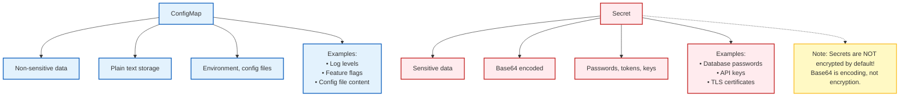
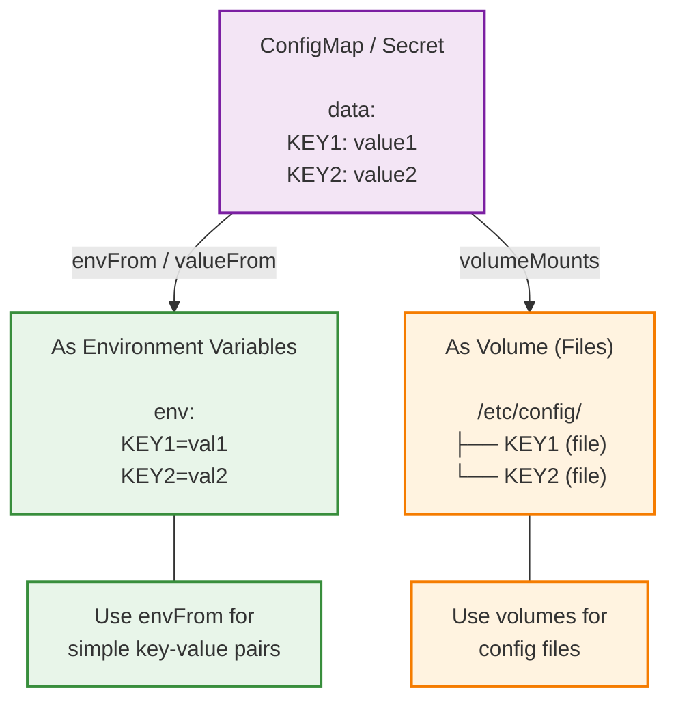

> **Складність**: `[MEDIUM]` - Базове управління конфігурацією
>
> **Час на проходження**: 35-40 хвилин
>
> **Передумови**: Модуль 1.3 (Pods)

---

Протягом цього модуля в командах використовується повне ім'я бінарного файлу `kubectl`, щоб кожен приклад можна було легко скопіювати та виконати в інтерактивній оболонці, скрипті або під час усунення несправностей у CI. Приклади орієнтовані на Kubernetes 1.35 і зосереджені на поведінці, яка має значення, коли налаштування конфігурації, облікові дані та операції розгортання працюють разом у реальному кластері.


## Що ви зможете зробити

Після завершення цього модуля ви зможете:

- **Спроєктувати** слабкозв'язані архітектури розгортання, які переносять специфічні для середовища налаштування з образів контейнерів до ConfigMaps або Secrets.
- **Реалізувати** доставку конфігурації під час виконання за допомогою змінних середовища, змонтованих файлів та проєктованих томів, чітко розуміючи, які зміни вимагають перезапуску Pod.
- **Діагностувати** невдалі розгортання конфігурацій та облікових даних, спричинені помилками base64, межами просторів імен, відсутніми ключами, обмеженнями статичних Pod або монтуваннями `subPath`.
- **Порівняти** межі безпеки ConfigMap та Secret, включаючи ризики RBAC, шифрування etcd у стані спокою та провайдер KMS v2, доступний у сучасних версіях Kubernetes.
- **Оцінити**, коли незмінні ConfigMaps та Secrets зменшують навантаження на control-plane, а коли використання версіонованих об'єктів для заміни робить розгортання в робочому середовищі безпечнішим.


## Чому це важливо

Облікові дані, які мали б бути конфігурацією часу виконання, стають частиною артефакту застосунку тієї ж миті, коли вони вшиваються в образ контейнера, додаються до системи контролю версій або жорстко прописуються в маніфесті розгортання. Щойно це трапляється, ротація перестає бути простою одиночною операцією — команда повинна знайти кожну копію, анулювати кожні скомпрометовані облікові дані, перезібрати кожен артефакт, що їх містить, повторно протестувати кожне розгортання, яке їх використовує, і сподіватися, що жоден старий образ усе ще не працює в якомусь забутому середовищі. Модуль треку CKS про [управління секретами](/k8s/cks/part4-microservice-vulnerabilities/module-4.3-secrets-management/) глибше досліджує цей сценарій збою в контексті підготовки до іспиту з безпеки. <!-- incident-xref: uber-2022-hardcoded-creds --> Урок для базового рівня є значно простішим: вибір між тим, щоб розглядати значення як конфігурацію або як код, — це вибір між ротацією за лічені секунди та ротацією, що триватиме тижнями.

Kubernetes надає вам два вбудовані ресурси, щоб уникнути цієї пастки: ConfigMap для неконфіденційної конфігурації та Secret для чутливих даних. Вони дозволяють одному й тому самому образу контейнера працювати в середовищах розробки, тестування та продакшену, тоді як кластер постачає значення, що відрізняються між цими середовищами. Цей підхід є потужним, але він також створює нову відповідальність: ви повинні точно знати, як ці ресурси зберігаються, доставляються, оновлюються та захищаються, оскільки перенесення пароля до Secret не робить автоматично безпечним увесь супутній робочий процес.

## Розділення конфігурації та коду

Основна ідея ConfigMap та Secret полягає в розділенні відповідальності. Образи контейнерів повинні містити код застосунку, залежності та стандартну поведінку, яку безпечно просувати без змін через увесь конвеєр. Специфічні для середовища розгортання значення повинні надаватися під час виконання, оскільки вони змінюються з причин, незалежних від циклу релізу застосунку. Рівень логування змінюється під час інциденту, кінцева точка бази даних змінюється під час міграції, feature flag змінюється під час поступового запуску, а облікові дані змінюються, коли відбувається їхня ротація або компрометація.

Третій фактор впливової методології "Twelve-Factor App" стверджує: зберігайте конфігурацію в середовищі. У Kubernetes цей принцип стає гнучкішим, ніж звичайні змінні оболонки, оскільки платформа може доставляти конфігурацію як змінні середовища, файли, аргументи командного рядка або об'єкти API. Застосунок і далі зчитує звичайні значення середовища процесу або локальні шляхи у файловій системі; йому не потрібно знати, що ці значення туди помістив kubelet. Експлуатаційна перевага полягає в тому, що ви можете змінити маніфест Deployment, ConfigMap або Secret без перезбирання образу.

Подумайте про просування артефакту як про ланцюг відповідальності. Якщо образ вебзастосунку збирається один раз і просувається без змін з простору імен розробника до тестування, а потім у продакшен, кожне середовище тестує одне й те саме виконуване навантаження. Якщо URL-адреса бази даних продакшену жорстко прописана в образі, ланцюг розривається, оскільки продакшену тепер потрібна інша збірка. Ця різниця ускладнює налагодження, оскільки успіх у середовищі тестування більше не доводить, що артефакт продакшену поводитиметься так само.

ConfigMap та Secret є базовими ресурсами API Kubernetes версії `v1`, але вони не є взаємозамінними. ConfigMap підходить для неконфіденційних значень, таких як рівні логування, feature flags, властивості застосунку, фрагменти конфігурації Nginx або файли конфігурації JSON. Secret підходить для паролів, приватних ключів, токенів API, приватних матеріалів TLS та облікових даних для завантаження образів. Різниця не в тому, що Secret якимось магічним чином стає невидимим; різниця в тому, що Kubernetes застосовує інший намір, патерни доступу, опціональну підтримку шифрування та спеціалізовані типи для даних, які слід розглядати як конфіденційні.

Зупиніться та подумайте: якщо команда змінює лише ключ ConfigMap, який використовує Deployment, чи повинен змінитися дайджест образу контейнера? Якщо ваша відповідь "так", значить конфігурація все ще десь жорстко прив'язана до артефакту. Якщо ваша відповідь "ні", ви описуєте саме той дизайн, який намагається підтримувати Kubernetes: образ залишається незмінним, тоді як об'єкт часу виконання змінюється.

Існує також практична причина розділення конфігурації та коду з огляду на реагування на інциденти. Якщо злитий пароль від бази даних вшитий в образ, шлях реагування включатиме нову збірку, пуш до реєстру, оновлення Deployment та очищення будь-яких Pod, які все ще використовують старий образ. Якщо пароль винесено в Secret, команда може провести ротацію облікових даних, оновити об'єкт Secret і перезапустити відповідні Pod без зміни бінарного файлу застосунку. Ця різниця не скасовує потреби в дисциплінованій автоматизації розгортання, але вона скорочує шлях від виявлення проблеми до її локалізації.



Ця діаграма фіксує першу межу для прийняття рішень, але це лише початок. Одне й те саме значення може бути операційно чутливим в одному середовищі та нешкідливим в іншому, тому класифікація залежить від контексту. Рівень логування зазвичай безпечно зберігати у ConfigMap, але внутрішня кінцева точка, яка розкриває приватну топологію мережі, може вимагати суворішого поводження. Файл TLS-сертифіката може бути публічним матеріалом, тоді як відповідний йому приватний ключ потрібно розглядати як Secret. Найбезпечніша звичка — класифікувати за наслідками: якщо розголошення створить проблему для безпеки, комплаєнсу або вплине на клієнтів, використовуйте Secret і обмежуйте пов'язаний шлях доступу до нього.

## Анатомія об'єктів та межі API

ConfigMap та Secret є об'єктами з прив'язкою до простору імен. Pod може посилатися лише на ConfigMap або Secret у власному просторі імен за допомогою звичайних змінних середовища або конфігурації томів. Ця межа є навмисною, оскільки RBAC, квоти ресурсів та відповідальність за застосунки на рівні простору імен часто збігаються з межами команд або середовищ. Якби Pod фронтенду в просторі імен `web` міг випадково змонтувати Secret із простору імен `payments`, невелика помилка в YAML могла б призвести до витоку облікових даних між командами.

Обидва типи об'єктів також мають обмеження в 1 МіБ на об'єкт. Це обмеження існує, оскільки ці ресурси живуть у Kubernetes API та зберігаються в etcd, який призначений для стану кластера, а не для масової доставки великих даних. Великі бінарні об'єкти змушують сервер API, kubelet, кеші спостереження та etcd переміщувати дані, які мали б обслуговуватися через шар образу, об'єктне сховище, постійний том або робочий процес ініціалізації. Коли файл конфігурації перевищує це обмеження, правильним рішенням зазвичай є зміна механізму доставки, а не розбиття файлу на десятки крихких ключів.

ConfigMap має два поля для корисного навантаження. Поле `data` зберігає рядки в кодуванні UTF-8 — саме їх ви використовуєте для звичайних налаштувань застосунку та текстових файлів конфігурації. Поле `binaryData` зберігає бінарні навантаження у форматі base64 для байтів, що не належать до UTF-8. Kubernetes відхиляє ConfigMap, якщо однаковий ключ з'являється в обох полях, оскільки том-споживач не може безпечно вирішити, яке з цих навантажень має стати файлом із такою назвою.

Secret має подібне поле `data`, але кожне значення в цьому полі має бути закодоване в base64. Це вимога до серіалізації, а не шифрування. Будь-хто, хто має змогу прочитати об'єкт Secret, може розкодувати ці байти. Kubernetes також пропонує `stringData` — зручне поле лише для запису, яке приймає значення у вигляді звичайного тексту під час створення або оновлення, а після кодування зберігає їх у полі `data`. Коли ви зчитуєте Secret назад, поле `stringData` зникає — саме тому інструменти GitOps та робочі процеси server-side apply іноді потребують обережного поводження з питаннями власності на поля.

Вбудовані типи Secret додають валідацію та наміри. Тип `Opaque` (за замовчуванням) є загальним контейнером пар "ключ-значення", тоді як спеціалізовані типи представляють токени сервісних акаунтів, облікові дані реєстру Docker, облікові дані базової аутентифікації, ключі SSH, пари TLS-сертифікатів та токени початкового завантаження. Ці типи не замінюють контроль доступу; вони повідомляють Kubernetes та операторам, яку саме форму облікових даних повинен містити цей об'єкт. Наприклад, TLS Secret має стандартні ключі `tls.crt` та `tls.key`, що полегшує Ingress-контролерам та іншим компонентам його послідовне використання.

Статичні Pod — це виняток, який показує, чому межа API має значення. Статичний Pod визначається безпосередньо на вузлі та керується kubelet-ом, а не створюється через звичайний робочий процес сервера API. Оскільки цей шлях оминає звичайний процес отримання Secret та авторизації, Secret не можна використовувати зі статичними Pod. Якщо компоненту на рівні вузла потрібні конфіденційні матеріали, архітектура має використовувати інший механізм безпечної доставки та розглядатися як адміністрування вузла, а не як звичайний патерн конфігурації Pod.

Опціональні посилання — це ще одна межа, яку варто проєктувати свідомо. Kubernetes дозволяє позначати деякі посилання на ConfigMap або Secret як опціональні, що може бути корисним під час поетапних розгортань, коли певне значення ще може не існувати в кожному середовищі. Ризик полягає в тому, що опціональні посилання можуть приховати реальну помилку розгортання аж до моменту запуску застосунку, де симптом виглядатиме як заплутана відсутність файлу або порожня змінна. Використовуйте опціональні посилання для запланованих вікон сумісності, а не як спосіб обійти валідацію маніфестів.

Зупиніться та подумайте: перед тим, як запустити це, який вивід ви очікуєте від Secret, створеного за допомогою `stringData`? Важливе передбачення полягає в тому, що подальша команда `kubectl get secret -o yaml` не покаже `stringData`; вона покаже значення у base64 у полі `data`. Якщо вас це дивує, зупиніться перед тим, як додавати Secret у робочі процеси рецензування, оскільки рецензенти можуть побачити закодований текст і помилково припустити, що він захищений від розголошення.

## Створення ConfigMap та Secret

Kubernetes підтримує як імперативне створення, так і декларативні маніфести. Імперативні команди корисні для навчання, швидких експериментів та генерування початкового YAML з локальних файлів. Декларативні маніфести краще підходять для відтворюваних середовищ, оскільки їх можна рецензувати, версіонувати, порівнювати (diff) та застосовувати через той самий конвеєр доставки, що й решту застосунку. Професійна звичка — розуміти обидва підходи, а потім використовувати декларативний робочий процес для всього, що ви плануєте відтворювати.

```bash
# From literal values
kubectl create configmap app-config \
  --from-literal=LOG_LEVEL=debug \
  --from-literal=ENVIRONMENT=staging

# From file
kubectl create configmap nginx-config --from-file=nginx.conf

# From directory (each file becomes a key)
kubectl create configmap configs --from-file=./config-dir/

# View ConfigMap
kubectl get configmap app-config -o yaml
```

Наведені вище команди точно показують основні режими створення: літеральні ключі, один файл, цілий каталог та крок перегляду YAML. Збереження повної команди `kubectl` у прикладах робить робочий процес однозначним для читачів, які вставляють команди у скрипти, термінали або ранбуки. Згенерований з каталогу ConfigMap зіставляє кожну назву файлу з ключем, що зручно для каталогів конфігурації, але небезпечно, якщо каталог містить резервні копії редактора, локальні перевизначення або файли, які ніколи не мали залишати вашу робочу станцію.

```yaml
apiVersion: v1
kind: ConfigMap
metadata:
  name: app-config
data:
  LOG_LEVEL: "debug"
  ENVIRONMENT: "staging"
  config.json: |
    {
      "database": "localhost",
      "port": 5432
    }
```

YAML-представлення показує, чому ConfigMap часто використовують для файлів застосунку, а не лише для невеликих змінних. Ключ `config.json` стає файлом при монтуванні як тому, а символ вертикальної риски зберігає багаторядкове форматування. Це корисно для фрагментів конфігурації Nginx, властивостей застосунку, файлів JSON, YAML або INI, але це також означає, що тут застосовуються звичайні правила рецензування конфігурації. Якщо багаторядковий блок містить пароль, він все одно залишається видимими даними ConfigMap і його слід перенести до Secret.

```bash
# From literal values
kubectl create secret generic db-creds \
  --from-literal=username=admin \
  --from-literal=password=secret123

# From file
kubectl create secret generic tls-cert \
  --from-file=cert.pem \
  --from-file=key.pem

# View secret (base64 encoded)
kubectl get secret db-creds -o yaml

# Decode a value
kubectl get secret db-creds -o jsonpath='{.data.password}' | base64 -d
```

Приклад із Secret демонструє робочий процес, який викликає багато помилок на початкових етапах. CLI приймає літеральні значення та зберігає закодовані байти, тому вигляд YAML відрізняється від того, що отримає застосунок. Розкодування за допомогою `base64 -d` — це техніка налагодження, а не межа авторизації. Якщо користувач, сервісний акаунт або процес може успішно виконати цю команду get, він зможе відновити початкове значення.

```yaml
apiVersion: v1
kind: Secret
metadata:
  name: db-creds
type: Opaque              # Generic secret type
data:                     # Base64 encoded
  username: YWRtaW4=      # echo -n 'admin' | base64
  password: c2VjcmV0MTIz  # echo -n 'secret123' | base64
```

```yaml
# Or use stringData for plain text (K8s encodes it)
apiVersion: v1
kind: Secret
metadata:
  name: db-creds
type: Opaque
stringData:               # Plain text, auto-encoded
  username: admin
  password: secret123
```

Ці два маніфести Secret дають однаковий практичний результат для Pod-споживача, але вони створюють різний досвід рецензування. При використанні `data` автор повинен правильно кодувати значення та уникати випадкових символів нового рядка від таких команд, як звичайний `echo`. При використанні `stringData` автор пише зрозумілий звичайний текст і дозволяє серверу API закодувати його. Жоден з цих стилів не є безпечним для коміту в публічний репозиторій, і жоден з них не замінює належний зовнішній робочий процес із секретами, коли Git є частиною шляху доставки.

Корисний трюк для рецензування — читати маніфест з погляду майбутнього оператора, який отримає сповіщення про інцидент. Чи зможе він визначити, які значення безпечно публікувати в тікеті, які значення потребують ротації в разі витоку, а які значення потребують розгортання, щоб набути чинності? Якщо відповідь "ні", маніфест може бути технічно коректним, але при цьому залишатися операційно незрозумілим. Такі назви, як `app-settings`, `app-secrets`, та стабільні ключі, такі як `DB_PASSWORD`, є простими, але вони вчать читача, де саме шукати під час збою.


## Використання значень у Pod

Pod може використовувати ConfigMap та Secret через аргументи командного рядка, окремі змінні середовища, `envFrom`, томи лише для читання (read-only volumes), projected volumes або через прямий доступ до API з коду застосунку. Вибір має залежати від того, як застосунок очікує читати конфігурацію та як часто потрібно змінювати значення. Змінні середовища прості та звичні, але вони фіксуються під час запуску контейнера. Файли краще підходять для структурованої конфігурації і можуть оновлюватися kubelet для звичайних томів ConfigMap та Secret.

```yaml
apiVersion: v1
kind: Pod
metadata:
  name: app
spec:
  containers:
  - name: app
    image: myapp
    env:
    - name: LOG_LEVEL
      valueFrom:
        configMapKeyRef:
          name: app-config
          key: LOG_LEVEL
    # Or all keys at once:
    envFrom:
    - configMapRef:
        name: app-config
```

Ви можете поєднувати `env` та `envFrom` в одному контейнері, коли потрібно явно вказати один ключ, а решту імпортувати масовим способом — вони не виключають одне одного.

Цей патерн зі змінними середовища легко читати, і він добре працює для значень, які за своєю природою є скалярними, таких як `LOG_LEVEL`, `ENVIRONMENT` або feature flag. Його обмеження не менш важливе: пізніша зміна ConfigMap не змінює середовище запущеного процесу. Процеси Linux отримують своє середовище під час запуску, і Kubernetes не перезаписує його під процесом. Щоб підхопити нове значення, ви видаляєте Pod, ініціюєте Deployment rollout або використовуєте патерн контролера, який змінює анотацію шаблону Pod під час зміни конфігурації.

```yaml
apiVersion: v1
kind: Pod
metadata:
  name: app
spec:
  containers:
  - name: app
    image: nginx
    volumeMounts:
    - name: config
      mountPath: /etc/nginx/conf.d
  volumes:
  - name: config
    configMap:
      name: nginx-config
```

Змонтовані ConfigMap та Secret поводяться інакше, оскільки kubelet керує файлами на вузлі. Коли об'єкт API змінюється, kubelet з часом оновлює спроєктовані (projected) файли для звичайних монтувань томів. Затримка не є миттєєвою; вона може досягати періоду синхронізації kubelet плюс затримка поширення кешу, що зазвичай описується як приблизно дві хвилини за стандартної поведінки. Застосунки, які відстежують файли або перезавантажуються за сигналом, можуть використовувати цей шлях для динамічної конфігурації, тоді як застосункам, які читають файли лише під час запуску, все одно потрібен перезапуск.

Опція `subPath` є головним винятком. Команди часто використовують `subPath`, щоб змонтувати один ключ ConfigMap у каталог, не приховуючи решту вмісту каталогу. Ця зручність створює статичне монтування (bind mount) і ламає звичайний механізм ротації символічних посилань (symlink) kubelet, тому оновлення ConfigMap або Secret не з'являються в запущеному контейнері. Якщо динамічне оновлення має значення, монтуйте каталог без `subPath` і відповідно впорядковуйте шлях у застосунку.

Зупиніться та подумайте: ваш застосунок запускається п'ять хвилин, і вам потрібно тимчасово змінити рівень логування з `info` на `debug` під час інциденту. Якщо застосунок може перезавантажити файл, але не може перезавантажити змінні середовища, дизайн зі змонтованим файлом є операційно кращим. Якщо застосунок читає конфігурацію лише один раз під час запуску, обидва методи доставки все одно вимагають перезапуску, тому вирішальним фактором стає читабельність, ризик витоку (leak risk) та конвенції застосунку.

```yaml
apiVersion: v1
kind: Pod
metadata:
  name: app
spec:
  containers:
  - name: app
    image: myapp
    env:
    - name: DB_USER
      valueFrom:
        secretKeyRef:
          name: db-creds
          key: username
    - name: DB_PASS
      valueFrom:
        secretKeyRef:
          name: db-creds
          key: password
```

Секретні змінні середовища є поширеними, але заслуговують на особливу обережність. Багато інструментів для звітів про збої (crash reporters), кінцевих точок для налагодження (debug endpoints), пакетів підтримки (support bundles) та інструментів перевірки процесів за замовчуванням містять змінні середовища. Якщо пароль з'являється в середовищі, він може потрапити в логи або діагностику, навіть якщо RBAC навколо об'єкта Secret налаштовано правильно. Монтування Secret як файлу звужує цей шлях випадкового розкриття, оскільки інструментарій зазвичай не читає довільні файли облікових даних, якщо не налаштований на це.

```yaml
apiVersion: v1
kind: Pod
metadata:
  name: app
spec:
  containers:
  - name: app
    image: myapp
    volumeMounts:
    - name: secrets
      mountPath: /etc/secrets
      readOnly: true
  volumes:
  - name: secrets
    secret:
      secretName: db-creds
```

Коли Secret монтуються як файли, їхні корисні навантаження (payloads) доставляються на вузол через сховище, що працює в пам'яті (memory-backed storage), а не записуються як звичайні файли шару образу. Ця деталь реалізації зменшує ймовірність випадкового збереження на диску на вузлі, але вона не захищає дані від запущеного контейнера. Якщо зловмисник отримує оболонку (shell) всередині контейнера застосунку, Secret доступний через той самий шлях у файловій системі, який використовує застосунок. Secret захищають від деяких шляхів розкриття через сховище та API; вони не захищають від скомпрометованого робочого навантаження (workload), якому легітимно потрібні облікові дані.



Цей потік пояснює, чому план розгортання (rollout plan) повинен містити як механізм доставки Kubernetes, так і механізм перезавантаження застосунку. Kubernetes може оновити файл, але він не може змусити довільний код застосунку перечитати цей файл. Kubernetes може створити змінну середовища, але він не може змінити середовище процесу після запуску. Найкращі production-дизайни роблять цю поведінку явною, використовуючи версіоновані імена об'єктів, контрольні суми (checksums) в анотаціях шаблону Pod, sidecar-контейнери для перезавантаження або власні кінцеві точки (endpoints) перезавантаження застосунку залежно від вимог до надійності.

Контролери часто автоматизують сторону перезапуску цієї проблеми, змінюючи шаблон Pod щоразу, коли змінюється пов'язаний ConfigMap або Secret. Helm charts зазвичай додають анотацію з контрольною сумою (checksum), отриманою зі згенерованої конфігурації, а деякі оператори безпосередньо відстежують об'єкти та ініціюють rollouts. Цей патерн є потужним, оскільки він перетворює невидиму залежність у видиму зміну Deployment. Компроміс полягає в тому, що кожне редагування конфігурації тепер може перезапускати робочі навантаження (workloads), тому команди повинні вирішити, чи є значення безпечним для живого перезавантаження (live reload), розгортання на основі перезапуску або ручного вікна обслуговування (maintenance window).

## Практичний приклад: Рефакторинг захардкодженої конфігурації

Уявіть невеликий вебсервіс, який спочатку був створений для ноутбука одного розробника. Він підключається до бази даних на `localhost:5432`, використовує час життя кешу (time-to-live) `3600` і читає пароль із файлу, доданого до репозиторію. Цей дизайн може спрацювати для демоверсії, але він дає збій у той момент, коли той самий образ потрібно запустити в окремих просторах імен або кластерах. Розташування бази даних змінюється залежно від середовища, політика кешу може змінитися під час усунення несправностей (troubleshooting), а пароль потрібно ротувати без створення нового образу застосунку.

Першим кроком є класифікація значень за конфіденційністю та поведінкою оновлення. TTL кешу не є конфіденційним, тому він належить до ConfigMap. Пароль бази даних є конфіденційним, тому він належить до Secret. Хост бази даних може бути неконфіденційним у невеликій лабораторії, але конфіденційним у production-середовищі, де розкриття топології має значення; цей модуль залишає приклад простим, але production-команди повинні класифікувати це значення свідомо, а не за звичкою.

```yaml
# ConfigMap
apiVersion: v1
kind: ConfigMap
metadata:
  name: app-settings
data:
  CACHE_TTL: "3600"
```

```yaml
# Secret
apiVersion: v1
kind: Secret
metadata:
  name: app-secrets
stringData:
  DB_PASSWORD: "supersecret"
```

Ці два об'єкти відв'язують (decouple) артефакт релізу від середовища виконання. ConfigMap може переглядатися власниками застосунку, а Secret може керуватися через вужчий операційний шлях. У налаштуваннях GitOps ви зазвичай уникаєте коміту маніфестів Secret у вигляді простого тексту і замість цього використовуєте запечатане (sealed), зашифроване або зовнішньо синхронізоване представлення. Концептуальний поділ все одно має значення, оскільки специфікація Pod має повідомляти, які значення є конфігурацією, а які — обліковими даними.

```yaml
# Pod using both
apiVersion: v1
kind: Pod
metadata:
  name: myapp
spec:
  containers:
  - name: app
    image: myapp:v1
    envFrom:
    - configMapRef:
        name: app-settings
    env:
    - name: DB_PASSWORD
      valueFrom:
        secretKeyRef:
          name: app-secrets
          key: DB_PASSWORD
```

Цей Pod зберігає оригінальний інтерфейс застосунку простим: процес отримує налаштування кешу та пароль як змінні середовища. Це прийнятно для багатьох початкових лабораторій, але під час production review слід запитати, чи може пароль з'явитися у виводі про збій (crash output), дампах потоків (thread dumps) або пакетах для налагодження (debugging bundles). Якщо застосунок підтримує читання файлу облікових даних, змонтований Secret часто є кращим. Якщо застосунок може перезавантажувати конфігураційні файли, змонтований ConfigMap може зменшити тиск від перезапусків (restart pressure) під час реагування на інциденти.

Операційна перевага (operational win) полягає в тому, що образ `myapp:v1` може переміщатися між середовищами без перезбірки. Простір імен staging може надати один ConfigMap та Secret, тоді як production надає інші об'єкти з тими самими ключами. Якщо production-пароль ротується, Secret змінюється, і робоче навантаження (workload) перезапускається; образ застосунку залишається незмінним. У цьому полягає різниця між конфігурацією як операційним вводом і конфігурацією як прихованою залежністю всередині артефакту релізу.

Коли застосунок очікує кілька файлів в одному каталозі, projected volumes запобігають незручному маніпулюванню каталогами (directory juggling). Projected volume може поєднати ConfigMap, Secret, токени сервісних акаунтів (service account tokens) та дані downward API в єдиний змонтований шлях. Застосунок бачить один каталог, тоді як Kubernetes зберігає окрему власність і конфіденційність кожного вихідного об'єкта. Це особливо корисно для старішого програмного забезпечення, яке очікує, що `/opt/app/config` міститиме конфігураційний файл, сертифікат та файл із паролем поруч один з одним.

## Реальність безпеки: Secret — це межа, а не сховище

Найважливіше речення в цьому модулі просте: base64 — це не шифрування. Kubernetes використовує base64 у полях `data` об'єкта Secret, щоб довільні байти могли акуратно вписатися в корисні навантаження (payloads) API JSON та YAML. Base64 не приховує дані від будь-кого, хто може прочитати об'єкт, отримати список (list) Secret у просторі імен, створити Pod, який монтує Secret, або скомпрометувати запущений контейнер, у якому Secret уже змонтовано. Ставтеся до Secret як до об'єкта Kubernetes із контрольованим доступом, а не як до повноцінної системи керування секретами (secret-management system) самої по собі.

Шифрування в стані спокою (encryption at rest) вирішує іншу загрозу: розкриття збережених даних API в etcd або резервних копіях. Адміністратори кластера можуть налаштувати API-сервер за допомогою `--encryption-provider-config`, що призведе до шифрування вибраних даних ресурсів, таких як Secret, перед записом на диск. Серед провайдерів є `identity`, який не виконує шифрування; локальні провайдери шифрування, такі як `aescbc`, `aesgcm` і `secretbox`; та KMS-провайдери, які інтегруються із зовнішньою системою керування ключами (key-management system).

Історія з KMS має значення для Kubernetes 1.35, оскільки старіша поведінка KMS v1 мала серйозні недоліки продуктивності. KMS v1 було оголошено застарілим (deprecated) у Kubernetes v1.28 і вимкнено за замовчуванням починаючи з v1.29, оскільки він вимагав взаємодії з віддаленим провайдером у спосіб, який міг додати затримку (latency) та крихкість до операцій API-сервера. KMS v2 досяг стабільного статусу в Kubernetes v1.29 і є сучасним шляхом для зовнішнього керування ключами, оскільки він покращує продуктивність, зберігаючи корінь довіри (root of trust) за межами кластера.

Шифрування в стані спокою не захищає маніфести у вигляді простого тексту до того, як вони досягнуть API-сервера. Якщо команда комітить Secret YAML з `stringData` у публічний репозиторій, KMS v2 не допоможе; витік стався в Git, а не в etcd. Якщо розробник надсилає маніфест Secret через незахищений канал чату, провайдер сховища кластера ніколи не отримує шансу зменшити це розкриття. Межа безпеки починається лише після того, як API-сервер отримує та зберігає об'єкт.

RBAC — це друга важлива межа, і її легко недооцінити. Надання `get` на іменований Secret дозволяє пряме отримання цього Secret. Надання `list` на Secret у просторі імен є ширшим, оскільки відповіді list включають повні корисні навантаження (payloads) об'єктів, а не лише імена. Надання користувачеві дозволу на створення Pod у просторі імен також може стати непрямим доступом до Secret, оскільки користувач може створити Pod, який монтує Secret, а потім прочитати його зсередини контейнера.

Цей останній пункт змінює те, як ви повинні розглядати запити на доступ. Роль, яка не може читати Secret безпосередньо, все одно може бути занадто потужною, якщо вона може запускати довільні робочі навантаження в тому самому просторі імен, що й цінні облікові дані. Політики допуску (admission policies), дизайн просторів імен (namespace design), обмеження сервісних акаунтів (service account scoping) та ідентичність робочого навантаження (workload identity) — все це допомагає звузити радіус ураження (blast radius). У production питання полягає не лише в тому, «хто може читати об'єкти Secret?», але й у тому, «хто може спричинити запуск робочого навантаження з доступом до цих об'єктів Secret?»

Зупиніться та подумайте: зловмисник має оболонку (shell) всередині контейнера вашого застосунку, і застосунок читає свій пароль бази даних із `/etc/secrets/password`. Чи зупинить зловмисника те, що значення надійшло із Secret, а не з ConfigMap? Ні. Щойно робоче навантаження скомпрометовано, облікові дані стають доступними через той самий шлях, який використовує робоче навантаження, тому надійнішими засобами контролю є посилення безпеки під час виконання (runtime hardening), принцип найменших привілеїв (least privilege), короткочасні облікові дані (short-lived credentials), мережева політика (network policy) та швидка ротація.

Ось чому дизайн Secret має поєднуватися з дизайном облікових даних. Довгоживучий пароль бази даних, змонтований у кожну репліку, створює більший радіус ураження (blast radius), ніж короткочасний токен, обмежений одним сервісним акаунтом і автоматично ротований. Kubernetes може доставити будь-яке з цих значень, але він не може вирішити, чи самі облікові дані не є надмірно привілейованими (overpowered). Хороші команди розглядають споживача, простір імен, сервісний акаунт, мережевий шлях, дозволи бази даних та механізм ротації як єдину систему.


## Проєкційні томи, незмінність та стратегія розгортання

Доставка конфігурації стає цікавішою мірою зростання кластерів. Один простір імен може містити багато Deployments, які використовують спільні налаштування, а велика платформа може мати тисячі Pods, що відстежують один і той самий стабільний об'єкт. Якщо кожен kubelet відстежує змінні ConfigMaps та Secrets, які майже ніколи не змінюються, control plane витрачає ресурси на підтримку шляхів оновлення, які застосунку не потрібні. Kubernetes підтримує незмінні ConfigMaps та Secrets, щоб зменшити це постійне навантаження від відстеження та опитування.

Встановлення `immutable: true` для ConfigMap або Secret вказує Kubernetes, що дані об'єкта не можна змінювати після створення. Kubelet може припинити відстеження оновлень для цього об'єкта, що зменшує навантаження в кластерах із високою динамікою змін. Такий компроміс є свідомим: тепер зміна вимагає створення нового об'єкта та оновлення робочого навантаження, щоб воно посилалося на нове ім'я. Цей патерн виглядає дещо багатослівнішим, але він створює безпечнішу історію розгортання, оскільки кожен версіонований об'єкт представляє конкретний знімок конфігурації.

Незмінні ConfigMaps та Secrets стали стабільними у Kubernetes v1.21 після попередніх етапів альфа- та бета-тестування. Оригінальні документи з планування покращень містили більш ранні цільові дати, але анонси релізів та поточна документація є джерелом істини для операційних рішень. У Kubernetes 1.35 незмінність є нормальною поведінкою у продакшені, а не експериментальним трюком. Вона особливо корисна для глобальних констант, значень за замовчуванням для застосунків, наборів сертифікатів та конфігурацій, які мають змінюватися лише через контрольоване розгортання.

Версіоновані імена є практичним доповненням до незмінності. Замість редагування `app-config`, створіть `app-config-2026-05-03` або інше ім'я, прив'язане до конкретного релізу, оновіть Deployment і дозвольте контролеру розгортання поступово замінити Pods. Старий об'єкт може залишатися на місці, поки старі Pods завершують роботу (drain), а очищення можна виконати після завершення розгортання. Це полегшує відкат (rollback), оскільки попередній об'єкт усе ще існує і не був перезаписаний.

Існує компроміс між поведінкою динамічного оновлення та зрозумілістю розгортання. Змінний змонтований ConfigMap може оновлювати файли в працюючих Pods, що є корисним для програмного забезпечення, яке безпечно перезавантажує конфігурацію. Версіонований незмінний ConfigMap примусово викликає розгортання, що є більш передбачуваним, коли погана конфігурація може зламати всі репліки одночасно. Досвідчені оператори роблять вибір на основі радіуса ураження (blast radius): динамічне перезавантаження зручне для перемикачів із низьким ризиком (toggles), тоді як версіоновані розгортання безпечніші для налаштувань, що змінюють пули з'єднань, поведінку авторизації або умови запуску.

Зробіть це рішення невеликою звичкою під час проєктування. Якщо значення змінюється часто, а застосунок може безпечно перевіряти та перезавантажувати його, змонтований змінний ConfigMap може бути правильним вибором. Якщо значення визначає поведінку під час запуску, автентифікацію або критичну маршрутизацію, віддавайте перевагу версіонованому об'єкту та розгортанню через Deployment. Якщо значення є конфіденційним, почніть із Secret, а потім вирішіть, який спосіб доставки — через файл чи середовище — створює менше шляхів випадкового витоку для цього конкретного застосунку.

Історія розгортання також має значення після завершення інциденту. Якщо під час усунення несправностей змінний об'єкт редагували на місці кілька разів, відновлення того, які Pods бачили яке значення, стає складним, якщо журнали аудиту (audit logs) та події розгортання не є повними. Версіоновані об'єкти залишають чіткіший слід, оскільки ім'я об'єкта з'являється у шаблоні Pod. Ця додаткова ясність може стати різницею між швидким розбором інциденту (post-incident review) та годинами, витраченими на вгадування того, яка конфігурація була активною під час періоду, що вплинув на клієнтів.

## Патерни та антипатерни

Найсильніший патерн — зробити відповідальність за конфігурацію явною. Команди розробки застосунків можуть володіти неконфіденційними ConfigMaps, які описують поведінку, тоді як команди платформи або безпеки володіють створенням, синхронізацією та ротацією Secrets. Це не означає, що кожній команді потрібен окремий інструмент, але це означає, що шляхи перевірки (review paths) мають відображати наслідки. Друкарська помилка у feature-прапорці — це не той самий клас проблеми, що й витік облікових даних бази даних, і робочий процес не повинен удавати, що вони однакові.

Інший надійний патерн — використовувати стабільні ключі з версіонованими іменами об'єктів. Застосункам не потрібно змінювати `DB_PASSWORD` на `DATABASE_PASSWORD_V2` під час звичайної ротації; контракт ключів має залишатися стабільним. Ім'я об'єкта може змінюватися, щоб представляти нову версію, і розгортання Deployment може вказувати на цей новий об'єкт. Стабільні ключі зменшують кількість змін у застосунку, тоді як версіоновані імена надають операторам чисту поверхню для відкату.

Третій патерн — надавати перевагу монтуванню файлів для складної структурованої конфігурації. JSON, YAML, сертифікати та багаторядкові властивості легше перевіряти як файли, ніж як довгі змінні середовища. Монтування файлів також дозволяє застосункам або sidecar-контейнерам відстежувати зміни, коли динамічне перезавантаження є безпечним. Змінні середовища залишаються корисними для невеликих скалярних значень, але вони стають незручними, коли значення містять пробіли, вкладену структуру або конфіденційні дані, які інструменти для роботи зі збоями (crash tooling) можуть розкрити.

Найпоширенішим антипатерном є ставлення до Secrets як до повноцінного сховища (vault). Kubernetes Secrets — це об'єкти API, захищені механізмами контролю Kubernetes; вони не є заміною для управління життєвим циклом облікових даних, короткострокових токенів, перевірки доступу або зовнішнього управління ключами. Інший антипатерн — надання широких дозволів у просторі імен через те, що CI-завданню або розробнику "просто потрібно розгорнути". Якщо ця роль може створювати Pods, вона може мати змогу побічно витягувати Secrets. Кращою альтернативою є використання обмежених сервісних акаунтів (service accounts), обмежень допуску (admission constraints) та окремих просторів імен для робочих навантажень із різною чутливістю до облікових даних.

Ці патерни масштабуються, оскільки зменшують неоднозначність. Новий інженер може перевірити Deployment і зробити висновок, чи є значення безпечною конфігурацією, конфіденційним матеріалом облікових даних, динамічно оновленими даними файлу або вхідними даними для версіонованого розгортання. Така читабельність не є косметичною; вона знижує операційний ризик. Під час збою команди роблять менше помилок, коли YAML виражає намір достатньо чітко, щоб наступна дія була очевидною.

| Патерн або антипатерн | Коли це виникає | Операційні наслідки | Краща практика |
|---|---|---|---|
| Патерн: стабільні ключі з версіонованими іменами об'єктів | Команди проводять ротацію облікових даних або конфігурації, зберігаючи код застосунку стабільним. | Відкати (rollbacks) простіші, оскільки старі Pods можуть продовжувати використовувати старий об'єкт, поки не завершать роботу. | Зберігайте імена ключів узгодженими та змінюйте імена об'єктів під час контрольованих розгортань. |
| Патерн: монтування файлів для структурованої конфігурації | Застосунки читають JSON, YAML, сертифікати або багаторядкові налаштування. | Поведінка валідації та перезавантаження є чіткішою порівняно з довгими змінними середовища. | Монтуйте директорію та уникайте `subPath`, коли оновлення мають з'являтися у працюючих Pods. |
| Патерн: незмінна спільна конфігурація | Багато Pods споживають значення, яке рідко змінюється. | Зменшується навантаження на відстеження з боку kubelet та API-сервера у великих кластерах. | Встановіть `immutable: true` та замінюйте об'єкт новою версією за потреби. |
| Антипатерн: відкриті тексти Secrets у Git | Команди хочуть декларативних маніфестів, але пропускають інструментарій, специфічний для секретів. | Доступ до репозиторію стає доступом до облікових даних, а історія зберігає старі значення, які витекли. | Використовуйте зашифровані (sealed), зовнішні або синхронізовані оператором робочі процеси для секретів. |
| Антипатерн: широкі права на створення Pod | Користувачеві або завданню потрібна зручність розгортання у спільному просторі імен. | Створення Pod може стати побічним доступом до змонтованих Secrets. | Обмежте RBAC, розділяйте простори імен та впроваджуйте політики допуску (admission policies). |
| Антипатерн: `subPath` для живої конфігурації | Команда хоче змонтувати один файл в існуючу директорію. | Файл перестає отримувати оновлення від kubelet після початкового монтування (bind mount). | Монтуйте всю директорію або цілеспрямовано перезапускайте Pods після оновлень. |

## Схема прийняття рішень

Вибір між ConfigMap, Secret, змінною середовища, змонтованим файлом, проєкційним томом або незмінним об'єктом має бути проєктним рішенням, а не рефлексом. Почніть із запитання, що станеться, якщо значення буде розкрито. Якщо розкриття є шкідливим, використовуйте Secret і ретельно спроєктуйте відповідний RBAC та шлях доставки. Якщо розкриття є нешкідливим, але неправильні значення можуть зламати продакшен, використовуйте ConfigMap із такою ж дисципліною розгортання, яку ви застосовуєте до коду.

Далі запитайте, як застосунок читає це значення. Якщо він очікує змінні середовища процесу та читає їх лише під час запуску, ін'єкція середовища є простою, але кожна зміна означає перезапуск Pod. Якщо він очікує файли або може бути адаптований до файлів, монтування томів часто забезпечує чистішу поведінку для структурованих даних і зменшує випадкове потрапляння конфіденційних значень у логи. Якщо він очікує єдину директорію, яка об'єднує кілька джерел, проєкційні томи дозволяють Kubernetes скомпонувати цю директорію, зберігаючи вихідні об'єкти розділеними.

Нарешті, запитайте, як часто змінюється значення і наскільки небезпечною буде погана зміна. Зміни з високим ризиком заслуговують на версіоновані об'єкти та контрольовані розгортання, навіть якщо Kubernetes міг би оновити змонтований файл автоматично. Перемикачі з низьким ризиком можуть отримати вигоду від динамічного оновлення файлів, якщо застосунок перевіряє їх безпечно. Спільні значення, які рідко змінюються, є хорошими кандидатами на незмінність, оскільки вони зменшують накладні витрати платформи та запобігають випадковим змінам.

```text
+-----------------------------+
| Is disclosure harmful?      |
+--------------+--------------+
               |
        yes    |    no
               |
      Secret   |   ConfigMap
               |
               v
+-----------------------------+
| Does the app need a file?   |
+--------------+--------------+
        yes    |    no
               |
  volume mount | environment
               |
               v
+-----------------------------+
| Should updates be dynamic?  |
+--------------+--------------+
        yes    |    no
               |
 avoid subPath | version name
+-----------------------------+
```

| Вибір | Коли використовувати | Коли уникати | Головний компроміс |
|---|---|---|---|
| Змінна середовища ConfigMap | Значення неконфіденційне, скалярне і читається лише під час запуску. | Значення має оновлюватися в працюючих Pods. | Проста ін'єкція під час запуску в обмін на оновлення через перезапуск. |
| Том ConfigMap | Значення є структурованим текстом або файлом, який застосунок може перезавантажити. | Застосунок не може терпіти кінцеву узгодженість у часі (eventual refresh timing). | Краща файлова семантика з асинхронним поширенням. |
| Змінна середовища Secret | Застосунок підтримує лише облікові дані на основі змінних середовища, і журнали (logs) контролюються. | Дампи пам'яті (crash dumps) або діагностика розкривають значення змінних середовища. | Сумісність в обмін на вищий ризик випадкового витоку. |
| Том Secret | Застосунок може читати файли облікових даних. | Застарілий (legacy) застосунок не можна налаштувати на використання шляхів до файлів. | Нижчий ризик випадкового розкриття через середовище з доступом до файлової системи всередині Pod. |
| Проєкційний том | Кілька джерел мають з'явитися в одній директорії. | Межі відповідальності стануть заплутаними для операторів. | Єдине подання для застосунку зі збереженням розділення вихідних об'єктів. |
| Незмінний об'єкт | Значення рідко змінюються або вимагають контрольованого версіонованого розгортання. | Вам потрібна жива мутація (live mutation) того ж імені об'єкта. | Менші накладні витрати на control plane та безпечніша історія в обмін на робочий процес із заміною. |

## Чи знали ви?

- **Ліміт корисного навантаження 1 МіБ**: Розміри окремих об'єктів ConfigMap та Secret не можуть перевищувати 1 МіБ, щоб захистити сховище даних etcd від роздутого споживання пам'яті та зависання запитів.
- **Дата загальнодоступності (GA) KMS v2**: Сучасний провайдер шифрування KMS v2 став загальнодоступним (General Availability) у Kubernetes v1.29, нарешті замінивши повільну та залежну від мережі архітектуру KMS v1, яка вимкнена за замовчуванням.
- **Хронологія загальнодоступності незмінності**: Незмінні ConfigMaps та Secrets досягли стабільного статусу в Kubernetes v1.21, хоча ранні матеріали планування покращень орієнтувалися на більш ранній реліз.
- **Двохвилинне вікно поширення**: Під час монтування ConfigMaps як томів, поява змін може тривати приблизно дві хвилини, оскільки час синхронізації kubelet та поширення кешу мають значення.

## Типові помилки

| Помилка | Чому це трапляється | Як це виправити |
|---|---|---|
| Збереження секретів у Git | Команди хочуть декларативної доставки та забувають, що значення base64 або `stringData` залишаються доступними для відновлення з історії репозиторію. | Використовуйте зашифровані (sealed), зовнішні або керовані оператором робочі процеси для секретів і виконуйте ротацію будь-яких облікових даних, що були зафіксовані в коді (committed). |
| Думка, що base64 означає шифрування | YAML-файл Secret відображає закодовані значення, які виглядають достатньо незнайомими, щоб здаватися захищеними. | Ставтеся до base64 лише як до серіалізації, обмежуйте RBAC для Secret та вмикайте шифрування у стані спокою (encryption at rest) для збережених даних API. |
| Кодування символів нового рядка | Звичайний `echo` додає символ нового рядка, тому розкодований пароль не збігається з тим, що очікує застосунок. | Надавайте перевагу `stringData` для написаних вручну маніфестів або використовуйте `echo -n`, коли ви навмисно готуєте значення `data`. |
| Жорстке кодування конфігурації в образах | Значення починається як демонстраційне налаштування за замовчуванням і стає прихованою залежністю розгортання. | Перемістіть значення, специфічні для середовища, до ConfigMaps або Secrets та просувайте один і той самий образ (image) у різних середовищах. |
| Монтування живої конфігурації за допомогою `subPath` | Команда хоче розмістити один файл в існуючій директорії без приховування інших файлів. | Монтуйте всю директорію, коли динамічне оновлення має значення, або змиріться з тим, що потрібен перезапуск Pod. |
| Надання широкого доступу `list` до Secret | Оператори вважають, що отримання списку безпечніше, ніж читання окремих об'єктів. | Пам'ятайте, що відповіді на запити списку містять корисне навантаження (payload data), і надавайте доступ `get` за іменами лише там, де це доцільно. |
| Ігнорування створення Pod як доступу до Secret | Роль не може читати Secrets безпосередньо, тому це здається нешкідливим. | Ставтеся до довільного створення Pod у просторі імен як до потенційного побічного доступу до Secrets, змонтованих у цьому просторі імен. |


## Контрольні запитання

<details><summary>Ваша команда оновлює ключ ConfigMap, який використовується як змінна середовища, але запущений застосунок досі повідомляє старе значення. Що слід перевірити першим?</summary>

Змінні середовища фіксуються під час запуску контейнера, тому спершу слід перевірити, як було передано значення: через `env`, `envFrom` чи шляхом монтування файлу. Якщо це була змінна середовища, така поведінка є очікуваною, і Pod необхідно перестворити або оновити за допомогою контролера. Якщо команда очікувала на динамічні оновлення, дизайн слід змінити: перенести налаштування до змонтованого файлу та переконатися, що застосунок справді його перезавантажує. Це діагностує механізм доставки, замість того щоб звинувачувати сам об'єкт ConfigMap.

</details>

<details><summary>Розробник зберігає production-токен API у ConfigMap, оскільки він "лише для внутрішнього використання". Як ви оціните і виправите такий дизайн?</summary>

Це значення має зберігатися в Secret, оскільки його розкриття створить інцидент безпеки, незалежно від того, чи є кластер внутрішнім. Переміщення до Secret — це лише перше виправлення; RBAC також має обмежувати, хто може читати його, переглядати його список або створювати Pod, які його монтують. Якщо маніфест зберігається у Git, команді слід використовувати робочий процес із зашифрованими або зовнішніми секретами, а не зберігати `stringData` у відкритому тексті. Кращий дизайн класифікує за наслідками, а не за мережевим розташуванням кластера.

</details>

<details><summary>Secret, змонтований за допомогою `subPath`, не оновлюється після ротації, і застосунок продовжує використовувати старі облікові дані. Що відбувається?</summary>

`subPath` створює bind mount для конкретного файлу, що обходить звичайну ротацію symlink-посилань kubelet для томів ConfigMap та Secret. Об'єкт Secret може бути правильно оновлений на сервері API, але змонтований файл усередині існуючого контейнера залишається статичним. Негайне виправлення — перезапустити або оновити Pod. Довгострокове виправлення полягає у монтуванні каталогу без `subPath`, коли потрібне оновлення в реальному часі, або у використанні версіонованих Secret із навмисними роллаутами.

</details>

<details><summary>Під час перевірки виявлено цей маніфест, і застосунок не може автентифікуватися. Якою є ймовірна помилка конфігурації?</summary>

```yaml
apiVersion: v1
kind: Secret
metadata:
  name: db-creds
data:
  password: mysecretpassword
```

Маніфест використовує поле `data`, але надає необроблений відкритий текст замість значення, закодованого у base64. Значення `data` в Kubernetes Secret повинні бути закодованими рядками байтів, тому застосунок не отримає очікуваний пароль. Більш безпечна версія, написана вручну, використовує `stringData`, що дозволяє серверу API виконати кодування. Якщо вимагається використання `data`, закодуйте точне значення без випадкового символу нового рядка в кінці.

</details>

<details><summary>Ваша команда безпеки вмикає encryption at rest через KMS v2. Чи можуть розробники тепер комітити YAML-файли Secret у відкритому тексті до публічного репозиторію?</summary>

Ні. KMS v2 захищає обрані дані API після того, як сервер API зберігає їх у сховищі; воно не захищає файли до того, як вони потраплять у кластер. Secret у відкритому тексті, закомічений до публічного репозиторію, вже є витоком, навіть якщо згодом кластер збереже його зашифрованим у etcd. Правильний робочий процес тримає облікові дані у відкритому тексті поза межами Git за допомогою sealed secrets, зовнішньої синхронізації або іншого затвердженого процесу керування секретами. Encryption at rest — це важливий рівень захисту, а не дозвіл на нехтування гігієною контролю версій.

</details>

<details><summary>Команда платформи фіксує високе навантаження на сервер API від тисяч Pod, які споживають спільний ConfigMap, що майже ніколи не змінюється. Яку зміну в дизайні їм слід розглянути?</summary>

Їм слід розглянути можливість позначення ConfigMap як незмінного (immutable) та переходу на робочий процес версіонованої заміни. Незмінність дозволяє kubelet припинити відстеження або опитування щодо оновлень цього об'єкта, зменшуючи навантаження на control plane у великих кластерах. Коли значення потрібно змінити, команда створює новий ConfigMap і оновлює посилання на робоче навантаження, що ініціює контрольований роллаут. Це краще підходить для стабільної спільної конфігурації, ніж багаторазове редагування одного змінного об'єкта.

</details>

<details><summary>Користувач не може читати Secret безпосередньо, але може створювати Pod у тому ж просторі імен, що й облікові дані бази даних. Чому це все ще може бути проблемою безпеки?</summary>

Створення Pod може стати непрямим доступом до Secret. Користувач може створити Pod, який посилається на Secret як на змінну середовища або змонтований файл, а потім прочитати облікові дані зсередини цього Pod. Тому перевірки RBAC мають враховувати права на створення робочих навантажень поруч із прямими дозволами на Secret. Суворіші межі просторів імен, service accounts із обмеженою областю дії та admission controls зменшують цей шлях бокового переміщення (lateral movement path).

</details>

<details><summary>Застарілому (legacy) застосунку потрібен файл конфігурації розміром 5 МіБ. Чи слід зберігати його у звичайному ConfigMap?</summary>

Ні. ConfigMap та Secret мають обмеження розміру об'єкта в 1 МіБ, і проштовхування корисного навантаження в кілька мебібайтів через Kubernetes API шкодить не тим компонентам. Кращий дизайн використовує image layer, persistent volume, завантаження з об'єктного сховища (object-store download), init container або інший механізм доставки, розроблений для більших артефактів. Вирішальним фактором є те, чи подібний файл до коду, чи до даних, чи є він специфічним для середовища або ж чутливим. ConfigMap призначені для стану конфігурації, а не для масового розповсюдження файлів.

</details>


## Практична вправа

Ця вправа використовує одноразовий простір імен, щоб ви могли досліджувати ConfigMap та Secret, не торкаючись іншої роботи. Ви створите нечутливі налаштування застосунку, створите Secret, запустите Pod, який споживатиме їх обидва, а потім зміните дизайн, щоб попрактикуватися з доставкою на основі файлів. Мета полягає не лише в тому, щоб застосувати YAML; мета — передбачити, які значення і де є видимими, та які зміни вимагають нового Pod.

Перш ніж почати, переконайтеся, що ваш поточний контекст вказує на одноразовий кластер, де створення та видалення лабораторних ресурсів є безпечним, а потім створіть ізольований лабораторний простір імен:

```bash
kubectl config current-context
kubectl create namespace config-lab
```

Усі команди в цій вправі використовують `-n config-lab`, щоб лабораторні об'єкти залишалися відокремленими від іншої роботи.

### Завдання 1: **Створити** об'єкти конфігурації

Використайте оригінальний швидкий шлях для створення ConfigMap та Secret, а потім перевірте їх за допомогою повних команд `kubectl get ... -o yaml`. Буквальне значення Secret навмисно є лабораторним заповнювачем, а не шаблоном справжніх облікових даних.

```bash
# 1. Create ConfigMap
kubectl create configmap app-config \
  --from-literal=LOG_LEVEL=debug \
  --from-literal=APP_NAME=myapp \
  -n config-lab

# 2. DECISION POINT: Create the secret.
# Will you use --from-literal or create a YAML file with stringData? 
# We'll use the CLI for speed here:
kubectl create secret generic app-secret \
  --from-literal=DB_PASS=secretpassword \
  -n config-lab

# 3. Create pod using both
cat << 'EOF' | kubectl apply -f -
apiVersion: v1
kind: Pod
metadata:
  name: config-test
  namespace: config-lab
spec:
  containers:
  - name: test
    image: busybox
    command: ['sh', '-c', 'env && sleep 3600']
    envFrom:
    - configMapRef:
        name: app-config
    env:
    - name: DB_PASSWORD
      valueFrom:
        secretKeyRef:
          name: app-secret
          key: DB_PASS
EOF

# 4. Verify env vars are present
kubectl wait --for=condition=Ready pod/config-test -n config-lab --timeout=60s
kubectl logs config-test -n config-lab | grep -E "LOG_LEVEL|APP_NAME|DB_PASSWORD"
```

<details><summary>Примітки до рішення для Завдання 1</summary>

Оригінальні команди створюють один ConfigMap, один Secret та один Pod у `config-lab`. Корисними командами для перевірки на цьому етапі є `kubectl get configmap app-config -n config-lab -o yaml`, `kubectl get secret app-secret -n config-lab -o yaml` та `kubectl logs config-test -n config-lab`. Зауважте, що логи Pod показують значення середовища у відкритому тексті, оскільки процес отримав їх під час запуску. Така видимість корисна для лабораторії і ризикована для справжніх облікових даних у робочих логах.

</details>

### Завдання 2: **Дослідити** межу кодування Secret

Прочитайте збережений Secret та розкодуйте єдине значення, щоб побачити, де саме застосовується base64. Цей крок формує звичку відрізняти серіалізацію Kubernetes від фактичної конфіденційності.

```bash
kubectl get secret app-secret -n config-lab -o yaml
kubectl get secret app-secret -n config-lab -o jsonpath='{.data.DB_PASS}' | base64 -d
```

<details><summary>Примітки до рішення для Завдання 2</summary>

Подання у форматі YAML показує закодовані дані в розділі `.data.DB_PASS`, тоді як команда розкодування виводить оригінальне лабораторне значення. Це доводить, що кодування base64 є оборотним для будь-кого з доступом на читання. Під час перевірки робочого середовища саме на цьому етапі ви перевіряєте RBAC, шифрування у стані спокою (encryption at rest) та те, чи сам маніфест Secret коли-небудь комітився у відкритому тексті.

</details>

### Завдання 3: **Довести**, що змінні середовища є статичними

Оновіть ConfigMap після запуску Pod, а потім порівняйте об'єкт API з логами Pod. Ви маєте побачити нове значення в ConfigMap та старе значення всередині вже запущеного контейнера.

```bash
kubectl create configmap app-config \
  --from-literal=LOG_LEVEL=info \
  --from-literal=APP_NAME=myapp \
  -n config-lab \
  --dry-run=client -o yaml | kubectl apply -f -
kubectl get configmap app-config -n config-lab -o jsonpath='{.data.LOG_LEVEL}'
kubectl logs config-test -n config-lab | grep LOG_LEVEL
```

<details><summary>Примітки до рішення для Завдання 3</summary>

Об'єкт ConfigMap змінюється, але середовище в існуючому контейнері — ні. Це є очікуваним, оскільки середовище виконання контейнера не перезаписує середовища процесів після запуску. Роллаут Deployment, видалення Pod або дизайн конфігурації на основі файлів є обов'язковими, коли запущений застосунок повинен спостерігати змінене значення.

</details>

### Завдання 4: **Переробити** Pod для монтування ConfigMap у вигляді файлів

Видаліть початковий Pod та перестворіть його з ConfigMap, змонтованим у `/etc/app-config`. Потім перевірте каталог, щоб побачити, як ключі стають файлами.

```bash
kubectl delete pod config-test -n config-lab
cat << 'EOF' | kubectl apply -f -
apiVersion: v1
kind: Pod
metadata:
  name: config-test
  namespace: config-lab
spec:
  containers:
  - name: test
    image: busybox
    command: ['sh', '-c', 'ls -l /etc/app-config && cat /etc/app-config/LOG_LEVEL && sleep 3600']
    volumeMounts:
    - name: app-config
      mountPath: /etc/app-config
  volumes:
  - name: app-config
    configMap:
      name: app-config
EOF
kubectl wait --for=condition=Ready pod/config-test -n config-lab --timeout=60s
kubectl exec config-test -n config-lab -- ls -l /etc/app-config
kubectl exec config-test -n config-lab -- cat /etc/app-config/LOG_LEVEL
```

<details><summary>Примітки до рішення для Завдання 4</summary>

Кожен ключ ConfigMap з'являється як файл у `/etc/app-config`. Таке розміщення є кращим для застосунків, які читають файли конфігурації або можуть їх перезавантажувати. Якщо ви оновите ConfigMap, файл може оновитися після затримки розповсюдження kubelet, але застосунок все одно має перечитати файл, щоб відреагувати на нове значення.

</details>

### Завдання 5: **Очистити** та **записати** критерії успіху

Видаліть одноразові ресурси після того, як ви підтвердите поведінку доставки як через середовище, так і через файли. Очищення є важливим, оскільки застарілі Secret та ConfigMap ускладнюють подальше налагодження.

```bash
kubectl delete pod config-test -n config-lab
kubectl delete configmap app-config -n config-lab
kubectl delete secret app-secret -n config-lab
kubectl delete namespace config-lab
```

<details><summary>Примітки до рішення для Завдання 5</summary>

Команди очищення видаляють лише ті ресурси, які були створені у `config-lab`. Якщо команда видалення повідомляє, що ресурс не знайдено, переконайтеся, що ви передали `-n config-lab`, перш ніж припускати, що ресурс ніколи не існував.

</details>

Критерії успіху:

- [ ] ConfigMap `app-config` було успішно створено та перевірено.
- [ ] Secret `app-secret` було створено та розкодовано без плутання base64 із шифруванням.
- [ ] Pod `config-test` досяг стану Running та відобразив очікувані значення середовища.
- [ ] Оновлення ConfigMap не змінило вже запущену змінну середовища.
- [ ] ConfigMap було змонтовано як файли в `/etc/app-config`.
- [ ] Усі лабораторні ресурси у `config-lab` було видалено після перевірки.


## Джерела

- [Kubernetes documentation: ConfigMaps](https://kubernetes.io/docs/concepts/configuration/configmap/)
- [Kubernetes documentation: Secrets](https://kubernetes.io/docs/concepts/configuration/secret/)
- [Kubernetes task: Configure a Pod to use a ConfigMap](https://kubernetes.io/docs/tasks/configure-pod-container/configure-pod-configmap/)
- [Kubernetes task: Distribute credentials securely using Secrets](https://kubernetes.io/docs/tasks/inject-data-application/distribute-credentials-secure/)
- [Kubernetes task: Encrypt data at rest](https://kubernetes.io/docs/tasks/administer-cluster/encrypt-data/)
- [Kubernetes documentation: RBAC authorization](https://kubernetes.io/docs/reference/access-authn-authz/rbac/)
- [Kubernetes documentation: Projected volumes](https://kubernetes.io/docs/concepts/storage/projected-volumes/)
- [Kubernetes API reference: ConfigMap v1](https://kubernetes.io/docs/reference/kubernetes-api/config-and-storage-resources/config-map-v1/)
- [Kubernetes API reference: Secret v1](https://kubernetes.io/docs/reference/kubernetes-api/config-and-storage-resources/secret-v1/)
- [Kubernetes documentation: Managing Secrets using kubectl](https://kubernetes.io/docs/tasks/configmap-secret/managing-secret-using-kubectl/)
- [Kubernetes documentation: Immutable Secrets](https://kubernetes.io/docs/concepts/configuration/secret/#immutable-secrets)
- [Kubernetes documentation: ConfigMap object details](https://kubernetes.io/docs/concepts/configuration/configmap/#configmap-object)


## Наступний модуль

[Module 1.7: Namespaces and Labels](../module-1.7-namespaces-labels/) - Готові впорядкувати хаос? Дізнайтеся, як логічно розділити ваш кластер, щоб запобігти зіткненню масивних робочих навантажень, і як Labels діють як фундаментальна сполучна тканина архітектури Kubernetes.
