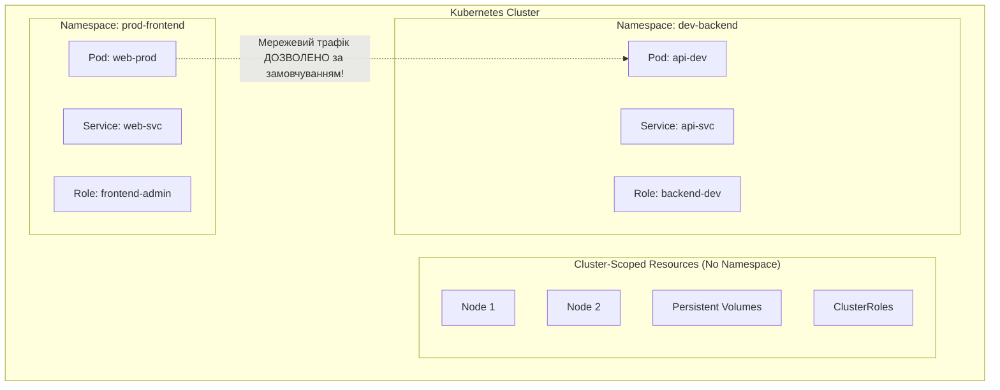
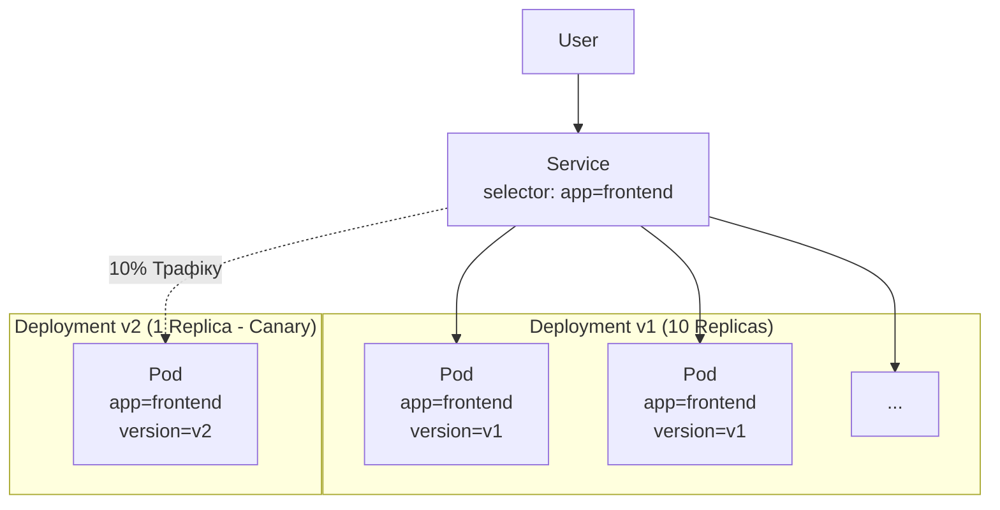

# Модуль 1.7: Простори імен та мітки

**Складність:** [СЕРЕДНЯ]  
**Час на проходження:** 35-40 хвилин  
**Попередні умови:** [Модуль 1.4: Deployments](/uk/prerequisites/kubernetes-basics/module-1.4-deployments/), [Модуль 1.5: Services](/uk/prerequisites/kubernetes-basics/module-1.5-services/)

## Що ви зможете зробити

Після завершення цього модуля ви зможете:
- **Розділити** монолітний кластер Kubernetes на ізольовані логічні середовища за допомогою Namespaces та перемикання контекстів.
- **Спроектувати** таксономії міток, які дозволяють цільовий вибір ресурсів для Services, Deployments та операційних інструментів.
- **Розрізняти** селектори на основі рівності (equality-based) та на основі набору (set-based) для запитів та маніпуляцій з певними підмножинами ресурсів.
- **Захистити** стабільність кластера, впроваджуючи ResourceQuotas та LimitRanges на рівні просторів імен для запобігання дефіциту ресурсів.
- **Порівняти** випадки використання Labels та Annotations для додавання метаданих до об'єктів Kubernetes.

## Чому це важливо

П'ятниця, 2:00 ночі, команду Platform Engineering викликають через катастрофічний збій кластера. Основна база даних, що обслуговує продакшн-сайт електронної комерції, була видалена (evicted), а критичні внутрішні API виходять з ладу. Причина? Молодший розробник розгорнув інструмент для навантажувального тестування у просторі імен `default` без обмежень ресурсів, який спожив 95% CPU та пам'яті кластера. Оскільки не було логічної ізоляції або квот ресурсів між інструментами тестування та робочими навантаженнями продакшну в одному кластері, проста помилка зупинила весь бізнес.

У міру масштабування Kubernetes фізичний кластер стає спільним ресурсом. Запуск окремих фізичних кластерів для кожної команди, середовища (dev, staging, prod) та проєкту є фінансово збитковим та складним в управлінні. Замість цього вам потрібен спосіб розділити один великий кластер на десятки "віртуальних кластерів", де команди можуть працювати автономно, не заважаючи одна одній і не захоплюючи всі ресурси. Вам також потрібен стандартизований спосіб організації, пошуку та пов'язування тисяч розрізнених об'єктів усередині цих частин.

Namespaces — це стіни, які ділять ваш кластер на керовані кімнати. Labels — це наліпки, які ви кріпите на все всередині цих кімнат, щоб знаходити та з'єднувати їх. Опанування цих двох концепцій — це різниця між хаотичним, крихким кластером, де одна команда випадково видаляє продакшн, і чітко структурованою платформою, де радіус ураження (blast radius) суворо обмежений.

## Розділ 1: Namespaces – віртуальні кластери

За своєю суттю Namespace (простір імен) — це логічна перегородка всередині кластера Kubernetes. Після першого встановлення Kubernetes ви потрапляєте у "плаский" ландшафт, де кожен Pod, Service та ConfigMap живуть поруч. Зі зростанням кількості ресурсів конфлікти назв стають неминучими (ви можете мати лише один Service з назвою `redis` у певному просторі імен), а керування доступами перетворюється на кошмар.

Namespaces вирішують це, обмежуючи область дії назв. Ви можете мати Service `redis` у просторі імен `frontend` і зовсім інший Service `redis` у просторі імен `backend`.

### Що Namespaces ізолюють (а що ні)

Важливо точно розуміти, що саме забезпечує Namespace, оскільки багато інженерів помилково вважають, що він надає сувору ізоляцію безпеки. Це не так.



**Namespaces ІЗОЛЮЮТЬ:**
1.  **Іменування:** Назви ресурсів мають бути унікальними всередині простору імен, але не між ними.
2.  **DNS-записи:** Kubernetes призначає DNS-імена сервісам у форматі `<service-name>.<namespace>.svc.cluster.local`. Це означає, що Pod у просторі імен `prod-frontend` може звертатися до Service у просторі імен `dev-backend` за його повним доменним ім'ям (FQDN).
3.  **Role-Based Access Control (RBAC):** Ви можете надати користувачу повні права адміністратора у просторі імен `dev`, не надаючи жодного доступу до `prod` за допомогою RoleBindings.
4.  **Квоти ресурсів (Resource Quotas):** Ви можете обмежити загальну кількість CPU, пам'яті або сховища, яку можуть споживати всі ресурси разом у межах одного простору імен.

**Namespaces НЕ ІЗОЛЮЮТЬ:**
1.  **Мережевий трафік:** За замовчуванням мережа Kubernetes є повністю відкритою. Pod у просторі імен `dev` може пінгувати, сканувати порти та підключатися до Pod у просторі імен `prod`. Namespaces не забезпечують сегментацію мережі. (Для ізоляції трафіку потрібно впроваджувати об'єкти `NetworkPolicy`).
2.  **Розміщення на вузлах:** Якщо не налаштовано інше за допомогою NodeSelectors або Taints, Pods з різних просторів імен будуть запускатися на тих самих робочих вузлах (nodes), використовуючи одне ядро хоста та контейнерний рантайм.
3.  **Ресурси рівня кластера:** Певні фундаментальні ресурси не прив'язані до жодного простору імен. Приклади: Nodes, PersistentVolumes (саме сховище, а не запит на нього), StorageClasses та ClusterRoles.

### Стандартні простори імен

Коли ви створюєте новий кластер, Kubernetes автоматично заповнює його чотирма стандартними просторами імен:

*   `default`: Простір імен "для всього". Якщо ви запускаєте `kubectl apply` без вказання простору імен, ресурси потрапляють сюди. У зрілому продакшн-кластері `default` в ідеалі має бути порожнім, оскільки всі навантаження мають розгортатися у спеціально створених просторах імен.
*   `kube-system`: "Машинне відділення". Тут працюють компоненти керування (control plane) Kubernetes. Якщо ви перевірите цей простір імен, ви побачите критичні Pods, такі як CoreDNS (для виявлення сервісів), kube-proxy (для маршрутизації мережі) та ваш CNI-плагін (наприклад, Calico або Cilium). Вам рідко варто змінювати ресурси тут, якщо ви не займаєтесь експлуатацією самої інфраструктури кластера.
*   `kube-public`: Автоматично створений простір імен, призначений для ресурсів, які мають бути доступними для читання всім користувачам (включаючи неавторизованих). Історично він використовувався для ініціалізації кластерів, але в сучасних налаштуваннях використовується рідко.
*   `kube-node-lease`: Містить об'єкти Lease, пов'язані з кожним вузлом. Ці "оренди" діють як сигнали працездатності (heartbeats). Замість того, щоб керуюча панель постійно опитувала величезні об'єкти статусу Node, кожен вузол просто оновлює крихітний об'єкт Lease у цьому просторі імен кожні кілька секунд. Якщо термін оренди закінчується, вузол вважається непрацездатним.

### Взаємодія з просторами імен

Керування просторами імен через командний рядок є простим, але постійне додавання `-n <namespace>` до кожної команди `kubectl` є виснажливим і призводить до помилок.

Створити простір імен імперативно:
```bash
kubectl create namespace team-frontend
```

Переглянути всі простори імен:
```bash
kubectl get namespaces
```

Виконати команду для конкретного простору імен:
```bash
kubectl get pods -n team-frontend
```

**Перемикання контексту:**
Замість того, щоб вказувати простір імен у кожній команді, ви можете змінити контекст за замовчуванням у вашому файлі `kubeconfig`.

```bash
# Переглянути поточну конфігурацію контексту, щоб побачити активний namespace
kubectl config view --minify | grep namespace:

# Встановити простір імен за замовчуванням для поточного контексту на 'team-frontend'
kubectl config set-context --current --namespace=team-frontend

# Тепер ця команда автоматично шукає у 'team-frontend'
kubectl get pods
```

*(Повчальна історія: Старший інженер мав видалити несправний Deployment у просторі імен `staging`. Він забув прапорець `-n staging`. Його контекст був налаштований на `production`. Він видалив основний ingress-контролер для всієї компанії. Завжди перевіряйте свій контекст перед виконанням руйнівних команд і використовуйте такі інструменти, як `kubectx` та `kubens`, щоб зробити перемикання контексту видимим та безпечним.)*

---

### Активне навчання 1

**Сценарій:** Ви намагаєтеся розгорнути новий агент моніторингу, якому потрібно виявляти всі вузли (Nodes) у кластері. Ви визначаєте `DaemonSet` у просторі імен `monitoring`. Однак, коли ви намагаєтеся отримати список вузлів, використовуючи `Role`, прив'язану до цього простору імен, ви отримуєте помилку доступу.

**Запитання:** Виходячи з того, як простори імен розділяють ресурси, чому ваш агент не може отримати список вузлів і як концептуально це виправити?

<details>
<summary>Натисніть для відповіді</summary>
Вузли (Nodes) — це ресурси рівня кластера (cluster-scoped), тобто вони не належать до жодного простору імен. <code>Role</code> та <code>RoleBinding</code> надають дозволи лише всередині конкретного простору імен. Щоб надати дозволи на перегляд вузлів, потрібно використовувати <code>ClusterRole</code> та <code>ClusterRoleBinding</code>, які діють поза межами просторів імен і застосовуються до всього кластера.
</details>

---

## Розділ 2: Мітки та селектори – клей для Kubernetes

Якщо простори імен — це стіни, то Labels (мітки) — це система організації. Мітки — це просто пари "ключ-значення", які додаються до метаданих об'єктів Kubernetes. Тоді як назви та UID ідентифікують об'єкти унікально, мітки ідентифікують їх логічно.

Kubernetes — це система з низькою пов'язаністю (decoupled). Deployments не "володіють" Pods через жорстко прописаний список ID у базі даних. Services не маршрутизують трафік до Pods на основі статичних IP-адрес. Натомість вони знаходять один одного динамічно за допомогою **Label Selectors** (селекторів міток). Така конструкція робить кластер надзвичайно динамічним: Pods можуть зникати та створюватися з новими IP та назвами, і поки вони мають правильні мітки, система миттєво відновлює зв'язки.

### Правила іменування міток

Ключ мітки складається з необов'язкового префікса та назви, розділених похилою рискою (`/`).
*   **Префікс:** Має бути валідним DNS-субдоменом (наприклад, `company.com/`). Префікси `kubernetes.io/` та `k8s.io/` зарезервовані для основних компонентів Kubernetes. Використання префікса є найкращою практикою для власних міток, щоб уникнути конфліктів з іншими інструментами.
*   **Назва:** Не більше 63 символів, починається і закінчується буквено-цифровим символом.
*   **Значення:** Не більше 63 символів (може бути порожнім).

**Стратегія маркування у реальному світі:**
Не додавайте мітки хаотично. Прийміть стандартизовану таксономію у вашій організації. Документація Kubernetes рекомендує набір стандартних міток, але ви можете визначити власні. Продумана стратегія міток дозволяє детально розподіляти витрати, проводити аудит безпеки та оперативно виявляти несправності.

```yaml
apiVersion: v1
kind: Pod
metadata:
  name: payment-processor-v2
  namespace: team-backend
  labels:
    app.kubernetes.io/name: payment-processor
    app.kubernetes.io/version: "2.1.4"
    app.kubernetes.io/part-of: e-commerce-suite
    tier: backend
    environment: production
    cost-center: "finance-ops"
spec:
  containers:
  - name: app
    image: payment-app:2.1.4
```

З такими мітками ви можете робити запити до кластера точно так само, як до бази даних.

```bash
# Знайти всі backend поди
kubectl get pods -l tier=backend

# Знайти всі продакшн процесори платежів
kubectl get pods -l app.kubernetes.io/name=payment-processor,environment=production
```

### Селектори на основі рівності vs на основі набору

При запитах або зв'язуванні ресурсів Kubernetes підтримує два типи селекторів. Критично важливо знати, які ресурси підтримують конкретний тип.

**1. Селектори на основі рівності (Equality-Based Selectors)**
Вони дозволяють фільтрувати за точною відповідністю. Оператори: `=`, `==` та `!=`. Кілька вимог розділяються комами і діють як логічне "І" (AND).

```bash
# Вибрати поди, де середовище точно 'production'
kubectl get pods -l environment=production

# Вибрати поди, де рівень НЕ 'frontend'
kubectl get pods -l tier!=frontend
```

У YAML сервіси наразі підтримують *лише* селектори на основі рівності:
```yaml
apiVersion: v1
kind: Service
metadata:
  name: payment-svc
spec:
  selector:
    app.kubernetes.io/name: payment-processor
    environment: production
```

> **Зупиніться та подумайте**: Вам потрібно знайти всі поди у середовищі `production` або `staging`, які НЕ належать до рівня `cache`. Напишіть вираз селектора `kubectl` для цього, перш ніж читати наступний розділ.

**2. Селектори на основі набору (Set-Based Selectors)**
Вони дозволяють фільтрувати за набором значень, що робить запити значно гнучкішими. Оператори: `in`, `notin` та `exists` (перевірка наявності ключа незалежно від значення).

```bash
# Вибрати поди, де середовище або 'production', АБО 'staging'
kubectl get pods -l 'environment in (production, staging)'

# Вибрати поди, які мають мітку 'release', незалежно від її значення
kubectl get pods -l release
```

У YAML новіші контролери, такі як Deployments та Jobs, використовують селектори на основі набору через `matchExpressions`, водночас підтримуючи рівність через `matchLabels`:
```yaml
apiVersion: apps/v1
kind: Deployment
metadata:
  name: payment-deploy
spec:
  selector:
    matchLabels:
      app.kubernetes.io/name: payment-processor
    matchExpressions:
      - {key: environment, operator: In, values: [production, staging]}
      - {key: release, operator: Exists}
```

### Сила роз'єднаності: Canary Deployments

Оскільки Services маршрутизують трафік суто на основі міток, ви можете маніпулювати потоком трафіку, не торкаючись самого Service. Це основа сучасних стратегій розгортання, таких як blue/green та canary (канаркові) релізи.

Уявіть, що у вас є Service, який вибирає `app=frontend`. Ви маєте Deployment з 10 Pods з міткою `app=frontend, version=v1`. Весь трафік йде на `v1`.

Ви хочете протестувати `v2` на невеликій частині реального трафіку. Ви просто розгортаєте один Pod (або невеликий Deployment) з міткою `app=frontend, version=v2`.

Оскільки обидві версії мають спільну мітку `app=frontend`, Service автоматично почне спрямовувати ~10% трафіку (1 з 11 Pods) на новий Pod `v2`. Якщо виникне помилка, ви видаляєте Pod `v2`. Якщо все добре — масштабуєте `v2` і зменшуєте `v1`. Service навіть "не знав", що сталося; він просто направляв трафік туди, де мітки відповідали його селектору.



---

## Розділ 3: Анотації – метадані для машин

Labels використовуються Kubernetes для вибору та групування об'єктів. **Annotations** (анотації), з іншого боку, використовуються для додавання довільних метаданих, які не служать для ідентифікації.

Якщо ви спробуєте записати JSON-рядок довжиною 500 символів у мітку (Label), Kubernetes відхилить його. Мітки мають суворі обмеження довжини і індексуються API-сервером для швидкого пошуку. Анотації не індексуються, не можуть використовуватися для вибору об'єктів і мають величезний ліміт розміру (256 КБ).

> **Зупиніться та подумайте**: Подивіться на ці 5 пунктів метаданих: 1) назва команди для фільтрації, 2) Git SHA коміту, 3) конфігурація збору метрик Prometheus (`true`), 4) центр витрат для групування рахунків, 5) директива SSL-сертифіката для Ingress-контролера. Що з цього має бути Labels, а що Annotations? Чому?

**Коли використовувати Labels:**
*   Групування (наприклад, `tier: frontend`)
*   Вибір (наприклад, зв'язування Service з Pods або Deployment з ReplicaSets)
*   Фільтрація виводу в `kubectl`

**Коли використовувати Annotations:**
*   Зберігання інформації про збірку/реліз (наприклад, Git commit SHA, що ініціював розгортання)
*   Надання конфігураційних вказівок зовнішнім контролерам (наприклад, вказівка Ingress-контролеру, який SSL-сертифікат використовувати, або хмарному провайдеру — створити внутрішній балансувальник навантаження)
*   Додавання контактної інформації команди, відповідальної за ресурс

```yaml
apiVersion: v1
kind: Pod
metadata:
  name: reporting-job
  labels:
    app: reporting
  annotations:
    builder/author: "jane.doe@company.com"
    build/commit-sha: "a1b2c3d4e5f6g7h8i9j0"
    prometheus.io/scrape: "true"
    prometheus.io/port: "8080"
```
У прикладі вище Prometheus (інструмент моніторингу в кластері) просканує API-сервер, знайде анотацію `prometheus.io/scrape` на подах і знатиме точно, як збирати метрики з цього пода, не захаращуючи індексовані мітки.

---

### Активне навчання 2

**Сценарій:** Ви розгортаєте нову внутрішню базу знань (wiki). Ви хочете, щоб ІТ-відділ міг легко знайти її через `kubectl get pods -l dept=it`. Також вам потрібно передати JSON-конфігурацію довжиною 400 символів сторонньому інструменту резервного копіювання, який стежить за новими розгортаннями в кластері.

**Завдання:** Напишіть розділ `metadata` для YAML пода, який задовольняє обидві вимоги.

<details>
<summary>Натисніть для відповіді</summary>

```yaml
metadata:
  name: internal-wiki
  labels:
    dept: it
  annotations:
    backup.company.com/config: '{"schedule": "0 2 * * *", "retention_days": 30, "storage_class": "cold-archive", "exclude_paths": ["/tmp", "/var/cache"]}'
```
*Пояснення:* Вимога `dept=it` використовується для вибору/фільтрації, тому це має бути Label. JSON-рядок довжиною 400 символів — це конфігурація для зовнішнього інструменту, що не служить для ідентифікації та перевищує ліміти міток, тому це має бути Annotation.
</details>

---

## Розділ 4: ResourceQuotas та LimitRanges

Якщо ви даєте команді простір імен, вони отримують пісочницю. Але без обмежень дитина може побудувати такий великий замок, що він вийде за межі пісочниці та засипле весь ігровий майданчик.

В Kubernetes керування ресурсами відбувається у дві фази:
1.  **Requests (Запити):** Те, що Pod заявляє як необхідне для запуску. `kube-scheduler` використовує запити, щоб знайти вузол з достатньою вільною ємністю.
2.  **Limits (Ліміти):** Жорстка стеля того, що Pod може фактично спожити під час роботи. Якщо Pod використовує більше пам'яті, ніж його ліміт, `kubelet` завершує його роботу (OOMKilled). Якщо він намагається використати більше CPU, його потужність обмежується (throttled).

За замовчуванням Pod у будь-якому просторі імен може споживати стільки CPU та пам'яті, скільки має фізичний вузол. Щоб запобігти проблемі "галасливого сусіда" (noisy neighbor), коли один застосунок забирає всі ресурси в інших, ви повинні впроваджувати обмеження на рівні простору імен.

### ResourceQuotas: бюджет простору імен

`ResourceQuota` обмежує **загальне сукупне споживання** ресурсів у всьому просторі імен. Це працює як суворий бюджет.

```yaml
apiVersion: v1
kind: ResourceQuota
metadata:
  name: frontend-quota
  namespace: team-frontend
spec:
  hard:
    requests.cpu: "4"         # Сумарні запити CPU не можуть перевищувати 4 ядра
    requests.memory: "8Gi"    # Сумарні запити пам'яті не можуть перевищувати 8 ГБ
    limits.cpu: "8"           # Сумарні ліміти CPU не можуть перевищувати 8 ядер
    limits.memory: "16Gi"     # Сумарні ліміти пам'яті не можуть перевищувати 16 ГБ
    pods: "20"                # Не можна створити більше 20 подів загалом
    services.loadbalancers: "2" # Не можна запросити більше 2 хмарних LoadBalancers
```

Якщо простір імен `team-frontend` наразі використовує 3.5 ядра CPU, і розробник спробує розгорнути новий Pod із запитом на 1 ядро, API-сервер відхилить створення пода з помилкою `403 Forbidden`, вказавши на перевищення квоти.

### LimitRanges: стандартні обмеження

У ResourceQuotas є суттєвий нюанс: як тільки ви застосовуєте квоту на CPU або пам'ять до простору імен, **кожен Pod, створений у цьому просторі імен, ПОВИНЕН вказувати запити та ліміти (requests/limits)**. Якщо Pod їх не вкаже, він буде миттєво відхилений контролером допуску (admission controller).

Розробники часто забувають додавати ці блоки у свій YAML. Щоб уникнути цього, використовуйте `LimitRange`. Він автоматично додає стандартні значення CPU/пам'яті до будь-якого пода, де вони не вказані. Також він встановлює мінімальні та максимальні межі для окремого пода, щоб хтось не розгорнув один Pod, який займе всю квоту простору імен.

```yaml
apiVersion: v1
kind: LimitRange
metadata:
  name: frontend-limits
  namespace: team-frontend
spec:
  limits:
  - default:
      cpu: "500m"        # Якщо ліміт не вказано, додати це
      memory: "512Mi"
    defaultRequest:
      cpu: "100m"        # Якщо запит не вказано, додати це
      memory: "256Mi"
    max:
      cpu: "2"           # Жоден контейнер не може просити/мати ліміт більше 2 CPU
      memory: "4Gi"
    min:
      cpu: "10m"         # Жоден контейнер не може просити/мати ліміт менше 10m CPU
      memory: "64Mi"
    type: Container
```

**Взаємодія:** `LimitRange` гарантує, що кожен Pod має визначений розмір (явний або автоматичний). `ResourceQuota` гарантує, що сума цих розмірів не перевищує загальний бюджет простору імен. Ніколи не впроваджуйте ResourceQuota без LimitRange.

> **Зупиніться та подумайте**: Простір імен має ResourceQuota на 4 ядра CPU та стандартний LimitRange на 500m CPU. Розробник розгортає 7 Pods, не вказуючи ресурси. Що станеться при спробі розгорнути 8-й? Прорахуйте математику.

---

## Чи знали ви?

*   **Мітки — це завжди рядки:** Навіть якщо ви напишете `version: 1.0` у своєму YAML, Kubernetes сприйме це як рядок. Однак числа без лапок можуть спричинити помилки парсингу в деяких інструментах (наприклад, `1.0` може бути інтерпретовано як float), тому найкращою практикою є завжди брати значення міток у лапки: `version: "1.0"`.
*   **Namespace не можна видалити миттєво:** Коли ви запускаєте `kubectl delete namespace <name>`, він переходить у стан `Terminating`. Він залишатиметься в цьому стані, поки всі об'єкти всередині не будуть видалені збирачем сміття (garbage collection). Якщо якийсь ресурс має зламаний finalizer, видалення простору імен заблокується назавжди, поки finalizer не буде виправлено вручну.
*   **Ліміт у 63 символи є історичним:** Обмеження для ключів та значень міток походить від стандарту DNS RFC 1123, який обмежує DNS-мітки до 63 символів. Kubernetes прийняв це, щоб мітки могли безпечно відображатися в DNS-структурах та внутрішніх конвенціях іменування.
*   **Анотації можуть містити 256 КБ:** Хоча значення міток суворо обмежені, одне значення анотації може містити до 256 кілобайт даних. Це дозволяє зберігати цілі конфігураційні файли, невеликі скрипти або масивні JSON-документи з політиками.

---

## Типові помилки

| Помилка | Чому це стається | Як виправити |
| :--- | :--- | :--- |
| **Очікування, що Namespaces ізолюють мережевий трафік** | Namespaces дають логічну ізоляцію, але базова мережа за замовчуванням є відкритою. | Використовуйте об'єкти `NetworkPolicy`, щоб явно заборонити трафік між просторами імен. |
| **Використання селекторів рівності в Deployments** | Блок `matchLabels` виглядає як рівність, але Deployments потребують гнучкішого рушія на основі набору для керування ReplicaSets. | Використовуйте `matchLabels` (який конвертується в `In`) або явно `matchExpressions` у Deployments версії `apps/v1`. |
| **Зберігання великих JSON-конфігів у мітках** | Нерозуміння різниці між мітками та анотаціями. Мітки індексуються, що спричиняє роздуття API-сервера. | Перенесіть будь-які конфігурації або нотатки в `annotations`. |
| **Створення ResourceQuotas без LimitRanges** | Адмін обмежує простір імен, через що всі CI/CD пайплайни зупиняються, бо в подиках не вказані ресурси. | Завжди впроваджуйте `LimitRange` зі стандартними значеннями разом із `ResourceQuota`. |
| **Створення об'єктів у просторі імен `default`** | Лінь або неуважність до контексту. Призводить до захаращеного кластера, де важко керувати ресурсами. | Завжди вказуйте `namespace: <name>` у метаданих YAML або використовуйте `kubens` для встановлення контексту. |
| **Зміна незмінних селекторів міток** | Спроба змінити `matchLabels` у існуючому Deployment. API-сервер відхилить це, щоб Deployment не "загубив" свої ReplicaSets. | Видаліть Deployment і створіть його заново, якщо потрібно змінити таксономію селекторів. |

---

## Контрольні запитання

<details>
<summary><strong>Запитання 1:</strong> У вас є простір імен <code>analytics</code>. Ви розгортаєте Service з назвою <code>data-sink</code> у цьому просторі. Яке повне DNS-ім'я (FQDN) має використовувати Pod у просторі імен <code>default</code> для підключення до нього?</summary>
<p><strong>Відповідь:</strong> <code>data-sink.analytics.svc.cluster.local</code>. За замовчуванням DNS Kubernetes шукає сервіси у тому ж просторі імен, де знаходиться Pod, що робить запит. Оскільки запит йде з <code>default</code>, а ціль — у <code>analytics</code>, коротке ім'я <code>data-sink</code> не спрацює. Потрібно вказати FQDN, що включає назву простору імен, субдомен <code>svc</code> та базовий домен кластера.</p>
</details>

<details>
<summary><strong>Запитання 2:</strong> Виникла серйозна проблема з затримкою (latency). Вам потрібно негайно перезапустити всі Pods, що належать до рівнів <code>frontend</code> або <code>cache</code>, але не чіпати <code>database</code> та <code>backend</code>. Яку команду <code>kubectl</code> з селектором ви використаєте?</summary>
<p><strong>Відповідь:</strong> Слід використати селектор на основі набору: <code>kubectl delete pods -l 'tier in (frontend, cache)'</code>. Селектори рівності (як-от <code>tier=frontend</code>) підтримують лише точні збіги та логічне "І", тому не можуть виразити умову "АБО". Селектори на основі набору з оператором <code>in</code> дозволяють перевірити кілька значень для одного ключа за один запит.</p>
</details>

<details>
<summary><strong>Запитання 3:</strong> Розробник скаржиться, що його Pod застряг у стані <code>Pending</code>, а лог подій каже <code>forbidden: exceeded quota: pod-quota, requested: pods=1, used: 10, limited: 10</code>. Яка основна причина?</summary>
<p><strong>Відповідь:</strong> У просторі імен діє <code>ResourceQuota</code> з назвою <code>pod-quota</code>, яка встановлює жорстке обмеження — рівно 10 Pods на весь простір імен. Розробник намагається розгорнути 11-й Pod, але контролер допуску перехоплює запит і відхиляє його через порушення квоти. API-сервер не дозволяє створити об'єкт, поки не буде видалено існуючий Pod або не збільшено квоту.</p>
</details>

<details>
<summary><strong>Запитання 4:</strong> Вам потрібно зберегти email команди, відповідальної за Deployment, щоб скрипт сповіщень міг написати їм у разі збою. Використати мітку (Label) чи анотацію (Annotation)?</summary>
<p><strong>Відповідь:</strong> Слід використати анотацію. Мітки призначені суто для ідентифікації та групування об'єктів усередині Kubernetes (наприклад, для зв'язку Service з Pods). Email — це додаткова інформація для зовнішніх інструментів або людей, і ви ніколи не будете просити Kubernetes "вибрати всі поди за цим email". Анотації не захаращують індекс API-сервера і дають більше місця (до 256 КБ).</p>
</details>

<details>
<summary><strong>Запитання 5:</strong> Ви застосовуєте новий <code>LimitRange</code> зі стандартним лімітом CPU <code>200m</code> до простору імен, де вже працюють 10 Pods без жодних лімітів. Розробник панікує, що його важкі обчислювальні задачі будуть негайно обмежені і впадуть. Чи він правий?</summary>
<p><strong>Відповідь:</strong> Ні, розробник помиляється. Kubernetes перевіряє політики <code>LimitRange</code> (та <code>ResourceQuota</code>) через Admission Controllers лише в момент створення або оновлення об'єкта. Існуючі працюючі Pods повністю ігноруються новими правилами — вони не будуть змінені або обмежені ретроактивно. Новий ліміт <code>200m</code> застосується лише до нових Pods або після перезапуску старих.</p>
</details>

<details>
<summary><strong>Запитання 6:</strong> Молодшому розробнику потрібно мати можливість видаляти та перезапускати Pods для відладки. Проте політика безпеки забороняє йому це робити будь-де, крім простору імен <code>sandbox</code>. Чи можуть простори імен забезпечити таку ізоляцію?</summary>
<p><strong>Відповідь:</strong> Так, це одна з головних функцій просторів імен. Вони інтегруються з системою Role-Based Access Control (RBAC). Створивши <code>Role</code> з дозволом на видалення Pods та <code>RoleBinding</code>, що призначає цю роль розробнику саме у просторі імен <code>sandbox</code>, ви обмежуєте його права лише цією областю. Він не зможе навіть переглянути Pods у <code>default</code>, <code>production</code> чи будь-якому іншому просторі імен.</p>
</details>

---

## Практична вправа: Багатокористувацька пісочниця

У цій вправі ви створите ізольований простір імен, встановите обмеження ресурсів та використаєте мітки для симуляції канаркового розгортання.

### Завдання 1: Створення зони ізоляції

Створіть новий простір імен для симуляції команди розробників і перемкніть свій контекст на нього.

<details>
<summary><strong>Рішення</strong></summary>

```bash
# Створити простір імен
kubectl create namespace alpha-team

# Перемкнути контекст на новий простір імен
kubectl config set-context --current --namespace=alpha-team

# Перевірити, чи ви у новому просторі імен
kubectl config view --minify | grep namespace:
```
</details>

### Завдання 2: Встановлення обмежень

Застосуйте `LimitRange` до простору імен `alpha-team`, щоб гарантувати, що жоден Pod не буде розгорнутий без обмежень, і жоден Pod не споживатиме більше 500m CPU.

1. Створіть файл `guardrails.yaml`.
2. Визначте `LimitRange`: стандартний запит CPU — `100m`, стандартний ліміт — `200m`, максимум — `500m`.
3. Застосуйте його.

<details>
<summary><strong>Рішення</strong></summary>

```yaml
# guardrails.yaml
apiVersion: v1
kind: LimitRange
metadata:
  name: cpu-guardrails
  namespace: alpha-team
spec:
  limits:
  - default:
      cpu: "200m"
    defaultRequest:
      cpu: "100m"
    max:
      cpu: "500m"
    type: Container
```

```bash
kubectl apply -f guardrails.yaml

# Перевірити LimitRange
kubectl describe limitrange cpu-guardrails
```
</details>

### Завдання 3: Розгортання стабільної версії

Розгорніть простий застосунок NGINX (стабільна версія). Він має складатися з 3 реплік.
Додайте мітки `app: web` та `version: v1`.

<details>
<summary><strong>Рішення</strong></summary>

```yaml
# web-v1.yaml
apiVersion: apps/v1
kind: Deployment
metadata:
  name: web-v1
spec:
  replicas: 3
  selector:
    matchLabels:
      app: web
      version: v1
  template:
    metadata:
      labels:
        app: web
        version: v1
    spec:
      containers:
      - name: nginx
        image: nginx:1.24-alpine
```

```bash
kubectl apply -f web-v1.yaml
kubectl get pods --show-labels
```
*(Зауважте: хоча ви не вказували ліміти CPU в шаблоні Pod, якщо ви виконаєте `kubectl describe` для подів, вони матимуть ліміт 200m, автоматично доданий завдяки LimitRange з Завдання 2).*
</details>

### Завдання 4: Публікація застосунку

Створіть Service з назвою `web-svc`, який маршрутизує трафік до вашого застосунку. Він має вибирати поди **лише** за міткою `app: web` (ігноруючи версію).

<details>
<summary><strong>Рішення</strong></summary>

```yaml
# web-svc.yaml
apiVersion: v1
kind: Service
metadata:
  name: web-svc
spec:
  selector:
    app: web
  ports:
  - port: 80
    targetPort: 80
```

```bash
kubectl apply -f web-svc.yaml

# Перевірити, чи сервіс знаходить 3 поди версії v1
kubectl get endpoints web-svc
```
</details>

### Завдання 5: Канаркове розгортання

Розгорніть один Pod, що представляє нову версію `v2`. Додайте мітки `app: web` та `version: v2`.

Спостерігайте, як Service обробляє цей новий Pod.

<details>
<summary><strong>Рішення</strong></summary>

```yaml
# web-v2-canary.yaml
apiVersion: v1
kind: Pod
metadata:
  name: web-v2-canary
  labels:
    app: web
    version: v2
spec:
  containers:
  - name: nginx
    image: nginx:1.25-alpine
```

```bash
kubectl apply -f web-v2-canary.yaml

# Знову перевірити endpoints
kubectl get endpoints web-svc
```
*Спостереження:* Список ендпоінтів сервісу тепер містить 4 IP-адреси. Оскільки селектор сервісу шукає лише `app: web`, а обидві версії (`v1` та `v2`) мають цю мітку, сервіс автоматично балансує трафік між обома версіями. Ви успішно виконали базовий canary release!
</details>

### Завдання 6: Очищення

Видаліть простір імен, щоб миттєво знищити всі ресурси, створені у цій вправі, та поверніться до простору імен за замовчуванням.

<details>
<summary><strong>Рішення</strong></summary>

```bash
# Видалити простір імен (це займе трохи часу для очищення всього всередині)
kubectl delete namespace alpha-team

# Повернути контекст на default
kubectl config set-context --current --namespace=default
```
</details>

---

## Наступний модуль

Ви опанували мистецтво організації та ізоляції ресурсів. Ви розумієте, як контролери динамічно знаходять Pods і як простори імен запобігають конфліктам команд. Однак створення ресурсів через імперативні команди `kubectl create` — це шлях до крихкої інфраструктури, яку важко підтримувати. Настав час заговорити рідною мовою API Kubernetes.

**[Перейти до Модуля 1.8: YAML для Kubernetes](/uk/prerequisites/kubernetes-basics/module-1.8-yaml-kubernetes/)** — опануйте мову, якою спілкується Kubernetes, щоб навчитися декларувати бажаний стан у коді, роблячи вашу інфраструктуру повторюваною та надійною.