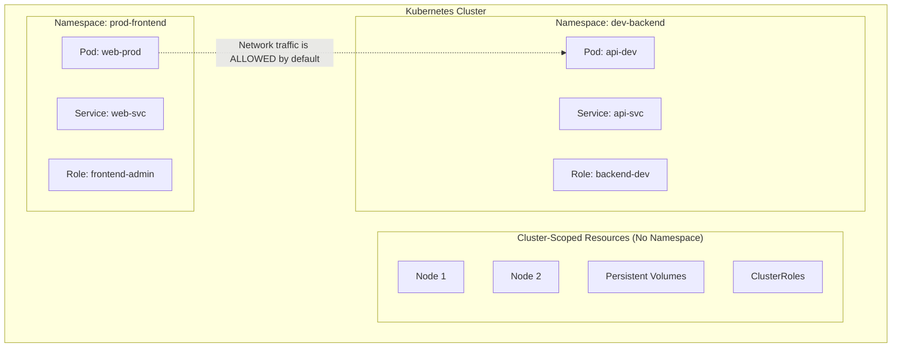
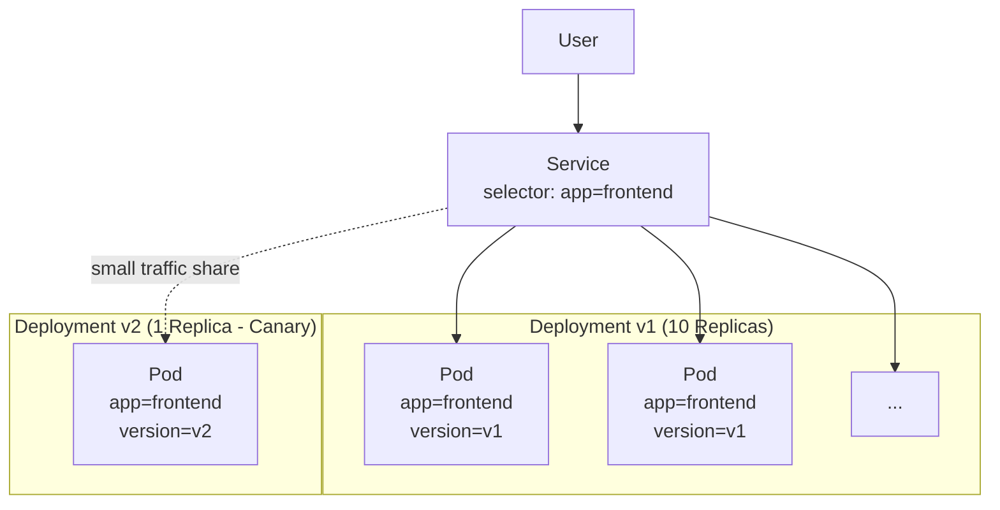

> **Складність**: [СЕРЕДНЯ]
>
> **Час на виконання**: 50-60 хвилин
>
> **Передумови**: [Модуль 1.4: Deployments](/uk/prerequisites/kubernetes-basics/module-1.4-deployments/), [Модуль 1.5: Services](/uk/prerequisites/kubernetes-basics/module-1.5-services/)

---

## Що ви зможете зробити

Після завершення цього модуля ви зможете:

- **Сегментувати** спільний кластер Kubernetes на середовища рівня простору імен, зберігаючи при цьому обізнаність про ресурси рівня кластера.
- **Спроєктувати** таксономію міток, яку Services, Deployments та операційні інструменти зможуть надійно вибирати під час нормальної роботи та інцидентів.
- **Порівняти** селектори на основі рівності та на основі множин, а потім **вибрати** вирази запитів для розгортань, розслідувань та цільового очищення.
- **Впровадити** ResourceQuotas та LimitRanges, які захищають стабільність простору імен, не створюючи несподіванок для розробників на етапі допуску.
- **Діагностувати**, коли метадані належать до міток, а коли — до анотацій для контролерів, аудиту, білінгу та людського контексту.


## Чому це важливо

Уявіть собі сповіщення о 2-й ночі: затримка під час оформлення замовлення перевищує допустимий для клієнтів бюджет помилок, а час очікування внутрішніх API закінчується. Перший підозрюваний — платіжний сервіс, але справжня причина не така очевидна: завдання з навантажувального тестування було запущено в тому самому спільному кластері Kubernetes, що й робоче середовище, без виділеного бюджету в просторі імен, без типових обмежень ресурсів і без схеми міток, яка б чітко вказувала на власника. Завдання мало працювати з тестовою кінцевою точкою, але воно потрапило в `default`, спожило більшість доступного процесорного часу на кількох вузлах і змусило команду змарнувати дорогоцінні хвилини на пошук відповіді на базове запитання: чиє це робоче навантаження?

Справжня причина збою криється не в одній необережній команді. Вона полягає в тому, що кластер розрісся до таких масштабів, коли пам'ять, дисципліна та угоди щодо найменування вже не здатні його захистити. Єдиний фізичний кластер Kubernetes є привабливим, оскільки він централізує потужності, мережу, спостережуваність та експлуатаційні навички. Однак ця ж сама централізація створює спільну долю для всіх, якщо кластер не розділити на зрозумілі операційні зони. Без просторів імен команди стикаються у конфліктах через імена та дозволи; без міток контролери та люди не можуть надійно знаходити об'єкти, на які вони хочуть вплинути; без квот і типових налаштувань один орендар може ненавмисно залишити іншого без ресурсів.

Цей модуль навчає двох організаційних примітивів, які роблять Kubernetes придатним для використання не лише в іграшкових демоверсіях. Простори імен розділяють API на логічні кімнати, тоді як мітки додають структуровану ідентичність об'єктам усередині цих кімнат. Ви дізнаєтеся, що саме ці межі насправді ізолюють, чого вони абсолютно не ізолюють, як селектори дозволяють непов'язаним контролерам співпрацювати, і як політика на рівні простору імен перетворює спільний кластер на платформу, здатну пережити звичайні людські помилки. Цей спільний словник також пришвидшує розслідування інцидентів, оскільки належність, радіус ураження та масштаб очищення стають видимими у звичайних командах.

У всіх командах цього модуля використовується повна назва бінарного файлу `kubectl`, щоб кожен скопійований приклад працював в інтерактивних оболонках та скриптах без прив'язки до локальних псевдонімів. Приклади Kubernetes орієнтовані на поведінку версії 1.35 або новішої, а концепції залишаються стабільними в сучасних кластерах, навіть якщо окремі хмарні дистрибутиви додають власні політики допуску або типові мітки.

```bash
kubectl version --client
```

## Розділ 1: Простори імен – логічні кімнати, а не окремі будівлі

Простір імен у Kubernetes – це логічний розділ на сервері API, а не мініатюрний кластер із власним планувальником, мережею чи вузлами. Ця відмінність має значення, оскільки слово "простір імен" звучить потужніше, ніж є насправді. Простори імен надають іменам область видимості, створюють природну межу для політик RBAC, дають місце для застосування квот і забезпечують операторам спосіб визначення належності. Самі по собі вони не шифрують трафік, не блокують мережеві шляхи, не резервують вузли та не приховують ресурси рівня кластера.

Уявіть собі спільний кластер як великий інженерний поверх в офісній будівлі. Простір імен – це кімната з табличкою на цьому поверсі: кімната може мати власну команду, бюджет, політику доступу та систему назв, але люди все одно користуються спільними ліфтами, електроенергією, пожежною сигналізацією та мережею будівлі. Kubernetes дотримується тієї ж моделі. Об'єкт `Service` з іменем `redis` може існувати як у просторі імен `frontend`, так і в `backend`, оскільки імена мають бути унікальними лише в межах однієї кімнати. Проте обидва робочі навантаження можуть виконуватися на тому самому фізичному вузлі, якщо політика планування не визначає іншого.


```mermaid
graph TD
    subgraph "Kubernetes Cluster"
        subgraph "Cluster-Scoped Resources (No Namespace)"
            N1["Node 1"]
            N2["Node 2"]
            PV["Persistent Volumes"]
            CR["ClusterRoles"]
        end

        subgraph "Namespace: prod-frontend"
            P1["Pod: web-prod"]
            S1["Service: web-svc"]
            R1["Role: frontend-admin"]
        end

        subgraph "Namespace: dev-backend"
            P2["Pod: api-dev"]
            S2["Service: api-svc"]
            R2["Role: backend-dev"]
        end

        P1 -. "Network traffic is ALLOWED by default" .-> P2
    end
```

На діаграмі показано межу, яка часто дивує нових операторів. Об'єкти `Pods`, `Services`, `ConfigMaps`, `Secrets`, `Roles` та більшість об'єктів рівня застосунків належать до одного простору імен. Об'єкти `Nodes`, `PersistentVolumes`, `StorageClasses`, `CustomResourceDefinitions`, `ClusterRoles` та багато політик допуску діють на рівні всього кластера, тому об'єкт `Role`, обмежений простором імен, не може надати доступ до них. Саме через цей поділ агент моніторингу може працювати як `DaemonSet` у просторі імен `monitoring`, але йому все одно знадобиться `ClusterRole`, якщо він має зчитувати кожен `Node` у кластері.

```text
+------------------------------------------------------------+
| Kubernetes cluster                                         |
|                                                            |
|  Cluster-scoped: Nodes, PersistentVolumes, ClusterRoles    |
|                                                            |
|  +----------------------+   +---------------------------+  |
|  | Namespace: dev       |   | Namespace: prod           |  |
|  | Pod: api             |   | Pod: api                  |  |
|  | Service: redis       |   | Service: redis            |  |
|  | Role: team-admin     |   | Role: release-operator    |  |
|  +----------------------+   +---------------------------+  |
|                                                            |
|  Shared by default: node pool, network fabric, API server  |
+------------------------------------------------------------+
```

Найсильніші гарантії просторів імен – це гарантії області видимості API. Ім'я об'єкта, що належить до простору імен, має бути унікальним лише в його межах; об'єкт RoleBinding може надати користувачеві права в одному просторі імен, не надаючи тих самих прав в інших місцях; а об'єкт ResourceQuota може встановити бюджет для одного простору імен, не змінюючи іншого. Це потужні механізми контролю, оскільки більшість повсякденних операцій із застосунками здійснюються через об'єкти з простором імен, тому ця межа збігається з тим, як команди насправді розгортають програмне забезпечення.

Найслабша гарантія простору імен – це мережева ізоляція, оскільки за замовчуванням її взагалі немає. Мережева архітектура Kubernetes базується на плоскій моделі, де кожен `Pod` зазвичай може звернутися до IP-адреси будь-якого іншого `Pod`, незалежно від простору імен, якщо плагін Container Network Interface та об'єкти `NetworkPolicy` не встановлюють суворіших правил. Такий типовий підхід робить виявлення сервісів простим для початківців, але він означає, що план посилення безпеки робочого середовища не може обмежуватися лише просторами імен. Простір імен – це місце, до якого ви прив'язуєте політику, а не сама політика.

Kubernetes створює кілька просторів імен ще до того, як ви додасте власні. Простір імен `default` є місцем призначення для всього підряд, коли в маніфесті або команді не вказано простір імен. Простір імен `kube-system` містить такі сервіси кластера, як CoreDNS, мережеві компоненти та інфраструктурні контролери. Простір імен `kube-public` доступний для читання всім користувачам і зараз рідко відіграє центральну роль у роботі застосунків. Простір імен `kube-node-lease` містить легкі об'єкти Lease для сигналів життєдіяльності, які дозволяють вузлам повідомляти про свій стан без постійного перезаписування великих документів статусу `Node`.

У зрілих кластерах простір імен `default` сприймається як попереджувальний сигнал, а не як зручна домівка. Якщо робочі навантаження, експерименти та одноразові відлагоджувальні `Pods` розташовуються там, їхня належність стає неоднозначною, а перевірка деструктивних команд ускладнюється. Кращою звичкою є створення цільових просторів імен, як-от `team-frontend`, `team-backend`, `observability`, `payments-prod` або `payments-staging`, і подальше зазначення простору імен у кожному маніфесті. Явне розміщення робить бажану межу придатною для перевірки в Git і видимою у вихідних даних під час інцидентів.

Імена просторів імен мають бути дійсними мітками DNS, і вам слід уникати префікса `kube-`, оскільки Kubernetes резервує цю угоду для системних просторів імен. Також варто уникати імен, які виглядають як публічні домени верхнього рівня, наприклад, `com` або `org`, оскільки через поведінку пошуку DNS у Kubernetes короткі імена можуть викликати плутанину. Починаючи з сучасних версій Kubernetes, площина управління автоматично застосовує незмінну мітку `kubernetes.io/metadata.name` до кожного простору імен, що надає політикам і селекторам стабільний спосіб ідентифікації простору імен за його назвою.

```bash
kubectl create namespace team-frontend
kubectl get namespaces
kubectl get pods -n team-frontend
```

Постійне введення `-n team-frontend` є корисним для ясності у скриптах, але воно втомлює під час інтерактивної роботи. Ваш контекст kubeconfig може зберігати типовий простір імен, тому звичайні команди будуть спрямовані на той простір імен, у якому ви зараз працюєте. Це зручно, але водночас створює передумови для помилок, коли ваш запит у терміналі та ваша ментальна модель розбігаються. Безпечнішою практикою є відображення активного контексту в запиті оболонки і його перевірка перед виконанням деструктивних команд.

```bash
# View your current context configuration to see your active namespace
kubectl config view --minify -o jsonpath='{..namespace}'

# Set the default namespace for your current context to 'team-frontend'
kubectl config set-context --current --namespace=team-frontend

# Now this command automatically looks in 'team-frontend'
kubectl get pods
```

Гіпотетичний сценарій: досвідчений інженер має намір видалити зламаний deployment у середовищі `staging`, але його поточний контекст усе ще вказує на `production`. Команда є синтаксично досконалою і водночас операційно помилковою, тому Kubernetes робить саме те, що попросив інженер. Простори імен зменшують радіус ураження лише тоді, коли люди та засоби автоматизації проносять простір імен через увесь робочий процес. Видимий запит у терміналі, чіткі метадані маніфестів, суворі обмеження RBAC та звички перевірки без виконання (dry-run) працюють разом; жодного окремого рівня захисту не буде достатньо.

Зупиніться та подумайте: якщо `Pod` у просторі імен `test` спробує підключитися до `http://data:8080`, тоді як `Service` з іменем `data` існує лише в `prod`, у якому просторі імен DNS здійснюватиме пошук у першу чергу, і яке ім'я зробить цільовий об'єкт в іншому просторі імен явним? Зробіть прогноз перед тим, як читати наступний абзац, оскільки саме ця деталь пояснює багато помилок із серії «а в мене локально все працювало».

Служба DNS для об'єктів `Service` у Kubernetes враховує простори імен. Короткий запит, як-от `data`, спочатку вирішується у власному просторі імен об'єкта `Pod`, який робить запит, тоді як для запиту між просторами імен слід використовувати точніше ім'я, як-от `data.prod` або повне доменне ім'я `data.prod.svc.cluster.local`. Така поведінка дозволяє двом командам використовувати однакову назву `Service` без конфліктів, водночас залишаючи можливість для цілеспрямованої взаємодії між просторами імен, якщо застосунок налаштовано відповідним чином.

Планування просторів імен також впливає на те, як ви дієте під час збою. Якщо кожна команда має окремі простори імен для середовищ розробки, тестування (staging) та робочого середовища (production), керівник інциденту може швидко з'ясувати, чи ізольований збій в одному середовищі, чи поширюється на спільну інфраструктуру. Якщо всі середовища ділять спільний простір імен, перші хвилини інциденту витрачаються на розплутування імен об'єктів, визначення власників та історій змін. Межа простору імен – це не лише вибір під час розгортання; це межа пошуку під час реагування на інциденти.

Створення надто дрібних просторів імен також має свою ціну. Окремий простір імен для кожного розробника, для кожної гілки та для кожної функції може створити багато шуму, якщо ваша платформа не має засобів автоматизації для RBAC, квот, міток та очищення. Найкраща модель просторів імен – це та, яку ваша організація здатна послідовно адмініструвати. Якщо простір імен створюється вручну, а потім про нього забувають, він стає ще однією формою відхилення від конфігурації. Якщо ж його створено на основі стандартного шаблону з мітками власника, квотами, об'єктами `LimitRange` та правилами життєвого циклу, він перетворюється на відтворювану одиницю платформи.

| Поведінка простору імен | Що ви отримуєте | Чого ви не отримуєте |
| :--- | :--- | :--- |
| Область видимості імен | Об'єкти з однаковими іменами можуть існувати в різних просторах імен | Автоматичний захист від видалення неправильного простору імен |
| Межа RBAC | Об'єкти `Roles` та `RoleBindings` можуть бути обмежені одним простором імен | Дозволи на ресурси рівня кластера |
| Область пошуку DNS | Короткі імена `Service` спочатку вирішуються локально | Мережева ізоляція між просторами імен |
| Прив'язка квот | Бюджети простору імен для запитів ресурсів, лімітів та їхньої кількості | Гарантоване резервування вузлів без політики планування |


## Розділ 2: Мітки та селектори — спільний словник Control Plane
## Розділ 2: Мітки та селектори — спільний словник Control Plane

Якщо простори імен відповідають на запитання "де живе цей об'єкт?", то мітки (labels) відповідають на запитання "яку роль відіграє цей об'єкт?". Мітка — це пара "ключ-значення" у метаданих об'єкта Kubernetes, а селектор (selector) — це вираз, який зіставляє об'єкти за цими мітками. Kubernetes покладається на цей механізм непрямого посилання, оскільки об'єкти Pod є тимчасовими, IP-адреси змінюються, а належність до контролера має зберігатися навіть після заміни. Об'єкту Service не потрібно знати імена своїх бекенд-об'єктів Pod; йому потрібен лише селектор, який вказує, які мітки відповідають критеріям кінцевих точок.

Такий дизайн є однією з причин, чому Kubernetes здається динамічним, а не крихким. Deployment створює об'єкти Pod із шаблону, ReplicaSet відстежує об'єкти Pod, чиї мітки збігаються з його селектором, а Service спрямовує трафік до об'єктів Pod, чиї мітки збігаються з його селектором. Коли Pod припиняє своє існування, його заміна отримує нове ім'я та IP-адресу, але успадковує ті самі ідентифікаційні мітки з шаблону. Контролери досягають бажаного стану завдяки тому, що вони узгоджуються на рівні метаданих, а не через спільне використання прихованого списку ідентифікаторів об'єктів.

```yaml
apiVersion: v1
kind: Pod
metadata:
  name: payment-processor-v2
  namespace: team-backend
  labels:
    app.kubernetes.io/name: payment-processor
    app.kubernetes.io/version: "2.1.4"
    app.kubernetes.io/part-of: e-commerce-suite
    tier: backend
    environment: production
    cost-center: "finance-ops"
spec:
  containers:
  - name: app
    image: payment-app:2.1.4
```

Ключ мітки має необов'язковий префікс у вигляді DNS-піддомену та обов'язкову назву, які розділені скісною рискою. Префікси `kubernetes.io/` та `k8s.io/` зарезервовані для компонентів Kubernetes, тоді як вашій організації слід використовувати власні префікси у стилі доменів, коли автоматизовані інструменти додають мітки. Мітки без префіксів у прикладі, такі як `tier` та `environment`, є зручними для читання та поширеними, але у великій платформі вони мають вищу ймовірність конфлікту з очікуваннями інших інструментів. Прикладні мітки з префіксами краще підходять для спільних конвенцій.

Значення є рядками, навіть якщо вони виглядають як числа. Взяття в лапки таких значень, як `"2.1.4"` або `"finance-ops"`, позбавляє парсери YAML та людей від необхідності вгадувати типи даних. Мітки також мають обмеження щодо розміру та набору символів, оскільки сервер API індексує їх для швидкого пошуку. Саме через це індексування мітки повинні залишатися компактними, стабільними та ідентифікаційними; з цієї ж причини великі примітки до релізів, JSON-об'єкти та специфічні для контролерів директиви краще зберігати в іншому місці.

```bash
# Find all backend pods in the current namespace
kubectl get pods -l tier=backend

# Find all production payment processors in the current namespace
kubectl get pods -l app.kubernetes.io/name=payment-processor,environment=production

# Look across namespaces when the incident boundary is unclear
kubectl get pods -A -l app.kubernetes.io/name=payment-processor
```

Таксономії міток заслуговують на ретельне проєктування, оскільки вони стають операційними контрактами. Корисна таксономія зазвичай включає ідентифікацію застосунку, компонент, середовище, версію, власника, центр витрат та інформацію про інструмент управління. Точні ключі мають менше значення, ніж узгодженість, проте Kubernetes рекомендує сімейство `app.kubernetes.io/*`, оскільки багато інструментів екосистеми вже його розуміють. Коли команди імпровізують з мітками для кожного розгортання, реагування на інциденти перетворюється на археологію: кожен запит вимагає вгадування, яке саме написання хтось вибрав кілька місяців тому.

Зупиніться та подумайте: який результат ви очікуєте від `kubectl get pods -l app.kubernetes.io/name=payment-processor,environment=production`, якщо один Pod має мітку payment, але `environment=staging`? Відповідь має бути "він не збігатиметься", оскільки вимоги до міток, розділені комами, діють як логічна операція AND. Це невеличке правило варто добре засвоїти перед тим, як використовувати селектори в командах очищення.

Селектори на основі рівності зіставляють точні значення або виключають їх. Оператори `=`, `==` та `!=` доступні у селекторах командного рядка, і всі кілька вимог, розділених комами, повинні бути істинними. Рівність є простою та зрозумілою, що робить її хорошим варіантом за замовчуванням для об'єктів Service та вузьких запитів під час інцидентів. Недолік полягає в тому, що рівність не може виразити "одне з цих кількох значень" без повторення команд або переходу до синтаксису на основі множин.

```bash
# Select pods where environment is exactly 'production'
kubectl get pods -l environment=production

# Select pods where tier is not 'frontend'
kubectl get pods -l tier!=frontend
```

Об'єкти Service використовують просту карту селекторів, яка поводиться як перевірка на рівність для кожного вказаного ключа. Це зроблено навмисно обмеженим, оскільки Service зазвичай повинен визначати стабільний контракт, а не складний хитромудрий запит. Якщо селектор об'єкта Service є надто широким, він може спрямовувати трафік до об'єктів Pod, які використовують інший протокол або версію. Якщо ж селектор є надто вузьким, він може не знайти щойно розгорнуті об'єкти Pod, які повинні приймати трафік.

```yaml
apiVersion: v1
kind: Service
metadata:
  name: payment-svc
  namespace: team-backend
spec:
  selector:
    app.kubernetes.io/name: payment-processor
    environment: production
  ports:
  - protocol: TCP
    port: 80
    targetPort: 8080
```

Селектори на основі множин додають такі оператори, як `in`, `notin`, `exists` та `doesnotexist`. Вони є незамінними, коли запитання має швидше операційний, ніж структурний характер, наприклад: "покажіть мені об'єкти Pod середовищ production та staging" або "знайдіть усе з міткою release". Селектори Kubernetes не підтримують загального оператора OR верхнього рівня, тому використання `in` є стандартним способом вираження кількох допустимих значень для одного ключа. Списки значень для `in` та `notin` не можуть бути порожніми.

```bash
# Select pods where environment is either 'production' or 'staging'
kubectl get pods -l 'environment in (production, staging)'

# Select pods that have the 'release' label, regardless of its value
kubectl get pods -l release

# Select pods that are not in the cache tier and are part of a release
kubectl get pods -l 'tier notin (cache),release'
```

Новіші контролери робочих навантажень, такі як Deployments, ReplicaSets, Jobs та DaemonSets, використовують багатшу структуру селекторів за допомогою `matchLabels` та `matchExpressions`. `matchLabels` — це синтаксична зручність для точного збігу, тоді як `matchExpressions` відкриває доступ до операторів на основі множин. Критично важливе правило полягає в тому, що селектор повинен збігатися з мітками шаблону Pod, а для Deployments селектор фактично є незмінним після створення. Kubernetes захищає цю незмінність, оскільки зміна селектора може призвести до того, що Deployment втратить зв'язок зі своїми існуючими об'єктами ReplicaSet.

```yaml
apiVersion: apps/v1
kind: Deployment
metadata:
  name: payment-deploy
  namespace: team-backend
spec:
  replicas: 2
  selector:
    matchLabels:
      app.kubernetes.io/name: payment-processor
    matchExpressions:
      - {key: environment, operator: In, values: [production, staging]}
      - {key: release, operator: Exists}
  template:
    metadata:
      labels:
        app.kubernetes.io/name: payment-processor
        environment: production
        release: "true"
    spec:
      containers:
      - name: payment-processor
        image: payment-app:2.1.4
```

Найкорисніші мітки є достатньо стабільними для контролерів і водночас достатньо гнучкими для операційних завдань. Значення `app.kubernetes.io/name` не повинно змінюватися з кожним релізом, оскільки від нього можуть залежати об'єкти Service та інформаційні панелі. Значення `app.kubernetes.io/version` може змінюватися хвилями розгортання, оскільки це допомагає вам відокремити старі та нові об'єкти Pod. Мітки `environment` та `tier` є чудовими для фільтрації, якщо ваша організація визначає допустимі значення. Мітки `owner` та `cost-center` корисні, але лише тоді, коли вони відповідають системам білінгу та чергування, а не особистим уподобанням.

Проєктуйте таксономії міток, відштовхуючись від запитів, які ви очікуєте виконувати в умовах браку часу або під тиском. Під час розгортання ви можете запитати всі об'єкти Pod однієї версії, всі об'єкти Pod, які належать одному Deployment, або кожен бекенд-компонент у production-середовищі. Під час аналізу витрат ви можете запитати всі об'єкти, які списуються на один центр витрат. Під час аудиту безпеки вас може зацікавити, якими робочими навантаженнями керує певний інструмент. Мітки повинні робити такі запитання прямими, а не змушувати інженерів вгадувати наміри з імен ресурсів.

Уникайте кодування занадто складної ієрархії в одному значенні мітки. Значення на зразок `payments-prod-backend-v2` виглядає охайно рівно доти, доки вам не знадобиться вибрати всі production-навантаження для всіх застосунків або всі бекенд-навантаження у всіх середовищах. Окремі ключі, такі як `app.kubernetes.io/name=payments`, `environment=production`, `tier=backend` та `app.kubernetes.io/version=v2`, дозволяють селекторам комбінувати виміри. Селектори Kubernetes є простими, тому дизайн міток має зберігати кожен вимір явним.

Мітки також уможливлюють використання канаркових релізів, оскільки об'єкти Service здійснюють маршрутизацію за селектором, а не за версією, якщо тільки ви не включите версію до селектора Service. Уявіть Service, який вибирає лише `app=frontend`. Перша версія має десять об'єктів Pod із мітками `app=frontend, version=v1`, а друга версія має один Pod із мітками `app=frontend, version=v2`. Обидві версії збігаються з селектором Service, тому набір кінцевих точок містить одинадцять об'єктів Pod, і невелика частка трафіку досягає канаркового релізу без жодного редагування самого Service.


```mermaid
graph TD
    User-->SVC["Service<br>selector: app=frontend"]

    subgraph "Deployment v1 (10 Replicas)"
        P1["Pod<br>app=frontend<br>version=v1"]
        P2["Pod<br>app=frontend<br>version=v1"]
        P3["..."]
    end

    subgraph "Deployment v2 (1 Replica - Canary)"
        P4["Pod<br>app=frontend<br>version=v2"]
    end

    SVC-->P1
    SVC-->P2
    SVC-->P3
    SVC-. "small traffic share" .->P4
```

Цей патерн канаркових релізів є простим, але має своє підводне каміння. Об'єкти Service у Kubernetes не гарантують відсоткового поділу трафіку за мітками; вони балансують навантаження між готовими кінцевими точками відповідно до деталей власної реалізації. Підрахунок об'єктів Pod дає вам лише приблизну частку трафіку, а нерівномірне повторне використання з'єднань може ще більше спотворити цей розподіл. Для точного поступового розгортання вам доведеться використати service mesh, реалізацію Gateway API або функціонал ingress-контролера, проте розуміння маршрутизації на основі міток все одно залишається фундаментом для цих інструментів.

Гіпотетичний сценарій: команда додає `app=api` до одноразового налагоджувального Pod, оскільки хоче, щоб він з'явився у знайомій інформаційній панелі. Їхній production Service також має селектор `app=api`, тому Pod, у якому запущено діагностичний контейнер, стає кінцевою точкою бекенду. Рішення проблеми полягає не лише у видаленні цього Pod; воно передбачає звуження селектора Service за рахунок додавання `component=http` та `environment=production`, а потім документування того, які мітки є безпечними для ситуативних ресурсів.

Селектори також визначають безпеку під час очищення ресурсів. Така команда, як `kubectl delete pod -l app=web`, є швидкою, але швидкість стає небезпечною, коли селектор є занадто широким. Перед видаленням краще скористатися `kubectl get pods -l ... --show-labels` і перевірити конкретні об'єкти, яких торкнуться зміни. В автоматизації production-середовищ комбінуйте селектори з просторами імен та використовуйте механізми попереднього прогону скрізь, де це можливо. Найбезпечніший селектор — це не найкоротший селектор; це той, який точно відображає операційну межу, що відповідає вашим намірам.


## Розділ 3: Annotations - Метадані для машин та людей

Labels та annotations зберігаються в metadata об'єкта, але вони призначені для різних завдань. Labels ідентифікують об'єкти для вибору та групування. Annotations додають додаткову інформацію, яку Kubernetes зберігає, але не індексує для запитів селектора. Практичне правило просте: якщо Kubernetes, контролеру або оператору потрібно вибрати об'єкти за значенням, використовуйте label; якщо інструменту потрібно лише прочитати конфігурацію, історію або описовий контекст з об'єкта, який він уже знайшов, використовуйте annotation.

Ця відмінність захищає API-сервер, а також вас у майбутньому. Labels індексуються, тому селектори залишаються швидкими у великих кластерах, що означає, що labels мають залишатися короткими, обмеженими та змістовними. Annotations можуть містити значно довші рядки, включно з фрагментами JSON або директивами контролерів, оскільки вони не є частиною індексу селектора. Контролер резервного копіювання, Ingress-контролер, агент моніторингу або інструмент розгортання можуть читати annotations після виявлення об'єктів, не перетворюючи кожну частину метаданих на ключ пошуку в масштабах усього кластера.

Зупиніться та подумайте: розгляньте ці п'ять елементів метаданих, перш ніж перевіряти практичний приклад: назва команди для фільтрації, Git SHA коміту, конфігурація збору метрик Prometheus, центр витрат для групування рахунків та директива SSL-сертифіката для Ingress-контролера. Які елементи мають бути labels, оскільки ви будете вибирати або групувати за ними, а які мають бути annotations, оскільки інструмент читає їх після виявлення об'єкта?

Назва команди та центр витрат зазвичай належать до labels, коли оператори використовують їх для фільтрації, виставлення рахунків або вибору політик. Git SHA, директива збору метрик Prometheus та інструкція щодо сертифіката Ingress зазвичай належать до annotations, оскільки вони є описовими або специфічними для контролера метаданими, а не ідентифікаторами. Annotations для Prometheus є поширеним історичним патерном, хоча деякі сучасні стеки моніторингу віддають перевагу ServiceMonitors або PodMonitors. Головний урок стосується не конкретного інструменту, а рішення щодо вибору чи опису.

```yaml
apiVersion: v1
kind: Pod
metadata:
  name: reporting-job
  namespace: team-backend
  labels:
    app: reporting
    team: analytics
    cost-center: "finance-ops"
  annotations:
    builder/author: "jane.doe@example.com"
    build/commit-sha: "a1b2c3d4e5f6g7h8i9j0"
    prometheus.io/scrape: "true"
    prometheus.io/port: "8080"
spec:
  containers:
  - name: reporting
    image: reporting-job:latest
```

У цьому прикладі ключі вибору залишаються короткими та описовими, тоді як довші або специфічні для інструментів деталі розміщуються в annotations. Оператор може знайти кожен Pod команди аналітики для звітування за допомогою селектора labels, а інструмент моніторингу може прочитати annotations для збору метрик після того, як виявить Pod через API. Якби ви спробували зберегти велику конфігурацію JSON у label, Kubernetes відхилив би її, оскільки значення labels обмежені. Якби ви зберегли `team=analytics` лише в annotation, `kubectl get pods -l team=analytics` ніколи б його не знайшов.

Annotations також корисні для контексту, орієнтованого на людину, але вони не повинні перетворюватися на шухляду з мотлохом. URL-адреса runbook, контакт власника, SHA розгортання або директива контролера можуть бути надзвичайно корисними під час інциденту. Довгий, застарілий абзац із поясненням, чому об'єкт існував три квартали тому, зазвичай краще розмістити в історії Git або тікеті на зміну. Межа полягає не в тому, чи читають це поле люди чи машини; вона полягає в тому, чи повинен API-сервер індексувати його для вибору.

Коли ви сумніваєтеся, запитайте себе, чи має зміна значення змінювати членство в якійсь групі. Якщо зміна `environment` зі `staging` на `production` змінює те, які політики, інформаційні панелі або Services повинні включати цей об'єкт, це територія labels. Якщо зміна `build/commit-sha` змінює лише криміналістичний запис про те, як було створено об'єкт, це територія annotations. Цей тест прив'язує рішення щодо метаданих до поведінки, а не до вподобань.

```yaml
metadata:
  name: internal-wiki
  namespace: team-tools
  labels:
    dept: it
    app.kubernetes.io/name: internal-wiki
  annotations:
    backup.company.com/config: '{"schedule":"0 2 * * *","retention_days":30,"storage_class":"cold-archive","exclude_paths":["/tmp","/var/cache"]}'
```

У цьому блоці метаданих `dept=it` є label, оскільки ІТ-відділ хоче знаходити ресурси за допомогою `kubectl get pods -l dept=it`. Конфігурація резервного копіювання є annotation, оскільки це довга інструкція, специфічна для контролера. Зверніть увагу, що ключ annotation має префікс у вигляді доменного простору імен (namespace), яким володіє інструмент. Цей префікс зменшує ймовірність того, що інший контролер надасть іншого значення тому самому ключу.


## Розділ 4: ResourceQuotas та LimitRanges - Бюджети на вході до простору імен

Простори імен стають операційно серйозними, коли ви застосовуєте до них політику ресурсів. Без політики простір імен є здебільшого організаційною межею: корисною для назв, RBAC та видимості, але недостатньою для зупинки некерованого робочого навантаження. Планувальнику може бути важко відповідально розмістити Pod без requests на CPU та пам'ять, а Pod без limits може споживати значно більше, ніж очікував розробник. У спільному кластері така поведінка стає проблемою «галасливого сусіда».

Управління ресурсами Kubernetes починається з двох чисел. Запит (request) — це обсяг CPU або пам'яті, який контейнер просить планувальник зарезервувати під час розміщення Pod. Ліміт (limit) — це стеля, яку забезпечує середовище виконання, коли контейнер споживає ресурси. Якщо контейнер перевищує свій limit пам'яті, він може бути завершений із причиною OOMKilled. Якщо він перевищує limit CPU, його використання обмежується (throttling), а не завершується негайно. Requests впливають на розміщення; limits впливають на поведінку під час виконання.

ResourceQuotas встановлюють сукупні бюджети для простору імен. Вони можуть обмежувати загальну кількість запитуваного CPU, загальну кількість запитуваної пам'яті, загальні limits, кількість об'єктів, storage claims, LoadBalancer Services та інші ресурси. Квота забезпечується admission control під час створення або оновлення об'єкта. Якщо новий Pod змусить простір імен перевищити бюджет, API-сервер відхиляє запит ще до того, як його побачить планувальник. Це жорсткий бар'єр політики, а не фонова рекомендація.

```yaml
apiVersion: v1
kind: ResourceQuota
metadata:
  name: frontend-quota
  namespace: team-frontend
spec:
  hard:
    requests.cpu: "4"
    requests.memory: "8Gi"
    limits.cpu: "8"
    limits.memory: "16Gi"
    pods: "20"
    services.loadbalancers: "2"
```

Якщо простір імен `team-frontend` уже використовує `3.5` ядра CPU в requests, новий Pod, що запитує `1` додаткове ядро CPU, перевищить бюджет `requests.cpu: "4"`. API-сервер повертає помилку заборони доступу, і Deployment або ReplicaSet залишається нездатним створити додатковий Pod. Ця відмова є навмисною. Квота захищає решту кластера від незапланованого розширення та змушує команду або зменшити використання, або оптимізувати requests, або домовитися про більший бюджет для простору імен.

LimitRanges вирішують іншу проблему. Після того, як ви застосуєте квоту на CPU або пам'ять, кожному допущеному контейнеру зазвичай потрібні requests та limits ресурсів, щоб Kubernetes міг розрахувати вплив на бюджет. Багато розробників забувають про ці поля, особливо в початкових навчальних середовищах або скопійованих маніфестах. LimitRange може вставляти значення за замовчуванням, застосовувати мінімуми та максимуми, а також запобігати споживанню всього бюджету простору імен одним контейнером. Це запобіжник для кожного об'єкта, тоді як ResourceQuota — це баланс спільного рахунку.

```yaml
apiVersion: v1
kind: LimitRange
metadata:
  name: frontend-limits
  namespace: team-frontend
spec:
  limits:
  - default:
      cpu: "500m"
      memory: "512Mi"
    defaultRequest:
      cpu: "100m"
      memory: "256Mi"
    max:
      cpu: "2"
      memory: "4Gi"
    min:
      cpu: "10m"
      memory: "64Mi"
    type: Container
```

Цю взаємодію легше зрозуміти на прикладі каси в магазині. LimitRange виписує відсутні цінники на окремі товари та відхиляє абсурдно великі або малі товари. ResourceQuota підсумовує кошик і відхиляє покупку, якщо простір імен не може собі цього дозволити. Застосування квоти без значень за замовчуванням часто ламає роботу команд, оскільки їхні наявні шаблони не містять requests. Застосування значень за замовчуванням без квоти покращує форму окремих Pod, але не зупиняє сукупне зростання. Разом вони роблять бюджети простору імен передбачуваними.

Який підхід ви б обрали тут і чому: квоту, яка дозволяє `4` ядра CPU з request за замовчуванням `500m` від LimitRange, чи ту саму квоту з request за замовчуванням `100m` для невеликих вебнавантажень? Перше налаштування допускає меншу кількість Pod зі значеннями за замовчуванням, але може чесно відображати місткість. Друге допускає більше Pod, але може занижувати попит, якщо додаткам регулярно потрібно більше CPU. Правильне значення залежить від виміряної поведінки робочого навантаження, а не від універсального шаблону.

```bash
kubectl describe quota frontend-quota -n team-frontend
kubectl describe limitrange frontend-limits -n team-frontend
kubectl get pods -n team-frontend -o custom-columns=NAME:.metadata.name,CPU_REQ:.spec.containers[*].resources.requests.cpu,CPU_LIM:.spec.containers[*].resources.limits.cpu
```

Час admission — ще одна критична деталь. Щойно створені або оновлені об'єкти оцінюються на відповідність поточним LimitRanges та ResourceQuotas, але наявні запущені Pod не переписуються лише тому, що з'явився новий LimitRange. Це захищає виробниче середовище від раптового throttling, але це також означає, що простір імен може містити старіші робочі навантаження, які не відповідають поточній політиці, доки їх не буде перезапущено або розгорнуто наново. Під час розгортання платформні команди повинні повідомляти, коли значення за замовчуванням набувають чинності і як команди можуть перевіряти впроваджені ресурси.

Події квоти часто розуміють неправильно, оскільки контролери постійно намагаються узгодити бажаний стан. Deployment може вказувати, що хоче більше реплік, ReplicaSet може намагатися створити Pods, а API-сервер може відхиляти кожен новий Pod через перевищення квоти в просторі імен. Збоку це може виглядати як проблема планування, але планувальник ніколи не отримує відхилений Pod. Читання подій ReplicaSet та виводу `kubectl describe quota` економить час, оскільки показує, чи сталася помилка під час admission, чи під час розміщення.

Запити на ресурси також заслуговують на культурну увагу. Якщо requests встановлені занадто низько, планувальник пакує занадто багато Pod на вузли, і конкуренція під час виконання згодом проявляється у вигляді затримок. Якщо requests встановлені занадто високо, квота вичерпується місткістю, яку додатки насправді не використовують. Хороша платформна команда ставиться до requests як до виміряних інженерних даних. Вони надають значення за замовчуванням, щоб убезпечити новачків, а потім заохочують зрілі команди налаштовувати значення на основі метрик, навантажувальних тестів та спостережень за виробничим середовищем.

Гіпотетичний сценарій: платформна група впроваджує квоту на пам'ять перед додаванням LimitRange. Їхній намір хороший, але десятки завдань CI одразу ж зазнають невдачі, оскільки згенеровані Pods не мають requests на пам'ять. Рішення полягає в тому, щоб додати значення за замовчуванням, опублікувати приклад патчу та спочатку поетапно впровадити зміну політики в невиробничому просторі імен. Політика — це не лише YAML-об'єкт; це контракт із командами, чиї системи розгортання зіткнуться з цим об'єктом під час перевірки admission.


## Патерни та антипатерни

Хороший дизайн просторів імен та labels виростає з операційних питань. Хто володіє цим об'єктом? В якому він середовищі? Який контролер має його вибирати? Який бюджет до нього застосовується? Які об'єкти можна безпечно перезапустити разом під час інциденту? Патерни відповідають на ці питання узгодженим чином, тоді як антипатерни зазвичай виникають через ставлення до просторів імен та labels як до косметичної документації, а не як до активних вхідних даних площини управління.

| Патерн | Коли використовувати | Чому це працює | Міркування щодо масштабування |
| :--- | :--- | :--- | :--- |
| Простір імен на межі команда-середовище | Використовуйте для спільних кластерів, де командам потрібні окремі дозволи, бюджети або контроль життєвого циклу. | Це узгоджує RBAC, квоти, імена та очищення з тим, як працюють команди. | Занадто багато крихітних просторів імен може призвести до розростання політик, тому створюйте для них шаблони за допомогою автоматизації. |
| Стандартна таксономія labels додатків | Використовуйте для кожного робочого навантаження, Service та операційного об'єкта, що належить до додатка. | Це дає людям, Services, інформаційним панелям та інструментам розрахунку вартості спільний словник. | Опублікуйте дозволені значення та перевіряйте їх через політику admission, коли платформа стане зрілою. |
| Вузькі селектори Service | Використовуйте селектори, які включають ідентифікацію додатка та мінімальні ключі компонента/середовища, необхідні для коректності. | Це запобігає перетворенню Pod для зневадження або непов'язаних версій на випадкові кінцеві точки. | Уважно перевіряйте зміни селекторів, оскільки селектори робочого навантаження можуть бути незмінними або руйнівними. |
| Поєднання Quota та LimitRange | Використовуйте завжди, коли простір імен має бюджети CPU або пам'яті. | Значення за замовчуванням роблять розрахунки квот можливими та зменшують несподівані відмови в admission. | Налаштовуйте значення за замовчуванням на основі метрик, замість того щоб копіювати одне значення для кожного класу робочих навантажень. |

Найпоширенішим антипатерном є використання `default` як звалища, оскільки це здається швидшим під час ранніх експериментів. Ця швидкість зникає, коли кластер містить сотні об'єктів із незрозумілими власниками, без бюджетних меж і без безпечної цілі для очищення. Споріднений антипатерн — позначати все лише label `app=web`, а потім очікувати, що селектори відрізнять виробниче середовище від staging, фронтенд від бекенду або стабільну версію від canary. Мізерні labels роблять контролери простими в налаштуванні в перший день і небезпечними в експлуатації на другий день.

Інший антипатерн — вважати, що простори імен є пісочницями безпеки. Простір імен може містити RBAC та політику квот, але мережева ізоляція вимагає підтримки NetworkPolicy від CNI та явних правил. Ізоляція вузлів вимагає політики планування, taints, tolerations, спорідненості вузлів або окремих пулів вузлів. Сильна мультитенантність може вимагати політик admission, елементів керування під час виконання, окремих кластерів або захищених дистрибутивів. Простори імен є фундаментальними, але недостатніми.

Сильні патерни, як правило, нудні, оскільки вони роблять важливі поля передбачуваними. Новий інженер повинен мати можливість перевірити будь-яке робоче навантаження й одразу визначити його додаток, середовище, власника, компонент та інструмент управління. Платформний інженер повинен мати можливість створити простір імен і знати, які запобіжники з'являться разом із ним. Нудні метадані стають захопливими лише під час інцидентів, коли команда може швидко відповісти на точні запитання та уникнути втручання в непов'язані ресурси.

Найкращий тест на антипатерн — уявити найбільш втомлену людину на чергуванні, яка використовує ці метадані вночі. Якщо їй доводиться згадувати приховані угоди, розбирати перевантажені імена або запитувати в чаті, кому належить Pod, то дизайн її підводить. Якщо вона може запустити один селектор у межах простору імен, одразу побачити власника та середовище і зрозуміти, чому квота відхилила розгортання, тоді дизайн виконує реальну операційну роботу.


## Критерії прийняття рішень

Використовуйте простір імен (namespace), коли вам потрібні межі видимості API, RBAC на рівні простору імен, межі очищення або бюджети ресурсів. Використовуйте мітки (labels), коли вам потрібні вибірка, групування, маршрутизація, звітність або запити щодо належності. Використовуйте анотації (annotations), коли метадані є описовими, великими, специфічними для певного інструменту або не приносять користі як селектор. Використовуйте ResourceQuota, коли простір імен потребує загального бюджету. Використовуйте LimitRange, коли окремі об'єкти потребують значень за замовчуванням або обмежень на рівні контейнера. Ці підходи часто поєднуються, але кожен з них відповідає на різне операційне запитання.

Для невеликого навчального кластера цілком прийнятно почати з одного або двох явно заданих просторів імен і компактного набору міток. Для виробничої платформи ці критерії прийняття рішень мають стати частиною стандартного шляху: автоматизація створення простору імен, обов'язкові мітки, квоти за замовчуванням і перевірки доступу (admission checks) — усе це має підкріплювати єдину модель. Мета не полягає в тому, щоб обтяжувати розробників дрібницями політик. Мета полягає в тому, щоб зробити правильний вибір найпростішим вибором до того, як кластер опиниться під навантаженням.

Оцінюючи існуючий кластер, почніть із вивчення реальних об'єктів, а не з абстрактного проєктування. Візьміть один Service у production-середовищі, простежте за його селектором до відповідних Pod'ів, перевірте ці Pod'и на наявність міток належності та середовища, а потім перевірте, чи має їхній простір імен квоти та значення за замовчуванням. Таке коротке дослідження покаже, чи утворюють простори імен, мітки, анотації та запобіжні заходи злагоджену систему, чи це чотири не пов'язані між собою конвенції. Це також дасть вам практичний беклог для вдосконалення: звузити широкі селектори, додати відсутні мітки, перемістити надмірні метадані в анотації та стандартизувати політику просторів імен там, де радіус впливу є найбільшим. Повторюйте ту саму перевірку після значних реорганізацій, оскільки метадані, які були точними під час міграції, можуть стати оманливими, щойно команди та сервіси облаштуються в нових межах власності.

```text
Start with the operational question
|
+-- Do teams need separate permissions, budgets, or cleanup scope?
|   +-- Yes: create or use a namespace
|   +-- No: keep the object in an existing explicit namespace
|
+-- Will controllers or humans select objects by this value?
|   +-- Yes: make it a short, stable label
|   +-- No: make it an annotation if the metadata still matters
|
+-- Can one tenant starve another tenant?
|   +-- Yes: add ResourceQuota and matching LimitRange defaults
|   +-- No: document why the namespace is exempt and revisit later
|
+-- Does traffic depend on matching Pods?
    +-- Yes: keep Service selectors narrow and version strategy deliberate
    +-- No: avoid labels that imply routing when no controller uses them
```

| Рішення | Краще так | Уникайте цього | Причина |
| :--- | :--- | :--- | :--- |
| Визначення місця для робочого навантаження | `metadata.namespace: payments-prod` | Дозволяти йому потрапляти в `default` | Явне розміщення можна перевірити та повторити. |
| Пошук усіх backend Pod'ів | `kubectl get pods -l tier=backend` | Пошук імен за допомогою shell-фільтрів | Мітки зберігаються після перестворення Pod'а та зміни назв. |
| Передача конфігурації контролеру | Анотація з префіксом конкретного інструменту | Довгий JSON у мітці | Анотації не є індексами селектора і дозволяють більші значення. |
| Бюджетування простору імен команди | ResourceQuota плюс LimitRange | Тільки Quota | Значення за замовчуванням запобігають помилкам допуску для маніфестів без вказаних ресурсів. |
| Канареєчна маршрутизація | Спільний Service-селектор плюс мітки версій | Ручне редагування IP-адрес кінцевих точок | Вибір за мітками дозволяє контролерам динамічно оновлювати кінцеві точки. |


## Чи знали ви?

- Kubernetes Service DNS використовує шаблон `<service>.<namespace>.svc.cluster.local` за замовчуванням, тому `data.analytics.svc.cluster.local` і `data.prod.svc.cluster.local` можуть посилатися на різні Service без конфлікту імен.
- Ключі та значення міток обмежені традиціями DNS-міток, зокрема знайомим обмеженням у 63 символи для сегмента імені, оскільки мітки Kubernetes спроєктовані як компактні ідентифікатори, які API-сервер може ефективно індексувати.
- Видалення простору імен є асинхронним: після `kubectl delete namespace alpha-team` Kubernetes видаляє об'єкти цього простору імен і чекає на фіналізатори, тому зламаний фіналізатор може залишити простір імен у стані `Terminating`, доки об'єкт не буде виправлено.
- Об'єкти Lease у просторі імен `kube-node-lease` зменшують навантаження на control-plane, дозволяючи кожному вузлу оновлювати невеликий об'єкт heartbeat замість постійного перезаписування значно більшого об'єкта статусу Node.


## Типові помилки

| Помилка | Чому це трапляється | Як це виправити |
| :--- | :--- | :--- |
| Припущення, що простори імен ізолюють мережевий трафік | Межа простору імен видима в API, тому команди припускають, що вона також контролює потік пакетів. | Додайте об'єкти `NetworkPolicy`, що підтримуються CNI, і протестуйте шляхи вхідного та вихідного трафіку між просторами імен. |
| Дозволяти робочим навантаженням потрапляти в `default` | Швидкі команди та скопійовані маніфести пропускають `metadata.namespace`. | Вказуйте простір імен у маніфестах, встановлюйте явні контексти для інтерактивної роботи та налаштуйте сповіщення про неочікувані об'єкти в `default`. |
| Використання міток для великих конфігурацій контролера | Мітки та анотації виглядають схоже у YAML, тому довгі метадані потрапляють в індексоване поле. | Зберігайте ідентифікатори для вибірки у мітках, а JSON, URL-адреси, нотатки до релізів та директиви переміщуйте в анотації. |
| Створення ResourceQuota без LimitRange | Платформні команди зосереджуються на загальному бюджеті, але забувають, що для допуску по квоті необхідні значення ресурсів для підрахунку. | Застосовуйте значення за замовчуванням за допомогою LimitRange до або разом із квотою, а потім публікуйте приклади для команд розробки застосунків. |
| Робити селектори Service занадто широкими | Простий селектор на кшталт `app=api` працює на ранніх етапах демо, а пізніше випадково підхоплює debug або canary Pod'и. | Зазначайте достатньо стабільних міток для ідентифікації потрібного компонента та середовища, не прив'язуючись занадто сильно лише до однієї версії. |
| Спроба мутувати незмінні селектори Deployment | Команди знаходять кращу таксономію міток вже після того, як Deployment отримав у власність ReplicaSet'и. | Плануйте селектори до розгортання; якщо селектор все ж потрібно змінити, перестворіть робоче навантаження шляхом контрольованої міграції. |
| Сприйняття помилок квоти як помилок планувальника | Pod'и у стані Pending здалеку виглядають однаково, навіть якщо механізм допуску відхилив їх створення ще до планування. | Читайте події ReplicaSet і використання квот простору імен, перш ніж намагатися діагностувати місткість вузла або правила афінності. |


## Контрольні запитання

<details><summary><strong>Запитання 1:</strong> Ваша команда розділяє спільний кластер Kubernetes на `payments-dev` та `payments-prod`. Розробник може видаляти Pod'и в обох просторах імен, хоча планувався доступ лише в межах певного простору імен. Що ви перевірите в першу чергу і чому?</summary>

Перевірте, чи не було надано розробнику дозвіл на рівні всього кластера через `ClusterRoleBinding` або занадто широку прив'язку замість `RoleBinding` з прив'язкою до простору імен. Простори імен можуть обмежувати звичайні дозволи застосунків, але об'єкт RBAC має бути прикріплений до межі простору імен, щоб це обмеження почало діяти. Якщо `ClusterRoleBinding` надає дозвіл на видалення Pod'ів, цей дозвіл діє в усіх просторах імен. Рішення полягає в тому, щоб прив'язати потрібну Role лише у цільовому просторі імен і видалити загальнокластерний дозвіл, якщо він не є дійсно необхідним.
</details>

<details><summary><strong>Запитання 2:</strong> Frontend Pod у `default` не може дістатися до backend Service під назвою `data-sink` в `analytics` при конфігурації з `http://data-sink:8080`. Яке DNS-ім'я має використовувати застосунок, і що це свідчить про поведінку просторів імен?</summary>

Застосунок має використовувати `data-sink.analytics.svc.cluster.local` або принаймні `data-sink.analytics`, якщо конфігурація пошуку DNS у кластері підтримує цю коротшу форму. Початкове коротке ім'я шукає спочатку у власному просторі імен Pod'а, який робить запит, тому воно шукає Service `data-sink` у `default`. DNS, який враховує простори імен, запобігає конфліктам імен, водночас дозволяючи явну взаємодію між різними просторами імен. Сама по собі ця невдача не є забороною через NetworkPolicy; це неоднозначне ім'я Service.
</details>

<details><summary><strong>Запитання 3:</strong> Під час інциденту вам потрібно звернутися до Pod'ів, де `tier` є або `frontend`, або `cache`, але ви маєте залишити `database` та `backend` у спокої. Який стиль селектора слід використати і чому?</summary>

Використовуйте селектор на основі множин, такий як `kubectl get pods -l 'tier in (frontend, cache)'`, перш ніж обирати деструктивну дію. Селектори на основі рівності чудово підходять для одного точного значення, але вони не можуть виразити кілька прийнятних значень для одного ключа в одній умові. Оператор `in` охоплює потрібну операційну множину без повторення команд. Це зменшує ймовірність того, що одна команда випадково захопить рівень, який ви хотіли виключити.
</details>

<details><summary><strong>Запитання 4:</strong> Новому контролеру сповіщень потрібна контактна електронна адреса та URL-адреса runbook'а для кожного Deployment, але оператори ніколи не вибирають ресурси за цими точними значеннями. Чи мають ці метадані бути мітками, чи анотаціями?</summary>

Використовуйте анотації, оскільки ці значення є описовими метаданими, які зчитуються контролером або людиною після того, як об'єкт знайдено. Мітки слід зарезервувати для компактних ідентифікуючих значень, за якими Kubernetes та оператори роблять вибірку, таких як застосунок, команда, середовище або компонент. Електронні адреси та URL-адреси runbook'ів можуть бути довшими, менш стабільними і непотрібними в індексах селекторів. Префікс анотації для конкретного інструмента також зберігає зрозумілість її призначення та дозволяє уникнути конфліктів з іншими контролерами.
</details>

<details><summary><strong>Запитання 5:</strong> Простір імен має ResourceQuota зі значенням `requests.cpu: "4"` та LimitRange, який за замовчуванням встановлює кожен відсутній запит CPU на `500m`. Розробник створює сім Pod'ів без вказаних запитів, а потім намагається створити восьмий. Що станеться?</summary>

Кожен такий Pod отримує запит CPU `500m` за замовчуванням, тому сім Pod'ів споживають `3500m`, або `3.5` ядра CPU, із бюджету запитів простору імен. Восьмий Pod додав би ще `500m`, досягнувши рівно `4` ядер CPU, тому він все ще має бути допущений, якщо немає іншого споживання. Дев'ятий подібний Pod перевищить бюджет і буде відхилений під час перевірки допуску. Важливий логічний крок полягає в тому, що LimitRange надає відсутнє значення для кожного Pod'а, а ResourceQuota підсумовує ці значення в межах простору імен.
</details>

<details><summary><strong>Запитання 6:</strong> Ви застосовуєте LimitRange сьогодні до простору імен, який уже містить Pod'и з високим споживанням CPU без обмежень. Розробник хвилюється, що ці запущені Pod'и будуть негайно обмежені в ресурсах. Чи має він рацію?</summary>

Він не має рації щодо вже запущених Pod'ів, оскільки примусове застосування LimitRange відбувається тоді, коли об'єкти створюються або оновлюються через механізм допуску. Наявні Pod'и не змінюються ретроактивно лише тому, що з'явився новий LimitRange. Політика впливатиме на нові Pod'и, замінені Pod'и або оновлені шаблони Pod'ів, які створюватимуть нові Pod'и пізніше. Це операційно корисно, оскільки впровадження політики не переписує раптово працюючі production-контейнери, але це також означає, що старі робочі навантаження можуть залишатися невідповідними до політики, доки їх не буде перерозгорнуто.
</details>

<details><summary><strong>Запитання 7:</strong> Service, призначений для production-трафіку, вибирає ресурси лише за селектором `app=api`. Хтось створює debug Pod з такою ж міткою, і він починає отримувати запити. Як би ви перепроєктували мітки та селектор?</summary>

Додайте стабільні мітки, які розрізняють потрібний компонент та середовище, а потім зробіть селектор Service достатньо вузьким, щоб він збігався лише з Pod'ами, що обслуговують production-трафік. Наприклад, production Pod'и можуть містити `app.kubernetes.io/name=api`, `component=http` та `environment=production`, тоді як debug Pod'и або пропускають ці мітки, або використовують `component=debug`. Service має вибирати ідентифікатор застосунку плюс компонент та середовище, а не одну широку мітку. Це зберігає розв'язаність на основі міток, водночас запобігаючи випадковому потраплянню до кінцевих точок.
</details>


## Практична вправа: Мультитенантна пісочниця

У цій вправі ви створите простір імен, додасте ресурсні запобіжники (guardrails), розгорнете стабільний реліз, відкриєте до нього доступ через Service, а потім додасте canary-реліз, який приєднається до набору ендпойнтів Service завдяки міткам. Ви можете виконати це в будь-якому тимчасовому (disposable) кластері Kubernetes 1.35+, де у вас є дозволи на створення просторів імен, LimitRange, ResourceQuota, Deployment, Pod та Service. Якщо ваш поточний кластер використовується спільно з іншими студентами, виберіть унікальне ім'я для простору імен замість `alpha-team`.

Критерії успіху:

- [ ] Активний контекст вказує на тестовий простір імен до створення робочих навантажень.
- [ ] Простір імен містить LimitRange та ResourceQuota, які описують заплановані запобіжники.
- [ ] Стабільний Deployment `web-v1` створює три готові Pod з мітками `app=web` та `version=v1`.
- [ ] Service `web-svc` має ендпойнти для стабільних Pod до додавання canary-релізу.
- [ ] Canary Pod використовує `app=web` та `version=v2`, після чого з'являється в наборі ендпойнтів Service.
- [ ] Очищення видаляє тестовий простір імен та повертає контекст до безпечного простору імен.

### Завдання 1: Створення ізольованої зони

Створіть новий простір імен для імітованої команди розробників і перемкніть на нього свій активний контекст. Це зробить наступні команди коротшими, водночас даючи вам видиму межу простору імен для перевірки.

<details><summary><strong>Рішення</strong></summary>

```bash
# Create the namespace
kubectl create namespace alpha-team

# Switch your context to the new namespace
kubectl config set-context --current --namespace=alpha-team

# Verify you are in the new namespace
kubectl config view --minify -o jsonpath='{..namespace}'
```
</details>

### Завдання 2: Встановлення запобіжників

Застосуйте `LimitRange` до простору імен `alpha-team`, щоб відсутні запити на CPU (requests) та ліміти (limits) отримали безпечні значення за замовчуванням, а потім додайте невелику `ResourceQuota`, щоб простір імен мав видимий бюджет. Значення за замовчуванням навмисно невеликі, оскільки ця вправа виконується на невеликих навчальних кластерах.

<details><summary><strong>Рішення</strong></summary>

```yaml
# guardrails.yaml
apiVersion: v1
kind: LimitRange
metadata:
  name: cpu-guardrails
  namespace: alpha-team
spec:
  limits:
  - default:
      cpu: "200m"
    defaultRequest:
      cpu: "100m"
    max:
      cpu: "500m"
    type: Container
---
apiVersion: v1
kind: ResourceQuota
metadata:
  name: alpha-budget
  namespace: alpha-team
spec:
  hard:
    requests.cpu: "2"
    limits.cpu: "4"
    pods: "10"
```

```bash
kubectl apply -f guardrails.yaml

# Verify the LimitRange and ResourceQuota
kubectl describe limitrange cpu-guardrails
kubectl describe quota alpha-budget
```
</details>

### Завдання 3: Розгортання стабільного релізу

Розгорніть простий застосунок NGINX, що представляє стабільну версію вашого застосунку. Він має складатися з трьох реплік, а шаблон Pod повинен містити обидві мітки `app: web` та `version: v1`, щоб пізніші селектори могли відрізняти ідентичність від версії розгортання.

<details><summary><strong>Рішення</strong></summary>

```yaml
# web-v1.yaml
apiVersion: apps/v1
kind: Deployment
metadata:
  name: web-v1
  namespace: alpha-team
spec:
  replicas: 3
  selector:
    matchLabels:
      app: web
      version: v1
  template:
    metadata:
      labels:
        app: web
        version: v1
    spec:
      containers:
      - name: nginx
        image: nginx:1.26-alpine
```

```bash
kubectl apply -f web-v1.yaml
kubectl get pods --show-labels
kubectl describe pod -l app=web,version=v1
```

Описані Pod повинні показувати значення CPU, додані за допомогою LimitRange, навіть якщо шаблон Deployment не вказав їх безпосередньо. Це підтверджує, що підстановка значень за замовчуванням на етапі admission працює.
</details>

### Завдання 4: Надання доступу до застосунку

Створіть Service з іменем `web-svc`, який маршрутизує трафік до вашого застосунку. Service повинен вибирати трафік лише на основі мітки `app: web`, оскільки в цій лабораторній роботі навмисно дозволяється ставати ендпойнтами як стабільній, так і canary-версії.

<details><summary><strong>Рішення</strong></summary>

```yaml
# web-svc.yaml
apiVersion: v1
kind: Service
metadata:
  name: web-svc
  namespace: alpha-team
spec:
  selector:
    app: web
  ports:
  - port: 80
    targetPort: 80
```

```bash
kubectl apply -f web-svc.yaml

# Verify the service is finding the three v1 pods
kubectl get endpoints web-svc
kubectl get pods -l app=web,version=v1
```
</details>

### Завдання 5: Canary-реліз

Розгорніть один Pod, що представляє нову версію `v2` вашого застосунку. Додайте до нього мітки `app: web` та `version: v2`, а потім поспостерігайте, як Service обробляє новий Pod без будь-яких змін у маніфесті Service.

<details><summary><strong>Рішення</strong></summary>

```yaml
# web-v2-canary.yaml
apiVersion: v1
kind: Pod
metadata:
  name: web-v2-canary
  namespace: alpha-team
  labels:
    app: web
    version: v2
spec:
  containers:
  - name: nginx
    image: nginx:1.27-alpine
```

```bash
kubectl apply -f web-v2-canary.yaml

# Check the endpoints again
kubectl get endpoints web-svc
kubectl get pods --show-labels
```

Список ендпойнтів Service тепер повинен містити canary Pod, а також три стабільні Pod. Оскільки селектор Service перевіряє лише `app=web`, обидві версії підходять для отримання трафіку.
</details>

### Завдання 6: Очищення

Видаліть простір імен, щоб видалити всі об'єкти з простором імен, створені у вправі, а потім поверніть свій контекст до `default` або іншого безпечного простору імен. Видалення простору імен може зайняти кілька хвилин, оскільки Kubernetes виконує збирання сміття (garbage-collects) для об'єктів, що містяться в ньому.

<details><summary><strong>Рішення</strong></summary>

```bash
# Delete the namespace and all exercise resources inside it
kubectl delete namespace alpha-team

# Reset your context back to default
kubectl config set-context --current --namespace=default
```
</details>

## Джерела

- [Документація Kubernetes: Простори імен](https://kubernetes.io/docs/concepts/overview/working-with-objects/namespaces/)
- [Документація Kubernetes: Мітки та селектори](https://kubernetes.io/docs/concepts/overview/working-with-objects/labels/)
- [Документація Kubernetes: Анотації](https://kubernetes.io/docs/concepts/overview/working-with-objects/annotations/)
- [Документація Kubernetes: Квоти ресурсів](https://kubernetes.io/docs/concepts/policy/resource-quotas/)
- [Документація Kubernetes: Діапазони лімітів](https://kubernetes.io/docs/concepts/policy/limit-range/)
- [Документація Kubernetes: DNS для Service та Pod](https://kubernetes.io/docs/concepts/services-networking/dns-pod-service/)
- [Документація Kubernetes: Мережеві політики](https://kubernetes.io/docs/concepts/services-networking/network-policies/)
- [Документація Kubernetes: Рекомендовані мітки](https://kubernetes.io/docs/concepts/overview/working-with-objects/common-labels/)
- [Документація Kubernetes: Добре відомі мітки, анотації та taints](https://kubernetes.io/docs/reference/labels-annotations-taints/)
- [Документація Kubernetes: Використання авторизації RBAC](https://kubernetes.io/docs/reference/access-authn-authz/rbac/)
- [Довідник kubectl: config set-context](https://kubernetes.io/docs/reference/kubectl/generated/kubectl_config/kubectl_config_set-context/)

## Наступний модуль

Тепер ви попрактикувалися в організації робочих навантажень у явні простори імен, наданні контролерам стабільних міток для вибору та захисті команд за допомогою обмежень ресурсів на рівні простору імен. Наступний крок — навчитися виражати об'єкти Kubernetes у вигляді API-документів, які можна переглядати, а не у вигляді одноразових дій у командному рядку.

**[Перейти до Модуля 1.8: YAML для Kubernetes](/prerequisites/kubernetes-basics/module-1.8-yaml-kubernetes/)** - Опануйте мову, якою спілкується Kubernetes, щоб ви могли декларувати бажаний стан у коді, перевіряти інфраструктурні зміни та робити поведінку вашого кластера відтворюваною.
