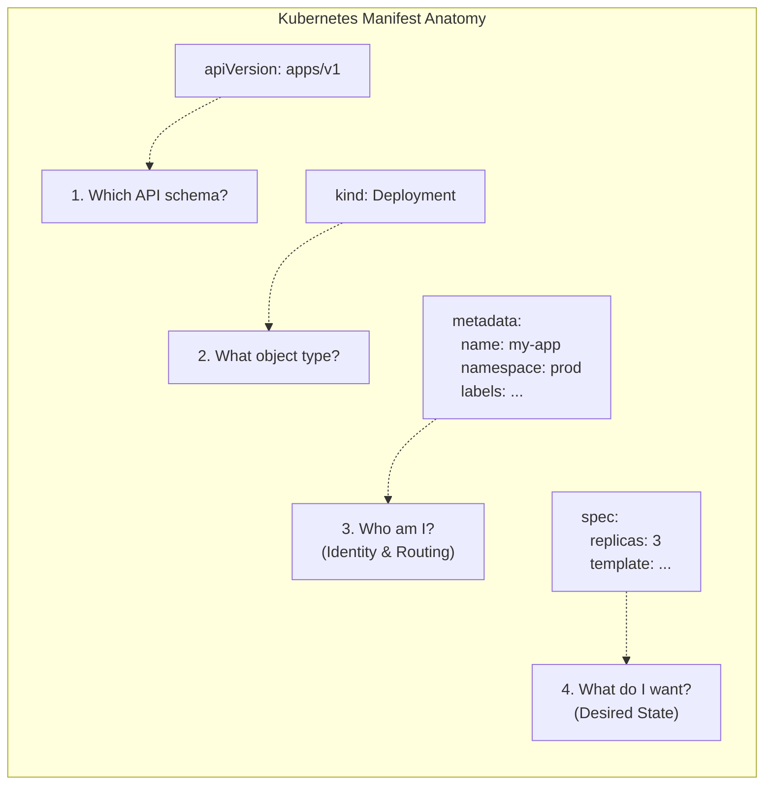

> **Складність**: [СЕРЕДНЯ]
>
> **Час на виконання**: 60-75 хвилин
>
> **Передумови**: Модулі 1.1-1.7, включаючи базові ресурси Kubernetes, Pod, Service, Deployment, labels та робочий процес `kubectl`
>
> **Угода щодо команд**: У цьому модулі в кожному прикладі, який можна запустити, використовується повна команда `kubectl`, тому скопійовані команди працюють в інтерактивних оболонках, скриптах та завданнях CI.

---


## Що ви зможете зробити

До кінця цього модуля ви зможете:

1. **Конструювати** структурно правильні маніфести Kubernetes, використовуючи скаляри, mappings, sequences, багаторядкові рядки та багатодокументні файли YAML.
2. **Деконструювати** обов'язкові поля маніфестів Kubernetes: `apiVersion`, `kind`, `metadata` та `spec`, щоб пояснити, як вони маршрутизують декларативний стан через сервер API.
3. **Діагностувати** помилки синтаксису YAML, схеми та валідації типів, поєднуючи вивід dry-run, `kubectl explain` та цілеспрямоване інспектування вкладених шляхів маніфесту.
4. **Проєктувати** маніфести додатків із кількома ресурсами, які поєднують Deployment, Service, ConfigMap, змінні середовища, labels, selectors та volume mounts.
5. **Порівнювати** клієнтську валідацію, серверну валідацію та робочі процеси diff, щоб обрати найбезпечніший крок перевірки перед застосуванням змін у production.


## Чому це важливо

Гіпотетичний сценарій: фінансова платформа входить у вікно торгів, коли клієнтський трафік уже перевищує звичайний піковий рівень. Платформний інженер застосовує те, що виглядає як рутинне оновлення маніфесту Kubernetes: збільшити кількість реплік, змінити аргументи контейнера та збільшити ліміти пам'яті для бекенд-процесорів. Один зайвий рівень відступу переміщує аргумент командного рядка зі списку аргументів контейнера у вкладене відображення (mapping). Парсер YAML приймає документ, під час перевірки він візуально виглядає правдоподібно, і розгортання продовжується, але контейнери дають збій, щойно середовище виконання намагається їх запустити. Щоб аналіз інциденту виявився дорогим, йому не потрібна драматична першопричина; найдорожчим є те, що невелика структурна помилка пройшла через перевірку, валідацію та розгортання до того, як хтось звернув достатньо уваги на форму даних, щоб її помітити.

Такий інцидент здається несправедливим, доки ви не згадаєте, що робить YAML у Kubernetes. YAML — це не просто зручний формат файлів для людей; це парадні двері до декларативного контракту API-сервера. Маніфест перетворюється на структуровані дані, перевіряється на відповідність схемі OpenAPI, допускається через політику, зберігається як бажаний стан (desired state), а потім узгоджується (reconciled) контролерами. Якщо структура вказує на щось неправильне, Kubernetes сумлінно виконуватиме неправильну інструкцію або відхилить запит на тому етапі, коли більше не зможе інтерпретувати ваш намір. Дисципліна, яку ви формуєте тут, — це та сама дисципліна, яка не дає рутинній роботі з конфігурацією перетворитися на інцидент у робочому середовищі.

Гіпотетичний сценарій: команда оновлює TLS-сертифікат через Secret у Kubernetes і помилково використовує скаляр згорнутого блоку YAML (folded block scalar). Файл є дійсним YAML, Secret створюється, і розгортання продовжується, але згорнутий скаляр замінює символи нового рядка в сертифікаті на пробіли. Ingress-контролер отримує спотворене корисне навантаження PEM, не може завантажити свій сертифікат і постійно перезапускається, тоді як клієнти отримують незрозумілі помилки підключення. Один-єдиний символ, `>` замість `|`, не порушує синтаксис YAML; він змінює дані застосунку, які переносить YAML, а це означає, що перша видима помилка стається пізніше в системі.

Цей модуль навчає YAML як операційного інтерфейсу, а не як декоративного синтаксису. Ви вивчите три форми YAML, які з'являються в кожному маніфесті, чотири кореневі поля, які Kubernetes використовує для маршрутизації об'єктів, інструменти роботи зі схемами, що запобігають вгадуванню, і робочий процес валідації, який перетворює перевірку маніфесту на інженерну практику. Мета полягає не в запам'ятовуванні кожного поля в Kubernetes 1.35; мета — знати, як будувати логічні зв'язки від структури до схеми та поведінки контролера, коли кластер готується виконати ваш файл. Таке мислення дає рецензентам щось краще за візуальну впевненість: відтворюваний шлях від тексту до поведінки API.

## 1. Основи YAML для інфраструктури

YAML існує, оскільки конфігурація інфраструктури має бути одночасно машинозчитуваною та зручною для перевірки людьми в умовах браку часу. JSON є явним, але великі маніфести JSON візуально перевантажені, оскільки кожен вкладений об'єкт потребує фігурних дужок, лапок і ком. YAML усуває більшу частину цієї пунктуації і дозволяє відступам передавати ієрархію, що робить звичайну перевірку простішою, але водночас робить пробіли частиною моделі даних. Тому маніфест Kubernetes більше схожий на ретельно складену карту, ніж на випадкову нотатку: форма кожного рядка повідомляє парсеру, що до чого належить.

На найнижчому рівні YAML надає вам три будівельні блоки. Скаляр (scalar) — це єдине значення, як-от `nginx:1.27`, `8080`, `true` або `"production"`. Відображення (mapping) — це набір унікальних ключів і значень, ідея якого збігається зі словником або хеш-таблицею в мові програмування. Послідовність (sequence) — це впорядкований список, і кожен елемент у цьому списку починається з дефіса на правильному рівні відступу. Ресурси Kubernetes знову і знову комбінують ці три форми, доки вони не опишуть повноцінне робоче навантаження (workload).

```yaml
# This is a Mapping at the root level
server: nginx
port: 8080
is_active: true # Boolean scalar

# This is a Sequence (List) of scalars
allowed_origins:
  - https://example.com
  - https://api.example.com

# This is a Mapping containing a Sequence of Mappings
users:
  - name: alice
    role: admin
    permissions:
      - read
      - write
  - name: bob
    role: editor
    permissions:
      - read
```

Сприймайте цей приклад як дерево, а не як текст. Корінь містить три ключі відображення: `server`, `port` та `is_active`, за якими йдуть два більші ключі, чиї значення містять вкладені структури. `allowed_origins` — це послідовність скалярних рядків, тоді як `users` — це послідовність відображень, і кожне відображення користувача містить ще одну послідовність у розділі `permissions`. Kubernetes використовує саме цей стиль вкладеності для таких полів, як `containers`, `env`, `ports`, `volumeMounts` і `rules`, тому здатність розпізнавати очікувану форму є ціннішою за запам'ятовування конкретного маніфесту.

Найважливіше правило водночас найлегше недооцінити: для відступів у YAML використовуються пробіли, а не табуляції, і за угодою в Kubernetes використовується два пробіли на кожен рівень. Табуляції — це не просто стилістична розбіжність у YAML; це недійсний відступ. Зсув на один пробіл також може змінити значення, не виглядаючи драматично в pull request, особливо коли елемент вкладеної послідовності візуально знаходиться близько до поля над ним. Налаштуйте свій редактор так, щоб він відображав пробіли, перетворював табуляції на пробіли та форматував YAML із відступом у два пробіли, перш ніж покладатися на візуальну перевірку.

Зупиніться та подумайте: у блоці `users` вище, скільки елементів у послідовності `users`, і який тип даних містить `permissions`? Є два елементи-користувачі, і кожен елемент є відображенням. Значення `permissions` — це послідовність скалярних рядків. Якщо ви відповіли, підрахувавши дефіси на тому самому рівні відступу, ви використали ту саму структурну звичку, яка вам знадобиться під час перевірки блоків `containers`, `ports` та `env` у Kubernetes.

### Багаторядкові рядки: оператори `|` та `>`

YAML стає особливо корисним у Kubernetes, коли потрібно передати текст, який уже має внутрішню структуру. ConfigMap часто містять файли конфігурації застосунків, скрипти командної оболонки або фрагменти коду для вебсерверів. Secret можуть містити матеріал сертифіката, текст закритого ключа або фрагменти конфігурації, які повинні зберігати точні межі рядків після декодування. JSON може представляти ці дані, але він змушує використовувати екрановані символи нового рядка в єдиному рядку, тоді як YAML дозволяє вбудовувати текст у вигляді зручного для читання блоку.

У YAML є два оператори скалярів блоків, які виглядають схожими, але поводяться зовсім інакше. Скаляр літерального блоку (literal block scalar), `|`, зберігає символи нового рядка та відступи всередині блоку. Скаляр згорнутого блоку (folded block scalar), `>`, згортає звичайні розриви рядків у пробіли, зберігаючи при цьому розриви абзаців навколо порожніх рядків. Це робить `>` корисним для довгих описів і майже завжди неправильним для скриптів, сертифікатів, фрагментів kubeconfig і будь-яких даних, де приймаюча програма сприймає символи нового рядка як синтаксис.

```yaml
# Literal (|) - Preserves structure perfectly for a script
setup_script: |
  #!/bin/bash
  echo "Starting setup..."
  apt-get update
  apt-get install -y curl

# Folded (>) - Good for long descriptions that should be a single paragraph
description: >
  This is a very long description that I want to type
  across multiple lines in my editor for readability,
  but I want the application to see it as a single,
  continuous string of text.
```

Операційний наслідок простий: вибирайте скаляр на основі того, що очікує застосунок, а не того, що легше читати у вашому редакторі. Скрипт оболонки, змонтований із ConfigMap, потребує `|`, оскільки оболонка зчитує один командний рядок за іншим. TLS-сертифікат потребує `|`, оскільки межі PEM і розриви рядків base64 мають значення для багатьох парсерів. Зрозуміла для людини анотація, яку зовнішня інформаційна панель відображає як абзац, може використовувати `>`, оскільки споживачу потрібен один суцільний рядок.

Зупиніться та подумайте: якщо ви вбудовуєте ключ сертифіката `.pem` у Secret у Kubernetes, який оператор ви повинні використати і чому? Використовуйте скаляр літерального блоку, `|`, оскільки сертифікат — це структурований текст із межами нових рядків, які мають зберегтися під час серіалізації. Якщо ви використаєте `>`, маніфест може успішно пройти парсинг YAML і все одно надати пошкоджені дані застосунку, що є більш небезпечним за синтаксичну помилку, оскільки збій з'являється пізніше під час розгортання.

### Розширений YAML: якорі (`&`) та псевдоніми (`*`)

YAML також включає якорі (anchors) та псевдоніми (aliases) — вбудовану функцію повторного використання, яка дозволяє одній частині документа посилатися на іншу. Якір, позначений символом `&`, дає назву відображенню або значенню, яке можна використати повторно. Псевдонім, позначений символом `*`, розгортає це прив'язане значення в іншому місці. У поєднанні з ключем злиття (merge key) `<<`, якорі можуть зменшити кількість повторюваних міток або фрагментів конфігурації у власноруч написаному YAML, хоча багато команд, що працюють з Kubernetes, віддають перевагу Kustomize, Helm або іншому спеціальному інструменту для більших патернів повторного використання.

```yaml
# Define an anchor named 'common_labels'
base_labels: &common_labels
  app: web-tier
  environment: production
  managed-by: platform-team

frontend_pod:
  metadata:
    # Use the merge key (<<) to inject the alias
    <<: *common_labels
    name: react-frontend

backend_pod:
  metadata:
    <<: *common_labels
    name: node-api
```

Коли парсер YAML обробляє цей документ, він розгортає псевдонім до того, як Kubernetes отримає об'єкт. API-сервер не зберігає якір як спеціальну функцію Kubernetes; він отримує результуюче відображення. Ця відмінність має значення під час налагодження, оскільки помилка від API-сервера посилається на форму розгорнутого об'єкта, а не на ваш ярлик для повторного використання. Якорі можуть бути корисними в невеликій локальній вправі, але у спільних робочих репозиторіях вони можуть ускладнити перевірку коду, якщо колеги по команді не очікують неявного розгортання.

```json
{
  "app": "web-tier",
  "environment": "production",
  "managed-by": "platform-team",
  "name": "react-frontend"
}
```

Зупиніться та подумайте: що містить `frontend_pod.metadata` після розгортання? Він містить три спільні мітки з `common_labels` плюс явний ключ `name: react-frontend`. Злиття зберігає відображення плоским, саме тому наведене вище представлення у форматі JSON має чотири ключі на одному рівні, а не вкладений об'єкт `base_labels`.

## 2. Анатомія маніфесту Kubernetes

Після того, як YAML надасть вам дерево даних, Kubernetes має знати, що це дерево репрезентує. Кожен звичайний об'єкт Kubernetes починається з невеликого контракту на кореневому рівні: `apiVersion`, `kind`, `metadata` та зазвичай `spec`. Ці поля не є прикрасою. Вони повідомляють API-серверу, яку схему використовувати, на який тип об'єкта маршрутизувати, як ідентифікувати об'єкт та який бажаний стан повинні узгоджувати контролери. Якщо кореневий контракт відсутній або є суперечливим, кластер не зможе безпечно інтерпретувати маніфест.



Поле `apiVersion` вибирає групу API та версію, які визначають схему ресурсу. Базові ресурси, такі як Pod, Service, ConfigMap та Secret, використовують `v1`, оскільки вони належать до базової (core) групи API. Deployment використовують `apps/v1`, Ingress використовують `networking.k8s.io/v1`, і багато операторів додають власні групи API для своїх ресурсів. Слеш у `apps/v1` не є роздільником шляху у файловій системі; він відокремлює групу від версії, щоб Kubernetes міг вибрати правильну схему та стратегію зберігання.

Поле `kind` вказує тип об'єкта всередині цієї версії API. `Deployment`, `Service`, `Pod`, `Job`, `StatefulSet` та `Ingress` є різними типами (kind), і кожен з них має власну очікувану структуру `spec`. Типова помилка новачка — поєднання правильного типу з неправильною версією API, наприклад, `kind: Deployment` під `apiVersion: v1`. Це не дрібна помилка; це прохання до базової групи API розпізнати об'єкт, яким вона не володіє, тому сервер повертає помилку "no matches for kind" (немає збігів для типу).

Поле `metadata` надає ідентичність об'єкта та метадані, які інші контролери та інструменти використовують для його пошуку. Поле `name` має бути унікальним для цього типу ресурсу в межах простору імен (namespace). Поле `namespace` обмежує область видимості імен та політик, і якщо його пропустити, об'єкт потрапляє в поточний або стандартний простір імен, залежно від контексту команди. Мітки (labels) — це структуровані пари ключ-значення, що використовуються селекторами, тоді як анотації містять неідентифікаційні метадані для інструментів, контролерів і людей. Ставтеся до міток як до вхідних даних для маршрутизації та групування, а до анотацій — як до описових або інтеграційних метаданих, якщо в документації певного контролера не вказано інше.

Поле `spec` декларує бажаний стан, що є центральною ідеєю Kubernetes. Поле `spec` для Deployment вказує, скільки реплік має існувати, якими Pod-ами воно має керувати та який шаблон контейнера слід розгорнути. Поле `spec` для Service вказує, які порти відкривати та які мітки Pod-ів вибирати. Поле `spec` для Pod вказує, які контейнери, томи, проби (probes) та обмеження планування мають існувати. Деякі ресурси, орієнтовані на дані, такі як ConfigMap і Secret, використовують `data`, `binaryData` або `stringData` замість традиційного `spec`, але вони все одно дотримуються тієї самої моделі ідентичності об'єкта та маршрутизації API.

Робочий приклад: у Kubernetes 1.35 Deployment належить до `apps/v1`, а шаблон Pod всередині його `spec` містить кінцевий список контейнерів. Якщо ви розмістите `image: nginx:1.27` безпосередньо під `Deployment.spec`, YAML все ще може бути дійсним, але схема є неправильною, оскільки поле image належить до `spec.template.spec.containers[]`. У цьому полягає різниця між валідністю YAML і валідністю Kubernetes. Валідність YAML лише доводить, що текст може стати даними; валідація Kubernetes доводить, що дані відповідають вибраній схемі API.

Зупиніться та подумайте: ви створюєте ConfigMap, тож яке стандартне кореневе поле замінюється і як називається заміна? ConfigMap не використовує стиль `spec` для робочих навантажень; він зберігає вміст у вигляді пар ключ-значення під полем `data` і, за потреби, `binaryData`. Вам все ще потрібні `apiVersion`, `kind` та `metadata`, оскільки API-сервер повинен знати, який об'єкт створюється і як його ідентифікувати.


## 3. Дослідження схеми за допомогою `kubectl explain`

Вам не слід намагатися запам'ятати весь Kubernetes API. Навіть вбудовані ресурси мають глибоко вкладені поля, а production-кластери часто додають CustomResourceDefinitions для ingress-контролерів, менеджерів сертифікатів, рушіїв політик, операторів баз даних, service meshes та систем доставки. Kubernetes пропонує кращий підхід: запитувати схему OpenAPI через `kubectl explain`. Це перетворює сам кластер на довідник з відповідною версією для полів, які він приймає, а використання повної назви команди зберігає переносимість прикладів між вашим терміналом, shell-скриптами та завданнями CI.

Базова звичка полягає в тому, щоб переходити від kind до поля, яке ви хочете перевірити. Якщо вам потрібно знати, що знаходиться безпосередньо в `spec` ресурсу Pod, запитайте саме цей шлях. Вивід включає опис і список полів, а підказки щодо типів повідомляють, чи очікує поле скаляр, відображення (mapping) чи послідовність. Ці підказки прямо відповідають структурі YAML: `<string>` означає скаляр, `<Object>` означає відображення, `<[]Object>` означає послідовність відображень, а `<map[string]string>` означає відображення рядкових ключів на рядкові значення.

```bash
# General syntax: kubectl explain <kind>.<field>.<field>
kubectl explain pod.spec
```

Якщо ви хочете отримати більше дерева полів одночасно, використовуйте той самий шлях до поля з прапорцем `--recursive`. Важлива звичка — це не запам'ятовувати фрагмент зі старого допису в блозі; це використання живої схеми замість вгадування по пам'яті. Ця звичка має ще більше значення на кластерах з CRD, оскільки довідником, який відповідає вашому цільовому кластеру, може бути сам API-сервер, а не публічний вебсайт.

```bash
kubectl explain pod.spec --recursive
```

Liveness probe є хорошим прикладом, оскільки вона має кілька вкладених опцій, і лише деякі комбінації мають сенс. Ви можете спершу запитати поле probe, щоб побачити доступні механізми перевірки, а потім заглибитися в HTTP-дію, щоб перевірити поля шляху та порту. Цей робочий процес масштабується від вбудованих ресурсів до CRD за умови, що CRD публікує придатну до використання схему OpenAPI.

```bash
kubectl explain pod.spec.containers.livenessProbe
```

```text
KIND:       Pod
VERSION:    v1

RESOURCE:   livenessProbe <Probe>

DESCRIPTION:
     Periodic probe of container liveness. Container will be restarted if the
     probe fails. Cannot be updated...

FIELDS:
   exec <ExecAction>
     Exec specifies the action to take.

   httpGet      <HTTPGetAction>
     HTTPGet specifies the http request to perform.
...
```

Ви можете продовжувати заглиблюватися ще далі, щоб побачити точні параметри, необхідні для налаштування liveness probe на основі HTTP, перевіряючи такі речі, як очікуваний шлях і специфікації порту:

```bash
kubectl explain pod.spec.containers.livenessProbe.httpGet
```

Прапорець `--recursive` корисний, коли ви хочете отримати структурний план без читання довгого опису для кожного поля. Це не є заміною цілеспрямованого пошуку полів, оскільки повний рекурсивний дамп може бути великим, але це чудово підходить, коли ви намагаєтеся побачити приблизну форму ресурсу перед написанням маніфесту. Для Deployment рекурсивний вигляд швидко нагадає вам, що список контейнерів знаходиться всередині `spec.template.spec`, а не безпосередньо в корені Deployment.

```bash
kubectl explain deployment --recursive
```

```bash
kubectl explain deployment --recursive
```

Перед запуском цього, який вивід ви очікуєте, якщо запитаєте `kubectl explain pod.spec.nodeSelector`? Вам слід очікувати опис поля та тип, який поводиться як відображення рядкових ключів на рядкові значення. Це означає, що форма YAML не є списком об'єктів селектора; це відображення, таке як `disktype: ssd`, де кожен ключ і значення відповідають міткам (labels) вузла.

```bash
kubectl explain pod.spec.nodeSelector
```

Цей робочий процес, орієнтований на схему, є особливо цінним в ізольованих середовищах (air-gapped environments). Якщо ваш production-кластер не має доступу до Інтернету, API-сервер все одно знає свою власну схему, включаючи встановлені CRD та очікування під час допуску (admission-time), які загальні вебприклади не можуть охопити. Старший інженер Kubernetes не запам'ятовує кожне поле; він знає, як ставити кластеру точні запитання, а потім перекладати повернуті типи у форми YAML, які API-сервер може валідувати.


## 4. Типові патерни YAML у Kubernetes

Той самий невеликий набір структур YAML постійно з'являється в реальних маніфестах, але наслідки відрізняються залежно від поля. Список під `containers` створює одне або кілька визначень контейнерів. Відображення під `selector` керує тим, які pod-и отримують трафік. Двостороння взаємодія між `volumes` та `volumeMounts` вирішує, чи зможе Pod запуститися взагалі. Щойно ви навчите себе розпізнавати ці форми, повідомлення про помилки стануть підказками замість шуму.

Змінні середовища демонструють найпоширеніший вкладений патерн: послідовність відображень. Поле `env` під контейнером не приймає єдине відображення імен на значення. Воно приймає список, і кожен елемент списку є відображенням із полем `name` плюс або пряме `value`, або посилання `valueFrom`. Цей дизайн дозволяє кожній змінній середовища нести додаткову структуру, наприклад посилання на ConfigMaps, Secrets, поля або значення ресурсів.

```yaml
apiVersion: v1
kind: Pod
metadata:
  name: env-demo
spec:
  containers:
  - name: my-app
    image: nginx:alpine
    env:                   # The 'env' field takes a Sequence (List)
      - name: DATABASE_URL # First item in the list, direct value
        value: "postgres://db:5432"
      - name: LOG_LEVEL    # Second item in the list
        value: "debug"
      - name: API_KEY      # Third item, value injected from a Secret
        valueFrom:
          secretKeyRef:
            name: app-secrets
            key: api-key
```

Зверніть увагу, що кожна змінна середовища починається з дефіса на тому самому рівні відступу. Якщо ви видалите один із цих дефісів, ви більше не надаватимете елемент послідовності, навіть якщо текст виглядає майже правильним. Kubernetes відхилить маніфест із невідповідністю типів, оскільки схема OpenAPI очікує список об'єктів `EnvVar`. Ось чому `kubectl explain pod.spec.containers.env` корисніший за візуальне вгадування, коли ви не впевнені.

Томи (volumes) демонструють інше джерело помилок, оскільки конфігурація розділена на дві частини Pod'а. Послідовність рівня Pod'а `spec.volumes` оголошує джерела томів, такі як ConfigMaps, Secrets, порожні каталоги, спроєктовані томи або заявки на постійні томи. Кожна послідовність рівня контейнера `volumeMounts` вирішує, де іменований том з'являється всередині файлової системи цього контейнера. Зв'язком між цими блоками є назва тому, тому назви повинні збігатися точно.

```yaml
apiVersion: v1
kind: Pod
metadata:
  name: volume-demo
spec:
  containers:
  - name: app-container
    image: busybox
    command: ["sleep", "3600"]
    volumeMounts:          # Where does the container see the volume?
    - name: config-store   # Must match the volume name below exactly!
      mountPath: /etc/config
      readOnly: true
  volumes:                 # What is the actual volume backing this?
  - name: config-store     # The identifier
    configMap:             # The volume type (populates files from a ConfigMap)
      name: my-app-config
```

Розділений дизайн є навмисним. Один Pod може визначати кілька томів, а різні контейнери можуть монтувати різні підмножини цих томів за різними шляхами. Компроміс полягає в тому, що друкарська помилка в спільній назві не є помилкою YAML і може не бути виявлена перевіркою на стороні клієнта. Pod є синтаксично дійсним, але не може змонтувати те, на що він посилається, тому ви діагностуєте проблему, читаючи події Pod'а за допомогою `kubectl describe pod <name>` після створення або перевіряючи обидва поля назви разом перед розгортанням.

Мітки (labels) та селектори (selectors) — це відображення, які з'єднують ресурси без жорсткого кодування назв Pod'ів. Ресурс Service не надсилає трафік певній ідентичності Pod'а; він відстежує Pod'и, чиї мітки відповідають його селектору. Ця непрямість — це те, що дозволяє Kubernetes замінювати Pod'и під час розгортань, поки Service залишається стабільним. Це також означає, що невідповідність мітки в один символ може створити Service, який виглядає здоровим, але не має кінцевих точок.

```yaml
# A Service looking for specific pods
apiVersion: v1
kind: Service
metadata:
  name: frontend-svc
spec:
  selector:              # The Service will route traffic to any Pod...
    app: frontend        # ...that has this exact label
    tier: web            # ...AND this exact label.
  ports:
  - port: 80
```

Наведений вище селектор є відношенням І (AND) для ключів відображення. Pod повинен мати як `app: frontend`, так і `tier: web`, щоб отримувати трафік. Ось чому мітки шаблону Pod'а в Deployment та селектори Service заслуговують на ретельний спільний розгляд. Якщо Deployment створює Pod'и з `tier: frontend`, тоді як Service обирає `tier: web`, обидва ресурси можуть бути дійсними, але все одно зазнаватимуть невдачі як система, оскільки передбачуваний зв'язок розірвано.

Який підхід ви б обрали тут і чому: жорстко закодувати назви Pod'ів у конфігураційному файлі клієнта, чи використати селектор Service, який відповідає стабільним міткам? Використовуйте селектори для звичайних мереж Kubernetes, оскільки Pod'и є одноразовими, а мітки є стабільним контрактом. Жорстко закодовані назви Pod'ів перетворюють рутинні розгортання на конфігураційний хаос, тоді як селектори дозволяють контролерам замінювати Pod'и, не змушуючи клієнтів дізнаватися нові ідентичності.


## 5. Багаторесурсні файли та CI/CD

Production-застосунок рідко складається з одного об'єкта Kubernetes. Навіть невеликому вебсервісу може знадобитися ConfigMap для конфігурації, Deployment для обчислень, Service для стабільної мережі, Ingress для зовнішньої маршрутизації та, можливо, ServiceAccount або Secret. Зберігання кожного об'єкта в окремому файлі може бути зрозумілим для великих репозиторіїв, але для компактного навчального прикладу або невеликого модуля застосунку багатодокументний файл YAML зберігає пов'язані ресурси разом, при цьому зберігаючи окремі об'єкти Kubernetes.

YAML використовує `---` як роздільник документів. Три дефіси на окремому рядку завершують один документ YAML і починають наступний документ у тому ж потоці. Команда `kubectl apply -f combined.yaml` читає цей потік, розбиває його на окремі об'єкти та надсилає їх по черзі. Кожен об'єкт усе ще має свої власні `apiVersion`, `kind`, `metadata` та стан, специфічний для об'єкта. Роздільник не об'єднує об'єкти; він дозволяє одному файлу містити кілька незалежних об'єктів.

```text
apiVersion: v1
kind: ConfigMap
metadata:
  name: app-config
data:
  color: "blue"
---
apiVersion: apps/v1
kind: Deployment
metadata:
  name: my-app
spec:
  replicas: 2
  # ... deployment details ...
---
apiVersion: v1
kind: Service
metadata:
  name: my-app-svc
spec:
  # ... service details ...
```

Порядок має менше значення, ніж часто побоюються новачки, але він усе ж важливий для чистих розгортань і читабельних журналів (logs). `kubectl` надсилає документи в порядку файлів, тоді як контролери виконують узгодження (reconcile) асинхронно після створення об'єктів. Якщо Deployment з'являється до ConfigMap, на який він посилається, об'єкт Deployment може бути прийнятий, і перші Pod'и можуть зазнати невдачі, доки ConfigMap не буде створено. Kubernetes часто відновиться, щойно залежність з'явиться, але конвеєр (pipeline), який створює уникненні події crash-loop, важче моніторити та важче йому довіряти.

З цієї причини розташовуйте базові залежності насамперед: простори імен, ServiceAccounts, ConfigMaps, Secrets, PersistentVolumeClaims, потім контролери робочих навантажень (workload controllers), потім Services та ресурси, орієнтовані на Ingress, відповідно до вашої системи доставки. Інструменти GitOps, такі як Argo CD та Flux, додають свої власні концепції впорядкування та стану (health concepts), але вони все одно споживають маніфести, які мають бути дійсними об'єктами Kubernetes. Багатодокументні файли не є заміною для проєктування залежностей; це формат пакування для пов'язаного бажаного стану.

Зупиніться та подумайте: чи має значення порядок документів під час запуску `kubectl apply -f combined.yaml`? Клієнт обробляє документи по черзі, але кластер узгоджує їх з часом. Відсутня залежність може спричинити тимчасовий збій Pod'а, навіть якщо пізніший документ створить залежність за мить по тому, тому впорядковуйте ваш файл, щоб зменшити кількість шумних перехідних збоїв та зробити поведінку під час першого застосування більш зрозумілою.

Валідація в CI/CD повинна розглядати багаторесурсні файли як єдину одиницю розгортання, але перевіряти кожен об'єкт окремо. Синтаксична помилка ближче до початку може запобігти парсингу всього файлу. Помилка схеми в одному ресурсі може призвести до збою застосування (apply), навіть якщо інші ресурси є дійсними. Невідповідність селектора може повністю пройти валідацію, оскільки це семантичний зв'язок між об'єктами, а не локальне порушення схеми. Ось чому зрілі конвеєри поєднують парсинг YAML, dry runs на стороні сервера, а іноді й перевірки політик або інтеграційні тести.


## 6. Validating YAML and Real Debugging

Діагностування маніфестів стає зрозумілішим, якщо розділити помилки на чотири рівні. Перший рівень — синтаксис YAML: чи можна взагалі перетворити текст на дані? Другий рівень — схема Kubernetes: чи відповідають дані заявленим `apiVersion` та `kind`? Третій рівень — допуск кластера (cluster admission): чи дозволяють простір імен, CRD, дозволи та політики цей запит? Четвертий рівень — поведінка під час виконання (runtime behavior): чи справді контролери та робочі навантаження (workloads) досягають бажаного стану після того, як об'єкт прийнято?

Перевірка на боці клієнта (client-side dry run) — це найшвидший перший етап. Вона виявляє багато синтаксичних помилок і помилок схеми без звернення до API-сервера, тому вона корисна під час локального створення файлу. Водночас вона обмежена версією клієнта та тим, що клієнт може знати без реального кластера. Використовуйте її для швидкого циклу редагування, а не як фінальний крок перед розгортанням у production.

```bash
kubectl apply -f my-pod.yaml --dry-run=client
```

```bash
kubectl apply -f my-pod.yaml --dry-run=client
```

Перевірка на боці сервера (server-side dry run) дає запит реальному API-серверу на обробку запиту через автентифікацію, авторизацію, валідацію схеми, встановлення значень за замовчуванням та контроль допуску, але зупиняється перед збереженням об'єкта. Це робить її кращою попередньою перевіркою для спільних кластерів, CRD та середовищ зі складними політиками. Якщо ваша система CI має доступ до кластера, перевірка на боці сервера дає вам упевненість, що справжня панель управління (control plane) зможе прийняти маніфест за поточних умов.

```bash
kubectl apply -f my-pod.yaml --dry-run=server
```

```bash
kubectl apply -f my-pod.yaml --dry-run=server
```

Команда `diff` відповідає на інше запитання: що зміниться порівняно з поточним станом? Це критично важливо для оновлень, оскільки навіть дійсний маніфест може внести небезпечні зміни. Наприклад, зміна селектора Deployment може залишити наявні ReplicaSets без батьківського об'єкта, а зміна міток селектора Service може видалити кінцеві точки зі шляху трафіку. Перевірка dry run показує, чи прийме сервер запит; а diff допомагає оцінити, чи є прийнята зміна саме тією, яку ви планували.

```bash
kubectl diff -f my-updated-deployment.yaml
```

```bash
kubectl diff -f my-updated-deployment.yaml
```

Найкращий процес діагностування є обдуманим. Почніть із точного повідомлення про помилку та визначте, до якого рівня воно належить. Якщо парсер повідомляє, що не може перетворити YAML на JSON, перевірте відступи, двокрапки, табуляції та пропущені дефіси навколо вказаного рядка та рядків безпосередньо над ним. Якщо Kubernetes повідомляє про недійсне поле або тип, скористайтеся `kubectl explain`, щоб перевірити очікуваний шлях. Якщо перевірка на боці сервера завершується помилкою після успішної перевірки на боці клієнта, шукайте причини, специфічні для кластера, такі як відсутній простір імен, версія CRD, відмова RBAC або політика допуску.

Ставтеся до кожного результату перевірки як до доказу того, де саме маніфест дав збій, а не як до особистого вироку автору. Помилка парсера означає, що текст не став деревом даних, тому редагування `apiVersion` не допоможе, доки не буде виправлено відступи або синтаксис скалярів. Помилка схеми означає, що дерево даних існує, але не відповідає контракту об'єкта, тому додавання додаткових розділювачів документа не виправить неправильно розміщене поле `image`. Помилка допуску означає, що об'єкт є дійсними даними Kubernetes, але порушує певне правило цільового кластера, наприклад, політику, що вимагає міток власності (ownership labels), або квоту простору імен, що обмежує запити на ресурси. Таке розділення запобігає гарячковим редагуванням методом спроб і помилок та робить обговорення під час рев'ю більш точними.

```text
error: error parsing deployment.yaml: error converting YAML to JSON: yaml: line 15: mapping values are not allowed in this context
```

Це зазвичай означає, що парсер YAML натрапив на структурну суперечність ще до початку валідації Kubernetes. Номер рядка — це підказка, а не остаточний висновок, оскільки справжня помилка часто криється в попередньому рядку. Пропущені дефіси в послідовностях, непослідовні відступи або двокрапка без лапок усередині рядка можуть змусити парсер очікувати ключ там, де він знаходить щось інше.

```text
The Deployment "my-app" is invalid: spec.replicas: Invalid value: "3": spec.replicas must be an integer
```

Це невідповідність типу схеми. YAML прийняв `"3"` як рядок, але схема Deployment вимагає цілого числа для `spec.replicas`. Рішення полягає не в ігноруванні валідації; потрібно представити значення в тому типі, якого очікує схема, що означає `replicas: 3` без лапок.

```text
error: unable to recognize "pod.yaml": no matches for kind "Pod" in version "apps/v1"
```

Це вказує на кореневий контракт. Pod є базовими ресурсами в межах `apiVersion: v1`, тоді як `apps/v1` містить високорівневі контролери робочих навантажень, такі як Deployments, ReplicaSets, StatefulSets та DaemonSets. Коли `apiVersion` та `kind` не збігаються, сервер не може обрати схему.

```text
error: error parsing config.yaml: error converting YAML to JSON: yaml: unmarshal errors:
  line 12: mapping key "port" already defined at line 10
```

Відображення (mappings) вимагають унікальних ключів на одному рівні відступів. Дублікати ключів небезпечні, оскільки історично деякі парсери дозволяли останнім значенням перезаписувати попередні. Сучасні інструменти Kubernetes відхиляють дублікати, щоб запобігти прихованій втраті конфігурації, тому правильним виправленням буде використання послідовності, якщо вам потрібно кілька портів, або видалення дубліката ключа, якщо дійсним є лише одне значення.

```text
error: error validating "deployment.yaml": error validating data: ValidationError(Deployment.spec.template.spec): unknown field "image" in io.k8s.api.core.v1.PodSpec;
```

Помилки невідомого поля (unknown field) зазвичай означають, що поле реальне, але розміщене неправильно, або що поле належить до іншої версії API. У цьому прикладі `image` має бути всередині об'єкта контейнера за шляхом `spec.template.spec.containers[]`, а не безпосередньо у специфікації Pod. Йдіть за шляхом, вказаним у повідомленні про помилку, а потім скористайтеся `kubectl explain deployment.spec.template.spec.containers`, щоб підтвердити правильну структуру.

Сценарій для вправи: команда платформи додає нове поле `podLabels`, скопійоване з файлу значень Helm-чарта, безпосередньо у згенерований маніфест Deployment. Поле має сенс у вхідних даних чарта, але воно не є частиною схеми Deployment у Kubernetes. Перевірки на боці клієнта на ноутбуці одного розробника пропускають це, оскільки локальний скрипт оминає валідацію для згенерованих файлів, тоді як перевірка на боці сервера в системі CI відхиляє маніфест перед production. Правильне рішення полягає у виправленні шаблону чарта або відображення значень замість послаблення валідації, оскільки проблема є помилкою на межі між інтерфейсом шаблонізації та API Kubernetes.


## Патерни та антипатерни

Надійна практика роботи з Kubernetes YAML полягає не стільки в запам'ятовуванні фрагментів коду, скільки у створенні патернів, які легко піддаються рев'ю. Хороший патерн робить задуману структуру даних очевидною, надає контролерам стабільні зв'язки для узгодження і дозволяє валідації своєчасно виявити помилку, якщо файл не відповідає схемі. Поганий патерн усе ще може створювати дійсний YAML, але він приховує зміст, залежить від випадкового порядку або дозволяє семантичній невідповідності проникнути в поведінку під час виконання.

| Патерн | Коли використовувати | Чому це працює | Аспекти масштабування |
| :--- | :--- | :--- | :--- |
| Створення на основі схеми (Schema-first authoring) | Щоразу, коли ви додаєте незнайоме поле або вкладену структуру | `kubectl explain` показує очікуваний тип Kubernetes ще до того, як ви напишете YAML | Працює для вбудованих об'єктів та добре описаних CRD; доповнюйте документацією постачальника, якщо схеми CRD неповні |
| Багатодокументні файли з пріоритетом залежностей (Dependency-first) | Невеликі збірки застосунків із ConfigMaps, Secrets, робочими навантаженнями та Services | Базові ресурси створюються до того, як Pod на них посилаються, що зменшує кількість початкових збоїв | У більших системах порядок може переноситися в хвилі GitOps (GitOps waves) або окремі бази Kustomize |
| Стабільні контракти міток (Stable label contracts) | Services, Deployments, NetworkPolicies та вибірки для систем спостереження | Мітки забезпечують тривалі зв'язки, тоді як Pod залишаються тимчасовими | Визначайте угоди щодо міток централізовано, щоб команди не придумували несумісні ключі |
| Перевірка на боці сервера в CI | Спільні кластери, CRD, простори імен, RBAC та політики допуску | Справжній API-сервер валідує запит без його збереження | Вимагає безпечних облікових даних для CI та репрезентативних цільових кластерів |

| Антипатерн | Що йде не так | Чому команди цього припускаються | Краща альтернатива |
| :--- | :--- | :--- | :--- |
| Вгадування між списком та відображенням | Файл є дійсним YAML, але не проходить валідацію схеми або створює неправильну структуру об'єкта | Приклади виглядають візуально схожими, особливо для `containers`, `env` та `ports` | Читайте тип схеми та зіставляйте `<[]Object>` з елементами послідовності з дефісами |
| Копіювання значень чарта в маніфести | Поля, які належать інструменту шаблонізації, відхиляються API Kubernetes | І вхідні дані чарта, і згенерований результат використовують YAML, тому межа здається розмитою | Згенеруйте чарт, перевірте результат і виконайте валідацію фактичного маніфесту Kubernetes |
| Захисне взяття в лапки кожного скаляра | Цілі числа та логічні значення стають рядками там, де схема вимагає нативних типів | Команди намагаються уникнути несподіванок із типами YAML, обробляючи все як текст | Беріть у лапки неоднозначні рядки, але залишайте числові поля без лапок, якщо схема очікує числа |
| Сприйняття клієнтської перевірки як фінального доказу | Помилки, пов'язані зі специфічними для кластера політиками, RBAC, CRD та допуском, з'являються пізніше | Валідація на боці клієнта швидка та доступна без доступу до кластера | Використовуйте клієнтський dry run для редагування, а серверний dry run — перед злиттям або релізом |

Найнадійніший патерн — тримати очікувані зв'язки об'єктів поруч один з одним під час рев'ю. Якщо Service вибирає `app: web`, ті, хто проводить рев'ю, повинні бачити мітки в шаблоні Pod, які відповідають цьому селектору. Якщо контейнер монтує `config-store`, на рев'ю має бути видно том на рівні Pod із назвою `config-store`. Якщо змінна середовища посилається на `app-config`, перевіряльники повинні бачити, чи створено цей ConfigMap тією самою одиницею релізу, чи це задокументована зовнішня залежність.


## Структура прийняття рішень

Вибір правильного підходу до YAML та валідації залежить від ризику змін, залучених функцій кластера та швидкості зворотного зв'язку, яка вам потрібна. Локальний цикл редагування має бути швидким, оскільки ви формуєте документ. Шлюз релізу (release gate) має бути авторитетним, оскільки він представляє зміну, яку кластер може реально запустити. Оновлення в production має бути доступним для перевірки, оскільки прийняті зміни все одно можуть бути операційно небезпечними.

```text
Почніть зі зміни маніфесту
        |
        v
Шлях поля незнайомий?
        |
        +-- так --> Виконайте kubectl explain для точного шляху, потім відредагуйте структуру YAML
        |
        +-- ні ----+
                  |
                  v
Файл парситься та відповідає локальній схемі?
                  |
                  +-- ні --> Виконайте kubectl apply --dry-run=client і виправте синтаксичні помилки або помилки типів
                  |
                  +-- так ---+
                             |
                             v
Цільовий кластер містить CRD, RBAC або політику допуску?
                             |
                             +-- так --> Виконайте kubectl apply --dry-run=server для цього кластера
                             |
                             +-- ні ----+
                                       |
                                       v
Ви оновлюєте наявні активні ресурси?
                                       |
                                       +-- так --> Виконайте kubectl diff -f <file> та перевірте патч
                                       |
                                       +-- ні ---> Застосуйте маніфест через звичайний процес релізу
```

Використовуйте перевірку на боці клієнта, коли ви ще редагуєте файл і хочете отримати миттєвий зворотний зв'язок щодо очевидних синтаксичних проблем або помилок схеми. Використовуйте перевірку на боці сервера, коли важливе бачення реального кластера, що включає CRD, простори імен, RBAC, контролери допуску, встановлення значень за замовчуванням та специфічну для версії валідацію. Використовуйте diff, коли об'єкт уже існує, і головне запитання не «чи це дійсно?», а «що саме зміниться?». Здоровий конвеєр часто використовує всі три підходи, оскільки вони відповідають на різні запитання.

| Ситуація | Бажаний інструмент | Причина |
| :--- | :--- | :--- |
| Ви не пам'ятаєте, де має бути `readOnly` для монтування тому | `kubectl explain pod.spec.containers.volumeMounts` | Схема показує точний шлях вкладеного поля та очікуваний тип |
| Ви редагуєте локальний приклад Pod і хочете отримати швидкий фідбек | `kubectl apply --dry-run=client -f pod.yaml` | Клієнт виявляє помилки YAML та базової схеми, не чекаючи на відповідь кластера |
| Ви валідуєте CRD оператора перед злиттям (merge) | `kubectl apply --dry-run=server -f resource.yaml` | API-сервер валідує встановлену версію CRD та політику допуску |
| Ви змінюєте селектори в активному Deployment або Service | `kubectl diff -f service.yaml` | Команда diff розкриває руйнівні зміни зв'язків до їх застосування |

Ця структура також підказує, коли проблема насправді не в YAML. Якщо перевірка на боці сервера приймає Service, але трафік усе ще не проходить, перевірте кінцеві точки та мітки замість того, щоб переписувати відступи. Якщо ConfigMap є дійсним, але застосунок його ігнорує, перевірте, як Pod споживає його через змінні середовища або змонтовані файли. YAML — це формат доставлення бажаного стану, але діагностування під час виконання все одно вимагає відстеження поведінки контролера та робочого навантаження після того, як API приймає об'єкт.


## Чи знали ви?

* **Різниці у версіях YAML спричиняли справжні несподіванки:** YAML 1.1 розглядав кілька слів без лапок, включно з `NO`, як логічні значення. Це дивувало команди, які використовували коди країн та інші короткі ідентифікатори. Саме тому взяття неоднозначних рядків у лапки залишається практичною звичкою, навіть коли сучасні інструменти точніше дотримуються YAML 1.2.
* **Kubernetes зберігає стан об'єктів з урахуванням лімітів etcd:** Великі ConfigMaps та Secrets обмежені API-сервером та шляхом зберігання etcd, і Kubernetes документує ліміт в 1 МіБ для даних окремого ConfigMap. Якщо конфігурація наближається до цього розміру, використовуйте змонтовані файли, об'єктне сховище або інший патерн доставлення замість того, щоб втискувати все в один маніфест.
* **JSON є дійсним YAML:** Формат YAML розроблено так, що документи JSON також є дійсними документами YAML. `kubectl` може безпосередньо застосовувати файли JSON, що корисно для згенерованих корисних навантажень та інтеграцій з API, де ручне редагування не є головною метою.
* **API-серверу важлива структура, а не візуальне форматування:** Два маніфести можуть виглядати схожими під час рев'ю, але при цьому створювати різні дерева даних. Відсутній дефіс послідовності під `containers` змінює тип даних, і API-сервер валідує дерево даних після парсингу, а не ваш візуальний задум.


## Типові помилки

| Помилка | Чому це стається | Як це виправити |
| :--- | :--- | :--- |
| **Використання табуляції для відступів** | Копіювання з інструментів спілкування, браузерів або редакторів, які вставляють табуляцію, робить YAML невалідним ще до того, як його побачить Kubernetes. | Налаштуйте редактор на вставлення двох пробілів для файлів YAML і відображення пробілів під час перевірки. |
| **Об'єднання неправильного `apiVersion` з `kind`** | Інженери вгадують із сусідніх прикладів, наприклад, використовуючи `v1` для Deployment, тому що Pods використовують `v1`. | Запустіть `kubectl api-resources` або `kubectl explain <kind>` і перевірте групу API перед написанням маніфесту. |
| **Пропуск дефісів для послідовностей** | Такі поля, як `containers`, `env`, `ports` та `volumeMounts`, виглядають як вкладені відображення, поки ви не вивчите їхню схему. | Якщо `kubectl explain` показує `<[]Object>`, напишіть елемент списку з дефісом на правильному рівні відступу. |
| **Взяття в лапки значень неправильного типу** | Команди беруть у лапки кожне значення, щоб уникнути сюрпризів у YAML, і тоді такі поля, як `replicas` або `port`, стають рядками. | Беріть у лапки неоднозначні рядки, але залишайте числові поля схеми без лапок, коли Kubernetes очікує цілі числа. |
| **Забування `---` між ресурсами** | Кілька ресурсів вставляються в один файл, і парсер розглядає їх як один зіпсований або перезаписаний документ. | Розмістіть `---` на окремому рядку між повними об'єктами Kubernetes у багатодокументному файлі. |
| **Невідповідність селекторів Service та міток pod** | Кожен ресурс проходить локальну перевірку, але зв'язок між ними є семантичним, і його легко не помітити. | Перевіряйте селектори Service поруч із мітками шаблону pod у Deployment і підтверджуйте кінцеві точки після застосування. |
| **Використання `>` для структурованих багаторядкових даних** | Згорнуті скаляри (folded scalars) легко читати, але вони замінюють звичайні розриви рядків на пробіли. | Використовуйте `|` для скриптів, сертифікатів, фрагментів kubeconfig та будь-яких даних, де нові рядки є синтаксисом. |
| **Розгляд клієнтського dry run як доказу готовності до production** | Клієнтська перевірка відбувається швидко, тому команди підвищують її статус до єдиного бар'єра, навіть якщо кластери використовують CRD та політики. | Збережіть клієнтський dry run для створення, а потім запускайте серверний dry run на цільовому кластері перед релізом. |


## Контрольні запитання

<details><summary>1. Сценарій: Колега просить вас переглянути pull request, у якому Secret Kubernetes, що містить приватний сертифікат TLS, не може бути розпарсений у контролері ingress. Ви помічаєте, що дані сертифіката визначені за допомогою оператора YAML `>`. Чому це спричиняє помилку і як це виправити?</summary>

**Відповідь:** Згорнутий блоковий скаляр `>` перетворює звичайні розриви рядків на пробіли, що псує структуру сертифіката PEM, хоча документ YAML все ще може успішно розпарситися. Контролер ingress отримує єдиний пошкоджений рядок сертифіката замість даних сертифіката зі збереженими розривами рядків, тому він не може завантажити облікові дані. Використовуйте буквальний блоковий скаляр `|` для матеріалу сертифіката, оскільки він точно зберігає нові рядки. Ця відповідь перевіряє вміння **створювати** маніфести з правильною формою багаторядкових рядків та **діагностувати** збої, коли валідний YAML містить невалідні дані застосунку.
</details>

<details><summary>2. Сценарій: Під час production хотфіксу інженер виконує `kubectl apply -f hotfix.yaml` і отримує `error converting YAML to JSON: yaml: line 22: did not find expected key`. Рядок 22 містить `image: nginx:alpine`, що виглядає нешкідливо. Що йому слід перевірити в першу чергу?</summary>

**Відповідь:** Їм слід перевірити відступи та структуру послідовності навколо блоку `containers`, включаючи рядки безпосередньо перед рядком 22. Помилки парсера YAML часто вказують на рядок, де парсинг став неможливим, а не обов'язково на рядок, де почалася помилка. Пропущений дефіс перед елементом контейнера або неправильний відступ у полі `name` можуть призвести до того, що `image` з'явиться там, де парсер очікував інший ключ. Це відповідає результату вміння **діагностувати**, оскільки виправлення походить від аналізу структури YAML перед тим, як припустити, що значення image неправильне.
</details>

<details><summary>3. Сценарій: Ви перебуваєте в ізольованому від мережі (air-gapped) кластері і вам потрібно змонтувати PersistentVolumeClaim, але ви не можете згадати, чи `readOnly` належить до `volumes`, чи до `volumeMounts`. Як знайти правильний шлях до поля без доступу до Інтернету?</summary>

**Відповідь:** Використовуйте `kubectl explain`, щоб запитати схему OpenAPI кластера щодо відповідних вкладених полів. Порівняйте `kubectl explain pod.spec.volumes.persistentVolumeClaim` із `kubectl explain pod.spec.containers.volumeMounts` і прочитайте описи полів та їх типи. Схема кластера є авторитетним джерелом для цієї версії Kubernetes і встановлених ресурсів, тому це безпечніше, ніж покладатися на пам'ять або старі приклади. Це оцінює здатність **діагностувати** та **проєктувати** маніфести шляхом обходу шляхів схеми, а не вгадування.
</details>

<details><summary>4. Сценарій: Маніфест Custom Resource відхиляється відразу, і помилка вказує, що об'єкт неможливо розпізнати. Синтаксис YAML є валідним, а відступи — чистими. Який контракт Kubernetes кореневого рівня вам слід перевірити?</summary>

**Відповідь:** Спочатку перевірте `apiVersion` та `kind`, а потім переконайтеся, що `metadata.name` існує, а ресурс використовує очікуване тіло об'єкта, таке як `spec`. Сервер API використовує `apiVersion` та `kind` для пошуку схеми та обробника для об'єкта, тому описка або неправильна версія унеможливлює глибшу перевірку. Для CRD встановлена версія в кластері повинна збігатися з версією маніфесту. Це перевіряє вміння деконструювати кореневі поля маніфесту та розуміти їхню роль у маршрутизації API.
</details>

<details><summary>5. Сценарій: Пакет застосунку на 500 рядків проходить `kubectl apply --dry-run=client -f app.yaml`, але справжнє застосування відхиляється політикою допуску для обов'язкової мітки. Чому клієнтська перевірка пропустила це, і що повинен зробити конвеєр (pipeline)?</summary>

**Відповідь:** Клієнтська перевірка не звертається до сервера API, тому вона не може оцінити живі контролери допуску, RBAC, стан простору імен або специфічну для кластера поведінку CRD. Політика обов'язкової мітки існує в цільовому кластері, а не в локальній перевірці синтаксису. Конвеєр повинен виконати `kubectl apply --dry-run=server -f app.yaml` на репрезентативному кластері перед застосуванням зміни. Це питання порівнює стратегії перевірки та пояснює, чому серверний dry run є безпечнішим бар'єром перед релізом.
</details>

<details><summary>6. Сценарій: Service є валідним і Deployment є валідним, але Service не має кінцевих точок після розгортання. Селектор Service — `app: frontend` і `tier: web`, тоді як мітки шаблону pod — `app: frontend` і `tier: ui`. Що не так?</summary>

**Відповідь:** І YAML, і схеми можуть бути валідними, тоді як семантичний зв'язок порушений. Селектор Service — це відповідність AND за всіма ключами селектора, тому pods повинні мати і `app: frontend`, і `tier: web`, щоб стати кінцевими точками. Оскільки pods мають `tier: ui`, Service нічого не вибирає. Виправте або селектор Service, або мітки шаблону pod, щоб передбачений контракт міток збігався, а потім підтвердьте кінцеві точки за допомогою `kubectl get endpoints` або перевірки EndpointSlice.
</details>

<details><summary>7. Сценарій: Файл релізу містить ConfigMap, Deployment, який споживає його як змінну середовища, та Service. Колега по команді хоче, щоб Deployment був першим, оскільки це "головний" ресурс. Як би ви оцінили цей вибір?</summary>

**Відповідь:** Kubernetes, можливо, зрештою узгодить застосунок у будь-якому випадку, але впорядкування з пріоритетом залежностей забезпечує чистішу поведінку розгортання та простішу діагностику. Якщо pods запускаються до того, як з'явиться ConfigMap, вони можуть тимчасово зазнати збою, генерувати шумні події та приховувати справжні проблеми. Розмістіть ConfigMap перед Deployment, а потім помістіть Service туди, де він найкраще підходить для процесу перевірки. Це перевіряє вміння **проєктувати** щодо багаторесурсних маніфестів та розуміти операційний компроміс між кінцевим узгодженням та чистою поведінкою під час першого застосування.
</details>


## Практична вправа

У цій вправі ви побудуєте невеликий багаторесурсний маніфест застосунку, навмисно зіткнетеся зі структурними збоями та використаєте робочий процес налагодження з цього модуля, щоб їх виправити. Вправа передбачає наявність доступу до кластера, сумісного з Kubernetes 1.35, такого як kind, minikube або спільного простору імен для розробки. Якщо у вас немає кластера, ви все одно можете прочитати команди dry-run і порівняти очікувану діагностику, але крок серверної перевірки вимагає наявності сервера API.

Використовуйте тимчасовий каталог поза вашим репозиторієм вихідного коду для файлу лабораторної роботи, щоб випадково не зафіксувати артефакти вправи. Створіть файл з іменем `dojo-app.yaml`. Перша версія навмисно зіпсована кількома способами: версія API неправильна для Deployment, числове поле взято в лапки як рядок, а списку контейнерів бракує структури послідовності.

### Завдання 1: Зламана основа

Створіть `dojo-app.yaml` з цим вмістом, потім виконайте `kubectl apply -f dojo-app.yaml --dry-run=client` і уважно прочитайте першу помилку.

```yaml
apiVersion: v1
kind: Deployment
metadata:
  name: web-app
spec:
  replicas: "2"
  selector:
    matchLabels:
      app: web
  template:
    metadata:
      labels:
        app: web
    spec:
      containers:
      name: nginx
      image: nginx:1.27
```

<details><summary>Рішення та діагностика 1</summary>

Ви повинні побачити помилку, схожу на `no matches for kind "Deployment" in version "v1"`. Змініть `apiVersion: v1` на `apiVersion: apps/v1`, оскільки Deployments належать до групи API `apps`, а не до основної групи. Це виправлення стосується кореневого контракту Kubernetes, перш ніж ви почнете налагоджувати глибшу структуру.
</details>

### Завдання 2: Збої типу та структури

Знову запустіть клієнтський dry run. Виправляйте наступні помилки по черзі замість того, щоб намагатися переписати весь файл з пам'яті. Використовуйте `kubectl explain deployment.spec.replicas` та `kubectl explain deployment.spec.template.spec.containers`, якщо хочете перевірити як цілочислове поле, так і форму послідовності.

<details><summary>Рішення та діагностика 2</summary>

По-перше, змініть `replicas: "2"` на `replicas: 2`, оскільки схема Deployment очікує ціле число, а не рядок. По-друге, виправте список контейнерів, оскільки `containers` очікує послідовність об'єктів контейнерів.

```yaml
  containers:
  name: nginx
```

має стати:

```yaml
  containers:
  - name: nginx
    image: nginx:1.27
```

Точний номер рядка в помилці парсера може відрізнятися, але структурна проблема полягає в пропущеному елементі послідовності під `containers`.
</details>

### Завдання 3: Безпечне додавання Service

Після того, як Deployment пройде перевірку, додайте об'єкт Service у кінець того ж файлу. Service повинен відкривати порт 80 і маршрутизувати трафік до pods з `app: web`. Використовуйте розділювач документів YAML, щоб Service був окремим об'єктом Kubernetes, а не неправильно сформованим продовженням Deployment.

<details><summary>Рішення 3</summary>

Додайте `---` в кінці документа Deployment, а потім додайте визначення Service:

```text
---
apiVersion: v1
kind: Service
metadata:
  name: web-app-svc
spec:
  selector:
    app: web
  ports:
  - port: 80
    targetPort: 80
```
</details>

### Завдання 4: Додавання залежності ConfigMap

Додайте третій ресурс на самий початок файлу, перед Deployment. ConfigMap повинен мати ім'я `app-config` і містити один ключ, `welcome-message`, зі значенням `"Hello KubeDojo!"`. Зберігайте розділювач між ConfigMap та Deployment, щоб кожен об'єкт залишався незалежним.

<details><summary>Рішення 4</summary>

Додайте це на самий початок `dojo-app.yaml` і відокремте його від Deployment за допомогою `---`.

```text
apiVersion: v1
kind: ConfigMap
metadata:
  name: app-config
data:
  welcome-message: "Hello KubeDojo!"
---
```
</details>

### Завдання 5: З'єднання частин

Змініть Deployment так, щоб контейнер `nginx` зчитував ключ ConfigMap як змінну середовища з іменем `GREETING`. Потім запустіть серверний dry run, щоб перевірити повний стек застосунку на живому сервері API та будь-яких політиках допуску в кластері.

```bash
kubectl apply -f dojo-app.yaml --dry-run=server
```

```bash
kubectl apply -f dojo-app.yaml --dry-run=server
```

<details><summary>Рішення 5</summary>

Ваш остаточний, валідний `dojo-app.yaml` повинен виглядати так:

```text
apiVersion: v1
kind: ConfigMap
metadata:
  name: app-config
data:
  welcome-message: "Hello KubeDojo!"
---
apiVersion: apps/v1
kind: Deployment
metadata:
  name: web-app
spec:
  replicas: 2
  selector:
    matchLabels:
      app: web
  template:
    metadata:
      labels:
        app: web
    spec:
      containers:
      - name: nginx
        image: nginx:1.27
        env:
        - name: GREETING
          valueFrom:
            configMapKeyRef:
              name: app-config
              key: welcome-message
---
apiVersion: v1
kind: Service
metadata:
  name: web-app-svc
spec:
  selector:
    app: web
  ports:
  - port: 80
    targetPort: 80
```

Коли ви запустите `kubectl apply -f dojo-app.yaml --dry-run=server`, ви повинні побачити вивід, що підтверджує всі три ресурси:

```text
configmap/app-config created (server dry run)
deployment.apps/web-app created (server dry run)
service/web-app-svc created (server dry run)
```

Якщо ви бачите це, ваш багаторесурсний файл YAML є структурно правильним, відповідає схемі і приймається цільовим сервером API. Видаляйте `--dry-run=server` лише тоді, коли маєте намір створити або оновити об'єкти у вибраному просторі імен.
</details>

### Контрольний список успішності вправи

- [ ] Ви викликали помилку групи API та виправили її, змінивши Deployment з `v1` на `apps/v1`.
- [ ] Ви визначили проблему з цілим числом у лапках і змінили `replicas: "2"` на `replicas: 2`.
- [ ] Ви виправили проблему з відступами послідовності, додавши пропущений дефіс контейнера.
- [ ] Ви додали Service як окремий документ YAML за допомогою `---`.
- [ ] Ви додали на початок залежність ConfigMap та послалися на неї з середовища Deployment.
- [ ] Ви запустили серверний dry run і побачили підтвердження dry-run для ConfigMap, Deployment та Service.


## Джерела

* [Огляд API Kubernetes](https://kubernetes.io/docs/concepts/overview/kubernetes-api/)
* [Об'єкти Kubernetes](https://kubernetes.io/docs/concepts/overview/working-with-objects/)
* [Управління об'єктами Kubernetes](https://kubernetes.io/docs/concepts/overview/working-with-objects/object-management/)
* [Мітки та селектори Kubernetes](https://kubernetes.io/docs/concepts/overview/working-with-objects/labels/)
* [Анотації Kubernetes](https://kubernetes.io/docs/concepts/overview/working-with-objects/annotations/)
* [ConfigMaps у Kubernetes](https://kubernetes.io/docs/concepts/configuration/configmap/)
* [Secrets у Kubernetes](https://kubernetes.io/docs/concepts/configuration/secret/)
* [Volumes у Kubernetes](https://kubernetes.io/docs/concepts/storage/volumes/)
* [Довідник kubectl explain](https://kubernetes.io/docs/reference/kubectl/generated/kubectl_explain/)
* [Довідник kubectl apply](https://kubernetes.io/docs/reference/kubectl/generated/kubectl_apply/)
* [Довідник kubectl diff](https://kubernetes.io/docs/reference/kubectl/generated/kubectl_diff/)
* [Специфікація YAML 1.2.2](https://yaml.org/spec/1.2.2/)


## Наступний модуль
## Наступний модуль

Тепер ви попрактикувалися з YAML як мовою бажаного стану Kubernetes: спочатку структура, потім схема, валідація перед змінами. Переходьте до розділу [Philosophy and Design](/prerequisites/philosophy-design/module-1.1-why-kubernetes-won/), щоб дізнатися, чому Kubernetes побудовано навколо декларативних API, асинхронного узгодження та контролерів, які безперервно наближають фактичний стан до задекларованого вами стану.
