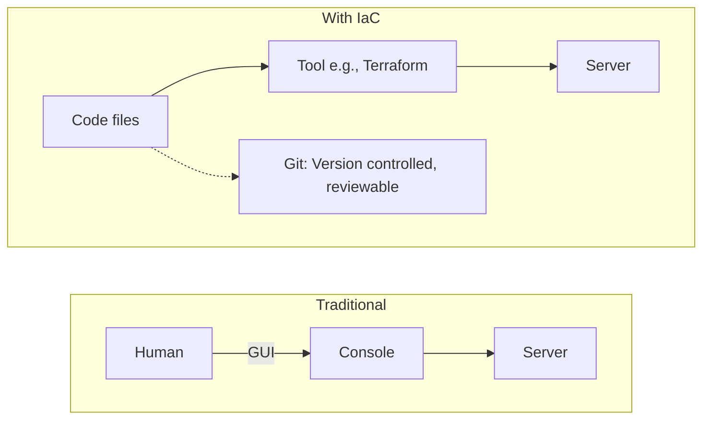
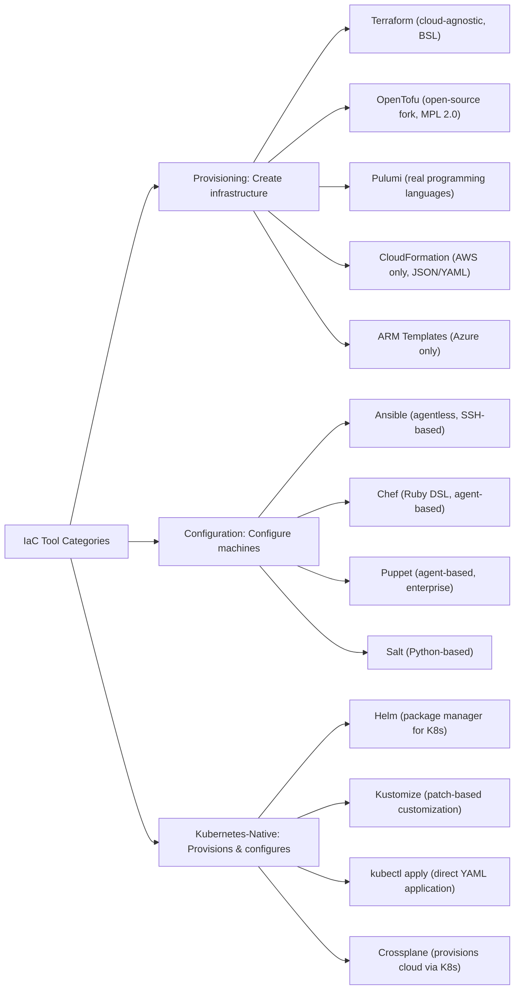
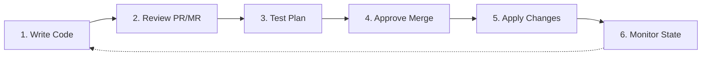

> **Складність**: `[СЕРЕДНЯ]` - Базова концепція.
>
> **Час на виконання**: 35-40 хвилин.
>
> **Передумови**: Базові навички роботи з командним рядком, основи Git та достатнє знання YAML для розуміння відступів.

---


## Що ви зможете зробити

Після цього модуля ви зможете:

- **Порівняти** декларативні та імперативні робочі процеси інфраструктури, включно з експлуатаційними наслідками кожного вибору.
- **Спроєктувати** структуру репозиторію Infrastructure as Code, яка розділяє середовища, але водночас повторно використовує спільні модулі.
- **Реалізувати** декларативну зміну Kubernetes за допомогою повноцінного `kubectl` CLI, а потім перевірити ідемпотентне узгодження.
- **Діагностувати** відхилення конфігурації, відстеживши, чи стан production виник із коду, ручної зміни чи запуску конвеєра.
- **Оцінити** Terraform, OpenTofu, Ansible, Pulumi та власні інструменти Kubernetes для розв'язання реальної проблеми підготовки або конфігурації.


## Чому це важливо

У 2012 році компанія Knight Capital Group втратила близько 460 мільйонів доларів приблизно за 45 хвилин після того, як нове програмне забезпечення для трейдингу потрапило лише на частину її виробничого парку. Інженер вручну розгорнув оновлення на 7 з 8 серверів, залишивши одну машину зі старою поведінкою, яка спрацювала в найгірший можливий спосіб. Компанію знищив не просто новий алгоритм; її знищив процес релізу, який дозволив нібито ідентичним серверам стати різними, хоча всі вважали їх однаковими.

Цей інцидент — сувора версія проблеми, з якою врешті-решт стикається кожна operations-команда. Під час збою змінюється тайм-аут бази даних, з хмарної консолі додається правило брандмауера, або ж пакунок встановлюється вручну на тій єдиній машині, де це здавалося терміновим на той момент. Ця зміна вирішує нагальну проблему, але водночас створює приховану гілку реальності, яку згодом не зможе пояснити жоден репозиторій, рев’ю чи автоматизоване перезбирання.

Інфраструктура як код (Infrastructure as Code, зазвичай скорочується як IaC) існує саме для того, щоб усунути цей розрив між намірами та реальністю. Замість того, щоб ставитися до серверів, мереж, кластерів і політик як до речей, які люди пам’ятають, як створювати, IaC розглядає їх як файли, які можна переглядати, тестувати, контролювати їхні версії та відтворювати. Kubernetes є важливим у цьому курсі, оскільки він побудований на тій самій ідеї: ви передаєте бажаний стан, а контролери продовжують працювати, доки фактичний стан не збігатиметься з ним.

> **Зупиніться та подумайте**: Якби ваше основне середовище зникло сьогодні, чи змогла б ваша команда відновити його з репозиторію, чи план відновлення залежав би від скриншотів, старих тикетів і чиєїсь пам'яті про те, який чекбокс вони клікнули минулого кварталу?

## Проблема, яку вирішує IaC: ClickOps та людська пам'ять

До того, як хмарні API, віртуальні машини та контролери Kubernetes стали нормою, робота з інфраструктурою часто означала, що людина виконує послідовність дій безпосередньо на машині. Ця людина могла бути обережною, досвідченою та мати добрі наміри, але система все одно залежала від пам'яті. Якщо для налаштування потрібні були пакунок, параметр ядра, правило брандмауера та відредагований вручну конфігураційний файл, то справжній опис інфраструктури жив частково в машині, а частково — у чиїйсь голові.

```text
Manual Process:
1. Order physical server (2-4 weeks)
2. Wait for data center to rack it (1 week)
3. SSH in and install packages
4. Configure by editing files
5. Hope you remember what you did
6. Pray nothing breaks

Documentation: "Ask Dave, he set it up"
```

Старий процес не був безглуздим для свого часу, оскільки команди мали менше примітивів автоматизації та повільніші інфраструктурні цикли. Проблема полягала в тому, що кожен ручний крок створював можливість для незадокументованих відхилень. Два вебсервери могли починатися з однакової інструкції зі встановлення, але один міг отримати новіше дзеркало пакунків, інші дозволи на файл або ж там забули виконати команду перезапуску. На архітектурній схемі машини виглядали ідентичними, але під навантаженням поводилися по-різному.

ClickOps — це сучасна версія того самого ризику. Хмарна консоль корисна для дослідження, а графічний інтерфейс може зробити незнайомі сервіси менш страшними, але дії в консолі не стають автоматично архітектурними рішеннями, які пройшли рев’ю колег. Підмережа, створена шляхом "проклікування" у майстрі налаштувань, може працювати сьогодні, проте команді все одно доведеться з'ясовувати, хто її створив, чому вона має саме такий CIDR-діапазон, чи відповідає їй staging-середовище та як її відтворити після регіонального збою.

Практична небезпека не в тому, що кожна ручна дія негайно ламає production. Практична небезпека полягає в тому, що ручні дії розривають ланцюжок доказів. Коли трапляється інцидент, черговому інженеру потрібно знати, що змінилося, в якій версії це сталося, яким мав бути очікуваний стан і чи безпечно робити відкат. Відредагована вручну система може відповісти на ці запитання лише в тому разі, якщо людина, яка її редагувала, залишила ідеальні записи, а production-системи не повинні покладатися на ідеальну людську пам'ять.

> **Зупиніться та подумайте**: Уявіть два production вебсервери, створені за одним і тим самим чеклістом. На одному під час інциденту вручну встановлюють патч OpenSSL, а на іншому — ні. Якого збою ви очікували б під час наступного оновлення сертифіката або перевірки працездатності балансувальника навантаження?

## Інфраструктура як код: Бажаний стан у системі контролю версій

Інфраструктура як код означає опис інфраструктури у файлах, які можна версіонувати, поширювати, перевіряти на рев'ю, виконувати та використовувати як єдине джерело істини для середовища. Точний формат файлу залежить від інструменту. Terraform та OpenTofu використовують HCL, Ansible зазвичай використовує YAML-плейбуки, Pulumi — мови програмування загального призначення, а Kubernetes переважно використовує маніфести у форматі YAML. Спільна ідея полягає в тому, що бажаний вигляд системи записується до того, як система зазнає змін.



Найважливіше зрушення полягає в тому, що файл стає важливішим за успішну одноразову дію. Якщо мережа створюється з Terraform-модуля, що пройшов рев'ю, команда може перевірити цей модуль, порівняти ревізії, відкрити pull request для внесення змін і відтворити таку саму мережу в іншому акаунті. Якщо Deployment створюється з маніфесту Kubernetes, команда може побачити, чому він має 3 репліки, який образ він має запускати, і чи відхилився робочий кластер від цього початкового наміру.

Це схоже на рецепт, але така аналогія працює лише до певної межі. Людський рецепт каже кухареві, що робити, і кухар повинен сам помітити, чи духовка вже гаряча, або ж чи є на сковорідці олія. Хороший інструмент IaC зчитує поточний стан, порівнює його з бажаним станом і розраховує найменший безпечний набір дій, необхідний для усунення розбіжності. Саме це порівняння робить IaC операційно відмінним від shell-скрипта, який сліпо повторює кроки.

Файл також створює соціальну межу. Зміни в інфраструктурі стають звичайними змінами в коді, а отже, вони можуть проходити через pull requests, коментарі на рев'ю, автоматизовані перевірки та погодження. Цей процес може здаватися повільнішим, ніж натискання кнопки в консолі, але він забезпечує команді спільний запис намірів. Наступному інженеру не потрібно питати, чи є поточне налаштування випадковим або навмисним, адже відповідь має бути видимою в історії.

## Декларативне, імперативне та ідемпотентне мислення

Перше поняття, яке слід розмежувати — це імперативний та декларативний підходи до роботи. Імперативна інструкція вказує системі, як виконати послідовність кроків. Декларативна інструкція вказує системі, яка кінцева умова має бути істинною. Обидва стилі можуть бути корисними, але інфраструктура зазвичай стає безпечнішою, коли стабільні ресурси описуються декларативно, а інструмент бере на себе відповідальність за зближення реальності з цим описом.

```text
Imperative (How):
"Install nginx, then edit /etc/nginx/nginx.conf,
then restart nginx"

Declarative (What):
"I want nginx running with this configuration"
```

Імперативні скрипти здаються привабливими, оскільки вони відтворюють те, як людина шукає та усуває несправності. Якщо nginx відсутній — встановіть його; якщо файл старий — замініть його; якщо сервіс зупинено — запустіть його. Слабке місце полягає в тому, що автор скрипта повинен передбачити кожен можливий початковий стан, включно з частковими збоями. Після додавання достатньої кількості умов скрипт перетворюється на крихкий локальний контролер, якому повністю довіряє лише один член команди.

Декларативні системи ставлять це порівняння станів у центр роботи інструмента. План Terraform порівнює конфігурацію зі збереженим станом і API провайдерів, а потім пропонує створення, оновлення та видалення. Модулі Ansible зазвичай пишуться так, щоб бути ідемпотентними, тому запит пакунка зі `state: present` не повинен призводити до його перевстановлення під час кожного запуску. Контролери Kubernetes безперервно порівнюють бажані об'єкти з фактичним станом кластера і продовжують узгодження після першого застосування.

```bash
# Running this 10 times creates 10 servers (BAD)
create_server web-1

# Running this 10 times ensures 1 server exists (GOOD)
ensure_server_exists web-1
```

Ідемпотентність — це властивість, яка робить повторні запуски безпечними. Якщо операція ідемпотентна, її повторне виконання матиме той самий кінцевий ефект, що й одноразовий запуск. Це не означає, що всередині нічого не відбувається, і не означає, що кожна зміна є нешкідливою. Це означає, що інструмент проєктується навколо кінцевого бажаного стану, а не навколо сліпого відтворення історії дій. Поєднання декларативних файлів та ідемпотентного узгодження — це те, що робить відхилення видимим, а не прихованим. Коли задекларований світ вимагає трьох реплік, а живий показує п'ять, декларативний інструмент розглядає цю невідповідність як проблему, яку потрібно вирішити або перевірити, тоді як імперативний скрипт, який лише завжди вказує "create three pods", може ніколи не помітити, що хтось вручну змінив масштаб між запусками.

Review-as-code — це соціальна винагорода за таку технічну модель. Pull request до Terraform-модуля або маніфесту Kubernetes показує рев'юерам очікуваний кінцевий стан, а не крихку послідовність shell-команд, побічні ефекти яких залежать від того, що вже існувало на момент запуску скрипта. Рев'юери можуть запитати, чи повинна security group відкривати порт 22, чи потрібно замінити базу даних, або чи відповідає кількість реплік плануванню потужностей, оскільки diff описує форму, а не хореографію дій. Ця модель рев'ю також покращує відтворюваність: той самий коміт, застосований до нового акаунта або порожнього простору імен, має привести до тієї ж архітектури. Саме так команди відбудовують staging після помилки або клонують production-шаблони в новий регіон без необхідності згадувати кроки з пам'яті.

> **Зупиніться та подумайте**: Якщо імперативний bash-скрипт створює користувача Linux, і конвеєр падає відразу після його створення, що станеться, коли конвеєр спробує виконати все спочатку? Що спробував би довести ідемпотентний інструмент налаштування перед внесенням чергової зміни?

Контроль версій довершує цю модель, оскільки він фіксує еволюцію намірів. Конфігураційний файл Terraform/OpenTofu або маніфест Kubernetes, що лежить на чиємусь ноутбуці — це краще, ніж пам'ять, але це все ще не командна система. Як тільки опис інфраструктури починає жити в Git, стають доступними звичайні інженерні інструменти: pull requests для рев'ю, історія комітів для аудиту, теги для релізів та diff'и для розслідування інцидентів.

```bash
git log --oneline infrastructure/
abc123 Add production database replica
def456 Increase web server count to 5
ghi789 Initial infrastructure setup

# "Who changed production?" - Just check git blame
```

Операційна обіцянка проста: якщо production змінився, команда має бути в змозі вказати на коміт, рев'ю, запуск пайплайну або виняткову екстрену зміну, яка до цього призвела. Коли ця обіцянка виконується, інфраструктуру стає легше аналізувати в стресових ситуаціях. Коли ж вона не виконується, команда повертається до детективної роботи по терміналах, повідомленнях у чатах та історії консолі.

Стан — це та частина цієї обіцянки, яку новачки часто недооцінюють. Інструмент не може порівняти бажану інфраструктуру з фактичною, якщо він не має способу ідентифікувати ресурси, якими володіє, та атрибути, які він спостерігав востаннє. Terraform та OpenTofu зазвичай зберігають ці знання у файлі стану або у віддаленому бекенді станів, Kubernetes приймає бажані об'єкти через API-сервер і зберігає їх в etcd, а такі інструменти конфігурації, як Ansible, часто виводять стан із цільової машини під час кожного запуску. Реалізація відрізняється, але операційне питання залишається тим самим: як інструмент розуміє, чи варто йому щось створити, оновити, не чіпати чи видалити?

Файл стану у стилі Terraform — це не друга копія вашої конфігурації. Це пам'ять інструмента про реальність: ідентифікатори хмарних ресурсів, зв'язки залежностей, атрибути, що повертаються API провайдерів, а іноді й конфіденційні значення, які провайдери повертають під час створення. Конфігураційні файли описують намір; стан фіксує те, що, на думку інструмента, вже існує, аби під час наступного виконання plan можна було обчислити різницю, а не вгадувати з нуля. Без такого зіставлення команда `terraform apply` не знала б, що `aws_instance.web` у вашому HCL відповідає `i-0abc123` в AWS, і зміна аргументу, яка виглядає цілком нешкідливою, могла б випадково створити дублікат ресурсу замість того, щоб оновити оригінал.

Ця пам'ять створює реальні операційні ризики, якщо ставитися до неї недбало. Два інженери, які виконують `apply` з тим самим локальним файлом стану, можуть пошкодити його або роздвоїти реальність. Саме тому для production команди використовують віддалені бекенди з блокуванням, щоб одночасно відбувалася лише одна мутація. Файли стану також можуть містити секрети, такі як згенеровані паролі або закриті ключі, повернуті провайдерами, тому їхнє місце — у зашифрованому сховищі зі строгим контролем доступу, а не як вкладення у загальному чаті чи в незашифрованому бакеті об'єктів. Втрата стану є окремим видом збою: ресурси можуть усе ще існувати в хмарі, хоча інструмент більше не знає, що керує ними, і шлях відновлення зазвичай вимагає операцій імпорту або ретельної археології, а не просто повторного застосування. Відхилення стану — це споріднене, але інше явище: файл стверджує одне, хмарна консоль показує інше через те, що хтось відредагував production вручну, і наступний план виявляє цю розбіжність як проблему, яку команда має свідомо вирішити.

Саме тому до IaC не варто ставитися як до простої колекції розумних текстових файлів. Файли, стан, API провайдерів, облікові дані та дозволи пайплайну утворюють єдину систему. Якщо файли проходять рев'ю, але стан доступний для запису з ноутбука, робочий процес усе ще має слабке місце. Якщо стан заблоковано, але хмарна консоль залишається відкритою для рутинного редагування production, інструмент і надалі стикатиметься із сюрпризами. Зрілий дизайн IaC охоплює як сам код, так і площину керування навколо нього.


## Ландшафт інструментів IaC

IaC — це не один інструмент, і невдалий вибір може створити новий тип складності. Деякі інструменти найкраще підходять для надання інфраструктури, що існує поза межами машини, як-от VPC, підмережі, бази даних, бакети та балансувальники навантаження (load balancers). Деякі інструменти є найсильнішими у конфігурації операційних систем після того, як машини вже створено. Інструменти, нативні для Kubernetes, керують об'єктами кластера, пакують застосунки Kubernetes або використовують сам Kubernetes як площину управління (control plane) для зовнішньої інфраструктури.

Для команд Kubernetes у цьому модулі надалі в прикладах використовується повна назва бінарного файлу `kubectl`, щоб кожен блок можна було скопіювати в неінтерактивну оболонку, завдання CI або нотатку для діагностики несправностей без залежності від локальної конфігурації оболонки. Багато операторів скорочують `kubectl` під час інтерактивної роботи, але спільна навчальна програма та інструкції з експлуатації (runbooks) повинні віддавати перевагу явній команді, оскільки це зменшує кількість прихованих припущень, зберігаючи при цьому фокус уроку на декларативних файлах, змінах, які можна переглянути, та узгодженні (reconciliation).



Terraform став типовою ментальною моделлю для надання хмарних ресурсів, оскільки він запропонував зрозумілу декларативну мову, екосистему провайдерів та робочий процес plan/apply на багатьох платформах. У 2023 році компанія HashiCorp перевела Terraform на Business Source License, і спільнота створила OpenTofu як форк під ліцензією MPL 2.0, призначений для збереження відкритого шляху (open-source) для сумісних робочих процесів. На практиці багато команд оцінюють як Terraform, так і OpenTofu через одну й ту саму архітектурну призму: підтримка провайдерів, обробка стану, якість модулів та вимоги до управління (governance).

```hcl
# main.tf - Terraform configuration

# Define provider (where to create resources)
provider "aws" {
  region = "us-west-2"
}

# Define a resource
resource "aws_instance" "web" {
  ami           = "ami-0c55b159cbfafe1f0"
  instance_type = "t2.micro"

  tags = {
    Name = "web-server"
    Environment = "production"
  }
}

# Define output
output "public_ip" {
  value = aws_instance.web.public_ip
}
```

Робочий процес у стилі Terraform є важливим, оскільки він відділяє попередній перегляд від мутації. `init` завантажує провайдери та готує робочий каталог, `plan` показує запропоновану різницю, `apply` змінює середовище, а `destroy` видаляє керовані ресурси. Такий робочий процес дає рецензентам щось конкретне для обговорення до того, як конвеєр (pipeline) внесе зміни в production, але він також створює нову відповідальність: файл стану (state file) потрібно захищати, блокувати, створювати для нього резервні копії та ставитися до нього як до конфіденційних операційних даних.

Управління станом заслуговує на таку обережність, оскільки стан може містити ідентифікатори ресурсів, атрибути, зв'язки залежностей, а іноді й конфіденційні значення, повернуті провайдерами. Локальний файл стану на ноутбуці одного інженера може бути прийнятним для одноразового експерименту, але він є неприйнятним для спільної інфраструктури production. Команди зазвичай переносять стан у віддалений бекенд із блокуванням (locking), щоб два виконання `apply` не могли конфліктувати між собою у стані гонитви (race condition). Вони також обмежують доступ, оскільки стан часто розкриває більше інформації про середовище, ніж вихідні файли.

```bash
# Terraform workflow
terraform init      # Download providers
terraform plan      # Preview changes
terraform apply     # Create infrastructure
terraform destroy   # Tear it all down
```

Цикл plan/apply є операційним серцем IaC у стилі Terraform, і він відображає патерн узгодження (reconciliation), який ви знову побачите в Kubernetes, а пізніше в контролерах GitOps. `plan` читає конфігурацію, читає стан, надсилає запити до API провайдерів і створює зрозумілу для людини дельту: створити цю підмережу, оновити цей тег, замінити цю базу даних через те, що змінилося незмінне поле. Під час виконання `plan` жодних змін у віддаленій інфраструктурі не відбувається; Terraform все одно читає віддалені об'єкти та оновлює/синхронізує інформацію про стан, перш ніж пропонувати дії, і саме тому plan має бути в pull requests та завданнях CI до того, як хтось схвалить роботу в production. `apply` виконує цю дельту, а потім записує нову спостережувану реальність назад у стан, щоб наступний plan починався з точної базової лінії. Цей цикл є навмисно нудним, коли все працює нормально: plan не показує жодних змін, apply підтверджує збіг (convergence), і команда впевнена, що жива інфраструктура все ще відповідає переглянутому наміру.

Kubernetes використовує ту саму ідею узгодження до бажаного стану (reconcile-to-desired-state), але з іншими механізмами. Коли ви запускаєте `kubectl apply -f deployment.yaml`, ви не віддаєте одноразову імперативну команду; ви оголошуєте об'єкт на сервері API, і контролери, такі як контролер Deployment, постійно порівнюють бажану специфікацію (spec) зі спостережуваним статусом (status), доки вони не збігатимуться. Інструмент GitOps, такий як Argo CD або Flux, розширює цей патерн на один крок назовні: Git зберігає бажані маніфести, контролер всередині кластера стежить за Git, порівнює живі об'єкти API з бажаним джерелом і узгоджує ресурси, необхідні для того, щоб повернути кластер до стану синхронізації. Модуль 1.2 детально розглядає цей шар, керований через Git; наразі зверніть увагу, що plan-before-apply у Terraform та commit-before-sync у GitOps є відповідями на одне й те саме запитання — як нам попередньо переглянути намір перед тим, як вносити зміни у спільний production?

Під цими робочими процесами ховаються архітектурні компроміси, які часто мають більше значення, ніж вибір бренду. Незмінна інфраструктура (immutable infrastructure) розглядає сервери, вузли або образи як одноразові: коли конфігурація змінюється, ви збираєте новий артефакт і замінюєте старий екземпляр, замість того щоб оновлювати його на місці. Змінна інфраструктура (mutable infrastructure) зберігає машини, що довго працюють, і застосовує поступові оновлення через SSH, менеджери пакетів або управління конфігурацією. Незмінні патерни зменшують дрейф конфігурації («snowflake drift»), оскільки кожна заміна починається з відомого образу, але вони вимагають надійного дизайну розгортання, перевірок працездатності (health-check) та відкочування (rollback). Змінні патерни можуть бути швидшими для невеликих команд зі скромними розмірами парку серверів, проте вони накопичують налаштовані вручну відмінності, які стає дорого відтворювати після інциденту.

Push та pull описують, де саме перебувають повноваження на розгортання. У моделі push зовнішня система, така як конвеєр CI, зберігає облікові дані, які можуть вносити зміни до кластера або хмарного акаунта, і застосовує зміни під час виконання завдання. У моделі pull агент усередині середовища стежить за надійним джерелом, таким як Git, і узгоджує (reconciles) локально, що звужує доступ до зовнішніх облікових даних. Конвеєри Terraform/OpenTofu зазвичай орієнтовані на push на межі хмарного API, тоді як контролери GitOps орієнтовані на pull на межі Kubernetes; багато реальних платформ цілеспрямовано поєднують і те, й інше. Композиція через модулі, чарти Helm, бази Kustomize або пакети Pulumi — це спосіб, яким команди повторно використовують ці патерни без копіювання і вставки цілих середовищ: спільна логіка існує в одному місці, і кожне середовище надає лише ті значення, які повинні відрізнятися.

| Характеристика | Terraform / OpenTofu | CloudFormation |
|---------|----------------------|----------------|
| Підтримка хмар | Будь-яка хмара | Лише AWS |
| Управління станом | Вбудоване (наприклад, HCP Terraform, S3) | Кероване AWS |
| Синтаксис | HCL 2 (зрозумілий) | JSON/YAML (багатослівний) |
| Крива навчання | Помірна | Специфічна для AWS |
| Спільнота | Величезна екосистема | Обмежена AWS |

Ansible вирішує іншу проблему. Якщо Terraform створює віртуальну машину, групу безпеки та балансувальник навантаження, Ansible може налаштувати пакети, шаблони, користувачів, сервіси та файли застосунків на машині. За замовчуванням він є безагентним (agentless), що означає, що він може працювати через SSH без встановлення демона, який довго виконується на кожному хості. Це робить його доступним для розуміння, але це також означає, що точність інвентаризації, доступ по SSH, підвищення привілеїв та ідемпотентність плейбуків — усе це стає частиною історії надійності.

Межа між наданням (provisioning) та конфігурацією не завжди є чіткою, і саме тут має значення проектне рішення. Terraform може запускати провіжнери, а Ansible може створювати хмарні ресурси за допомогою модулів, але використання інструменту поза межами його сильних сторін може ускладнити проведення перевірок (reviews). Хорошим підходом за замовчуванням є дозволити інструментам надання ресурсів володіти довготривалими зовнішніми ресурсами, а інструментам конфігурації — володіти тим, що відбувається всередині машин. Коли є перекриття, вибирайте той інструмент, чий plan, модель стану (state model) та поведінку в разі збою команда зможе пояснити під час інциденту.

```yaml
# playbook.yml - Ansible playbook
---
- name: Configure web server
  hosts: webservers
  become: yes  # Run as root

  tasks:
    - name: Install nginx
      apt:
        name: nginx
        state: present
        update_cache: yes

    - name: Copy configuration
      template:
        src: nginx.conf.j2
        dest: /etc/nginx/nginx.conf
      notify: Restart nginx

    - name: Ensure nginx is running
      service:
        name: nginx
        state: started
        enabled: yes

  handlers:
    - name: Restart nginx
      service:
        name: nginx
        state: restarted
```

```bash
# Run the playbook
ansible-playbook -i inventory.ini playbook.yml
```

Pulumi йде іншим шляхом, дозволяючи командам визначати інфраструктуру за допомогою таких мов, як TypeScript, Python, Go, Java та .NET. Це може бути потужним підходом, коли визначення інфраструктури потребують циклів, бібліотек для багаторазового використання, тестів та знайомих мовних інструментів. Компроміс полягає в тому, що звичайні абстракції програмування можуть приховувати графи ресурсів, якщо команди не є дисциплінованими, і рецензентам може знадобитися розуміти як хмарну модель, так і стиль мови застосунку.

Жоден інструмент не позбавляє від необхідності приймати проектні рішення. Організація, що використовує єдиного хмарного провайдера, може погодитися на шаблони CloudFormation або Azure Resource Manager, оскільки нативна інтеграція варта прив'язки до платформи (platform lock-in). Команда платформи, яка створює інфраструктуру самообслуговування (self-service infrastructure), може вибрати Crossplane, оскільки вона хоче, щоб користувацькі ресурси (custom resources) Kubernetes представляли хмарні сервіси. Невелика команда може почати зі звичайного YAML для Kubernetes і Kustomize, перш ніж впроваджувати Helm або контролер GitOps. Правильна відповідь залежить від життєвого циклу ресурсу, навичок команди та типу збою (failure mode), який команді найбільше потрібно контролювати.

Вибір інструменту також впливає на те, хто може безпечно вносити свій внесок. Центральна команда платформи може комфортно працювати зі складною модульною системою, оскільки невелика група перевіряє кожну зміну інфраструктури. Продуктовій команді, яка володіє власним сервісом, можуть знадобитися простіші маніфести та механізми захисту (guardrails), оскільки багато розробників будуть працювати з цими файлами. Найкраще налаштування IaC — це не те, що має найбільше функцій; це те налаштування, яке дозволяє правильним людям вносити правильні зміни з достатнім контекстом для перевірки, щоб уникнути випадкового пошкодження.

Ліцензування та стабільність екосистеми є частиною оцінки, а не дрібницями. Зміна ліцензії Terraform підштовхнула деякі організації переглянути, чи вимагає їхня модель управління (governance model) використання OpenTofu, тоді як інші залишилися з Terraform, оскільки їхня підтримка від вендора, модулі або керований робочий процес вже підходили. Таке рішення має бути явним. Інфраструктурний код, як правило, живе роками, тому команда повинна розуміти шляхи оновлення, сумісність провайдерів і те, що станеться, якщо вендор змінить умови або припинить підтримку сервісу (deprecates a service).

Один із практичних способів порівняти інструменти — запитати, що повинен вивчити новий член команди, перш ніж безпечно внести зміну в один рядок. Якщо йому потрібно розуміти стан провайдера, хмарні квоти, дозволи IAM і поведінку під час заміни ресурсів, то зміна повинна проходити через ретельний процес перевірки (review workflow). Якщо ж йому потрібно зрозуміти значення застосунку в ConfigMap, робочий процес може бути легшим, але все одно має підлягати перевірці. IaC не означає, що кожна зміна супроводжується однаковими процедурами (ceremony); це означає, що процедури відповідають ризику.

> **Який підхід ви б обрали тут і чому?** Вашій команді потрібно створювати хмарні мережі, керовані бази даних та простори імен Kubernetes для кожного нового клієнтського середовища. Ви б зберігали все це в одному проєкті Terraform/OpenTofu, розділили б об'єкти кластера на нативні для Kubernetes маніфести чи надали б прикладним командам API на базі Crossplane?


## Kubernetes як Infrastructure as Code

Kubernetes — це не просто місце, куди інструменти IaC розгортають застосунки; Kubernetes сам по собі є системою IaC. Ви надсилаєте об'єкти до сервера API, а контролери узгоджують бажаний стан із фактичним. Deployment не просто запускає Pod'и один раз. Він оголошує стратегію розгортання, кількість реплік, селектор і шаблон Pod'а, після чого контролер Deployment та контролер ReplicaSet продовжують працювати, щоб підтримувати цей стан.

У решті цього модуля використовуйте повну команду `kubectl`, щоб приклади залишалися придатними для виконання у скриптах, терміналах та завданнях CI без залежності від інтерактивних псевдонімів (alias) оболонки. Цільовою версією курсу є Kubernetes 1.35+, але базовий декларативний робочий процес, показаний тут, є стабільним для всіх сучасних кластерів. Важлива звичка — зберігати маніфести у файлах і використовувати `kubectl apply` для бажаного стану, замість того, щоб покладатися на одноразові імперативні команди, які зникають з історії переглядів.

```bash
kubectl version --client
```

```bash
# Write desired state, then apply it
cat <<'EOF' > deployment.yaml
apiVersion: apps/v1
kind: Deployment
metadata:
  name: web
spec:
  replicas: 3
  selector:
    matchLabels:
      app: web
  template:
    metadata:
      labels:
        app: web
    spec:
      containers:
      - name: nginx
        image: nginx:1.27
EOF

kubectl apply -f deployment.yaml

# Kubernetes reconciles actual state to match desired state
# This is IaC in action.
```

Зверніть увагу на те, чого маніфест не говорить. Він не вказує Kubernetes, на якому вузлі повинен працювати кожен Pod, яке саме ім'я ReplicaSet потрібно створити, або яка внутрішня послідовність оновлень API має відбутися першою. Він констатує, що бажаний світ містить Deployment з іменем `web` із 3 репліками `nginx:1.27`, а Kubernetes обчислює роботу, необхідну для того, щоб кластер відповідав цьому стану. Цей поділ є тією ж причиною, чому корисні плани Terraform: автор оголошує результати, а площина управління (control plane) визначає кроки. Коли ви згодом впровадите GitOps, коміт у Git стане перевіреною декларацією, контролер стане узгоджувачем (reconciler), а виявлення відхилень (drift) стане порівнянням між Git та API, а не між командою на ноутбуці та пам'яттю.

Ця відмінність стає корисною під час збоїв. Якщо вузол виходить з ладу, бажаний стан усе ще каже, що має існувати 3 репліки, тому Kubernetes планує запуск Pod'ів на заміну. Якщо хтось видаляє Pod вручну, контролер створює інший, оскільки Deployment усе ще цього вимагає. Якщо ви знову застосуєте той самий маніфест, Kubernetes побачить, що бажаний і фактичний стани вже збігаються, тому команда стає безпечним підтвердженням, а не дублюванням розгортання. Гіпотетичний сценарій: команда масштабує Deployment за допомогою `kubectl scale` під час інциденту, але так і не оновлює маніфест у Git; кластер тимчасово відповідає операційній потребі, проте репозиторій усе ще оголошує стару кількість реплік. Наступна синхронізація GitOps або повторне `kubectl apply` з файлу призведе до зворотного масштабування (scale down), якщо команда не перенесе екстрену зміну в код (backport), що є саме тією дисципліною контролю відхилень (drift), на якій постійно наголошує цей модуль.

Kubernetes усе ще можна використовувати без підходу IaC. Команди на кшталт `kubectl run`, `kubectl edit` та прямі зміни через консоль можуть бути доречними для навчання або екстреної діагностики, але вони небезпечні як звичайний шлях до продакшену. Об'єкт може існувати в кластері, але репозиторій його не пояснює. Зрілий робочий процес полягає в тому, щоб перетворювати знахідки на маніфести, проводити їх рев'ю та дозволяти автоматизації послідовно їх застосовувати.

Існує ще одна специфічна для Kubernetes причина віддавати перевагу файлам: багато об'єктів взаємодіють через мітки (labels) та селектори (selectors). Service знаходить Pod'и за допомогою міток, Deployment керує Pod'ами через селектори, і NetworkPolicies часто також залежать від міток. Коли ці взаємозв'язки зберігаються в окремих введених вручну командах, легко створити ресурс, який виглядає дійсним, але ні з чим не з'єднується. Зберігання об'єктів разом у коді дозволяє тим, хто проводить рев'ю, побачити взаємозв'язки ще до того, як кластеру доведеться виявити помилку.

Kubernetes також навчає різниці між задекларованим об'єктом та згенерованими деталями часу виконання (runtime). Deployment створює ReplicaSets, ReplicaSets створюють Pod'и, а Pod'и отримують імена, IP-адреси, призначення на вузли та поля статусу, які зазвичай не слід вшивати жорстко (hardcode). Початківці іноді копіюють "живий" об'єкт із кластера та комітять кожне поле, включно зі статусом і згенерованими метаданими. Більш чистий маніфест IaC містить лише ті поля, якими володіє команда, і залишає поля часу виконання площині управління, що зменшує кількість шумних різниць (diffs) та випадкових конфліктів.

## Структура репозиторію, середовища та контроль відхилень

Корисний репозиторій IaC — це більше, ніж звалище для YAML та HCL. Він має допомагати читачам швидко відповідати на три запитання: які ресурси існують, до якого середовища вони належать та які спільні компоненти вони перевикористовують. Якщо структура ускладнює пошук відповідей на ці запитання, інженери будуть копіювати файли, напряму вносити виправлення в продакшен (patch) або винаходити локальні домовленості, оскільки офіційна структура здається повільнішою за консоль.

```text
infrastructure/
├── terraform/
│   ├── main.tf
│   ├── variables.tf
│   └── outputs.tf
├── kubernetes/
│   ├── deployments/
│   └── services/
└── ansible/
    └── playbooks/
```

Перше базове правило просте: усе, що визначає інфраструктуру, має бути в Git, якщо немає навмисного винятку з чітким власником. Це включає хмарні ресурси, маніфести Kubernetes, конфігурацію машин, визначення політик і скрипти, які склеюють кроки розгортання разом. Секрети не слід комітити у вигляді відкритого тексту (plaintext), але посилання на менеджер секретів, ім'я секрету або механізм запечатаних секретів (sealed secret) усе одно має бути представлене в коді.

Модулі, придатні для повторного використання, вирішують наступну проблему — дублювання, замасковане під зрозумілість. Якщо кожне середовище має повну копію визначення кожного ресурсу, staging і продакшен з часом випадковим чином розійдуться. Кращий патерн полягає в тому, щоб зберігати спільну поведінку в модулях або базах (bases), а потім дозволяти кожному середовищу надавати значення, які дійсно відрізняються, як-от розмір, кількість реплік, регіон або прапорці функцій (feature flags). Композиція перевершує копіпаст, оскільки виправлення помилки або зміна для посилення безпеки поширюється через спільний модуль, замість того, щоб вимагати від інженера пам'ятати про три майже ідентичні папки. Компромісом є вартість абстракції: модуль, який приховує занадто багато, стає важче перевіряти, тому хороший дизайн модуля відкриває вхідні дані (inputs), які фактично змінюють ризик — розмір інстансу, ступінь відкритості (exposure), шифрування, термін зберігання резервних копій, — залишаючи шаблонний код (boilerplate) невидимим.

```hcl
# Don't repeat yourself
module "web_server" {
  source = "./modules/ec2-instance"

  name          = "web-1"
  instance_type = "t2.micro"
}

module "api_server" {
  source = "./modules/ec2-instance"

  name          = "api-1"
  instance_type = "t2.small"
}
```

```text
environments/
├── dev/
│   └── main.tf      # Small instances, single replica
├── staging/
│   └── main.tf      # Medium instances, testing
└── prod/
    └── main.tf      # Large instances, high availability
```

Розділення середовищ має захищати продакшен, не роблячи нижчі середовища безглуздими. Development (середовище розробки) може бути меншим і дешевшим, але воно все одно має використовувати ті самі шляхи модулів і ті самі припущення щодо політик. Staging (проміжне середовище) має бути достатньо близьким до продакшену, щоб план або розгортання могли виявити помилки до того, як їх відчують клієнти. Продакшен має відрізнятися лише там, де бізнесу явно потрібні більший масштаб, довговічність (durability), ізоляція або схвалення.

Саме тут структура репозиторію стає інструментом організаційного дизайну. Якщо команда сховищ володіє модулями баз даних, а команда застосунків володіє маніфестами Kubernetes, структура папок повинна робити це володіння видимим. Якщо кожна команда сервісу може змінювати спільну мережеву політику, процес рев'ю має компенсувати це за допомогою CODEOWNERS, перевірок політик або API платформи, який звужує те, що можна змінити. Файли IaC легше перевіряти, коли репозиторій відображає реальну відповідальність, а не ховає володіння за одним спільним каталогом.

Іменування також має більше значення, ніж здається на перший погляд. Імена ресурсів, імена модулів, імена робочих просторів (workspaces) та імена середовищ стають словником, який інженери використовують під час інцидентів. Таке ім'я, як `prod-eu-payments-db`, несе більше операційного контексту, ніж `database-1`, а модуль під назвою `regional_private_cluster` говорить тим, хто проводить рев'ю, більше, ніж `main`. Зрозумілі імена не замінюють документацію, але вони зменшують обсяг інтерпретації, потрібний, коли хтось читає план під тиском.

> **Зупиніться та подумайте**: Якщо dev, staging і prod містять скопійовані інфраструктурні файли замість спільних модулів, які відмінності будуть навмисними через шість місяців, а які відмінності існуватимуть лише тому, що хтось виправив одне середовище і забув про інші?

Контроль відхилень (drift control) — це дисципліна підтримки реального середовища в узгодженості з репозиторієм. Відхилення може виникнути через екстрений доступ до оболонки, редагування в консолі, збої конвеєрів (pipelines), імпортовані застарілі ресурси, значення за замовчуванням провайдера або через контролери, які мутують об'єкти після створення. Правильна реакція полягає не в тому, щоб удавати, ніби відхилень ніколи не буває. Правильна реакція — виявити його, вирішити, чи має зміна в реальному світі стати кодом, а потім повернути систему під контроль, який піддається рев'ю.

```text
Golden Rule: If it's not in code, it doesn't exist.

Manual changes = configuration drift = bugs at 3 AM
```

Під час інцидентів бувають винятки. Якщо ручна зміна — це найшвидший спосіб зупинити шкоду для клієнтів, сильна команда може дозволити її в рамках екстреної процедури. Важливо те, що відбувається далі: виправлення має бути перенесене назад (backported) у репозиторій IaC, пройти рев'ю та бути застосованим через звичайний шлях. Інакше наступний запуск конвеєра може стерти екстрене виправлення, оскільки код усе ще описує старий зламаний стан.

Імпортування наявної інфраструктури — це пов'язана проблема міграції. Більшість організацій не починають із чистого репозиторію та порожнього хмарного акаунта; вони вже мають ресурси, створені скриптами, консолями та роками локальних звичок. Переведення цих ресурсів під IaC зазвичай вимагає імпортування їх у стан (state), написання конфігурації, яка відповідає реальності, а потім внесення невеликих перевірених змін, щоб довести, що інструмент може безпечно ними керувати. Перша мета — не елегантність. Перша мета — уникнути руйнування чогось цінного, поки ви створюєте надійне джерело істини.

## Робочий процес рев'ю та застосування

Робочий процес IaC має робити небезпечні зміни видимими ще до того, як вони відбудуться. Точний конвеєр відрізняється між командами, але його форма зазвичай однакова: написати код, провести його рев'ю, протестувати або попередньо переглянути його, схвалити його, застосувати та моніторити результат. Ця послідовність перетворює зміни в інфраструктурі на інженерний процес замість приватної сесії у хмарній консолі.



Крок рев'ю не є бюрократією, коли план має сенс. Той, хто проводить рев'ю (reviewer), може помітити, що базу даних буде замінено, а не змінено, що група безпеки відкриває більше портів, ніж передбачалося, або що зміна селектора Kubernetes залишить старі Pod'и "сиротами" (orphan). Вивід плану (plan output) є контрактом між кодом і середовищем, тому його схвалення без прочитання — це майже те саме, що клацати наосліп у консолі.

Корисне рев'ю пояснює як наміри, так і механіку. У pull request має бути зазначено, чому зміна потрібна, який ризик вона вносить, як працюватиме відкат (rollback) і яке середовище отримає її першим. Крихітне мережеве правило може бути небезпечнішим за великий рефакторинг, якщо воно відкриває доступ до приватного сервісу. Невелика зміна селектора Kubernetes може спричинити більший ризик простою, ніж збільшення кількості реплік. Якість рев'ю походить від розуміння радіуса ураження (blast radius), а не від підрахунку рядків.

Тестування IaC відрізняється від тестування коду застосунків, але воно все одно можливе. Команди можуть здійснювати лінтинг синтаксису, валідувати схеми, запускати перевірки політик, генерувати плани, тестувати модулі за допомогою тимчасових середовищ і використовувати контроль допуску (admission control) для об'єктів Kubernetes. Мета полягає не в тому, щоб довести абсолютну безпеку всього. Мета — виловити ті помилки, які може зловити автоматизація, перш ніж людині, яка проводить рев'ю, доведеться міркувати про них під тиском часу.

Моніторинг замикає цикл після застосування (apply). Успішна команда доводить лише те, що інструмент прийняв зміну, а не те, що сервіс після цього поводився добре. Для хмарних ресурсів це може означати перевірку станів працездатності (health checks), таблиць маршрутизації, метрик та журналів доступу. Для Kubernetes це означає перевірку розгортань (rollouts), подій, готовності (readiness) та сигналів застосунків. IaC дає вам контрольований спосіб змінити систему, але операційна діяльність усе ще вимагає спостереження за наслідками.

Відкат (rollback) слід спроєктувати ще до першого застосування в продакшені. Іноді відкат — це скасування в Git (Git revert), за яким іде ще одне застосування, але цього не завжди достатньо. Міграція бази даних, ротація сертифікатів або заміна підмережі може вимагати виправлення "вперед" (forward fix), ручної контрольної точки або поетапного переходу. IaC робить бажану конфігурацію видимою, проте він не може магічним чином зробити кожну зміну інфраструктури оборотною. Старші інженери (Senior engineers) ставляться до оборотності як до проєктного обмеження (design constraint), а не як до заспокійливого припущення.

Дозволи конвеєра (pipeline permissions) повинні дотримуватися того самого принципу найменших привілеїв, що й облікові дані застосунків. Завданню планування (plan job) може знадобитися доступ на читання до провайдерів і стану, тоді як завданню застосування (apply job) потрібен доступ на запис, і воно має запускатися лише після схвалення. Облікові дані для продакшену не повинні бути доступними довільному коду pull request'а з ненадійних гілок. Якщо конвеєр IaC може мутувати продакшен, то сам конвеєр є виробничою інфраструктурою і заслуговує на таке саме рев'ю, логування та контроль доступу, як і системи, які він змінює.


## Патерни та антипатерни

Хороші патерни IaC мають спільну рису: завдяки їм очікуваний стан легше перевірити, ніж випадковий. Це означає, що модулі повинні приховувати повторення, не приховуючи ризиків, конвеєри (pipelines) повинні показувати попередній перегляд змін перед їх застосуванням, а екстрені процедури повинні повертати знайдені рішення назад у код. Ці патерни існують не для того, щоб уповільнити кожен робочий процес; вони потрібні для того, щоб зробити важливі інфраструктурні зміни зрозумілими, коли команда втомлена.

| Патерн | Коли використовувати | Чому це працює | Що врахувати при масштабуванні |
|---------|----------------|--------------|-----------------------|
| Plan перед apply | Будь-яка зміна спільної або production інфраструктури | Рецензенти бачать дельту ресурсів перед мутацією | Зберігайте артефакти plan для аудиту, коли затвердження має значення |
| Спільні модулі зі змінними середовища | Кілька середовищ, які мають залишатися схожими | Спільна поведінка змінюється один раз, тоді як середовища зберігають явні відмінності | Версіонуйте модулі, щоб production приймав зміни усвідомлено |
| Маніфести Kubernetes у Git | Workloads, Services, ConfigMaps, policies та простори імен | Стан кластера можна відновити та перевірити з файлів | Додавайте валідацію схем і admission policy зі зростанням команд |
| Запуски виявлення дрейфу (drift detection) | Середовища, де ручний доступ або типові налаштування провайдера можуть змінити стан | Команда дізнається, коли реальність відхиляється від коду | Вирішіть, хто обробляє дрейф і наскільки терміновим є кожен клас |

Антипатерни зазвичай починаються як обхідні шляхи (shortcuts), що виглядають розумно самі по собі. Редагування в консолі економить кілька хвилин, скопійований модуль дозволяє уникнути вивчення змінних, а shell-скрипт здається швидшим за написання декларативної конфігурації. Ціна стає очевидною пізніше, коли команда не може визначити, який стан є реальним, які відмінності є навмисними, а які зміни будуть стерті наступним пайплайном.

| Антипатерн | Що йде не так | Краща альтернатива |
|--------------|-----------------|-------------------|
| ClickOps як звичайний шлях для production | Зміни оминають рев’ю, історію та повторюваність | Використовуйте консоль лише для дослідження, а потім комітьте результат як код |
| Один гігантський кореневий модуль | Кожна зміна створює ризик для непов'язаних ресурсів і сповільнює рев’ю | Розділяйте за життєвим циклом, відповідальністю та радіусом ураження (blast radius) |
| Секрети у файлах IaC | Репозиторії та файли стану (state) стають інцидентами безпеки | Натомість посилайтеся на secret manager або механізм sealed secret |
| Ігнорування згенерованих plan | Деструктивні заміни затверджуються без розуміння | Вимагайте від рецензентів перевіряти дії create, update, replace та delete |
| Скопійовані середовища | Dev, staging та prod дрейфують через забуті правки | Використовуйте спільні модулі або бази та передавайте явні значення середовища |

## Фреймворк прийняття рішень

Обираючи підхід до IaC, відштовхуйтеся від життєвого циклу ресурсу, а не від популярності інструменту. Керована база даних, Kubernetes Deployment і пакет операційної системи поводяться по-різному. Найкращий інструмент — це той, який може чітко змоделювати ресурс, безпечно виявити зміни та вписатися у процес рев’ю і відновлення, прийнятий у команді.

```text
+-----------------------------+
| What are you managing?      |
+-------------+---------------+
              |
              v
+-------------+---------------+
| Cloud resources outside K8s?|
+------+------+---------------+
       | Yes                  | No
       v                      v
+------+-------------+  +-----+----------------+
| Terraform/OpenTofu |  | Kubernetes objects?  |
| or native templates|  +-----+----------------+
+------+-------------+        | Yes
       |                      v
       |              +-------+----------------+
       |              | YAML, Kustomize, Helm, |
       |              | GitOps, or Crossplane  |
       |              +-------+----------------+
       v                      |
+------+-------------+        v
| Need OS packages   |  +-----+----------------+
| and machine config?|  | Need app-language    |
+------+-------------+  | abstractions?        |
       | Yes            +-----+----------------+
       v                      | Yes
+------+-------------+        v
| Ansible or another |  +-----+----------------+
| config tool        |  | Pulumi may fit       |
+--------------------+  +----------------------+
```

| Ситуація | Надійний стандарт | Чому | На що звернути увагу |
|-----------|----------------|-----|---------------|
| Мультихмарне розгортання | Terraform або OpenTofu | Екосистема провайдерів та робочий процес plan/apply | Блокування стану (state locking), управління модулями, оновлення провайдерів |
| Інфраструктура лише в AWS | CloudFormation або Terraform/OpenTofu | Нативна інтеграція з AWS або ширша екосистема | Портативність порівняно з покриттям нативних сервісів |
| Налаштування пакетів та сервісів на віртуальних машинах | Ansible | Конфігурація через SSH без агентів та читабельні плейбуки (playbooks) | Дрейф інвентаря (inventory drift) та неідемпотентні shell-задачі |
| Робочі навантаження (workloads) у Kubernetes | YAML з Kustomize, Helm або GitOps | Kubernetes уже узгоджує бажаний стан | Складність шаблонів та неперевірені зміни через `kubectl edit` |
| Самообслуговування платформи | Crossplane або модулі вищого рівня | Команди запитують абстракції замість сирих ресурсів | Дизайн API, відповідальність та межі політик (policy boundaries) |
| Інфраструктура, прив'язана до абстракцій коду застосунку | Pulumi | Справжні мови програмування та бібліотеки, що тестуються | Приховані графи ресурсів та специфічна для мови складність |

Цей фреймворк навмисно консервативний. Якщо простий маніфест і чіткий процес рев’ю вирішують проблему, не впроваджуйте шаблонізатор лише для того, щоб відчути себе просунутими. Якщо керований провайдером сервіс має складний життєвий цикл, не ховайте його за загальним модулем, доки команда не зрозуміє його поведінку під час заміни. IaC має полегшувати розуміння інфраструктури, а не просто робити її більш абстрактною.

Коли рішення неочевидне, проведіть невеликий експеримент, який охоплює повний життєвий цикл, а не лише "happy path". Створіть ресурс, оновіть його, виявіть дрейф, відкотіть зміни, знищіть його і дозвольте колезі зробити рев’ю змін без ваших усних пояснень у реальному часі. Ця вправа покаже, чи робить інструмент стан зрозумілим. Вона також виявить, чи зможе команда підтримувати робочий процес, коли початковий автор недоступний.

Вартість слід оцінювати протягом усього життєвого циклу системи, а не лише під час першого розгортання. ClickOps часто виграє в першу годину, оскільки майстер у консолі може швидко створити робоче демо. IaC виграє на десятому перезбиранні, у другому регіоні, під час аудиту безпеки та розслідування інциденту, оскільки кроки записані та повторювані. Правильне запитання полягає не в тому, чи код завжди швидший за кліки. Правильне запитання: коли середовище стає настільки важливим, що повторюваність, рев’ю та аварійне відновлення (disaster recovery) виправдовують початкові зусилля на структуризацію.

Зрілість команди з часом змінює відповідь. Прототип може стерпіти кілька створених вручну ресурсів, якщо команда запише, що потрібно автоматизувати перед запуском. Платформа у production з даними клієнтів не може покладатися на майбутнє "прибирання" як на механізм контролю. Багато здорових команд використовують "храповик" (ratchet): експерименти можуть починатися вручну, але все, що потрапляє до спільних середовищ, має бути описано в IaC до того, як воно стане залежністю. Це правило залишає можливість для досліджень, не дозволяючи тимчасовим рішенням (shortcuts) перетворитися на невидиму архітектуру.

Найсильніші фреймворки прийняття рішень також включають критерії виходу (exit criteria). Якщо модуль стає занадто складним для рев’ю, розділіть його. Якщо система шаблонізації приховує згенеровані об'єкти Kubernetes, рендеріть вивід у CI. Якщо інструмент не може показати корисний plan для ресурсів високого ризику, додайте контрольний список для ручного рев’ю або оберіть інший підхід. IaC повинен постійно покращувати здатність команди передбачати зміни; коли він перестає це робити, дизайн потребує перегляду.

Остаточний тест полягає в тому, чи зможе інший інженер відновити ваш задум, не просячи вас пояснювати систему. Якщо він може прочитати репозиторій, вивчити plan, зрозуміти відмінності середовищ і передбачити результат apply, дизайн IaC виконує свою роботу. Якщо йому потрібен приватний контекст, щоб нічого не зламати в production, код ще не несе в собі достатньо операційного змісту.

## Чи знали ви?

- **Інцидент із Knight Capital у 2012 році** призвів до збитків у розмірі близько 460 мільйонів доларів за 45 хвилин. Це показує, як часткове розгортання може стати подією масштабу компанії, коли консистентність флоту (fleet consistency) припускається, але не гарантується примусово.
- **Ліцензія Terraform змінилася у 2023 році**, і OpenTofu був створений як форк під ліцензією MPL 2.0, щоб команди могли зберегти робочий процес із відкритим вихідним кодом під управлінням спільноти, сумісний із конфігурацією в стилі Terraform.
- **Назва Ansible** походить з наукової фантастики, де ансібл (ansible) — це пристрій для миттєвого зв'язку на відстані, що чудово підходить для інструмента, створеного для координації багатьох машин з однієї точки управління.
- **Kubernetes — це система узгодження (reconciliation system)**, тому багаторазове застосування (apply) одного й того самого маніфесту не є дією, що дублюється; це запит до control plane зробити так, щоб фактичний стан відповідав задекларованому.

## Типові помилки

| Помилка | Чому це трапляється | Як це виправити |
|---------|----------------|---------------|
| Ручні зміни після розгортання IaC | Інцидент створює тиск для швидкого виправлення production, і ручний патч ніколи не повертається до репозиторію | Бекпортуйте (backport) кожну екстрену зміну в код, робіть рев’ю та застосовуйте її повторно через звичайний пайплайн |
| Невикористання контролю версій для інфраструктури | Ранні експерименти починаються на ноутбуці і стають production до того, як хтось формалізує відповідальність | Додайте описи інфраструктури в Git до того, як середовище набуде ваги, а потім вимагайте pull requests для спільних ресурсів |
| Жорстке кодування (hardcoding) секретів у HCL, YAML або stateful виводах | Приклади часто показують прості рядки, і команди копіюють цей стиль у реальні середовища | Зберігайте значення секретів у secret manager і комітьте лише посилання, політики або зашифровані представлення (sealed representations) |
| Створення монолітних конфігурацій | Здається, що легше тримати все в одному кореневому каталозі (root), поки рев’ю не стануть повільними та ризикованими | Розділяйте код за життєвим циклом, відповідальністю та радіусом ураження, а потім використовуйте модулі для повторюваних шаблонів ресурсів |
| Запуск без резервного копіювання віддаленого стану (remote state backup) та блокування | Локальний стан (local state) здається нешкідливим, поки проєктом володіє одна людина | Використовуйте віддалений бекенд (remote backend) із блокуванням, шифруванням, резервними копіями та контролем доступу до того, як кілька людей зможуть робити apply |
| Ігнорування виводу plan у CI | Пайплайн стає формальністю (checkbox), тому рецензенти затверджують завдання (job), а не дельту ресурсів | Зробіть деструктивні дії видимими і вимагайте від людей перевіряти заміни (replacements), видалення (deletes) та оновлення, чутливі до безпеки |
| Копіювання файлів середовищ замість спільних модулів | Copy-paste дає швидкий прогрес, але пізніші виправлення потрапляють лише в те середовище, яке "боліло" останнім часом | Зберігайте спільну поведінку в модулях або базах, а потім передавайте явні значення для відмінностей між середовищами |


## Контрольні запитання

<details><summary>1. Ваша команда застосовує зміну Terraform, і в плані зазначено, що керована база даних буде замінена, а не оновлена. Як ви оцінюєте цю зміну перед тим, як її затвердити?</summary>

Не затверджуйте зміну лише тому, що синтаксис є валідним. Заміна означає, що провайдер вважає, що поточний ресурс неможливо змінити на місці, тому вам потрібно перевірити, який аргумент спричинив заміну, чи буде втрачено дані, і чи варто перепроєктувати модуль. Цей сценарій перевіряє вашу здатність оцінювати вивід плану Terraform або OpenTofu, а не розглядати IaC як кнопку сліпої автоматизації. Безпечне рішення може включати зміну дизайну, додавання кроків міграції, планування простою або відхилення pull request доти, доки радіус ураження не стане очевидним.

</details>

<details><summary>2. Розробник каже, що Kubernetes не може задовольнити правило аудиту, оскільки вони використовують `kubectl run` та `kubectl edit` під час звичайних релізів. Як ви виправите цей робочий процес?</summary>

Проблема не в Kubernetes; проблема полягає у використанні імперативних команд як механізму релізу. Kubernetes підтримує декларативну Infrastructure as Code, коли Deployments, Services, ConfigMaps та політики зберігаються як маніфести і застосовуються через перевірений конвеєр. Виправлений робочий процес полягає в тому, щоб впроваджувати зміни Kubernetes у файлах, перевіряти їх у Git, застосовувати за допомогою `kubectl apply` і перевіряти розгортання. Це забезпечує організації надійний контрольний слід і робить кластер придатним для відновлення з коду.

</details>

<details><summary>3. У production значення тайм-ауту відрізняється від репозиторію, і ніхто не може знайти коміт, який його змінив. Як ви діагностуєте відхилення конфігурації?</summary>

Почніть з того, що вважайте цю невідповідність відхиленням, доки не буде доведено протилежне. Порівняйте поточне налаштування з бажаним станом у Git, перегляньте останні запуски конвеєра та перевірте, чи не було термінової ручної зміни або редагування в консолі під час інциденту. Якщо поточне значення правильне, зафіксуйте його назад у джерело IaC і застосуйте через звичайний робочий процес, щоб репозиторій знову став істинним. Якщо поточне значення неправильне, дозвольте конвеєру IaC відновити задекларований стан і додайте елементи контролю, які полегшать виявлення подібних відхилень у майбутньому.

</details>

<details><summary>4. Вашій організації потрібні VPC, керовані бази даних, балансувальники навантаження, конфігурація пакетів віртуальних машин та робочі навантаження Kubernetes. Як ви порівняєте вибір інструментів?</summary>

Використовуйте життєвий цикл ресурсів, щоб розділити це рішення. Terraform або OpenTofu чудово підходять для надання хмарних ресурсів, таких як мережі, бази даних та балансувальники навантаження, оскільки модель plan/apply добре працює із зовнішніми API. Ansible краще підходить для конфігурації пакетів ОС та сервісів на віртуальних машинах, оскільки він розроблений для конфігурації машин через SSH. Робочі навантаження Kubernetes зазвичай повинні бути представлені як маніфести, Kustomize overlays, Helm charts або об'єкти, керовані GitOps, оскільки кластер уже самостійно узгоджує ці ресурси.

</details>

<details><summary>5. Конвеєр аварійно завершує роботу на половині шляху, а повторна спроба завершується без створення дублікатів ресурсів. Яка властивість дизайну зробила це можливим?</summary>

Ключовою властивістю є ідемпотентність, яка зазвичай поєднується з декларативною моделлю бажаного стану. Інструмент перевіряє, що вже існує, порівнює це з бажаною конфігурацією та виконує лише ту роботу, яка залишилася для приведення середовища до потрібного стану. Це безпечніше, ніж імперативний скрипт, який наосліп повторює кроки створення після часткового збою. Ідемпотентність — це причина, чому повторні спроби можуть бути нормальною дією для відновлення, а не новим ризиком інциденту.

</details>

<details><summary>6. Dev, staging та prod починалися як скопійовані папки. Через шість місяців у staging з'явилося правило брандмауера, якого немає в production, і ніхто не знає, чи ця різниця є навмисною. Як би ви інакше спроєктували репозиторій?</summary>

Перенесіть спільну поведінку в модулі або бази, а потім передавайте явні значення для середовищ щодо тих відмінностей, які мають існувати. Такий дизайн дозволяє змінювати загальну поведінку в одному місці, водночас дозволяючи production мати більші розміри, більше реплік або суворіші політики. Важливо те, що відмінності стають іменованими вхідними даними, а не випадковими редагуваннями у скопійованих файлах. Така структура також робить перевірку коду більш сфокусованою, оскільки рев'ювери бачать, чи впливає зміна на всі середовища, чи лише на одне.

</details>

<details><summary>7. Під час інциденту інженер вручну змінює налаштування production і усуває збій. Що має відбутися після стабілізації інциденту?</summary>

Ручну зміну слід розглядати як екстрений виняток, а не як новий нормальний процес. Після стабілізації інциденту команда повинна перенести виправлення в репозиторій IaC, перевірити його, застосувати через стандартний шлях і переконатися, що поточне середовище все ще має правильне значення. Якщо цього зворотного перенесення не відбудеться, наступний запуск конвеєра може стерти ручне виправлення, оскільки репозиторій досі описує старий стан. Саме так команди зберігають як швидкість реагування на інциденти, так і довгострокову можливість аудиту.

</details>


## Практична вправа

У цій вправі ви реалізуєте невеликий робочий процес IaC для Kubernetes із декларативними файлами, багаторазовими застосуваннями, контрольованою зміною та перевіркою відхилень. Вам потрібен доступ до будь-якого навчального кластера, сумісного з Kubernetes 1.35+, наприклад, до локального кластера або спільного навчального простору імен, де вам дозволено створювати Deployments та ConfigMaps. Використовуйте повну команду `kubectl`, щоб ваші команди відповідали решті модуля та залишалися портативними.

### Налаштування

```bash
kubectl get namespace default
mkdir -p iac-demo
cd iac-demo
```

### Завдання 1. Створіть Deployment декларативно

Запишіть бажаний стан у `deployment.yaml` і застосуйте його. Це навмисно схоже на розібраний приклад, щоб ви могли зосередитися на робочому процесі, перш ніж додавати власні зміни.

```bash
cat << 'EOF' > deployment.yaml
apiVersion: apps/v1
kind: Deployment
metadata:
  name: iac-demo
spec:
  replicas: 2
  selector:
    matchLabels:
      app: iac-demo
  template:
    metadata:
      labels:
        app: iac-demo
    spec:
      containers:
      - name: nginx
        image: nginx:1.27
EOF

kubectl apply -f deployment.yaml
kubectl rollout status deployment/iac-demo
```

<details><summary>Нотатки до рішення Завдання 1</summary>

Важливий результат полягає не лише в тому, що Deployment існує. Ви також повинні вміти вказати на файл, який визначає Deployment, пояснити, чому кількість реплік дорівнює 2, і повторно запустити команду apply без створення другого Deployment. Якщо статус розгортання не завершується, використовуйте `kubectl describe deployment iac-demo` та `kubectl get pods -l app=iac-demo` для перевірки проблем із плануванням, завантаженням образу або готовністю.

</details>

### Завдання 2. Протестуйте ідемпотентність та модифікацію

Застосуйте той самий файл ще раз, потім змініть кількість реплік із 2 на 4 у файлі та застосуйте оновлений бажаний стан. Ви доводите, що саме файл, а не ваша історія термінала, контролює цільову форму.

```bash
kubectl apply -f deployment.yaml
sed 's/replicas: 2/replicas: 4/' deployment.yaml > temp.yaml && mv temp.yaml deployment.yaml
kubectl apply -f deployment.yaml
kubectl get deployment iac-demo
```

<details><summary>Нотатки до рішення Завдання 2</summary>

Перше застосування має повідомити, що Deployment не змінився, або іншим чином показати відсутність значущих змін, оскільки задекларований і фактичний стани вже збігаються. Після редагування файлу Kubernetes повинен масштабувати Deployment до 4 реплік, оскільки бажаний стан змінився. Якщо у виводі все ще показано 2 бажані репліки, спочатку перевірте файл; у робочих процесах IaC вихідний файл є першим підозрюваним, коли реальність не відповідає вашим очікуванням.

</details>

### Завдання 3. Створіть ConfigMap з нуля

Створіть новий файл з назвою `config.yaml`, який визначає ConfigMap з іменем `app-settings`, де ключ `theme` встановлено у значення `"dark"`. Застосуйте його декларативно, а потім переконайтеся, що Kubernetes зберігає задеклароване вами значення.

<details><summary>Рішення для Завдання 3</summary>

```bash
cat << 'EOF' > config.yaml
apiVersion: v1
kind: ConfigMap
metadata:
  name: app-settings
data:
  theme: "dark"
EOF

kubectl apply -f config.yaml
kubectl get configmap app-settings -o yaml
```

Це рішення зберігає конфігурацію у файлі, а не створює її за допомогою одноразової імперативної команди. Команда `kubectl get` призначена для перевірки, а не для внесення змін. Якщо ви зміните значення на `"light"` у файлі та застосуєте його знову, Kubernetes оновить об'єкт, щоб він відповідав новому бажаному стану.

</details>

### Завдання 4. Зімітуйте відхилення та виправте його з коду

Внесіть виправлення у поточний ConfigMap на інше значення, а потім використайте файл, щоб відновити задеклароване значення. Це відтворює зменшену версію редагування через консоль у production, яке необхідно повернути під контроль IaC.

```bash
kubectl patch configmap app-settings --type merge -p '{"data":{"theme":"light"}}'
kubectl get configmap app-settings -o jsonpath='{.data.theme}'; echo
kubectl apply -f config.yaml
kubectl get configmap app-settings -o jsonpath='{.data.theme}'; echo
```

<details><summary>Нотатки до рішення Завдання 4</summary>

Патч змінює поточний об'єкт без зміни `config.yaml`, тому кластер тимчасово відхиляється від репозиторію. Застосування файлу відновлює `"dark"`, оскільки файл досі декларує це значення. Під час реального інциденту команда вирішувала б, чи було поточне значення коректним екстреним виправленням. Якщо воно було коректним, правильним довгостроковим рішенням було б оновити `config.yaml`, перевірити зміну та застосувати її через звичайний робочий процес.

</details>

### Завдання 5. Очистіть ресурси з тих самих файлів

Видаліть ресурси, використовуючи створені вами маніфести, а потім видаліть локальний каталог із вправою. Очищення залишається частиною звичок IaC, оскільки ті самі файли, які створили ресурси, можуть ідентифікувати, що саме слід видалити.

```bash
kubectl delete -f deployment.yaml
kubectl delete -f config.yaml
cd ..
rm -rf iac-demo
```

<details><summary>Нотатки до рішення Завдання 5</summary>

Видалення з файлів робить очищення явним і зменшує ймовірність видалення неправильного ресурсу за іменем. Якщо команда видалення повідомляє, що ресурс не знайдено, перевірте, чи ви його вже не видалили, або чи не вказуєте ви на неправильний простір імен. Така сама дисципліна має значення й у production: знайте, на який файл стану, маніфест, робочу область, обліковий запис та простір імен націлена ваша команда, перш ніж щось застосовувати чи видаляти.

</details>

### Критерії успіху

- [ ] Ви реалізували декларативні зміни Kubernetes за допомогою `kubectl apply -f deployment.yaml` та `kubectl apply -f config.yaml`.
- [ ] Ви перевірили ідемпотентне узгодження, застосувавши незмінений маніфест і побачивши, що дублікат ресурсу не був створений.
- [ ] Ви змінили кількість реплік Deployment спочатку в коді, а потім переконалися, що кластер прийняв задекларований стан.
- [ ] Ви діагностували відхилення конфігурації, внісши виправлення до поточного ConfigMap і відновивши його з маніфесту.
- [ ] Ви очистили Deployment та ConfigMap, використовуючи ті самі файли, які їх створили.


## Джерела

- [Прес-реліз SEC США щодо примусових заходів проти Knight Capital](https://www.sec.gov/news/press-release/2013-222)
- [Документація мови Terraform](https://developer.hashicorp.com/terraform/language)
- [Документація робочого процесу Terraform CLI](https://developer.hashicorp.com/terraform/cli)
- [Документація проєкту OpenTofu](https://opentofu.org/docs/)
- [Документація Ansible](https://docs.ansible.com/)
- [Документація концепцій Pulumi](https://www.pulumi.com/docs/iac/concepts/)
- [Посібник користувача AWS CloudFormation](https://docs.aws.amazon.com/AWSCloudFormation/latest/UserGuide/Welcome.html)
- [Огляд шаблонів Azure Resource Manager](https://learn.microsoft.com/en-us/azure/azure-resource-manager/templates/overview)
- [Декларативне управління об'єктами Kubernetes](https://kubernetes.io/docs/tasks/manage-kubernetes-objects/declarative-config/)
- [Документація Deployments у Kubernetes](https://kubernetes.io/docs/concepts/workloads/controllers/deployment/)
- [Документація Kustomize у Kubernetes](https://kubernetes.io/docs/tasks/manage-kubernetes-objects/kustomization/)
- [Документація Crossplane](https://docs.crossplane.io/)


## Наступний модуль

[Модуль 1.2: GitOps](../module-1.2-gitops/) - Далі ви поєднаєте ці звички IaC з узгодженням на основі Git, де коміти стають надійним джерелом істини для інфраструктурних змін, перевірок та автоматизованих оновлень кластера.
