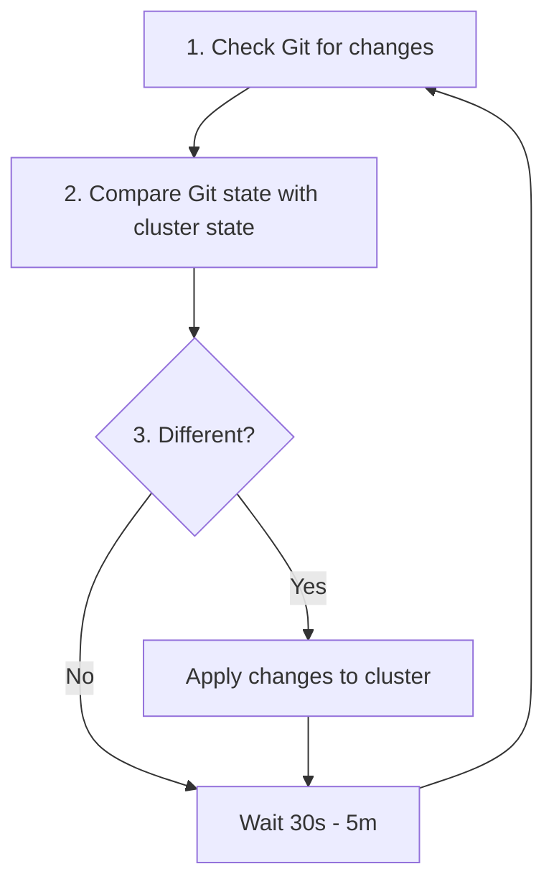
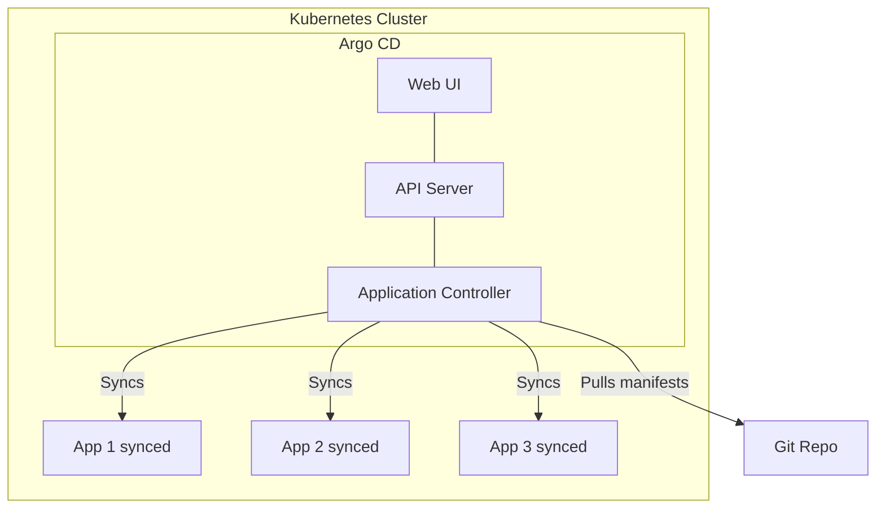
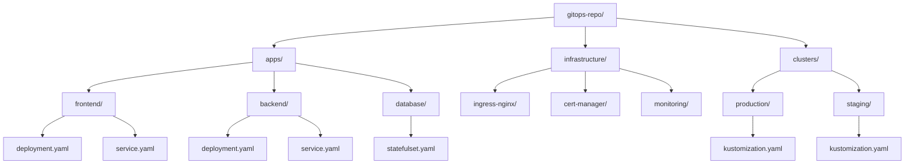
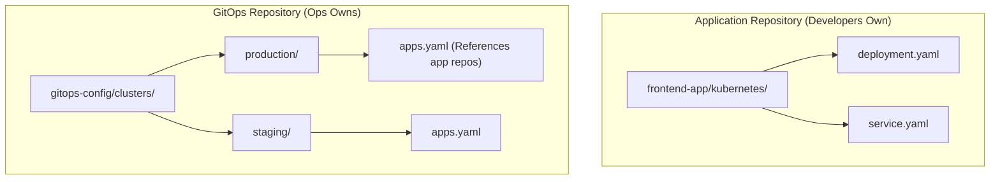
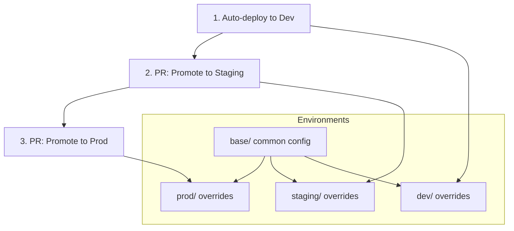
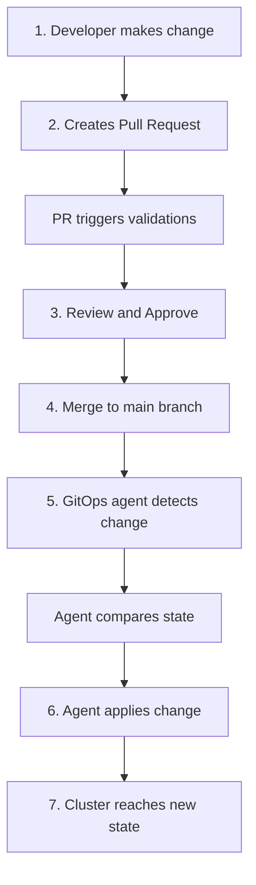
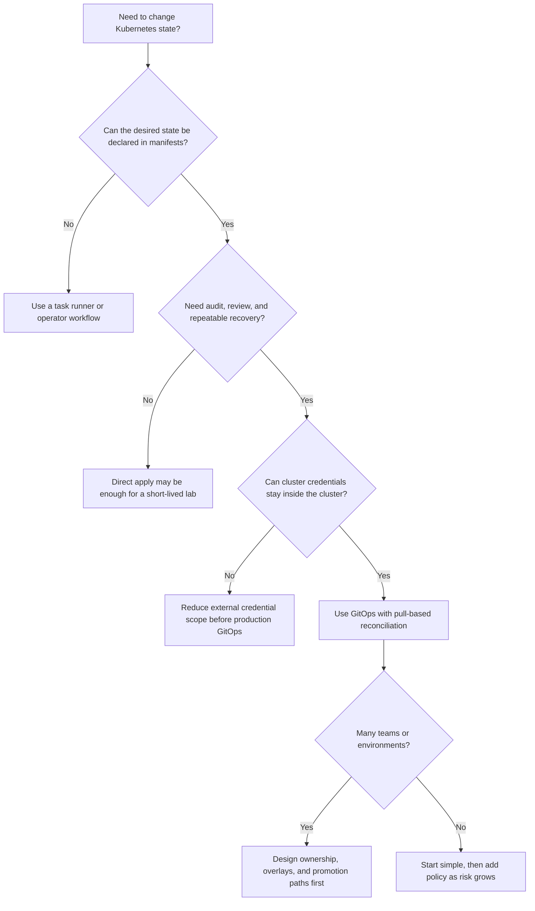

> **Складність**: [СЕРЕДНЯ]
>
> **Час на проходження**: 60-75 хвилин
>
> **Попередні вимоги**: [Модуль 1.1: Інфраструктура як код](/uk/prerequisites/modern-devops/module-1.1-infrastructure-as-code/), основи Git, базові поняття Kubernetes

---

## Що ви зможете зробити

Наприкінці цього модуля ви зможете:

- **Спроєктувати** архітектуру GitOps-репозиторіїв, яка підтримує multi-tenant команди, просування між середовищами та контрольоване володіння production-середовищем.
- **Діагностувати** відхилення конфігурації, порівнюючи поточний стан Kubernetes із джерелом істини в Git та обираючи правильну реакцію для узгодження.
- **Оцінити** наслідки для безпеки push- та pull-моделей розгортання для кластерів Kubernetes версії 1.35+.
- **Реалізувати** робочий процес безперервного узгодження з використанням патернів Argo CD або Flux CD, включно з автоматичною синхронізацією та поведінкою самовідновлення.
- **Порівняти** підходи monorepo та polyrepo до організації інфраструктури та обрати структуру, що відповідає масштабу команди, потребам аудиту й швидкості релізів.


## Чому це важливо

21 червня 2022 року рутинне оновлення спільноти BGP у Cloudflare змінило порядок умов політики всередині її автоматизованого інструментарію, поставивши правило глобального відхилення перед кожною локальною умовою оголошення маршрутів. За лічені хвилини дев'ятнадцять центрів обробки даних, які обслуговували приблизно половину глобального трафіку Cloudflare, відкликали свої маршрути і стали недоступними. Збій тривав близько сімдесяти п'яти хвилин. Зміна принципово підлягала перевірці — вона контролювалася системою версій, була написана людиною, розгорталася за допомогою інструменту — але її поетапне розгортання не було достатньо детальним, щоб виявити специфічний для MCP збій до того, як останній крок досяг кожного завантаженого центру обробки даних, і не було активного контролера, який порівнював би цільовий стан із фактичним. Конфігураційна зміна, яка виглядає придатною для перевірки у pull request, також підлягає перевірці перед її впровадженням, коли Git слугує операційним контрактом; одноразові команди не залишають ані аудиторського сліду, ані контролера для виявлення розбіжностей між цільовим та фактичним станом кластера. GitOps робить цей аудиторський слід і цей контролер стандартом за замовчуванням, а не винятком.

Kubernetes вирішує частину цієї проблеми, надаючи командам декларативні API, контролери, перевірки працездатності та механізми розгортання, але Kubernetes не робить команду дисциплінованою автоматично. Інженер все ще може запустити термінову команду не в тому просторі імен, завдання CI все ще може зберігати широкі облікові дані до кластера, а виправлення для production все ще може жити лише в історії термінала. GitOps усуває цю прогалину, роблячи Git операційним контрактом для кластера. Репозиторій описує цільовий стан, експертне оцінювання (peer review) контролює, як цей стан змінюється, а контролер всередині кластера безперервно узгоджує реальність відповідно до цього контракту.

Багато інженерів Kubernetes використовують коротку локальну абревіатуру для `kubectl` під час інтерактивної роботи, але у виробничому навчальному модулі слід писати повну команду, щоб приклади залишалися безпечними в скриптах, завданнях CI та спільних інструкціях. GitOps не змушує імперативні команди зникнути, але він змінює їхню роль. Команди стають діагностичними інструментами, тимчасовими екстреними діями або локальними помічниками в лабораторії, тоді як довгострокові виробничі зміни проходять через Git. Саме ця відмінність запобігає тому, щоб нічне усунення наслідків інциденту перетворилося на приховану гілку конфігурації, яка здивує наступного інженера.

Цей модуль навчає GitOps як операційній моделі, а не як демонстрації інструменту. Ви побачите, чому узгодження на основі pull-моделі зменшує ризик розкриття облікових даних, як Argo CD та Flux CD виражають ті ж самі базові принципи з різною ергономікою, як структура репозиторію впливає на безпеку в багатоклієнтському середовищі, і чому відкат (rollback) — це операція Git, а не гарячкова послідовність команд кластера. Мета полягає в тому, щоб ви могли **Спроєктувати**, **Діагностувати** та **Захистити** робочий процес GitOps до того, як встановите контролер у реальному середовищі Kubernetes 1.35+.

## Що GitOps змінює у доставці

GitOps — це операційний фреймворк, побудований навколо простого правила: бажаний стан системи зберігається в Git, а автоматизоване програмне забезпечення узгоджує робоче середовище так, щоб воно відповідало цій версіонованій декларації. Це правило звучить незначно, але воно зміщує центр тяжіння для операцій. Замість того, щоб питати, хто запустив команду, ви питаєте, який коміт змінив цільовий стан, яке рецензування його схвалило, які перевірки були пройдені і який контролер його застосував. Живий кластер стає результатом історії, що підлягає перевірці, а не пам'яттю того, хто останнім торкався production.

Традиційні конвеєри CI/CD часто використовують push-модель. Розробник робить коміт коду, конвеєр збирає та тестує його, а потім зовнішня система CI підключається до API Kubernetes, щоб застосувати маніфести або виконати команди Helm. Конвеєру потрібні облікові дані, достатньо потужні, щоб змінити цільовий кластер, і ці облікові дані повинні зберігатися, оновлюватися, проходити аудит і бути захищеними скрізь, де виконується агент CI. Ця модель може працювати, але вона перетворює платформу CI на високоцінний центр авторизації розгортання, тому скомпрометований агент або занадто широкі облікові дані можуть стати прямим шляхом у production.

GitOps перевертає цю межу довіри, розміщуючи повноваження на розгортання всередині кластера. Контролер, такий як Argo CD або Flux CD, відстежує репозиторій Git, порівнює стан репозиторію з фактичним станом і застосовує різницю, використовуючи ServiceAccount Kubernetes, який керується RBAC. Система CI все ще має значення, але її робота звужується до створення незмінного артефакту, його сканування, публікації в реєстрі та оновлення конфігураційного репозиторію, коли має відбутися випуск. Кластер витягує цільовий стан замість того, щоб чекати, поки зовнішня система проштовхне у нього команди.

```mermaid
flowchart LR
    subgraph Traditional["Traditional CI/CD (Push-based)"]
        direction LR
        Dev1[Dev] --> Git1[Git]
        Git1 --> CI[CI Pipeline]
        CI -->|Pushes| Cluster1[Cluster]
    end

    subgraph GitOps["GitOps (Pull-based)"]
        direction LR
        Dev2[Dev] --> Git2[Git]
        Git2 <--|Pulls| Agent[GitOps Agent]
        Agent -->|Applies| K8s[Local Kubernetes API]
    end
```

Ця діаграма приховує важливий операційний наслідок. У push-моделі конвеєр повинен мати доступ до кластера під час розгортання, тому доступ до мережі та облікові дані існують за межами кластера. У pull-моделі контролеру потрібен лише вихідний доступ до Git та реєстрів, тоді як усі записи до API Kubernetes відбуваються через внутрішньокластерну ідентичність. Саме тому команди з безпеки часто віддають перевагу GitOps для виробничих кластерів: зовнішній системі автоматизації більше не потрібен kubeconfig, який може змінювати робочі навантаження у різних просторах імен.

GitOps також змінює ставлення до дрейфу. Дрейф означає, що фактичний стан кластера відрізняється від цільового стану в Git. Деякий дрейф є випадковим, наприклад, коли розробник запускає `kubectl scale deployment web --replicas=10` під час інциденту і забуває оновити маніфест. Деякий дрейф є зловмисним, наприклад, коли зловмисник змінює тег образу або монтує новий секрет у Pod. Контролер GitOps виявляє обидва випадки як невідповідність між декларацією та реальністю, а потім або сповіщає про це, або виправляє, або чекає на схвалення залежно від політики.

> **Зупиніться та подумайте:** якщо Git каже, що Deployment має запустити три репліки, а кластер наразі запускає десять, що має робити контролер GitOps за замовчуванням у суворому виробничому середовищі, і коли ви могли б навмисно обрати м'якшу політику?

Правильна відповідь залежить від моделі ризиків. У суворому середовищі Git перемагає, оскільки несанкціонована зміна може бути помилкою або вторгненням, і автоматичне самовідновлення повертає стан, який пройшов перевірку. У менш зрілому середовищі команда може почати з виявлення дрейфу лише для сповіщення, щоб оператори могли дізнатися, які ручні практики все ще існують, перш ніж увімкнути автоматичне виправлення. Головне — зробити вибір усвідомленим, тому що прихований дрейф — це найгірше з обох світів: команда вважає, що Git є авторитетним, тоді як виробниче середовище повільно віддаляється від нього.

Чотири принципи OpenGitOps забезпечують корисний тест для того, щоб визначити, чи заслуговує робочий процес на цю назву. Система має бути декларативною, що означає, що цільовий стан описується, а не прописується як імперативні кроки. Вона має бути версіонованою та незмінною, щоб кожну зміну можна було простежити до коміту. Вона має автоматично витягуватися програмними агентами. Вона має безперервно узгоджуватися, щоб агент спостерігав і виправляв розбіжності з часом, а не застосовував маніфест один раз і залишав його.

```yaml
# Not "run 3 nginx pods"
# But "desired state is 3 nginx pods"
apiVersion: apps/v1
kind: Deployment
metadata:
  name: web
spec:
  replicas: 3
  # ...
```

Декларативна конфігурація є потужною, оскільки контролери Kubernetes вже працюють у такий спосіб. Ви надсилаєте цільовий стан до API-сервера, а контролери вирішують, як створити Pod, замінити несправні репліки, підключити Service та поступово конвергувати. GitOps додає ще один рівень контролера над Kubernetes. Контролер GitOps не замінює контролер Deployment, контролер Service або планувальник; він підтримує об'єкти, якими керують ці контролери, відповідно до репозиторію, який перевіряють люди.

```bash
git log --oneline manifests/
a1b2c3d Scale web to 5 replicas
d4e5f6a Add redis cache
b7c8d9e Initial deployment

# Every change is:
# - Versioned (commit hash)
# - Immutable (commit objects don't change; protected branches prevent history rewrites)
# - Attributed (who made it)
# - Reviewable (PR history)
```

Історія Git — це більше, ніж просто зручність під час інцидентів. Відкат стає `git revert`, а не імпровізованим списком команд, і сам відкат стає новою зміною, яка проходить аудит. Це важливо для комплаєнсу, оскільки докази зберігаються в системах, які інженери вже використовують: коміти, pull requests, захист гілок, власники коду, перевірки статусу та підписані теги. Це також має значення для відновлення, оскільки свіжий кластер можна спрямувати на той самий репозиторій і наказати йому відбудувати очікуваний стан.

Один із практичних способів перевірити, чи дійсно Git є авторитетним джерелом — це запитати, де інженер зробив би рутинну зміну в умовах дефіциту часу. Якщо відповідь звучить як "відредагувати поточний Deployment і навести лад пізніше", команда ще не засвоїла GitOps, навіть якщо контролер встановлено. Якщо відповідь — "відкрити невеликий pull request, який змінює маніфест, дозволити перевіркам відобразити різницю і дозволити контролеру конвергувати", процес перейшов від впровадження інструменту до операційної звички. Звичка має більше значення, ніж бренд контролера, оскільки контролер може забезпечити дотримання лише того контракту, якого команда дійсно дотримується.

Git також надає рецензентам контекст, який не може надати лише API Kubernetes. Робочий об'єкт може сказати вам, що значення змінилося, але він не може пояснити причину, тикет, інженера, який схвалив зміну, запуск тесту або обговорення, під час якого зважувалися альтернативи. Pull requests долучають ці супутні докази до зміни цільового стану. Коли під час пізнішого аналізу інциденту виникає питання, чому у виробничому середовищі використовувався певний ліміт ресурсів або тег образу, відповідь має бути відновлена з історії репозиторію, а не з повідомлень у чаті та особистих спогадів.



Цикл узгодження навмисно повторюваний. Контролер перевіряє Git, генерує цільові маніфести, якщо задіяні шаблони, порівнює ці маніфести з фактичними об'єктами, застосовує відсутні або змінені ресурси, опціонально видаляє вилучені ресурси та чекає на наступний інтервал або сповіщення вебхука. Цей цикл є нудним у найкращому сенсі цього слова. Він виконує однакове порівняння як під тиском, так і у звичайний вівторок, тому відновлення після інциденту не вимагає окремої героїчної процедури.

```bash
# Someone manually edits production
kubectl scale deployment web --replicas=10

# GitOps agent detects drift
# Git says 3 replicas, cluster has 10
# Agent corrects: scales back to 3

# Result: Git always wins
```

Цей приклад навмисно невеликий, оскільки принцип масштабується. Ручна зміна кількості реплік, відредагований ConfigMap, видалений NetworkPolicy або неочікувана анотація Service — все це стає розбіжностями між заявленим станом та спостережуваним станом. Проблема полягає не в тому, щоб навчити контролер помічати відмінності; вона полягає в тому, щоб навчити організацію, які відмінності слід виправляти автоматично, які мають викликати інженера, а які слід ігнорувати, оскільки інший контролер правомірно володіє цим полем. Тому зрілий дизайн GitOps — це частково автоматизація, а частково карта володіння.

Володіння полями — одна з перших деталей, що дивує команди. Об'єкти Kubernetes часто містять значення, записані контролерами допуску, сервісними сітками, менеджерами сертифікатів, автоскейлерами та інтеграціями з хмарними провайдерами. Контролер GitOps, який порівнює кожен байт без розуміння цих співавторів, може повідомляти про шумний дрейф або перезаписувати значення, яким має керувати інший контролер. Хороші реалізації визначають, які ресурси та поля належать Git, які належать контролерам під час виконання, і які слід виключити або нормалізувати під час порівняння. Це не послаблює GitOps; це робить узгодження достатньо точним, щоб йому можна було довіряти.

Автомасштабування є корисним прикладом, оскільки воно змушує враховувати нюанси. Якщо Git оголошує `replicas: 3`, а людина змінює це значення на десять, суворе узгодження зазвичай має повернути значення до трьох. Якщо HorizontalPodAutoscaler змінює кількість реплік на основі навантаження на процесор або користувацьких метрик, поле реплік може навмисно контролюватися автоскейлером після створення Deployment. Дизайн GitOps має уникати конфлікту з цим контролером, або шляхом пропуску поля там, де це доречно, або налаштуванням правил ігнорування, або моделюванням ресурсів автомасштабування як цільової політики. Джерелом істини все ще залишається Git, але Git оголошує політику, а не кожен результат під час виконання.


## Механізми узгодження: Argo CD та Flux CD

Argo CD та Flux CD — це два інструменти, які більшість команд розглядають у першу чергу, оскільки обидва мають статус випускників CNCF (CNCF-graduated) і реалізують pull-модель узгодження (reconciliation) для Kubernetes. Проте вони не є просто взаємозамінними оболонками з однаковим користувацьким досвідом. Argo CD широко відомий своїм веб-інтерфейсом (web UI), застосунко-орієнтованою (application-centric) моделлю, хвилями синхронізації (sync waves), поданням стану здоров'я (health views) та зручною роботою з multi-tenant операціями. Натомість Flux CD відчувається більш нативним для Kubernetes і орієнтованим на контролери, маючи окремі користувацькі ресурси (custom resources) для джерел, kustomizations, релізів Helm, автоматизації образів та поведінки сповіщень.

Argo CD моделює ціль розгортання як `Application`. Ресурс `Application` вказує, який репозиторій читати, який шлях рендерити, за якою ревізією стежити, в який кластер і простір імен розгортати, а також яку політику синхронізації використовувати. Таке формулювання є корисним для платформних команд, які хочуть, щоб розробники бачили, чи синхронізовано їхній застосунок, чи він здоровий (healthy), деградований (degraded) або очікує на дії. Інтерфейс (UI) тут не просто декоративний; у багатьох організаціях він стає спільним екраном інцидентів, де розробники, оператори та фахівці з безпеки обговорюють точний diff між Git та кластером.



Наведений нижче ресурс Application зберігає основний виробничий патерн. Контролер працює в просторі імен `argocd`, читає конфігураційний репозиторій, звертається до внутрішньокластерного Kubernetes API та виконує розгортання лише в простір імен застосунку. Опція `prune` дозволяє Argo CD видаляти ресурси, які були вилучені з Git, тоді як `selfHeal` дозволяє йому виправляти drift, не чекаючи на новий коміт. Ці два прапорці є настільки потужними, що команди зазвичай поєднують їх із захистом гілок (branch protection), межами проєктів та обережним застосуванням RBAC для просторів імен.

```yaml
# Production apps should run under a restricted AppProject, never the permissive
# built-in `default` project (which allows any repo, cluster, and resource kind).
apiVersion: argoproj.io/v1alpha1
kind: AppProject
metadata:
  name: frontend-prod
  namespace: argocd
spec:
  sourceRepos:
    - 'https://github.com/myorg/gitops-config.git'
  destinations:
    - namespace: 'frontend-prod'
      server: 'https://kubernetes.default.svc'
  clusterResourceWhitelist: []
---
# A worked ArgoCD Application example
apiVersion: argoproj.io/v1alpha1
kind: Application
metadata:
  name: frontend-prod
  namespace: argocd
spec:
  project: frontend-prod
  source:
    repoURL: 'https://github.com/myorg/gitops-config.git'
    path: clusters/production/frontend
    targetRevision: HEAD
  destination:
    server: 'https://kubernetes.default.svc'
    namespace: frontend-prod
  syncPolicy:
    automated:
      prune: true
      selfHeal: true
```

Перш ніж увімкнути `prune` та `selfHeal`, команда повинна чітко з'ясувати, що означає володіння (ownership). Якщо ресурс генерується іншим контролером, Argo CD може побачити поля або цілі ресурси, які не були записані через Git. Якщо оператор production використовує UI для тимчасового призупинення синхронізації під час інциденту, команді потрібен чіткий процес її відновлення та подальшого узгодження з репозиторієм. GitOps працює найкраще, коли контролер є суворим щодо ресурсів, якими він володіє, і поблажливим (humble) до ресурсів, якими володіють інші системи.

Проєкти в Argo CD варто зрозуміти навіть у вступному модулі, оскільки вони виражають межу між видимістю та повноваженнями. Проєкт може обмежувати репозиторії, кластери, простори імен та типи ресурсів, які може використовувати Application. Без цих обмежень валідний маніфест Application може стати шляхом до підвищення привілеїв, оскільки зміна цільового простору імен або увімкнення ресурсу на рівні кластера може вплинути на значно більше, ніж планувала команда застосунку. Завдяки проєктам контролер GitOps стає deployer'ом, що забезпечує виконання політик, а не cluster administrator загального призначення, який прикривається зручним дашбордом.

Flux CD виражає той самий workflow у вигляді менших ресурсів Kubernetes, які компонуються разом. `GitRepository` завантажує вихідний вміст, `Kustomization` рендерить і застосовує шлях, а інші контролери обробляють Helm, оновлення образів та сповіщення. Цей підхід є привабливим для команд, які хочуть, щоб їхня платформа GitOps сама керувалася як об'єкти Kubernetes, і які віддають перевагу командному рядку (CLI), а не централізованому UI. Це також робить граф залежностей явним, оскільки один об'єкт може чекати на інший перед застосуванням залежних маніфестів.

```yaml
# Flux GitRepository
apiVersion: source.toolkit.fluxcd.io/v1
kind: GitRepository
metadata:
  name: my-app
  namespace: flux-system
spec:
  interval: 1m
  url: https://github.com/myorg/my-app
  ref:
    branch: main
```

Сам по собі об'єкт джерела (source) нічого не розгортає. Він вказує Flux, звідки отримувати артефакти і як часто їх оновлювати, що відокремлює отримання коду від застосування маніфестів. Такий поділ є сильною архітектурною стороною, коли кілька кластерів використовують один і той самий репозиторій по-різному, або коли платформні команди хочуть з'ясувати, чи виникла помилка через доступ до Git, логіку рендерингу або крок apply в Kubernetes.

```yaml
# Flux Kustomization (applies manifests)
apiVersion: kustomize.toolkit.fluxcd.io/v1
kind: Kustomization
metadata:
  name: my-app
  namespace: flux-system
spec:
  interval: 5m
  path: ./kubernetes
  prune: true
  sourceRef:
    kind: GitRepository
    name: my-app
```

Порівняння здебільшого стосується не того, який інструмент універсально кращий, а того, який стиль експлуатації зможе підтримувати ваша команда. Argo CD дає багатьом командам швидший шлях до видимості, оскільки UI показує diff'и, стан синхронізації та здоров'я застосунку в одному місці. Flux CD пропонує командам меншу, нативну для контролерів поверхню, яка добре поєднується з Git-only робочими процесами та платформеною інженерією з інтенсивною автоматизацією. Обидва інструменти можуть бути використані неправильно, якщо структура репозиторіїв, RBAC, робота з секретами або promotion policy є слабкими.

Ресурсна модель Flux спочатку може здатися багатослівною, але додаткові об'єкти створюють корисні діагностичні контрольні точки. Якщо `GitRepository` не готовий, проблема полягає в доступі до джерела, облікових даних, назві гілки або доступності мережі. Якщо джерело готове, але `Kustomization` завершується з помилкою, проблема полягає в рендерингу, валідації, порядку залежностей або контролі допуску (admission) Kubernetes. Цей поділ утримує команди від сприйняття кожного невдалого розгортання як однієї неясної проблеми GitOps. Чим більшою кількістю кластерів та орендарів ви керуєте, тим ціннішими стають ці вузькі домени відмов.

Обидва інструменти також залежать від якості сигналів про стан здоров'я (health signals) у Kubernetes. Deployment без readiness probe може бути успішно застосований, продовжуючи обслуговувати непрацездатний трафік. Service може існувати, але не вибирати жодних корисних Pod'ів. Job може бути створений, але завершуватися з помилкою при кожному виконанні. Інструменти GitOps можуть виявити багато з цих станів, але лише в тому випадку, якщо маніфести надають проби, мітки, метадані володіння та семантику rollout, які роблять здоров'я спостережуваним. Узгодження (reconciliation) доставляє оголошені об'єкти в кластер; проєктування здоров'я (health design) повідомляє команді, чи виконують ці об'єкти корисну роботу.

| Feature | Argo CD | Flux CD |
|---------|---------|---------|
| UI | Гарний веб-дашборд | Орієнтований на CLI |
| Multi-tenancy | Вбудована | Через простори імен |
| RBAC | Комплексний | Нативний для Kubernetes |
| Підтримка Helm | Першокласна | Через контролери |
| Крива навчання | Помірна | Більш крута |
| Статус CNCF | Випускник (Graduated) | Випускник (Graduated) |

Ця таблиця зберігає звичні головні відмінності, але справжній вибір має включати експлуатаційні питання. Хто буде налагоджувати (debug) невдалі синхронізації о 03:00? Чи потрібен командам застосунків візуальний diff, чи їм комфортно читати статус контролера? Чи буде платформна команда підтримувати багато кластерів із суворими межами для орендарів? Чи є Helm charts першокласними артефактами, чи організація стандартизує використання Kustomize overlays? Ці запитання виявляють вартість підтримки, яку перелік фіч (feature checklist) може приховувати.

> **Перш ніж запускати це у справжньому кластері, який вивід ви очікуєте від `kubectl get applications -n argocd` після вказання неправильного шляху до репозиторію: відсутній об'єкт Kubernetes, синхронізований застосунок чи application у стані degraded/out-of-sync, і чому?**

Очікувана відповідь полягає в тому, що об'єкт Application існує, але контролер повідомляє про проблему синхронізації або порівняння, оскільки потрібне джерело не може бути відрендерене або знайдене. Ця відмінність є критичною для діагностики. Помилка GitOps часто означає, що контролер здоровий, тоді як його вхідні дані є неправильними, тому ви інспектуєте події контролера, статус джерела, згенеровані маніфести та RBAC окремо, замість того, щоб припускати, що сам кластер відхилив валідне розгортання.


## Архітектура репозиторію та просування

Структура репозиторію — це перше рішення у GitOps, зміна якого згодом стає дорогою. Невелика команда може тримати маніфести поруч із кодом застосунку і при цьому розуміти всю систему, але більшій організації потрібні межі для змін у production, спільні компоненти платформи, просування між середовищами та автономність орендарів. Репозиторій — це не лише сховище файлів; це площина політик, де захист гілок, CODEOWNERS, правила рецензування та автоматизація вирішують, хто може змінювати яку частину кластера.

Типова структура monorepo об'єднує застосунки, інфраструктуру платформи та оверлеї кластерів в одному центральному GitOps-репозиторії. Перевага полягає в оглядовості. Інженер може переглянути бажаний стан платформи в одному місці, наскрізні зміни можуть відбуватися в одному pull request, а спільні конвенції легше виявити. Недоліком є шум. Кожна команда вносить зміни в той самий репозиторій, дозволи вимагають ретельного визначення власності на основі шляхів (path-based ownership), а напружені періоди релізів можуть перетворити рутинні зміни на чергу непов'язаних pull requests.



Monorepo добре працюють, коли організація інвестує у відповідальність за код (ownership). Шлях `clusters/production/` повинен вимагати затвердження від осіб, відповідальних за production, тоді як `apps/frontend/overlays/dev/` може належати команді фронтенду. Це дозволяє розробникам швидко рухатися в безпечних зонах, не дозволяючи рутинній зміні застосунку змінити загальнокластерний ingress, керування сертифікатами або конфігурацію бази даних production. Без цих правил monorepo стає єдиним гігантським радіусом ураження з дружнім деревом тек.

Monorepo також винагороджує послідовну валідацію, оскільки кожен pull request може запускати ті самі перевірки рендерингу та політик для порушених шляхів. Конвеєр може виявити, чи модифікує зміна production, чи впроваджує вона ресурс рівня кластера, чи відсутні обов'язкові мітки, і чи відрізняється відрендерений YAML від очікуваного оверлея середовища. Ці перевірки важче стандартизувати, коли кожна команда винаходить власні конвенції репозиторію. Компроміс полягає в тому, що центральний репозиторій потребує управління, інакше він перетвориться на переповнений коридор, де непов'язані команди блокують одна одну.

Структура polyrepo відокремлює репозиторії застосунків від контрольного GitOps-репозиторію. Команди розробки можуть володіти маніфестами застосунків поруч із їхнім вихідним кодом, тоді як команда платформи або експлуатації володіє репозиторієм, який визначає, які застосунки допускаються до яких кластерів та середовищ. Ця межа зменшує кількість випадкових змін у production, оскільки GitOps-репозиторій для production може посилатися на затверджені версії або шляхи, замість того щоб надавати кожному розробнику застосунку широкий доступ на запис до визначень кластера.



Polyrepo обмінюють централізовану оглядовість на чіткішу відповідальність. Репозиторій платформи може залишатися невеликим і надійно захищеним, тоді як команди застосунків виконують ітерації всередині власних репозиторіїв зі своїми власними тестами. Ціною є те, що рецензенту може знадобитися переходити за посиланнями між репозиторіями, щоб зрозуміти кінцевий бажаний стан. Саме тому зрілі налаштування polyrepo часто покладаються на дашборди, згенерований інвентар, графи залежностей або запити до інструментів GitOps, щоб відповісти на запитання "що саме зараз запущено в production?".

Гібридна модель є поширеною на практиці. Команди застосунків зберігають маніфести рівня сервісу, значення Helm chart або бази Kustomize поруч зі своїм кодом, тоді як центральний репозиторій середовищ фіксує затверджені версії та компонує вигляд кластера. Це дозволяє розробникам контролювати, як працює їхній сервіс, не дозволяючи їм одноосібно вирішувати, де він працює в production. Це також дає команді платформи єдине місце для керування доступом, просторами імен, ingress, політиками та спільними контролерами. Ціною є більша потреба в автоматизації, щоб посилання залишалися зрозумілими, а просування — повторюваними.

Просування середовища (environment promotion) — це ще одне структурне рішення, яке формує щоденну роботу. Наївне налаштування спрямовує кожне середовище на одну й ту саму гілку та сподівається, що файли значень обережно редагуються. Більш безпечне налаштування визначає базову конфігурацію один раз, а потім накладає специфічні для середовища відмінності (overlays), такі як кількість реплік, запити на ресурси, feature flags, хости ingress та посилання на зовнішні секрети. Просування стає рецензованою зміною від одного оверлея або ревізії до іншої, а не ручним копіюванням фрагментів YAML між теками.



Модель бази та оверлеїв також робить рецензування більш осмисленим. Особі, що затверджує production, не потрібно перечитувати кожне поле Deployment під час просування відомого артефакту зі staging; вона повинна бачити точну різницю, яка впливає на production. Якщо diff змінює тег образу та один feature flag, рецензування є сфокусованим. Якщо diff переписує непов'язані service accounts, обмеження ресурсів та мережеві політики, рецензент може зупинити просування, оскільки pull request більше не є чистим релізом.

Просування має бути настільки нудним, щоб незвичні зміни виділялися. Звичайне просування може оновити один дайджест образу, одну версію chart або одне посилання на середовище, яке вже пройшло перевірки в нижчих середовищах. Якщо той самий pull request також змінює мережеву політику, облікові дані бази даних та дозволи контролера, рецензент повинен запитати, чи справді це реліз, чи кілька ризикованих змін, об'єднаних разом. GitOps полегшує цю розмову, оскільки diff є запитом на розгортання, а не знімком екрана форми конвеєра або усною обіцянкою щодо того, які команди будуть виконані.

```text
gitops-repo/
+-- apps/
|   +-- frontend/
|   |   +-- base/
|   |   +-- overlays/
|   |       +-- dev/
|   |       +-- staging/
|   |       +-- production/
|   +-- backend/
+-- infrastructure/
|   +-- ingress-nginx/
|   +-- cert-manager/
+-- clusters/
    +-- dev/
    +-- staging/
    +-- production/
```

Статичне дерево вище є навмисно нудним, оскільки нудні структури легше захистити. Люди можуть передбачити, де містяться зміни для конкретного середовища, автоматизація може запускати перевірку на основі шляхів, а CODEOWNERS можуть примусово вимагати рецензування за областями. Розумна структура, яку розуміє лише один інженер платформи, може здаватися елегантною під час проєктування, але вона стає тягарем, коли новій команді потрібно діагностувати невдале просування під час інциденту.


## Безпека, секрети та діагностика відхилень

Найвагомішим аргументом безпеки на користь GitOps є те, що він вилучає широкі облікові дані доступу до кластера із зовнішніх систем розгортання. У push-конвеєрі Jenkins, GitLab CI, GitHub Actions або інший runner потребує облікових даних, які можуть змінювати кластер. У pull-конвеєрі ці системи публікують артефакти та оновлюють Git, тоді як внутрішньокластерний контролер застосовує зміни через ServiceAccount з обмеженими правами. Це не робить кластер магічним чином безпечним, але дає захисникам менший, більш зрозумілий набір ідентичностей для захисту.

Дизайн RBAC повинен відповідати дизайну репозиторію. Якщо фронтенд-Application GitOps націлений лише на `frontend-prod`, ідентичність контролера для цього застосунку не повинна мати змоги змінювати загальнокластерну політику допуску (admission policy) або простори імен баз даних. Межі проєктів Argo CD та просторів імен Flux можуть допомогти виразити ці обмеження, але важливий принцип не залежить від інструменту. Скомпрометований репозиторій застосунку не повинен мати змоги переписувати інфраструктуру платформи, а скомпрометований оверлей розробки (development overlay) не повинен мати змоги змінювати продакшн.

Секрети потребують особливої уваги, оскільки Git навмисно є довговічним і широко реплікується. Відкритим обліковим даним (plaintext) не місце в репозиторії, навіть у приватному, оскільки кожен клон, форк, резервна копія та кешований pull request може зберігати їхнє значення ще довго після ротації. Команди GitOps зазвичай обирають один із трьох патернів: зашифрувати секрети перед тим, як робити їхній коміт, зробити коміт посилань на зовнішній менеджер секретів, або дозволити оператору секретів матеріалізувати Kubernetes Secrets із контрольованого бекенда. Правильний вибір залежить від вимог до аудиту, частоти ротації та зрілості платформи.

Зашифровані секрети корисні, коли команди хочуть, щоб зашифрований файл переміщувався разом із рештою бажаного стану (desired state), і можуть безпечно керувати ключами. Посилання на зовнішні секрети корисні, коли облікові дані ротуються центральною платформою безпеки, а Kubernetes повинен отримувати лише поточне матеріалізоване значення. Sealed Secrets корисні, коли розробникам потрібен нативний для Kubernetes робочий процес, який не дозволяє їм розшифровувати значення продакшну. Жоден із цих патернів не скасовує потреби в рецензуванні. Pull request, який змінює те, який секрет монтується, де він монтується, або який ServiceAccount може його читати, все ще заслуговує на пильну увагу.

Важливою діагностичною звичкою є розділення бажаного стану (desired state), відрендереного стану (rendered state), застосованого стану (applied state) та стану виконання (runtime state). Бажаний стан — це те, що вказано в репозиторії. Відрендерений стан — це те, що Helm, Kustomize або інший інструмент генерує після обчислення шаблонів та оверлеїв. Застосований стан — це те, що прийняв Kubernetes API. Стан виконання — це те, що фактично бачать Pod-и, контролери, проби та користувачі згодом. GitOps може бути синхронізованим, тоді як застосунок є нездоровим, або ж застосунок може бути здоровим, тоді як GitOps-контролер повідомляє про відхилення (drift) у полі, яке належить іншому контролеру.

```bash
# Useful drift diagnosis sequence for a suspected GitOps mismatch
kubectl get deploy gitops-demo -o yaml
kubectl describe deploy gitops-demo
kubectl get events --sort-by=.lastTimestamp
kubectl rollout status deployment/gitops-demo
```

Ці команди є діагностичними, а не заміною репозиторію. Якщо ви виявите, що живий Deployment має п'ять реплік, тоді як Git декларує дві, довговічним виправленням є зміна Git або ж дозвіл контролеру відновити значення з Git. Якщо ви виявите, що Pod-и падають (crash), хоча Application синхронізовано, причиною може бути поганий образ, відсутній ConfigMap, помилка проби або обмеження ресурсів, а не проблема синхронізації GitOps. Дисципліна полягає в тому, щоб використовувати інспекцію кластера для розуміння реальності, а потім кодувати довговічні виправлення в Git.

Корисне запитання під час інциденту: "який рівень не збігається з яким іншим рівнем?". Якщо Git та відрендерені маніфести не збігаються, проблема полягає в шаблонізації або виборі оверлею. Якщо відрендерені маніфести та живі об'єкти не збігаються, проблема полягає в синхронізації, RBAC, admission, видаленні (pruning) або власності контролера. Якщо живі об'єкти та поведінка під час виконання не збігаються, проблема полягає у здоров'ї застосунку, залежностях, пробах або умовах інфраструктури. Ця ментальна модель утримує команди від багаторазового натискання кнопки синхронізації, коли справжньою причиною збою є недійсне посилання на секрет або процес, що падає.

```bash
# Production has a bug!

# Normal GitOps rollback: revert the bad commit in Git
git revert abc123
git push

# GitOps agent syncs: old version restored
# Time to rollback: < 5 minutes

# Emergency only: Argo CD UI "Rollback" reverts to a previous sync state
# (blocked when automated sync is enabled; does not create a Git commit).
# Follow any UI rollback with a matching git revert so Git stays authoritative.

git log --oneline
def456 Revert "Deploy v1.2.3"  # Rollback recorded in Git
abc123 Deploy v1.2.3           # Bad deployment
```

Відкат (rollback) заслуговує на особливу увагу, оскільки GitOps робить безпечний шлях на вигляд майже занадто простим. `git revert` створює новий коміт, який скасовує погану зміну, тому історія залишається такою, що рухається вперед і піддається аудиту. Скидання історії (reset) або примусовий push (force-push) у продакшн-гілку зазвичай є хибним інстинктом, оскільки це знищує докази та може збити з пантелику контролери, які вже спостерігали попередній коміт. Під час серйозного інциденту команда повинна віддавати перевагу чіткому revert-у, сфокусованому рев'ю та узгодженню (reconciliation) контролера замість невідстежуваного імперативного патчу.

Автоматизація образів — це те, де команди часто хвилюються, що GitOps їх сповільнить. Якщо кожен реліз вимагає від людини редагування тегу образу, безперервне розгортання (continuous deployment) перетворюється на паперову роботу. Сучасні екосистеми GitOps вирішують це за допомогою контролерів, які спостерігають за реєстрами, вибирають нові теги відповідно до політики та записують обраний тег назад у Git як коміт. Розгортання залишається керованим через Git (Git-driven), оскільки автоматизація спочатку змінює репозиторій, а потім GitOps-контролер застосовує новий бажаний стан.

```yaml
# Argo CD Image Updater annotation
metadata:
  annotations:
    argocd-image-updater.argoproj.io/image-list: myapp=myrepo/myapp
    argocd-image-updater.argoproj.io/myapp.update-strategy: semver

# Flux Image Automation
apiVersion: image.toolkit.fluxcd.io/v1
kind: ImageUpdateAutomation
metadata:
  name: flux-system
spec:
  interval: 1m
  sourceRef:
    kind: GitRepository
    name: flux-system
  git:
    checkout:
      ref:
        branch: main
    commit:
      author:
        email: fluxcdbot@users.noreply.github.com
        name: fluxcdbot
      messageTemplate: 'Update image to {{range .Changed.Changes}}{{println .NewValue}}{{end}}'
    push:
      branch: main
```

Автоматизовані коміти образів потребують такої ж серйозності, як і людські коміти. Бот повинен мати вузькі дозволи, передбачувані повідомлення комітів та політику вибору тегів, яка уникає випадкового розгортання неперевіреної збірки (untrusted build). Багато команд поєднують автоматизацію образів із незмінними тегами (immutable tags), скануванням на вразливості, підписами та правилами просування (promotion rules), щоб бот міг швидко оновлювати середовище розробки, тоді як продакшн все ще вимагає доказів зі стейджингу. Суть не в тому, щоб уповільнити доставку; суть у тому, щоб зберегти аудиторський слід (audit trail) недоторканим, поки автоматизація справляється з повторюваними змінами версій.



Діаграма робочого процесу показує, чому GitOps є настільки ж соціальною системою, наскільки й технічною. Pull request — це місце, де сходяться валідація, рев'ю, власність та аудит. Контролер не вирішує, чи є зміна доцільною; він забезпечує те, щоб перевірений репозиторій був бажаним станом. Тому хороші команди активно інвестують у перевірки перед злиттям (pre-merge checks), які роблять автоматизацію контролера безпечною: валідацію схем, перевірки політик, сканування секретів, diff-и відрендерених маніфестів та специфічні для середовища тести.


## Патерни та антипатерни

Надійні реалізації GitOps мають кілька спільних патернів. Вони відокремлюють артефакти збірки від наміру розгортання, оскільки CI-конвеєр повинен створювати незмінний образ, тоді як GitOps-репозиторій вирішує, де цей образ запускатиметься. Вони визначають чіткі межі власності, оскільки продакшн-кластер є спільною системою, і не кожна команда повинна мати змогу змінювати кожен ресурс. Вони розглядають відхилення (drift) як сигнал, оскільки відхилення може виявити екстрені роботи, конфлікти контролерів або спробу несанкціонованого втручання.

| Патерн | Коли використовувати | Чому це працює | Міркування щодо масштабування |
|---------|----------------|--------------|-----------------------|
| App-of-apps або cluster bootstrap | Багато застосунків мають бути встановлені узгоджено в різних кластерах. | Невеликий кореневий об'єкт вказує контролеру на решту бажаного стану. | Ретельно захищайте кореневий шлях, оскільки він може вплинути на кожен дочірній застосунок. |
| Базові маніфести плюс оверлеї середовищ | Застосунки спільно використовують більшість маніфестів, але відрізняються залежно від середовища. | Рецензенти бачать сфокусовані відмінності продакшну замість скопійованого YAML. | Тримайте оверлеї невеликими; великі оверлеї приховують відхилення між середовищами. |
| Автоматизація образів із політикою | Команди хочуть швидкого процесу релізів без втрати історії Git. | Бот комітить оновлення образів до того, як контролер їх розгорне. | Використовуйте незмінні теги, підписані артефакти та окремі правила просування в продакшн. |
| Власність на основі шляху (Path-based ownership) | Кілька команд спільно використовують GitOps-репозиторій. | CODEOWNERS та захист гілок відповідають операційній відповідальності. | Переглядайте власність, коли переміщуються простори імен, команди або компоненти платформи. |

Антипатерни зазвичай з'являються, коли команди впроваджують інструмент до впровадження операційної моделі. Встановлення Argo CD, тоді як розробники все ще редагують продакшн імперативними командами, створює контролер, який бореться з людьми. Зберігання сирих секретів у Git створює постійну проблему розкриття. Ставлення до GitOps-репозиторію як до згенерованого сміття робить рецензування безглуздим, оскільки люди перестають читати diff-и. Це не обмеження інструменту; це сигнали того, що команда не вирішила, де перебувають повноваження.

| Антипатерн | Що йде не так | Краща альтернатива |
|--------------|-----------------|--------------------|
| CI runner розгортає безпосередньо в продакшн | Зовнішні облікові дані стають ціллю високої цінності та обходять аудит GitOps. | Дозвольте CI публікувати артефакти та оновлювати Git; дозвольте застосовувати зміни внутрішньокластерному контролеру. |
| Ручний хотфікс ніколи не потрапляє в Git | Узгодження (reconciliation) перезаписує виправлення, або кластер непомітно розходиться. | Використовуйте екстрені команди лише як тимчасове пом'якшення, потім зафіксуйте довговічний стан комітом. |
| Один гігантський файл values для кожного середовища | Рецензенти не можуть сказати, на яке середовище впливає зміна. | Використовуйте базові маніфести з невеликими, явними оверлеями або окремими шляхами для середовищ. |
| Відкритий текст Kubernetes Secrets у Git | Облікові дані зберігаються в клонах, кешах, форках і резервних копіях. | Використовуйте SOPS, Sealed Secrets, External Secrets Operator або кероване сховище секретів. |

Існує також неочевидний антипатерн, який називається "впевненістю в зеленій синхронізації" (green sync confidence). Контролер може повідомляти, що маніфести синхронізовані, тоді як користувачі все ще бачать помилки, оскільки застосунок запускається, а потім падає під час виконання. GitOps відповідає на питання, чи отримав кластер задекларовані об'єкти; він не доводить, що бізнес-функція працює, якщо перевірки здоров'я, димові тести (smoke tests), метрики та політики випуску не подають корисні сигнали назад у процес. Синхронізоване погане розгортання все ще є поганим розгортанням, просто воно має кращий аудиторський слід.


## Фреймворк прийняття рішень

Використовуйте GitOps, коли система отримує вигоду від декларативного бажаного стану, повторюваного узгодження та аудиторського шляху змін. Kubernetes є природним вибором, оскільки він уже надає декларативні API та цикли контролерів, але рішення все ще залежить від готовності команди. Якщо ніхто не рецензує зміни інфраструктури, якщо маніфести генеруються вручну без валідації, або якщо доступ до продакшну є неконтрольованим, встановлення GitOps-контролера швидко виявить ці слабкі місця. Це може бути корисним, але саме по собі їх не виправить.



Для навчального кластера або одноразового експерименту `kubectl apply -f manifests/` може бути цілком розумним, оскільки середовище є одноразовим, а навантаження на аудит — низьким. Для спільного стейджинг-кластера GitOps починає окупатися, роблячи зміни застосунку доступними для рецензування та повторюваними. Для продакшну GitOps стає найціннішим у поєднанні із захистом гілок, підписаними комітами, перевірками політик, дозволами контролера з обмеженою областю дії та процесом відкату (rollback), який команда відрепетирувала до реального збою.

| Рішення | Обирайте це, коли | На що звернути увагу |
|----------|------------------|---------------|
| Argo CD | Командам потрібна видимість через UI, перегляди здоров'я застосунків і доступні багатоклієнтські (multi-tenant) операції. | Зручність UI може приховувати слабку власність на репозиторій, якщо проєкти занадто широкі. |
| Flux CD | Команди віддають перевагу ресурсам, нативним для Kubernetes, робочим процесам у CLI та компонованим контролерам (composable controllers). | Налагодження вимагає комфортної роботи з кількома CRD та полями статусу контролерів. |
| Monorepo | Централізована видимість та наскрізні зміни важливіші, ніж шум у репозиторії. | Власність на шляхи має бути забезпечена до того, як багато команд почнуть робити свій внесок. |
| Polyrepo | Межі команд, зменшений радіус ураження (blast radius) та окремі ритми випусків є найважливішими. | Видимість інвентаризації та залежностей вимагає додаткових інструментів або дашбордів. |
| Автоматична синхронізація із самовідновленням (self-heal) | Репозиторію довіряють, і ручне відхилення слід виправляти швидко. | Власність контролера повинна бути точною, щоб уникнути боротьби з іншими контролерами. |
| Ручна синхронізація або лише сповіщення про відхилення | Команда все ще вивчає джерела відхилень, або зміни в продакшні вимагають людських перевірок (gates). | Відхилення може зберігатися довше, тому сповіщення та дисципліна подальших дій є критично важливими. |

Фреймворк повинен привести до явного операційного рішення. Команда платформи може обрати Argo CD, центральний GitOps-репозиторій, bootstrap через app-of-apps, автосинхронізацію в середовищі розробки та ручну синхронізацію в продакшні після обов'язкового затвердження. Інша команда може обрати Flux CD, окремі репозиторії застосунків, автоматизовані оновлення образів у середовищі розробки та просування в продакшн через pull request-и. Обидва варіанти можуть бути дійсними, якщо вибір відповідає ризикам, навичкам та аудиторським зобов'язанням команди.


## Чи знали ви?

- **Термін "GitOps" запровадила компанія Weaveworks** у серпні 2017 року, коли описала, як вона керує Kubernetes, використовуючи Git як панель керування станом кластера.
- **Робоча група OpenGitOps опублікувала версію 1.0.0 принципів GitOps** у 2021 році, формалізувавши декларативну, версіоновану модель, яка базується на витягуванні та узгодженні.
- **Argo CD з'явився в Intuit у 2018 році** і пізніше набув статусу graduated-проєкту CNCF, що є однією з причин, чому багато корпоративних команд визнають його орієнтований на застосунки робочий процес.
- **Flux набув статусу graduated-проєкту CNCF у 2022 році** і організований як набір контролерів Kubernetes, що пояснює, чому багато платформних команд описують його як глибоко нативний для Kubernetes інструмент.

## Типові помилки

| Помилка | Чому це трапляється | Як це виправити |
|---------|----------------|---------------|
| Ручні команди `kubectl` у робочому середовищі стають справжнім процесом розгортання | Під час інцидентів люди оптимізують усе для швидкості та забувають, що узгодження відновить стан із Git або залишить незадокументоване відхилення. | Розглядайте імперативні команди як тимчасове пом'якшення проблеми, а потім зафіксуйте довгостроковий бажаний стан у коміті та дозвольте контролеру узгодити його. |
| Незашифровані секрети додаються в репозиторій GitOps | Команди правильно прагнуть до того, щоб усе було декларативним, але забувають, що історія Git довговічна і широко копіюється. | Використовуйте робочі процеси із зашифрованими секретами, External Secrets Operator, Sealed Secrets, SOPS або посилання на керовані секрети замість облікових даних у вигляді звичайного тексту. |
| Контролер GitOps має привілеї рівня всього кластера для кожного застосунку | Простіше встановити інструмент із широкими дозволами, ніж ретельно моделювати орендарів та простори імен. | Обмежте ідентичності контролера, проєкти Argo CD, простори імен Flux та Kubernetes RBAC лише тими ресурсами, якими має володіти кожен застосунок. |
| Власність на репозиторій незрозуміла | Структура тек існує, але захист гілок та CODEOWNERS не відповідають операційній відповідальності. | Призначте власників за середовищем та компонентом, а потім вимагайте схвалення для чутливих шляхів, таких як робоче середовище та інфраструктура кластера. |
| Автоматичне очищення (Auto-prune) видаляє ресурси, якими володіє інший контролер | Контролеру GitOps наказано видаляти все, чого немає в Git, без розуміння згенерованих або спільних ресурсів. | Обмежте кожен Application або Kustomization чіткою межею власності та виключіть ресурси, якими володіють інші контролери. |
| Автоматизація образів занадто швидко розгортає ненадійні теги | Бот стежить за реєстром і робить коміт для будь-якого тегу, який відповідає нестрогому шаблону. | Використовуйте незмінні теги, політики семантичного версіонування, сканування образів, підписи та суворіші правила просування для production-накладень. |
| Зелений статус синхронізації помилково приймається за справність для користувача | Команда припускає, що застосовані маніфести доводять працездатність застосунку. | Додайте проби готовності (readiness probes), проби життєздатності (liveness probes), димові тести (smoke tests), метрики та сповіщення, щоб помилки під час виконання виявлялися за межами результату синхронізації GitOps. |

## Контрольні запитання

<details>
<summary>Сценарій: Черговий інженер використовує `kubectl set image` для розгортання виправленого контейнера під час реагування на вразливість, але старий вразливий образ повертається через кілька хвилин. Що сталося, і яке довгострокове виправлення?</summary>

Контролер GitOps виявив, що активний Deployment більше не відповідає тегу образу, задекларованому в Git, тому він узгодив кластер назад до перевіреного стану репозиторію. Ручна команда могла бути корисною як тимчасове екстрене пом'якшення, але вона не змінила джерело істини. Довгострокове виправлення полягає в тому, щоб оновити тег образу в репозиторії GitOps, пройти необхідні перевірки та рецензування і дозволити контролеру застосувати затверджений стан. Це перевіряє діагностику відхилень, оскільки проблема не в тому, що Kubernetes не зміг оновитися; проблема в тому, що Git правильно переміг неперевірене редагування в реальному часі.
</details>

<details>
<summary>Сценарій: Ваша команда з безпеки хоче, щоб Jenkins більше не зберігав облікові дані kubeconfig для робочого середовища (production). Як би ви оцінили дизайн GitOps на основі витягування (pull-based) як заміну?</summary>

У дизайні на основі витягування Jenkins більше не виконує розгортання безпосередньо в кластер. Він збирає образ контейнера, сканує його, публікує і оновлює репозиторій GitOps або відкриває pull-реквест, який змінює бажане посилання на образ. Потім контролер GitOps всередині кластера зчитує Git і застосовує зміни через обмежений ServiceAccount у Kubernetes. Це зменшує зовнішнє розкриття облікових даних, але вам усе ще потрібен захист гілок, обмеження дозволів для ботів, перевірки цілісності артефактів і RBAC контролера, оскільки Git і контролер стають новим шляхом примусового виконання правил.
</details>

<details>
<summary>Сценарій: Платформна команда повинна спроєктувати GitOps для шести продуктових команд, які ділять один робочий кластер. Які рішення щодо репозиторіїв та власності ви б порекомендували в першу чергу?</summary>

Почніть з відокремлення чутливих до production шляхів від звичайних шляхів розробки застосунків, а потім закріпіть цю структуру за допомогою CODEOWNERS та захисту гілок. Монорепозиторій може спрацювати, якщо управління власністю на шляхи є зрілим, але полірепозиторна або гібридна модель може зменшити радіус ураження (blast radius), дозволяючи продуктовим командам володіти маніфестами застосунків, тоді як платформна команда володіє допуском до кластера та production-накладеннями (overlays). Ключова вимога до дизайну полягає не в самій кількості репозиторіїв; вона полягає в тому, що кожен орендар (tenant) може змінювати лише ті ресурси, за які він несе відповідальність. Це запитання стосується архітектури репозиторію, оскільки відповідь повинна поєднувати масштаб команди, межі рецензування та безпеку робочого середовища.
</details>

<details>
<summary>Сценарій: Argo CD повідомляє, що Application синхронізовано (synced), але Pod-и перебувають у стані CrashLoopBackOff, і користувачі бачать помилки. Що вам слід діагностувати далі?</summary>

Синхронізований стан означає, що бажані маніфести були застосовані або вже відповідали активним об'єктам Kubernetes; це не доводить, що застосунок функціонує. Вам слід перевірити події Pod-ів, журнали (logs), статус розгортання (rollout), проби, ConfigMaps, Secrets, ліміти ресурсів і образ, який фактично запустився. Якщо перевірок працездатності (health checks) немає або вони слабкі, інструмент GitOps може не отримати достатньо сигналів під час виконання, щоб позначити застосунок як деградований. Виправлення має бути в Git після діагностики, оскільки довгостроковий бажаний стан повинен включати кращі проби, виправлену конфігурацію або завідомо справний образ.
</details>

<details>
<summary>Сценарій: Flux `Kustomization` із параметром `prune: true` видаляє ресурси, які створив окремий оператор. Як ви оціните та виправите проблему власності?</summary>

Контролер, ймовірно, керує шляхом або набором ресурсів, що перетинається з власністю іншого контролера. Prune робить те, що йому наказали: видаляє об'єкти, які відсутні в бажаному стані, яким він володіє. Виправлення полягає в тому, щоб звузити шлях Kustomization, відокремити згенеровані ресурси від ресурсів, якими керує Git, або налаштувати винятки відповідно до механізмів, які підтримує інструмент. Ця відповідь важлива, оскільки безперервне узгодження є безпечним лише тоді, коли межі власності є явними.
</details>

<details>
<summary>Сценарій: Команда хоче, щоб кожен новий тег реєстру автоматично розгортався в production за допомогою автоматизації образів. Які умови зроблять це достатньо безпечним, а які — ризикованим?</summary>

Це безпечніше, коли теги незмінні (immutable), артефакти відскановані та підписані, тести покривають важливу поведінку, а просування в production має політику, яка вибирає лише надійні версії. Це ризиковано, коли бот дотримується нестрогих шаблонів тегів, пише безпосередньо в production без рецензування або розгортає образи, які не пройшли staging. Автоматизація образів повинна зберігати аудиторський слід Git шляхом фіксації змін бажаного стану, але сама лише можливість аудиту не доводить, що артефакт є безпечним. Хороший дизайн часто швидко автоматизує розробку, водночас додаючи суворіші перевірки (gates) перед production.
</details>

<details>
<summary>Сценарій: У робочому середовищі потрібно відкотити (roll back) зламаний реліз платіжної системи. Чому зазвичай віддають перевагу `git revert`, а не примусовому пушу (force-pushing) гілки до старішого коміту?</summary>

`git revert` створює новий коміт, що рухається вперед і скасовує погану зміну, тому реагування на інцидент залишається видимим в історії, а контролер бачить нормальний новий бажаний стан. Примусовий пуш переписує спільну історію, може заплутати людей та автоматизацію, а також видаляє докази, які можуть знадобитися аудиторам або рецензентам інцидентів. У GitOps відкат — це все ще зміна бажаного стану, а не спроба стерти минуле. Найбезпечніший робочий процес — це цілеспрямований revert, швидке рецензування, якщо потрібно, і узгодження контролером.
</details>

## Практична вправа

У цій вправі ви вручну зімітуєте точну поведінку агента GitOps. Замість встановлення Argo CD або Flux, ви будете діяти як контролер безперервного узгодження, щоб зрозуміти базову механіку виявлення та виправлення відхилень. Лабораторна робота використовує локальну теку як джерело істини Git та кластер Kubernetes як живе середовище, тому вона найкраще працює на тимчасовому локальному кластері, де ви можете безпечно створити та видалити Deployment.

Перед початком переконайтеся, що `kubectl` налаштовано для тимчасового кластера Kubernetes, де вам комфортно створити та видалити невеликий Deployment. У наведених нижче прикладах команд використовується повна назва бінарного файлу `kubectl`, щоб їх було безпечно копіювати та вставляти в скрипти та термінали.

Нижче наведено повний скрипт симуляції для довідки.

```bash
# This simulates GitOps behavior manually
# In real GitOps, an agent does this automatically

# Confirm cluster context and use a dedicated lab namespace
kubectl config current-context
kubectl create namespace gitops-demo

# 1. Create a "Git repo" (directory)
mkdir -p ~/gitops-demo/manifests
cd ~/gitops-demo

# 2. Create initial desired state
cat << 'EOF' > manifests/deployment.yaml
apiVersion: apps/v1
kind: Deployment
metadata:
  name: gitops-demo
spec:
  replicas: 2
  selector:
    matchLabels:
      app: gitops-demo
  template:
    metadata:
      labels:
        app: gitops-demo
    spec:
      containers:
      - name: nginx
        image: nginx:1.27
EOF

# 3. Apply (simulate GitOps sync)
kubectl apply -n gitops-demo -f manifests/

# 4. Verify
kubectl get deployment gitops-demo -n gitops-demo

# 5. Simulate drift (manual change)
kubectl scale deployment gitops-demo -n gitops-demo --replicas=5

# 6. Check drift
kubectl get deployment gitops-demo -n gitops-demo
# Shows 5 replicas

# 7. Reconcile (simulate GitOps correction)
kubectl apply -n gitops-demo -f manifests/
# Back to 2 replicas!

# 8. Make a "Git change"
sed 's/nginx:1.27/nginx:1.28/' manifests/deployment.yaml > manifests/deployment.yaml.tmp
mv manifests/deployment.yaml.tmp manifests/deployment.yaml

# 9. Apply new state (simulate GitOps sync)
kubectl apply -n gitops-demo -f manifests/

# 10. Verify update
kubectl get deployment gitops-demo -n gitops-demo -o jsonpath='{.spec.template.spec.containers[0].image}'
# Shows nginx:1.28

# 11. Cleanup
kubectl delete -n gitops-demo -f manifests/
DEMO_DIR="$HOME/gitops-demo"
rm -r "$DEMO_DIR"
```

### Поступові завдання

**Завдання 1: Встановити базову лінію**

Створіть локальну теку, яка діятиме як зімітований репозиторій Git, і згенеруйте початковий декларативний `deployment.yaml` для застосунку Nginx, вказавши рівно 2 репліки. Це завдання відповідає результатам проєктування репозиторію, оскільки саме файл, а не робочий кластер, стає місцем, де декларується бажаний стан.

<details>
<summary>Рішення</summary>

Виконайте кроки 1 і 2 з наведеного вище скрипту. Це закріпить вашу локальну теку як беззаперечне джерело істини для майбутніх операцій у кластері, а початковий маніфест надасть вам відомий бажаний стан до появи будь-яких відхилень.
</details>

**Завдання 2: Виконати початкове витягування**

Дійте як агент GitOps, застосувавши маніфести до кластера. Переконайтеся, що фактичний стан кластера ідеально відповідає вашому задекларованому стану, і впевніться, що ви можете пояснити, яка команда зчитує стан репозиторію, а яка — спостерігає за активним Kubernetes API.

<details>
<summary>Рішення</summary>

Виконайте кроки 3 і 4. Ви вручну виконуєте роль автоматизованого агента, долаючи розрив між задекларованими вихідними файлами та живим Kubernetes API, зберігаючи при цьому бажаний стан у локальній теці репозиторію.
</details>

**Завдання 3: Спровокувати відхилення конфігурації**

Зімітуйте несанкціоноване нічне втручання в production, вручну перевизначивши масштаб розгортання за допомогою імперативної команди. Зверніть увагу, що тепер кластер не погоджується з вашим джерелом істини, а потім запишіть, чи повинен строгий контролер GitOps надіслати сповіщення, самостійно відновитися або чекати на ручне схвалення.

<details>
<summary>Рішення</summary>

Виконайте кроки 5 і 6. Запустивши `kubectl scale`, ви обходите декларативний процес. Тепер кластер повідомляє про 5 реплік, тоді як ваш файл вимагає 2, що і є тим самим відхиленням, яке контролер виявив би під час свого наступного циклу порівняння.
</details>

**Завдання 4: Забезпечити безперервне узгодження**

Дійте як агент GitOps, що виконує свою рутинну інтервальну перевірку. Повторно застосуйте репозиторій маніфестів, щоб виправити відхилення конфігурації, а потім переконайтеся, що живий Deployment повертається до кількості реплік, задекларованої у файлі.

<details>
<summary>Рішення</summary>

Виконайте крок 7. Повторний запуск команди застосування перезаписує ручну операцію масштабування, оскільки вихідний файл залишається незмінним. У цій симуляції правило GitOps є абсолютним: Git завжди перемагає, і репліки повертаються до 2.
</details>

**Завдання 5: Виконати декларативне оновлення**

Зімітуйте схвалений pull-реквест, відредагувавши вихідний файл для підвищення версії образу. Нарешті, востаннє виступіть у ролі агента, щоб синхронізувати цю затверджену зміну з живим кластером і підтвердити, що образ під час виконання тепер відповідає репозиторію.

<details>
<summary>Рішення</summary>

Виконайте кроки 8, 9, 10 і 11. Використовуючи `sed` або текстовий редактор, ви спочатку оновлюєте канонічне джерело істини. Застосування цього нового файлу розгортає оновлений образ контейнера, а очищення видаляє тимчасові ресурси.
</details>

### Контрольний список критеріїв успіху

- [ ] Ви успішно створили зімітовану теку репозиторію Git та початковий маніфест розгортання.
- [ ] Ви застосували початковий стан і вручну перевірили правильну кількість реплік через Kubernetes API.
- [ ] Ви використали імперативну команду масштабування, щоб навмисно зімітувати небезпечне відхилення конфігурації.
- [ ] Ви узгодили кластер назад до стану Git, спостерігаючи, як репліки негайно повертаються до бажаної кількості 2.
- [ ] Ви оновили версію образу суворо в межах вашого зімітованого репозиторію Git і застосували її, щоб побачити, що зміна набула чинності коректно.
- [ ] Ви очистили тимчасові ресурси.


## Джерела

- [Збій у Cloudflare 21 червня 2022 року](https://blog.cloudflare.com/cloudflare-outage-on-june-21-2022/)
- [Принципи OpenGitOps](https://opengitops.dev/)
- [Мікроопитування та ландшафт проєктів GitOps від CNCF](https://www.cncf.io/blog/2022/02/17/cncf-gitops-microsurvey/)
- [Документація Argo CD](https://argo-cd.readthedocs.io/en/stable/)
- [Специфікація Application в Argo CD](https://argo-cd.readthedocs.io/en/stable/operator-manual/declarative-setup/)
- [Політика автоматичної синхронізації Argo CD](https://argo-cd.readthedocs.io/en/stable/user-guide/auto_sync/)
- [Документація Argo CD Image Updater](https://argocd-image-updater.readthedocs.io/en/stable/)
- [Документація Flux](https://fluxcd.io/flux/)
- [Довідник GitRepository у Flux](https://fluxcd.io/flux/components/source/gitrepositories/)
- [Довідник Kustomization у Flux](https://fluxcd.io/flux/components/kustomize/kustomizations/)
- [Посібник з автоматизації оновлення образів у Flux](https://fluxcd.io/flux/guides/image-update/)
- [Декларативне керування об'єктами Kubernetes](https://kubernetes.io/docs/tasks/manage-kubernetes-objects/declarative-config/)
- [Документація з RBAC у Kubernetes](https://kubernetes.io/docs/reference/access-authn-authz/rbac/)


## Наступний модуль

[Модуль 1.3: Конвеєри CI/CD](../module-1.3-cicd-pipelines/) - Побудуйте конвеєр, який генерує надійні артефакти, виконує належні перевірки та передає чіткі наміри щодо релізу у ваш робочий процес GitOps.
