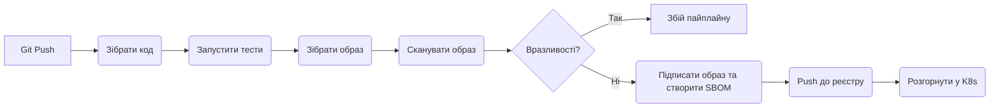

# Модуль 1.3: CI/CD пайплайни

**Складність:** [СЕРЕДНЯ]  
**Час на проходження:** 45-60 хвилин  
**Передумови:** [Модуль 1.1: Infrastructure as Code](/uk/prerequisites/modern-devops/module-1.1-infrastructure-as-code/), базові знання Git  

## Що ви зможете зробити

До кінця цього модуля ви зможете:
- **Розрізняти** безперервну інтеграцію (Continuous Integration), безперервну доставку (Continuous Delivery) та безперервне розгортання (Continuous Deployment) шляхом аналізу реальних сценаріїв розгортання.
- **Проектувати** багатоетапний container-native пайплайн, що включає етапи збірки, тестування, сканування на вразливості та розгортання.
- **Оцінювати** архітектурні компроміси між GitHub Actions, GitLab CI, Jenkins та Tekton для Kubernetes-native робочих процесів.
- **Порівнювати та впроваджувати** стратегії прогресивного розгортання (rolling updates, blue-green, canary, shadow) за допомогою оркестрації пайплайнів.
- **Розрізняти** традиційний Push-based CD та сучасний Pull-based GitOps (ArgoCD/Flux).
- **Усувати несправності** у невдалих пайплайнах, діагностуючи поширені антипатерни, такі як ігнорування нестабільних тестів (flaky tests), унікальні білд-агенти (snowflake build agents) або захардкоджені секрети.
- **Оптимізувати** продуктивність пайплайну за допомогою кешування залежностей та паралельного виконання робіт.

## Чому це важливо

### Історія з життя: Банкрутство за 45 хвилин
У 2012 році Knight Capital Group розгорнула нове оновлення програмного забезпечення на своїх серверах для високочастотного трейдингу. Процес розгортання був ручним, погано задокументованим і повністю позбавленим автоматизованого тестування чи верифікації. Інженер просто забув скопіювати новий код на один із восьми серверів з балансуванням навантаження. Коли ринок відкрився, застарілий сервер почав виконувати сплячий, дефектний алгоритм тестування, який купував дорого, а продавав дешево. Всього за 45 хвилин Knight Capital втратила 460 мільйонів доларів і була змушена оголосити про банкрутство. Цей інцидент залишається найяскравішим і найжахливішим нагадуванням про те, чому ручне розгортання без документації є катастрофічним ризиком у масштабах системи. Люди погано справляються з повторюваними, точними завданнями. Машини ж роблять це ідеально.

### Історія з життя: Компрометація ланцюжка поставок
У 2020 році досвідчені зловмисники скомпрометували середовище збірки SolarWinds, впровадивши шкідливий код в оновлення ПЗ Orion до того, як воно було підписано цифровим підписом і відправлено тисячам державних та корпоративних клієнтів. Це не була вразливість у коді програми, написаному розробниками; це була компрометація самого *механізму доставки*. Це підкреслює, чому захист пайплайну («фабрики програмного забезпечення») є таким же критичним, як і захист самої програми. Пайплайн має бути не лише автоматизованим, але й криптографічно верифікованим та захищеним.

### Аналогія: Автоматизована конвеєрна лінія
У 1913 році Генрі Форд здійснив революцію у виробництві завдяки рухомій конвеєрній лінії. До цього автомобілі будувалися по одному висококваліфікованими майстрами — це був повільний, схильний до помилок і немасштабований процес. Ручне розгортання ПЗ (підключення до сервера через SSH, завантаження коду, ручний запуск скриптів збірки) — це цифровий еквівалент ремісничого виробництва автомобілів. CI/CD — це сучасний конвеєр для коду. Сировина (вихідний код) надходить на фабрику, проходить через автоматизовані перевірки якості, збирається в деталі (бінарні файли/образи) і виходить з лінії готовою для споживача.

Сучасна доставка ПЗ покладається на ці автоматизовані пайплайни, щоб усунути людські помилки, забезпечити суворі перевірки якості та експоненціально прискорити цикли зворотного зв'язку. Пайплайн — це не просто скрипт, що виконує команди; це кодифіковане, виконуване визначення вашої інженерної культури. Якщо ваші тести нестабільні та ігноруються, ваш пайплайн теж ігноруватимуть. Якщо сканування безпеки проводиться вручну прямо перед релізом, ваш пайплайн створює хибне відчуття безпеки.

У cloud-native екосистемі CI/CD є необхідним мостом між розробниками, які фіксують код, та користувачами, які отримують цінність. Розуміння того, як будувати, захищати та експлуатувати ці пайплайни, є обов'язковим для кожного, хто працює з Kubernetes, оскільки сам оркестратор передбачає, що програми доставлятимуться автоматично, стабільно та безпечно.

## Основні концепції: CI проти CD проти CD

Абревіатура "CI/CD" часто використовується як взаємозамінна, але насправді вона представляє три окремі, прогресивні фази зрілості доставки програмного забезпечення. Розуміння точних меж між ними має вирішальне значення для проектування ефективних і безпечних пайплайнів.

### Безперервна інтеграція (Continuous Integration — CI)

Безперервна інтеграція — це фундаментальна практика злиття робочих копій усіх розробників у спільну основну гілку (mainline) кілька разів на день. Її головна мета — запобігти **"Пеклу інтеграції" (Integration Hell).**

*Пекло інтеграції* — це жахливий сценарій, коли розробники тижнями або місяцями працюють в ізольованих гілках функцій, щоб потім витратити цілі вихідні на вирішення масивних, складних конфліктів злиття Git перед релізом. На момент злиття коду ніхто вже точно не пам’ятає, як усе це працює разом, а кількість багів зростає в геометричній прогресії.

Коли розробник надсилає код у гілку або відкриває Pull Request, CI-сервер автоматично:
1. Отримує код із репозиторію.
2. Компілює або збирає програму (негайно виявляючи синтаксичні помилки).
3. Запускає unit-тести та інтеграційні тести для перевірки бізнес-логіки.
4. Виконує статичний аналіз коду (linting) для дотримання стандартів стилю.
5. Запускає сканування безпеки (SAST — Static Application Security Testing) для виявлення захардкодженних секретів або відомих небезпечних патернів кодування.

**Золоте правило CI:** Якщо збірка в основній гілці ламається, команда кидає всі справи, щоб виправити її. Основна гілка завжди має бути в стані, придатному для розгортання. Це базується на «теорії розбитих вікон» у програмуванні: якщо дозволити збірці залишатися зламаною, розробники втратять довіру до неї, ігноруватимуть червоні хрестики та перестануть зважати на помилки тестів.

### Безперервна доставка (Continuous Delivery — CD)

Безперервна доставка розширює CI, гарантуючи, що програмне забезпечення може бути випущене в production у будь-який момент. Мова йде про технічну *готовність* до розгортання за запитом, навіть якщо бізнес вирішить не робити цього негайно.

У процесі Continuous Delivery:
1. CI-пайплайн завершується та створює перевірений, версіонований, незмінний артефакт (наприклад, Docker-образ із тегом).
2. Артефакт автоматично розгортається у staging-середовищі, яке ідентично віддзеркалює production-середовище.
3. Acceptance-тести, тести продуктивності та end-to-end тести виконуються автоматично проти працюючого staging-сервісу.
4. Остаточне розгортання у production-кластері ініціюється **ручним бізнес-рішенням** (людина натискає кнопку "Deploy" або "Approve"). Це дозволяє менеджерам з продукту, маркетингу або командам з комплаєнсу контролювати точний час релізу для узгодження з прес-релізами або вікнами технічного обслуговування.

### Безперервне розгортання (Continuous Deployment — CD)

Безперервне розгортання — це кінцева мета автоматизації. Воно повністю усуває людський фактор із процесу релізу.

У процесі Continuous Deployment:
1. Кожна зміна коду, яка пройшла всі етапи CI та staging-пайплайнів, автоматично розгортається безпосередньо в production.
2. Жодних ручних етапів затвердження. Ніяких «реліз-менеджерів» чи «комітетів з управління змінами».
3. Це вимагає величезної, абсолютної довіри до вашого набору автоматизованих тестів, надійного спостереження (monitoring та alerting) і швидких автоматизованих механізмів відкату. Такі компанії, як Netflix, Amazon та Etsy, розгортають код тисячі разів на день за цією моделлю. Розробник зливає pull request, йде пити каву, а до того моменту, як він повертається, його код уже обслуговує реальний трафік клієнтів.

### Активне навчання

> **Сценарій А:** Розробник зливає код у `main`. Код компілюється, запускаються тести, Docker-образ збирається і надсилається до реєстру контейнерів. Пайплайн зупиняється. У п'ятницю ввечері Ops-команда вручну завантажує цей конкретний тег образу і застосовує його до кластеру Kubernetes за допомогою `kubectl set image`.
>
> **Сценарій Б:** Розробник зливає код. Тести запускаються, образ збирається, і пайплайн автоматично розгортає його в QA-середовищі. QA-інженер перевіряє staging-середовище і натискає "Approve" у GitHub Actions. Після цього пайплайн автоматично продовжує роботу, розгортаючи образ у Production-кластері.
>
> **Запитання:**
> 1. Яку фазу CI/CD задовольняє Сценарій А?
> 2. Сценарій Б — це практика Continuous Delivery чи Continuous Deployment?
>
> <details>
> <summary>Клацніть, щоб побачити відповіді</summary>
> 1. **Тільки Continuous Integration (CI).** Артефакт успішно зібраний, протестований та інтегрований, але процес розгортання повністю ручний і відокремлений від автоматизованого пайплайну.
> 2. **Continuous Delivery.** Наявність ручного натискання "Approve" QA-інженером перед остаточним розгортанням у production відрізняє його від Continuous Deployment, де процес автоматично йшов би до production без втручання людини.
> </details>

## Анатомія пайплайну

Пайплайни структуровані ієрархічно. Хоча різні інструменти (Jenkins, GitHub Actions, GitLab CI, CircleCI) використовують дещо різну термінологію, базова ментальна модель залишається ідентичною в усій індустрії.

### Аналогія: Ресторанна кухня
Уявіть пайплайн як кухню висококласного ресторану під час вечері:
- **Пайплайн / Workflow:** Весь процес обслуговування від відкриття до закриття. Загальний процес.
- **Stage (Етап):** Подача страв (закуски, основні страви, десерти). Ви не можете подати основну страву, поки етап закусок не буде повністю завершений. Етапи забезпечують порядок.
- **Job (Робота):** Різні станції на кухні. Станція грилю та фритюр можуть працювати над різними частинами етапу закусок одночасно (паралельне виконання). Роботи виконуються на окремих воркерах (runners) і є ізольованими.
- **Step (Крок):** Конкретні дії шеф-кухаря. Нарізати цибулю, приправити м'ясо, обсмажити на сковорідці. Вони мають відбуватися в суворій послідовності в межах однієї Роботи.
- **Artifact (Артефакт):** Готова страва, передана офіціанту для доставки клієнту (або передана на наступний Етап).

```ascii
+-----------------------------------------------------------------------------------+
|                              PIPELINE / WORKFLOW                                  |
|                                                                                   |
|  +-----------------+    +-----------------+    +-----------------+    +--------+  |
|  |     STAGE 1     |    |     STAGE 2     |    |     STAGE 3     |    | STAGE 4|  |
|  |     (Build)     |    |     (Test)      |    |    (Package)    |    | (Deploy|  |
|  |                 |    |                 |    |                 |    |        |  |
|  |  +-----------+  |    |  +-----------+  |    |  +-----------+  |    | +----+ |  |
|  |  |   JOB A   +---------->   JOB B   +---------->   JOB D   +--------->JOB E |  |
|  |  | (Compile) |  |    |  | (Unit Tst)|  |    |  | (Docker)  |  |    | |(K8s)||  |
|  |  +-----------+  |    |  +-----------+  |    |  +-----------+  |    | +----+ |  |
|  |                 |    |                 |    |                 |    |        |  |
|  |                 |    |  +-----------+  |    |                 |    |        |  |
|  |                 |    |  |   JOB C   |  |    |                 |    |        |  |
|  |                 |    |  | (Linting) |  |    |                 |    |        |  |
|  |                 |    |  +-----------+  |    |                 |    |        |  |
+--+-----------------+----+-----------------+----+-----------------+----+--------+--+
```

1. **Пайплайн / Workflow:** Загальний процес, ініційований подією (наприклад, push у гілку `main`, створення pull request або розклад cron).
2. **Етапи (Stages):** Логічні групи робіт, що виконуються послідовно. Етап `Deploy` не почнеться, поки етап `Test` не завершиться успішно.
3. **Роботи (Jobs):** Сукупність кроків, що виконуються на одному воркері (віртуальній машині або контейнері). Роботи в межах одного етапу можуть виконуватися паралельно (наприклад, `JOB B` та `JOB C` вище), щоб значно прискорити час виконання.
4. **Кроки (Steps):** Окремі завдання в межах роботи. Вони виконуються послідовно. Крок може бути простою командою оболонки (як-от `npm install`) або складним, заздалегідь визначеним блоком дій.
5. **Артефакти (Artifacts):** Файли або дані, створені роботою, які зберігаються та передаються наступним роботам або етапам (наприклад, скомпільований бінарний файл, звіт про покриття тестами HTML або Docker-образ).

### Pipeline-as-Code

Сучасні пайплайни визначаються як код (зазвичай YAML) і зберігаються безпосередньо разом із вихідним кодом програми в тому ж репозиторії Git. Ця практика гарантує, що процес розгортання версіонується, підлягає аудиту та проходить той самий процес рецензування Pull Request, що й логіка програми.

**Чому це важливо?** Якщо розробник впроваджує новий мікросервіс, який потребує нового кроку тестування, він оновлює YAML пайплайну в тому самому Pull Request, що й сам код. Якщо ви відкочуєте код програми до версії місячної давності, ви автоматично відкочуєте визначення пайплайну до того стану, в якому він був місяць тому, гарантуючи правильну збірку.

Типові місця розташування визначень пайплайнів:
- **GitHub Actions:** `.github/workflows/main.yml`
- **GitLab CI:** `.gitlab-ci.yml`
- **Jenkins:** `Jenkinsfile` (часто пишеться на Groovy)
- **Tekton:** Kubernetes Custom Resource Definitions (CRDs), такі як `PipelineRun` та `TaskRun`

## Інтеграція Infrastructure as Code (IaC)

Пайплайни призначені не лише для коду програм; вони також є основним механізмом розгортання інструментів Infrastructure as Code (IaC), таких як Terraform, Pulumi або AWS CloudFormation.

### Розрив між GitOps та традиційним CI/CD для IaC
При розгортанні інфраструктури зазвичай є два варіанти:
1. **CI/CD Driven (Terraform всередині GitHub Actions):** Пайплайн запускає `terraform plan`, щоб показати, що зміниться, і після ручного підтвердження запускає `terraform apply`. CI-сервер сам виконує зміни в інфраструктурі.
2. **GitOps Driven (Crossplane або ACK):** Пайплайн лише створює маніфести Kubernetes, які описують бажану інфраструктуру AWS/GCP, а інструменти GitOps (наприклад, ArgoCD) застосовують їх до кластеру. Кластер сам створює зовнішні хмарні ресурси.

> **Зупиніться та подумайте**: Якщо розробник оновлює файл Terraform, щоб додати новий бакет AWS S3, на якому саме етапі CI/CD пайплайну інструмент оцінки вартості (cost estimation) буде найбільш ефективним?

### Найкращі практики IaC пайплайнів
Якщо ви запускаєте IaC, наприклад Terraform, у своїх пайплайнах, ви повинні впровадити певні перевірки якості:
- **`terraform fmt -check`:** Автоматично зупиняти збірку, якщо код інфраструктури відформатований неправильно. Це запобігає «брудним» pull requests.
- **`terraform validate`:** Виявляти синтаксичні помилки негайно, перш ніж витрачати час на спроби планування змін через API хмарного провайдера.
- **`tflint`:** Інструмент статичного аналізу, що забезпечує дотримання найкращих практик (наприклад, перевірка наявності необхідних тегів у інстанса AWS EC2).
- **Оцінка вартості:** Такі інструменти, як `Infracost`, можна інтегрувати безпосередньо у ваш Pull Request пайплайн. Коли розробник додає нову базу даних у код Terraform, пайплайн автоматично додає коментар до PR з повідомленням на кшталт: *"Ця зміна збільшить ваш рахунок AWS на $140/місяць"*. Це дає розробникам миттєвий фінансовий зворотний зв'язок до того, як ресурси будуть створені.
- **Сканування безпеки (tfsec):** Подібно до сканування Docker-образів, інструменти на кшталт `tfsec` або `checkov` сканують ваш код Terraform *перед* його виконанням, щоб переконатися, що ви, наприклад, не створюєте S3-бакет, повністю відкритий для публічного інтернету.

## Container-Native CI/CD та безпека

При розгортанні в Kubernetes ваш CI/CD пайплайн має бути повністю container-native. Кінцевим артефактом вашого процесу збірки тепер є не файл `.jar`, `.exe` чи статичний бінарний файл, а Docker-образ контейнера.

Типовий container-native пайплайн тісно інтегрує безпеку в робочий процес, зміщуючи безпеку «ліворуч» (Shift Left) — раніше у процесі розробки, а не розглядаючи її як другорядну задачу перед релізом.



### Ланцюжок поставок програмного забезпечення та SBOM

У фізичному виробництві компанії ведуть "Bill of Materials" (специфікацію матеріалів) — повний список кожної гайки, болта, мікросхеми та дроту, що входять до складу продукту. Якщо постачальник відкликає певну марку подушки безпеки, виробник автомобілів може перевірити свою специфікацію і точно знати, які моделі автомобілів містять дефектну деталь.

У програмному забезпеченні є ідентична концепція: **SBOM (Software Bill of Materials)**. Сучасний зрілий CI/CD пайплайн створює SBOM разом із Docker-образом. Він вичерпно перераховує кожну бібліотеку з відкритим кодом, пакет операційної системи та транзитивну залежність, включену у ваш контейнер. Такі інструменти, як **Syft**, можуть згенерувати це у вашому пайплайні за лічені секунди. Якщо в новинах з’являється повідомлення про критичну вразливість нульового дня (як-от Log4j), вам не потрібно вгадувати, чи вразливі ваші сотні мікросервісів; ви просто робите запит до свого центрального репозиторію SBOM, щоб миттєво це з'ясувати.

### Фреймворк SLSA

Галузевим стандартом захисту пайплайнів є **SLSA (Supply-chain Levels for Software Artifacts)**. Він надає модель зрілості для запобігання несанкціонованому втручанню.
- **Рівень 1:** У вас є процес збірки, який повністю автоматизований і створює provenance (дані про те, як він був побудований).
- **Рівень 2:** Сервіс збірки має бути хостинговим, а provenance — автентифікованим.
- **Рівень 3:** Середовище збірки має бути ефемерним (створюватися заново для кожної збірки) та ізольованим, що запобігає перехресному забрудненню.
- **Рівень 4:** Вимагає перевірки всіх змін двома людьми та герметичного (повністю ізольованого від інтернету) процесу збірки.

### Сканування на вразливості

Після успішного проходження unit- та інтеграційних тестів пайплайн збирає образ контейнера. Перед надсиланням цього образу до реєстру (як-от Docker Hub, Amazon ECR або Google GCR) критично важливо перевірити його на наявність відомих вразливостей (CVE).

Якщо в базовому образі (наприклад, застаріла версія Debian) або в залежностях програми (наприклад, стара версія React із вразливістю XSS) виявлено критичну вразливість, пайплайн має негайно зупинитися з ненульовим кодом виходу. Це запобігає потраплянню небезпечного образу в реєстр, не кажучи вже про production.

| Інструмент безпеки | Основний варіант використання | Відкритий код? | Примітки |
| :--- | :--- | :--- | :--- |
| **Trivy** (Aqua) | Комплексне сканування контейнерів та репозиторіїв | Так | Неймовірно швидкий. Сканує пакети ОС, залежності мов програмування та IaC (Terraform). Золотий стандарт для легкої інтеграції в CI. |
| **Grype** (Anchore) | Сканування контейнерів на вразливості | Так | Часто використовується разом із Syft (для генерації SBOM). Відмінна точність та глибока інспекція. |
| **Snyk** | Платформа безпеки для розробників | Freemium | Глибока інтеграція з IDE, надає розробникам автоматизовані pull requests для виправлення вразливостей ще до коміту коду. |
| **Kube-linter** | Сканування IaC / Маніфестів Kubernetes | Так | Перевіряє маніфести YAML на помилки в конфігурації безпеки (наприклад, запуск контейнерів від root, відсутність лімітів ресурсів) *перед* розгортанням. |

### Підписування образів

Для забезпечення безпеки ланцюжка поставок ПЗ та запобігання несанкціонованим змінам образи слід підписувати криптографічно. Такі інструменти, як **Cosign** (частина проекту Sigstore від Linux Foundation), дозволяють пайплайну додавати цифровий підпис до образу. Коли Kubernetes намагається завантажити образ із реєстру, контролер допуску (admission controller, наприклад Kyverno або OPA Gatekeeper), що перевіряє підписи, перехоплює запит. Якщо після збірки в пайплайні образ був змінений зловмисником, Kubernetes відхилить його та відмовиться запускати Pod.

## Глибоке занурення у порівняння інструментів

Ландшафт інструментів CI/CD величезний, заплутаний і висококонкурентний. Вибір правильного інструменту значною мірою залежить від вашої існуючої інфраструктури, досвіду команди, вимог безпеки та того, чи надаєте ви перевагу керованому SaaS чи власному контролю (self-hosted).

| Функція | GitHub Actions | GitLab CI | Jenkins | Tekton |
| :--- | :--- | :--- | :--- | :--- |
| **Архітектура** | SaaS / Self-hosted runners | SaaS / Self-hosted runners | Архітектура Master-Worker | Kubernetes-native (CRDs) |
| **Конфігурація** | YAML (`.github/workflows`) | YAML (`.gitlab-ci.yml`) | Groovy (`Jenkinsfile`) | YAML (Маніфести K8s) |
| **Переваги** | Величезна екосистема готових дій спільноти, тісна інтеграція з GitHub. Дуже низький поріг входу. | Чудова комплексна платформа (код, реєстр, CI/CD, трекінг задач), потужна панель моніторингу середовищ. | Неперевершена гнучкість, тисячі плагінів, чудово працює із застарілими системами та кастомним залізом. | Працює всередині K8s, масштабований, stateless, стандартизоване виконання через Pods. Створений для platform engineers. |
| **Недоліки** | Складно налагоджувати складні процеси локально (потребує інструментів на кшталт `act`). | Найкращий досвід потребує використання GitLab також як хостингу репозиторіїв Git. | «Плагінне пекло», потребує значного постійного обслуговування, не є хмарним за своєю природою. | Дуже крута крива навчання, багатослівний YAML, занадто складний для простих проектів статичних сайтів. |
| **Найкраще для** | Open-source проектів, команд, що вже використовують екосистему GitHub. | Корпорацій, яким потрібна цілісна DevOps-платформа «все в одному». | Складних застарілих збірок, великих монолітів, команд із глибоким знанням Groovy та окремими адміністраторами Jenkins. | Команд платформної інженерії, орієнтованих на Kubernetes, яким потрібен Infrastructure-as-Code для CI. |

### Активне навчання

> **Сценарій:** Ви приєднуєтеся до ШІ-стартапу, що стрімко розвивається і використовує виключно Kubernetes. У них немає застарілих програм (ніяких мейнфреймів чи старих VM). Вони хочуть, щоб їхні CI/CD пайплайни працювали безпосередньо всередині їхніх кластерів Kubernetes, використовуючи нативні можливості автоскалювання для динамічної обробки великих сплесків збірок вдень і масштабування до нуля вночі для економії коштів. Вони хочуть, щоб усе, включаючи визначення пайплайнів, було описано як Kubernetes Custom Resources для безшовної інтеграції з їхніми інструментами GitOps (наприклад, ArgoCD).
>
> **Запитання:** Який CI/CD інструмент із таблиці вище найбільше відповідає цим вимогам з точки зору архітектури і чому?
>
> <details>
> <summary>Клацніть, щоб побачити відповідь</summary>
> **Tekton**. Він спеціально розроблений як Kubernetes-native фреймворк для CI/CD. Він використовує Custom Resource Definitions (такі як Task, Pipeline, PipelineRun) для визначення робочих процесів і виконує завдання як нативні Kubernetes Pods. Це ідеально використовує автоскалювання кластеру і безпосередньо інтегрується з нативним інструментарієм Kubernetes.
> </details>

## Стратегії розгортання через пайплайни

Коли ваш образ надійно збережений у реєстрі, пайплайн має оркеструвати його розгортання в Kubernetes. Випуск нової версії рідко повинен супроводжуватися відключенням системи. Сучасні стратегії розгортання мінімізують час простою та суворо обмежують «радіус ураження» (blast radius), якщо новий код містить критичну помилку.

### Швидкий довідник зі стратегій розгортання

| Стратегія | Ризик | Швидкість відкату | Вартість інфраструктури | Найкращий варіант використання |
| :--- | :--- | :--- | :--- | :--- |
| **Rolling Update** | Середній | Повільно | Низька (без доп. інфра) | Стандарт для більшості stateless-програм. |
| **Blue-Green** | Низький | Миттєво | Висока (2x ресурсів) | Критичні програми, що потребують нульового простою та миттєвого відкату. |
| **Canary** | Дуже низький | Швидко | Низька | Тестування нових функцій на реальних користувачах із мінімальним впливом. |
| **Shadow** | Відсутній | Н/Д | Висока | Тестування рефакторингу бекенду або навантаження без впливу на користувачів. |

### 1. Push проти Pull (GitOps)

Перш ніж обговорювати стратегії, розглянемо, як запускається розгортання.
- **Push-based CD (Традиційний):** CI-пайплайн (наприклад, GitHub Actions) закінчує збірку образу, проходить автентифікацію в кластері Kubernetes за допомогою адмін-токена і запускає `kubectl apply -f manifest.yaml`. Це ризик для безпеки, оскільки CI-сервер тримає «ключі від королівства».
- **Pull-based CD (GitOps):** CI-пайплайн лише оновлює репозиторій Git новим тегом образу. Агент *всередині* кластеру Kubernetes (як-от ArgoCD або Flux) постійно стежить за цим репозиторієм. Коли він бачить зміну, він завантажує новий маніфест і застосовує його локально. CI-сервер ніколи не звертається до кластеру напряму.

### 2. Rolling Update

Це стандартна, вбудована стратегія Kubernetes. Пайплайн (або інструмент GitOps) оновлює маніфест Deployment новим тегом образу. Kubernetes поступово зменшує кількість старих Pods, одночасно збільшуючи кількість нових Pods, гарантуючи, що мінімальна кількість Pods завжди доступна для обслуговування трафіку.
*   **Аналогія:** Заміна двигунів на літаку по черзі, поки він летить на висоті 10 000 метрів, щоб тяги вистачило для підтримання польоту.
*   **Плюси:** Легко впровадити нативно, нульовий час простою.
*   **Мінуси:** Відкат займає час. Оскільки версії v1 і v2 працюють одночасно під час оновлення, схема вашої бази даних має бути суворо зворотно сумісною, інакше v1 «впаде», коли v2 змінить базу даних.

### 3. Blue-Green Deployment

Пайплайн підтримує два повністю ідентичні середовища: Blue (поточний production) та Green (простій). Пайплайн розгортає нову версію в Green і проводить розширені автоматизовані тести в повній ізоляції. Після верифікації пайплайн оновлює Kubernetes Service або Ingress (маршрутизатор), щоб миттєво перемкнути 100% трафіку з Blue на Green.
*   **Аналогія:** Пересадка на інший потяг на станції. Ви повністю готуєте другий потяг (Green). Люди переходять у нього. Якщо двигун не заводиться, вони просто повертаються в перший потяг (Blue), який все ще чекає в робочому стані.
*   **Плюси:** Миттєвий відкат (просто перемкнути маршрутизатор назад на Blue). Безпечне, реалістичне тестування в справжньому production-подібному середовищі до того, як користувачі це побачать.
*   **Мінуси:** Дуже дорого; потребує подвійної кількості ресурсів інфраструктури. Складне управління станом (бази даних мають підтримувати обидві активні версії одночасно, або реплікація даних стає дуже складною).

### 4. Canary Deployment

Пайплайн спрямовує невеликий відсоток реального трафіку користувачів (наприклад, 5%) на нову версію («канарку»). Потім пайплайн автоматично відстежує метрики спостереження (рівень помилок, затримка). Якщо метрики залишаються в нормі протягом заданого часу (наприклад, 10 хвилин), пайплайн автоматично збільшує відсоток трафіку (10%, 25%, 50%, 100%), поки нова версія не почне обслуговувати всіх.
*   **Історія з життя: «Отруєна канарка».** Команда запустила Canary для 1% трафіку. Однак їхній балансувальник навантаження розподіляв трафік на основі хешу ID користувачів, і цей конкретний 1% випадково включав усіх внутрішніх адміністраторів компанії, які виконували важкі та повільні звіти до бази даних. Це викривило метрики затримки і призвело до помилкового скасування розгортання. Canary потребує справді рандомізованого або ретельно сегментованого трафіку.
*   **Плюси:** Найнижчий ризик широкого впливу. Тестування на реальному трафіку та непередбачуваних патернах використання. Автоматичний відкат на основі математичних порогів, а не людської інтуїції.
*   **Мінуси:** Дуже складно налаштувати. Потребує просунутих Ingress-контролерів або Service Meshes (як-от Istio чи Linkerd) та тісної інтеграції з системою метрик (як-от Prometheus). Призводить до дуже тривалого процесу розгортання.

> **Зупиніться та подумайте**: Чому команда може обрати повільніший Canary deployment замість майже миттєвого Blue-Green, якщо обидві стратегії спрямовані на зниження ризиків?

### 5. Shadow Deployment (Dark Launching)

Нова версія розгортається паралельно зі старою. Мережевий маршрутизатор дублює вхідний трафік, надсилаючи його в обидві версії одночасно. Користувачу повертається лише відповідь від старої версії. Відповідь від нової версії аналізується на наявність помилок і тихо відкидається.
*   **Плюси:** Нульовий ризик для кінцевого користувача. Тестування нового коду під реальним жорстким навантаженням production, щоб побачити, чи не «падає» він і чи не витікає пам'ять.
*   **Мінуси:** Неймовірно складно. Нова версія абсолютно не повинна змінювати дані (ніяких записів у БД, відправки листів чи зняття коштів з карток), інакше ви двічі знімете кошти з клієнтів або пошкодите дані. Це суто для тестування сервісів з великою кількістю читання, пошукових алгоритмів або великих архітектурних рефакторингів.

## Антипатерни пайплайнів

Погано спроектований пайплайн часто гірший за його відсутність, оскільки він створює хибне відчуття безпеки, водночас сповільнюючи розробників і дратуючи команду. Слідкуйте за цими поширеними антипатернами:

| Антипатерн | Опис та вплив | Рішення (найкраща практика) |
| :--- | :--- | :--- |
| **Фобія «деплою в п'ятницю»** | Страх розгортання наприкінці тижня свідчить про те, що ваші автоматизовані тести недостатні, а пайплайну не можна довіряти. | Мета безперервної доставки — нудні та непомітні розгортання. Будуйте довіру через вичерпне тестування та надійні механізми відкату, щоб деплой у п'ятницю о 16:55 був безпечним. |
| **Унікальний білд-агент (Snowflake)** | Використання self-hosted воркера, який був налаштований вручну роки тому. Якщо диск помре, компанія тиждень не зможе деплоїти код. | Білд-агенти мають бути повністю ефемерними, stateless та створюватися динамічно за допомогою Infrastructure as Code. |
| **Ігнорування нестабільних тестів (Flaky tests)** | Тести, що випадково ламаються у 10% випадків, знищують довіру. Розробники ігноруватимуть помилки, вважаючи, що це знову «флейкі-тест», пропускаючи реальні баги. | Нестабільні тести мають бути видалені, вимкнені або виправлені негайно. Вони — отрута для пайплайну. |
| **Секрети в коді** | Хардкод ключів API або паролів БД у YAML-файлах пайплайну робить їх доступними для кожного, хто має доступ до репозиторію. | Використовуйте нативне управління секретами (GitHub Secrets, Vault, K8s External Secrets) та ін'єктуйте їх лише під час виконання. |
| **«Божественний» скрипт** | Пайплайн, що складається з одного нечитабельного `deploy.sh` на 800 рядків, який неможливо дебажити та неможливо розпаралелити. | Розбивайте скрипти на окремі логічні роботи (Jobs) та кроки (Steps) з чітко обмеженою зоною відповідальності. |
| **Ручні затвердження на кожному кроці** | Вимога ручного апруву від менеджера для кожного етапу (QA, Security, Staging) створює величезні черги. | Автоматизуйте перевірки якості на основі суворих порогів. Залишайте ручне затвердження тільки для фінального бізнес-рішення про реліз. |
| **Монолітний пайплайн** | Один пайплайн, що послідовно збирає 50 мікросервісів, навіть якщо змінився тільки один, що призводить до пекла інтеграції. | Пайплайни мають бути обмежені конкретним кодом, що змінився, за допомогою фільтрації шляхів або інструментів для монорепозиторіїв. |
| **Забуті артефакти** | Збірка образів для невдалих розгортань без очищення реєстру призводить до величезних рахунків за хмарне сховище. | Реєстри контейнерів повинні мати налаштовані політики життєвого циклу для автоматичного видалення старих або немаркованих образів. |
| **Пайплайн як другорядна задача** | Написання 100 000 рядків коду програми і побудова пайплайну за тиждень до запуску. | Пайплайн має бути *найпершим* кодом у новому проекті, щоб відразу налагодити шлях доставки. |

## Чи знали ви?

- **У 300 разів швидше:** Згідно зі звітом DORA (DevOps Research and Assessment), високоефективні DevOps-команди, що використовують надійні CI/CD пайплайни, розгортають код у 300 разів частіше і відновлюються після інцидентів у 2500 разів швидше за низькоефективні команди.
- **На 50% менше часу:** Команди, які інтегрують автоматичне сканування вразливостей безпосередньо в пайплайни (Shift-Left Security), витрачають на 50% менше часу на виправлення критичних проблем безпеки порівняно з тими, хто сканує перед релізом.
- **Перший CI-сервер:** Першим широко вживаним інструментом Continuous Integration був "CruiseControl", створений розробниками ThoughtWorks (включаючи Мартіна Фаулера) у 2001 році. Він був написаний на Java і проклав шлях для Jenkins.
- **10 деплоїв на день:** У 2009 році інженери Flickr виступили з легендарною доповіддю «10+ Deploys per Day: Dev and Ops Cooperation at Flickr», що радикально змінила мислення індустрії. На той час розгортання ПЗ раз на місяць вважалося швидким і ризикованим.

## Типові помилки

| Помилка | Чому це трапляється | Як це виправити |
| :--- | :--- | :--- |
| **Використання тегів `latest`** | Розробники використовують `image: myapp:latest` для зручності під час початкового тестування. | **Ніколи не використовуйте `:latest`.** Завжди використовуйте конкретні незмінні теги (наприклад, хеш Git-коміту `:v1.2.3-a1b2c3d`). Якщо вузол перезавантажиться і завантажить `:latest`, він може отримати зовсім інший код, ніж той, що працював 5 хвилин тому. |
| **Відсутність тайм-аутів для робіт** | Процес зависає нескінченно (наприклад, очікуючи на зовнішній API або через нескінченний цикл у тесті), займаючи воркер і витрачаючи гроші. | Визначайте чіткі агресивні тайм-аути для кожної роботи та кроку (наприклад, `timeout-minutes: 15`). Fail fast. |
| **Багаторазова збірка образу** | Перезбірка Docker-образу з нуля для тестування, потім знову для staging і ще раз для production. | **Збирайте один раз, розгортайте всюди.** Зберіть образ рівно один раз на етапі CI, протестуйте саме його, надішліть до реєстру і просувайте цей *незмінний артефакт* через усі середовища. |
| **Запуск сканування в самому кінці** | Сканування безпеки ставлять перед самим розгортанням, що стає болючою перешкодою саме тоді, коли розробники хочуть випустити фічу. | **Shift-left.** Запускайте лінтинг, SAST та сканування образів паралельно з unit-тестами на самому початку пайплайну. Виявляйте недоліки за хвилини після коміту. |
| **Відсутність кешування** | Завантаження тих самих 2 ГБ залежностей Node.js або Maven з інтернету при кожному запуску пайплайну, що додає 10 хвилин зайвого часу. | Використовуйте механізми кешування CI-інструментів для збереження папок із залежностями (наприклад, `node_modules`), використовуючи хеш lock-файлу як ключ кешу. |
| **Втома від сповіщень (Alert fatigue)** | Пайплайн шле повідомлення у Slack про кожен успішний крок, через що розробники просто вимикають звук у каналі. | Сповіщайте команду тільки про **збої** або коли раніше зламаний пайплайн стає зеленим. У CI/CD тиша — це золото. |

## Контрольні запитання

<details>
<summary>1. Сценарій: Стартап налаштував пайплайн так, що кожного разу, коли розробник зливає код у main, він компілюється, тестується, збирається в контейнер і автоматично розгортається в staging-кластері. Після верифікації в staging менеджер продукту має вручну натиснути кнопку "Approve", щоб запустити фінальне розгортання в production. Якої практики CI/CD вони дотримуються і чому?</summary>
Вони дотримуються практики Continuous Delivery. Ключовою відмінністю є наявність ручного затвердження людиною перед фінальним випуском у production. Хоча пайплайн автоматизує інтеграцію, тестування та доставку артефакту до готового до експлуатації staging-середовища, він не виконує повну автоматизацію розгортання в production. Якби пайплайн розгортав код у production автоматично без втручання людини, це було б Continuous Deployment.
</details>

<details>
<summary>2. Сценарій: Молодший інженер змінює пайплайн, щоб прискорити виконання. Новий пайплайн збирає Docker-образ для інтеграційних тестів. Після успішного проходження тестів він збирає новий Docker-образ із того самого вихідного коду і надсилає цей другий образ у production-реєстр. Чому це вважається небезпечним антипатерном?</summary>
Цей підхід порушує фундаментальний принцип незмінності артефактів (immutability), оскільки образ, розгорнутий у production, не є тим самим образом, який пройшов тестування. При повторній збірці менеджер пакетів може завантажити новішу, дещо іншу версію транзитивної залежності або оновлений базовий шар ОС. Це створює ризик того, що production-середовище поводитиметься інакше, ніж протестоване, що призведе до невловимих багів. Правильний підхід — зібрати образ один раз, перевірити його і просувати цей самий артефакт далі.
</details>

<details>
<summary>3. Сценарій: Великому ритейл-додатку потрібно розгорнути велике оновлення рекомендаційного рушія під час пікового сезону покупок. Команда обирає між Rolling Update та Canary. Обидва варіанти гарантують відсутність простою, але вони обирають Canary. У чому головна перевага Canary перед Rolling Update у цій ризикованій ситуації?</summary>
Головна перевага Canary — здатність суворо обмежити «радіус ураження» можливого збою, показуючи новий код лише крихітній частині реальних користувачів (наприклад, 2%). Пайплайн активно стежить за метриками на рівні програми (помилки, затримка), перш ніж продовжувати. Натомість Rolling Update поступово замінює всі поди і врешті-решт показує новий код усім користувачам, не маючи вбудованої логіки зупинки на основі бізнес-метрик, якщо програма технічно працює, але функціонально видає помилки.
</details>

<details>
<summary>4. Сценарій: Ваша команда платформи хоче, щоб визначення пайплайнів зберігалися як Kubernetes Custom Resources, а збірки виконувалися як нативні Pods для використання автоскалювання кластеру. Який інструмент ви порадите і які два типи CRD визначатимуть робочий процес?</summary>
Слід рекомендувати Tekton. Він розроблений як Kubernetes-native: він не просто деплоїть у K8s, він сам працює і оркеструється Kubernetes. Завдяки використанню CRD, таких як `PipelineRun` та `TaskRun`, визначення пайплайнів стають стандартними маніфестами Kubernetes. Це дозволяє інструментам GitOps керувати вашою CI/CD інфраструктурою так само, як вони керують мікросервісами.
</details>

<details>
<summary>5. Сценарій: Ви переглядаєте workflow GitHub Actions, який виконується 45 хвилин. Ви помітили, що він щоразу завантажує 2 ГБ залежностей NPM, навіть якщо вони не змінювалися. Яку архітектурну функцію слід впровадити і як вона працює?</summary>
Слід впровадити кешування залежностей. CI-пайплайн можна налаштувати на кешування папки `node_modules` між запусками, використовуючи криптографічний хеш файлу `package-lock.json` як унікальний ключ кешу. При запуску пайплайн перевіряє, чи збігається хеш; якщо так, він миттєво відновлює залежності з локального кешу замість завантаження їх із мережі.
</details>

<details>
<summary>6. Сценарій: Пайплайн успішно збирає код, проходить тести, збирає Docker-образ і деплоїть його. Через два дні виявляється критична вразільність нульового дня в базовому образі ОС, що призводить до зламу кластеру. Який етап безпеки був повністю відсутній у пайплайні?</summary>
У пайплайні був відсутній етап сканування на вразливості (Vulnerability scanning) перед фазою розгортання. Такі інструменти, як Trivy або Grype, мали б автоматично перевірити зібраний образ. Правильно налаштований скан виявив би критичні CVE в ОС і зупинив би пайплайн, не дозволивши небезпечному образу потрапити в реєстр чи на production.
</details>

<details>
<summary>7. Сценарій: Організація постраждала від витоку даних, бо розробник випадково закомітив ключ доступу AWS у гілку main. Яке найкраще місце в CI/CD для впровадження контролю, щоб запобігти такому в майбутньому?</summary>
Слід впровадити статичний аналіз коду та сканування на секрети на фазі Continuous Integration (CI), зокрема для Pull Requests. Зміщуючи безпеку ліворуч, пайплайн діє як автоматичний воротар. Якщо CI-робота знайде патерн секрету (як-от підпис ключа AWS), вона негайно зупинить збірку і заблокує злиття PR, запобігаючи потраплянню секрету в спільний код.
</details>

<details>
<summary>8. Сценарій: Вам потрібно розгорнути велику міграцію схеми бази даних для e-commerce платформи. Міграція повністю змінює структуру зберігання профілів користувачів. Чи можна безпечно використовувати стандартний Rolling Update для програми одночасно з цією міграцією БД? Чому так або ні?</summary>
Ні, не можна безпечно використовувати стандартний Rolling Update без особливих застережень. Під час Rolling Update поди старої версії (v1) і нової версії (v2) працюватимуть одночасно. Якщо схема БД буде раптово змінена версією v2, поди v1 негайно «впадуть» або пошкодять дані, намагаючись працювати зі старою схемою. Для таких змін схема має бути зворотно сумісною, або міграція БД має бути відокремлена від розгортання програми.
</details>

## Практична вправа

У цій вправі ви створите workflow GitHub Actions, який не лише збирає образ, але й використовує кешування, сканує на вразливості за допомогою Trivy та імітує Continuous Delivery з ручним підтвердженням.

Ми навмисно впровадимо серйозну вразливість, щоб побачити збій пайплайну, а потім виправимо її.

### Завдання 1: Створення програми та Dockerfile

Створіть просту програму на Node.js, яка навмисно використовує застарілий, вразливий базовий образ.

1. Створіть нову папку та ініціалізуйте git-репозиторій.
2. Створіть файл `app.js`:
```javascript
const http = require('http');
const server = http.createServer((req, res) => {
  res.writeHead(200, { 'Content-Type': 'text/plain' });
  res.end('Hello KubeDojo Secure Pipeline!');
});
// Слухаємо порт 8080
server.listen(8080, () => {
    console.log('Server is listening on port 8080');
});
```
3. Створіть `package.json` (це дозволить нам протестувати кешування пізніше):
```json
{
  "name": "kubedojo-pipeline-app",
  "version": "1.0.0",
  "dependencies": {
    "express": "^4.18.2"
  }
}
```
4. Створіть `Dockerfile`. **Зверніть увагу: ми використовуємо дуже старий базовий образ.**
```dockerfile
# НЕБЕЗПЕЧНИЙ БАЗОВИЙ ОБРАЗ ДЛЯ ТЕСТУВАННЯ
FROM node:14.16.0-alpine 
WORKDIR /app
COPY package*.json ./
RUN npm install
COPY app.js .
CMD ["node", "app.js"]
```

<details>
<summary>Рішення</summary>

```bash
mkdir my-pipeline-lab
cd my-pipeline-lab
git init

# Створення app.js
cat <<EOF > app.js
const http = require('http');
const server = http.createServer((req, res) => {
  res.writeHead(200, { 'Content-Type': 'text/plain' });
  res.end('Hello KubeDojo Secure Pipeline!');
});
server.listen(8080, () => {
    console.log('Server is listening on port 8080');
});
EOF

# Створення package.json
cat <<EOF > package.json
{
  "name": "kubedojo-pipeline-app",
  "version": "1.0.0",
  "dependencies": {
    "express": "^4.18.2"
  }
}
EOF

# Створення Dockerfile
cat <<EOF > Dockerfile
FROM node:14.16.0-alpine
WORKDIR /app
COPY package*.json ./
RUN npm install
COPY app.js .
CMD ["node", "app.js"]
EOF
```
</details>

### Завдання 2: Визначення CI пайплайну з кешуванням

Створіть файл workflow GitHub Actions, який налаштовує Node.js, кешує залежності npm та збирає Docker-образ.

1. Створіть структуру папок: `.github/workflows/`
2. Створіть файл `ci-cd.yml` у цій папці.
3. Налаштуйте запуск по події `push` у гілку `main`.
4. Додайте роботу `build-and-test` на `ubuntu-latest`.
5. Додайте кроки для:
   - Checkout коду через `actions/checkout@v4`.
   - Налаштування Node.js через `actions/setup-node@v4` з кешуванням `npm`.
   - Запуску `npm install`.
   - Збірки Docker-образу (тег `kubedojo-app:test`).

<details>
<summary>Рішення</summary>

```yaml
# .github/workflows/ci-cd.yml
name: Secure CI/CD Pipeline

on:
  push:
    branches: [ "main" ]

jobs:
  build-and-test:
    runs-on: ubuntu-latest
    steps:
    - name: Checkout code
      uses: actions/checkout@v4

    # Ця дія автоматично кешує node_modules на основі package-lock.json
    - name: Setup Node.js and Cache
      uses: actions/setup-node@v4
      with:
        node-version: '20'
        cache: 'npm'

    - name: Install dependencies
      run: npm install

    - name: Build Docker image
      run: docker build -t kubedojo-app:test .
```
</details>

### Завдання 3: Додавання сканування на вразливості (Trivy)

Розширте роботу `build-and-test`, щоб сканувати зібраний образ. Пайплайн має зупинитися, якщо знайдено вразливості рівня CRITICAL.

1. Відредагуйте `.github/workflows/ci-cd.yml`.
2. В кінці роботи `build-and-test` додайте крок із використанням `aquasecurity/trivy-action`.
3. Налаштуйте сканування образу `kubedojo-app:test`.
4. Встановіть `exit-code: '1'`, щоб пайплайн падав при знаходженні вразливостей.
5. Встановіть `severity: 'CRITICAL'`.

<details>
<summary>Рішення</summary>

Додайте цей крок до вашої роботи `build-and-test`:

```yaml
    - name: Run Trivy vulnerability scanner
      uses: aquasecurity/trivy-action@master
      with:
        image-ref: 'kubedojo-app:test'
        format: 'table'
        exit-code: '1'          # 1 означає збій, якщо знайдено вразливості
        ignore-unfixed: true
        vuln-type: 'os,library'
        severity: 'CRITICAL'    # Блокувати тільки при CRITICAL
```
</details>

### Завдання 4: Виконання та спостереження за збоєм безпеки

Якби ви завантажили це в GitHub, пайплайн би впав. Ми імітуємо це локально, запустивши Trivy через Docker проти нашого образу.

1. Зберіть образ локально: `docker build -t kubedojo-app:test .`
2. Запустіть Trivy локально:
   `docker run --rm -v /var/run/docker.sock:/var/run/docker.sock aquasec/trivy image --severity CRITICAL --exit-code 1 kubedojo-app:test`

Ви побачите багато червоного тексту. Trivy знайде кілька критичних CVE у старому образі `node:14.16.0-alpine` і поверне код виходу `1`. В реальному CI це б зупинило пайплайн.

<details>
<summary>Приклад виводу</summary>

```text
node:14.16.0-alpine (alpine 3.13.2)
===================================
Total: 3 (CRITICAL: 3)
...
```
</details>

### Завдання 5: Усунення вразливості (виправлення)

Щоб пайплайн пройшов, потрібно змінити базовий образ на безпечний.

1. Відкрийте `Dockerfile`.
2. Змініть рядок `FROM` на сучасний образ: `node:20-alpine`.
3. Перезберіть образ: `docker build -t kubedojo-app:test .`
4. Знову запустіть локальний скан Trivy. Тепер він має пройти (0 critical vulnerabilities, exit code 0).

<details>
<summary>Рішення</summary>

**Оновлений Dockerfile:**
```dockerfile
FROM node:20-alpine
WORKDIR /app
COPY package*.json ./
RUN npm install
COPY app.js .
CMD ["node", "app.js"]
```

Вивід Trivy тепер має завершитися фразою `Total: 0 (CRITICAL: 0)`, і процес завершиться успішно. Шлях для пайплайну відкрито.
</details>

### Завдання 6: Впровадження Continuous Delivery (етап ручного затвердження)

Тепер додамо роботу розгортання, що потребує ручного затвердження людиною.

1. Відредагуйте `.github/workflows/ci-cd.yml`.
2. Додайте нову роботу `deploy-to-production`.
3. Вона має залежати від успіху першої: `needs: build-and-test`.
4. Додайте ключ `environment: production` (в реальному GitHub це налаштовується в репозиторії для обов'язкового рев'ю).
5. Додайте простий крок, що виводить "Deploying to Kubernetes...".

<details>
<summary>Рішення</summary>

**Фінальний повний пайплайн:**

```yaml
name: Secure CI/CD Pipeline

on:
  push:
    branches: [ "main" ]

jobs:
  build-and-test:
    runs-on: ubuntu-latest
    steps:
    - name: Checkout code
      uses: actions/checkout@v4

    - name: Setup Node.js and Cache
      uses: actions/setup-node@v4
      with:
        node-version: '20'
        cache: 'npm'

    - name: Install dependencies
      run: npm install

    - name: Build Docker image
      run: docker build -t kubedojo-app:test .

    - name: Run Trivy vulnerability scanner
      uses: aquasecurity/trivy-action@master
      with:
        image-ref: 'kubedojo-app:test'
        format: 'table'
        exit-code: '1'
        ignore-unfixed: true
        vuln-type: 'os,library'
        severity: 'CRITICAL'

  deploy-to-production:
    needs: build-and-test
    runs-on: ubuntu-latest
    environment: production
    steps:
    - name: Authenticate with Kubernetes Cluster
      run: echo "Simulating OIDC authentication to K8s cluster..."
      
    - name: Deploy Image
      run: |
        echo "Simulating applying Kubernetes manifests..."
        echo "kubectl set image deployment/myapp myapp=kubedojo-app:test"
        echo "Deployment successful!"
```
</details>

### Завдання 7: Налаштування тайм-ауту пайплайну (Fail Fast)

Одна з найпоширеніших помилок — дозволити пайплайну висіти нескінченно. Додамо глобальний тайм-аут.

1. Відредагуйте `.github/workflows/ci-cd.yml`.
2. Для роботи `build-and-test` додайте `timeout-minutes: 15`.

<details>
<summary>Рішення</summary>

```yaml
jobs:
  build-and-test:
    runs-on: ubuntu-latest
    # Суворий тайм-аут на 15 хвилин для всієї роботи
    timeout-minutes: 15
    steps:
    # ...кроки...
```
</details>

## Наступний модуль

Тепер, коли ви знаєте, як код упаковується, тестується, сканується та автоматично розгортається, як дізнатися, чи він *насправді* працює в production? «Зелений» пайплайн не завжди означає відсутність помилок у користувачів.

У наступному модулі ми дослідимо три стовпи спостережуваності: трасування, метрики та логи, щоб гарантувати здоров'я ваших програм після розгортання.

[Перейти до Модуля 1.4: Спостережуваність](/uk/prerequisites/modern-devops/module-1.4-observability/)