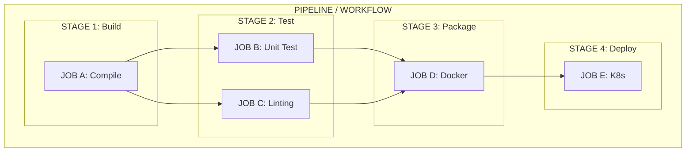
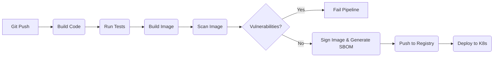

> **Складність:** [СЕРЕДНЯ]
>
> **Час на проходження:** 60-75 хвилин
>
> **Передумови:** [Модуль 1.1: Infrastructure as Code](/prerequisites/modern-devops/module-1.1-infrastructure-as-code/), [Модуль 1.2: GitOps](/prerequisites/modern-devops/module-1.2-gitops/), базові знання Git

---


## Що ви зможете зробити

До кінця цього модуля ви зможете:

- **Розрізняти** безперервну інтеграцію (Continuous Integration), безперервну доставку (Continuous Delivery) та безперервне розгортання (Continuous Deployment), аналізуючи сценарії релізів та визначаючи, де зупиняється автоматизація.
- **Спроєктувати** багатоетапний container-native конвеєр, який збирає, тестує, сканує, підписує, зберігає та розгортає один незмінний артефакт.
- **Оцінювати** компроміси між GitHub Actions, GitLab CI, Jenkins та Tekton для Kubernetes-native робочих процесів доставки.
- **Порівнювати** стратегії розгортання Kubernetes та pull-based доставку GitOps із традиційним push-based розгортанням у кластер.
- **Діагностувати** збої конвеєра та **оптимізувати** продуктивність доставки за допомогою кешування, тайм-аутів, незмінних тегів і раніших перевірок безпеки.


## Чому це важливо

[2 липня 2019 року](https://blog.cloudflare.com/details-of-the-cloudflare-outage-on-july-2-2019/) Cloudflare одночасно розгорнув нове правило Web Application Firewall на кожен периферійний вузол. Правило містило регулярний вираз, поведінка зворотного відстеження якого була квадратичною, і за лічені секунди завантаження CPU на кожній машині, що обслуговувала HTTP-трафік, досягло 100%. Глобальний трафік впав на 82%; виправлення тривало двадцять сім хвилин. Правило пройшло статичний аналіз, але механізм безпеки, який міг би виявити цей катастрофічний регулярний вираз, був видалений під час рефакторингу кількома тижнями раніше. Конвеєр CI/CD є єдиним вузьким місцем, де вирішується безпека артефакту. Якщо перевірка в конвеєрі слабшає, кожен наступний вузол одночасно отримує той самий дефектний артефакт; якщо перевірка витримує, радіус ураження від людської помилки залишається обмеженим бар'єрами, які досі контролює конвеєр.

У [2020 році](https://www.cisa.gov/news-events/alerts/2020/12/13/active-exploitation-solarwinds-software) зловмисники зламали середовище збирання SolarWinds Orion і вставили шкідливий код у підписане оновлення програмного забезпечення, якому довіряли клієнти. Цей інцидент розширив визначення ризику розгортання з «чи впаде наш застосунок?» до «чи можемо ми довести, звідки походить цей артефакт, хто його змінив, які залежності в ньому містяться, і чи торкалося його що-небудь після збирання?». Отже, сучасний конвеєр — це не просто зручний скрипт, обгорнутий навколо Git. Це фабрика програмного забезпечення, журнал аудиту, контрольно-пропускний пункт безпеки, контролер випусків і перше місце, де стає помітною слабка інженерна дисципліна.

Уявіть собі CI/CD як автоматизовану складальну лінію для програмного забезпечення. Початковий код надходить як сировина, проходить через станції контролю якості, стає образом контейнера, отримує мітку та підпис, і просувається далі лише тоді, коли кожна станція фіксує успішний результат. Команда все ще може обирати, коли реліз досягне користувачів, але реліз ніколи не повинен залежати від того, чи пам'ятає хтось, які команди і на якому хості потрібно виконати. Kubernetes 1.35+ передбачає саме такий світ: застосунки надходять як версійовані образи контейнерів, контролери розгортання сходяться до бажаного стану, а платформні команди покладаються на повторювану автоматизацію, а не на особистий фольклор розгортання.

Цей модуль перетворює цю складальну лінію на навичку проєктування. Ви відділите CI від двох значень CD, змоделюєте конвеєри як етапи та завдання, з'єднаєте Infrastructure as Code з бар'єрами доставки, убезпечите артефакти контейнерів за допомогою сканувань і перевірки походження, порівняєте поширені інструменти CI/CD і виберете стратегії розгортання, які відповідають ризику змін. Подальші модулі Kubernetes можуть згадувати скорочення інтерактивної оболонки для `kubectl`, але кожна виконувана команда в цьому модулі використовує повне ім'я двійкового файлу `kubectl`, тому скопійовані приклади поводитимуться однаково у скриптах і завданнях CI.

## Основні концепції: CI, Delivery та Deployment

Абревіатура «CI/CD» приховує три пов'язані, але різні обіцянки, і їхня плутанина призводить до крихкої архітектури релізів. Continuous Integration запитує, чи може зміна безпечно злитися зі спільною кодовою базою. Continuous Delivery запитує, чи готовий об'єднаний артефакт до випуску за запитом. Continuous Deployment запитує, чи повинна кожна успішна зміна автоматично надходити в продакшн без остаточного схвалення людиною. Ці межі мають значення, оскільки кожен крок вимагає більшої довіри до автоматизації, спостережуваності, відкочування та організаційної дисципліни, ніж попередній.

Continuous Integration існує для запобігання «пеклу інтеграції» — знайомому моменту на пізніх етапах проєкту, коли кілька довготривалих гілок нарешті стикаються, і ніхто не знає, яка саме зміна спричинила збій. У зрілому робочому процесі CI розробники часто зливають невеликі зміни, і кожен pull request або push запускає швидкий цикл зворотного зв'язку: checkout, компіляція, модульні тести, лінтинг, статичний аналіз, сканування секретів, а іноді й полегшений інтеграційний тест. Золоте правило полягає в тому, що «червона» головна гілка зупиняє звичайну роботу над функціоналом, оскільки зламана головна гілка перетворює конвеєр із корисного сигналу на фоновий шум.

Continuous Delivery будується на цьому фундаменті, створюючи перевірений, версійований, незмінний артефакт, який може бути випущений у будь-який момент. Важливе слово тут — «може». Конвеєр може автоматично розгортатися в staging-середовищі, виконувати наскрізні перевірки, публікувати звіти та очікувати біля бар'єра схвалення для продакшену, оскільки бізнес хоче скоординувати реліз із клієнтською підтримкою, відділом комплаєнсу або вікном обслуговування. Остання дія все ще залишається ручною, але ця ручна дія — це рішення про випуск, а не процедура розгортання, зібрана власноруч.

Continuous Deployment усуває це остаточне людське схвалення. Якщо зміна проходить усі автоматизовані бар'єри, система просуває її в продакшн. Це потужний підхід, але це не значок, який команда заробляє, просто видаливши кнопку схвалення. Він вимагає тестів, які виявляють реальні збої, feature-прапорців, що обмежують вплив, метрик, які швидко виявляють проблеми в користувачів, та автоматизації відкочування, яка може спрацювати швидше, ніж буде призначена зустріч. Без цих засобів контролю Continuous Deployment просто прискорює помилки.

> **Зупиніться та подумайте:** якщо команда переходить від Continuous Delivery до Continuous Deployment, яка система стає важливішою за кнопку розгортання: набір тестів, стек спостережуваності чи автоматизація відкочування? Практична відповідь полягає в тому, що всі три стають єдиною системою безпеки, оскільки повністю автоматизований шлях релізу потребує автоматизованих доказів до, під час і після розгортання.

Розглянемо два сценарії релізу. У першому розробник робить злиття в `main`, код компілюється, тести виконуються, а образ Docker надсилається в реєстр, але пізніше в п'ятницю ввечері команда експлуатації підключається по SSH до хоста і вручну завантажує тег. Ця команда має CI, а не delivery, оскільки шлях розгортання все ще залежить від людської пам'яті. У другому сценарії конвеєр збирає образ, розгортає його в QA, чекає, поки рецензент схвалить середовище продакшену, а потім автоматично виконує розгортання. Це Continuous Delivery, оскільки рішення про випуск приймається вручну, тоді як механіка автоматизована.

Ця різниця також впливає на розгляд інцидентів. Якщо продакшн зламався через те, що тест пропустив регресію, конвеєр може потребувати кращого покриття або безпечнішої стратегії розгортання. Якщо продакшн зламався через те, що інженер запустив неправильну команду, проблема полягає не лише в тестуванні; сама процедура розгортання була поза конвеєром. Senior-інженер, який розглядає невдалий реліз, запитує, де артефакт перейшов з рук в руки, де зупинилася автоматизація, і чи пройде наступна зміна через ту саму ненадійну прогалину.


## Анатомія конвеєра

Конвеєр (pipeline) найпростіше розуміти як ієрархію робочого процесу (workflow), етапів (stages), завдань (jobs), кроків (steps) та артефактів (artifacts). Робочий процес — це весь процес, що запускається подією, такою як pull request, push, tag, розклад (schedule) або запуск вручну. Етапи — це впорядковані групи, такі як збірка (build), тестування (test), пакування (package), сканування (scan) та розгортання (deploy). Завдання — це незалежні одиниці, які виконуються на runner'ах або в контейнерах, часто паралельно. Кроки — це команди всередині завдання, а артефакти — це результати, що передаються далі, такі як звіти про тестування, скомпільовані бінарні файли, SBOM, цифрові підписи або посилання на образи контейнерів.

Аналогія з кухнею ресторану є корисною, оскільки вона показує, чому важливі як послідовність, так і паралелізм. Обслуговування під час вечері — це робочий процес. Закуски, основні страви та десерти — це етапи, оскільки кухня не повинна подавати десерт до того, як будуть готові основні страви. Станції грилю та фритюру — це завдання, оскільки вони можуть працювати одночасно на окремому обладнанні. Нарізання, приправлення та обсмажування — це кроки, оскільки кожен з них залежить від попереднього в межах станції. Готова страва на тарілці — це артефакт, і якщо офіціант отримує іншу страву, ніж та, яку перевірив шеф-кухар, контроль якості зазнав невдачі.


```mermaid
flowchart LR
    subgraph Pipeline [PIPELINE / WORKFLOW]
        direction LR
        subgraph S1 [STAGE 1: Build]
            J_A[JOB A: Compile]
        end
        subgraph S2 [STAGE 2: Test]
            J_B[JOB B: Unit Test]
            J_C[JOB C: Linting]
        end
        subgraph S3 [STAGE 3: Package]
            J_D[JOB D: Docker]
        end
        subgraph S4 [STAGE 4: Deploy]
            J_E[JOB E: K8s]
        end
        J_A --> J_B
        J_A --> J_C
        J_B --> J_D
        J_C --> J_D
        J_D --> J_E
    end
```

Ця діаграма демонструє невеликий, але важливий принцип проєктування: зберіть один раз, а потім розгалужуйте там, де це можливо. Завдання компіляції має завершитися успішно до того, як тестування та лінтинг зможуть оцінити результат, але завдання модульного тестування (unit test) та лінтингу (linting) можуть виконуватися одночасно, оскільки жодне з них не потребує іншого. Етап пакування Docker очікує на обидві перевірки, а потім створює артефакт, який використовується завданням розгортання. Коли конвеєри здаються повільними, рішення часто полягає не в додаванні нових runner'ів; воно полягає в розпізнаванні того, які завдання є дійсно незалежними, а які випадково виконують послідовно роботу, що могла б виконуватися паралельно.

Концепція "конвеєр як код" (pipeline-as-code) робить цю ієрархію доступною для перевірки коду. GitHub Actions зберігає YAML робочого процесу в `.github/workflows/`, GitLab CI використовує `.gitlab-ci.yml`, Jenkins зазвичай використовує `Jenkinsfile`, а Tekton представляє конвеєри як Custom Resources у Kubernetes, такі як `Task`, `Pipeline`, `TaskRun` та `PipelineRun`. Зберігання визначення конвеєра поруч із застосунком означає, що процес розгортання змінюється в тому ж pull request, що й код застосунку, який цього потребує. Новий Service, нова залежність для тестування або нове правило сканування повинні перевірятися разом із кодом, на який вони впливають, а не виправлятися пізніше у прихованій панелі управління CI.

Межа артефакту є найважливішою межею у всьому конвеєрі. Якщо ви створюєте один образ для тестування, а другий образ для production, ви не просунули докази якості; ви створили двійника. Менеджери пакетів, базові образи та кроки віддаленої збірки можуть змінюватися між цими збірками, що означає, що в production можуть працювати залежності, яких тести ніколи не бачили. Зрілий конвеєр збирає єдиний незмінний образ, додає до нього тег із хешем коміту (commit SHA) або ідентифікатором релізу, сканує саме цей образ, підписує саме цей образ і просуває саме цей образ через середовища staging та production.

### Практичний приклад: Шлях одного коміту через лінію

Уявіть, що розробник змінює сервіс входу (login service), щоб додати суворіше закінчення терміну дії сесії. Pull request повинен спочатку дати відповідь на питання, чи вписується зміна в наявну кодову базу, тому CI перевіряє форматування, компілює сервіс, запускає швидкі модульні тести та шукає витоки облікових даних або небезпечні патерни. Ці перевірки навмисно наближені до розробника, оскільки вони виявляють помилки, поки зміна ще невелика. Помилка на цьому етапі повинна сприйматися як нормальна частина процесу редагування, а не як надзвичайна ситуація під час релізу.

Після успішного проходження швидких перевірок конвеєр може зібрати образ контейнера. Це момент, коли зміна перестає бути абстрактним набором вихідних файлів і стає артефактом, який Kubernetes зрештою буде запускати. Образ повинен отримати тег, прив'язаний до коміту, і, що важливіше, дайджест (digest), який ідентифікує його точний вміст. Теги — це зручні мітки, але дайджести є сильнішим ідентифікатором, оскільки вони змінюються при зміні будь-якого байта в образі.

Наступний етап тестує артефакт, а не збирає його заново. Інтеграційні тести можуть запустити сервіс входу разом із контейнером бази даних, перевірити шлях завершення сесії та опублікувати звіт для тих, хто проводить рев'ю. Якщо набору тестів потрібні допоміжні сервіси, конвеєр повинен створювати їх із тимчасової інфраструктури (disposable infrastructure), а не покладатися на спільне середовище з невідомим станом. Спільні тестові середовища часто призводять до оманливих помилок, оскільки завдання очищення або тестові дані (fixture data) однієї команди можуть змінити результат іншої.

Потім перевірки безпеки досліджують той самий образ з іншого кута. Сканування на вразливості перевіряє, чи містять базова операційна система та мовні залежності відомі проблеми. SBOM записує, що міститься всередині образу, щоб команда могла відповісти на майбутні запитання щодо вразливостей. Цифровий підпис фіксує, що цей артефакт був створений затвердженим конвеєром. Жодна з цих перевірок не доводить правильність логіки входу, але разом вони доводять, що артефакт є відомим, перевіреним і таким, що піддається відстеженню.

На цьому етапі конвеєр має достатньо доказів, щоб просунути образ у середовище staging. У Continuous Delivery розгортання на staging все одно має бути автоматизованим, оскільки ручні розгортання на staging — це те, як відхилення непомітно проникає в систему. Якщо в просторі імен (namespace) середовища staging відсутній Secret, використовується застарілий маніфест або він залежить від іншого стану міграції бази даних, конвеєр повинен виявити цю невідповідність ще до залучення production. Середовище staging є найціннішим тоді, коли воно достатньо схоже на production, щоб виявити проблеми розгортання, і достатньо ізольоване, щоб його можна було безпечно видалити.

Просування в production повинно бути нудним, оскільки всі цікаві запитання були задані раніше. Ворота затвердження (approval gate), якщо вони існують, повинні запитувати, чи готовий бізнес до цього релізу, а не чи пам'ятає інженер команду розгортання. Завдання після затвердження повинно оновити репозиторій GitOps, викликати контролер поступового доставлення (progressive delivery controller) або застосувати перевірений маніфест за допомогою облікових даних із суворо обмеженими правами. Той, хто затверджує (approver), повинен бачити дайджест образу, резюме тестування, результат сканування та цільове середовище, оскільки затвердження релізу без доказів — це просто ритуал.

Спостережуваність (observability) замикає цикл після початку розгортання (rollout). Конвеєр може розпочати розгортання, але працездатність сервісу повинна вимірюватися за сигналами з production, такими як частота помилок, затримка (latency), насичення (saturation), кількість перезапусків і специфічна для домену поведінка, наприклад, відсоток успішних входів у систему. Контролер розгортання може призупинити або скасувати (rollback) його, коли ці сигнали погіршуються. Саме тому зрілі команди доставки розглядають метрики та сповіщення як частину дизайну релізу, а не як окрему проблему експлуатації, що виникає лише після збою (outage).

Коли цей коміт пізніше спричиняє інцидент, той самий ланцюжок доказів допомагає зберегти об'єктивність аналізу. Команда може ідентифікувати точний дайджест образу, запуск робочого процесу, який його зібрав, тести, які було пройдено, вразливості, які були прийняті або відхилені, затвердження, яке його просунуло, і метрики, які змінилися після розгортання. Без цього ланцюжка розслідування інциденту перетворюється на спекуляції про те, який сервер, який образ, яка залежність або яка ручна команда були причетні. Отже, CI/CD також є інструментом для розслідування.

Цей самий ланцюжок також допомагає командам вдосконалюватися, не звинувачуючи того, хто випадково натиснув фінальне затвердження. Якщо регресія логіки входу пройшла непоміченою, тому що жоден тест не покривав прострочені сесії, коригувальною дією є тест і, можливо, canary метрика. Якщо вона пройшла, тому що staging використовував іншу конфігурацію, ніж production, коригувальною дією є паритет середовищ та перевірка конфігурації. Якщо вона пройшла, тому що тег образу перемістився після затвердження, коригувальною дією є фіксація дайджесту (digest pinning) та незмінне просування. Хороші конвеєри роблять наступне покращення очевидним, конкретним і повторюваним.

Цей практичний приклад показує, чому конвеєр — це не просто набір команд у YAML. Це послідовність тверджень: цей вихідний код було успішно злито (merged), цей артефакт був зібраний один раз, цей артефакт пройшов перевірки, цей артефакт був просунутий свідомо, і це розгортання поводилося прийнятно в реальних умовах. Якщо якогось твердження бракує, конвеєр усе ще може бути автоматизованим, але він ще не заслуговує на довіру. Інженерне завдання полягає в тому, щоб зробити ці твердження явними та достатньо дешевими, щоб кожна зміна могла їх нести.

> **Перед запуском цього в реальному проєкті зупиніться та подумайте про можливі причини збою:** що ви очікуєте, якщо інтеграційний тест використовує один дайджест образу, але маніфест розгортання вказує на тег, який був перезібраний пізніше? Ймовірним результатом буде заплутаний інцидент, коли кожна перевірка конвеєра здається зеленою, тоді як production поводиться інакше, оскільки протестований артефакт і розгорнутий артефакт більше не є одним і тим самим об'єктом.

## Інфраструктура як код у конвеєрі

CI/CD призначений не лише для коду застосунку. Terraform, Pulumi, CloudFormation, маніфести Kubernetes, Helm charts та ресурси Crossplane потребують такої самої дисципліни, оскільки зміни в інфраструктурі можуть бути більш небезпечними, ніж зміни в застосунку. Зламаний веб-маршрут (web route) може призвести до помилок; зламана мережева політика (network policy), IAM роль або міграція бази даних можуть позбавити шляху до відновлення. Тому конвеєр повинен перевіряти код інфраструктури до того, як він потрапить в обліковий запис, кластер або простір імен (namespace) середовища production.

Традиційне доставлення IaC дозволяє серверу CI виконувати зміни в інфраструктурі. Pull request запускає форматування, валідацію, лінтинг, сканування безпеки, оцінку вартості та `terraform plan`; після затвердження конвеєр запускає `terraform apply` з використанням облікових даних, що зберігаються в системі CI. Ця модель є прямою і широко зрозумілою, але вона також робить платформу CI привілейованим актором. Якщо її облікові дані є занадто широкими, скомпрометований runner може змінити інфраструктуру production далеко за межі запланованої зміни.

GitOps змінює напрямок контролю. Замість того, щоб дозволяти платформі CI вносити зміни (push) безпосередньо в кластер, конвеєр оновлює репозиторій Git, який описує бажаний стан, а внутрішньокластерний узгоджувач (reconciler), такий як Argo CD або Flux, затягує (pulls) ці зміни і застосовує їх локально. Для зовнішніх хмарних ресурсів команди можуть використовувати Crossplane або контролери провайдерів (provider controllers), щоб Custom Resources у Kubernetes представляли хмарні бази даних, бакети (buckets) та мережеві об'єкти. Компроміс полягає в більшій кількості рухомих частин, але межа безпеки є чистішою: кластер спостерігає за Git, і CI не потребує постійного токена адміністратора для кластера.

Оцінка вартості (cost estimation) повинна проводитися достатньо рано, щоб змінити поведінку. Якщо розробник додає керовану базу даних, корисним моментом для фінансового зворотного зв'язку є pull request, а не щомісячний рахунок і не фінальні ворота перед production. Такі інструменти, як Infracost, можуть залишати коментар до PR з оцінкою щомісячного впливу, тоді як інструменти політик можуть відхиляти ресурси через відсутність тегів, публічні бакети сховища або занадто широкі групи безпеки (security groups). Мета полягає не в тому, щоб збентежити розробника; вона полягає в тому, щоб зробити витрати та ризики видимими, поки зміна ще невелика.

Інфраструктурні перевірки повинні бути розшаровані (layered) від дешевих до дорогих. Форматування та валідація синтаксису повинні виконуватися першими, оскільки вони швидко завершуються помилкою і забезпечують точний зворотний зв'язок. Перевірки статичних політик і сканування секретів повинні виконуватися наступними, оскільки вони не потребують доступу до хмари. Плани, попередні перегляди (previews) та перевірки, специфічні для середовища, можуть виконуватися після цього, оскільки їм може знадобитися віддалений стан (remote state), облікові дані провайдера або доступ до кластера. Таке впорядкування забезпечує швидкий зворотний зв'язок і зменшує кількість випадків, коли привілейовані облікові дані потрапляють у конвеєр.


## Контейнерно-орієнтовані CI/CD та безпека ланцюга постачання

Розгортання у Kubernetes змінює артефакт з «якихось файлів, скопійованих на сервер» на «образ контейнера, на який посилається маніфест робочого навантаження». Це звучить просто, але розширює поверхню атаки. Образ містить пакети операційної системи, мовні залежності, код застосунку, метадані збірки та іноді неправильно налаштовані параметри за замовчуванням, успадковані від базового образу. Cloud-native pipeline повинен перевірити цей артефакт до того, як він потрапить до registry, і має залишити достатньо доказів, щоб оператори пізніше могли визначити, що саме запущено.


```mermaid
graph LR
    A[Git Push] --> B(Build Code)
    B --> C(Run Tests)
    C --> D(Build Image)
    D --> E(Scan Image)
    E --> F{Vulnerabilities?}
    F -- Yes --> G[Fail Pipeline]
    F -- No --> H(Sign Image & Generate SBOM)
    H --> I(Push to Registry)
    I --> J(Deploy to K8s)
```

Цей процес ставить безпеку перед просуванням у registry, оскільки registry має бути бібліотекою довірених артефактів, а не шухлядою для мотлоху з кожної експериментальної збірки. Pipeline збирає образ, сканує його, зупиняє роботу у разі порушення політик, генерує SBOM, підписує артефакт, і лише після цього пушить (pushes) або просуває його. У більш суворих системах admission control у кластері згодом перевіряє підпис до того, як запуститься Pod. Ця друга перевірка має значення, оскільки вона виявляє образи, які були змінені, замінені або завантажені з незатвердженого джерела після завершення CI.

SBOM (Software Bill of Materials) — це інвентаризація залежностей для образу. Виробники фізичних товарів використовують специфікації матеріалів (bills of materials), щоб визначити, які продукти містять відкликану деталь; команди розробників програмного забезпечення використовують SBOM, щоб визначити, які сервіси містять вразливий пакет після оприлюднення інформації про вразливість. Такі інструменти, як Syft, можуть генерувати SBOM під час CI, а сканери вразливостей, такі як Trivy або Grype, можуть порівнювати вміст образу з базами даних вразливостей. Під час надзвичайної ситуації на кшталт тієї, що була з Log4j, команда, яка має SBOM, шукає докази, тоді як команда без SBOM покладається на здогадки.

Фреймворк SLSA (Supply-chain Levels for Software Artifacts) надає командам модель зрілості для цілісності збірки. На початкових рівнях збірка автоматизована та створює дані про походження (provenance), що описують, як було створено артефакт. На вищих рівнях сервіс збірки є розміщеним на хостингу, ізольованим, ефемерним та захищеним від втручання. Практичний висновок для цього модуля полягає в тому, що pipeline повинен мати змогу відповісти: хто змінив код, який workflow його зібрав, яка ревізія вихідного коду використовувалася, які залежності були присутні, і чи був підписаний отриманий артефакт.

| Інструмент безпеки | Основне застосування | Open Source? | Примітки |
| :--- | :--- | :--- | :--- |
| **Trivy** (Aqua) | Комплексне сканування контейнерів та репозиторіїв | Так | Неймовірно швидкий. Сканує пакети ОС, мовні залежності та Infrastructure as Code (Terraform). Золотий стандарт для легкої інтеграції в CI. |
| **Grype** (Anchore) | Сканування контейнерів на вразливості | Так | Часто використовується безпосередньо разом із Syft (для генерації SBOM). Відмінна точність та глибокий аналіз. |
| **Snyk** | Платформа безпеки, орієнтована на розробників | Freemium | Глибока інтеграція з IDE, автоматично створює pull requests із виправленнями для розробників ще до того, як вони зроблять коміт коду. |
| **KubeLinter** | Сканування IaC / маніфестів Kubernetes | Так | Перевіряє YAML-маніфести Kubernetes на наявність неправильних налаштувань безпеки (наприклад, запуск контейнерів від імені root, відсутність лімітів ресурсів) *перед* розгортанням. |

Гейти безпеки (Security gates) потребують чітких порогів (thresholds), а не інтуїтивних відчуттів (vibes). Блокування через кожну знахідку з низьким рівнем серйозності може привчити розробників ігнорувати pipeline, особливо коли виправлення недоступне або не пов'язане з ризиком під час виконання (runtime risk). Набагато легше обґрунтувати блокування через критичні вразливості у базовому образі, які можна експлуатувати, витік облікових даних, непідписані релізні образи або привілейовані маніфести Kubernetes. Сильна команда платформи публікує політику простою мовою, послідовно виконує перевірки та надає розробникам швидкий шлях до виправлення ситуації замість загадкової червоної позначки про помилку.

Підписування образів замикає цикл між CI та кластером. Такі інструменти, як Cosign, прикріплюють підписи до дайджестів образів, а admission controllers, такі як Kyverno або OPA Gatekeeper, можуть відхиляти непідписані або ненадійні образи до того, як відбудеться планування (scheduling). Підпис не доводить, що застосунок не містить багів, але він доводить, що артефакт надійшов з очікуваного pipeline і не був підмінений на шляху до production. Ця відмінність є ключовою для безпеки ланцюга постачання, оскільки зловмисники часто атакують саме шлях доставки, а не репозиторій застосунку.

## Глибокий аналіз та порівняння інструментів

CI/CD інструменти відрізняються не стільки своїм словником, скільки операційною моделлю. GitHub Actions та GitLab CI зручні, коли платформа хостингу вихідного коду вже є центральною у робочому процесі команди. Jenkins залишається цінним, коли організаціям потрібні незвичайні плагіни, застарілі середовища для збірки (legacy build environments) або виділені адміністратори, які можуть відповідально його підтримувати. Tekton підходить командам платформ, які активно використовують Kubernetes і хочуть, щоб виконання pipeline виражалося як ресурси Kubernetes та планувалося (scheduled) як Pods. Найкращий вибір — це не найновіший інструмент, а той інструмент, з режимами відмов якого ваша команда здатна впоратися.

| Характеристика | GitHub Actions | GitLab CI | Jenkins | Tekton |
| :--- | :--- | :--- | :--- | :--- |
| **Архітектура** | SaaS / Self-hosted runners | SaaS / Self-hosted runners | Архітектура Master-Worker | Kubernetes-native (CRDs) |
| **Конфігурація** | YAML (`.github/workflows`) | YAML (`.gitlab-ci.yml`) | Groovy (`Jenkinsfile`) | YAML (Маніфести K8s) |
| **Сильні сторони** | Величезна екосистема готових дій (actions) від спільноти, найтісніша інтеграція з GitHub. Дуже низький поріг входу. | Чудова комплексна платформа (код, registry, CI/CD, відстеження завдань), надійний дашборд середовищ. | Неперевершена гнучкість, тисячі плагінів, винятково добре працює з legacy-системами та кастомним фізичним обладнанням. | Працює нативно всередині K8s, має високу масштабованість, відсутність стану (stateless), стандартизоване виконання через Pods. Створений для інженерів платформ. |
| **Слабкі сторони** | Локальне налагодження складних workflows є важким (потребує інструментів спільноти, таких як `act`). | Для найкращого досвіду потрібно використовувати GitLab і як хостинг Git-репозиторіїв. | «Пекло плагінів» ("Plugin hell"), вимагає значного та болісного постійного обслуговування, не є cloud-native за своєю природою. | Надзвичайно крута крива навчання, дуже багатослівний YAML, цілковита надмірність (overkill) для простих проєктів статичних сайтів. |
| **Найкраще для** | Open-source проєктів, команд, які вже прив'язані до екосистеми GitHub. | Підприємств, яким потрібна цілісна DevOps-платформа за принципом «єдиного вікна» (single-pane-of-glass). | Складних legacy-збірок, великих монолітів, команд із глибоким знанням Groovy та виділеними адміністраторами Jenkins. | Команд інженерів платформ із сильним акцентом на Kubernetes, які хочуть використовувати infrastructure-as-code для CI. |

GitHub Actions часто є найшвидшим шляхом для команд, які вже використовують GitHub, оскільки модель тригерів, модель дозволів, маркетплейс та перевірки для pull requests вже інтегровані. Ризик полягає в тому, що actions з маркетплейсу — це код, який ви виконуєте у своєму pipeline, тому закріплення версій (pinning versions) та перевірка дозволів мають велике значення. GitLab CI надає більш інтегровану DevOps-платформу, коли хостинг репозиторіїв, registry контейнерів, середовища та подання розгортань (deployment views) містяться в одному місці. Jenkins пропонує величезну гнучкість, але ця гнучкість перетворюється на операційні витрати, коли версії плагінів розходяться (plugins drift), агенти стають унікальними та крихкими («сніжинками»), а логіка на Groovy розростається настільки, що рев'юери вже не можуть її осмислити.

Tekton змінює ментальну модель, роблячи визначення pipeline ресурсами Kubernetes. `PipelineRun` створює Pods для завдань, ці Pods можуть використовувати кластерне планування та автомасштабування, а інструменти GitOps можуть керувати ресурсами pipeline як і будь-яким іншим маніфестом. Це елегантне рішення для команд платформ, що стандартизуються на Kubernetes, але воно занадто багатослівне (verbose) для невеликого статичного сайту або простого пакета бібліотеки. Якщо ваша команда не може пояснити RBAC у Kubernetes, планування Pods, робочі простори для зберігання даних (storage workspaces) та узгодження контролерів (controller reconciliation), Tekton може перенести складність з CI-дашборда в кластер, не зменшивши її.

> **Зупиніться та подумайте: який підхід ви б обрали в цій ситуації та чому?** Стартап запускає кожне робоче навантаження у Kubernetes, хоче, щоб CI-завдання масштабувалися разом із потужністю кластера, і вже керує ресурсами платформи за допомогою GitOps. Tekton архітектурно відповідає цим вимогам, оскільки розглядає pipelines як об'єкти Kubernetes, але GitHub Actions усе одно може бути прагматичним першим кроком, якщо команді потрібне робоче рішення вже цього тижня, а ресурсів для платформенної інженерії бракує.

## Стратегії розгортання через Pipelines

Після того, як образ зібрано, відскановано, підписано та збережено, pipeline все ще має вирішити, як користувачі отримають до нього доступ. Kubernetes за замовчуванням пропонує Rolling Update, але pipeline може координувати багатші стратегії за допомогою маніфестів, контролерів розгортання, маршрутизації Service Mesh, інструментів прогресивної доставки (progressive delivery) або змін, що вносяться GitOps-узгоджувачем (reconciler). Стратегія має відповідати ризиковості зміни, а не рівню сеньйорності людини, яка натискає кнопку розгортання. Виправлення CSS та переписування рушія рекомендацій, що працює з базою даних, не повинні мати однаковий план релізу.

| Стратегія | Ризик | Швидкість відкату (Rollback) | Вартість інфраструктури | Найкраще застосування |
| :--- | :--- | :--- | :--- | :--- |
| **Rolling Update** | Середній | Повільна | Низька (без додаткової інфраструктури) | За замовчуванням для більшості застосунків без стану (stateless). |
| **Blue-Green** | Низький | Миттєва | Висока (вдвічі більше ресурсів) | Критичні застосунки, що вимагають нульового часу простою (zero downtime) та миттєвого відкату. |
| **Canary** | Дуже низький | Швидка | Низька | Тестування нових функцій на реальних користувачах із мінімальним радіусом ураження (blast radius). |
| **Shadow** | Відсутній | Н/З (N/A) | Висока | Тестування рефакторингу бекенду або навантажувальної здатності без впливу на користувачів. |

Розгортання на основі push (Push-based deployment) — це традиційний патерн: CI-pipeline автентифікується в API Kubernetes і виконує команди або застосовує маніфести після збірки. Цей підхід прямолінійний, простий для розуміння та легкий для демонстрації, але він зберігає облікові дані кластера (cluster credentials) у CI-системі. GitOps на основі pull (Pull-based GitOps) змінює ці довірчі відносини на протилежні. Pipeline оновлює Git потрібним тегом образу або зміною маніфесту, а контролер усередині кластера витягує (pulls) та узгоджує (reconciles) цю зміну. CI більше не потребує прямого доступу до production-кластера, а Git стає джерелом бажаного стану (desired state), яке можна перевірити через аудит.

Rolling Updates — це поведінка за замовчуванням у Kubernetes для Deployments. Контролер поступово створює Pods для нового ReplicaSet і видаляє старі Pods, дотримуючись лімітів доступності. Це ефективно і часто є правильним для stateless-сервісів, але такий підхід передбачає, що стара і нова версії можуть працювати одночасно. Якщо друга версія змінює схему бази даних так, що перша версія не може її прочитати, Rolling Update може призвести до збою змішаних версій (mixed-version failure). Pipeline має виявляти цей ризик до початку розгортання, часто вимагаючи використання міграцій бази даних за шаблоном розширення-та-стиснення (expand-and-contract).

Розгортання Blue-Green підтримує два повноцінних середовища: синє (blue) є робочим, зелене (green) — простоює або розігрівається (warming). Pipeline розгортає нову версію в зеленому середовищі, запускає там перевірки, а потім перемикає маршрутизацію. Відкат (Rollback) відбувається швидко, оскільки трафік можна перемкнути назад на синє середовище, але вартість є високою, тому що команді потрібна подвійна потужність і ретельне управління станом. Ця стратегія підходить для високоцінних застосунків, де вартість ресурсів, що простоюють, є нижчою за вартість повільного відновлення.

Канаркове розгортання (Canary deployment) поступово відкриває нову версію для невеликого відсотка трафіку, відстежує метрики та збільшує охоплення лише тоді, коли сигнали залишаються в нормі. Одного разу команда провалила Canary-реліз, оскільки її балансувальник навантаження спрямував виділений відсоток трафіку на внутрішніх адміністраторів, які виконували незвично важкі запити для звітів, через що затримка (latency) виглядала гіршою, ніж була насправді. Урок полягає в тому, що Canary-релізи вимагають продуманої сегментації та значущих метрик. Canary, що базується лише на готовності Pod (Pod readiness), може пропустити бізнес-збої, тоді як Canary, що базується на викривленому трафіку, може відхилити цілком справний реліз.

Тіньове розгортання (Shadow deployment), яке іноді називають dark launching, дублює production-трафік на нову версію, водночас повертаючи користувачам лише відповіді від старої версії. Воно чудово підходить для сервісів із великим навантаженням на читання, тестування пошукової поведінки та перевірки продуктивності під реальним навантаженням. Проте воно небезпечне для шляхів виконання коду, які змінюють стан, надсилають електронні листи, знімають кошти з карток або записують події аналітики, оскільки здубльований трафік може створити здубльовані побічні ефекти. Безпечний Shadow-pipeline потребує суворого контролю, який не дозволить тіньовому сервісу записувати дані у production-системи.

> **Зупиніться та подумайте:** чому команда може обрати повільніше Canary розгортання замість майже миттєвого перемикання Blue-Green? Відповідь — у доказах. Blue-Green доводить, що нова версія може запуститися та пройти перевірки до того, як туди піде трафік; Canary доводить, що нова версія прийнятно поводиться під час контрольованого зрізу реальної поведінки користувачів, перш ніж її отримають усі.


## Патерни та антипатерни

Здорові конвеєри мають кілька спільних патернів, які роблять релізи нудними. Вони збирають код один раз, просувають той самий артефакт, рано повідомляють про помилки на дешевих перевірках, ізолюють runners, тримають облікові дані максимально обмеженими та перетворюють rollback на протестовану дію, а не на документ, який ніхто не відкривав під час інциденту. Ці патерни менш привабливі, ніж складний дашборд, але саме вони дозволяють командам робити розгортання у звичайні робочі дні без зайвого хвилювання.

| Патерн | Коли використовувати | Чому це працює | Масштабування |
| :--- | :--- | :--- | :--- |
| Збирати один раз, просувати всюди | Будь-який контейнеризований сервіс, що проходить через staging та production | Протестований артефакт є розгорнутим артефактом, тому докази слідують за image digest | Зберігайте image digests, SBOM, підписи та результати сканування разом |
| Швидкі перевірки перед повільними | Репозиторії зі зростаючими наборами тестів або дорогими інтеграційними середовищами | Розробники швидко отримують корисну інформацію про помилки, а runners не витрачаються даремно | Розділяйте jobs за межами залежностей та запускайте незалежні jobs паралельно |
| Ефемерні runners | Команди, які працюють з обліковими даними production, secrets або ризиками supply chain | Кожна збірка починається начисто, зменшуючи забруднення від попередніх jobs | Забезпечуйте runners через IaC або керовані пули замість ручного налаштування |
| Просування через GitOps | Платформи Kubernetes з кількома середовищами та потребами в аудиті | CI оновлює бажаний стан, тоді як кластер виконує узгодження (reconciles) зсередини межі довіри (trust boundary) | Використовуйте чітку структуру репозиторію та правила перевірки для змін у середовищах |

Погано спроєктований pipeline може бути гіршим, ніж його відсутність, оскільки він створює хибне відчуття безпеки. Якщо розробники дізнаються, що збої є випадковими, схвалення (approvals) — формальними, або розгортання все ще залежать від прихованого shell-скрипта, вони будуть обходити систему. Наведені нижче антипатерни не є недоліками характеру; це структурні пастки, які з'являються, коли команди додають автоматизацію, не визначивши, які саме докази ця автоматизація повинна генерувати.

| Антипатерн | Опис та вплив | Рішення (найкраща практика) |
| :--- | :--- | :--- |
| **Фобія "Deploy on Friday"** | Страх перед розгортанням наприкінці тижня означає, що ваш набір автоматизованих тестів є неадекватним, а ваш CI/CD pipeline принципово ненадійний. | Метою continuous delivery є нудні розгортання без пригод. Зміцнюйте довіру за допомогою вичерпного автоматизованого тестування та надійних механізмів rollback, щоб розгортання наприкінці тижня було безпечним. |
| **The Snowflake Build Agent** | Використання self-hosted CI runner, який був налаштований вручну багато років тому. Якщо жорсткий диск вийде з ладу, компанія не зможе розгортати код протягом тижня. | Build agents повинні бути повністю ефемерними, stateless і динамічно створюватися за допомогою Infrastructure as Code. |
| **Ігнорування Flaky Tests** | Тести, які випадково падають у 10% випадків, руйнують довіру. Розробники ігноруватимуть помилки, вважаючи, що це просто нестабільний тест (flaky test), маскуючи справжні баги. | Flaky tests необхідно видаляти, вимикати або виправляти негайно. Це отрута для pipeline. |
| **Secrets у коді** | Жорстке кодування API ключів або паролів баз даних у YAML-файлі визначення pipeline відкриває їх для всіх, хто має доступ на читання репозиторію. | Використовуйте нативне управління secrets, HashiCorp Vault або Kubernetes External Secrets і впроваджуйте (inject) значення виключно під час виконання (at runtime). |
| **The "God" Script** | Pipeline, що складається з єдиного нечитабельного 800-рядкового скрипта `deploy.sh`, який неможливо дебажити та який не може використовувати паралельне виконання. | Розбийте скрипти на окремі логічні CI/CD jobs та вузькоспрямовані steps, які можуть виконуватися паралельно. |
| **Manual Gates усюди** | Вимога ручного схвалення від менеджера для кожного етапу створює величезні вузькі місця (bottlenecks). | Автоматизуйте quality gates на основі суворих порогових значень. Залиште ручні схвалення лише для остаточного бізнес-рішення щодо релізу в production. |
| **Монолітний Pipeline** | Єдиний pipeline, який послідовно збирає багато різних мікросервісів, навіть якщо змінився лише один, відтворює "пекло інтеграції" (integration hell) всередині CI. | Обмежуйте pipelines кодовою базою, яка змінилася, використовуючи фільтрацію за шляхами (path filtering), виявлення порушених проєктів (affected-project detection) або інструменти для монорепозиторіїв. |
| **Покинуті артефакти** | Створення Docker images для невдалих розгортань і відсутність очищення реєстру призводить до витрат на хмарне сховище, яких з часом можна було б уникнути. | Container registries повинні мати налаштовані політики життєвого циклу (lifecycle policies) для видалення untagged або старих development images. |
| **Pipeline як залишкова думка** | Написання коду застосунку місяцями, а потім створення CI/CD pipeline безпосередньо перед запуском створює крихкий шлях до релізу. | Pipeline має бути однією з перших частин коду проєкту, щоб обмеження доставки формували сервіс на ранніх етапах. |


## Фреймворк прийняття рішень

Проєктування pipeline — це набір компромісів (trade-offs), а не універсальний шаблон. Почніть із запитання: що має бути доведено перед merge, що має бути доведено перед релізом, кому дозволено просувати артефакт і як система відновлюється, коли відповідь неправильна. Невеликому внутрішньому інструменту можуть знадобитися швидкі тести, сканування на вразливості та ручне розгортання. Платіжному сервісу можуть знадобитися підписані образи (signed images), збереження SBOM, canary аналіз, схвалення для середовищ (environment approvals) та контролер GitOps, що забезпечує стан production.

| Точка прийняття рішення | Обирайте простіший варіант, коли | Обирайте сильніший варіант, коли | Операційний компроміс |
| :--- | :--- | :--- | :--- |
| Лише CI vs Continuous Delivery | Команда все ще створює надійні збірки та тести | Розгортання у staging та production потребують повторюваності | Delivery додає управління середовищами та проєктування схвалень |
| Continuous Delivery vs Continuous Deployment | Релізи потребують узгодження часу для бізнесу або схвалення compliance | Тести, метрики, feature flags та rollback є зрілими | Deployment усуває очікування, але підвищує вимоги до автоматизації |
| Push CD vs GitOps pull CD | Платформа невелика, а облікові дані CI жорстко обмежені | Kubernetes є центральним елементом, і облікові дані production потребують сильніших меж | GitOps додає контролери та рішення щодо структури репозиторію |
| Rolling update vs canary | Сервіс є stateless, а зміна має низький ризик | Потрібна поведінка реальних користувачів перед широким розкриттям | Canary потребує розподілу трафіку (traffic splitting) та значущих метрик |
| GitHub Actions vs Tekton | Інтеграція з хостингом коду та швидкість є найважливішими | Pipelines повинні запускатися як Kubernetes-native ресурси | Tekton підходить командам платформи, але збільшує кількість YAML та складність кластера |

Використовуйте цю послідовність як практичний контрольний список для перевірки. По-перше, ідентифікуйте артефакт і переконайтеся, що він збирається один раз. По-друге, вирішіть, які перевірки мають блокувати merge, а які — просування (promotion). По-третє, оберіть, чи CI робить push у кластер, чи оновлює Git для внутрішньокластерного reconciler. По-четверте, виберіть стратегію розгортання (rollout strategy) на основі радіуса ураження (blast radius) та швидкості rollback. По-п'яте, визначте метрики, які визначають успіх. Pipeline без явних метрик успіху — це просто послідовність команд з доданим до неї оптимізмом.

Коли pipeline падає, діагностуйте його пошарово. Якщо падає збірка, перевірте зміни залежностей, образи runners (runner images) та ключі кешу (cache keys). Якщо падають тести, визначте, чи є помилка детермінованою, нестабільною (flaky) або специфічною для середовища. Якщо не проходить сканування образу, перевірте базовий образ (base image) та дерево залежностей перед тим, як пригнічувати (suppressing) знахідку. Якщо не вдається розгортання, порівняйте маніфест, image digest, політику namespace та події rollout. Якщо користувачі повідомляють про помилки після успішного (green) rollout, перегляньте, чи стратегія розгортання моніторила правильні бізнес- та service-level індикатори.


## Чи знали ви?

- **Розгортайте набагато частіше:** [Дослідницька програма DORA](https://dora.dev/research/) неодноразово виявляла, що високоефективні організації з доставки програмного забезпечення здійснюють розгортання набагато частіше, ніж неефективні, і водночас швидше відновлюються після інцидентів.
- **Менше часу на усунення вразливостей:** Команди, які інтегрують автоматизоване сканування на вразливості на ранніх етапах pipeline, часто витрачають набагато менше часу на усунення критичних проблем безпеки порівняно з командами, які сканують лише перед релізом.
- **Перший CI-сервер:** CruiseControl, один із перших широко використовуваних інструментів Continuous Integration, був створений розробниками ThoughtWorks у 2001 році та допоміг популяризувати автоматизований зворотний зв'язок щодо збірок.
- **10 розгортань на день:** У 2009 році інженери Flickr представили доповідь «10+ розгортань на день» (10+ Deploys per Day), яка зробила часті розгортання в production практичними для багатьох команд, що все ще вважали щомісячні релізи швидкими.


## Типові помилки

| Помилка | Чому це трапляється | Як це виправити |
| :--- | :--- | :--- |
| **Використання тегів образу `latest`** | Розробники використовують `image: myapp:latest` у файлах розгортання Kubernetes задля зручності під час раннього тестування. | **Ніколи не використовуйте `:latest`.** Використовуйте конкретні, незмінні (immutable) теги або image digests, такі як Git commit SHA, щоб перезапущений вузол не міг завантажити інший артефакт, ніж той, який був протестований. |
| **Відсутність обмежень timeout для jobs** | Процес зависає на невизначений час в очікуванні повільного API, недоступної залежності або через нескінченний цикл усередині тесту. | Визначайте явні таймаути для кожного job та step, наприклад `timeout-minutes: 15` у GitHub Actions, щоб робота, яка завершилася помилкою, швидко звільняла runner. |
| **Багаторазове збирання образів** | Команда наново збирає Docker image для тестування, staging та production, оскільки кожне середовище має власну стадію pipeline. | Збирайте один раз, скануйте один раз, підписуйте один раз і просувайте той самий незмінний (immutable) артефакт образу через кожне середовище. |
| **Запуск сканувань наприкінці** | Перевірки безпеки розміщуються безпосередньо перед розгортанням, де вони відчуваються як болісне "вузьке місце" (bottleneck) релізу. | Перемістіть сканування вліво (shift left), запускаючи secret scanning, SAST, перевірки IaC та image scanning настільки рано, наскільки доступні їхні вхідні дані. |
| **Відсутність використання кешу** | Pipeline завантажує той самий архів залежностей під час кожного запуску, навіть якщо lock-файл не змінився. | Використовуйте кешування залежностей із ключами (keyed) на основі lock-файлів і автоматично інвалідуйте кеш, коли залежності змінюються. |
| **Втома від сповіщень (Alert fatigue)** | Pipeline надсилає сповіщення про кожен успішний step, тому розробники вимикають звук каналу (mute) та пропускають реальні збої. | Надсилайте сповіщення лише у випадках помилок, відновлення після помилок та подій, які вимагають дії людини, таких як схвалення (approval) для production. |


## Контрольні запитання

<details>
<summary>1. Ситуація: Команда створює та тестує образ контейнера при кожному merge, а потім оператор вручну розгортає цей образ у production пізніше того ж тижня. Це Continuous Integration, Continuous Delivery чи Continuous Deployment?</summary>
Це лише Continuous Integration. Pipeline інтегрує зміну, валідує її та створює артефакт, але процес розгортання залишається ручним і відокремленим від автоматизованого workflow. Continuous Delivery автоматизувало б механіку розгортання та залишило б лише рішення про release для схвалення людиною. Continuous Deployment усунуло б це production-схвалення і автоматично випускало б кожну успішну зміну.
</details>

<details>
<summary>2. Ситуація: Pipeline збирає один Docker-образ для інтеграційних тестів, а потім перезбирає другий образ із того самого вихідного коду для production. Чому це небезпечно?</summary>
Production-образ не є тим самим артефактом, який пройшов тестування, тому команда порушила ланцюг доказів. Package manager, base image або транзитивна залежність можуть змінитися між двома збірками, навіть якщо вихідний код застосунку залишився незмінним. Безпечнішим дизайном є створення одного immutable образу, сканування та підписання саме цього образу та його просування через staging і production. Це полегшує діагностику збоїв, оскільки кожне середовище посилається на один і той самий digest.
</details>

<details>
<summary>3. Ситуація: Роздрібний сервіс випускає новий recommendation engine під час активного сезону. Чому команда може обрати canary deployment замість звичайного rolling update?</summary>
Canary обмежує blast radius, піддаючи новій поведінці лише невелику частину реального трафіку перед розширенням rollout. Rolling update може довести, що Pods здорові, але він не доводить автоматично, що recommendation engine продукує прийнятну бізнес-поведінку. Завдяки canary-аналізу команда може спостерігати за error rates, latency, впливом на конверсію та іншими індикаторами сервісу до того, як усі отримають нову версію. Компромісом є те, що canaries вимагають контролю маршрутизації та значущих метрик.
</details>

<details>
<summary>4. Ситуація: Платформна команда хоче, щоб pipeline-визначення керувалися як Custom Resources у Kubernetes, а build steps виконувалися як Pods. Який інструмент підходить найкраще і чому?</summary>
Tekton найкраще підходить архітектурно, оскільки він визначає CI/CD workflows через ресурси Kubernetes і виконує tasks як Pods. Це дозволяє команді керувати інфраструктурою pipeline за допомогою тих самих GitOps-практик, що використовуються для маніфестів застосунків. Це також дозволяє pipeline workloads використовувати планування кластера та поведінку autoscaling. Компромісом є складність, оскільки Tekton вимагає впевненої роботи з Kubernetes controllers, RBAC, workspaces та розлогими YAML-визначеннями.
</details>

<details>
<summary>5. Ситуація: Відділ безпеки запитує, чому CI-система не повинна мати постійного токена адміністратора production-кластера. Як pull-based GitOps зменшує цей ризик?</summary>
Pull-based GitOps тримає production reconciler всередині кластера і дозволяє йому витягувати desired state з Git. CI-система оновлює репозиторій або посилання на tag образу, замість того, щоб безпосередньо застосовувати маніфести до Kubernetes API. Це зменшує blast radius скомпрометованого CI-runner, оскільки йому більше не потрібні широкі credentials для production-кластера. Це також робить Git доступним для аудиту записом того, що має працювати в кластері.
</details>

<details>
<summary>6. Ситуація: Робочий процес GitHub Actions займає 45 хвилин, оскільки він завантажує ті самі npm-залежності під час кожного запуску. Що слід змінити, і що має бути ключем cache?</summary>
Додайте кешування залежностей і створюйте ключ кешу з lockfile, наприклад `package-lock.json`, щоб кеш змінювався лише тоді, коли змінюються залежності. Це дозволяє уникнути повторних завантажень, зберігаючи при цьому коректність під час оновлення графа залежностей. Кеш повинен прискорити отримання feedback, не приховуючи зміни залежностей від збірки. Якщо lockfile змінюється, pipeline має створити або відновити інший запис кешу, а не повторно використовувати застарілі пакети.
</details>

<details>
<summary>7. Ситуація: Підписаний образ проходить CI, але Kubernetes відхиляє Pod на етапі admission. Що слід перевірити в першу чергу?</summary>
Почніть із порівняння посилання на образ у маніфесті з digest, який підписав CI. Admission controllers зазвичай перевіряють конкретний digest або trusted identity, тому mutable tag, неправильний шлях до реєстру або непідписана перезбірка можуть спричинити відмову. Потім перевірте правило policy, щоб підтвердити, якого issuer, репозиторій або ідентичність підпису вона очікує. Цей збій корисний, оскільки він означає, що кластер забезпечує виконання trust contract артефакту, замість того, щоб запускати неперевірений образ.
</details>

<details>
<summary>8. Ситуація: Сервіс потребує міграції схеми бази даних, яку старі Pods не можуть прочитати. Чому базовий rolling update є ризикованим, і що натомість має зробити команда?</summary>
Rolling update тимчасово запускає старі та нові Pods разом, тому несумісні зміни схеми можуть зламати одну версію, поки інша все ще обслуговує трафік. Команда повинна відокремити міграцію бази даних від розгортання застосунку або використати патерн міграції expand-and-contract, який зберігає сумісність обох версій під час переходу. Вони також можуть обрати безпечнішу стратегію rollout з явними перевірками та плануванням rollback. Головне — зберігати сумісність доти, доки жоден старий Pod не потребуватиме старої схеми.
</details>


## Практична вправа

У цій вправі необхідно **створити** робочий процес GitHub Actions, який збирає образ контейнера, використовує кешування для пришвидшення встановлення залежностей, сканує образ за допомогою Trivy, симулює шлюз затвердження для безперервного розгортання та додає тайм-аут, щоб зависле завдання швидко завершувалося зі збоєм. Застосунок навмисно невеликий, оскільки мета полягає у вивченні механіки конвеєра, а не у створенні виробничого вебсервісу. Спершу необхідно **створити** небезпечний образ і побачити, як спрацює безпековий шлюз, а потім **виправити** базовий образ, щоб конвеєр успішно завершив роботу.

### Завдання 1: Створити застосунок та Dockerfile

**Створити** простий застосунок Node.js, який навмисно використовує застарілий, вразливий базовий образ, щоб продемонструвати безпекові шлюзи конвеєра в дії. Це відображає реальні інциденти, коли код застосунку є безпечним, але успадкований шар операційної системи переносить критичні вразливості у виробниче середовище. Головне зрозуміти, що конвеєр має оцінювати весь артефакт загалом, а не лише рядки коду, написані розробником застосунку.

1. **Створити** новий каталог та ініціалізувати git-репозиторій.
2. **Створити** файл з назвою `app.js`:

```javascript
const http = require('http');
const server = http.createServer((req, res) => {
  res.writeHead(200, { 'Content-Type': 'text/plain' });
  res.end('Hello KubeDojo Secure Pipeline!');
});
// Listen on port 8080
server.listen(8080, () => {
    console.log('Server is listening on port 8080');
});
```

3. **Створити** `package.json` (без залежностей часу виконання — застосунок використовує лише вбудований у Node модуль `http`):

```json
{
  "name": "kubedojo-pipeline-app",
  "version": "1.0.0"
}
```

4. **Згенерувати** lock-файл для ключа кешу npm: **запустити** `npm install` локально та **зафіксувати** (commit) отриманий `package-lock.json` перед відправленням (конфігурація `cache: 'npm'` у робочому процесі спирається на цей файл).

5. **Створити** `Dockerfile`. Зверніть увагу, що цей базовий образ навмисно застарілий для цієї лабораторної роботи:

```dockerfile
# INSECURE BASE IMAGE FOR TESTING PIPELINE GATES
FROM node:14.16.0-alpine
WORKDIR /app
COPY package*.json ./
RUN npm install
COPY app.js .
CMD ["node", "app.js"]
```

<details>
<summary>Рішення</summary>

```bash
mkdir my-pipeline-lab
cd my-pipeline-lab
git init

# Create app.js
cat <<EOF > app.js
const http = require('http');
const server = http.createServer((req, res) => {
  res.writeHead(200, { 'Content-Type': 'text/plain' });
  res.end('Hello KubeDojo Secure Pipeline!');
});
server.listen(8080, () => {
    console.log('Server is listening on port 8080');
});
EOF

# Create package.json
cat <<EOF > package.json
{
  "name": "kubedojo-pipeline-app",
  "version": "1.0.0"
}
EOF

# Generate package-lock.json for the workflow cache key
npm install
git add package-lock.json

# Create Dockerfile
cat <<EOF > Dockerfile
FROM node:14.16.0-alpine
WORKDIR /app
COPY package*.json ./
RUN npm install
COPY app.js .
CMD ["node", "app.js"]
EOF
```
</details>

### Завдання 2: Визначити CI-конвеєр з кешуванням

**Створити** файл робочого процесу GitHub Actions, який налаштовує Node.js, кешує npm-залежності для пришвидшення майбутніх запусків та збирає образ Docker. Кешування тут безпечне, оскільки кеш прив'язаний до визначення залежностей, а не використовується наосліп. Якщо lock-файл залежностей змінюється, ключ кешу змінюється, і робочий процес природним чином оновлює набір залежностей.

1. **Створити** структуру каталогів робочого процесу: `.github/workflows/`
2. **Створити** файл з назвою `ci-cd.yml` у цьому каталозі.
3. **Налаштувати** його для запуску під час подій `push` у гілку `main`.
4. **Додати** завдання з назвою `build-and-test`, яке виконується на `ubuntu-latest`.
5. **Додати** кроки для отримання коду, налаштування Node.js, встановлення залежностей та збирання образу Docker як `kubedojo-app:test`.

<details>
<summary>Рішення</summary>

```yaml
# .github/workflows/ci-cd.yml
name: Secure CI/CD Pipeline

on:
  push:
    branches: [ "main" ]

jobs:
  build-and-test:
    runs-on: ubuntu-latest
    steps:
    - name: Checkout code
      uses: actions/checkout@v4

    # This action natively handles caching node_modules based on package-lock.json
    - name: Setup Node.js and Cache
      uses: actions/setup-node@v4
      with:
        node-version: '22'
        cache: 'npm'

    - name: Install dependencies
      run: npm install

    - name: Build Docker image
      run: docker build -t kubedojo-app:test .
```
</details>

### Завдання 3: Додати сканування на вразливості

**Розширити** завдання `build-and-test`, щоб сканувати зібраний образ. Сканування має відбуватися після збирання образу, оскільки для цього потрібен готовий артефакт, але перед розгортанням, тому що реєстр і кластер не повинні отримувати артефакт, який порушує політику. У цій лабораторній роботі політика блокує критичні вразливості, тому помилка є очевидною і пов'язана з навмисно застарілим базовим образом.

1. **Відредагувати** `.github/workflows/ci-cd.yml`.
2. В кінці завдання `build-and-test` **додати** крок, який використовує офіційний GitHub Action для Trivy.
3. **Налаштувати** його для сканування образу `kubedojo-app:test`.
4. **Встановити** `exit-code: '1'`, щоб конвеєр завершувався зі збоєм у разі виявлення відповідних вразливостей.
5. **Встановити** `severity: 'CRITICAL'`, щоб у цій лабораторній роботі блокувати лише проблеми найвищого ризику.

<details>
<summary>Рішення</summary>

**Додати** цей крок до завдання `build-and-test`:

```yaml
    - name: Run Trivy vulnerability scanner
      uses: aquasecurity/trivy-action@v0.36.0
      with:
        image-ref: 'kubedojo-app:test'
        format: 'table'
        exit-code: '1'          # 1 means fail the GitHub Action if vulns found
        ignore-unfixed: true
        vuln-type: 'os,library'
        severity: 'CRITICAL'    # Only block the build on CRITICAL severity
```
</details>

### Завдання 4: Виконати та проаналізувати безпековий збій

Якби ви відправили це на GitHub, робочий процес запустився б і завершився зі збоєм, коли Trivy повідомить про критичні вразливості в старому базовому образі. Для локальної симуляції необхідно **зібрати** образ і **запустити** Trivy за допомогою Docker для локального образу. Важливим навчальним моментом є ненульовий код виходу: інструменти CI/CD не повинні розуміти кожну деталь вразливості, головне, щоб крок сканування давав чіткий результат — успіх або збій.

1. **Зібрати** образ локально для тестування: `docker build -t kubedojo-app:test .`
2. **Запустити** Trivy локально за допомогою Docker (відтворивши прапорці CI): `docker run --rm -v /var/run/docker.sock:/var/run/docker.sock aquasec/trivy image --severity CRITICAL --ignore-unfixed --vuln-type os,library --exit-code 1 kubedojo-app:test`
3. **Переконатися**, що сканер повертає код виходу `1`, який зупинив би конвеєр перед розгортанням.

<details>
<summary>Фрагмент виводу рішення</summary>

```text
node:14.16.0-alpine (alpine 3.13.2)
===================================
Total: 3 (CRITICAL: 3)

┌─────────────┬────────────────┬──────────┬───────────────────┬───────────────┬───────────────────────────────────────────────────────┐
│   Library   │ Vulnerability  │ Severity │ Installed Version │ Fixed Version │                         Title                         │
├─────────────┼────────────────┼──────────┼───────────────────┼───────────────┼───────────────────────────────────────────────────────┤
│ apk-tools   │ CVE-2021-36159 │ CRITICAL │ 2.12.5-r0         │ 2.12.7-r0     │ libfetch before 2021-07-26, as used in apk-tools,     │
│             │                │          │                   │               │ OSv, and other products, mishandles...                │
...
```
</details>

### Завдання 5: Виправити вразливість

Щоб конвеєр успішно пройшов перевірку, необхідно **виправити** першопричину, а не приховувати знахідку. У цьому випадку першопричиною є базовий образ, який більше не підтримується. Оновлення до актуального базового образу змінює набір пакетів операційної системи та дозволяє успішно пройти ту саму політику сканування без послаблення безпекового шлюзу.

1. **Відкрити** ваш `Dockerfile`.
2. **Змінити** рядок `FROM`, щоб використовувати `node:22-alpine`.
3. Повторно **запустити** локальне збирання Docker: `docker build -t kubedojo-app:test .`
4. Повторно **запустити** локальне сканування Trivy та **переконатися**, що воно завершується успішно.

<details>
<summary>Рішення</summary>

**Оновлений Dockerfile:**

```dockerfile
FROM node:22-alpine
WORKDIR /app
COPY package*.json ./
RUN npm install
COPY app.js .
CMD ["node", "app.js"]
```

Коли ви повторно запустите Trivy, вивід має закінчуватися на `Total: 0 (CRITICAL: 0)`, і процес завершиться успішно. Тепер шлюз конвеєра розблоковано.
</details>

### Завдання 6: Впровадити безперервне розгортання

Тепер, коли образ безпечний і збирається коректно, необхідно **симулювати** робочий процес безперервного розгортання, додавши завдання розгортання, яке вимагає ручного затвердження перед виконанням. У реальному репозиторії налаштування `environment: production` може вимагати рецензентів перед запуском завдання. Це залишає механіку розгортання автоматизованою, зберігаючи при цьому усвідомлене рішення про випуск.

1. **Відредагувати** `.github/workflows/ci-cd.yml`.
2. **Додати** нове завдання з назвою `deploy-to-production`.
3. **Переконатися**, що це завдання запускається лише в разі успіху першого завдання, використовуючи `needs: build-and-test`.
4. **Додати** ключ `environment: production` до цього завдання.
5. **Додати** фіктивний крок, який виводить інформацію про активність розгортання.

<details>
<summary>Рішення</summary>

**Остаточний повний конвеєр (`.github/workflows/ci-cd.yml`):**

```yaml
name: Secure CI/CD Pipeline

on:
  push:
    branches: [ "main" ]

jobs:
  build-and-test:
    runs-on: ubuntu-latest
    steps:
    - name: Checkout code
      uses: actions/checkout@v4

    - name: Setup Node.js and Cache
      uses: actions/setup-node@v4
      with:
        node-version: '22'
        cache: 'npm'

    - name: Install dependencies
      run: npm install

    - name: Build Docker image
      run: docker build -t kubedojo-app:test .

    - name: Run Trivy vulnerability scanner
      uses: aquasecurity/trivy-action@v0.36.0
      with:
        image-ref: 'kubedojo-app:test'
        format: 'table'
        exit-code: '1'
        ignore-unfixed: true
        vuln-type: 'os,library'
        severity: 'CRITICAL'

  deploy-to-production:
    needs: build-and-test
    runs-on: ubuntu-latest
    # This environment keyword hooks into GitHub's deployment protection rules
    # allowing you to mandate manual approval before this job starts.
    environment: production
    steps:
    - name: Authenticate with Kubernetes Cluster
      run: echo "Simulating OIDC authentication to K8s cluster..."
      
    - name: Deploy Image
      run: |
        echo "Simulating applying Kubernetes manifests..."
        echo "kubectl set image deployment/myapp myapp=kubedojo-app:test"
        echo "Deployment successful!"
```
</details>

### Завдання 7: Налаштувати тайм-аут конвеєра

Однією з найпоширеніших і дорогих помилок CI/CD є те, що конвеєру дозволяють зависати на невизначений час в очікуванні зовнішнього сервісу або зламаного тесту. Тайм-аут — це не лише контроль витрат; це діагностична межа. Коли завдання постійно завершується через тайм-аут, команда може дослідити конкретний етап, замість того щоб через кілька годин виявити, що runner був зайнятий роботою, яка ніколи б не завершилася.

1. Востаннє **відредагувати** файл `.github/workflows/ci-cd.yml`.
2. **Додати** конфігурацію `timeout-minutes` до завдання `build-and-test`.
3. **Використати** суворий тайм-аут у 15 хвилин для цієї лабораторної роботи.

<details>
<summary>Рішення</summary>

**Оновити** визначення завдання `build-and-test`:

```yaml
jobs:
  build-and-test:
    runs-on: ubuntu-latest
    # Enforce a strict 15-minute timeout for the entire job
    timeout-minutes: 15
    steps:
    - name: Checkout code
      uses: actions/checkout@v4
      # ...rest of steps...
```

Якщо повільне встановлення, завислий тест або сканування триває довше 15 хвилин, GitHub Actions скасовує завдання, завершує конвеєр із чіткою помилкою та звільняє runner для іншої роботи.
</details>

### Критерії успіху

- [ ] Робочий процес збирає один образ контейнера та використовує те саме посилання на образ для сканування і симуляції розгортання.
- [ ] Перший запуск Trivy завершується зі збоєм, оскільки навмисно застарілий базовий образ містить критичні вразливості.
- [ ] Оновлення Dockerfile до `node:22-alpine` дозволяє успішно пройти шлюз критичних вразливостей.
- [ ] Завдання розгортання залежить від завдання збирання та використовує шлюз виробничого середовища для моделювання безперервного розгортання.
- [ ] Завдання збирання включає тайм-аут, щоб завислий конвеєр не споживав потужності runner'а нескінченно.


## Джерела

- [Cloudflare outage on July 2, 2019 (post-mortem)](https://blog.cloudflare.com/details-of-the-cloudflare-outage-on-july-2-2019/)
- [CISA: SolarWinds Orion supply-chain compromise (2020)](https://www.cisa.gov/news-events/alerts/2020/12/13/active-exploitation-solarwinds-software)
- [DORA Research Program](https://dora.dev/research/)
- [CruiseControl (ThoughtWorks, 2001)](https://www.thoughtworks.com/en-us/insights/blog/history-cruise-control)
- [Flickr: 10+ Deploys Per Day (Velocity 2009)](https://www.slideshare.net/slideshow/velocity-2009/1302790)
- [GitHub Actions workflow syntax](https://docs.github.com/en/actions/writing-workflows/workflow-syntax-for-github-actions)
- [GitHub Actions dependency caching](https://docs.github.com/en/actions/using-workflows/caching-dependencies-to-speed-up-workflows)
- [GitLab CI/CD YAML syntax reference](https://docs.gitlab.com/ci/yaml/)
- [Jenkins Pipeline documentation](https://www.jenkins.io/doc/book/pipeline/)
- [Tekton Pipelines documentation](https://tekton.dev/docs/pipelines/)
- [Kubernetes Deployments](https://kubernetes.io/docs/concepts/workloads/controllers/deployment/)
- [Argo CD documentation](https://argo-cd.readthedocs.io/en/stable/)
- [Flux documentation](https://fluxcd.io/flux/)
- [Trivy documentation](https://aquasecurity.github.io/trivy/)
- [Syft SBOM tool documentation](https://github.com/anchore/syft)
- [Sigstore Cosign documentation](https://docs.sigstore.dev/cosign/overview/)
- [SLSA specification](https://slsa.dev/spec/v1.0/)


## Наступний модуль

Зелений конвеєр доводить, що артефакт пройшов перевірки, які ви розробили, але він не доводить, що користувачі задоволені після випуску. Наступний модуль переходить від розгортання до відгуків із виробничого середовища, розглядаючи метрики, логи та трасування як систему доказів для робочих сервісів.

[Перейти до Модуля 1.4: Спостережуваність (Observability)](/prerequisites/modern-devops/module-1.4-observability/)
