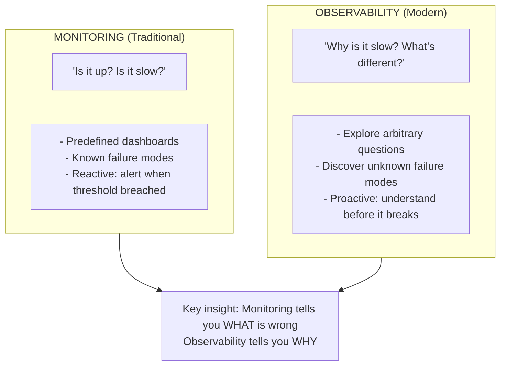
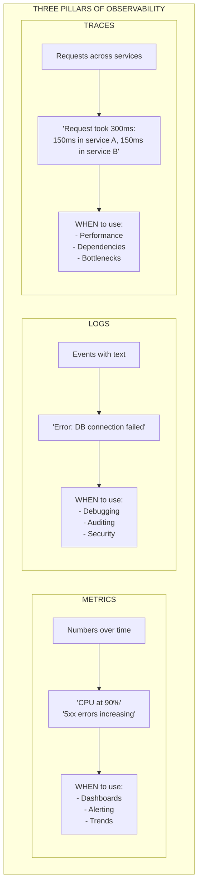
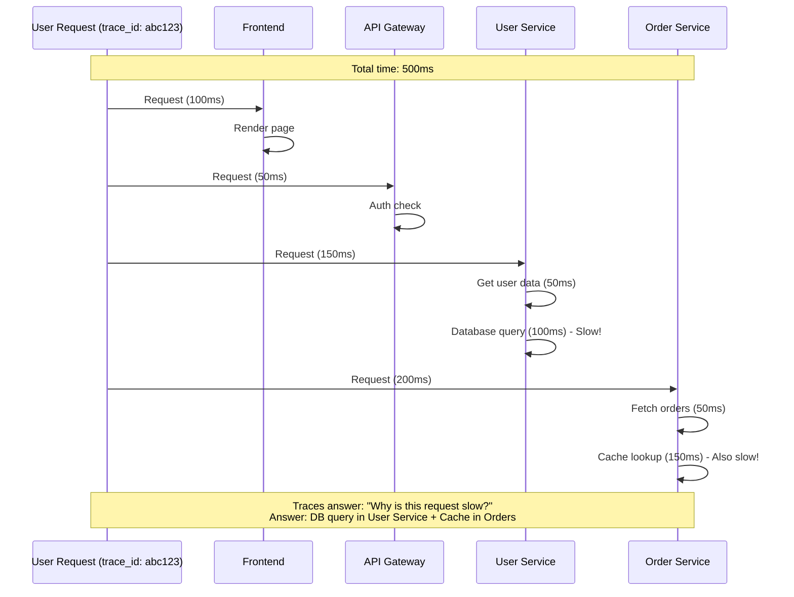
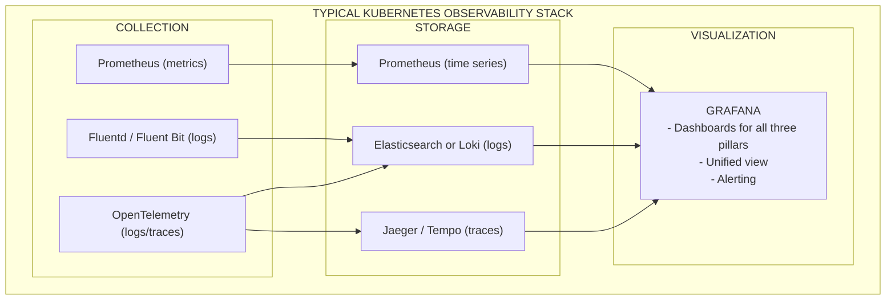
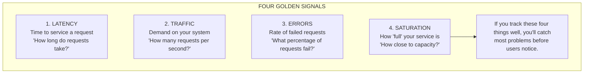
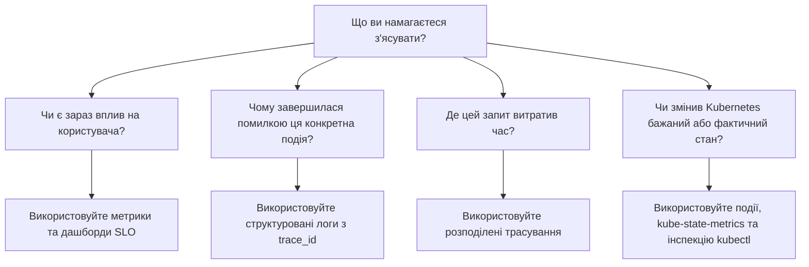

> **Складність**: `[MEDIUM]` - Критично важлива операційна навичка
>
> **Час на проходження**: 90-120 хвилин
>
> **Передумови**: Базове розуміння розподілених систем, Kubernetes Deployments та архітектури API.


## Що ви зможете зробити

Після завершення цього модуля ви зможете:

- **Порівняти** традиційні підходи до моніторингу із сучасними практиками Observability у складних розподілених архітектурах.
- **Оцінити** стан системи шляхом розробки запитів Prometheus, які використовують Counters, Gauges та Histograms без викривлення базової математики.
- **Діагностувати** збої в розподілених системах шляхом трасування запитів між межами сервісів за допомогою кореляції span-ів, передачі контексту (context propagation) та OpenTelemetry.
- **Впровадити** структуроване логування у форматі JSON, що підтримує швидке програмне розслідування під час критичних інцидентів.
- **Спроектувати** Service Level Indicators та Service Level Objectives, які вимірюють користувацький досвід замість симптомів нестабільної інфраструктури.


## Чому це важливо

10 серпня 2021 року нестандартний повільний запит від високонавантаженого внутрішнього застосунку призвів до деградації однієї з основних баз даних MySQL компанії GitHub. Логіка роботи з чергами та повторними спробами кластера завадила автоматичному відновленню, і інженери відкрили свої дашборди, щоб діагностувати проблему — лише для того, щоб виявити, що дашборди також не працюють, оскільки вони були розгорнуті на тій самій ураженій базі даних. GitHub витратив частину свого вікна реагування на інцидент, діагностуючи, чому він не може побачити, що саме зламалося. Перша хвиля тривала сімдесят сім хвилин; другий пов'язаний інцидент стався пізніше того ж дня і тривав три години. Коли моніторинг системи залежить від самої системи, що моніториться, середній час на діагностування (mean-time-to-diagnose) нелінійно зростає під час найгірших інцидентів — інструментарій observability має бути архітектурно ізольованим від робочих навантажень, за якими він спостерігає.

Платформи Kubernetes версії 1.35+ роблять цей урок ще більш нагальним, оскільки те, чим ви керуєте, рідко є одним довгоживучим сервером. Запит може пройти через хмарний балансувальник навантаження, Ingress-контролер, API-шлюз, сервіс автентифікації, клієнт feature flag, брокер повідомлень, кеш, базу даних і стороннього провайдера, перш ніж користувач побачить відповідь. Кожен перехід (hop) розгортається, масштабується, перезапускається та керується незалежно. Операційне питання змінюється з «чи працює сервер?» на «яка частина цього шляху запиту змінилася, скільки незручностей це створило для користувача, і що ми маємо зробити в першу чергу?».

Observability — це дисципліна, яка дозволяє відповідати на ці запитання на основі зовнішніх вихідних даних: метрик, логів, трейсів, подій та зв'язків між ними. Вона не замінює належне тестування, безпечне розгортання або просту архітектуру, але перетворює інцидент із вгадування на розслідування. У цьому модулі ви побудуєте ментальну модель, що лежить в основі observability, дізнаєтеся, коли кожен телеметричний сигнал є корисним, попрактикуєтесь в Kubernetes-нативній перевірці за допомогою явних команд `kubectl` та спроєктуєте сповіщення (alerts), які захищають користувачів, а не просто описують завантажену інфраструктуру.

## Що Observability додає до моніторингу

Observability — це властивість системи, а не торгова марка продукту для дашбордів. У теорії керування система є спостережуваною, якщо її внутрішній стан можна визначити з її зовнішніх вихідних даних. Для команд розробників це означає, що ви можете ставити нові запитання під час інциденту, не розгортаючи перед цим екстрений код для налагодження. Ви можете порівняти зламаний запит зі здоровим, пов'язати стрибок затримки (latency) з повільним спаном (span) сервісу, який його спричинив, і знайти запис у логах, який пояснює характер збою.

Традиційний моніторинг все ще корисний, але він передбачає, що ви вже знаєте, який збій шукаєте. Панель CPU відповідає на запитання, чи високе навантаження на CPU. Сповіщення про диск відповідає на запитання, чи мало вільного місця. Ці перевірки є цінними для відомих небезпек, особливо в простіших системах, але розподілені платформи виходять з ладу через взаємодії, які важко передбачити. Платіжний провайдер може працювати повільніше, що призведе до накопичення потоків (threads) застосунку, відкритих підключень до бази даних та відставання споживачів черги. Жодне сповіщення «CPU вище порогу» не пояснить цей ланцюжок.



Ця діаграма навмисно проста, оскільки культурна різниця є простою. Моніторинг починається з наперед визначених запитань, тоді як observability зберігає достатньо контексту для підтримки запитань, про потребу в яких ви навіть не підозрювали. Команда, яка має лише моніторинг, може знати, що затримка при оформленні замовлення є поганою, а потім відкрити окремі інструменти та шукати інформацію вручну за часовою міткою. Команда з observability може почати з графіка затримки, перейти до репрезентативного повільного трейсу, а потім перевірити логи за тим самим ідентифікатором трейсу.

Ця різниця має найбільше значення в умовах стресу. Під час серйозного інциденту люди не стають терплячішими, точнішими або більш схильними читати неоднозначні дашборди. Їм потрібна телеметрія, яка зменшує кількість варіантів. Хороша observability підказує тому, хто реагує на інцидент, де саме користувач відчуває проблеми, наскільки швидко вони зростають, який шлях залежностей задіяний і які докази підтверджують наступну дію. Це також допомагає після інциденту, оскільки ті самі дані пояснюють, чи дійсно виправлення відновило роботу сервісу.

Зупиніться та подумайте: метрики Prometheus вебзастосунку показують стабільний показник пам'яті (gauge), але користувачі бачать періодичні розриви з'єднання, а `kube_pod_status_phase` вказує на те, що Pod'и перезапускаються. Якщо Pod вбивається через нестачу пам'яті між зборами метрик (scrapes), показник може ніколи не відобразити пік. Який сигнал ви б додали, щоб не пропустити цей збій наступного разу, і чому він радше доповнить метрику, аніж замінить її?

Практична відповідь полягає в додаванні подій (events) Kubernetes, лічильників перезапусків та логів застосунку, які фіксують контекст завершення роботи. Метрики збираються вибірково (sampled), тому вони можуть пропустити швидкі стрибки, коли інтервал збору більший за час збою. Події та логи є дискретними записами, тому вони зберігають факт того, що kubelet вбив контейнер, навіть якщо графік ресурсів виглядає спокійно. Урок полягає не в тому, що метрики слабкі; він полягає в тому, що кожен сигнал має свою форму, і observability досягається завдяки розумному поєднанню цих форм.

```bash
# Confirm the client and server are available before starting the lab.
kubectl version
kubectl cluster-info
```

Використання повної команди дозволяє копіювати приклади в термінали, CI-завдання, ранбуки та нотатки щодо інцидентів. Багато інженерів створюють короткий інтерактивний псевдонім (alias) для своєї власної оболонки, але спільні навчальні програми та виробничі ранбуки не повинні передбачати, що цей псевдонім існує. Приклади Kubernetes у цьому модулі передбачають кластер версії 1.35+ або локальний кластер із сумісною поведінкою API.

## Три стовпи та їхні компроміси

Класична навчальна модель для observability використовує три стовпи: метрики, логи та трейси. Ця модель корисна, оскільки кожен стовп відповідає на окреме запитання під час розслідування. Метрики стискають поведінку в числа з плином часу, логи зберігають детальні події, а трейси об'єднують операції в шлях запиту. Зріла платформа не обирає один стовп, ігноруючи інші; вона корелює їх, щоб фахівці, які реагують на інцидент, могли перейти від симптому до доказів, не відновлюючи хронологію інциденту вручну.



Метрики — це нервова система, оскільки їх дешево зберігати і вони чудово підходять для виявлення трендів. Лічильник може сказати вам, що кількість запитів за секунду подвоїлася, рівень помилок перетнув поріг або черга зростає швидше, ніж воркери встигають її обробляти. Метрики також втрачають деталі (lossy) за своїм задумом. Вони навмисно відкидають контекст окремого запиту, щоб їх можна було масштабувати на місяці історії та тисячі цілей. Це стиснення робить їх ідеальними для сповіщень, але недостатніми для пояснення кожної першопричини.

Логи — це пам'ять системи, оскільки вони зберігають деталі, які агрегація видаляє. Структурований лог може зафіксувати клас помилки, маршрут запиту, назву залежності, кількість повторних спроб та ідентифікатор трейсу, що пояснює, чому змінилася метрика. Компроміс — це вартість. Логи важче передавати, індексувати, шукати та зберігати, особливо коли розробники логують кожен успішний запит просто тому, що хочуть підраховувати трафік. Логи повинні містити події високої цінності та діагностичний контекст, а не ставати другим бекендом для метрик.

Трейси — це карта системи, оскільки вони показують, як один запит пройшов через архітектуру. Вони є найкращим інструментом для запитань щодо затримки в сервіс-орієнтованих системах, оскільки показують, на що було витрачено час, а не просто констатують факт його витрачання. Їхній компроміс — це обсяг і накладні витрати (overhead). Платформа з високою пропускною здатністю зазвичай не може зберігати кожен трейс вічно, тому вона повинна робити розумну вибірку (sampling), зберігаючи при цьому аномальні запити, які знадобляться інженерам під час інцидентів.

Стовпи стають набагато потужнішими, коли вони мають спільні мітки (labels) та ідентифікатори. Якщо графік Prometheus показує зростання рівня помилок для `service=checkout`, бекенд трейсів повинен дозволяти фільтрувати за тим самим сервісом, а бекенд логів повинен містити поля `trace_id` для неуспішних запитів. Без спільних метаданих кожен інструмент стає окремим островом. Зі спільними метаданими фахівець може слідувати за доказами так само, як лікар переходить від життєво важливих показників до сканування, а потім до результатів аналізів.

Який підхід ви б обрали тут і чому: логувати тіло кожного HTTP-запиту, щоб ніколи не пропускати деталі, чи генерувати лічильник запитів плюс структуровані логи для помилок і вибіркових повільних запитів? Другий дизайн зазвичай кращий, оскільки він відокремлює вимірювання від діагностики. Лічильники є достатньо дешевими для кожного запиту, тоді як логи залишаються зосередженими на подіях, де їхня деталізація дійсно потрібна. Перший дизайн здається безпечним, поки вартість зберігання, загроза приватності та затримка запитів не зроблять систему телеметрії складнішою в експлуатації, ніж сам застосунок.


## Метрики з Prometheus

Метрики — це числові вимірювання, які збираються з плином часу, зазвичай із мітками, що описують, звідки походить вимірювання. У Kubernetes Prometheus є загальним стандартом, оскільки він отримує метрики з HTTP-ендпойнтів і зберігає їх як часові ряди. Модель pull добре підходить для Kubernetes: Services та Pods можуть з'являтися або зникати, і Prometheus може виявляти цілі для збору (scrape targets) з API-сервера, а не чекати, поки кожне робоче навантаження правильно надішле дані.

Найважливіша навичка роботи з Prometheus — це вибір правильного типу метрики. Counter (лічильник) відображає значення, яке лише збільшується до перезапуску процесу, як-от загальна кількість оброблених запитів. Gauge (вимірник) відображає поточне значення, яке може зростати або падати, наприклад, використання пам'яті або кількість активних з'єднань. Histogram (гістограма) записує спостереження в кошики (buckets), щоб ви могли аналізувати розподіли, особливо затримку (latency). Ці рішення не є косметичними; вони визначають, які операції PromQL будуть дійсними в подальшому.

```text
Counter (always increases):
  - http_requests_total
  - errors_total
  - bytes_sent_total

Gauge (can go up or down):
  - temperature_celsius
  - memory_usage_bytes
  - active_connections

Histogram (distribution):
  - request_duration_seconds
  - Shows: p50, p90, p99 latencies
```

Лічильники стають корисними, коли ви обчислюєте частоти (rates). Якщо ви безпосередньо побудуєте графік `http_requests_total`, лінія здебільшого буде нескінченно повзти вгору, що мало що скаже про поточний трафік. `rate(http_requests_total[5m])` перетворює лічильник на приріст за секунду в рухомому вікні (rolling window) — саме це насправді потрібно операторам під час інциденту. Ось чому використання Gauge для сумарного підрахунку є шкідливим: дані можуть виглядати як числа, але передбачена математика більше не відповідає метриці.

Вимірники (Gauges) найкраще підходять для стану, який може змінюватися в обох напрямках. Використання пам'яті, глибина черги, кількість Pod-ів та активні з'єднання є природними вимірниками, оскільки вони показують "скільки є прямо зараз". Вони все одно можуть вводити в оману, якщо їх інтерпретувати без контексту. Глибина черги в тисячу може бути нешкідливою під час запланованого пакетного завдання (batch job) і критичною під час інтерактивного оформлення замовлення. Корисний дашборд поєднує вимірник із трафіком, швидкістю обробки та затримкою для користувача, щоб чергові інженери могли визначити, чи є стан нормальним.

Гістограми (Histograms) захищають вас від середніх значень. Якщо дев'яносто дев'ять запитів виконуються швидко, а один запит займає кілька секунд, середнє значення може виглядати прийнятним, хоча реальний користувач страждає. Перцентилі, такі як p90 та p99, розкривають повільніший хвіст розподілу. У роботі з надійністю хвостова затримка (tail latency) часто має більше значення, ніж середня затримка, оскільки користувачі оцінюють сервіс за своїм власним запитом, а не за середнім досвідом усіх інших.

```text
# Prometheus collects metrics by scraping endpoints
# Your app exposes metrics at /metrics

# Example metrics endpoint output:
# HELP http_requests_total Total HTTP requests
# TYPE http_requests_total counter
http_requests_total{method="GET",path="/api",status="200"} 1234
http_requests_total{method="POST",path="/api",status="500"} 12

# HELP request_duration_seconds Request latency
# TYPE request_duration_seconds histogram
request_duration_seconds_bucket{le="0.1"} 800
request_duration_seconds_bucket{le="0.5"} 1100
request_duration_seconds_bucket{le="1.0"} 1200
```

Мітки (Labels) є джерелом аналітичної потужності Prometheus і однією з найпростіших точок відмови. Мітки на кшталт `method`, `status`, `route`, `namespace` та `service` дозволяють зрізати ту саму метрику у корисних операційних вимірах. Мітки, такі як `user_id`, `email_address`, `session_token` або сирі фрагменти URL-шляхів, можуть створювати необмежену кардинальність (unbounded cardinality). Кожна унікальна комбінація міток — це окремий часовий ряд, тому невинна на перший погляд мітка користувача може створити мільйони рядів і вичерпати пам'ять.

Найбезпечніше правило — позначати мітками обмежені операційні категорії, а не ідентифікатори чи довільні значення. Шаблон маршруту, такий як `/orders/{id}`, зазвичай безпечний, тоді як `/orders/928381` — ні. Мітка версії програмного забезпечення корисна, оскільки вона допомагає порівняти новий реліз зі старим. Мітка ідентифікатора запиту є небезпечною, оскільки вона створює новий часовий ряд для кожного запиту. Якщо вам потрібна деталізація на рівні запиту, використовуйте логи та трейси, яким і належить містити ці деталі.

```promql
# Rate of requests per second over 5 minutes
rate(http_requests_total[5m])

# Error rate
sum(rate(http_requests_total{status=~"5.."}[5m]))
/
sum(rate(http_requests_total[5m]))

# 99th percentile latency
histogram_quantile(0.99, rate(request_duration_seconds_bucket[5m]))
```

PromQL винагороджує за ясне мислення. Запит частоти помилок ділить частоту запитів, що завершилися невдало, на загальну частоту запитів, що перетворює сирі підрахунки на коефіцієнт, зрозумілий з точки зору користувача. Запит до гістограми оцінює 99-й перцентиль на основі частот по кошиках, що є більш значущим, ніж обчислення середньої тривалості. Коли ви оцінюєте стан системи, запитайте, чи відповідає запит запитанню. "Чи стикаються користувачі з помилками під час оформлення замовлення?" вимагає коефіцієнта помилок для трафіку оформлення замовлення, а не графіка використання CPU на вузлі.

Практична історія з передової ілюструє цю різницю. Одна команда щодня після обіду отримувала сповіщення (pages) про високе використання CPU контейнером для пошукового сервісу, але на користувачів це не впливало, оскільки сервіс прогрівав кеші під час очікуваного трафіку. Цей алерт привчив інженерів ігнорувати сповіщення. Коли команда замінила цей алерт на сповіщення про вигорання SLO (SLO burn alerts) для затримки та частоти помилок, шум зник, а наступний реальний інцидент вказав на зламану залежність, а не на зайнятий контейнер. Метрика не стала менш правдивою; вона просто стала менш центральною для сповіщень.


## Логи, події та докази середовища виконання Kubernetes

Логи — це записи окремих подій із позначками часу. Вони пояснюють те, що метрики навмисно приховують: тип винятку (exception type), код відповіді платіжного провайдера, стан прапорця функції (feature flag), ідентифікатор орендаря (tenant) або рішення про повторну спробу. У невеликій системі людина може читати неструктуровані логи й все одно досягати результату. На платформі Kubernetes, де Pod-и є короткоживучими, а логи надходять із багатьох реплік одночасно, структура логу є такою ж важливою, як і саме повідомлення.

```json
UNSTRUCTURED (hard to parse):
2024-01-15 10:23:45 ERROR Failed to connect to database: connection refused

STRUCTURED (JSON, easy to query):
{
  "timestamp": "2024-01-15T10:23:45Z",
  "level": "error",
  "message": "Failed to connect to database",
  "error": "connection refused",
  "service": "api",
  "pod": "api-7d8f9-abc12",
  "trace_id": "abc123def456"
}
```

Структуроване логування у JSON перетворює кожен рядок логу на невеликий запис з іменованими полями. Це важливо, оскільки реагування на інциденти сповнене запитань, які потребують фільтрації: покажіть помилки для одного сервісу, одного маршруту, однієї версії або одного ідентифікатора трейсу. Іноді регулярні вирази (regex) можуть витягти ці поля з тексту, але регулярні вирази, написані під час збою, є крихкими і повільними. Якщо застосунок випромінює поля безпосередньо, бекенд логування може їх проіндексувати, а інженери — робити запити з упевненістю.

Рівні логування — це контракт із майбутніми фахівцями з реагування. `DEBUG` має допомагати локальній розробці або тимчасовому глибокому розслідуванню. `INFO` повинен записувати значущі події життєвого циклу, а не кожен рядок нормального виконання. `WARN` має позначати несподівані, але відновлювані стани. `ERROR` означає, що робота завершилася невдачею і може потребувати уваги. `FATAL` має означати, що процес не може продовжуватися. Коли кожне повідомлення є помилкою, рівень втрачає сенс, а алерти стають зашумленими.

| Рівень | Коли використовувати |
|-------|-------------|
| DEBUG | Детальна інформація для зневадження (вимкнено у prod) |
| INFO | Нормальні операції, етапи |
| WARN | Щось несподіване, але таке, що можна відновити |
| ERROR | Щось завершилося невдачею, потребує уваги |
| FATAL | Застосунок не може продовжувати роботу |

Kubernetes надає вам негайний доступ до stdout та stderr контейнера через API-сервер, що зручно для швидкого перегляду. Однак шлях до логів середовища виконання за замовчуванням не є довгостроковим архівом. Якщо Pod видаляється, переноситься на інший вузол (rescheduled) або збирається збирачем сміття (garbage-collected) з вузла, локальні файли логів можуть зникнути. Тому у промисловому середовищі (production) спостережуваність використовує колектор DaemonSet, такий як Fluent Bit, Fluentd, Promtail або агент OpenTelemetry Collector, щоб відправляти логи з вузлів до того, як життєвий цикл робочого навантаження їх видалить.

```bash
# View logs
kubectl logs pod-name
kubectl logs pod-name -c container-name  # Multi-container
kubectl logs pod-name --previous         # Previous crash
kubectl logs -f pod-name                 # Follow (tail)
kubectl logs -l app=nginx                # By label
```

Прапорець `--previous` є особливо важливим, оскільки циклічні збої (crash loops) часто приховують корисні докази в завершеному екземплярі контейнера. Якщо застосунок запускається, падає і швидко перезапускається, звичайні логи можуть показувати лише поточну спробу. Попередні логи дозволяють вам вивчити останню невдалу спробу, не змагаючись із циклом перезапуску. Цей єдиний прапорець часто відокремлює п'ятихвилинну діагностику від довгого пошуку по централізованих логах.

Події (Events) є суміжними з логами, але це не одне й те саме. Події Kubernetes описують спостереження площини управління (control-plane), такі як помилки планування (scheduling failures), проблеми із завантаженням образів (image pull problems), невдалі перевірки готовності (readiness probes), дії з масштабування, виселення (evictions) та проблеми з монтуванням томів (volume mount). Це не логи застосунку, і вони не настільки довговічні, щоб бути вашим єдиним записом аудиту, але вони є чудовим контекстом. Коли метрика каже, що репліки недоступні, події часто пояснюють, чи винен у цьому планувальник (scheduler), реєстр образів, kubelet або ж конфігурація перевірки (probe).

Найбільш корисна архітектура логування збагачує записи під час їх збору. Колектор може додати простір імен, Pod, контейнер, вузол, мітки, анотації та назву кластера перед відправкою логів до сховища. Це збагачення дозволяє інженерам ставити операційні запитання навіть тоді, коли код застосунку забув включити потрібні поля. Застосунок усе одно повинен випромінювати `trace_id`, маршрут запиту та контекст предметної області, оскільки колектори не можуть вивести бізнес-сенс лише з stdout.

Перш ніж запускати це в реальному кластері, який вивід ви очікуєте від `kubectl logs --previous`, якщо Pod жодного разу не перезапускався? Слід очікувати, що Kubernetes повідомить про відсутність попереднього завершеного контейнера. Ця відповідь корисна, оскільки вона каже вам, що збій, ймовірно, не прихований у попередньому екземплярі контейнера. Якщо Pod перезапускався, попередні логи стають першим місцем, де слід шукати винятки під час запуску, невдалі міграції, відсутні змінні середовища або тайм-аути залежностей.


## Трейси, поширення контексту та OpenTelemetry

Розподілене трасування відстежує єдиний запит через кілька сервісів. Трейс — це повна подорож, а кожен спан (span) — це одна операція в межах цієї подорожі. Спан може представляти HTTP-обробник, запит до бази даних, пошук у кеші, публікацію в чергу або виклик зовнішнього API. Коли спани містять відносини батьки-діти (parent-child relationships) та дані про час, бекенд трасування може відрендерити запит у вигляді водоспаду, показуючи, які операції відбувалися послідовно, які перекривалися, і де було втрачено час.



| Термін | Визначення |
|------|------------|
| Трейс (Trace) | Повна подорож запиту |
| Спан (Span) | Окрема операція в межах трейсу |
| Trace ID | Унікальний ідентифікатор для трейсу |
| Span ID | Унікальний ідентифікатор для спану |
| Parent ID | Пов'язує дочірні спани з батьківськими |

Поширення контексту легко зламати випадково. Сервіс може зробити HTTP-виклик за допомогою клієнтської бібліотеки, яка не пересилає заголовки. Споживач черги може розпочати нову роботу, не пов'язуючи її з початковим запитом. Фонове завдання може виконати повторну спробу після того, як оригінальний трейс завершився. Це не просто баги трасування; це пропущені ланки в операційній історії. Якщо трейс зупиняється на шлюзі (gateway), інженер втрачає шлях саме тоді, коли система стає цікавою.

OpenTelemetry зменшує прив'язку до постачальника (lock-in), стандартизуючи те, як застосунки створюють та експортують телеметрію. Замість того, щоб інструментувати код безпосередньо для одного вендорського бекенда, застосунок використовує API та SDK OpenTelemetry, тоді як колектор експортує до таких систем, як Jaeger, Tempo, сумісних із Prometheus бекендів або комерційних платформ. Цей поділ є важливим, оскільки стеки спостережуваності з часом змінюються. Ви хочете, щоб інструментування пережило міграції бекендів, зміни вартості та організаційні рішення.

Трасування також змушує команди думати про семплювання (sampling). Захоплення кожного трейсу у внутрішньому сервісі з малим обсягом може бути нормальним, але захоплення кожного трейсу на високочастотному шляху може перевантажити мережу та бекенд. Семплювання на початку (Head-based sampling) рано вирішує, чи зберігати трейс, що є простим і дешевим, але може призвести до втрати рідкісних збоїв. Семплювання в кінці (Tail-based sampling) чекає, поки стане відомо більше інформації про трейс, а потім зберігає помилки або повільні запити, що є операційно багатшим, але вимагає буферизації та потужності колектора.

Зупиніться та подумайте: ви проєктуєте телеметрію для торгової платформи, де окремі операції обробляються за мікросекунди. Якщо ви увімкнете повне збереження трейсів для кожної транзакції, конвеєр телеметрії може стати значною частиною затримки та вартості. Кращий дизайн може полягати в семплюванні звичайних успішних запитів, постійному збереженні невдалих або незвично повільних трейсів, а також у запуску колектора близько до робочого навантаження, щоб експорт спанів не знаходився на критичному шляху.

Найцінніші трейси — це не ізольовані знімки екрана; це пов'язані докази. Якщо логи застосунку містять той самий `trace_id`, інженер може перейти від повільного спану до точного запису винятку для цього запиту. Якщо екземпляри метрик (metric exemplars) пов'язують кошик затримки з репрезентативними трейсами, дашборд може стати початковою точкою для розслідування, а не його кінцем. Мета полягає не в тому, щоб милуватися трейсами; мета — скоротити відстань між симптомом і причиною.


## Уніфікований стек observability у Kubernetes

Зрілий стек observability у Kubernetes розглядає збір, зберігання, візуалізацію та алертинг як окремі зони відповідальності. Prometheus зазвичай збирає метрики, колектор логів відправляє stdout та події, а OpenTelemetry збирає трейси та іноді логи або метрики. Бекенди сховищ (storage backends) обираються відповідно до формату даних: бази даних часових рядів (time-series) для метрик, системи з індексацією міток або повнотекстовим пошуком для логів та спеціалізовані сховища для графів трейсів (span graphs). Grafana часто забезпечує спільний інтерфейс для розслідування інцидентів поверх цих бекендів.



Ця архітектура є потужною, оскільки вона дозволяє уникнути перетворення одного інструменту на універсальний комбайн. Prometheus чудово справляється з метриками та правилами для алертів, але він не є загальним сховищем логів. Loki може зробити зберігання логів Kubernetes дешевшим за рахунок індексації міток замість кожного слова, але він не замінює гістограми для цілей щодо затримок (latency). Jaeger та Tempo допомагають візуалізувати трейси, але вони не скажуть вам, чи порушив Service свій бюджет помилок (error budget) протягом місяця. Стек працює ефективно, коли кожен компонент виконує свою роботу та ділиться достатнім контекстом з іншими.

Kubernetes додає власні нативні сигнали. `metrics-server` надає поточне використання CPU та пам'яті через Resource Metrics API, який забезпечує роботу таких команд, як `kubectl top`. Це корисно для швидких перевірок та як вхідні дані для автоскейлінгу, але не надає історичного аналізу. `kube-state-metrics` відстежує Kubernetes API та експортує метрики бажаного та фактичного станів, такі як кількість доступних реплік, фази Pod та статус Deployment. Разом вони допомагають пов'язати симптоми робочого навантаження зі станом control plane.

```bash
# First, install metrics-server (kind clusters don't include it by default)
kubectl apply -f https://github.com/kubernetes-sigs/metrics-server/releases/latest/download/components.yaml
# For kind/local clusters, patch it to work without TLS verification:
kubectl patch deployment metrics-server -n kube-system --type=json \
  -p '[{"op":"add","path":"/spec/template/spec/containers/0/args/-","value":"--kubelet-insecure-tls"}]'
# Wait ~60 seconds for metrics to start collecting, then:
kubectl top nodes
kubectl top pods

# Resource usage
NAME          CPU(cores)   MEMORY(bytes)
node-1        250m         1024Mi
node-2        100m         512Mi
```

Наведені вище розгорнуті команди відповідають офіційним прикладам і залишаються безпечними всередині скопійованих скриптів, спільних ранбуків (runbooks) та автоматизованих лабораторних перевірок. Реальні команди все ще можуть дозволяти окремим інженерам використовувати особисті скорочення в оболонці (shell shortcuts) в інтерактивному режимі, але спільна документація повинна показувати канонічну команду, щоб нікому не довелося витрачати час на її переклад під час інциденту. З операційної точки зору важливо, щоб стан кластера можна було швидко перевірити, а вивід команди правильно інтерпретувався. `kubectl top` показує поточне використання ресурсів, а не саму першопричину.

```bash
# Same check after metrics-server is ready, using explicit commands suitable for runbooks.
kubectl top nodes
kubectl top pods
kubectl get pods -A
kubectl get events -A --sort-by='.lastTimestamp'
```

| Metric | What It Tells You |
|--------|-------------------|
| `container_cpu_usage_seconds_total` | Споживання CPU |
| `container_memory_usage_bytes` | Споживання пам'яті |
| `kube_pod_status_phase` | Стан життєвого циклу Pod |
| `kube_deployment_status_replicas_available` | Здорові репліки |
| `apiserver_request_duration_seconds` | Затримка API server |

Ця таблиця показує, чому телеметрії Kubernetes потрібні як сигнали ресурсів, так і сигнали стану. CPU та пам'ять можуть виявити навантаження, але метрики фази Pod та доступних реплік пояснюють, чи досягають контролери бажаного стану. Затримка API server має значення, оскільки повільний або перевантажений control plane може змусити весь кластер здаватися ненадійним, навіть якщо Pod'и застосунків працюють нормально. Під час інциденту поєднуйте ці сигнали, замість того щоб розглядати будь-який із них як остаточну відповідь.


## SLI, SLO, алерти та золоті сигнали (Golden Signals)

Service Level Indicators (індикатори рівня обслуговування) та Service Level Objectives (цілі рівня обслуговування) перетворюють observability на рішення щодо надійності. SLI — це виміряний факт про поведінку сервісу, зазвичай з точки зору користувача. SLO — це ціль, яку ви зобов'язуєтесь підтримувати внутрішньо протягом певного періоду часу. SLA — це зовнішній контракт, який може передбачати фінансові санкції. Інженери зосереджуються переважно на SLI та SLO, оскільки вони визначають, коли робота над надійністю повинна мати вищий пріоритет, ніж розробка нових фіч.

Найпоширенішою помилкою є визначення SLI на основі інфраструктури замість користувацького досвіду. База даних може бути доступною, поки оформлення замовлення (checkout) не вдається. Pod може бути у стані ready, тоді як кожен запит повертає помилку застосунку. Вузол може бути перевантажений, тоді як користувачі задоволені. Кращий SLI описує успішну роботу користувача, наприклад: "частка запитів на оформлення замовлення, які повертають успішну відповідь протягом 300 мс за ковзне 30-денне вікно". Таке формулювання прив'язує вимірювання до того, що дійсно має значення для користувача.

SLO створює бюджет помилок (error budget): допустимий обсяг ненадійності протягом вікна. Якщо цільовий показник становить 99,9%, решта 0,1% — це бюджет, який можна витратити на збої, ризиковані релізи, відмови залежностей та операційні помилки. Це не лазівка для низької якості. Це механізм для того, щоб зробити компроміси явними. Якщо бюджет у нормі, команда може погодитися на виміряний ризик релізу. Якщо бюджет вичерпано, команді слід зменшити кількість змін та інвестувати в надійність.

```yaml
# Prometheus AlertManager rule
groups:
  - name: kubernetes
    rules:
      - alert: PodCrashLooping
        expr: rate(kube_pod_container_status_restarts_total[15m]) > 0
        for: 5m
        labels:
          severity: warning
        annotations:
          summary: "Pod {{ $labels.pod }} is crash looping"

      - alert: HighErrorRate
        expr: |
          sum(rate(http_requests_total{status=~"5.."}[5m]))
          /
          sum(rate(http_requests_total[5m])) > 0.05
        for: 5m
        labels:
          severity: critical
        annotations:
          summary: "Error rate above 5%"
```

Перший алерт може бути корисним як попередження, оскільки цикли падінь (crash loops) часто потребують уваги, але він не повинен автоматично будити когось, якщо вплив на сервіс цього не виправдовує. Другий алерт ближчий до болю користувача, оскільки він вимірює запити, що завершилися з помилкою. На практиці зрілі команди часто використовують алерти на швидкість спалювання SLO (burn-rate) з кількома вікнами замість єдиного порогу частоти помилок. Алерти burn-rate порівнюють, наскільки швидко споживається бюджет помилок протягом коротких та довгих вікон, зменшуючи як затримку виявлення, так і кількість шумних сповіщень.

```text
Good alerts:
- Actionable (someone can fix it)
- Urgent (needs immediate attention)
- Not noisy (low false positives)
- Based on SLO violations

Bad alerts:
- "CPU at 80%" (so what? Are users affected?)
- Every pod restart (expected sometimes in K8s)
- Alert fatigue = ignored alerts
```

Чотири золоті сигнали (Four Golden Signals) — це практична відправна точка для алертингу, орієнтованого на користувача. Затримка (Latency) вимірює, скільки часу займає виконання роботи. Трафік (Traffic) вимірює попит. Помилки (Errors) вимірюють відсоток невдалої роботи. Насиченість (Saturation) вимірює, наскільки система близька до своєї межі. Ці сигнали не замінюють специфічних для домену індикаторів, але вони запобігають створенню командами сотень сповіщень для кожної можливої внутрішньої причини. Якщо ви добре стежите за цими сигналами, більшість серйозних проблем, що впливають на користувачів, швидко стануть очевидними.



Розглянемо інцидент із оформленням замовлення під час Чорної п'ятниці. Спочатку спрацьовує алерт процесора бази даних, і втомлений черговий (responder) перезапускає базу даних, оскільки це найгучніший симптом. Перезапуск не допомагає, оскільки справжня проблема полягає у зовнішньому платіжному шлюзі, який відповідає з тайм-аутом у 30 секунд. Потоки застосунку утримують з'єднання з базою даних під час очікування, спричиняючи конкуренцію за блокування (lock contention) та навантаження на CPU. Observability змінює хід розслідування: алерт SLO показує помилки при оформленні замовлення, гістограма затримки показує шкоду для перцентиля p99, а трейс вказує на виклик платіжної системи.

Цей приклад також показує, чому алерти повинні спонукати до дій. "Високе використання CPU бази даних" залишає простір для здогадок. "SLO успішних замовлень швидко спалюється через тайм-аути спанів (spans) оплати" вказує на шлях пом'якшення проблеми, наприклад, маршрутизацію до резервного провайдера, відключення ризикованої фічі або асинхронне прийняття замовлень. Найкращий алерт не є просто правдивим. Він є правдивим, терміновим, релевантним для користувача та прив'язаним до ранбуку або рішення, яке може виконати черговий інженер.

Якість алертів також залежить від того, кому вони призначені. Сповіщення (page), яке надсилається всім, зазвичай не має конкретного відповідального, оскільки кожен вважає, що інша команда має більше контексту або повноважень. Корисне сповіщення містить назву ураженого сервісу, симптом, з яким стикається користувач, імовірну команду-власника та перше діагностичне подання (view), яке слід відкрити. Ось чому каталоги сервісів та узгоджені мітки мають таке значення для observability. Вони перетворюють телеметрію з анонімних даних на маршрутизовану операційну відповідальність.

Ранбуки повинні бути написані як допоміжні матеріали для прийняття рішень, а не як енциклопедії. Під час стресового інциденту черговому потрібні перші кілька перевірок, які відсіюють типові причини, команди, які збирають вирішальні докази, та шляхи відкату (rollback) або пом'якшення наслідків (mitigation), які є безпечними для виконання. Ранбук, який починається з десяти сторінок передісторії, не читатимуть, коли сервіс "горить". Хороший ранбук посилається на глибший контекст, але його вступна частина має допомогти черговому інженеру вирішити, що робити в наступні кілька хвилин.

Політика зберігання (retention policy) є частиною дизайну алертів, оскільки історія визначає те, що ви можете довести. Метрики з високою роздільною здатністю (high-resolution) цінні під час живого інциденту, але така сама роздільна здатність може бути непотрібною через кілька днів. Логи подій, пов'язаних із безпекою, можуть потребувати довшого зберігання, ніж детальні debug-логи. Трейси для повільних запитів або запитів із помилками зазвичай цінніші, ніж трейси для звичайних успішних запитів. Платформа повинна робити цей вибір політики зберігання явним, оскільки "тихе" зберігання за замовчуванням часто стає або занадто дорогим, або недостатнім.

Семплінг (sampling) заслуговує на такий самий рівень уваги. Випадкового семплінгу на вході (head sampling) може бути достатньо для загального дослідження затримок, але він може відкинути рідкісні помилки, які мають значення. Семплінг на виході (tail sampling) дозволяє зберегти помилки та повільні запити, але колектор повинен буферизувати спани достатньо довго, щоб прийняти це рішення. Семплінг логів може зменшити витрати, але він ніколи не повинен відкидати записи аудиту або події безпеки, збереження яких вимагає політика. Правильна стратегія семплінгу залежить від питання, на яке має відповісти телеметрія, а не від стандартного відсотка, скопійованого з іншої системи.

Конфіденційність та безпека також є частиною observability. Телеметрія часто містить ідентифікатори користувачів, IP-адреси, шляхи запитів, заголовки, повідомлення про винятки (exceptions) та іноді бізнес-дані. Команда, яка надсилає всі ці деталі на кожен дашборд, створює нову поверхню ризику. Надійний дизайн observability включає редагування (redaction), контроль доступу, обмеження зберігання та чіткі правила щодо того, які поля можна індексувати. Мета полягає в тому, щоб інциденти можна було дебажити (debuggable), не перетворюючи платформу телеметрії на неконтрольовану копію production-даних.

Нарешті, observability слід тестувати, як і будь-яку іншу фічу для production. Якщо новий сервіс запускається без метрик, логів, поширення трейсів (trace propagation), дашбордів та визначень SLO, він не є операційно завершеним. Команди можуть додати перевірки перед релізом, які підтверджують наявність базової телеметрії до розгортання в production. Вони можуть проводити game days (навчальні імітації збоїв), під час яких роботу залежності штучно сповільнюють або Pod змушують падати в циклі, а потім вимірювати, чи можуть чергові знайти причину за допомогою підготовлених сигналів. Ці практики не дають observability перетворитися на документацію, якої не дотримується жодна реально розгорнута система.

Найбільш здорові команди також переглядають телеметрію після спокійних періодів, а не лише після збоїв. Якщо алерт не спрацьовував місяцями, можливо, він захищає важливий інваріант, або це мертва конфігурація, якій ніхто не довіряє. Якщо дашборд ніколи не відкривають під час інцидентів, можливо, він потребує редизайну або видалення. Регулярний перегляд підтримує систему observability узгодженою із сервісами, роботу яких вона має пояснювати.

Готовність до релізу (release readiness) — ще один етап, на якому observability стає практичним, а не декоративним. Перш ніж сервіс буде переведено в production, команда повинна вміти назвати SLI, на який він впливає, дашборд, що показує цей SLI в розрізі версій, поля логів, що ідентифікують невдалу роботу, та межу трейсу, де затримка наступного рівня (downstream latency) стає видимою. Цей контрольний список не є бюрократією; він запобігає поширеному патерну відмов, коли новий сервіс успішно запускається, але його неможливо діагностувати під час першого реального інциденту. Розгортання не є дійсно завершеним, поки чергові не зможуть бачити як здорову, та нездорову поведінку тією ж мовою, яку власники сервісу використовують для прийняття рішень про відкат або пом'якшення наслідків.

Власність (ownership) також потрібно кодувати в телеметрії, оскільки докази без міток уповільнюють кожну передачу відповідальності. Якщо алерт просто повідомляє про зростання відсотка помилок HTTP, інцидент починається з плутанини куди це маршрутизувати; якщо ж він вказує сервіс, простір імен, команду-власника, уражений маршрут, версію Deployment та ранбук, черговий першої лінії може почати з конкретної гіпотези. Той самий принцип застосовується до логів та трейсів: узгоджені назви сервісів та мітки середовища роблять переходи між інструментами надійними, тоді як неузгоджені мітки змушують чергових займатися "перекладом" між системами під час найбільш напруженої частини збою. Таким чином, observability є частково проблемою інформаційної архітектури, а не лише проблемою збору даних.


## Патерни та антипатерни

Надійні патерни спостережливості мають спільну рису: вони зберігають контекст, водночас контролюючи витрати. Інструментуйте межі застосунків, а не лише інфраструктуру. Генеруйте обмежені мітки для метрик, структуровані поля для логів і контекст трасування між викликами сервісів. Розташовуйте орієнтовані на користувача SLI в центрі дашбордів, а потім використовуйте інфраструктурні сигнали як допоміжні докази. Такий дизайн дозволяє фахівцям з реагування починати з впливу, рухатися до причини і зупинятися, щойно стає зрозумілою дія для відновлення.

| Патерн | Коли використовувати | Чому це працює | Особливості масштабування |
|---------|-------------|--------------|-----------------------|
| Дашборди золотих сигналів (Golden Signals) | Кожен сервіс, що взаємодіє з користувачем | Зосереджує увагу на затримках, трафіку, помилках та насиченості | Додавайте фільтри сервісу, маршруту, регіону та версії без додавання необмежених міток |
| Логування з контекстом трасування | Будь-який шлях розподіленого запиту | Пов'язує логи з трасуваннями та метриками під час інцидентів | Переконайтеся, що кожен сервіс передає `traceparent` і логує `trace_id` |
| Сповіщення про швидкість спалювання SLO | Сервіси із цілями надійності | Надсилає пейджерні сповіщення про споживання бюджету замість шумних першопричин | Налаштовуйте короткі та довгі вікна на основі впливу на користувача та часу реагування команди |
| Збагачення на основі колектора | Кластери Kubernetes з багатьма командами | Послідовно додає контекст Pod, простору імен, вузла та міток | Контролюйте кардинальність міток до того, як дані потраплять у сховище |

Відповідні антипатерни зазвичай виникають через зрозумілий тиск. Команди надмірно логують (over-log), бо бояться пропустити докази. Вони налаштовують сповіщення на кожну внутрішню метрику, бо бояться, що їх звинуватять у мовчанні. Вони додають мітки з високою кардинальністю, тому що одного разу для розслідування знадобився цей вимір. Кожне рішення здається обґрунтованим локально, але об'єднана система стає дорогою, повільною та шумною. Якість спостережливості залежить від здатності протистояти спокусі збирати все у максимально детальній формі.

| Антипатерн | Що йде не так | Краща альтернатива |
|--------------|-----------------|--------------------|
| Логування тіла кожного успішного запиту | Створює витрати, ризик для конфіденційності та сповільнює пошук | Використовуйте лічильники для об'єму, вибіркові логи для діагностики та видалення конфіденційних полів |
| Сповіщення про кожен перезапуск Pod | Привчає інженерів ігнорувати очікувану поведінку платформи | Надсилайте сповіщення лише у разі впливу на SLO; спрямовуйте сигнали про перезапуск на дашборди або в тікети нижчої пріоритетності |
| Використання ідентифікаторів користувачів як міток метрик | Спричиняє вибухове зростання кардинальності часових рядів і може призвести до збою Prometheus | Розміщуйте ідентифікатори користувачів у захищених логах або трасуваннях, коли це потрібно для розслідування |
| Розгортання розрізнених інструментів | Змушує вручну зіставляти часові мітки під час збоїв | Стандартизуйте мітки сервісів, ідентифікатори трасування та посилання на дашборди в усіх стовпах спостережливості |


## Структура прийняття рішень

Вибір правильної телеметрії починається з питання, на яке вам потрібно відповісти. Якщо вам потрібно знати, чи виникає проблема та наскільки вона серйозна, почніть із метрик. Якщо вам потрібна детальна причина події, перевірте структуровані логи. Якщо вам потрібно знати, на що витрачається час у різних сервісах, перевірте трасування. Якщо вам потрібно знати, чи сам Kubernetes змінив стан робочого навантаження, перевірте події та метрики стану. Найкращі інженери свідомо перемикаються між цими сигналами, а не відкривають усі інструменти одночасно.



| Ситуація | З чого почати | Куди перейти далі | Чого уникати |
|-----------|------------|---------------|-------|
| Користувачі повідомляють про повільне оформлення замовлення | Гістограма затримок і дашборд SLO | Трасування повільного запиту checkout, потім логи для повільного спану | Перезапуску інфраструктури до виявлення повільної залежності |
| Частота помилок зростає після розгортання | Відсоток помилок за версією та маршрутом | Логи та трасування, відфільтровані за новою версією | Пошуку в усіх логах без міток або контексту версії |
| Pod недоступні | Метрики стану Deployment та Pod | Події, `kubectl describe` та логи попереднього контейнера | Використання процесора (CPU) як єдиного сигналу працездатності |
| Витрати на сховище стрімко зростають | Обсяг надходження даних за сигналом і міткою | Політика зберігання, вибірка та перегляд кардинальності | Глобального вимкнення телеметрії під час інцидентів |

Цей фреймворк навмисно має операційний характер. Він не запитує, якого постачальника ви вибрали або який дашборд виглядає найбільш вражаюче. Він запитує, які докази звузять вибір рішення. Під час реального інциденту наступною дією може бути відкат (rollback), перемикання трафіку, перехід на резервну залежність (failover), обмеження швидкості, очищення черги або вимкнення функції. Спостережливість є успішною, коли вона робить цей вибір швидшим і більш обґрунтованим.


## Чи знали ви?

- **GitHub опублікував публічний звіт про доступність** щодо інциденту з MySQL у серпні 2021 року, назвавши першопричину вторинного інциденту (помилкова конфігурація service-discovery під час налаштування GitHub Actions) — це саме той тип окремої відмови залежності, який спостережливість має виявляти ще до того, як це помітять користувачі.
- **Термін «спостережливість» (observability)** походить з теорії управління і пов'язаний із працею Рудольфа Е. Калмана 1960 року про динамічні системи.
- **Prometheus випустився з CNCF** 9 серпня 2018 року, ставши одним із найперших хмарно-орієнтованих проєктів-випускників (graduated projects) фонду після Kubernetes.
- **W3C Trace Context отримав статус рекомендації** у 2020 році, надавши інструментам розподіленого трасування стандартний спосіб передавання ідентифікаторів трасування між сервісами.


## Типові помилки

| Помилка | Чому це трапляється | Як це виправити |
|---------|----------------|---------------|
| Сприйняття CPU як основного сигналу для пейджера | Графіки інфраструктури легко збирати, тому команди плутають завантажені ресурси з проблемами користувачів. | Надсилайте сповіщення про спалювання SLO, затримки та вплив помилок; залиште CPU як допоміжний діагностичний контекст. |
| Використання неструктурованих логів у робочих процесах інцидентів | Розробники оптимізують повідомлення логів для локального читання, а не для розслідувань у продакшені з можливістю пошуку. | Генеруйте JSON-поля для рівня, сервісу, маршруту, версії, ідентифікатора трасування, класу помилки та залежності. |
| Додавання ідентифікаторів користувачів або необроблених шляхів як міток метрик | Одноразова потреба в зневадженні переноситься в глобальну метрику без перевірки кардинальності. | Зберігайте мітки обмеженими та переносьте деталі з високою кардинальністю до захищених логів або трасувань. |
| Переривання поширення трасування на межах сервісів | Команди інструментують один сервіс, але забувають про HTTP-клієнти, черги, воркери або шлюзи. | Стандартизуйте інструментацію OpenTelemetry і тестуйте, чи `traceparent` переживає кожну межу. |
| Зберігання кожного трасування назавжди | Повне збереження здається безпечним, поки витрати на надходження, зберігання та запити не перевантажать бекенд. | Використовуйте політики вибірки, які зберігають помилки та повільні запити, водночас здійснюючи вибірку нормального трафіку. |
| Сповіщення про кожен перезапуск Pod | Перезапуски Kubernetes помітні та на них легко налаштувати сповіщення, навіть якщо це не впливає на користувачів. | Спрямовуйте метрики перезапуску на дашборди і надсилайте сповіщення лише тоді, коли спалюються SLO доступності або помилок. |
| Створення розрізнених дашбордів | Кожна команда вибирає різні мітки, інструменти та імена, тому фахівці з реагування змушені вручну зіставляти докази. | Визначте спільні мітки сервісів, ідентифікатори трасувань, посилання на дашборди та точки входу до ранбуків (runbooks). |


## Контрольні запитання

<details><summary>1. Сценарій: Ваша команда бачить стабільні графіки CPU та пам'яті, але користувачі сторінки оформлення замовлення скаржаться на періодичні збої після розгортання. Яким шляхом спостережливості вам слід піти в першу чергу?</summary>
Почніть з орієнтованих на користувача метрик, таких як відсоток помилок під час оформлення замовлення, затримка та трафік за версіями, оскільки вони підтверджують, чи змінило розгортання користувацький досвід. Потім перейдіть до трасувань невдалих запитів оформлення замовлення та структурованих логів, відфільтрованих за новою версією та ідентифікатором трасування. CPU та пам'ять можуть стати в пригоді пізніше, але вони не є достатнім доказом того, що сервіс працює справно. Такий підхід порівнює симптоми моніторингу з доказами спостережливості та зосереджує розслідування на впливі на користувача.
</details>

<details><summary>2. Сценарій: Лічильник Prometheus на ім'я `http_requests_total` зростає весь день, і ваш колега хоче налаштувати сповіщення, коли його необроблене значення перевищить один мільйон. Як би ви оцінили таке сповіщення?</summary>
Необроблене значення лічильника — це погане сповіщення, оскільки лічильники призначені для збільшення протягом усього життя процесу. Вам слід використовувати `rate(http_requests_total[5m])` для обсягу трафіку або розділити частоту запитів із помилками на загальну частоту запитів, щоб отримати відсоток помилок. Сповіщення також має включати мітки сервісу, маршруту та статусу, які є обмеженими та мають операційне значення. Оцінка типу метрики запобігає перетворенню математично невірних запитів на шумні сповіщення у продакшені.
</details>

<details><summary>3. Сценарій: Запит через п'ять сервісів триває вісім секунд, але дашборд кожного сервісу показує лише середню затримку. Що слід перевірити, щоб виявити вузьке місце?</summary>
Перевірте розподілене трасування повільного запиту, оскільки трасування показує кожен спан (span) і скільки часу було витрачено на кожній межі. Середні значення можуть приховувати граничну затримку (tail latency) і не здатні пояснити шлях окремого запиту. Якщо повільний спан — це запит до бази даних або виклик зовнішнього API, використовуйте спільний ідентифікатор трасування, щоб перевірити відповідні структуровані логи. Це поєднує кореляцію спанів, поширення контексту та докази першопричини, замість ворожіння на основі агрегованих дашбордів.
</details>

<details><summary>4. Сценарій: Розробник пропонує додати `user_id` як мітку Prometheus, щоб зневадити помилки одного клієнта. Що б ви порекомендували?</summary>
Не додавайте `user_id` у мітки Prometheus, оскільки це може створити необмежену кардинальність і перевантажити базу даних часових рядів. Зберігайте мітки метрик за обмеженими вимірами, такими як сервіс, шаблон маршруту, статус, регіон і версія. Розміщуйте конкретний ідентифікатор користувача в захищених структурованих логах або трасуваннях з урахуванням правил конфіденційності та зберігання. Це зберігає можливість розслідувати проблему клієнта, не пошкоджуючи бекенд метрик.
</details>

<details><summary>5. Сценарій: Під час розбору після інциденту фахівці заявляють, що витратили час на зіставлення часових міток Grafana з окремим пошуком по логах. Яка зміна в дизайні зменшила б цю затримку?</summary>
Стандартизуйте поля кореляції в усьому стеку телеметрії, особливо `trace_id`, ім'я сервісу, маршрут, середовище та версію. Метрики мають посилатися на репрезентативні трасування, коли це можливо, а логи повинні містити ідентифікатор трасування, згенерований інструментацією застосунку. Дашборди повинні забезпечувати прямі переходи до переглядів трасувань і логів для того ж часового вікна та міток. Мета полягає в тому, щоб усунути ручне зіставлення часових міток, щоб фахівці могли швидко відстежувати докази.
</details>

<details><summary>6. Сценарій: Ваш SLO для оформлення замовлення становить 99,9% успішних запитів тривалістю до 300 мс протягом 30 днів, і збій у залежності спалює більшу частину бюджету на помилки (error budget). Власник продукту хоче здійснити ризикований реліз завтра. Що повинна робити команда?</summary>
Команда має розглядати вичерпаний бюджет на помилки як сигнал до зниження ризиків та пріоритезації роботи над надійністю перед релізом. Навіть якщо збій був спричинений залежністю, SLI вимірює користувацький досвід, тому користувачі сприйняли оформлення замовлення як ненадійне. Команда може обговорити заходи пом'якшення, такі як резервні постачальники, асинхронне прийняття, тайм-аути або запобіжники (circuit breakers). SLO існують для того, щоб зробити цей компроміс явним, а не перетворювати його на суперечку думок.
</details>

<details><summary>7. Сценарій: Pod перебуває в стані crash loop, а `kubectl logs` показує лише поточну спробу запуску. Які докази з Kubernetes слід зібрати наступними?</summary>
Перегляньте логи попереднього контейнера за допомогою `kubectl logs --previous` та проаналізуйте події за допомогою `kubectl get events --sort-by='.lastTimestamp'`. Попередні логи можуть містити виняток або помилку конфігурації з останнього екземпляра контейнера, що завершився збоєм. Події можуть показати помилки завантаження образу (image pull), збої проб (probes), виселення (evictions) або проблеми з плануванням, які не пояснюються логами застосунку. Поєднання логів і подій дає повніший діагноз, ніж постійне спостереження за перезапуском поточного контейнера.
</details>


## Практична вправа

**Завдання**: Дослідити основи спостережуваності Kubernetes, розгорнувши застосунок, переглянувши динамічні журнали, перевіривши метрики ресурсів через API, зімітувавши збій та пов'язавши події зі станом робочого навантаження.

Ця вправа навмисно починається з простих інструментів, які має кожен інженер Kubernetes, перш ніж переходити до практик спостережуваності, що використовуються на більших платформах. Ви розгорнете NGINX, переглянете журнали, увімкнете метрики ресурсів, виведете з ладу робоче навантаження та порівняєте події зі станом Pod'а. Мета полягає не в тому, щоб побудувати повний стек Prometheus за одну лабораторну роботу; вона полягає в тому, щоб попрактикуватися ставити правильні запитання на основі даних, які Kubernetes вже надає.

<details>
<summary>Крок 1: Розгорнути зразок застосунку та надати до нього доступ.</summary>

```bash
# 1. Deploy a sample application
kubectl create deployment web --image=nginx:1.27 --replicas=3
kubectl expose deployment web --port=80
kubectl wait --for=condition=available deployment/web --timeout=90s
```
</details>

<details>
<summary>Крок 2: Дослідити журнали застосунку.</summary>

```bash
# 2. View logs
kubectl logs -l app=web --all-containers
kubectl logs -l app=web -f  # Follow logs (Press Ctrl+C to exit)
```
</details>

<details>
<summary>Крок 3: Увімкнути та перевірити метрики ресурсів.</summary>

```bash
# 3. Check resource usage
# Install metrics-server first (if not already done):
kubectl apply -f https://github.com/kubernetes-sigs/metrics-server/releases/latest/download/components.yaml
kubectl patch deployment metrics-server -n kube-system --type=json \
  -p '[{"op":"add","path":"/spec/template/spec/containers/0/args/-","value":"--kubelet-insecure-tls"}]'
# Wait for metrics-server to become ready:
kubectl rollout status deployment/metrics-server -n kube-system

# Note: metrics-server needs a scrape cycle before top reports values.
sleep 60
kubectl top pods
kubectl top nodes
```
</details>

<details>
<summary>Крок 4: Зімітувати критичний збій та переглянути події кластера.</summary>

```bash
# 4. Simulate a problem
# Scale down to 0 (break it)
kubectl scale deployment web --replicas=0

# Check events (kubernetes logs)
kubectl get events --sort-by='.lastTimestamp'
```
</details>

<details>
<summary>Крок 5: Відновити застосунок та дослідити метадані Pod'а.</summary>

```bash
# 5. Restore application and view pod status
kubectl scale deployment web --replicas=1
kubectl wait --for=condition=available deployment/web --timeout=60s
kubectl get pods -o wide
kubectl describe pod -l app=web
```
</details>

<details>
<summary>Крок 6: Згенерувати навантаження та дослідити журнали доступу.</summary>

```bash
# 6. Generate some logs
kubectl exec $(kubectl get pod -l app=web -o name | head -1) -- \
  curl -s localhost > /dev/null

# View nginx access logs
kubectl logs -l app=web | tail
```
</details>

<details>
<summary>Крок 7: Виконати розширені запити, подібні до метрик, за допомогою JSONPath.</summary>

```bash
# 7. Explore with JSONPath (metrics-like queries)
kubectl get pods -o jsonpath='{range .items[*]}{.metadata.name}{"\t"}{.status.phase}{"\n"}{end}'
```
</details>

<details>
<summary>Крок 8: Очистити ресурси.</summary>

```bash
# 8. Cleanup
kubectl delete deployment web
kubectl delete service web
```
</details>

**Чекліст критеріїв успіху**:

- [ ] Розгорнуто Deployment NGINX та підтверджено створення Pod'ів.
- [ ] Успішно встановлено та застосовано patch до компонента `metrics-server`.
- [ ] Підтверджено, що `kubectl top pods` повертає поточні значення використання CPU та пам'яті.
- [ ] Підтверджено, що `kubectl get events` відображає нещодавні дії з масштабування.
- [ ] Виконано запит JSONPath для коректного виведення списку фаз Pod'ів.
- [ ] Очищено Deployment та Service після виконання вправи.

## Джерела

- [Kubernetes: Конвеєр метрик ресурсів](https://kubernetes.io/docs/tasks/debug/debug-cluster/resource-metrics-pipeline/)
- [Kubernetes: Архітектура логування](https://kubernetes.io/docs/concepts/cluster-administration/logging/)
- [Kubernetes: Інструменти для моніторингу ресурсів](https://kubernetes.io/docs/tasks/debug/debug-cluster/resource-usage-monitoring/)
- [Kubernetes: Події](https://kubernetes.io/docs/reference/kubernetes-api/cluster-resources/event-v1/)
- [Prometheus: Типи метрик](https://prometheus.io/docs/concepts/metric_types/)
- [Prometheus: Основи запитів](https://prometheus.io/docs/prometheus/latest/querying/basics/)
- [Prometheus: Правила сповіщень](https://prometheus.io/docs/prometheus/latest/configuration/alerting_rules/)
- [OpenTelemetry: Концепції](https://opentelemetry.io/docs/concepts/)
- [OpenTelemetry: Трасування](https://opentelemetry.io/docs/concepts/signals/traces/)
- [W3C: Контекст трасування (Trace Context)](https://www.w3.org/TR/trace-context/)
- [Google SRE Book: Цілі рівня обслуговування (SLOs)](https://sre.google/sre-book/service-level-objectives/)
- [CNCF: Оголошення про випуск Prometheus](https://www.cncf.io/announcements/2018/08/09/prometheus-graduates/)

## Наступний модуль

Готові автоматизувати розгортання стеків спостережуваності, про які ви щойно дізналися? Переходьте до [Модуля 1.5: Концепції платформної інженерії](../module-1.5-platform-engineering/), щоб дізнатися, як внутрішні платформи розробників (Internal Developer Platforms) надають складні набори інструментів як надійний сервіс для команд застосунків.
