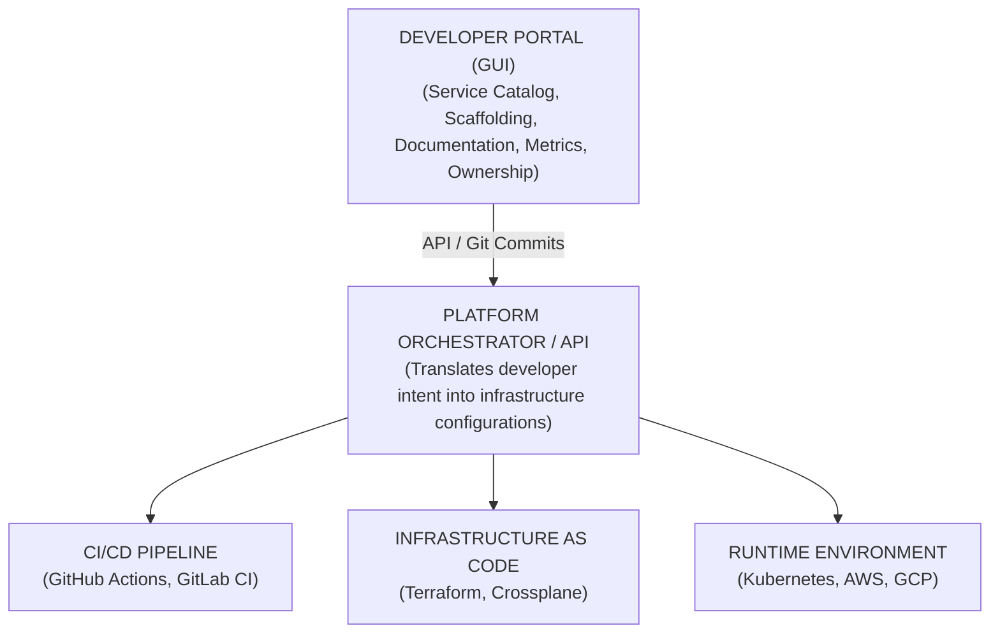

> **Складність**: [СЕРЕДНЯ]
>
> **Час на проходження**: 60-75 хвилин
>
> **Передумови**: Модулі 1.1-1.4 (IaC, GitOps, CI/CD, Observability)

---


## Що ви зможете зробити

Після завершення цього модуля ви зможете:

- **Спроєктувати** архітектуру Internal Developer Platform, яка знижує когнітивне навантаження, зберігаючи при цьому автономність розробників.
- **Порівняти** Platform Engineering, Site Reliability Engineering та DevOps за їхніми клієнтами, артефактами та операційними моделями.
- **Оцінити**, чи готова організація до ініціативи створення платформи, використовуючи метрики потоку розгортання, власності та підтримки.
- **Сформулювати** Golden Paths, які кодують безпечні налаштування за замовчуванням, не перетворюючи платформу на клітку.
- **Виміряти** рівень впровадження платформи та задоволеність розробників за допомогою продуктових циклів зворотного зв'язку та інженерних метрик.


## Чому це важливо

Гіпотетичний сценарій: у платіжній компанії середнього розміру у вівторок вдень виявляють критичну вразливість у залежності, і команда безпеки просить кожну сервісну команду встановити патч до кінця тижня. Зміна коду є нудним оновленням версії, але розгортання перетворюється на п'ятиденний провал координації серед 120 інженерів та 15 команд мікросервісів. Розробники змушені редагувати Dockerfiles, налаштовувати стадії Jenkins, оновлювати значення Helm, чекати на допомогу з міграцією бази даних, шукати правильний графік PagerDuty та налагоджувати блокування стану Terraform, перш ніж єдине виправлення для клієнтів зможе потрапити в production.

Компанія вірила, що перейшла на DevOps, оскільки кожна продуктова команда володіла своїми сервісами в production. На практиці ж принцип "ти це будуєш, ти цим керуєш" перетворився на "ти це будуєш, ти стаєш інфраструктурним спеціалістом на півставки". В організації не було старої стіни між розробкою та експлуатацією, але вона створила лабіринт із хмарних консолей, фрагментів YAML, дашбордів та племінних знань, що уповільнювало термінову роботу. Патч в один рядок забирав дні, тому що система доставки вимагала експертизи, на створення та підтримку якої більшість продуктових команд не мала часу.

Platform Engineering існує саме для такого сценарію відмови. Він розглядає внутрішню інфраструктуру та робочі процеси доставки як продукт для розробників, а не як розрізнену купу скриптів, тікетів і сторінок на вікі. Хороша платформа не позбавляє продуктові команди відповідальності; вона дає їм надійний інтерфейс для типової роботи зі створення сервісів, розгортання змін, підготовки залежностей та спостереження за поведінкою в production. Цей модуль навчає, як проєктувати цей інтерфейс, коли в нього інвестувати та як уникнути створення дорогого внутрішнього продукту до того, як організація його дійсно потребуватиме.

## Точка зламу принципу "Ти це будуєш, ти цим керуєш"

Початкова обіцянка DevOps була здоровою: розробники та інженери з експлуатації мали перестати перекидати роботу через стіну, автоматизація мала замінити ручну передачу, а команди мали б відповідати за повний цикл зворотного зв'язку від коміту до production. Ця обіцянка працює добре, коли операційна поверхня достатньо мала, щоб продуктова команда могла її осмислити. Вона стає крихкою, коли шлях розгортання включає контейнери, Kubernetes, межі ідентифікації, хмарні мережі, policy engines, service meshes, сканери вразливостей, контролери GitOps та кілька систем спостереження, які змінюються незалежно одна від одної.

Сучасна cloud-native робота вимагає від розробників продуктів тримати в голові занадто багато непов'язаних моделей одночасно. Розробнику, який створює функцію checkout, можливо, доведеться за один день працювати з HTTP-семантикою, транзакціями бази даних, бізнес-правилами, запитами ресурсів Kubernetes, шарами збірки образу, умовами політики AWS IAM, TLS termination, мітками Prometheus та поведінкою синхронізації Argo CD. Деяким інженерам подобається такий широкий спектр, але організація не може припускати, що кожен розробник продукту повинен стати глибоким спеціалістом у кожному рівні інфраструктури.

Прихованою ціною є когнітивне навантаження — розумові зусилля, необхідні для підтримання достатнього контексту для прийняття правильного рішення. Коли когнітивне навантаження зростає, розробники сповільнюються, копіюють приклади без їхнього розуміння та уникають змін інфраструктури, навіть коли це небезпечно. Організація бачить симптоми, схожі на лінь або погану дисципліну, але першопричиною часто є проблема інтерфейсу. Система доставки відкриває занадто багато ручок керування для рутинної роботи та надає занадто мало інструкцій про те, які з них дійсно мають значення.

Зупиніться та подумайте: якщо новій команді потрібен сервіс, база даних, сповіщення, документація та конвеєр розгортання, який крок у цьому ланцюжку з найбільшою ймовірністю вимагатиме участі іншої людини у вашій організації? Відповідь зазвичай показує, де саме знаходиться прогалина у вашій платформі. Зріла платформа не робить кожен крок невидимим, але вона перетворює стандартний шлях на керований робочий процес із чіткою відповідальністю, захисними бар'єрами та швидким зворотним зв'язком.

Три антипатерни постійно з'являються, коли організації перекладають обов'язки з експлуатації на команди, не надаючи їм платформи. Перший — це відродження роботи за тікетами, коли розробники перестають торкатися інфраструктури і надсилають запити центральній хмарній команді. Другий — інфраструктура скопіюй-і-встав, коли команди обходять чергу, клонуючи YAML для Terraform або Kubernetes із сусіднього сервісу. Третій — вузьке місце локального експерта, коли один інженер стає неофіційним release engineer для всієї команди та спалює час на налагодження конвеєрів замість виконання продуктової роботи.

Відповідь платформи не полягає в тому, щоб знову централізувати кожне рішення. Кращий контракт такий: продуктові команди відповідають за поведінку своїх сервісів, тоді як команда платформи відповідає за прокладені інтерфейси, які роблять рутинну операційну роботу безпечною та повторюваною. Розробники все ще повинні розуміти базову структуру робочих навантажень Kubernetes 1.35+, ліміти ресурсів, health checks та сигнали спостереження, але їм не потрібно власноруч створювати кожен маніфест, політику та конвеєр щоразу, коли вони створюють стандартний сервіс.

У цьому курсі `kubectl` використовується безпосередньо в наступних модулях, щоб скопійовані команди залишалися придатними для виконання у скриптах і неінтерактивних оболонках. Platform Engineering не усуває необхідності вивчення концепцій Kubernetes 1.35+, але змінює те, які саме деталі стають частиною повсякденної роботи. Платформа має зробити типові операції нудними, залишаючи задокументований запасний вихід для команд, яким дійсно потрібен контроль на нижчому рівні.

## Що таке Platform Engineering

Platform Engineering — це дисципліна проєктування, створення та експлуатації внутрішніх можливостей самообслуговування для доставки програмного забезпечення. Фраза звучить інфраструктурно-насичено, але центром тяжіння є продуктове мислення. Команда платформи вивчає робочі процеси розробників, виявляє повторювані труднощі, визначає категоричні налаштування за замовчуванням, автоматизує найчастіші шляхи, вимірює рівень впровадження та ітерує на основі зворотного зв'язку. Клієнтом є внутрішній розробник, а продуктом є набір інтерфейсів, які дозволяють цьому розробнику перейти від ідеї до надійних змін у production з меншими непотрібними зусиллями.

Ця різниця має значення, оскільки багато команд перейменовують свою групу DevOps або хмарних операцій на "платформу", не змінюючи при цьому робочі процеси. Якщо команда все ще отримує тікети, вручну виділяє ресурси та публікує довгі сторінки на вікі, які розробники мають інтерпретувати, вона ще не працює як продуктова команда платформи. Справжня платформа перетворює повторювані запити на API, шаблони, робочі процеси та задокументовані контракти сервісів. Розробники повинні мати можливість висловити намір, отримати корисну валідацію та одержати робочий результат без очікування в черзі.

Розгляд платформи як продукту також змінює підзвітність команди платформи. Продукт-менеджери для зовнішнього програмного забезпечення не вимірюють успіх тим, наскільки елегантною бекенд-архітектура здається її творцям; вони вимірюють, чи використовують клієнти продукт і чи досягають вони своїх цілей. Командам платформи потрібна така ж скромність. Добровільне впровадження, час адаптації, час виконання змін, рівень успішного самообслуговування, рівень збоїв у наданні ресурсів та настрій розробників — все це має значення, оскільки показує, чи дійсно платформа зменшує труднощі, чи просто ховає їх за іншим інтерфейсом.

Ефективна платформа є категоричною, але вона не повинна бути авторитарною. Мета полягає не в тому, щоб заборонити кожну нестандартну архітектуру або змусити кожну команду використовувати ідентичний код. Мета полягає в тому, щоб запропонувати шлях, який є настільки добре підтримуваним, спостережуваним, безпечним і швидким, що більшість команд обирають його добровільно для звичайної роботи. Коли команда має незвичну потребу, вона може зійти з прокладеного шляху, але тоді вона бере на себе більше операційної відповідальності за вибір, який платформа не підтримує.

Корисною аналогією є міська інфраструктура. Містобудівники не вирішують, куди їде кожен мешканець, але вони робять типові маршрути безпечнішими за допомогою доріг, вказівників, світлофорів, автобусних маршрутів і ремонтних бригад. Мешканці все ще можуть обрати віддалену стежку або приватну дорогу, але вони не повинні очікувати там таких самих гарантій. Platform Engineering створює такий громадянський шар для команд розробників: надійні маршрути для типових подорожей, чіткі межі для непідтримуваних шляхів та цикли зворотного зв'язку, які підказують планувальникам, де має бути побудована наступна дорога.

Мислення "Платформа як продукт" також запобігає поширеній емоційній пастці. Інженери інфраструктури часто створюють платформу, якої, на їхню думку, хотіли б розробники, наповнену елегантними абстракціями та глибокими можливостями налаштування. Розробники продуктів зазвичай хочуть менше рішень, швидший зворотний зв'язок і впевненість у тому, що стандартні налаштування відповідають нормам. Команда платформи досягає успіху, коли вона перетворює складність інфраструктури на простий досвід, керований намірами, а не коли вона виставляє кожну функцію провайдера через більш привабливу форму.

Перш ніж проводити цей уявний експеримент, запишіть, що потрібно новому сервісу у вашому поточному середовищі. Включіть налаштування репозиторію, CI, розгортання, секрети, дашборди, сповіщення, метадані власності та перевірку готовності до production. Якщо ваш список охоплює кілька інструментів і кілька команд, проблема полягає не в тому, що розробникам потрібно більше документації. Проблема в тому, що організації бракує узгодженої продуктової межі навколо доставки програмного забезпечення.

## Золоті шляхи та форма хорошої абстракції

Золотий шлях (Golden Path) — це підтримуваний, автоматизований, добре протестований спосіб створення та експлуатації загального класу програмного забезпечення всередині організації. Його іноді називають прокладеною дорогою або підтримуваною магістраллю, але фраза має менше значення, ніж сам контракт. Золотий шлях каже: "Якщо ваш сервіс відповідає цій формі, платформа надасть вам каркас, перевірки безпеки, автоматизацію розгортання, спостережуваність та операційну підтримку з мінімальною кастомною роботою". Цей шлях є угодою між продуктовими командами та командою платформи.

Найсильніші Золоті шляхи починаються з вузькоспеціалізованого робочого навантаження, а не з грандіозного універсального фреймворку. Платіжна компанія може почати з транзакційного HTTP API на Node.js або Java, керованої бази даних PostgreSQL, Redis для кешування, GitHub Actions для CI, Argo CD для розгортання та стандартної інструментації OpenTelemetry. Цей спектр не є гламурним, але він, ймовірно, охоплює велику частку нових сервісів. Платформа може зробити цей єдиний шлях ідеальним, перш ніж намагатися підтримувати пакетні завдання, потокові конвеєри, мобільні бекенди та обслуговування машинного навчання.

Хороші Золоті шляхи кодують рішення, в яких команди постійно помиляються під тиском. Вони обирають базові образи, користувачів контейнерів, етапи сканування на вразливості, значення CPU та пам'яті за замовчуванням, readiness probes, формати логів, мітки дашбордів, рівні критичності сповіщень, структуру репозиторію, CODEOWNERS та перевірки готовності до production. Розробники все ще пишуть бізнес-логіку та відповідають за поведінку сервісу, але платформа усуває повторювані інфраструктурні дрібниці, які створюють відхилення. Компроміс полягає в тому, що команда платформи повинна підтримувати ці значення за замовчуванням у міру того, як еволюціонують очікування щодо хмар, Kubernetes та безпеки.

Рівень абстракції — найважче рішення при проєктуванні. Якщо платформа відкриває "сирі" маніфести Kubernetes, вона може недостатньо знизити когнітивне навантаження. Якщо вона приховує кожну операційну деталь, розробники можуть втратити здатність налагоджувати поведінку в production або йти на обґрунтовані компроміси. Правильна абстракція розкриває намір та його наслідки. Розробник повинен мати можливість зробити запит на рівень бази даних, побачити наслідки для вартості та доступності, зрозуміти, кого викличуть, і перевірити згенеровані ресурси нижчого рівня, коли знадобиться глибше налагодження.

Подумайте про різницю між "заповніть цю форму, щоб отримати базу даних Postgres" і "платформа надає надійну залежність Postgres цьому сервісу в staging з резервними копіями, шифруванням, метаданими власності та чітким шляхом просування в production". Друга версія — це набагато багатший продуктовий контракт. Він пов'язує інфраструктуру з володінням сервісом, життєвим циклом, вартістю, відповідністю вимогам та потоком розгортання. Platform Engineering працює найкраще, коли ці питання вирішуються разом, а не розпорошуються по окремих тікетах.

Який підхід ви б обрали тут і чому: платформу, яка повністю приховує Kubernetes, чи платформу, яка генерує ресурси Kubernetes, але дозволяє розробникам перевіряти їх? Більшості організацій слід обрати другу модель для сервісів середньої складності. Приховування всього здається дружнім у перший день, але стає небезпечним під час інцидентів. Перевірка зберігає можливість навчатися та налагоджувати, залишаючи при цьому рутинну роботу простою.

Золоті шляхи повинні мати запасний вихід, але він має бути явним. Якщо команді потрібна незвичайна графова база даних, нішевий рантайм або кастомна мережева модель, платформа не повинна робити вигляд, що підтримує це між іншим. Команда може продовжити, але вона повинна відповідати за кастомний Terraform, кастомні конвеєри, runbooks, налаштування сповіщень та реагування на інциденти для непідтримуваних частин. Ця межа захищає команду платформи від перетворення на службу підтримки для кожного експерименту, зберігаючи при цьому технічну свободу, необхідну для справжніх інновацій.

Платформі також потрібна політика застарівання. Золоті шляхи, які ніколи не змінюються, стають застарілими, небезпечними та дорогими. Якщо Kubernetes 1.35+ змінює поведінку за замовчуванням, якщо сканер починає позначати поширений базовий образ як проблемний, або якщо хмарний провайдер замінює старіший клас бази даних, команда платформи повинна оновити шаблони та допомогти командам мігрувати. Золотий шлях — це жива продуктова поверхня, а не одноразовий каркас, від якого можна відмовитися після створення репозиторію.


## Архітектура внутрішньої платформи розробника

Внутрішня платформа розробника (Internal Developer Platform, або IDP) — це система, яка забезпечує взаємодію з платформою. Індустрія іноді використовує абревіатуру IDP для позначення «Internal Developer Portal» (внутрішній портал розробника), що є лише вхідними дверима. У цьому модулі IDP означає ширшу платформену систему: портал, каталог, шаблони, оркестратор, інтеграції CI/CD, автоматизацію інфраструктури, перевірки політик (policy checks) та з'єднання середовища виконання (runtime). Портал має значення, але глибша цінність випливає з робочих процесів, що стоять за ним.

Корисна архітектура IDP має чотири рівні. Перший рівень — це портал розробника, де команди знаходять сервіси, запускають шаблони, переглядають оціночні картки (scorecards), знаходять документацію та ініціюють дії самообслуговування (self-service). Другий рівень — каталог сервісів, який фіксує власність, життєвий цикл, залежності, контекст відповідності вимогам (compliance) та операційні посилання. Третій рівень — це скафолдинг (scaffolding) і шаблони, які створюють репозиторії та пайплайни доставки із вже вбудованими стандартними налаштуваннями організації. Четвертий рівень — це оркестрація, яка перетворює наміри розробника на зміни інфраструктури, коміти GitOps, хмарні ресурси та об'єкти Kubernetes.

Ці рівні мають підсилювати один одного. Програмний шаблон не повинен просто створювати репозиторій; він також має реєструвати сервіс у каталозі, прикріплювати команду-власника, створювати початковий каркас документації, налаштовувати робочі процеси розгортання та підключати стандартні параметри observability. Дія розгортання бази даних не повинна просто запускати Terraform; вона має оновлювати метадані каталогу, прикріплювати ресурс до сервісу-споживача, фіксувати середовище та надавати посилання на інструкції (runbooks). Інтеграція — це те, що перетворює набір інструментів на платформу.



Діаграма показує, чому самого порталу недостатньо. Гарний UI, який відкриває тікет у Jira для людини-оператора, не змінив операційну модель; він лише одягнув стару чергу в кращі кольори. Оркестратор — це рушій, який робить самообслуговування реальним. Він приймає затверджений запит, виконує валідацію, застосовує політики, створює зміни в інфраструктурі та записує результат. Без цього рушія платформа не може зменшити час виконання (lead time) або усунути ручні вузькі місця.

Backstage — це найбільш впізнаваний open source фреймворк для створення порталів та каталогів. Spotify створила його внутрішньо для управління великою екосистемою сервісів, відкрила код у березні 2020 року, а пізніше передала його до Cloud Native Computing Foundation. Його потужність полягає в розширюваності: метадані каталогу, шаблони програмного забезпечення, TechDocs та інтеграції плагінів можуть об’єднати GitHub, CI, дашборди, графіки чергувань (on-call) та результати перевірок безпеки в єдиному інтерфейсі для розробників. Його ціна полягає в тому, що команди фактично експлуатують застосунок на React та TypeScript, а не готове рішення «під ключ».

```yaml
# Example: Backstage catalog-info.yaml
apiVersion: backstage.io/v1alpha1
kind: Component
metadata:
  name: payment-routing-service
  description: Handles all credit card processing, PCI tokenization, and external gateway routing
  tags:
    - java
    - spring-boot
    - pci-compliant
    - tier-1
  links:
    - url: https://admin.paymentgateway.com
      title: Gateway Admin Console
      icon: dashboard
  annotations:
    github.com/project-slug: acme-corp/payment-routing-service
    pagerduty.com/integration-key: "xyz123abc_critical_alerts"
    custom-org/prometheus-alert-rule: "payment-service-high-latency-alerts"
    snyk.io/org-id: "security-org-123-finance"
    backstage.io/techdocs-ref: dir:.
spec:
  type: service
  lifecycle: production
  owner: group:checkout-core-team
  system: payment-system
  dependsOn:
    - component:user-auth-service
    - resource:payment-postgres-db
```

Цей файл невеликий, але він змінює підхід до реагування на інциденти. Під час збою платежів інцидент-менеджер може визначити команду-власника, пов’язані сервіси, точки входу до дашбордів, розташування документації, життєвий цикл та карту залежностей, не розбурхуючи кількох людей, щоб запитати, де зберігається актуальна інформація. Оскільки метадані знаходяться поруч із кодом застосунку, команда може оновлювати їх через той самий процес рецензування (review process), який вона використовує для коду. Каталог стає менш застарілим, ніж централізована електронна таблиця, оскільки його підтримка пов’язана зі звичайною інженерною роботою.

Port представляє інший компроміс: SaaS-портал розробника з каталогом, оціночними картками та діями самообслуговування. Він зменшує операційне навантаження на підтримку самого порталу і може бути привабливим, коли команда платформи сильна в автоматизації інфраструктури, але має недостатньо ресурсів для фронтенду. Компроміс залежить від продукту та обмежень кастомізації. SaaS-портал може допомогти команді рухатися швидше, але організації все одно потрібна чітка модель платформи, правила власності на сервіси та автоматизація, що стоїть за діями.

Humanitec зосереджується на оркестрації, а не на досвіді роботи з порталом. Його модель дозволяє розробникам декларувати потреби робочих навантажень (workloads) в абстрактній специфікації, тоді як платформа по-різному вирішує ці потреби для кожного середовища. Цей поділ є цінним, оскільки розробка (development), стейджинг (staging) та продакшн (production) часто потребують різних реалізацій інфраструктури, навіть якщо намір розробника ідентичний. Сервіс запитує Postgres і Redis; платформа вирішує, чи означає це контейнери, спільні кластери (shared clusters) або керовані сервіси (managed services) для продакшну.

```yaml
# Example: Humanitec Score Specification (score.yaml)
apiVersion: score.dev/v1b1
metadata:
  name: user-profile-api
containers:
  user-profile:
    image: myregistry.com/user-profile:latest
    variables:
      DB_CONNECTION_STRING: ${resources.db.connection_string}
resources:
  db:
    type: postgres
  cache:
    type: redis
```

Одна й та сама декларація може бути дешевою в розробці та відмовостійкою в продакшні. Локально оркестратор може зіставити базу даних з легковаговим контейнером, а кеш — з тимчасовим екземпляром Redis. На стейджингу він може використовувати керований спільний кластер з обмеженою потужністю. У продакшні він може розгорнути ізольовану базу даних Multi-AZ, налаштувати резервні копії, згенерувати секрети та підключити сервіс через Kubernetes. Розробник висловлює залежність один раз, тоді як платформа обробляє деталі реалізації, специфічні для середовища.

Kratix обирає шлях, орієнтований на Kubernetes, дозволяючи платформеним командам визначати «Обіцянки» (Promises), які розробники запитують як custom resources. Обіцянка може представляти базу даних, брокер повідомлень, кеш, середовище або можливості вищого рівня. Цей підхід підходить організаціям, які вже довіряють GitOps та циклам керування Kubernetes (control loops), оскільки сам інтерфейс платформи стає декларативним. Розробники запитують можливість, а пайплайн платформи створює ресурси, необхідні для її виконання.

```yaml
# Illustrative example — the exact API group, version, and fields vary by Promise.
# Example: Developer requesting a Kratix Promise
apiVersion: postgres.marketplace.kratix.io/v1alpha1
kind: PostgreSQL
metadata:
  name: user-database
  namespace: checkout-team-namespace
spec:
  size: small
  backup:
    enabled: true
    retention_days: 30
  high_availability: false
  version: "16.2"
  encryption: "kms-managed"
```

Головне тут не те, що Kratix використовує custom resources; Kubernetes має багато custom resources. Головне полягає в тому, що custom resource представляє обіцянку на рівні продукту (product-level promise) з очікуваннями щодо підтримки, політикою та життєвим циклом. Розробник етапу оформлення замовлення (checkout) не повинен розбиратися в класах сховища (storage class), інструментах резервного копіювання, ролях cloud IAM або модулях Terraform, що використовуються за цим запитом. Команда платформи володіє шляхом реалізації та надає невеликий, стабільний API, який відповідає тому, як внутрішні клієнти думають про свою роботу.

Backstage, Port, Humanitec та Kratix не є прямими замінниками в кожній організації. Одній команді спочатку може знадобитися каталог, оскільки ніхто не знає, кому належать сервіси. Іншій може знадобитися оркестрація, оскільки запити на інфраструктуру застряють у тікетах. Третя може почати з шаблонів, оскільки створення нових сервісів є непослідовним та небезпечним. Вибір інструменту повинен залежати від найгострішої проблеми робочого процесу, а не від найгучнішої доповіді на конференції.

## Чіткість ролей: Platform Engineering, SRE та DevOps

Platform Engineering перетинається з DevOps та SRE в інструментах, але ці дисципліни відповідають на різні запитання. DevOps запитує, як команди можуть створювати, тестувати та випускати програмне забезпечення за допомогою автоматизованої співпраці замість передачі з рук у руки (handoffs). SRE запитує, як сервіси в продакшні залишатимуться достатньо надійними для користувачів, тоді як інженерні команди продовжуватимуть їх змінювати. Platform Engineering запитує, як внутрішні розробники можуть використовувати можливості організації з доставки та інфраструктури, не занурюючись у кожну деталь цих можливостей.

Плутанина коштує дорого, оскільки вона створює нездійсненні статути команд (team charters). Якщо керівництво попросить SRE відповідати за надійність, реагування на інциденти, UX порталу розробника, шаблони самообслуговування, модулі Terraform, документацію та кожен терміновий запит на підтримку від розробників, робота над надійністю втратить фокус. Якщо платформена команда оцінюється лише за часом безвідмовної роботи (uptime), вона природно віддаватиме перевагу суворому контролю над потоком розробників. Організації потрібні межі, які дозволяють цим групам співпрацювати, не роблячи одну команду відповідальною за кожен аспект доставки програмного забезпечення.

| Характеристика | Традиційний DevOps / Cloud Ops | Інженерія надійності сайту (SRE) | Інженерія платформ (Platform Engineering) |
| :--- | :--- | :--- | :--- |
| **Основна головна ціль** | Подолати історичний розрив між написанням та розгортанням коду. Проєктувати та автоматизувати пайплайн доставки програмного забезпечення. | Забезпечити надійність, доступність та продуктивність великомасштабних систем. Захистити користувачів від збоїв. | Максимізувати продуктивність розробників продуктів. Зменшити когнітивне навантаження. Ставитися до інфраструктури як до курованого продукту. |
| **Основний клієнт** | Пайплайн доставки, кодова база та бізнес. | Кінцевий користувач та досвід взаємодії з сервісом у продакшні. | Внутрішній розробник програмного забезпечення та робочий процес продуктової команди. |
| **Основні артефакти та результати** | Конфігурація CI/CD, модулі Terraform, управління конфігураціями, скрипти розгортання. | SLO, SLI, бюджети помилок (error budgets), інструкції для інцидентів (runbooks), експерименти chaos engineering, практики observability. | Портали розробників, каталоги сервісів, «золоті шляхи» (Golden Paths), шаблони програмного забезпечення, API самообслуговування. |
| **Взаємодія та операційна модель** | Інтегрована, проєктна або централізована підтримка автоматизації. Може деградувати до операцій з тікетами. | Інтегрована або консультативна практика з надійності з повноваженнями уповільнювати ризиковані зміни, коли бюджети помилок вичерпано. | Доставка платформи на основі продуктового підходу з дослідженням користувачів, метриками впровадження та ітеративними робочими процесами самообслуговування. |
| **Ключові показники ефективності (KPI)** | Частота розгортань, час виконання змін (lead time), надійність збірки, економічна ефективність інфраструктури. | Доступність, затримка (latency), MTTR, частота інцидентів, швидкість вичерпання бюджету помилок (error budget burn). | Добровільне впровадження (adoption), час до першого коміту, рівень успішності самообслуговування, задоволеність розробників. |

Ця таблиця не є жорстким штатним розкладом. У невеликій організації одна людина може виконувати всі три ролі протягом одного тижня. Ця відмінність стає важливою у міру зростання організації, оскільки різні стимули формують різні продукти. SRE повинні глибоко впливати на стандартні налаштування платформи щодо алертів, відкотів (rollbacks), SLO та готовності до продакшну (production readiness). Досвід автоматизації DevOps повинен формувати пайплайни доставки. Platform Engineering має інтегрувати ці практики в орієнтований на розробника продукт, який легко впровадити і складно використовувати неправильно.

Практичний спосіб перевірити чіткість ролей — дослідити інцидент. Якщо кластер бази даних не працює належним чином, а клієнти бачать помилки, функція SRE повинна керувати реагуванням на проблему надійності. Якщо розробники не можуть з'ясувати, яка команда володіє сервісом або де знаходяться дашборди, каталог платформи не виконує своєї функції. Якщо випуски блокуються, оскільки кожне розгортання вимагає ручного редагування пайплайну, рівень автоматизації DevOps є слабким. Зрілі організації можуть назвати зону відмови (failure domain) замість того, щоб скидати кожну проблему на одну «інфраструктурну» команду.

Автомобільна аналогія залишається корисною, якщо її застосовувати обережно. DevOps — це конвеєр і трансмісія, які роблять доставку механічно можливою. SRE — це система гальмування, телеметрії та безпеки, яка гарантує, що подорож можна пережити. Platform Engineering — це кермо, приладова панель (dashboard) і система навігації, які дозволяють водієві керувати машиною без розуміння кожного внутрішнього компонента. Хорошому автомобілю потрібні всі три, але ніхто не хоче, щоб команда, яка відповідає за подушки безпеки, проєктувала приладову панель самостійно.


## Коли не варто створювати платформу

Platform Engineering — це потужно, але й дорого. Вона відволікає старших інженерів від функцій, орієнтованих на клієнта, і змушує їх створювати внутрішній продукт, який вимагає проєктування, документації, підтримки, оновлень, обслуговування безпеки та рішень щодо дорожньої карти. Витрати виправдані, коли постійні перешкоди у процесі доставки сповільнюють роботу багатьох команд. Це марнотратство, коли організація достатньо мала, щоб простіший набір інструментів та зрозуміла документація могли розв'язати проблему.

Передчасне створення платформи часто починається зі щирого бажання уникнути майбутніх проблем. Стартап серії А читає про Backstage, Golden Paths та внутрішні платформи у великих технологічних компаніях, а потім доручає кільком старшим інженерам створити портал до того, як продукт стабілізується. Команда створює технічно вражаючу систему, але компанії більше потрібні були вивчення клієнтів, функції продукту та швидші ітерації, ніж внутрішня абстракція. Платформа вирішила проблему координації, яка ще навіть не виникла.

Антипатерн "платформа для одного" легко впізнати. Якщо в компанії є десяток інженерів, один бекенд-сервіс, невеликий фронтенд і спільний канал у чаті, де всі знають, хто за що відповідає, спеціальний IDP зазвичай є поганою інвестицією. Керованого PaaS, простого робочого процесу CI, зрозумілого шаблону репозиторію та невеликого набору модулів Terraform може бути цілком достатньо. Організація повинна платити за нудні зовнішні платформи доти, доки біль від координації не перевищить вартість створення внутрішньої.

Кількість працівників — не єдиний сигнал, але це корисна відправна точка. Повернення інвестицій у платформу зазвичай стає ймовірним, коли організація перетинає межу приблизно у 40-50 інженерів-програмістів, кілька команд незалежно створюють сервіси, а негласні знання більше не передаються просто через розмови. Нижче цього порогу бувають винятки, але тягар доведення має бути високим. Регульована компанія зі складними вимогами комплаєнсу може потребувати сильніших внутрішніх інструментів раніше, тоді як простий SaaS-продукт може успішно працювати на керованих сервісах набагато довше.

Процес розгортання — ще один сигнал. Якщо час виконання зростає через те, що команди днями чекають на підготовку бази даних, зміни DNS, політики IAM або погодження для продакшену, автоматизація самообслуговування може відновити реальні інженерні потужності. Якщо час виконання вже короткий, а збої трапляються рідко, команда платформи може оптимізувати не те обмеження. Platform Engineering має бути відповіддю на вимірювані перешкоди, а не престижним проєктом.

Час онбордингу виявляє приховану складність. Коли новому інженеру потрібні кілька тижнів, щоб внести зміну в продакшен, організація, ймовірно, має занадто багато незадокументованих знань про робочий процес. Дещо з цього можна виправити за допомогою кращої документації, парного програмування та спрощення. Якщо та сама плутанина повторюється в багатьох командах, шаблони та портал можуть перетворити онбординг з археології на керований шлях. Інвестиції в платформу стають обґрунтованішими, коли ті самі запитання виникають у перший місяць роботи кожного нового працівника.

Податок на тіньові операції — найочевидніший тривожний сигнал. Якщо продуктові інженери витрачають чверть свого тижня на боротьбу зі значеннями Helm, станом Terraform, граничними випадками CI та налаштуванням дашбордів, організація платить за роботу над платформою, не називаючи її так. Гірше того, ця робота розподіляється нерівномірно між інженерами, які випадково знають ці інструменти. Команда платформи може централізувати продуктову відповідальність за цей спільний робочий процес, водночас дозволяючи продуктовим командам залишатися власниками своїх сервісів.

Хаос під час реагування на інциденти також є сигналом готовності до платформи. Під час серйозного збою перші питання мають стосуватися симптомів, радіуса ураження, варіантів відкату та впливу на клієнтів. Якщо перші пів години витрачаються на з'ясування того, хто володіє сервісом, де знаходиться репозиторій, чи існує дашборд і яке розгортання змінилося останнім, то не вистачає каталогу сервісів та операційних метаданих. Це проблема платформи, навіть якщо сама інфраструктура виконання є стабільною.

## Патерни та антипатерни

Перший надійний патерн — почати з одного вузького, високочастотного Golden Path і зробити його бездоганним. Виберіть робоче навантаження, яке насправді створюють багато команд, наприклад, транзакційний API зі стандартною базою даних і стандартним цільовим середовищем розгортання. Тоді команда платформи зможе інвестувати в надійні налаштування за замовчуванням, документацію, спостережливість та підтримку цього шляху. Масштабування походить від повторення успіху, а не від оголошення про підтримку кожної архітектури до того, як хоча б один шлях стане зручним.

Другий патерн — зробити метадані про власність частиною робочого процесу доставки. Каталог сервісів має цінність лише тоді, коли він залишається актуальним, а актуальним він залишається, коли оновлення прив’язані до звичайного рев’ю коду. Шаблони повинні запитувати про команду-власника, життєвий цикл, систему, залежності, дашборди та маршрутизацію чергувань під час створення. Подальші зміни слід перевіряти як код, оскільки застарілі дані про власність стають операційним боргом.

Третій патерн — зберігати платформу придатною для інспектування. Розробникам не потрібно власноруч писати кожен об'єкт Kubernetes або Terraform для рутинної роботи, але вони повинні мати змогу бачити, що згенерувала платформа, і розуміти операційні наслідки. Інспектування допомагає командам діагностувати інциденти, формувати судження та довіряти платформі. Платформа типу "чорний ящик" може виглядати простішою, але вона може створити вивчену безпорадність, коли щось поводиться несподівано.

Четвертий патерн — використовувати цикли зворотного зв’язку з продуктом замість наказів. Команди платформи мають проводити інтерв’ю, спостерігати за розробниками, які використовують робочі процеси, перевіряти логи збоїв, вимірювати успішність самообслуговування та публікувати рішення щодо дорожньої карти. Впровадження слід заслужити шляхом зменшення перешкод. Підтримка керівництва має значення, але примусова міграція може приховати погану відповідність і перетворити платформу на вправу з комплаєнсу, а не на інструмент, який люди хочуть використовувати.

Найбільший антипатерн — створення порталу над ручною чергою. Якщо кнопка "Розгорнути базу даних" лише відкриває тікет для адміністратора бази даних, організація покращила виявлення, але не самообслуговування. Це все ще може бути перехідним кроком, але його не слід продавати як зрілу платформу. Команда платформи повинна автоматизувати шлях запиту або чітко позначити робочий процес як обслуговування з допомогою оператора.

Інший антипатерн — спроба охопити все й одразу. Команди платформи часто хочуть підтримувати кожну мову, кожне цільове середовище розгортання, кожну базу даних, кожен рівень комплаєнсу та кожного хмарного провайдера негайно. Такі амбіції розпорошують команду і створюють посередню підтримку скрізь. Краще бути бездоганними для спільного шляху, чітко визначати непідтримувані шляхи та обдумано вирішувати, коли новий шлях заслуговує на підтримку платформи.

Більш прихований антипатерн — ставитися до платформи як до завершеної після запуску. Хмарні сервіси змінюються, релізи Kubernetes еволюціонують, з'являються вразливості, команди створюють нові робочі навантаження, а очікування розробників зростають. IDP, який не підтримується, стає ще однією застарілою системою. Platform Engineering — це життєвий цикл продукту із сортуванням беклогу, реагуванням на інциденти, плануванням міграції, роботою з документацією та дослідженням користувачів, а не одноразовий проєкт модернізації.

## Фреймворк прийняття рішень

Використовуйте фреймворк інвестиційних рішень щодо платформи, коли організація вирішує: купувати, створювати чи зачекати. Почніть із болю, а не з інструменту. Якщо біль полягає у виявленні та визначенні власності, портал і каталог можуть бути першим кроком. Якщо біль полягає у повільному розгортанні інфраструктури, оркестрація та API самообслуговування мають більше значення. Якщо біль полягає у непослідовності нових сервісів, шаблони та Golden Paths можуть принести найвищу віддачу. Якщо біль полягає у надійності продакшену, практик SRE може не вистачати більше, ніж порталу.

Далі оцініть масштаб. Невелика команда з простими сервісами має схилятися до керованого PaaS і мінімальної кастомної автоматизації. Організація, що зростає і має десятки інженерів, повинна стандартизувати CI, інфраструктурні модулі, шаблони сервісів і метадані про власність перед створенням великої внутрішньої групи платформи. Більша інженерна організація з багатьма командами, регулярним створенням сервісів, вимогами комплаєнсу та високою операційною варіативністю може виправдати виділену команду платформи, особливо коли метрики перешкод показують, що продуктові інженери втрачають значний час доставки.

Потім огляньте наявну межу автоматизації. Якщо розробники виражають намір у Git, і автоматизація надійно створює результат, платформі можуть знадобитися кращі "парадні двері", а не новий оркестратор. Якщо розробники все ще чекають, поки люди виконають команди або схвалять стандартні запити, основною проблемою є автоматизація робочого процесу. Портал має знаходитися поверх працюючого рушія, а не приховувати його відсутність.

Нарешті, вирішіть, де купувати. Багато організацій повинні купувати стандартний інтерфейс і створювати диференційовану автоматизацію. SaaS-портал може обробляти UI каталогу та системи оцінки, тоді як команда платформи створює специфічні для компанії інфраструктурні робочі процеси позаду дій самообслуговування. Backstage може краще підійти, коли розширюваність і внутрішній контроль мають значення. Створення повністю кастомного порталу з нуля має бути рідкістю, оскільки унікальна цінність зазвичай полягає в політиках, шаблонах і оркестрації, а не в ще одному внутрішньому вебдодатку.

Рішення можна узагальнити як набір операційних запитань. Чи втрачають розробники час на ті самі інфраструктурні завдання щотижня? Чи страждають інциденти через те, що власність і залежності неясні? Чи можуть стандартні запити виконуватися без втручання людини? Чи команди добровільно копіюють непідтримуваний YAML, тому що офіційний шлях повільніший? Чи вужчий Golden Path охопить значну частину нової роботи? Якщо відповіді переважно "так", інвестиції в платформу, ймовірно, виправдані. Якщо відповіді переважно "ні", спершу покращіть документацію та використання керованих сервісів.

## Чи знали ви?

- Backstage був відкритий компанією Spotify у березні 2020 року, а згодом увійшов до CNCF, що допомогло перетворити патерн внутрішнього порталу на широку екосистему.
- Книга "Team Topologies", опублікована у 2019 році, популяризувала ідею того, що команди платформи обслуговують потоково-орієнтовані команди внутрішніми продуктами, які зменшують когнітивне навантаження.
- У 2023 році компанія Gartner спрогнозувала, що до 2026 року 80% великих організацій з розробки програмного забезпечення створять команди платформи для підтримки доставки програмного забезпечення.
- Дослідницька програма DORA постійно пов'язує швидшу та безпечнішу доставку з практиками, які зменшують передачу відповідальності, покращують зворотний зв'язок і автоматизують повторювану роботу.

## Типові помилки

| Помилка | Чому це трапляється | Як це виправити |
| :--- | :--- | :--- |
| **Примусове використання платформи** | Керівники хочуть бачити видиму віддачу від інвестицій і форсують міграцію до того, як платформа заслужила довіру. | Вимірюйте добровільне впровадження, опитуйте команди, які чинять опір, і покращуйте шлях, доки команди не оберуть його, тому що це економить час. |
| **Створення гарного UI поверх повільної черги Jira** | Портал легше профінансувати та продемонструвати, ніж автоматизацію, необхідну позаду нього. | Ставтеся до виконання самообслуговування як до мети продукту. Стандартний запит має завершуватися за допомогою автоматизації, а не зникати у прихованій ручній черзі. |
| **Передчасне створення платформи** | Команди копіюють патерни з великих компаній до того, як у них з'являться порівнянні проблеми з координацією. | Використовуйте PaaS, керовані сервіси, прості шаблони та документацію, доки вимірювані перешкоди не виправдають створення виділеної команди платформи. |
| **Спроба підтримати кожен шлях** | Команди платформи бояться блокувати інновації та обіцяють однакову підтримку для кожної мови, бази даних та середовища виконання. | Визначте вузький Golden Path, опублікуйте правила для "запасних виходів" і додавайте нові підтримувані шляхи лише тоді, коли попит і можливості підтримки виправдовують їх. |
| **Ігнорування відгуків розробників** | Інженери інфраструктури проєктують, виходячи з архітектурних уподобань, замість того, щоб спостерігати за продуктовими командами під тиском доставки. | Проводьте інтерв'ю з користувачами, відстежуйте розгортання, інспектуйте невдалі робочі процеси самообслуговування та приймайте рішення щодо дорожньої карти на основі доказів. |
| **Плутання SRE з Platform Engineering** | Ті самі інструменти з'являються в обох дисциплінах, тому керівники доручають кожну інфраструктурну проблему одній команді. | Розділіть відповідальність за надійність і відповідальність за досвід розробників, забезпечуючи при цьому внесок обох команд у налаштування платформи за замовчуванням. |
| **Ставлення до IDP як до завершеного проєкту** | Енергія запуску згасає, і портал стає ще однією внутрішньою системою із застарілими плагінами та непрацюючими посиланнями. | Фінансуйте обслуговування платформи як роботу над продуктом, включаючи оновлення, міграції, документацію, підтримку та аналіз впровадження. |


## Контрольні запитання

<details><summary>1. Ваша команда хоче запустити сервіс рекомендацій на основі графової бази даних, який не відповідає поточному Golden Path. Що має бути зазначено у контракті платформи (platform contract)?</summary>

Команді слід дозволити продовжувати роботу, але вона повинна розуміти експлуатаційне навантаження (operational tax) виходу за межі підтримуваного шляху. Команда платформи може надати загальні рекомендації, але вона не повинна обіцяти повну підтримку кастомної інфраструктури, яка не була перетворена на продукт (productized). Команда повинна взяти на себе відповідальність за власне надання ресурсів (provisioning), моніторинг, ранбуки (runbooks) та реагування на інциденти, доки цей патерн не стане достатньо поширеним, щоб виправдати підтримку платформи. Це зберігає інновації, не перетворюючи команду платформи на службу підтримки для кожного винятку.
</details>

<details><summary>2. Інженерний директор у стартапі з 12 осіб пропонує витратити наступний квартал на розгортання Backstage та Crossplane. Як би ви оцінили цей план?</summary>

Ймовірно, це передчасне створення платформи (premature platforming), якщо тільки стартап не має надзвичайно жорстких вимог до комплаєнсу або складної інфраструктури. На такому масштабі компанія зазвичай може отримати більше користі від PaaS, простого шаблону репозиторію, керованих хмарних сервісів та чіткої документації. Альтернативна вартість виділення senior-інженерів на внутрішню платформу є високою, оскільки ці інженери не створюють продукт для клієнтів. Кращим кроком буде відстежувати тертя і повернутися до інвестицій у платформу, коли витрати на координацію стануть вимірюваними.
</details>

<details><summary>3. CTO просить надати найвагоміші докази того, що платформа працює, через шість місяців. Які метрики ви б надали і чому?</summary>

Надайте відсоток добровільного прийняття (voluntary adoption rate), час до першого коміту (time-to-first-commit), відсоток успішного самообслуговування (self-service success rate) та задоволеність розробників (developer satisfaction), а не просто підраховуйте відвідування порталу. Добровільне прийняття показує, чи віддають команди перевагу платформі, коли мають вибір. Час до першого коміту та успішність самообслуговування показують, чи зменшує платформа тертя у робочому процесі. Дані про задоволеність додають якісний контекст, щоб команда могла визначити, чи відображають цифри справжню цінність, чи примусове дотримання правил.
</details>

<details><summary>4. Розробник наразі відкриває три тікети: для бази даних PostgreSQL, DNS-запису та IAM-ролі. Як зріла платформа має змінити цей робочий процес?</summary>

Платформа повинна перетворити ці стандартні запити на робочий процес самообслуговування (self-service workflow), який підтримується автоматизацією та перевірками політик. Розробник виражає свій намір через портал, API, шаблон або декларативний ресурс, а оркестратор створює необхідну інфраструктуру без ручної передачі. Вимоги безпеки та комплаєнс застосовуються у робочому процесі, а не шляхом запізнілої перевірки людиною. Результатом є швидша доставка з меншою кількістю помилок одноразової конфігурації.
</details>

<details><summary>5. Під час інциденту ніхто не знає, хто є власником платіжного сервісу або де знаходяться його дашборди. Яка можливість платформи розв'язує цю проблему, і що робить її надійною?</summary>

Каталог сервісів (service catalog) розв'язує проблему власності та видимості (discoverability). Він стає надійним, коли метадані зберігаються поруч із сервісом, перевіряються через звичайні робочі процеси роботи з кодом і підключаються до шаблонів, які створюють нові сервіси. Каталог повинен включати власника, етап життєвого циклу, залежності, документацію, маршрути оповіщень та посилання на експлуатаційні дані. Якщо оновлення каталогу вимагає окремого ручного процесу, дані розійдуться з реальністю (drift) і втратять довіру.
</details>

<details><summary>6. Production нестабільний, але розробники також скаржаться, що шаблони розгортання є заплутаними. Як тут розподіляються обов'язки між SRE та Platform Engineering?</summary>

SRE має очолити реагування на проблеми з надійністю, оскільки їхнім головним клієнтом є кінцевий користувач, який страждає від нестабільності production. Platform Engineering повинна покращити заплутані шаблони, оскільки її головним клієнтом є внутрішній розробник, який використовує ці робочі процеси. Команди повинні співпрацювати, щоб налаштування платформи за замовчуванням включали практики надійності, такі як проби (probes), оповіщення (alerts), відкати (rollbacks) та контекст SLO. Чітка відповідальність запобігає розриванню однієї інфраструктурної групи між конфліктними пріоритетами без продуктової моделі.
</details>

<details><summary>7. Команда платформи створила Golden Path, але рівень його прийняття є низьким, і керівництво хоче зробити міграцію обов'язковою. Що команда має зробити в першу чергу?</summary>

Команда повинна дослідити, чому розробники не обирають платформу, перш ніж примушувати їх до міграції. Низький рівень прийняття може вказувати на відсутність можливостей, заплутану документацію, низьку продуктивність, слабку підтримку або на шлях, який не відповідає реальним робочим навантаженням (workloads). Інтерв'ю з користувачами, спостереження (shadowing), аналіз невдалих робочих процесів та порівняння з поточним робочим процесом виявлять тертя. Накази можуть бути доречними для жорстких дедлайнів щодо комплаєнсу, але вони є поганою заміною відповідності продукту потребам користувачів (product fit).
</details>


## Практична вправа: Проєктування внутрішньої платформи розробника

У цій вправі ви — керівник продукту платформи (platform product lead) у FinTech-Fast, фінансово-технологічній компанії, що швидко зростає та налічує 80 розробників у восьми продуктових командах. Компанія потопає у кастомних Helm-чартах, тікети на бази даних мають чотириденний цільовий рівень обслуговування (service-level target), блокування стану Terraform є звичним явищем, оскільки інфраструктура управляється з одного великого файлу стану, а розгортання у production досі вимагають ручного підтвердження від центральної групи експлуатації (operations group). Ваше завдання — спроєктувати перший сегмент платформи, який усуне роботу з найбільшим тертям (highest-friction work), не намагаючись розв'язати кожну майбутню проблему.

### Завдання 1: Створити Golden Path для мікросервісів

Спроєктуйте Golden Path для стандартного транзакційного API. FinTech-Fast переважно пише Node.js API та Python-обробники даних, використовує AWS та розгортається у Kubernetes. Визначте, що платформа надає "з коробки" (out of the box), включаючи структуру репозиторію, CI, цільове середовище розгортання, базу даних за замовчуванням, observability (спостережливість), метадані власності (ownership metadata) та межі підтримки.

<details><summary>Рішення</summary>

Почніть із транзакційного API на Node.js, оскільки він охоплює поширену форму сервісів і дозволяє команді платформи надати один ідеальний шлях. Платформа повинна надавати скафолдинг репозиторію з NestJS, сувору конфігурацію TypeScript, лінтинг, тести, CODEOWNERS, багатоетапний Dockerfile без прав root, пайплайн GitHub Actions, сканування образів, розгортання через Argo CD до Amazon EKS та керовану залежність PostgreSQL через робочий процес самообслуговування. Вона також повинна реєструвати сервіс у каталозі, створювати дашборди за замовчуванням, підключати команду-власника до маршрутизації PagerDuty та публікувати політику обхідних шляхів (escape-hatch policy) для непідтримуваних баз даних або середовищ виконання. Обіцянка платформи полягає в тому, що стандартний сервіс може швидко досягти базового рівня готовності до production без написання вручну Terraform або YAML-файлів Kubernetes.
</details>

### Завдання 2: Визначення метаданих каталогу сервісів (Service Catalog)

Оберіть один вигаданий мікросервіс для FinTech-Fast та напишіть надійне визначення для каталогу. Включіть його ім'я, опис, групу власників, етап життєвого циклу, систему, залежності, API та анотації для зовнішніх інтеграцій.

<details><summary>Рішення</summary>

```yaml
apiVersion: backstage.io/v1alpha1
kind: Component
metadata:
  name: user-auth-service
  description: Manages user authentication, JWT issuance, MFA verification, and secure session state.
  tags:
    - nodejs
    - nestjs
    - security-critical
    - tier-1
    - pci-compliant
  annotations:
    # Source Code Integration
    github.com/project-slug: fintech-fast/user-auth-service
    
    # Observability Integration
    datadoghq.com/dashboard-url: "https://app.datadoghq.com/dashboard/auth-service-prod"
    custom-org/prometheus-alert-rule: "auth-team-critical-alerts"
    
    # Incident Management
    pagerduty.com/integration-key: "auth-team-critical-alerts"
    pagerduty.com/service-id: "P123456"
    
    # Security Integration
    snyk.io/org-id: "fintech-fast-security"
    snyk.io/project-id: "abc-123-def-456"
    
    # Documentation
    backstage.io/techdocs-ref: dir:.
spec:
  type: service
  lifecycle: production
  owner: group:identity-and-access-team
  system: core-banking-system
  dependsOn:
    - resource:auth-postgres-db
    - resource:auth-redis-cache
  providesApis:
    - api:jwt-validation-api
```

Цей запис у каталозі перетворює знання про сервіс на перевірені метадані замість спогадів з розмов у коридорі. Під час інциденту команда-власник, система, залежності, дашборд, правило оповіщення та посилання на документацію стають одразу доступними. Файл каталогу має зберігатися разом із сервісом, щоб оновлення проходили через звичайні pull requests. Таке розташування робить каталог більш схильним залишатися актуальним, ніж окрема електронна таблиця чи wiki-сторінка, що підтримується вручну.
</details>

### Завдання 3: Матриця прийняття рішень "Купити чи Створити" (Buy vs. Build)

Ваш VP of Engineering запитує, чи варто FinTech-Fast виділити трьох senior-інженерів для створення кастомного порталу розробника з нуля за допомогою React, чи краще впровадити Backstage. Порівняйте ці варіанти за часом виходу на ринок (time to market) та загальною вартістю володіння (total cost of ownership), а потім дайте свою рекомендацію.

<details><summary>Рішення</summary>

| Підхід | Час виходу на ринок (TTM) | Загальна вартість володіння (TCO) та тягар підтримки |
| :--- | :--- | :--- |
| **Впровадити Backstage (Open Source)** | **Швидко/Середньо:** Ядро фреймворку вже існує. Час витрачається на інтеграцію плагінів, написання шаблонів, створення файлів `catalog-info.yaml` та кастомізацію досвіду використання. | **Середньо/Високо:** Команда повинна підтримувати додаток на React та TypeScript, керувати сумісністю плагінів і встигати за оновленнями екосистеми. |
| **Створити кастомний портал (In-House)** | **Надзвичайно повільно:** Команда має з нуля спроєктувати UX, автентифікацію, схеми метаданих, сторонні інтеграції, системи оцінювання (scorecards) та модель плагінів. | **Надзвичайно високо:** Команда платформи несе нескінченну відповідальність за кожен баг UI, інтеграцію API, крайові випадки (edge cases) авторизації та проблеми з доступністю (accessibility). |

Рекомендація полягає у впровадженні Backstage або оцінці SaaS-порталу, такого як Port, замість створення кастомного порталу з нуля. Робота FinTech-Fast, яка виділяє компанію на ринку, — це не оболонка порталу; це комплаєнс фінансових послуг, автоматизація інфраструктури, налаштування Golden Path за замовчуванням та оркестрація самообслуговування за інтерфейсом. Купівля або впровадження рівня порталу дозволяє команді платформи витрачати дефіцитний час senior-інженерів на ці специфічні для їхньої предметної області робочі процеси.
</details>

### Завдання 4: Визначення рівня абстракції

Опишіть, як працює надання (provisioning) бази даних PostgreSQL у моделі на основі тікетів (ticket-driven model), а потім опишіть модель зрілої платформи. Зверніть увагу на те, що бачить розробник, що перевіряє платформа і де застосовується політика безпеки.

<details><summary>Рішення</summary>

У моделі на основі тікетів розробник виявляє, що йому потрібна база даних, шукає старий приклад Terraform, вгадує налаштування підмережі (subnet) та групи безпеки (security group), відкриває pull request, пінгує канал operations, чекає на рев'ю, виправляє відхилену конфігурацію і, врешті-решт, копіює дані підключення в шлях додатку. У платформеній моделі розробник запитує базу даних для вказаного сервісу та середовища через портал, API або декларативний ресурс. Оркестратор перевіряє розмір, середовище, власника, шифрування, бекапи та політику доступу перед наданням через затверджені модулі. Секрети ін'єктуються через стандартний шлях середовища виконання, метадані каталогу оновлюються, і розробник отримує чіткий статус завершення замість треду з тікетами.
</details>

### Завдання 5: Метрики платформи та вимірювання

Визначте принаймні три ключові показники ефективності (KPI), які доведуть, чи працює перший сегмент платформи. Включіть одну метрику прийняття (adoption), одну метрику робочого процесу (workflow) та одну метрику настрою (sentiment).

<details><summary>Рішення</summary>

Використовуйте відсоток добровільного прийняття (voluntary adoption rate) для новостворених сервісів як метрику прийняття, оскільки вона показує, чи обирають команди Golden Path, коли їх до цього не примушують. Використовуйте час до першої зміни у production (time-to-first-production-change) або час виконання надання ресурсів шляхом самообслуговування (self-service provisioning completion time) як метрику робочого процесу, оскільки платформа має зменшити очікування та тертя при налаштуванні. Використовуйте задоволеність розробників (developer satisfaction) або eNPS як метрику настрою, але поєднуйте її з інтерв'ю, щоб команда платформи розуміла, чому змінюються оцінки. Корисний дашборд поєднує ці метрики з кількістю невдалих запусків шаблонів, зменшенням обсягу тікетів та тенденціями оцінок готовності до production.
</details>

### Завдання 6: Проєктування циклу зворотного зв'язку

Створіть стратегію збору зворотного зв'язку, яка не залежить лише від довгих опитувань. Включіть пряме спостереження, легкий збір фідбеку всередині продукту (in-product feedback) та механізм пріоритезації дорожньої карти (roadmap).

<details><summary>Рішення</summary>

Команда платформи повинна спостерігати (shadow) за продуктовими розробниками під час реальної роботи зі створення сервісів та розгортання, оскільки спостереження виявляє тертя, які не помічають опитування. Вона повинна додати на портал просту дію "повідомити про тертя" (report friction), яка захоплює контекст і відкриває обговорення без необхідності створювати формальний тікет. Вона також повинна створити невелику консультативну групу, склад якої буде змінюватися, з розробників backend, frontend, баз даних та команд, орієнтованих на безпеку, щоб переглядати компроміси дорожньої карти. Така комбінація дає команді платформи докази на основі поведінки, швидкий зворотний зв'язок від користувачів та структурований спосіб пріоритезувати покращення.
</details>

### Критерії успіху

- [ ] **Спроєктувати** архітектуру IDP, яка включає портал, каталог, шаблони, оркестрацію, CI/CD, автоматизацію інфраструктури та інтеграцію із середовищем виконання (runtime integration).
- [ ] **Порівняти** обов'язки Platform Engineering, SRE та DevOps при розподілі відповідальності за надійність (reliability) та проблеми робочого процесу розробників.
- [ ] **Оцінити** готовність до інвестування у платформу, використовуючи затримки тікетів FinTech-Fast, блокування стану Terraform, ручні підтвердження та масштаб команди.
- [ ] **Сформулювати** Golden Path для транзакційних API з чіткими межами підтримки та обхідним шляхом (escape hatch).
- [ ] **Виміряти** прийняття, швидкість робочого процесу та задоволеність розробників за допомогою метрик, які можуть керувати продуктовими рішеннями.


## Джерела

- [Gartner: До 2026 року 80% великих організацій із розробки програмного забезпечення створять команди інженерії платформ (2023)](https://www.gartner.com/en/newsroom/press-releases/2023-09-06-gartner-says-80-percent-of-large-software-engineering-organizations-will-establish-platform-engineering-teams-by-2026)
- [White Paper від CNCF про платформи](https://tag-app-delivery.cncf.io/whitepapers/platforms/)
- [Модель зрілості інженерії платформ від CNCF](https://tag-app-delivery.cncf.io/whitepapers/platform-eng-maturity-model/)
- [Документація Backstage](https://backstage.io/docs/overview/what-is-backstage/)
- [Каталог програмного забезпечення Backstage](https://backstage.io/docs/features/software-catalog/)
- [Шаблони програмного забезпечення Backstage](https://backstage.io/docs/features/software-templates/)
- [Специфікація Score](https://docs.score.dev/docs/score-specification/score-spec-reference/)
- [Документація Humanitec Platform Orchestrator](https://docs.humanitec.com/platform-orchestrator/)
- [Документація Kratix](https://docs.kratix.io/)
- [Документація Kubernetes](https://kubernetes.io/docs/home/)
- [Дослідницька програма DORA](https://dora.dev/research/)
- [Ключові концепції Team Topologies](https://teamtopologies.com/key-concepts)


## Наступний модуль

Ви дізналися, як Platform Engineering перетворює розрізнену інфраструктурну роботу на продуктовий інтерфейс для розробників, як Golden Paths зменшують когнітивне навантаження, не забороняючи автономію, і як визначити, чи готова організація до таких інвестицій. Наступний модуль розглядає безпеку як невіддільний елемент continuous delivery, а не як пізній етап перевірки.

[Перейти до Модуля 1.6: DevSecOps](/prerequisites/modern-devops/module-1.6-devsecops/) — дізнайтеся, як вбудовувати перевірки безпеки безпосередньо у CI/CD, робочі процеси платформи та практики доставки у production.
