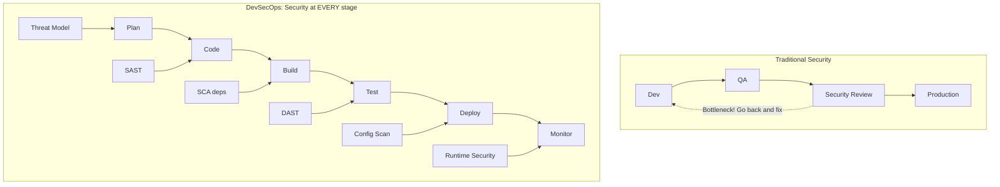
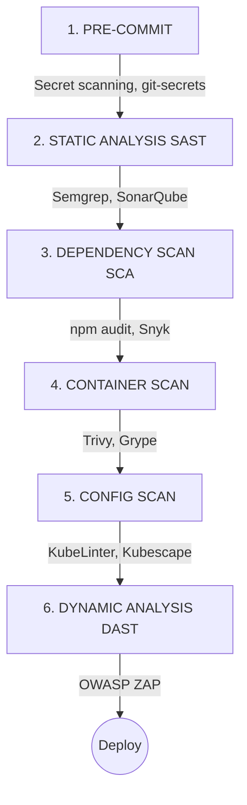
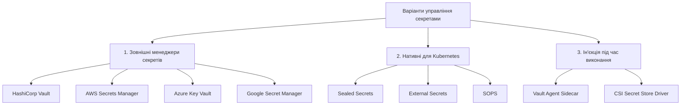
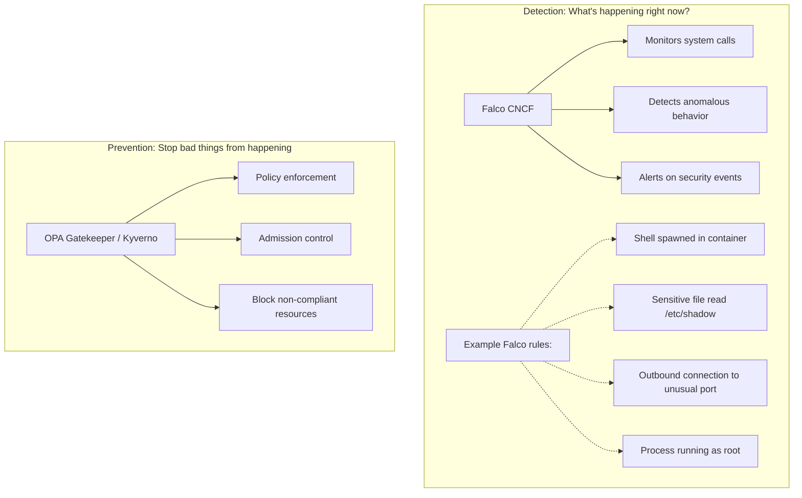
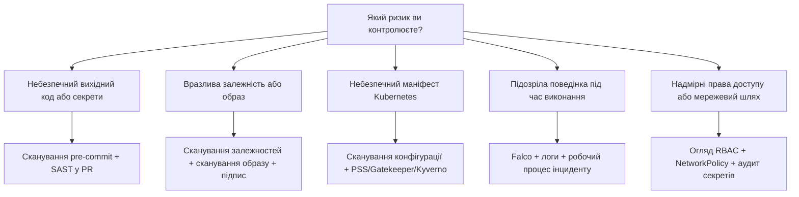

> **Складність**: `[СЕРЕДНЯ]`.
>
> **Час на проходження**: 75 хвилин.
>
> **Передумови**: Модулі "Modern DevOps" 1.1-1.5, базові маніфести Kubernetes, концепції CI/CD та впевнена робота з командним рядком.

---


## Що ви зможете зробити

Після завершення цього модуля ви зможете:

- **Спроєктувати** безпечний конвеєр CI/CD, що поєднує сканування секретів на етапі pre-commit, аналіз сирцевого коду, перевірку залежностей, сканування образів, застосування політик та моніторинг під час виконання.
- **Оцінити** ризики безпеки Kubernetes, такі як відкриті дашборди, надмірні права RBAC, привілейовані контейнери, слабке керування секретами та необмежена мережева взаємодія Pod'ів.
- **Впровадити** Pod Security Standards, NetworkPolicies та механізми контролю RBAC із найменшими привілеями для робочих навантажень у Kubernetes 1.35+.
- **Порівняти** інструменти DevSecOps, такі як Trivy, OPA Gatekeeper, Kyverno, Falco, KubeLinter, Kubescape та Sealed Secrets, за етапами ризику, на які вони спрямовані.
- **Діагностувати** небезпечні маніфести Kubernetes та провести їх рефакторинг у придатні для розгортання конфігурації, які зменшують привілеї, обмежують радіус ураження (blast radius) та забезпечують чіткі докази для аудиту.


## Чому це важливо

Інциденти у хмарних середовищах часто починаються з малого. Інтерфейс управління розгортається без автентифікації, щоб розробник міг швидко вносити зміни; роль IAM отримує занадто широку політику, оскільки точний перелік необхідних дій було важко визначити; робоче навантаження отримує монтування `host-path`, бо так було простіше написати попередню перевірку. Кожен із цих виборів сам по собі виглядає як розумний компроміс під час спринту. Разом вони створюють умови, за яких одна неправильна конфігурація призводить до компрометації всього кластера — тому що мережевий рівень, рівень ідентифікації та рівень середовища виконання ніколи не посилювалися незалежно один від одного. Модулі напрямку CKS детально розглядають два класичні приклади: [відкритий Kubernetes dashboard](/k8s/cks/part1-cluster-setup/module-1.5-gui-security/) <!-- incident-xref: tesla-2018-cryptojacking --> та [компрометацію сервісу метаданих хмари](/k8s/cks/part1-cluster-setup/module-1.4-node-metadata/) <!-- incident-xref: capital-one-2019 -->. Цей модуль працює на рівень вище: як інженерним командам запобігти накопиченню цих дрібних рішень від самого початку?

У квітні 2021 року відповідь на це запитання була переписана однією атакою на ланцюжок постачання (supply-chain attack). Завантажувач `bash` від Codecov — скрипт, який тисячі CI-конвеєрів передавали напряму в `bash` — був модифікований для крадіжки змінних середовища з кожного запуску CI, який його використовував. Зловмисники зібрали облікові дані, ключі розгортання та секрети підписаних артефактів з конвеєрів клієнтів, чиї змінні середовища CI можна було витягнути. Урок був неприємним: інструмент CI, який працює із секретами, сам є виробничою системою, і "довірені" зовнішні скрипти заслуговують на таку саму ретельну перевірку, як і внутрішній код. DevSecOps — це інженерна дисципліна, яка робить таку перевірку рутинною, а не реактивною.

DevSecOps — це інженерна відповідь на такий патерн. Це не означає додавання одного сканера в кінець конвеєра або вимогу до служби безпеки схвалювати кожен реліз вручну. Це означає перетворення вимог безпеки на повторювані перевірки, які виконуються там, де інженери вже працюють, а потім забезпечення дотримання найважливіших правил на межі кластера, щоб втомлена людина не могла випадково розгорнути небезпечне робоче навантаження у п'ятницю ввечері.

Цей модуль розглядає безпеку як систему доставки. Ви побачите, як ранній зворотний зв'язок виявляє дешеві помилки, як admission control блокує небезпечні маніфести, як виявлення під час виконання ловить поведінку, яку не можуть побачити статичні перевірки, і як принцип найменших привілеїв не дає одному скомпрометованому компоненту перетворитися на повну компрометацію середовища. Суть полягає не в тому, щоб запам'ятати список інструментів; суть полягає в тому, щоб дізнатися, де має бути кожен контроль, і як вибрати контроль, який відповідає помилці, якій ви намагаєтеся запобігти.

## DevSecOps як система зворотного зв'язку

DevSecOps розшифровується як development, security, and operations, але назва має менше значення, ніж цикл зворотного зв'язку, який вона створює. Традиційна безпека часто з'являлася на пізніх етапах циклу доставки, після того, як розробники завершували функцію, QA перевіряли поведінку, і вже виникав тиск щодо релізу. Коли пізній огляд виявляв вразливість, команді доводилося вибирати між затримкою релізу, прийняттям ризику або застосуванням поспішного виправлення з поганим контекстом.

У моделі DevSecOps безпека розглядається як тестування, observability (спостережливість) та надійність: спільна інженерна відповідальність, підкріплена автоматизацією. Розробники отримують локальний зворотний зв'язок до того, як код залишає їхню робочу станцію, CI-системи перевіряють артефакт перед його просуванням, admission controllers забезпечують дотримання беззаперечних правил кластера, а інструменти середовища виконання стежать за поведінкою, яка з'являється лише після розгортання. Кожен етап має своє завдання, і етапи працюють найкраще, коли вони видають помилки з поясненнями, на які розробник може швидко відреагувати.



Діаграма показує, чому DevSecOps не є єдиною категорією інструментів. Моделювання загроз (threat modeling) відбувається перед написанням коду, оскільки архітектурні помилки найдешевше виправити, поки дизайн ще гнучкий. Статичний аналіз знаходиться поруч із кодом, тому що він може знаходити небезпечні патерни, не чекаючи на образ контейнера. Сканування конфігурації відбувається перед розгортанням, оскільки Kubernetes YAML є виконуваною інфраструктурою, а моніторинг середовища виконання (runtime monitoring) відбувається після розгортання, оскільки зловмиснику байдуже, що всі попередні перевірки були успішними.

Зсув ліворуч (shift left) — це фраза, яку команди використовують для переміщення перевірок на більш ранні етапи життєвого циклу, але цю фразу можна зрозуміти неправильно. Це не означає перекладання відповідальності з команд безпеки на розробників без підтримки. Це означає переміщення першого корисного сигналу якомога ближче до того, хто може виправити проблему, зберігаючи при цьому сильні засоби контролю на пізніших етапах для тих ризиків, які потребують централізованого примусового виконання.

```mermaid
flowchart LR
    A[Code] -- "$" --> B[Build]
    B -- "$$" --> C[Test]
    C -- "$$$" --> D[Stage]
    D -- "$$$$" --> E[Production]
    E -- "$$$$$$$" --> F[Breach!]

    classDef default fill:#f9f9f9,stroke:#333,stroke-width:2px;
    style F fill:#ff9999,stroke:#cc0000,stroke-width:3px;
```

Економічна причина зсуву ліворуч є простою. Якщо розробник помічає жорстко закодований пароль (hardcoded password) перед комітом, виправлення зазвичай зводиться до швидкого редагування. Якщо хук pre-commit виявляє це, розробник може змінити коміт до того, як секрет потрапить до спільної історії. Якщо той самий пароль потрапляє до зібраного образу, репозиторію Git, реєстру контейнерів і виробничих логів, виправлення перетворюється на ротацію облікових даних, аудит, сортування (triage) інцидентів та іноді сповіщення клієнтів.

Зупиніться та подумайте: якщо розробник жорстко кодує пароль до бази даних у гілці фічі, який контроль має виявити це першим, і який пізніший контроль все одно має існувати на випадок, якщо перший буде обійдено? Сильна відповідь називає як локальне сканування або сканування секретів у pull request, так і сканування репозиторію на стороні сервера або сканування CI, тому що реальні системи потребують багаторівневого контролю, а не однієї ідеальної контрольної точки.

Практичний компроміс полягає в якості сигналу. Сканер, який повідомляє про сотні знахідок з низькою достовірністю (low-confidence findings), ігноруватиметься, навіть якщо технічно він запускається рано. Сканер, який блокує реліз без вказівки точного файлу, правила, серйозності та шляху до виправлення, викликає обурення, а не безпеку. Хороші програми DevSecOps налаштовують правила, документують винятки і роблять безпечний шлях простішим, ніж ризикований обхідний.



Перевірки pre-commit зупиняють секрети та очевидно небезпечні патерни до того, як вони потраплять до історії. Інструменти SAST перевіряють вихідний код на наявність небезпечних функцій, шляхів ін'єкцій, небезпечної десеріалізації та помилок авторизації, які можна виявити без запуску програми. Аналіз складу програмного забезпечення (SCA) перевіряє залежності за базами даних відомих вразливостей, що важливо, оскільки сучасні сервіси часто містять значно більше стороннього коду, ніж власного.

Сканування контейнера відбувається після пакування програми, оскільки фінальний образ містить пакети операційної системи, середовища виконання мов і шари базового образу, які сканування вихідного коду не може побачити. Сканування конфігурації перевіряє маніфести Kubernetes, вихідні дані Helm та файли політик до того, як вони потраплять до API-сервера. Динамічне тестування (DAST) потім зондує працюючий сервіс ззовні, знаходячи такі проблеми, як відсутні заголовки, порушена поведінка автентифікації та дефекти конкретних маршрутів, які існують лише тоді, коли програма зібрана.

Конвеєр має бути найсуворішим там, де наслідки є найбільшими, а докази — найвагомішими. Локальне попередження є доречним для експериментальної гілки із залежністю середньої серйозності, яка не має шляху експлуатації у програмі. Виробнича відмова через admission control (admission denial) є доречною для привілейованого Pod, монтування файлової системи вузла або непідписаного образу в регульованому просторі імен, оскільки такі умови створюють безпосередній ризик для платформи.

Перед запуском нового бар'єра безпеки в режимі блокування, запитайте, що робитиме розробник, коли він спрацює і видасть помилку. Якщо відповідь "відкриє тікет і чекатиме", бар'єр все одно може бути необхідним, але операційна модель неповна. Ефективні команди доповнюють кожне блокувальне правило документацією, прикладами, відповідальною особою, процедурою винятку та способом локально відтворити помилку.

## Забезпечення безпеки ланцюжка постачання артефактів

Зрештою, Kubernetes запускає образи контейнерів, тому першою конкретною межею безпеки є сам артефакт. Образ контейнера — це не просто ваш двійковий файл програми; це стек базових шарів, пакетів, бібліотек, команд запуску, ідентифікаторів користувачів і дозволів файлової системи. Якщо цей стек є роздутим, змінним (mutable), непідписаним або зібраним із секретами, кластер успадковує ці проблеми незалежно від того, наскільки ретельно написаний об'єкт Deployment.

Найменший корисний образ зазвичай безпечніший за образ операційної системи загального призначення, оскільки в ньому видалено інструменти, які зловмисник може використати повторно після компрометації. Оболонка (shell), менеджер пакетів, мережевий клієнт, компілятор та інструменти налагодження зручні під час розробки, але вони також зручні під час вторгнення. Мінімальні образи не є магією, але вони зменшують можливості для зловмисника і зменшують кількість пакетів, які мають відстежувати сканери вразливостей.

```dockerfile
# BAD: Large attack surface, runs as root
FROM ubuntu:latest
RUN apt-get update && apt-get install -y nginx
COPY app /app
CMD ["nginx"]

# GOOD: Minimal image, non-root user
FROM nginx:1.27-alpine
RUN adduser -D -u 1000 appuser
COPY --chown=appuser:appuser app /app
USER appuser
EXPOSE 8080
```

Поганий приклад використовує плаваючий тег (floating tag) і залишає процес працювати від імені root. Хороший приклад все ще потребує валідації, але він робить два важливі рішення явними: більш обмежений базовий образ і користувач без прав root. Прив'язка до певного тегу образу покращує відстежуваність, тоді як запуск від імені виділеного користувача обмежує можливості процесу, якщо програму буде експлуатовано.

Теги образів заслуговують на особливу увагу, оскільки це зручні для людини мітки, а не незмінні гарантії. Тег `nginx:1.27-alpine` є більш конкретним, ніж плаваючий тег, але дайджест (digest) є надійнішим, коли вам потрібна відтворюваність. У виробничих конвеєрах команди часто збирають образи із затверджених базових образів, сканують результат, підписують дайджест і розгортають за дайджестом, щоб робоче навантаження, яке пройшло перевірку, було тим самим робочим навантаженням, яке отримає кластер.

```bash
# Trivy - most popular open-source scanner
trivy image nginx:1.27

# Example output:
# nginx:1.27 (debian 12.0)
# Total: 142 (UNKNOWN: 0, LOW: 89, MEDIUM: 45, HIGH: 7, CRITICAL: 1)
```

Цей приклад виводу корисний, оскільки він показує, чому управління вразливостями є проблемою розстановки пріоритетів. Сканер може знайти багато проблем, але не кожна знахідка заслуговує на однакову реакцію. Команди зазвичай блокують відомі критичні вразливості, які можна експлуатувати, проблеми високої серйозності в доступних компонентах, а також порушення внутрішньої базової політики, відстежуючи при цьому знахідки з меншим ризиком у рамках звичайного технічного обслуговування.

Сканування також має часові обмеження. Чисте сканування під час збирання може стати застарілим, коли наступного дня буде опублікована нова вразливість (CVE). Саме тому зрілі програми сканують образи в CI, перескановують реєстри за розкладом і моніторять запущені робочі навантаження на наявність образів, які перестали відповідати вимогам після розгортання. DevSecOps є безперервним, тому що знання про вразливості змінюються після того, як створено артефакт.

```bash
# Sign images to ensure they haven't been tampered with
# Using cosign (sigstore)
cosign sign myregistry/myapp:v1.0

# Verify before deploying
cosign verify myregistry/myapp:v1.0
```

Підпис образів вирішує інший ризик, ніж сканування. Сканер запитує, чи містить артефакт відомі проблеми; підпис запитує, чи походить артефакт із довіреного процесу збирання і чи залишився він незмінним. Без походження (provenance) зловмисник, який отримує доступ до реєстру, може замінити образ після того, як він пройде CI, і кластер може завантажити шкідливий артефакт, оскільки тег виглядає знайомим.

Найсильніший патерн — це поєднання ідентичності збирання, доказів сканування та admission control. Система CI збирає образ, фіксує дайджест, сканує дайджест, підписує дайджест і публікує метадані. Політика admission control кластера потім перевіряє, що виробничі робочі навантаження посилаються на затверджений і підписаний артефакт. Це перетворює "ми його десь просканували" на обов'язкове правило розгортання.

Гіпотетичний сценарій: платформенна команда виявляє, що кілька сервісів перезбираються з базових образів `latest` під час екстрених виправлень. Нотатки до релізу виглядають чистими, але два сервіси завантажують новіші пакети, ніж ті, що використовувалися в staging-середовищі, і поведінка під час виконання змінюється під навантаженням. Виправлення — це не просто "робити краще тегування"; команда змінює конвеєр, щоб фіксувати дайджести базових образів, записувати походження збирання та відхиляти виробничі образи без підписаного дайджеста.

Який підхід ви б обрали тут і чому: блокування кожної вразливості середньої серйозності під час збирання, чи блокування лише знахідок високої достовірності в доступних компонентах, створюючи при цьому відстежувані завдання для решти? Другий підхід зазвичай є більш стійким, але лише тоді, коли команда має реальний процес щодо застарівання знахідок (aging), власності та ескалації. Неблокуюча знахідка без власника — це лише відкладений ризик.


## Посилення безпеки робочих навантажень Kubernetes

Коли артефакт є надійним, наступне питання полягає в тому, що саме робочому навантаженню дозволено робити всередині кластера. Kubernetes надає вам багато потужних інструментів, оскільки робочі навантаження бувають різними, але ця гнучкість може стати небезпечною, коли маніфести копіюються зі старих прикладів або пишуться лише для того, щоб застосунок запустився. Налаштування контексту безпеки — це еквівалент вбудовування правил доступу в інструкції із запуску робочого навантаження.

Ключова ідея полягає в принципі найменших привілеїв. Pod повинен запускатися не від імені користувача root, уникати підвищення привілеїв, відкидати непотрібні можливості (capabilities) Linux, використовувати кореневу файлову систему лише для читання, коли це практично доцільно, і запитувати лише ті ресурси, які йому потрібні. Ці налаштування не роблять застосунок невразливим, але вони змушують зловмисника докладати більше зусиль після першого експлойту та зменшують ймовірність того, що один скомпрометований процес зможе контролювати вузол.

```yaml
# BAD: Overly permissive pod
apiVersion: v1
kind: Pod
metadata:
  name: insecure-pod
spec:
  containers:
  - name: app
    image: myapp
    securityContext:
      privileged: true          # Never do this!
      runAsUser: 0              # Don't run as root
    volumeMounts:
    - name: host
      mountPath: /host          # Don't mount host filesystem
  volumes:
  - name: host
    hostPath:
      path: /

# GOOD: Secure pod configuration
apiVersion: v1
kind: Pod
metadata:
  name: secure-pod
spec:
  securityContext:
    runAsNonRoot: true
    runAsUser: 1000
    fsGroup: 1000
    seccompProfile:
      type: RuntimeDefault
  containers:
  - name: app
    image: myapp
    securityContext:
      allowPrivilegeEscalation: false
      readOnlyRootFilesystem: true
      capabilities:
        drop:
        - ALL
    resources:
      limits:
        memory: "128Mi"
        cpu: "500m"
```

Небезпечний Pod поєднує кілька налаштувань із високим рівнем ризику. `privileged: true` надає контейнеру широкий доступ на рівні хоста, `runAsUser: 0` запускає процес від імені root, а монтування `hostPath` відкриває доступ до файлової системи вузла. Будь-яке з цих налаштувань заслуговує на ретельну перевірку; разом вони перетворюють компрометацію Pod на ймовірну компрометацію вузла.

Безпечний Pod не є універсальним шаблоном, але він демонструє правильний напрямок. `runAsNonRoot` та `runAsUser` роблять ідентичність явною, `allowPrivilegeEscalation: false` запобігає отриманню процесом додаткових привілеїв через setuid-бінарники, `readOnlyRootFilesystem` обмежує можливості втручання після компрометації, а відкидання всіх capabilities позбавляє привілеїв Linux, які застосунку, ймовірно, ніколи й не були потрібні. Обмеження ресурсів також мають значення, оскільки відмова в обслуговуванні може бути проблемою безпеки, а не лише надійності.

Покладатися на те, що кожен розробник пам'ятатиме кожне поле, є ненадійним підходом, тому кластери Kubernetes версії 1.35+ повинні використовувати Pod Security Standards через Pod Security Admission. Контролер допуску оцінює Pods відповідно до міток простору імен і може застосовувати обмеження (enforce), попереджати (warn) або проводити аудит (audit) порушень. Це дає платформеним командам вбудований базовий рівень безпеки без необхідності використання сторонніх вебхуків для найпоширеніших правил посилення безпеки робочих навантажень.

```yaml
# Enforce security standards at namespace level
apiVersion: v1
kind: Namespace
metadata:
  name: production
  labels:
    pod-security.kubernetes.io/enforce: restricted
    pod-security.kubernetes.io/warn: restricted
    pod-security.kubernetes.io/audit: restricted
```

PSS має три рівні профілів, і їхні назви навмисно прості. `privileged` залишає робочі навантаження здебільшого без обмежень, `baseline` запобігає відомим шляхам підвищення привілеїв, водночас дозволяючи типові патерни застосунків, а `restricted` застосовує суворіший набір вимог до посилення безпеки. Продуктові простори імен для застосунків зазвичай повинні схилятися до `restricted`, тоді як інфраструктурні простори імен можуть потребувати ретельно задокументованих винятків.

| Рівень | Опис |
|-------|-------------|
| privileged | Без обмежень (небезпечно) |
| baseline | Мінімальні обмеження, запобігає відомим шляхам підвищення привілеїв |
| restricted | Дуже суворі обмеження, відповідає найкращим практикам |

Важливим операційним вибором є режим застосування (enforcement mode). `warn` допомагає розробникам бачити порушення без їхнього блокування, `audit` фіксує порушення для подальшого аналізу, а `enforce` відхиляє Pods, що не відповідають вимогам. Практичне впровадження часто починається з `warn` та `audit`, потім виправляються "галасливі" робочі навантаження, після чого вмикається `enforce` для нових розгортань, перш ніж зробити правила суворішими для існуючих просторів імен.

Використовуйте повні команди `kubectl` у спільних прикладах та автоматизації, навіть якщо ви особисто використовуєте коротші інтерактивні аліаси у своєму терміналі. Ця звичка має значення, оскільки команда, скопійована з навчального курсу в CI, ранбук або shell-скрипт, має працювати в неінтерактивному середовищі без залежності від локальних налаштувань оболонки.

> **Попередження:** Додавання міток до простору імен змінює Pod Security Admission для кожного робочого навантаження в ньому. Використовуйте тимчасовий демо-кластер та експериментальний простір імен — а не спільний простір імен `production`.

```bash
kubectl create namespace devsecops-demo
kubectl label namespace devsecops-demo pod-security.kubernetes.io/enforce=restricted --overwrite
kubectl label namespace devsecops-demo pod-security.kubernetes.io/warn=restricted --overwrite
kubectl label namespace devsecops-demo pod-security.kubernetes.io/audit=restricted --overwrite
```

Перш ніж запускати це у спільному кластері, зупиніться та подумайте: який результат ви очікуєте, коли розробник відправить створений раніше небезпечний Pod до простору імен із `enforce=restricted`? Правильним очікуванням є відхилення контролером допуску ще до етапу планування, оскільки API-сервер перевіряє запит і відмовляється зберігати Pod, який порушує вибраний профіль.

## Захист секретів та ідентичності

Управління секретами — це та сфера, де багато cloud-native команд випадково плутають кодування з безпекою. Об'єкти `Secret` у Kubernetes розроблені для відокремлення чутливих значень від звичайної конфігурації, але за замовчуванням ці значення закодовані у base64, і їх не слід вважати безпечними для коміту в Git. Будь-хто, хто може прочитати маніфест або отримати доступ до збереженого об'єкта, здатний розкодувати дані, якщо не застосовано додаткове шифрування, контроль доступу та контроль робочих процесів.

```yaml
# NEVER DO THIS
apiVersion: v1
kind: ConfigMap
metadata:
  name: app-config
data:
  DATABASE_PASSWORD: "your-database-password-here"  # In Git history forever!
```

Проблема полягає не лише у файлі в поточній гілці. Історія Git зберігає попередні версії, форки можуть скопіювати секрет, логи CI можуть його вивести, а локальні клони можуть існувати ще довго після видалення оригінального файлу. Як тільки справжній обліковий запис або ключ потрапляє в історію, правильною реакцією є ротація та розслідування, а не просто видалення рядка в надії, що ніхто нічого не помітив.

Робота із секретами в DevSecOps складається з трьох рівнів. По-перше, запобігання випадковим комітам за допомогою локального сканування та сканування на стороні сервера. По-друге, зберігання посилань на секрети для розгортання у формі, безпечній для рев'ю в підході GitOps. По-третє, доставка справжнього секрету до робочого навантаження під час виконання із системи, яка може проводити аудит доступу, робити ротацію значень і обмежувати тих, хто може їх читати.



Sealed Secrets є популярними, оскільки вони добре вписуються в звички GitOps. Розробники шифрують звичайний `Secret` у Kubernetes за допомогою відкритого ключа, перетворюючи його на `SealedSecret`, а потім комітять зашифрований об'єкт. Контролер усередині кластера зберігає закритий ключ і розшифровує об'єкт у придатний для використання `Secret` лише в цільовому кластері. Це означає, що репозиторій може зберігати зашифрований маніфест, не розкриваючи значення у відкритому тексті.

```bash
# Install sealed-secrets controller
# Then create sealed secrets that can be committed to Git

kubeseal --format yaml < secret.yaml > sealed-secret.yaml

# sealed-secret.yaml can be committed
# Only the cluster can decrypt it
```

Оператори зовнішніх секретів вирішують дещо іншу проблему. Замість шифрування значення в Git, вони синхронізують секрети з таких систем, як AWS Secrets Manager, Azure Key Vault, Google Secret Manager або HashiCorp Vault, у кластер Kubernetes. Це може бути кращим рішенням для організацій, які вже централізовано управляють життєвим циклом секретів, ротацією, затвердженням і аудитом у хмарному або корпоративному менеджері секретів.

Компромісом тут є операційна відповідальність. Sealed Secrets роблять рев'ю в репозиторії простим, але закритий ключ кластера стає критично важливим матеріалом для резервного копіювання, а міграція кластера вимагає додаткового планування. Зовнішні менеджери секретів централізують контроль життєвого циклу, але вони потребують налаштування хмарної ідентичності, дозволів для оператора, мережевого доступу та ретельно налаштованого RBAC, щоб команди розробників застосунків не могли читати секрети поза межами своєї зони відповідальності.

RBAC — це складова частина цієї історії, що стосується ідентичності. Kubernetes авторизує дії в API через суб'єкти, ролі та прив'язки, і найбезпечніший дизайн надає найвужчі дії на найвужчих ресурсах у найвужчому просторі імен. Надання широкого доступу лише через те, що пайплайн колись упав із помилкою, є одним із найшвидших способів перетворити витік токена на інцидент масштабу всієї платформи.

```yaml
# Principle of least privilege
# Give only the permissions needed

# BAD: Cluster admin for everything
apiVersion: rbac.authorization.k8s.io/v1
kind: ClusterRoleBinding
metadata:
  name: developer-admin
subjects:
- kind: User
  name: developer@company.com
  apiGroup: rbac.authorization.k8s.io
roleRef:
  apiGroup: rbac.authorization.k8s.io
  kind: ClusterRole
  name: cluster-admin    # Too much power!
```

Погана прив'язка є небезпечною, оскільки вона діє на рівні всього кластера і використовує вбудовану роль `cluster-admin`. Якщо робоча станція користувача, сесія браузера або обліковий запис провайдера ідентичності скомпрометовані, зловмисник успадковує повний контроль над усіма просторами імен. Це особливо ризиковано для сервісних акаунтів CI/CD, оскільки ці облікові дані часто працюють в автономному режимі і можуть зберігатися в системах автоматизації.

```yaml
# GOOD: Namespace-scoped, minimal permissions
apiVersion: rbac.authorization.k8s.io/v1
kind: Role
metadata:
  namespace: development
  name: developer
rules:
- apiGroups: ["apps"]
  resources: ["deployments"]
  verbs: ["get", "list", "create", "update"]
- apiGroups: [""]
  resources: ["pods"]
  verbs: ["get", "list"]
```

```yaml
# GOOD: RoleBinding to attach the Role to the User
apiVersion: rbac.authorization.k8s.io/v1
kind: RoleBinding
metadata:
  name: developer-binding
  namespace: development
subjects:
- kind: User
  name: developer@company.com
  apiGroup: rbac.authorization.k8s.io
roleRef:
  apiGroup: rbac.authorization.k8s.io
  kind: Role
  name: developer
```

Краща конфігурація утримує розробника в межах одного простору імен і надає лише ті дії, які необхідні для роботи. Зверніть увагу на те, чого тут немає: дозволів на видалення ресурсів, читання об'єктів `Secret`, зміну RBAC або роботу в інших просторах імен. Ці вилучення і є контролем безпеки, оскільки принцип найменших привілеїв визначається не лише тим, що ви включаєте, але й тим, що ви залишаєте поза доступом.

Гіпотетичний сценарій: пайплайн розгортання використовує сервісний акаунт із правами `cluster-admin`, оскільки ранні релізи Helm потребували кількох специфічних дозволів, і ніхто так і не переглянув цю прив'язку. Через кілька місяців токен інтеграції CI витікає через неправильно налаштований лог завдання. Команда реагування на інциденти уникає більшої компрометації лише завдяки тому, що облікові дані реєстру мають окрему ротацію, але токен пайплайну все одно має достатньо доступу, щоб перерахувати всі простори імен і переглянути чутливі метадані робочих навантажень.


## Мережевий захист та захист середовища виконання

У багатьох кластерах мережа Kubernetes навмисно відкрита за замовчуванням. Часто Pod-и можуть зв'язуватися з іншими Pod-ами у різних просторах імен (namespaces), якщо мережевий плагін та правила NetworkPolicy не визначають іншого. Такий підхід за замовчуванням є зручним на етапі навчання команди, але в робочому середовищі (production) він становить серйозний ризик. Зловмисник, який скомпрометував один Pod, може просканувати внутрішні сервіси та спробувати виконати горизонтальне переміщення.

NetworkPolicy змінює модель від неявної довіри до явного дозволу. Політика заборони за замовчуванням (default-deny) прибирає всю повсюдну зв'язність, після чого вузькоспрямовані правила дозволяють лише той трафік, який дійсно потрібен застосунку. Це схоже на те, ніби зачинити всі двері в офісі за замовчуванням і видавати ключі лише від тих кімнат, куди людині справді потрібно заходити.

```yaml
# Network Policy: Only allow specific traffic
apiVersion: networking.k8s.io/v1
kind: NetworkPolicy
metadata:
  name: api-network-policy
  namespace: production
spec:
  podSelector:
    matchLabels:
      app: api
  policyTypes:
  - Ingress
  - Egress
  ingress:
  - from:
    - podSelector:
        matchLabels:
          app: frontend
    ports:
    - protocol: TCP
      port: 8080
  egress:
  - to:
    - podSelector:
        matchLabels:
          app: database
    ports:
    - protocol: TCP
      port: 5432
```

У цьому прикладі Pod API може отримувати трафік лише від Pod-ів із міткою `app: frontend` на порт 8080 та надсилати трафік лише до Pod-ів із міткою `app: database` на порт 5432. Усе інше відкидається на мережевому рівні за умови, що мережевий провайдер кластера підтримує NetworkPolicy. Це припущення є важливим, оскільки Kubernetes лише визначає API, але виконання цих правил забезпечує плагін CNI.

Зупиніться та подумайте: якщо застосувати NetworkPolicy із забороною за замовчуванням до простору імен, який ніколи раніше не використовував мережеві політики, що станеться з наявними Pod-ами, які зараз вільно взаємодіють? Вони не перезапустяться, але трафік, який більше не має явного дозволу, почне блокуватися. Саме тому команди повинні складати карту залежностей, додавати політики дозволу та ретельно все тестувати перед впровадженням політики default-deny у навантаженому просторі імен.

Мережева політика не замінює автентифікацію чи авторизацію. Вона скорочує кількість доступних шляхів, але базі даних усе одно потрібні облікові дані, TLS залишається важливим, а застосунку все ще необхідні перевірки авторизації. Глибокоешелонований захист (defense in depth) означає, що скомпрометований фронтенд має бути заблокований на мережевому рівні, на рівні автентифікації сервісу та на рівні авторизації даних.

Інструменти статичного сканування допомагають виявити слабкі конфігурації мережі, робочих навантажень (workloads) та RBAC ще до розгортання. KubeLinter фокусується на YAML-файлах Kubernetes та виводі Helm; Kubescape може оцінювати репозиторії або кластери на відповідність фреймворкам, таким як рекомендації NSA-CISA, а Trivy може сканувати образи, файлові системи, репозиторії та ресурси Kubernetes. Їхні можливості перетинаються, але це корисно, коли кожен інструмент надає дієві дані на потрібному етапі.

```bash
# Scan Kubernetes YAML for issues
kube-linter lint deployment.yaml

# Example output:
# deployment.yaml: (object: myapp apps/v1, Kind=Deployment)
# - container "app" does not have a read-only root file system
# - container "app" is not set to runAsNonRoot
```

KubeLinter є дуже корисним у pull request-ах, оскільки він вказує безпосередньо на поля маніфестів, які розробники можуть змінити. Він не є детектором для середовища виконання і не доводить, що застосунок повністю безпечний, але він виловлює типові помилки ще до того, як їх побачить сервер API. При правильному використанні він стає не лише шлюзом (gate), а й інструментом навчання.

```bash
# Full security scan against frameworks like NSA-CISA
kubescape scan framework nsa

# Scans for:
# - Misconfigurations
# - RBAC issues
# - Network policies
# - Image vulnerabilities
```

Kubescape стає в пригоді, коли вам потрібне ширше бачення стану безпеки для робочих навантажень і кластерів. Сканування, орієнтоване на фреймворки, допомагає платформенним командам пояснювати ризики аудиторам та інженерним менеджерам, адже результати згруповані за загальновідомими засобами контролю. Зворотний бік полягає в тому, що широкі сканування можуть давати багато зайвого шуму, якщо команда не визначить відповідальних за результати та не відстежуватиме їх виправлення так само, як звичайні робочі завдання.

```bash
# Scan container image
trivy image myapp:v1

# Scan Kubernetes manifests
trivy config .

# Scan running cluster
trivy k8s --report summary
```

Trivy часто обирають через те, що один інструмент може охопити кілька напрямків: образи, репозиторії, конфігурації інфраструктури та кластери. Така широта охоплення є зручною для невеликих команд, але вона все одно вимагає прийняття політичних рішень. Сканер може згенерувати дані; ваша ж програма безпеки має визначати, які саме знахідки блокуватимуть злиття коду (merge), які створюватимуть тікети, а які будуть прийняті з належним обґрунтуванням.

Навіть надійний конвеєр (pipeline) не здатний передбачити кожну подію в середовищі виконання. Експлойт нульового дня (zero-day exploit), вкрадені облікові дані, небезпечна кінцева точка (endpoint) для зневадження або скомпрометована залежність можуть спричинити поведінку, яка здається нормальною для статичного аналізу, але є аномальною на рівні вузла (node). Інструменти безпеки середовища виконання відстежують виконання процесів, доступ до файлів, мережеві з'єднання та інші сигнали під час фактичної роботи навантаження.



Falco — це інструмент виявлення, а не контролер допуску (admission controller). Він може надсилати сповіщення, коли всередині контейнера запускається оболонка (shell), коли відбувається читання конфіденційного файлу або коли процес відкриває незвичне мережеве з'єднання. Таке сповіщення є корисним, оскільки багато робочих контейнерів взагалі ніколи не повинні запускати інтерактивну оболонку, і така поведінка є підозрілою, навіть якщо образ успішно пройшов усі попередні перевірки.

OPA Gatekeeper та Kyverno відповідають за запобігання. Вони аналізують запити на допуск у Kubernetes (admission requests) і можуть відхиляти ресурси, які порушують політику безпеки, наприклад: відсутні мітки, недозволені реєстри, привілейовані контейнери або образи без обов'язкових підписів. Gatekeeper використовує шаблони обмежень у стилі OPA, тоді як Kyverno покладається на власні ресурси політик Kubernetes, які для багатьох платформенних команд є простішими для розуміння.

Найбільш правильною ментальною моделлю є багаторівневий підхід. SAST запобігає вразливим патернам коду, SCA блокує відомі погані залежності, сканування образів не пропускає ризиковані пакунки, підписування захищає від ненадійних артефактів, контроль допуску не дозволяє створення небезпечних ресурсів, NetworkPolicy обмежує переміщення, RBAC обмежує можливості API, а виявлення на рівні середовища виконання сповіщає вас, коли попри все відбувається щось неочікуване. Жоден рівень не є ідеальним сам по собі, але кожен із них усуває шлях, який міг би використати зловмисник.

### Практичний приклад: Впровадження DevSecOps без зупинки розробки

Уявіть команду, яка розробляє клієнтський API, фоновий процес (background worker) та невелику адміністративну панель. Команда вже постачає код через pull request-и та конвеєр CI, але перевірки безпеки відбуваються непослідовно. Один розробник іноді запускає локальний сканер, платформенна команда сканує кластери раз на місяць, а для розгортання в робочому середовищі використовується сервісний акаунт (service account), який може оновлювати майже все у своєму просторі імен. Першим інстинктом може бути бажання встановити всі доступні сканери та заблокувати все, що вони знайдуть, проте зазвичай це лише створює тертя, а не підвищує безпеку.

Набагато краще почати з того, щоб намалювати шлях постачання та прив'язати один елемент контролю до кожного переходу з високим ризиком. Код переміщується з ноутбука до Git, тому сканування на наявність секретів має відбуватися перед коммітом і повторно на межі репозиторію. Сирцевий код переходить з Git до етапу збірки, тому SAST та перевірка залежностей мають бути частиною pull request-у. Збірка створює образ, тому сканування та підписування образу мають виконуватися після того, як з'явиться його дайджест. Маніфест рухається до кластера, тому сканування конфігурації та політика допуску (admission policy) мають застосовуватися до того, як сервер API його прийме.

Такий порядок дає команді практичний план розгортання. У перший тиждень можна увімкнути рекомендаційні хуки pre-commit та сканування репозиторію на секрети, оскільки витік облікових даних є серйозною проблемою, а шляхи її вирішення добре зрозумілі. На другому тижні можна додати SAST та сканування залежностей у pull request-ах, але на цьому етапі краще залишати коментарі, а не блокувати злиття при кожній знахідці. На третьому тижні можна запровадити порогові значення для сканування образів та просування підписаних образів, оскільки тепер у команди є стабільний робочий процес для роботи з артефактами.

Водночас платформенна команда може підготувати механізми контролю на стороні кластера в режимі аудиту або попереджень. Мітки Pod Security Admission можуть попереджати, коли робоче навантаження порушує обмежений профіль (restricted profile), а Gatekeeper чи Kyverno можуть повідомляти про порушення політик замість їхнього негайного блокування. Це важливо, оскільки наявні маніфести можуть містити старі припущення, і раптове ввімкнення жорсткого контролю може перетворити покращення безпеки на збій у системі (outage). Впровадження з пріоритетом аудиту (audit-first) не означає слабку безпеку; це означає, що команда збирає дані перед тим, як змінити режим реагування на помилки.

Після аналізу попереджень команда може розділити правила на три групи. Правила, що захищають платформу від миттєвої компрометації (наприклад, запуск привілейованих контейнерів у просторах імен застосунків), повинні швидко перейти в режим жорсткого виконання (enforcement). Правила, що вказують на хорошу "гігієну" (наприклад, відсутність міток або некритичні зауваження до образу), можуть залишатися в режимі рекомендацій до визначення відповідальних осіб. Правила, які є занадто "шумними" або неоднозначними, потрібно переписати так, щоб розробник міг чітко зрозуміти, що саме пішло не так і як це виправити.

У цьому сценарії вибір інструментів стає більш очевидним. Trivy чудово підходить для сканування образів, репозиторію та конфігурацій, адже він надає корисні дані на етапах збірки та перевірки коду. KubeLinter є зручним для отримання швидкого зворотного зв'язку щодо маніфестів у pull request-ах. Kubescape допомагає платформенній команді оцінювати загальний стан кластера відповідно до відомих фреймворків. Місце OPA Gatekeeper чи Kyverno — на етапі допуску (admission), де рішення згідно з політикою має бути застосоване ще до збереження ресурсу.

Falco з'являється у цій схемі пізніше, тому що він відповідає на інше питання. Команда може мати ідеальні перевірки у pull request-ах, але їй усе одно потрібно знати, чи не запустив раптом працюючий контейнер оболонку, чи не прочитав конфіденційні файли або чи не відкрив несподіване вихідне мережеве з'єднання. Виявленню в середовищі виконання потрібен відповідальний, маршрут для сповіщень та інструкція з реагування (playbook). Без цих складових розгортання Falco може перетворитися на нескінченний потік цікавих подій, які ніхто не розслідує.

Обробка секретів потребує окремого продуманого процесу міграції. Якщо команда наразі зберігає секрети Kubernetes у приватних Git-репозиторіях, першим кроком є припинення цієї практики та ротація всього, що було дійсно конфіденційним. Наступний крок — обрати безпечний для Git робочий процес, такий як Sealed Secrets, SOPS або зовнішній оператор секретів. Правильний вибір залежить від того, хто відповідає за ротацію, чи є в організації хмарний менеджер секретів і як відбувається відновлення кластера після збоїв.

RBAC слід посилювати з такою ж повагою до процесу постачання. Роль для розгортання, обмежена простором імен, є безпечнішою за `cluster-admin`, але вона все одно має дозволяти конвеєру оновлювати ті ресурси, якими він легітимно володіє. Команді варто проаналізувати реальні дії під час розгортання, написати вузьконаправлену роль, протестувати її у середовищі staging, а вже потім видаляти широкі права доступу. Такий підхід допомагає уникнути поширеної помилки, коли після посилення безпеки ламається розгортання, і хтось під тиском обставин повертає права `cluster-admin`.

Впровадження NetworkPolicy буде значно ефективнішим, якщо перед жорстким застосуванням (enforcement) провести спостереження. Якщо API має отримувати трафік від фронтенду та надсилати його до бази даних, ці потоки повинні бути зафіксовані ще до активації default-deny. Для визначення необхідних маршрутів команди можуть використовувати карти сервісів, логи, засоби спостереження CNI або прості поетапні тести. Щойно будуть створені політики дозволу, застосування default-deny перетвориться з ризикованого сюрпризу на контрольовану межу.

Важливим лідерським кроком є публікація зводу правил у вигляді інженерної документації, щоб він не залишався недокументованим знанням (tribal knowledge). Розробники мають бачити, які знахідки блокують злиття коду, які створюють завдання для відстеження, як запросити виняток та які докази безпеки потрібні для робочого середовища (production). Команди безпеки мають бачити відповідальних, застарілі вразливості та повторні порушення. Платформенні команди повинні розуміти, які засоби контролю застосовуються централізовано, а які залишаються у віданні команд розробки.

Цей приклад також демонструє, чому концепція "зсуву вліво" (shift left) є неповною сама по собі. Команда зміщує перевірку секретів, коду, залежностей та маніфестів "вліво", оскільки ці виправлення має робити автор. Водночас команда застосовує жорсткий контроль "вправо", на етапі допуску, тому що кластер має відхиляти небезпечні стани, навіть якщо попередня перевірка була пропущена. Команда проводить моніторинг середовища виконання, оскільки зловмисники діють уже після розгортання. DevSecOps працює тоді, коли ці позиції підсилюють одна одну, а не конкурують за увагу.

Перш ніж впроваджувати новий сканер, проведіть один репрезентативний сервіс через цю карту розгортання. Запитайте себе: чи виявляє сканер ризик раніше за поточний процес? Чи надає він достатньо деталей команді-власнику для вирішення проблеми? Чи можна впровадити жорстке застосування результатів, не блокуючи непов'язану роботу? Якщо відповідь неочевидна, почніть із режиму рекомендацій та збирайте дані. Виважене розгортання з чітко визначеною відповідальністю зазвичай перевершує драматичний запуск, після якого всі просто ігнорують сповіщення.


## Патерни та антипатерни

Патерни — це архітектурні рішення багаторазового використання, які полегшують управління безпечним постачанням з часом. Вони важливі, оскільки програми безпеки зазнають невдачі, коли кожна команда вигадує власний робочий процес, а кожен виняток вимагає окремої наради. Мета полягає в тому, щоб зробити безпечні налаштування за замовчуванням рутинними, зрозумілими та відтворюваними настільки, щоб розробники могли швидко рухатися вперед, не вгадуючи, чого очікує платформа.

| Патерн | Коли використовувати | Чому це працює | Аспект масштабування |
|---------|----------------------|----------------|----------------------|
| Shift-left плюс enforce-right | Використовуйте для конвеєрів, що розгортаються на спільних або production кластерах. | Ранні перевірки дають швидкий зворотний зв'язок, тоді як admission control блокує високоризикові відхилення. | Зберігайте локальне відтворення простим, щоб розробники могли виправляти помилки, не чекаючи на платформеного інженера. |
| Просування підписаних образів | Використовуйте, коли образи переходять з CI до staging та production реєстрів. | Розгорнутий дайджест можна прив'язати до ідентифікатора збірки, результатів сканування та затвердження. | Стандартизуйте ключі підпису або безключову ідентифікацію до того, як багато команд створять власні скрипти релізу. |
| Базові рівні безпеки простору імен | Використовуйте, коли команди ділять кластери, але володіють окремими просторами імен. | Мітки PSS, квоти, RBAC та NetworkPolicies створюють передбачувані межі орендарів. | Публікуйте шаблони просторів імен, щоб нові середовища успадковували однакові налаштування за замовчуванням. |
| Безпечні посилання на секрети у Git | Використовуйте для робочих процесів GitOps та маніфестів розгортання, що проходять рев'ю. | SealedSecrets, SOPS або посилання на зовнішні секрети не допускають потрапляння відкритого тексту в історію репозиторію. | Задокументуйте процес ротації та аварійного відновлення до того, як зміниться ключ контролера або хмарний секрет. |

Антипатерни зазвичай починаються як спроби знайти найкоротший шлях. Хтось надає права cluster-admin, тому що реліз заблоковано, використовує плаваючий тег образу, бо це зручно, або вимикає сканер, оскільки результати здаються занадто шумними. Кожне таке рішення здається локальним, але кластер запам'ятовує дозволи, реєстр запам'ятовує тег, а Git запам'ятовує секрет.

| Антипатерн | Що йде не так | Краща альтернатива |
|------------|-----------------|--------------------|
| Безпека лише на фінальному етапі релізу | Результати надходять пізно, контекст застарілий, а тиск релізу стимулює до винятків. | Запускайте ранні перевірки під час pre-commit та у pull requests, а жорстке блокування розгортання залишайте для серйозних доказів уразливостей. |
| Сервісні акаунти CI з правами cluster-admin | Витік токена конвеєра стає компрометацією control-plane у всіх просторах імен. | Надавайте кожному конвеєру дозволи (verbs) на рівні простору імен та розділяйте ідентифікатори розгортання за середовищами. |
| Відкриті секрети у Git | Приватні репозиторії все ще мають історію, форки, локальні клони та логи CI. | Зберігайте зашифровані маніфести секретів або посилання на зовнішній менеджер секретів. |
| Мережа Pod'ів з дозволом за замовчуванням назавжди | Скомпрометований фронтенд може сканувати та без необхідності отримувати доступ до внутрішніх сервісів. | Переходьте до політик default-deny з перевіреними правилами allow для необхідних потоків додатків. |

## Фреймворк прийняття рішень

Вибір засобів контролю DevSecOps стає простішим, коли ви починаєте з місця виникнення ризику, а не з назви продукту. Запитайте себе, де небажану подію можна помітити найраніше, де її можна заблокувати найнадійніше, і хто може виправити її з найменшою затримкою. Зашитий у код секрет має знаходитися ближче до розробника та межі репозиторію; привілейований Pod — на етапі рев'ю маніфесту та admission; оболонка (shell), створена експлойтом, — у сфері виявлення під час виконання (runtime detection) та реагування на інциденти.



Використовуйте перевірки pre-commit та pull-request, коли за виправлення відповідає автор, а докази легко відтворити. Використовуйте шлюзи CI, коли артефакт або маніфест потребує узгодженого середовища збірки. Використовуйте admission control, коли платформа повинна відхилити небезпечний стан незалежно від того, який конвеєр або особа його надіслали. Використовуйте виявлення під час виконання, коли поведінку неможливо спрогнозувати до моменту запуску робочого навантаження.

| Точка прийняття рішення | Надавайте перевагу цьому контролю | Уникайте цієї пастки |
|-------------------------|-----------------------------------|----------------------|
| Секрет з'являється у вихідному коді | Сканування pre-commit, сканування репозиторію, процес ротації облікових даних | Сприйняття приватного Git як менеджера секретів |
| Образ має критичні CVE | Сканування образу в CI, повторне сканування реєстру, просування підписаних образів | Блокування кожної незначної знахідки без відповідального власника чи контексту |
| Pod запитує доступ до хоста | PSS restricted, правило deny у Gatekeeper або Kyverno | Дозвіл винятків без простору імен, власника та терміну дії |
| Сервіс потребує доступу до бази даних | Правило allow у NetworkPolicy плюс облікові дані додатку | Припущення, що лише мережева політика замінює аутентифікацію |
| CI розгортає в production | Сервісний акаунт на рівні простору імен та політика підписаних артефактів | Повторне використання людських облікових даних cluster-admin в автоматизації |
| З'являється оболонка під час виконання | Сповіщення Falco, кореляція логів, плейбук реагування | Сприйняття сповіщення під час виконання як шуму через те, що CI пройшов успішно |

Цей фреймворк також допомагає з винятками. Деякі робочі навантаження обґрунтовано потребують розширених можливостей (capabilities), доступу до хоста або спеціальної мережі, особливо агенти спостереження (observability), драйвери сховищ та низькорівневі компоненти платформи. Ці винятки мають розміщуватися у виділених просторах імен, мати задокументованих власників та розглядатися окремо від стандартних налаштувань додатків. Контрольований виняток відрізняється від прихованого обходу правил.

Коли ви оцінюєте новий інструмент, співвіднесіть його з однією або кількома клітинками цього фреймворку. Якщо постачальник стверджує, що інструмент «вирішує проблеми безпеки Kubernetes», але не може сказати, чи він діє до коміту, під час CI, на етапі admission або під час виконання, така заява є занадто широкою, щоб нею керуватися в архітектурі. Корисні інструменти мають чітку точку застосування (enforcement point), чіткий режим збою (failure mode) та чіткого власника, відповідального за виправлення.

Остання перевірка рішення — це оборотність. Правило, що лише попереджає, можна швидко налаштувати, але блокуюче правило admission змінює контракт кластера для кожного, хто розгортає ресурси у цьому просторі імен. Переводьте засоби контролю з рекомендаційного режиму у блокуючий лише після того, як команда знатиме власника, шлях виправлення, шлях винятку та матиме докази того, що правило фіксує ризик, заради якого варто зупиняти процес.

## Чи знали ви?

- **Про інцидент у ланцюжку постачання Codecov було повідомлено у 2021 році** після того, як зловмисники змінили Bash-скрипт завантажувача для викрадення змінних середовища CI. Саме тому секрети конвеєра потребують такої ж обережності, як і production секрети.
- **NIST SP 800-218 (Secure Software Development Framework, затверджений у 2022 році)** кодифікує практики, які команди DevSecOps роками використовували неформально: надання доказів походження, автоматизація сканування та інтеграція засобів контролю безпеки у стандартні інструменти розробки замість проведення окремого аудиту.
- **Проєкт Sigstore (Linux Foundation, 2021)** впровадив безключовий підпис для образів контейнерів та артефактів програмного забезпечення, усунувши історичне виправдання, що підписування було занадто дорогим в обслуговуванні для більшості команд.
- **Pod Security Policy було видалено у Kubernetes 1.25** після того, як її оголосили застарілою, тому сучасні кластери Kubernetes 1.35+ повинні покладатися на Pod Security Admission для базового вбудованого контролю.

## Типові помилки

| Помилка | Чому це трапляється | Як це виправити |
|---------|--------------------|-----------------|
| Секрети у Git | Команди плутають приватні репозиторії або кодування base64 зі справжнім сховищем секретів. | Використовуйте сканування pre-commit, проводьте ротацію скомпрометованих облікових даних та зберігайте зашифровані секрети або посилання на зовнішні секрети. |
| Запуск контейнерів від імені root | Образи працюють під час розробки, тому ніхто не переглядає ідентифікатор під час виконання. | Створюйте образи з користувачем, який не є root, та примусово встановлюйте `runAsNonRoot`, `allowPrivilegeEscalation: false`, а також скидайте розширені права (dropped capabilities). |
| Відсутність мережевих політик | Зв'язок за замовчуванням приховує залежності сервісів, доки інцидент не виявить горизонтальне переміщення. | Почніть зі спостережуваних потоків, додайте політики allow, а потім після тестування запровадьте default-deny для простору імен. |
| Плаваючі теги образів | Тег `latest` здається зручним під час розробки, але руйнує відстежуваність та відтворюваність. | Фіксуйте версії або дайджести, скануйте отриманий артефакт та розгортайте дайджест, який успішно пройшов CI. |
| Відсутність сканування образів після релізу | Команди сканують один раз під час збірки і забувають, що інформація про CVE змінюється. | За розкладом повторно скануйте реєстри та запущені робочі навантаження, а потім відстежуйте нові виявлені ризики за власниками. |
| Права cluster-admin всюди | Ранні збої конвеєра вирішуються шляхом надання широких дозволів замість проєктування вузькоспрямованих ролей. | Створюйте сервісні акаунти на рівні простору імен лише з тими дозволами (verbs) та ресурсами, які необхідні для кожного шляху автоматизації. |
| Блокування шумних правил без інструкцій | Інструменти безпеки додаються в режимі enforcement до того, як команди зрозуміють результати. | Почніть шумні перевірки в рекомендаційному режимі, налаштуйте правила, задокументуйте виправлення, а потім блокуйте серйозні збої з високою достовірністю. |
| Сповіщення під час виконання без плейбуку | Виявлення встановлено, але ніхто не відповідає за тріаж або реагування. | Зв'яжіть сповіщення Falco та платформи з ранбуками, контекстом логів, правилами серйозності та власниками інцидентів. |


## Контрольні запитання

<details><summary>Ваша команда хоче зекономити час CI, скануючи лише фінальний образ контейнера перед розгортанням у production. Який ризик це створює і як би ви переробили пайплайн?</summary>

Сканування лише фінального образу відкладає отримання зворотного зв'язку до моменту, коли команда вже зібрала, протестувала та підготувала реліз-кандидат. Через це виправлення проблем із залежностями, сирцевим кодом та секретами стає дорожчим, оскільки автор уже перейшов до інших завдань, а тиск щодо випуску релізу зріс. Кращий дизайн передбачає використання сканування секретів перед комітом, SAST та перевірки залежностей у pull request, сканування образу після збирання, сканування конфігурації перед розгортанням та контроль доступу (admission control) для обов'язкових правил кластера. Сканування фінального образу залишається корисним, але воно не повинно бути першим сигналом безпеки.

</details>

<details><summary>Розробник встановлює `runAsUser: 0`, оскільки застосунок інсталює пакети під час запуску. Який тут головний ризик і що потрібно змінити?</summary>

Виконання від імені нульового користувача дає зловмиснику більше можливостей всередині контейнера після будь-якої експлуатації застосунку. Інсталяція пакетів під час запуску також означає, що середовище виконання є змінюваним (mutable), його важче відтворити, і воно залежить від мережевих репозиторіїв пакетів під час розгортання. Безпечніше рішення — інсталювати пакети під час збирання образу, створити виділеного не-root користувача та примусово застосувати `runAsNonRoot`, скидання привілеїв (dropped capabilities) та заборону підвищення привілеїв у контексті безпеки Pod'а. Це переносить етап налаштування у CI та зберігає виконання в production суворо обмеженим.

</details>

<details><summary>Вам потрібно обрати між SAST та DAST для невеликої першої інвестиції в безпеку. Як ви поясните прогалини, які залишає кожен із цих методів?</summary>

SAST аналізує сирцевий код без запуску застосунку, тому він може виявити небезпечні функції, патерни ін'єкцій, жорстко закодовані секрети та деякі помилки авторизації на ранніх етапах. DAST досліджує запущений застосунок ззовні, тому може знайти поведінку, яка з'являється лише після того, як маршрутизація, заголовки, автентифікація та конфігурація розгортання зібрані разом. Якщо ви оберете лише SAST, ви пропустите вразливості середовища виконання; якщо оберете лише DAST, ви затримаєте отримання зворотного зв'язку та пропустите шляхи в коді, до яких пошуковий бот (crawler) ніколи не дістанеться. Довгостроковий дизайн повинен розглядати їх як взаємодоповнюючі перевірки на різних етапах.

</details>

<details><summary>Приватний репозиторій містить маніфест Secret для Kubernetes з обліковими даними бази даних. Чому видалення файлу недостатньо і який безпечний для GitOps патерн повинен його замінити?</summary>

Видалення файлу не прибирає облікові дані з історії Git, локальних клонів, форків, логів CI або будь-якої системи, яка вже скопіювала репозиторій. Ці облікові дані слід вважати скомпрометованими та ротувати до того, як команда знову покладатиметься на них. Для GitOps зберігайте зашифрований об'єкт, такий як SealedSecret або зашифрований за допомогою SOPS маніфест, або ж зберігайте посилання, яке використовується зовнішнім оператором секретів (external secret operator). Репозиторій повинен містити намір розгортання, який можна перевірити (reviewable deployment intent), а не облікові дані у відкритому вигляді.

</details>

<details><summary>Ваш production-простір імен (namespace) повинен відхиляти привілейовані Pod'и та монтування файлової системи хоста без встановлення стороннього контролера доступу (admission controller). Що слід імплементувати?</summary>

Використовуйте Pod Security Admission з мітками Pod Security Standards на просторі імен, встановивши `pod-security.kubernetes.io/enforce: restricted` для production-простору імен. У Kubernetes 1.35+ цей вбудований механізм контролю (native admission path) може відхиляти Pod'и, які порушують профіль restricted, ще до того, як вони будуть збережені або заплановані на виконання. Мітки `warn` та `audit` також корисні під час впровадження, оскільки вони показують порушення до того, як примусове застосування почне блокувати роботу. Цей контроль безпосередньо відповідає результату впровадження вбудованих базових рівнів безпеки робочих навантажень.

</details>

<details><summary>Зловмисник зламує frontend Pod і намагається підключитися безпосередньо до бази даних через порт 5432. Що вам слід перевірити та змінити в першу чергу?</summary>

Перевірте, чи є у просторі імен об'єкти NetworkPolicies і чи забезпечує їх виконання плагін CNI. Якщо у просторі імен діє правило «дозволено за замовчуванням» (default-allow), зловмисник може отримати доступ до Service'ів, які ніколи не призначалися для frontend'у. Додайте політику заборони за замовчуванням (default-deny) та явні правила дозволу лише для необхідних потоків, таких як frontend до API та API до бази даних. Залиште автентифікацію на рівні застосунку, оскільки мережева політика зменшує доступність (reachability), але не замінює облікові дані або авторизацію.

</details>

<details><summary>Сповіщення Falco повідомляє, що в контейнері Nginx, який зазвичай обслуговує статичні файли, була запущена оболонка (shell). Чому це важливо, якщо всі сканування CI пройшли успішно?</summary>

Сканування CI оцінюють відомий код, залежності, образи та маніфести перед розгортанням, але вони не можуть гарантувати, що пізніше не станеться експлуатація під час виконання або неправомірне використання облікових даних. Оболонка (shell) всередині статичного контейнера Nginx — це незвичайна поведінка, яка може вказувати на виконання команд після зламу. Правильна реакція — зберегти докази, перевірити логи та активність процесів, ізолювати робоче навантаження за потреби та визначити, чи було зловживання образом, застосунком або обліковими даними. Виявлення загроз під час виконання (runtime detection) існує саме для подій, які статичні засоби контролю не можуть передбачити.

</details>

<details><summary>У цьому кварталі ваша команда може впровадити лише три засоби контролю: Trivy, OPA Gatekeeper або Kyverno, Falco, KubeLinter, Kubescape або Sealed Secrets. Як їх порівняти і обрати збалансований набір?</summary>

Порівнюйте інструменти за етапом ризику, який вони усувають, а не за популярністю. Trivy забезпечує широке покриття під час збирання та перевірки для образів, репозиторіїв та конфігурації, тоді як OPA Gatekeeper або Kyverno забезпечує виконання політик на етапі admission у Kubernetes до того, як небезпечні ресурси будуть збережені. Falco додає виявлення підозрілої поведінки під час виконання, яку статичні перевірки не можуть передбачити, а Sealed Secrets вирішує проблему безпечної для Git доставки секретів, якщо поточним слабким місцем є маніфести секретів у відкритому вигляді. Збалансований перший набір часто поєднує один сканер на ранніх етапах, один рушій політик admission та один засіб контролю секретів або виконання на основі найбільшої поточної прогалини команди.

</details>


## Практична вправа

У цій вправі ви перевірите небезпечний маніфест Deployment для Kubernetes, відскануєте його або проаналізуєте його ризики, а потім заміните його на захищену версію. Вам не потрібен production-кластер; локального середовища Kubernetes достатньо для перевірки синтаксису, а ручний контрольний список все одно навчає логіці безпеки, якщо додаткові сканери недоступні. Використовуйте семантику Kubernetes 1.35+, коли думаєте про поведінку Pod Security Admission.

Почніть із перевірки того, що `kubectl` доступний у вашій оболонці (shell) і може підключатися до кластера, який ви плануєте використовувати для валідації в режимі dry-run. Вправа використовує повні команди, щоб кожен блок можна було скопіювати у тимчасову оболонку, runbook або завдання CI, не покладаючись на інтерактивні аліаси або специфічні налаштування оболонки.

```bash
kubectl version --client
```

- [ ] **Створити** небезпечний маніфест Deployment та визначити кожне поле, яке збільшує ризик для робочого навантаження.
- [ ] **Перевірити** небезпечний маніфест за допомогою server-side dry-run, а потім пояснити, чому перевірка синтаксису — це не те саме, що перевірка безпеки.
- [ ] **Запустити** `trivy config`, якщо він доступний, або виконати перевірку за ручним контрольним списком, якщо сканер не встановлено.
- [ ] **Переписати** Deployment так, щоб він використовував конкретний тег образу, виконання від імені не-root користувача, скинуті привілеї (dropped capabilities), файлову систему root лише для читання, а також запити (requests) та ліміти (limits) ресурсів.
- [ ] **Порівняти** небезпечний і безпечний маніфести, а потім пояснити, які зміни будуть примусово застосовані за допомогою PSS `restricted`, а які потребуватимуть додаткових політик.
- [ ] **Очистити** тимчасові файли після того, як ви зафіксуєте відмінності та критерії успіху.

```bash
# 1. Create an insecure deployment
cat << 'EOF' > insecure-deployment.yaml
apiVersion: apps/v1
kind: Deployment
metadata:
  name: insecure-app
spec:
  replicas: 1
  selector:
    matchLabels:
      app: insecure
  template:
    metadata:
      labels:
        app: insecure
    spec:
      containers:
      - name: app
        image: nginx:latest
        securityContext:
          privileged: true
          runAsUser: 0
        ports:
        - containerPort: 80
EOF

# 2. Scan with kubectl (basic check)
kubectl apply -f insecure-deployment.yaml --dry-run=server
# Note: This won't catch security issues, just syntax

# 3. If you have trivy installed:
# trivy config insecure-deployment.yaml

# 4. Manual security checklist:
echo "Security Review Checklist:"
echo "[ ] Image uses specific tag (not :latest)"
echo "[ ] Container runs as non-root"
echo "[ ] privileged: false"
echo "[ ] Resource limits set"
echo "[ ] readOnlyRootFilesystem: true"
echo "[ ] Capabilities dropped"

# 5. Create a secure version
cat << 'EOF' > secure-deployment.yaml
apiVersion: apps/v1
kind: Deployment
metadata:
  name: secure-app
spec:
  replicas: 1
  selector:
    matchLabels:
      app: secure
  template:
    metadata:
      labels:
        app: secure
    spec:
      securityContext:
        runAsNonRoot: true
        runAsUser: 1000
        fsGroup: 1000
        seccompProfile:
          type: RuntimeDefault
      containers:
      - name: app
        image: nginxinc/nginx-unprivileged:1.27-alpine
        securityContext:
          allowPrivilegeEscalation: false
          readOnlyRootFilesystem: true
          capabilities:
            drop:
            - ALL
        ports:
        - containerPort: 8080
        volumeMounts:
        - name: tmp
          mountPath: /tmp
        - name: cache
          mountPath: /var/cache/nginx
        - name: run
          mountPath: /var/run
        resources:
          limits:
            memory: "128Mi"
            cpu: "500m"
          requests:
            memory: "64Mi"
            cpu: "250m"
      volumes:
      - name: tmp
        emptyDir: {}
      - name: cache
        emptyDir: {}
      - name: run
        emptyDir: {}
EOF

# 6. Compare the two
echo "=== Insecure vs Secure ==="
diff insecure-deployment.yaml secure-deployment.yaml || true

# 7. Cleanup
rm insecure-deployment.yaml secure-deployment.yaml
```

<details><summary>Вказівки до рішення для перевірки маніфесту</summary>

Небезпечний Deployment використовує плаваючий тег образу, запускається від імені root і встановлює `privileged: true`, чого достатньо, щоб провалити серйозну перевірку для production. У ньому також відсутні запити (requests) та ліміти (limits) ресурсів, що створює ризики для надійності та ризик відмови в обслуговуванні (denial-of-service). Перевірка server-side dry-run може підтвердити, що маніфест є синтаксично прийнятним для API-сервера, але вона не замінює перевірки політик або сканування безпеки. У просторі імен з PSS `restricted`, налаштування, пов'язані з привілеями та root, мають бути відхилені до того, як Pod буде заплановано на виконання.

</details>

<details><summary>Вказівки до рішення для безпечного переписування</summary>

Безпечний Deployment закріплює конкретний тег образу, визначає не-root ідентичність на рівні Pod'а, відключає підвищення привілеїв, скидає Linux capabilities, використовує файлову систему root лише для читання та додає запити й ліміти ресурсів. Деякі застосунки потребують тимчасових каталогів із правом запису, тому в реальній production-версії може бути додано `emptyDir`, змонтований за вузьким шляхом, замість відключення режиму «лише для читання». Якщо образ не може працювати від імені UID 1000, виправте Dockerfile, а не послаблюйте політику Pod'а в першу чергу. Мета полягає в тому, щоб зробити контракт середовища виконання явним і придатним до перевірки (reviewable).

</details>

Критерії успіху:

- [ ] Ви можете пояснити, чому кожне небезпечне поле збільшує радіус ураження (blast radius).
- [ ] Ви можете відрізнити перевірку синтаксису від перевірки безпеки.
- [ ] Ви можете визначити, які засоби контролю обробляються дизайном образу, посиленням маніфесту, PSS та додатковими рушіями політик.
- [ ] Ви можете описати, як знахідка сканера має стати або блокуючим виправленням, або відстежуваною проблемою, або задокументованим винятком.
- [ ] Ви очистили тимчасові YAML-файли після порівняння маніфестів.


## Джерела

- [Оновлення безпеки Codecov (Квітень 2021)](https://about.codecov.io/security-update/)
- [Kubernetes: Pod Security Standards](https://kubernetes.io/docs/concepts/security/pod-security-standards/)
- [Kubernetes: Pod Security Admission](https://kubernetes.io/docs/concepts/security/pod-security-admission/)
- [Kubernetes: Network Policies](https://kubernetes.io/docs/concepts/services-networking/network-policies/)
- [Kubernetes: RBAC Authorization](https://kubernetes.io/docs/reference/access-authn-authz/rbac/)
- [Kubernetes: Secrets](https://kubernetes.io/docs/concepts/configuration/secret/)
- [Документація Trivy](https://trivy.dev/latest/)
- [Огляд Sigstore Cosign](https://docs.sigstore.dev/cosign/overview/)
- [Bitnami Sealed Secrets](https://github.com/bitnami-labs/sealed-secrets)
- [External Secrets Operator](https://external-secrets.io/latest/)
- [Документація Falco](https://falco.org/docs/)
- [Документація OPA Gatekeeper](https://open-policy-agent.github.io/gatekeeper/website/docs/)
- [Документація Kyverno](https://kyverno.io/docs/)
- [Шпаргалка з безпеки CI/CD OWASP](https://cheatsheetseries.owasp.org/cheatsheets/CI_CD_Security_Cheat_Sheet.html)


## Наступний модуль

[Навчальна програма CKA](/k8s/cka/part0-environment/module-0.1-cluster-setup/) продовжує від цих основ безпеки до практичних операцій із кластером, де безпечні налаштування за замовчуванням стають частиною щоденного адміністрування Kubernetes.
