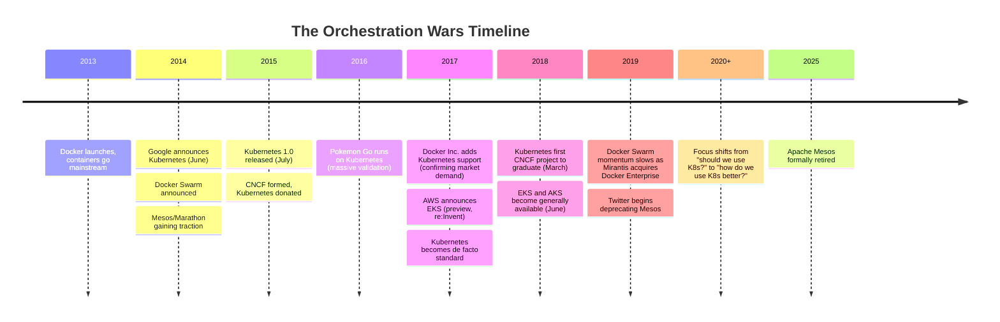
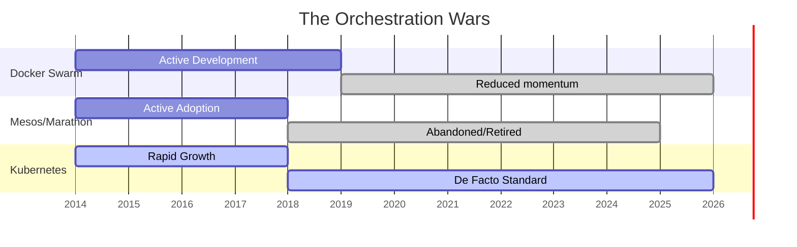

> **Складність**: `[QUICK]` - Концептуальна основа з практичною вправою для оцінювання
>
> **Час на виконання**: 45-55 хвилин
>
> **Передумови**: Немає - з цього починають усі

---

## Що ви зможете зробити

Після цього модуля ви зможете:

- **Порівняти** Kubernetes з Docker Swarm, Apache Mesos плюс Marathon, а також HashiCorp Nomad, використовуючи конкретні технічні та екосистемні компроміси.
- **Оцінити** заяви щодо інфраструктурних технологій, перевіривши, чи має проєкт декларативне керування, розширюваність, нейтральне управління та широку підтримку провайдерів.
- **Діагностувати**, чому підходи з ручним керуванням або пропрієтарні системи оркестрування зазнають невдачі при масштабуванні робочих навантажень, команд та сценаріїв відмов.
- **Розробити** короткий аргумент щодо впровадження, який пояснює, коли Kubernetes є правильним вибором платформи, а коли доцільніше використати простішу альтернативу.

---


## Чому це важливо

Гіпотетичний сценарій: ранок довгоочікуваного релізу з високим трафіком, і черговий розробник дивиться на вікна термінала, підключені до парку Linux-серверів. Попит значно перевищив прогнози, контейнери падають, оскільки трафік перерозподіляється між перевантаженими хостами, і кожна спроба ручного перезапуску викликає нові запитання щодо ресурсів, портів, логів і того, чи опинився новий процес на працездатній машині. Під час розбору інциденту команда засвоює глибокий урок: вона намагалася керувати розподіленою системою так, ніби це набір домашніх улюбленців.

Саме через такі інциденти війни оркестраторів мали значення. Docker зробив контейнери доступними, але ця доступність не дала відповіді на складніші операційні запитання: де має працювати кожен контейнер, що відбувається, коли зникає машина, як виконати оновлення без простою, і хто пам'ятає цільову архітектуру системи після того, як кілька аварійних команд змінили продакшн? Kubernetes переміг, тому що перетворив ці питання на задачу постійного контролю, а не на героїчну сесію в терміналі, і ця різниця досі формує кожне завдання в Kubernetes, яке ви будете практикувати в цьому курсі.

Цей модуль — не ностальгійна екскурсія старими інфраструктурними брендами. Це урок ухвалення рішень про те, чому одні платформи стають довговічними стандартами, тоді як інші перетворюються на історичні зноски, вузькі ніші або тягар підтримки. Переходячи до Kubernetes 1.35 і наступних модулів, ви побачите контролери, маніфести, мітки, Deployment, Service, Custom Resource Definitions та керовані кластери; історія пояснює, чому ці елементи існують і чому вони побудовані навколо декларативного циклу керування на основі API, а не купи віддалених команд.

Перш ніж іти далі, визначимо очікування щодо мови команд для решти курсу. Приклади в KubeDojo використовують повну команду `kubectl` у виконуваних блоках оболонки, оскільки скопійовані вправи мають працювати в неінтерактивних терміналах, скриптах і навчальних середовищах, не покладаючись на локальні аліаси. Багато інженерів скорочують команду під час інтерактивної роботи на власних машинах, але навчальна програма розглядає явні команди як частину навчального контракту. Коли в наступному модулі ми почнемо використовувати об'єкти Kubernetes безпосередньо, ви повинні мати змогу зосередитися на поведінці API, а не думати, чи змінило скорочення оболонки семантику команди.

---

## Проблема: контейнери вирішили пакування, а не експлуатацію

Прорив Docker полягав не в тому, що у 2013 році Linux раптом отримав примітиви ізоляції; простори імен, cgroups та відповідні механізми ядра вже існували. Прорив Docker полягав у тому, що він зробив пакування контейнерів, розповсюдження образів і локальне виконання зрозумілими для звичайних команд розробки. Розробник міг зібрати образ, запустити його на ноутбуці, відправити в реєстр і обґрунтовано очікувати, що на сервері з'явиться таке ж файлове середовище і процес. Це було значним покращенням порівняно з довгими документами з налаштування та вручну підготовленими машинами, але це змістило вузьке місце з «як мені запакувати цей застосунок?» на «як мені підтримувати життя тисяч цих пакунків?».

Першою операційною пасткою було розміщення. Якщо десяти сервісам потрібні пам'ять, процесор, сховище, порти та мережеві шляхи з низькою затримкою до залежностей, хтось має вирішити, де саме знаходитиметься кожна репліка. На одному хості це рішення досить легко ухвалити, поглянувши на `docker ps`, але в межах великого парку це перетворюється на задачу планування з обмеженнями, конкурентними пріоритетами та постійними змінами. Система, яка розміщує контейнери один раз, а потім забуває про них, буде повільно деградувати в міру заповнення машин, сплесків навантаження, виходу з ладу дисків або розгортання командами нових версій із різними профілями ресурсів.

Другою пасткою було відновлення після збоїв. Контейнери зробили процеси дешевими для заміни, але дешева заміна корисна лише тоді, коли платформа може помітити збій, вибрати безпечне місце призначення, перезапустити робоче навантаження і перепідключити трафік, не чекаючи, поки людина перевірить дашборд. Людина-оператор може перезапустити один контейнер після одного збою; платформа повинна обробляти відмову вузла, помилки завантаження образу, невдалі релізи, часткові перебої в мережі та ефект галасливого сусіда, зберігаючи при цьому цільовий стан сервісу. Ось чому оркестрація — це не просто шар зручності поверх контейнерів; це різниця між «ми можемо запустити контейнер» і «сервіс продовжує працювати після того, як реальність змінилася».

Третьою пасткою була координація між командами. Щойно впровадження контейнерів поширилося, розробникам застосунків, інженерам із безпеки, мережевим командам, командам систем зберігання даних та операційним командам знадобився спільний контракт. Без спільного API кожна команда винаходила власні скрипти розгортання, конвенції для середовищ, звички виявлення сервісів та процедури для надзвичайних ситуацій. Ці локальні конвенції працюють, доки командам не потрібно ділитися інструментами або переносити робочі навантаження між середовищами, і тоді кожне приховане припущення перетворюється на вартість міграції.

Зупиніться та подумайте: якби вам довелося оновити сотню робочих контейнерів вручну без простоїв, яка частина зламалася б першою: вибір хостів, маршрутизація трафіку, відкат невдалої версії чи доведення постфактум, що саме сталося? Більшість команд виявляє, що найскладніше — це не запуск першого контейнера на заміну. Найскладніше — це збереження наміру, коли безліч дрібних дій відбуваються під тиском, оскільки імперативні дії залишають оператора відповідальним за пам'ятання бажаного кінцевого стану.

Цей тиск породив категорію під назвою оркестрація контейнерів. Оркестратор контейнерів планує роботу, відстежує стан, перезапускає контейнери, що впали, масштабує репліки, з'єднує сервіси, координує розгортання і дає організації словник для опису того, як має виглядати продакшн. Претенденти середини 2010-х погоджувалися, що оркестрація необхідна, але вони робили різні ставки на простоту, масштаб, розширюваність і управління. Kubernetes переміг, тому що ці ставки збіглися з тим, як насправді виживають інфраструктурні стандарти.

---

## Претенденти та їхні компроміси

Docker Swarm був найбільш очевидною відповіддю для команд, які вже любили Docker. Він обіцяв плавний перехід від локальних команд Docker до кластерного управління контейнерами, і це мало значення, оскільки рання аудиторія контейнерів не хотіла відразу ставати фахівцями з розподілених систем. Його найкращою рисою була знайомість: якщо невелика команда мала файли Docker Compose і скромний масштаб розгортання, Swarm здавався найкоротшим шляхом від локальних контейнерів до продакшн-планування.

```text
Pros:
- Simple to set up
- Native Docker integration
- Familiar Docker Compose syntax
- "It just works" for small deployments

Cons:
- Limited feature set
- Poor multi-cloud support
- Vendor lock-in to Docker Inc.
- Scaling limitations
```

Та сама знайомість, яка робила Swarm привабливим, також обмежувала його стратегічне охоплення. Підприємства не просто шукали кращий спосіб запуску контейнерів; їм потрібна була платформа, яка могла б стати точкою зустрічі для мереж, сховищ, спостережуваності, політик, безпеки, автоматизації релізів та сервісів хмарних провайдерів. Swarm не створив достатньої гравітації навколо точок розширення та нейтрального управління, щоб конкурентам було комфортно вкладати в нього значні кошти. Коли Docker згодом додав підтримку Kubernetes, а Mirantis придбала Docker Enterprise у 2019 році, сигнал ринку був чітким: Swarm залишався корисним для деяких невеликих або усталених розгортань, але він більше не був центром інновацій у сфері контейнерних платформ.

Apache Mesos разом із Marathon представляли протилежний кінець спектра. Mesos був потужним, перевіреним і спроєктованим як універсальний менеджер ресурсів дата-центру, а не продукт лише для контейнерів. Він мав реальний авторитет, оскільки великі інженерні організації, такі як Twitter, експлуатували його на значних масштабах, і його дворівнева модель планування могла підтримувати багато типів робочих навантажень поза контейнерами. Якщо ризик Swarm полягав у тому, що він був занадто вузьким, то ризик Mesos полягав у тому, що звичайним командам застосунків доводилося розбиратися в занадто складних механізмах, перш ніж вони могли впевнено здійснювати релізи.

```text
Pros:
- Battle-tested at massive scale (Twitter)
- Flexible (runs containers AND other workloads)
- Two-level scheduling architecture
- Proven in production

Cons:
- Complex to operate
- Steep learning curve
- Smaller ecosystem
- Required separate components (Marathon, Chronos)
```

Mesos дає важливий урок про конкуренцію платформ: чудова технологія все одно може програти, якщо шлях до її впровадження занадто важкий, а екосистема стає фрагментованою. Marathon, Chronos, DC/OS, вибір фреймворків та операційна складність створювали площину, яка винагороджувала спеціалізовані команди, але відлякувала багатьох масових користувачів. Kubernetes не мав тривіальної кривої навчання, але він пропонував зрозумілішу історію з пріоритетом на контейнери, стандартну форму API і екосистему, що швидко зростала та перетворювала нові інтеграції на інвестиції в галузевий стандарт. Apache офіційно відправила Mesos до Attic у 2025 році, що перетворило цей ринковий результат на історію проєкту.

HashiCorp Nomad є найцікавішим для порівняння, оскільки він не зник. Nomad обрав прагматичний дизайн: один бінарний файл, менша концептуальна поверхня і першокласна підтримка змішаних робочих навантажень, таких як контейнери, Java-сервіси, пакетні завдання і звичайні бінарні файли. Він підходить організаціям, які цінують операційну простоту і вже використовують Consul, Vault або Terraform. Це робить Nomad схожим не стільки на переможеного суперника, скільки на дисципліновану альтернативу для команд, яким не потрібна повна екосистема Kubernetes.

```text
Pros:
- Incredibly simple to deploy (single binary)
- Runs non-containerized workloads (like Java or binaries) easily
- Integrates tightly with the HashiCorp ecosystem (Consul, Vault)
- Lower operational overhead than Kubernetes

Cons:
- Smaller ecosystem compared to Kubernetes
- Less momentum for pure container-first architectures
```

Виживання Nomad має значення, оскільки воно запобігає ледачим висновкам. Kubernetes переміг не тому, що кожен інший оркестратор був марним, і він не є автоматично найкращою відповіддю для будь-якого робочого навантаження. Kubernetes здобув роль широкого галузевого стандарту, тому що краще за альтернативи відповідав потребам хмарно-нативних контейнерних платформ, екосистем вендорів та розширюваних API. Nomad продовжує мати сенс там, де проблемою є планування змішаних навантажень з нижчими накладними витратами на платформу, особливо коли організація може прийняти менший всесвіт сторонніх інтеграцій.

Kubernetes вступив у змагання з іншим типом авторитету. Google експлуатувала Borg, а потім досліджувала Omega, що дало команді засновників важко здобутий досвід у сфері планування, узгодження, управління сервісами та збоями на величезних масштабах. Kubernetes не був прямим опенсорс-зливом Borg, але він переніс уроки десятиліття внутрішнього управління контейнерами в проєкт, який зовнішні команди могли б спільно запускати, досліджувати, розширювати та контролювати. Проєкт також з'явився у слушний час: Docker популяризував контейнери, хмарні провайдери змагалися за портативні робочі навантаження, а підприємства хотіли стандарту, який не міг би відібрати жоден окремий вендор.

```text
Pros:
- Google's decade of experience
- Declarative model (desired state)
- Massive ecosystem
- Cloud-native foundation
- Strong community governance

Cons:
- Complex
- Steep learning curve
- "Too much" for simple deployments
```

Чесна версія історії Kubernetes включає цей останній недолік. Kubernetes є складним, і ця складність не уявна; кластер приносить із собою сервери API, etcd, контролери, планувальники, мережеві плагіни, інтеграції сховищ, сертифікати, RBAC, admission control, життєвий цикл вузла та планування оновлень. Причина, через яку індустрія прийняла цю складність, полягає в тому, що багато організацій вже мали фундаментальні проблеми розподілених систем, і Kubernetes дав їм спільну площину управління замість незліченних користувацьких скриптів. Складність не зникла; вона перемістилася в стандартну платформу, де екосистема могла амортизувати навчання.

---


## Декларативна модель змінила професію

Найглибша відмінність між Kubernetes та багатьма ранніми підходами полягає у переході від імперативних команд до декларативного бажаного стану. Імперативний підхід вказує системі, які саме кроки потрібно виконати: запусти цей контейнер тут, перезапусти той процес там, додай ще дві репліки, коли зросте трафік, і виконай цю команду відкату, якщо реліз буде невдалим. Декларативний підхід фіксує бажаний кінцевий стан і дозволяє контролерам безперервно порівнювати цей намір із фактичним станом кластера. Саме така ментальна модель лежить в основі Deployment, Service, ConfigMap, Secret, custom resources та майже кожного просунутого патерну Kubernetes, з яким ви зіткнетеся пізніше.

```text
Imperative (manual Docker/SSH scripts):
"Start 3 nginx containers on server-1"
"If one dies, start another"
"If traffic increases, start 2 more"

Declarative (Kubernetes):
"I want 3 nginx replicas running. Always."
(Kubernetes figures out the rest)
```

Docker Swarm mode також пропонував декларативне узгодження бажаного стану, тому Kubernetes виграв не просто тому, що у Swarm була відсутня ця поведінка; він переміг завдяки розширюваності API, нейтральному управлінню CNCF, підтримці керованих провайдерів (managed-provider) та широті екосистеми.

Фразу "Kubernetes figures out the rest" не слід сприймати як магію. Вона означає, що API server зберігає бажаний стан, контролери стежать за цим станом, планувальник обирає вузли, kubelet-и запускають робочі навантаження, а статус повертається назад у control plane. Кожен контролер відповідає за власний вузький цикл узгодження (reconciliation loop): спостерігає за реальністю, порівнює її з бажаним об'єктом і робить наступний безпечний крок до збігу станів. Якщо Pod зникає, але Deployment все ще декларує три репліки, системі не потрібна людина, щоб пам'ятати, що відсутній Pod мав би існувати.

Зупиніться та подумайте: якщо Deployment декларує три репліки, і хтось вручну видаляє два відповідних Pod-и, що повинна зробити декларативна система після того, як виявить невідповідність? Правильна відповідь полягає в тому, що вона створює заміни, доки фактичний стан знову не збігатиметься з бажаним, з урахуванням місткості планування та політик. Ця поведінка здається очевидною, коли ви вже знаєте Kubernetes, але це був кардинальний зсув від сприйняття розгортання як одноразової послідовності команд.

Декларативний дизайн також змінює відповідальність. В імперативній системі записом про продакшн може бути історія команд оболонки (shell history), runbook та група людей, які пам'ятають, що було зроблено під час інциденту. У декларативній системі бажана конфігурація може жити в маніфестах під контролем версій, у перевірених змінах та об'єктах API, які можна аудіювати. Це не виключає помилок, але дає командам стабільне джерело істини для перевірки, коли щось відхиляється від норми.

Компроміс полягає в тому, що декларативні системи вимагають від тих, хто навчається, звикнути до непрямих дій. Коли ви змінюєте Deployment, ви не запускаєте особисто кожен новий Pod; ви змінюєте бажаний об'єкт і дозволяєте контролерам виконати розгортання. Початківці іноді сприймають цю опосередкованість як непотрібні церемонії з YAML, особливо коли пряма команда `docker run` здається швидшою. Цінність платформи проявляється тоді, коли третя репліка падає опівночі, вузол звільняється від навантаження (drains) під час обслуговування, або коли розгортання потрібно призупинити, відновити та повідомити про його статус без винайдення кастомної логіки керування.

Ось чому концепції Kubernetes спочатку можуть здаватися дещо філософськими. Deployment — це не просто формат файлу, а Service — це не просто мережеве правило. Вони є контрактами API, які дозволяють незалежним контролерам та інструментам координувати свої дії навколо бажаного стану. Цей самий патерн згодом лежить в основі GitOps, операторів, автоскалювання, контролерів політик та service mesh, оскільки кожне розширення може працювати з API Kubernetes, замість того, щоб створювати окрему платформу з нуля.

---

## Досвід перетворився на відкриту платформу

Роль Google мала значення, але не у примітивному сенсі "Google створив це, тому всі пішли за ним". Більш вагомим є те, що Kubernetes закодував уроки експлуатації Borg та Omega, водночас свідомо уникаючи пастки залишитися платформою лише для Google. Стаття про Borg, Omega та Kubernetes описує уроки трьох поколінь систем управління контейнерами, і ці уроки проявляються в Kubernetes у вигляді циклів керування, міток (labels), абстракції сервісів, бажаного стану та механізмів API. Цей бекграунд забезпечив Kubernetes довіру ще до того, як більшість компаній мали достатній досвід роботи з контейнерами, щоб знати, які збої на них чекають.

Перший коміт Kubernetes з'явився в червні 2014 року, публічний анонс відбувся на DockerCon, а версія 1.0 вийшла в липні 2015 року разом із передачею проєкту до новоствореної Cloud Native Computing Foundation (CNCF). Ці дати є важливими, оскільки проєкт перейшов від ідеї конкретного вендора до нейтрального фонду ще до того, як хмарним провайдерам довелося вирішувати, чи означатиме його впровадження підтримку пропрієтарного продукту конкурента. Цей управлінський крок не був простою адміністративною декорацією; він став однією з причин, чому AWS, Azure, Google Cloud, Red Hat, VMware та багато інших змогли побудувати бізнес навколо одного й того самого API.

Розгляньте стратегічний вибір з погляду Google. Якби Google зберіг Kubernetes як жорстко контрольовану функцію Google Cloud, він, можливо, отримав би тимчасову продуктову перевагу, але індустрія загалом залишилася б фрагментованою серед оркестраторів, прив'язаних до конкретних хмар. Відкривши вихідний код проєкту та передавши його під нейтральне управління, Google допоміг перетворити рівень оркестрації на товар широкого вжитку (commoditize) і зробив портативність робочих навантажень більш реалістичним очікуванням. Це зробило Google Cloud більш надійним в очах команд, які не хотіли робити ставку лише на одного провайдера, навіть незважаючи на те, що це також дозволило конкурентам пропонувати керовані сервіси Kubernetes.

Впровадження з боку хмарних провайдерів створило цикл зворотного зв'язку. Щойно з'явилися Google Kubernetes Engine, Azure Kubernetes Service, Amazon Elastic Kubernetes Service та інші керовані рішення, багато організацій змогли використовувати Kubernetes, не створюючи кожен компонент control plane самостійно. Керовані сервіси знизили бар'єр входу, що привело більше користувачів, які привабили більше вендорів, що створило ще більше інтеграцій, через які ігнорувати платформу стало ще важче. Kubernetes не став простим; він став стандартною складністю, якою хмарні провайдери були готові управляти від імені клієнтів.

Який підхід обрали б ви в цій ситуації і чому: пропрієтарний оркестратор, який є технічно елегантним, але прив'язаний до одного вендора, чи більш "сиру" відкриту платформу, за хостинг якої конкурують кілька провайдерів? Для базової інфраструктури другий варіант часто виграє, оскільки покупці купують не лише фічі. Вони купують можливості міграції (exit options), доступ до ринку праці, навчальні матеріали, сторонні інтеграції та впевненість у тому, що платформа переживе дорожню карту одного продукту.

CNCF також змінив спосіб формування пов'язаних проєктів. Prometheus, Envoy, Fluentd, containerd, Helm, OpenTelemetry та багато інших хмарно-нативних (cloud-native) інструментів змогли інтегруватися з Kubernetes, залишаючись при цьому в ширшій екосистемі фонду. Деякі з цих проєктів передували Kubernetes або розвивалися незалежно від нього, але Kubernetes надав їм спільне операційне середовище. Це і є екосистемний ефект: платформа стає ціннішою, оскільки інші проєкти можуть використовувати її API, мітки, патерни виявлення сервісів та операційну лексику.

Міграція Spotify з Helios на Kubernetes ілюструє цю думку в організаційному масштабі, який легко зрозуміти. У Spotify була власна система оркестрації, яка розв'язувала реальні проблеми їхнього середовища, але підтримання паритету фіч із відкритою екосистемою, що швидко розвивається, стало занадто дорогим. Перехід на Kubernetes означав, що Spotify зможе користуватися спільним інструментарієм, знаннями спільноти та загальногалузевими інтеграціями, замість того, щоб самостійно нести тягар кожного вдосконалення платформи. Урок полягає не в тому, що внутрішні платформи завжди є помилкою; урок полягає в тому, що внутрішні платформи повинні виправдовувати кумулятивні витрати на перебування поза екосистемою.

---

## Розширюваність перетворила Kubernetes на платформу для платформ

Kubernetes переміг частково тому, що не намагався жорстко зашити кожну майбутню інфраструктурну ідею в ядро проєкту. Замість цього він надав модель API, яку можна було розширювати за допомогою Custom Resource Definitions, контролерів, admission webhooks, інтерфейсів сховищ, мережевих інтерфейсів та стандартних метаданих. Такий дизайн дозволив екосистемі створювати платформні функції навколо Kubernetes, не вимагаючи, щоб кожна функція ставала частиною самого Kubernetes. Менше ядро з потужними точками розширення легше розвивати, ніж моноліт, який повинен централізовано погоджувати кожен робочий процес.

Custom Resource Definitions є найяскравішим прикладом. CRD дозволяє команді визначити новий тип API, який API server Kubernetes може зберігати та обслуговувати, наприклад, запит на сертифікат, кластер бази даних, політику резервного копіювання, стратегію розгортання або сервіс інференсу машинного навчання. Після цього контролер може стежити за цими кастомними об'єктами та узгоджувати реальну інфраструктуру відповідно до них. Саме завдяки цьому патерну Kubernetes став основою для операторів та платформної інженерії, а не лише місцем для запуску stateless вебконтейнерів.

Розширюваність також пояснює, чому Kubernetes міг поглинати розбіжності в поглядах. Команди мали різні думки щодо підходів до мережі, бекендів сховищ, поведінки Ingress, вибору середовищ виконання (runtime), методів пакування та процесів розгортання. Менш розширювана платформа змусила б прийняти єдину відповідь ще на ранньому етапі, відштовхнувши користувачів, чиї середовища потребували іншого підходу. Натомість Kubernetes визначив достатньо спільних точок для інтероперабельності, залишивши місце для плагінів Container Network Interface, драйверів Container Storage Interface, Ingress-контролерів, service meshes, інструментів GitOps та рушіїв політик.

Така гнучкість має свою ціну. Новачок може цілком обґрунтовано запитати, чому існує так багато способів маршрутизації трафіку, встановлення застосунків, збору метрик, управління сертифікатами або виконання перевірок політик. Відповідь полягає в тому, що Kubernetes став ринком операційних підходів, а ринки породжують надлишок вибору. Рішення полягає не в тому, щоб із самого початку запам'ятати кожен проєкт екосистеми; воно полягає в тому, щоб зрозуміти базову модель управління достатньо добре, щоб оцінити, чи відповідає розширення патернам Kubernetes, чи суперечить їм.

Підхід API-first зробив автоматизацію надійною. Інструментам не потрібно парсити дашборди або підключатися через SSH до вузлів, щоб зрозуміти наміри; вони можуть читати та писати об'єкти Kubernetes через API. Інструмент розгортання може оновити маніфест, автоскейлер може змінити кількість реплік, admission controller може відхилити небезпечні специфікації, а система спостережуваності (observability) може маркувати метрики метаданими Kubernetes. Коли багато інструментів поділяють одну й ту саму граматику API, інтеграція стає менш крихкою.

Ця ж розширюваність є причиною того, чому Kubernetes може здаватися "надмірним" для крихітних застосунків. Хобі-проєкту з двох контейнерів можуть не знадобитися CRD, admission control, автоскалювання, storage classes, багатозонове планування або service meshes. Для такого проєкту Docker Compose, невелика платформа як послуга (PaaS) або керований сервіс контейнерних застосунків може бути кращим інженерним рішенням. Kubernetes перемагає тоді, коли його екосистема та цикли керування розв'язують проблеми, які дійсно є у команди, а не тоді, коли команда просто хоче модну архітектурну діаграму.

---


## Хронологія та результати на ринку

Війни оркестраторів відбулися швидко, оскільки впровадження контейнерів стиснуло роки інфраструктурних дебатів у кілька насичених циклів релізів. Docker з'явився як зручний для розробників рівень пакування, Swarm намагався поширити цю зручність на кластеризацію, Mesos приніс перевірені ідеї управління ресурсами з великих дата-центрів, Nomad запропонував легкий планувальник для змішаних робочих навантажень, а Kubernetes поєднав абстракції, орієнтовані на контейнери, з нейтральним управлінням та розширюваністю. До кінця десятиліття питання в багатьох компаніях змінилося з «який оркестратор нам обрати?» на «як нам відповідально експлуатувати Kubernetes?».



Хронології можуть робити перемогу неминучою на вигляд, але інженери, які переживали ті роки, не мали такої розкоші. Docker мав прихильність розробників, Mesos мав авторитет у масштабуванні, Nomad мав операційну елегантність, а Kubernetes мав круту криву навчання. Вирішальним фактором стала не одна окрема функція; це було те, як кілька сил об'єдналися. Декларативні контролери зробили операції більш стійкими, досвід Google зробив дизайн надійним, управління CNCF заспокоїло постачальників, підтримка хмарних провайдерів зробила впровадження практичним, а розширюваність зробила екосистему такою, що самопідсилюється.

Запуск Pokemon Go у 2016 році став надзвичайно помітним доказом, оскільки трафік, за повідомленнями, значно перевищив очікування, і Google Cloud розповідав про те, як Kubernetes та GKE допомогли впоратися з навантаженням. Тематичні дослідження (case studies) ніколи не слід розглядати як універсальний доказ того, що одна платформа вирішує будь-яку проблему масштабування, але вони мають значення, оскільки підприємствам часто потрібні публічні докази, перш ніж довіритися молодому інфраструктурному проєкту. Kubernetes отримав історію, яку було легко переказувати: реальний споживчий трафік, екстремальний попит і платформа оркестрації, яка могла масштабуватися під тиском.

Наведена нижче діаграма Ганта є радше спрощеною картою ринку, ніж точним календарем технічного обслуговування. Її цінність полягає в тому, що вона показує різні фінали: Swarm залишився доступним, але більше не визначав ринок, Mesos перейшов від перевіреної корпоративної технології до виходу на пенсію, а Kubernetes перейшов від швидкого зростання до статусу платформи за замовчуванням. Nomad не показаний на цій збереженій діаграмі, але ви маєте пам'ятати про нього як про того, хто вижив у своїй ніші, а не як про невдалий клон.



Дані про впровадження підкріплюють цей результат, але їх слід читати уважно. Цифри опитувань CNCF описують групи респондентів і категорії використання, а не кожен сервер у світі, тому вони є радше доказом динаміки, ніж ідеальним переписом. Важливішою тенденцією є те, що Kubernetes перейшов від експериментів до виробничої інфраструктури в різних галузях, тоді як керовані сервіси Kubernetes зробили API доступним навіть для тих команд, які не хотіли самостійно обслуговувати весь control plane.

До 2026 року дискусія знову змінила напрямок. Kubernetes більше не був лише оркестратором вебсервісів часів контейнерного буму; він став патерном control plane для платформних команд, політик безпеки, інфраструктури даних та робочих навантажень штучного інтелекту. Це розширення створює як можливості, так і ризики. Можливість полягає в тому, що стабільна основа API може підтримувати багато видів автоматизації; ризик полягає в тому, що команди розглядатимуть Kubernetes як універсальну відповідь і ігноруватимуть простіші моделі розгортання, які задовольнили б їхні потреби з меншим операційним тягарем.

Інший спосіб поглянути на результати ринку — через найм і навчання. Компанія, яка обирає Kubernetes, може наймати інженерів, які вже бачили схожі об'єкти, типи збоїв (failure modes) та операційні патерни деінде, навіть якщо хмарний провайдер та інструменти навколо відрізняються. Компанія, яка обирає власний оркестратор, повинна з нуля навчати кожного нового інженера своїй локальній моделі, і кожна інтеграція з постачальниками перетворюється на проєкт із перекладу. Це не робить вибір власного рішення неможливим, але підвищує довгострокову вартість унікальності.

Спільний словник також допомагає під час інцидентів. Коли інженер каже, що rollout застряг, Pod перебуває у стані pending, Service не має endpoints, або контролер надто повільно виконує узгодження (reconciling), інші фахівці з Kubernetes можуть швидко сформувати корисні гіпотези, оскільки ці абстракції є стандартними. У спеціалізованій платформі команді може знадобитися спочатку заново з'ясувати, що означають локальні терміни і який компонент відповідає за наступну дію. Стандарти мають найбільше значення, коли команда втомлена, на production багато шуму, а точність рятує час.

---

## Патерни та антипатерни

Перший стійкий патерн — це відокремлення рішення щодо платформи від рішення щодо пакування. Контейнери відповідають на питання, як створюється та запускається артефакт застосунку; оркестрація відповідає на питання, скільки копій має існувати, де вони мають працювати, як вони відновлюються, як вони отримують трафік і як команди координують зміни. Kubernetes переміг, тому що розглядав оркестрацію як постійну відповідальність платформи. Команда, яка оцінює нову технологію, має запитати себе, чи цей інструмент лише покращує зручність пакування, чи він також бере на себе проблеми control loop (циклу управління), які виникають під час реальних збоїв на production.

Другий патерн полягає в тому, щоб надавати перевагу API над прихованими процедурами. Ресурси Kubernetes не є ідеальною документацією, але це об'єкти, які можна перевірити: вони мають метадані, статус, зв'язки власності та декларативні специфікації. Це робить систему зрозумілою як для контролерів, так і для людей одночасно. Коли команди будують платформні робочі процеси навколо скриптів, які безпосередньо змінюють сервери, вони часто втрачають цей спільний запис; коли ж вони будують їх навколо об'єктів API, інші інструменти можуть спостерігати, перевіряти та розширювати робочий процес.

Третій патерн — цінувати нейтральні екосистеми для базових рівнів. Інструмент розробника іноді може процвітати як продукт одного постачальника, оскільки вартість переходу низька, а поверхня інтеграції вузька. Виробничий рівень оркестрації зачіпає мережу, сховище, ідентифікацію, розгортання, моніторинг, хмарні контракти та навчання команди. Для такого рівня нейтральне управління та реалізації від різних провайдерів зменшують страх перед впровадженням, оскільки організації можуть інвестувати без припущень, що один вендор завжди прийматиме рішення на їхню користь.

Найпоширенішим антипатерном є "героїчний" внутрішній оркестратор. Команда починає з розумного скрипта, який перезапускає кілька контейнерів, потім додає правила розміщення, далі health checks (перевірки працездатності), потім blue-green розгортання, виявлення сервісів (service discovery), обробку секретів, логування, поведінку для відкату (rollback), а потім ще й вимоги до аудиту. На кожному етапі скрипт здається дешевшим за впровадження платформи, але після достатньої кількості інцидентів команда отримує частковий оркестратор із меншою кількістю тестів, меншим числом контриб'юторів і гіршою інтеграцією, ніж у стандартного інструмента, якого вони уникали.

Ще один антипатерн — це максималізм щодо Kubernetes. Деякі команди чують, що Kubernetes переміг, і роблять висновок, що кожне робоче навантаження слід негайно перенести туди. Це історична неграмотність у протилежному напрямку від ігнорування Kubernetes: урок полягає не в тому, що найбільша платформа завжди перемагає локально, а в тому, що відповідність екосистемі та операційні потреби мають значення. Якщо команда має один невеликий сервіс, не потребує автомасштабування (autoscaling), не має міжкомандного платформного контракту і не має причин для стандартизації навколо API Kubernetes, простіший сервіс може бути кращим першим кроком.

Останній антипатерн — це "шопінг" в екосистемі без розуміння основ. Новачки іноді збирають Helm-чарти, service meshes, дашборди та рушії політик ще до того, як зможуть пояснити, чому Deployment перестворює Pod або як Service обирає endpoints. Це перевертає порядок навчання з ніг на голову. Kubernetes виграв завдяки тому, що його базові абстракції створили стабільну основу для розширень, тому команда, яка не розуміє бази, неправильно налаштує розширення і звинуватить екосистему в плутанині, яку сама ж і створила.

Наведена нижче таблиця збережених хибних уявлень містить три корисні спростування. Тримайте її під рукою, коли чутимете спрощені історії походження, оскільки кожен рядок застерігає від зведення складного результату для платформи до однієї причини.

| Хибне уявлення | Реальність |
|---------------|---------|
| «K8s переміг завдяки Google» | Google допоміг, але ключовим було нейтральне управління. Конкуренти отримали вагоміші причини для впровадження після того, як Kubernetes перейшов під нейтральне управління CNCF. |
| «Swarm програв через Docker» | Swarm програв, оскільки не міг зрівнятися з функціями або екосистемою K8s. Проблеми компанії лише прискорили це. |
| «Mesos був гіршою технологією» | Mesos був потужним, але занадто складним. Сама лише технологія не виграє — екосистема та простота мають значення. |

---

## Фреймворк для прийняття рішень

Використовуйте Kubernetes, коли операційна проблема вийшла за межі простого запуску контейнерів. Хорошими сигналами є кілька сервісів, кілька команд, rolling updates (поступові оновлення), вимоги до самовідновлення, горизонтальне масштабування, виявлення сервісів, застосування політик і потреба у спільних інструментах у різних середовищах. Платформа починає окупатися, коли один і той самий API може підтримувати розгортання, спостережливість (observability), безпеку та робочі процеси автоматизації, які інакше довелося б створювати окремо. У цьому світі Kubernetes не просто запускає контейнери; він надає організації спільний контракт для змін на production.

Використовуйте простішу альтернативу, коли робоче навантаження невелике, команда на ранньому етапі, або операційна поверхня не виправдовує створення кластера. Docker Compose, керована платформа як послуга (PaaS), безсерверний контейнерний сервіс (serverless container service) або Nomad можуть бути більш відповідальним вибором, коли бізнесу потрібна швидкість із меншою кількістю рухомих частин. Вибір чогось простішого не означає нездатність оцінити Kubernetes. Це правильне застосування того самого історичного уроку: вибір платформи має відповідати тим проблемам координації та збоїв, з якими ви стикаєтеся насправді.

Використовуйте Nomad або інший легкий планувальник, коли змішані робочі навантаження та операційна простота мають більше значення, ніж глибина нативної екосистеми Kubernetes. Це поширене в організаціях із довготривалими неконтейнерними навантаженнями, пакетними завданнями (batch jobs), наявним інструментарієм HashiCorp та платформною командою, яка хоче мати невелике ядро для планування. Компроміс полягає в тому, що команда погоджується на меншу кількість нативних інтеграцій Kubernetes і менший ринок для найму та навчання. Це може бути чудовим обміном, якщо він є свідомим і відповідає реальним обмеженням.

Уникайте пропрієтарної оркестрації як базової ставки, якщо межа інтеграції не є навмисно вузькою. Специфічний для хмари планувальник може бути цінним, якщо ваша організація вже взяла на себе серйозні зобов'язання перед провайдером, а сервіс суттєво зменшує рутину (toil). Це стає ризикованим, коли командам потрібна портативність, незалежні інструменти, можливості мультихмарного середовища або довговічні знання платформи, які переживуть зміни в дорожній карті вендора. Kubernetes виграв частково тому, що змусив конкурентів почуватися достатньо комфортно, щоб підтримувати ту саму модель, тому нова технологія, яка не має цієї властивості, має викликати серйозніші запитання.

Оцінюючи сьогодні нову базову інфраструктурну технологію, застосовуйте цей чекліст виживання. Він не дає гарантій, але спонукає до правильної розмови до того, як команда помилково сприйме відшліфоване демо за довговічну платформу.

- [ ] **Декларативне управління станом**: Чи покладається воно на безперервне узгодження (continuous reconciliation), а не на імперативні команди?
- [ ] **Розширювана архітектура**: Чи можуть користувачі додавати власні ресурси (custom resources) без модифікації ядра кодової бази?
- [ ] **Нейтральне управління**: Чи розміщується воно під егідою фонду (наприклад, CNCF), а не контролюється одним постачальником?
- [ ] **Інтерфейси, що підключаються (Pluggable Interfaces)**: Чи можна легко замінити мережу, сховище та середовища виконання (runtimes)?
- [ ] **Підтримка хмарних провайдерів**: Чи пропонують його кілька конкурентних хмарних провайдерів як керований сервіс?

Перш ніж застосовувати цей фреймворк для прийняття рішень на реальній зустрічі команди, запишіть найсильніший аргумент проти бажаної вами відповіді. Якщо ви віддаєте перевагу Kubernetes, чесно опишіть операційне навантаження. Якщо ви віддаєте перевагу простішій платформі, опишіть тригер міграції, який зробив би Kubernetes вартим повторного розгляду. Хороші рішення щодо платформи включають власні умови завершення терміну дії (expiration conditions).

---

## Чи знали ви?

- **Kubernetes у перекладі з давньогрецької означає «керманич» або «пілот».** Це також етимологічний корінь слова «кібернетика», а абревіатура **K8s** враховує 8 літер між «K» та «s».

- **Kubernetes був публічно анонсований на DockerCon 10 червня 2014 року.** Проєкт розпочався кількома днями раніше з першого коміту на GitHub, який містив 250 файлів, а в липні 2015 року досяг версії 1.0.

- **Логотипом є штурвал корабля, а 7 спиць — це відсилання до «Зоряного шляху» (Star Trek).** Вони натякають на ранню внутрішню кодову назву проєкту, *Project Seven of Nine*, яка, у свою чергу, посилалася на Borg.

- **Apache Mesos став проєктом вищого рівня Apache у червні 2013 року, а у 2025 році перейшов до Apache Attic (на пенсію).** Ця історія є корисним нагадуванням про те, що серйозна, перевірена інфраструктура все одно може втратити імпульс платформи.


## Типові помилки

Вивчаючи історію оркестрування контейнерів та застосовуючи її уроки, початківці часто роблять такі концептуальні помилки:

| Помилка | Чому це трапляється | Як це виправити |
|---------|----------------|---------------|
| Сприйняття K8s просто як "більшого Docker Swarm" | Спокусливо порівнювати лише видиму поведінку запуску контейнерів і не помітити перехід від команд до циклів узгодження. | Зрозумійте K8s як рушій узгодження стану з контролерами, а не як більший засіб запуску скриптів. |
| Вибір K8s для простого застосунку з двох контейнерів | Команди плутають галузевий стандарт платформи з правильним локальним рішенням для кожного невеликого робочого навантаження. | Почніть з Docker Compose, керованої платформи застосунків або іншого простішого варіанту, поки потреби в оркеструванні не стануть реальними. |
| Переконання, що оркестратори, прив'язані до постачальника, безпечніші | Відшліфований сервіс від одного постачальника може здаватися безпечнішим за широку відкриту екосистему, коли перша демонстрація проходить гладко. | Надавайте пріоритет відкритому управлінню та можливостям виходу для базової інфраструктури, яка формуватиме найм, інструменти та архітектуру. |
| Ігнорування екосистеми CNCF | Початківці іноді наново створюють робочі процеси логування, моніторингу, політик та доставки, не помічаючи, що стандартні інтеграції вже існують. | Оцініть зрілі інструменти екосистеми перед створенням власних компонентів платформи, які вашій команді доведеться підтримувати самостійно. |
| Зосередження лише на ролі Google | Історія створення запам'ятовується, тому вона може затьмарити вибір щодо управління та впровадження провайдерами, який зробив його прийняття безпечним для конкурентів. | Пояснюйте Kubernetes як досвід Google плюс нейтралітет CNCF плюс підтримка багатьох провайдерів, а не як історію продукту Google. |
| Припущення, що Kubernetes замінює Docker | Образи контейнерів, середовища виконання (runtimes) та оркестратори вирішують різні завдання системи і часто вільно обговорюються разом. | Розрізняйте збирання образів, виконання та оркестрування, щоб відповідальність кожного інструмента залишалася чіткою. |
| Спроба вивчити K8s без розуміння "Чому" | Стрибок відразу в YAML може зробити Kubernetes схожим на довільну церемонію, а не на дизайн системи управління. | Спочатку вивчіть історію та декларативну філософію, а потім пов'яжіть кожен об'єкт з операційною проблемою, яку він вирішує. |

---


## Контрольні запитання

<details><summary>1. Ваш стартап переходить з одного сервера на кілька вузлів, і провідний розробник пропонує Python-скрипт, який підключається до хостів через SSH, запускає Docker-контейнери, перевіряє їх кожні кілька хвилин і перезапускає процеси, що завершилися з помилкою. Спираючись на історію оркестрування, який ризик ви маєте **діагностувати** першим?</summary>

Перший ризик полягає в тому, що команда випадково створює імперативний оркестратор без інженерного бюджету справжньої платформи. Скрипт може обробляти ідеальний сценарій (happy path), але з часом він має навчитися розміщенню, перевіркам працездатності, безпечному розгортанню, поведінці при збої вузла, логуванню, аудиту та вирішенню конфліктів. Kubernetes переміг, тому що зробив бажаний стан довговічним і делегував узгодження контролерам замість того, щоб покладатися на людину або скрипт для запам'ятовування кожної коригувальної дії. Більш безпечний аргумент полягає не в тому, щоб "ніколи не автоматизувати"; він звучить як "не ховайте зростаючий control plane всередині одноразової автоматизації."

</details>

<details><summary>2. Хмарний постачальник випускає пропрієтарний оркестратор, тести якого показують більшу швидкість, ніж у Kubernetes, але він працює лише на платформі цього постачальника. Як ви маєте оцінити цю заяву, використовуючи контрольний список виживання Kubernetes?</summary>

Вам слід відокремлювати технічну швидкість від життєздатності платформи. Швидший планувальник може мати значення для деяких робочих навантажень, але базовий оркестратор також потребує нейтрального управління, точок розширення, довіри багатьох провайдерів та екосистеми, яку підтримуватимуть сторонні постачальники. Kubernetes переміг, тому що конкуренти могли перейняти та розширити його, не віддаючи контроль Google. Пропрієтарний інструмент для однієї хмари може бути корисним всередині цієї хмари, але це слабший широкий стандарт, якщо тільки ваша організація свідомо не погодилася на прив'язку до постачальника (vendor lock-in).

</details>

<details><summary>3. Ваша команда порівнює Docker Swarm та Kubernetes для корпоративного застосунку, який може працювати в AWS та на локальних серверах (on-premises). Один інженер виступає за Swarm, оскільки його простіше налаштувати. Який історичний контекст змінює це рішення?</summary>

Інженер має рацію в тому, що Swarm може бути простішим на старті, тому у відповіді не слід відкидати це занепокоєння. Історична проблема полягає в тому, що Swarm не створив такої ж розширюваної, нейтральної до постачальників, мультихмарної екосистеми, яку створив Kubernetes, і він більше не представляє основний напрямок розвитку контейнерних платформ. Для невеликого розгортання простота може перемогти; для корпоративної системи, яка, як очікується, охоплюватиме різні середовища та інтегруватиметься з сучасними інструментами, Kubernetes пропонує більш довговічний API та екосистему. Рішення ґрунтується на майбутніх витратах на координацію, а не лише на зусиллях під час встановлення в перший день.

</details>

<details><summary>4. Під час аналізу інциденту хтось каже, що Deployment YAML — це "просто документація", тому що оператори завжди можуть виконувати команди безпосередньо. Як ви поясните декларативну модель?</summary>

YAML — це не просто документація; це бажаний стан, який споживають Kubernetes API та контролери. Прямі команди можуть бути корисними під час розслідування, але вони не створюють автоматично довговічного запису того, до чого має прагнути production. Специфікація Deployment вказує системі, скільки реплік має існувати, і дає контролерам ціль для відновлення після відхилення (drift) або збою. Ось чому декларативна конфігурація є центральною для Kubernetes, а не просто стилістичною перевагою.

</details>

<details><summary>5. Платформна команда хоче створити внутрішній оркестратор, оскільки Kubernetes здається складним. Який урок з міграції Helios у Spotify має сформувати вашу відповідь?</summary>

Досвід Spotify показує, що доморощений оркестратор може вирішити реальні локальні проблеми і водночас стати дорогим, коли ширша екосистема рухається швидше. Команда повинна підтримувати функції, інтеграції, навчання та операційні знання, якими спільнота Kubernetes та постачальники вже діляться. Це не доводить, що кожна внутрішня платформа є хибною, але це підвищує планку для її створення. Відповідь має порівнювати загальну вартість екосистеми, а не лише дискомфорт від вивчення Kubernetes.

</details>

<details><summary>6. Технічний директор зазначає, що Mesos був перевірений у масовому масштабі, і запитує, чому "найкраща технологія" не перемогла. Як ви маєте відповісти?</summary>

Відповідь полягає в тому, що результати платформи залежать від шляху впровадження, екосистеми, управління та зручності використання, а також від суто технічних можливостей. Mesos був потужним і надійним, але його операційна модель та супутні компоненти були складнішими для впровадження звичайними контейнерними командами. Kubernetes запропонував чіткіший container-first API, потужні точки розширення та нейтральне управління, яке заохочувало підтримку з боку хмарних провайдерів. "Найкращою" платформою для галузевого впровадження часто стає та, яку достатня кількість команд може спільно вивчати, розширювати та якій може довіряти.

</details>

<details><summary>7. Ваша організація оцінює новий Kubernetes Operator, який визначає кілька CRD. Що ви маєте перевірити, перш ніж розглядати його як вибір, узгоджений з екосистемою?</summary>

Ви маєте перевірити, чи дотримується Operator патернів Kubernetes, а не просто додає кастомну складність у кластер. Звертайте увагу на чіткі схеми CRD, поведінку контролера, яка передбачувано узгоджує стан (status), RBAC, обмежений необхідними ресурсами, вказівки щодо оновлення та сумісність з вашою версією Kubernetes. CRD є потужними, оскільки вони розширюють модель API, але вони також додають нові операційні обов'язки. Безпечний вибір — це не "будь-що з CRD"; це інструмент, чиї точки розширення є зрозумілими та придатними для підтримки.

</details>

---


## Практична вправа: Рефлексія архітектури оркестрування

Цей модуль є концептуальним, але навчання все одно має створити артефакт, який ви зможете використати в інженерній розмові. Уявіть, що технічний директор вашої компанії хоче створити пропрієтарну внутрішню систему оркестрування для мікросервісів, оскільки Kubernetes "здається занадто складним". Ваше завдання — підготувати короткий технічний аргумент, який використовує війни оркестраторів як доказ, не вдаючи, що Kubernetes позбавлений компромісів.

Почніть із написання трьох речень, які визначають операційну проблему, а не бажаний інструмент. Ваш аргумент має згадувати розміщення, відновлення після збоїв, безпеку розгортання та спільні API, оскільки це ті проблеми, які з'являються після успішного базового пакування в контейнери. Потім напишіть два речення, що пояснюють, чому імперативний скрипт або пропрієтарний планувальник стають дорогими в міру зростання команд і режимів збоїв. Це змусить вас **діагностувати** проблему control plane перед тим, як рекомендувати продукт для control plane.

Далі порівняйте щонайменше двох історичних конкурентів. Використовуйте Docker Swarm, щоб обговорити різницю між простотою першого дня і довгостроковим тяжінням екосистеми, а Mesos — щоб обговорити різницю між перевіреним масштабом і масовим впровадженням. Якщо ви включите Nomad, ставтеся до нього справедливо як до живої нішевої альтернативи, а не як до невдалого клону Kubernetes. Мета — продемонструвати розсудливість, а не лояльність до бренду.

Потім наведіть аргументи на користь Kubernetes, вказавши як сильні сторони, так і обмеження. Згадайте декларативне узгодження, розширюваність через API, управління CNCF, впровадження керованих рішень хмарними провайдерами та наявність стандартних інтеграцій. Також додайте одне речення, яке описує, коли Kubernetes буде надмірним для поточного робочого навантаження. Переконливий аргумент щодо платформи є сильнішим, коли він визнає межу, за якою простіший варіант був би кращим.

Нарешті, перетворіть свої нотатки на коротку рекомендацію. Вона має бути достатньо короткою для коментаря під час огляду архітектури, достатньо конкретною, щоб витримати подальші запитання, і достатньо обґрунтованою, щоб інший інженер міг побачити за нею історичні докази. Ставтеся до цього як до практики для розмов про платформу, які ви матимете пізніше, обираючи між нативним Kubernetes, керованими сервісами, Operators, інструментами GitOps та простішими системами розгортання.

### Критерії успіху

- [ ] Ви ідентифікували щонайменше один екосистемний ризик, пов'язаний зі створенням власного оркестратора, з посиланням на управління CNCF або інтеграції Kubernetes.
- [ ] Ви пояснили різницю між імперативними командами та декларативним узгодженням у своєму аргументі.
- [ ] Ви згадали тягар підтримки, який випливає з десятирічного досвіду Google з Borg та Omega.
- [ ] Ви навели конкретний приклад компанії або проєкту, які відійшли від свого попереднього підходу до оркестрування.
- [ ] Ви вказали одну умову, за якої Kubernetes був би неправильним першим вибором для невеликого робочого навантаження.

<details><summary>Примітки до рішення</summary>

Переконлива відповідь полягає в тому, що команда повинна уникати створення пропрієтарного оркестратора, якщо вона не може виправдати володіння плануванням, узгодженням, поведінкою розгортання, виявленням сервісів (service discovery), інтеграцією безпеки, хуками спостережливості (observability) та підтримкою екосистеми. Вона використовує Swarm як попередження про простоту першого дня без широкого тяжіння екосистеми, Mesos — як попередження про те, що перевірений масштаб не гарантує масового впровадження, а міграцію Helios у Spotify — як попередження про витрати на підтримку паритету функцій усередині компанії. Вона рекомендує Kubernetes, коли організації потрібен спільний API та екосистема, водночас визнаючи, що Docker Compose, керована платформа застосунків або Nomad можуть краще підійти для менших випадків або змішаних робочих навантажень.

</details>

---


## Джерела

- [Kubernetes Blog: 10 Years of Kubernetes](https://kubernetes.io/blog/2024/06/06/10-years-of-kubernetes/)
- [Kubernetes Blog: 4 Years of K8s](https://kubernetes.io/blog/2018/06/06/4-years-of-k8s/)
- [Google Research: Borg, Omega, and Kubernetes](https://research.google/pubs/borg-omega-and-kubernetes/)
- [Kubernetes Documentation: Components](https://kubernetes.io/docs/concepts/overview/components/)
- [Kubernetes Documentation: Controllers](https://kubernetes.io/docs/concepts/architecture/controller/)
- [Kubernetes Documentation: Custom Resources](https://kubernetes.io/docs/concepts/extend-kubernetes/api-extension/custom-resources/)
- [Kubernetes Documentation: Declarative Management of Objects](https://kubernetes.io/docs/tasks/manage-kubernetes-objects/declarative-config/)
- [Docker Docs: Swarm Mode](https://docs.docker.com/engine/swarm/)
- [Apache Attic: Apache Mesos](https://attic.apache.org/projects/mesos.html)
- [Apache Mesos Project Site](https://mesos.apache.org/)
- [CNCF Announcement: 2025 Annual Cloud Native Survey](https://www.cncf.io/announcements/2026/01/20/kubernetes-established-as-the-de-facto-operating-system-for-ai-as-production-use-hits-82-in-2025-cncf-annual-cloud-native-survey/)
- [Google Cloud Blog: Bringing Pokemon Go to Life on Google Cloud](https://cloud.google.com/blog/products/containers-kubernetes/bringing-pokemon-go-to-life-on-google-cloud)
- [CNCF Blog: Spotify Capacity Planning with Kubernetes](https://www.cncf.io/blog/2019/06/27/with-kubernetes-spotifys-capacity-planning-went-from-almost-an-hour-to-seconds-or-minutes-2/)
- [HashiCorp Nomad Documentation](https://developer.hashicorp.com/nomad/docs)

---


## Наступний модуль

[Модуль 1.2: Декларативний підхід проти імперативного](../module-1.2-declarative-vs-imperative/) - Наступний модуль перетворює філософію з цього уроку на практичну поведінку Kubernetes, показуючи, як бажаний стан змінює те, що ви робите в командному рядку.
