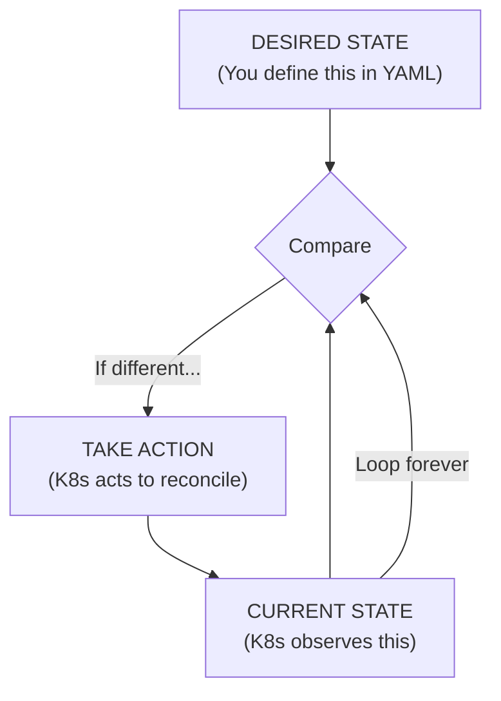
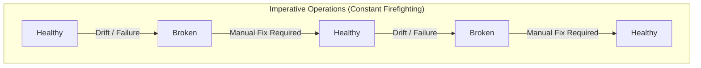
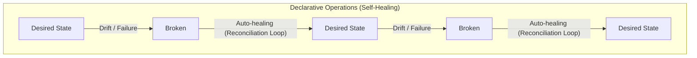

> **Складність**: `[QUICK]` — Концептуальне розуміння з наслідками для production
>
> **Час на проходження**: 25-30 хвилин
>
> **Передумови**: Модуль 1.1 (Чому Kubernetes переміг)
>
> **Версія Kubernetes**: 1.35+

---

## Що ви зможете зробити

Після цього модуля ви зможете:

- **Порівняти** імперативний та декларативний підходи, використовуючи конкретні приклади робочих навантажень Kubernetes.
- **Передбачити**, як Kubernetes узгоджує керований об'єкт після ручної зміни конфігурації, видалення або збою.
- **Спроєктувати** безпечний для production робочий процес, який перетворює разові команди на перевірені декларативні маніфести.
- **Діагностувати** збої, спричинені імперативним мисленням, розбіжностями в конфігураціях та використанням кількох джерел істини.

---


## Чому це важливо

Уявіть, що чергового інженера піднімають о 2-й ночі через те, що критично важливий для доходу сервіс оформлення замовлень постійно перезапускається (crash-looping) під час регіональної промоакції. Напівсонна, вона поводиться із системою як зі старим парком серверів, що керуються вручну: заходить через SSH на вузол, перезапускає контейнер, спостерігає за поверненням процесу та закриває сповіщення. Kubernetes негайно вбиває її запущений вручну контейнер і замінює його новим Pod із шаблону Deployment, який усе ще містить зламану змінну середовища. Вона перезапускає його знову, Kubernetes знову його видаляє, і інцидент розтягується на 45 хвилин, поки клієнти кидають кошики, а канал інциденту наповнюється суперечливими теоріями.

Ніщо в цій історії не вимагає, щоб Kubernetes був зламаний. Кластер робив саме те, для чого був створений: порівнював заявлений бажаний стан із поточним станом, який спостерігався, і повертав реальність до заявленого. Операційна помилка виникла через використання імперативних інстинктів усередині декларативної системи керування. Коли інженер нарешті змінила YAML Deployment, зафіксувала виправлення та застосувала виправлений маніфест, наступне розгортання звелося за лічені секунди, оскільки вона перестала боротися з контролером і почала змінювати джерело істини.

Ця різниця не є суто теоретичною. Kubernetes винагороджує операторів, які запитують: "Який стан має існувати?", перш ніж запитати: "Яку команду мені виконати?". Він карає команди, які ставляться до живого кластера як до набору змінюваних серверів, оскільки кожен контролер призначений для скасування ручних редагувань, які йому не належать. У цьому модулі ви побудуєте ментальну модель, завдяки якій Deployments, Services, GitOps, виявлення відхилень та самовідновлення відчуватимуться як частини однієї системи, а не як купа команд.

Ви також відпрацюєте звичку, яка стає ціннішою в міру зростання систем: відокремлення розслідування від довготривалих змін. Розслідування може бути швидким, інтерактивним і неохайним, оскільки його завдання — виявити докази. Довготривала зміна має бути явною, перевіреною, повторюваною та мати власника, оскільки її завдання — пережити наступне розгортання, втручання колег, заміну кластера та аналіз інцидентів. Це відокремлення — і є різниця між використанням команд як інструментів і дозволом командам стати прихованою інфраструктурою.

---

## Два підходи

Імперативні операції — це прямі вказівки виконати кроки прямо зараз. Вони здаються природними, оскільки більшість ранніх комп’ютерних завдань викладалися саме так: відкрити оболонку, виконати команду, перевірити результат, виконати наступну команду і продовжувати, доки система не виглядатиме правильно. У невеликому середовищі цей стиль може бути швидким і приносити задоволення, оскільки оператор отримує негайний зворотний зв’язок і може адаптуватися з появою нової інформації. Прихована ціна полягає в тому, що оператор стає циклом керування, а це означає, що система продовжує працювати лише доти, доки людина пам’ятає кроки, стежить за станом і повторює виправлення після кожного збою.

Найпростіша історія імперативного розгортання виглядає так. Команди легко читати, але операційний тягар прихований у коментарях: хтось має перевіряти, вирішувати, повторювати та документувати кожне виправлення.

```bash
# Imperative approach
ssh server1
docker run -d nginx
docker run -d nginx
docker run -d nginx
# Check if they're running
docker ps
# If one dies, start another
# If traffic increases, run more
# If server fails, SSH somewhere else and repeat
```

Зупиніться та подумайте: якщо цей сервер перезавантажиться, поки оператор спить, який компонент помітить, що потрібні три контейнери `nginx`, і де зафіксована ця вимога? Якщо ваша відповідь залежить від того, чи пам’ятає людина бажану кількість, або від доступності історії команд оболонки, ви знайшли слабке місце імперативної роботи. Поточний стан міг бути правильним на мить, але намір так і не був переданий системі, здатній його зберегти.

Декларативні операції змінюють підхід. Замість того, щоб видавати кожен крок, ви описуєте кінцевий стан і передаєте цю декларацію контролеру, який відповідає за втілення її в реальність. Декларація — це не пропозиція чи роздруківка скрипту; це довготривалий запис наміру. У Kubernetes цей запис є об’єктом API, який зберігається площиною керування, за яким спостерігають контролери та який використовується щоразу, коли живий кластер відхиляється від цілі.

```yaml
# Declarative approach
apiVersion: apps/v1
kind: Deployment
metadata:
  name: nginx
spec:
  replicas: 3
  selector:
    matchLabels:
      app: nginx
  template:
    metadata:
      labels:
        app: nginx
    spec:
      containers:
      - name: nginx
        image: nginx
```

Багато інженерів визначають короткий локальний псевдонім для інтерактивного введення, але навчальні матеріали та робочі інструкції мають використовувати повну команду `kubectl`, щоб приклади можна було безпечно копіювати та вставляти в термінали, скрипти, завдання CI та нотатки щодо інцидентів. Скорочення для введення не змінює запит до API чи операційну модель, і воно ніколи не повинно ставати прихованою передумовою для розуміння уроку.

```bash
kubectl version --client
```

Оригінальна однорядкова команда застосування з багатьох посібників для початківців усе ще передає важливу ідею: подати декларацію, а потім дозволити Kubernetes виконувати поточну роботу. У щоденній практиці цей модуль використовує повний бінарний файл `kubectl` у робочих прикладах, оскільки команда має працювати незалежно від того, вставляєте ви її в інтерактивну оболонку, скрипт чи завдання CI.

```bash
kubectl apply -f nginx-deployment.yaml
# Done. Kubernetes handles the rest.
```

```bash
kubectl apply -f nginx-deployment.yaml
```

Зупиніться та подумайте: якщо ви виконаєте ту саму команду `kubectl apply -f nginx-deployment.yaml` вдруге, не змінюючи файл, що Kubernetes повинен створити, оновити чи залишити без змін? Правильне очікування — це не "запустити розгортання знову". Правильне очікування — це "порівняти декларацію зі збереженим об’єктом і узгодити їх, лише якщо щось відрізняється". Ця властивість, яка називається ідемпотентністю, є однією з причин, чому декларативна конфігурація так добре працює в автоматизованих конвеєрах.

Різниця між двома стилями полягає не в тому, що імперативні команди — це зло, а декларативні файли — завжди добре. Різниця полягає в тому, де живе довгостроковий намір. Імперативна робота є корисною для дослідження, швидкої діагностики та тимчасових екстрених дій, оскільки вона дає оператору негайний важіль впливу. Декларативна робота безпечніша для виробничого середовища, оскільки намір переживає оператора, може бути перевірений до того, як він змінить кластер, і може бути узгоджений програмним забезпеченням після наступного збою, перепризначення або розгортання.

| Операційне питання | Імперативне мислення | Декларативне мислення |
|---|---|---|
| Основне питання | Яку команду мені виконати далі? | Який стан має підтримувати система? |
| Джерело істини | Пам'ять людини, робочі інструкції, історія команд оболонки, нотатки в тікетах | Версіоновані маніфести та об'єкти API |
| Реакція на збій | Людина спостерігає, вирішує та діє | Контролер спостерігає, порівнює та узгоджує |
| Повторне виконання | Може дублювати роботу або викликати помилки "already exists" | Повинно зводитися до того самого стану |
| Можливість аудиту | Залежить від зовнішнього логування та дисципліни | Зміни можуть проходити через перевірку та історію Git |

Гіпотетичний сценарій: платформенна команда розслідує зміну ліміту пам'яті, яка з'являється у виробничому середовищі під час інциденту, але не може бути знайдена ні в Git, ні в конвеєрі розгортання, ні в репозиторії сервісу. Зміна була внесена шляхом прямого редагування наприкінці довгого дзвінка, виправила негайний симптом, а потім зникла, коли наступний звичайний реліз застосував старий маніфест. Аналіз інциденту переважно стосується не самого ліміту пам'яті; він стосується небезпечного розриву між живим і заявленим станами.

---

## Цикл узгодження

Kubernetes побудований навколо узгодження. Контролер відстежує бажаний стан із сервера API, спостерігає за поточним станом із кластера, порівнює їх і вживає заходів, коли вони відрізняються. Цей патерн зустрічається в Deployments, ReplicaSets, StatefulSets, Jobs, Services, вузлах і багатьох контролерах розширення. Саме тому Kubernetes може відновлюватися після видалення Pod, збою вузла та часткового виконання розгортання, не чекаючи, поки людина знову виконає останню правильну команду.



Важливе слово на цій діаграмі — "назавжди". `kubectl apply` не є самим розгортанням у тому сенсі, в якому ним міг би бути скрипт оболонки. Застосування маніфесту надсилає бажаний стан на сервер API; контролери продовжують роботу після завершення виконання команди. Якщо вузол виходить із ладу через п'ять хвилин, контролер Deployment все ще знає бажану кількість реплік, оскільки бажаний стан зберігається в API Kubernetes, а не в терміналі, який виконав команду.

Ось чому ручні зміни в керованих об'єктах часто створюють враження, що Kubernetes упертий. Уявіть, що ви видаляєте один Pod із Deployment, тому що хочете його "перезапустити". Контролер Deployment не інтерпретує це видалення як новий бажаний стан із меншою кількістю Pod'ів. Він спостерігає, що у ReplicaSet тепер менше доступних Pod'ів, ніж запитувалося, створює заміну та продовжує рухатися до заявленої кількості. З точки зору контролера, він виправляє пошкодження, а не сперечається з оператором.

```yaml
# You say: "I want 3 replicas"
spec:
  replicas: 3
```

Перш ніж запускати це в лабораторії, спрогнозуйте поведінку контролера: якщо ви вручну видалите Pod, керований Deployment із `spec.replicas: 3`, Kubernetes збереже видалення, створить заміну чи чекатиме наступного `kubectl apply`? Ключ — у праві власності. Керований Pod не є джерелом істини; Deployment та його ReplicaSet є деклараціями вищого рівня, які пояснюють, скільки відповідних Pod'ів має існувати.

Модель узгодження також пояснює, чому Kubernetes не потребує кодування кожного сценарію збою у вашому конвеєрі розгортання. Ви не пишете окремі кроки конвеєра для "якщо контейнер завершує роботу, запустіть інший", "якщо вузол зникає, перепризначте в інше місце" або "якщо розгортання зупиняється, розкрийте статус". Ви декларуєте форму робочого навантаження, а контролери виконують вузькоспрямовані, багаторазові виправлення. Платформа є потужною завдяки тому, що кожен контролер має невелику зону відповідальності та може продовжувати виконувати її навіть тоді, коли початковий запит на зміну давно зник.

Проте все ще існує межа, яку слід поважати. Контролери не є чарівними агентами з відновлення, які можуть вивести правильну бізнес-конфігурацію зі зламаної декларації. Якщо ви задекларуєте неправильний образ, неправильне ім'я Secret або неможливий запит на ресурси, Kubernetes сумлінно зводитиметься до неправильної цілі та виявлятиме симптоми через статуси, події та умови. Декларативні системи зменшують рутинну роботу; вони не скасовують потребу робити точні декларації.

---

## Аналогія з реального світу: Термостат

Термостат — це класична аналогія, оскільки він відокремлює бажаний стан від ручної дії. В імперативній кімнаті вам холодно, ви вмикаєте обігрівач, чекаєте, вам стає тепло, ви його вимикаєте і повторюєте знову. Ви постійно спостерігаєте за середовищем і видаєте команди. Ця модель може працювати для однієї людини в одній кімнаті, але вона зазнає краху, коли кімната залишається без нагляду, погода змінюється вночі або кілька людей постійно торкаються вимикача з різними вподобаннями.

```text
You: "It's cold. Turn on the heater."
[Time passes]
You: "It's hot now. Turn off the heater."
[Time passes]
You: "Cold again. Turn on the heater."
[Repeat forever, or give up and suffer]
```

У декларативній версії ви вибираєте цільову температуру і дозволяєте циклу керування займатися багаторазовим вимірюванням та коригуванням. Термостат не запитує вас щохвилини, чи варто вмикати піч. Він порівнює поточну температуру з цільовою та діє відповідно до правил, вбудованих у систему. Цінність полягає не в тому, що термостат розумніший за вас; цінність у тому, що ціль залишається явною, тоді як повторювані коригування стають автоматизованими.

```text
You: "I want it to be 72 degrees F."
Thermostat: [Continuously monitors and adjusts]
```

Kubernetes застосовує таку саму логіку до інфраструктури. Deployment — це не вимикач обігрівача; це цільова умова для контролера. Service — це не відредаговане вручну правило балансувальника навантаження; це стабільний мережевий намір, який система реалізує через механізми кластера. ConfigMap — це не нотатка для оператора; це об'єкт API, який може споживатися Pod'ами та оновлюватися шляхом контрольованих змін.

Аналогія також демонструє типову помилку. Якщо хтось стоятиме поруч із термостатом і вручну перемикатиме обігрівач кожні кілька секунд, у кімнаті може на короткий час стати комфортно, але ця людина бореться з автоматизацією. Правильним виправленням є зміна заданого значення, ремонт датчика або налаштування політики контролера. У Kubernetes еквівалентом є оновлення маніфесту, виправлення міток і селекторів або зміна ресурсу, що належить контролеру, а не редагування Pod'а вручну.

Який підхід ви б обрали тут і чому: під час сплеску виробничого трафіку інженер повинен виконати `kubectl scale deployment web --replicas=10` і залишити маніфест без змін, чи оновити декларативне налаштування реплік через звичайний шлях релізу? Практична відповідь може включати екстрене масштабування вручну, але лише за умови, що команда фіксує це рішення та негайно після цього змінює маніфест. Інакше наступне регулярне застосування може скасувати екстрену потужність і спричинити другий інцидент.

---


## Чому декларативний підхід перемагає

Декларативна інфраструктура перемагає в Kubernetes, оскільки вона перетворює операції на повторюваний зв'язок між наміром, спостереженням та виправленням. Цей зв'язок підтримує самовідновлення, безпечну автоматизацію, можливість перевірки змін та виявлення відхилень (drift detection). Переваги накопичуються: маніфест можна застосовувати багаторазово, перевіряти перед злиттям (merge), використовувати контролером GitOps, порівнювати з поточним станом і повторно використовувати для відбудови середовища після збою. Імперативна робота може швидко виконати першу зміну, але їй важко зберегти наступну тисячу виправлень.

Самовідновлення — це перша очевидна перевага. Коли контейнер дає збій, Kubernetes може запустити інший, оскільки бажаний шаблон Pod усе ще існує. Коли вузол "вмирає", планувальник (scheduler) може розмістити замінні Pod в іншому місці, оскільки декларація робочого навантаження все ще запитує ресурси. Коли хтось видаляє Pod, контролер може відтворити його, оскільки бажана кількість реплік усе ще вказує на те, що популяція Pod є неповною. Ви не писали всю цю логіку відновлення; ви просто описали форму бажаного робочого навантаження.

Ідемпотентність — друга перевага, і вона має більше значення, ніж очікують новачки. Конвеєри (pipelines) повторюють спроби. Люди двічі надсилають команди. Агенти GitOps виконують узгодження в циклах. Якби повторне виконання щоразу створювало дублікати об'єктів, автоматизація була б жахливою. Семантика декларативного застосування робить безпечний шлях нудним: ті самі вхідні дані повинні зводитися до того самого результату, а відсутність операцій (no-op) має залишатися відсутністю операцій, коли кластер уже відповідає файлу.

```bash
# Run this 100 times
kubectl apply -f deployment.yaml

# Result: Same state every time
# No duplicates, no conflicts, no "already exists" errors
```

```bash
# Repeating the full command remains copy-paste safe
kubectl apply -f deployment.yaml
```

Контроль версій — третя перевага, оскільки декларативну конфігурацію можна перевіряти так само як код застосунку. Збільшення кількості реплік, виправлення ліміту пам'яті та зміна readiness probe стають видимими комітами, а не "племінною пам'яттю". Це не робить кожен файл YAML ідеальним, і це не усуває потреби в якісній перевірці (review), але це дає команді надійну хронологію інфраструктурних намірів.

```bash
# Your infrastructure is code
git log --oneline
a1b2c3d feat: scale web to 5 replicas
d4e5f6g fix: increase memory limit
g7h8i9j feat: add health checks

# Roll back infrastructure with git
git revert a1b2c3d
kubectl apply -f .
```

Приклад `git revert` навмисно спрощений. Реальні відкочування (rollbacks) можуть вимагати міграцій бази даних, перевірок сумісності, доступності образу або поетапного переміщення трафіку. Декларативна інфраструктура не гарантує, що кожне відкочування буде безпечним; вона гарантує, що запланована зміна інфраструктури зафіксована, і її можна обговорити, протестувати та відтворити. Це значне покращення порівняно з проханням до виснаженого оператора відновити команди з пам'яті.

Виявлення відхилень (drift detection) — четверта перевага. Відхилення означає, що жива реальність більше не відповідає джерелу істини. В імперативному середовищі відхилення може бути непомітним, доки перезбірка не завершиться невдало, або реліз не перезапише приховану ручну зміну. У декларативному середовищі відхилення стає тим, що може виявити інструмент, оскільки існує відомий бажаний стан для порівняння. Інструменти GitOps розширюють цю ідею шляхом безперервного узгодження кластера з Git, але базова концепція починається з об'єктів Kubernetes.

```text
Imperative world:
- Someone SSH'd in and made changes
- Documentation doesn't match reality
- "It works on my machine"
- Fear of touching production

Declarative world:
- Git is the source of truth
- K8s continuously enforces that truth
- Changes require PR review
- Confidence in deployments
```

Тут є компроміс. Декларативні системи можуть здаватися непрямими під час налагодження (debugging), оскільки об'єкт, який ви редагуєте, може не бути тим об'єктом, який фактично запускається. Deployment створює ReplicaSets, які створюють Pod'и. Service вибирає endpoints через мітки (labels). Ingress може бути реалізований контролером поза основним API. Ціна самовідновлення полягає в тому, що ви повинні вивчити ланцюжки власності (ownership chains) та поля статусу замість того, щоб припускати, що перший видимий процес є правильним місцем для редагування.

---


## Імперативна пастка

Kubernetes включає імперативні команди, оскільки операторам потрібні швидкі способи для дослідження, налагодження та вирішення виняткових ситуацій. `kubectl run` може створити тимчасовий Pod, `kubectl logs` — перевірити симптоми, `kubectl describe` — виявити події, а `kubectl scale` — виграти час під час інциденту. Пастка з'являється, коли тимчасова команда стає незаписаним виробничим джерелом істини. Жива зміна, не відображена в маніфесті, — це позика з майбутнього; зрештою контролер, конвеєр або член команди "стягне" її.

```bash
# These work, but...
kubectl run nginx --image=nginx
kubectl scale deployment nginx --replicas=5
kubectl set image deployment/nginx nginx=nginx:1.27
```

```bash
# Equivalent examples written without shell aliases
kubectl run nginx --image=nginx
kubectl scale deployment nginx --replicas=5
kubectl set image deployment/nginx nginx=nginx:1.27
```

Небезпека полягає не в тому, що ці команди завершуються невдало. Небезпека в тому, що вони успішно виконуються поза процесом перевірки (review). Ручне масштабування може стабілізувати трафік, але якщо маніфест все ще вказує три репліки, наступний apply може зменшити потужність. Ручне оновлення образу може протестувати виправлення, але якщо файл Deployment все ще посилається на старий образ, наступний rollout може повернути баг. Редагування "наживо" може розблокувати команду, але якщо ніхто не знає, яке саме поле змінилося, першопричину стає важче діагностувати.

Більш безпечний патерн — використовувати імперативні інструменти для генерації або інспектування декларацій, а потім переносити довговічну зміну у файл. Це дає новачкам практичний місток: ви можете використовувати генератор командного рядка, щоб не запам'ятовувати кожне поле YAML, але ви все одно перевіряєте, комітите та застосовуєте маніфест як джерело істини. Команда допомагає вам написати декларацію; вона не замінює декларацію.

```bash
# Generate YAML, don't apply directly
kubectl create deployment nginx --image=nginx --dry-run=client -o yaml > deployment.yaml

# Review, commit, then apply
kubectl apply -f deployment.yaml
```

```bash
# Same workflow repeated with full commands for scripts and runbooks
kubectl create deployment nginx --image=nginx --dry-run=client -o yaml > deployment.yaml
kubectl apply -f deployment.yaml
```

Коли надзвичайна ситуація вимагає прямої команди, ставтеся до неї як до виробничого hotfix'а, а не як до нормального робочого процесу. Запишіть команду в каналі інцидентів, поясніть, чому звичайний шлях був занадто повільним, і створіть відповідну зміну в маніфесті до того, як інцидент буде вважатися закритим. Ця дисципліна має значення, оскільки імперативна зміна може бути операційно правильною протягом наступних десяти хвилин, залишаючись організаційно небезпечною для наступного релізу.

Найсильніше діагностичне питання просте: "Якщо завтра ми відбудуємо це середовище з Git, чи ця зміна все ще існуватиме?" Якщо відповідь "ні", поточний живий стан не підлягає відтворенню. Ви можете тимчасово прийняти це під час серйозного інциденту, але ви ніколи не повинні вдавати, що це стабільно. Декларативна робота — це те, як команди перетворюють екстрені дії на довговічну поведінку системи.

---


## Візуалізація: Стан із плином часу

Стан із плином часу розкриває реальну операційну різницю. В імперативному робочому процесі здоров'я системи часто відновлюється діями людини після кожної події відхилення або збою. Це може працювати в робочий час з невеликою системою та уважним оператором, але це не масштабується на сервіси, регіони, команди та місяці обслуговування. Надійність системи пов'язана з увагою людини, яка є найдефіцитнішим ресурсом під час інциденту.



Декларативне управління не означає, що збої зникають. Вузли все одно виходять з ладу, погані образи все одно постачаються, а люди все одно пишуть неправильний YAML. Різниця полягає в тому, що система має довговічну ціль і контролер, якому доручено рухатися до неї. Коли реальність відхиляється з причини, з якою може впоратися контролер, відновлення починається без очікування, поки оператор згадає команду.



Практичний урок полягає в тому, щоб проводити налагодження (debug) на рівні, де задекларовано намір. Якщо Pod продовжує з'являтися знову, огляньте Deployment або StatefulSet, що ним володіє. Якщо мітка (label) постійно змінюється, знайдіть контролер або конвеєр, який застосовує цей ресурс. Якщо Service не маршрутизує трафік, порівняйте його selector із мітками Pod'а замість того, щоб редагувати endpoints власноруч. Декларативні системи винагороджують висхідну (upstream) діагностику, оскільки низхідні (downstream) симптоми часто є просто результатом того, що контролер виконує свою роботу.

Практичний приклад: припустімо, що `web-abc123` перебуває в стані crash-loop. Імперативний інстинкт підказує виконати `exec` у контейнер, відредагувати файл і перезапустити процес. Декларативний діагноз спершу запитує, який об'єкт володіє цим Pod'ом, чи посилається шаблон Pod на правильний образ і конфігурацію, чи існує згаданий ConfigMap або Secret, і чи пояснюють нещодавні зміни в Git це відхилення. Виправлення все ще може включати швидку команду для перевірки, але довговічне коригування має бути в маніфесті власника.

---


## Читання власності під час декларативного збою

Найшвидший спосіб припинити боротьбу з Kubernetes — запитати, який об'єкт володіє симптомом, на який ви дивитеся. Ім'я Pod'а часто є найбільш видимим елементом у сповіщенні (alert), але Pod, як правило, не є найважливішим місцем для внесення довговічної зміни. Deployments володіють ReplicaSets, ReplicaSets володіють Pod'ами, StatefulSets володіють впорядкованими Pod'ами, Jobs володіють поведінкою завершення, а контролери GitOps можуть володіти маніфестами, які створюють їх усі. Якщо ви редагуєте низ цього ланцюжка, тоді як вищий об'єкт все ще декларує іншу ціль, вищий об'єкт зрештою переможе.

Цей ланцюжок власності — це причина, чому `kubectl describe pod` — це більше, ніж просто стіна тексту. Він надає вам події, повідомлення планування, статус завантаження образу, кількість перезапусків, мітки та посилання на власників. Ці деталі допомагають вам пов'язати симптом із декларацією, яка його створила. Pod, що застряг у `ImagePullBackOff`, може вказувати на неправильне ім'я образу в шаблоні Deployment. Pod, який ніколи не стає готовим (ready), може вказувати на декларацію проби (probe), яка не відповідає застосунку. Pod, який постійно повертається після видалення, вказує на те, що контролер виконує свою призначену роботу.

Така сама логіка застосовується і до Services. Новачок може побачити Service, який не маршрутизує трафік, і спробувати відтворити його власноруч. Декларативний оператор перевіряє selector, потім перевіряє, чи відповідають будь-які мітки Pod'а цьому selector'у, а потім перевіряє, чи встановлює ці мітки шаблон робочого навантаження власника. Довговічним виправленням може бути коригування мітки в Deployment, а не переписування Service. Об'єкт Service виражає бажаний мережевий намір, але заповнення endpoint'ів залежить від того, чи відповідає інший задекларований стан цьому наміру.

ConfigMaps та Secrets створюють ще одну поширену головоломку з власністю. Команда може оновити ConfigMap і очікувати, що кожен запущений процес миттєво почне поводитися інакше. Деякі змонтовані файли оновлюються з часом, деяким застосункам потрібен перезапуск для перезавантаження конфігурації, а змінні середовища фіксуються під час запуску контейнера. Декларативне мислення не означає, що кожне поле має миттєвий ефект під час виконання (runtime). Воно означає, що бажані об'єкти є явними, і ви повинні розуміти, які контролери та середовища виконання (runtimes) споживають кожне поле.

Керовані поля (managed fields) та server-side apply додають ще більше нюансів у розширених робочих процесах, але для початку правила для новачків достатньо: один ресурс повинен мати одного чіткого власника для кожного важливого поля. Якщо контролер GitOps, реліз Helm та людина одночасно оновлюють один і той самий Deployment, живий об'єкт стає полем битви. Проблема не в тому, що декларативні інструменти слабкі. Проблема в тому, що кілька учасників декларують несумісні істини без процесу, який вирішує конфлікт до того, як він досягне API-сервера.

Сприймайте об'єкт Kubernetes як контракт між командою та контролером. Команда обіцяє точно виразити намір, а контролер обіцяє продовжувати працювати над цим наміром у межах своєї відповідальності. Якщо в контракті вказано три репліки, контролер не повинен здогадуватися, що видалений Pod означає, що ви потай хотіли дві репліки. Якщо контракт містить тег образу, контролер не повинен виводити безпечніший тег з коментаря в тікеті. Надійна автоматизація залежить від цієї вузькості, навіть коли вона здається жорсткою під час важкої ночі.

Ось чому статус також має значення. Декларативний об'єкт зазвичай має `spec`, який описує бажаний стан, і `status`, який описує спостережуваний стан. Оператори змінюють `spec`; контролери оновлюють `status`. Під час усунення несправностей (troubleshooting) порівнюйте їх, замість того щоб дивитися лише на те, чи успішно виконано команду. Успішний apply означає, що API прийняв декларацію, а не обов'язково те, що робоче навантаження є справним. Умова rollout, подія або кількість недоступних реплік підказують вам, наскільки реальність все ще далека від бажаного стану.

**Зупиніться та подумайте**: якщо `spec.replicas` у Deployment дорівнює п'яти, але його статус повідомляє про дві доступні репліки, чи є неправильною декларація, неправильним кластер, чи система все ще конвергує (сходиться)? Відповідь залежить від супутніх доказів. Це може бути звичайний rollout у процесі, нестача ресурсів для планування, збої readiness probes або поганий образ. Декларативна діагностика починається з розриву між spec і статусом, а потім відстежує події та власність, доки причина розриву не стане конкретною.

Досвідчені оператори Kubernetes формують звичку рухатися від симптому до власника, до декларації та до статусу. Вони не пропускають інспектування, але також не плутають інспектування з ремонтом. Логи (logs) можуть сказати вам, чому контейнер завершує роботу, події — чому Pod не може бути запланований, а статус — чи просувається rollout. Довговічний ремонт відбувається тоді, коли декларація коригується так, щоб контролер міг знову створити здоровий стан і продовжувати створювати його після наступного збою.


## Зміна мислення

Старе інфраструктурне мислення формувалося навколо окремих машин. Розгортання (deployment) означало вхід на хост, завантаження коду, запуск процесу, редагування локальної конфігурації веб-сервера, відкриття правил брандмауера, ручне тестування та сподівання, що нотатки були достатньо хорошими для наступної людини. Такий робочий процес створює глибоку емоційну прив'язаність до сервера, оскільки сервер містить незадокументовану працю. Люди починають боятися його замінити, бо ніхто не знає, які саме внесені вручну зміни роблять його особливим.

```text
Old Thinking (Imperative)
"I need to deploy my app"
-> SSH to server
-> Pull code
-> Build
-> Start process
-> Configure nginx
-> Update firewall
-> Test
-> Document what I did
```

Мислення Kubernetes розглядає кластер як платформу узгодження (reconciliation platform), а не як колекцію "домашніх улюбленців" (pets). Ви все ще глибоко дбаєте про надійність, але менше переймаєтеся збереженням одного конкретного контейнера чи вузла. Важливим артефактом є задекларована форма системи: робочі навантаження (workloads), мітки (labels), проби (probes), запити ресурсів (resource requests), посилання на конфігурації (configuration references), політики (policies) та стратегія розгортання (rollout strategy). Якщо кластер може відтворити цю форму з версіонованих декларацій, збій стає очікуваними вхідними даними, а не особистою надзвичайною ситуацією.

```text
New Thinking (Declarative)
"I need to deploy my app"
-> Define desired state in YAML
-> Commit to Git
-> kubectl apply (or let GitOps do it)
-> K8s handles the rest
-> Git IS the documentation
```

Ця зміна мислення змінює мову усунення несправностей (troubleshooting). Замість того, щоб лише запитувати: "Як мені це перезапустити?", декларативний оператор запитує: "Чому контролер (controller) вважає, що саме це має існувати?". Замість того, щоб питати: "Хто змінив сервер?", команда запитує: "Який коміт або контролер змінив задекларований стан?". Замість того, щоб розглядати Kubernetes як перешкоду, яка скасовує ручні виправлення, команда ставиться до нього як до наполегливого працівника, якому потрібні точні інструкції.

Цей зсув також змінює те, як ви проектуєте процеси. Виробничі зміни (production changes) повинні проходити через маніфести, рев'ю (reviews), автоматизовані перевірки та узгодження. Команди для зневадження (debugging) мають бути тимчасовими та спостережуваними (observable). Екстрені команди повинні створювати подальші завдання (follow-up work). Спільні ресурси повинні мати чітке право власності, оскільки дві команди, які декларують різні стани для одного об'єкта, не дійдуть мирного компромісу; останній `apply` зазвичай перемагає, поки наступний `apply` не змінить його знову.

Ось чому хороші команди Kubernetes пишуть ранбуки (runbooks) інакше, ніж старі серверні команди. Імперативний ранбук часто каже: "Виконайте ці команди у такому порядку". Декларативний ранбук каже: "Підтвердьте цього власника (owner), перевірте цей статус, змініть цю декларацію та верифікуйте ці умови". Другий стиль все ще містить команди, але вони служать моделі, а не замінюють її. Оператор не просто набирає текст; оператор міркує над тим, який бажаний стан (desired state) потрібно виправити.

Декларативне мислення також змінює те, як команди проводять рев'ю роботи один одного. Рев'юер не повинен запитувати лише про те, чи є YAML синтаксично правильним. Рев'юер повинен запитати, чи відповідає декларація експлуатаційній обіцянці, якої має дотримуватися сервіс. Чи відповідає кількість реплік (replica count) очікуваному навантаженню? Чи відповідають мітки селекторам (selectors) Service? Чи описують проби реальну готовність? Чи залишають запити ресурсів планувальнику (scheduler) достатньо інформації? Ці питання мають практичне значення, оскільки Kubernetes забезпечить виконання всього, що задекларує команда, включаючи помилки, які пройшли базові синтаксичні перевірки.

Ця модель особливо корисна під час навчання нових інженерів. Замість того, щоб давати їм купу команд, ви можете дати їм послідовність запитань: який об'єкт декларує бажаний стан, який контролер його узгоджує, який поточний стан спостерігається і які докази пояснюють розрив між ними? Початківець, який рано засвоїть ці запитання, робитиме менше деструктивних здогадок. Їм усе ще може знадобитися допомога в читанні подій (events) або полів статусу (status fields), але вони дивитимуться у правильному напрямку.

У цьому є й культурна перевага. Декларативна інфраструктура робить операції менш залежними від "героїзму", оскільки система фіксує наміри у спільних артефактах. Це не усуває необхідності приймати рішення, але переносить їх туди, де команди можуть їх переглянути перед внесенням змін у продакшн. Найкращі фахівці з реагування на інциденти все ще використовують точні команди під тиском; але вони також знають, що інцидент не вичерпано, доки задекларований стан, фактичний робочий стан (live state) і пояснення команди не співпадуть.

Зрештою, пам'ятайте, що "декларативний" не означає "пасивний". Ви все ще відповідаєте за проектування цілі, перевірку розгортання, відстеження статусу та виправлення хибних припущень. Kubernetes автоматизує конвергенцію, а не мудрість. Навичка, яку ви формуєте — це здатність виражати наміри настільки точно, щоб контролери могли безпечно виконувати повторювану роботу, тоді як ви зосереджуєтесь на діагностиці того, чи є сам намір правильним.

Цей баланс і є філософією даного модуля. Ви маєте вийти з повагою до команд, але з ще більшою повагою до декларацій, які можна переглянути, повторити, узгодити та пояснити після того, як мине безпосередній тиск.

---

## Коли це не застосовується

Для вступного модуля корисний патерн — це не "ніколи не використовуйте імперативні команди". Корисний патерн — "не дозволяйте імперативним командам ставати невідстежуваним бажаним станом". Використовуйте прямі команди, коли ви вивчаєте API, досліджуєте живі симптоми (live symptoms), генеруєте стартовий YAML, запускаєте тимчасовий Pod для зневадження або вживаєте задокументованих екстрених заходів. Перетворюйте тривалу зміну назад на маніфест, перш ніж кластер і репозиторій почнуть розходитися (drift).

Антипатерном є управління продакшеном насамперед через команди (command-first production management). Команди впадають у це, тому що команди здаються швидшими, інциденти створюють тиск, а YAML може здаватися надто багатослівним, коли проблема видається очевидною. Кращою альтернативою є зробити декларативний шлях достатньо швидким, щоб його можна було використовувати під час звичайного тиску: шаблони, приклади, звички рев'ю та узгодження GitOps повинні зробити шлях через рев'ю найпростішим стабільним шляхом. Якщо єдиним швидким шляхом є ручні мутації (manual mutation), процес навчить людей обходити джерело істини (source of truth).

| Патерн або антипатерн | Коли команди звертаються до нього | Операційний результат | Краща звичка |
|---|---|---|---|
| Згенерувати, а потім переглянути YAML | Початківець знає команду, але не кожне поле | Швидкий старт без втрати декларативного права власності | Використовувати `--dry-run=client -o yaml`, а потім закомітити файл |
| Git як джерело істини | Кілька людей розгортають один і той самий Service | Рев'ю та історія пояснюють стан продакшену | Тримати маніфести поруч із сервісом або в репозиторії платформи |
| Тимчасове імперативне зневадження | Живий симптом потребує швидкої перевірки | Корисні докази без ілюзії, що це назавжди | Записати команду та видалити тимчасові об'єкти |
| Живі редагування як нормальне розгортання | Шлях релізу (release path) здається занадто повільним | Відхилення (drift), відсутність журналу аудиту та раптові відкоти (rollbacks) | Виправити шлях релізу та застосовувати перевірені маніфести |
| Кілька інструментів володіють одним об'єктом | Команди безсистемно поєднують Helm, звичайний `apply` та GitOps | Поля перемикаються між конкурентними деклараціями | Призначити одного власника та один шлях узгодження на кожен ресурс |
| Незашифровані секрети в Git | Команди хочуть, щоб кожен об'єкт був декларативним | Чутливі значення поширюються по всій історії | Використовувати External Secrets, SOPS або Sealed Secrets із проведенням рев'ю |

Міркування щодо масштабування: що більше у вас сервісів і команд, то дорожчим стає невідстежуваний стан. Одне ручне виправлення може пам'ятати одна людина протягом одного дня. Сотні ручних виправлень у різних кластерах перетворюються на невідтворювану інфраструктуру. Декларативна дисципліна — це не церемонія заради церемонії; це спосіб, завдяки якому команди зберігають систему зрозумілою (explainable) після того, як змінилися люди, минули інциденти та відбулися релізи.

---

## Коли це використовувати замість альтернатив

Обирайте декларативне управління для виробничих навантажень (production workloads), спільних середовищ, повторюваної інфраструктури та будь-якої зміни, яка повинна пережити перебудову (rebuild). Обирайте імперативні команди для вивчення, одноразових перевірок, тимчасових об'єктів для зневадження (debug objects) та екстрених дій, за якими одразу слідує декларативне оновлення. Обирайте GitOps, коли ви хочете, щоб контролер постійно порівнював кластер з Git, замість того, щоб покладатися на людину або CI-завдання для виконання `kubectl apply` в потрібний момент.

```text
Decision path

Need a durable production change?
  yes -> Put it in a manifest, review it, and apply or reconcile from Git.
  no  -> Is it only inspection or temporary debugging?
          yes -> Use an imperative command and clean it up.
          no  -> Generate YAML, review the result, and keep the file.

Did an emergency require a direct live change?
  yes -> Record the command, open a follow-up change, and reconcile Git with reality.
  no  -> Keep the normal declarative path as the source of truth.
```

Використовуйте цей шлях прийняття рішень під час інцидентів, оскільки тиск звужує мислення. Швидка ручна команда може бути правильною першою дією, коли проблема впливає на клієнтів, але вона не повинна бути останньою дією. У той момент, коли безпосередній ризик знижено, команда повинна запитати, яка декларація має змінитися, щоб контролер міг підтримувати виправлений стан, не покладаючись на пам'ять.

| Ситуація | Найкращий перший крок | Чому |
|---|---|---|
| Вивчення нового типу ресурсу | Згенерувати маніфест за допомогою `--dry-run=client -o yaml` | Ви вивчаєте схему, зберігаючи довговічний результат доступним для рев'ю |
| Розгортання (rollout) у продакшн | Закомітити та застосувати маніфест або дозволити GitOps виконати узгодження | Зміна проходить рев'ю, є повторюваною та піддається аудиту |
| Розслідування збою Pod | Використовувати `kubectl describe`, `kubectl logs` та посилання на власника (owner references) | Перевірка є тимчасовою; виправлення належить зробити в декларації-власнику |
| Раптовий сплеск трафіку | Швидко масштабувати за потреби, потім оновити маніфест | Екстрена потужність не повинна зникати під час наступного `apply` |
| Конкуруючі зміни в одному просторі імен (namespace) | Зупинитися та призначити одне джерело істини | Kubernetes не буде замість вас домовлятися щодо суперечливих бажаних станів |

Цей фреймворк навмисно консервативний, оскільки сам Kubernetes консервативно ставиться до задекларованого стану. Контролери не запитують, чи була ручна зміна розумною, терміновою або чи її вніс старший інженер (senior engineer). Вони порівнюють поточний стан із бажаним станом. Зріла команда проектує робочі процеси (workflows) так, щоб правильний бажаний стан було легко задекларувати і важко випадково оминути.

---

## Чи знали ви?

- **Контролери Kubernetes за своїм дизайном є циклами узгодження (reconciliation loops).** Офіційна документація щодо контролерів описує кожен контролер як такий, що відстежує принаймні один тип ресурсів і рухає поточний стан до бажаного, саме тому ця ж ідея зустрічається у Deployment, Job, Node та розширеннях.
- **Кожен ресурс Kubernetes — це об'єкт API з декларативною формою.** Pod, Service, ConfigMap, Secret, Deployment і користувацькі ресурси (custom resources) — усі вони виражають бажаний або спостережуваний стан через API, навіть якщо людина створила їх імперативною командою.
- **GitOps виріс із тієї ж ідеї контрольного циклу (control-loop).** Такі інструменти, як Flux та Argo CD, розширюють можливості узгодження, роблячи Git бажаним джерелом і постійно порівнюючи живий кластер із закоміченими маніфестами.
- **Terraform використовує споріднену модель поза Kubernetes.** Сучасні інфраструктурні інструменти часто підтримують бажану конфігурацію, порівнюють її зі спостережуваним станом провайдера (provider state) і розраховують зміни, демонструючи, що декларативне мислення зараз є широким інфраструктурним патерном, а не лише звичкою Kubernetes.

---

## Типові помилки

| Помилка | Чому це трапляється | Як це виправити |
|---|---|---|
| Використання імперативних команд як звичайного шляху релізу в продакшн | Команди здаються швидшими, ніж очікування на рев'ю, особливо коли YAML незнайомий | Використовувати `kubectl create ... --dry-run=client -o yaml` для генерації маніфестів, потім проводити їх рев'ю, комітити та застосовувати |
| Редагування живих ресурсів за допомогою `kubectl edit` без оновлення Git | Живе редагування усуває безпосередній симптом, тому подальші дії здаються необов'язковими | Ставитися до кожного живого редагування як до гарячого виправлення (hotfix) інциденту, яке вимагає відповідної зміни маніфесту перед закриттям |
| Припущення, що "скасування" ручної зміни в Kubernetes — це баг | Оператор фокусується на видимому об'єкті і не помічає його контролера-власника | Перевірити посилання на власника (owner references) і змінити декларацію вищого рівня, якій належить об'єкт |
| Змішування Helm, звичайного `kubectl apply` та GitOps для одного ресурсу | Кожен інструмент здається декларативним ізольовано, тому межі власності ігноруються | Призначити рівно один інструмент і один шлях до репозиторію як джерело істини для кожного керованого ресурсу |
| Забування про видалення (prune) ресурсів, які були видалені з файлів | Застосування зміненого файлу оновлює відомі об'єкти, але не завжди видаляє старі іменовані об'єкти | Використовувати очищення (pruning) GitOps або ретельно налаштовані політики `kubectl apply --prune`, і перевіряти перед видаленням спільних ресурсів |
| Зберігання чутливих значень безпосередньо у звичайному YAML | Команди хочуть, щоб вся конфігурація була в Git, і плутають "декларативний" із "незашифрованим" | Використовувати External Secrets, SOPS, Sealed Secrets або інший затверджений робочий процес управління секретами |
| Віра в те, що `kubectl apply` робить багаторесурсний реліз ідеально атомарним | Декларативна конвергенція може залучати кілька контролерів і частковий прогрес | Проектувати проби готовності (readiness probes), перевірки розгортання та плани відкоту з урахуванням кінцевої конвергенції (eventual convergence) |

---


## Контрольні запитання

<details><summary>Ваша команда розгортає вебзастосунок із трьома репліками. Вузол, на якому розміщено два Pod-и, втрачає живлення, і застосунок повертається до трьох реплік без виконання жодних команд людиною. Який механізм ви маєте вказати у звіті про інцидент і як він працює?</summary>

Цей механізм — цикл узгодження (reconciliation loop), реалізований контролерами, які порівнюють бажаний стан (desired state) із поточним (current state). Deployment декларує бажану кількість реплік, тоді як Kubernetes спостерігає, що після збою на вузлі доступно менше відповідних Pod-ів. Контролер діє, створюючи нові Pod-и на заміну, які можна запланувати (schedule) на працездатних вузлах. Головна причина в тому, що бажаний стан зберігався в об'єкті API, а не в команді, яка спочатку створила робоче навантаження.

</details>

<details><summary>Під час сплеску трафіку інженер виконує `kubectl scale deployment web --replicas=10`. Через два дні під час звичайного релізу застосовується маніфест, і робоче навантаження знову падає до трьох реплік. Що спричинило збій?</summary>

Ручне масштабування змінило поточний (live) стан, не змінивши декларативного джерела істини. Коли звичайний реліз застосував маніфест, Kubernetes узгодив Deployment назад до кількості реплік, задекларованої в цьому файлі. Пасткою було не саме екстрене масштабування; нею стало те, що репозиторій і кластер залишилися з різними даними про бажану потужність. Належним подальшим кроком було б зафіксувати (commit) нову цільову кількість реплік або більш відповідну конфігурацію автоскейлінгу.

</details>

<details><summary>Ваш конвеєр виконує `kubectl apply -f deployment.yaml` кілька разів поспіль після помилки повторної спроби. Файл не змінюється. Що має статися і чому це безпечно?</summary>

Кластер щоразу сходитиметься до того самого задекларованого стану, а не створюватиме дублікати Deployment або додаткові некеровані Pod-и. Декларативне застосування (apply) призначене бути ідемпотентним: повторення того самого бажаного стану має призводити до того самого кінцевого стану. Kubernetes може оновити керовані поля або повідомити, що об'єкт не змінився, але форма робочого навантаження має залишатися стабільною. Саме ця властивість робить повторні спроби та безперервне узгодження практичними.

</details>

<details><summary>Інженер видаляє Pod, керований Deployment, оскільки він виглядає непрацездатним. Майже миттєво з'являється Pod на заміну. Що інженер має перевірити далі?</summary>

Інженер має перевірити відповідний Deployment, ReplicaSet, події Pod-ів та нещодавні зміни в маніфестах, а не намагатися зберегти видалення. Заміна з'явилася через те, що контролер помітив, що поточна кількість відповідних Pod-ів стала меншою за задекларовану бажану кількість. Якщо новий Pod також непрацездатний, стійка проблема, ймовірно, криється в шаблоні Pod-а, образі (image), конфігурації, пробах (probes) або залежностях. Видалення Pod-ів може скинути симптоми, але рідко виправляє саму декларацію, яка їх породила.

</details>

<details><summary>Ваша команда використовує GitOps-контролер. Адміністратор вручну редагує конфігураційний файл усередині запущеного Pod-а, бачить, що баг зникає, а згодом бачить, що він повертається. Чому виправлення не закріпилося?</summary>

Редагування відбулося всередині поточного стану середовища виконання, а не в задекларованій конфігурації, яка створює Pod. Перезапущений Pod, новий rollout або узгодження GitOps наново створять стан робочого навантаження із зафіксованих маніфестів і налаштованих об'єктів. Ручне редагування могло бути корисним доказом, але воно не стало стійким виправленням для продакшену. Правильне виправлення — змінити ConfigMap, посилання на Secret, образ або конфігурацію застосунку в репозиторії, який узгоджує контролер.

</details>

<details><summary>Ви зробили помилку в назві Secret у YAML, застосували його, виправили назву і застосували знову. Пізніше ви бачите обидва об'єкти Secret. Чому ідемпотентність не видалила об'єкт із помилкою?</summary>

Ідемпотентність стосується повторення ідентичності одного й того ж об'єкта, а не вгадування, що об'єкт з іншою назвою був помилкою. Kubernetes розглядає виправлену назву Secret як новий об'єкт, оскільки ресурси ідентифікуються за kind, namespace та name. Звичайний apply оновлює або створює надані вами об'єкти; він не видаляє автоматично кожен старіший об'єкт, який зник із вашого файлу. Вам потрібне навмисне видалення, контрольований процес обрізки (prune workflow) або GitOps-інструмент, налаштований на видалення застарілих ресурсів.

</details>

<details><summary>Дві команди застосовують конкурентні мітки до одного спільного простору імен через окремі конвеєри. Одна декларує `environment: production`, а інша — `environment: staging`. Що станеться і який недолік проєктування це виявляє?</summary>

Мітка може перемикатися залежно від того, який конвеєр застосував свій бажаний стан останнім. Kubernetes не вирішує бізнес-суперечки; він приймає оновлення API з двох джерел, які обидва претендують на право власності на те саме поле. Недолік проєктування — це кілька джерел істини для спільного ресурсу. Вирішення полягає у призначенні права власності, централізації декларації простору імен і перенесенні конфліктів на етап рев'ю, де люди можуть вирішити їх до того, як спрацюють контролери.

</details>

---


## Практична вправа

Ця вправа використовує локальний або одноразовий кластер Kubernetes 1.35+. Вам не потрібен продакшн-кластер, і ви не повинні виконувати ці команди у спільному середовищі, якщо ваша команда не дала явного дозволу на простір імен та кроки очищення. Мета полягає в тому, щоб побачити узгодження, ідемпотентність та розбіжність (drift) на прикладі крихітного Deployment, щоб ця поведінка стала знайомою до того, як ви зіткнетеся з нею під час реального інциденту.

Спочатку створіть чистий простір імен і невеликий декларативний Deployment. Маніфест навмисно використовує явний селектор міток, оскільки саме за допомогою селекторів Deployment дізнається, які Pod-и належать до його бажаного стану. Прочитайте файл перед його застосуванням та спрогнозуйте, скільки Pod-ів має існувати після збіжності (convergence).

```bash
kubectl create namespace declarative-lab --dry-run=client -o yaml > namespace.yaml
```

```bash
cat <<'EOF' > web-deployment.yaml
apiVersion: apps/v1
kind: Deployment
metadata:
  name: web
  namespace: declarative-lab
spec:
  replicas: 3
  selector:
    matchLabels:
      app: web
  template:
    metadata:
      labels:
        app: web
    spec:
      containers:
      - name: nginx
        image: nginx:1.27
        ports:
        - containerPort: 80
EOF
```

Застосуйте простір імен та Deployment з файлів, а потім перевірте, що створив Kubernetes. Важливе спостереження: ви застосовуєте один об'єкт вищого рівня, але контролер створює Pod-и нижчого рівня, щоб його задовольнити.

```bash
kubectl apply -f namespace.yaml
kubectl apply -f web-deployment.yaml
kubectl get deployment web -n declarative-lab
kubectl get pods -n declarative-lab -l app=web
```

Тепер навмисно створіть розбіжність, видаливши один Pod. Не застосовуйте маніфест знову одразу. Спостерігайте за списком Pod-ів, поки не з'явиться заміна, і пов'яжіть цю поведінку з циклом узгодження зі схеми.

```bash
POD_NAME="$(kubectl get pods -n declarative-lab -l app=web -o jsonpath='{.items[0].metadata.name}')"
kubectl delete pod "$POD_NAME" -n declarative-lab
kubectl get pods -n declarative-lab -l app=web --watch
```

Далі перевірте ідемпотентність, застосувавши той самий Deployment ще раз. Очікуваний результат — це не додатковий Deployment і не шість Pod-ів. Очікуваний результат — це збіжність до тієї ж задекларованої форми.

```bash
kubectl apply -f web-deployment.yaml
kubectl apply -f web-deployment.yaml
kubectl get deployment web -n declarative-lab
```

Нарешті, виконайте тимчасове імперативне масштабування, а потім виправте його декларативно. Це патерн інциденту в мініатюрі: ручна команда змінює поточний стан, а стійке виправлення полягає в оновленні маніфесту, щоб джерело істини відповідало бажаній потужності.

```bash
kubectl scale deployment web -n declarative-lab --replicas=5
kubectl get deployment web -n declarative-lab
```

Відредагуйте `web-deployment.yaml`, щоб `spec.replicas` дорівнювало `5`, застосуйте його і поясніть у своїх нотатках, чому це відрізняється від того, щоб залишити ручне масштабування як є. Очистіть простір імен лише після того, як зафіксуєте необхідні спостереження.

```bash
kubectl apply -f web-deployment.yaml
kubectl delete namespace declarative-lab
```

- [ ] Ви створили простір імен і застосували Deployment із декларативного YAML.
- [ ] Ви видалили керований Pod і побачили, як Kubernetes створив йому заміну.
- [ ] Ви застосували той самий маніфест більше одного разу та підтвердили, що робоче навантаження не дублювалося.
- [ ] Ви виконали тимчасове імперативне масштабування, а потім оновили маніфест для відповідності.
- [ ] Ви очистили лабораторний простір імен після фіксації поведінки узгодження.

<details><summary>Нотатки до рішення</summary>

Після першого застосування Deployment має повідомити про три бажані репліки, а список Pod-ів має показати три відповідні Pod-и, щойно завершиться планування. Коли ви видаляєте один Pod, він на короткий час зникає, і створюється заміна, оскільки контролер Deployment все ще бачить `spec.replicas: 3` як бажаний стан. Повторне застосування того самого файлу не повинно подвоїти робоче навантаження, оскільки ідентичність об'єкта та бажані поля є однаковими. Ручне масштабування до п'яти реплік є прийнятним як тимчасове спостереження, але стійке виправлення — це зміна `web-deployment.yaml`, щоб Git і кластер збігалися.

</details>

---


## Джерела

- [Документація Kubernetes: Компоненти Kubernetes](https://kubernetes.io/docs/concepts/overview/components/)
- [Документація Kubernetes: Контролери](https://kubernetes.io/docs/concepts/architecture/controller/)
- [Документація Kubernetes: Deployments](https://kubernetes.io/docs/concepts/workloads/controllers/deployment/)
- [Документація Kubernetes: Декларативне управління об'єктами Kubernetes](https://kubernetes.io/docs/tasks/manage-kubernetes-objects/declarative-config/)
- [Документація Kubernetes: Імперативне управління об'єктами Kubernetes за допомогою конфігураційних файлів](https://kubernetes.io/docs/tasks/manage-kubernetes-objects/imperative-config/)
- [Документація Kubernetes: Управління об'єктами Kubernetes за допомогою імперативних команд](https://kubernetes.io/docs/tasks/manage-kubernetes-objects/imperative-command/)
- [Довідник Kubernetes: kubectl apply](https://kubernetes.io/docs/reference/kubectl/generated/kubectl_apply/)
- [Документація Kubernetes: Управління об'єктами](https://kubernetes.io/docs/concepts/overview/working-with-objects/object-management/)
- [Документація Kubernetes: Мітки та селектори](https://kubernetes.io/docs/concepts/overview/working-with-objects/labels/)
- [Документація Kubernetes: ConfigMaps](https://kubernetes.io/docs/concepts/configuration/configmap/)
- [Документація Kubernetes: Secrets](https://kubernetes.io/docs/concepts/configuration/secret/)

---


## Наступний модуль

[Модуль 1.3: Чого ми не охоплюємо (і чому)](../module-1.3-what-we-dont-cover/) - Ви дізнаєтеся, як KubeDojo встановлює межі, щоб ви могли зосередитися на основах Kubernetes, не плутаючи суміжні теми з основною поведінкою платформи.
