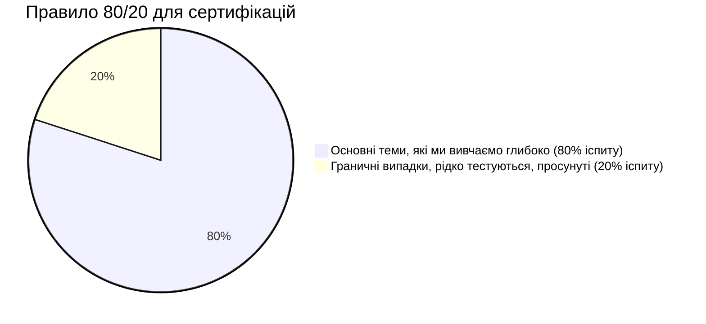
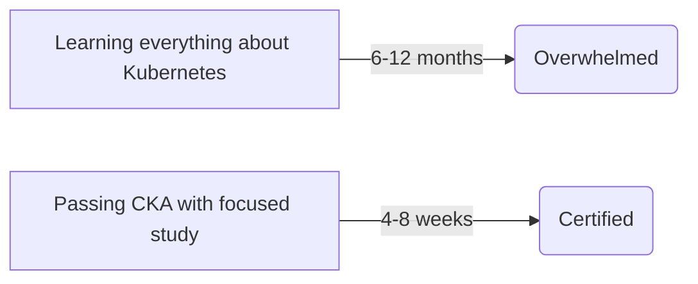
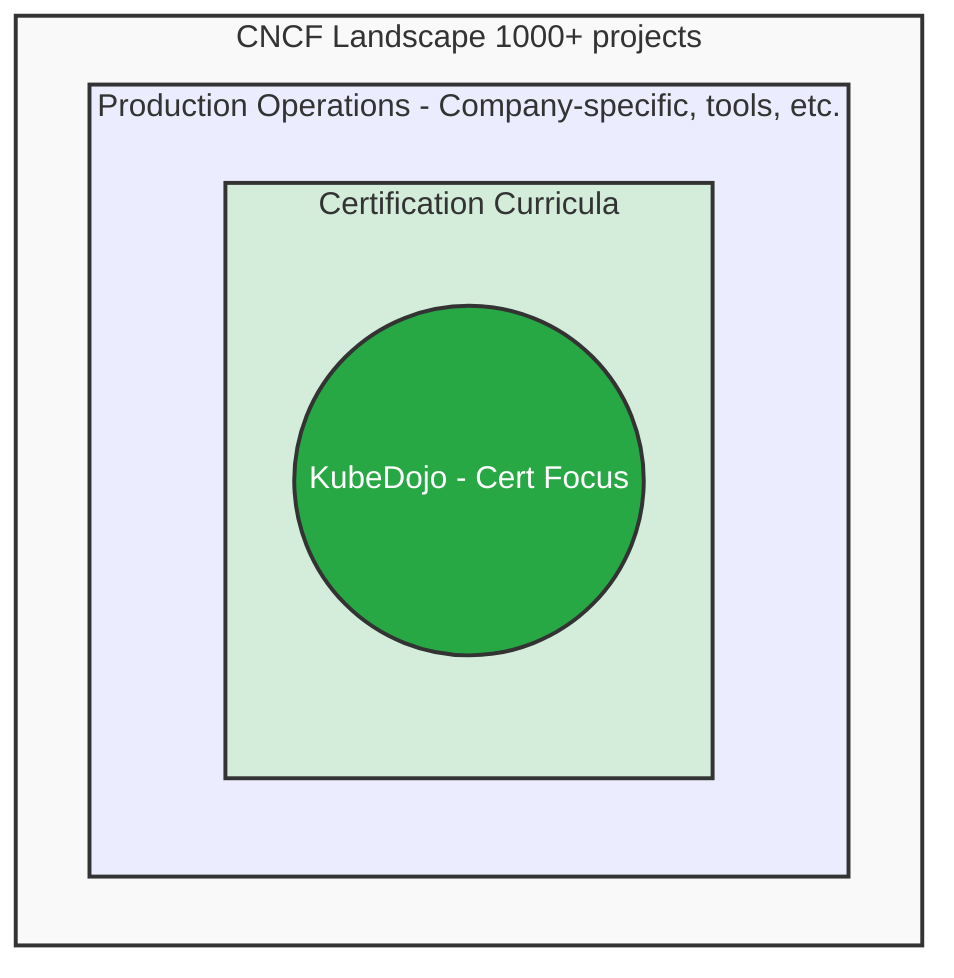

> **Складність**: `[QUICK]` - Формування очікувань
>
> **Час на проходження**: 35-45 хвилин
>
> **Передумови**: Модуль 1, Модуль 2

---


## Що ви зможете зробити

Після цього модуля ви зможете:

- **Оцінити** навчальні матеріали для сертифікації, відокремивши матеріал іспиту від післяекзаменаційної спеціалізації.
- **Порівняти** цілі базового (ванільного) Kubernetes із відволікаючими факторами: специфікою хмарних провайдерів, окремими інструментами та заглибленням у мережеві технології.
- **Розробити** обмежений у часі план навчання, який захистить практику роботи з основним Kubernetes від неконтрольованого розростання обсягу (scope creep).
- **Діагностувати** розростання обсягу, коли тиск команди, власна цікавість або робочі інструменти відвертають вашу увагу від іспиту.
- **Впровадити** особисті межі, які дозволять перенести просунуті теми в план розвитку після іспиту, замість того щоб просто їх відкидати.

---


## Чому це важливо

Уявіть команду платформи, яка готує трьох інженерів до сертифікації Kubernetes. Їхні робочі кластери працюють на керованій хмарній платформі з service mesh, постачанням GitOps, інтеграцією хмарної ідентифікації та стеком моніторингу, який розростався протягом кількох років, тому їхній план навчання відображає середовище, яке вони бачать щодня. Двоє інженерів проводять вечори, вивчаючи модулі Terraform, поведінку груп вузлів специфічних для провайдера, політики трафіку service mesh та кастомні інформаційні панелі, а потім стикаються з труднощами на тренувальних іспитах, оскільки вони повільно виконують нативні завдання, такі як перевірка Pod, виправлення RBAC, читання подій та використання `kubectl` в умовах обмеженого часу. Ціна цього — не лише плата за іспити; це кілька тижнів затримки проєктної роботи, втрачена впевненість і календар, повний перероблень, яких можна було б уникнути завдяки чіткішому визначенню меж матеріалу.

Ця історія має значення, тому що Kubernetes надто великий, щоб вивчати його хаотично. Студент може провести вихідні, що здаватимуться продуктивними, читаючи про поведінку кворуму etcd, шляхи передачі даних (datapaths) eBPF, архітектуру плагінів CNI, хвилі синхронізації ArgoCD, федерацію хмарного IAM та багатокластерну відмовостійкість, але так і не здобути майже нічого, що покращить результати на іспитах CKA, CKAD або CKS. Сертифікаційні іспити — це не судження про те, чи корисні ці теми в робочому середовищі. Це обмежений у часі тест конкретних можливостей Kubernetes, і KubeDojo розглядає цю межу як проєктне обмеження, а не як незручність.

Цей модуль навчає дисципліни, що стоїть за цією межею. Ми не кажемо вам назавжди ігнорувати реалії робочого середовища, і ми не вдаємо, що цілі іспиту охоплюють усі навички, необхідні сильному інженеру. Ми показуємо вам, як захистити підготовку до сертифікації від привабливих відволікань, як вирішити, коли тема належить до основного шляху, і як відкласти складний матеріал без відчуття, що ви його закидаєте. Мета полягає не в меншому розумінні Kubernetes; мета полягає у правильній послідовності, де основи для іспиту йдуть першими, а спеціалізація — після того, як отримання сертифіката більше не конкуруватиме за вашу увагу.

---

## Наша філософія: Орієнтація на іспит, а не на вичерпність

KubeDojo існує, щоб допомогти вам ефективно скласти сертифікації Kubernetes, а потім використати цю базу як стартовий майданчик для глибшої роботи. Тому навчальна програма є цілеспрямовано вибірковою. Ми застосовуємо правило 80/20, оскільки успіх на сертифікації зазвичай залежить від регулярної практики з основними примітивами, робочих процесів діагностики та вільного володіння командами, а не від побіжного знайомства з кожним проєктом у cloud-native екосистемі. Якщо тема прямо фігурує в цілях іспиту, ми її викладаємо. Якщо вона там відсутня, але пояснює ціль достатньо добре, щоб покращити результати, ми викладаємо мінімально корисну версію. Якщо вона захоплива, але не пов'язана з тестованим завданням, ми позначаємо її як спеціалізацію після іспиту.



Діаграма навмисно проста, оскільки рішення є навмисно практичним. Кандидату на сертифікацію не потрібна енциклопедична модель екосистеми CNCF перед тим, як вчитися **Створювати** Deployment, **Діагностувати** несправний Service, **Лагодити** kubelet або **Застосовувати** NetworkPolicy. Ці навички ближче до основи іспиту, оскільки це нативні завдання Kubernetes, які можна протестувати в обмеженому термінальному середовищі. Кастомний контролер, керована функція хмарної ідентифікації або інформаційна панель від постачальника можуть бути цінними на роботі, але їх важко справедливо протестувати серед усіх кандидатів, і це зазвичай виштовхує їх за межі сертифікаційного шляху.

Сприймайте іспит як іспит з водіння, а не як диплом інженера-механіка. Екзаменатора цікавить, чи можете ви безпечно керувати транспортним засобом, оцінювати дорожні умови, відновлюватися після типових проблем та дотримуватися правил у стресовій ситуації. Він не просить вас проєктувати трансмісію, налаштовувати гоночну підвіску або порівнювати кожну комерційну систему GPS. Ці глибші теми можуть зробити вас кращим фахівцем пізніше, але їх вивчення до того, як ви зможете скласти іспит з водіння, — це помилка в послідовності.

Ось чому в наших прикладах перевага надається чистому Kubernetes та семантиці Kubernetes 1.35+, якщо ціль сертифікації не вказує інше. Екзаменаційне середовище винагороджує знання, які застосовуються в будь-яких кластерах: об'єкти API, концепції control plane, RBAC, планування, управління робочими навантаженнями, основи спостережуваності, примітиви безпеки та діагностика за допомогою стандартних інструментів. Коли ми наводимо приклади команд, ми пишемо повну команду `kubectl`, оскільки приклади має бути безпечно вставляти в неінтерактивні оболонки та скрипти, хоча багато інженерів використовують коротший псевдонім в інтерактивному режимі під час практики з обмеженням часу.

```bash
kubectl version --client
kubectl get pods --all-namespaces
kubectl auth can-i list pods --all-namespaces
```

**Зупиніться та подумайте**: якщо ви проведете один вечір, практикуючись з `kubectl describe`, `kubectl logs`, `kubectl auth can-i` та `kubectl get events`, а потім проведете інший вечір, читаючи документацію про керовані групи вузлів хмарного провайдера, який вечір з більшою ймовірністю покращить ваш бал на іспиті наступного тижня і чому? Відповідь не в тому, що хмарна інфраструктура неважлива. Відповідь полягає в тому, що іспит може безпосередньо виміряти ваш нативний робочий процес діагностики, тоді як знання інфраструктури конкретного провайдера належить до іншої цілі навчання.

Компроміс цілком реальний. Сфокусована навчальна програма може здаватися неповною, коли на вашому робочому місці використовуються інструменти, які ми свідомо не викладаємо глибоко, і вона може здаватися консервативною, коли новий проєкт стає популярним швидше, ніж змінюються цілі іспитів. Ми приймаємо цей дискомфорт, оскільки навчання для сертифікації має інше завдання, ніж онбординг у робочому середовищі. KubeDojo спочатку викладає переносний рівень, а потім спрямовує вас до надійних джерел для поглиблення знань, специфічних для вашої ролі, після того, як зникне тиск іспиту.

---

## Що ми свідомо пропускаємо

Найпростіший спосіб змарнувати час на вивчення Kubernetes — це ставитися до кожної суміжної теми як до однаково нагальної. На практиці іспит винагороджує вужчий набір навичок: нативні API, базові операції з кластером, поведінку робочих навантажень, засоби контролю безпеки, діагностику та достатні знання мереж, щоб розуміти роботу Service, DNS та NetworkPolicy. Наведені нижче теми не є «поганими». Вони свідомо пропускаються, оскільки вони або залежать від реалізації постачальника, або вимагають підготовки фахівця, або представляють екосистему інструментів, яка заслуговує на окремий курс.

### Специфіка хмарних провайдерів

| Тема | Чому ми пропускаємо | Де вивчати |
|-------|-------------|----------------|
| Деталі AWS EKS | На іспиті використовується загальний K8s, а не специфічний для хмари | Документація AWS, документація eksctl |
| Функції GKE | Та сама причина | Документація Google Cloud |
| Специфіка AKS | Та сама причина | Документація Azure |
| Інтеграція Cloud IAM | Специфічно для провайдера | Документація провайдера |

Хмарні провайдери додають цінні рівні навколо Kubernetes, але ці рівні не є тим самим, що і сам Kubernetes. EKS, GKE та AKS роблять різні вибори щодо виділення вузлів, ідентифікації, балансувальників навантаження, класів сховищ, каналів оновлення та володіння control plane. Якщо ви вивчатимете ці вибори до того, як зможете аналізувати Pod, Service, Deployment, Secret, RoleBinding та стан вузла у звичайному кластері, ви вивчатимете обгортку до об'єкта, який вона обгортає. Це може зробити ваше робоче середовище знайомим, але ви будете повільними в екзаменаційній оболонці, де ця обгортка відсутня.

Наш підхід полягає в тому, щоб спочатку викладати Kubernetes. Коли ви розумієте платформу, документація провайдера стає простішою, оскільки ви можете відокремити нативний об'єкт від інтеграції провайдера. Наприклад, анотація хмарного балансувальника навантаження має сенс лише після того, як ви зрозумієте, чого намагається досягти Service типу `LoadBalancer`. Функцію хмарної ідентифікації легше аналізувати після того, як ви зрозумієте ServiceAccount та RBAC. KubeDojo охоплює нативну основу і залишає специфічні для провайдера робочі процеси на розсуд власної документації провайдера.

### Експлуатація в робочому середовищі на масштабі

| Тема | Чому ми пропускаємо | Де вивчати |
|-------|-------------|----------------|
| Багатокластерна федерація | Виходить за межі сертифікації | Документація K8s, проєкт KubeFed |
| Автомасштабування кластера | Специфічні для хмари реалізації | Документація провайдера |
| Відновлення після збоїв (DR) | Специфічно для організації | Книги з SRE, інструкції (runbooks) вашої компанії |
| Оптимізація витрат | Специфічно для хмари | Ресурси з FinOps, хмарні калькулятори |

Експлуатація в робочому середовищі на масштабі — це те, де Kubernetes стає глибоко контекстуальним. План відновлення після збоїв залежить від сховищ даних, цілей відновлення, толерантності організації до ризиків, хмарних регіонів, інструментів резервного копіювання, ролей під час інцидентів та готовності команди до операційної складності. Оптимізація витрат залежить від моделей тарифікації, зарезервованих потужностей, політик автомасштабування, сезонності робочих навантажень та бізнес-пріоритетів. Багатокластерний дизайн залежить від затримок, мультитенантності, дотримання нормативних вимог, управління трафіком та від того, кому дозволено керувати платформою. Ці теми важливі, але їх неможливо звести до універсального сертифікаційного контрольного списку, не втративши контекст, який робить їх корисними.

Іспит дійсно тестує операційне мислення, але в меншому і більш механічному масштабі. Вам може знадобитися **Евакуювати** вузол, **Діагностувати** несправний компонент control plane, **Відновити** знімок etcd, **Проаналізувати** запити на ресурси або **З'ясувати**, чому робоче навантаження не планується. Ці завдання є операційними, але вони обмежені. Тому KubeDojo навчає механік, що тестуються, та логіці, яка стоїть за ними, залишаючи повноцінне проєктування робочого середовища практиці SRE, інструкціям компанії та специфічним для платформи тренінгам.

### Глибокі знання з мереж

| Тема | Чому ми пропускаємо | Де вивчати |
|-------|-------------|----------------|
| Налаштування BGP | Виходить за межі сертифікації | Ресурси для мережевих інженерів |
| Внутрішня будова service mesh | Istio/Linkerd — це окремі домени | Документація проєкту |
| Внутрішня будова eBPF/Cilium | Просунута тема з мереж | Документація Cilium |
| Розробка кастомних CNI | Тема для розробників, а не адміністраторів | Специфікація CNI |

Мережі — це найспокусливіша кроляча нора, оскільки вони пояснюють так багато реальних збоїв. Студент починає з Service, який не може достукатися до Pod, а потім знаходить kube-proxy, iptables, IPVS, DNS, CoreDNS, плагіни CNI, оверлейні мережі, BGP, eBPF та service meshes. Цей ланцюжок технічно узгоджений, але іспит не вимагає від вас ставати автором мережевих плагінів. Він вимагає від вас аналізувати мережі Kubernetes з точки зору адміністратора або оператора застосунків: мітки, селектори, порти, кінцеві точки, DNS-імена, NetworkPolicy та базова діагностика.

Ця відмінність має значення під час практики. Якщо NetworkPolicy блокує трафік, ви повинні вміти **Перевірити** мітки Pod, селектори просторів імен, правила вхідного та вихідного трафіку, а також очікуване джерело та призначення. Вам не потрібно писати плагін CNI або пояснювати кожну оптимізацію передачі даних, яку використовує конкретна реалізація. Фахівцю, який працює з Cilium або Calico, потрібна така глибина, але кандидату на сертифікацію спочатку потрібна універсальна об'єктна модель.

### Специфічні інструменти та проєкти

| Інструмент | Чому ми пропускаємо | Де вивчати |
|------|-------------|----------------|
| ArgoCD | Інструмент GitOps, немає на іспиті | Документація ArgoCD |
| Istio | Service mesh, окремий напрямок сертифікації | Документація Istio |
| Terraform | Інструмент IaC, не специфічний для K8s | HashiCorp Learn |
| Prometheus/Grafana | Інструменти спостережуваності, згадуються побіжно | Документація проєкту |

Cloud-native екосистема сповнена чудових інструментів, які знаходяться поруч із Kubernetes, а не всередині цілей сертифікації. ArgoCD — це потужний контролер GitOps, Terraform — широко використовуваний інструментарій інфраструктури, Istio — це service mesh зі своєю власною ментальною моделлю, а Prometheus з Grafana — поширена пара для спостережуваності. Ми згадуємо ці проєкти, коли вони прояснюють ландшафт, але ми не перетворюємо сертифікаційний модуль на чотири додаткові навчальні програми. Кожен інструмент має власні команди, типи збоїв та компроміси в проєктуванні, і долучення їх до основного шляху зазвичай сповільнює виконання студентами нативних завдань, які насправді вимірює іспит.

Існує один тонкий виняток: Helm наразі чітко включений в обсяг CKAD, тоді як він не є центром вивчення CKA або CKS. Це не означає, що Helm неважливий; це означає, що глибина ваших знань повинна відповідати іспиту, який ви складаєте. Для CKAD варто практикувати стандартні операції з чартами, оскільки так сказано в цілях. Для CKA або CKS Helm може залишатися корисним контекстом, але він не повинен витісняти нативну діагностику, обслуговування кластера, налаштування робочих навантажень або завдання з безпеки.

**Зупиніться та подумайте**: якщо ваша компанія активно використовує Istio, чи варто вивчати його для CKA? Дисциплінована відповідь полягає в тому, що ви повинні дізнатися на роботі достатньо, щоб не бути небезпечним у робочому середовищі, але ви не повинні витрачати блоки навчання для сертифікації на вивчення внутрішньої будови service mesh, якщо ваша безпосередня мета не змінилася. Баланс між корисністю на роботі та готовністю до іспиту означає визначення мети кожної навчальної сесії перед її початком.


## Чому ми робимо такий вибір

Перша причина — ефективність використання часу. Навчання для сертифікації Kubernetes зазвичай втискується у вечори, вихідні або коротке вікно підготовки між проєктними зобов'язаннями. Широкий план може виглядати амбітно на папері, але все одно зазнати невдачі, оскільки він не забезпечує достатньої кількості повторень для завдань, які дійсно зустрічаються в екзаменаційному середовищі. Сфокусований план може здаватися менш вражаючим, але він розвиває швидкість там, де вона має значення: читання маніфестів, генерування YAML, перевірка подій, виправлення помилок конфігурації та вибір правильного нативного об'єкта в умовах дефіциту часу.



Друга причина — релевантність іспиту. CKA, CKAD та CKS публікують визначені навчальні програми, і ці програми створюють контракт між учнем та іспитом. KubeDojo орієнтується на цей контракт, а не на те, що випадково стало популярним у production цього кварталу. Додавання додаткового матеріалу не робить курс автоматично кращим; це збільшує когнітивне навантаження, створює хибне відчуття терміновості та може змусити учня сплутати суміжні знання з компетенцією, що перевіряється. Коли додаткова тема допомагає пояснити екзаменаційне завдання, ми використовуємо її ощадливо. Коли ні — ми скеровуємо в інше місце.

Третя причина — зручність супроводу. Kubernetes розвивається настільки швидко, що навіть сфокусована навчальна програма потребує регулярного перегляду на предмет розбіжності версій, застарілої поведінки, змінених налаштувань за замовчуванням та оновлень цілей іспиту. Чим більше необов'язкових тем містить курс, тим вища ймовірність, що деякі з них стануть неактуальними, оманливими або поверхневими. Менший обсяг дозволяє нам підтримувати вищу якість тем, які ми охоплюємо, особливо щодо поведінки Kubernetes 1.35+ та поточних очікувань від сертифікації.

Існує також психологічна причина. Учні часто використовують просунуті теми, щоб уникнути некомфортних основ, оскільки читання складних матеріалів здається більш престижним, ніж повторювана практика. Читання про політики service mesh може приносити більше задоволення, ніж створення десяти трохи різних NetworkPolicy та перевірка того, чи повинен проходити трафік. Читання про внутрішню будову etcd може здаватися серйознішим, ніж практика команд snapshot та restore, доки прапорці не стануть знайомими. Іспит винагороджує другий вид зусиль, оскільки він вимірює виконання, а не захоплення.

Перед початком наступного навчального сеансу запитайте себе: якого результату ви очікуєте від нього і як ви дізнаєтесь, що це покращило готовність до іспиту? Якщо результат — це папка з закладками, збірка нотаток про сторонній інструмент або розмите відчуття, що ви "пройшли мережі", сеанс може бути нецільовим. Якщо результат — це вирішений сценарій усунення несправностей, швидший робочий процес із командами або виправлений маніфест, який ви можете пояснити, сеанс набагато ближче до мети сертифікації.

---

## Принцип «Рівно стільки, скільки потрібно»

«Рівно стільки, скільки потрібно» не означає поверхнево. Це означає, що глибина теми повинна відповідати завданню, яке ця тема виконує на вашому поточному шляху навчання. Pods, Deployments, Services, RBAC, NetworkPolicy, планування, сховища та усунення несправностей заслуговують на змістовну практику, оскільки вони зустрічаються у всіх сертифікаціях і формують портативний словник Kubernetes. Інші теми потребують вужчого зрізу. Наприклад, для etcd кандидату може знадобитися знати, як **Створити** та **Відновити** snapshot за допомогою офіційного інструменту, тоді як експерту з production може знадобитися розуміння кворуму, ущільнення, дефрагментації, затримок, перевірки резервних копій та доменів відмов.

```mermaid
gantt
    title Depth Levels by Topic (Exam Needs vs. Expert Level)
    dateFormat X
    axisFormat %s

    section Pods
    Exam Needs          :a1, 0, 4
    Expert Level        :a2, 0, 10

    section Deployments
    Exam Needs          :b1, 0, 4
    Expert Level        :b2, 0, 8

    section Services
    Exam Needs          :c1, 0, 4
    Expert Level        :c2, 0, 9

    section NetworkPolicy
    Exam Needs          :d1, 0, 3
    Expert Level        :d2, 0, 8

    section RBAC
    Exam Needs          :e1, 0, 3
    Expert Level        :e2, 0, 10

    section Helm
    Exam Needs          :f1, 0, 4
    Expert Level        :f2, 0, 9

    section etcd backup
    Exam Needs          :g1, 0, 1
    Expert Level        :g2, 0, 10
```



Зупиніться та подумайте: погляньте на діаграму глибини вище і вирішіть, чому резервне копіювання etcd має невелику смугу екзаменаційної глибини, але велику смугу експертної глибини. Іспит може вимагати від вас виконати обмежений робочий процес відновлення, тому необхідною навичкою є точна практика команд із задокументованим процесом створення snapshot. Експертиза для production є ширшою, оскільки реальне відновлення може вплинути на кожне робоче навантаження, кожен контролер і кожен об'єкт API у кластері, а помилка може перетворити інцидент, який можна виправити, на втрату даних.

Цей принцип також допомагає уникнути хибної еквівалентності. Тема може мати просту назву і водночас вимагати глибокої експертизи, тоді як інша тема може виглядати складною і вимагати лише практичного зрізу для іспиту. "NetworkPolicy" звучить як один об'єкт, але реальна мережева ізоляція вимагає ретельного проєктування міток, меж просторів імен, поведінки плагінів, політики заборони за замовчуванням (default-deny) та тестування. "Cluster Autoscaler" звучить як тема з основ експлуатації, але вона сильно залежить від провайдерів інфраструктури та поведінки виділення вузлів, тому для більшості учнів вона знаходиться поза межами загального шляху сертифікації.

Корисне запитання для навчання — це не «Чи може це колись знадобитися?». Майже все в екосистемі Kubernetes може десь знадобитися. Краще запитання: «Яка найменша версія цієї теми покращить мою наступну спробу скласти іспит?». Якщо найменша корисна версія все ще велика, специфічна для постачальника або відірвана від опублікованих цілей, відкладіть її у дорожню карту після іспиту. Відкласти — не означає забути; це захист послідовності.

Практичний приклад: припустимо, ви вивчаєте Services і виявляєте, що ваш кластер у production використовує хмарний контролер балансувальника навантаження з багатьма анотаціями. Релевантний для іспиту зріз полягає в тому, щоб знати, як поводяться типи Service, як селектори відображаються на кінцеві точки, як співвідносяться ports і targetPorts, і як **Діагностувати** Service, який не має кінцевих точок. Зріз після іспиту полягає у вивченні контролера провайдера, поведінки політики зовнішнього трафіку в цьому середовищі, специфічних для анотацій функцій та наслідків для вартості. Вони пов'язані, але це не одне й те саме навчальне завдання.

---

## Де ми радимо заглибитися

Після того, як ви пройдете сертифікацію, спеціалізація стає правильним кроком. Різниця полягає в тому, що ви будете обирати глибину зі стабільного фундаменту замість того, щоб використовувати просунуті теми для компенсації прогалин у базових знаннях. Платформному інженеру, розробнику застосунків, інженеру з безпеки та SRE потрібен Kubernetes, але їм не потрібен однаковий другий рівень. Іспит дає вам спільний словник; шлях після іспиту дає вам специфічні для ролі важелі впливу.

Для платформних інженерів природним наступним кроком є проєктування платформи: Cluster API, GitOps з ArgoCD або Flux, патерни мультитенантності, портали для розробників, контроль політик та компроміси створення абстракцій для команд розробників. Ця робота вимагає від вас думати про власність, шляхи оновлення, "проторовані шляхи", орендність та про те, скільки деталей Kubernetes відкривати користувачам. Сертифікація допомагає, оскільки вона дає вам сирі примітиви, але платформна інженерія ставить інше запитання: як спакувати ці примітиви у надійний внутрішній продукт?

Для розробників наступним рівнем є архітектура застосунків у Kubernetes. Патерни sidecar, ambassador та adapter стають цікавішими, коли ви розумієте Pods та контейнери. Розробка Operators та CRD стає безпечнішою, коли ви розумієте API server, узгодження та те, що вже забезпечують звичайні об'єкти робочого навантаження. Плагіни kubectl та клієнтське програмування стають корисними, коли ви можете відрізнити зручну обгортку від базової поведінки API.

Для учнів, орієнтованих на безпеку, шлях після іспиту може включати політики OPA або Gatekeeper, виявлення під час виконання за допомогою Falco, безпеку ланцюга постачання з робочими процесами у стилі Sigstore, просунуте проєктування NetworkPolicy, admission control та моделювання загроз для мультитенантних кластерів. CKS охоплює деякі примітиви безпеки, але безпека у production вимагає ширшої доказової бази, операційного контролю, логування, реагування на інциденти та організаційної відповідальності. Ви повинні знати, де закінчується іспит, щоб мати змогу свідомо спланувати цей глибший шлях.

Для SRE та експлуатації наступним рівнем є інженерія надійності: сповіщення на основі SLO, планування потужностей, хаос-експерименти, перевірка резервних копій, реагування на інциденти, стратегія оновлення та навчання після інцидентів. Kubernetes дає вам об'єкти та контролери, але надійність походить від циклів зворотного зв'язку та дисциплінованої експлуатації. Сертифікація може підтвердити, що ви можете керувати платформою на базовому рівні; вона не може замінити багаторазову практику запуску реальних сервісів через реальні сценарії відмов.

Який підхід ви б обрали тут і чому: один місяць змішаного навчання, де кожен вечір перескакує між завданнями CKA, ArgoCD, Terraform, Cilium та інформаційними панелями витрат, чи три тижні фокусування на сертифікації з наступним місяцем спеціалізації після іспиту? Другий план зазвичай виграє, оскільки він усуває конкуренцію між цілями. Він дозволяє вам швидше отримати сертифікацію, а потім дає просунутим темам виділений час замість того, щоб сприймати їх як переривання.

---

## Візуалізація: Обсяг KubeDojo

Наведена нижче діаграма обсягу — це ментальна модель для цього модуля. KubeDojo знаходиться всередині навчальних програм сертифікації, які знаходяться всередині експлуатації в production, яка, у свою酌 чергу, знаходиться всередині набагато ширшого ландшафту CNCF. Вкладеність важлива, оскільки вона запобігає двом типовим помилкам. Одна помилка полягає у припущенні, що іспит охоплює весь production Kubernetes. Інша помилка полягає у припущенні, що все поза іспитом є нерелевантним. Істина є більш корисною: іспит — це сфокусований зріз, і KubeDojo слідує за цим зрізом.



Використовуйте цю діаграму, коли відчуваєте напругу між релевантністю для роботи та релевантністю для іспиту. Якщо тема знаходиться в межах блоку сертифікації, вона належить до вашого безпосереднього плану навчання. Якщо вона знаходиться всередині експлуатації в production, але поза сертифікацією, вона може належати до вашого робочого плану навчання або дорожньої карти після іспиту. Якщо вона знаходиться десь у ширшому ландшафті CNCF, можливо, варто знати про її існування, але вона не повинна забирати час на підготовку до сертифікації, хіба що безпосередня мета іспиту не затягує її всередину.

Діаграма також пояснює, чому KubeDojo може мати чітку позицію, не будучи при цьому зневажливим. Ми можемо сказати «не вивчайте ArgoCD для CKA» і при цьому поважати ArgoCD як інструмент для production. Ми можемо сказати «не вивчайте конфігурацію BGP для CKAD» і при цьому поважати мережевих спеціалістів. Навчальна програма, яка відмовляється проводити межі, з часом перетворюється на мапу всього на світі, а мапою всього важко користуватися, коли перед вами іспит з обмеженим часом.


## Як класифікувати тему, поки вона не вкрала ваш тиждень

Найбільш практична навичка в цьому модулі — це класифікація. Коли з’являється нова тема, не запитуйте, чи вона цікава, сучасна або чи використовують її серйозні команди, оскільки на ці запитання надто легко відповісти «так». Запитайте, яку роль ця тема відіграє у вашій поточній меті. Тема може бути матеріалом іспиту, допоміжним контекстом, післяекзаменаційною спеціалізацією або нагальною робочою потребою. Ці категорії дозволяють вам ухвалювати рішення без суперечок про те, чи має тема цінність у якомусь абстрактному сенсі.

Теми, що входять в обсяг іспиту — це ті, які ви повинні вміти виконувати, а не лише розпізнавати. Якщо завдання вимагає налаштування робочих навантажень (workloads), ви повинні створювати та змінювати їх, поки команди не стануть для вас звичними. Якщо завдання вимагає усунення несправностей (troubleshooting), ви повинні перевіряти події (events), журнали (logs), селектори (selectors), стан вузлів (node conditions) та статус розгортання (rollout state), поки не зможете швидко переходити від симптому до гіпотези. Робота над матеріалом іспиту створює видимі практичні артефакти: виправлені маніфести, робочі команди, скориговані політики та пояснення, які ви можете надати без нотаток.

Допоміжний контекст — це інше. Він допомагає зрозуміти тему іспиту, але не стає новою кінцевою метою. Наприклад, вам може знадобитися базова ментальна модель того, як контролери узгоджують бажаний стан (reconcile desired state), щоб Deployments та ReplicaSets перестали здаватися магією. Вам не потрібно писати власний контролер перед іспитом CKAD. Вам може знадобитися знати, що плагін CNI забезпечує мережеву взаємодію Pod, щоб поведінка NetworkPolicy мала де відбуватися. Вам не потрібно реалізовувати плагін CNI перед іспитом CKA.

Післяекзаменаційна спеціалізація — це те місце, куди належить багато чудових тем. Ця категорія має викликати повагу, а не зневагу, оскільки вона зберігає можливості для майбутнього навчання. Якщо ви додаєте «ArgoCD sync waves» до післяекзаменаційного списку, ви кажете, що GitOps заслуговує на зосереджену увагу після того, як ви надійно засвоїте нативні Deployments, Services, ConfigMaps, Secrets та усунення несправностей розгортання. Якщо ви додаєте туди «Cilium eBPF internals», ви кажете, що експертиза в маршрутизації даних (datapath) заслуговує на окремий блок вивчення після того, як ви вже зможете міркувати про стандартні Services та NetworkPolicies.

Нагальна робоча потреба — це категорія, яка може перевершити план іспиту, але це має відбуватися свідомо. Якщо завтра ви чергуєте на продукційному кластері, і ваша команда вимагає від вас розуміння специфічного для провайдера плану дій у разі інциденту (incident runbook), тоді операційна безпека може бути важливішою за підготовку до сертифікації цього вечора. Помилка полягає в тому, щоб прикидатися, ніби план дій провайдера також зараховується як підготовка до CKA. Це може бути правильною роботою на сьогодні, але ви повинні чесно зафіксувати компроміс і перенести нативну практику, яку ви відклали.

Корисна звичка для класифікації — написати одне речення перед відкриттям будь-якого великого ресурсу: «Я читаю це, тому що це допоможе мені зробити X на іспиті». Якщо ви не можете замінити X на нативне завдання Kubernetes, ресурс, ймовірно, знаходиться поза основним блоком вивчення. Цей невеликий бар'єр запобігає випадковим блуканням, оскільки перетворює розпливчасте навчання на твердження, яке можна перевірити. Твердження все ще може бути дійсним, але воно має заслужити своє місце.

Розгляньмо студента, який починає з простого запитання: чому один Pod не може отримати доступ до іншого? Шлях обсягу іспиту перевіряє мітки (labels), Services, кінцеві точки (endpoints), порти, DNS, NetworkPolicy, межі просторів імен та події (events). Шлях допоміжного контексту пояснює, що кластер використовує плагін CNI для забезпечення мережевої взаємодії Pod. Шлях післяекзаменаційної спеціалізації досліджує конкретну реалізацію, таку як Cilium, Calico або хмарну маршрутизацію. Шлях нагальної робочої потреби дотримується локального плану дій у разі інциденту, якщо продукційний трафік падає прямо зараз. Той самий симптом, чотири категорії, чотири різні рішення щодо вивчення.

Та сама класифікація працює і для безпеки. RBAC в обсязі іспиту означає створення Roles та RoleBindings, перевірку дозволів за допомогою `k auth can-i` та розуміння різниці між дозволами на рівні простору імен та кластера. Допоміжний контекст може охоплювати те, чому принцип найменших привілеїв важливий, і як ServiceAccounts прив'язують ідентичність до Pods. Післяекзаменаційна спеціалізація може охоплювати написання політик OPA, проєктування admission control, workload identity federation або підписування ланцюга постачання (supply chain signing). Нагальна робоча потреба може вимагати вивчення процедури екстреного доступу вашої компанії перед наступним чергуванням.

Класифікація також захищає вас від пастки престижу. Складні теми часто здаються доказом того, що ви стаєте справжнім інженером Kubernetes, тоді як повторювані нативні вправи можуть здаватися базовими. Насправді, сертифікаційна робота з обмеженим часом винагороджує швидкий доступ до основ. Кандидат, який може швидко діагностувати невідповідність селектора Service, виправити зламаний RoleBinding та відновитися після неправильно налаштованого Deployment, підготовлений краще, ніж кандидат, який може описати архітектуру service mesh, але вагається перед `k describe pod`.

Існує друга пастка у протилежному напрямку: ставлення до всього, що виходить за межі іспиту, як до марної трати часу. Таке ставлення може допомогти студенту скласти іспит, але зробити його вразливим у продукційному середовищі. Краща позиція — це послідовність, а не зневага. Вам дозволено сказати: «Це варто вивчити, але не зараз». Це речення є однією з найздоровіших звичок у технічній освіті, оскільки воно відокремлює повагу до теми від відданості поточній меті.

Коли ви класифікуєте ресурс, класифікуйте також очікуваний результат. Робота над матеріалом іспиту має завершуватися практичними результатами, такими як виконані лабораторні роботи або команди, які ви можете повторити. Допоміжний контекст може завершуватися коротким поясненням або діаграмою. Післяекзаменаційна спеціалізація може завершуватися закладкою та причиною повернутися до неї. Нагальна робоча потреба може завершуватися нотаткою в плані дій або дією під час інциденту. Якщо кожна категорія закінчується тією самою купою нотаток, ви насправді не ухвалили рішення.

Ось чому KubeDojo постійно повертається до свідомих меж. Межа — це не стіна навколо вашої цікавості; це черга. Перші елементи в черзі — це ті, які роблять вас компетентними в екзаменаційному середовищі. Наступні елементи роблять вас кориснішими у вашій команді, сильнішими у вашій спеціальності та краще підготовленими до реальних інцидентів. Черга є гуманнішою за відмову, оскільки вона дозволяє вам зберегти майбутнє, не жертвуючи сьогоденням.

---


## Коли це не застосовується

Оскільки це короткий орієнтаційний модуль, основний патерн простий: використовуйте KubeDojo як шлях до іспиту, коли ваша головна мета — успішно скласти сертифікацію Kubernetes найближчим часом. Цей патерн працює найкраще, коли у вас є фіксована дата іспиту, обмежені години для навчання та достатньо дисципліни, щоб зберігати складні теми в окремому беклозі. Він також добре працює для команд, оскільки створює спільну мову щодо обсягу матеріалу. Замість того, щоб сперечатися, чи є тема цікавою, команда може запитати, чи входить вона в обсяг іспиту, чи є допоміжним контекстом, чи післяекзаменаційною спеціалізацією.

Антипатерн настільки ж простий: не використовуйте шлях, орієнтований на іспит, як єдиний план навчання для продукційного середовища. Якщо завтра ви чергуєте на реальному кластері, вам можуть знадобитися специфічні для провайдера плани дій, процедури компанії щодо інцидентів, перевірка резервних копій, дашборди, конвенції логування та специфічні для інструментів перевірки безпеки ще до того, як ви завершите сертифікаційний курс. Зосередженість на іспиті не є виправданням для ігнорування операційних ризиків. Це спосіб запобігти тому, щоб одна мета навчання поглинула іншу.

Ще один антипатерн — це повне придушення інтересу до складніших тем. Деякі з найкращих інженерів Kubernetes стають сильними саме тому, що глибоко задовольняють свою цікавість після того, як засвоять основи. Проблема не в цікавості; проблема полягає в тому, щоб дозволити цікавості перервати обмежений план навчання без свідомого компромісу. Кращий підхід — зафіксувати складні теми в післяекзаменаційному списку, додати джерело, до якого ви хочете повернутися, і написати одне речення, яке пояснює, чому це важливо для вашої ролі.

Ось практичний приклад, який ви можете використати, коли команда під час навчання починає відхилятися від теми. Уявіть, що група готується до CKA, і один учасник пропонує провести заняття про анотації керованих хмарних балансувальників навантаження (managed cloud load balancer), оскільки від них залежить їхній продукційний ingress. Фасилітатор не повинен стверджувати, що анотації непотрібні. Натомість варто запитати, яке нативне завдання покращує ця сесія. Якщо відповідь — «розуміння Services», група може витратити десять хвилин на пояснення рівня провайдера, а потім повернутися до типів Service, селекторів, кінцевих точок, портів та усунення несправностей. Якщо відповідь — «вивчення нашої хмарної платформи», цю сесію слід перенести до окремого робочого треку.

Ця ж техніка працює і при відхиленнях у теми безпеки. Припустімо, хтось хоче замінити вправу з RBAC на глибоке вивчення policy engine, оскільки компанія планує впровадити admission control. Корисна реакція — розділити тему на рівні. Рівень іспиту — це ServiceAccounts, Roles, RoleBindings, ClusterRoles, ClusterRoleBindings та перевірки дозволів. Рівень policy engine — це післяекзаменаційна або робоча спеціалізація. Назвавши ці рівні, група зможе поважати продукційну дорожню карту, не жертвуючи сертифікаційними навичками, які потрібно відпрацювати в першу чергу.

Цей підхід особливо корисний, коли людина, яка пропонує відхилитися від теми, є senior-інженером. Senior-інженери часто рекомендують теми з реальних інцидентів, і ці рекомендації мають вагу, оскільки вони ґрунтуються на болючому досвіді. Молодший спеціаліст може відчувати, що відмовляти — безвідповідально. Кращий хід — сказати: «Це звучить важливо, і я хочу додати це до нашого післяекзаменаційного списку. Для цієї сесії CKA, яке нативне завдання Kubernetes ми маємо відпрацювати насамперед?» Таке формулювання враховує контекст senior-інженера, водночас захищаючи навчальну мету.

Ви також можете використовувати ці межі під час самостійного навчання. Коли ви помічаєте, що відкрили п'ять вкладок браузера, і жодна з них не описує завдання, яке ви могли б виконати в екзаменаційній оболонці (shell), зупиніться і класифікуйте ці вкладки. Одна може стати допоміжним контекстом, дві можуть перейти до післяекзаменаційної спеціалізації, а одна може взагалі не стосуватися вашої поточної ролі. Закриття або переміщення вкладок не є втратою знань. Це порятунок від випадкового розширення обсягу до того, як воно поглине решту вечора.

Найсильніші студенти почуваються комфортно з тимчасовою неповнотою знань. Вони можуть сказати: «Я ще не знаю внутрішньої структури цього контролера провайдера, але я можу пояснити об'єкт Kubernetes, за яким він стежить, і симптом, який мені потрібно усунути». Це речення є чесним і корисним. Воно дозволяє уникнути вдавання з себе експерта, водночас демонструючи реальну компетентність. Підготовка до сертифікації має формувати саме таку обґрунтовану впевненість, а не крихке відчуття, що ви повинні знати кожен рівень, перш ніж доторкнутися до платформи.

---


## Коли використовувати це замість альтернатив

Використовуйте межі обсягу KubeDojo, коли безпосереднім результатом має бути готовність до сертифікації. Використовуйте документацію вендора, коли безпосереднім результатом є управління конкретним керованим сервісом (managed service). Використовуйте документацію проєкту, коли безпосереднім результатом є впровадження або налаштування конкретного інструменту. Використовуйте книги з SRE, плани дій компанії та огляди інцидентів, коли безпосереднім результатом є надійність продукційного середовища. Ці альтернативи не є конкурентами; вони відповідають на різні запитання.

| Навчальна мета | Найкраще першоджерело | Чому це джерело підходить |
|---------------|---------------------|----------------------|
| Скласти CKA, CKAD, CKS, KCNA або KCSA | KubeDojo плюс офіційні вимоги до іспиту | Обсяг обмежений нативними навичками Kubernetes та поточними очікуваннями від сертифікації. |
| Керувати EKS, GKE або AKS | Документація провайдера та плани дій компанії | Керовані сервіси відрізняються системами ідентифікації, оновленнями, мережами, сховищами та межами підтримки. |
| Впровадити ArgoCD, Istio, Terraform або Prometheus | Документація проєкту та спеціалізована лабораторна робота | Сторонні інструменти мають власні моделі, команди та типи збоїв. |
| Спроєктувати надійність продукційного середовища для кількох кластерів | Практики SRE, огляди архітектури та історія інцидентів | Правильна відповідь залежить від ризиків, трафіку, даних, персоналу та бізнес-обмежень. |

Перевірка правильності рішення полягає в тому, щоб назвати завдання перед вибором ресурсу. «Мені потрібно скласти CKAD» веде до іншого набору джерел, ніж «мені потрібно усунути помилки в нашому шляху ingress Istio» або «мені потрібно зменшити витрати на хмару в продукційній платформі». Коли студенти пропускають цей крок, вони часто плутають просто корисний ресурс із ресурсом, який є корисним прямо зараз. KubeDojo корисний прямо зараз, коли це «прямо зараз» означає готовність до іспиту.

---


## Чи знали ви?

- **Ландшафт CNCF налічує понад 1000 проєктів.** Жодна людина не може опанувати їх усі, і наявність проєкту в ландшафті не робить його автоматично частиною обсягу сертифікації.
- **Більшість продукційних користувачів Kubernetes глибоко знають лише певну його частину.** Вони знають те, чого вимагає їхня робота, тоді як сертифікації підтверджують широту знань, які можна застосувати всюди, а робота формує глибину, специфічну для певної ролі.
- **Навчальні програми сертифікацій з часом змінюються.** План навчання має відповідати поточним офіційним вимогам, а не покладатися на старий план курсу чи пам'ять колеги.
- **«Експерт» залежить від контексту.** Експерт з мереж, експерт з безпеки, інженер платформи розробки та SRE можуть бути сильними в Kubernetes, маючи при цьому різні глибокі спеціалізації.

---


## Типові помилки під час підготовки до сертифікацій Kubernetes

| Помилка | Чому це трапляється | Як це виправити |
|---------|----------------|---------------|
| **Занурення в плагіни CNI (rabbitholing)** | Мережі — це захопливо, і документація Calico або Cilium може створити враження, що маршрутизація даних (datapath) і є справжнім іспитом. | Вивчіть достатньо, щоб встановити або розпізнати CNI, а потім практикуйте стандартні Services, DNS та NetworkPolicies з нативними об'єктами. |
| **Запам'ятовування синтаксису YAML** | Порожній редактор лякає, тому студенти намагаються запам'ятати кожне поле візуально. | Опануйте `k run` та `k create` з `--dry-run=client -o yaml`, а потім швидко й точно редагуйте згенеровані маніфести. |
| **Вивчення специфічного для хмари IAM** | Ваша компанія використовує інтеграції AWS IRSA, EKS Pod Identity, GKE Workload Identity або AKS, тому це здається базовим Kubernetes. | Зосередьтеся спочатку на ServiceAccounts, Roles, ClusterRoles, RoleBindings, ClusterRoleBindings та `k auth can-i` у чистому (vanilla) Kubernetes. |
| **Створення кластера на Raspberry Pi** | Робота з реальним обладнанням здається більш справжньою, ніж локальна лабораторна. | Використовуйте kind, minikube або просту лабораторну на віртуальних машинах, оскільки іспит перевіряє роботу з Kubernetes, а не апаратні особливості чи проблеми з ARM-образами. |
| **Надмірна увага до Helm або Helmfile** | Можливо, Helm — це той спосіб, яким ваша команда розгортає застосунки щодня. | Узгодьте глибину з іспитом: практикуйте стандартні завдання Helm для CKAD, але не дозволяйте Helm витіснити основні завдання CKA або CKS. |
| **Надто раннє вивчення GitOps з ArgoCD або Flux** | GitOps — це сучасна продукційна норма, і він здається природним наступним кроком після Deployments. | Зрозумійте декларативний стан концептуально, а потім відкладіть специфічну для інструментів поведінку синхронізації до моменту, коли ви вільно працюватимете з нативними навантаженнями та усуненням несправностей. |
| **Спроби опанувати операції etcd** | etcd — це мозок кластера, тому глибока теорія здається необхідною для авторитетності. | Відпрацюйте офіційний процес створення снепшотів та відновлення (snapshot and restore), який вимагається на іспиті, а потім залиште стиснення (compaction), налаштування кворуму та проєктування катастрофостійкості для спеціалізації. |

---


## Контрольні запитання

<details>
<summary>Ваш менеджер хоче, щоб ви витратили наступні два тижні на вивчення Terraform та EKS, оскільки ваша команда використовує їх у production. Як вам захистити свій план підготовки до CKA?</summary>

Вам слід визнати, що Terraform та EKS є важливими для роботи, а потім відокремити цю ціль від підготовки до сертифікації. CKA перевіряє навички адміністрування Kubernetes незалежно від платформи, тому два тижні роботи зі специфічною для провайдера інфраструктурою здебільшого витіснять практику з нативними Pods, вузлами, RBAC, діагностикою та завданнями control plane. Хорошою відповіддю буде запропонувати межу: спочатку завершити блок, орієнтований на сертифікацію, а потім запланувати блок онбордингу до провайдера після іспиту. Це захищає вашу готовність до іспиту, не ігноруючи реальні production-потреби команди.
</details>

<details>
<summary>Ви вивчаєте NetworkPolicies і знаходите довгий посібник з Cilium eBPF, який виглядає чудово. Чи повинен він стати частиною плану підготовки до CKAD на цей тиждень?</summary>

Його слід зберегти в закладках на майбутнє, а не додавати до поточного плану CKAD. CKAD вимагає від вас роботи зі стандартними об'єктами Kubernetes та розуміння поведінки застосунків, тоді як деталі реалізації eBPF належать до глибокої мережевої спеціалізації. Цей посібник може бути корисним після іспиту, особливо якщо на вашому робочому місці використовується Cilium, але він не покращить вашу нагальну навичку написання та перевірки NetworkPolicies в умовах обмеженого часу. Кращим кроком для навчання буде створення кількох сценаріїв політик і прогнозування того, який трафік має проходити.
</details>

<details>
<summary>Ваш навчальний календар виділяє однаковий час на налаштування ArgoCD та стандартні Deployments і Services. Що не так із таким розподілом?</summary>

Такий розподіл прирівнює сторонній інструмент GitOps до нативних примітивів Kubernetes для іспиту, який передусім вимірює навички роботи з нативними інструментами. ArgoCD корисний у production, але це не те саме, що розуміння того, як Deployments створюють ReplicaSets, як мітки з'єднують Services із Pods, або як діагностувати endpoints. Однаковий час створює приховану альтернативну вартість, оскільки кожна година, витрачена на sync waves або ресурси застосунків, — це година, не витрачена на екзаменаційні завдання. Перенесіть ArgoCD до дорожньої карти після іспиту та використайте цей час для практики з нативними workloads.
</details>

<details>
<summary>Колега провалив пробний іспит після того, як покладався на AWS Console для операцій з вузлами на роботі. Як би ви діагностували розширення обсягу в його підготовці?</summary>

Розширення обсягу виникло через плутанину між робочим процесом керованого сервісу та ванільним адмініструванням Kubernetes. Консоль може приховувати поведінку kubelet, умови вузлів, сервіси systemd, сертифікати та механіку control plane, які CKA може вимагати інспектувати безпосередньо. Рішення полягає не в тому, щоб відмовитися від керованих сервісів на роботі; воно полягає в тому, щоб практикувати завдання нижчого рівня з Kubernetes та Linux, які може перевірити іспит. Їхній наступний план повинен включати нативні команди, діагностику вузлів та перевірку компонентів кластера замість подальших покрокових інструкцій у консолі.
</details>

<details>
<summary>Ви бачите Horizontal Pod Autoscaler та Cluster Autoscaler в одній сесії вивчення документації. Який з них заслуговує на увагу для іспиту, і як ви їх порівнюєте?</summary>

Horizontal Pod Autoscaler заслуговує на більшу увагу для іспиту, оскільки це функція масштабування workload, керована API Kubernetes, тоді як Cluster Autoscaler взаємодіє з інфраструктурним рівнем, який надає вузли. Точна поведінка Cluster Autoscaler сильно залежить від хмари або середовища надання вузлів, що робить його менш портативним для вивчення до сертифікації. Порівняння їх у такий спосіб запобігає типовій помилці: сприйняттю всіх тем масштабування як однаково релевантних для іспиту. Вивчіть нативний об'єкт достатньо глибоко для іспиту, а потім вивчайте масштабування інфраструктури, коли будете працювати на реальній платформі.
</details>

<details>
<summary>Ви плануєте побудувати високодоступний bare-metal кластер із зовнішнім etcd перед складанням CKA наступного тижня. Чи є це хорошим дизайном для обмеженого в часі навчального плану?</summary>

Це сильний проєкт для platform engineering, але це поганий дизайн для обмеженого в часі екзаменаційного плану. Побудова запровадить балансувальники навантаження, поведінку апаратного забезпечення, операції із зовнішнім etcd, вибір мережевих рішень та режими відмов, які виходять далеко за межі того, що вам потрібно перед іспитом наступного тижня. Сфокусований план повинен використовувати просту лабораторну роботу і витрачати обмежений час на завдання, які найімовірніше будуть перевірятися. Відкладіть побудову високої доступності до дорожньої карти після іспиту, а зараз практикуйте kubeadm, діагностику та механіку snapshot-ів etcd.
</details>

<details>
<summary>Ви маєте список закладок, повний статей про Istio, ArgoCD, Cilium, провайдерський IAM та etcd. Як би ви впровадили особисту межу, не втрачаючи ці ресурси?</summary>

Створіть два списки: обсяг іспиту та спеціалізація після іспиту. Перемістіть кожен просунутий ресурс у другий список з короткою приміткою про те, чому він може бути важливим пізніше, наприклад: "service mesh для політик production-трафіку" або "Cilium datapath для нашої platform team". Потім виберіть менший набір завдань з обсягу іспиту на поточний тиждень, таких як тренування з RBAC, діагностика Service, сценарії NetworkPolicy та практика зі snapshot-ами etcd. Ця межа підтримує цікавість, водночас не дозволяючи їй поглинути графік підготовки до сертифікації.
</details>

---


## Практична вправа: Зробіть аудит ваших навчальних матеріалів

Ця вправа є скоріше лабораторною роботою з планування, ніж лабораторною роботою в кластері, оскільки навичка, яка вам потрібна, — це контроль обсягу. Відкрийте свої поточні навчальні закладки, плейлисти, нотатки, сторінки корпоративної вікі або беклог тренінгів. Ваше завдання — перетворити незфокусовану купу корисних ресурсів на план підготовки до сертифікації, який має чітку межу та окрему дорожню карту після іспиту.

### Підготовка

Створіть короткий документ із трьома заголовками: `Exam Scope`, `Supporting Context` та `Post-Exam Specialization`. Якщо у вас уже є трекер навчання, додайте ці мітки туди замість створення нового файлу. Інструмент не має значення; має значення якість рішення.

### Завдання

1. **Провести інвентаризацію** щонайменше дванадцяти ресурсів, які ви планували використовувати, включаючи відео, сторінки документації, внутрішні runbooks та практичні лабораторні роботи. Позначте кожен із них сертифікацією, яку ви здобуваєте, та причиною, чому ви вважали, що він належить до плану.
2. **Оцінити** кожен ресурс на відповідність офіційним цілям іспиту та перемістити його до `Exam Scope`, `Supporting Context` або `Post-Exam Specialization`. Будьте суворими: ресурс може бути корисним і при цьому виходити за межі цілі сертифікації на цей місяць.
3. **Порівняти** просунуті теми з нативними завданнями Kubernetes, які вони можуть замінювати. Наприклад, порівняйте посібник з політик трафіку Istio з практикою роботи над Service та NetworkPolicy, або порівняйте посібник із хмарного IAM із тренуваннями з RBAC.
4. **Спроєктувати** однотижневий обмежений у часі навчальний план, який відводить більшу частину вашого часу для практики на нативні завдання Kubernetes і резервує лише короткий час для контексту на все, що виходить за межі обсягу іспиту.
5. **Діагностувати** одну ймовірну точку тиску, яка може збити вас з плану, наприклад, коли менеджер запитує про знання провайдера, колега рекомендує інструмент, або ваша власна цікавість до внутрішньої роботи системи.
6. **Впровадити** особисту межу, написавши одне речення, яке починається з: `I will not study ... until after I pass because ...`.

<details>
<summary>Вказівки до рішення</summary>

Сильна відповідь не повинна видаляти просунуті теми. Вона повинна перемістити їх у видиму дорожню карту після іспиту, щоб ви могли повернутися до них, не дозволяючи їм конкурувати з поточною сертифікацією. Ваш список `Exam Scope` повинен містити нативну практику Kubernetes, таку як workloads, Services, RBAC, планування, сховища, діагностику, примітиви безпеки та будь-який інструмент, явно вказаний у цілях вашого іспиту. Ваш список `Supporting Context` повинен бути невеликим і пояснювати концепцію, що перевіряється, а не впроваджувати новий набір інструментів. Ваш список `Post-Exam Specialization` повинен містити деталі провайдерів, інструменти GitOps, глибину service mesh, глибокі внутрішні деталі CNI, оптимізацію витрат у production та роботу над надійністю, специфічну для вашої ролі.
</details>

### Критерії успіху

- [ ] Ви оцінили щонайменше дванадцять навчальних матеріалів і призначили кожен з них до `Exam Scope`, `Supporting Context` або `Post-Exam Specialization`.
- [ ] Ви визначили щонайменше дві теми, які ви планували вивчати, що виходять за рамки обсягу сертифікації, такі як Istio, специфіка EKS, ArgoCD, внутрішні деталі Cilium або Terraform.
- [ ] Ви порівняли щонайменше одну просунуту тему з нативним завданням Kubernetes, яке вона витісняла.
- [ ] Ви спроєктували однотижневий обмежений у часі навчальний план, який захищає базову практику Kubernetes.
- [ ] Ви діагностували одну реалістичну точку тиску щодо розширення обсягу і написали, як ви будете реагувати.
- [ ] Ви впровадили жорстку межу — речення, яке говорить про те, що ви не будете вивчати до успішного складання іспиту.

---


## Джерела

- [Kubernetes documentation: Concepts overview](https://kubernetes.io/docs/concepts/)
- [Kubernetes documentation: Tasks](https://kubernetes.io/docs/tasks/)
- [Kubernetes documentation: kubectl reference](https://kubernetes.io/docs/reference/kubectl/)
- [Kubernetes documentation: Network Policies](https://kubernetes.io/docs/concepts/services-networking/network-policies/)
- [Kubernetes documentation: Role-Based Access Control](https://kubernetes.io/docs/reference/access-authn-authz/rbac/)
- [Kubernetes documentation: Operating etcd clusters for Kubernetes](https://kubernetes.io/docs/tasks/administer-cluster/configure-upgrade-etcd/)
- [Linux Foundation Training: Certified Kubernetes Administrator](https://training.linuxfoundation.org/certification/certified-kubernetes-administrator-cka/)
- [Linux Foundation Training: Certified Kubernetes Application Developer](https://training.linuxfoundation.org/certification/certified-kubernetes-application-developer-ckad/)
- [Linux Foundation Training: Certified Kubernetes Security Specialist](https://training.linuxfoundation.org/certification/certified-kubernetes-security-specialist/)
- [Container Network Interface specification](https://github.com/containernetworking/cni)
- [Argo CD documentation](https://argo-cd.readthedocs.io/en/stable/)
- [Istio documentation](https://istio.io/latest/docs/)

---


## Наступний модуль

[Module 1.4: Dead Ends - Technologies We Skip](../module-1.4-dead-ends/) - Чому певні технології є застарілими і не повинні бути частиною вашого шляху сертифікації Kubernetes.
