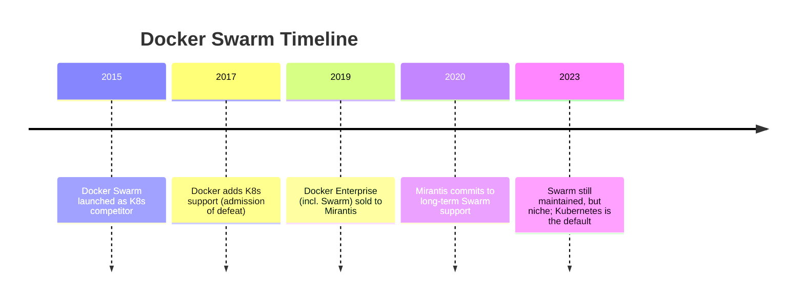
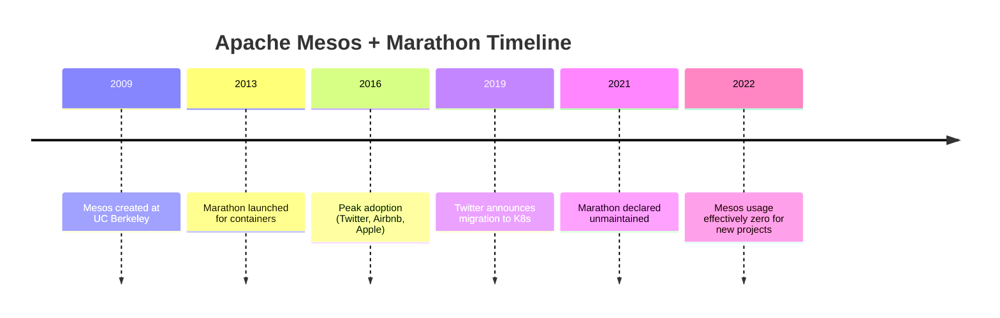
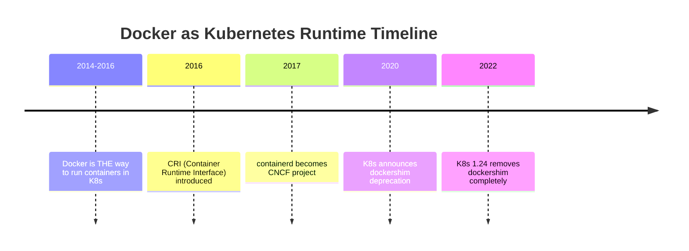
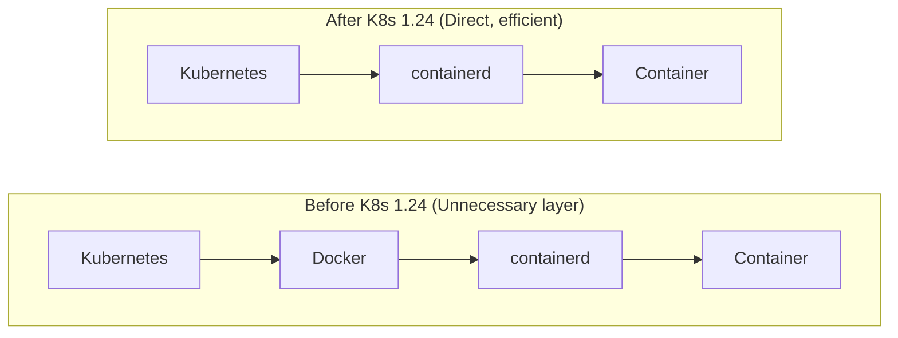
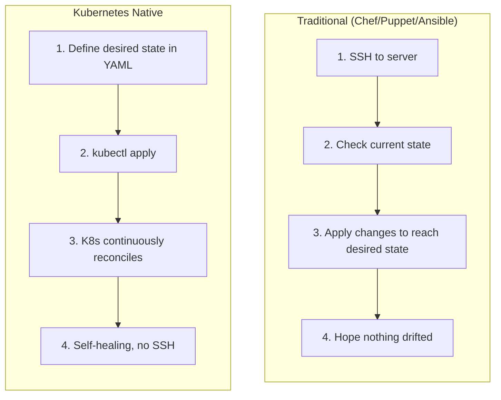
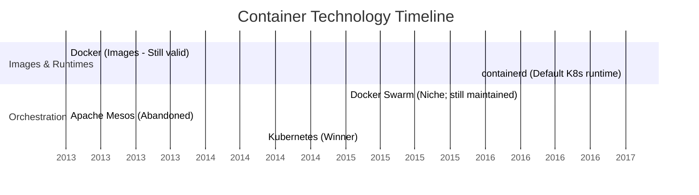

> **Складність**: `[QUICK]` - Розуміння того, що не потрібно вивчати.
>
> **Час на проходження**: 25-30 хвилин.
>
> **Передумови**: Модуль 1, Модуль 2, Модуль 3.

---


## Що ви зможете зробити

Після цього модуля ви зможете:

- **Оцінити** технології оркестрації контейнерів, використовуючи модель управління, екосистему, підтримку хмарних провайдерів та ознаки поширення.
- **Діагностувати**, чому production-розгортання на базі Docker Swarm, Apache Mesos, Cloud Foundry та Compose стали тупиковими шляхами.
- **Порівняти** Docker як робочий процес створення образів із Docker як runtime Kubernetes, який було видалено після dockershim.
- **Створити** план модернізації, який замінює тупикові інструменти на Kubernetes, containerd, Helm, Kustomize, GitOps та керовані кластери.


## Чому це важливо

Розглянемо гіпотетичний, але типовий випадок. Велика роздрібна мережа інвестує значні кошти — легко понад мільйон доларів у зарплати, консультантів та інженерний час — у створення платформи для контейнерів на базі Apache Mesos та Marathon. Команда наймає фахівців, пише власні робочі процеси розгортання та навчає інженерів застосунків мислити фреймворками, які на той час здавалися розумними, оскільки Twitter, Airbnb та Apple використовували Mesos у серйозних production-середовищах. За кілька років вибір платформи стає тягарем: наймати працівників важче, інтеграції від постачальників рідшають, внутрішні інструменти потребують постійного обслуговування, а план міграції вказує прямо на Kubernetes. Найболючіше не просто те, що інструмент втратив популярність; річ у тім, що роки операційних звичок доводиться ламати, тоді як бізнес усе ще очікує безперервних релізів.

Ця історія має значення, оскільки початківці часто вважають, що найкращий крок для кар'єри — це вивчення кожної технології, яка з'являється на старих архітектурних діаграмах. У cloud-native інженерії такий інстинкт обходиться дорого. Тупикова технологія все ще може мати документацію, доповіді на конференціях і робочі кластери, тому питання не в тому, чи розв'язувала вона коли-небудь проблеми. Питання в тому, чи залишається вона вдалим місцем для інвестицій часу на навчання, ризиків для production і уваги команди, коли Kubernetes 1.35 і навколишня екосистема стали стандартним словником платформи.

Цей модуль — це екскурсія кладовищем cloud-native, але його мета не полягає в насміханнях. Docker Swarm, Apache Mesos, ранній Cloud Foundry, Chef, Puppet, Ansible та Docker Compose — кожен із них розв'язував реальні проблеми для реальних команд. Ви вивчите, чому вони здали позиції, які частини залишаються корисними, і як оцінювати наступний інструмент, що претендує на заміну Kubernetes. Практична навичка полягає в судженні: після завершення ви повинні вміти помічати сигнали занепаду до того, як ваша команда побудує навколо них платформу, кар'єрний план або стратегію міграції.

## Почніть з ознак глухого кута

Технологія стає глухим кутом, коли її навчальна цінність, операційна цінність та цінність екосистеми втрачають узгодженість. Вона все ще може працювати. Вона все ще може мати відданих користувачів. Вона може навіть мати кілька добре оплачуваних вакансій, оскільки legacy-системи потребують догляду. Тривожним сигналом є те, що нові команди більше не обирають її для нової роботи, суміжні інструменти перестають інтегруватися з нею в першу чергу, а енергія спільноти переміщується кудись інде. Коли це трапляється, кожен місяць інвестицій купує менше майбутньої портативності.

Cloud-native глухі кути зазвичай об'єднують три сили. По-перше, абстракція перестає відповідати робочому навантаженню. По-друге, модель управління не здатна залучити конкурентів, хмарних провайдерів та незалежних постачальників. По-третє, екосистема навколо переможця стає настільки великою, що альтернативи мають бути кардинально кращими, щоб виправдати свою ізоляцію. Kubernetes переміг не тому, що був простим, а тому, що став спільною ціллю інтеграції для середовищ виконання, мереж, сховищ, політик, observability, безпеки та керованих хмарних сервісів.

Зупиніться та подумайте: якщо ваша команда знайде інструмент, який для одного вузького шляху розгортання є простішим за Kubernetes, що має бути правдою, перш ніж ви порекомендуєте його як п'ятирічну ставку для платформи? Відповідь має включати більше, ніж просто контрольні списки функцій. Вам знадобилося б надійне управління, здорова база контриб'юторів, підтримка від більш ніж одного хмарного провайдера, історія міграцій, модель безпеки та докази того, що абстракція інструменту все ще підходитиме, коли робочі навантаження стануть stateful, регульованими або глобально розподіленими.

Корисна ментальна модель — це карта міста. Інструмент може бути чудовою бічною вуличкою, але платформа потребує доріг, комунальних послуг, екстрених служб, ремонтних бригад і підприємств, які очікують на існування цієї адреси. Kubernetes — це не лише оркестратор; це система адрес, яку використовує значна частина сучасної інфраструктури. Глухі кути часто зазнавали невдачі, оскільки вони залишалися чудовими бічними вуличками, тоді як індустрія закінчувала будувати місто деінде.

Перш ніж розглядати окремі інструменти, розділіть чотири запитання. Технологія застаріла, чи застарів лише один патерн її використання? Чи концепція досі цінна, навіть якщо продукт занепав? Чи існує сучасна заміна з кращою узгодженістю з екосистемою? Ваша команда розв'язує production-проблему чи женеться за привабливим туторіалом? Ці запитання вбережуть вас від двох типових помилок початківців: повного відкидання Docker через видалення dockershim, або вивчення Docker Swarm через те, що він з'являється поруч із Compose у старих матеріалах Docker.

## Діагностика глухих кутів оркестрації

Оркестрація контейнерів — це сфера, де з'явилися найпомітніші глухі кути, оскільки індустрія не могла вічно підтримувати багато конкурентних control planes. Оркестрація — це не просто запуск контейнерів. Production-оркестратор планує роботу між вузлами, відстежує працездатність, розгортає нові версії, маршрутизує трафік, обробляє секрети, координує сховища, інтегрується з системами ідентифікації та надає API, які можуть розширювати інші інструменти. Коли організаціям стають потрібні ці можливості, платформа з найбільшою екосистемою стає безпечнішою, ніж платформа з найчистішим першим демо.

Docker Swarm є найпростішим прикладом, оскільки він був прив'язаний до компанії, яка зробила Docker відомим. Swarm здавався природним для команд, які вже використовували Docker локально: він використовував мову Docker, команди Docker і пропонував зручний шлях від однієї машини до кластера. Ця простота була його принадою, але вона також обмежувала простір для зростання екосистеми. Kubernetes був складнішим, проте він пропонував загальнішу модель API, сильніші точки розширення та нейтральну домівку, що полегшувало його підтримку хмарними провайдерами та постачальниками без посилення прямого конкурента.

**Що це було**: Нативне рішення Docker для оркестрації.

**Статус**: Більше не є основним вибором для нових проєктів. Режим Swarm досі вбудований у Docker Engine та Docker Desktop, а компанія Mirantis — яка придбала корпоративний бізнес Docker у 2019 році — продовжує його підтримувати та розвивати. Однак рушійна сила індустрії, інструментарій та найм консолідувалися навколо Kubernetes.



Урок Swarm не в тому, що інструменти, створені вендорами, автоматично є поганими. Урок у тому, що інфраструктурні платформи потребують довіри від організацій, які конкурують одна з одною. Коли єдиний вендор контролює дорожню карту, кожен інший вендор задається питанням, чи глибока інтеграція допомагає власнику платформи більше, ніж клієнту. Kubernetes уникнув цієї пастки, перейшовши під егіду CNCF і ставши нейтральною ціллю. Ця зміна в управлінні дала екосистемі місце для співпраці, водночас дозволяючи конкурувати у сфері керованих сервісів, мереж, сховищ та досвіду розробників.

Для того, хто навчається, рішення є очевидним. Не витрачайте серйозний час на вивчення концепцій Swarm, мереж Swarm, визначень сервісів Swarm або проєктування production-архітектури в режимі Swarm, якщо ви не підтримуєте вже наявну інфраструктуру Swarm. Docker Compose залишається корисним для локальної розробки, а Dockerfiles залишаються цінними для збирання образів, але Swarm не забезпечує того кар'єрного важеля або портативності для production, які надає Kubernetes. Якщо в туторіалі сказано "розгорніть у production за допомогою Swarm", ставтеся до цього як до історичного матеріалу, а не як до сучасного керівництва.

Apache Mesos та Marathon є більш тонким випадком, оскільки Mesos був технічно вражаючим. Mesos вийшов з Каліфорнійського університету в Берклі і був націлений на великомасштабне спільне використання ресурсів ще до того, як Kubernetes досяг домінування. Він пропонував дворівневу модель планування, де Mesos управляв ресурсами кластера, а фреймворки, такі як Marathon, вирішували, як запускати робочі навантаження. Це мало сенс для організацій, що запускали змішані робочі навантаження у великих масштабах, але це ускладнювало стандартизацію досвіду розробників та операторів. Kubernetes звузив інтерфейс, зробив API робочих навантажень доступнішим і дозволив екосистемі будуватися навколо Pod, Service, контролерів та декларативних маніфестів.

**Що це було**: Дворівневий планувальник ресурсів (Mesos) з оркестрацією контейнерів (Marathon).

**Статус**: Marathon закинуто. Mesos у режимі обслуговування.



Mesos показує, що технічно потужні системи можуть програвати, коли навколишня модель вимагає надто багато від звичайних команд. Дворівневе планування є елегантним, якщо у вас є платформені фахівці, які можуть міркувати про фреймворки, пропозиції ресурсів та власні планувальники. Більшість продуктових команд хотіли отримати узгоджений спосіб розгортання сервісів, підключення сховищ, відкриття ендпойнтів та отримання логів, не стаючи експертами з планування. Kubernetes досі має складність, але його складність створила спільний словник, який могли підкріплювати вендори, освітяни та ринки найму.

Cloud Foundry — це інший тип глухого кута, оскільки продукт не просто зник. Його початковою моделлю була суворо регламентована Platform-as-a-Service для stateless застосунків, побудованих за методологією дванадцяти факторів. Для правильного застосунку команда `cf push` була магічною: розробники відправляли код, платформа його збирала, маршрутизувала трафік, збирала логи та приховувала деталі інфраструктури. Ця висока абстракція стала слабкістю, коли командам знадобилися stateful системи, власні мережі, GPU, sidecars, service meshes та специфічні для навантажень оператори. Платформа приховувала інфраструктуру настільки добре, що просунуті команди не могли дістатися потрібних їм важелів керування.

**Що це було**: Суворо регламентована Platform-as-a-Service (PaaS), яка передувала Kubernetes і розроблялася переважно для stateless 12-факторних застосунків.

**Статус**: Змінила напрямок. Оригінальна архітектура Diego була визнана застарілою на користь запуску Cloud Foundry безпосередньо на Kubernetes.

Зупиніться та подумайте: якщо платформа ідеально обробляє маршрутизацію, логування та розгортання для stateless вебзастосунків, чому користувачі залишили б її заради чогось складнішого, на кшталт Kubernetes? Відповідь — control surface. Kubernetes відкриває низькорівневі примітиви, які можна компонувати в багато форм, тоді як PaaS відкриває чудовий шлях для вужчого класу робочих навантажень. Команди пішли, тому що їхні робочі навантаження переросли цей шлях, а не тому, що старий шлях ніколи не був корисним.

Практичний діагноз полягає в тому, щоб запитати, де абстракція ламається. Якщо ваше портфоліо застосунків — це лише stateless вебсервіси, PaaS може бути ефективною. Якщо ваша платформа має розміщувати бази даних, системи подій, пакетні завдання, пайплайни машинного навчання, власні контролери та рушії політик, Kubernetes надає вам спільну основу. Зрештою Cloud Foundry стала шаром, який може працювати на Kubernetes, оскільки індустрія обрала гнучкішу "інфраструктурну операційну систему" під спеціалізованим досвідом розробника.

Не вивчайте BOSH, Diego, архітектуру Mesos, конфігурацію Marathon або визначення сервісів Swarm як основні cloud-native кар'єрні навички, якщо поточний роботодавець не платить вам за їх підтримку. Вивчайте ідеї, які вони розкривають: оркестрація вимагає планування, управління працездатністю, контролю розгортання та довіри екосистеми. Ці ідеї переносяться. Старі, специфічні для продукту робочі процеси — здебільшого ні.


## Відділення образів Docker від середовища виконання Kubernetes

Історія з Docker викликає більше плутанини, ніж будь-який інший глухий кут, оскільки люди використовують слово "Docker" для позначення кількох різних речей. Docker може означати Dockerfile, Docker CLI, Docker Desktop, Docker Engine, формат образу Docker, Docker Hub або Docker як середовище виконання рівня вузла, що стоїть за Kubernetes. Kubernetes видалив лише шлях dockershim, який дозволяв kubelet спілкуватися з Docker Engine як із середовищем виконання. Це не видалило образи контейнерів OCI, Dockerfiles, локальні збірки образів або щоденний робочий процес розробників із пакування програмного забезпечення в контейнери.

**Що це було**: Оригінальне середовище виконання контейнерів для Kubernetes.

**Статус**: Видалено з Kubernetes у версії 1.24 (травень 2022 року).

Зупиніться та подумайте: якщо Docker був першим великим середовищем виконання контейнерів, чому спільнота Kubernetes створила CRI (Container Runtime Interface), замість того, щоб назавжди жорстко закодувати підтримку Docker? Стабільний інтерфейс дозволяє Kubernetes взаємодіяти із середовищами виконання, такими як containerd і CRI-O, не сприймаючи одну повноцінну платформу розробника як щось особливе. Цей інтерфейс зменшив зв'язаність, прибрав зайвий рівень і дозволив операторам вузлів використовувати легші середовища виконання, розроблені для оркестрування, а не для зручності роботи на десктопі.



Видалення dockershim є ідеальним прикладом оцінювання патерну використання замість того, щоб засуджувати весь інструмент. Docker як робочий процес створення образів усе ще варто знати, оскільки розробникам потрібні відтворювані збірки образів, локальні цикли тестування та зрозумілі Dockerfile. Docker як середовище виконання Kubernetes — це застаріла частина, оскільки тепер kubelet може напряму взаємодіяти з containerd або CRI-O через CRI. Старий шлях змушував Kubernetes викликати Docker Engine, який потім викликав containerd, який і створював контейнери. Сучасний шлях прибирає цей проміжний рівень.



Коли молодший інженер каже: "Kubernetes видалив Docker, тому ми повинні переписати кожен Dockerfile", ваша відповідь має бути спокійною та точною. Kubernetes запускає образи OCI. Docker створює OCI-сумісні образи. Середовище виконання вузла змінилося, але контракт образу — ні. У кластері Kubernetes 1.35 під kubelet ви повинні очікувати containerd або CRI-O, але ваш конвеєр збірки все ще може запускати `docker build`, BuildKit, Buildah, Kaniko або інший інструмент для збірки образів залежно від ваших обмежень щодо безпеки та платформи.

Ось звичка оператора, яку цей модуль очікує в подальших лабораторних роботах з Kubernetes. Використовуйте явні команди `kubectl` у спільних нотатках, інструкціях (runbooks) та прикладах для копіювання, щоб команда працювала в неінтерактивних оболонках і на машинах ваших колег. Багато інженерів використовують коротші персональні зручності оболонки в інтерактивному режимі, але виробнича документація повинна показувати повний бінарний файл, оскільки зрозумілість переважає економію натискань клавіш, коли хтось проводить налагодження під тиском.

```bash
kubectl get nodes
kubectl get pods --all-namespaces
```

Більш глибокий урок полягає в тому, що оцінювання технологій вимагає гігієни словникового запасу. Твердження "Docker мертвий" — хибне. "Шлях використання Docker Engine як середовища виконання Kubernetes зник після dockershim" — істинне. "Docker Compose — це погано" — хибне. "Docker Compose недостатньо як одно-вузлового виробничого оркестратора для багатосервісної системи, яка потребує самовідновлення та відмовостійкості" — істинне. Точна мова запобігає надмірному коригуванню з боку команд і відмові від корисних інструментів, водночас допомагаючи уникати ставок на застарілі платформи.

## Заміна мислення конфігурації серверів на декларативне платформене мислення

Chef, Puppet та Ansible належать до іншої операційної епохи. Вони керують серверами, підключаючись до машин, перевіряючи стан і застосовуючи впорядковані зміни, доки машина не набуде потрібного вигляду. Ця модель працює для довговічних серверів, де адміністратори володіють операційною системою і планують виправляти, змінювати та лагодити ті самі хости з часом. Kubernetes вимагає іншого мислення. Ви декларуєте бажаний стан в API, контролери безперервно узгоджують цей стан, а окремі pod'и є одноразовими результатами циклу керування, а не дорогоцінними машинами, які потрібно ремонтувати вручну.

**Що це було**: Інструменти керування конфігурацією для управління серверами.

**Статус**: Неправильна парадигма для робочих навантажень Kubernetes.

| Традиційне управління конфігурацією | Нативний Kubernetes |
|---------------|-------------------|
| Змінні сервери | Незмінні контейнери |
| SSH на сервери | Зміни через API |
| Конвергенція до стану | Декларування бажаного стану |
| Агент на кожному сервері | Агенти не потрібні |
| Імперативні скрипти | Декларативний YAML |

Ця таблиця не стверджує, що Ansible, Chef і Puppet марні. Вони все ще зустрічаються в традиційній інфраструктурі, автоматизації комплаєнсу та робочих процесах ініціалізації кластерів. Помилка полягає у їх використанні для прямого керування об'єктами робочих навантажень Kubernetes, ніби pod'и — це сервери. Якщо Ansible створює pod, чекає на нього, а потім імперативно редагує, Ansible конкурує з циклом узгодження Kubernetes. Більш нативний підхід полягає в зберіганні маніфестів або значень Helm у системі контролю версій, дозволяючи GitOps застосовувати їх, а контролерам — зводити кластер до задекларованого стану.



Цей антипатерн легко пропустити, оскільки Ansible має модулі Kubernetes і може викликати API. Наявність модуля не означає, що інструмент повинен володіти операційною моделлю. Якщо Ansible розгортає керований кластер, встановлює базові контролери або запускає оператор GitOps, він може бути корисним. Якщо ж Ansible стає щоденним джерелом істини для розгортання Deployment, Service, ConfigMap та Secret, команда фактично відтворила імперативне керування серверами поверх декларативної системи.

Який підхід ви б обрали тут і чому: playbook, який підключається по SSH до кожного вузла і перезапускає контейнери на місці, чи pull request у Git, який змінює тег образу Deployment і дозволяє Kubernetes розгортати pod'и через rollout з перевіркою готовності? Другий варіант узгоджується з Kubernetes, оскільки розгортання представлене як бажаний стан, записане в системі контролю версій і виконується площиною управління. Перший варіант залежить від процедурного таймінгу та прихованого стану хоста, що стає крихким у міру зростання кластера.

Docker Compose для виробничого середовища — це та сама невідповідність парадигми, але в іншому вигляді. Compose чудово підходить для визначення локального багатоконтейнерного середовища на одній машині. Він дозволяє розробнику підняти API, базу даних, кеш та воркер, не вивчаючи всю об'єктну модель Kubernetes у перший же день. Проблема виникає, коли команди переносять цю локальну зручність у виробниче середовище і очікують, що єдиний хост поводитиметься як розподілена площина управління.

**Що це таке**: Інструмент для визначення та запуску багатоконтейнерних застосунків Docker за допомогою простого файлу YAML.

**Статус**: Винятковий для локальної розробки, але антипатерн для розгортання у виробничому середовищі.

Зупиніться та подумайте: якщо `docker-compose up` піднімає весь ваш стек локально, чому небезпечно виконувати ту ж саму команду на виробничому сервері? Ризик полягає не в тому, що формат файлу потворний. Ризик полягає в тому, що одновузловому процесу бракує кластерного планування, багатовузлової відмовостійкості, нативного контролю розгортання, політик на основі API та поведінки самовідновлення, яких з часом вимагають користувачі виробничих систем.

Розглянемо типовий `docker-compose.yml`:

```yaml
version: '3'
services:
  api:
    image: myapi:v1
    ports:
      - "8080:8080"
  db:
    image: postgres:13
    volumes:
      - db-data:/var/lib/postgresql/data
```

Якщо вузол, на якому розміщено цей стек Compose, виходить з ладу, застосунок падає. Немає планувальника Kubernetes, щоб розмістити замінний pod на здоровому вузлі, немає контролера для порівняння бажаних реплік із фактичними, і немає нативного для кластера об'єкта Service для підтримки стабільного виявлення під час переміщення робочих навантажень. Ви можете обгорнути Compose скриптами, юнітами systemd та моніторингом, але кожна така обгортка відбудовує невелику частину оркестратора, якого ви намагалися уникнути. У певний момент простота перетворюється на випадкову складність.

Compose також не має виробничих стандартів для поетапних оновлень, секретів, політик і управління трафіком. Локальний розробник може толерувати час простою, поки контейнери перестворюються. Сервіс, орієнтований на користувача, не може. Локальний файл `.env` може згодитися для ноутбука. Регульоване виробниче середовище потребує RBAC, ротації секретів, шифрування у стані спокою, журналів аудиту та чітких меж власності. Локального мапінгу портів достатньо для тестування. Виробничій платформі можуть знадобитися політики Ingress, взаємний TLS, канареєчна маршрутизація та спостережливість, яка слідує за робочими навантаженнями між вузлами.

Інструменти конвертації, такі як Kompose, можуть допомогти людям побачити приблизні еквіваленти в Kubernetes, але переклад один до одного рідко є хорошою фінальною архітектурою. Сервіс Compose не означає автоматично виробничий Deployment із перевірками готовності, запитами ресурсів, PodDisruptionBudgets, мережевими політиками, сервісними акаунтами та специфічною для середовища конфігурацією. Завдання модернізації полягає в перепроєктуванні з використанням примітивів Kubernetes, а не в механічному перетворенні синтаксису з надією, що відсутні експлуатаційні вимоги з'являться самі собою.

## Оцінювання технологічних ставок за допомогою сигналів управління, екосистеми та хмарних провайдерів

Патерн глухого кута стає зрозумілішим, якщо порівняти те, що програло, з тим, що залишається актуальним. Kubernetes виграв не кожну технічну суперечку. Він виграв суперечку щодо координації. Щойно хмарні провайдери, розробники інструментів, викладачі, продукти з безпеки, драйвери сховищ, сервісні сітки і конвеєри найму почали розглядати Kubernetes як спільну ціль, альтернативам довелося пропонувати величезну цінність, щоб подолати ізоляцію. Більшість з них цього не зробили.

Поширені патерни в технологічних глухих кутах включають контроль з боку одного постачальника, складність без пропорційної вигоди, неправильний рівень абстракції та поразку від впливу екосистеми. Swarm постраждав, оскільки Docker контролював центр, тоді як Kubernetes перейшов до нейтрального управління. Mesos постраждав, оскільки його потужність супроводжувалася складністю планувальника, яка не була потрібна більшості продуктових команд. Chef і Puppet постраждали в управлінні cloud-native робочими навантаженнями, оскільки абстракція сервера перестала відповідати незмінним контейнерам. Compose страждає у виробництві, оскільки зручність однієї локальної машини не може замінити розподіленого узгодження.

| Категорія | Поточні/Актуальні |
|----------|-----------------|
| Оркестрування | Kubernetes |
| Середовище виконання | containerd, CRI-O |
| Образи | Docker/Buildah для збірки |
| Конфігурація | Helm, Kustomize, нативний YAML |
| GitOps | ArgoCD, Flux |
| Сервісна сітка (Service Mesh) | Istio, Linkerd, Cilium |
| Моніторинг | Prometheus, Grafana |
| Логування | Fluentd, Loki |

Ця таблиця навмисно не є списком покупок для запам'ятовування. Це карта того, де зараз зосереджена енергія екосистеми. Команда платформи, яка проєктує для Kubernetes 1.35, повинна очікувати Kubernetes для оркестрування, containerd або CRI-O як середовище виконання, образи OCI, зібрані за допомогою Docker або інструментів сімейства Buildah, Helm або Kustomize для пакування та оверлеїв, GitOps для безперервного узгодження та спостережливість у стилі Prometheus. Конкретний продукт може відрізнятися, але напрямок руху не повинен дивувати нікого, хто проходить співбесіду на сучасні інфраструктурні посади.



Використовуйте просту процедуру оцінювання щоразу, коли з'являється новий інструмент для розгортання. Запитайте, яку проблему він вирішує, з якою недостатньо добре справляється Kubernetes. Перевірте, чи контролюється він одним постачальником, чи управляється так, щоб конкуренти могли йому довіряти. Подивіться на підтримку хмарних провайдерів, а не лише на зірочки на GitHub. Прочитайте історію релізів та трекер проблем, щоб переконатися, чи реагують мейнтейнери на проблеми безпеки та сумісності. Потім поставте жорстке запитання: якщо ця компанія зникне, чи зможе ваша команда й надалі керувати системою, наймати для неї людей і мігрувати з неї?

Який результат ви очікуєте від цього оцінювання перед запуском пілотного проєкту? Здоровий результат повинен називати експлуатаційну проблему, ризик, що зменшується, залежності в екосистемі, стратегію виходу та шлях сумісності з Kubernetes, а не просто констатувати "демо було швидшим". Якщо пропонований інструмент замінює всю платформу, планка доказів має бути високою. Якщо ж він доповнює Kubernetes, як-от контролер, механізм політик або помічник у пакуванні, ризик впровадження менший, але він усе ще реальний.

Корисною відмінністю є заміна на противагу шару. Cloud Foundry, який стає шаром поверх Kubernetes, відрізняється від Cloud Foundry, який замінює Kubernetes. Argo CD, Flux, Helm, Kustomize, Istio, Cilium та Prometheus досягають успіху, оскільки вони розширюють або працюють у межах екосистеми Kubernetes, замість того, щоб просити індустрію відмовитися від неї. Заміна змушена боротися з усією картою міста. Шар може використовувати дороги, які вже існують.


## Практичний приклад: Оцінка Project Phoenix

Уявіть, що Project Phoenix — це SaaS-продукт середнього розміру, який має API, парк воркерів, базу даних PostgreSQL, кеш Redis та невеликий внутрішній дашборд. Продукційне середовище працює на трьох віртуальних машинах під управлінням Puppet. На кожному хості встановлено Docker, Swarm планує контейнери, а сторонній скрипт конвертації перетворює локальний файл Compose на визначення продукційних сервісів. У цьому стеку немає нічого вигаданого: багато команд будували подібні системи, оскільки кожен крок здавався логічним, якщо розглядати його окремо.

Першим діагностичним кроком є відокремлення ризиків інцидентів від бажання модернізації. Кластер Swarm може запускати контейнери й сьогодні, тому заяви «Swarm застарів» недостатньо для інженерного рішення. Значно сильнішим є операційний аргумент: якщо вузол виходить з ладу, якщо патч безпеки вимагає скоординованого розгортання, якщо команді потрібна інтеграція з хмарним балансувальником навантаження або якщо новий інженер має зневаджувати продукційне середовище, організація отримає менше допомоги від сучасної екосистеми, ніж це було б з Kubernetes. Вік інструменту має значення, оскільки він вказує на ймовірні труднощі з підтримкою.

Далі варто уважно розглянути роль Puppet. Puppet усе ще може бути корисним для ініціалізації хостів, встановлення пакетів або забезпечення базової відповідності вимогам (baseline compliance). Глухим кутом є не сам факт існування Puppet, а те, що він виступає власником поточного стану застосунку. Якщо бажана кількість реплік API зберігається в маніфесті Puppet, у визначенні сервісу Swarm та в сконвертованому файлі Compose, команда отримує три джерела істини. Під час збою ніхто не зможе впевнено сказати, який цикл управління має перемогти.

Файл Compose заслуговує на такий самий підхід. Локальний файл Compose — це продуктивний контракт для розробки, оскільки він дає кожному інженеру відтворюваний спосіб запуску залежностей. Якщо повністю від нього відмовитися, це може ускладнити адаптацію новачків без жодної користі. Продукційна помилка полягає у сприйнятті цього локального контракту як самої архітектури. План модернізації має зберегти зручність для розробників, якщо вона залишається корисною, а потім спроєктувати продукційне середовище окремо за допомогою Deployment, Service, вибору постійного сховища, проб (probes) та конфігурації для конкретного середовища.

Хороша службова записка з оцінкою описує сценарії збоїв конкретною мовою. «Swarm застарів» — це слабше твердження, ніж «Swarm обмежує наш доступ до керованих хмарних інтеграцій, сучасного ринку праці та нативних інструментів безпеки Kubernetes». «Puppet — це погано» звучить гірше, ніж «Puppet не повинен відновлювати Pod'и, оскільки контролери Kubernetes уже керують бажаним станом та поведінкою під час розгортання». «Compose — не для продукції» є слабшим аргументом, ніж «Compose не дає нам багато-вузлового планувальника, нативних меж сервісних акаунтів та контролера, який замінює репліки, що вийшли з ладу, на різних хостах».

Тепер зіставте заміни за відповідальністю, а не за брендом. Відповідальністю Swarm є оркестрація в продукції, тому його заміною є Kubernetes. Стара відповідальність середовища виконання Docker Engine під управлінням kubelet тепер покладається на containerd або CRI-O, але відповідальність Docker за збірку може залишитися в робочому процесі розробника або CI. Відповідальність Puppet за управління робочими навантаженнями переходить до GitOps, Helm, Kustomize та контролерів Kubernetes, тоді як Puppet може залишитися для задач на рівні хоста поза Kubernetes, якщо команді все ще потрібно управляти хостами. Відповідальність Compose за локальну розробку може залишитися локальною, тоді як проєктування продукційного середовища переходить до маніфестів Kubernetes.

Наступне рішення — чи варто управляти Kubernetes самостійно, чи використати керований сервіс. Для більшості команд керований Kubernetes є консервативним вибором, оскільки control plane — це зазвичай не те місце, де команди розробки створюють бізнес-цінність. Запуск Kubernetes «важким шляхом» (the hard way) може бути повчальним у лабораторії, але продукційні control planes вимагають оновлень, резервних копій, сертифікатів, доступності API, конфігурації аудиту та реагування на інциденти безпеки. Якщо в Project Phoenix немає платформної команди, використання EKS, GKE, AKS або іншого керованого рішення зменшить кількість підводних каменів під час міграції.

Міграцію слід починати з некритичного сервісу, а не з бази даних. Оберіть внутрішній дашборд або stateless-воркер із помірним трафіком та зрозумілою поведінкою відкату (rollback). Запакуйте його як образ OCI, визначте Deployment із запитами ресурсів та пробами готовності (readiness probes), відкрийте доступ до нього через Service та керуйте маніфестом через Git-рев'ю. Мета першої міграції — не безпосереднє масштабування. Мета — навчити організацію новому операційному ритму: бажаний стан у Git, узгодження (reconciliation) в кластері та спостережуваний статус розгортання.

Після того, як один stateless-сервіс запрацює, команда має створити платформений мінімум перед перенесенням основного API. Цей мінімум включає простори імен (namespaces), RBAC, управління секретами, ingress, логування, метрики, сканування образів, базові політики ресурсів та контролер GitOps, якщо організація обирає таку модель. Якщо пропустити ці елементи, Kubernetes здаватиметься оманливо простим під час пілотного запуску та болісно незавершеним під час першого серйозного інциденту. Безперспективні міграції часто провалюються через те, що команди замінюють планувальник, але відкладають впровадження операційної моделі.

Сервіси даних потребують окремої розмови. Перенесення PostgreSQL з тому Compose до постійного сховища Kubernetes може бути можливим, але це, мабуть, не найкращий перший крок. Керована база даних часто забезпечує надійніше резервне копіювання, перемикання при збоях (failover), патчинг та операційну підтримку, ніж самостійно керована база даних усередині кластера. Аналіз безперспективних технологій не вимагає запуску кожного робочого навантаження в Kubernetes. Він вимагає, щоб кожне навантаження мало своє цілеспрямоване середовище із чітким розумінням того, хто є його власником, як відбувається відновлення та які є очікування від підтримки.

Огляд безпеки — це те місце, де старий стек зазвичай виявляє приховані витрати. Сконвертований файл Compose може спиратися на надто широкі змінні середовища, змонтовані з хоста шляхи та неявну мережеву довіру. Kubernetes надає кращі примітиви, але лише за умови, що команда їх використовує: сервісні акаунти, межі просторів імен, мережеві політики, обробка секретів, admission control та ідентифікація робочих навантажень (workload identity), якщо хмара це підтримує. Поспішна міграція, яка ігнорує ці механізми контролю, просто переносить слабкі припущення у YAML.

Спостережуваність (observability) також змінює форму. У світі Swarm та Compose інженери можуть підключатися по SSH до вузла, запускати команди контейнера та локально переглядати логи. У Kubernetes робочі навантаження переміщуються, репліки змінюються, а вузол не є правильним користувацьким інтерфейсом для зневадження застосунків. Project Phoenix потребує централізованих логів, метрик, подій, алертів та чіткого плану дій (playbook) на випадок інцидентів. Це ще одна причина, чому використання Compose у продукції є глухим кутом: він заохочує вузло-орієнтований пошук несправностей у світі, де одиницею аналізу має бути робоче навантаження.

Навчання має бути зосереджене на концепціях, а не на інструментах. Інженерам потрібно зрозуміти, чим керує Deployment, як Service забезпечує стабільне виявлення, чому readiness відрізняється від liveness, як запити ресурсів впливають на планування і як розгортання взаємодіє з перевірками стану (health checks). Helm та Kustomize корисні лише після того, як ці примітиви стають зрозумілими. GitOps корисний лише тоді, коли команда погоджується, що Git є джерелом бажаного стану. Інакше нові інструменти стають просто декорацією для старих звичок.

Команда також повинна спланувати співіснування платформ. Міграція рідко переносить кожен сервіс за одні вихідні, а спроба форсувати такий графік створює ризики, яких можна уникнути. Певний час Swarm та Kubernetes можуть існувати одночасно, а маршрутизація, DNS, секрети та спостережуваність перетинатимуть межу між ними. Таке співіснування не є провалом, якщо воно має дату виведення з експлуатації, визначених власників та чіткі критерії того, коли нові сервіси перестануть розгортатися на старій платформі. Глухі кути стають небезпечними тоді, коли «тимчасове» стає постійним без перегляду.

Метрики успіху мають бути операційними, а не косметичними. Рахуйте скорочення часу відновлення, успішні rolling updates без помітного для користувача простою, меншу кількість ручних відновлень хостів, чіткіші аудиторські сліди та кількість сервісів, які керуються через декларативне рев'ю. Міграція, яка лише змінює назву оркестратора в презентації, не вирішує проблеми глухого кута. Міграція, яка змінює те, як команда мислить про бажаний стан, збої та підтримку, створює довготривалу цінність.

Кінцева рекомендація для Project Phoenix має виглядати як план модернізації з управлінням ризиками, а не як звинувачення минулого. Старий стек був розумним накопиченням рішень, прийнятих в умовах попередніх обмежень. Новий стек має зберегти корисні частини, такі як збірки образів OCI та зручність локального Compose, одночасно відмовляючись від продукційних залежностей, які ізолюють команду від поточної екосистеми. Такий тон є важливим, оскільки міграції — це настільки ж соціальні системи, наскільки й технічні.

На той момент, коли ви зможете написати таку оцінку, ви вже не будете запам'ятовувати, які інструменти «мертві». Ви практикуватимете платформне судження. Ви зможете діагностувати, чому продукційні розгортання в Docker Swarm, Mesos, Cloud Foundry та Compose стали ризикованими, порівняти збережену роль образів Docker з його застарілою роллю середовища виконання, оцінити сигнали управління та екосистеми, а також спроєктувати план модернізації, який використовує Kubernetes, не сприймаючи його як магічне слово.

## Патерни та антипатерни

Патерни допомагають вам повторювати правильні рішення, що лежать в основі поточної екосистеми, тоді як антипатерни допомагають виявити, коли старе мислення проникає в нові платформи. Ставтеся до них як до операційних звичок, а не як до дрібниць. Команда, яка може пояснити, чому інструмент відповідає моделі платформи, має менше шансів піддатися впливу яскравого демо або ностальгії за робочим процесом, який працював в іншу епоху.

| Патерн | Коли використовувати | Чому це працює |
|---------|----------------|--------------|
| Надавати перевагу нейтральному управлінню інфраструктурою | При виборі основної оркестрації, середовища виконання, мережі або рівнів політик | Конкуренти, вендори та хмарні провайдери охочіше створюють інтеграції, коли жодна окрема компанія не контролює ядро. |
| Відокремлювати концепції від продуктів | При оцінці Docker, Compose, Cloud Foundry або будь-якого старішого інструменту | Ви зберігаєте корисні ідеї, такі як збірки образів і робочі процеси розробників, не успадковуючи застарілі продукційні патерни. |
| Проєктувати для декларативного узгодження (reconciliation) | При управлінні робочими навантаженнями, політиками та конфігурацією Kubernetes | Бажаний стан в API дає контролерам стабільний контракт для відновлення, розгортання, аудиту та автоматизації. |
| Зберігати стратегію виходу | При пілотному запуску будь-якого нового компонента платформи | Шляхи міграції, право власності на дані та відкриті стандарти знижують ціну помилки. |

Найсильнішим патерном є збереження переносних концепцій з одночасною відмовою від застарілих control planes. Ви все ще повинні вивчати образи контейнерів, перевірки стану (health checks), виявлення сервісів (service discovery), стратегію розгортання, ізоляцію ресурсів та декларативну конфігурацію. Ці ідеї є важливими незалежно від інструментів. Не варто витрачати дефіцитний час новачка на заучування синтаксису сервісів Swarm, поведінки фреймворків Mesos, внутрішньої будови Diego або продукційних трюків Compose, якщо цього не вимагає конкретна роль з підтримки старих систем.

| Антипатерн | Що йде не так | Краща альтернатива |
|--------------|-----------------|--------------------|
| Вибір оркестратора від одного вендора для базової роботи платформи | Підтримка екосистеми звужується, коли конкуренти уникають посилення позицій власника | Використовуйте Kubernetes або інший нейтрально керований стандарт із широкою підтримкою провайдерів. |
| Пряма трансляція локальних файлів Compose у продукцію | Відсутність проб, політик, планування, контролю за розгортанням і меж секретів залишається прихованою | Перепроєктуйте робоче навантаження, використовуючи об'єкти Kubernetes, Helm, Kustomize та рев'ю через GitOps. |
| Управління Pod'ами як змінними серверами | Імперативні кроки з відновлення конфліктують із контролерами та створюють дрейф конфігурації | Декларуйте бажаний стан через API Kubernetes і дозвольте узгодженню (reconciliation) виконати роботу. |
| Ставлення до застарілої експертизи як до такої, що має майбутнє | Ринки найму та інтеграції йдуть уперед, тоді як тягар обслуговування зростає | Перетворіть застарілі знання на переносні концепції та сучасні платформені практики. |

Ці патерни також пояснюють, чому сам Kubernetes не слід сприймати як щось недоторканне назавжди. Майбутня платформа могла б витіснити його, якби вона вирішувала реальні проблеми, пропонувала надійне управління, зберігала сумісність або шляхи міграції, залучала підтримку хмарних провайдерів та створювала екосистему, достатньо велику для виправдання переходу. Поки такі сигнали відсутні, заяви «простіше, ніж Kubernetes» недостатньо. Простіше для першого дня може стати набагато складнішим для п'ятого року.

## Фреймворк прийняття рішень

Використовуйте цей фреймворк, коли ваша команда розглядає питання про те, чи варто вивчати, впроваджувати, підтримувати або виводити з експлуатації хмарно-нативну технологію. Мета полягає не в тому, щоб отримати ідеальну оцінку. Мета — перевести розмову з рівня інтуїтивних відчуттів (vibes) у площину операційних доказів. Якщо інструмент є основною інфраструктурою, слабка відповідь у будь-якій категорії має уповільнити його впровадження, оскільки базові платформи дорого замінювати після того, як команди сформують навколо них свої звички.

| Запитання | Зелений сигнал | Червоний сигнал | Рекомендація щодо рішення |
|----------|--------------|------------|-------------------|
| Яку проблему це вирішує? | Очевидний операційний біль із вимірним впливом | Переважно новизна, естетичні вподобання або зручність для туторіалів | Проводьте пілотний запуск лише тоді, коли проблема реальна і названа. |
| Хто цим керує? | Нейтральний фонд (foundation), мейнтейнери з різних компаній, відкритий roadmap | Один стартап контролює roadmap та торгові марки | Уникайте базової залежності, якщо шлях виходу (exit path) не є надійним. |
| Хто з цим інтегрується? | Великі хмарні провайдери, вендори безпеки, інструменти спостережуваності, постачальники сховищ | Інтеграції — це переважно власні продукти (first-party) або скрипти спільноти | Надавайте перевагу стандартам екосистеми для продукційних платформ. |
| Що станеться у випадку збою? | Дані та робочі навантаження можуть мігрувати через відкриті інтерфейси | Міграція вимагає переписування платформених звичок та інструментів | Тримайте радіус ураження (blast radius) малим або залишайтеся з поточними стандартами. |
| Чи узгоджується це з Kubernetes? | Розширює, автоматизує або захищає примітиви Kubernetes | Вимагає заміни кластерної моделі без вагомих доказів | Ставтеся до заяв про повну заміну як до архітектурних рішень із високим ризиком. |

Для новачка найпростіше правило звучить так: вивчіть домінантний стандарт достатньо глибоко, щоб зрозуміти, чому альтернативи є привабливими, а потім оцінюйте їх з цієї позиції. Якщо ви ніколи не працювали з Deployment, Service, ConfigMap, Secret, Ingress та базовим розгортанням, ви не зможете справедливо оцінити інструмент, який претендує на їхню заміну. Можливо, ви просто реагуєте на біль новачка, а не на реальний недолік платформи.

Для робочої команди фреймворк прийняття рішень має закінчуватися однією з чотирьох дій. Впроваджувати (Adopt), коли інструмент вирішує реальну проблему, узгоджується з екосистемою та має надійну модель підтримки. Додавати як шар (Layer), коли він додає зручність для розробників або політики поверх Kubernetes, не замінюючи ядро. Ізолювати (Contain), коли застарілу систему потрібно підтримувати, але вона не повинна поширюватися на нові сервіси. Виводити з експлуатації (Retire), коли інструмент створює ризики при наймі, сповільнює міграцію або зумовлює операційну вразливість, що перевищує цінність, яку він досі надає.


## Чи знали ви?

- **Mesos забезпечував роботу великих production-систем** у таких компаніях, як Twitter та Airbnb, ще до того, як Kubernetes став загальним стандартом для нових контейнерних платформ.
- **Docker Engine не був форматом образів контейнерів**, який вилучили з Kubernetes; у Kubernetes 1.24 було вилучено dockershim, тоді як OCI-образи та Dockerfiles залишилися придатними для використання.
- **Kubernetes розвивався швидко, оскільки численні конкуренти могли співпрацювати** завдяки управлінню CNCF, що спростило хмарним провайдерам і вендорам підтримку єдиної поверхні API.
- **Chef, Puppet та Ansible не є мертвими технологіями**; вони просто є невдалим вибором за замовчуванням для управління робочими навантаженнями Kubernetes, які повинні контролюватися за допомогою декларативних API.

## Типові помилки

| Помилка | Чому це трапляється | Як це виправити |
|---------|----------------|---------------|
| **Вивчення Docker Swarm як нової навички оркестрації** | Старі навчальні посібники з Docker створюють враження, що Swarm є природним наступним кроком після Compose. | Пропускайте посібники зі Swarm, якщо ви не підтримуєте наявний кластер Swarm; зосередьтеся на оркестрації Kubernetes. |
| **Використання Docker Compose у production** | Локальний робочий процес розробки здається простим, тому команди припускають, що одного великого сервера достатньо. | Використовуйте Compose лише для локальної розробки; для live-сервісів використовуйте Kubernetes, керовані serverless-рішення або інший production-оркестратор. |
| **Застосування підходів Chef, Puppet або Ansible до Pod-ів** | Системні адміністратори звикли до змінних машин та процедурного відновлення. | Переходьте на незмінні контейнери, декларативний YAML, GitOps та цикл узгодження Kubernetes. |
| **Ігнорування керованих сервісів Kubernetes** | Команди плутають цінність навчання з відповідальністю за production і намагаються керувати control plane занадто рано. | Використовуйте EKS, GKE, AKS або інший керований сервіс, якщо у вас немає спеціалізованої платформної команди. |
| **Переклад Compose у Kubernetes один до одного** | Інструменти конвертації створюють враження, що міграція синтаксису еквівалентна міграції архітектури. | Створюйте маніфести Kubernetes усвідомлено, з пробами, ресурсами, RBAC, межами конфігурації та стратегією розгортання. |
| **Гонитва за покинутими або ізольованими проектами** | Ажіотаж, старі кейси або вражаючі демо приховують слабкі сигнали щодо підтримки та управління. | Перед впровадженням перевіряйте статус у foundation, частоту релізів, різноманітність мейнтейнерів, підтримку хмарних провайдерів та стан вирішення issue. |
| **Припущення, що Docker мертвий** | Вилучення dockershim плутають із вилученням Dockerfiles та OCI-образів. | Продовжуйте вивчати збирання образів; застарів лише шлях використання Docker Engine як середовища виконання Kubernetes. |

## Контрольні запитання

<details>
<summary>1. Ваш стартап хоче запускати production-мікросервіси за допомогою Docker Compose на одній великій віртуальній машині, оскільки це працює на ноутбуках. Як ви повинні діагностувати ризик?</summary>

Ризик полягає не в тому, що Compose марний; справа в тому, що Compose не забезпечує розподіленого планування, перемикання вузлів у разі збою, кластерних сервісів або циклу узгодження. Один хост стає єдиною точкою відмови, а перестворення контейнерів під час оновлень може спричинити простій, якщо команда не побудує навколо цього додаткові механізми. Вам слід порекомендувати залишити Compose для локальної розробки, водночас проектуючи production на базі Kubernetes або керованої платформи, яка бере на себе перевірку працездатності, розгортання та відмовостійкість.
</details>

<details>
<summary>2. Рекрутер пропонує високооплачуваний контракт на адміністрування Apache Mesos та Marathon. Як слід оцінювати такий кар'єрний компроміс?</summary>

Робота із застарілими технологіями (legacy) може бути раціональною, коли оплата та обсяг робіт чітко визначені, проте Mesos та Marathon є слабкими довгостроковими інвестиціями у вивчення нових платформних навичок. Екосистема змістилася в бік Kubernetes, і знання, специфічні для Marathon, не переносяться так само легко, як ширші концепції планування, надійності та міграції. Якщо ви приймаєте цю роль, ставтеся до неї як до підтримки legacy і свідомо конвертуйте цей досвід у кейси про міграцію на Kubernetes, платформні ризики та операційне проектування.
</details>

<details>
<summary>3. Під час оновлення Kubernetes до версії 1.35 молодший інженер каже, що всі Dockerfiles потрібно переписати, оскільки Kubernetes вилучив Docker. Що ви поясните?</summary>

Вам слід порівняти Docker як робочий процес збирання образів і Docker як середовище виконання Kubernetes. У версії 1.24 Kubernetes вилучив dockershim, що поклало край особливому шляху, коли kubelet використовував Docker Engine як середовище виконання на вузлі, але OCI-образи, зібрані з Dockerfiles, і надалі працюють через containerd або CRI-O. Конвеєр збирання може залишитися незмінним, тоді як середовище виконання на вузлі змінюється, тому план міграції повинен зосередитися на сумісності середовища виконання та операційному тестуванні, а не на непотрібному переписуванні образів застосунків.
</details>

<details>
<summary>4. Старший адміністратор хоче, щоб Ansible безпосередньо створював і відновлював Pod-и, оскільки це працювало для віртуальних машин. Чому це антипатерн?</summary>

Ansible є процедурним інструментом, тоді як управління робочими навантаженнями Kubernetes є декларативним і керується контролерами. Якщо playbook крок за кроком керує відновленням Pod-а, він конкурує з циклом узгодження і може створити розбіжність між тим, що вказано в Git, тим, що зберігає API, і тим, що фактично працює в кластері. Кращий план — керувати маніфестами, значеннями Helm або оверлеями Kustomize через code review та GitOps, а потім дозволити контролерам Kubernetes здійснювати розгортання та самовідновлення.
</details>

<details>
<summary>5. Ваша команда знаходить новий оркестратор від одного стартапу, який не має нейтрального управління і майже не підтримується хмарними провайдерами. Який сигнал щодо впровадження турбує вас найбільше?</summary>

Сигнали щодо управління та екосистеми викликають найбільше занепокоєння, оскільки базова інфраструктура потребує широкої довіри. Якщо одна компанія контролює roadmap, у конкурентів і хмарних провайдерів слабкіші стимули для глибокої інтеграції, і ваша команда може успадкувати прив'язку до постачальника (vendor lock-in), якщо компанія змінить напрямок або зазнає краху. Невеликий пілотний проект усе ще може бути прийнятним для ізольованої проблеми, але заміна Kubernetes вимагатиме значно вагоміших доказів, надійної стратегії виходу та підтвердження того, що екосистема здатна підтримувати платформу.
</details>

<details>
<summary>6. Ваша компанія успішно використовує Cloud Foundry для stateless веб-застосунків, але згодом виникає потреба у stateful конвеєрах даних із графічними процесорами (GPU) та кастомною мережею. Чому Kubernetes може підійти краще?</summary>

Початкова цінність Cloud Foundry полягала у високорівневій абстракції для розробників, орієнтованій на вужчий клас застосунків. Stateful-системи, спеціалізоване обладнання, кастомне планування та складні мережі вимагають більшого контролю над інфраструктурними примітивами, ніж могла запропонувати оригінальна модель PaaS. З Kubernetes складніше на початку, але його низькорівневий API, контролери, модель зберігання даних та розширюваність роблять його кращою основою для різноманітних робочих навантажень, які переростають чистий робочий процес `cf push`.
</details>

<details>
<summary>7. Пропозиція щодо міграції механічно конвертує великий файл Compose у Kubernetes YAML і називає платформу модернізованою. Що ви повинні поставити під сумнів?</summary>

Вам слід поставити під сумнів припущення, що перетворення синтаксису дорівнює проектуванню архітектури. Production-навантаженню в Kubernetes потрібні liveness та readiness проби, запити на ресурси, service accounts, мережеві політики, межі конфігурації, стратегія розгортання та часто впровадження GitOps. Правильний план модернізації повинен перепроектувати робоче навантаження з використанням примітивів Kubernetes, а не просто зберігати локальні припущення Compose в іншому форматі файлу.
</details>

## Практична вправа: Аудит технологічного радара

У цій вправі ви проведете аудит вигаданого застарілого стеку (legacy stack) та запропонуєте план модернізації на основі патернів із цього модуля. Сценарій навмисно є реалістичним, а не екзотичним: Project Phoenix використовує Docker Swarm для production-оркестрації, Puppet для підключення по SSH до вузлів та встановлення або відновлення Docker, а також монолітний `docker-compose.yml`, який транслюється в production за допомогою стороннього скрипта. Ваше завдання — розділити те, від чого слід відмовитися, те, що варто зберегти, і те, що необхідно перепроектувати, а не просто перекласти іншим синтаксисом.

Почніть із написання короткої записки щодо ризиків (risk memo). Не перераховуйте всі можливі слабкі місця; зосередьтеся на ризиках, які матимуть значення під час збою, планування найму, перевірки безпеки та міграції. Потім зіставте кожен безперспективний (dead-end) інструмент із сучасною альтернативою та поясніть зміну парадигми простою мовою. Найкраща відповідь не зводиться до простого "використовуйте Kubernetes". Вона пояснює, чому Kubernetes, containerd, Helm, Kustomize, GitOps та керовані кластери знижують конкретні ризики, створені Swarm, відновленням навантажень за допомогою Puppet та production-використанням Compose.

### Завдання

- [ ] **Оцінити технології оркестрації контейнерів**, написавши нотатки щодо управління, екосистеми, підтримки хмарних провайдерів та впровадження для Swarm порівняно з Kubernetes.
- [ ] **Діагностувати безперспективність production-використання Docker Swarm, Apache Mesos, Cloud Foundry та Compose**, назвавши патерн відмови, який демонструє кожна з них.
- [ ] **Порівняти робочий процес збирання образів Docker із вилученням dockershim із середовища виконання Kubernetes** та вказати, які навички роботи з Docker залишаються корисними.
- [ ] **Спроектувати план модернізації**, який замінює безперспективні інструменти на Kubernetes, containerd, Helm, Kustomize, GitOps та керовані кластери.
- [ ] **Пояснити зміну парадигми** від керованих Puppet змінних серверів до декларативного узгодження Kubernetes в одному абзаці для команди.

### Рекомендоване робоче середовище

Використовуйте звичайний текстовий файл або блокнот для вашого аудиту. Якщо у вас є доступ до тимчасового кластера Kubernetes, ви також можете перевірити конфігурацію кластера за допомогою явних команд `kubectl`, але ця вправа в першу чергу спрямована на архітектурне судження, а не на запам'ятовування команд.

```bash
kubectl get nodes
kubectl get deploy --all-namespaces
```

### Посібник із рішень

<details>
<summary>Показати один із можливих планів модернізації</summary>

Хороший план визначає Swarm як ризик для production-оркестрації, оскільки йому бракує екосистеми, ринку фахівців та шляху нативної інтеграції з Kubernetes, якого очікують від сучасних платформ. Він визначає відновлення Pod-ів або контейнерів за допомогою Puppet як невідповідність парадигмі, оскільки робочі навантаження Kubernetes повинні описуватися декларативно та узгоджуватися контролерами. План зберігає Dockerfiles або інший робочий процес збирання OCI-образів, водночас переносячи середовище виконання на containerd або CRI-O. Він замінює дослівний переклад Compose на усвідомлене проектування Kubernetes: Deployments, Services, ConfigMaps, Secrets, проби, запити на ресурси, RBAC та зміни, керовані через GitOps. Також він рекомендує керований сервіс Kubernetes, якщо в організації немає платформної команди, готової підтримувати control plane.
</details>

### Критерії успіху

- [ ] Ваш аудит визначає щонайменше три критичні точки відмови або безперспективні технології у Project Phoenix.
- [ ] Ваша схема заміни відрізняє інструменти, від яких слід відмовитися, від концепцій, які слід зберегти, особливо збирання образів Docker.
- [ ] Ваш план модернізації використовує Kubernetes для оркестрації та containerd або CRI-O як очікуване середовище виконання.
- [ ] Ваш план конфігурації переносить керування робочим навантаженням із процедур Puppet до декларативного YAML, Helm, Kustomize або GitOps.
- [ ] Ваш останній абзац пояснює, чому Compose залишається корисним локально, але не повинен визначати production-архітектуру.

## Джерела

- [Kubernetes Dockershim Removal FAQ](https://kubernetes.io/blog/2020/12/02/dockershim-faq/)
- [Kubernetes Dockershim Historical Context](https://kubernetes.io/blog/2022/05/03/dockershim-historical-context/)
- [Kubernetes Container Runtimes](https://kubernetes.io/docs/setup/production-environment/container-runtimes/)
- [Kubernetes RuntimeClass](https://kubernetes.io/docs/concepts/containers/runtime-class/)
- [Docker Swarm Mode Documentation](https://docs.docker.com/engine/swarm/)
- [Apache Mesos Project](https://mesos.apache.org/)
- [Marathon Repository](https://github.com/mesosphere/marathon)
- [Cloud Foundry and Kubernetes](https://www.cloudfoundry.org/blog/cloud-foundry-and-kubernetes/)
- [CNCF containerd Project](https://www.cncf.io/projects/containerd/)
- [CRI-O Project](https://cri-o.io/)
- [Kubernetes Declarative Management](https://kubernetes.io/docs/tasks/manage-kubernetes-objects/declarative-config/)
- [Docker Compose Documentation](https://docs.docker.com/compose/)

## Наступний модуль

[Cloud Native 101](/prerequisites/cloud-native-101/module-1.1-what-are-containers/) продовжує розгляд основ роботи з контейнерами, які лежать в основі вибору платформ, що ви щойно оцінили.
