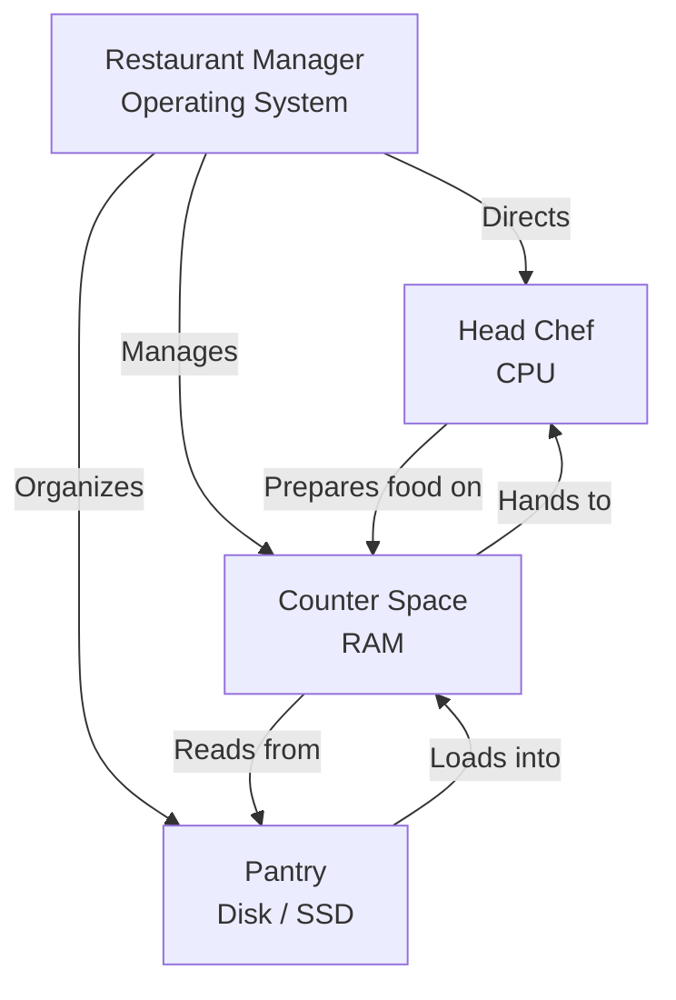

> **Складність**: `[QUICK]` - Технічний досвід не потрібен
>
> **Час на проходження**: 35 хвилин
>
> **Передумови**: Жодних. Серйозно, жодних. Якщо ви можете це прочитати, ви готові.

---

## Що ви зможете зробити

Після цього модуля ви зможете:

- **Діагностувати**, чи повільна робота комп'ютера найімовірніше спричинена браком ресурсів CPU, RAM, диска або перевантаженням операційної системи.
- **Порівняти** RAM та накопичувачі за допомогою «кухонної моделі», а потім передбачити, що втрачається, а що зберігається при вимкненні живлення.
- **Оцінити**, чому Linux є таким поширеним у хмарі та середовищах Kubernetes, а також зрозуміти, де доречні робочі вузли Windows.
- **Створити** особистий реєстр характеристик, який фіксує ваші CPU, RAM, обсяг диска, операційну систему та поточне навантаження на ресурси.
- **Передбачити**, що відбувається при вичерпанні RAM, місця на диску або процесорного часу під час повсякденних та серверних навантажень.

---


## Чому це важливо

Гіпотетичний сценарій: ви приєднуєтеся до команди експлуатації (operations), привітної до новачків, і хтось каже: "Застосунок не працює, бо на сервері закінчилася пам'ять". Інша людина каже, що диск заповнений, третя стверджує, що CPU перевантажений, а четверта пропонує все перезапустити. Якщо всі чотири речення звучать як нечітка комп'ютерна драма, ви ще не можете обрати наступний крок діагностики. Якщо ви можете відрізнити пам'ять, сховище, обчислювальні ресурси та операційну систему, той самий інцидент стає структурованою проблемою замість паніки.

Будь-яка річ, яку ви вивчатимете в цьому курсі, працює на комп'ютерах. Kubernetes, контейнери (containers), термінали, shell-скрипти, хмарні сервери, ноутбуки, телефони, плати Raspberry Pi та керовані бази даних покладаються на одну й ту саму базову угоду: для інструкцій потрібен процесор, для активної роботи потрібна пам'ять, для довготривалого збереження інформації потрібне сховище, а для координації доступу до всього потрібна операційна система. Словник змінюється в міру того, як системи стають більшими, але фізичні обмеження нікуди не зникають.

Цей модуль дає вам ментальну модель, яка постійно приноситиме користь. Згодом, коли Kubernetes перезапустить контейнер (container) через перевищення ліміту пам'яті, ви вже знатимете, чому тимчасовий робочий простір має значення. Коли вузол (node) повідомляє про нестачу дискового простору (disk pressure), ви вже знатимете, чому "більше пам'яті" — це хибне рішення. Коли в наступному модулі з'явиться термінал Linux, ви знатимете, що це не магія, а лише прямий спосіб попросити операційну систему виконати роботу.

---

## Кухонна модель: весь комп'ютер до того, як розбирати його на частини

Уявіть кухню ресторану. Не якусь вишукану, а просто звичайну, завантажену кухню, де потрібно приймати замовлення, готувати їжу, тримати інгредієнти впорядкованими, прибирати за собою та обслуговувати відвідувачів, не плутаючи страви. Комп'ютер працює подібним чином, оскільки має окремі частини з окремими зонами відповідальності. Суть аналогії не в тому, що комп'ютер буквально готує; суть у тому, що хорошим кухням і хорошим комп'ютерам потрібні координація, тимчасовий робочий простір, довгострокове сховище та працівники, які виконують інструкції.

Більшість новачків вивчає комп'ютерні деталі як окремі словникові слова, через що тема здається складнішою, ніж є насправді. CPU, RAM, диск та операційна система звучать як окремі картки для запам'ятовування, поки ви не побачите, як вони взаємодіють. Ресторанна модель дозволяє спочатку побачити співпрацю, а вже потім прив'язати назви до кожної зони відповідальності. Коли вся система стає видимою, окремі частини легше запам'ятати й набагато легше діагностувати.



Менеджер ресторану — це операційна система. Менеджер особисто не нарізає цибулю, але кухня перетвориться на хаос, якщо не буде того, хто розподіляє роботу, контролює доступ до робочої поверхні (стільниці) і вирішує, де мають лежати інгредієнти. У комп'ютері операційна система здійснює таку координацію для програм, апаратних пристроїв, файлів, пам'яті, мережевих з'єднань, екранів, клавіатур та фонових завдань.

Шеф-кухар — це CPU, що розшифровується як Central Processing Unit. Шеф-кухар — це та частина, яка фактично виконує інструкції та перетворює вхідні дані на результати. Якщо в рецепті сказано нарізати, змішати, нагріти, порівняти, скопіювати або обчислити, саме шеф-кухар відповідає за виконання цієї роботи. Шеф може працювати лише з тими інгредієнтами, до яких легко дотягнутися, ось чому стільниця має значення.

Стільниця — це RAM, що розшифровується як Random Access Memory. RAM зберігає активні інгредієнти та напівготові страви, які потрібні шеф-кухарю просто зараз. Використовувати її набагато швидше, ніж комору, але вона тимчасова. Коли кухня зачиняється, стільницю прибирають, а в комп'ютері RAM очищається після зникнення живлення.

Комора — це дискове сховище, зазвичай SSD у сучасних ноутбуках і серверах. Сховище зберігає рецепти, інгредієнти, фотографії, документи, програми, файли операційної системи та логи після вимкнення машини. Комора працює повільніше за стільницю, але вона надійна і зберігає дані довготривало. Кухня без комори може пропрацювати лише мить, тоді як кухня без стільниці майже не здатна працювати взагалі.

Програми — це рецепти. Веббраузер — це рецепт для запиту сторінок, декодування даних, малювання вкладок, збереження файлів cookie, відтворення медіа та реагування на ваші кліки. Текстовий редактор — це рецепт для відображення символів, збереження змін і відстеження руху курсора. Термінал, який з'явиться в наступному модулі, — це рецепт для безпосереднього спілкування з операційною системою за допомогою введених команд.

Зупиніться та подумайте: якщо шеф-кухар має вдосталь рецептів та інгредієнтів у коморі, але майже не має місця на стільниці, що станеться під час напруженого обслуговування вечері? Шеф-кухар все ще може бути кваліфікованим, а комора все ще повною, але робота сповільнюється, оскільки кожне завдання вимагає постійного перекладання речей. Саме так виглядає комп'ютер, який має достатньо місця на диску, але замало RAM для програм, що зараз відкриті.

```
Think of it this way:

  Order comes in: "Make a sandwich"
  Chef reads the recipe:
    Step 1: Get bread         done
    Step 2: Add lettuce       done
    Step 3: Add tomato        done
    Step 4: Serve             done
```

Оригінальний модуль використав цей приклад із сендвічем, оскільки він ілюструє дещо важливе: комп'ютери не "розуміють" програму в людському сенсі. Вони виконують багато дрібних інструкцій із величезною швидкістю. Магія полягає не в тому, що якась одна інструкція є розумною; магія в тому, що мільярди простих операцій можна скоординувати в корисну поведінку.

Кухонна модель також допомагає пояснити збої. Якщо замовлення накопичуються, поки шеф-кухар постійно зайнятий, вузьким місцем (bottleneck) може бути потужність CPU. Якщо шеф-кухар постійно очищає і знову завантажує стільницю, вузьким місцем може бути RAM. Якщо інгредієнтів не вистачає або комора переповнена, вузьким місцем може бути дискове сховище. Якщо ніхто не знає, яке замовлення слід обробити наступним, вузьким місцем може бути операційна система або поведінка програми.

Це також перший крок до того, щоб мислити як інженер з експлуатації, а не як звичайний користувач. Користувач каже: "Мій комп'ютер гальмує". Інженер запитує: "Який ресурс перевантажений, що його очікує і що змінилося останнім часом?". Вам поки не потрібні просунуті інструменти. Вам потрібна лише звичка зіставляти симптоми з тією частиною кухні, яка з найбільшою ймовірністю перебуває під навантаженням.

## CPU та RAM: активна робота та тимчасовий простір

CPU — це та частина комп'ютера, яка виконує інструкції. Коли ви натискаєте кнопку, вводите літеру, відкриваєте вкладку браузера, стискаєте файл, встановлюєте пакет або запускаєте скрипт, у цьому бере участь CPU. Він читає інструкції, виконує арифметичні дії та порівняння, переміщує дані та вирішує, яка гілка програми має виконуватися наступною. Швидший CPU схожий на швидшого шеф-кухаря, оскільки він може виконати більше кроків за той самий проміжок часу.

Сучасні процесори зазвичай описуються назвами брендів, родинами моделей, тактовими частотами та кількістю ядер. Ви можете побачити "Intel Core Ultra", "Apple M5" або "AMD Ryzen 5" в описі ноутбука. Ці назви не є навичками, які вам потрібно вивчити сьогодні. Практична ідея полягає в тому, що ядро — це як один шеф-кухар, що працює, тому CPU з кількома ядрами може обробляти кілька потоків роботи одночасно, якщо програмне забезпечення спроєктовано для їх використання.

Тактова частота часто вимірюється в гігагерцах, що означає мільярди циклів на секунду, але тактова частота — це ще не вся картина. Новіший CPU іноді може виконати більше корисної роботи за цикл, ніж старіший, а CPU з більшою кількістю ядер може продовжувати виконувати багато завдань, навіть якщо одне завдання чимось зайняте. Ось чому "чотири гігагерци" не автоматично краще за "три гігагерци" в будь-якій ситуації. Архітектура, ядра, ліміти енергоспоживання, охолодження та форма навантаження визначають реальний результат.

RAM — це швидкий тимчасовий робочий простір, який тримає активні дані близько до CPU. Коли ви відкриваєте програму, операційна система завантажує інструкції програми та робочі дані зі сховища в RAM, оскільки CPU не може ефективно працювати безпосередньо з коморою для кожного дрібного кроку. RAM достатньо швидка для активної роботи, але вона не зберігає дані довготривало. Якщо живлення зникне до того, як документ буде збережено, незбережені зміни в RAM також зникнуть.

```
More RAM = More counter space = More things open at once

  4 GB RAM   -> You can chop vegetables OR boil pasta, but not both well
  8 GB RAM   -> You can comfortably prep a full meal
  16 GB RAM  -> You can prep multiple meals simultaneously
  32 GB RAM  -> You're running a professional kitchen
```

Ці цифри не є універсальними правилами, але вони є корисними орієнтирами для новачків. Слабка машина може працювати нормально під час легкого перегляду вебсторінок та редагування документів, але потім почне "страждати" під час відеодзвінків, інтенсивного пошуку в браузері, використання інструментів розробника та віртуальних машин. Зміна не є містичною. Кожна відкрита програма просить місце на стільниці, і операційна система повинна виконувати свої обіцянки за допомогою обмеженої кількості RAM.

Коли RAM заповнюється, операційна система має кілька неприємних варіантів. Вона може стиснути пам'ять, відкинути кешовані дані, які можна відтворити, перемістити менш активні дані на диск або, у важких випадках, завершити роботу програм. Переміщення даних між RAM та диском називається swapping або paging (підкачування сторінок), залежно від системи. Swapping може підтримувати роботу машини, але це набагато повільніше, ніж робота безпосередньо в RAM, особливо якщо диск також завантажений.

> **Зупиніться та подумайте**: ви маєте 8 ГБ RAM і відкриваєте веббраузер з 30 вкладками, відеоредактор та музичний плеєр одночасно. Що, на вашу думку, станеться? Якщо ви здогадалися "комп'ютер стане болісно повільним", ви маєте рацію. Кожній програмі потрібне місце на стільниці, а браузер із багатьма відкритими вкладками може легко використати кілька гігабайтів RAM. ОС починає перетасовувати дані між RAM і диском, і все здається із затримкою.

Ось чому фрази "мій комп'ютер гальмує" недостатньо для хорошої діагностики. Повільний відеодзвінок за наявності швидкої мережі може вказувати на перевантаження CPU, якщо машина не може плавно кодувати або декодувати відео. Повільний ноутбук після відкриття багатьох застосунків може вказувати на нестачу RAM, якщо система використовує swapping. Повільний пошук файлів може вказувати на продуктивність диска або проблеми з індексуванням. Симптом має значення, але ресурс, який перебуває під тиском, є важливішим.

Перш ніж запускати це, який результат ви очікуєте побачити на своїй машині: назву моделі CPU, велику кількість байтів для пам'яті чи відсоток поточного використання? Команда залежить від операційної системи, але концептуальний результат однаковий. Ви просите менеджера ідентифікувати шеф-кухаря, повідомити про обсяг місця на стільниці та описати, наскільки кухня завантажена просто зараз.

```bash
# See your CPU info on macOS
sysctl -n machdep.cpu.brand_string

# See your RAM on macOS, in bytes
sysctl -n hw.memsize

# See your disk space on macOS
df -h /
```

Перша команда просить macOS надати рядок бренду CPU, який є зрозумілим для людини описом процесора. Друга виводить розмір пам'яті в байтах, тому очікується велике число. Третя команда показує використання файлової системи у зручному для читання форматі, включаючи кореневу файлову систему, змонтовану в `/`. Вам не потрібно запам'ятовувати ці команди сьогодні; вам потрібно помітити, що CPU, RAM і диск можна інспектувати окремо.

У Linux команди виглядають інакше, оскільки операційна система надає інформацію через інші інструменти, але ставляться ті самі запитання. `lscpu` підсумовує інформацію про процесор, `free -h` підсумовує використання пам'яті, а `df -h` підсумовує простір файлової системи. Ці команди є поширеними на серверах, що є однією з причин, чому вивчення основ Linux є важливим для роботи з Kubernetes.

```bash
# See your CPU info on Linux
lscpu

# See your RAM
free -h

# See your disk space
df -h
```

Зауважте, що жодна з цих команд сама по собі нічого не виправляє. Вони роблять невидиме видимим, що є першим кроком майже в кожній технічній діагностиці. Хороший інженер не починає з рекомендації оновити обладнання. Хороший інженер запитує, що саме перевантажено, підтверджує це доказами, і лише після цього обирає рішення, яке відповідає вузькому місцю.


## Диск, SSD та файли: постійне сховище

Диск — це довговічна комора. Він зберігає операційну систему, програми, фотографії, документи, завантаження, вихідний код, кешовані файли, логи, конфігурацію та багато речей, які ви ніколи не бачите напряму. Якщо RAM очищається під час вимкнення живлення, дискове сховище працює навпаки: воно створене, щоб пам'ятати. Ця різниця є причиною, чому збереження має значення. Збереження копіює роботу з тимчасового простору стільниці у довговічний простір комори.

Люди часто використовують кілька слів для позначення сховища. «Диск» — це загальне слово, яке ви почуєте в розмовах про експлуатацію (operations), навіть якщо пристрій зберігання даних не є диском, що обертається. «Жорсткий диск» зазвичай означає HDD, пристрій з пластинами, що обертаються, та рухомими механічними частинами. «SSD» означає твердотільний накопичувач (Solid State Drive), який зберігає дані в електронних мікросхемах пам'яті без рухомого кронштейна. «Сховище» (storage) — це повсякденне слово для позначення обсягу доступного довговічного простору.

```
Two types of pantry:

  HDD (Hard Disk Drive):
    - Like a big walk-in pantry
    - Lots of space, affordable
    - Slower to find things because mechanical parts move

  SSD (Solid State Drive):
    - Like a well-organized shelf right outside the kitchen
    - Faster to find things because there are no moving parts
    - More expensive per shelf
    - This is what most modern computers use
```

Обсяг сховища зазвичай вимірюється в гігабайтах або терабайтах. Гігабайт — це приблизно один мільярд байтів, а терабайт — це приблизно тисяча гігабайтів у десяткових маркетингових термінах зберігання даних. Типовий ноутбук може мати сотні гігабайтів або кілька терабайтів сховища, тоді як невеликий хмарний сервер може мати набагато менше. Точний розмір має менше значення, ніж відмінність між довговічною ємністю та активною робочою пам'яттю.

Різниця між RAM та сховищем стає очевидною під час збою живлення. Уявіть, що ви пишете документ, і живлення вимикається до того, як спрацює автозбереження. Початковий збережений файл виживає, оскільки він уже був у коморі. Незбережені зміни зникають, оскільки вони були на стільниці. CPU не пам'ятає ваших слів, а RAM не може зберігати їх без живлення.

Коли дисковий простір заповнюється, збої виглядають інакше, ніж нестача RAM (RAM pressure). Ви можете втратити здатність зберігати файли, встановлювати оновлення, завантажувати пакети, писати логи, створювати тимчасові файли або дозволяти операційній системі вивантажувати (swap) пам'ять на диск. Система все ще може мати швидкий CPU та достатньо RAM для поточної роботи, але в коморі немає вільної полиці. Саме тому переповнений диск може зламати програми, які, здавалося б, не пов'язані зі зберіганням файлів.

Та сама ідея з'являється у Kubernetes як «disk pressure» на вузлі (node). Вузол — це просто комп'ютер, на якому працюють компоненти Kubernetes та робочі навантаження. Якщо образи контейнерів, логи, тимчасові файли та дані застосунків заповнять сховище вузла, вузол більше не зможе безпечно приймати роботу. Kubernetes має механізми, щоб помічати це та реагувати, але основна проблема — це все ще комора: довговічне сховище стало занадто повним для надійної роботи.

Сховище також дає важливий урок про швидкість і ємність. Комора може бути величезною, але при цьому погано організованою, знаходитись далеко від кухаря або бути повільною для доступу під час запари. У комп'ютерних термінах великий HDD може зберігати багато файлів, але все одно здаватися повільним під час відкриття програм, пошуку в каталогах або завантаження багатьох дрібних файлів. Менший SSD може здаватися швидшим, оскільки час доступу значно менший, навіть якщо його загальна ємність не так вражає на етикетці продукту.

Ця відмінність має значення, коли ви розглядаєте можливості оновлення (апгрейду). Якщо диск майже повний, очевидним рішенням є збільшення ємності або очищення. Якщо на диску багато місця, але кожна операція з файлами на старій машині здається млявою, тип сховища може мати більше значення, ніж його обсяг. Якщо комп'ютер "зависає" лише тоді, коли відкрито багато програм, тип сховища є другорядним, оскільки нестача RAM, ймовірно, змушує операційну систему використовувати диск як аварійну стільницю.

Резервні копії (backups) додають ще один рівень до ідеї комори. Довговічне сховище переживає звичайне вимкнення, але воно не є незнищенним. Ноутбук можуть вкрасти, SSD може вийти з ладу, файл можна помилково видалити, а програми-вимагачі (ransomware) можуть зашифрувати дані. Резервна копія — це друга комора в іншому місці, а не просто більша полиця на тій самій кухні. Цей модуль не навчає проєктуванню резервних копій, але він має дати чітке розуміння, чому «збережено на диск» і «в безпеці назавжди» — це не одне й те саме.

```
1. You double-click "vacation.jpg"

2. The OS (manager) sees your request
   -> "Customer wants to see a photo"

3. The OS loads the photo viewer program from disk (pantry) into RAM (counter)
   -> "Get the photo recipe and ingredients ready"

4. The OS loads vacation.jpg from disk into RAM
   -> "Grab that specific dish from storage"

5. The CPU (chef) processes the image data
   -> "Follow the recipe to prepare the photo for display"

6. The result appears on your screen
   -> "Dish served!"
```

На цій послідовності варто зупинитися детальніше. Програма для перегляду фотографій зберігається на диску, коли вона не запущена. Файл зображення також зберігається на диску. Коли ви двічі клацаєте на зображення, і програма, і файл переносяться в активну пам'ять, щоб CPU міг їх обробити. Зображення на екрані є результатом злагодженої роботи сховища, пам'яті, CPU, графіки та операційної системи.

> **Зупиніться та подумайте**: який підхід ви б обрали в цьому випадку і чому: видалення старих завантажень, купівлю більшого обсягу RAM чи заміну HDD на SSD? Якщо диск заповнений, видалення або переміщення файлів вирішує нагальну проблему. Якщо диск не заповнений, але все зависає, коли відкрито багато програм, може допомогти збільшення обсягу RAM. Якщо на машині встановлено старий HDD, а операції з файлами виконуються повільно, SSD може покращити швидкість реакції, навіть якщо ємність залишиться незмінною.

Початківці часто кажуть «пам'ять», коли мають на увазі сховище, оскільки сторінки продуктів і повсякденні розмови розмивають ці поняття. У роботі з інфраструктурою (operations) це розмиття призводить до реальних помилок. Сервер із 256 ГБ сховища та 8 ГБ RAM не має «256 ГБ пам'яті» у тому сенсі, який має на увазі Kubernetes, коли він планує (schedules) робоче навантаження. Ліміти пам'яті Kubernetes (memory limits) стосуються оперативної пам'яті типу RAM, а не комори, де зберігаються файли.

Найбезпечніша звичка — використовувати точні іменники. Кажіть «RAM», коли маєте на увазі тимчасову робочу пам'ять. Кажіть «диск» або «сховище», коли маєте на увазі довговічний простір для файлів. Кажіть «CPU», коли маєте на увазі обробку інструкцій. Кажіть «операційна система», коли маєте на увазі рівень програмного забезпечення, що координує обладнання та програми. Точність спочатку може здаватися прискіпливістю, але згодом вона запобігає дорогим непорозумінням.

## Операційні системи та програми: рівень координації

Операційна система — це менеджер ресторану. Вона сама по собі не "готує" вашу фотографію, не пише документ і не рендерить вебсторінку, але вона робить ці дії можливими. Вона запускає програми, виділяє пам'ять, планує процесорний час (CPU time), обробляє введення з клавіатури та миші, надсилає результати на дисплей, організовує файли, забезпечує дотримання дозволів (permissions), керує мережевими з'єднаннями та запобігає тому, щоб безліч програм заважали одна одній.

```
The three main operating systems:

  Windows  -> The most common desktop OS in many market-share reports
  macOS    -> Apple's system, used on Macs
  Linux    -> The open-source family used heavily in servers and cloud infrastructure
```

Операційна система має значення, тому що програмам не дозволено робити абсолютно все, що їм заманеться. Текстовий редактор не повинен перезаписувати пам'ять іншої програми. Вкладка браузера не повинна читати кожен приватний файл на диску. Фонова програма оновлення не повинна забирати весь час CPU назавжди. OS забезпечує межі, планування (scheduling), дозволи та спільні сервіси, щоб безліч програм могли спільно використовувати одну машину без постійних конфліктів.

Ця координація є причиною, чому перезавантаження може виправити деякі тимчасові проблеми. Перезавантаження очищає RAM, зупиняє процеси, перезавантажує операційну систему і дає фоновим сервісам чисту точку відліку. Воно не робить слабкий CPU сильнішим або малий диск більшим, але може видалити накопичений тимчасовий стан. Важливо ставитися до перезавантаження як до інструмента діагностики та відновлення, а не як до замінника розуміння основних проблем з нестачею ресурсів.

Програма, яку також називають застосунком (application або app), — це набір інструкцій. Коли ви відкриваєте веббраузер, ви просите операційну систему запустити програму браузера, зарезервувати для неї пам'ять, завантажити її код з диска, надати їй час CPU та підключити до сервісів введення, дисплея, сховища та мережі. Потім браузер дотримується власного рецепта обробки вкладок, сторінок, зображень, розширень та відтворення медіа.

```
Some "recipes" you use every day:

  Web browser (Chrome, Firefox)  -> Recipe for displaying web pages
  Text editor (Word, Notepad)    -> Recipe for editing text
  Terminal                       -> Recipe for talking directly to the OS
```

Термінал заслуговує на особливу увагу, оскільки це наступний крок у цій навчальній програмі. Графічний інтерфейс дозволяє давати запити на виконання роботи через вікна, меню, іконки та кнопки. Термінал дозволяє робити це за допомогою текстових команд. Обидва шляхи ведуть до операційної системи, але термінал легше автоматизувати, простіше точно задокументувати, і він є стандартним на віддалених серверах, де немає графічної стільниці.

Linux поширений у хмарних середовищах та Kubernetes з практичних міркувань. Він підтримує скрипти, є широкодоступним, має відкритий вихідний код, є ефективним для серверних навантажень, знайомий для інфраструктурних інструментів та глибоко інтегрований у робочі процеси з контейнерами. Це не означає, що Windows не має значення. Kubernetes підтримує робочі вузли (worker nodes) на Windows для робочих навантажень Windows, хоча площина управління (control plane), згідно з документацією Kubernetes, залишається на базі Linux.

Ось частина, яка має велике значення для вашого шляху у вивченні Kubernetes: багато прикладів передбачають використання команд Linux, шляхів Linux, поведінки процесів Linux та образів контейнерів Linux. Якщо ви використовуєте macOS або Windows на своєму ноутбуці, ви все ще можете вивчати Kubernetes. Ви просто проводитимете час у Linux-подібних середовищах, віддалених оболонках (shells), контейнерах або віртуальних машинах, оскільки серверна екосистема так часто спілкується саме цією мовою.

Перевірено 15 квітня 2026 року: [StatCounter Desktop OS Market Share Worldwide](https://gs.statcounter.com/os-market-share/desktop/worldwide/) та [Kubernetes Windows in Kubernetes](https://kubernetes.io/docs/concepts/windows/).

Операційна система також вирішує, як апаратне забезпечення (hardware) представлено програмам. Програма зазвичай не спілкується безпосередньо з мікросхемами пам'яті чи мережевою картою. Вона просить OS відкрити файл, виділити пам'ять, створити мережеве з'єднання або запустити інший процес. Таке опосередкування є цінним, оскільки воно спрощує програми та дозволяє операційній системі забезпечувати дотримання правил.

Дозволи (permissions) є одним із прикладів таких правил. Коли програма просить прочитати файл, операційна система може дозволити або відхилити запит на основі права власності (ownership), ідентифікації користувача та налаштувань безпеки. Коли програма просить більше пам'яті, операційна система вирішує, чи можна задовольнити цей запит без шкоди для решти машини. Ось чому OS — це більше, ніж просто зручний інструмент для запуску (launcher); це також рефері, який не дозволяє перетворити спільні ресурси на хаос, де кожен робить що хоче.

Планування (scheduling) — ще один приклад. Багато програм можуть одночасно потребувати часу CPU, але ядро CPU може виконувати лише один потік інструкцій (thread of instructions) у цю мить. Операційна система швидко перемикає увагу між завданнями, готовими до виконання (runnable tasks), щоб машина здавалася швидкою (responsive). Коли система здорова, це перемикання відбувається занадто швидко, щоб початківець його помітив. Коли система перевантажена, перемикання стає помітним у вигляді затримок (lag), "ривків" (stutter), запізнювання під час введення тексту або застосунків, які довго не відповідають.

Гіпотетичний сценарій: ваш браузер зависає, тоді як музичний плеєр продовжує грати, а миша все ще рухається. Цей симптом говорить вам, що весь комп'ютер, можливо, не "помер". Одна програма може застрягти, тоді як операційна система та інші програми продовжують працювати. Якщо весь екран перестає оновлюватися, введення перестає відповідати, а звук зациклюється або переривається, проблема може бути масштабнішою, ніж один застосунок.

Розрізнення між проблемою програми та проблемою операційної системи стає важливим на серверах. Один застосунок може завершитися аварійно (crash), тоді як машина залишатиметься здоровою. Машина також може стати нездоровою через те, що пам'ять, диск, CPU або сервіси на рівні ядра (kernel-level services) перебувають під навантаженням (under pressure). Інженери з експлуатації (operators) вчаться ставити питання: чи це не вдався рецепт, чи підвів менеджер, чи на кухні закінчився спільний ресурс.


## Від одного ноутбука до вузлів Kubernetes

Kubernetes звучить значно масштабніше, ніж один ноутбук, але він не виходить за межі кухонної моделі. Кластер Kubernetes — це сукупність комп'ютерів, які зазвичай називають вузлами, що координуються для виконання робочих навантажень. Кожен вузол має CPU, RAM, диск, операційну систему, мережу та фонові агенти. Kubernetes додає рівень планування та узгодження над цими комп'ютерами, але все одно залежить від їхніх звичайних апаратних обмежень.

Найпростіший спосіб пов'язати цей модуль із Kubernetes — уявити багато ресторанних кухонь в одній мережі доставки. Kubernetes вирішує, яка кухня має готувати яке замовлення, перевіряє, чи кухні справні, переміщує роботу, коли щось виходить з ладу, і допомагає додати потужності, коли попит зростає. Він не може змусити кухню без вільного робочого місця працювати як кухню з необмеженим простором. Рішення щодо планування настільки ж хороші, наскільки й реально доступні ресурси.

Хмарні провайдери додають ще один рівень назв, але вони все одно продають комбінації тих самих ресурсів. Тип віртуальної машини може рекламувати vCPU, пам'ять, локальне сховище, мережеву продуктивність, а іноді й спеціалізоване обладнання. Ці ярлики можуть здаватися абстрактними, але вони знову ж таки відповідають кухарям, робочому простору столу, місцю в коморі, дверям для спілкування та інструментам для спеціалізованої роботи. Коли ви пізніше обиратимете розмір інстансу, ви обиратимете формат кухні для робочого навантаження.

Контейнери також не скасовують цих обмежень. Контейнер упаковує програму та її залежності так, щоб вона могла працювати передбачувано, але він усе одно споживає процесорний час, пам'ять, диск і мережеві ресурси головного комп'ютера. Якщо десять контейнерів ділять один вузол, вони ділять одну кухню. Kubernetes може встановлювати правила щодо того, скільки кожен контейнер може запитувати або споживати, але загальна кількість все одно має вписуватися у фізичну та віртуальну місткість вузла.

Коли ви пізніше читатимете про Kubernetes requests і limits, ви знову побачите CPU та пам'ять. Робоче навантаження може запросити достатньо CPU та пам'яті для належної роботи, і Kubernetes використовує ці запити під час вибору вузла. Якщо робоче навантаження перевищує ліміт пам'яті, воно може бути примусово зупинено, оскільки використало більше тимчасового робочого простору, ніж обіцяло. Це не довільне покарання; це захист ресурсів для решти кухні.

Диск також знову з'являється в Kubernetes. Образи контейнерів мають бути збережені перед тим, як їх можна буде запустити. Журнали споживають місце. Додатки можуть записувати тимчасові файли або довговічні дані. Вузли потребують достатньо сховища для системних компонентів і робочих навантажень. Якщо комора заповнюється, робочі навантаження можуть завершитися помилкою, навіть якщо CPU та RAM виглядають нормально. Назва змінюється на сховище вузла, ephemeral storage або persistent volume, але базова ідея залишається — це довговічна місткість.

Операційна система також залишається центральною. Kubernetes не працює безпосередньо на «голому залізі» без рівня ОС, який виконує звичайну роботу ОС. Вузли Linux запускають процеси Linux, використовують файлові системи Linux і покладаються на мережеву поведінку Linux. Робочі вузли Windows існують для робочих навантажень Windows, але компоненти control plane у Kubernetes базуються на Linux. Ось чому навчальна програма рухається від «що таке комп'ютер» до «що таке термінал», а потім до основ Linux.

```bash
# A later Kubernetes command will look like this when you inspect nodes.
# You do not need to run it yet.
kubectl get nodes
```

Ця команда включена лише як попередній огляд, але вона показує мову, яку ви згодом будете використовувати. Вузол Kubernetes — це не абстрактний хмарний привид. Це комп'ютер, відомий кластеру, з ресурсами, про які можна звітувати, які можна планувати, споживати, вичерпувати та відновлювати. Кластер може приховувати деякі апаратні деталі, але фізика залишається під ними.

Зупиніться та подумайте: якщо вузол Kubernetes має багато вільного CPU, але майже не має вільної пам'яті, чи повинен планувальник розміщувати там робоче навантаження, яке потребує багато пам'яті? Відповідь тепер має здаватися очевидною. Розумний планувальник повинен враховувати ресурс, який насправді потрібен робочому навантаженню, а не лише той ресурс, який випадково є доступним. Кухня з кухарями, які сидять без діла, але без робочого простору на столі, усе одно є поганим місцем для приготування великого банкету.

Цей стрибок від одного до багатьох є причиною того, що модуль починається на початковому рівні, але все одно має значення для просунутої роботи. Хмарна інфраструктура — це не окремий всесвіт. Це спосіб оренди, підключення, автоматизації та управління комп'ютерами, які належать комусь іншому. Як тільки ви зрозумієте один комп'ютер, у вас з'явиться словниковий запас, необхідний для міркування про парки машин, кластери та збої у більшому масштабі.

## Аналіз симптомів очима оператора

Корисна ментальна модель стає потужною, коли вона змінює ваші дії під тиском. Якщо хтось каже «повільно», ваше наступне запитання має бути про тип повільності. Чи комп'ютер повільно запускає програми, повільно працює під час відеодзвінків, повільно перемикається між додатками, повільно зберігає файли чи повільно завантажує вебсайти? Кожен симптом вказує на різні частини кухні.

Повільний запуск додатка часто пов'язаний із роботою диска та операційної системи, оскільки програму потрібно завантажити зі сховища в RAM. Повільне перемикання між багатьма відкритими додатками часто пов'язане з нестачею RAM, оскільки ОС може вивантажувати неактивні дані з пам'яті та завантажувати їх назад. Повільні обчислення, кодування відео, стиснення та симуляція ігор часто пов'язані з нестачею ресурсів CPU. Повільні вебсторінки можуть бути пов'язані з мережевою затримкою, використанням CPU браузером, DNS, віддаленими серверами або нестачею локальної пам'яті.

Мета полягає не в тому, щоб ідеально вгадати з першої спроби. Мета полягає в тому, щоб сформувати гіпотезу, яку можна перевірити. Якщо ви підозрюєте нестачу RAM, відкрийте системний монітор ресурсів і подивіться на використання пам'яті та активність swap. Якщо ви підозрюєте переповнення диска, перевірте вільне місце. Якщо ви підозрюєте нестачу ресурсів CPU, пошукайте процес, що споживає процесорний час. Якщо ви підозрюєте, що одна програма зламана, порівняйте її з іншими програмами, які все ще працюють нормально.

Хороша гіпотеза містить і ресурс, і причину. «Він працює повільно, тому що комп'ютери дратують» неможливо перевірити. «Він працює повільно, тому що пам'ять заповнена, і ОС використовує swap» можна перевірити за допомогою монітора. «Оновлення не вдалося, оскільки диск заповнений» можна перевірити за допомогою інструментів для визначення вільного місця. Точні гіпотези дозволяють зберігати спокій під час усунення несправностей, оскільки кожен наступний крок або підтверджує ідею, або спростовує її.

| Симптом | Ймовірна перша перевірка | Чому ця перевірка підходить |
|---|---|---|
| Відкрито багато додатків, і все зависає | Використання RAM і swap | Робочий стіл може бути заповненим, що спричиняє переміщення даних на диск і назад |
| Збереження файлів завершується помилкою або оновлення не встановлюються | Вільний простір на диску | У коморі могло не залишитися місця на полицях |
| Відеодзвінок зависає, тоді як швидкість мережі нормальна | Використання CPU додатком для дзвінків | Відео в реальному часі може сильно навантажувати процесор |
| Один додаток зависає, але інші працюють | Стан процесу додатка | Один рецепт міг застрягти, тоді як ОС продовжує роботу |
| Вебсайт завантажується повільно на всіх пристроях | Мережевий шлях або віддалений сервіс | Локальний комп'ютер може не бути вузьким місцем |

Ця таблиця є допоміжним засобом для прийняття рішень, а не законом природи. Реальні інциденти можуть охоплювати декілька ресурсів одночасно. Браузер може споживати CPU, RAM, дисковий кеш і пропускну здатність мережі в одному й тому ж сеансі. Заповнений диск може погіршити нестачу пам'яті через обмеження swap. Гарячий ноутбук може уповільнити свій CPU для самозахисту. Завдання оператора полягає в тому, щоб постійно запитувати, який ресурс обмежено і які докази підтверджують це твердження.

Практичний приклад: ваш ноутбук має 16 ГБ RAM і великий SSD, але все починає працювати ривками під час експорту відео. Ви відкриваєте системний монітор і бачите, що відеоредактор використовує більшу частину процесорного часу, тоді як у пам'яті ще є вільне місце, а з вільним простором на диску все гаразд. Найкраще перше пояснення — це завдання, обмежене можливостями процесора. Закриття непов'язаних програм, які сильно навантажують CPU, або очікування завершення експорту має більше сенсу, ніж купівля більшого диска.

А тепер спробуйте застосувати таку ж логіку до іншого симптому. Ваш ноутбук має швидкий CPU та багато місця на диску, але після відкриття багатьох вкладок у браузері, редактора коду, чату та віртуальної зустрічі перемикання вікон займає кілька секунд. Системний монітор показує, що пам'ять майже заповнена, а активність swap зростає. Найкраще перше пояснення — нестача RAM, тому закриття додатків, які споживають багато пам'яті, або додавання RAM є більш доречним, ніж оновлення CPU.

Ця звичка також запобігає дорогим, але неефективним оновленням обладнання. Купівля більшого диска не зробить обчислення, обмежені процесором, швидшими. Купівля більшого обсягу RAM не виправить слабке з'єднання Wi-Fi. Перевстановлення операційної системи не створить довговічного простору, якщо журнали та завантаження відразу ж знову заповнять диск. Діагностика — це спосіб уникнути заміни неправильної частини кухні.

## Патерни та антипатерни

Оскільки це короткий вступний модуль, основний патерн простий: тримайте чотири ресурси окремо у своїй голові, а потім зіставляйте симптоми з ресурсами, перш ніж обирати дію. Антипатерн — це ставлення до «проблеми з комп'ютером» як до однієї нечіткої категорії та застосування загальних рішень. Ця звичка може випадково спрацювати на особистому ноутбуці, але вона швидко дає збій, коли ви керуєте серверами, хмарними системами або кластерами Kubernetes.

| Патерн | Коли його використовувати | Чому він працює |
|---|---|---|
| Назвіть ресурс, перш ніж називати виправлення | Щоразу, коли комп'ютер повільний, заповнений, гарячий або ненадійний | Це змушує провести діагностику, перш ніж витрачати час або гроші |
| Порівнюйте RAM і сховище явно | Щоразу, коли хтось неоднозначно каже «пам'ять» | Це запобігає плутанню тимчасового робочого простору з довговічними файлами |
| Спочатку перевірте, потім змінюйте | Перед оновленнями, перезавантаженнями, видаленнями або рішеннями щодо масштабування | Докази зменшують кількість припущень і захищають непов'язану роботу |

| Антипатерн | Що йде не так | Краща альтернатива |
|---|---|---|
| «Просто перезавантаж його» як єдина стратегія | Тимчасове полегшення приховує постійні проблеми з CPU, RAM, диском або програмами | Перезавантажуйте, коли це корисно, а потім перевірте, яке навантаження повертається |
| «Купи більший жорсткий диск» для кожного повільного комп'ютера | Місткість сховища може не впливати на вузькі місця CPU або RAM | Перевіряйте CPU, пам'ять, заповненість диска та тип диска окремо |
| «Linux — лише для експертів» | Учні уникають середовища, яке використовується багатьма серверами та в лабораторних роботах Kubernetes | Ставтеся до команд Linux як до звичайних розмов з операційною системою |

Цей патерн масштабується від одного ноутбука до багатьох вузлів. На одному ноутбуці ви перевіряєте Activity Monitor, Task Manager або команди термінала. У кластері Kubernetes ви перевіряєте стан вузлів, використання ресурсів Pod, журнали, події та рішення щодо планування. Інструменти стають досконалішими, але перше запитання залишається скромним: яка частина кухні обмежує прогрес прямо зараз?

Антипатерн також масштабується. Команди марнують час, коли вони сперечаються, виходячи з улюблених виправлень, замість того щоб спиратися на спільні докази. Одна людина хоче додати CPU, інша — додати пам'ять, а третя — перезапустити сервіси. Корисна розмова починається тоді, коли хтось показує, що процес обмежений процесором, вузол відчуває нестачу пам'яті, диск заповнений або ж проблема взагалі криється за межами машини.

## Коли використовувати це замість альтернатив

Використовуйте кухонну модель, коли вам потрібен зрозумілий для новачків спосіб міркування про повсякденну поведінку комп'ютера. Вона особливо корисна для первинної діагностики, купівлі обладнання, вибору розміру хмарних інстансів і для першого читання мови ресурсів Kubernetes. Вона дає вам стабільну карту, не вимагаючи розуміння електротехніки, ієрархій кешу CPU, внутрішньої структури ядра або алгоритмів розподіленого планування.

Використовуйте детальніші моделі, коли кухонна аналогія перестає давати відповіді на запитання. Інженерів з продуктивності цікавлять кеші CPU, конвеєри інструкцій, топологія NUMA, поведінка файлових систем, черги I/O, мережеві переривання та деталі середовища виконання контейнерів. Ці теми реальні, і з деякими з них ви зіткнетеся пізніше. Поки що кухонної моделі достатньо, щоб запобігти найпоширенішим помилкам новачків.

| Якщо запитання таке... | Використовуйте цю модель | Рухайтеся далі, коли... |
|---|---|---|
| «Чому мій ноутбук повільний?» | CPU, RAM, диск, ОС, програма | Вам потрібне точне профілювання або налаштування на апаратному рівні |
| «Чому моя незбережена робота зникла?» | RAM — тимчасова, диск — довговічний | Вам потрібне відновлення файлової системи або проєктування резервного копіювання |
| «Чому для Kubernetes важлива пам'ять?» | Вузли мають обмежений простір на столі | Вам потрібні cgroups, limits, eviction та класи QoS |
| «Навіщо вивчати Linux?» | Цього очікують багато серверів та інструментів Kubernetes | Вам потрібні внутрішні механізми ядра, мережі або безпеки |

Модель не є заміною вимірювання. Це спосіб вибрати перше вимірювання. Якщо модель вказує на нестачу RAM, виміряйте пам'ять. Якщо вона вказує на нестачу сховища, виміряйте місткість диска та I/O. Якщо вона вказує на нестачу ресурсів CPU, виміряйте використання процесора. Якщо вона вказує на одну завислу програму, перевірте цей процес, перш ніж звинувачувати всю машину.

## Чи знали ви?

- **Ваш телефон — це також комп'ютер.** Сучасний смартфон є значно потужнішим за комп'ютери, які використовувалися в епоху «Аполлона»; для порівняння, керуючий комп'ютер космічного корабля «Аполлон» працював лише з десятками кілобайтів пам'яті.

- **Пам'ять RAM колись була магнітною.** Ранні комп'ютери використовували крихітні магнітні кільця, що називалися пам'яттю на магнітних осердях, як RAM. Кожне кільце зберігало один біт, і для повного мегабайта знадобилися б мільйони кілець.

- **SSD-накопичувачі не мають рухомих частин.** Традиційні жорсткі диски використовують диски, що обертаються, і рухомий кронштейн, тоді як SSD зберігають дані в електронних схемах, саме тому вони зазвичай швидші та стійкіші до ударів.

- **Відомий ранній комп'ютерний «баг» (bug) був справжньою комахою.** У 1947 році інженери, які працювали з Harvard Mark II, знайшли міль, що застрягла в реле, і приклеїли її до журналу скотчем, зазначивши про «перший реальний випадок виявлення бага». (Інженери вже десятиліттями називали збої «багами»; цей випадок просто закріпив назву).

## Типові помилки

| Помилка | Чому це трапляється | Як це виправити |
|---|---|---|
| Плутанина між RAM і сховищем | Сторінки продуктів і повсякденна мова вільно використовують слово «пам'ять» | Кажіть RAM для тимчасового простору на столі та сховище або диск для довговічного простору комори |
| Купівля більшого сховища для виправлення будь-якого повільного комп'ютера | Більша комора не змусить кухаря готувати швидше | Перевіряйте використання CPU, нестачу RAM, заповненість диска та тип диска перед оновленням |
| Ігнорування RAM, коли відкрито багато додатків | Машина все ще має вільне місце на диску, тому справжнє вузьке місце легко не помітити | Перевіряйте використання пам'яті та swap, а потім закрийте або зменште програми, які споживають багато пам'яті |
| Звинувачення швидкості CPU у затримках інтернету | Повільні сторінки здаються локальною проблемою, навіть якщо затримка пов'язана з мережею або віддаленим сервісом | Порівняйте з іншими пристроями, перевірте якість мережі та перевіряйте CPU, лише якщо локальне навантаження велике |
| Уникнення перезавантаження операційної системи | Сон і пробудження здаються вимкненням, але тимчасові стани можуть накопичуватися | Перезавантажуйте як крок для відновлення, а потім дослідіть, чи повертається таке ж навантаження |
| Оцінювання CPU лише за тактовою частотою | Прості цифри легше порівнювати, ніж ядра, архітектуру та робоче навантаження | Враховуйте ядра, покоління, охолодження, ліміти потужності та тип виконуваної роботи |
| Ставлення до Linux як до необов'язкових дрібниць | Звички роботи на десктопі приховують те, наскільки поширеним є Linux на серверах і в прикладах Kubernetes | Вивчайте базові команди Linux як частину вивчення того, як експлуатуються хмарні системи |


## Контрольні запитання

<details>
<summary>1. Ваш комп'ютер має швидкий CPU та 512 ГБ вільного місця на накопичувачі, але він починає працювати повільніше щоразу, коли ви відкриваєте браузер з багатьма вкладками, додаток для зустрічей і редактор коду. Який ресурс ви діагностуватимете першим і чому?</summary>

Спершу варто діагностувати RAM, оскільки симптом з'являється, коли багато активних програм одночасно потребують місця на "робочому столі". Великий обсяг вільного місця на накопичувачі означає лише, що "комірка" не заповнена, але це не доводить, що "робочий стіл" достатньо великий. Швидкий CPU може просто простоювати, поки операційна система обмінюється даними між RAM і диском. Наступним кроком є перевірка використання пам'яті та swap, а не купівля більшого накопичувача.
</details>

<details>
<summary>2. Колега каже, що його незбережений документ зник після вимкнення електроенергії, але старі збережені файли залишилися на місці. Як ви порівняєте RAM і накопичувач у цій ситуації?</summary>

Незбережені зміни, ймовірно, знаходилися в RAM, яка є тимчасовою і потребує живлення для збереження активної роботи. Старі файли вже були збережені на накопичувачі, який є надійним і переживає вимкнення та втрату живлення. Порівняння з кухнею — це місце на робочому столі проти місця в комірці: робочий стіл витирається, коли кухня закривається, тоді як комірка залишається. Ось чому функції збереження та автозбереження важливі навіть на надійних машинах.
</details>

<details>
<summary>3. Майбутній вузол Kubernetes повідомляє, що має доступний CPU, але перебуває під тиском пам'яті. Чи повинен планувальник розміщувати там робоче навантаження, яке потребує багато пам'яті?</summary>

Ні, якщо планувальник має кращий варіант, оскільки навантаженню потрібен той ресурс, якого вже бракує. Доступність CPU означає лише, що у шеф-кухарів є час; тиск пам'яті означає, що на робочому столі тісно. Робоче навантаження, що потребує багато пам'яті і розміщене там, може бути зупинено, переміщено у swap або погіршити свою роботу. Це та ж сама логіка, що й з ноутбуком, тільки масштабована до вузла кластера.
</details>

<details>
<summary>4. Ваш відеодзвінок зависає, але інші вебсайти завантажуються швидко, і ваш тест швидкості інтернету в нормі. Яке вузьке місце ви будете оцінювати наступним?</summary>

Наступним кроком варто оцінити навантаження на CPU та поведінку локальних додатків, оскільки відео в реальному часі може вимагати постійного кодування та декодування. Хороший результат тесту мережі послаблює аргумент, що єдиною проблемою є пропускна здатність. Тиск на RAM також може впливати, якщо машина перевантажена, тому розумно перевірити як CPU, так і пам'ять. Головне розуміти, що "повільний інтернет" більше не є єдиним поясненням.
</details>

<details>
<summary>5. Ви обираєте між двома вживаними ноутбуками для початкових лабораторних робіт з Kubernetes. Один має невеликий SSD і 16 ГБ RAM; інший має великий HDD і 4 ГБ RAM. Який компроміс є важливішим для одночасного запуску кількох інструментів?</summary>

16 ГБ RAM мають більше значення для одночасного запуску кількох активних інструментів, оскільки цим інструментам потрібен тимчасовий робочий простір. Невеликий SSD може стати обмежувальним фактором, якщо він майже заповнений, але HDD з великою ємністю не вирішує проблему активного тиску на пам'ять. Для лабораторних робіт вам потрібно достатньо RAM для браузерів, терміналів, контейнерів, редакторів та фонових служб. Накопичувач все ще має значення, але RAM зазвичай є першим обмеженням у цьому порівнянні.
</details>

<details>
<summary>6. Учень каже, що Linux не має відношення до Kubernetes, оскільки він використовує Windows на своєму ноутбуці. Як ви оціните це твердження?</summary>

Це твердження є занадто вузьким, оскільки інструменти Kubernetes та контейнерів зазвичай передбачають поведінку Linux, навіть якщо настільний комп'ютер учня працює на Windows. Робочі вузли Windows підтримуються для робочих навантажень Windows, але рівень управління Kubernetes працює на Linux, і багато прикладів використовують команди Linux. Ноутбук з Windows все одно може бути чудовою машиною для навчання через термінали, віддалені системи, WSL, контейнери або хмарні лабораторні. Практичний висновок полягає в тому, щоб вивчити основи Linux, а не відмовлятися від Windows.
</details>


## Практична вправа: Перевірте характеристики свого комп'ютера

Мета цієї вправи — перетворити модель кухні на докази з вашої власної машини. Ви визначите CPU, RAM, диск та операційну систему, а потім зробите одну невелику діагностику щодо поточного тиску на ресурси. Вам не потрібно змінювати налаштування, встановлювати програмне забезпечення або щось оптимізувати. Мета полягає в тому, щоб виробити звичку перевіряти, перш ніж вгадувати.

Використовуйте інструкції для вашої операційної системи. Якщо ви працюєте на керованому шкільному або робочому комп'ютері, деякі екрани можуть бути обмежені, але команди лише для читання є безпечними. Якщо одна з команд недоступна, використайте графічний шлях і продовжуйте. Важливим результатом є короткий перелік характеристик, який ви зможете пояснити простою мовою.

### Завдання 1: **Створити** особистий перелік характеристик

- [ ] Запишіть модель вашого CPU або назву процесора.
- [ ] Запишіть, скільки RAM має ваш комп'ютер.
- [ ] Запишіть загальний розмір накопичувача та приблизний обсяг вільного місця.
- [ ] Запишіть назву та версію вашої операційної системи.

<details>
<summary>Вказівки до рішення для Завдання 1</summary>

У macOS натисніть меню Apple і відкрийте **Про цей комп’ютер Mac**. У Windows відкрийте **Налаштування > Система > Про систему** або знайдіть **Відомості про систему**. У Linux скористайтеся панеллю налаштувань системи або запустіть `lscpu`, `free -h` та `df -h` у терміналі. Запишіть результат звичайним текстом, наприклад: "CPU: чіп серії Apple M; RAM: 16 ГБ; Накопичувач: 512 ГБ SSD з 210 ГБ вільного місця; ОС: macOS".
</details>

### Завдання 2: **Порівняти** RAM і накопичувач на вашій машині

- [ ] Напишіть одне речення, що пояснює, яке число відповідає RAM.
- [ ] Напишіть одне речення, що пояснює, яке число відповідає накопичувачу.
- [ ] Спрогнозуйте, що буде втрачено, якщо зникне живлення до збереження відкритого документа.

<details>
<summary>Вказівки до рішення для Завдання 2</summary>

RAM — це менше число, що позначає тимчасовий робочий простір, зазвичай 8 ГБ, 16 ГБ, 32 ГБ або інший обсяг встановленої пам'яті. Накопичувач — це більше число, що позначає надійний простір для файлів, зазвичай сотні гігабайтів або більше. Незбережені зміни в документах перебувають під загрозою, оскільки вони зберігаються в активній пам'яті до моменту збереження, тоді як раніше збережені файли повинні залишатися на накопичувачі.
</details>

### Завдання 3: **Діагностувати** поточний тиск на ресурси

- [ ] Відкрийте "Монітор активності" у macOS, "Диспетчер завдань" у Windows або `top` у Linux.
- [ ] Визначте один процес, який використовує помітну частку CPU.
- [ ] Визначте один процес, який використовує помітну частку пам'яті.
- [ ] Визначте, чи ваша машина зараз виглядає обмеженою процесором (CPU-bound), обмеженою пам'яттю (memory-bound), обмеженою диском (disk-bound), чи вона переважно простоює.

<details>
<summary>Вказівки до рішення для Завдання 3</summary>

У macOS "Монітор активності" має вкладки "ЦП" і "Пам'ять". У Windows "Диспетчер завдань" має подання "Процеси" і "Продуктивність". У Linux `top` показує активність CPU та пам'яті, тоді як інструменти робочого столу можуть показувати зрозуміліші графіки. Машина, що переважно простоює, має низьке використання CPU та комфортний обсяг вільної пам'яті. Машина, обмежена процесором, має один або кілька дуже зайнятих процесів. Машина, обмежена пам'яттю, має дуже високе використання пам'яті або активність swap.
</details>

### Завдання 4: Правильно **спрогнозувати** оновлення

- [ ] Напишіть гіпотетичний симптом для вузького місця CPU.
- [ ] Напишіть гіпотетичний симптом для вузького місця RAM.
- [ ] Напишіть гіпотетичний симптом для вузького місця накопичувача.
- [ ] Виберіть одну дію з оновлення або очищення, яка відповідає кожному симптому.

<details>
<summary>Вказівки до рішення для Завдання 4</summary>

Вузьке місце CPU може виглядати як повільний експорт відео або переривчастий відеодзвінок, тоді як пам'ять і диск у нормі. Вузьке місце RAM може виглядати як повільне перемикання вікон після відкриття багатьох додатків. Вузьке місце накопичувача може виглядати як невдалі оновлення або неможливість зберегти файли. Відповідні дії можуть включати закриття завдань, що сильно навантажують CPU, зменшення кількості додатків, що споживають багато пам'яті, або додавання RAM, а також видалення чи переміщення файлів для звільнення місця на накопичувачі.
</details>

### Завдання 5: **Пов'язати** ваш ноутбук із термінологією Kubernetes

- [ ] Перепишіть ваш CPU як "обчислювальна потужність" в одному реченні.
- [ ] Перепишіть вашу RAM як "обсяг пам'яті" в одному реченні.
- [ ] Перепишіть ваш диск як "ємність накопичувача" в одному реченні.
- [ ] Поясніть, чому вузол Kubernetes все ще має обмеження звичайного комп'ютера.

<details>
<summary>Вказівки до рішення для Завдання 5</summary>

Приклад: "Мій ноутбук має обчислювальну потужність, яку забезпечує його CPU, обсяг пам'яті, який забезпечується 16 ГБ RAM, і ємність накопичувача, яку забезпечує 512 ГБ SSD". Вузол Kubernetes — це також комп'ютер, тому він має обмежені CPU, пам'ять та накопичувач. Kubernetes може планувати та керувати робочими навантаженнями, але він не може ігнорувати фізичні обмеження вузла.
</details>

### Критерії успіху

- [ ] Ви можете назвати свій CPU, RAM, ємність накопичувача, вільне місце та операційну систему.
- [ ] Ви можете пояснити, чому RAM і накопичувач відрізняються, не використовуючи слово "пам'ять" двозначно.
- [ ] Ви можете діагностувати, чи вказує один простий симптом в першу чергу на CPU, RAM, диск, мережу, чи на одну програму, яка зависла.
- [ ] Ви можете пояснити, чому вузли Kubernetes все ще залишаються комп'ютерами з обмеженими ресурсами.


## Джерела

- [StatCounter: Частка ринку десктопних ОС у світі](https://gs.statcounter.com/os-market-share/desktop/worldwide)
- [Kubernetes: Windows у Kubernetes](https://kubernetes.io/docs/concepts/windows/)
- [Kubernetes: Вступ до підтримки Windows](https://kubernetes.io/docs/concepts/windows/intro/)
- [MDN Web Docs: tabs.discard()](https://developer.mozilla.org/en-US/docs/Mozilla/Add-ons/WebExtensions/API/tabs/discard)
- [AWS Well-Architected Framework: Вибір правильного типу, розміру та кількості ресурсів](https://docs.aws.amazon.com/wellarchitected/latest/cost-optimization-pillar/select-the-correct-resource-type-size-and-number.html)
- [Підтримка Apple: Дізнайтеся, скільки місця на накопичувачі доступно на вашому Mac](https://support.apple.com/en-us/102212)
- [Підтримка Microsoft: Як перевірити повні характеристики вашого ПК у Windows](https://support.microsoft.com/windows/how-to-check-your-pc-s-full-specifications-on-windows-7a62a74a-0ad6-3ffc-6853-c124b5a5f73f)
- [Man-сторінка Ubuntu: lscpu](https://manpages.ubuntu.com/manpages/noble/en/man1/lscpu.1.html)
- [Man-сторінка Ubuntu: free](https://manpages.ubuntu.com/manpages/noble/en/man1/free.1.html)
- [Man-сторінка Ubuntu: df](https://manpages.ubuntu.com/manpages/noble/en/man1/df.1.html)
- [Пам'ять на магнітних осердях](https://en.wikipedia.org/wiki/Magnetic-core_memory)
- [Harvard Mark II](https://en.wikipedia.org/wiki/Harvard_Mark_II)
- [Керуючий комп'ютер Аполлона](https://en.wikipedia.org/wiki/Apollo_Guidance_Computer)
- [Комп'ютер](https://en.wikipedia.org/wiki/Computer)
- [Операційна система](https://en.wikipedia.org/wiki/Operating_system)
- [Оперативна пам'ять](https://en.wikipedia.org/wiki/Random-access_memory)


## Наступний модуль

У [Модулі 0.2: Що таке термінал?](../module-0.2-what-is-a-terminal/) ви дізнаєтеся, що таке термінал, чому він існує поруч із графічним інтерфейсом і як він дозволяє вам спілкуватися безпосередньо з операційною системою.
