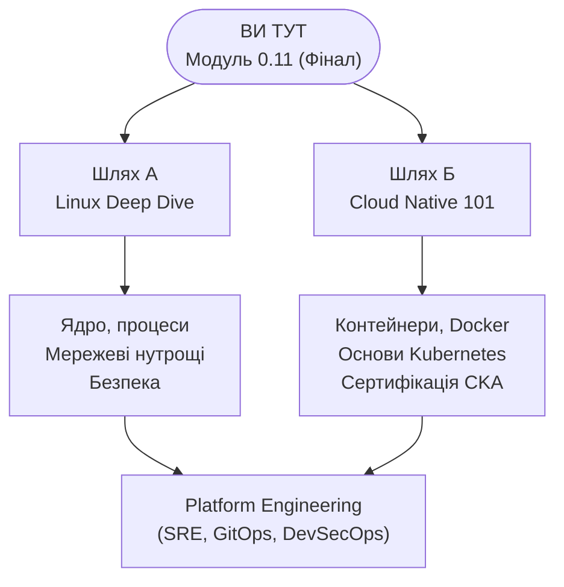

> **Складність**: `[СЕРЕДНЯ]` — Підсумковий проєкт
>
> **Час на проходження**: 40-50 хвилин
>
> **Передумови**: [Модуль 0.1](../module-0.1-what-is-a-computer/) до [Модуля 0.10](/uk/prerequisites/zero-to-terminal/module-0.10-what-is-the-cloud/) — усі попередні модулі

---

## Що ви зможете зробити

Після завершення цього модуля ви зможете:
- **Розгорнути** простий вебсервер через термінал та зрозуміти, як він працює «під капотом»
- **Відстежити** HTTP-запит від браузера до сервера і назад, пояснюючи кожен крок
- **Протестувати** працюючий сервер за допомогою `curl` з командного рядка
- **Поєднати** концепції з усіх попередніх модулів: файли, мережі, порти, SSH — тут усе збирається воєдино

---

## Чому це важливо

Це фінальний іспит. Кульмінація. Момент, коли все стає на свої місця.

Ви збираєтеся **розгорнути вебсайт, який зможе відвідати будь-хто. Використовуючи лише термінал.**

Жодних вигадливих конструкторів сайтів, де все робиться мишкою. Жодного WordPress чи Squarespace. Тільки ви, термінал і навички, які ви здобували з Модуля 0.1.

Подумайте, з чого ви починали. У Модулі 0.1 ви дізналися, що таке комп'ютер. Тепер ви збираєтеся використати його, щоб викласти щось в інтернет. Це не дрібниця. Це саме те, що професіонали роблять щодня — і ви зараз зробите те саме.

Цей модуль має **два варіанти**:

- **Варіант А: Локально (безкоштовно, без реєстрації)** — запустіть вебсервер на власній машині за допомогою Docker
- **Варіант Б: У хмарі (безкоштовно, потрібна реєстрація)** — розгорніть сайт на справжньому хмарному сервері, до якого має доступ увесь інтернет

Варіант А швидший і простіший. Варіант Б ближчий до реальних робочих процесів. Обидва варіанти правильні. Оберіть той, що вам цікавіший, або зробіть обидва.

---

## Навички, які ви здобули

Перш ніж почати, підіб'ємо підсумки. Кожен модуль, який ви пройшли, відіграє тут свою роль:

| Модуль | Навичка | Як ви її використаєте |
|--------|---------|-----------------------|
| 0.1 | Як працюють комп'ютери | Розуміння того, що насправді робить сервер |
| 0.2 | Термінал | Ваш єдиний інтерфейс для всього проєкту |
| 0.3 | Команди | Навігація, створення файлів, перевірка статусу |
| 0.4 | Файли та каталоги | Створення HTML-файлу вашого вебсайту |
| 0.5 | Редагування файлів | Написання вебсторінки за допомогою nano |
| 0.7 | Мережі | Розуміння портів, IP-адрес та того, як браузери знаходять сервери |
| 0.8 | Сервери та SSH | Знання того, що таке сервер (і підключення до нього у Варіанті Б) |
| 0.9 | Пакети | Встановлення ПЗ на сервері |
| 0.10 | Хмара | Розуміння того, де живе ваш сервер (Варіант Б) |

Якщо ви пропустили якийсь із цих модулів, поверніться і пройдіть його. Цей підсумковий проєкт передбачає, що у вас є всі дев'ять навичок.

---

## Що таке вебсервер?

Перш ніж ми щось розгорнемо, з'ясуймо одну концепцію.

**Вебсервер** — це програма, яка очікує (слухає) запити та надсилає у відповідь вебсторінки. Це все. Коли ви вводите `google.com` у браузері, браузер надсилає запит до вебсервера Google, а той надсилає назад HTML-код, який браузер відображає.

Найпопулярніший вебсервер у світі називається **nginx** (вимовляється як «енджин-ікс»). Він обслуговує приблизно третину всіх сайтів в інтернеті. Сьогодні ми використаємо саме його.

У нашій аналогії з ресторанною кухнею: nginx — це **офіціант**. Він приймає замовлення (HTTP-запити від браузерів) і приносить їжу (HTML-сторінки) клієнту.

---

## Варіант А: Локальний сервер з Docker (Безкоштовно, без реєстрації)

Цей варіант використовує **Docker** — інструмент, який запускає додатки в ізольованих контейнерах. Зараз вам не потрібно глибоко розуміти Docker (для цього є курс Cloud Native 101). Поки що просто сприймайте його як спосіб запустити програму без її остаточного встановлення на вашу машину.

### Крок 1: Встановіть середовище виконання контейнерів

Вам потрібен інструмент для запуску контейнерів. Оберіть **будь-який** із перелічених — для нашої вправи вони працюють однаково:

| Інструмент | Найкраще для | Ліцензія |
|------------|--------------|----------|
| [Docker Desktop](https://www.docker.com/products/docker-desktop/) | Найпопулярніший, велика спільнота | Безкоштовно для особистого/малого бізнесу |
| [OrbStack](https://orbstack.dev/) | macOS — найшвидший, найлегший | Безкоштовно для особистого використання |
| [Podman Desktop](https://podman-desktop.io/) | Без демона, безпечний за замовчуванням | Безкоштовно та Open Source |
| [Rancher Desktop](https://rancherdesktop.io/) | Має вбудований K8s | Безкоштовно та Open Source |

- **macOS/Windows**: Завантажте та встановіть будь-який із них.
- **Linux**:
  ```bash
  # Варіант А: Docker
  sudo apt update && sudo apt install docker.io -y
  sudo systemctl start docker
  sudo usermod -aG docker $USER

  # Варіант Б: Podman (не потребує демона та root-прав)
  sudo apt update && sudo apt install podman -y
  ```
  (Якщо використовуєте Docker, вийдіть із системи та зайдіть знову після команди `usermod`.)

> **Примітка**: Якщо ви встановили Podman, команди ідентичні — просто пишіть `podman` замість `docker`. Ви навіть можете створити аліас: `alias docker=podman`

Перевірте, чи працює Docker:

```bash
docker --version
```

Ви маєте побачити щось на кшталт `Docker version 24.x.x` або новішу. Якщо бачите «command not found», значить Docker ще не встановлено.

### Крок 2: Запустіть nginx

Ось вона. Одна команда для запуску вебсервера:

```bash
docker run -d -p 8080:80 --name my-website nginx
```

> **Зупиніться та подумайте**: Згадайте концепцію мережевих портів з Модуля 0.6. Якщо порт діє як виділений док для прийому мережевого трафіку на вашій машині, що станеться на рівні операційної системи, якщо Docker спробує прив'язатися до порту 8080, коли інший додаток уже активно слухає цей самий порт?

Розберемо кожну частину цієї команди (бо розуміння важливіше за зазубрювання):

| Частина | Що вона робить |
|---------|----------------|
| `docker run` | Запустити новий контейнер |
| `-d` | Запустити у фоновому режимі (detached), щоб термінал залишився вільним |
| `-p 8080:80` | З'єднати порт 8080 вашого комп'ютера з портом 80 контейнера |
| `--name my-website` | Дати контейнеру зрозумілу назву |
| `nginx` | Використати образ nginx (Docker завантажить його автоматично) |

Пам'ятаєте Модуль 0.6 про мережі? Порт 80 є стандартним для вебтрафіку. Ми перенаправляємо його на 8080 на вашій машині, щоб він не конфліктував ні з чим іншим.

> **Поєднайте точки**: Прапор `-p 8080:80` — це Модуль 0.6 (порти) у дії. Ваш браузер надсилає запит на порт 8080 вашої машини. Docker пересилає його на порт 80 всередині контейнера, де слухає nginx. Відповідь повертається тим самим шляхом. Усі концепції з попередніх модулів зараз працюють разом.

### Крок 3: Перевірте роботу

Відкрийте веббраузер і перейдіть за адресою:

```
http://localhost:8080
```

Ви маєте побачити сторінку з написом **"Welcome to nginx!"**

Це вебсервер, що працює на вашій машині. Ви щойно це зробили. Однією командою.

### Крок 4: Створіть власну вебсторінку

> **Зупиніться та подумайте**: Поміркуйте, як вебсервер взаємодіє з файловою системою. Чи завантажує nginx усі HTML-файли в пам'ять під час запуску, чи він зчитує файл із жорсткого диска щоразу, коли надходить новий HTTP-запит? Виходячи з вашої відповіді, як система відреагує, якщо ви перезапишете файл `index.html`, поки сервер усе ще працює?

Тепер замінимо цю стандартну сторінку на ту, яку зробите ви. Відкрийте термінал і створіть HTML-файл:

```bash
nano ~/index.html
```

Введіть (або вставте) наступне:

```html
<!DOCTYPE html>
<html>
<head>
    <title>Мій перший сервер</title>
    <style>
        body {
            font-family: Arial, sans-serif;
            max-width: 600px;
            margin: 80px auto;
            text-align: center;
            background-color: #1a1a2e;
            color: #eee;
        }
        h1 { color: #00d4ff; }
        p { font-size: 1.2em; line-height: 1.6; }
        .badge {
            display: inline-block;
            background: #00d4ff;
            color: #1a1a2e;
            padding: 8px 20px;
            border-radius: 20px;
            font-weight: bold;
            margin-top: 20px;
        }
    </style>
</head>
<body>
    <h1>Привіт, Інтернете!</h1>
    <p>Ця сторінка працює на сервері, який я налаштував самостійно,
       використовуючи лише термінал.</p>
    <p>Я пройшов шлях від «що таке комп'ютер» до «я розгорнув вебсайт»
       за десять модулів.</p>
    <div class="badge">Zero to Terminal: Виконано</div>
</body>
</html>
```

Збережіть та вийдіть (`Ctrl + O`, Enter, `Ctrl + X`).

### Крок 5: Скопіюйте сторінку в контейнер

Пам'ятайте, вебсервер працює всередині контейнера Docker. Вам потрібно скопіювати туди свій файл:

```bash
docker cp ~/index.html my-website:/usr/share/nginx/html/index.html
```

Ця команда каже: «Скопіюй `index.html` з мого домашнього каталогу в контейнер з назвою `my-website`, поклавши його за шляхом `/usr/share/nginx/html/index.html`».

Шлях `/usr/share/nginx/html/` — це місце, де nginx шукає вебсторінки для роздачі. Це просто каталог — такий самий, як ті, з якими ви працювали в Модулі 0.4.

### Крок 6: Перегляньте СВОЮ сторінку

Поверніться в браузер і оновіть сторінку `http://localhost:8080`.

Ви маєте побачити свою власну сторінку — темний фон, блакитний заголовок, ваші слова.

**Ви щойно розгорнули вебсайт.**

Ви створили файл (Модуль 0.4), відредагували його за допомогою nano (Модуль 0.5), зрозуміли, що означають порт і localhost (Модуль 0.6), і подали його через працюючий процес сервера (Модуль 0.7). Усе поєдналося.

### Прибирання

Коли налюбуєтеся своєю роботою:

```bash
docker stop my-website
docker rm my-website
```

Це зупинить і видалить контейнер. Файл `~/index.html` залишиться на вашій машині.

---

## Варіант Б: Хмарний сервер (Безкоштовний рівень)

Цей варіант розміщує ваш сайт на **справжньому сервері в інтернеті** з публічною IP-адресою. Будь-хто у світі зможе його відвідати. Саме так працюють справжні сайти.

Вам знадобиться обліковий запис безкоштовного рівня (free tier) у хмарного провайдера. Наведені нижче інструкції використовують загальний підхід, що працює з AWS, GCP або Oracle Cloud.

### Крок 1: Отримайте безкоштовну хмарну VM

Зареєструйтеся на безкоштовному рівні у одного з цих провайдерів:

- **Oracle Cloud** (найщедріший безкоштовний рівень — Always Free VMs): [cloud.oracle.com/free](https://cloud.oracle.com/free)
- **Google Cloud** ($300 безкоштовного кредиту на 90 днів): [cloud.google.com/free](https://cloud.google.com/free)
- **AWS** (доступність безкоштовних VM залежить від дати створення акаунта: акаунти, створені до **15 липня 2025**, використовують старий 12-місячний рівень EC2, а створені після цієї дати — новий план з іншими лімітами): [aws.amazon.com/free](https://aws.amazon.com/free)

Створіть найменшу доступну Linux VM (Ubuntu найпростіша для новачків). Під час налаштування:

1. Оберіть **Ubuntu** як операційну систему.
2. Виберіть **найменший екземпляр (instance), доступний безкоштовно**. Для AWS перевірте, що консоль позначає як "free-tier eligible" для вашого типу акаунта: старі акаунти зазвичай бачать `t2.micro` або `t3.micro`, нові — `t3.micro`, `t3.small`, `t4g.micro` тощо.
3. **Завантажте SSH-ключ**, коли з'явиться пропозиція — він знадобиться для підключення.
4. Переконайтеся, що група безпеки (security group) / брандмауер дозволяє трафік через **порт 22 (SSH)** та **порт 80 (HTTP)**.

Запишіть **публічну IP-адресу** вашого нового сервера. Вона виглядатиме приблизно так: `34.123.45.67`.

### Крок 2: Підключіться через SSH

Пам'ятаєте Модуль 0.7? Ось де SSH стає реальністю:

```bash
chmod 400 ~/Downloads/my-key.pem
ssh -i ~/Downloads/my-key.pem ubuntu@YOUR_PUBLIC_IP
```

Замініть `YOUR_PUBLIC_IP` на реальну IP-адресу вашої VM. Замініть шлях до ключа на той, де ви його зберегли.

Якщо все налаштовано правильно, ви побачите вітальне повідомлення Linux і запрошення до введення команд. Тепер ви всередині комп'ютера, що стоїть у дата-центрі десь далеко — можливо, на іншому континенті.

### Крок 3: Встановіть nginx

Тепер використайте навички управління пакетами з Модуля 0.8:

```bash
sudo apt update
sudo apt install nginx -y
```

Це все. nginx встановлено і він працює. В Ubuntu він запускається автоматично після встановлення.

Перевірте статус:

```bash
sudo systemctl status nginx
```

Ви маєте побачити зелений напис `active (running)`.

> **Зупиніться та подумайте**: Ви перевірили, що процес nginx запущений, але зовнішні мережеві брандмауери можуть блокувати трафік. Як можна використати інструмент термінала всередині самої VM, щоб довести, що nginx активно роздає HTML-сторінку, повністю ізолювавши тест від будь-яких зовнішніх мережевих проблем?

### Крок 4: Перевірте сторінку за замовчуванням

Відкрийте браузер на своєму комп'ютері та введіть:

```
http://YOUR_PUBLIC_IP
```

Ви маєте побачити стандартну сторінку nginx. Ця сторінка передається з машини в дата-центрі через весь інтернет у ваш браузер. Зупиніться на мить, щоб усвідомити це.

### Крок 5: Створіть свою кастомну сторінку

> **Зупиніться та подумайте**: Вебсервер перетворює URL-адреси на шляхи у файловій системі. Якщо nginx відображає кореневий URL (`/`) безпосередньо на каталог `/var/www/html/`, який саме шлях має вказати користувач у браузері, щоб отримати доступ до файлу зображення, завантаженого за шляхом `/var/www/html/assets/logo.png`?

Залишаючись підключеними через SSH, відредагуйте стандартну сторінку:

```bash
sudo nano /var/www/html/index.html
```

> **Примітка**: В Ubuntu шлях до nginx зазвичай `/var/www/html/`, а не `/usr/share/`. Різні системи розміщують вебфайли в дещо різних місцях.

Видаліть усе з файлу (багаторазово натискайте `Ctrl + K`) і введіть свій HTML:

```html
<!DOCTYPE html>
<html>
<head>
    <title>Мій перший хмарний сервер</title>
    <style>
        body {
            font-family: Arial, sans-serif;
            max-width: 600px;
            margin: 80px auto;
            text-align: center;
            background-color: #1a1a2e;
            color: #eee;
        }
        h1 { color: #00d4ff; }
        p { font-size: 1.2em; line-height: 1.6; }
        .badge {
            display: inline-block;
            background: #00d4ff;
            color: #1a1a2e;
            padding: 8px 20px;
            border-radius: 20px;
            font-weight: bold;
            margin-top: 20px;
        }
    </style>
</head>
<body>
    <h1>Привіт, Інтернете!</h1>
    <p>Ця сторінка працює на справжньому хмарному сервері, який я налаштував самостійно,
       використовуючи лише SSH та термінал.</p>
    <p>Я пройшов шлях від «що таке комп'ютер» до «я розгорнув вебсайт в інтернеті» за десять модулів.</p>
    <div class="badge">Zero to Terminal: Виконано</div>
</body>
</html>
```

Збережіть та вийдіть (`Ctrl + O`, Enter, `Ctrl + X`).

### Крок 6: Перегляньте сторінку наживо в інтернеті

Оновіть `http://YOUR_PUBLIC_IP` у браузері.

Ваша сторінка тепер **доступна всьому світу**. Ви можете надіслати цю IP-адресу другові, і він теж побачить ваш сайт. Зі свого телефону, з іншої країни — звідусіль.

Ви зробили це за допомогою SSH (Модуль 0.7), управління пакетами (Модуль 0.8), редагування файлів (Модуль 0.5) та розуміння мереж (Модуль 0.6) і хмарних обчислень (Модуль 0.9).

### Важливо: Попередження про безкоштовний рівень

Хмарні VM можуть коштувати грошей, якщо ви перевищите ліміти безкоштовного рівня. Коли завершите вправу:

- **Зупиніть або видаліть (terminate) вашу VM** через консоль хмарного провайдера.
- Або залиште її, якщо ваш рівень це дозволяє (наприклад, Oracle Always Free).
- **Ніколи не залишайте хмарні ресурси працювати, якщо ви про них забули** — це одна з найпоширеніших (і найдорожчих) помилок новачків.

Щоб відключитися від SSH:

```bash
exit
```

---

## Чи знали ви?

- **Перший у світі вебсайт досі працює.** Тім Бернерс-Лі створив його в 1991 році в CERN. Він працював на комп'ютері NeXT із приклеєною запискою: «Ця машина — сервер. НЕ ВИМИКАТИ!!». Ви все ще можете відвідати його за адресою [info.cern.ch](http://info.cern.ch). Ваше сьогоднішнє налаштування сервера було складнішим, ніж те, з якого почалася Всесвітня павутина.

- **nginx був створений для вирішення проблеми масштабування.** У 2002 році Ігор Сисоєв поставив собі за мету вирішити «проблему C10K» — обслуговування 10 000 одночасних з'єднань на одному сервері. На той час Apache (панівний вебсервер) мав із цим труднощі. Сисоєв витратив два роки на написання nginx, який став відомим завдяки своїй подійно-орієнтованій архітектурі. [Офіційний сайт nginx](https://nginx.org/en/) підкреслює його продуктивність, а розробники зазначають, що за правильного налаштування він може обробляти сотні тисяч одночасних з'єднань.

- **Ваш сайт обслуговується так само як Netflix.** Серйозно. Netflix, Airbnb та Dropbox використовують nginx як вебсервер. Різниця між вашим налаштуванням і їхнім лише в масштабі (у них тисячі серверів) та конфігурації (цілі команди інженерів підлаштовують параметри). Але базова технологія — процес, що слухає порт 80 і повертає HTML — ідентична.

---

## Типові помилки

| Помилка | Чому це проблема | Що робити натомість |
|---------|------------------|---------------------|
| Забули відкрити порт 80 у хмарному брандмауері | Ваш сервер працює, але ніхто не може до нього достукатися | Перевірте групи безпеки (security groups) / правила брандмауера; дозвольте вхідний HTTP на порт 80 |
| Використання `http://localhost` для хмарного варіанта | `localhost` означає *вашу* машину, а не віддалений сервер | Використовуйте публічну IP-адресу вашої хмарної VM |
| Редагування `index.html` за неправильним шляхом | nginx не покаже ваш файл, якщо він у неправильному каталозі | Ubuntu використовує `/var/www/html/`, Docker — `/usr/share/nginx/html/` |
| Забули `sudo` при редагуванні файлів на сервері | Файли вебсервера належать користувачу root; ви отримаєте "Permission denied" | Використовуйте `sudo nano /var/www/html/index.html` |
| Залишили хмарну VM працювати після вправи | Безкоштовні рівні мають ліміти; з вас можуть списати кошти | Зупиніть або видаліть VM, коли завершите експерименти |
| Не завантажили SSH-ключ під час створення VM | Ви не зможете підключитися до сервера без нього | Завжди зберігайте файл ключа негайно; деякі провайдери дають завантажити його лише один раз |

---

## Контрольні запитання

1. **Ви пояснюєте роль вебсервера колезі, який налаштовує новий додаток. Він запитує: «Я написав HTML-файли, навіщо мені цей nginx на сервері?». Як ви поясните роль nginx у доставці цих файлів користувачам?**
   <details>
   <summary>Відповідь</summary>
   Nginx діє як «офіціант» або посередник між файловою системою сервера та зовнішнім інтернетом. Хоча HTML-файли лежать на диску, браузер не може просто залізти у ваш комп'ютер і прочитати їх. Nginx активно слухає певний мережевий порт (зазвичай 80 або 443) на предмет вхідних HTTP-запитів. Коли запит надходить, nginx інтерпретує його, знаходить відповідний HTML-файл на диску, упаковує його у валідну HTTP-відповідь і надсилає назад через мережу в браузер користувача. Без цього механізму ваші HTML-файли будуть недоступні для вебу.
   </details>

2. **Ви успішно запустили `docker run -d -p 9090:80 nginx` на локальній машині. Однак за звичкою ви вводите в браузері `http://localhost:8080`. Що станеться і чому зміна першого числа у прапорці `-p` призвела до такого результату?**
   <details>
   <summary>Відповідь</summary>
   Ваш браузер покаже помилку «connection refused» або «site can't be reached». Прапорець `-p 9090:80` наказує Docker зв'язати порт 9090 на вашій фізичній машині (хості) з портом 80 всередині ізольованого контейнера. Відвідуючи `localhost:8080`, ваш браузер стукає в мережеві двері (порт 8080), які ніхто не слухає. Nginx працює в контейнері й чекає на трафік на своєму внутрішньому порту 80, але цей трафік тепер іде виключно з порту 9090 вашої машини, а не з 8080.
   </details>

3. **Ви розгорнули сайт на хмарній VM (Варіант Б) і скопіювали `index.html` у `/var/www/html/index.html`. Потім ви спробували метод з Docker (Варіант А) і скопіювали той самий файл у `/var/www/html/index.html` всередині контейнера, але браузер все одно показує стандартну сторінку "Welcome to nginx!". Що пішло не так і чому це вчить щодо конфігурації ПЗ?**
   <details>
   <summary>Відповідь</summary>
   Контейнер ігнорує ваш файл, тому що офіційний образ nginx для Docker налаштований шукати вебфайли в іншому каталозі — `/usr/share/nginx/html/`. Програми на кшталт nginx не мають єдиного «магічного» місця для файлів; вони покладаються на конфігураційний файл, який вказує шлях. Супроводжувачі пакетів для Ubuntu обрали `/var/www/html/`, а творці образу Docker — `/usr/share/nginx/html/`. Це вчить нас того, що шляхи — це довільний вибір розробників або системних адміністраторів, і потрібно завжди адаптуватися до специфічного середовища.
   </details>

4. **Простежте покроково, що відбувається, коли ви вводите `http://YOUR_PUBLIC_IP` у браузері, а ваш nginx повертає кастомну сторінку. Згадайте TCP, порти, nginx та файлову систему.**
   <details>
   <summary>Відповідь</summary>
   Ваш комп'ютер ініціює TCP-з'єднання з цією IP-адресою на порт 80 (стандарт для HTTP). Після завершення «рукостискання» TCP, браузер надсилає HTTP-запит GET для кореневого документа (`/`). Вебсервер nginx, що слухає порт 80, отримує цей запит, звертається до своєї конфігурації, щоб знайти відповідний каталог на диску (наприклад, `/var/www/html/`), і читає там файл `index.html`. Нарешті, nginx надсилає вміст цього файлу назад через TCP-з'єднання як HTTP-відповідь, яку браузер перетворює на видиму вебсторінку.
   </details>

5. **Ви допомагаєте молодшому розробнику, який запустив команду Docker, але його браузер одразу показує помилку «connection refused» на `localhost:8080`. Назвіть три найімовірніші точки відмови в мережевому шляху.**
   <details>
   <summary>Відповідь</summary>
   Це зазвичай означає, що порт ніхто не слухає. По-перше, контейнер міг впасти або зупинитися (перевірте через `docker ps`). По-друге, могли бути неправильно вказані порти, наприклад `-p 8080:8080` замість `-p 8080:80`. По-третє, інший додаток на вашому комп'ютері вже може використовувати порт 8080, не даючи Docker його зайняти (це можна перевірити командою `lsof -i :8080`).
   </details>

---

## Практична вправа: Зробіть це своїм

Ви розгорнули шаблонну сторінку. Тепер зробіть її **справді своєю**.

### Частина 1: Завдання на кастомізацію

Налаштуйте свою вебсторінку так, щоб вона містила:
1. **Ваше ім'я** (або псевдонім).
2. **Три речі, які ви дізналися** в цьому курсі, і які вас здивували.
3. **Посилання** на будь-який сайт, який вам подобається (використовуйте тег `<a href="...">`).

Підказка щодо синтаксису посилання:
```html
<a href="https://kubedojo.dev" style="color: #00d4ff;">KubeDojo</a>
```

### Частина 2: Завдання «Зламайте та полагодьте»

Тепер, коли сервер працює, давайте навмисно його зламаємо. У реальному світі вміння знаходити несправності так само важливе, як і розгортання.

**Крок 1: Зламайте розгортання**
Залежно від обраного варіанта, внесіть помилку в конфігурацію:
- **Варіант А (Локально)**: Зупиніть контейнер (`docker stop my-website` та `docker rm my-website`). Запустіть новий із помилковим портом: `docker run -d -p 9090:80 --name broken-site nginx`.
- **Варіант Б (Хмара)**: Підключіться до VM і перейменуйте файл `index.html` на щось інше: `sudo mv /var/www/html/index.html /var/www/html/broken.html`.

**Крок 2: Спостерігайте за результатом**
- Спробуйте відкрити сайт у браузері. Яку помилку ви бачите? Чому це сталося?

**Крок 3: Діагностуйте та лагодьте**
Використайте свої навички роботи в терміналі, щоб виправити проблему та зробити сайт знову доступним за правильною адресою.

### Критерії успіху
- Ваша кастомна сторінка завантажується в браузері.
- Вона містить ваше ім'я, три факти та посилання.
- Ви редагували її через nano.
- Ви успішно зламали й полагодили сервер.

---

## Що далі? — Оберіть свій шлях

Ви завершили курс **Zero to Terminal**. Ви пройшли шлях від повного нерозуміння до розгортання власного вебсайту. Це справжнє досягнення.

Тепер у вас є три шляхи:

### Шлях А: Глибоке занурення в Linux
**Сподобався термінал? Йдіть далі.**
Цей шлях веде всередину ОС: ядро, управління процесами, мережі «під капотом», дозволи та безпека. Це знання, що відрізняють користувача Linux від того, хто його справді розуміє.
> Почніть тут: [Основи Linux](/linux/)

### Шлях Б: Cloud Native
**Хочете створювати та розгортати додатки в масштабах інтернету?**
Цей шлях продовжує там, де ми зупинилися. Ви вивчите контейнери (Docker), а потім Kubernetes — систему, що автоматично керує тисячами контейнерів на сотнях серверів.
> Почніть тут: [Cloud Native 101](/uk/prerequisites/cloud-native-101/module-1.1-what-are-containers/)

### Шлях В: Усе разом
**Більшість старших інженерів знають і те, і інше.** Почніть з того, що вам цікавіше зараз. Інший шлях нікуди не зникне.



---

## Заключне слово

Ви щойно розгорнули сайт в інтернеті, використовуючи лише текстові команди.

Десять модулів тому ви навіть не знали, що таке термінал. Ви дізналися, з чого складається комп'ютер, навчилися навігації, роботі з файлами, мережами та хмарами.

Це не просто «рівень новачка». Це інженерія.

**Ви на своєму місці.**

---

> *«Експерт у будь-чому колись був новачком».* — Гелен Гейз
