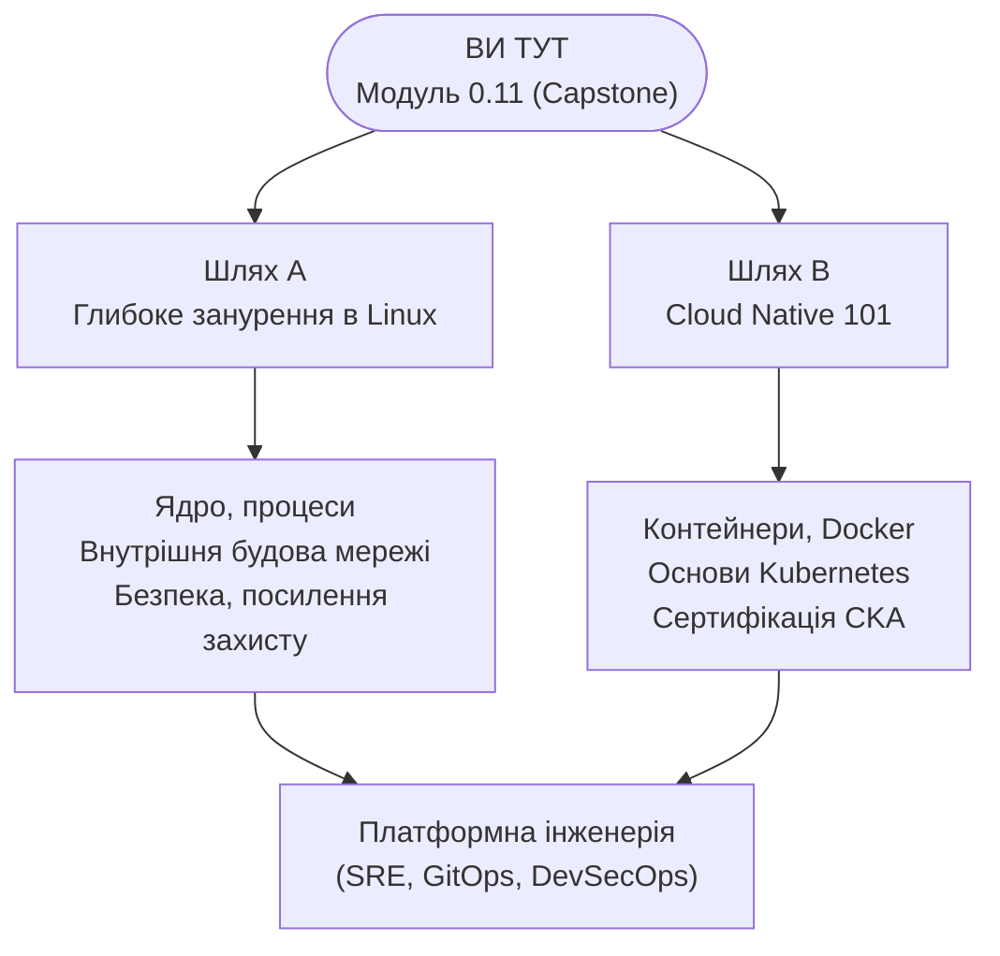

> **Складність**: `[MEDIUM]` - Підсумковий проєкт
>
> **Час на проходження**: 55-70 хвилин
>
> **Передумови**: Від [Модуля 0.1](../module-0.1-what-is-a-computer/) до [Модуля 0.10](/prerequisites/zero-to-terminal/module-0.10-what-is-the-cloud/) — усі

---

## Що ви зможете зробити

Після цього модуля ви зможете:

- **Розгорнути** керований з термінала вебсервер за допомогою локального контейнера або хмарної віртуальної машини (VM), а потім пояснити, який процес очікує на запити.
- **Відстежити** HTTP-запит від браузера через порти, мережу, nginx, файлову систему та шлях відповіді назад до користувача.
- **Діагностувати** типові збої першого сервера за допомогою `curl`, `docker ps`, `systemctl`, перевірок портів, перевірок брандмауера та уважної перевірки шляхів.
- **Порівняти** локальне розгортання в Docker та розгортання на хмарній віртуальній машині (VM), вибираючи безпечніший варіант для навчальної мети, демоверсії або реального публічного тесту.

---


## Чому це важливо

Гіпотетичний сценарій: ви щойно завершили перші десять модулів на цьому етапі, і друг запитує, чи може вся ця робота в терміналі насправді створити щось видиме. Ви могли б описувати файли, порти, SSH, пакети та хмарні віртуальні машини по одній темі за раз, але краща відповідь — розмістити сторінку на сервері й дозволити йому її відкрити. Цей підсумковий етап перетворює абстрактні навички на робочу систему, саме тому цей модуль присвячено розгортанню, тестуванню, зламу та відновленню крихітного вебсайту, а не читанню ще одного визначення.

Цей невеликий вебсайт не є іграшкою, оскільки він використовує ті самі базові принципи, що й професійні системи. Робоча платформа має більше рівнів, суворішу безпеку, автоматизацію, моніторинг, сертифікати TLS, кілька середовищ і, як правило, Kubernetes 1.35+ десь далі на шляху KubeDojo. Однак під цими рівнями все одно є той самий ланцюжок: програма прослуховує порт, отримує HTTP-запит, читає або генерує контент і відправляє відповідь назад через мережу.

У вас є два шляхи розгортання, оскільки «сервер» може означати більше ніж одну корисну річ для новачка. Варіант А запускає nginx локально в контейнері, щоб ви могли безпечно практикуватися без реєстрації хмарного облікового запису або відкриття будь-чого в публічному інтернеті. Варіант Б встановлює nginx на хмарну віртуальну машину, щоб ви могли отримати досвід роботи з SSH, управлінням пакетами, публічними IP-адресами та хмарними брандмауерами в одній цілеспрямованій вправі. Обидва шляхи навчають одному й тому ж потоку запитів, і найважливішою навичкою є не запам'ятовування жодної з послідовностей команд, а вміння міркувати про систему, коли щось не відповідає.

---

## Навички, які ви здобули

Цей модуль є підсумковим, оскільки він вимагає одночасного застосування попередніх концепцій. Вебсервер не існує окремо від файлів, команд, мереж, хмар чи SSH; це місце, де ці ідеї зустрічаються в конкретному робочому процесі. Якщо будь-який попередній модуль здавався ізольованим, саме тут він має почати відчуватися як частина цілого, адже одне оновлення сторінки в браузері залежить майже від кожної навички, яку ви практикували досі.

| Модуль | Навичка | Як ви її використаєте |
|--------|---------|-----------------------|
| 0.1 | Як працюють комп'ютери | Розуміння того, що насправді робить сервер |
| 0.2 | Термінал | Ваш єдиний інтерфейс для всього цього проєкту |
| 0.3 | Команди | Навігація, створення файлів, перевірка статусу |
| 0.4 | Файли та каталоги | Створення HTML-файлу вашого вебсайту |
| 0.5 | Редагування файлів | Написання вашої вебсторінки за допомогою nano |
| 0.6 | Мережі | Розуміння портів, IP-адрес і того, як браузери знаходять сервери |
| 0.7 | Сервери та SSH | Знання того, що таке сервер, і підключення до нього у Варіанті Б |
| 0.8 | Пакети | Встановлення програмного забезпечення на сервер |
| 0.9 | Хмара | Розуміння того, де розміщено ваш сервер у Варіанті Б |

Ця таблиця також є діагностичною картою. Коли браузер не може завантажити вашу сторінку, ви можете запитати, який рівень дає збій, замість того, щоб вгадувати навмання. Проблема зі шляхом до файлу вказує на Модулі 0.4 і 0.5, проблема з портом вказує на Модуль 0.6, проблема з віддаленим входом вказує на Модуль 0.7, а проблема зі встановленням вказує на Модуль 0.8. Хороше усунення несправностей — це часто просто дисциплінована пам'ять: назвіть рівень, протестуйте цей рівень, а потім переходьте до наступного.

Перш ніж продовжити, виберіть шлях для першого проходження. Виберіть шлях локального контейнера, якщо хочете отримати найшвидший і найбезпечніший доказ того, що сервер може працювати на вашій власній машині. Виберіть шлях хмарної віртуальної машини, якщо ви конкретно хочете отримати досвід публікації сторінки, до якої хтось інший може отримати доступ з іншої мережі. Ви можете виконати обидва, і це корисно, оскільки відмінності роблять спільні концепції легшими для розуміння.

---

## Що насправді робить вебсервер

Вебсервер — це програма, яка чекає на мережеві запити та відправляє відповіді. Це звучить майже надто просто, але в цій простоті і є суть: інтернет працює, тому що браузери та сервери погоджуються на спільний протокол, HTTP, для запитів і відповідей. Ваш браузер не читає магічним чином файли з іншого комп'ютера. Він відкриває мережеве з'єднання, надсилає структурований запит і чекає, поки серверна програма вирішить, яку відповідь слід повернути.

nginx, що вимовляється як «енджин-екс», — це серверна програма, яку ви будете використовувати сьогодні. Вона популярна, оскільки була розроблена для ефективної обробки з'єднань, простого обслуговування статичних файлів і гнучкої конфігурації, що робить її корисною як для невеликих вправ, так і для великих робочих систем. У цьому модулі nginx виконуватиме одне вузьке завдання: прослуховувати HTTP-трафік, зіставляти шлях URL з HTML-файлом, читати цей файл з диска та відправляти його назад із заголовками, які очікує ваш браузер.

Аналогія з рестораном із попередніх модулів усе ще допомагає, якщо ви не заходите з нею надто далеко. Браузер — це клієнт, що замовляє страву, nginx — це офіціант, який приймає замовлення, файлова система — це полиця на кухні, де зберігаються готові страви, а HTML-файл — це страва, що подається до столу. Важлива деталь полягає в тому, що офіціант має бути активно на зміні. Прекрасний HTML-файл, що лежить на диску, не є вебсайтом, поки серверний процес не прослуховуватиме запити й не повертатиме його.

Коли ви вводите URL-адресу, кілька рішень ухвалюються швидко. Якщо URL містить домен, DNS перетворює ім'я на IP-адресу; якщо URL містить просто IP-адресу, цей крок уже виконано. Браузер обирає порт, зазвичай порт 80 для HTTP та порт 443 для HTTPS, а потім відкриває TCP-з'єднання із сервером. Після того, як з'єднання встановлено, браузер надсилає HTTP-запит, наприклад «GET /», і nginx перетворює цей шлях із косою рискою на пошук файлу.

Зупиніться та подумайте: якщо nginx працює правильно, але очікуваний файл відсутній, що, на вашу думку, має показати браузер? Ваша відповідь має відокремлювати мережевий рівень від прикладного рівня. Відсутній файл відрізняється від закритого порту, а закритий порт відрізняється від тайм-ауту хмарного брандмауера, хоча всі три можуть відчуватися як «вебсайт не працює», коли ви дивитесь на вкладку браузера.

Шлях запиту для вашого першого сервера виглядає так. Зверніть увагу, що кожна стрілка має тест, який ви можете запустити пізніше, саме тому діаграми не є просто прикрасою в експлуатаційній роботі. Якщо система заплутана, намалюйте шлях, напишіть очікувану передачу на кожному кроці та тестуйте ці передачі по одній.

| Крок | Компонент | Запитання, яке слід поставити | Перший тест |
|------|-----------|-------------------------------|-------------|
| 1 | Браузер | Чи я зробив запит до правильного хоста та порту? | Перевірте ще раз URL-адресу та номер порту |
| 2 | Мережа | Чи може трафік досягти цієї IP-адреси та порту? | Використайте деталі помилки браузера або `curl` |
| 3 | Процес сервера | Чи дійсно працює nginx? | Використайте `docker ps` або `systemctl status` |
| 4 | Файлова система | Чи є файл у шляху, який обслуговує nginx? | Перевірте налаштований кореневий вебкаталог |
| 5 | Відповідь | Чи повернув сервер очікуваний HTML? | Використайте `curl` перед тим, як звинувачувати браузер |

Ця модель запиту є однаковою незалежно від того, чи працює nginx у локальному контейнері, чи на хмарній віртуальній машині. Локальний шлях додає відображення портів Docker між вашим хостом і контейнером. Хмарний шлях додає SSH, публічну IP-адресу, брандмауер провайдера та сервіс nginx, встановлений за допомогою менеджера пакетів. Ці доповнення мають значення, але вони не змінюють головної ідеї про те, що HTTP-запит має досягти процесу, який прослуховує, і цей процес має знати, який файл надати.

---


## Варіант А: Локальний сервер з Docker

Локальний варіант використовує середовище виконання контейнерів для запуску nginx без його перманентного встановлення безпосередньо у вашу операційну систему. Docker, Podman, OrbStack та Rancher Desktop пакують застосунок та його файлову систему в ізольоване середовище, що називається контейнером. Вам поки не обов'язково досконало знати внутрішню будову контейнерів, але потрібно зрозуміти базову операційну ідею: контейнер має власний простір процесів та файлову систему, тоді як ваш комп'ютер залишається хостом, який переспрямовує туди трафік.

Оберіть одне середовище виконання контейнерів та встановіть його перед виконанням команд. Docker Desktop — це найпоширеніший шлях для початківців, OrbStack — варіант, орієнтований на macOS, Podman Desktop робить акцент на моделі без демона (daemonless) та без прав суперкористувача (rootless), а Rancher Desktop містить опцію Kubernetes для подальшого вивчення. Команди в цій вправі використовують `docker`, оскільки офіційний образ nginx чітко документує саме цей робочий процес, але ментальна модель застосовна до будь-якого середовища виконання.

| Інструмент | Найкраще підходить для | Ліцензія |
|------|----------|---------|
| [Docker Desktop](https://www.docker.com/products/docker-desktop/) | Найпопулярніший, найбільша спільнота | Безкоштовно для особистого використання / малого бізнесу |
| [OrbStack](https://orbstack.dev/) | Варіант для macOS | Безкоштовно для особистого використання |
| [Podman Desktop](https://podman-desktop.io/) | Без демона, rootless за замовчуванням | Безкоштовна та з відкритим кодом |
| [Rancher Desktop](https://rancherdesktop.io/) | Містить вбудований Kubernetes | Безкоштовна та з відкритим кодом |

На macOS або Windows встановіть один із цих десктопних інструментів та запустіть його перед використанням термінала. На Linux ви можете встановити Docker або Podman за допомогою вашого менеджера пакетів, а потім повернутися до звичайної оболонки. Варіант із Docker може вимагати виходу з системи та повторного входу після додавання вашого користувача до групи Docker, оскільки членство в групі завантажується під час початку вашого сеансу входу.

```bash
# Option A: Docker
sudo apt update && sudo apt install docker.io -y
sudo systemctl start docker
sudo usermod -aG docker $USER
```

**Важливо:** Нова група `docker` не є активною у вашій поточній оболонці. Запустіть **новий сеанс термінала** (вийдіть із системи та зайдіть знову), або виконайте `newgrp docker` **перед** командами `docker run` нижче — інакше ви отримаєте помилку "permission denied".

```bash
# Option B: Podman (no daemon, no root needed)
sudo apt update && sudo apt install podman -y
```

Якщо ви встановлюєте Podman, команди концептуально ідентичні, але ви вводите `podman` замість `docker`. Деякі інженери створюють інтерактивні скорочення в оболонці, щоб старі приклади Docker викликали Podman, але такі скорочення не є обов'язковими для навчання і можуть зробити скопійовані приклади менш зрозумілими. У цьому модулі приклади команд зберігають явну назву `docker`, щоб кожен рядок показував, який саме інструмент викликається.

Переконайтеся, що команда вашого середовища виконання доступна, перш ніж запускати сервер. Це невелика звичка, яка приносить велику користь: протестуйте сам інструмент перед тестуванням системи, побудованої за допомогою цього інструмента. Якщо ця команда завершується помилкою, проблема полягає у встановленні або конфігурації шляху у вашій оболонці, а не в nginx, HTTP, портах чи вашому HTML-файлі.

```bash
docker --version
```

Тепер запустіть nginx у фоновому режимі та опублікуйте його на порту 8080 вашого хоста. На перший погляд команда здається складною, але кожен прапорець виражає одне конкретне операційне рішення. Ви створюєте контейнер, дозволяєте йому продовжувати працювати після завершення команди, з'єднуєте порт хоста з портом контейнера, призначаєте зрозуміле ім'я та використовуєте офіційний образ nginx як пакет застосунку.

```bash
docker run -d -p 8080:80 --name my-website nginx
```

Частина `-p 8080:80` — це найважливіша деталь для початківців. Перше число — це порт на вашому комп'ютері, тобто порт, до якого звертатиметься ваш браузер. Друге число — це порт всередині контейнера, який nginx прослуховує за замовчуванням. Docker отримує трафік на стороні хоста і переспрямовує його на сторону контейнера, що дозволяє запущеному в контейнері сервісу виглядати так, ніби він прослуховує порт безпосередньо на вашій машині.

> **Зупиніться та подумайте**: Згадайте концепцію мережевих портів з Модуля 0.6. Якщо порт діє як виділений приймальний док для мережевого трафіку на вашій машині, що станеться на рівні операційної системи, коли Docker спробує виконати прив'язку до порту 8080, тоді як інший фоновий застосунок вже активно прослуховує цей самий порт?

Використовуйте браузер лише після того, як у вас з'являться підстави вважати, що процес запустився. Браузер — це дружній інтерфейс, але він зводить безліч різноманітних збоїв до кількох розпливчастих повідомлень. Коли ви відвідуєте локальну URL-адресу, ви просите хостову сторону переспрямування портів Docker передати HTTP-запит до nginx всередині контейнера.

```
http://localhost:8080
```

Ви маєте побачити стандартну сторінку привітання nginx. Ця сторінка доводить одразу кілька фактів: образ контейнера був завантажений за необхідності, процес контейнера працює, Docker успішно прив'язав порт 8080 хоста, nginx прослуховує порт 80 всередині контейнера, і стандартний HTML-файл існує там, де nginx його очікує. Одна вкладка браузера щойно валідувала цілий ланцюжок концепцій: термінал, пакети, мережу, процеси та файлову систему.

Перш ніж кастомізувати сторінку, зробіть припущення щодо роздачі файлів. Чи завантажує nginx кожен HTML-файл у пам'ять одноразово під час запуску, чи він читає запитаний файл під час надходження запиту? Практичний наслідок має значення: якщо nginx читає файл за запитом, заміна `index.html` повинна змінити наступне відображення в браузері без перезапуску контейнера. Якби nginx перманентно кешував файл під час запуску, ваші зміни не з'явилися б до перезапуску сервера.

Створіть власний HTML-файл на хост-машині. Цей файл створюється поза контейнером, оскільки редагування у вашій домашній директорії є простим та безпечним. Коли файл буде створено, ви скопіюєте його у web root контейнера — директорію, яку використовує nginx, коли він зіставляє кореневу URL-адресу з файлом.

```bash
nano ~/index.html
```

Вставте цю сторінку в nano, потім збережіть за допомогою `Ctrl + O`, натисніть Enter і вийдіть за допомогою `Ctrl + X`. Цей HTML навмисно простий, щоб урок залишався сфокусованим на роботі сервера, а не на фронтенд-дизайні. Ви зможете змінити кольори та текст пізніше, після того, як підтвердите механіку розгортання.

```html
<!DOCTYPE html>
<html>
<head>
    <title>My First Server</title>
    <style>
        body {
            font-family: Arial, sans-serif;
            max-width: 600px;
            margin: 80px auto;
            text-align: center;
            background-color: #1a1a2e;
            color: #eee;
        }
        h1 { color: #00d4ff; }
        p { font-size: 1.2em; line-height: 1.6; }
        .badge {
            display: inline-block;
            background: #00d4ff;
            color: #1a1a2e;
            padding: 8px 20px;
            border-radius: 20px;
            font-weight: bold;
            margin-top: 20px;
        }
    </style>
</head>
<body>
    <h1>Hello, Internet!</h1>
    <p>This page is running on a server that I set up myself,
       using nothing but the terminal.</p>
    <p>I went from "what is a computer" to "I deployed a website"
       in ten modules.</p>
    <div class="badge">Zero to Terminal: Complete</div>
</body>
</html>
```

Скопіюйте файл у запущений контейнер. Шлях призначення не є довільним: офіційний образ nginx для Docker віддає статичний контент з `/usr/share/nginx/html/`, якщо його конфігурація не була змінена. Команда використовує ім'я контейнера, яке ви призначили раніше, саме тому найменування контейнера мало не лише косметичне значення.

```bash
docker cp ~/index.html my-website:/usr/share/nginx/html/index.html
```

Оновіть `http://localhost:8080` після завершення копіювання. Якщо з'явиться ваша сторінка, ви розгорнули локальний вебсервер із кастомним документом. Якщо все ще відображається сторінка привітання, не запускайте випадкові команди знову. Перевірте, чи скопіювали ви файл до контейнера з ім'ям `my-website`, чи містить шлях призначення `/usr/share/nginx/html/index.html`, і чи вкладка браузера досі вказує на порт 8080.

Коли ви закінчите роботу з локальним сервером, зупиніть та видаліть контейнер. Зупинка перериває запущений процес, тоді як видалення знищує екземпляр контейнера. Ваш файл `~/index.html` залишається на хості, оскільки цей файл живе поза контейнером у вашій домашній директорії.

```bash
docker stop my-website
docker rm my-website
```

Цей локальний шлях чудово підходить для практики, оскільки помилки тут обходяться дешево. Ви можете видалити контейнер, запустити його знову з іншим портом, знову скопіювати сторінку та повторювати це доти, доки шлях запиту не стане звичним. Це повторення формує ментальний рефлекс, який знадобиться вам пізніше, коли контейнери будуть запущені в кластері, а `kubectl` замінить одну локальну команду Docker.


## Варіант Б: Хмарний сервер зі SSH та nginx

Хмарний варіант змінює видимість вашої роботи. Замість того, щоб роздавати сторінку лише на власну машину через `localhost`, ви створюєте віртуальну машину (VM) з публічною IP-адресою, підключаєтеся за допомогою SSH, встановлюєте nginx через менеджер пакетів операційної системи й дозволяєте зовнішнім браузерам отримувати доступ до порту 80. Це ближче до традиційного адміністрування серверів, і воно виявляє дві нові точки відмови, які приховує локальний Docker: правила брандмауера провайдера та ліміти хмарного білінгу.

Умови безкоштовного користування (Free tiers) з часом змінюються, тому вважайте консоль кожного провайдера головним джерелом достовірної інформації щодо цін і відповідності вимогам. Oracle Cloud документує завжди безкоштовні ресурси, Google Cloud описує свої програми безкоштовних кредитів та безкоштовного рівня, а доступність безкоштовного рівня AWS EC2 залежить від когорти облікового запису та поточних правил плану. Безпечна операційна звичка — читати поточну сторінку провайдера, обирати найменшу з доступних Linux VM та знищувати або зупиняти ресурси, які вам більше не потрібні.

Реєструйтеся лише в тому випадку, якщо вас влаштовують вимоги до облікового запису та модель білінгу провайдера. Створіть найменшу Ubuntu VM, яка підпадає під безкоштовний рівень, завантажте приватний ключ SSH, коли з'явиться відповідний запит, і дозвольте вхідний трафік SSH на порт 22 плюс вхідний HTTP на порт 80. Збережіть публічну IP-адресу, оскільки саме до неї звертатиметься ваш браузер після встановлення nginx.

Коли ви завантажуєте ключ SSH, ваш комп'ютер може зберегти його з надто відкритими дозволами, які SSH не прийме. Команда `chmod` обмежує права доступу до файлу ключа, щоб лише ваш користувач міг його прочитати; це захищає облікові дані та задовольняє перевірки безпеки SSH. Потім команда `ssh` використовує цей ключ для автентифікації у віддаленому обліковому записі Ubuntu на вашій VM.

```bash
chmod 400 ~/Downloads/my-key.pem
ssh -i ~/Downloads/my-key.pem ubuntu@YOUR_PUBLIC_IP
```

Замініть `YOUR_PUBLIC_IP` на фактичну IP-адресу, призначену вашій VM, і замініть шлях до ключа на справжній шлях, куди ваш браузер зберіг файл. Якщо команда виконається успішно, запрошення зміниться, оскільки тепер ваш термінал керує оболонкою на віддаленому сервері. Цей перехід ледь помітний, але важливий: команди після підключення через SSH виконуються на хмарній VM, а не на вашому ноутбуці.

Встановіть nginx за допомогою менеджера пакетів. Команда `apt update` оновлює індекс пакетів, щоб VM знала, які версії доступні, а `apt install nginx -y` встановлює nginx без запиту на підтвердження. В Ubuntu пакет зазвичай автоматично запускає службу nginx після встановлення; це означає, що робочий сервер може існувати ще до того, як ви відредагуєте будь-які файли.

```bash
sudo apt update
sudo apt install nginx -y
```

Перевірте стан служби з VM перед тим, як відкривати браузер. Команда `systemctl` спілкується з менеджером служб на машині Linux, тому вона відповідає на запитання: «чи повинен тут працювати процес nginx?». Це не доводить, що брандмауер провайдера дозволяє зовнішній трафік, і саме ця відмінність є причиною того, чому ми тестуємо по одному рівню за раз.

```bash
sudo systemctl status nginx
```

Зупиніться та подумайте: ви переконалися, що nginx активний на VM, але ваш браузер вдома не може завантажити сторінку за публічною IP-адресою. Який рівень слід підозрювати в першу чергу: процес nginx чи хмарний брандмауер? Хороша відповідь пояснює, чому локальний тест зсередини VM може довести, що бекенд працює, навіть якщо зовнішній трафік залишається заблокованим.

Відкрийте браузер на власному комп'ютері та перейдіть за публічною IP-адресою, використовуючи звичайний HTTP. Не використовуйте `localhost` для хмарного варіанту, оскільки `localhost` завжди вказує назад на машину, де запущено браузер. Публічна IP-адреса — це адреса VM, тому це назва віддаленого місця призначення, до якого має звернутися ваш браузер.

```
http://YOUR_PUBLIC_IP
```

Якщо з'являється стандартна сторінка nginx, служба працює, а брандмауер провайдера достатньо відкритий для HTTP. Якщо час очікування браузера вичерпується, найімовірнішою проблемою є група безпеки, правило віртуальної хмарної мережі або брандмауер провайдера, що блокує вхідний порт 80. Якщо браузер негайно відмовляє у з'єднанні, nginx може не прослуховувати порт або міг зупинитися після встановлення. Різні типи помилок вказують на різні рівні, тому уважно читайте повідомлення перед тим, як змінювати конфігурацію.

Відредагуйте стандартну сторінку на VM. Пакет nginx для Ubuntu за замовчуванням роздає файли з `/var/www/html/`, що відрізняється від шляху в офіційному Docker-образі nginx, який ви використовували раніше. Ця різниця не є суперечністю; це конфігурація. Одна й та сама програма nginx може обслуговувати різні каталоги залежно від того, як її було спаковано та налаштовано.

```bash
sudo nano /var/www/html/index.html
```

Видаліть стандартний вміст і вставте хмарну версію вашої сторінки. HTML-код майже такий самий, як і в локальному варіанті, але текст зазначає, що сервер — це хмарна VM, доступна через SSH. Збереження подібності сторінок полегшує порівняння шляхів розгортання, не плутаючи результат із непов'язаними змінами стилізації.

```html
<!DOCTYPE html>
<html>
<head>
    <title>My First Cloud Server</title>
    <style>
        body {
            font-family: Arial, sans-serif;
            max-width: 600px;
            margin: 80px auto;
            text-align: center;
            background-color: #1a1a2e;
            color: #eee;
        }
        h1 { color: #00d4ff; }
        p { font-size: 1.2em; line-height: 1.6; }
        .badge {
            display: inline-block;
            background: #00d4ff;
            color: #1a1a2e;
            padding: 8px 20px;
            border-radius: 20px;
            font-weight: bold;
            margin-top: 20px;
        }
    </style>
</head>
<body>
    <h1>Hello, Internet!</h1>
    <p>This page is running on a real cloud server that I set up myself,
       using nothing but SSH and the terminal.</p>
    <p>I went from "what is a computer" to "I deployed a website
       on the internet" in ten modules.</p>
    <div class="badge">Zero to Terminal: Complete</div>
</body>
</html>
```

Оновіть сторінку `http://YOUR_PUBLIC_IP` після збереження. Якщо з'являється власна сторінка, ваш браузер перетинає інтернет до VM, nginx отримує запит на порту 80, nginx читає `/var/www/html/index.html`, і відповідь успішно повертається. Це справжнє розгортання, навіть якщо сторінка навмисно невелика.

Зупиніться та подумайте: вебсервер транслює шляхи URL у шляхи файлової системи в межах налаштованого вебкореня. Якщо nginx відображає кореневий URL `/` у `/var/www/html/`, який шлях у браузері запитає зображення, збережене за адресою `/var/www/html/assets/logo.png`? Відповідь не полягає в повному шляху Linux, оскільки браузер ніколи не бачить приватної структури каталогів сервера; він бачить шлях URL, який nginx відображає в цей каталог.

Використовуйте `curl`, коли результат у браузері є неоднозначним. Браузер рендерить HTML, кешує ресурси, приховує деякі заголовки та може повторювати запити таким чином, що це приховує простий обмін запитами й відповідями. Команда `curl` робить цей обмін очевидним, надсилаючи HTTP-запит і виводячи тіло відповіді або інформацію про статус у термінал; саме тому це улюблений перший діагностичний інструмент для вебсерверів.

Для хмарного варіанту запустіть `curl http://localhost` зсередини SSH-сесії, коли ви хочете протестувати nginx без залучення брандмауера провайдера. Якщо це спрацює, nginx та файлова система на VM функціонують належним чином. Потім запустіть `curl http://YOUR_PUBLIC_IP` зі своєї власної машини, коли захочете протестувати зовнішній шлях. Ці два тести відділяють проблему «сервер працює локально» від «зовнішній трафік може досягти сервера».

Коли вправу буде завершено, відключіться від SSH та очистьте хмарні ресурси відповідно до вказівок у консолі вашого провайдера. Залишений працювати локальний контейнер витрачає заряд батареї та трохи пам'яті; хмарна VM, залишена працювати, може коштувати грошей, якщо вона перевищує безкоштовний рівень або якщо підключений ресурс не покривається ним. Ставтеся до очищення як до частини дисципліни розгортання, а не як до необов'язкової дії, згаданої постфактум.

```bash
exit
```

---

## Читання симптомів сервера як оператор

Коли ви ознайомитеся з обома шляхами розгортання, найціннішою практикою стане вміння читати симптоми без паніки. Збій сервера зазвичай дає вам підказки про те, який рівень відхилив, проігнорував або взагалі не отримав запит. Новачки часто зводять усі симптоми до того, що «nginx зламався», але оператор розділяє шлях на клієнта, хост, порт, процес, конфігурацію та файл. Таке розділення перетворює усунення несправностей із марновірства на повторюваний метод.

Почніть із формулювання та часу виникнення помилки. Швидке повідомлення «з'єднання відхилено» зазвичай означає, що клієнт досяг хоста, але на цьому порту ніщо не прийняло з'єднання. Тривале очікування часто означає, що трафік зник до того, як досягнув слухача; саме тому хмарні брандмауери та правила безпеки провайдера є типовими підозрюваними. Відрендерена сторінка з помилкою nginx означає, що мережевий шлях і процес працюють, тому залишається питання переважно щодо запитуваного шляху, дозволів або файлу, що обслуговується.

Шлях локального Docker дає вам чисте місце для тренування такого читання. Якщо `localhost:8080` відмовляє у з'єднанні, вам слід запитати себе, чи Docker опублікував порт хоста 8080, і чи працює контейнер. Якщо `localhost:9090` працює після того, як ви випадково запустили контейнер із прапорцем `-p 9090:80`, то сервер був справний, і лише URL-адреса клієнта була неправильною. Якщо сторінка привітання nginx з'являється після копіювання вашого власного файлу, шлях до порту працює, але шлях до файлу або місце призначення для копіювання є неправильними.

Шлях хмарної VM додає інший діагностичний поділ. Якщо `curl http://localhost` успішно виконується всередині SSH-сесії, тоді як ваш браузер вдома видає тайм-аут, nginx роздає сторінку локально, а зовнішній мережевий шлях заблоковано. Якщо локальний `curl` завершується невдачею на VM, брандмауер провайдера не є першочерговою проблемою, оскільки запит ніколи не залишає машину. Ось чому тестування «зсередини-назовні» є не просто акуратним; воно запобігає зміні хмарного правила, коли служба зупинена, або редагуванню файлу HTML, коли порт 80 закрито.

Також корисно називати джерело достовірної інформації для кожного факту. Docker є джерелом достовірної інформації щодо того, чи існує контейнер і які порти хоста опубліковані. Команда `systemctl` є джерелом достовірної інформації стосовно того, чи вважає Ubuntu, що служба nginx активна. Хмарна консоль є джерелом достовірної інформації для брандмауерів провайдера та призначення публічних IP-адрес. Файлова система є джерелом достовірної інформації у питанні, чи існує `index.html` у вебкорені. Команда `curl` є джерелом достовірної інформації щодо того, що саме простий HTTP-клієнт отримує з конкретної URL-адреси в певний момент часу.

Перед тим як запустити чергову команду для виправлення, запитайте себе, яке джерело може відповісти на наступне запитання. Якщо запитання полягає в тому, «чи мій браузер запитав правильний порт», відповідь криється в URL-адресі та опублікованих портах Docker. Якщо запитання «чи читає nginx мою власну сторінку», відповідь міститься у шляху до вебкореня та відповіді `curl`. Якщо запитання «чи може інтернет дістатися до моєї VM», відповідь у зовнішньому тестуванні плюс брандмауері провайдера, а не в текстовому редакторі.

Ця дисципліна є початком продакшн-мислення. Реальні розгортання мають балансувальники навантаження, сертифікати TLS, виявлення служб, оркестрацію контейнерів, перевірки працездатності, журнали, метрики та стратегії впровадження, але звичка залишається тією ж самою. Ви визначаєте очікуваний шлях, тестуєте найближчий рівень і рухаєтеся назовні лише після того, як перевірите внутрішній рівень. Невеликої сторінки nginx достатньо, щоб навчити цій звичці, оскільки шлях достатньо простий, аби тримати його в голові.

Є ще одна причина практикувати читання симптомів на цьому етапі: це зменшує страх. Коли сервер уперше не відповідає, може здатися, що вся система є непрозорою. Після того як ви навмисно зламали відображення портів і навмисно перемістили файл index за межі вебкореня, ті самі збої набувають упізнаваних форм. Розпізнавання має велику силу, оскільки воно дозволяє вам уповільнитися, зібрати докази та зробити одну цілеспрямовану зміну замість безлічі нервових спроб.

Уявіть сервер як низку дверей. Браузер має постукати за правильною адресою, мережа повинна доставити цей стукіт до правильної машини, за портом повинен бути слухач, nginx має знати, на якій полиці шукати, а файл має бути саме на цій полиці. Якщо якісь двері зачинені, рішення полягає не в тому, щоб перефарбувати всі двері. Рішення полягає в тому, щоб визначити, які саме двері зачинені, відчинити їх і протестувати шлях знову.

Саме тому фінальний проєкт вимагає від вас навмисно зламати розгортання. Контрольований збій навчає більше, ніж випадковий перший успіх, оскільки він дає вам відому причину та видимий ефект. Коли ви змінюєте лише порт хоста, ви дізнаєтеся, як поводиться неправильна URL-адреса. Коли ви перейменовуєте `index.html`, ви дізнаєтеся, як поводиться справний сервер, коли очікуваний файл відсутній. Ці спогади стають орієнтирами для майбутнього налагодження.

Насамкінець, робіть ваші пояснення конкретними. Фраза «сервер лежить» є надто розпливчастою, щоб бути корисною, якщо тільки ви вже не знаєте, який процес сервера, яку машину та який порт ви маєте на увазі. «Nginx працює на VM, локальний `curl` повертає мій HTML, але для зовнішнього HTTP виникає тайм-аут» — це корисне речення, оскільки воно звужує проблему до зовнішньої доступності. Більш точне речення не є вибагливим; це просто кращий інструмент.

Коли ви здатні побудувати таке речення, ви вже не просто дотримуєтеся вказівок модуля. Ви практикуєте той самий спосіб мислення, який пізніше допоможе з контейнерами, сервісами Kubernetes, контролерами входу, хмарними балансувальниками навантаження та реагуванням на інциденти в продакшені. Інструменти зміняться, а системи стануть більшими, але перший крок залишається знайомим: відстежте запит, протестуйте рівень і поясніть докази перед тим, як змінювати систему.


## Патерни та антипатерни

Найсильніший патерн у цьому модулі — це тестування зсередини назовні. Спершу доведіть, що процес сервера працює, потім доведіть, що він віддає очікуваний файл локально, а вже потім доведіть, що правильний порт доступний з боку клієнта. Цей патерн запобігає типовій спіралі для початківців, коли хтось редагує HTML, змінює правила брандмауера, перезапускає сервіси та перестворює контейнери, не знаючи, на якому рівні стався збій.

Ще один корисний патерн — це збереження явних імен і шляхів під час навчання. Називання контейнера `my-website`, введення повного шляху до web-root і запис цільової URL-адреси у ваші нотатки може здаватися повільним, але явність дає вам важелі для діагностики. Пізніше, коли інструменти автоматизуватимуть розгортання, така ж точність проявиться як імена сервісів, мітки (labels), маніфести та правила маршрутизації.

Третій патерн полягає у виборі найменшого середовища, яке доводить те, що вам потрібно вивчити. Якщо ваша навчальна мета — "як nginx відповідає на запит браузера", локального Docker достатньо, і це дозволяє уникнути ризику для хмарного акаунта. Якщо ваша навчальна мета — "як SSH, публічні IP-адреси та хмарні брандмауери впливають на сервер", віртуальна машина (VM) є правильним середовищем, оскільки локальний Docker приховує ці рівні.

| Патерн | Коли його використовувати | Чому це працює |
|---------|----------------|--------------|
| Тестувати зсередини назовні | Браузер не може отримати доступ до сторінки | Відділяє працездатність сервера від зовнішньої мережевої доступності |
| Зберігати шляхи явними | Вивчення нового середовища виконання (runtime) або структури пакетів | Запобігає змішуванню шляхів Docker та Ubuntu nginx |
| Надавати перевагу найменшому корисному середовищу | Практика концепції вперше | Зменшує вартість, ризик і непов'язані режими відмов |

Відповідним антипатерном є пошук несправностей (troubleshooting) лише ззовні. Якщо ви оновлюєте сторінку в браузері двадцять разів, не перевіривши, чи працює процес, ви просите найменш точний інструмент відповісти на найважливіше запитання. Браузери — чудові клієнти, але вони не є повноцінними діагностичними інструментами, і вони особливо слабкі, коли кілька рівнів можуть спричиняти подібні видимі збої.

Інший антипатерн — це ставлення до значень за замовчуванням як до універсальних фактів. Образ Docker для nginx використовує `/usr/share/nginx/html/`, тоді як пакет nginx для Ubuntu зазвичай використовує `/var/www/html/`. Жоден із цих шляхів не є "справжнім" шляхом nginx у всіх ситуаціях. Справжній шлях — це шлях, налаштований у конкретній інсталяції, тому професійні інженери вивчають конфігурацію та документацію, а не покладаються лише на пам'ять.

Останній антипатерн — це залишати публічні ресурси працювати, бо вправа здавалася невеликою. VM із публічною IP-адресою — це інфраструктура, а не робочий зошит. Якщо про неї забути, це може призвести до наслідків у вигляді рахунків за послуги, вразливостей безпеки або застарілого програмного забезпечення. Краща звичка — вирішувати перед створенням ресурсу, чи буде він зупинений, видалений (terminated), чи збережений для конкретного наступного завдання.

---

## Фреймворк прийняття рішень

Використовуйте шлях з локальним контейнером, коли вам потрібен швидкий зворотний зв'язок, оборотне налаштування та відсутність публічного доступу. Це найкращий перший вибір, якщо ваша головна мета — з'єднати файли, порти, nginx та запити браузера. Це також дозволяє вам практикувати багаторазове ламання та виправлення розгортання, оскільки видалення контейнера пов'язане з низьким ризиком, а його перезбирання займає лише одну команду.

Використовуйте шлях з хмарною VM, коли навчальна мета включає віддалене адміністрування. Дозволи SSH-ключів, інсталяція пакетів, стан сервісів, публічні IP-адреси та хмарні брандмауери — це не другорядні деталі; вони є причиною обрати шлях з VM. Компроміс полягає в тому, що ви повинні бути більш обережними з білінгом, очищенням ресурсів (cleanup) та публічною доступністю.

Використовуйте обидва шляхи, якщо хочете отримати найчіткішу ментальну модель. Спочатку запустіть локальний Docker, потім розгорніть на VM і порівняйте, що змінилося. Ви побачите, що nginx, HTTP, порти та файли є спільними для обох шляхів, тоді як публікація портів контейнера, SSH, брандмауери провайдера та сервіси, керовані пакетами, є специфічними для середовища деталями.

| Рішення | Обрати локальний Docker | Обрати хмарну VM |
|----------|---------------------|-----------------|
| Не потрібна реєстрація | Так | Ні |
| Потрібна публічна сторінка | Ні | Так |
| Хочу попрактикувати SSH | Ні | Так |
| Хочу найшвидшого скидання (reset) | Так | Іноді |
| Потрібно уникнути ризику білінгу | Так | Ні |
| Хочу інфраструктурного реалізму | Частково | Сильніше |

Який підхід ви б обрали тут і чому: вам потрібно продемонструвати нетехнічному другу, що ваш термінал може опублікувати видиму сторінку протягом десяти хвилин, але ви не хочете створювати жодних акаунтів або ризикувати нарахуванням плати. Найкраща відповідь — локальний Docker, оскільки мета полягає у видимості на вашій власній машині, а обмеження роблять публічну доступність непотрібною. Якщо друг має відкрити сторінку зі свого телефону в іншій мережі, відповідь змінюється, оскільки змінюється вимога.

---

## Чи знали ви?

- [**Перший в історії створений вебсайт усе ще онлайн.**](https://home.cern/tags/first-website) Тім Бернерс-Лі створив перший вебсайт у ЦЕРНі в найперші дні існування Інтернету. Він [обслуговувався з комп'ютера NeXT з приклеєною до нього рукописною запискою: "Ця машина — сервер. НЕ ВИМИКАТИ!!"](https://home.cern/science/computing/birth-web/short-history-web), і ви все ще можете відвідати історичну копію на [info.cern.ch](http://info.cern.ch).
- **nginx був створений для вирішення проблеми масштабування.** У 2002 році Ігор Сисоєв розпочав роботу, пов'язану з "проблемою C10K" — викликом обслуговування 10 000 одночасних з'єднань на одному сервері. [Офіційний сайт nginx](https://nginx.org/en/) та [офіційна інженерна стаття NGINX](https://blog.nginx.org/blog/inside-nginx-how-we-designed-for-performance-scale) пояснюють подієво-орієнтовану (event-driven) архітектуру, що лежить в основі цього дизайну.
- **Порт 80 є конвенційним (conventional), а не магічним.** HTTP-клієнти передбачають порт 80, коли URL-адреса починається з `http://` і не вказує порт, але сервер може прослуховувати інший порт, якщо клієнт включає його явно. Саме тому `localhost:8080` працює для шляху Docker, тоді як хмарний шлях використовує `http://YOUR_PUBLIC_IP` без суфікса порту.
- **Той самий бінарний файл nginx може обслуговувати різні каталоги.** Офіційний образ Docker для nginx обслуговує файли з `/usr/share/nginx/html/` за замовчуванням, тоді як пакет nginx для Ubuntu зазвичай обслуговує їх з `/var/www/html/`. Ця різниця є вибором пакування та конфігурації, а не суперечністю в тому, як працюють вебсервери.

---

## Типові помилки

| Помилка | Чому це відбувається | Як це виправити |
|---------|----------------|---------------|
| Забули відкрити порт 80 у хмарному брандмауері | SSH працює на порту 22, тому VM здається доступною, навіть коли HTTP заблоковано | Дозвольте вхідний HTTP на порту 80 у групі безпеки провайдера або брандмауері, а потім перевірте знову |
| Використання `http://localhost` для хмарної опції | `localhost` завжди означає машину, на якій працює браузер, а не віддалену VM | Використовуйте публічну IP-адресу VM під час тестування з вашого власного комп'ютера |
| Редагування неправильного шляху до `index.html` | Структури Docker та пакетів Ubuntu використовують різні web-root каталоги | Використовуйте `/usr/share/nginx/html/index.html` для офіційного контейнера nginx та `/var/www/html/index.html` для Ubuntu nginx |
| Забули `sudo` на хмарній VM | Вебфайли в каталозі `/var/www/html/` зазвичай належать користувачу root | Використовуйте `sudo nano /var/www/html/index.html` або свідомо змініть власника в пізнішому, більш просунутому налаштуванні |
| Зіставлення неправильних портів Docker | Порт хоста та порт контейнера виглядають схожими, але означають різні речі | Використовуйте `-p 8080:80` для цієї вправи та відвідайте `http://localhost:8080` |
| Звинувачення браузера перед перевіркою сервера | Помилки браузера приховують, чи є збій проблемою процесу, порту, брандмауера або шляху до файлу | Використовуйте `docker ps`, `systemctl status nginx` та `curl` для ізоляції рівня, на якому стався збій |
| Залишення хмарної VM увімкненою після практики | Безкоштовні рівні (free tiers) мають правила, ліміти та ресурси, які можуть пережити урок | Зупиніть або видаліть VM, коли вправа завершена, якщо тільки вона вам не потрібна свідомо для наступного завдання |

---

## Контрольні запитання

<details>
<summary>1. Ваше локальне розгортання Docker каже, що контейнер запущено, але `http://localhost:8080` видає помилку з'єднання. Як діагностувати шлях, не вгадуючи?</summary>

Почніть з `docker ps`, щоб перевірити, чи контейнер усе ще працює, і оглянути налаштоване зіставлення портів. Якщо зіставлення не є `0.0.0.0:8080->80/tcp` або подібним, ваш браузер, імовірно, стукає в неправильний порт хоста. Якщо контейнера немає, перевірте, чи він відразу не завершив роботу (exited), і огляньте логи в пізнішому уроці по Docker; для цієї вправи перестворіть його за допомогою завідомо робочої команди. Ця відповідь має значення, оскільки вона відділяє стан контейнера від поведінки браузера перед тим, як ви почнете редагувати файли, які, можливо, вже є правильними.
</details>

<details>
<summary>2. Ви скопіювали `index.html` у `/var/www/html/index.html` всередині офіційного контейнера nginx, але сторінка привітання все ще з'являється. Що пішло не так і як це виправити?</summary>

Офіційний контейнер nginx обслуговує статичні файли з `/usr/share/nginx/html/` за замовчуванням, тому ви скопіювали файл у каталог, який nginx не використовує. Виправлення полягає в тому, щоб скопіювати файл у `my-website:/usr/share/nginx/html/index.html` або змінити конфігурацію nginx у більш просунутій вправі. Це не проблема кешу браузера за замовчуванням; це проблема конфігураційного шляху. Урок полягає в тому, що шляхи до файлів належать конкретним середовищам, і значення за замовчуванням образу Docker можуть відрізнятися від значень за замовчуванням пакета Ubuntu.
</details>

<details>
<summary>3. Ваша хмарна VM показує `active (running)` для nginx, але колега в іншій мережі бачить тайм-аут (timeout) під час відвідування публічної IP-адреси. Що вам слід перевірити далі?</summary>

Тайм-аут після підтвердження того, що сервіс працює, зазвичай вказує на мережеву доступність, особливо на брандмауер провайдера або групу безпеки, які блокують вхідний порт 80. Запустіть `curl http://localhost` зсередини VM, щоб довести, що nginx віддає відповідь локально, потім перевірте правило хмарного брандмауера для HTTP. Якщо локальний `curl` завершується помилкою, спершу виправте nginx або шлях до файлу; якщо локальний `curl` проходить успішно, зосередьтеся на зовнішній маршрутизації. Ця послідовність запобігає перезапуску здорового сервісу, коли справжня проблема міститься за межами VM.
</details>

<details>
<summary>4. Вам потрібно пояснити шлях запиту для `http://YOUR_PUBLIC_IP` колезі. Які кроки має містити ваше пояснення?</summary>

Оскільки URL-адреса використовує "сиру" (raw) IP-адресу, пошук DNS не є головною подією, хоча для сайтів на основі доменів спочатку знадобився б DNS. Браузер відкриває TCP-з'єднання з цією IP-адресою на порту 80, надсилає HTTP-запит GET для `/`, і nginx отримує його, оскільки прослуховує цей порт. nginx зіставляє `/` з налаштованим web-root, читає `index.html` і надсилає HTTP-відповідь назад через те саме з'єднання. Пояснення має згадувати браузер, TCP, порт 80, nginx, файлову систему та відповідь, оскільки пропуск одного рівня ускладнює подальший пошук несправностей.
</details>

<details>
<summary>5. Ви обираєте між локальним Docker та хмарною VM для першої демонстрації. Демонстрація має бути безпечною, безкоштовною та повторюваною, але вона не повинна бути видимою за межами вашого ноутбука. Яку опцію вам слід обрати?</summary>

Оберіть локальний Docker для цієї демонстрації, оскільки він задовольняє навчальну мету з меншим ризиком і меншою кількістю непов'язаних змінних. Він усе ще навчає базовій моделі сервера: nginx прослуховує порт, Docker пересилає трафік, а браузер отримує HTML. Хмарна VM додала б SSH, мережу провайдера, публічну доступність і питання білінгу, які не вимагаються сценарієм. Хмарна VM стає кращим вибором лише тоді, коли публічна доступність або віддалене адміністрування є частиною мети.
</details>

<details>
<summary>6. Ви відредагували сторінку у хмарі за допомогою nano і зберегли її, але браузер усе ще показує стару сторінку за замовчуванням. Які саме перевірки допоможуть вам вирішити, чи це проблема файлу, сервісу чи URL-адреси?</summary>

Спочатку переконайтеся, що ви відредагували `/var/www/html/index.html` на VM, а не локальний файл або шлях контейнера з Опції А. Далі запустіть `curl http://localhost` усередині SSH-сесії, щоб побачити, чи повертає nginx ваш новий HTML із самого сервера. Якщо локальний `curl` повертає нову сторінку, а браузер — ні, перевірте, чи браузер вказує на правильну публічну IP-адресу, і обережно оновіть сторінку. Якщо локальний `curl` повертає стару сторінку, неправильним є шлях до файлу або операція збереження, а не зовнішня мережа.
</details>

<details>
<summary>7. Ви навмисно зламали вправу Docker, запустивши `docker run -d -p 9090:80 --name broken-site nginx`, а потім відвідали `localhost:8080`. Чому це не працює і яким є чисте виправлення?</summary>

Це не працює, тому що порт хоста змінився на 9090, тоді як ваш браузер усе ще запитує 8080. Docker пересилає порт хоста 9090 у порт контейнера 80, тому за портом 8080 більше немає слухача (listener) nginx. Чисте виправлення — це або відвідати `http://localhost:9090` для контейнера broken-site, або перестворити контейнер з `-p 8080:80`, якщо вправа вимагає оригінальної URL-адреси. Це проблема зіставлення портів, а не проблема HTML.
</details>

---

## Практична вправа: Зробіть це своїм

Сценарій вправи: ви розгорнули шаблонну сторінку і тепер маєте довести, що можете налаштувати, протестувати, зламати, діагностувати та відновити свій перший сервер, не покладаючись на графічний конструктор сайтів. Оберіть шлях локального Docker або шлях хмарної VM з цього модуля, а потім ведіть короткий журнал усунення несправностей під час роботи. Журнал може складатися з кількох рядків у текстовому файлі, але він має фіксувати URL-адресу, яку ви тестували, симптом, який ви спостерігали, команду, яку ви виконали, і висновок, якого ви дійшли.

### Завдання 1: Налаштувати сторінку

Оновіть свою сторінку так, щоб вона містила ваше ім'я або псевдонім, три речі, які ви вивчили в цьому треку, і одне посилання на сайт, який ви б дійсно хотіли відвідати знову. Мета полягає не у візуальному лоску; мета — довести, що ви можете відредагувати файл, помістити його у правильний web root та змусити nginx обслуговувати ту версію, яку ви задумували.

```html
<a href="https://kubedojo.dev" style="color: #00d4ff;">KubeDojo</a>
```

<details>
<summary>Вказівки щодо рішення</summary>

Для шляху локального Docker відредагуйте `~/index.html`, збережіть його та скопіюйте в `my-website:/usr/share/nginx/html/index.html`. Для хмарного шляху підключіться за допомогою SSH і відредагуйте `/var/www/html/index.html` за допомогою `sudo nano`. Після збереження оновіть правильну URL-адресу та скористайтеся `curl`, якщо результат у браузері незрозумілий. Якщо ви не впевнені, чи відредагували правильний файл, додайте до HTML дуже очевидне тимчасове речення та протестуйте знову.
</details>

### Завдання 2: Протестувати до того, як довіритися браузеру

Скористайтеся термінальним HTTP-тестом, перш ніж покладатися на браузер. Для локального Docker протестуйте URL-адресу хоста, яку ви опублікували, наприклад `http://localhost:8080`. Для хмарної VM протестуйте `http://localhost` зсередини SSH-сесії, а потім протестуйте публічну IP-адресу зі своєї власної машини, якщо хочете підтвердити зовнішню доступність.

<details>
<summary>Вказівки щодо рішення</summary>

Очікуваний результат — це сирий HTML вашої сторінки або HTTP-відповідь, яка чітко вказує, що nginx відповів. Якщо термінал повертає ваш власний текст `<h1>`, nginx обслуговує правильний файл, і браузер більше не є вашим єдиним доказом. Якщо термінал не може підключитися, поверніться до перевірки процесів і портів перед тим, як знову редагувати HTML.
</details>

### Завдання 3: Свідомо зламати Deployment

Спровокуйте один контрольований збій і запишіть симптом перед тим, як його виправити. Для Варіанту А зупиніть і видаліть ваш робочий контейнер, а потім запустіть заміну з іншим портом хоста, наприклад `docker run -d -p 9090:80 --name broken-site nginx`; відвідування старої URL-адреси 8080 має завершитися помилкою. Для Варіанту Б перейменуйте файл у web root:

```bash
sudo mv /var/www/html/index.html /var/www/html/broken.html
```

Коренева URL-адреса більше не повинна показувати власну сторінку.

<details>
<summary>Вказівки щодо рішення</summary>

Збій у Docker навчає мапінгу хост-порту, тому діагноз має згадувати, що 8080 більше не пересилає трафік на nginx. Хмарний збій навчає пошуку файлу у web root, тому діагноз має згадувати, що nginx усе ще працює, але більше не знаходить очікуваний `index.html` за кореневим шляхом. В обох випадках збій є навмисним, а отже, ви повинні мати змогу пояснити його перед тим, як виправити.
</details>

### Завдання 4: Відновити та пояснити систему

Відновіть Deployment, щоб початкова очікувана URL-адреса знову працювала. Потім поясніть шлях запиту вголос або письмово, починаючи з браузера і закінчуючи HTML-відповіддю. Включіть до пояснення порт, nginx та шлях у файловій системі, оскільки це ті рівні, які більшість початківців випадково пропускає.

<details>
<summary>Вказівки щодо рішення</summary>

Для Docker перестворіть або замініть контейнер із запланованим мапінгом `-p 8080:80` і скопіюйте сторінку назад у `/usr/share/nginx/html/index.html`. Для хмарної VM перейменуйте файл назад на `/var/www/html/index.html` або перестворіть його за допомогою `sudo nano`, а потім протестуйте за допомогою `curl http://localhost` перед використанням зовнішнього браузера. Сильне пояснення називає і те, що зламалося, і те, чому відновлення вплинуло саме на цей рівень.
</details>

### Критерії успіху

- [ ] Ваша власна сторінка завантажується у браузері або за адресою `http://localhost:8080`, або за публічною IP-адресою VM.
- [ ] Сторінка містить ваше ім'я або псевдонім, три висновки з треку та принаймні одне посилання.
- [ ] Ви відредагували сторінку через термінал і помістили її в правильний web root для nginx.
- [ ] Ви використали термінальний HTTP-тест, щоб підтвердити відповідь сервера до або паралельно з браузером.
- [ ] Ви навмисно зламали сервер, записали симптом, діагностували рівень і відновили його.
- [ ] Ви можете порівняти шлях локального Docker із шляхом хмарної VM, використовуючи концепції портів, файлів, SSH і брандмауерів.

Критерії успіху навмисно ширші, ніж "сторінка завантажилася один раз". Перший сервер корисний лише тоді, коли ви можете міркувати про нього, коли він перестає працювати. Якщо ви можете пояснити, чому неправильний порт викликає одну помилку, чому неправильний шлях до файлу викликає іншу, і чому хмарний брандмауер може блокувати в іншому справний сервер, ви вийшли за межі копіювання команд і перейшли до реального операційного мислення.

---


## Джерела

- [Docker Desktop](https://www.docker.com/products/docker-desktop/)
- [Docker Personal Subscription](https://www.docker.com/products/personal/)
- [Довідник з Docker run](https://docs.docker.com/reference/cli/docker/container/run/)
- [Огляд офіційного образу nginx у Docker](https://hub.docker.com/_/nginx)
- [Офіційний сайт nginx](https://nginx.org/en/)
- [Всередині NGINX: Як ми проектували для продуктивності та масштабування](https://blog.nginx.org/blog/inside-nginx-how-we-designed-for-performance-scale)
- [Типова HTTP-сесія](https://developer.mozilla.org/en-US/docs/Web/HTTP/Guides/Session?hl=en-US)
- [Часті запитання щодо Oracle Cloud Free Tier](https://www.oracle.com/cloud/free/faq/)
- [Oracle Cloud Free](https://cloud.oracle.com/free)
- [Google Cloud free tier](https://cloud.google.com/free/docs/gcp-free-tier)
- [Google Cloud Free](https://cloud.google.com/free)
- [Amazon EC2 Free Tier](https://docs.aws.amazon.com/AWSEC2/latest/UserGuide/ec2-free-tier-usage.html)
- [AWS Free Tier](https://aws.amazon.com/free)
- [Перший вебсайт](https://home.cern/tags/first-website)
- [Коротка історія Web](https://home.cern/science/computing/birth-web/short-history-web)
- [Народження Web](https://home.cern/science/computing/birth-web)
- [Історична копія першого вебсайту](http://info.cern.ch)

---


## Наступний модуль

Ви завершили **З нуля до термінала**. Звідси оберіть [Основи Linux](/linux/), якщо хочете глибше зануритися в операційні системи, або розпочніть [Cloud Native 101](/prerequisites/cloud-native-101/module-1.1-what-are-containers/), якщо хочете перетворити цей перший сервер на фундамент для контейнерів і Kubernetes.


```mermaid
graph TD
    Current(["ВИ ТУТ<br/>Модуль 0.11 (Capstone)"]) --> PathA["Шлях A<br/>Глибоке занурення в Linux"]
    Current --> PathB["Шлях B<br/>Cloud Native 101"]

    PathA --> L1["Ядро, процеси<br/>Внутрішня будова мережі<br/>Безпека, посилення захисту"]
    PathB --> C1["Контейнери, Docker<br/>Основи Kubernetes<br/>Сертифікація CKA"]

    L1 --> PE["Платформна інженерія<br/>(SRE, GitOps, DevSecOps)"]
    C1 --> PE
```

Обидва шляхи спираються на ту саму модель запит-відповідь, яку ви практикували тут. Linux поглиблює ваше розуміння процесів, файлових систем, дозволів та внутрішньої будови мережі, тоді як Cloud Native 101 показує, як контейнери та оркестрація перетворюють уроки з одного сервера на відтворювані патерни розгортання. Оберіть шлях, який викличе у вас бажання знову відкрити термінал, і збережіть звичку, якої навчив цей модуль: відстежуйте систему, перш ніж змінювати її.
