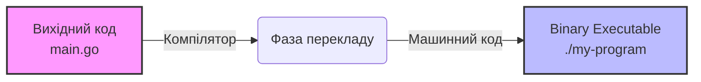
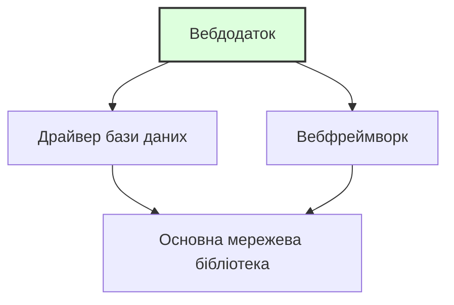

> **Складність**: `[ШВИДКО]` — Абсолютний новачок
>
> **Час на виконання**: 25-30 хвилин
>
> **Пререквізити**: [Модуль 0.6: Що таке мережі?](../module-0.6-what-is-networking/) — Ви повинні вільно почуватися в терміналі, роботі з файлами та базових концепціях мереж.

---

## Що ви зможете зробити

Після цього модуля ви зможете:
- **Виконувати** встановлення програмного забезпечення з термінала за допомогою менеджера пакетів вашої ОС
- **Аналізувати** відмінності між менеджерами пакетів (apt, brew, dnf), щоб визначити правильний інструмент для певної операційної системи
- **Оцінювати** наслідки оновлення або видалення пакетів у системі для безпеки та стабільності
- **Діагностувати** вимоги до залежностей, витягуючи інформацію про встановлені пакети

---

## Чому це важливо

Для роботи з Kubernetes, Docker та хмарними інструментами вам потрібно буде **встановлювати програмне забезпечення** на свій комп'ютер — не шляхом завантаження інсталяторів із вебсайтів і натискання «Далі, Далі, Готово», а шляхом введення однієї команди в терміналі.

Цей модуль навчить вас, як працює програмне забезпечення, що таке менеджери пакетів і як встановити ваші перші інструменти з командного рядка. Це навички, які ви використовуватимете буквально щодня в інженерії.

---

## Що таке програмне забезпечення?

Почнімо з самого початку.

**Програмне забезпечення** (software) — це набір інструкцій, які кажуть комп'ютеру, що робити. Коли ви відкриваєте веббраузер, відтворюєте відео або запускаєте команду в терміналі — це робить програмне забезпечення.

Програмне забезпечення пишеться людьми **мовами програмування** — такими як Python, Go, Java або JavaScript, які розроблені так, щоб їх могли читати і люди, і комп'ютери (свого роду).

Ось крихітний приклад на Python:

```python
print("Hello, World!")
```

Це програмне забезпечення. Один рядок, який каже комп'ютеру: «Виведи текст Hello, World! на екран».

> Аналогія з кухнею: Програмне забезпечення — це **рецепт**. Це інструкції для приготування страви. Комп'ютер — це шеф-кухар, який точно виконує рецепт, як він написаний. Мови програмування — це мова, якою написаний рецепт (англійська, французька тощо).

---

## Від вихідного коду до запущеної програми

> **Зупиніться та подумайте**: Якщо процесор комп'ютера розуміє лише бінарний код (1 та 0), як він може виконувати рецепт, написаний зрозумілими людині словами? Подумайте, що має статися між написанням коду та його запуском.

Кожна частина програмного забезпечення проходить шлях від «слів, надрукованих людиною» до «чогось, що ваш комп'ютер може запустити»:

### Крок 1: Вихідний код

Це те, що пишуть програмісти. Це виглядає як текст:

```go
package main

import "fmt"

func main() {
    fmt.Println("Hello from Go!")
}
```

Ви можете це прочитати (більш-менш). Ваш комп'ютер не може запустити це напряму.

### Крок 2: Компіляція (Для деяких мов)

Деякі мови потребують **компіляції** — перекладу з людиночитаного коду в **машинний код** (бінарний код — 1 та 0, які розуміє процесор вашого комп'ютера).

```
Вихідний код  →  Компілятор  →  Binary (виконуваний файл)
(рецепт)         (перекладач)   (готова страва, яку можна подавати)
```



Результат називається **binary** або **executable** — файл, який ваш комп'ютер справді може запустити.

> Аналогія з кухнею: Вихідний код — це рецепт на папері. Компіляція — це процес приготування. Binary — це готова страва, розкладена по тарілках і готова до споживання.

### Крок 3: Виконання

Ви **запускаєте** (виконуєте) binary, і комп'ютер слідує інструкціям.

```bash
$ ./my-program
Hello from Go!
```

> Не всі мови потребують компіляції. Python, наприклад, є **інтерпретованою** мовою — він читає і запускає код рядок за рядком, як шеф-кухар, який читає рецепт по одному кроку під час приготування. Мови на кшталт Go, C та Rust спочатку компілюються, а потім запускаються — як шеф-кухар, який заздалегідь готує всі інгредієнти.

---

## Що таке пакет?

> **Зупиніться та подумайте**: Якби вам довелося встановлювати програму без графічного інсталятора, які ручні кроки вам потрібно було б зробити, щоб отримати вихідний код, перекласти його і розмістити в потрібному каталозі?

Встановлення програмного забезпечення з вихідного коду — це складно. Вам потрібно було б:

1. Завантажити вихідний код
2. Встановити потрібний компілятор
3. Скомпілювати його
4. Перемістити binary у потрібне місце
5. Сподіватися, що нічого не пішло не так

**Пакет** (package) об'єднує все це в акуратний набір. Це вихідний код, уже скомпільований (зазвичай), укомплектований інструкціями про те, куди його встановлювати та що ще йому потрібно.

> Аналогія з кухнею: Пакет — це **набір для приготування їжі** (як Blue Apron або HelloFresh). Замість того, щоб іти в продуктовий магазин, шукати кожен інгредієнт і розраховувати кількість, хтось зібрав усе разом для вас. Просто відкрийте коробку та дотримуйтесь простих інструкцій.

---

## Що таке менеджер пакетів?

**Менеджер пакетів** — це інструмент, який завантажує, встановлює, оновлює та видаляє пакети для вас. Це ніби **магазин додатків** для вашого термінала.

Замість того, щоб відвідувати вебсайт, завантажувати файл і проходити через інсталятор, ви вводите одну команду:

```bash
$ sudo apt install htop       # На Ubuntu/Debian Linux
$ brew install htop            # На macOS
```

І менеджер пакетів:
1. Знаходить пакет у своєму каталозі
2. Завантажує його
3. Встановлює його
4. Налаштовує його так, щоб ви могли ним користуватися

### Популярні менеджери пакетів

| Менеджер пакетів | Операційна система | Команда встановлення |
|----------------|-----------------|-----------------|
| **apt** | Ubuntu, Debian (Linux) | `sudo apt install package-name` |
| **dnf** / **yum** | Fedora, RHEL, CentOS (Linux) | `sudo dnf install package-name` |
| **brew** (Homebrew) | macOS (та Linux) | `brew install package-name` |
| **pacman** | Arch Linux | `sudo pacman -S package-name` |
| **choco** | Windows | `choco install package-name` |

> У цій навчальній програмі ми здебільшого використовуватимемо **apt** (для Linux) та **brew** (для macOS), оскільки вони є найпоширенішими у світі Kubernetes.

---

## Що таке `sudo`?

Ви помітите, що деякі команди починаються з `sudo`. Це важливо.

**`sudo`** означає **"superuser do"** (виконати від імені суперкористувача) — це запускає команду з **привілеями адміністратора**.

Ваш комп'ютер має систему безпеки: звичайні користувачі не можуть встановлювати програмне забезпечення для всієї системи, змінювати системні файли або робити будь-що, що може зламати комп'ютер. Це зроблено навмисно. Це запобігає нещасним випадкам і зберігає вашу систему в безпеці.

Але встановлення програмного забезпечення вимагає запису файлів у системні каталоги, до яких звичайні користувачі не мають доступу. Тому ви використовуєте `sudo`, щоб тимчасово стати **суперкористувачем** (якого також називають **root** — всемогутній обліковий запис адміністратора).

```bash
$ apt install htop              # ❌ Відмовлено в доступі
$ sudo apt install htop         # ✅ Працює! (запитає ваш пароль)
```

> **Зупиніться та подумайте**: Що саме станеться, якщо ви запустите `apt install tree` у системі Linux без `sudo`? Не просто вгадуйте — спробуйте запустити це та прочитайте точне повідомлення про помилку, яке видасть система.

Коли ви вводите `sudo`, вас попросять ввести пароль. Це ваш пароль користувача — той самий, який ви використовуєте для входу в систему. Коли ви його вводитимете, ви не побачите жодних символів на екрані (ні точок, ні зірочок, нічого). Це нормально і зроблено навмисно — це заважає тому, хто стоїть у вас за спиною, порахувати кількість символів. Просто введіть пароль і натисніть Enter.

> Аналогія з кухнею: `sudo` — це як **ключ менеджера**. Більшість персоналу може працювати на кухні, але щоб отримати доступ до комори або змінити налаштування термостата, потрібен ключ менеджера. `sudo` тимчасово дає вам цей ключ.

### На macOS з Homebrew

Homebrew (`brew`) розроблений так, що вам зазвичай **не потрібен `sudo`**. Він встановлює пакети у ваш користувацький простір, а не в системні каталоги. Це одна з причин популярності Homebrew — менше мороки з дозволами.

```bash
$ brew install htop             # ✅ Працює без sudo на macOS
```

---

## Залежності: Програми, яким потрібні інші програми

Програмне забезпечення рідко працює самостійно. Більшості програм для роботи потрібні інші програми або бібліотеки. Вони називаються **залежностями** (dependencies).

Наприклад:
- Вебдодатку може бути потрібна база даних
- Інструменту командного рядка може бути потрібна певна бібліотека
- Програмі на Python потрібно, щоб був встановлений Python



> Аналогія з кухнею: Залежності — це як **інгредієнти для інгредієнтів**. Щоб приготувати спеціальний соус, вам потрібен майонез. Але щоб зробити майонез, вам потрібні яйця та олія. Яйця та олія є залежностями майонезу, який сам є залежністю спеціального соусу.

### Чому залежності важливі

**Хороша новина**: Менеджери пакетів обробляють залежності автоматично. Коли ви встановлюєте пакет, менеджер пакетів також встановлює все, що потрібно цьому пакету.

```bash
$ sudo apt install some-program
Reading package lists... Done
The following additional packages will be installed:
  dependency-1 dependency-2 dependency-3
```

Менеджер пакетів вираховує весь ланцюжок залежностей і встановлює їх усі. Вам не потрібно шукати їх самостійно.

**Не дуже хороша новина**: Іноді залежності конфліктують між собою. Програмі А потрібна версія 1.0 бібліотеки, а програмі Б — версія 2.0. Це називається **пеклом залежностей** (dependency hell), і це одна з проблем, для вирішення яких були винайдені контейнери (про які ви дізнаєтеся незабаром).

> **Зупиніться та подумайте**: Уявіть, що ви налаштовуєте сервер. Програма А суворо вимагає `libfoo` версії 1.0. Програма Б суворо вимагає `libfoo` версії 2.0. Якщо ваша операційна система дозволяє встановити лише одну версію бібліотеки глобально, яку б ви встановили першою і чому? Саме ця дилема стала причиною появи Docker та контейнерів, про які ви скоро дізнаєтеся, що дозволяють кожній програмі мати власний ізольований набір залежностей.

---

## Встановлення ваших перших пакетів

Встановімо кілька корисних інструментів. Дотримуйтесь інструкцій для вашої операційної системи.

### Оновлення списку пакетів

> **Зупиніться та подумайте**: Як ви думаєте, чому потрібно запускати `update` перед `install`? Подумайте про це: менеджер пакетів має локальний каталог того, що доступно. Але нові версії виходять щодня. Якщо ви встановлюєте програму без оновлення, ви можете отримати стару версію — або взагалі зазнати невдачі, тому що каталог ще не знає про цей пакет.

Перш ніж щось встановлювати, оновіть каталог вашого менеджера пакетів. Сприймайте це як оновлення списку того, що доступно:

**Ubuntu/Debian Linux:**

```bash
$ sudo apt update
```

Це нічого не встановлює і не змінює — воно просто завантажує найсвіжіший список доступних пакетів та їхніх версій.

**macOS:**

По-перше, якщо у вас ще не встановлено Homebrew, встановіть його зараз:

```bash
# Спочатку встановіть Homebrew (тільки для macOS — пропустіть, якщо він уже є)
/bin/bash -c "$(curl -fsSL https://raw.githubusercontent.com/Homebrew/install/HEAD/install.sh)"
```

> Це може зайняти кілька хвилин. Він запитає ваш пароль (того самого, який ви використовуєте для входу у свій Mac).

Після встановлення Homebrew оновіть його:

```bash
$ brew update
```

### Встановлення `htop` — системного монітора

`htop` — це візуальний інструмент, який показує, які програми запущені на вашому комп'ютері, скільки процесора та пам'яті вони використовують тощо.

**Ubuntu/Debian Linux:**

```bash
$ sudo apt install htop
```

**macOS:**

```bash
$ brew install htop
```

Тепер запустіть його:

```bash
$ htop
```

Ви побачите кольоровий дисплей із використанням процесора, пам'яті та запущеними процесами (програмами). Це ніби дивитися на дошку замовлень на кухні — ви бачите все, що відбувається одночасно.

**Натисніть `q`, щоб вийти з htop.**

### Встановлення `tree` — візуалізатора каталогів

Пам'ятаєте, як ми створювали каталоги в модулі 0.4? `tree` показує структуру каталогів у красивому візуальному форматі.

**Ubuntu/Debian Linux:**

```bash
$ sudo apt install tree
```

**macOS:**

```bash
$ brew install tree
```

Тепер спробуйте:

```bash
$ tree ~/kubedojo-practice
```

Ви повинні побачити щось на кшталт:

```
/home/yourname/kubedojo-practice
└── recipes
    ├── appetizers
    │   └── bruschetta.txt
    ├── desserts
    │   └── tiramisu.txt
    └── main-courses
        └── pasta-carbonara.txt
```

(Якщо ви виконали вправу в модулі 0.4. Якщо ні, `tree` все одно працює — просто спробуйте його в будь-якому каталозі.)

---

## Оновлення та видалення програмного забезпечення

### Оновлення всіх встановлених пакетів

З часом програмне забезпечення на вашому комп'ютері отримує оновлення — виправлення помилок, патчі безпеки, нові функції. Варто оновлюватися регулярно.

**Ubuntu/Debian Linux:**

```bash
$ sudo apt update              # Оновити список пакетів
$ sudo apt upgrade             # Встановити доступні оновлення
```

Ви можете об'єднати їх:

```bash
$ sudo apt update && sudo apt upgrade
```

Символ `&&` означає «виконати другу команду, лише якщо перша була успішною». Сприймайте це так: «Онови список А ПОТІМ встанови оновлення».

**macOS:**

```bash
$ brew update && brew upgrade
```

### Чому оновлення важливі: Історія з життя

У 2017 році бюро кредитних історій Equifax постраждало від масового витоку даних, що розкрив особисту інформацію 147 мільйонів людей. Причина? Відома вразливість у програмному забезпеченні під назвою Apache Struts. Патч для виправлення вразливості був доступний уже два місяці, але Equifax не оновила свої системи. Це одне пропущене оновлення коштувало компанії понад 1,4 мільярда доларів компенсацій і повністю зруйнувало їхню репутацію. У світі інженерії запуск оновлень пакетів — це не просто отримання нових функцій; це критична відповідальність за безпеку.

> **Зупиніться та подумайте**: Якщо оновлення такі важливі, чому б просто не налаштувати сервери на автоматичне оновлення щоночі? У виробничих середовищах (production) неочікуване оновлення може зламати ваш додаток. Якщо бібліотека, від якої залежить ваш код, змінить свою поведінку в новій версії, ваш додаток може впасти посеред нічної зміни. Ось чому інженери ретельно тестують оновлення в тестовому середовищі (staging), перш ніж застосовувати їх на робочих серверах.

### Видалення програмного забезпечення

**Ubuntu/Debian Linux:**

```bash
$ sudo apt remove package-name
```

**macOS:**

```bash
$ brew uninstall package-name
```

### Пошук пакетів

Не впевнені, як називається пакет?

**Ubuntu/Debian Linux:**

```bash
$ apt search keyword
```

**macOS:**

```bash
$ brew search keyword
```

---

## Чи знали ви?

> 1. **Homebrew (менеджер пакетів для macOS) був створений у 2009 році розробником, якого дратувало те, що в macOS не було нормального менеджера пакетів.** Макс Хауелл створив його як проєкт із відкритим кодом. Сьогодні він налічує понад 6000 пакетів і використовується мільйонами розробників. Назва є метафорою пивоваріння (Homebrew — домашнє пиво): пакети називаються «формулами» (formulae), місце встановлення — «льохом» (Cellar), а вся система «варить» (brews) ваше програмне забезпечення.
>
> 2. **Менеджер пакетів `apt` на Ubuntu має доступ до понад 60 000 пакетів.** Це 60 000 програм, які ви можете встановити однією командою. Від текстових редакторів до баз даних, ігор та інструментів для наукових розрахунків — це один із найбільших каталогів програмного забезпечення у світі, і все це безкоштовно.
>
> 3. **Концепція `sudo` виникла через реальну потребу в безпеці.** У 1980 році програмістам з Університету Баффало потрібен був спосіб дозволити довіреним користувачам запускати певні команди від імені root, не розголошуючи пароль root. Вони створили `sudo` — що спочатку означало «superuser do». Система реєструє кожну команду `sudo`, щоб адміністратори могли перевірити, хто і що робив. Сьогодні `sudo` використовується практично в кожній системі Linux та macOS.
>
> 4. **Фраза «пекло залежностей» (dependency hell) — це реальний технічний термін.** Він виник у спільноті Linux для опису крайнього розчарування при спробі встановити програму, яка вимагає певної версії спільної бібліотеки, що потім ламає іншу програму, якій потрібна інша версія тієї ж бібліотеки.

---

## Типові помилки

| Помилка | Що відбувається | Як виправити | Наслідки в реальному світі |
|---------|-------------|-----|------------------------|
| Забули `sudo` на Linux | `Permission denied` або `Operation not permitted` | Додайте `sudo` перед командою: `sudo apt install ...` | Встановлення не вдається, і ви не можете використовувати потрібний інструмент. |
| Використання `sudo` з `brew` на macOS | Homebrew попереджає або все встановлюється неправильно | Не використовуйте `sudo` з `brew` — йому це не потрібно | Ви можете порушити права доступу до файлів Homebrew, що вимагатиме нудних ручних виправлень для встановлення інструментів у майбутньому. |
| Не запускаєте `apt update` спочатку | Може встановитися стара версія або пакет не буде знайдено | Завжди запускайте `sudo apt update` перед встановленням на Linux | Ви можете встановити ПЗ із відомою вразливістю, або інсталяція взагалі не вдасться. |
| Описка в назві пакета | `Unable to locate package htoop` | Перевірте написання або скористайтеся `apt search` / `brew search`, щоб знайти правильну назву | Ви можете випадково встановити шкідливий пакет, створений хакером у розрахунку на таку описку (typosquatting). |
| Не читаєте вивід у терміналі | Пропускаєте важливі попередження або помилки | Читайте те, що каже вам термінал! Він часто пояснює, що саме пішло не так | Ви можете подумати, що критичний інструмент безпеки встановлено, хоча насправді сталася помилка, і ваша система залишиться вразливою. |
| Натискання Enter під час запиту пароля без введення нічого | Помилка автентифікації | Введіть пароль (ви не побачите символів) і натисніть Enter | Ви витрачаєте час на повторне введення команд і можете заблокувати свій обліковий запис після занадто багатьох невдач. |

---

## Контрольні запитання

**Запитання 1**: Ви щойно прийшли в нову компанію, і вам потрібно встановити Node.js, PostgreSQL та Redis на робочий ноутбук. Колега каже вам: «Просто зайди на їхні сайти та завантаж інсталятори». Чому використання менеджера пакетів було б кращим інженерним підходом для цього налаштування?

<details>
<summary>Показати відповідь</summary>

Використання менеджера пакетів значно ефективніше та простіше в обслуговуванні, ніж завантаження вручну. Менеджер пакетів діє як централізований магазин додатків для вашого термінала, дозволяючи встановити всі три інструменти лише однією або двома командами. Він також автоматично обробляє завантаження будь-яких прихованих залежностей, гарантуючи, що ПЗ запрацює відразу без відсутніх компонентів. Крім того, коли виходять оновлення або патчі безпеки, ви можете оновити всі свої інструменти одночасно однією командою замість того, щоб знову відвідувати три різні сайти.

</details>

**Запитання 2**: Сценарій пошуку несправностей: Ви увійшли на сервер Linux як звичайний користувач і намагаєтеся встановити інструмент моніторингу, запустивши `apt install htop`. Термінал видає помилку «Permission denied». Чому система заблокувала цю дію, і яку структуру команди слід використати для її вирішення?

<details>
<summary>Показати відповідь</summary>

Система заблокувала дію, оскільки встановлення програмного забезпечення вимагає запису в каталоги системного рівня, що обмежено для запобігання несанкціонованим або випадковим змінам з боку звичайних користувачів. Щоб вирішити це, ви повинні додати `sudo` перед командою (наприклад, `sudo apt install htop`), що тимчасово надасть вам привілеї суперкористувача (root). Цей механізм змушує вас явно підтвердити свою особистість і намір внести адміністративну зміну, захищаючи цілісність системи.

</details>

**Запитання 3**: Ви намагаєтеся встановити простий додаток погоди для командного рядка, але вивід менеджера пакетів показує, що він також завантажує 15 інших пакетів, включаючи щось під назвою `python3-requests`. Чому менеджер пакетів завантажує всі ці додаткові інструменти, про які ви не просили?

<details>
<summary>Показати відповідь</summary>

Ці додаткові пакети є залежностями, які потрібні додатку погоди для коректної роботи. Програмне забезпечення рідко працює ізольовано; розробники покладаються на існуючі бібліотеки для виконання таких завдань, як здійснення мережевих запитів, замість того, щоб писати цей код з нуля. Менеджер пакетів виконує свою роботу, автоматично ідентифікуючи, завантажуючи та встановлюючи ці передумови, щоб додаток погоди запрацював відразу. Без цього автоматичного вирішення залежностей вам довелося б вручну шукати та встановлювати всі 15 бібліотек самостійно.

</details>

**Запитання 4**: Сценарій пошуку несправностей: Бюлетень безпеки повідомляє про критичну вразливість в інструменті `curl`, і вам доручено негайно її виправити. Ви запускаєте `sudo apt upgrade curl`, але термінал повідомляє, що `curl is already the newest version`, хоча ви знаєте, що патч вийшов кілька годин тому. Чому менеджеру пакетів не вдається встановити патч, і як виправити цей робочий процес?

<details>
<summary>Показати відповідь</summary>

Менеджеру пакетів не вдається встановити патч, тому що він покладається на застарілий локальний каталог доступних версій програмного забезпечення. Команда `upgrade` встановлює лише нові версії пакетів, про які вона вже знає зі своєї локальної бази даних. Щоб виправити це, ви повинні спочатку запустити `sudo apt update`, щоб завантажити останній індекс пакетів із віддалених репозиторіїв. Як тільки локальний каталог оновиться інформацією про новий патч, запуск команди оновлення успішно завантажить і застосує виправлення безпеки.

</details>

**Запитання 5**: Ви ділитеся екраном із розробником-початківцем, щоб допомогти йому вирішити проблему. Ви кажете йому запустити команду через `sudo`. Він вводить свій пароль, але потім раптово зупиняється і каже: «У мене зламалася клавіатура, нічого не друкується». Як ви поясните, що відбувається і чому система поводиться саме так?

<details>
<summary>Показати відповідь</summary>

Система навмисно приховує натискання клавіш як вбудовану функцію безпеки. На відміну від веббраузерів, які показують зірочки або точки, термінал не відображає абсолютно нічого під час введення паролів. Це заважає будь-кому, хто дивиться вам через плече або спостерігає за демонстрацією екрана, дізнатися точну довжину вашого пароля. Вам слід сказати розробнику впевнено ввести свій повний пароль і натиснути Enter, запевнивши його, що комп'ютер справді отримує введення.

</details>

**Запитання 6**: Сценарій пошуку несправностей: Ви запускаєте `sudo apt install nginx`, щоб встановити вебсервер на абсолютно новій машині Linux, але термінал миттєво виводить: `E: Unable to locate package nginx`. Ви точно знаєте, що `nginx` — це правильна назва пакета. Яка найімовірніша причина цієї помилки і яку команду слід запустити, щоб її виправити?

<details>
<summary>Показати відповідь</summary>

Найімовірніша причина полягає в тому, що локальний каталог доступних пакетів абсолютно порожній або застарілий, оскільки це нова машина. Менеджер пакетів ще не знає, звідки завантажувати пакет, бо він не синхронізувався з віддаленими репозиторіями програмного забезпечення. Щоб виправити це, ви повинні спочатку запустити `sudo apt update`, щоб завантажити останній індекс пакетів. Після оновлення каталогу повторний запуск команди встановлення успішно знайде та завантажить пакет.

</details>

---

## Практична вправа: Ваші перші встановлення програм

### Мета

Використати менеджер пакетів для встановлення, запуску та вивчення нового програмного забезпечення з термінала.

### Кроки

1. **Оновіть свій менеджер пакетів:**

На Ubuntu/Debian Linux:
```bash
$ sudo apt update
```

На macOS:
```bash
$ brew update
```

2. **Встановіть htop:**

На Ubuntu/Debian Linux:
```bash
$ sudo apt install htop -y
```

На macOS:
```bash
$ brew install htop
```

Прапор `-y` (в apt) означає «так на всі запити» — він автоматично підтверджує встановлення, не запитуючи «Ви впевнені? [Y/n]».

3. **Запустіть htop і дослідіть його:**

```bash
$ htop
```

Спостерігайте:
- Смужки використання процесора вгорі
- Смужку використання пам'яті
- Список запущених процесів
- Кожен процес має PID (Process ID — унікальний номер процесу)

Натисніть `q`, щоб вийти.

4. **Встановіть tree:**

На Ubuntu/Debian Linux:
```bash
$ sudo apt install tree -y
```

На macOS:
```bash
$ brew install tree
```

5. **Використайте tree для візуалізації каталогу:**

```bash
$ tree ~/kubedojo-practice
```

Якщо у вас немає `kubedojo-practice`, спробуйте:

```bash
$ tree ~ -L 1
```

Прапор `-L 1` означає «показувати лише на 1 рівень глибини» — корисно для великих каталогів.

6. **Перевірте, що встановлено:**

На Ubuntu/Debian Linux:
```bash
$ apt list --installed | head -20
```

На macOS:
```bash
$ brew list
```

7. **Знайдіть пакет:**

На Ubuntu/Debian Linux:
```bash
$ apt search "system monitor"
```

На macOS:
```bash
$ brew search "monitor"
```

8. **Перевірте версію встановленого інструмента:**

```bash
$ htop --version
```

Більшість програм підтримують `--version` або `-v` для показу номера своєї версії. Це корисно при пошуку несправностей: «Яка версія цього інструмента в мене встановлена?».

### Додаткове завдання: Дослідження залежностей

Програмне забезпечення покладається на інше програмне забезпечення. Простежмо ланцюжок залежностей, щоб побачити, наскільки все взаємопов'язано.

1. Виберіть пакет, який ви щойно встановили (наприклад, `tree` або `htop`).
2. Запустіть `apt show htop` (на Linux) або `brew info htop` (на macOS).
3. Подивіться на вивід і знайдіть розділ «Depends» або «Dependencies».
4. Виберіть одну з цих залежностей і запустіть команду `apt show` або `brew info` для неї, щоб побачити, від чого залежить *вона*.

Розуміння того, як перевірити пакет перед встановленням, є важливою навичкою для оцінки безпеки та об'ємності нових інструментів.

### Критерії успіху

Ви виконали цю вправу, якщо можете:

- [ ] Оновити свій менеджер пакетів
- [ ] Встановити `htop` і запустити його (і вийти за допомогою `q`)
- [ ] Встановити `tree` і використати його для відображення каталогу
- [ ] Шукати пакети за ключовим словом
- [ ] Перевіряти версію встановленого інструмента
- [ ] Перевіряти залежності пакета (Додаткове завдання)

---

> Ви щойно використали інструмент, яким старші інженери користуються щодня. Ви на своєму місці.

---

## Наступний модуль

Тепер ви знаєте, як програмне забезпечення проходить шлях від коду до запущеної програми, як встановлювати інструменти за допомогою менеджера пакетів і що робить `sudo`. Ваш набір інструментів у терміналі зростає.

Звідси у вас є фундамент для вивчення контейнерів, хмарних обчислень і, зрештою, Kubernetes. Кожен інструмент в екосистемі Kubernetes — `kubectl`, `helm`, `kind`, `docker` — встановлюється саме так, як ви щойно навчилися.

**Продовжуйте тут**: [Модуль 0.9: Що таке хмара?](../module-0.9-what-is-the-cloud/) — Дізнайтеся, що таке хмара насправді, як працюють дата-центри і чому компанії орендують сервери замість того, щоб купувати їх.