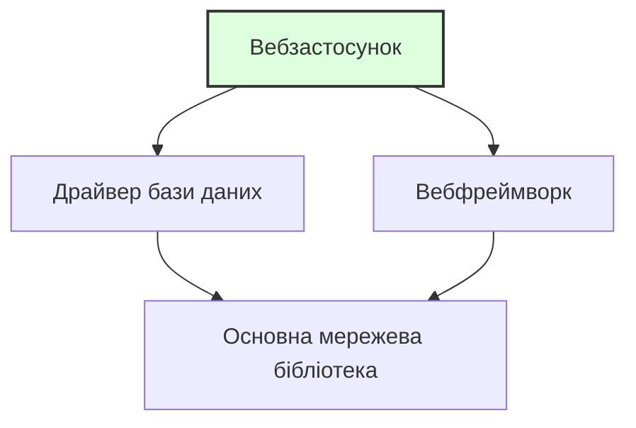

> **Складність**: `[ШВИДКО]` — Абсолютний новачок
>
> **Час на проходження**: 25-30 хвилин
>
> **Попередні вимоги**: [Модуль 0.6: Що таке мережа?](../module-0.6-what-is-networking/) — Ви повинні впевнено почуватися в терміналі, вміти працювати з файлами та розуміти базові концепції мереж.

---

## Що ви зможете зробити

Після цього модуля ви зможете:
- **Виконувати** встановлення програмного забезпечення з термінала за допомогою менеджера пакетів вашої ОС
- **Аналізувати** різницю між менеджерами пакетів (apt, brew, dnf), щоб визначити правильний інструмент для конкретної операційної системи
- **Оцінювати** наслідки для безпеки та стабільності під час оновлення або видалення пакетів у системі
- **Діагностувати** вимоги до залежностей, витягуючи інформацію про встановлені пакети

---

## Чому це важливо

Для роботи з Kubernetes, Docker та хмарними інструментами вам потрібно буде **встановлювати програмне забезпечення** на свій комп'ютер — не завантажуючи інсталятори з вебсайтів і натискаючи "Далі, Далі, Готово", а вводячи одну команду в терміналі.

Цей модуль навчить вас, як працює програмне забезпечення, що таке менеджери пакетів і як встановити ваші перші інструменти з командного рядка. Ці навички ви використовуватимете буквально щодня в інженерії.

---

## Що таке програмне забезпечення?

Почнімо з самого початку.

**Програмне забезпечення (Software)** — це набір інструкцій, які кажуть комп'ютеру, що робити. Коли ви відкриваєте веббраузер, програєте відео або запускаєте команду в терміналі — це робить програмне забезпечення.

Програмне забезпечення пишеться людьми **мовами програмування** — такими як Python, Go, Java або JavaScript, які розроблені так, щоб їх могли читати і люди, і комп'ютери (свого роду).

Ось крихітний приклад на Python:

```python
print("Hello, World!")
```

Це і є програмне забезпечення. Один рядок, який каже комп'ютеру: "Виведи текст Hello, World! на екран".

> Кулінарна аналогія: Програмне забезпечення — це **рецепт**. Це інструкції для приготування страви. Комп'ютер — це шеф-кухар, який точно виконує рецепт. Мови програмування — це мова, якою написаний рецепт (англійська, французька тощо).

---

## Від вихідного коду до працюючої програми

> **Зупиніться та подумайте**: Якщо процесор комп'ютера розуміє лише бінарний код (1 та 0), як він може виконувати рецепт, написаний зрозумілими людині словами? Подумайте, що має статися між написанням коду та його запуском.

Шлях кожної програми від "слів, надрукованих людиною" до "того, що ваш комп'ютер може запустити", складається з декількох етапів:

### Крок 1: Вихідний код (Source Code)

Це те, що пишуть програмісти. Це виглядає як текст:

```go
package main

import "fmt"

func main() {
    fmt.Println("Hello from Go!")
}
```

Ви можете це прочитати (більш-менш). Ваш комп'ютер не може запустити це напряму.

### Крок 2: Компіляція (Для деяких мов)

Деякі мови потребують **компіляції** — перекладу з людиночитаного коду в **машинний код** (бінарний код — 1 та 0, які розуміє процесор вашого комп'ютера).

```
Вихідний код  →  Компілятор  →  Бінарний файл (виконуваний)
(рецепт)         (перекладач)  (готова страва, яку можна подавати)
```


Результат називається **бінарним файлом (binary)** або **виконуваним файлом (executable)** — це файл, який ваш комп'ютер може фактично запустити.

> Кулінарна аналогія: Вихідний код — це рецепт на папері. Компіляція — це процес приготування. Бінарний файл — це готова страва, викладена на тарілку і готова до вживання.

### Крок 3: Виконання

Ви **запускаєте** (виконуєте) бінарний файл, і комп'ютер слідує інструкціям.

```bash
$ ./my-program
Hello from Go!
```

> Не всі мови потребують компіляції. Python, наприклад, є **інтерпретованою** мовою — він читає і запускає код рядок за рядком, як шеф-кухар, який читає рецепт по одному кроку під час готування. Мови на кшталт Go, C та Rust спочатку компілюються, а потім запускаються — як шеф-кухар, який готує все заздалегідь.

---

## Що таке пакет?

> **Зупиніться та подумайте**: Якби вам довелося встановлювати програму без графічного інсталятора, які ручні кроки вам потрібно було б зробити, щоб отримати вихідний код, перекласти його і розмістити в потрібній директорії?

Встановлення програмного забезпечення з вихідного коду — це складно. Вам би довелося:

1. Завантажити вихідний код
2. Встановити потрібний компілятор
3. Скомпілювати його
4. Перемістити бінарний файл у потрібне місце
5. Сподіватися, що нічого не пішло не так

**Пакет (package)** об'єднує все це в акуратний набір. Це вихідний код, зазвичай уже скомпільований, разом з інструкціями про те, куди його встановлювати і що ще йому потрібно.

> Кулінарна аналогія: Пакет — це **набір для приготування їжі** (як Blue Apron або HelloFresh). Замість того, щоб іти в продуктовий магазин, шукати кожен інгредієнт і визначати кількість, хтось зібрав усе разом для вас. Просто відкрийте коробку і слідуйте простим інструкціям.

---

## Що таке менеджер пакетів?

**Менеджер пакетів (package manager)** — це інструмент, який завантажує, встановлює, оновлює та видаляє пакети за вас. Це як **магазин застосунків** для вашого термінала.

Замість того, щоб відвідувати вебсайт, завантажувати файл і проходити через інсталятор, ви вводите одну команду:

```bash
$ sudo apt install htop       # В Ubuntu/Debian Linux
$ brew install htop            # В macOS
```

І менеджер пакетів:
1. Знаходить пакет у своєму каталозі
2. Завантажує його
3. Встановлює його
4. Налаштовує його так, щоб ви могли ним користуватися

### Поширені менеджери пакетів

| Менеджер пакетів | Операційна система | Команда встановлення |
|----------------|-----------------|-----------------|
| **apt** | Ubuntu, Debian (Linux) | `sudo apt install назва-пакета` |
| **dnf** / **yum** | Fedora, RHEL, CentOS (Linux) | `sudo dnf install назва-пакета` |
| **brew** (Homebrew) | macOS (та Linux) | `brew install назва-пакета` |
| **pacman** | Arch Linux | `sudo pacman -S назва-пакета` |
| **choco** | Windows | `choco install назва-пакета` |

> У цьому курсі ми здебільшого використовуватимемо **apt** (для Linux) та **brew** (для macOS), оскільки вони є найпоширенішими у світі Kubernetes.

---

## Що таке `sudo`?

Ви помітите, що деякі команди починаються з `sudo`. Це важливо.

**`sudo`** розшифровується як **"superuser do"** (виконати від імені суперкористувача) — ця команда запускає іншу команду з **правами адміністратора**.

Ваш комп'ютер має систему безпеки: звичайні користувачі не можуть встановлювати програмне забезпечення для всієї системи, змінювати системні файли або робити щось, що може вивести комп'ютер з ладу. Це зроблено навмисно. Це запобігає нещасним випадкам і забезпечує безпеку вашої системи.

Але встановлення програмного забезпечення вимагає запису файлів у системні директорії, до яких звичайні користувачі не мають доступу. Тому ви використовуєте `sudo`, щоб тимчасово стати **суперкористувачем** (якого також називають **root** — всемогутній обліковий запис адміністратора).

```bash
$ apt install htop              # ❌ Permission denied (Відмовлено в доступі)
$ sudo apt install htop         # ✅ Працює! (запитає ваш пароль)
```

> **Зупиніться та подумайте**: Що саме станеться, якщо ви запустите `apt install tree` в системі Linux без `sudo`? Не просто вгадуйте — спробуйте запустити і прочитайте точне повідомлення про помилку, яке видасть система.

Коли ви вводите `sudo`, у вас запитають пароль. Це ваш пароль користувача — той самий, який ви використовуєте для входу в систему. Коли ви будете його вводити, ви не побачите жодних символів на екрані (ні крапок, ні зірочок, нічого). Це нормально і зроблено навмисно — щоб хтось, хто дивиться вам через плече, не міг порахувати кількість символів. Просто введіть пароль і натисніть Enter.

> Кулінарна аналогія: `sudo` — це як **ключ менеджера**. Більшість працівників можуть працювати на кухні, але щоб отримати доступ до комори або змінити налаштування термостата, потрібен ключ менеджера. `sudo` тимчасово дає вам цей ключ.

### В macOS з Homebrew

Homebrew (`brew`) розроблений так, що вам зазвичай **не потрібен `sudo`**. Він встановлює пакети у ваш простір користувача, а не в системні директорії. Це одна з причин популярності Homebrew — менше мороки з дозволами.

```bash
$ brew install htop             # ✅ Працює без sudo в macOS
```

---

## Залежності: Програми, яким потрібні інші програми

Програмне забезпечення рідко працює само по собі. Більшість програм потребують інших програм або бібліотек для функціонування. Вони називаються **залежностями (dependencies)**.

Наприклад:
- Вебзастосунок може залежати від бази даних
- Інструмент командного рядка може залежати від певної бібліотеки
- Програма на Python залежить від того, чи встановлений Python



> Кулінарна аналогія: Залежності — це як **інгредієнти для інгредієнтів**. Щоб приготувати спеціальний соус, вам потрібен майонез. Але щоб зробити майонез, вам потрібні яйця та олія. Яйця та олія є залежностями майонезу, який сам по собі є залежністю спеціального соусу.

### Чому залежності важливі

**Хороша новина**: Менеджери пакетів обробляють залежності автоматично. Коли ви встановлюєте пакет, менеджер пакетів також встановлює все, що потрібно цьому пакету.

```bash
$ sudo apt install some-program
Reading package lists... Done
The following additional packages will be installed:
  dependency-1 dependency-2 dependency-3
```

Менеджер пакетів вираховує весь ланцюжок залежностей і встановлює їх усі. Вам не потрібно шукати їх самостійно.

**Менш хороша новина**: Іноді залежності конфліктують між собою. Програмі A потрібна версія 1.0 бібліотеки, а програмі B — версія 2.0. Це називається **пеклом залежностей (dependency hell)**, і це одна з проблем, для вирішення яких були винайдені контейнери (про які ви скоро дізнаєтеся).

> **Зупиніться та подумайте**: Уявіть, що ви налаштовуєте сервер. Програма A суворо вимагає `libfoo` версії 1.0. Програма B суворо вимагає `libfoo` версії 2.0. Якщо ваша операційна система дозволяє встановити лише одну версію бібліотеки глобально, яку б ви встановили першою і чому? Саме ця дилема стала причиною появи Docker та контейнерів, про які ви дізнаєтеся незабаром, і які дозволяють кожній програмі мати власний ізольований набір залежностей.

---

## Встановлення ваших перших пакетів

Встановімо кілька корисних інструментів. Слідуйте інструкціям для вашої операційної системи.

### Оновлення списку пакетів

> **Зупиніться та подумайте**: Як ви гадаєте, чому потрібно запускати `update` перед `install`? Подумайте про це: менеджер пакетів має локальний каталог того, що доступно. Але нові версії виходять щодня. Якщо ви встановлюєте без оновлення, ви можете отримати стару версію — або взагалі зазнати невдачі, тому що каталог ще не знає про цей пакет.

Перед встановленням будь-чого оновіть каталог вашого менеджера пакетів. Думайте про це як про оновлення списку доступних товарів:

**Ubuntu/Debian Linux:**

```bash
$ sudo apt update
```

Це нічого не встановлює і не змінює — просто завантажує найсвіжіший список доступних пакетів та їхніх версій.

**macOS:**

По-перше, якщо у вас ще не встановлено Homebrew, встановіть його зараз:

```bash
# Спочатку встановіть Homebrew (тільки для macOS — пропустіть, якщо він у вас уже є)
/bin/bash -c "$(curl -fsSL https://raw.githubusercontent.com/Homebrew/install/HEAD/install.sh)"
```

> Це може зайняти кілька хвилин. У вас запитають пароль (той самий, який ви використовуєте для входу у свій Mac).

Після встановлення Homebrew оновіть його:

```bash
$ brew update
```

### Встановлення `htop` — системного монітора

`htop` — це візуальний інструмент, який показує, які програми зараз запущені на вашому комп'ютері, скільки процесора (CPU) та пам'яті вони використовують тощо.

**Ubuntu/Debian Linux:**

```bash
$ sudo apt install htop
```

**macOS:**

```bash
$ brew install htop
```

Тепер запустіть його:

```bash
$ htop
```

Ви побачите кольоровий екран із графіками використання CPU, пам'яті та списком запущених процесів (програм). Це як дивитися на табло замовлень на кухні — ви можете бачити все, що відбувається одночасно.

**Натисніть `q`, щоб вийти з htop.**

### Встановлення `tree` — візуалізатора директорій

Пам'ятаєте, як ми створювали директорії в Модулі 0.4? `tree` показує структуру директорій у красивому візуальному форматі.

**Ubuntu/Debian Linux:**

```bash
$ sudo apt install tree
```

**macOS:**

```bash
$ brew install tree
```

Тепер спробуйте:

```bash
$ tree ~/kubedojo-practice
```

Ви повинні побачити щось на кшталт:

```
/home/yourname/kubedojo-practice
└── recipes
    ├── appetizers
    │   └── bruschetta.txt
    ├── desserts
    │   └── tiramisu.txt
    └── main-courses
        └── pasta-carbonara.txt
```

(Якщо ви виконали вправу в Модулі 0.4. Якщо ні, `tree` все одно працюватиме — просто спробуйте на будь-якій директорії.)

---

## Оновлення та видалення програмного забезпечення

### Оновлення всіх встановлених пакетів

З часом програмне забезпечення на вашому комп'ютері отримує оновлення — виправлення помилок, патчі безпеки, нові функції. Вам слід регулярно оновлюватися.

**Ubuntu/Debian Linux:**

```bash
$ sudo apt update              # Оновити список пакетів
$ sudo apt upgrade             # Встановити доступні оновлення
```

Ви можете об'єднати їх:

```bash
$ sudo apt update && sudo apt upgrade
```

Символи `&&` означають "запустити другу команду лише у разі успішного завершення першої". Думайте про це як про: "Оновити список ТА ПОТІМ встановити оновлення".

**macOS:**

```bash
$ brew update && brew upgrade
```

### Чому оновлення важливі: Повчальна історія

У 2017 році бюро кредитних історій Equifax постраждало від масового витоку даних, що призвело до розкриття особистої інформації 147 мільйонів людей. Причина? Відома вразливість у програмному забезпеченні під назвою Apache Struts. Патч для усунення цієї вразливості був доступний уже два місяці, але Equifax не оновила свої системи. Ця одна пропущена перевірка оновлень коштувала компанії понад 1,4 мільярда доларів у вигляді компенсацій і повністю зруйнувала їхню репутацію. В інженерному світі оновлення пакетів — це не просто отримання нових функцій; це критична відповідальність за безпеку.

> **Зупиніться та подумайте**: Якщо оновлення настільки важливі, чому б просто не налаштувати сервери на автоматичне оновлення щоночі? У промислових (production) середовищах несподіване оновлення може вивести застосунок із ладу. Якщо бібліотека, від якої залежить ваш код, змінить свою поведінку в новій версії, ваш застосунок може "впасти" посеред ночі. Ось чому інженери ретельно тестують оновлення в тестовому (staging) середовищі, перш ніж застосовувати їх на робочих серверах.

### Видалення програмного забезпечення

**Ubuntu/Debian Linux:**

```bash
$ sudo apt remove назва-пакета
```

**macOS:**

```bash
$ brew uninstall назва-пакета
```

### Пошук пакетів

Не впевнені, як називається пакет?

**Ubuntu/Debian Linux:**

```bash
$ apt search ключове-слово
```

**macOS:**

```bash
$ brew search ключове-слово
```

---

## Чи знали ви?

> 1. **Homebrew (менеджер пакетів для macOS) був створений у 2009 році розробником, якого дратувало, що в macOS немає нормального менеджера пакетів.** Макс Хауелл створив його як проєкт із відкритим кодом. Сьогодні він налічує понад 6 000 пакетів і використовується мільйонами розробників. Назва є метафорою пивоваріння: пакети називаються "формулами" (formulae), місце встановлення — "Погребом" (Cellar), а вся система "варить" (brews) ваше ПЗ.
>
> 2. **Менеджер пакетів `apt` в Ubuntu має доступ до понад 60 000 пакетів.** Це 60 000 програм, які ви можете встановити однією командою. Від текстових редакторів до баз даних, ігор та інструментів для наукових обчислень — це один із найбільших каталогів ПЗ у світі, і все це безплатно.
>
> 3. **Концепція `sudo` виникла через реальну потребу в безпеці.** У 1980 році програмісти з Університету Буффало потребували способу дозволити довіреним користувачам запускати певні команди від імені root без передачі пароля root. Вони створили `sudo` — що спочатку означало "superuser do". Система фіксує кожну команду `sudo`, тому адміністратори можуть перевірити, хто і що робив. Сьогодні `sudo` використовується практично в кожній системі Linux та macOS.
>
> 4. **Фраза "пекло залежностей" (dependency hell) — це реальний технічний термін.** Він виник у спільноті Linux для опису надзвичайного розчарування при спробі встановити програму, яка потребує певної версії спільної бібліотеки, що, своєю чергою, ламає іншу програму, якій потрібна інша версія тієї ж бібліотеки.

---

## Типові помилки

| Помилка | Що стається | Як виправити | Наслідки в реальному світі |
|---------|-------------|-----|------------------------|
| Забули `sudo` в Linux | `Permission denied` або `Operation not permitted` | Додайте `sudo` перед командою: `sudo apt install ...` | Встановлення не вдається, і ви не можете використовувати потрібний інструмент. |
| Використання `sudo` з `brew` в macOS | Homebrew попереджає або ПЗ встановлюється некоректно | Не використовуйте `sudo` з `brew` — він йому не потрібен | Ви можете порушити дозволи файлів Homebrew, що призведе до тривалих ручних виправлень у майбутньому. |
| Не запустили `apt update` спочатку | Може встановитися стара версія або пакет не буде знайдено | Завжди запускайте `sudo apt update` перед встановленням у Linux | Ви можете встановити ПЗ з відомою вразливістю або встановлення може взагалі не розпочатися. |
| Помилка в назві пакета | `Unable to locate package htoop` | Перевірте правопис або використайте `apt search` / `brew search`, щоб знайти правильну назву | Ви можете випадково встановити шкідливий пакет, створений хакером у розрахунку саме на таку друкарську помилку (typosquatting). |
| Не читаєте вивід | Пропускаєте важливі попередження або помилки | Читайте, що каже термінал! Він часто пояснює, що саме пішло не так | Ви можете подумати, що критичний інструмент безпеки встановлено, хоча насправді сталася помилка, і ваша система залишилася вразливою. |
| Натискання Enter під час запиту пароля без введення нічого | Помилка автентифікації | Введіть пароль (ви не побачити символів) і натисніть Enter | Ви втрачаєте час на повторні спроби й можете заблокувати свій обліковий запис, якщо помилитеся занадто багато разів. |

---

## Контрольні запитання

**Питання 1**: Ви щойно прийшли в нову компанію, і вам потрібно встановити Node.js, PostgreSQL та Redis на робочий ноутбук. Колега каже вам "просто зайти на їхні сайти й завантажити інсталятори". Чому використання менеджера пакетів було б кращим інженерним підходом для цього налаштування?

<details>
<summary>Показати відповідь</summary>

Використання менеджера пакетів значно ефективніше та простіше в обслуговуванні, ніж ручне завантаження. Менеджер пакетів діє як централізований магазин застосунків для вашого термінала, дозволяючи встановити всі три інструменти однією-двома командами. Він також автоматично завантажує всі приховані залежності, гарантуючи, що ПЗ запрацює відразу без відсутніх компонентів. Крім того, коли виходять оновлення або патчі безпеки, ви можете оновити всі інструменти одночасно однією командою замість того, щоб знову відвідувати три різні сайти.

</details>

**Питання 2**: Сценарій пошуку несправностей: Ви увійшли на сервер Linux як звичайний користувач і намагаєтеся встановити інструмент моніторингу, запустивши `apt install htop`. Термінал видає помилку "Permission denied". Чому система заблокувала цю дію і яку структуру команди слід використати для вирішення проблеми?

<details>
<summary>Показати відповідь</summary>

Система заблокувала дію, оскільки встановлення ПЗ вимагає запису в директорії системного рівня, що обмежено для запобігання несанкціонованим або випадковим змінам з боку звичайних користувачів. Щоб розв'язати цю проблему, ви повинні додати `sudo` на початку команди (наприклад, `sudo apt install htop`), що тимчасово надасть вам права суперкористувача (root). Цей механізм змушує вас явно підтвердити свою особу та намір внести адміністративні зміни, захищаючи цілісність системи.

</details>

**Питання 3**: Ви намагаєтеся встановити простий погодний застосунок для командного рядка, але вивід менеджера пакетів показує, що він також завантажує ще 15 інших пакетів, включаючи щось під назвою `python3-requests`. Чому менеджер пакетів завантажує всі ці додаткові інструменти, про які ви не просили?

<details>
<summary>Показати відповідь</summary>

Додаткові пакети — це залежності, які потрібні погодному застосунку для коректної роботи. Програмне забезпечення рідко працює ізольовано; розробники покладаються на існуючі бібліотеки для виконання таких завдань, як мережеві запити, замість того, щоб писати цей код з нуля. Менеджер пакетів виконує свою роботу, автоматично ідентифікуючи, завантажуючи та встановлюючи ці передумови, щоб застосунок запрацював відразу після встановлення. Без такого автоматичного вирішення залежностей вам довелося б вручну шукати та встановлювати всі 15 бібліотек самостійно.

</details>

**Питання 4**: Сценарій пошуку несправностей: У бюлетені з безпеки повідомляється про критичну вразливість в інструменті `curl`, і вам доручено негайно її виправити. Ви запускаєте `sudo apt upgrade curl`, але термінал повідомляє, що `curl is already the newest version`, хоча ви знаєте, що патч вийшов кілька годин тому. Чому менеджер пакетів не встановлює патч і як виправити цей робочий процес?

<details>
<summary>Показати відповідь</summary>

Менеджер пакетів не встановлює патч, тому що покладається на застарілий локальний каталог доступних версій ПЗ. Команда `upgrade` встановлює лише нові версії тих пакетів, про які вона вже знає зі своєї локальної бази даних. Щоб виправити це, спочатку потрібно запустити `sudo apt update`, щоб завантажити найсвіжіший індекс пакетів із віддалених репозиторіїв. Як тільки локальний каталог оновиться інформацією про новий патч, команда оновлення (upgrade) успішно завантажить та застосує виправлення безпеки.

</details>

**Питання 5**: Ви ділитеся екраном із розробником-початківцем, щоб допомогти вирішити проблему. Ви кажете йому запустити команду через `sudo`. Він вводить пароль, але потім раптово зупиняється і каже: "Моя клавіатура зламалася, нічого не друкується". Як ви поясните, що відбувається і чому система поводиться саме так?

<details>
<summary>Показати відповідь</summary>

Система навмисно приховує введення символів як вбудовану функцію безпеки. На відміну від веббраузерів, які показують зірочки або крапки, термінал не показує абсолютно нічого під час введення паролів. Це заважає будь-кому, хто дивиться вам через плече або спостерігає за демонстрацією екрана, дізнатися навіть точну довжину вашого пароля. Вам слід сказати розробнику впевнено ввести пароль повністю і натиснути Enter, запевнивши його, що комп'ютер насправді отримує введені дані.

</details>

**Питання 6**: Сценарій пошуку несправностей: Ви запускаєте `sudo apt install nginx`, щоб встановити вебсервер на абсолютно новій машині з Linux, але термінал відразу видає: `E: Unable to locate package nginx`. Ви точно знаєте, що `nginx` — це правильна назва пакета. Яка найбільш імовірна причина цієї помилки і яку команду слід запустити для її виправлення?

<details>
<summary>Показати відповідь</summary>

Найбільш імовірна причина полягає в тому, що локальний каталог доступних пакетів абсолютно порожній або застарілий, оскільки це нова машина. Менеджер пакетів ще не знає, звідки завантажувати пакети, бо він не синхронізувався з віддаленими репозиторіями програмного забезпечення. Щоб виправити це, спочатку потрібно запустити `sudo apt update`, щоб завантажити найсвіжіший індекс пакетів. Після оновлення каталогу повторний запуск команди встановлення успішно знайде та завантажить пакет.

</details>

---

## Практична вправа: Ваші перші встановлення ПЗ

### Мета

Використати менеджер пакетів для встановлення, запуску та дослідження нового програмного забезпечення з термінала.

### Кроки

1. **Оновіть свій менеджер пакетів:**

В Ubuntu/Debian Linux:
```bash
$ sudo apt update
```

В macOS:
```bash
$ brew update
```

2. **Встановіть htop:**

В Ubuntu/Debian Linux:
```bash
$ sudo apt install htop -y
```

В macOS:
```bash
$ brew install htop
```

Прапор `-y` (в apt) означає "так на всі запити" (yes to all) — він автоматично підтверджує встановлення, не запитуючи "Ви впевнені? [Y/n]".

3. **Запустіть htop та дослідіть його:**

```bash
$ htop
```

Зверніть увагу на:
- Шкали використання CPU вгорі
- Шкалу використання пам'яті (Memory)
- Список запущених процесів
- Кожен процес має PID (Process ID — унікальний номер процесу)

Натисніть `q`, щоб вийти.

4. **Встановіть tree:**

В Ubuntu/Debian Linux:
```bash
$ sudo apt install tree -y
```

В macOS:
```bash
$ brew install tree
```

5. **Використайте tree для візуалізації директорії:**

```bash
$ tree ~/kubedojo-practice
```

Якщо у вас немає `kubedojo-practice`, спробуйте:

```bash
$ tree ~ -L 1
```

Прапор `-L 1` означає "показати лише 1 рівень глибини" — це корисно для великих директорій.

6. **Перевірте, що встановлено:**

В Ubuntu/Debian Linux:
```bash
$ apt list --installed | head -20
```

В macOS:
```bash
$ brew list
```

7. **Пошукайте пакет:**

В Ubuntu/Debian Linux:
```bash
$ apt search "system monitor"
```

В macOS:
```bash
$ brew search "monitor"
```

8. **Перевірте версію встановленого інструмента:**

```bash
$ htop --version
```

Більшість програм підтримують `--version` або `-v` для показу номера версії. Це корисно при пошуку несправностей: "Яка саме версія цього інструмента в мене встановлена?"

### Додаткове завдання: Дослідження залежностей

Програмне забезпечення покладається на інше ПЗ. Простежмо ланцюжок залежностей, щоб побачити, наскільки все взаємопов'язано.

1. Виберіть пакет, який ви щойно встановили (наприклад, `tree` або `htop`).
2. Запустіть `apt show htop` (в Linux) або `brew info htop` (в macOS).
3. Подивіться на вивід і знайдіть розділ "Depends" або "Dependencies".
4. Виберіть одну з цих залежностей і запустіть команду `apt show` або `brew info` для неї, щоб побачити, від чого залежить *вона*.

Вміння перевірити пакет перед встановленням — це критична навичка для оцінки безпеки та "роздутості" (bloat) нових інструментів.

### Критерії успіху

Ви виконали цю вправу, якщо ви можете:

- [ ] Оновити свій менеджер пакетів
- [ ] Встановити `htop` та запустити його (і вийти за допомогою `q`)
- [ ] Встановити `tree` та використати його для відображення директорії
- [ ] Шукати пакети за ключовим словом
- [ ] Перевірити версію встановленого інструмента
- [ ] Дослідити залежності пакета (Додаткове завдання)

---

> Ви щойно використали інструмент, яким досвідчені інженери користуються щодня. Ви на своєму місці.

---

## Наступний модуль

Тепер ви знаєте, як програмне забезпечення проходить шлях від коду до працюючої програми, як встановлювати інструменти за допомогою менеджера пакетів і що робить `sudo`. Ваш набір інструментів для термінала зростає.

Це фундамент для вивчення контейнерів, хмарних обчислень і, зрештою, Kubernetes. Кожен інструмент в екосистемі Kubernetes — `kubectl`, `helm`, `kind`, `docker` — встановлюється саме так, як ви щойно навчилися.

**Продовжуйте з**: [Модуль 0.9: Що таке хмара?](../module-0.9-what-is-the-cloud/) — Дізнайтеся, що таке хмара насправді, як працюють центри обробки даних (дата-центри) і чому компанії орендують сервери замість того, щоб купувати їх.