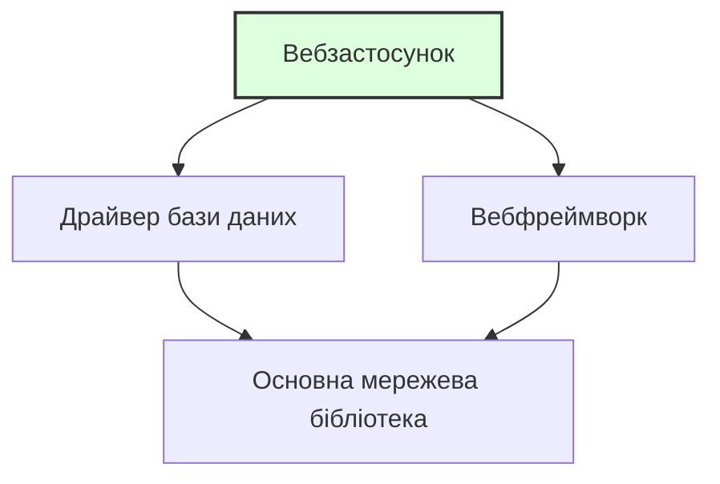

> **Складність**: `[ШВИДКО]` — Повний початківець
>
> **Час на проходження**: 25-30 хвилин
>
> **Попередні вимоги**: [Модуль 0.7: Що таке мережі?](/uk/prerequisites/zero-to-terminal/module-0.7-what-is-networking/) — Ви повинні впевнено почуватися з терміналом, файлами та базовими концепціями мереж.

---

## Що ви зможете зробити

Після цього модуля ви зможете:
- **Встановлювати** програмне забезпечення через термінал за допомогою пакетного менеджера вашої ОС
- **Аналізувати** різницю між пакетними менеджерами (apt, brew, dnf), щоб обрати правильний інструмент для конкретної операційної системи
- **Оцінювати** наслідки оновлення або видалення пакетів для безпеки та стабільності системи
- **Діагностувати** вимоги до залежностей, витягуючи інформацію про встановлені пакети

---

## Чому це важливо

Щоб працювати з Kubernetes, Docker та хмарними інструментами, вам потрібно буде **встановлювати програмне забезпечення** на свій комп'ютер — не завантажуючи інсталятори з вебсайтів і натискаючи «Далі, Далі, Готово», а ввівши одну команду в терміналі.

Цей модуль навчить вас, як працює ПЗ, що таке пакетні менеджери та як встановити ваші перші інструменти з командного рядка. Це навички, які ви використовуватимете буквально щодня в інженерії.

---

## Що таке програмне забезпечення?

Почнемо з самого початку.

**Програмне забезпечення** (ПЗ) — це набір інструкцій, які кажуть комп'ютеру, що робити. Коли ви відкриваєте веббраузер, відтворюєте відео або запускаєте команду в терміналі — це робить ПЗ.

ПЗ пишеться людьми за допомогою **мов програмування** — таких як Python, Go, Java або JavaScript, які створені бути зрозумілими і людям, і комп'ютерам (певною мірою).

Ось крихітний приклад на Python:

```python
print("Hello, World!")
```

Це програмне забезпечення. Один рядок, який каже комп'ютеру: «Виведи текст Hello, World! на екран».

> Аналогія з кухнею: ПЗ — це **рецепт**. Це інструкції для приготування страви. Комп'ютер — це шеф-кухар, який точно слідує рецепту. Мови програмування — це мова, на якій написаний рецепт (англійська, французька тощо).

---

## Від вихідного коду до запущеної програми

> **Зупиніться та подумайте**: якщо процесор комп'ютера розуміє лише бінарний код (1 та 0), як він може виконати рецепт, написаний зрозумілими для людини словами? Поміркуйте, що має статися між написанням коду та його запуском.

Кожен фрагмент ПЗ проходить шлях від «слів, надрукованих людиною» до «того, що ваш комп'ютер може запустити»:

### Крок 1: Вихідний код (Source Code)

Це те, що пишуть програмісти. Це виглядає як текст:

```go
package main

import "fmt"

func main() {
    fmt.Println("Hello from Go!")
}
```

Ви можете це прочитати (більш-менш). Ваш комп'ютер не може запустити це напряму.

### Крок 2: Компіляція (для деяких мов)

Деякі мови потрібно **компілювати** — перекладати з людиночитаного коду в **машинний код** (бінарний код — одиниці та нулі, які розуміє процесор вашого комп'ютера).

```
Вихідний код  →  Компілятор  →  Бінарний файл (виконуваний)
(рецепт)        (перекладач)   (готова страва, яку можна подавати)
```


Результат називається **бінарним файлом** (binary) або **виконуваним файлом** (executable) — це файл, який ваш комп'ютер справді може запустити.

> Аналогія з кухнею: Вихідний код — це рецепт на папері. Компіляція — це процес приготування. Бінарний файл — це готова страва, подана на тарілці.

### Крок 3: Виконання

Ви **запускаєте** (виконуєте) бінарний файл, і комп'ютер слідує інструкціям.

```bash
$ ./my-program
Hello from Go!
```

> Не всі мови потребують компіляції. Python, наприклад, є **інтерпретованою** мовою — він читає та запускає код рядок за рядком, як шеф-кухар, що читає рецепт крок за кроком прямо під час готування. Мови на кшталт Go, C та Rust спочатку компілюються, а потім запускаються — як шеф-кухар, що заздалегідь готує всі інгредієнти.

---

## Що таке пакет?

> **Зупиніться та подумайте**: якби вам довелося встановлювати програму без графічного інсталятора, які ручні кроки вам знадобилися б, щоб отримати вихідний код, перекласти його та розмістити в потрібному каталозі?

Встановлення ПЗ із вихідного коду — це складно. Вам знадобилося б:

1. Завантажити вихідний код
2. Встановити потрібний компілятор
3. Скомпілювати код
4. Перемістити бінарний файл у потрібне місце
5. Сподіватися, що нічого не зламалося

**Пакет** (package) згортає все це в акуратний пакунок. Це вихідний код, зазвичай уже скомпільований, зібраний разом з інструкціями про те, куди його встановлювати і що ще йому потрібно для роботи.

> Аналогія з кухнею: Пакет — це **набір для приготування страв** (як-от Blue Apron або HelloFresh). Замість того, щоб іти в магазин, шукати кожен інгредієнт і визначати кількість, хтось уже зібрав усе для вас. Просто відкрийте коробку та слідуйте простим інструкціям.

---

## Що таке пакетний менеджер?

**Пакетний менеджер** (package manager) — це інструмент, який завантажує, встановлює, оновлює та видаляє пакети для вас. Це як **магазин застосунків** (app store) для вашого термінала.

Замість того, щоб відвідувати вебсайт, завантажувати файл і проходити через інсталятор, ви вводите одну команду:

```bash
$ sudo apt install htop       # В Ubuntu/Debian Linux
$ brew install htop            # В macOS
```

І пакетний менеджер:
1. Знаходить пакет у своєму каталозі
2. Завантажує його
3. Встановлює його
4. Налаштовує його так, щоб ви могли ним користуватися

### Поширені пакетні менеджери

| Пакетний менеджер | Операційна система | Команда встановлення |
|-------------------|-------------------|----------------------|
| **apt** | Ubuntu, Debian (Linux) | `sudo apt install package-name` |
| **dnf** / **yum** | Fedora, RHEL, CentOS (Linux) | `sudo dnf install package-name` |
| **brew** (Homebrew) | macOS (та Linux) | `brew install package-name` |
| **pacman** | Arch Linux | `sudo pacman -S package-name` |
| **choco** | Windows | `choco install package-name` |

> У цій навчальній програмі ми здебільшого будемо використовувати **apt** (для Linux) та **brew** (для macOS), оскільки вони є найпоширенішими у світі Kubernetes.

---

## Що таке `sudo`?

Ви помітите, що деякі команди починаються з `sudo`. Це важливо.

**`sudo`** розшифровується як **«superuser do»** (виконати від імені суперкористувача) — ця команда запускає програму з **правами адміністратора**.

Ваш комп'ютер має систему безпеки: звичайні користувачі не можуть встановлювати ПЗ для всієї системи, змінювати системні файли або робити будь-що, що може зламати комп'ютер. Це зроблено навмисно. Це запобігає нещасним випадкам і зберігає вашу систему в безпеці.

Але встановлення ПЗ вимагає запису файлів у системні каталоги, до яких звичайні користувачі не мають доступу. Тому ви використовуєте `sudo`, щоб тимчасово стати **суперкористувачем** (якого також називають **root** — всемогутній акаунт адміністратора).

```bash
$ apt install htop              # Помилка: permission denied
$ sudo apt install htop         # Працює (запитає ваш пароль)
```

> **Зупиніться та подумайте**: що саме станеться, якщо ви запустите `apt install tree` в системі Linux без `sudo`? Не просто вгадуйте — спробуйте запустити це і прочитайте точне повідомлення про помилку, яке видасть система.

Коли ви вводите `sudo`, вас запитають пароль. Це ваш пароль користувача — той самий, який ви використовуєте для входу в систему. Коли ви його вводите, ви не побачите жодних символів на екрані (ні крапок, ні зірочок, нічого). Це нормально і зроблено навмисно — щоб хтось, хто дивиться вам через плече, не міг порахувати кількість символів. Просто введіть пароль і натисніть Enter.

> Аналогія з кухнею: `sudo` — це як **ключ менеджера**. Більшість персоналу може працювати на кухні, але щоб зайти в комору або змінити налаштування термостата, потрібен ключ менеджера. `sudo` дає вам цей ключ тимчасово.

### В macOS з Homebrew

Homebrew (`brew`) розроблений так, що вам зазвичай **не потрібен `sudo`**. Він встановлює пакети у ваш простір користувача, а не в системні каталоги. Це одна з причин популярності Homebrew — менше мороки з правами доступу.

```bash
$ brew install htop             # Працює без sudo на macOS
```

---

## Залежності: програми, яким потрібні інші програми

Програмне забезпечення рідко працює саме по собі. Більшість програм потребують інших програм або бібліотек для функціонування. Вони називаються **залежностями** (dependencies).

Наприклад:
- Вебзастосунку може знадобитися база даних
- Інструменту командного рядка може знадобитися специфічна бібліотека
- Програмі на Python потрібно, щоб був встановлений сам Python



> Аналогія з кухнею: Залежності — це як **інгредієнти для інгредієнтів**. Щоб приготувати спеціальний соус, вам потрібен майонез. Але щоб зробити майонез, потрібні яйця та олія. Яйця та олія є залежностями для майонезу, який сам по собі є залежністю для спеціального соусу.

### Чому залежності важливі

**Хороша новина**: Пакетні менеджери обробляють залежності автоматично. Коли ви встановлюєте пакет, пакетний менеджер також встановлює все, що потрібно цьому пакету.

```bash
$ sudo apt install some-program
Reading package lists... Done
The following additional packages will be installed:
  dependency-1 dependency-2 dependency-3
```

Пакетний менеджер вираховує весь ланцюжок залежностей і встановлює їх усі. Вам не потрібно шукати їх самостійно.

**Менш хороша новина**: Іноді залежності конфліктують між собою. Програмі А потрібна версія 1.0 певної бібліотеки, а програмі Б — версія 2.0. Це називається **«пеклом залежностей»** (dependency hell), і це одна з проблем, для вирішення яких були винайдені контейнери (про які ви дізнаєтеся незабаром).

> **Зупиніться та подумайте**: уявіть, що ви налаштовуєте сервер. Програма А суворо вимагає `libfoo` версії 1.0. Програма Б суворо вимагає `libfoo` версії 2.0. Якщо ваша операційна система дозволяє встановити лише одну версію бібліотеки глобально, яку б ви встановили першою і чому? Саме ця дилема призвела до винаходу Docker та контейнерів, про які ви скоро дізнаєтеся — вони дозволяють кожній програмі мати свій власний ізольований набір залежностей.

---

## Встановлення ваших перших пакетів

Давайте встановимо кілька корисних інструментів. Слідуйте інструкціям для вашої операційної системи.

### Оновлення списку пакетів

> **Зупиніться та подумайте**: як ви думаєте, чому потрібно запускати `update` перед `install`? Поміркуйте: пакетний менеджер має локальний каталог того, що доступно. Але нові версії виходять щодня. Якщо ви встановите пакет без оновлення, ви можете отримати стару версію — або взагалі зазнати невдачі, бо каталог ще не знає про цей пакет.

Перед встановленням будь-чого оновіть каталог вашого пакетного менеджера. Сприймайте це як оновлення списку того, що доступно:

**Ubuntu/Debian Linux:**

```bash
$ sudo apt update
```

Це нічого не встановлює і не змінює — просто завантажує найсвіжіший список доступних пакетів та їхніх версій.

**macOS:**

По-перше, якщо у вас ще не встановлено Homebrew, встановіть його зараз:

```bash
# Встановлення Homebrew (тільки для macOS — пропустіть, якщо він уже є)
/bin/bash -c "$(curl -fsSL https://raw.githubusercontent.com/Homebrew/install/HEAD/install.sh)"
```

> Це може зайняти кілька хвилин. Система запитає ваш пароль (той, який ви використовуєте для входу в Mac).

Після встановлення Homebrew оновіть його:

```bash
$ brew update
```

### Встановлення `htop` — системного монітора

`htop` — це візуальний інструмент, який показує, які програми запущені на вашому комп'ютері, скільки процесора та пам'яті вони споживають тощо.

**Ubuntu/Debian Linux:**

```bash
$ sudo apt install htop
```

**macOS:**

```bash
$ brew install htop
```

Тепер запустіть його:

```bash
$ htop
```

Ви побачите кольоровий дисплей, що показує використання процесора (CPU), пам'яті та запущені процеси (програми). Це як дивитися на дошку замовлень у кухні — ви бачите все, що відбувається одночасно.

**Натисніть `q`, щоб вийти з htop.**

### Встановлення `tree` — візуалізатора каталогів

Пам'ятаєте, як ми створювали каталоги в Модулі 0.4? `tree` показує структуру каталогів у гарному візуальному форматі.

**Ubuntu/Debian Linux:**

```bash
$ sudo apt install tree
```

**macOS:**

```bash
$ brew install tree
```

Тепер спробуйте:

```bash
$ tree ~/kubedojo-practice
```

Ви маєте побачити щось на кшталт:

```
/home/yourname/kubedojo-practice
└── recipes
    ├── appetizers
    │   └── bruschetta.txt
    ├── desserts
    │   └── tiramisu.txt
    └── main-courses
        └── pasta-carbonara.txt
```

(Якщо ви виконали вправу в Модулі 0.4. Якщо ні, `tree` все одно працює — просто спробуйте запустити його для будь-якого каталогу.)

---

## Оновлення та видалення програмного забезпечення

### Оновлення всіх встановлених пакетів

З часом програмне забезпечення на вашому комп'ютері отримує оновлення — виправлення помилок, патчі безпеки, нові функції. Вам слід регулярно оновлюватися.

**Ubuntu/Debian Linux:**

```bash
$ sudo apt update              # Оновити список пакетів
$ sudo apt upgrade             # Встановити доступні оновлення
```

Ви можете об'єднати їх:

```bash
$ sudo apt update && sudo apt upgrade
```

Символи `&&` означають: «запустити другу команду, тільки якщо перша завершилася успішно». Сприймайте це як: «Оновити список, А ПОТІМ встановити оновлення».

**macOS:**

```bash
$ brew update && brew upgrade
```

### Чому оновлення важливі: повчальна історія

У 2017 році бюро кредитних історій Equifax постраждало від масштабного витоку даних, що розкрив особисту інформацію 147 мільйонів людей. Причина? Відома вразливість у програмному забезпеченні під назвою Apache Struts. Патч для виправлення цієї вразливості був доступний уже два місяці, але Equifax не оновила свої системи. Це одне пропущене оновлення коштувало компанії понад 1,4 мільярда доларів на врегулювання позовів і повністю зруйнувало її репутацію. В інженерному світі запуск оновлень пакетів — це не просто отримання нових функцій; це критична відповідальність за безпеку.

> **Зупиніться та подумайте**: якщо оновлення такі важливі, чому б просто не налаштувати сервери на автоматичне оновлення щоночі? У виробничих середовищах (production) несподіване оновлення може зламати ваш застосунок. Якщо бібліотека, від якої залежить ваш код, змінить свою поведінку в новій версії, ваш застосунок може «впасти» посеред нічі. Ось чому інженери ретельно тестують оновлення в тестовому середовищі (staging), перш ніж застосовувати їх на робочих серверах.

### Видалення програмного забезпечення

**Ubuntu/Debian Linux:**

```bash
$ sudo apt remove package-name
```

**macOS:**

```bash
$ brew uninstall package-name
```

### Пошук пакетів

Не впевнені, як називається пакет?

**Ubuntu/Debian Linux:**

```bash
$ apt search keyword
```

**macOS:**

```bash
$ brew search keyword
```

---

## Чи знали ви?

> 1. **Homebrew (пакетний менеджер для macOS) був створений у 2009 році розробником, якого дратувало, що в macOS немає нормального пакетного менеджера.** Макс Хауелл створив його як проєкт із відкритим кодом. Сьогодні він налічує понад 6 000 пакетів і використовується мільйонами розробників. Назва — це метафора домашнього пивоваріння: пакети називаються «formulae» (рецепти), місце встановлення — «Cellar» (підвал), а вся система «варить» (brews) ваше ПЗ.
>
> 2. **Пакетний менеджер `apt` в Ubuntu має доступ до понад 60 000 пакетів.** Це 60 000 програм, які ви можете встановити однією командою. Від текстових редакторів до баз даних, ігор та інструментів для наукових обчислень — це один із найбільших каталогів ПЗ у світі, і все це безкоштовно.
>
> 3. **Концепція `sudo` виникла через реальну потребу в безпеці.** У 1980 році програмістам з Університету Буффало потрібен був спосіб дозволити довіреним користувачам запускати певні команди від імені root без розголошення пароля root. Вони створили `sudo` — що спочатку означало «superuser do». Система реєструє кожну команду `sudo`, щоб адміністратори могли перевірити, хто і що робив. Сьогодні `sudo` використовується практично в кожній системі Linux та macOS.
>
> 4. **Фраза «пекло залежностей» — це реальний технічний термін.** Він виник у спільноті Linux для опису надзвичайного розчарування при спробі встановити програму, яка вимагає специфічної версії спільної бібліотеки, що своєю чергою ламає іншу програму, якій потрібна інша версія тієї ж бібліотеки.

---

## Типові помилки

| Помилка | Що відбувається | Як виправити | Реальні наслідки |
|---------|-----------------|--------------|------------------|
| Забули `sudo` в Linux | `Permission denied` або `Operation not permitted` | Додайте `sudo` перед командою: `sudo apt install ...` | Встановлення не вдається, ви не можете скористатися потрібним інструментом. |
| Використання `sudo` з `brew` в macOS | Homebrew попереджає або встановлення йде не так | Не використовуйте `sudo` з `brew` — йому це не потрібно | Ви можете порушити права доступу до файлів Homebrew, що вимагатиме виснажливих ручних виправлень у майбутньому. |
| Не запустили `apt update` спочатку | Може встановитися стара версія або пакет не буде знайдено | Завжди запускайте `sudo apt update` перед встановленням у Linux | Ви можете встановити ПЗ з відомою вразливістю, або встановлення взагалі не вдасться. |
| Друкарська помилка в назві пакета | `Unable to locate package htoop` | Перевірте написання або скористайтеся `apt search` / `brew search` | Ви можете випадково встановити шкідливий пакет, створений хакером саме в розрахунку на таку помилку (typosquatting). |
| Не читаєте вивід термінала | Пропускаєте важливі попередження або помилки | Читайте, що каже вам термінал! Він часто пояснює, що саме пішло не так | Ви можете повірити, що критичний інструмент безпеки встановлено успішно, хоча насправді він не встановився, залишивши систему вразливою. |
| Натискання Enter під час запиту пароля без введення нічого | Помилка автентифікації | Введіть пароль (символів не буде видно) і натисніть Enter | Ви витрачаєте час на повторне введення команд і можете заблокувати свій акаунт після забагатьох невдалих спроб. |

---

## Контрольні запитання

**Запитання 1**: Ви щойно прийшли в нову компанію, і вам потрібно встановити Node.js, PostgreSQL та Redis на робочий ноутбук. Колега каже вам: «просто зайди на їхні сайти та завантаж інсталятори». Чому використання пакетного менеджера було б кращим інженерним підходом для цього налаштування?

<details>
<summary>Показати відповідь</summary>

Використання пакетного менеджера значно ефективніше та зручніше в обслуговуванні, ніж ручне завантаження. Пакетний менеджер діє як централізований магазин застосунків для вашого термінала, дозволяючи встановити всі три інструменти лише однією-двома командами. Він також автоматично завантажує будь-які приховані залежності, гарантуючи, що ПЗ запрацює одразу. Крім того, коли виходять оновлення або патчі безпеки, ви можете оновити всі інструменти разом однією командою, замість того, щоб знову відвідувати три різні вебсайти.

</details>

**Запитання 2**: Сценарій пошуку несправностей: Ви увійшли на сервер Linux як звичайний користувач і намагаєтеся встановити інструмент моніторингу за допомогою `apt install htop`. Термінал видає помилку «Permission denied». Чому система заблокувала цю дію і яку структуру команди слід використати для вирішення проблеми?

<details>
<summary>Показати відповідь</summary>

Система заблокувала дію, тому що встановлення програмного забезпечення вимагає запису в системні каталоги, що дозволено лише адміністратору, щоб запобігти несанкціонованим або випадковим змінам з боку звичайних користувачів. Щоб вирішити це, ви повинні додати до команди префікс `sudo` (наприклад, `sudo apt install htop`), що тимчасово надасть вам права суперкористувача (root). Цей механізм змушує вас явно підтвердити свій намір внести адміністративні зміни, захищаючи цілісність системи.

</details>

**Запитання 3**: Ви намагаєтеся встановити просту погодну програму для командного рядка, але вивід пакетного менеджера показує, що він також завантажує ще 15 інших пакетів, зокрема щось під назвою `python3-requests`. Чому пакетний менеджер завантажує всі ці додаткові інструменти, про які ви не просили?

<details>
<summary>Показати відповідь</summary>

Ці додаткові пакети є залежностями, які необхідні погодній програмі для коректної роботи. ПЗ рідко працює ізольовано; розробники покладаються на існуючі бібліотеки для виконання таких завдань, як здійснення мережевих запитів, замість того, щоб писати цей код з нуля. Пакетний менеджер виконує свою роботу, автоматично ідентифікуючи, завантажуючи та встановлюючи ці передумови. Без цього автоматичного вирішення залежностей вам довелося б вручну шукати та встановлювати всі 15 бібліотек самостійно.

</details>

**Запитання 4**: Сценарій пошуку несправностей: Оголошено про критичну вразливість в інструменті `curl`, і вам наказано негайно її виправити. Ви запускаєте `sudo apt upgrade curl`, але термінал повідомляє, що `curl is already the newest version`, хоча ви знаєте, що патч вийшов кілька годин тому. Чому пакетний менеджер не встановлює патч і як виправити цей робочий процес?

<details>
<summary>Показати відповідь</summary>

Пакетний менеджер не встановлює патч, тому що він покладається на застарілий локальний каталог доступних версій ПЗ. Команда `upgrade` лише встановлює нові версії пакетів, про які вона вже знає у своїй локальній базі даних. Щоб виправити це, ви повинні спочатку запустити `sudo apt update`, щоб завантажити найсвіжіший індекс пакетів із віддалених репозиторіїв. Як тільки локальний каталог оновиться інформацією про новий патч, команда оновлення успішно завантажить і застосує виправлення безпеки.

</details>

**Запитання 5**: Ви допомагаєте молодшому розробнику виправити проблему через демонстрацію екрана. Ви кажете йому запустити команду з `sudo`. Він вводить свій пароль, але потім раптом зупиняється і каже: «Моя клавіатура зламалася, нічого не друкується». Як ви поясните, що відбувається і чому система поводиться саме так?

<details>
<summary>Показати відповідь</summary>

Система навмисно приховує введення символів як вбудовану функцію безпеки. На відміну від веббраузерів, які показують зірочки або крапки, термінал не відображає абсолютно нічого під час введення паролів. Це не дозволяє нікому, хто дивиться вам через плече або спостерігає за екраном, дізнатися навіть точну довжину вашого пароля. Ви повинні сказати розробнику впевнено ввести пароль повністю та натиснути Enter, запевнивши його, що комп'ютер насправді отримує його введення.

</details>

**Запитання 6**: Сценарій пошуку несправностей: Ви запускаєте `sudo apt install nginx`, щоб встановити вебсервер на абсолютно новій машині Linux, але термінал одразу видає: `E: Unable to locate package nginx`. Ви точно знаєте, що `nginx` — це правильна назва пакета. Що є найбільш імовірною причиною цієї помилки і яку команду слід запустити, щоб її виправити?

<details>
<summary>Показати відповідь</summary>

Найбільш імовірною причиною є те, що локальний каталог доступних пакетів абсолютно порожній або застарілий, оскільки це нова машина. Пакетний менеджер ще не знає, звідки завантажувати пакет, бо він не синхронізувався з віддаленими репозиторіями ПЗ. Щоб виправити це, ви повинні спочатку запустити `sudo apt update`, щоб завантажити останній індекс пакетів. Після оновлення каталогу повторна спроба встановлення успішно знайде та завантажить пакет.

</details>

---

## Практична вправа: ваші перші встановлення ПЗ

### Мета

Використати пакетний менеджер для встановлення, запуску та вивчення нового ПЗ через термінал.

### Кроки

1. **Оновіть свій пакетний менеджер:**

В Ubuntu/Debian Linux:
```bash
$ sudo apt update
```

В macOS:
```bash
$ brew update
```

2. **Встановіть htop:**

В Ubuntu/Debian Linux:
```bash
$ sudo apt install htop -y
```

В macOS:
```bash
$ brew install htop
```

Прапор `-y` (в apt) означає «так на всі запити» (yes to all prompts) — він автоматично підтверджує встановлення, не запитуючи «Ви впевнені? [Y/n]».

3. **Запустіть htop та дослідіть його:**

```bash
$ htop
```

Зверніть увагу на:
- Смужки використання процесора (CPU) вгорі
- Смужку використання пам'яті (Memory)
- Список запущених процесів
- Кожен процес має PID (Process ID — унікальний номер)

Натисніть `q`, щоб вийти.

4. **Встановіть tree:**

В Ubuntu/Debian Linux:
```bash
$ sudo apt install tree -y
```

В macOS:
```bash
$ brew install tree
```

5. **Використовуйте tree для візуалізації каталогу:**

```bash
$ tree ~/kubedojo-practice
```

Якщо у вас немає `kubedojo-practice`, спробуйте:

```bash
$ tree ~ -L 1
```

Прапор `-L 1` означає «показувати лише на 1 рівень вглиб» — це корисно для великих каталогів.

6. **Перевірте, що встановлено:**

В Ubuntu/Debian Linux:
```bash
$ apt list --installed | head -20
```

В macOS:
```bash
$ brew list
```

7. **Пошукайте пакет:**

В Ubuntu/Debian Linux:
```bash
$ apt search "system monitor"
```

В macOS:
```bash
$ brew search "monitor"
```

8. **Перевірте версію встановленого інструмента:**

```bash
$ htop --version
```

Більшість програм підтримують `--version` або `-v` для показу номера своєї версії. Це корисно для пошуку несправностей: «Яка версія цього інструмента у мене встановлена?»

### Додаткове завдання: дослідження залежностей

Програмне забезпечення покладається на інше ПЗ. Давайте простежимо ланцюжок залежностей, щоб побачити, наскільки все взаємопов'язано.

1. Оберіть пакет, який ви щойно встановили (наприклад, `tree` або `htop`).
2. Запустіть `apt show htop` (у Linux) або `brew info htop` (в macOS).
3. Подивіться на вивід та знайдіть розділ «Depends» або «Dependencies».
4. Оберіть одну з цих залежностей і запустіть для неї команду `apt show` або `brew info`, щоб побачити, від чого залежить *вона*.

Вміння перевіряти пакет перед його встановленням — це критична навичка для оцінки безпеки та «роздмуханості» (bloat) нових інструментів.

### Критерії успіху

Ви завершили цю вправу, якщо можете:

- [ ] Оновити свій пакетний менеджер
- [ ] Встановити `htop` та запустити його (і вийти за допомогою `q`)
- [ ] Встановити `tree` та використати його для відображення каталогу
- [ ] Шукати пакети за ключовими словами
- [ ] Перевіряти версію встановленого інструмента
- [ ] Досліджувати залежності пакета (Додаткове завдання)

---

> Ви щойно використали інструмент, яким досвідчені інженери користуються щодня. Ви на своєму місці.

---

## Наступний модуль

Тепер ви знаєте, як програмне забезпечення проходить шлях від коду до запущеної програми, як встановлювати інструменти за допомогою пакетного менеджера і що робить `sudo`. Ваш інструментарій термінала зростає.

Звідси у вас є фундамент, щоб почати вивчати контейнери, хмарні обчислення і, зрештою, Kubernetes. Кожен інструмент в екосистемі Kubernetes — `kubectl`, `helm`, `kind`, `docker` — встановлюється саме так, як ви щойно навчилися.

**Продовжити до**: [Модуль 0.10: Що таке хмара?](/uk/prerequisites/zero-to-terminal/module-0.10-what-is-the-cloud/) — Дізнайтеся, чим насправді є хмара, як працюють дата-центри та чому компанії орендують сервери замість того, щоб купувати їх.
