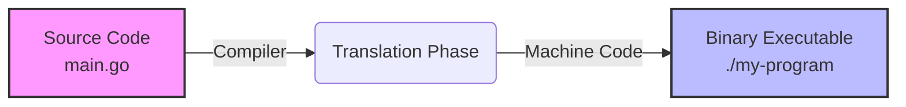
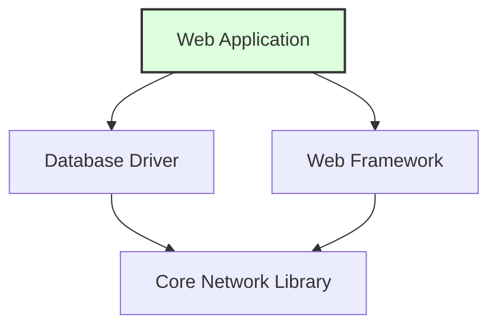

> **Складність**: `[QUICK]` - Абсолютний новачок
>
> **Час на виконання**: 25-30 хвилин
>
> **Передумови**: [Модуль 0.7: Що таке мережі?](/uk/prerequisites/zero-to-terminal/module-0.7-what-is-networking/) - Ви маєте впевнено працювати з терміналом, файлами та знати базові концепції мереж.

---


## Що ви зможете зробити

Після цього модуля ви зможете встановлювати корисні інструменти командного рядка, обирати правильний робочий процес керування пакетами для вашої операційної системи та перевіряти, що саме пакет приносить на вашу машину, перш ніж довіряти йому в щоденній інженерній роботі.

- **Виконувати** встановлення програмного забезпечення з термінала за допомогою менеджера пакетів вашої ОС.
- **Порівнювати** менеджери пакетів, такі як `apt`, `brew` та `dnf`, щоб ви могли обрати правильний інструмент для конкретної операційної системи.
- **Оцінювати** наслідки для безпеки та стабільності під час оновлення або видалення пакетів на машині розробника чи сервері.
- **Діагностувати** вимоги до залежностей шляхом вилучення метаданих пакета про встановлене програмне забезпечення та його допоміжні бібліотеки.


## Чому це важливо

Гіпотетичний сценарій: Ви долучаєтесь до навчального середовища Kubernetes 1.35+, і посібник з налаштування просить вас встановити `kubectl`, `helm`, `kind`, `htop` та текстовий редактор. Якщо ви розглядатимете кожен інструмент як окреме завантаження з вебсайту, кожна машина перетвориться на унікальну сніжинку: на одному ноутбуці старіший бінарник, на іншому неправильна збірка для процесора, а на сервері не вистачає бібліотеки підтримки, яку ніхто не здогадався задокументувати. Менеджери пакетів зменшують цей хаос, перетворюючи встановлення на повторювані команди, які можна перевіряти, копіювати, автоматизувати та згодом оновлювати.

Ця ж звичка має значення й поза межами лабораторій. Інженери використовують менеджери пакетів для патчингу вразливих утиліт, встановлення засобів діагностики під час інцидентів, підтримання подібності робочих ноутбуків до середовищ продакшену, а також для видалення інструментів, яким більше не місце на хості. Менеджер пакетів — це не магія і він не позбавлений ризиків, але він дає вам контрольований шлях крізь заплутану проблему: програмне забезпечення складається з файлів, версій, дозволів, репозиторіїв, залежностей, підписів та скриптів встановлення. Раннє засвоєння цього шляху зробить майбутні модулі з контейнерів, хмарних технологій та Kubernetes значно менш загадковими.

У цьому модулі ви побудуєте практичну ментальну модель встановлення програмного забезпечення з термінала. Ви побачите, як вихідний код стає програмою, навіщо існують пакети, що змінює `sudo`, як вирішуються залежності, а також як встановлювати, оновлювати, видаляти, шукати та перевіряти невеликі інструменти. Мета полягає не в тому, щоб запам'ятати кожен прапорець менеджера пакетів. Мета полягає в тому, щоб розпізнати робочий процес настільки добре, щоб нова команда на кшталт `brew info`, `apt show` або `dnf install` відчувалася як варіація вже зрозумілого вам шаблону.


## Програмне забезпечення, вихідний код та виконувані файли

Програмне забезпечення — це набір інструкцій, який вказує комп'ютеру, що робити, але це просте визначення приховує кілька рівнів. Коли ви відкриваєте браузер, відтворюєте відео, запускаєте `ls` або стартуєте клієнт Kubernetes, ви просите операційну систему завантажити файли з диска в пам'ять і виконати інструкції через процесор. Деякі з цих інструкцій були написані людьми як зрозумілий текст, деякі були згенеровані інструментами збірки, а деякі прибули на вашу машину вже спакованими іншим мейнтейнером.

Ось найменший з можливих прикладів програмного забезпечення на Python. Цей рядок — звичайний текст, і ви можете прочитати інструкцію, не знаючи багато про те, як працюють процесори. Сам Python бере на себе роботу з інтерпретації цього тексту та надсилає запит до операційної системи для відображення результату.

```python
print("Hello, World!")
```

Цей єдиний рядок дає вам перше важливе розмежування: вихідний код призначений для людей та інструментів, тоді як запущені програми — для операційної системи та процесора. Мова програмування схожа на мову рецептів із суворою граматикою. Комп'ютер — це надзвичайно буквальний кухар; він швидко виконуватиме правильні інструкції, але не буде здогадуватися, що ви мали на увазі, коли пунктуація, відступи, назви файлів, дозволи або версії залежностей є неправильними.

Деякі мови створюють виконуваний файл перед тим, як ви їх запустите. Go, C, C++ та Rust зазвичай дотримуються цієї моделі, що означає, що вихідний код перекладається в машинний код компілятором. Наведений нижче приклад все ще зрозумілий людині, але ваш процесор не виконує слова `package`, `import` або `fmt.Println` безпосередньо.

```go
package main

import "fmt"

func main() {
    fmt.Println("Hello from Go!")
}
```

Шлях від читабельного коду до програми, яку можна запустити, має кілька етапів. Вам не потрібно ставати експертом з компіляторів, щоб встановлювати інструменти, але ви повинні знати, що виконуваний файл — це результат процесу збірки, а не просто випадковий файл із дружньою назвою. Ця відмінність пояснює, чому мейнтейнери пакетів витрачають так багато зусиль на створення програмного забезпечення для конкретних операційних систем, архітектур процесорів та версій залежностей.

```
Source Code  ->  Compiler  ->  Binary (executable)
(recipe)        (translator)  (the finished dish, ready to serve)
```


```mermaid
flowchart LR
    A["Source Code<br/>main.go"] -->|Compiler| B(Translation Phase)
    B -->|Machine Code| C["Binary Executable<br/>./my-program"]

    style A fill:#f9f,stroke:#333,stroke-width:2px
    style C fill:#bbf,stroke:#333,stroke-width:2px
```

Після того, як бінарник створено, виконання стає значно простішим з погляду користувача. Операційна система перевіряє, чи є файл виконуваним, завантажує його та запускає процес. Саме тому багато інструментів можна запустити, ввівши шлях або назву команди після встановлення.

```bash
./my-program
```

Термінал тоді може вивести результат, для отримання якого була написана програма. Якби ви скомпілювали приклад на Go вище у `my-program`, видимим результатом був би текст нижче, і програма б завершила роботу, виконавши рівно одне завдання.

```text
Hello from Go!
```

Не кожна мова змушує вас спершу компілювати. Python зазвичай інтерпретується, JavaScript може бути інтерпретований або скомпільований «на льоту», і багато хмарних інструментів поширюються у вигляді готових бінарників, які ви ніколи не збираєте самостійно. Важливий урок для початківців полягає в тому, що встановлення означає розміщення потрібних виконуваних файлів, бібліотек, метаданих і файлів підтримки там, де операційна система та оболонка зможуть їх надійно знайти.

Зупиніться та подумайте: якщо процесор зрештою виконує машинні інструкції, що має бути правдою перед тим, як команда на кшталт `htop` зможе запрацювати з будь-якого вікна термінала? Продумайте шлях від вихідного коду, через спаковані файли, до місця розташування виконуваного файлу та того, як ваша оболонка знайде назву команди без введення повного шляху.


## Пакети та менеджери пакетів

Ручне встановлення з вихідного коду можливе, але це поганий вибір за замовчуванням для початківців і крихкий вибір для команд. Без пакета вам довелося б завантажувати вихідний код, встановлювати правильний компілятор, вибирати параметри збірки, компілювати для вашого процесора, переміщувати файли до системних каталогів, записувати, що ви встановили, і пам'ятати, як пізніше все це видалити або оновити. Це величезний обсяг прихованої роботи для одного інструмента, і кожен ручний крок створює ще одне місце, де дві машини можуть розійтися.

Пакет загортає цю роботу в структурований набір. Він зазвичай містить вже зібрані файли, метадані про версію та мейнтейнера, декларації залежностей, контрольні суми або підписи, а також інструкції щодо того, куди мають потрапити файли. Пакет схожий на набір для приготування їжі: інгредієнти та рецепт усе ще справжні, але хтось підготував стандартизовану коробку, щоб вам не доводилося щоразу заново відкривати весь ланцюжок постачання, коли ви хочете повечеряти.

Менеджер пакетів — це інструмент, який знає, де живуть пакети, як їх завантажувати, як їх перевіряти, як їх встановлювати, і як пізніше скасувати або оновити встановлення. Замість того, щоб шукати вебсайт, вибирати кнопку завантаження і сподіватися, що ви обрали правильний файл, ви просите менеджера пакетів встановити названий пакет з налаштованого каталогу. Цей каталог називається репозиторієм у багатьох системах Linux, і tap або джерелом формули в Homebrew.

```bash
sudo apt install htop
brew install htop
```

Ці дві команди виражають одну й ту саму мету на різних платформах. В Ubuntu або Debian `apt` встановлює програмне забезпечення у місця, якими керує система, і зазвичай потребує привілеїв адміністратора. У macOS Homebrew зазвичай встановлює файли в префікс, яким керує сам Homebrew, і призначений для роботи без `sudo` під час звичайних операцій з пакетами. Деталі різняться, але шаблон залишається стабільним: здійснити пошук у каталозі, вирішити залежності, завантажити файли, встановити їх і записати, що сталося.

| Менеджер пакетів | Операційна система | Команда встановлення |
|-----------------|------------------|-----------------|
| **apt** | Ubuntu, Debian (Linux) | `sudo apt install package-name` |
| **dnf** / **yum** | Fedora, RHEL, CentOS (Linux) | `sudo dnf install package-name` |
| **brew** (Homebrew) | macOS (та Linux) | `brew install package-name` |
| **pacman** | Arch Linux | `sudo pacman -S package-name` |
| **choco** | Windows | `choco install package-name` |

Цей навчальний план здебільшого використовує `apt` у Linux та `brew` у macOS, оскільки це типові рішення для середовищ, з якими ви зіткнетеся на початку. Це не робить інші інструменти менш важливими. `dnf` у Fedora, `pacman` в Arch та менеджери пакетів для Windows розв'язують ту саму сім'ю проблем за допомогою різних команд, політик та екосистем репозиторіїв. Щойно ви зрозумієте концепції, вивчення нового менеджера пакетів стане простою вправою з перекладу, а не новою дисципліною.

Менеджери пакетів також створюють слід для аудиту. Ви можете запитати, що встановлено, яка у вас версія, з якого репозиторію воно надійшло та які ще пакети йому потрібні. Це набагато краще, ніж покладатися на пам'ять або теку, повну завантажених інсталяторів. Коли майбутній модуль попросить вас встановити `kubectl`, ви повинні відразу подумати про ті самі запитання: якому джерелу пакетів варто довіряти, яка версія мені потрібна, що ще встановлюється разом із ним, і як я буду його оновлювати, коли Kubernetes піде вперед?

Сценарій вправи: Ви готуєте два ноутбуки для навчальної групи. Один працює на Ubuntu, а інший — на macOS. Ви хочете, щоб обидва учні встановили `htop`, `tree` і згодом інструментарій Kubernetes, не створюючи купу ручних кроків. Правильна відповідь — це не одна універсальна команда; правильна відповідь — це один повторюваний робочий процес управління пакетами для кожної операційної системи, записаний настільки чітко, щоб кожен учень міг його виконати та перевірити результат.

Менеджер пакетів також допомагає вам передавати інструкції з налаштування як інженерні артефакти, а не особисті спогади. Написана команда, така як `sudo apt install tree`, може бути перевірена, версіонована в документації, повторена в лабораторії та порівняна з історією команд колеги. Фраза на кшталт "Я завантажив інструмент із вебсайту" залишає забагато питань без відповідей: який вебсайт, який файл, яка версія, яка архітектура і який шлях оновлення?


## Привілеї, довіра та `sudo`

Встановлення пакетів змінює файли, які впливають на більше ніж одну термінальну сесію. У системі Linux встановлення пакета може записувати у `/usr/bin`, `/usr/lib`, `/etc`, каталоги сервісів, сторінки посібників, шляхи інтеграції робочого столу та бази даних пакетів. Звичайним користувачам заборонено змінювати ці місця за замовчуванням, оскільки помилка там може зламати операційну систему або створити проблему безпеки для кожного користувача на машині.

Ось де `sudo` вступає в робочий процес. Назва зазвичай пояснюється як "superuser do": виконати цю єдину команду з підвищеними привілеями після перевірки того, що поточному користувачеві дозволено це робити. Ви автентифікуєтесь за допомогою свого звичайного пароля користувача, команда виконується з повноваженнями рівня адміністратора, і `sudo` може логувати привілейовану дію для аудиту. Це тимчасовий ключ, а не постійна зміна особистості.

```bash
apt install htop
sudo apt install htop
```

У першій команді навмисно відсутнє `sudo`, тому в типовій системі Ubuntu або Debian вона завершується помилкою, коли менеджер пакетів намагається змінити захищені розташування. Друга команда запитує тимчасові адміністративні привілеї і може продовжуватись, якщо вашому користувачеві це дозволено. Це не просто зайва робота. Це межа безпеки, яка змушує вас помічати, коли команда збирається змінити систему, а не лише ваш домашній каталог.

Коли `sudo` запитує пароль, термінал зазвичай не показує крапок, зірочок або символів-заповнювачів під час набору тексту. Ця тиша навмисна. Вона запобігає тому, щоб хтось поруч або хтось, хто дивиться трансляцію екрана, дізнався довжину вашого пароля. Введіть пароль уважно і натисніть Enter; клавіатура все ще працює, хоча екран і не відтворює символи.

Homebrew йде іншим шляхом у щоденному управлінні пакетами. Його звичайний дизайн полягає у встановленні пакетів у місце, яким керує Homebrew і до якого ваш користувач має права на запис, тому ви зазвичай не ставите `sudo` перед `brew install`. Використання `sudo` з Homebrew може створити невідповідність дозволів, що ускладнить майбутні встановлення та оновлення. Різні менеджери пакетів мають різні моделі привілеїв, тому копіюйте команди з урахуванням контексту, замість того, щоб ставитись до `sudo` як до прикраси.

```bash
brew install htop
```

Довіра — це інша половина привілеїв. Менеджер пакетів може запускати скрипти мейнтейнерів, розміщувати бінарники у вашому `PATH`, запускати сервіси або встановлювати бібліотеки, які будуть завантажені іншими програмами. Це не означає, що менеджери пакетів небезпечні; це означає, що встановлення — це рішення щодо безпеки. Віддавайте перевагу офіційним репозиторіям, документації розробників і добре відомим джерелам пакетів, і будьте особливо обережні з командами, скопійованими з випадкових коментарів або скриптів, які перенаправляють мережеве завантаження безпосередньо в оболонку.

Перш ніж запустити це, якого результату ви очікуєте від `apt install tree` без `sudo` у системі Linux? Спочатку запишіть своє передбачення, а потім спробуйте його в одноразовій лабораторії або на локальній машині, де вам дозволено тестувати. Читання точного повідомлення про помилку навчить вас більшому, ніж запам'ятовування попередження, адже справжнє усунення несправностей починається з того, що система сказала насправді.

Привілеї мають сприйматися як усвідомлений вибір, а не як щось страшне. Найздоровіша звичка — зупинитися, коли команда просить права адміністратора, і запитати, який захищений ресурс їй потрібен. Встановлення системного пакета є розумним використанням цього повноваження; редагування випадкових файлів у `/usr` вручну зазвичай таким не є. Ця пауза стає ще важливішою, коли ви пізніше встановлюватимете середовища виконання контейнерів, хмарні CLI та допоміжні програми Kubernetes, які можуть впливати на мережу, облікові дані або фонові сервіси.


## Залежності та обмеження версій

Програмне забезпечення рідко працює самостійно. Вебзастосунок може залежати від драйвера бази даних, утиліта командного рядка — від бібліотеки інтерфейсу термінала, а Python-застосунок залежить від самого Python та додаткових пакетів. Ці допоміжні компоненти називаються залежностями. Вони не є якимось необов'язковим доповненням; це невіддільна частина того, що забезпечує коректну роботу потрібного вам програмного забезпечення.


```mermaid
flowchart TD
    A[Web Application] --> B[Database Driver]
    A --> C[Web Framework]
    B --> D[Core Network Library]
    C --> D

    style A fill:#dfd,stroke:#333,stroke-width:2px
```

Менеджер пакетів зчитує метадані залежностей та будує план встановлення. Якщо ви просите встановити одну програму, план може охоплювати кілька бібліотек, допоміжних інструментів, сертифікатів, середовищ виконання мов або пакетів даних. Новачки іноді хвилюються, що менеджер пакетів робить щось підозріле, оскільки він завантажує більше, ніж вони ввели. У багатьох випадках саме ця додаткова робота і є причиною, чому ви взагалі використовуєте менеджер пакетів.

```bash
sudo apt install some-program
```

Типовий вивід менеджера пакетів може показати додаткові пакети перед запитом на підтвердження. Точні назви відрізнятимуться залежно від дистрибутива, стану репозиторію та версії пакета, але важлива сама форма повідомлення: менеджер пояснює ланцюжок залежностей перед тим, як внести зміни в систему.

```text
Reading package lists... Done
The following additional packages will be installed:
  dependency-1 dependency-2 dependency-3
```

Залежності стають проблемою, коли виникають конфлікти версій. Програма A може вимагати версію 1.0 `libfoo`, тоді як програма B вимагає версію 2.0 тієї ж бібліотеки. Якщо операційна система дозволяє мати лише одну глобальну версію у відповідному місці, одна програма може зламатися, коли вимоги іншої будуть задоволені. Це сімейство проблем часто називають "пеклом залежностей" (dependency hell), і це одна з причин, чому контейнери, віртуальні середовища та специфічні для мов програмування менеджери пакетів стали центральними елементами сучасної інженерії.

Менеджери пакетів не можуть усунути всі конфлікти версій, але вони роблять їх видимими та керованими. Вони ведуть бази даних встановлених версій, обчислюють сумісні набори залежностей, відмовляються від неможливих оновлень і показують, які пакети будуть встановлені, видалені або залишені без змін. Це значне покращення порівняно з ручним керуванням текою завантажених бінарних файлів, де ви можете навіть не знати, який саме файл додав несумісну бібліотеку.

Перевірка залежностей — це діагностична навичка, а не просто цікавий факт. Коли продуктовий хост раптово починає поводитися інакше після оновлення, інженери запитують, який пакет змінився, яка залежність змінилася разом із ним, і чи завантажує тепер сервіс іншу бібліотеку. Коли на ноутбуці розробника не запускається утиліта, інженери перевіряють, чи не бракує якоїсь залежності, або чи не прив'язана вона до неправильної версії. Метадані менеджера пакетів надають вам початкові докази для пошуку відповідей на ці запитання.

Зупиніться та подумайте: уявіть, що один застосунок командного рядка строго вимагає `libfoo` версії 1.0, а інший строго вимагає `libfoo` версії 2.0. Якщо у вашій операційній системі є лише одне спільне розташування бібліотек для цієї залежності, який застосунок стає ризиковано встановлювати другим, і чому контейнер або ізольоване середовище може полегшити керування цим конфліктом?

Саме тому "встановлено успішно" не означає "система перебуває в бажаному стані". Пакет може встановитися, підтягнувши новішу бібліотеку, ніж очікувалося, залишивши старий конфігураційний файл недоторканим або ввімкнувши сервіс, який усе ще потребує ручного налаштування. Менеджери пакетів виконують значну частину механічної роботи, але перевірка залишається вашою відповідальністю. Правильне запитання після встановлення — що саме змінилося і чи працює тепер інструмент так, як потрібно.


## Встановлення, оновлення, видалення та пошук

Зазвичай менеджери пакетів розділяють процеси оновлення метаданих і встановлення пакетів. В Ubuntu та Debian `apt update` завантажує найновіші індекси пакетів із налаштованих репозиторіїв. Сама по собі ця команда не оновлює кожен встановлений пакет; вона оновлює локальний каталог, щоб наступні команди встановлення або оновлення базувалися на актуальній інформації. Ця відмінність має значення, коли пакет був випущений нещодавно або щойно надійшло виправлення безпеки.

```bash
sudo apt update
```

У macOS Homebrew має власний робочий процес оновлення метаданих. Якщо Homebrew ще не встановлено, команда офіційного інсталятора публікується проєктом Homebrew. Ставтеся до таких команд з обережністю, оскільки вони завантажують і виконують інсталятор; використовуйте офіційну документацію, читайте команду і розумійте, чому вона відрізняється від встановлення звичайної формули.

```bash
/bin/bash -c "$(curl -fsSL https://raw.githubusercontent.com/Homebrew/install/HEAD/install.sh)"
```

Коли Homebrew вже встановлено, оновіть його метадані пакетів перед встановленням або оновленням інструментів. Це еквівалент оновлення каталогу в Homebrew, завдяки якому ваша локальна машина знатиме про поточні визначення формул.

```bash
brew update
```

Тепер ви можете встановити невелику утиліту для моніторингу. `htop` є корисним, оскільки він надає живе відображення використання процесора, пам'яті, запущених процесів, їхніх ідентифікаторів (PID) та споживання ресурсів просто в терміналі. Це також хороший пакет для новачків, оскільки він має малий обсяг, його легко запустити, а вийти з нього просто, щойно ви дізнаєтеся потрібну клавішу.

```bash
sudo apt install htop
```

Цей самий пакет у macOS використовує формат команд Homebrew. Зверніть увагу, що назва пакета залишається незмінною, тоді як менеджер пакетів та модель привілеїв змінюються. Це саме та звичка порівнювати, яку вам варто розвивати.

```bash
brew install htop
```

Після встановлення запустіть програму з термінала. Ви побачите інтерактивний дисплей з рядками процесів та індикаторами ресурсів. Натисніть `q`, щоб вийти, коли закінчите ознайомлення, оскільки термінальні програми часто керуються з клавіатури, а не за допомогою графічних кнопок закриття.

```bash
htop
```

Наступний інструмент, `tree`, допомагає візуалізувати каталоги. У попередніх модулях вас просили створювати файли й теки; `tree` перетворює цю вкладену структуру на зрозумілу схему. Це особливо корисно, коли вам потрібно пояснити структуру проєкту, порівняти очікувані файли з фактичними або додати знімок каталогу до нотаток з усунення несправностей.

```bash
sudo apt install tree
```

У macOS використовуйте формат Homebrew. Знову ж таки, не вважайте команди Linux та macOS взаємозамінними, оскільки ці операційні системи використовують різні сховища пакетів та підходи до привілеїв.

```bash
brew install tree
```

Після встановлення запустіть `tree` для навчального каталогу. Якщо ви виконали попередню вправу з файловою системою, наведений нижче шлях має вивести невелику структуру з рецептами. Якщо такого каталогу на вашій машині немає, команда завершиться помилкою зі зрозумілим повідомленням на зразок "Немає такого файла або каталогу" (No such file or directory), що є корисною підказкою, а не катастрофою.

```bash
tree ~/kubedojo-practice
```

Можливий вивід може мати такий вигляд. Точний префікс домашнього каталогу та файли залежать від вашої машини, але головне тут — візуальна форма: кожна гілка представляє вкладений каталог або файл, тому ви можете досліджувати структуру, не переходячи по теках по черзі.

```text
/home/yourname/kubedojo-practice
└── recipes
    ├── appetizers
    │   └── bruschetta.txt
    ├── desserts
    │   └── tiramisu.txt
    └── main-courses
        └── pasta-carbonara.txt
```

Оновлення встановленого програмного забезпечення — це окреме операційне рішення, і звичка "перевіряти перед зміною" (inspect-before-mutate) тут також важлива. В Ubuntu та Debian виведіть список пакетів, які будуть оновлені, перш ніж щось змінювати:

```bash
apt list --upgradable
```

У macOS безпечний еквівалент Homebrew, що не вносить змін, — це:

```bash
brew outdated
```

Спершу прочитайте цей план. Лише після того, як ви зрозумієте, що саме зміниться, вам слід оновлювати метадані та застосовувати оновлення. В Ubuntu та Debian `apt update` оновлює каталог, а `apt upgrade` застосовує доступні оновлення пакетів:

```bash
sudo apt update
sudo apt upgrade
```

Ви часто бачитимете ці дві команди об'єднаними за допомогою `&&`. Цей оператор означає "виконати другу команду, лише якщо перша завершиться успішно". Це корисно, оскільки оновлення після невдалого завантаження метаданих було б поганим рішенням.

```bash
sudo apt update && sudo apt upgrade
```

Запускайте ці команди оновлення лише після перегляду плану, в ідеалі — в одноразовому лабораторному середовищі або на віртуальній машині (VM).

Homebrew використовує подібний двохетапний підхід з іншими дієсловами. `brew update` оновлює метадані Homebrew, тоді як `brew upgrade` оновлює встановлені формули, для яких доступні новіші версії.

```bash
brew update && brew upgrade
```

Знову ж таки, запускайте `brew update && brew upgrade` лише після перегляду виводу `brew outdated`, в ідеалі — в одноразовому лабораторному середовищі або на віртуальній машині.

Видалення програмного забезпечення, за можливості, також має відбуватися через менеджер пакетів. Якщо ви встановили пакет за допомогою `apt`, дозвольте `apt` його й видалити, щоб база даних пакетів залишалася точною. Видалення бінарних файлів вручну може залишити конфігураційні файли, залежності, unit-файли сервісів або записи про пакети, що ускладнить подальше усунення несправностей.

```bash
sudo apt remove package-name
```

У Homebrew та сама ідея, але з іншим дієсловом. Якщо ви встановили формулу через Homebrew, видаляйте її також через Homebrew, щоб каталоги Cellar, символічні посилання та записи про пакети оброблялися узгоджено.

```bash
brew uninstall package-name
```

Пошук — це спосіб уникнути вгадування назв пакетів. Якщо ви лише пам'ятаєте, що вам потрібен системний монітор, здійсніть пошук за ключовим словом і перегляньте результати. Це безпечніше, ніж постійно помилятися під час введення назв або завантажувати утиліту зі схожою назвою з ненадійного джерела.

```bash
apt search keyword
```

Пошук у Homebrew концептуально працює так само. Він шукає у формулах (formulae) та касках (casks) Homebrew назви, які відповідають вашому запиту, після чого ви можете скористатися командою `brew info`, щоб вивчити кандидата перед встановленням.

```bash
brew search keyword
```

Який підхід ви б обрали в цій ситуації і чому: негайно встановити інструмент, бо його назва згадується в дописі в блозі, чи спочатку пошукати його в менеджері пакетів та переглянути метадані? Другий шлях займає на кілька секунд більше, але він надає вам докази щодо джерела пакета, його версії, залежностей та стану підтримки перед тим, як ви дозволите йому розміститися на вашій машині.

Оновлення та видалення вимагають такої ж дисципліни, як і встановлення, оскільки вони також змінюють граф залежностей. Оновлення може замінити бібліотеку, якою користуються кілька інструментів, а видалення може залишити автоматично встановлену залежність, оскільки вона все ще потрібна іншому пакету. Коли менеджер пакетів показує план, сприймайте його як запит на зміну (change request) в мініатюрі. Прочитайте, які пакети будуть встановлені, оновлені, видалені або залишаться без змін, а потім вирішіть, чи відповідає цей план вашим намірам.


## Читання метаданих пакетів

Встановлення інструмента — це лише половина справи. Інша половина — це вміння читати те, що менеджер пакетів повідомляє про свої знання. Метадані пакетів відповідають на запитання: яка версія доступна, який репозиторій її надає, які залежності потрібні, який опис опублікував мейнтейнер, а іноді — які файли чи сервіси залучені. Це і є різниця між "я виконав команду" та "я можу діагностувати, що ця команда змінила".

У системах Ubuntu та Debian команда `apt show` відображає метадані для пакета. Використовуйте її перед встановленням, коли хочете швидко ознайомитися з інформацією, і після встановлення, якщо вам потрібно підтвердити версію або список залежностей. Вивід є текстовим, тому ви можете прокручувати його, копіювати в нотатки або шукати в ньому потрібні дані.

```bash
apt show htop
```

У macOS еквівалентною командою для перевірки в Homebrew є `brew info`. Вона показує опис формули, статус встановлення, версію, залежності, шлях встановлення та пов'язані застереження (caveats), якщо вони є. Точні поля відрізняються залежно від формули, але звичка залишається тією ж: перевіряйте, перш ніж робити припущення.

```bash
brew info htop
```

Ви також можете оглянути встановлені пакети загалом. В Ubuntu та Debian команда `apt list --installed` виводить записи про встановлені пакети. Переспрямування виводу до `head` робить перший тренувальний запуск більш керованим, оскільки звичайна система може мати багато встановлених пакетів, і вам не потрібно переповнювати термінал під час навчання.

```bash
apt list --installed | head -20
```

Команда `list` у Homebrew показує встановлені формули. На "свіжій" машині цей список може бути коротким; на ноутбуці розробника він може містити інструменти, накопичені роками. Читання цього списку — хороший спосіб знайти пакети, які слід оновити, задокументувати або видалити.

```bash
brew list
```

Перевірка версій — це практична звичка, оскільки звіти про помилки (bug reports) та посібники з налаштування часто залежать від точних версій. Багато утиліт командного рядка підтримують прапорець `--version`, `-v` або подібні до них. Коли колега каже "у мене це працює", наступним корисним запитанням часто буде: "Яку версію ти використовуєш?".

```bash
htop --version
```

Для глибшої перевірки залежностей у системах на базі Debian ви також можете зустріти `apt-cache depends`. Вона фокусується на зв'язках між залежностями, а не на широкому описі пакета. Вам не потрібно запам'ятовувати кожен рядок, але ви маєте розуміти, що метадані пакета — це докази, які можна отримувати за запитом.

```bash
apt-cache depends htop
```

Читання метаданих стає тим важливішим, чим потужнішими стають інструменти. Встановлення `tree` має низький рівень ризику, але встановлення бази даних, середовища виконання контейнерів, хмарного CLI (cloud CLI) або інструмента Kubernetes може додати сервіси, шляхи до облікових даних, скрипти автодоповнення, каталоги конфігурації та транзитивні залежності. Звичка перевіряти, яку ви тренуєте зараз, згодом переросте в справжню експлуатаційну обережність.

Сценарій вправи: колега по команді каже, що його екран `htop` відрізняється від вашого, і ви обидва наполягаєте на тому, що інструмент встановлено правильно. Перш ніж щось перевстановлювати, порівняйте вивід метаданих пакета та його версії на обох машинах. Якщо версія пакета, джерело репозиторію або збірка відрізняються, ви матимете конкретне пояснення для розслідування замість того, щоб сперечатися, дивлячись на скриншоти.

Метадані також вчать скромності щодо кросплатформних інструкцій. Назва пакета може існувати на кількох платформах, але водночас створювати різні версії, параметри компіляції, стандартні шляхи або набори залежностей. Це не означає, що якийсь менеджер пакетів працює неправильно. Це означає, що у вашій документації мають бути вказані операційна система, менеджер пакетів, команда, очікувана версія (коли це має значення) та команда для перевірки. Хороші інструкції з налаштування достатньо конкретні, щоб їх можна було відтворити, але не настільки жорсткі, щоб удавати, ніби всі платформи ідентичні.


## Патерни та антипатерни

Найкращий патерн для початківців — використовувати спершу менеджер пакетів операційної системи для системних інструментів. Він надає вам відомий репозиторій, запис встановлених файлів, стандартний шлях оновлення та спільний словник для усунення несправностей. Вам усе одно слід читати вивід, але ви починаєте з робочого процесу, якого очікує екосистема операційної системи.

Інший хороший патерн — перевіряти перед встановленням, коли інструмент незнайомий або чутливий до безпеки. Знайдіть пакет, прочитайте його метадані, перевірте офіційну документацію вендора чи проєкту та зверніть увагу на залежності. Це не зробить вас аудитором з безпеки за одну ніч, але запобіжить помилці, якої найлегше уникнути: запуску команд встановлення без розуміння того, що саме вони збираються встановити.

Третій патерн — розділяти зручність розробки та стабільність продакшену. На ноутбуці оновлення невеликої утиліти протягом дня часто є цілком прийнятним. На продакшен-сервері оновлення слід планувати, тестувати, відстежувати та робити оборотними, оскільки навіть легітимне виправлення помилок може змінити поведінку. Менеджери пакетів полегшують виконання оновлень, але інженерне судження вирішує, коли та де їх виконувати.

| Патерн | Коли використовувати | Чому це працює |
|---------|-------------|--------------|
| Надавати перевагу менеджеру пакетів платформи | Вам потрібні звичайні системні інструменти, такі як `htop`, `tree`, `curl` або редактори | Менеджер пакетів записує версії, залежності та файли, тому оновлення та видалення залишаються керованими. |
| Спершу перевіряти метадані пакета | Пакет незнайомий, привілейований, має доступ до мережі або є частиною посібника з налаштування | Метадані розкривають залежності, описи, версії та інформацію про джерело до того, як встановлення змінить вашу машину. |
| Оновлювати метадані перед встановленням або оновленням | Система нова, нещодавно була офлайн або реагує на рекомендації щодо безпеки | Свіжий каталог запобігає застарілим відповідям "найновіша версія", коли локальний індекс пакетів старий. |

Відповідний антипатерн — копіювання випадкових команд встановлення без контексту. Команда, яка завантажує скрипт і виконує його, може бути легітимною, якщо вона походить з офіційної сторінки проєкту, але такий самий підхід з гілки коментарів заслуговує на скептицизм. Управління пакетами частково стосується меж довіри: звідки взявся цей пакет, хто його підтримує та які привілеї він отримає?

Ще один антипатерн — змішування методів встановлення для одного інструмента без причини. Якщо ви встановлюєте один бінарний файл `kubectl` вручну, інший за допомогою Homebrew, а третій за допомогою інструмента для конкретної мови програмування, ваша оболонка може знайти не той, який ви очікуєте. Це створює плутанину з версіями, особливо коли майбутні вправи з Kubernetes 1.35+ залежать від специфічної поведінки клієнта.

Останній антипатерн — ставлення до оновлень як до завжди безпечних або завжди небезпечних. Відмова від оновлень залишає відомі вразливості та помилки. Сліпе оновлення критично важливих серверів може зламати робочі навантаження в невідповідний час. Професійна звичка полягає в тому, щоб оцінювати ризики, тестувати зміни там, де це можливо, оновлювати метадані, читати план, застосовувати оновлення свідомо та перевіряти результат.

| Антипатерн | Що йде не так | Краща альтернатива |
|--------------|-----------------|--------------------|
| Копіювання команд встановлення з ненадійних сторінок | Ви можете запустити код із привілеями вашого користувача або привілеями адміністратора, не знаючи його джерела | Надавайте перевагу офіційній документації, репозиторіям платформи та метаданим пакетів, які ви можете перевірити. |
| Змішування менеджера пакетів і ручного встановлення для одного інструмента | Ваша оболонка може запустити іншу версію, ніж та, яку ви мали намір використати | Виберіть один метод встановлення для інструмента, якщо у вас немає задокументованої причини. |
| Ігнорування виводу оновлення | Ви пропускаєте видалення, утримані пакети, зміни залежностей або помилки автентифікації | Прочитайте заплановані зміни перед підтвердженням і перевірте версії після. |


## Коли використовувати це замість альтернатив

Використовуйте системний менеджер пакетів, коли інструмент належить до середовища операційної системи, має бути доступним із термінала та отримує користь від звичайних системних оновлень. `htop`, `tree`, оболонки, редактори, мережеві утиліти та багато клієнтів баз даних підпадають під цей патерн. Менеджер пакетів надає вам узгоджені команди встановлення, видалення та метаданих, які є ціннішими, ніж одноразове завантаження.

Використовуйте інсталятор від вендора, коли цього вимагає офіційна документація вендора або коли репозиторій платформи занадто старий для вашого завдання. Деякі інструменти публікують власні репозиторії, оскільки вони випускають релізи швидше, ніж дистрибутив операційної системи. У такому разі все одно ставте ті самі запитання: чи це офіційне джерело, як обробляються оновлення, які ключі або підписи використовуються, і як ви будете видаляти інструмент пізніше?

Використовуйте менеджери пакетів для конкретних мов програмування для залежностей проєкту, а не для системних інструментів. Python, Node.js, Go та Rust мають робочі процеси, специфічні для їхніх екосистем, і ці робочі процеси є корисними, коли залежності належать одній програмі, а не всій машині. Ось чому майбутній застосунок може використовувати `npm` або `pip` всередині проєкту, тоді як сама машина все ще використовує `apt` або `brew` для системних утиліт.

Використовуйте ізоляцію, коли два інструменти мають легітимні, але несумісні вимоги. Контейнер, віртуальне середовище або набір інструментів для конкретного проєкту можуть дозволити одній програмі використовувати необхідну їй версію залежності, не змушуючи весь хост погоджуватися з цим. Це не заміна системного управління пакетами; це доповнення. Операційна система все ще потребує надійних базових інструментів, тоді як проєктам можуть знадобитися вужчі середовища для власних рішень щодо залежностей.

| Ситуація | Надавайте перевагу | Причина |
|-----------|--------|--------|
| Встановлення звичайної термінальної утиліти | `apt`, `dnf`, `pacman` або `brew` | Інструмент є частиною середовища машини і має оновлюватися разом із машиною. |
| Встановлення CLI від вендора, що швидко оновлюється | Офіційний репозиторій або інсталятор від вендора | Репозиторій операційної системи може відставати від підтримуваної вендором версії. |
| Встановлення бібліотек для однієї програми | Менеджер пакетів рівня проєкту або ізольоване середовище | Залежність належить проєкту, а не кожному користувачеві та сервісу на хості. |
| Діагностування того, що вже встановлено | Команди метаданих пакетів | База даних пакетів надає докази щодо версій, залежностей та джерела встановлення. |

Практичний фреймворк для прийняття рішень досить простий, щоб його запам'ятати. Почніть із менеджера пакетів платформи, переконайтеся, що пакет і версія відповідають вашим потребам, перевірте залежності, якщо інструмент незнайомий, і переходьте до інсталятора від вендора або для конкретного проєкту лише тоді, коли зможете пояснити, чому пакета платформи недостатньо. Це пояснення має значення, тому що ви в майбутньому, ваш колега по команді або фахівець з реагування на інциденти успадкують вибір встановлення, який ви робите сьогодні.

Якщо ви не впевнені, запишіть причину встановлення перед його запуском: назву інструмента, джерело, якому ви довіряєте, менеджер пакетів, який ви будете використовувати, команду та команду, яку ви використаєте для перевірки успіху. Цей крихітний чекліст перетворює ризикований імпульс на рішення, яке можна перевірити. Це той самий професійний крок, який ви пізніше використаєте під час зміни аддонів кластера, облікових даних хмари або скриптів автоматизації: сформулюйте заплановану зміну, виконайте її свідомо та перевірте результат.


## Чи знали ви?

1. Homebrew використовує терміни пивної тематики, такі як "formula" (рецепт), "tap" (кран) та "Cellar" (погріб); термінологія жартівлива, але базові метадані пакетів і шляхи встановлення є серйозними операційними деталями.
2. `sudo` було створено, щоб дозволити довіреним користувачам виконувати вибрані привілейовані команди без спільного використання пароля root, і сучасні розгортання `sudo` можуть логувати команди для подальшого перегляду.
3. Системи на базі Debian відокремлюють `apt update` від `apt upgrade`, ось чому машина може стверджувати, що пакет є актуальним, тоді як її локальний індекс пакетів насправді застарілий.
4. Фраза "пекло залежностей" (dependency hell) стала поширеною, оскільки спільні бібліотеки, суворі вимоги до версій і глобальні шляхи встановлення можуть зробити дві індивідуально валідні програми несумісними на одній машині.


## Типові помилки

| Помилка | Чому це трапляється | Як це виправити |
|---------|----------------|---------------|
| Забуте `sudo` з `apt install` на Linux | Учень пам'ятає назву пакета, але забуває, що системні каталоги вимагають привілеїв адміністратора. | Запустіть встановлення знову як `sudo apt install package-name`, потім прочитайте підказку та план для пакета перед підтвердженням. |
| Використання `sudo` зі звичайними встановленнями Homebrew | Учень припускає, що кожна команда встановлення потребує привілеїв адміністратора, оскільки приклади для Linux часто використовують `sudo`. | Використовуйте `brew install package-name` без `sudo`, якщо офіційна документація Homebrew не вказує інше для особливого випадку. |
| Встановлення перед оновленням метаданих пакетів | Локальний індекс пакетів застарілий, особливо на новій машині або після тривалого періоду офлайн. | Спочатку запустіть `sudo apt update` або `brew update`, щоб встановлення та оновлення використовували актуальну інформацію з каталогу. |
| Ігнорування списку залежностей | Додаткові пакети виглядають як шум, тому учень підтверджує, не читаючи, що ще буде встановлено. | Зупиніться на плані встановлення та перегляньте залежності, видалення, оновлення та використання диска перед прийняттям. |
| Введення назви пакета з пам'яті | Схожі назви та друкарські помилки можуть призвести до невдалих встановлень або ризикованих ситуацій із пакетами-двійниками. | Використовуйте `apt search keyword` або `brew search keyword`, потім перевірте кандидата за допомогою `apt show` або `brew info`. |
| Видалення встановлених файлів вручну | Учень бачить шлях до бінарного файлу і видаляє його без оновлення бази даних пакетів. | Видаляйте програмне забезпечення тим самим менеджером пакетів, який його встановив, наприклад, `sudo apt remove package-name` або `brew uninstall package-name`. |
| Ставлення до оновлень як до нешкідливих на серверах | Менеджери пакетів полегшують оновлення, тому виникає спокуса застосувати їх без тестування чи читання плану. | Тестуйте важливі оновлення в безпечному середовищі, читайте запропоновані зміни, застосовуйте їх свідомо та перевіряйте версії після цього. |


## Контрольні запитання

Використовуйте ці сценарії, щоб перевірити, чи можете ви міркувати про управління пакетами, а не лише згадувати назви команд. Кожна відповідь пояснює операційний компроміс, тому що реальне усунення несправностей зазвичай залежить від того, чому команда є доречною.

<details><summary>Запитання 1: Вам потрібно виконати встановлення програмного забезпечення для `htop`, `tree` та клієнта Kubernetes на навчальній машині з Ubuntu. Друг пропонує завантажити випадкові бінарні файли з результатів пошуку, оскільки це здається швидшим. Який підхід до управління пакетами ви повинні вибрати спершу і чому?</summary>

Почніть із менеджера пакетів операційної системи або офіційних інструкцій зі встановлення від вендора, а не з випадкових бінарних файлів із результатів пошуку. Менеджер пакетів надає вам повторювану команду, обробку залежностей, метадані версій та шлях видалення або оновлення. Для інструментів Kubernetes офіційна документація має значення, оскільки сумісність версій клієнта може вплинути на майбутні вправи з Kubernetes 1.35+. Ручне завантаження, яке виглядає швидшим, створює більше невизначеності щодо джерела, оновлень і того, який бінарний файл запустить ваша оболонка.

</details>

<details><summary>Запитання 2: Ви порівнюєте менеджери пакетів на двох машинах: Ubuntu використовує `apt`, macOS використовує `brew`, а документація Fedora згадує `dnf`. Що має концептуально залишатися незмінним, хоча команди відрізняються?</summary>

Спільна концепція полягає в тому, що кожен менеджер пакетів здійснює пошук у налаштованому каталозі, вирішує залежності, завантажує пакети, встановлює файли, записує метадані та надає команди для оновлення чи видалення. Синтаксис команд і модель привілеїв відрізняються залежно від операційної системи, тому копіювання `sudo apt install` на macOS є неправильним перекладом. Хороше порівняння зосереджується на робочому процесі: оновити метадані, перевірити деталі пакета, встановити з довіреного джерела та перевірити результат. Щойно цей патерн стає зрозумілим, `apt`, `brew` та `dnf` стають платформо-специфічними версіями тієї самої операційної звички.

</details>

<details><summary>Запитання 3: Новий сервер Linux каже `E: Unable to locate package nginx`, але ви знаєте, що `nginx` існує у налаштованих репозиторіях. Який крок менеджера пакетів ви, найімовірніше, пропустили?</summary>

Найімовірніший пропущений крок — це оновлення локального індексу пакетів за допомогою `sudo apt update`. Нова або застаріла машина може не мати актуальних метаданих, тому `apt install` може шукати лише в застарілому локальному каталозі. Запуск оновлення метаданих навчає менеджера пакетів, які пакети та версії наразі доступні з його репозиторіїв. Після цього повторна спроба встановлення має набагато більше шансів знайти пакет.

</details>

<details><summary>Запитання 4: Ви оцінюєте оновлення безпеки для інструмента командного рядка на спільному сервері розробки. Чому підхід "завжди автоматично оновлювати все негайно" є занадто спрощеним, і який безпечніший робочий процес слід використовувати?</summary>

Автоматичні оновлення можуть застосовувати легітимні виправлення в той час, коли ніхто не спостерігає, і навіть легітимні виправлення можуть змінити поведінку або перезапустити сервіси. Безпечніший робочий процес полягає в тому, щоб оновити метадані, прочитати запропонований план оновлення, протестувати важливі зміни там, де це можливо, застосувати оновлення свідомо та перевірити встановлену версію після цього. Це все ще розглядає оновлення безпеки як важливі, але додає контроль стабільності. Менеджери пакетів роблять виконання легким; інженери все ще несуть відповідальність за терміни, тестування та перевірку.

</details>

<details><summary>Запитання 5: Ви встановлюєте невеликий погодний CLI, і менеджер пакетів планує встановити кілька залежностей, зокрема мережеву бібліотеку. Чи варто скасовувати лише через те, що з'являються додаткові пакети?</summary>

Не автоматично. Додаткові пакети часто означають, що менеджер пакетів вирішує необхідні залежності, такі як бібліотеки для HTTP-запитів, виводу в термінал або середовища виконання мов (runtimes). Вам слід прочитати список залежностей і вирішити, чи є він обґрунтованим для інструмента, особливо якщо пакет незнайомий або привілейований. Скасовуйте, коли план виглядає несподіваним або ненадійним, але не припускайте, що кожна залежність є проблемою.

</details>

<details><summary>Запитання 6: Вам потрібно діагностувати вимоги до залежностей для `htop` перед документуванням налаштування лабораторної роботи. Які команди ви б використали на Ubuntu та macOS, і яку інформацію ви шукаєте?</summary>

На Ubuntu використовуйте `apt show htop` та, за бажанням, `apt-cache depends htop`; на macOS використовуйте `brew info htop`. Ви шукаєте версію пакета, опис, статус встановлення, список залежностей та інформацію про джерело. Ці метадані повідомляють вам, що встановить менеджер пакетів, і допомагають пояснити відмінності між машинами. Це також дає вам конкретні докази, якщо інструмент учня поводиться інакше, оскільки його версія або набір залежностей не збігаються.

</details>


## Практична вправа: Ваші перші інсталяції програмного забезпечення

Ця вправа пропонує вам оновити метадані пакетів, встановити дві невеликі утиліти, запустити їх, здійснити пошук пов'язаних пакетів та перевірити інформацію про залежності. Використовуйте шлях для Ubuntu/Debian або шлях для macOS залежно від вашої машини. Якщо ви використовуєте тимчасове лабораторне середовище, це нормально, коли списки пакетів та кількість встановлених пакетів відрізняються від вашого особистого комп'ютера.

### Завдання 1: Оновлення каталогу пакетів

В Ubuntu або Debian оновіть список пакетів перед встановленням будь-чого. Прочитайте вивід і зверніть увагу, що ця команда завантажує метадані, а не встановлює всі доступні оновлення.

```bash
sudo apt update
```

У macOS оновіть метадані Homebrew. Якщо Homebrew не встановлено на вашій машині, скористайтеся офіційною документацією зі встановлення Homebrew перед тим, як продовжити, замість копіювання команд інсталятора з непов'язаної сторінки.

```bash
brew update
```

<details><summary>Примітки до рішення для Завдання 1</summary>

Успішний результат — це не певна кількість пакетів. Важливою ознакою є те, що команда завершується без помилок автентифікації, мережі або репозиторію. Якщо Linux запитує ваш пароль після `sudo`, введіть його, навіть якщо термінал не відображає символи.

</details>

### Завдання 2: Встановлення та запуск `htop`

В Ubuntu або Debian встановіть `htop` за допомогою `apt`. Коли з'явиться запит, прочитайте запропонований план пакетів та залежностей, а потім введіть `y` лише якщо він відповідає вашим очікуванням. Прапорець `-y` автоматично відповідає "так" на запити про підтвердження, що зручно в автоматизованих лабораторіях, але пропускає момент ручного підтвердження на важливих машинах.

```bash
sudo apt install htop
```

У macOS встановіть цей самий інструмент за допомогою Homebrew. Знову зверніть увагу, що назва пакета збігається, тоді як менеджер пакетів та модель привілеїв відрізняються.

```bash
brew install htop
```

Запустіть `htop` після встановлення. Дослідіть індикатори процесора, використання пам'яті, список процесів та їхні ідентифікатори, а потім натисніть `q`, щоб вийти з інтерактивного екрана.

```bash
htop
```

<details><summary>Примітки до рішення для Завдання 2</summary>

Успішний запуск відкриває інтерактивний інтерфейс `htop`, а не виводить повідомлення "command not found". Якщо команда відсутня, переконайтеся, що встановлення завершилося успішно, і що ви використовуєте те саме термінальне середовище, де менеджер пакетів розмістив виконуваний файл.

</details>

### Завдання 3: Встановлення та використання `tree`

В Ubuntu або Debian встановіть `tree` через `apt`. Прочитайте план залежностей, коли з'явиться запит, а потім підтвердьте за допомогою `y`, лише якщо він виглядає правильним. Ця утиліта невелика, але вона навчає тому самому шаблону встановлення, який ви пізніше використовуватимете для важливіших інструментів.

```bash
sudo apt install tree
```

У macOS встановіть `tree` через Homebrew. Якщо пакет уже встановлено, Homebrew має повідомити вам про це замість встановлення дубліката.

```bash
brew install tree
```

Запустіть `tree` для каталогу з практичними завданнями з попередніх модулів, якщо він існує. Команда виводить візуальну структуру каталогу, що корисно, коли ви хочете проаналізувати структуру проєкту з термінала.

```bash
tree ~/kubedojo-practice
```

Якщо цього каталогу не існує, використовуйте свій домашній каталог з обмеженням глибини, щоб вивід залишався зручним для читання. Прапорець `-L 1` означає "показувати лише один рівень вглиб".

```bash
tree ~ -L 1
```

<details><summary>Примітки до рішення для Завдання 3</summary>

Успішним результатом є дерево каталогу, а не конкретний набір імен файлів. Якщо `~/kubedojo-practice` відсутній, це проблема стану файлової системи, а не пакета, тому перед перевстановленням пакета протестуйте `tree` на іншому каталозі.

</details>

### Завдання 4: Пошук, перегляд списку та перевірка версій

В Ubuntu або Debian виведіть невелику вибірку встановлених пакетів. Конвеєр до `head` зберігає вивід достатньо коротким для перевірки без прокручування всієї бази даних пакетів.

```bash
apt list --installed | head -20
```

У macOS виведіть список формул, керованих Homebrew. Нова інсталяція Homebrew може мати лише кілька записів, тоді як давно використовувана машина розробника може мати багато.

```bash
brew list
```

Шукайте за ключовим словом замість вгадування точних назв пакетів. Цей приклад для Ubuntu/Debian шукає пакети, пов'язані з моніторингом системи.

```bash
apt search "system monitor"
```

Використовуйте версію цієї самої звички пошуку для Homebrew у macOS. Точні результати відрізнятимуться, оскільки каталоги не є ідентичними.

```bash
brew search "monitor"
```

Перевірте версію встановленого вами інструмента. Вивід версії — це один із перших фактів, який потрібно зібрати, коли дві машини поводяться по-різному.

```bash
htop --version
```

<details><summary>Примітки до рішення для Завдання 4</summary>

Очікуваний результат полягає в тому, що ви можете створити списки пакетів, результати пошуку та рядок версії. Якщо результати пошуку відрізняються на різних машинах, це може бути нормальним, оскільки репозиторії пакетів, операційні системи та свіжість метаданих відрізняються.

</details>

### Завдання 5: Перевірка залежностей

В Ubuntu або Debian перевірте метадані пакета для `htop`. Зверніть увагу на такі поля, як версія, опис, джерело репозиторію та залежності.

```bash
apt show htop
```

Для перегляду з фокусом на залежності в системах на базі Debian, перевірте зв'язок залежностей безпосередньо. Це може допомогти вам пояснити, чому встановлення одного пакета може потягнути за собою кілька допоміжних пакетів.

```bash
apt-cache depends htop
```

У macOS перевірте цей самий пакет за допомогою Homebrew. Зверніть увагу на рядки залежностей, статус встановлення, застереження (caveats) та інформацію про версію.

```bash
brew info htop
```

<details><summary>Примітки до рішення для Завдання 5</summary>

Від вас не очікується запам'ятовування кожної залежності. Умова успіху полягає в тому, що ви можете знайти метадані та пояснити принаймні одну залежність або деталь пакета своїми словами. Це пояснення є містком між виконанням команд і діагностикою поведінки пакетів.

</details>

### Критерії успіху

- [ ] **Виконати** встановлення програмного забезпечення `htop` та `tree` за допомогою менеджера пакетів для вашої операційної системи.
- [ ] **Порівняти** формати команд Ubuntu/Debian та macOS для робочих процесів оновлення, встановлення, пошуку, виведення списків та перевірки.
- [ ] **Оцінити** команди оновлення та видалення, пояснивши, які зміни вони вносять і коли слід бути обережним.
- [ ] **Діагностувати** вимоги до залежностей для встановленого пакета за допомогою `apt show`, `apt-cache depends` або `brew info`.
- [ ] **Запустити** `htop`, вийти з нього за допомогою `q` та підтвердити його встановлену версію.
- [ ] **Використати** `tree` для відображення каталогу та пояснити, чи є будь-яка помилка проблемою пакета або проблемою відсутності каталогу.

## Джерела

- [OWASP CI/CD-SEC-03: Dependency Chain Abuse](https://owasp.org/www-project-top-10-ci-cd-security-risks/CICD-SEC-03-Dependency-Chain-Abuse)
- [MDN: Package management basics](https://developer.mozilla.org/en-US/docs/Learn_web_development/Extensions/Client-side_tools/Package_management)
- [Wikipedia: Package manager](https://en.wikipedia.org/wiki/Package_manager)
- [Wikipedia: Dependency hell](https://en.wikipedia.org/wiki/Dependency_hell)
- [Ubuntu Server documentation: Package management](https://ubuntu.com/server/docs/package-management)
- [Ubuntu manpage: apt](https://manpages.ubuntu.com/manpages/noble/man8/apt.8.html)
- [Debian Reference: Debian package management](https://www.debian.org/doc/manuals/debian-reference/ch02.en.html)
- [Homebrew Documentation: Installation](https://docs.brew.sh/Installation)
- [Homebrew Documentation: Manpage](https://docs.brew.sh/Manpage)
- [Fedora quick docs: DNF](https://docs.fedoraproject.org/en-US/quick-docs/dnf/)
- [ArchWiki: pacman](https://wiki.archlinux.org/title/Pacman)
- [Chocolatey documentation: choco install](https://docs.chocolatey.org/en-us/choco/commands/install/)
- [sudo manual](https://www.sudo.ws/docs/man/sudo.man/)
- [Kubernetes documentation: Install tools](https://kubernetes.io/docs/tasks/tools/)

## Наступний модуль

**Перейти до**: [Модуль 0.10: Що таке хмара?](/prerequisites/zero-to-terminal/module-0.10-what-is-the-cloud/) — Тепер ви маєте фундамент для управління пакетами, необхідний для встановлення хмарних інструментів та інструментів Kubernetes, не сприймаючи кожну інструкцію з налаштування як загадку.
